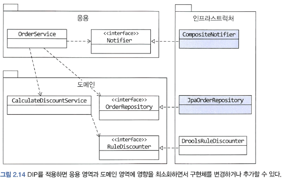
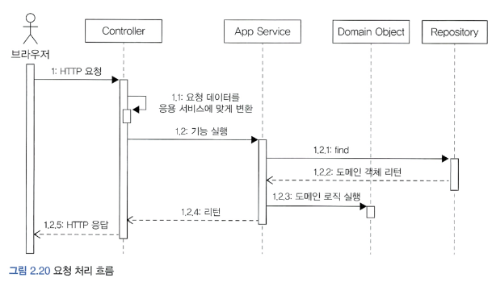
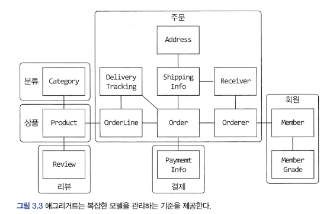
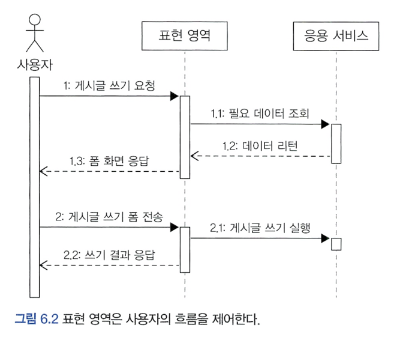
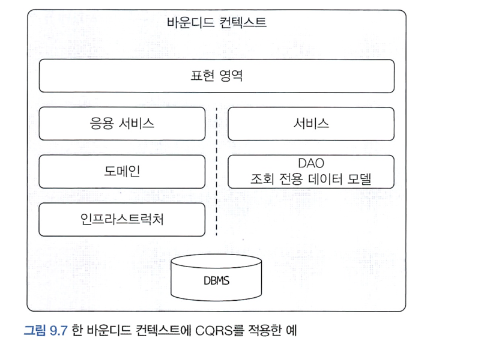
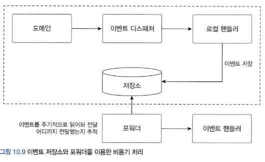

# DDD START - 최범균

최범균 저자님의 DDD START를 읽으면서 핵심 요약하며 공부한 내용입니다.

# 1. 도메인 모델 시작 

* 도메인 모델
* 엔티티와 벨류
* 도메인 용어

## 도메인
* 개발자 입장에서 소프트웨어로 해결하고자 하는 문제 영역 : `도메인`
    * ex: 온라인 서점 소프트웨어 온라인으로 책을 판매해야함
      * 필요한 기능 : 상품 조회, 구매, 결제, 배송, 추적 등의 기능 

* 도메인은 다시 하위 도메인으로 나눌 수 있다.

## 도메인 모델
* 도메인 모델에는 다양한 정의가 존재. 
* 기본적으로 도메인 모델은 특정 도메인을 개념적으로 표현한 것.
* 예를 들어 온라인 쇼핑몰에서의 주문
  * 상품을 몇 개 살지 선택하고 배송지 입력
  * 총 지불 금액을 계산하고 결제 수단 선택
  * 주문 뒤에도 배송 전이면 배송지 주소를 변경하거나 주문 취소 가능
  * 
    * Order는 주문번호와 지불할 총금액을 포함
    * 배송정보를 변경, 취소할 수 있는 기능 제공.
* 도메인 모델을 사용하면 여러 관계짜들이 동일한 모습으로 도메인을 이해하고 도메인 지식을 공유하는 데 도움이 된다.
* 도메인은 다수의 하위 도메인으로 구성된다.
  * 각 하위 도메인이 다루는 영역은 서로 다르기 때문에 같은 용어라도 하위 도메인마다 의미가 달라질 수 있다.
  * 도메인에 따라 용어의 의미가 결정되므로 여러 하위 도메인을 하나로 모델링 하면 안 된다. 

## 도메인 모델 패턴
* 일반적인 애플리케이션 아키텍처 구성
  * 
  * UI 또는 표현 계층 : 사용자의 요청을 처리하고 정보를 보여줌. 사용자는 SW를 사용하는 사람 뿐만 아니라 외부 시스템도 사용자가 될 수 있다(API?)
  * 응용 : 사용자가 요청한 기능을 실행한다. 업무 로직을 직접 구현하지 않으며 도메인 계층을 조합해서 기능을 실행한다.
  * 도메인 : 시스템이 제공할 도메인의 규칙을 구현
  * 인프라스트럭쳐: 데이터베이스나 메시징 시스템과 같은 외부시스템과의 연동 처리 

* 개념모델과 구현모델
  * 개념 모델은 순수하게 문제를 분석한 결과물이다.
  * 개념 모델은 데이터베이스,트랜잭션 처리, 성능, 구현 기술과 같은 것들을 고려하고 있찌 않기 때문에 실제 코드를 작성할 때 있는 그대로 사용할 수 없다.
  * 개념모델을 구현 가능한형태의 모델로 전환하는 과정을 거치게 된다
  * 처음부터 완벽한 개념 모델을 만들기보다는 전반적인 개요를 알 수 있는 수준으로 개념모델을 작성해야 한다.
  * 프로젝트 초기에는 개요 수준의 개념 모델로 도메인에 대한 전체 윤곽을 이해하는 데 집중하고, 구현하는 과정에서 개념 모델을 구현 모델로 점진적 발전 시켜야 한다.

## 도메인 모델 도출
기획, 유스케이스, 사용자 스토리와 같은 요구사항과 관련자와의 대화를통해 도메인을 이해하고 이를 바탕으로 도메인 모델 초안을 만들어야 비로소 코드를 작성할 수 있다.

도메인을 모델링할 때 기본이 되는 작업은 모델을 구성하는 핵심 구성요소, 규칙, 기능을 찾는것이다 

예제로 다음 요구사항을 보자 
* 최소 한 종류 이상의 상품을 주문해야 한다.
* 한 상품을 한 개 이상 주문할 수 있다.
* 총 주문 금액은 각 상품의 구매 가격 합을 모두 더한 금액이다.
* 각 상품의 구매 가격 합은 상품 가격에 구매 개수를 곱한 값이다. 
* 주문할 때 배송지 정보를 반드시 지정해야 한다.
* 배송지 정보는 받는 사람 이름, 전화번호, 주소로 구성된다.
* 출고를 하면 배송지 정보를 변경할 수 없다.
* 출고 전에 주문을 취소할 수 있다.
* 고객이 결제를 완료하기 전에는 상품을 준비하지 않는다.

* 이 요구사항에서 알 수 있는 것은 다음의 4가지 기능을 제공한다.
  * 주문은 출고 상태로 변경하기
  * 배송지 정보 변경하기
  * 주문 취소하기
  * 결제 완료로 변경하기
  

```java
public class Order {
    public void changeShipped() {};
    public void changeShippingInfo(ShippingInfo newShipping){};
    public void cancel() {};
    public void completePayment() {};
}
```

* 다음 요구사항은 주문 항목이 어떤 데이터로 구성되는지 알려준다.
  * 한 상품을 한 개 이상 주문할 수 있다.
  * 각 상품의 구매 가격 합은 상품 가격에 구매 개수를 곱한 값

* 두 요구사항에 따르면 주문 항목을 표현하는 OrderLine은 다음을 포함해야한다
  * 주문할 상품
  * 상품의 가격
  * 구매 개수
  * 각 구매 항목의 구매 가격

```java
public class OrderLine {
    private Proudct product; // 상품
    private int price;
    private int quantity;
    private int amounts;
    
    private int calculateAmounts() {
        return price * quantity;
    }
    
    public int getAmounts(){}
}
```

* 다음 요구사항은 Order(주문) OrderLine과의 관계를 알려준다.
  * 최소 한 종류 이상의 상품을 주문해야 한다.
  * 총 주문 금액은 각 상품의 구매 가격 합을 모두 더한 금액이다. 
* 한 종류 이상의 상품을 주문할 수 있으므로 Order는 최소 한 개 이상의 OrderLine을 포함해야 한다
* 이 요구사항 들을 Order에 다음과 같이 반영할 수 있다.
```java
public class Order {
    private List<OrderLine> orderLines;
    private int totalAmounts;
    
    private void setOrderLines(List<OrderLine> orderLines) {
        verifyAtLeastOneOrMoreOrderLines(orderLines);
        this.orderLines = orderLines;
        calculateTotalAmounts();
    }
    
    private void verifyAtLeastOneOrMoreOrderLines(List<OrderLine> orderLines) {
        if (orderLines == null || orderLines.isEmpy()) {
            throw new IllegalArgumentException("no OrderLine");
        }
    }
    
    private void calculateTotalAmounts() {
        this.totalAmounts = new Money(orderLines.stream()
                .mapToInt(x -> x.getAmounts().getValue())).sum();
    }
}
```

* Order는 한 개 이상의 OrderLine을 가질 수 있으므로 List<OrderLine>을 가진다.
* setOrderLines() 메서드는 요구사항에 정의한 제약 조건을 검사한다
  * 요구사항에 따르면 최소 한 종류 이상의 상품을 주문해야 하므로 검증 메소드를 통하여 1개 이상 존재하는지 검사. 

* 배송지 정보는 다음 요구사항에서 이름, 전화번호, 주소 데이터를 가지므로 다음과 같이 정의.
  * 배송지 정보는 받는 사람 이름, 전화번호, 주소로 구성된다.

```java
public class ShippingInfo {
    private STring receiverName;
    private String receiverPhoneNumber;
    private String shippingAddress1;
    private String shippingAddress2;
    private String shippingZipcode;
    
  ...
}
```
* 앞서 요구사항 중에 주문할 때 배송지 정보를 반드시 지정해야 한다 는 내용이 있으므로 Order 생성시 ShippingInfo도 같이 전달
```java
public class Order {
    private List<OrderLine> orderLines;
    private int totalAmounts;
    private ShippingInfo shippingInfo;
    
    public Order(List<OrderLine> orderLines, ShippingInfo shippingInfo) {
        setOrderLines(orderLines);
        setShippingInfo(shippingInfo);
    }
    
    private void setShippingInfo(ShippingInfo shippingInfo) {
        if (shippingInfo == null) 
            throw new IllegalArgumentException("no ShippingInfo");
        this.shippingInfo = shippingInfo;
    }
} 
```
* 이렇게 배송지 정보 필수 라는 도메인 규칙을 구현할 수 있다.

도메인을 구현하다 보면 특정 조건이나 상태에 따라 제약이나 규칙이 달리 적용되는 경우가 많다. 주문 요구사항의 경우에는 다음 내용이 해당된다.
* 출고를 하면 배송지 정보를 변경할 수 없다.
* 출고 전에 주문을 취소할 수 있다.

이 요구사항은 출고 상태가 되기 전과 후의 '제약사항'을 기술한 것.  
이 요구사항을 충족하려면 주문은(Order) 적어도 출고 상태를 표현할 수 있어야 한다.  
다음과 같이 열거 타입을 이용해서 상태 정보를 표현할 수 있다.
```java
public enum OrderState {
    PAYMENT_WAITING, PREPARING, SHIPPED, DELIVERING, DELIVERY_COMPLETED, CANCELED;
}
```

배송지 변경이나 주문 취소 기능은 출고 전에만 가능하다는 제약 규칙이 있으므로 제약규칙 메서드인 verifyNotYetShipped()를 구현하여 먼저 실행한다.

> 제약조건 메서드의 이름은 도메인을 더 잘 알게 될 때마다 변경될 수 있다. 
> 이름이 명확해짐으로써 제약조건을 보다 잘 명시할 수 있고 코드의 이해도 쉬워진다.

## 엔티티와 벨류

도출한 도메인 모델은 크게 `엔티티(Entitiy)`와 `벨류(Value)`로 구분할 수 있다.
* Value 타입은 우리말로 하면 `값` 이지만, 여러 의미로 사용할 수 있기 때문에 이책에선, Value는 `벨류`로 지정한다   

* 
  * 이 그림에는 엔티티도 존재하고 벨류도 존재한다. 

## 엔티티
엔티티의 가장 큰 특징은 식별자를 갖는것이다.
* 식별자는 엔티티 객체마다 고유해서 각 엔티티는 서로 다른 식별자를 갖는다 

> Order(주문) 도메인에서 각 주문은 주무번호를 갖는데 이 주문번호는 각 주문마다 다르므로 식별자가 된다.  
> 즉 앞서 주문 도메인 모델에서 주문에 해당하는 Order 클래스가 엔티티가 되며 주문 번호를 속성으로 갖게 된다 

* 주문에서 배송지 주소가 바뀌거나 상태가 바뀌더라도 주문번호가 바뀌지 않는 것처럼 엔티티의 식별자는 바뀌지 않는다.
* 엔티티를 생성하고 속성을 바꾸고 삭제할 때 까지 식별자는 유지된다.
* 엔티티의 식별자는 바뀌지 않고 고유하기 때문에 두 엔티티 객체의 식별자가 같으면 두 엔티티는 같다고 판단할 수 있다. 
  * 따라서 식별자를 이용해서 equals()메서드와 hashCode()메서드를 구현할수 있다. 

```java
public class Order {
    private String orderNumber;
    
    @Override
    public boolean equals(Object obj) {
        if (this == obj) return true;
        if (obj == null) return false;
        if (obj.getClass() != Order.class) return false;
        Order otherOrder = (Order)obj;
        if (this.orderNumber == null) return false;
        return this.orderNumber.equals(otherOrder.orderNumber);
    }
    
    @Override
    public int hashCode() {
        final int prime = 31;
        int result = 1;
        result = prime * result + ((OrderNumber == null) ? 0 : orderNumber.hashCode());
        return result;
    }
}
```

## 엔티티의 식별자 생성 방법
1. 특정 규칙에 따라 생성
2. UUID 사용
3. 값을 직접 입력
4. 일련번호 사용(시퀀스(Seq))나 DB 자동 증가 컬럼(Auto Increment)사용

* ### 흔히 사용하는 규칙은 현재 시간과 다른 값을 함께 조합하는것.
  * ex) '2015052909644024919' 
    * 20150529094644 는 2015년 5월 29일 09시 46분 44초 의미 
    * 그 뒤는 다른 값 

* UUID 생성 API를 사용하여 생성. 자바의 경우 java.util.UUID 클래스 사용
```java
UUID uuid = UUID.randomUUID();  
```
* UUID의 자세한 내용은 https://goo.gl/7njkf3 문서 참고 

* ### 회원의 아이디나 이메일과 같은 식별자는 값을 직접 입력
  * 사용자가 직접 입력하는 값이기 때문에 중복해서 입력하지 않도록 사전에 방지하는 것이 중요 

* ### 일련번호 방식은 DB가 제공하는 자동 증가 기능 사용 (auto_increment 칼럼)
  * 자동 증가 컬럼은 DB 테이블에 데이터를 삽입해야 비로소 값을 알 수 있기 때문에 데이터를 추가하기 전에는 식별자를 알 수 없다.


## 벨류타입
위 예제의 ShippingInfo 클래스는 받는 사람과 주소에 대한 데이터를 갖고 있다.

```java
public class ShippingInfo {
    private String receiverName;        // 받는 사람
    private String receiverPhoneNumber; // 받는 사람
  
    private String shippingAddress1;    // 주소
    private String shippingAddress2;    // 주소
    private String shippingZipcode;     // 주소
    
...
}
```
receiverName 필드와 receiverPhoneNumber 필드는 서로 다른 두 데이터를 담고 있지만, 두 필드는 개념적으로는 받는 사람을 의미한다.  
즉 두 필드는 실제로 한 개의 개념을 표현하고 있다. 비슷하게 아래 세 컬럼은 주소라는 하나의 개념을 표현한다.  
벨류타입은 `개념적으로 완전한 하나를 표현할 때 사용한다.`  
* 예를 들어 받는 사람을 위한 밸류 타입인 Receiver와 주소인 Address를 다음과 같이 작성 가능하다.
```java
public class Receiver {
    private String name;
    private String phoneNumber;
}

public class Address {
    private String shippingAddress1;    // 주소
    private String shippingAddress2;    // 주소
    private String shippingZipcode;     // 주소
}
```

* 이 벨류 타입을 다시 ShippingInfo 클래스를 구현해 보면
```java
public class ShippingInfo {
    private Receiver receiver;
    private Address address;
}
```

* 이러면 보다 명확하게 판단할 수 있다.
  * 배송 정보가 받는 사람과 주소로 구성된다는 것을 쉽게 알 수 있다. 

* 벨류 타입이 꼭 두 개 이상의 데이터(필드)를 가져야 하는것은 아니다. 의미를 명확하게 표현하기 위해 밸류 타입을 사용하는 경우도 있다

```java
public class Money {
    private int value;
    
    public Money add(Money money) {
        return new Money(this.value + money.value);
    }
    
    public Money multiply(int multiplier) {
        return new Money(value * multiplier);
    }
}

public class OrderLine {
    private Product product;
    private Money price;
    private int quantity;
    private Money amounts;
    
    public OrderLine(Product product, Money price, int quantity) {
        this.product = product;
        // money가 불변객체가 아니라면 price 파라미터가 변경될 떄 발생하는 문제를 방지하기 위해 데이터를 복사한 새로운 객체를 생성해야 한다. 
        this.price = new Money(price.getValue());
      ....
    }
}
```
* 이러면 Money 타입 덕에 price나 amounts가 금액을 의미한다는 것을 쉽게 알 수 있다. 
* 벨류 타입을 사용할 때의 다른 장점은 벨류 타입을 위한 기능을 추가할 수 있다. (add(), multiply())
  * Money를 사용하는 코드는 이제 '정수타입 연산'이 아닌 `돈 계산` 이라는 의미로 코드를 작성할 수 있다. 
  * 코드의 가독성 향상! 
* `벨류 객체의 데이터를 변경할 때는 기존 데이터를 변경하기 보다는 변경한 데이터를 갖는 새로운 벨류 객체를 생성하는 방식을 선호한다. (new!!!)`
  * 이 데이터 변경 기능을 제공하지 않는 타입을 불변(immutable) 이라고 표현 한다.
  * 불변 타입을 사용하면 보다 안전한 코드를 작성할 수 있기 때문. (setter 남발 방지하여 값을 0으로 변하게 하는 등을 방지. )

> 불변 객체는 참조 투명성과 스레드에 안전한 특징을 갖고 있다. https://goo.gl/2Lo4pU 문서 참고 

## 엔티티 식별자와 밸류 타입 

* 엔티티 식별자가 String 같은 문자열로 구성된 경우 특별한 의미를 가지는 경우가 많다.
* 이때 밸류 타입을 사용해서 의미가 잘 들어나게 할 수도 있다.
  * Order에서 String 대신 OrderNo 밸류타입 
 
## `도메인 모델에 setter 메서드 넣지 않기!`

* 도메인의 핵심 개념이나 의도를 코드에서 사라지게 한다.
* 단순히 set이라는 필드값만 변경하고 끝나기 때문에 상태 변경과 관련된 도메인 지식이 코드에서 사라지게 된다. 
* 도메인 객체가 불완전한 상태로 사용되는 것을 막으려면 생성자를 통해 필요한 데이터를 모두 받아줘야 한다.
  * 생성자를 호출하는 시점에 필요한 데이터가 올바른지 검사할 수 있다. 
```java
public class Order {
    public Order(Orderer orderer, List<OrderLine> orderLines, ShippingInfo shippingInfo, OrderState state) {
        setOrderer(orderer); // 생성 시점에 검사
        setOrderLines(orderLines);
    }
    
    private void setOrderer(Orderer orderer) {
        if (orderer == null ) throw new IllegalArgumentException("no orderer");
        this.orderer = orderer;
    }

   private void setOrderLines(List<OrderLine> orderLines) {
        verifyAtLeastOneOrMoreOrderLines(orderLines);
        this.orderLines = orderLines;
        calculateTotalAmounts();
   }
 
   private void verifyAtLeastOneOrMoreOrderLines(List<OrderLine> orderLines) {
        if (orderLines == null || orderLines.isEmpty()) {
          throw new IllegalArgumentException("no OrderLine");
        }
   }
 
   private void calculateTotalAmounts() {
        this.totalAmounts = new Money(orderLines.stream()
               .mapToInt(x -> x.getAmounts().getValue()).sum());
   }
}
```

# 아키텍처 
* 표현, 응용, 도인, 인프라스트럭쳐는 아키텍처의 4가지 영역 .
### 표현, 응용 영역
* 
### 응용, 도메인영역
* 
* 도메인의 로직 구현은 도메인 모델에 위임하자! 
### 인프라 스트럭쳐 영역
* 
* 이 영역은 DBMS 연동 처리, 메시징 큐에 메시지를 전송하거나 수신하는 기능 구현, SMTP 이용한 메일 발송, REST API 호출 처리. 
* 논리적인 개념을 표현하기 보다는 실제 구현을 다룬다. 

## 계층 구조 아키텍처 
* 계층 구조는 그 특성상 상위 계층에서 하위 계층으로의 의존만 존재하고, 하위 계층은 상위 계층에 의존하지 않는다. 

## DIP (의존성 역전 원칙)

* 
* 고수준 모듈 : 의미있는 단일 기능을 제공하는 모듈
* 저수준 모듈 : 하위 기능을 실제로 구현한 것.
* 그러나 고수준 모듈이 저수준 모듈을 사용하면 구현 변경과 테스트가 어렵다. 
  * 저수준 모듈이 고수준 모듈에 의존하도록 바꾸면 이 문제를 해결가능. 
  * 인터페이스 추상화. 


* 인프라스트럭쳐 영역 - 다음은 할인 금액을 계산하기 위해 Drools라는 룰 엔진을 사용해서 계산 로직을 수행하는 코드 
```java
public class DroolsRuleEngine {
  private KieContainer kContainer;

  public DroolsRuleEngineO {
    KieServices ks = KieServices.Factory.getO;
    kContainer = ks.getKieClasspathContainerO;
  }

  public void evalute(String sessionName^, List<?> facts) {
    KieSession kSession = kContainer.newKieSession(sessionName);
    try {
      facts.forEach(x -> kSession.insert(x));
      kSession.fireAllRulesO;
    } finally {
      kSession.disposeO;
    }
  }
}
```

* 응용 영역 - 인프라 영역의 DroolsRuleEngine 사용
```java
public class CalculateDiscountService {
  private DroolsRuleEngine ruleEngine;

  public CalculateDiscountServiceO {
    ruleEngine = new DroolsRuleEngine();
  }

  public Money calculateDiscount(List<OrderLine> orderliness, String customerld) {
    Customer customer = findCustomer(customerld);
    
    MutableMoney money = new MutableMoney(0);           // Drools에 특화된 코드 : 연산 결과를 받기 위해 추가한 타입
    List<?> facts = Arrays.asList(customers, money);    // Drools에 특화된 코드 : 룰에 필요한 데이터
    facts.addAll(orderLines);
    ruleEngine.evalute("discountCalculation", facts);   // Drools에 특화된 코드 : Drools의 세션 이름 
    return money.toImmutableMoneyQ;

  }
}
```
이코드의 2가지 문제.
* CalculateDiscountService만 테스트 하기 어렵다. RuleEngine이 완벽하게 동작해야 테스트 가능 

### 인터페이스 추상화
```java
public interface RuleDiscounter {
    Money applyRules(Customer customer, List<OrderLine> orderLines);
}

public class CalculateDiscountService {
    private RuleDiscounter ruleDiscounter;
    
    public CalculateDiscountService(RuleDiscounter ruleDiscounter) {
        this.ruleDiscounter = ruleDiscounter;
    }
    
    public Money calculateDiscount(List<OrderLine> orderLines, String customerId) {
        Customer customer = findCustomer(customerId);
        return ruleDiscounter.applyRules(customer, orderLines);
    }
}

public class DroolsRuleDiscounter implements RuleDiscounter {
  
    private KieContainer kContainer;

    public DroolsRuleEngineO{
      KieServices ks = KieServices.Factory.getO;
      kContainer = ks.getKieClasspathContainerOj
    }
    
    @Override
    public Money applyRules(Customer customer, List<OrderLine> orderLines) {
    KieSession kSession = kContainer.newKieSession("discountSession");
        try {
          ...코드 생략
          kSession.fireAllRules;
        } finally {
          kSession.disposeO;
        }
        return money.toImmutableMoneyO;
    }
    
}

```
* 
* 더이상 CalculateDiscountService는 Drools에 의존하지 않게된다. 
  * 저수준 모듈이 고수준 모듈에 의존하게 되어 DIP(의존성 역전 원칙) 이라고 한다.
  * 교체가 가능하고 테스트가 쉬워진다. 
  * 구현 기술(RuleDiscounter)를 변경 해도 CalculateDiscountService를 수정할 필요 없다
  * ```java
    RuleDiscounter ruleDiscounter = new SimpleRuleDiscounter(); // 다른 저수준 구현 객체. 교체
    CalculateDiscounterService disService = new CalculateDiscounterService(ruleDiscounter); // 구현 객체(RuleDiscounter)를 생성하는 코드만 변경 
    ```

## DIP 주의사항
* DIP를 잘못 생각하면 단순히 인터페이스와 구현 클래스를 분리하는 정도로 받아들일 수 있다. 
* 
* 하위 기능을 추상화한 인터페이스는 저수준 모듈이 아니고 고수준 모듈에 위치한다. 
* 

---
* 
* 인프라스트럭처에 위치한 클래스가 도메인이나 응용 영역에 정의한 인터페이스를 상속받아 구현하는 구조가 되면, 도메인과 응용영역에 영향을 주지 않거나 최소화 하면서 구현 기술을 변경하는 것이 가능하다. 
  * Notifier인터페이스를 상속받는 클래스는 주문 시 SMS를 추가해야 한다는 요구 사항이 들어왔을 때 응용 영역의 OrderService는 변경할 필요가 없다.
    * 구현 클래스를 인프라 영역에 추가하면 된다. 
  * 비슷하게 Mybatis 대신 JPA를 사용하고 싶다면 OrderRepository구현체를 인프라스트럭쳐 영역에 추가하면 된다.  
* 

## 도메인 영역의 주요 구성요소
  
|요소|설명|
|---|---|
|엔티티(Entity)| 고유의 식별자를 갖는 객체. 주문, 회원, 상품 등 도메인의 고유한 개념. 도메인 모델의 데이터와 관련된 기능을 함께 제공|
|밸류(Value)| 고유의 식별자를 갖지 않는 객체. 주로 '개념적'으로 하나인 값을 표현할때 사용. 주소, 금액 등|
|애그리거트(Aggregate|연관된 엔티티와 벨류 객체를 하나로 묶은것. Order 엔티티, OrderLine 벨류 를 '주문' 애그리거트로 묶을 수 있다.|
|레포지토리(Repository)| 도메인 모델의 영속성 처리. DBMS 테이블에서 엔티티 객체를 로딩하거나 저장 하는 기능 제공. |
|도메인 서비스(Domain Service)| 특정 엔티티에 속하지 않은 도메인 로직을 제공. '할인 금액 계산'은 상품, 쿠폰, 회원 등급, 구매금액 등 여러 도메인을 이용해서 구현하는데, 도메인 로직이 여러 엔티티와 밸류를 필요로하면 도메인 서비스에서 로직을 구현한다.|

## 엔티티와 밸류
* 도메인 모델의 엔티티와 DB모델의 엔티티는 같지 않다.
* 두 모델의 가장 큰 차이점은 도메인 모델의 엔티티는 데이터와 함께 기능(도메인 기능)을 제공.
* 도메인 모델의 엔티티는 단순히 데이터를 담고 있는 데이터 구조라기 보다는 데이터와 함께 기능을 제공하는 객체 
  * 도메인 관점에서 기능을 구현하고 캡슐화해서 데이터가 임의로 변경되는 것을 막아야한다! 
* 도메인 모델의 엔티티는 벨류타입을 이용해서 표현할 수 있지만 DB모델의 엔티티는 표현하기 불편하다. 
* 
  * 왼쪽 그림처럼 Orderer의 개별 데이터를 저장하거나 오른쪽 그림처럼 별도 테이블로 분리해서 저장해야함. 
  * 왼쪽 테이블의 경우 ORDERER의 개념이 드러나지 않고 주문자의 개별 데이터만 드러난다. 
  * 오른쪽 테이블의 경우 주문자 데이터를 별도 테이블에 저장했지만 엔티티에 까까우며 밸류 타입의 의미가 드러나지는 않는다. 

* `밸류는 불변으로 구현할 것을 권장! ` -> 엔티티의 밸류 타입 데이터 변경시 객체 자체를 완전히 교체 (new)!!!

## 애그리거트 
* 연관된 엔티티와 벨류 객체를 하나로 묶은것.
* 
* 대표적인 예 : 주문 
  * 주문, 배송지정보, 주문자, 주문 목록, 총 겸제금액 의 하위모델로 구성 

* 루트 엔티티는 애그리거트 내의서의 루트라고 생각하면 된다
  * 애그리거트 루트가 제공하는 기능을 실행하고 간접적으로 애그리거트 내의 다른 엔티티나 밸류 객체에 접근한다. 
  * 


## 레포지토리(리포지터리)
* 도메인 객체를 보관하고 사용하기 위한 모델 (RDBMS, NoSQL, 로컬 파일같은 물리적인 저장소 )
* 엔티티가 밸류나 요구사항에서 도출되는 도메인 모델이라면 레포지토리는 구현을 위한 도메인 모델 
* 도메인 모델을 사용해야 하는 코드는 레포지토리를 통해서 도메인 객체를 구한 뒤에 도메인 객체의 기능을 실행
  * 예를 들어 주문 취소 기능을 제공하는 응용 서비스는 레포지토리를 이용해서 객체를 구하여 해당 기능 실행. 
```java
public class CancelOrderSerivce {
    private OrderRepository orderRepository;
    
    public void cancel(OrderNumber number) {
        Order order = orderRepository.findByNumber(number);
        if (order == null) throw new NoOrderException(number);
        order.cancel();
    }
}
```
* 레포지토리는 도매인 객체를 영속화 하는데 필요한 기능을 추상화한 것으로 고수준 모듈에 속한다. 
* 레포지토리를 구현한 클래스는 저수준 모듈로 인프라 영역에 속한다. 
* 
  * 응용 서비스와 레포지토리는 밀접한 연관이 있따. 
    * 응용 서비스는 필요한 도메인 객체를 구하거나 저장할 때 레포지토를 사용
    * 응용 서비스는 트랜잭션을 관리하는데, 트랜잭션 처리는 레포지토리 구현 기술의 영향을 받는다. 

# 요청 처리 흐름
* 표현 영역은 사용자가 전송한 데이터 형식이 올바른지 검사하고 문제가 없다면 데이터를 이용해서 응용서비스에 기능 실행을 위임. 
* 
* '예매하기' 나'예매 취소' 같은 기능의 서비스는 도메인의 상태를 변경하므로 변경 상태가 물리 저장소에 올바르게 반영되도록 `트랜잭션 관리 필요`
  * 스프링 에서의 @Transactional 애노테이션 같이.

# 인프라 스트럭처 개요
* 인프라는 표현 영역, 응용 영역, 도메인 영역을 지원한다. 
* 도메인 객체의 영속성 처리, 트랜잭션, SMTP, REST 클라이언트 등 다른 영역에서 필요로 하는 프레임워크, 구현 기술, 보조 기능을 지원한다. 
* DIP에서 언급한 것 처럼 도메인 영역과 응용 영역에서 인프라스트럭처의 기능을 직접 사용하는 것 보다 두 영역(도메인, 응용)에 정의한 인터페이스를 인프라영역에서 구현 하는것이 더 유연하고 테스트하기 쉽다. 


## 모듈 구성 
* 패키지 구성 규칙에 정답이 존재하는 것은 아니다.
* 도메인이 크면 하위 도메인으로 나누고 각 하위 도메인마다 별도 패키지를 구성한다. 
  * 

* 도메인 모듈은 도메인에 속한 애그리거트를 기준으로 다시 패키지를 구성한다. 
* 예를들어 카탈로그 하위 도메인이 상품 애그리거트 + 카테고리 애그리거트로 구성될 경우 두 개의 하위 패키지로 구성 
  * 

* 도메인이 복잡하면 도메인 모델과 도메인 서비스를 별도 패키지에 위치해도 된다. 

# 애그리거트

* 백 개 이상의 테이블을 한 장의 ERD에 모두 표시하면 개별 테이블 간의 관계를 파악하느냐 데이터 구조를 이해하는데 어려움을 겪게 된다. 
  * 도메인 요소간의 관계를 파악하기 어렵다는 것은 코드를 변경하고 확장하는 것이 어려워 진다. 

* 복잡한 도메인을 관리하기 쉽게 만들라면 애그리거트로 묶어서 바라보면 파악하기 쉽다. 

* 

* 애그리거트는 경계를 갖는다. 
* 한 애그리거트에 속한 객체는 다른 애그리거트에 속하지 안흔ㄴ다. 
* 애그리거트는 자기 자신은 관리하지만, 다른 애그리거트를 관리하지 않는다.
  * 주문 애그리거트는 배송지를 변경하거나 주문 상품 개수를 변경하지만 주문 애그리거트에서 회원의 정보나 상품의 가격을 변경하지는 않는다. 

* A가 B를 갖는다 로 설계 할 수 있는 요구사항이 있어도 반드시 A와 B가 한 애그리거트에 속하진 않는다.
* 좋은 예로, 상품과 리뷰가 있다.
  * 상품과 리뷰는 함께 생성되지 않고, 함께 변경되지도 않는다. 
  * 상품을 변경하는 주체가 상품 담당자라면 리뷰를 생성하고 변경하는 주체는 고객이다. 
  * 리뷰의 변경이 상품에 영향을 주지 않고, 상품의 변경이 리뷰에 영향을 주지 않는다. 
  * 이 경우 서로 다른 애그리거트 이다. 

* 다수의 애그리거트가 한 개의 엔티티 객체만 갖는 경우가 많았으며, 두 개 이상의 엔티티로 구성되는 애그리거트는 드물었다 라고 한다.


## 애그리거트 루트
* 애그리거트는 여러 객체로 구성되기 때문에 한 객체만 상태가 정상이면 안 된다. 

#### ex 주문 애그리거트
* 총 금액인 totalAmounts를 갖고있는 Order 엔티티
* 개별 구매 상품의 개수인 quantity와 금액인 price를 갖고 잇는 OrderLine 밸류
* 구매한 상품의 개수를 변경하면 한 OrderLine의 qunatity(개수)를 변경하고 더불어 Order의 totalAmounts도 변경해야 한다. 그렇지 않으면 데이터 일관성이 깨진다.
* 

* 불필요한 중복을 피하고 애그리거트 루트 도메인을 통해서만 도메인 로직을 구현하게 만들어야 한다.
* set 같은 메서드로 직접 정보를 변경할 경우 규칙을 무시하고 직접 DB 테이블의 데이터를 수정하는 것과 같은 결과가 나온다. 
  * 논리적인 데이터 일관성이 깨지게 된다. 
1. 단순히 필드를 변경하는 set 메서드를 공개(public) 범위로 만들지 않는다.
   * 도메인의 의미나 의도를 표현하지 못하고 로직을 도메인 객체가 아닌 응용, 표현 영윽올 분산 시킨다. 
   * set 대신 cancel이나 changePassword 처럼 의미가 더 잘드러나는 이름을 사용하자. 
2. 밸류타입은 불변(immutable)로 만든다
   * 밸류 객체의 값을 변경할 수 없으면 애그리거트 루트에서 밸류 객체를 구해도 애그리거트 외부에서 밸류 객체의 상태를 변경할 수 없다. 
   * ```java
     ShippingInfo si = order.getShippingInfo();
     si.setAddress(newAddres); // ShippingInfo가 불변객체면 이 코드는 컴파일 에러 
     ```
   * 애그리거트 외부에서 내부 상태를 함부로 바꾸지 못하므로 일관성이 깨질 가능성이 줄어든다. 
   * 밸류 객체가 불변이면 밸류 객체의 값을 변경하는 방법은 새로윤 밸류 객체를 할당하는 것뿐.
```java
public class Order { 
    private ShippingInfo shippingInfo;
    
    public void changeShippingInfo(ShippingInfo newShippingInfo) {
        verifyNotYetShipped();
        setShippingInfo(newShippingInfo);
    }
    
    // set 메서드를 허용 범위를 private으로.
    private void setShippingInfo(ShippingInfo newShippingInfo) {
        // 밸류가 불변이면 새로운 객체를 할당해서 값을 변경.
        // 불변이므로 this.shippingInfo.setAddress(newShippingInfo.getAddress())와 같은 코드 사용 불가.
        this.shippingInfo = newShippingInfo;
    }
}
```

## 트랜잭션 범위
* 트랜잭션 범위는 작을수록 좋다. 한 트랜잭션이 한 개 테이블 수정하는 것과 세 개의 테이블을 수정하는 것을 비교하면 성능차이가 발생한다. 
* 한 개 테이블을 수정하면 잠그는 대상은 한 테이블 이지만, 세 테이블을 수정하면 잠금 대상이 더많아진다. 그만큼 처리할 수 있는 트랜잭션 개수가 줄어들고 성능을 떨어뜨린다.
* 동일하게 한 트랜잭션에서는 한 개의 애그리거트만 수정해야 한다. 
  * 한 테이블이란 뜻이 아니고, 한 애그리거트에서 다른 애거리트를 수정하지 않는다.
  * 애그리거트 내부에서 다른 애그리거트의 상태를 변경하는 기능을 실행하면 안된다.
    * 예를 들어 배송지 정보를 변경하면서 동시에 배송지 정보를 회원의 주소로 설정하는 기능이 있는데, 이 때 주문 애그리거트는 회원 애그리거트의 정보를 변경하면 안된다. 
  * 부득이하게 한 트랜잭션으로 두 개 이상의 애그리거트를 수정해야 한다면, 응용 서비스에서 두 애그리거트를 수정하도록 구현한다. 
    * 애그리거트 끼리는 직접적으로 수정하지말고. 
```java
public class ChangeOrderService {
    // 두 개 이상의 애그리거트를 변경해야 하면 응용 서비스에서 각 애그리거트의 상태를 변경한다. 
  @Transactional
  public void changeShippingInfo(OrderId id, ShippingInfo newShippingInfo, boolean useNewShippingAddrAsMemberAddr) {
      Order order = orderRepository.findById(id);
      
      if (order == null) throw new OrderNotFoundException();
      
      order.shipTo(newShippingInfo);
      
      if (useNewShippingAddrAsMemberAddr) {
          Member member = findMember(order.getOrderer());
          member.changeAddress(newShippingInfo.getAddress());
      }
  }
}
```
* 도메인이벤트를 사용하면 동기나 비동기로 다른 애그리거트의 상태를 변경하는 코드를 작성할 수 있다. 

## 레포지터리와 애그리거트 

* 애그리거트는 개념상 한 개의 도메인 모델을 표현하므로 객체의 영속성을 처리하는 레포지토리는 애그리거트 단위로 존재. 
  * 엔티티와 엔티티내의 밸류를 물리적으로 각각 별도의 DB에 저장한다고 해서 각각 레포지토리를 만들지 않는다. 

* 애그리거트의 상태가 변경되면 모든 변경을 원자적으로 저장소에 반영해야한다.
  * 애그리거트에서 두 개의 객체를 변경했는데 저장소에는 한 객체에 대한 변경만 반영되면 데이터 일관성이 깨지므로 문제가 된다. 

## ID를 이용한 애그리거트 참조 
```java
public class Order {
    private Orderer orderer;
  ...
}

public class Orderer {
    private Member member;
    private String name;
}
```
* 애그리거트 루트(엔티티)에 의한 직접 참조 
> order.getOrderer().getMember().getId()


* 애그리거트에서 다른 애그리거트를 참조하는것은 편리하지만 다음 문제를 일으킬 수 있다.
  * 편한 탐색 '오용'
  * 성능 문제
  * 확장 어려움 
* 다른 애그리거트 객체에 접근하여 상태를 쉽게 변경할 수 있게 되면 트랜잭션 범위에 벗어날 수 있다. 
* 지연 로딩(lazy) 즉시 로딩(eager) 의 쿼리 전략을 고민해야 한다. 

```java
public class Order {
    private Orderer orderer;
  ...
}

public class Orderer {
    private MemberId memberId; // 밸류타입이거나 Id(or Seq) 값 
    private String name;
}
```
* ID에 의한 직접 참조 
* 애그리거트의 경계를 명확히 하고 애그리거트 간 물리적인 연결을 제거해준다. 
  * 모델의 복잡도를 낮춰주고 의존을 제거하므로 응집도를 높혀준다 
  * 지연로딩의 효과!
* 중요한 데이터는 RDBMS에 저장하고 조회 성능이 중요한 애그리거트는 NoSQL에 나눠 저장할 수 있다. 

```java
Member member = memberRepository.findByld(ordererld)
List<Order> orders = orderRepository.findByOrderer(ordererId);
List<OrderView> dtos = orders.streamO
    .map(order ->{
        Productid prodid = order.getOrderLines().get(0).getProductId();
        // 각 주문마다 첫 번째 주문 상품 정보 로딩 위한 쿼리 실행 
        Product product = productRepository.findById(prodId);
        return new OrderView(order, member, product);
}).collect(toList());
```
* 코드 : N+1 문제.
* 주문 개수가 10개면 주문을 읽어오기 위한 1번의 쿼리와 주문별로 각 상품을 읽어오기 위한 10번의 쿼리 실행 
> 조회 대상이 N개일 때 N개를 읽어오는 한 번의 쿼리와 연관된 데이터를 읽어오는 쿼리를 N번 실행하는 문제 
* 지연 로딩과 관련된 대표적인 문제
  * `엄청난 성능 하락의 원인`

### 이 문제를 발생하지 않도록 하려면 조인을 사용해야 한다. 
* ID 참조가 아닌 객체(엔티티) 참조 방식으로 바꾸고 즉시 로딩을 사용하는것 
* ID 참조 방식을 사용하려면 별도의 조회 전용 쿼리를 만들어 한번의 쿼리로 필요한 데이터를 로딩하면 된다. 

```java
^Repository
public class JpaOrderViewDao implements OrderViewDao {
  @PersistenceContext
  private EntityManager em;

  @Override
  public List<DrderView> selectByOrderer(String ordererld) {
    String selectQuery =
            "select new com.myshop.order.application.dtp.OrderView(Oj m, p)" +
                    "from Order o join o.orderLines ol. Member m. Product p " +
                    "where o.orderer.memberld.id = :ordererld " +
                    "and o.orderer.memberld = m.id " +
                    "and index(ol) = 0 " +
                    "and ol.productid = p.id " +
                    "order by o.number.number desc";
    TypedQuery<DrderView > query =
            em.createQuery(selectQuery, OrderView.class);
    query.setParameterC 'ordererld", ordererld);
    return query.getResultListO;
  }
}
```

## 애그리거트간 집합 연관 관계(1:N관계 M:N 관계)

### 1-N 예제
* 특정 카테고리에 속한 상품 목록
```java
public class Category {
    private Set<Prodcut> products;
    
    public List<Product> getProducts(int page, int size) {
        List<Product> sortedProducts = sortById(products);
        return sortedProducts.subList((page - 1) * size, page * size);
    }
}
```
* 이 코드는 Category에 속한 모든 Products를 조회하게 되어 성능에 심각한 문제를 야기한다. 
* 카테고리에 속한 상품을 구할려면 `상품 입장에서 자신이 속한 카테고리를 N-1로 연관 지어 구하면 된다.`
```java
public class Product {
    private CategoryId categoryId;
  ...
}

public class ProductListService {
    public Page<Product> getProductOfCategory(Long categoryId, int page, intsize) {
        Category category = categoryRepository.findById(categoryId);
        checkCategory(category);
        
        List<Product> products = productRepository.findByCategoryId(category.getId(), page, size);
        
        int totalCount = productRepository.contsByCategoryId(category.getId());
        return new Page(page, size, totalCount, products);
    }
}
```

### M-N 예제
* RDBMS를 이용해서 M-N(다대 다)관계를 구현하려면 조인 테이블을 사용한다. 
* ex ) JPA 매핑 사용
```java
@Entity
@Table(name = "product")
public class Product {
    @EmbeddedId
    private ProductId id;
    
    @ElementCollection
    @CollectionTable(name = "product_category", joinColumns = @JoinColumn(name = "product_id"))
    private Set<CategoryId> categoryIds;
}ㅐㅏㅔㅕㅓ  1ㅂ2ㅂ3ㄷ4ㄱ재ㅐㅓㅕㅜ!@interface 
```
> 목록이나 상세 화면과 같은 조회 기능은 조회 전용 모델을 이용해서 구현하는 것이 좋다. 

* 한 애그리거트가 다른 애그리거트를 생성해야 하는 구조라면, 팩토리로 사용하거나 팩토리 메서드를 이용하여 애그리거트 내에서 생성하자. 

# 레포지토리와 모델 구현 

* 보통 레포지토리 인터페이스는 domain 패키지에, 구현한 클래스는 infra 패키지에 둔다. 
* 팀 표준에 따라 domain과 같은 패키지에 위치시킬 수도 있다. 
  * 가능하면 레포지토리 구현 클래스는 인프라 영역에 위치 시켜서 인프라에 대한 의존을 낮춰야 한다. 

## 스프링 데이터 JPA를 이용한 레포지토리 구현
* 다음과 같이 선언
```java
public interface OrderRepository extends Repository<Order, OrderNo> { // <엔티티, PK>
    Optional<Order> findById(OrderNo id);
  ...
}
```

* 식별자를 이용해서 엔티티 조회시 findById() 메서드 사용.
* 저장 메서드는 void save(Entity) or Entity save(Entity)
* 삭제시에는 void delete(Entity entity), void deleteById(pk id);

## 매핑 구현 

* 루트 엔티티는 @Entity로 매핑
* 한 테이블에 엔티티와 밸류 데이터가 같이 있다면
  * 밸류는 @Embeddable로 (클래스 상단)
  * 밸류 타입 프로퍼티는 @Embedded (필드)

* 밸류 타입 컬럼 이름을 변경하기 위해선 @AttributeOverride 어노테이션 사용 
```java
@Embeddable
public class Orderer { // 밸류타입
    @Embdded
    @AttributeOverrides(
        @AttributeOverride(name = "id", column = @Column(name = "orderer_id"))
    )
    private MemberId memberId;
}

@Embeddable
public class ShippingInfo { // 밸류타입

  @Embdded
  @AttributeOverrides({
          @AttributeOverride(name = "zipCode", column = @Column(name = "shipping_zipcode")),
          @AttributeOverride(name = "address1", column = @Column(name = "shipping_addr1")),
          @AttributeOverride(name = "address2", column = @Column(name = "shipping_addr2"))
  })
  private Address address;
}
```

* 클래스가 불변 타입이면 기본 생성자를 추가할 필요가 없지만, JPA에서 @Entity와 @Embeddable로 클래스를 매핑하려면 기본 생성자를 제공해야 한다. 

## 필드 접근 방식

```java
@Entity
@Access(AccessType.PROPERTY)
public class Order {
  @Column(name = "state")
  @Enumerated(EnumType.STRING)
  public OrderState getState() {
    return state;
  }

  public void setState(OrderState state) {
    this.state = state;
  }
  ...
}
// 위 방식 말고 아래 방식 으로
@Entity
@Access(AccessType.FIELD) // 필드 접근 
public class Order {
}
```

* set 메서드 대신 의도가 잘 드러나는 기능(메서드)을 제공해야 하므로 AccessType을 FIELD로 한다.  
> 하이버네이트는 @Access를 이용해서 명시적으로 접근 방식을 지정하지 않으면 @Id나 @EmbeddedId가 어디에 위치했느냐에 따라 접근방식을 결정한다.   
> @Id나 @EmbeddedId가 필드에 위치하면 필드 접근 방식을 선택하고 get 메서드에 위치하면 메서드 접근 방식을 선택한다. 


## attributeConverter를 이용한 밸류 매핑 처리 

* 두 개 이상의 프로퍼티를 갖고 있는 밸류 타입의 프로퍼티를 한 컬럼에 매핑하고 싶다면 `AttributeConverter` 사용 
```java
public interface AttributeConverter<X,Y> {
    public Y convertToDatabaseColumn(X attribute); // X to Y. 밸류타입을 DB칼럼값으로 
    
    public X convertToEntityAttribute(Y dbData);// DB칼럼값을 밸류로 변환
}
```

* X는 밸류 타입
* Y는 DB 타입

* ex) Money 밸류 타입을 위한 AttributeConverter
```java
@Converter(autoApply = true)
public class MoneyConverter implements AttributeConverter<Money, Integer>{
    @Override
    public Integer convertToDatabaseColumn(Money money){
        return money==null ?null: money.getValueQ;
    }
    
    @Override
    public Honey convertToEntityAttribute(Integer value){
        return value==null? null: new Money(value);
    }
}

@Entity
@Table(name = "purchase_order")
public class Order {
  @Column(narne = "total_amounts")
  // @Convert(converter = MoneyConverter.class) // autoApply 속성이 false이면 직접 지정 
  private Money totalAmounts; // MoneyConverter를 적용해서 값 변환

}

```

* `AttributeConverter 인터페이스를 구현한 클래스는 @Converter 애노테이션을 사용하면 된다.`
* @Converter - autoApply 속성
  * true : 모델에 출현하는 모든 Money 타입의 프로퍼티에 MoneyConverter를 자동으로 적용
  * false : 프로퍼티 값을 변환할 때 사용할 컨버터 직접 지정 : @Convert(converter = MoneyConverter.class)


## 밸류 컬렉션 : 별도 테이블 매핑 - 밸류 컬렉션(리스트)를 별도 테이블에 매핑
* @ElementCollection과 @CollectionTable을 사용

```java

@Entity
@Table(name = "purchase_order")
@Access(AccessType.FIELD)
public class Order {
  @EmbeddedId
  private OrderNo number;

  @Version
  private long version;

  @Embedded
  private Orderer orderer;

  @ElementCollection(fetch = FetchType.LAZY)
  @CollectionTable(name = "order_line", joinColumns = @JoinColumn(name = "order_number"))
  @OrderColumn(name = "line_idx")
  private List<OrderLine> orderLines;

}
```

* JPA는 @OrderColumn 애노테이션을 이용해서 지정한 컬럼에 리스트의 인덱스 값을 저장한다. 
* @CollectionTable은 밸류를 저장할 테이블을 지정한다. 
  * name : 테이블 이름 지정
  * joinColumns: 외부키로 사용한 컬럼
    * 두 개 이상인 경우 @JoinColumn의 배열을 이용해서 외부키 목록 지정 

## 밸류 컬렉션 : 한개 컬럼 매핑 - 밸류 컬렉션(리스트)를 한개의 컬럼에 매핑
ex ) 객체에는 이메일 주소 목록을 Set으로 보관하고, DB 컬럼에는 한개 칼럼에 콤마로 구분해서 저장. (kim206gh@naver.com, kim206gh@gmail.com, kim206gh@kakao.com... 등)
* AttributeConverter 를 사용해서 구현하려면 밸류 컬렉션을 '표현'하는 새로운 밸류 타입을 추가해야 한다. 
* 아래 코드처럼 목록을 위한 밸류 타입 추가로 작성.
```java
public class EmailSet{
  private Set<Email> emails = new HashSet();
  
  public EmailSet(Set<Email> emails){
    this.emails.addAll(emails);
  }
  
  public Set<Email> getEmails(){
    return Collections.unmodifiableSet(emails);
  }
}

// AttributeConverter 구현

public class EmailSetConverter implements AttributeConverter<EmailSet, String> {
  @Override
  public String convertToDatabaseColumn(EmailSet attribute) {
    if (attribute == null) return null;
    return attribute.getEmails().stream()
            .map(email -> email.getAddress())
            .collect(Collectors.joining(","));
  }

  @Override
  public EmailSet convertToEntityAttribute(String dbData) {
    if (dbData == null) return null;
    String[] emails = dbData.split(",");
    Set<Email> emailSet = Arrays.stream(emails)
            .map(value -> new Email(value))
            .collect(toSet());
    return new EmailSet(emailSet);
  }
}

// 컨버터 지정 
@Convert(convert = EmailSetConvert.class)
private EmailSet emailSet;

```
* autoApply = true로 안하면 어노테이션으로 지정. `@Convert`

## 밸류를 이용한 ID 매핑
* 식별자라는 의미를 '부각' 시키기 위해 식별자 자체를 밸류 타입으로 만들었을 때 사용.
* 밸류 타입을 식별자로 매핑하면 @Id 대신 @EmbeddedId 애노테이션 사용 

```java
@Entity
@Table(name = "purchase_order")
@Access(AccessType.FIELD)
public class Order {
    @EmbeddedId
    private OrderNo number;
  ...
}

@Embeddable
public class OrderNo implements Serializable {
  @Column(name = "order_number")
  private String number;
  ...
}
```
* JPA에서 식별자 타입은 Serializable 타입이어야 하므로 식별자로 사용할 밸류타입은 Serializable 인터페이스를 상속 받아야 한다. 
* 밸류 타입으로 식별자(ID)를 구현하면 얻는 장점으로 식별자만의 기능을 추가할 수 있다. 

## 별도 테이블에 저장하는 밸류 매핑. 
* 보통 애그리거트에서 엔티티는 1개이고, 나머지는 대부분 밸류 타입이다. 
* 별도 테이블에 데이터를 저장한다고해서 엔티티인 것은 아니다.  
* 애그리거트에 속한 객체가 벨류인지 엔티티인지 구분하는 방법은 `고유식별자`를 갖는지다! 
  * 별도 테이블로 저장하고 테이블에 PK가 있따고 해서 테이블과 매핑되는 애그리거트 구성요소가 항상 고유 식별자를 갖는 것은 아니기 때문이다 
* 예를 들어, 게시글 데이터를 ARTICLE 테이블과 ARTICLE_CONTENT 테이블로 나눠서 저장하는 케이스를 보자.
* 

* ARTICLE_CONTENT와 매핑되는 ArticleContent를 엔티티로 생각해서 Article과 AtricleContent를 1-1 연관관계 라고 생각할수도있지만, ArticleContent는 밸류다.
* Article_content의 id는 식별자이긴 하지만, ARTICLE 테이블의 데이터와 연결하기 위함이지 `ARTICLE_CONTENT를 위한 별도 식별자가 필요한 것은 아니기 때문`

* 
* 밸류로 보고 접근하면 모델은 이렇게 바뀐다. 
* 밸류를 매핑한 테이블을 지정하기 위해 @SecondaryTable 과 @AttributeOverride를 사용한다. 

```java

@Entity
@Table(name = "article")
@SecondaryTable(
        name = "article_content",
        pkJoinColumns = @PrimaryKeyJoinColumn(name = "id")
)
public class Article {
  @Id
  @GeneratedValue(strategy = GenerationType.IDENTITY)
  private Long id;

  private String title;

  @AttributeOverrides({
          @AttributeOverride(
                  name = "content",
                  column = @Column(table = "article_content", name = "content")),
          @AttributeOverride(
                  name = "contentType",
                  column = @Column(table = "article_content", name = "content_type"))
  })
  @Embedded
  private ArticleContent content;
}
```

* @SencondaryTable의 name 속성은 밸류를 저장할 테이블 지정
* @pkJoinColumns속성은 밸류 테이블에서 엔티티 테이블로 조인할 때 사용할 칼럼ㅡㄹ 지ㅇ
* @AttributeOverride의 name은 밸류의 필드명 지정(ArticleContent content)
  * column은 밸류 필드내의 필드 지정.

* 이러면 Article을 조회할 때 ArticleContent 테이블까지 조인해서 데이터를 읽어온다.
  * ArticleContent 테이블의 데이터까지 조회해오기 싫다면 ArticleContent를 엔티티로 만들어 `지연로딩` 할 수도 있지만 좋은 방식은 아니다.
  * `조회 전용 기능을 구현하면 된다.`

## 밸류 컬렉션을 @Entity로 매핑하기. 
ex ) 이미지 업로드 방식에 따라 이미지 경로와 섬네일 이미지 제공 여부가 달라지는 기능.
* 

* JPA는 @Embeddable 타입의 클래스 상속 매핑을 지원하지 않는다. 
* @Embeddable 대신 @Entity로 만들어 상속 매핑으로 처리해야 한다.
  * 밸류 타입을 @Entity로 만드므로 식별자 매핑도 해야한다. 
  * 

* 한 테이블에 Image와 그 하위 클래스를 매핑하므로 Image 클래스에 다음 설정 사용 
  * @Inheritance 애노테이션
  * strategy(전략) 값으로 SINGLE_TABLE 사용
  * @DiscriminatorColumn 애노테이션 사용하여 타입 구분용으로 사용할 컬럼 지정 

* Image(밸류타입) 은 @Entity로 매핑했지만 모델에서 Image는 밸류이다.
  * Image를 ExternalImage, InternalImage가 상속받는 구조.
```java

@Entity
@Inheritance(strategy = InheritanceType.SINGLE_TABLE)
@DiscriminatorColumn(name = "image_type")
@Table(name = "image")
public abstract class Image {
  @Id
  @GeneratedValue(strategy = GenerationType.IDENTITY)
  @Column(name = "image_id")
  private Long id;

  @Column(name = "image_path")
  private String path;

  @Column(name = "upload_time")
  private LocalDateTime uploadTime;
  
  protected String getPath() {
    return path;
  }

  public LocalDateTime getUploadTime() {
    return uploadTime;
  }

  public abstract String getUrl();
  public abstract boolean hasThumbnail();
  public abstract String getThumbnailUrl();

}

@Entity
@DiscriminatorValue("EI")
public class ExternalImage extends Image {
    protected ExternalImage() {
    }

    public ExternalImage(String path) {
        super(path);
    }

    @Override
    public String getUrl() {
        return getPath();
    }

    @Override
    public boolean hasThumbnail() {
        return false;
    }

    @Override
    public String getThumbnailUrl() {
        return null;
    }
}

@Entity
@DiscriminatorValue("II")
public class InternalImage extends Image {
  protected InternalImage() {
  }

  public InternalImage(String path) {
    super(path);
  }

  @Override
  public String getUrl() {
    return "/images/original/" + getPath();
  }

  @Override
  public boolean hasThumbnail() {
    return true;
  }

  @Override
  public String getThumbnailUrl() {
    return "/images/thumbnail/" + getPath();
  }
}
```

* Image를 상속 받으므로 @Entity와 @Discriminator를 사용해서 매핑한다. 
* Image가 @Entity 이므로 @OneToMany를 이용해서 매핑한다.

```java
@Entity
@Table(name = "product")
public class Product {
    @EmbeddedId
    private ProductId id;
  ...
    @OneToMany(cascade = {CascadeType.PERSIST, CascadeType.REMOVE},
            orphanRemoval = true, fetch = FetchType.LAZY)
    @JoinColumn(name = "product_id")
    @OrderColumn(name = "list_idx")
    private List<Image> images = new ArrayList<>();
    
  public void changeImages(List<Image> newImages) {
      images.clear();
      images.addAll(newImages);
    }
  ...
```
* OneToMany의 속성
  * casecade : 저장될 때 같이 저장되고, 삭제될때 같이 삭제 
  * orphanRemoval : List에서 Image 객체 제거시 DB에서 함께 삭제

* List.clear()를 사용하면 하이버네이트는 @Embeddable 타입에 대해서 컬렉션에(List)속한 객체를 로딩하지 않고 한 번의 delete 쿼리로 삭제 처리를 수행한다.


## 애그리거트 로딩 전략(JPA에서)

* 애그리거트 루트를 로딩하면 루트에 속한 모든 객체가 완전한 상태여야 한다. 
* 조회 시점에서(SELECT) 완전한 상태가 되도록 하려면 조회 방식을 EAGER로 설정하면 된다. 
  * 컬렉션(List, Set)에 대한 로딩 전략은 고민 해봐야 한다. - 성능문제

* 일반적인 애플리케이션은 상태 변경 기능을 실행하는 빈도보다 조회 기능을 실행하는 빈도가 훨씬 높다. 

## 애그리거트의 영속성(persist) 전파

애그리거트는 저장하고 삭제할때도 하나로 처리해야 된다. 
* 저장 메서드는 애그리거트에 속한 모든 객체 저장
* 삭제 메서드는 애그리거트에 속한 모든 객체 삭제
```java
@OneToMany(cascade = {CascadeType.PERSIST, CascadeType.REMOVE},
    orphanRemoval = true)
private List<Image> images = new ArrayList<>();
```

## 식별자(PK, ID) 생성 기능

1. 사용자가 직접 생성
2. 도메인 로직으로 생성
3. DB를 이용한 일련번호 사용 (Seq)

## 도메인 구현과 DIP

구현 기술에 대한 의존 없이 도메인을 순수하게 유지하려면 스프링 데이터 JPA의 Repository인터페이스를 상속받지 않도록 수정하고,  
레포지토리 인터페이스를 구현한 클래스를 인프라에 위치 시켜야 한다.   
또한 @Entity나 @Table과 같은 JPA 특화 애노테이션을 지우고 인프라에 JPA를 연동하기 위한 클래스를 추가 해야한다.
* 

* 이 구조를 가지면 구현 기술(JPA, Mybatis, 몽고DB)을 바꾸더라도 도메인이 받는 영향을 최소화할 수 있다. 

* DIP를 완벽하게 지키면 좋겠지만, 개발 편의성상 못지키는 경우도 많다. 

# 스프링 데이터 JPA를 이용한 조회 기능 

## CQRS
* 명령(Command) 모델과 조회(Query) 모델을 분리하는 패턴.
* 명령 모델 : 상태를 변경하는 기능을 구현할떄 사용 - 회원 가입, 암호 변경 , 주문 취소 
* 조회 모델 : 데이터 조회하는 기능 구현시 사용 - 주문 목록, 주문 상세

## Spec (Specification) 스펙
* 검색 조건을 다양하게 조합해야 할 때 사용하는 인터페이스.
* 애그리거트가 특정 조건을 충족하는지를 검사할 때 사용하는 인터페이스. 
```java
public interface Speficiation<T> {
    public boolean isSatisfiedBy(T agg);
}
```
* agg : 검사 대상이 되는 객체
* 스펙을 레포지토리에 사용하면 agg는 애그리거트 루트가 되고, DAO에 사용하면 검색결과로 리턴할 객체가 된다.
* isSatisfiedBy() 메서드는 검사 대상 객체가 '조건을 충족하면 true를 리턴.'

* 레포지토리나 DAO는 검색 대상을 걸러내는 용도로 스펙 사용.
* 레포지토리가 스펙을 이용해서 검색 대상을 걸러주므로 특정 조건을 충족하는 애그리거트를 찾고 싶으면 원하는 스펙을 생성해서 레포지토리에 전달해주기만 하면 된다. 

```java

public class OrdererSpec implements Specification<Order>{
  private String ordererld;
  public OrdererSpec(String ordererld){
    this.ordererld = ordererld;
  }
  public boolean isSatisfiedBy(Order agg){
    return agg.getOrdererId().getMemberId().getId().equals(ordererId);
  }
}

//검색 조건을 표현하는 스펙을 생성해서
Specification<Order> ordererSpec = new OrdererSpec("madvirus");
// 레포지토리에 전달
List<Order> orders = orderRepository.findAll(ordererSpec);
```

## 스프링 데이터 JPA를 이용한 스펙 구현

* 스프링 데이터 JPA는 Specification(스펙 인터페이스)를 제공한다.
```java
public interface Specification<T> extends Serializable {
// not, where, and, or 메서드 생략.
    @Nullable
    Predicate toPredicate(Root<T> root, CriteriaQuery<?> query, CriteriaBuilder cb);
}
```
* T : JPA 엔티티 타입
* toPredicate() : JPA Criteria 에서 조건을 표현하는 Predicate 생성.

## 레포지토리 / DAO에서 스펙 사용  

* 스펙을 충족하는 엔티티를 검색하고 싶다면 findAll() 메서드에 스펙 인터페이스를 파라미터로 받는다.
  * List<Entity> findAll(Specification<Entity> spec);

## 스펙 조합

* Specification<T> 인터페이스는 스펙을 조합할 수 있는 or , and 메서드를 제공한다
```java
default Specification<T> and(@Nullable Specification<T> other) {...}
default Specification<T> or(@Nullable Specification<T> other) {...}
```
* and() 메서드는 두 스펙을 모두 충족하는 조건을 표현하는 스펙을 생성한다.
* or() 메서드는 두 스펙 중 하나 이상 충족하는 조건을 표현하는 스펙을 생성한다.
```java
Specfication<OrderSummary> spec1 = OrderSummarySpecs.ordererId("user1");
Specfication<OrderSummary> sepc2 = OrderSummarySpecs.orderDateBetween(
        LocalDateTime.of(2022, 1, 1, 0, 0, 0),
        LocalDateTime.of(2022, 1, 2, 0, 0, 0));
Specfication<OrderSummary> spec3 = sepc1.and(spec2);
// 변수 선언 없이도 바로 사용가능하다.
Specfication<OrderSummary> spec = OrderSummarySpecs.ordererId("user1").and(OrderSummarySpecs.orderDateBetween(from, to));
```
* not() 메서드도 제공한다. 정적 메서드로, 조건을 반대로 적용할 때 사용.
```java
Specification.not(other);
```

* where() 메서드 : null 여부를 판단해서 NullPointerException이 발생하는것을 방지해줌.
  * where() 메서드는 null을 전달하면 아무 조건도 생성하지 않는 스펙 객체를 리턴하고 null이 아니면 인자로 받은 스펙 객체를 기대로 리턴. 

```java
Specfication<OrderSummary> nullableSpec = createNullableSpec();
Specfication<OrderSummary> otherSpec = createOtherSpec();

Specfication<OrderSummary> spec = nullableSpec == null ? otherSpec : nullableSpec.and(otherSpec);
// 위의 코드를 방지 할 수 있다.
Specfication<OrderSummary> spec = Specification.where(createNullableSpec()).and(createOtherSpec()); // 이렇게
```

## 정렬 지정

* 스프링 데이터 JPA는 두 가지 방법을 사용해서 정렬을 지정할 수 있다
  1.메서드 이름에 OrderBy를 사용해서 정렬 기준 지정
  2.Sort를 인자로 전달.

1. 메서드 이름에 OrderBy 사용
```java
public interface OrderSummaryDao extends Repository<OrderSummary, String> {
    List<OrderSummary> findByOrdererIdOrderByNumberDesc(String ordererId);
}
```
* findByOrdererIdOrderByNumberDesc() 메서드는 다음 조회 쿼리 생성
  * ordererId 프로퍼티 값을 기준으로 where 지정
  * number 프로퍼티 값 역순으로 정렬

* 두 개 이상의 프로퍼티에 대한 정렬순서도 지정 가능
  * findByOrdererIdOrderByOrderDateDescNumberAsc
    * OrderDate를 먼저 내림차순 정렬 후에 Number 프로퍼티 기준으로 오름차순 정렬 

2. Sort 타입을 파라미터로 넘겨준다.

```java
public interface OrderSummaryDao extends Repository<OrderSummary, String> {
    List<OrderSummary> findByOrdererId(String ordererId, Sort sort);
    List<OrderSummary> findAll(Specification<OrderSummary> spec, Sort sort);
}

Sort sort = Sort.by("number").ascending(); // number 기준으로 오름차순 정렬 
// 다음과 같이 사용도 가능
Sort sort1 = Sort.by("number").ascending();
Sort sort2 = Sort.by("orderDate").descending();
Sort sort = sort1.and(sort2);
// 다음과 같이 변환
Sort sort = Sort.by("number").ascending().and(Sort.by("orderDate").descending());
```

## 페이징 처리

* 스프링 데이터 JPA는 페이징 처리를 위해 Pageable 타입 이용. 
* Sort 타입과 마찬가지로 find 메서드에 Pageable 타입 파라미터를 사용하여 페이징 처리

```java
public interface MemberDataDao extends Repository<MemberData, String> {
    List<MemberData> findByNameLike(String name, Pageable pageable);
}

import org.springfamework.data.domain.PageRequest

PageRequest pageRequest = PageRequest.of(1, 10);
List<MemberData> user = memberDataDao.findByNameLike("사용자%", pageReq);
```
* PageRequest.of(1, 10) : 첫번째 인자는 페이지 번호, 두 번째 인자는 페이지의 개수.
  * 페이지 번호는 0번부터 시작이므로 두 번째 페이지의 10개 조회. 즉 11~20번째 데이터.

* PageRequest.of(1, 10, sort) : 정렬 순서도 지정 가능 
```java
public interface MemberDataDao extends Repository<MemberData, String> {
    Page<MemberData> findByNameLike(String name, Pageable pageable);
}
```
* Page 타입을 사용하면 데이터 뿐만 아니라 조건에 해당하는 전체 개수도 구할 수 있다. 
  * Count 쿼리도 실행해서 조건에 해당하는 데이터 개수를 구한다. 

```java
Pageable pageReq = PageRequest.of(2, 3);
Page<MemberData> page = memberDataDao.findByBlocked(false, pageReq);
List<MemberData> content = page.getContent();       // 조회 결과 목록
long totalElements = page.getTotalElements();       // 조건에 해당하는 전체 개수
int totalPages = page.getTotalPages();              // 전체 페이지 번호
int number = page.getNumber();                      // 현재 페이지 번호
int numberOfElements = page.getNumberOfElements();  // 조회 결과 개수
int size = page.getSize();                          // 페이지 크기
```

> 조회 메서드에서 (findBy) Pageable 타입을 사용하더라도 리턴 타입이 Page가 아니면 COUNT 쿼리를 실행하지 않는다.  
> 하지만 Spec을 사용하는 findAll 메서드에서는 Page 타입이 아니라도 COUNT 쿼리를 실행한다.  
> 스펙을 사용하고 페이징 처리를 하면서 COUNT 쿼리는 실행하고 싶지 않다면 커스텀 레포지토리기능을 이용해서 직접 구현해야 한다.   
> https://javacan.tistory.com/entry/spring-data-jpa-range-query 

* 처음부터 N개의 데이터가 필요한데 Pageable을 사용하고 싶지 않다면 ? 
* findFirstN() 형식의 메서드 와 findTop3()
> List<Data> findFirst3ByNameOrderByName(String name);  
> List<Data> findTop3ByNameORderByName(String name);
  * name 기준으로 오름차순 정렬하여 처음부터 3개를 조회

## 스펙 조건 조합을 위한 스펙 빌더 클래스

```java
Specification<MemberData> spec = Specification.where(null);
if (searchRequest.isOnlyNotBlocked()){
    spec = spec.and(MemberDataSpecs.nonBlocked());
}
if (StringUtils.hasText(searchRequest.getNaiiie())){
    spec = spec.and(MemberDataSpecs.nanieLike(searchRequest.getName()));
}
List<MemberData> results = memberDataDao.findAll(spec, PageRequest.of(0, 5));
        
// 위 코드는 if와 스펙을 조합하는 코드가 섞여 있어 복잡한 구조를 갖는다. 아래처럼 빌더를 만들어 사용할 수 있다.
        
Speciflcation<MemberData> spec = SpecBuilder.builder(MemberData.class)
    .ifTrue(searchRequest.isOnlyNotBlocked(),
        () -> MemberDataSpecs.nonBlockedO))
    .ifHasText(searchRequest.getName(),
        name -> MemberDataSpecs.nameLike(searchRequest.getName()))
    .toSpec();
        
List<MemberData> result = memberDataDao.findAll(spec, PageRequest.of(0, 5));
```
* if 블록을 사용할 때와 비교하면 코드 양은 비슷하지만 메서드를 사용해서 조건을 표현하고 메서드 호출 체인으로 변수 할당을 줄여 가독성을 높히고 구조가 단순해진다. 

* 스펙 빌더 코드
```java

public class SpecBuilder {
    public static <T> Builder<T> builder(Class<T> type) {
        return new Builder<T>();
    }

    public static class Builder<T> {
        private List<Specification<T>> specs = new ArrayList<>();

        public Builder<T> and(Specification<T> spec) {
            specs.add(spec);
            return this;
        }

        public Builder<T> ifHasText(String str,
                                    Function<String, Specification<T>> specSupplier) {
            if (StringUtils.hasText(str)) {
                specs.add(specSupplier.apply(str));
            }
            return this;
        }

        public Builder<T> ifTrue(Boolean cond,
                                 Supplier<Specification<T>> specSupplier) {
            if (cond != null && cond.booleanValue()) {
                specs.add(specSupplier.get());
            }
            return this;
        }

        public Specification<T> toSpec() {
            Specification<T> spec = Specification.where(null);
            for (Specification<T> s : specs) {
                spec = spec.and(s);
            }
            return spec;
        }
    }
}
```

## 하이버네이트 @Subselect

* @Subselect는 쿼리 결과를 @Entity로 맵핑해준다.
```java
@Entity
@Immutable
@Subselect(
        """
        select o.order_number as number,
        o.version,
        o.orderer_id,
        o.orderer_name,
        o.total_amounts,
        o.receiver_name,
        o.state,
        o.order_date,
        p.product_id,
        p.name as product_name
        from purchase_order o inner join order_line ol
            on o.order_number = ol.order_number
            cross join product p
        where
        ol.line_idx = 0
        and ol.product_id = p.product_id"""
)
@Synchronize({"purchase_order", "order_line", "product"})
public class OrderSummary {
  ...
}
```
* @Immutable, @Subselect, @Synchronize는 하이버 네이트 전용 애노테이션인데, 이 태그를 사용시 테이블이 아닌 쿼리 결과를 @Entity로 맵핑 같은.
* 뷰랑 비슷한 기능이다.
* 뷰를 수정할 수 없듯이 @Subselect로 조회한 @Entity 객체 역시 수정 할 수 없다.
  * 실수로 @Subselect를 이용한 @Entity의 매핑 필드를 실행하면 하이버네이트는 변경 내역을 반영하는 update 쿼리를 실행하는데, 매핑한 테이블이 없으므로 에러가 발생한다. 
  * @Immutable 애노테이션을 사용하면 하이버네이트는 해당 엔티티의 매핑 필드/프로퍼티가 변경되도 DB에 반영하지 않고 무시한다. -> 에러 방지 

* 한 트랜잭션 내에서, 엔티티의 변경 내역이 반영되지도 않았는데 테이블에서 @Subselect 객체가 조회되면?
  * 최신 값이 아닌 이전 값이 담기게 된다. 

```java
// purchase_order 테이블에서 조회
Order order = orderRepository.findByld(orderNumber);
order.changeShippinglnfo(newInfo); // 상태 변경
// 변경 내역이 DB에 반영 되지도 않았는데 테이블에서 조회
List<OrderSummary> summaries = orderSummaryRepository.findByOrdererld(userld);
```

* 이 문제를 해소하기 위해 @Synchronize이다.
* @Synchronizes는 해당 엔티티와 관련된 테이블 목록을 명시
  * 하이버네이트는 엔티티를 로딩하기 전에 지정한 테이블과 관련된 변경이 발생하면 변경내역을 플러시(flush)를 먼저 한다.
  * 그러므로 트랜잭션 내에서 로딩하는 (조회) 시점에 변경 내역이 반영되어서 최신 값이 나온다. 

* @Subselect는 이름처럼 지정한 쿼리를 from절의 `서브쿼리` 로 사용된다. 

# 응용 서비스영역과 표현 영역 
* 
* 응용영역과 표현 영역은 사용자와 도메인을 연결해 주는 매개채 역할을 한다. 
* 표현 영역은 사용자의 요청을 해석하고 URL, 쿠키, 요청 파라미터, 헤더 등을 응용 서비스에 전달하여 기능을 실행한다. 

## 응용 서비스의 역할
* 응용 서비스의 주요 역할은 도메인 객체를 사용해서 사용자의 요청을 처리.
* 주로 도메인 객체간의 흐름을 제어한다.
```java
public Result doSomeFunc(SomeReq req){
    // 1. 레포지터리에서 애그리거트를 구함
    SomeAgg agg = someAggRepository.findByld(req.getldO);
    checkNull(agg);
    
    // 2. 애그리거트의 도메인 기능(어떠한기능)을 실행
    agg.doFunc(req.getValueO);
    // 3. 결과 리턴 
    return createSuccessResult(agg);
}

// 새로운 애그리거트를 생성하는 서비스 
public Result doSomeCreation(CreateSomeReq request){
    //1. 데이터 중복 등 데이터 유효한지 검사. 
    validate(request)
    //2. 애그리거트 생성
    SomeAgg newAgg = createSomeAgg(request);
    //3. 레포지토리에 저장
    someAgeeRepository.save(newAgg);
    //4. 결과 리턴
    return createSuccessResult(newAgg);
```

* 응용 서비스가 복잡하다면 서비스 영역에서 도메인 로직의 일부를 구현하고 있을 가능성이 높다.
  * 응용 서비스가 도메인 로직을 일부 구현하면 코드 중복, 로직 분산 등 코드 품질에 안 좋은 영향을 줄 수 있다.
  * 도메인 로직은 도메인 영역에서 구현하도록 노력하자. 

* 응용 서비스 영역은 트랜잭션 처리도 담당한다. 응용 서비스는 도메인의 상태 변경을 트랜잭션으로 처리해야 한다.
  * 트랜잭션 범위 내에서 응용 서비스를 실행해야 데이터 일관성이 깨지지 않고 유지된다. 

## 도메인 로직 넣지 않기 (응용 서비스 영역에 도메인 로직을 구현하지 말자.)

* 도메인 로직은 도메인 영역에 위치하고 응용 서비스는 도메인 로직을 구현하지 않는다고 한다. 

* 다음 예제코드를 보자. 암호 변경 기능이다. 
```java
public class ChangePasswordService1 {
  public void changePassword(String memberld, String oldPWj, String newPw) {
    Member member = memberRepository.findById(memberId);
    checkMemberExists(member);
    member.changePassword(oldPWj, newPw);
  }
  ...
}

public class Member {
    
    public void changePassword(String oldPw, String newPw) {
        if (!matchPassword(oldPw)) throw new BadPasswordException();
        
        setPassword(newPw);
    }
    
    // 현재 암호와 일치하는지 검사하는 로직
    public boolean matchPassword(String pwd) {
      return passwordEncoder.matches(pwd);
    }
    
    private void setPassword(String newPw) {
      if (isEmpty(newPw)) throw new IllegalArgumentException("no new password");
      this.passwrod = newPw;
    }
}

public class ChangePasswordService2 { // 이코드 주의
  
  public void changePassword(String memberld, String oldPw, String newPw){
    Member member = memberRepository.findById(memberId);
    checkMemberExists(member);
    if (!passwordEncoder.matches(oldPw, member.getPasswordO){
      throw new BadPasswordException();
    }
    member.setPassword(newPw);
  }
  ...
}
```
> 기존 암호를 올바르게 입력했는지를 확인하는 것은 도메인의 핵심 로직이기 때문에 바로 위 코드( ChangePasswordService2 )처럼 응용서비스에서 이로직을 구현하면 안된다.  
> Member.matchPassword() 메서드와 ChangePasswordService2.changePassword() 메서드의 passwordEncoder.matches()의 위치를 잘 보자   

* 도메인 로직을 도메인 영역과 서비스 영역에 분산해서 구현하면 코드 품질에 문제가 발생한다.
1. 코드의 응집성이 떨어진다.
   * 도메인 데이터를 조작하는 로직이 한 영역에 위치하지 않고 다른 영역에 있다는 것은 도메인 로직을 파악하기 위해 여러 영역을 분석해야 한다는 것을 의미한다.
2. 여러 응용 서비스에서 동일한 로직을 구현할 가능성이 높아진다. (코드의 중복!)
   * 다른 서비스(ex: 비정상 계정 정지 서비스 )에서도 암호를 확인하는 로직을 중복으로 구현해야 한다. 
   * 도메인 (Member)가 제공하는 도메인 로직을 사용하면 코드 중복 문제는 발생하지 않는다. 

* 도메인 로직이 응용 서비스에 출현하면서 발생하는 두가지 문제는 결과적으로 코드 변경을 어렵게 만든다.
* 변경 용이성이 떨어진다는 것은 SW의 가치가 떨어지는 것이므로 도메인 로직을 도메인 영역에 모아서 코드 중복을 줄이고 응집도를 높혀야 한ㅏ. 

## 응용 서비스 구현

* 응용 서비스 영역(서비스 영역)은 표현 영역과 도메인 영역을 연결하는 매개체 역할을 하는데 디자인 패턴에서의 퍼사드(facade)와 같은 역할이다. 
* 응용 서비스 구현 할 때의 몇가지 고려 사항과 트랜잭션과 같은 구현기술의 연동에 대해 정리한다.

## 응용 서비스의 크기 

응용 서비스의 크기를 잘 고려 해야 한다.  
회원 도메인을 예로, 회원 가입하기, 회원 탈퇴하기, 회원 암호 변경, 비밀번호 초기화 같은 기능을 구현하기 위해 도메인 모델을 사용한다.  
이 경우 보통 2가지 방법 중 1가지를 사용한다.  

1.한 서비스 클래스에 회원 도메인 모든 기능 구현

2.구분되는 기능별로 모든 서비스 클래스 구현.

### 1. 한 서비스 클래스
* 동일한 로직을 위한 코드 중복을 제거하기 쉽다는 장점이 있지만, 클래스의 크기(코드 줄 수)가 커지는 단점이 있다.
* 코드 크기가 커지면 연관성이 적은 코드가 한 클래스에 함께 위치할 가능성이 높아져 결과적으로 관련 없는 코드가 뒤섞여 코드를 이해하는 데 방해가 된다.

### 2. 구분되는 기능별로 서비스 클래스 구현 
* 클래스 수는 많아지지만 관련 기능을 모두 구현하는 것 보다 코드 품질이 좋다.
* 각 클래스 별로 필요한 의존 객체만 포함하므로 다른 기능을 구현한 코드에 영향을 받지 않는다. 
* 그러나 여러 클래스에 중복해서 동일한 코드를 구현할 가능성(중복)이 있으므로 별도 클래스에 로직을 구현해서 코드 중복 방지가 가능하다. 

```java
// 각 서비스 클래스에서 공통되는 로직을 별도 클래스로 구현
public final class MemberServiceHelper {
    public static Member findExistingMember(MemberRepository repo, String memberld){
        Member member = memberRepository.findById(memberId);

        if (member == null) throw new NoMemberException(memberld);
        return member;
    }
}
// 공통 로직 제공 메서드를 응용 서비스에서 사용
import static com.myshop.member.application.MemberServiceHelper.*;

public class ChangePasswordService {
    private MemberRepository memberRepository;
    
    public void changePassword(String memberld, String curPw, String newPw) {
      Member member = findExistingMember(memberRepository, memberld);
      member.changePassword(curPw, newPw);
    }
  ...
}
```

## 응용 서비스의 인터페이스와 클래스. 
* 인터페이스가 필요한 몇 가지 상황이 있는데 그중 하나는 구현 클래스가 여러 개인 경우다. 
* 구현 클래스가 다수 존재하거나 런타임에 구현 객체를 교체해야 할 때 인터페이스를 유용하게 사용할 수 있다.
* 인터페이스가 명확하게 필요하기 전 까지는 응용 서비스에 대한 인터페이스를 작성하는 것이 좋은 선택이라고 볼 수는 없다.

* 테스트 주도 개발(TDD)을 즐겨 하고 표현 영역부터 개발을 시작한다면 응용 서비스 클래스를 먼저 구현하지 않으므로 인터페이스부터 작성하여 컨트롤러의 구현을 완성해 갈 수 있다.
* 표현 영역이 아닌 도메인 영역이나 응용 영역의 개발을 먼저 시작하면 서비스 클래스가 먼저 만들어진다. 
  * 이렇게 되면 표현 영역의 단위 테스트를 위해 응용 서비스 클래스의 가짜 객체가 필요한데 이를 위해 인터페이스를 추가할 수도 있다.
  * 하지만 Mockito와 같은 테스트 도구를 사용하면 대역 객체가 있으므로 인터페이스가 없어도 테스트 할 수 있다.


## 메서드 파라미터와 값 리턴. 
* 응용 서비스는 파라미터로 전달받은 데이터를(dto 등) 사용해서 필요한 기능을 구현하면 된다. 
* 결과 데이터가 필요한 대표적인 예로 식별자(pk, seq)가 있다. 
  * 애그리거트(엔티티) 객체를 그대로 리턴할 수도 있다.
  * 하지만 코딩은 편하지만, 도메인의 로직 실행을 응용 서비스와 표현 영역 두 곳에서 할 수 있게 되므로 응집도를 낮추게 된다. 그러므로 필요한 데이터만 리턴하는것이 응집도를 높이는 방법이다.

## 표현 영역에 의존하지 않기 (의존하지 말자!)
* 서비스 영역의 메소드 파라미터 타입을 결정할 때 표현 영역과 관련된 타입(HttpServletRequest, HttpSession 등)을 사용하면 안된다. 
  * 응용 서비스 만 단독으로 테스트하기 어려워진다.
  * 표현 영역의 구현이 변경되면 응용 서비스 영역의 구현도 바뀌어야 한다. 
  * 표현 영역의 상태(값)을 응용 서비스 영역에서 변경하면 표현 영역의 상태를 추적하기 어려워진다.

## 트랜잭션 처리 

* 스프링은 @Transactional이 적용된 메서드가 RuntimeException을 발생시키면 트랜잭션 을 롤백한다. 

## 표현 영역
* 표현 영역의 책임(역할)은 다음과 같다
  * 사용자가 시스템을 사용할 수 있는 화면을 제공하고 제어한다. 
  * 사용자의 요청을 알맞은 응용 서비스에 전달하고 결과를 사용자에게 제공한다. 
  * 사용자의 세션을 관리한다. 
* 

## 값 검증.
* 값 검증은 표현 영역과 응용 서비스 두 곳에서 모두 수행할 수 있다. 
* 원칙적으로는 모든 값에 대한 검증은 응용서비스 영역에서 처리한다. 

* 표현 영역 에서는 필수 값, 값의 형식, 범위 등을 검증하고
* 응용 서비스 영역에서 데이터 존재 유무와 같은 논리적 오류를 검증할 수 있다.

## 권한 검사 

* 보통 다음 세 곳에서 권한검사
  * 표현 영역
  * 응용 서비스
  * 도메인

* 표현 영역 에서의 기본적인 검사 - 인증된 사용자인지 검사 
  * 보통 서플릿 필터에서 인증정보 생성 및 인증여부 검사 

## 조회 전용 기능과 응용 서비스

* 서비스에서 수행하는 추가적인 로직이 없고 단일 쿼리만 실행하는 조회 전용 기능이면 표현 영역(컨트롤러) 바로 조회 해도 상관 없다.

# 도메인 서비스

## 여러 애그리거트가 필요한 기능 

* 도메인 영역의 코드 작성시 한 애그리거트로 기능을 구현할 수 없을 때가 있다.
* ex) 결제 금액 계산 로직
  * 상품 애그리거트 : 상품의 가격 필요
  * 주문 애그리거트 : 상품별로 구매 개수
  * 할인 쿠폰 : 쿠폰 별로 지정한 할인 금액이나 비율에 따라 주문 총 금액
  * 회원 애그리거트 : 회원 등급에 따라 추가 할인

* 한 애그리거트에 넣기 애매한 도메인 기능을 억지로 특정 애그리거트에 구현하면 안된다.
  * 자신의 책임 범위를 넘어서는 기능이기 때문에 외부에 의존도 높아지고 코드도 복잡해진다

* `별도의 서비스로 기능을 구현하면된다 `

## 도메인 서비스
* 도메인 서비스는 도메인 영역에 위치한 도메인 로직을 표현할 때 사용
  * 계산 로직 : 여러 애그리거트(엔티티)가 필요한 계산 로직이나, 한 애그리거트에 넣기에는 다소 복잡한 계산 로직
  * 외부 시스템 연동이 필요한 로직 : 타 시스템(API)등 사용해야 하는 로직

### 계산 로직과 도메인 서비스
* 특정 로직을 위한 도메인 서비스는 도메인의 의미가 드러나는 용어를 타입과 메서드 이름으로 짓`다.
  * 도메인 서비스와 응용 서비스는 다르다. 
```java
public class DiscountCalculationService {
    public Money calculateDiscountAmounts(List<OrderLine> orderLines, List<Coupon> coupons, MemberGrade grade) {
        Money couponDiscount = coupons.stream()
                .map(coupon -> calculateDiscount(coupon))
                .reduce(Money(0), (v1, v2) -> v1.add(v2));
        
        Money membershipDiscount = calculateDiscount(orderer.getMember().getGrade());
        
        return couponDiscount.add(membershipDiscount);
    }
}
```

* 이 서비스를 사용하는 주체는 애그리거트도, 응용 서비스가 될 수도 있다.
* 서비스를 다음과 같이 애그리거트 해당 기능에 전달하면 사용 주체는 애그리거트가 된다. 

```java
public class Order {
    public void calculateAmounts(DiscountCalculationService discountCalculationService, MemberGrade grade) {
        Money totalAmounts = getTotalAmounts();
        Money discountAmounts = discountCalculationService.calculateDiscountAmounts(this.orderLines, this.coupons, grade);
        this.paymentAmounts = totalAmounts.minus(discountAmounts);
      ...
    }
  ...
}
```
* 애그리거트 객체에 도메인 서비스를 전달하는 것은 응용 서비스 책임이다. 

```java
public class OrderService {
    private DiscountCalculationService discountCalculationService; // 주입 받아서 전달
    
    @Transactional
    public OrderNo placeOrder(OrderRequest orderRequest) {
        OrderNo orderNo = orderRepository.nextId();
        Order order = createOrder(orderNo, orderRequest);
        orderRepository.save(order);
        
        return orderNo;
    } 
    
    private Order createOrder(OrderNo orderNo, OrderRequest orderRequest) {
        Member member = findMember(orderRequest.getOrdererId());
        Order order = new Order(orderNo, orderRequest.getOrderLines(),
                orderRequest.getCoupons(), createOrderer(member),
                orderRequest.getShippingInfO());
        
        order.calculateAmounts(this.discountCalculationService, member.getGrade());
        
        return order;
    }
  
}
```

## !!`도메인 서비스 객체를 애그리거트에 주입하지 않기`

> 애그리거트의 메서드를 실행할 때 도메인 서비스 객체를 파라미터로 전달한다는 것은 애그리거트가 도메인 서비스에 의존한다는것.  
> DI와 AOP를 이용해 의존주입으로 처리하고 싶을 수 있따.  하지만 좋은 방법이 아니라고 한다. 
> 도매인 객체는 필드(프로퍼티)로 구성된 데이터와 메서드를 으용해서 개념적으로 하나인 모델을 표현한다.  
> 모델의 데이터를 담는 필드는 모델에서 중요한 요소인데, Service필드는 데이터 자체와는 관련도 없고 DB에 보관할 때 다른 필드와 달리 저장 대상도 아니다.

* 도메인 서비스는 도메인 로직을 수행하지 응용 로직을 수행하진 않는다. 트랜잭션 처리와 같은 로직은 응용로직이므로 도메인 서비스가 아닌 응용 서비스에서 처리해야 한다. 

* 특정 기능이 응용 서비스인지 도메인 서비스인지 감을 잡기 어려울 때는? 
> 해당 로직이 애그리거트의 상태를 변경하거나 상태 값을 계산하는지 검사해 보면 된다.  
> 계좌 이체 로직은 계좌 애그리거트의 상태를 변경하고 결제 금액 로직은 주문 애그리거트의 금액을 계산한다. 이 두 로직은 도메인 서비스로 구현하면 된다. 

## 외부 시스템 연동과 도메인 서비스 

* 외부 시스템이나 타 도메인과의 연동 기능도 도메인 서비스가 될 수 있다.
* 시스템 간 연동은 HTTP API 호출로 이루어질 수 있지만 설문 조사 도메인 에서는 사용자가 설문 조사 생성 권한을 가졌는지 확인하는 도메인 로직으로 볼 수 있다.

* 도메인 로직 관점에서 인터페이스를 작성할 수 있다.
```java
public interface SurveyPermissionChecker {
    boolean hasUserCreationPermission(String userId);
}

public class CreateSurveyService {
    private SurveyPermissionChecker permissionChecker;
    
    public Long createSurvey(CreateSurveyRequest request) {
        validate(request);
        // 도메인 서비스 이용해서 외부 시스템 연동을 표현
        if (!permissionChecker.hasUserCreationPermission(request.getRequestorId())) {
            throw new NoPermissionException();
        }
      ...
    }
}
```

* SurveyPermissionChecker 를 구현한 클래스는 인프라 영역에 위치해 연동을 포함한 권한 검사 기능을 구현 한다.

## 도메인 서비스의 패키지 위치
* 도메인 서비스는 도메인 로직을 표현하므로 도메인 서비스의 위치는 다른 도메인 구성요소와 동일한 패키지에 위치한다. 
* 
* 도메인 서비스의 개수가 많거나 명시적으로 구분하고 싶다면
  * domain.model
  * domain.service
  * domain.repository
  * 로 하위 패키지를 구분하여 위치시켜도 된다.

## 도메인 서비스의 인터페이스와 클래스

* 도메인 서비스의 로직이 고정되어 있지 않은 경우 도메인 서비스 자체를 인터페이스로 구현하고 이를 구현한 클래스로 둘 수 있다.
* 도메인 서비스의 구현이 특정 구현 기술에 의존하거나 외부 시스템의 API를 실행한다면 도메인 영역의 도메인 서비스는 인터페이스로 추상화 해야 한다.
  * 이를 통해 도메인 영역이 특정 구현에 종속되는 것을 방지할 수 있고 도메인 영역에 대한 테스트가 쉬워진다. 


# 애그리거트 트랜잭션 관리 

* 운영자와 고객이 동시에 한 주문 애그리거트를 수정 할 경우 애그리거트의 일관성이 깨질 수 있다.
  * ex :운영자가 기존 배송지 정보를 이용해서 배송 상태로 변경했는데 그사이 고객은 배송지 정보를 변경한 것.

* 일관성이 깨지지 않게 하려면 다음 두가지중 하나를 해야 한다.
  * 운영자가 배송지 정보를 조회하고 상태를 변경하는 동안 고객은 애그리거트를 수정하지 못하게 하는것.
  * 운영자가 배송지 정보를 조회한 이후에 고객이 정보를 변경하면 운영자가 애그리거트를 다시 조회한 뒤 수정하도록 한다. 

* 선점 잠금과 비선점 잠금의 두 가지 방식이 있다.
  * Pessimisitic Lock
  * Optimistic Lock

## 선점 잠금 (Pessimistic Lock)
* 먼저 애그리거트를 구한 스레드가 애그리거트 사용이 끝날 떄까지 다른 스레드가 수정하지 못하도록 막는 방식. 
* 
* 스레드2는 스레드1이 잠금 해제할 떄 까지 블로킹 된다. 
* 선점 잠금은 보통 DBMS가 제공하는 행단위 잠금을 사용해서 구현한다. 
  * for update와 같은 쿼리를 사용해서 특정 레코드에 한 커넥션만 접근할 수 있게 한다.

* JPA EntityManager는 'LockModeType'을 인자로 받는 find() 메서드를 제공한다.
* LockModeType.PESSIMISTIC_WRITE 값을 인자로 전달하면 해당 엔티티와 매핑된 테이블을 이용해서 선점 잠금 방식 적용 가능
```java 
Order order = entityMAnager.find(Order.class, orderNo, LockModeType.PESSIMISTIC_WRITE); 
```

* JPA 프로바이더와 DBMS에 따라 잠금 모드 구현이 다르다. 
* 하이버네이트의 경우 PESSIMISTIC_WRITE를 잠금 모드로 사용하면 'for update' 쿼리를 이용해서 선점 잠금을 구현한다.

* `스프링 데이터 JPA는 @Lock 애노테이션을 사용해서 잠금 모드 지정`

```java
public interface MemberRepository extends Repository<Member, MemberId> {
  @Lock(LockModeType.PESSIMISTIC_WRITE)
  @Query("select m from Member m where m.id = :id")
  Optinal<Member> findByIdForUpdate(@Param("id") MemberId memberId);
}
```

### 선점 잠금과 교착 상태 
* 선점 잠금 기능을 사용할 떄는 잠금 순서에 따른 교착 상태(dead lock)가 발생하지 않도록 주의해야 한다.
ex 다음과 같은 순서의 두 스레드 잠금 시도

1. 스레드1 : A 애그리거트에 대한 선점 잠금 구함
2. 스레드2 : B 애그리거트에 대한 선점 잠금 구함
3. 스레드1 : B 애그리거트에 대한 선점 잠금 시도
4. 스레드2 : A 애그리거트에 대한 선점 잠금 시도

* 이순서에 따르면 스레드 1은 영원히 B 애그리거트에 대한 선점 잠금을 구할 수 없다 
  * 스레드2가 B 애그리거트에 대한 잠금을 이미 선점하고 있기 때문
  * 스레드2도 A 애그리거트에 대한 잠금 구할 수 없음

* 더 많은 스레드가 교착상태에 빠지지 않게 잠금을 구할 때 `최대 대기시간`을 지정해야 한다.
* JPA에서는 선점 잠금 시도시 최대 대기시간을 지정하려면 힌트 사용해야한다.
```java
Map<String, Object> hints = new HashMap<>();
hints.put("javax.persistence.lock.timeout", 2000);
Order order = entityManager.find(Order.class, LockModeType.PESSIMISTIC_WRITE, hints);
```
* javax.persistence.lock.timeout은 잠금을 구하는 대기 시간을 밀리초 단위로 지정
  * DBMS마다 힌트가 적용되지 않을 수 있으므로 사용하는 DBMS가 관련 기능을 지원하는지 확인해야함

* 스프링 데이터 JPA는 @QueryHints 애노테이션을 사용해서 쿼리 힌트 지정
```java
public interface MemberRepository extends Repository<Member, MemberId> {
  @Lock(LockModeType.PESSIMISTIC_WRITE)
  @QueryHints({
    @QueryHint(name = "javax.persistence.lock.timeout", value = "2000")
  })
  @Query("select m from Member m where m.id = :id")
  Optinal<Member> findByIdForUpdate(@Param("id") MemberId memberId);
}
```
> 사용하는 DBMS마다 교착 상태에 빠진 커넥션을 처리하는 방식이 다르므로 어떤식으로 처리하는지 확인해야 한다. 


## 비선점 잠금 

* 선점 잠금이 강력해보이지만 모든 트랜잭션 충돌 문제가 해결되는 것은 아니다. 
* 배송 상태 변경 전에 배송지를 한번 더 확인하지 않으면 운영자는 다른 배송지로 물건을 발송하고 고객은 배송지를 변경했음에도 불구하고 엉뚱한곳으로 가는 상황이 발생.
* 비선점 잠금은 동시에 접근하는것을 막는 대신 변경한 데이터를 `실제 DBMS에 반영하는 시점에 변경 가능 여부를 확인하는 방식.`
* 비선점 잠금을 구현하려면 애그리거트에 버전으로 사용할 숫자 타이 ㅂ프로퍼티를 추가해야 한다.
  * 애그리거트를 수정할 때마다 버전으로 사용할 프로퍼티 값이 1씩 증가한다.
```sql
UPDATE aggtable SET version = version + 1, colx = ?, coly = ?
WHERE aggid = ? and version = 현재버전
```
* 이 쿼리는 수정할 애그리거트와 매핑되는 테이블의 버전 값이 현재 애그리거트의 버전과 동일한 경우에만 데이터를 수정한다. 
* 다른 트랜잭션이 먼저 데이터를 수정해서 버전 값이 바뀌면 데이터 수정에 실패한다. 

* 

* JPA는 버전을 이용한 비선점 잠금 기능을 지원한다
```java
@Entity
@Table(name = "purchase_order")
@Access(AccessType.FIELD)
public class Order {
  ...
  @Version
  private long version;
  ...
}
```

* JPA는 엔티티가 변경되어 UPDATE 쿼리를 실행할 때 @Version에 명시한 필드를 이용해서 비선전 잠금 쿼리를 실행한다.
  * 트랜잭션 종료 시점에 비선점 잠금을 위한 쿼리를 실행한다.

* 비선전 잠금을 위한 쿼리 실행 시 쿼리 실행 결과로 수정된 행의 개수가 0이면 이미 누군가 앞서 데이터를 수정한 것이다.

```java 

@Service
public class ChangeShippingService {
    private OrderRepository orderRepository;

    @Transactional
    public void changeShipping(ChangeShippingRequest changeReq) {
        Optional<Order> orderOpt = orderRepository.findById(new OrderNo(changeReq.getNumber()));
        Order order = orderOpt.orElseThrow(() -> new NoOrderException());
        order.changeShippingInfo(changeReq.getShippingInfo());
    }
}
```
* 위 코드는 트랜잭션 범위를 정했으므로 메서드가 끝날 때 트랜잭션이 종료되고, 이 시점에 트랜잭션 충돌이 발생시 `OptimisticLockingFailureException`이 발생한다.
* 다음 코드로 이 익셉션이 발생했는지에 따라 트랜잭션 충돌이 일어났는지 확인할 수 있다.
```java
try {
  changeShippingService.changeShipping(changeRequest);
  return "success"
} catch(OptimisticLockingFailureException ex) {
  return "fail"; // 트랜잭션이 충돌했다는 메시지를 보여줄 수 있다. 
}
```

* 응용서비스에 전달할 요청 데이터로 `버전 값`을 같이 보내주고, 요청받을 때 버전값을 같이 받는다.
* 응용 서비스는 전달받은 버전 값을 이용해서 애그리거트 버전과 일치하는지 확인하고 일치하는 경우에만 기능을 수행한다. 
  * 전달받은 버전 값으로 응용 서비스 계층에서 검증을 하여 버전이 틀리면 Exception을 발생시키고 그 후에 예외처리를 한다. 

### 강제 버전 증가

* 애그리거트에 루트 엔티티 외에 다른 엔티티가 존재할 때 루트가 아닌 다른 엔티티의 값이 바뀌는 경우 문제가 된다.
  * JPA는 루트 엔티티의 버전 값을 증가시키지 않는다. -> 루트 엔티티 자체의 값은 바뀌지 않으므로
  * 애그리거트 관점에서는 구성요소가 바뀌었으므로 논리적으로는 바뀐건데 버전은 안바뀌었으므로 문제다.

* JPA는 이 문제를 처리할 수 있게 EntityManager.find() 메서드로 강제로 버전 값을 증가시키는 잠금 모드를 지원한다. 
```java
@Repository
public class JpaOrderRepository implements OrderRepository {
  @PersistenceContext
  private EntitiyManager entityManager;

  @Override
  public Order findByIdOptimisticLockMode(OrderNo id) {
    return entityManager.find(
      Order.class, id, LockModeType.OPTIMISTIC_FORCE_INCREMENT);
    )
  }
}
```
* LockModeType.OPTIMISTIC_FORCE_INCREMENT : 엔티티 상태가 변경 되었는지 상관없이 트랜잭션 종료 시점에 버전 값 증가 처리
* 스프링 데이터 JPA에서는 @Lock 애노테이션 이용해서 지정 

## 오프라인 선점 잠금

* 아틀라시안의 컨플루언스는 문서를 편집할 때 누군가 먼저 편집을 하는 중이면 다른 사용자가 문서를 수정하고 있다는 문구를 보여줌.
  * 이 문구를 통해 여러 사용자가 접근하였을 때 발생하는 충돌을 사전 방지.

* 충돌여부는 알려주지만 동시에 수정하는 것은 막지는 않는다. 
  * 더 엄격하게 충돌을 막고 싶다면 누군가 수정 화면을 보고 있을 때 수정 화면 자체를 실행하지 못하도록 해야함.

* 이때 필요한것이 오프라인 선점 잠금 방식(offline Pessimistic Lock)

* 여러 트랜잭션에 걸쳐 동시 변경을 막는다.
  1. 첫 번째 트랜잭션 시작 시 오프라인 잠금을 선점
  2. 마지막 트랜잭션에서 잠금 해제
  * 잠금을 해제하기 전 까지 다른 사용자는 잠금을 구할 수 없다. 


* 

* 잠금 유효 시간을 가져야 한다
  * 예를 들어 수정 폼에서 1분 단위로 Ajax 호출을 해서 잠금 유효 시간을 1분씩 증가 시키는 방법이 있다.

### 오프라인 선점 잠금을 위한 LockManager 인터페이스와 관련 클래스

* 오프라인 선점 잠금은 잠금 선점 시도, 잠금 확인, 잠금 해제, 잠금 유효시간 연장의 4가지 기능이 필요하다.
```java
public interface LockManager {

  LockId tryLock(String type, String id) throws LockException;

  void checkLock(LockId lockId) throws LockException;

  void releaseLock(LockId lockId) throws LockException;

  void extendLockExpiration(LockId lockId, long inc) throws LockExpception;
}
```

* tryLock(String type, String id) : 각각 잠글 대상 타입과 식별자를 값으로 전달. 잠금을 식별할 때 사용할 LockId 리턴. 
  * 잠금 성공시 LockId 리턴. 다음에 잠금을 해제할 때 사용. 없으면 해제 불가 

* checkLock(LockId lockId) : 잠금 선점 확인
  
* releaseLock(LockId lockId) : 잠금 해제

* 잠금 유효 시간이 지났으면 이미 다른 사용자가 잠금을 선점한다.
* 잠금을 선점하지 않은 사용자가 기능을 실행했다면 기능 실행을 막아야 한다. 


## DB(데이터베이스)를 이용한 LockManager 구현

* 잠금 정보를 저장할 테이블과 인텍스
```sql
# Mysql 쿼리
create table (
  `type` varchar(255),
  id varchar(255),
  lockid varchar(255),
  expiration_time datetime,
  primary key (`type`, id)
) character set utf8;

create unique index locks_idx on locks(lockid);
```


* Order 타입의 1번 식별자를 갖는 애그리거트에 대한 잠금
```sql
insert into locks values('Order', '1', '생성한 lockid', '2016-03-28 09:10:00');
```

* 스프링 jdbcTemplate을 이용한 SpringLockManager의 tryLock 구현
```java

@Component
public class SpringLockManager implements LockManager {
    private int lockTimeout = 5 * 60 * 1000;
    private JdbcTemplate jdbcTemplate;

    private RowMapper<LockData> lockDataRowMapper = (rs, rowNum) ->
            new LockData(rs.getString(1), rs.getString(2),
                    rs.getString(3), rs.getTimestamp(4).getTime());

    public SpringLockManager(JdbcTemplate jdbcTemplate) {
        this.jdbcTemplate = jdbcTemplate;
    }

    @Transactional(propagation = Propagation.REQUIRES_NEW)
    @Override
    public LockId tryLock(String type, String id) throws LockException {
        checkAlreadyLocked(type, id);
        LockId lockId = new LockId(UUID.randomUUID().toString());
        locking(type, id, lockId);
        return lockId;
    }

    private void checkAlreadyLocked(String type, String id) {
        List<LockData> locks = jdbcTemplate.query(
                "select * from locks where type = ? and id = ?",
                lockDataRowMapper, type, id);
        Optional<LockData> lockData = handleExpiration(locks);
        if (lockData.isPresent()) throw new AlreadyLockedException();
    }

    private Optional<LockData> handleExpiration(List<LockData> locks) {
        if (locks.isEmpty()) return Optional.empty();
        LockData lockData = locks.get(0);
        if (lockData.isExpired()) {
            jdbcTemplate.update(
                    "delete from locks where type = ? and id = ?",
                    lockData.getType(), lockData.getId());
            return Optional.empty();
        } else {
            return Optional.of(lockData);
        }
    }

    private void locking(String type, String id, LockId lockId) {
        try {
            int updatedCount = jdbcTemplate.update(
                    "insert into locks values (?, ?, ?, ?)",
                    type, id, lockId.getValue(), new Timestamp(getExpirationTime()));
            if (updatedCount == 0) throw new LockingFailException();
        } catch (DuplicateKeyException e) {
            throw new LockingFailException(e);
        }
    }

    private long getExpirationTime() {
        return System.currentTimeMillis() + lockTimeout;
    }

    @Transactional(propagation = Propagation.REQUIRES_NEW)
    @Override
    public void checkLock(LockId lockId) throws LockException {
        Optional<LockData> lockData = getLockData(lockId);
        if (!lockData.isPresent()) throw new NoLockException();
    }

    private Optional<LockData> getLockData(LockId lockId) {
        List<LockData> locks = jdbcTemplate.query(
                "select * from locks where lockid = ?",
                lockDataRowMapper, lockId.getValue());
        return handleExpiration(locks);
    }

    @Transactional(propagation = Propagation.REQUIRES_NEW)
    @Override
    public void extendLockExpiration(LockId lockId, long inc) throws LockException {
        Optional<LockData> lockDataOpt = getLockData(lockId);
        LockData lockData =
                lockDataOpt.orElseThrow(() -> new NoLockException());
        jdbcTemplate.update(
                "update locks set expiration_time = ? where type = ? AND id = ?",
                new Timestamp(lockData.getTimestamp() + inc),
                lockData.getType(), lockData.getId());
    }

    @Transactional(propagation = Propagation.REQUIRES_NEW)
    @Override
    public void releaseLock(LockId lockId) throws LockException {
        jdbcTemplate.update("delete from locks where lockid = ?", lockId.getValue());
    }

    public void setLockTimeout(int lockTimeout) {
        this.lockTimeout = lockTimeout;
    }
}
```

# 도메인 모델과 바운디드 컨텍스트

## 도메인 모델과 경계

> 처음 도메인 모델을 만들 때 빠지기 쉬운 함정이 도메인을 완벽하게 표현하는 `단일모델`을 만드는 시도를 하는것.  
> 한 도메인은 다시 여러 하위 도메인으로 구분되기 때문에 한 개의 모델로 여러 하위 도메인을 모두 표현하려고 시도하면 오히려 모든 하위 도메인에 맞지 않은 모델을 만들게 된다.

* ex) 상품이라는 모델
  * 카탈로그에서 상품
  * 재고 관리에서 상품
  * 주문 모델에서의 상품
  * 이 상품 세가지는 이름만 같지 실제로 의미하는 바는 다르다.

* 논리적으로 같은 존재처럼 보이지만 하위 도메인에 따라 다른 용어를 사용하는 경우도 있다.
  * 하위 도메인마다 사용하는 용어와 의미가 다르다.

* 이렇게 하위 도메인마다 같은 용어라도 의미가 다르고 같은 대상이라도 지칭하는 용어가 다를 수 있다
  * 한 개의 모델로 모든 하위 도메인을 표현하려는 시도는 올바른 방법이 아니며 표현할 수도 없다.

* 하위 도메인마다 사용하는 용어가 다르기 때문에 올바른 도메인 모델을 개발하려면?
  * 하위 도메인마다 모델을 만들어야 한다.
  * 각 모델은 명시적으로 구분되는 경계를 가져 섞이지 않도록 한다.

* 모델은 특정한 컨텍스트(context, 문맥) 하에서 완전한 의미를 갖는다.
  * 카탈로그 컨텍스트, 재고 컨텍스트가 다르다.

> ### 이렇게 구분되는 경계를 갖는 컨텍스트를 DDD 에서는 바운디드 컨텍스트(Bounded Context, 경계를 갖는 컨텍스트)라고 한다

## 바운디드 컨텍스트 

* 모델의 경계를 결정하며 한 개의 바운디드 컨텍스트는 논리적으로 한 개의 모델을 갖는다.
* 바운디드 컨텍스트는 '용어'를 기준으로 구분.

* 
  * 조직이 나눠서 구분하는 모델에 따라 바운디드 컨텍스트가 결정되기도 함.

* 여러 하위 도메인을 하나의 바운디드 컨텍스트에서 개발할 때 주의할점 : 하위 도메인의 모델이 섞이지 않도록 한다.  
* 비록 한 개의 바운디드 컨텍스트가 여러 하위 도메인을 포함하더라도 `하위 도메인마다 구분되는 패키지를 갖도록 구현!`
* 

* 
* 회원의 Member는 애그리거트 루트
  * 주문의 Orderer는 밸류
  * 카탈로그의 Product는 상품이 속할 Category와 연관
  * 재고의 Product는 카탈로그의 Category와 연관을 맺지 않는다.

## 바운디드 컨텍스트 구현

* 바운디드 컨텍스트는 도메인 기능을 사용자에게 제공하는데 필요한
  * 표현 영역
  * 응용 서비스 영역
  * 인프라 스트럭쳐 영역을 모두 포함한다.
* 

* 모든 바운디드 컨텍스트를 반드시 도메인 주도로 개발할 필요는 없다.

* 

* 서비스-DAO 구조를 사용하면 도메인 기능이 서비스에 흩어지게 되지만 도메인 기능 자체가 단순하면 CRUD 방식만 사용해도 된다.
* 한 바운디드 컨텍스트에서 두 방식을 혼합해서 사용할 수도 있다. 대표적인 예가 CQRS 패턴. (Command Query Responsibility Segregation)
* (Command Query Responsibility Segregation)
  * 상태를 변경하는 명령 기능과 내용을 조회하는 쿼리 기능을 위한 모델을 구분하는 패턴. 

*   

* UI 없이 REST API를 직접 호출해서 알맞게 가공해서 보내줄 수도 있다.
  * 

## 바운디드 컨텍스트간 통합

* 서로 다른 바운디드 컨텍스트간 통합이 필요한 경우가 있다.
* 모델 간 변환이 복잡하면 별도 변환기를 둔다.

* 마이크로 서비스(MSA)와 바운디드 컨텍스트
> 마이크로 서비스는 애플리케이션을 작은 서비스로 나누어 개발하는 아키텍처 스타일.  
> 개별 서비스를 독립된 프로세스로 실행하고 각 서비스가 REST API나 메시징을 이용해서 통신하는 구조.   
> 바운디드 컨텍스트를 마이크로서비스로 구현하면 자연스럽게 컨텍스트 별로 모델이 분리된다.  
> 코드로 생각하면 마이크로서비스마다 프로젝트를 생성하므로 바운디드 컨텍스트마다 프로젝트를 만들게 된다.  


## 바운디드 컨텍스트 간 관계

* 바운디드 컨텍스트는 다양한 방식으로 관계를 맺는다.
* 두 바운디드 컨텍스트간 관계 중 가장 흔한 관계는 한쪽에서 API를 제공하고 다른쪽에서 그 API를 호출하는 관계이다.
* API를 사용하는 바운디드 컨텍스트는 API를 제공하는 바운디드 컨텍스트에 의존하게 된다. 


# 이벤트

## 시스템 간 강결합 문제

* 쇼핑몰에서 구매 취소 시 환불. 
* 환불 기능을 실행하는 주체는 주문 도메인 엔티티.

```java
public class Order {
  // 외부 서비스를 실행하기 위해 도메인 서비스를 파라미터로 전달받음
  public void cancel(RefundService refundService) {
    verifyNotYetShipped();
    this.state = OrderState.CANCELD;

    this.refundStatus = State.REFUND_STARTED;

    try {
      refundService.refund(getPaymentId());
      this.refuntStatus = State.REFUND_COMPLETED;
    } catch(Exception e) {
      ...
    }
  }
}
```

* 응용 서비스에서 환불 기능을 실행할 수도 있다.

```java
public class CancelOrderService {
  private RefundService refundService;

  @Transactional
  public void cancel(OrderNo orderNo) {
    Order order = findOrder(orderNo);
    order.cancel();

    order.refundStarted();

    try {
      refundService.refund(order.getPaymentId());
      order.refundCompleted();
    } catch (Exception e) {
      ...
    }
  }
}
```

* 보통 결제 시스템은 외부에 존재하는데 이 때 두가지 문제가 발생 가능.
  * 외부 서비스 비정상 시 트랜잭션 처리
    * 롤백해야하는가? 일단 커밋?

* 도메인 객체에 서비스를 전달할 시 다른 문제는 기능을 추가할 때 발생한다. 
  * 영향을 주는 외부 서비스도 증가한다 

* 이런 결합적인 부분을 없앨 수 있는것이 이벤트이다.
  * 특히 비동기 이벤트


## 이벤트 개요
* 이벤트(Event) : 과거에 벌어진 어떤 것.
* 이벤트가 발생한 다는 것은 상태가 변경됐다는 것. 

* 도메인 모델에서도 도메인의 상태 변경을 이벤트로 표현할 수 있다.
  * ex) 주문을 취소할 때 이메일을 보낸다 -> 주문 취소 상태 이벤트 

## 이벤트 관련 구성요소
1. 이벤트
2. 이벤트 생성 주체
3. 이벤트 디스패처(퍼블리셔)
4. 이벤트 핸들러(구독자)

* 

* 이벤트 생성 주체는 엔티티, 밸류, 도메인 서비스와 같은 도메인 객체.
  * 도메인 객체는 도메인 로직을 실행해서 상태가 바뀌면 관련 이벤트를 발생시킨다.

* 이벤트 핸들러(handler)는 이벤트 생성 주체가 발생한 이벤트에 반응.
  * 핸들러는 생성 주체가 발생한 이벤트를 전달받아 원하는 기능 실해

* 이벤트 디스패처(dispatcher) :  이벤트 생성 주체와 이벤트 핸들러를 연결해주는것
  * 이벤트 생성 주체가 이벤트를 생성해서 디스패처에 이벤트 전달.
  * 이벤트를 전달받은 디스패처는 해당 이벤트를 처리할 수 있는 핸들러에 이벤트 전파.
  * 동기나 비동기로 실행

## 이벤트의 구성
이벤트는 발생한 이벤트에 대한 정보를 담는다.
* 이벤트 종류 : 클래스 이름으로 이벤트 종류 표현
* 이벤트 발생 시간
* 추가 데이터 : 이벤트와 관련된 정보. 주문번호, 배송지, 주문자 등

* ex ) 배송지 변경 이벤트

```java
public class ShippingInfoChangedEvent {
  private String orderNumber;
  private long timestamp;
  private ShippingInfo newShippingInfo;
}
```
* 클래스 이름이 과거 시제인 이유는 과거에 벌어진것을 표현하기 때문에 이벤트 이름에는 과거 시제 사용 

* 이 이벤트 발생 주체는 Order
```java
public class Order {
  public void changeShippingInfo(ShippingInfo newShippingInfo) {
    verifyNotYetShipped();
    setShippingInfo(newShippingInfo);
    Events.raise(new ShippingInfoChangedEvent(number, newShippingInfo));
  }
}
```

* ShippingInfoChangedEvent를 처리하는 핸들러는 디스패처로부터 이벤트를 전달받아 필요한 작업 수행

```java
public class ShippingInfoChangedHandler {
  @EventListener(ShippingInfoChangedEvent.class)
  public void handle(ShippingInfoChangedEvent evt) {
    shippingInfoSynchronizer.sync(evt.getOrderNumber(), evt.getNewShippingInfo());
  }
}
```

* 이벤트는 이벤트 핸들러가 작업을 수행하는데 필요한 데이터를 담아야 한다.
  * 데이터가 부족하면 관련 API를 호출하거나 DB에서 데이터를 직접 읽어와야한다. 


## 이벤트 용도

이벤트는 크게 두 가지 용도로 쓰인다

1. 트리거
2. 서로 다른 시스템간의 데이터 동기화


#### 1. 트리거
* 도메인의 상태가 바뀔 때 다른 후처리가 필요하면 후처리를 실행하기 위해 사용.
  * 주문 취소시 환불 처리해야 하는데, 이 떄 환불 처리를 위한 트리거로 주문 취소 이벤트 사용 가능

* 

#### 2. 서로 다른 시스템간의 데이터 동기화

* 배송지 변경 시 외부 배송 서비스에 바뀐 배송지 정보를 전송해야함.

## 이벤트 장점
* 이벤트 사용시 서로 다른 도메인 로직이 섞이는 것을 방지할 수 있다. 

* 

## 이벤트, 핸들러, 디스패처 구현

이벤트와 관련된 코드는 다음과 같다.

1. 이벤트 클래스 : 이벤트를 표현
2. 디스패처 : 스프링이 제공하는 ApplicationEventPublisher를 사용
3. Events : 이벤트를 발행. 이벤트 발행을 위해 ApplicationEventPublisher를 사용
4. 이벤트 핸들러 : 이벤트를 수신해서 처리

> 이벤트 디스패처를 구현할 수도 있지만 스프링에서는 스프링이 제공하는 이벤트 관련 기능을 사용하면 편하다 ..


## 이벤트 클래스.

* 이벤트 자체를 위한 상위 타입은 존재하지 않는다.
  * 모든 이벤트가 공통으로 갖는 프로퍼티(필드)가 존재하면 관련 상위 클래스를 만들어도 된다. 
* 이벤트는 상태 변화나 사건을 의미하므로 이벤트 클래스의 이름을 결정할 때에 과거 시제만 사용.

```java
public class OrderCanceledEvent extends Event {
  private String orderNumber;

  public OrderCanceledEvent(String number) {
    super();
    this.orderNumber = number;
  }
}

public class Evnets {
  private static ApplicationEventPublisher publisher;

  static void setPublisher(ApplicationEventPublisher publisher) {
    Events.publisher = publisher;
  }

  public static void raise(Object event) {
    if (publisher != null) {
        publisher.publishEvent(event);
    }
  }
}

// 설정클래스 ApplicationEventPublisher를 전달하기위해
@Configuration
public class EventsConfiguration {
  @Autowired
  private ApplicationContext applicationContext;

  @Bean
  public InitializingBean eventInitializer() {
    return () -> Events.setPublisher(appliactionContext);
  }
}

// 이벤트를 처리할 핸들러
@Service
@RequiredArgumentsConstructor
public class OrderCanceledEventHandler {
  private RefundService refundService;

  @EventListener(OrderCanceldEvent.class)
  public void handler(OrderCanceledEvent event) {
    refundService.refund(event.getOrderNumber());
  }
  
}
```

* raise() : ApplicationEventPublisher.publishEvent()를 이용해 이벤트 발생. 

* publishEvent() 메서드를 실행할 때 @EventListener 에 해당 class 값을 갖는 @EventListener 애너테이션을 붙인 메서드를 찾아 실행한다. 

## 이벤트 처리 흐름

* 

1. 도메인 기능 실행
2. 도메인 기능은 Events.raise()를 이용해서 이벤트 발생
3. Events.raise()는 publisher를 이용해서 이벤트 출판
4. ApplicationEventPublisher는 @EventListener(이벤트타입.class) 애너테이션이 붙은 메서드를 찾아 실행 

* 응용 서비스와 동일한 트랜잭셤 범위에서 이벤트 핸들러를 실행.
* 즉 도메인 상태 변경과 이벤트 핸들러는 같은 트랜잭션 범위에서 실행된다.


## 동기 이벤트 처리 문제 

* 외부 서비스에 영향을 받는 문제가 있다.

```java
//1. 응용 서비스 코드
@Transcational // 외부 연동 과정에서 익셉션이 발생하면 트랜잭션 처리는?
public void cancel(OrderNo orderNo) {
  Order order = findOrder(orderNo);
  order.cancel(); // order.cancel() 에서 OrderCanceledEvent 발생
}


//2. 이벤트를 처리하는 코드
@Service
public class OrderCanceledEventHandler {
  @EventListener(OrderCanceledEvent.class)
  public void handler(OrderCanceledEvent event) {
    // refundService.refund()가 느려지거나 익셉션이 발생하면?
    refundService.refund(event.getOrderNumber());
  }
}
```

* 외부 시스템과의 연동을 동기로 처리할 때 발생하는 성능, 트랜잭션 범위 문제를 해소하는 방법
1. 이벤트를 비동기로 처리
2. 이벤트와 트랜잭션 연계


## 비동기 이벤트 처리

* 구현해야 할 요구사항 중 'A 하면 이어서 B' 라는 건 실제로 'A 하면 최대 언제까지 B 하라' 인 경우가 있따.
  * 일정 시간 안에만 후속 조치 처리하면 되는 기능

* A 이벤트가 발생하면 별도 스레드로 B를 수행하는 핸들러를 실행하는 방식으로 요구사항을 구현 할 수 있다.

* 이벤트를 비동기로 구현하는 다양한 방법  중 4가지

1. 로컬 핸들러를 비동기로 실행
2. 메시지 큐 사용
3. 이벤트 저장소와 이벤트 포워더 사용
4. 이벤트 저장소와 이벤트 제공 API 사용하기

## 로컬 핸들러 비동기 실행
* 이벤트 핸들러를 별도 스레드로 실행하는것
* 스프링이 제공하는 @Async 애노테이션 사용
  * @EnableAsync 애노테이션을 사용해서 홣성화
  * 이벤트 핸들러 메서드에 @Async 애노테이션을 붙인다. 

```java
@Service
public class OrderCanceledEventHandler {
  @Async
  @EventListener(OrderCanceledEvent.class)
  public void handle(OrderCanceledEvent event) {
    refundService.refund(event.getOrderNumber());
  }
}
```

## 메시징 시스템을 이용한 비동기 구현
* 카프카(kafka)나 래빗MQ (RabbitMQ) 같은 메시지 큐 사용
* 이벤트가 발생하면 이벤트 디스패처는 이벤트를 메시지 큐에 보냄
* 메시지 큐는 이벤트를 메시지 리스너에 전달
* 메시지 리스터는 알맞은 이벤트 핸들러를 이용해서 이벤트 처리 
  * 이 때, 이벤트를 메시지 큐에 저장하는 과정과 메시지 큐에서 이벤트를 읽어와 처리하는 과정은 별도 스레드나 프로세스로 처리됨 

* 

* 필요하다면 이벤트를 발생시키는 또메인 기능과 메시지 큐에 이벤트를 저장하는 절차를 한 트랜잭션으로 묶어야 한다.
* 도메인 기능을 실행한 결과를 DBd에 반영하고 이 과정에서 발생한 이벤트를 메시지 큐에 저장하는 것을 트랜잭션 범위에서 실행하려면 '글로벌 트랜잭션이 필요'  
* 글로벌 트랜잭션을 사용하면 안전하게 이벤트를 메시지 큐에 전달할 수 있는 장점이 있지만, 반대로 그로인해 전체 성능이 떨어지는 장점도 있다.


## 이벤트 저장소를 이용한 비동기 처리
* 일단 이벤트를 DB에 저장한 뒤에 별도 프로그램을 이용해서 이벤트 핸들러에 전달

* 

1. 이벤트가 발생하면 핸들러는 스토리지(저장소)에 이벤트 저장
2. 포워더는 주기적으로 이벤트 저장소에서 이벤트를 가져와 이벤트 핸들러 실행.
  * 포워더는 별도 스레드를 이용하기 때문에 이벤트 발행과 처리가 비동기로 처리 

* 
* 다른 방법은 ,이벤트를 외부에 제공하는 API 사용 

* API 방식과 포워더 방식의 차이점은 이벤트를 전달하는 방식.
  * 포워더는 포워더를 이용해서 이벤트를 외부에 전달
  * API 방식은 외부 핸들러가 API 서버를 통해 이벤트 목록을 가져감. 

### 이벤트 저장소 클래스 다이어그램 
* 
  * EventEntry : 이벤트 저장소에 보관할 데이터.
  * EventStore : 이벤트를 저장하고 조회하는 인터페이스 제공
  * jdbcEventStore : JDBC를 이용한 EventStore 구현클래스
  * EventApi : REST API를 이용해서 이벤트 목록 제공하는 컨트롤러 


* 포워더 구현

```java

@Component
@RequiredArgumentsContstructor
public class EventForwarder {
    private static final int DEFAULT_LIMIT_SIZE = 100;

    private EventStore eventStore;
    private OffsetStore offsetStore;
    private EventSender eventSender;
    private int limitSize = DEFAULT_LIMIT_SIZE;

    @Scheduled(initialDelay = 1000L, fixedDelay = 1000L)
    public void getAndSend() {
        long nextOffset = getNextOffset();
        List<EventEntry> events = eventStore.get(nextOffset, limitSize);
        if (!events.isEmpty()) {
            int processedCount = sendEvent(events);
            if (processedCount > 0) {
                saveNextOffset(nextOffset + processedCount);
            }
        }
    }

    private long getNextOffset() {
        return offsetStore.get();
    }

    private int sendEvent(List<EventEntry> events) {
        int processedCount = 0;
        try {
            for (EventEntry entry : events) {
                eventSender.send(entry);
                processedCount++;
            }
        } catch(Exception ex) {
            // 로깅 처리
        }
        return processedCount;
    }

    private void saveNextOffset(long nextOffset) {
        offsetStore.update(nextOffset);
    }

}
```

* 일정 주기로(@Scheduled) EventStore에서  이벤트를 읽어와 이벤트 핸들러에 전달

자동 증가 컬럼(Seq, Identity) 사용시 주의 사항.
* 자동 증가 컬럼은 insert 쿼리를 실행하는 시점에 증가하는게 아닌 `트랜잭션 커밋` 시점에 DB에 반영된다.
* 즉 insert 쿼리가 실행해서 자동 증가 컬럼이 증가 했더라도 트랜잭션을 커밋하기 전에 조회하면 증가한 값을 가진 레코드는 조회되지 않는다.
* 이 문제가 발생하지 않도록 하려면 ID를 기준으로 데이터를 지연 조회하는 방식을 사용해야 한다
  * https://javacan.tistory.com/entry/MySQL-auto-inc-col-gotcha

## 이벤트 적용시 추가 고려사항

구현할 때 추가로 고려할 점이 있다.

1. 이벤트에 발생 주체 정보를 넣지 않음
2. 포워더에서 전송 실패를 얼마나 허용할 것인가. 
  * 별도 실패용 DB나 메시지 큐에 저장하기도 함.

3. 이벤트 손실. 이벤트 발생과 이벤트 저장을 한 트랜잭션으로 처리하기 때문에 트랜잭션에 성공해야 이벤트가 저장됨.
  * 반면에 로컬 핸들러를 이용해서 이벤트를 비동기로 처리할 경우 이벤트 처리에 실패하면 이벤트 유실

4. 이벤트 재처리
  * 멱등으로 처리

* 멱등성(idempotent)
> 연산을 여러번 적용해도 결과가 달라지지 않는 성질.  
> 시스템 장애로 인해 같은 버그가 중복해서 발생해도 결과적으로 동일상태가 되도록.

## 이벤트 처리와 DB 트랜잭션 고려 

이벤트를 처리할때는 트랜잭션을 함께 고려해야한다.

* 주문 취소 기능은 주문 취소 이벤트를 발생시킨다.
* 주문 취소 이벤트 핸들러는 환불 서비스에 환불 처리를 요청한다.
* 환불 서비스는 외부 API를 호출해서 결제를 취소한다.

* 다음 이미지를 비교해서 이벤트 발생과 처리를 동기와 비동기로 처리했을떄의 흐름을 보자.

* 

* 

* 이벤트 핸들러를 호출하는 과정 5번. 비동기로 실행

* 만약12번 과정에서 외부 API 호출 실패시 DB는 주문 취소된 상태로 데이터가 바뀌었는데 결제는 취소되지 않은 상태로 남게됨.
* 트랜잭션이 성공할 때만 이벤트 핸들러를 실행하는 방법이 있다.
* 스프링의 @TransactionalEventListener 애노테이션 사용
  * 트랜잭션 상태에 따라 이벤트 핸들러를 실행할 수 있게 한다.

```java
@TransactionalEventListener(
  classes = OrderCanceldEvent.class,
  phase = TransactionPhase.AFTER_COMMIT
)
public void handle(OrderCaceledEVent event) {
  refundService.refund(event.getOrderNumber());
}
```

* phase = TransactionPhase.AFTER_COMMIT
  * 트랜잭션 커밋에 성공 한 뒤에 핸들러 메서드 실행 
  * 중간에 에러 발생해서 트랜잭션이 롤백되면 핸들러 메서드를 실행하지 않는다.


# CQRS

## 단일 모델의 단점

* 주문 내역 조회 기능 구현시 여러 애그리거트에서 데이터를 가져와야 함.
  * Order 주문 정보, Product 상품 이름, Member 회원 정보

* 조회는 속도가 빠를수록 좋은데, 여러 애그리거트의 데이터가 필요시 구현 방법을 고민해야 한다.
* 3장에서 언급한 식별자 이용해서 애그리거트 참조시 즉시 로딩(eager loading)과 같은 JPA 쿼리 최적화 기능을 사용할 수 없다. 
* 객체 지향으로 도메인 모델 구현시 사용하는 ORM은 OrderCancel()이나 changeShippingInfo() 기능처럼 도메인 상태 변경 기능을 구현하는데는 적합.
  * 그러나 상세 조회처럼 여러 애그리거트나 엔티티에서 데이터를 가져와 출력하는 기능을 구현하기에는 고려할게 많다

* 이런 구현 복잡도를 낮추는 간단한 방법 : 상태 변경을 위한 모델과 조회 를 위한 모델 분리 CQRS
> https://youte.be/xfOkXMTFJm8


## CQRS 
`Command Query Responsibility Segregation`
* 상태를 변경하는 명령(Command)과 조회(query)를 위한 모델을 분리하는 패턴 

* 
* http://martinfowler.com/bliki/CQRS.html

* 도메인이 복잡할수록 적합하다.
* CQRS 사용시 각 모델에 맞는 구현 기술을 선택할수있다.
  * 예를들어 명령 모델은 JPA
  * 조회 모델은 마이바티스(Mybatis)

* 

* 조회 모델에는 응용 서비스가 존재하지 않음 -> 단순히 데이터를 읽어와 조회하는 기능은 로직이 복잡하지 않기 때문에 컨트롤러에서 바로 DAO 실행해도 무방.
  * 물론 몇 가지 로직이 필요하다면 응용 서비스를 두고 로직 구현

* 다음 그림은 명령 모델과 조회 모델의 설계 예

* 

* 명령 모델은 객체를 기반으로 한 도메인 모델을 이용해서 구현 -> 상태를 변경하는 도메인 로직을 수행하는 데 초점 맞춰 설계
* 조회 모델은 데이터를 제공할 때 필요한 정보를 담고있는 데이터 타입 이용. -> 조회하는데 초점 맞춰 설계
* 
* 서로 다른 인프라(데이터 저장소)를 사용할 수도 있다. 
* 조회성능이 좋은 메모리 기반 NoSQL도 사용 가능. 

* 두 저장소간 데이터 동기화는 이벤트를 활용해서 처리도 가능.
  * 명령 모델에서 상태 변경시 이벤트가 발생하고, 이벤트가 조회 모델에 전달해서 변경내역 반영

## CQRS 장단점

장점
* 명령 모델 구현 시 도메인 자체에 집중
  * 복잡한 도메인은 주로 상태 변경 로직이 복잡한데, 명령 모델 조회 모델 분리 시 조회 관한 코드가 없으므로 도메인 로직 구현하는데 집중 가능
* 조회 성능 향상에 유리하다. 캐시를 사용할 수도 있다. 

단점

* 구현해야 할 코드가 더 많다.
  * 도메인이 복잡하거나 대규모 트래픽 발생 서비스라면 조회 전용 모델을 만드는것이 향후 유지 보수에 유리.

* 더 많은 구현 기술이 필요하다. 


