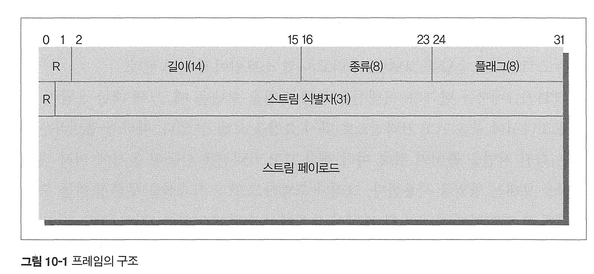

# 10장 HTTP/2.0

# 10.1 HTTP/2.0의 등장 배경

http 1.1의 latency, 병렬커넥션, 파이프라인커넥션으로 성능 개선에 해결책이 되지 못하여 http 2.0이 나왔다.

구글의 SPDY를 기반으로 http2.0이 나오게 되었다.

* spdy는 헤더를 압축하여 대역폭 절약
* 하나의 TCP 커넥션에 여러 요청 동시에 보내 latency 감소
* 서버 푸시 

# 10.2 개요

http2.0은 tcp 커넥션 위에서 동작하며 커넥션 초기화는 클라이언트로부터 시작한다.

http2.0 요청 응답은 길이가 정의된(최대 16383바이트) 한 개 이상의 프레임에 담긴다. 

헤더는 압축되어 담긴다.

한개의 스트림이 한쌍의 요청,응답을 처리하며 하나의 커넥션 위에 여러 스트림이 동시에 만들어진다. 

# 10.3 HTTP/1.1과의 차이점

## 10.3.1 프레임

http2.0에서 모든 메시지는 프레임에 담겨 전송된다.

* 모든 프레임은 8바이트 크기의 헤더로 시작 뒤이어 16383바이트 크기의 페이로드가 온다. 

프레임 헤더의 각 필드

* R : 예약된 2비트 필드. 반드시 0이여야하며 받는쪽에서는 무시
* 길이: 페이로드의 길이를 나타내는 14비트 무부호 정수(16,383까지). 이 길이에 프레임헤더는 포함되지 않는다.
* 종류 : 프레임의 종류
* 플래그 : 8비트 플래그. 플래그 값의 의미는 프레임 종류에 따라 다르다.
* R( 아래의 R) : 예약된 1비트 필드. 반드시 0이여야 한다.
* 스트림 식별자 : 31비트 스트림 식별자. 0은 커넥션 전체와 연관된 프레임임을 의미.

https://httpwg.org/specs/rfc7540.html

* HTTP 2.0 프레임의 종류
  * https://httpwg.org/specs/rfc7540.html#FramingLayer
  * **DATA**: 실제 데이터를 전송하는 데 사용되며, HTTP 본문의 일부를 포함할 수 있습니다.
  * **HEADERS**: HTTP 헤더를 전송하는 데 사용되며, 요청 및 응답 메시지의 시작을 나타냅니다.
  * **PRIORITY**: 스트림의 우선순위를 설정하는 데 사용됩니다.
  * **RST_STREAM**: 스트림을 조기에 종료할 때 사용됩니다.
  * **SETTINGS**: 연결 설정을 협상하고 통신하는 데 사용됩니다.
  * **PUSH_PROMISE**: 서버가 클라이언트에게 자원을 푸시할 것임을 알리는 데 사용됩니다.
  * **PING**: 연결의 유효성을 테스트하고 RTT(Round-Trip Time)를 측정하는 데 사용됩니다.
  * **GOAWAY**: 연결을 종료하기 전에 전송되며, 더 이상의 스트림 생성을 금지합니다.
  * **WINDOW_UPDATE**: 흐름 제어 윈도우 크기를 조정하는 데 사용됩니다.
  * **CONTINUATION**: HEADERS나 PUSH_PROMISE 프레임이 너무 커져 분할해야 할 경우 사용됩니다.

## 스트림과 멀티플렉싱

HTTP 1.1에서는 한 TCP 커넥션을 통해 요청을 보내고 응답이 와야 같은 커넥션으로 요청을 보낼 수 있다.

* 때문에 웹 브라우저는 레이턴시를 줄이기 위해 여러 TCP 커넥션을 만들어 동시에 여러개의 요청을 보내는 방법을 사용.
* 무한정 커넥션을 만들 수 있다.

그러나 HTTP 2.0에서는 하나의 커넥션에 여러 스트림이 동시에 열릴 수 있다.

* SETTINGS 프레임의 SETTINGS_MAX_CONCURRENT_STREAMS 값을 조절하여 동시 스트림 갯수 제한 

또한 스트림은 우선 순위를 가져 보다 중요한 리소스를 먼저 받을 수도 있다.

* 우선순위를 따르는것은 우선사항이 아니기 때문에 우선순위대로 처리된다는 보장은 없다. 

모든 스트림은 31비트 언사인드 정수로된 식별자를 갖는데, 클라이언트에 의해 초기화 된 스트림은 반드시 홀수여야 하며, 새로 만들어지는 스트림의 식별자는 이전 스트림보다 커야한다. 

동시 여러 스트림을 사용하면 스트림이 블록될 수 있는데, WINDOW_UPDATE 프레임을 통한 흐름제어를 통해 스트림들이 서로 간섭해서 망가지는 것을 막아준다

## 헤더 압축

HTTP 1.1의 헤더는 압축없이 전송되어 헤더 크기가 레이턴시에 큰 영향을 끼친다.

* PUT, DELETE처럼 본문보다 헤더가 큰 경우도 많다. 

HTTP2.0에서는 헤더를 HPACK 명세에 정의된 헤더 압축 방법으로 압축된 뒤 헤더 블록조각으로 쪼개어 전송하고, 받는 쪽에서 조각들을 이은 뒤 압축을 풀어 원래의 헤더로 복원한다. 

* 중복된 헤더 필드를 제거하고 보안 공격에 대한 취약성을 제한하는 동시에 메모리 사용을 제한하는 것을 목표
* HPACK은 헤더 필드를 이름-값 쌍의 순서가 있는 컬렉션으로 처리하며, 이는 헤더 필드 테이블을 사용하여 색인화됩니다. 이 테이블은 새로운 헤더 필드가 인코딩되거나 디코딩될 때 점진적으로 업데이트

* https://httpwg.org/specs/rfc7541.html
* https://ssup2.github.io/theory_analysis/HTTP2/
* https://luavis.me/http2/http2-header

## 서버 푸시

HTTP2.0은 서버가 하나의 요청에 대해 응답으로 여러 리소스를 보낼 수 있다. 

리소스를 푸시하려는 서버는 먼저 클라이언트에게 자원을 푸시할것임을 PUSH_PROMISE 프레임을 보내어 알려주어야 한다.

* 서버가 푸시하려고 하는 자원을 클라이언트가 별도로 또 요청하게 되는 상황을 피하기 위함

서버 푸시 사용시 다음에 주의해야 한다.

* 프록시 서버가 추가 리소스를 전달하지 않을 수 있고, 보내지 않아도 프록시가 자기맘대로 전달할수도 있다.
* 서버는 안전하고, 캐시가능하고, 본문을 포함하지 않은 요청에 대해서만 푸시할 수 있다 -> 멱등성과 비슷한데 좀 다름
* 클라이언트는 Same-origin policy에 따라 검사해야한다.
* 서버 푸시를 끄고싶다면 SETTINGS_ENABLE_PUSH를 0으로 설정하면 된다. 

# 10.4 알려진 보안 이슈

## 중개자 캡슐화 공격

HTTP 2.0 메시지를 프록시가 HTTP1.1로 변환할때 메시지가 변질될 가능성이 있다 

* HTTP 1.1을 2.0으로 변환할때는 발생하지 않는다

## 긴 커넥션 유지로 인한 개인정보 누출 우려

레이턴시를 줄이기 위해 클라-서버간 커넥션을 오래 유지하는데, 개인정보 유출에 악용될 가능성이 있음 

