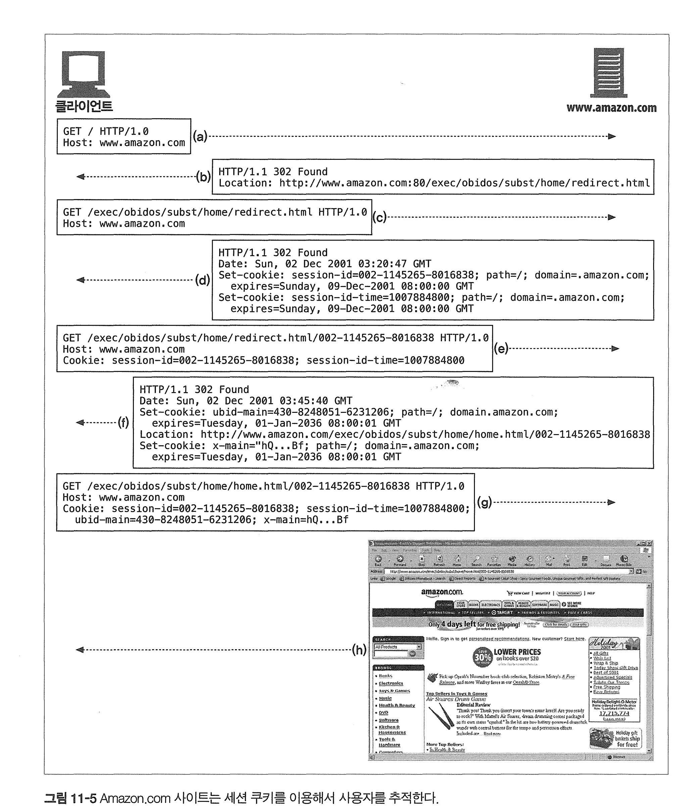

# 11장 클라이언트 식별과 쿠키

# 11.1 개별 접촉

HTTP는 state less한 특성 때문에 사용자를 식별할 수 없다.

사용자 세션 추적 : HTTP 트랜잭션은 상태가 없다.

* 많은 웹사이트에서 사용자를 식별할 수 있게 상태를 남긴다. (ex - 장바구니기능 ) 

- 사용자 식별 관련 정보 전달 HTTP헤더, IP주소 사용자 식별 , 사용자 로그인, URL에 식별자 포함, 쿠키 등

# 11.2 HTTP 헤더

| 헤더 이름       | 헤더 타입  | 설명                                     |
| --------------- | ---------- | ---------------------------------------- |
| From            | 요청       | 사용자의 이메일 주소                     |
| User-Agent      | 요청       | 사용자의 브라우저                        |
| Referer         | 요청       | 사용자가 현재 링크를 타고 온 근원 페이지 |
| Authorization   | 요청       | 사용자 이름과 비밀번호                   |
| Client-ip       | 확장(요청) | 클라이언트의 IP 주소                     |
| X-Forwarded-For | 확장(요청) | 클라이언트의 IP 주소                     |
| Cookie          | 확장(요청) | 서버가 생성한 ID 라벨                    |

* 사용자 정보를 전달하는 HTTP 헤더


# 11.3 클라이언트 IP 주소

클라이언트 ip주소만으로 사용자를 식별하기에 부정확한 정보가 많다.


서버는 클라이언트 IP 대신 프록시 서버의 IP 주소를 본다 

프록시는 http 헤더에 X-Forwaded-For HTTP 헤더를 붙여 원래 클라이언트의 IP 주소를 전달하는데 사용된다 


# 11.5 뚱뚱한 URL

URL에 많은 정보를 담을 수 있다.

그러나 너무 많이 담아 뚱뚱한 URL은 여러 문제가 있다.

- 못생긴 url : 혼란을 준다.
- 공유 불가 url:  url에 개인 정보(세션, 상태 정보)를 담고 있음.
- 캐시 사용 불가 : URL이 달라져 기존 캐시에 접근 불가
- 서버 부하 : 각각의 해당하는 URL에 해당하는 HTML을 새로 그려야 한다. -> 이건 모던 서버는 필요없을거같음 
- 세션 간 지속성 부재 : 사용자가 다른 URL로 들어오면 정보는 사라진다.

# 11.6 쿠키

사용자를 식별하고 세션을 유지하는 방식에 쓰인다.

세션 쿠키는 사용자가 사이트를 탐색시 설정 및 선호 사항들을 저장하는 임시 쿠키. 

지속 쿠키는 디스크에 저장되기도 한다. (사이트 설정정보, 로그인 이름 등)

이 둘의 차이점은 파기되는 시점이다. 

## 쿠키 동작 방식

쿠키는 임의의 `이름=값` 형태의 리스트를 가지고 Set-Cookie, 혹은 Set-Cookie2 같은 응답 헤더에 기술되어 저장된다.

```
Cookie: name="Brian Totty"; phone="555-1212"
```

* 서버는 Set-Cookie라는 헤더에 담아 보내고, 클라이언트는 Cookie 라는 헤더로 쿠키를 전달한다.

크롬은 Cookies라는 SQLite 파일에 쿠키를 저장한다.

- **Name**: 쿠키의 고유 이름.
- **host_key**: 쿠키가 속한 도메인
- **Value**: 쿠키의 값.
- **Domain**: 쿠키가 유효한 도메인.
- **Path**: 쿠키가 유효한 서버 경로.
- **Expires/Max-Age**: 쿠키의 만료 기간.
- **Size**: 쿠키의 크기(바이트 단위).
- **HttpOnly**: JavaScript의 접근을 방지하는 플래그.
- **Secure**: 쿠키가 안전한 HTTPS 연결을 통해서만 전송되도록 하는 플래그.
- **SameSite**: 크로스 사이트 요청 시 쿠키의 전송 방법을 제어.
- **Priority**: 쿠키의 우선 순위 (Low, Medium, High).

## 사이트마다 각기 다른쿠키

브라우저는 수백 수천개의 쿠키를 가지고 있을 수 있지만 모두 보내진 않는다.

보통 쿠키를 생성한 서버에게만 쿠키를 전달한다.  즉 Domain 속성을 통해서 보낸다. 


## 쿠키 Path 속성

Path를 이용해서 특정 웹사이트 일부에만 쿠키를 적용한다 

```
Set-cookie: pref=compact domain="naver.com"; path=/ysk/
```

naver.com/ysk로접근하면 

```
Cookie: pref=compact
```

를 받게된다 


## Cookie2 헤더

Cookie2 요청 헤더는 각기 다른 쿠키 버전을 지원하는 클라이언트와 서버간에 호환성을 협상하는 용도로 사용된다.

- 클라이언트는 서버로부터 받은 헤더 기준으로 보내야 한다.
- 서버는 클라이언트가 모두 지원하면 Set-Cookie는 무시하고 Set-Cookie2를 확인한다.

## 쿠키와 세션 추적



- a : 브라우저가 루트 페이지 요청
- b : 서버는 클라이언트를 소프트웨어 url로 리다이렉트
- c : 클라이언트는 리다이렉트 URL로 페이지 요청
- d : 응답에 두 개의 세션 쿠키를 기술하고, 다른 URL로 리다이렉트 클라이언트는 다시 이 쿠키를 첨부하여 요청을 보냄
- e : 두 개의 쿠키와 함께 리다이렉트 URL로 페이지 요청 (뚱뚱한URL)
- f : home.html로 리다이렉트 시키며 쿠키 두 개 더 첨부
- g : home.html 로드하며 총 네 개의 쿠키 전달
- h : 서버는 컨텐츠를 보냄

## 쿠키와 캐싱

쿠키 캐싱은 주의해야 한다. 정보가 노출될 수 있기 때문이다.

- 캐시되지 말아야 할 문서가 있다면 표시하라. `Cache-Control: no-cache="Set-Cookie"`
- Set-Cookie 헤더 캐시는 유의하라.
  - 사용자 추적에 실패할 수 있음.
  - 서버의 값과 검사해 문제 개선 가능 `Cache-Control: must-revalidate, max-age=0`
- Cookie 헤더를 가지고 있는 요청을 주의하라.
  - 개인정보를 포함하고 있을 수 있음

