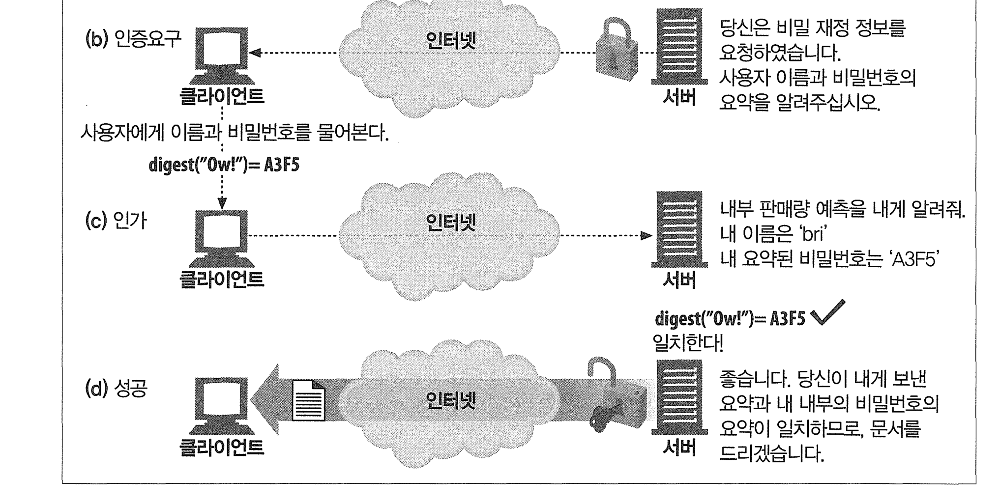
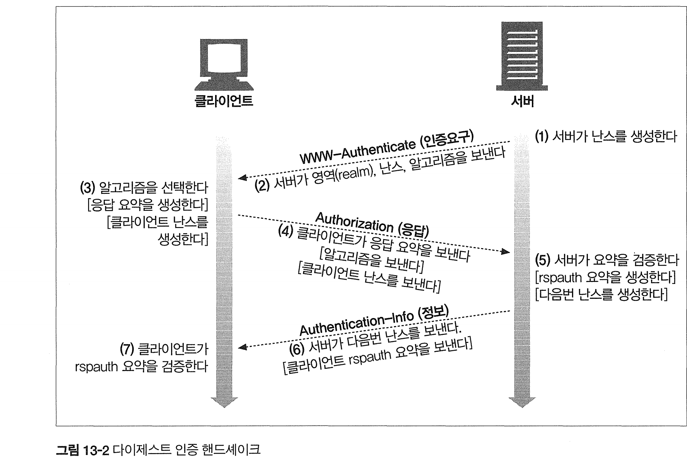

# 13장 다이제스트 인증

# 13.1 다이제스트 인증의 개선점

다이제스트 인증은 기본 인증의 가장 심각한 결함을 수정한 또 다른 HTTP 인증 프로토콜이다. 다이제스트 인증의 특징은 다음과 같다.

- 비밀번호를 절대로 네트워크를 통해 평문으로 전송하지 않는다.
- 인증 체결을 가로채서 재현하려는 악의 적인 사람들을 차단한다.
- 구현하기에 따라서, 메시지 내용 위조를 막는 것도 가능하다.
- 그외 몇몇잘 알려진 형태의 공격을 막는다.

단점:

1. 암호화가 강력하지 않아, 고급 공격 기법에는 취약할 수 있다. -> 비밀번호 자체는 아무도모르지만, 엿볼수 없는게 아님 
2. HTTPS와 같은 보다 강력한 보안 방법에 비해 상대적으로 약한 보안을 제공한다.
3. 구현이 복잡하고, 서버와 클라이언트 양쪽 모두에서 추가적인 처리가 필요하다.

**현대의 보안 표준에 비해 취약한 편이여서 잘 사용하지 않는다.**

보다 안전한 인증 방법

1. **HTTPS와 기본 인증(Basic Authentication)**: HTTPS를 사용하면 전송 중인 모든 데이터가 암호화되므로, 기본 인증을 사용해도 비밀번호가 평문으로 네트워크에 노출되지 않는다
2. **OAuth 2.0과 토큰 기반 인증**: 웹과 모바일 애플리케이션에서는 OAuth 2.0과 같은 토큰 기반 인증이 널리 사용. 사용자의 자격 증명을 직접 전송하는 대신, 인증 서버가 발급한 토큰을 사용하여 사용자를 인증
3. **JWT (JSON Web Tokens)**: JWT는 토큰 기반 인증에서 자주 사용되는 형식으로, 사용자의 상태와 추가 정보를 안전하게 전송
4. **TLS/SSL 상호 인증**: 특히, 기업 환경에서는 TLS/SSL 상호 인증을 통해 더욱 안전한 통신을 구현


다이제스트 인증은 비밀번호를 직접 전송하는 대신, 비밀번호를 기반으로 생성된 암호화된 코드(digeset 요약 또는 지문)를 전송한다.



요약 함수는 보통 단방향 해시함수이거나 fingerprint function이다. 

## 재전송 방지를 위한 nonce 사용

비밀번호 자체를 몰라도 다이제스트를 가로채서 서버로 재전송할 수 있기 때문에 취약하다.

때문에 서버에서는 자주 바뀌는(대략 1밀리초) 증표를 건네주고, 비밀번호에 섞게 한다. 이러면 안전해진다

## 다이제스트 인증 handshake



1. 서버는 nonce값을 계산하고 서버가 지원하는 알고리즘 목록과 클라이언트로 전송

2. 클라이언트는 알고리즘을 선택하고 비밀번호 등에 대한 다이제스트를 계산하여 Authorization에 전송 
3. 서버는 다이제스트, 알고리즘, 보조데이터 등을 받아 다이제스트를 계산하여 인증한다.


# 13.2 요약 계산

다이제스트 인증의 핵심은 공개된 정보, 비밀 정보, 시한부 난스 값을 조합한 단방 향 요약이다.

요약은 다음의 세 요소로부터 계산된다.

1. 단방향 해시 함수 H(d) & 요약 함수 KD(s,d) (s는 secret, d는 데이터)
2. 비밀번호 등 보안 정보를 담고 있는 데이터 덩어리. A1
3. 요청 메시지의 비밀이 아닌 속성을 담고 있는 데이터 덩어리. A2

`A1`은 사용자 이름, 비밀번호, 보호 영역, 난스와 같은 **비밀 보호 정보**로 이루어진 데이터 덩어리이다. (비밀 정보와만 관련)

### MD5

모든 요청마다 단방향 해시를 실행하는 알고리즘

```null
A1 = <사용자>:<영역>:<비번>
```

### MD5-sess

사용자 이름, 영역, 비밀번호에 대한 해시를 계산한 결과 뒤에 현재 난스와 클라이언트 난스를 붙인 것이 A1.

```null
A1 = MD5(<사용자>:<영역>:<비밀번호>):<난스>:<c난스>
```

`A2`는 URL, 요청 메서드, 메시지 엔터티 본문과 같은 **메시지 자체의 정보**를 나타낸다. 메서드, 리소스, 메시지의 위조를 방지하기 위해 사용된다.

- qop 필드는 WWW-Authenticate, Authorization, Authentication-Info에 모두 존재 가능
- qop 필드는 클라이언트와 서버가 어떤 보호 기법을 어느 정도 수준으로 사용할 수 있지 협상할 수 있게 허용

메시지 무결성 보호

- qop=”auth-int”면 메시지 무결성 보호가 적용
- auth-int의 경우 계산되는 H(엔티티 본문)은 메시지 본문의 해시가 아닌 엔티티 본문의 해시

# 13.5 보안에 대한 고려사항

## 헤더 부당 변경

양종단 암호화나 헤더에 대한 디지털 서명으로 방지 (두개를 조합할 수 도 있다)

## 재전송공격

재전송 공격은 누군가가 트랜잭션에서 엿들은 인증 자격을 다른 트랜잭션에서 사용하는 것이다. (난스값 반복 사용으로 발생)
이를 완화하기 위해 클라이언트의 IP 주소, 타임스탬프, ETag, 개인서버키에 대한 요약을 포함하는 난스를 서버가 생성하게 할 수 있지만 클라이언트 ip를 난스생성에 사용하게 되면 프락시팜을 사용할 수 없고, ip주소를 속이는 문제가 발생할 수 있다.
완전히 재전송 공격을 피하기 위해서는 트랜잭션마다 유일한 난스값을 사용하는 것이다.

## 다중 인증 메커니즘

- 클라이언트가 언제나 가능한 한 가장 강력한 인증제도를 선택하도록 한다.
- 위의 방법이 현실적으로 불가능하다면 가장 강력한 인증 제도만을 유지하는 프락시 서버를 사용하자. (사내 네트워크같이 모든 클라이언트가 우리가 선택한 강력한 인증제도를 지원할 수 있다고 알려진 경우에만 사용)

## 사전 공격

사전(dictionary) 공격은 전형적인 비밀번호 추측공격.
이를 막기 위해 크래킹이 어려운 복잡한 비밀 번호를 사용하거나 비밀번호 만료 정책을 사용할 수 있다.

## 악의적인 프락시와 중간자 공격

프락시가 악의적이거나 보안이 허술하다면 클라이언트는 중간자 공격에 취약해질 수 있다. ( 엿듣기 공격이나 가장 약한 인증 제도로 대체)
SSL을 사용해서 공격을 방어하자

## 선택평문 공격

클라이언트가 서버에서 제공된 난스 대신 선택적인 c난스 지시자를 사용하여 응답을 생성할 수 있도록 한다.

## 비밀번호 저장

- 비밀번호 파일 보호 철저히
- 영역이름이 유일함 보장, 비밀번호 파일이 유출되어도 피해를 특정 영역으로 최소화 (호스트, 도메인을 포함한 완전한 영역이름)
- SSL