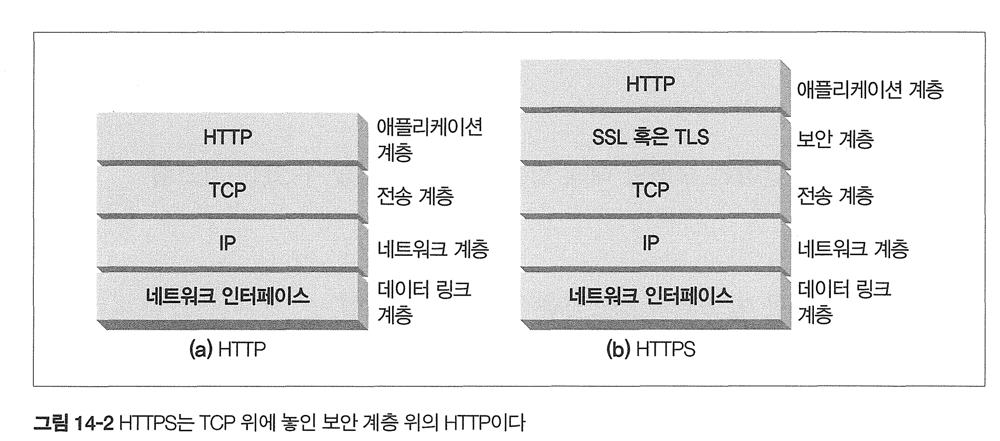
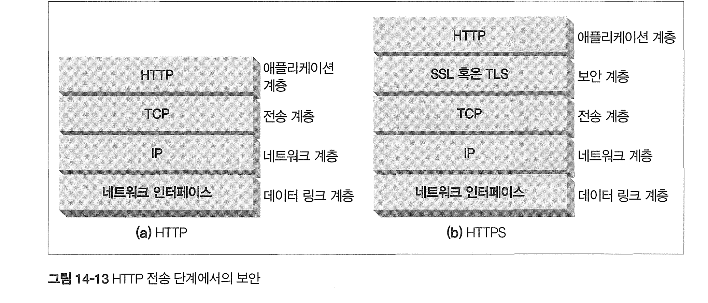
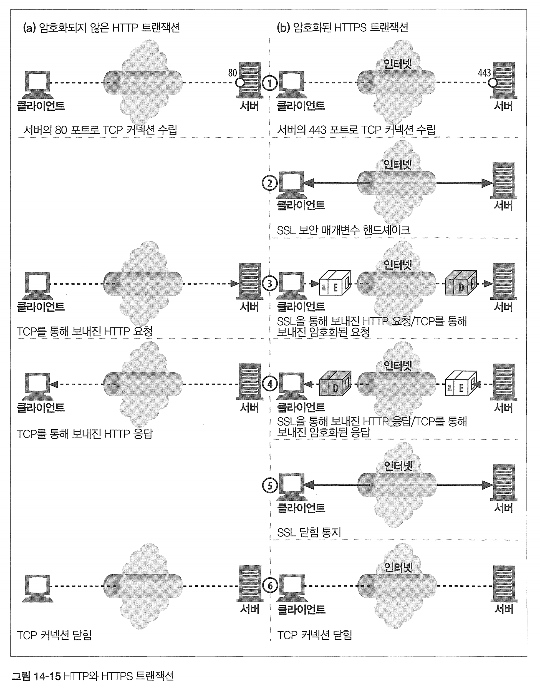
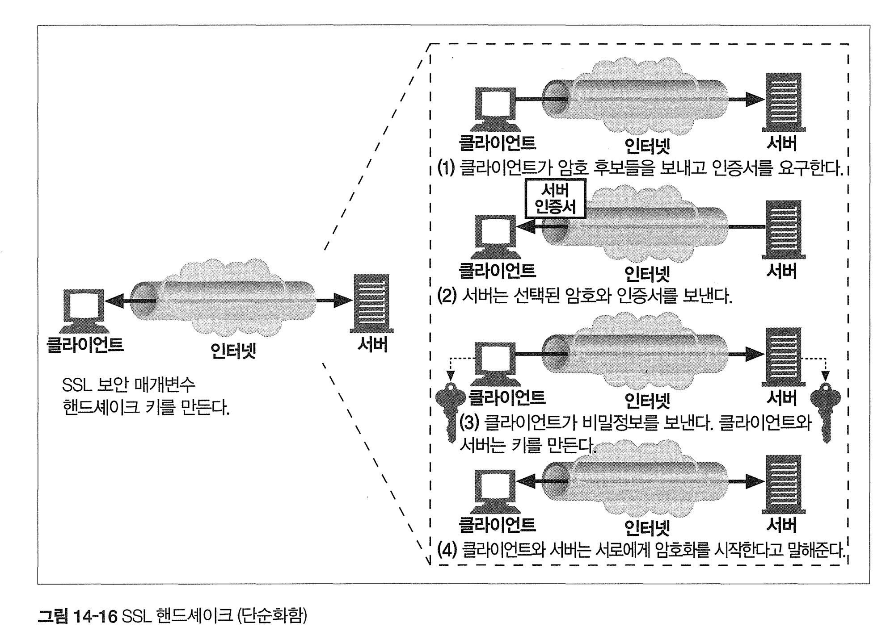

# 14장 보안 HTTP

# 14.1 HTTP를 안전하게 만들기

HTTPS는 HTTP를 안전하게 만드는 방식 중 가장 인기있다.

HTTPS를 사용하면 모든 HTTP 요청과 응답은 네트워크로 보내지기 전 암호화 된다.

HTTP의 하부에 전송 레벨 암호 보안 계층을 제공함으로써 동작한다.

* SSL, TLS를 이용하여 구현

인코딩 및 디코딩 작업은 대부분 SSL 라이브러리 안에서 일어나기 때문에 개발자는 로직을 변경할 필요는 없다.

# 14.2 디지털 암호학

## 디지털 암호학 용어

* 암호 : 텍스트를 아무나 읽지 못하도록 인코딩하는 알고리즘
* 키 : 암호의 동작을 변경하는 숫자로 된 매개변수
* 대칭키 암호 체계 : 인코딩과 디코딩에 같은 키를 사용하는 알고리즘
* 비대칭키 암호 체계: 인코딩과 디코딩에 다른 키를 사용하는 알고리즘
* 공개키 암호법 : 비밀 메시지를 전달하는 수백만 대의 컴퓨터를 쉽게 만들 수 있는 시스템
* 디지털 서명 : 메시지가 위조 혹은 변조되지 않았음을 입증하는 체크섬
* 디지털 인증서 :신뢰할 만한 조직에 의해 서명되고 검증된 신원 확인 정보

# 14.3 대칭키 암호법

인코딩을 할때랑 디코딩을 할때 키가 같다. (e = d)

* e : 인코딩 키
* d : 디코딩 키

P = D(C, d)

좋은 암호 알고리즘은 모든 가능한 키값을 시도해보는것 외에 다른 방법이 없는것.

8비트 키 = 256값 가능

40비트 키 = 1조

128비트 키 = 34경경경경... 엄청크다

128비트 키를 사용한 대칭키 암호는 매우 강력한것으로 간주된다.

그러나 대칭키는 둘 다 공유키를 가져야 하는것이 단점이다. 

# 14.4 공개키 암호법

한 쌍의 호스트가 하나의 인코딩/디코딩 키를 사용하는 대신, 공개키 암호 방식은 두 개의 비대칭 키를 사용한다.

* 하나는 메시지를 인코딩, 하나는 메시지를 디코딩
* 인코딩 키는 모두 암호화 할 수 있게 공개한다. 그래서 공개키

RSA는 아래를 만족한다.

- 공개키(물론 공개니까 누구나 얻을 수 있다)
- 가로채서 얻은 암호문의 일부(네트워크를 스누핑해서 획득)
- 메시지와 그것을 암호화한 암호문(인코더에 임의의 텍스트를 넣고 실행해서 획득)

공개키 알고리즘의 단점 : 계산이 느리다. 

# 14.6 디지털 인증서

디지털 인증서는 certs라고 불리는 신뢰할 수 있는 기관으로부터 보증받은 사용자나 회사에 대한 정보를 담고있음 

## 인증서 내부

인증서 내부 정보

- 대상의 이름(사람, 서버, 조직 등)
- 유효 기간
- 인증서 발급자 (누가 이 인증서를 보증하는가)
- 인증서 발급자의 디지털 서명

## 서버인증을 위한 인증서 사용

HTTPS를 이용한 트랜잭션시작시 브라우저는 접속 서버에서 디지털 인증서를 가져온다.

* 갖고있지않으면 커넥션은 실패.

서버 인증서는 다음을 포함한 많은 필드를 갖고있다.

- 웹 사이트의 이름과 호스트 명
- 웹 사이트의 공개키
- 서명 기관의 이름, 서명

인증서를 받으면 서명기관을 검사하고 서명을 검증한다. 

# 14.7 HTTPS의 세부사항

### HTTPS 개요

HTTP 메시지를 TCP로 보내기 전 보안 계층에서 암호화 하고 전송한다. - TLS

## HTTPS 스킴

url이 https 스킴을 갖고있으면, 서버의 443 포트로 연결하고

 SSL 보안 매개변수를 교환하면서 핸드 셰이크를 하고, 

암호화된 HTTP 명령을 전송한다. 

* SSL 트래픽은 바이너리 프로토콜.

핸드셰이크가 완료되면 SSL 초기화는 완료되며 클라이언트는 메시지를 보안 계층으로 보내고 암호화 되고 TCP로 보내진다.

## SSL 핸드셰이크

핸드셰이크에서는 다음과 같은 일이 일어난다.

* 프로토콜 버전 번호 교환

- 양쪽이 알고 있는 암호 선택
- 양쪽의 신원을 인증
- 채널을 암호화하기 위한 임시 세션 키 생성

## 서버 인증서

서버 인증서는 조직의 이름, 주소, 서버 DNS 도메인 이름, 그리고 그 외의 정보를 보여주는, X.509 v3에서 파생된 인증서이다.

* X.509 v3은 인터넷 보안에서 사용되는 디지털 인증서의 표준 버전. 인증서 소유자의 정보, 공개 키, 발급 기관, 유효 기간 등이 포함

## 인증서 검사

웹브라우저 인증서 검사 알고리즘 

* 날짜 검사 - 인증서 만료 검사
* 서명자 신뢰도 검사 - 인증 기관 검사
* 서명 검사 - 공개키를 서명에 적용하고 체크섬을 비교
* 사이트 신원검사 - 인증서 도메인 이름이 서버 도메인 이름과 비교하여 맞는지 검사 