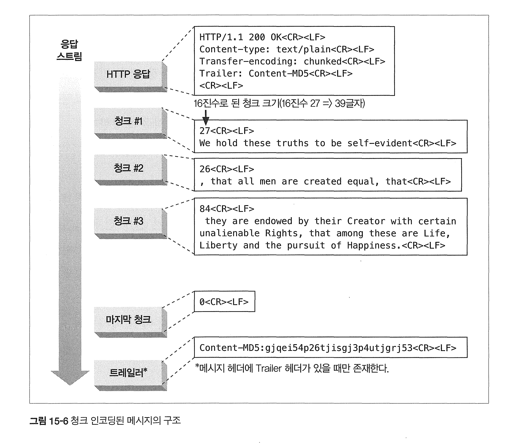
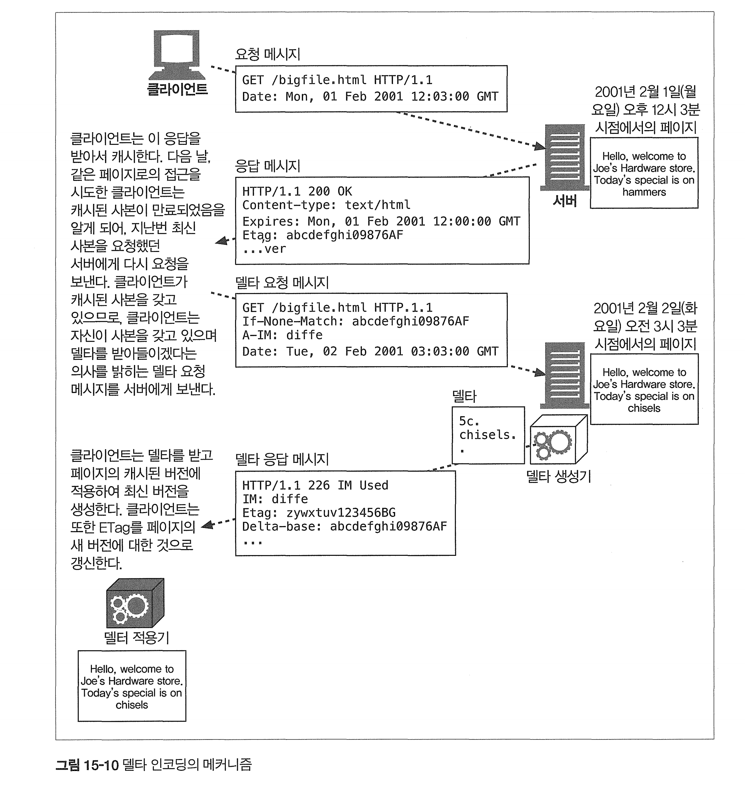

# 15장 엔터티와 인코딩

HTTP는 다음을 보장한다.

- 객체는 올바르게 식별되므로(Content-Type 미디어 포맷과 Content-Language 헤더를 이용해서) 브라우저나 다른 클라이언트는 콘텐츠를 바르게 처리할 수 있다.
- 객체는 올바르게 압축이 풀릴 것이다(Content-Length와 Content-Encoding 헤더 를 이용해서).
- 객체는 항상 최신이다(엔터티 검사기와 캐시 만료 제어를 이용해서).
- 사용자의 요구를 만족할 것이다(내용 협상을 위한 Accept 관련 헤더들에 기반하여).
- 네트워크 사이를 빠르고 효율적으로 이동할 것이다(범위 요청, 델타 인코딩, 그 외의 데이터 압축을 이용해서).
- 조작되지 않고 온전하게 도착할 것이다(전송 인코딩 헤더와 Content-MD5 체크 섬을 이용해서).

# 15.1 메시지는 컨테이너, 엔터티는 화물

HTTP/1.1의 주요 헤더 필드

* Content-Type - 엔터티에 의해 전달된 객체의 종류

* Content-Length - 전달되는 메시지의 길이나 크기

* Content-Language- 전달되는 객체와 가장 잘 대응되는 자연어

* Content-Encoding- 객체 데이터에 대해 행해진 변형(압축 등)

* Content-Location - 요청 시점을 기준으로, 객체의 또 다른 위치

* Content-Range -만약 이 엔터티가 부분 엔터티라면, 이 헤더는 이 엔터티가 전체에서 어느 부분에 해당하는지 정의한다.

* Content-MD5 -엔터티 본문의 콘텐츠에 대한 체크섬
* Last-Modified - 서버에서 이 콘텐츠가 생성 혹은 수정된 날
* Expires 이 엔터티 데이터가 더 이상 신선하지 않은 것으로 간주되기 시작하는 날짜와 시간
* Allow 이 리소스에 대해 어떤 요청 메서드가 허용되는지. 예) GET과 HEAD
* ETag - 이 인스턴스'에 대한 고유한 검사기. 엄밀히 말해 ETag 헤더는 엔터티 헤더로 정의 되어 있지는 않지만 엔터티와 관련된 많은 동작을 위해 중요한 헤더이다.
* Cache-Control - 어떻게 이 문서가 캐시될 수 있는지에 대한 지시자. ETag 헤더와 마찬가지로 Cache-Control 헤더도 엔터티 헤더로 정의되어 있지는 않다.

## 엔터티 본문

엔터티 본문은 헤더 필드의 끝을 의미하는 빈 CRLF 줄 바로 다음부터 시작한다.

````
GET /index.html HTTP/1.1
Host: www.example.com
/* 이부분이 끝을 의미 */
엔터티 본문
````


# Content-Length : 엔터티의 길이

엔터티 본문의 크기를 바이트 단위로 나타낸다. (gzip으로 압축되었으면 압축된 후의 크기)

### 용도 1. 잘림 검출

옛날 HTTP는 커넥션이 닫힌것을 보고 인지했지만 최근에는 Content-Length로 잘림을 검출한다. 

### 용도 2. 지속 커넥션 (Persistent Connection)

메시지 하나가 어디서 끝나고 다음 시작은 어디인지 알려주는데 파악하기 때문에 커넥션 닫힘보다는 이 길이로 파악한다.

# 15.3 엔터티 요약

Content-MD5 헤더는 서버가 엔터티 본문에 MDS 알고리즘을 적용한 결과를 보 내기 위해 사용된다.

Content-MD5 헤더는, 콘텐츠 인코딩의 적용은 끝났지만 전송 인코 딩은 아직 적용하지 않은 엔터티 본문에 대한 MD5를 담고 있다

메시지의 무결성 을 검증하려는 클라이언트는 먼저 전송 인코딩을 디코딩한 뒤 그 디코딩 된 엔터티 본문에 대해 MDS를 계산해야 한다. 

예를 들어, 어떤 문서를 gzip 알고리즘으로 압축하여 청크 인코딩으로 보냈다면, MD5 알고리즘은 압축된 본문 전체에 대해 수행 된다.

`이런 활용 가치에도 불구하고, Content-MD5 헤더는 그다지 자주 전송되지 않는다.`

# 15.4 미디어 타입과 Charset

Content-Type 헤더 필드는 엔터티 본문의 MIME 타입을 기술한다.

* HTML, 워드, 비디오, 이미지

적절히 해석하기 위해 MIME 타입을 이용한다. 

| 미디어 타입                   | 설명                                                         |
| ----------------------------- | ------------------------------------------------------------ |
| text/html                     | 엔터티 본문은 HTML 문서                                      |
| text/plain                    | 엔터티 본문은 플레인 텍스트 문서                             |
| image/gif                     | 엔터티 본문은 GIF 이미지                                     |
| image/jpeg                    | 엔터티 본문은 JPEG 이미지                                    |
| audio/x-wav                   | 엔터티 본문은 WAV 음향 데이터를 포함                         |
| model/vrml                    | 엔터티 본문은 삼차원 VRML 모델                               |
| application/vnd.ms-powerpoint | 엔터티 본문은 마이크로소프트 파워포인트 프레젠테이션         |
| multipart/byteranges          | 엔터티 본문은 여러 부분으로 나뉘는데, 각 부분은 전체 문서의 특정 범위를 담고 있다 |
| message/http                  | 엔터티 본문은 완전한 HTTP 메시지를 담고 있다                 |

## 텍스트 매체를 위한 문자 인코딩 - charset

엔터티의 비트 집합을 텍스트 파일의 글자들로 변환하기 위한 charset 매개변수

```
Content-Type: text/html; charset=iso-8859-4
Content-Type: text/html; charset=utf-8
```

# 15.5 콘텐츠 인코딩

HTTP 앱은 때때로 콘텐츠를 보내기 전 인코딩하려고 한다. 

큰 파일을 보내기 위해 압축을 할 수 있기 때문이다.

## 콘텐츠 인코딩 과정

1. 웹 서버가 원본 Content-Type과 Content-Length 헤더를 수반한 원본 응답 메시지를 생성한다.

2. 콘텐츠 인코딩 서버(아마 원 서버이거나 다운스트림 프락시일 것이다)가 인코 딩된 메시지를 생성한다. 인코딩된 메시지는 Content-Type은 같지만 (본문이 압 축되었거나 했다면) Content-Length는 다르다. 콘텐츠 인코딩 서버는 Content-Encoding 헤더를 인코딩된 메시지에 추가하여, 수신 측 애플리케이션이 그것을 디코딩할 수 있도록 한다.
3. 수신 측 프로그램은 인코딩된 메시지를 받아서 디코딩하고 원본을 얻는다.

**콘텐츠 인코딩의 예**

 작은 압축된 본문을 만들기 위해 gp 콘텐츠 인코딩 기능으로 인코딩

* 압축된 본문은 gzip 인코딩 플래그가 붙어서 네트워크를 통해 전송된다. 
* 수신 측 클라이언트는 그 엔터티를 gp 디코더를 사용해서 압축을 푼다.

다음은 인코딩된 응답의 한 예다(압축된 이미지).

```http
HTTP/1.1 200 OK
Date: Fri, 05 Nov 1999 22:35:15 GMT
Server: Apache/1.2.4
Content-Length: 6096
Content-Type: image/gif
Content-Encoding: gzip
[...]
```

## 콘텐츠 인코딩 유형

| 콘텐츠 인코딩 값 | 설명                                                         |
| ---------------- | ------------------------------------------------------------ |
| gzip             | 엔터티에 GNU Zip 인코딩이 적용되었음을 의미한다.             |
| compress         | 엔터티에 대해 유닉스 파일 압축 프로그램인 'compress'가 실행되었음을 의미한다. |
| deflate          | 엔터티가 Z 포맷으로 압축되었음을 의미한다.                   |
| identity         | 엔터티에 어떤 인코딩도 수행되지 않았음을 의미한다.<br /> Content-Encoding 헤더가 존재하지 않는다면 이 값인 것으로 간주된다. |

gip, compress, deflate 인코딩은 전송되는 메시지의 크기를 정보의 손실 없이 줄이기 위한 `무손실 압축 알고리즘`이다. 

이 중 gzip은 일반적으로 가장 효율적이고 가장 널리 쓰이는 압축 알고리즘이다

## Accept-Encoding 헤더

클라이언트는 자신이 지원하는 인코딩의 목록을 Accept-Encoding 요청 헤더를 통해 전달한다. 

* 지원하지 않는걸로 응답할수도 있고, 그러면 무용지물니까 

만약 HTTP 요청에 Accept-Eneoding 헤더를 포함하지 않는다면, 서버는 클라이언트가 어떤 인코딩이든 받아들일 수 있는 것으로 간주한 다(Accept-Encoding: *을 전달한 경우도 같다).

# 15.6 전송 인코딩과 청크 인코딩

## Transfer-Encoding 헤더

전송 인코딩을 제어하고 서술하기 위해 정의된 헤더는 단 두 개뿐이다.

* Transfer-Encoding 안전한 전송을 위해 어떤 인코딩이 메시지에 적용되었는지 수신자에게 알려준다.

* TE 어떤 확장된 전송 인코딩을 사용할 수 있는지 서버에게 알려주기 위해 요청 헤더에 사용한다.

다음의 예는, chunk-encoded 메시지와 메시지의 끝에 트레일러가 오는 것을 받 아들일 수 있음을 서버에게 알려주기 위해 IE 헤더를 사용하는 요청이다. (HTTIP 1.1 애플리케이션)

```http
GET /new_products.html HTTP/1.1
Host: www.joes-hardware.com
User-Agent: Mozilla/4.61 [en] (WinNT; I) 
TE: trailers, chunked
...
```

수신자에게 메시지가 청크 인코딩으로 전송 인코딩되었음을 알려주기 위해

Transfer-Encoding 헤더를 포함한다.

```http
HTTP/1.1 200 OK
Transfer-Encoding: chunked
Server: Apache/3.0
...
```

## 청크 인코딩.

스트리밍 데이터 전송 방식으로 사용! 

청크 인코딩은 메시지를 일정 크기의 청크 여럿으로 쪼개고 순차적으로 보낸다. 

* 콘텐츠가 동적인 경우 사용
* 대용량 데이터 전송시 사용
* 실시간 데이터 스트리밍 시 사용 

* 버퍼에 담아 청크를 크기랑 함께 보낸다. 

**장점**

1. **동적 콘텐츠 스트리밍**: 서버가 동적으로 생성된 콘텐츠를 클라이언트에 실시간으로 전송
2. **Content-Length 필요 없음**: 데이터의 크기가 변동적이거나 미리 알 수 없을 때 유용 따라서 전체 컨텐츠를 미리 생성하지 않고도 데이터를 전송할 수 있다.
3. **네트워크 효율성**: 클라이언트는 각 청크를 받는 즉시 처리할 수 있으므로 전체 데이터를 받기 전에도 일부 데이터를 빠르게 처리할 수 있다.

청크 인코딩이 전송 인코딩의 한 형태이며 따라서 본문이 아닌 메시지의 속성이다. 

청크 인코딩은 서버가 본문을 여러 청크로 쪼개고서버는 그중 일부를 버퍼에 담은 뒤 그 한 덩어리를 그의 크기와 함께 보낼 수 있다.

본문을 모두 보낼 때까지 이 단계를 반복한다. 

서버는` 크기가 0인 청크로 본문이 끝났음`을 알리고 다 음 응답을 위해 커넥션을 열린 채로 유지할 수 있다.



위 사진을 보면 HTTP 응답 헤더 블록으로 시작해서 쪼갠 청크를 스트림으로 보낸다.

각 청크는 길이 값(16진수 형식) + CRLF + 청크에 대한 데이터를 보낸다 

마지막 청크는 0 + CRLF + 본문 없음이며 이러면 전송이 끝난다. 

## 전송 인코딩 규칙.

전송 인코딩이 메시지 본문에 적용될 때, 몇 가지 규칙이 반드시 적용되어야 한다.

- 전송 인코딩의 집합은 반드시 'chunked'를 포함해야 한다. 유일한 예외는 메시 지가 커넥션의 종료로 끝나는 경우뿐이다.
- 청크 전송 인코딩이 사용되었다면, 메시지 본문에 적용된 마지막 전송 인코딩이 존재해야 한다.
- 청크 전송 인코딩은 반드시 메시지 본문에 한 번 이상 적용되어야 한다.

이 규칙은 수신자가 메시지의 전송 길이를 알아낼 수 있게 해준다.

# 15.8 검사기와 신선도

## 신선도

클라이언트에게 얼마나 콘텐츠를 캐시하고 신선하다고 가정할 수 있는지에 대한 정보를 줄 수 있다.

Expires, Cache-Control 헤더로 . 

```
Expires: Sun Mar 18 23:59:59 GMT 2001
```

Cache-Control 헤더는 문서의 최대 수명을 문서가 서버를 떠난 후로부터의 총 시간을 초 단위로 정한다. 

수명은 시계 동기화에 의존하지 않으므로 더 정확한 결과라고 할 수 있다.

* "시계 동기화"는 서버와 클라이언트 간의 시스템 시계의 일치여부 
* Expires헤더는 서버 시간 기준이라 클라와 시계가 일치하지 않으면 다를 수 있음. 근데 Cache-Control은 초단위로 지정해서 상대적이므로 시게 동기화에 의존하지 않음.

| 지시자           | 메시지 타입 | 설명                                                         |
| ---------------- | ----------- | ------------------------------------------------------------ |
| no-store         | 응답        | 응답은 절대로 캐시되어서는 안 된다.                          |
| no-cache         | 응답        | 지시자가 헤더 필드의 목록을 동반하고 있다면, 콘텐츠는 캐시되어 클라이언트에게 제공될 수 있지만, <br />그 전에 헤더 필드들은 반드시 제거되어야 한다. |
| must-revalidate  | 응답        | 응답은 반드시 제공되기 전에 서버를 통해 재검사되어야 한다.   |
| proxy-revalidate | 응답        | 공유된 캐시는 반드시 응답을 원 서버를 통해 재검사해야 한다. <br />이 지시자는 개인 캐시에 의해 무시될 수 있다. |
| max-age          | 요청/응답   | 캐시의 문서는 명시한 나이보다 오래되어서는 절대로 안 된다. <br /> 문서가 캐시될 수 있고 여전히 신선하다고 간주될 수 있는 시간의 최대 길이를 정의한다. |
| private          | 응답        | 응답은 하나의 클라이언트만 접근할 수 있는 형태로 캐시된다.   |
| public           | 응답        | 응답은 어떤 캐시로든 캐시된다.                               |
| no-transform     | 요청/응답   | 문서는 보내기 전에 변형되어서는 안 된다.                     |
| min-fresh        | 요청        | 문서의 신선도 수명이 그 문서의 나이에 여기서 지정한 값을 더한 것보다 작아서는 안 된다. |
| max-stale        | 요청        | 문서는 서버가 정해준 만료일시가 지나면 더 이상 신선하지 않게 되는데, <br />그렇다 하더라도 신선하지 않게 된 후 지난 시간이 이 지시자로 지정한 시간보다 크지 않다면 받아들인다. |
| only-if-cached   | 요청        | 서버에 접근하지 말고, 캐시에 들어있는 경우에만 문서를 보내라. |


# 15.9 범위 요청

범위 요청을 이용하면, HTTP 클라이언트는 받다가 실패한 엔터티를 일부 혹은 범위로 요청함으로써 다운로드를 중단된 시점에서 재개할 수 있다

아래 예는 처음 4000바이트 이후의 부분을 요청한다

```http
GET /bigfile.html HTTP/1.1
Host: www.joes-hardware.com
Range: bytes=4000-
User-Agent: Mozilla/4.61 [en] (WinNT; I)
...
```

이 사례에서 클라이언트가 하나의 요청으 로 여러 범위를 요청했을 때, 

응답은 멀티파트 본문과 Content-Type: multipart/byteranges 헤더와 함께 하나의 엔터티로 돌아온다.

모든 서버가 범위 요청을 받아들일 수 있는 것은 아니지만 많은 경우 가능하다.

서버는 클라이언트에게 자신이 범위를 받아들일 수 있는지 응답에 `Accept-Range `헤더를 포함시키는 방법으로 알려줄 수 있다

* Range 헤더는 주로 P2P에도 자주 사용된다. 

# 15.10 델타 인코딩

델타 인코딩은 객체 전체가 아닌 변경된 부분에 대해서만 통신하 여 전송량을 최적화하는, HTTP 프로토콜의 확장이다

REC 3329는 델타 인코딩에 대해 기술하고 있다.



* 클라이언트는 페이지 어떤 버전을 갖고있는지, 어떤 알고리즘을 갖고 있는지 서버에게 요청한다
* 서버는 클라이언트가 갖고있는 버전을 갖고있는지, 어떻게 최신 버전과 클라 버전 사이 델타를 계산할것인지 (여러 알고리즘)를 체크한다.

* 이후 계산하고 클라이언트에게 보내주고 서버도 델타를 보내고 있음을 명시하고, 페이지 최신 버전에 대한 식별자도 보내주어야 한다. 
* 서버는 델타로 보낸다는 응답코드 226 IM Used 를 보내야 한다.
  * 헤더는 다음과 같다.  
  * 델타를 계산하기 위해 사용된 알고리즘 - IM
  * 새 ETag 헤더,
  * Delta-base (델타를 계산할때 기반이 된 문서의 ETAG)

다음은 델타 인코딩에 사용되는 헤더이다.

| 헤더          | 설명                                                         |
| ------------- | ------------------------------------------------------------ |
| ETag          | 문서의 각 인스턴스에 대한 유일한 식별자. 서버가 응답에 담아 보내며, 클라이언트는 이것을 다음번 요청에서 If-Match와 If-None-Match 헤더에 사용한다. |
| If-None-Match | 클라이언트가 보내는 요청 헤더로, 서버가 클라이언트와 다른 버전의 문서를 갖고 있는 경우에 한해 그 문서를 요청한다. |
| A-IM          | 받아들일 수 있는 인스턴스 조작의 종류를 가리키는 클라이언트 요청 헤더 |
| IM            | 요청에 적용된 인스턴스 조작의 종류를 명시하는 서버의 응답 헤더. 응답 코드가 226 IM Used일 때 이 헤더를 보낸다. |
| Delta-Base    | 델타를 생성하기 위해 사용된 기저 문서의 ETag(클라이언트 요청의 If-None-Match 헤더에 들어있는 ETag와 같아야 한다)를 명시하는 서버 응답 헤더. |


# 15.11 추가 정보

#