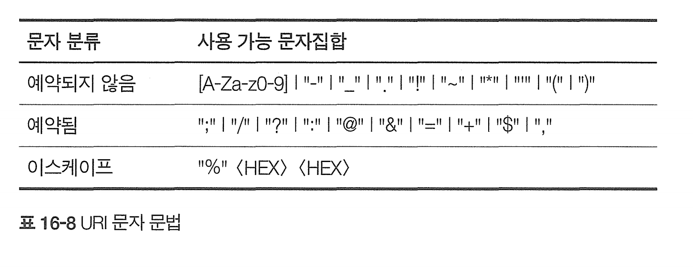

# 16장 국제화

# 16.1 국제적인 콘텐츠를 다루기 위해 필요한 HTTP 지원

서버는 클라이언트에게 Content-Type, charset, Content-Language 헤더를 통해 알려줄 수 있다.

클라이언트는 서버에게 Accept-Charset, Accept-Language 헤더를 보내 받을 수 있다.


# 16.2 문자집합과 HTTP

## charset은 글자를 비트로 변환하는 인코딩이다.

* https://www.iana.org/assignments/character-sets/character-sets.xhtml

다음 Content-Type은 수신자에게 html 콘텐츠를 charset으로 디코딩하라고 알려준다.

```
Content-Type: text/html; charset=iso-8859-6
```

## 문자집합과 인코딩 동작방식

문서를 이루는 비트들은 특정 인코딩된 문자집합으로 변환되어 저장되어있다.

운영체제와 브라우저는 인코딩된 char-set을 이용하여 디코딩하고, 글자를 찾아 화면에 보여준다. 

## 표준화된 MIME CharSet 값

등록된 Charset목록은 https://www.iana.org/assignments/character-sets/character-sets.xhtml에서 볼 수 있다.

# 16.3 다중언어 문자 인코딩에 대한 지침

## 코딩된 문자집합

US-ASCII : 0-127 (7비트)만 사용하는 미국에서 가장 오래된 문자집합. 헤더, URI는 US-ASCII 사용

iso-8859: US-ASCII의 8비트 확대집합. 다양한 나라 언어들 지원  

utf-8 : 

* 비모달 가변 길이 인코딩**:  문자에 따라 다른 길이의 바이트를 사용

* **첫 번째 바이트의 선두 비트**: 이 비트들은 인코딩된 문자가 몇 바이트로 이루어져 있는지 나타낸다. 

* **1바이트 문자**: ASCII 문자(예: 'A', 'a', '1', '?')는 1바이트로 표현된다.. 첫 바이트의 최상위 비트가 0이면, 이는 1바이트 문자이다.

  예: 'A' = 01000001 (1바이트)

* **2바이트 이상의 문자**: 더 많은 데이터를 필요로 하는 문자들(예: 많은 국제 문자, 특수 기호)은 2바이트 이상을 사용한다. 첫 바이트의 선두 비트들이 문자의 길이를 나타낸다

  예: '€' (유로 기호) = 11000010 10101100 (2바이트)

euc-kr : 한글 인터넷문서를 위해 사용되는 가변길이 인코딩. 

* 한글과 한자 지원**: EUC-KR은 한글과 한자를 포함하여 다양한 한국어 문자를 표현할 수 있다.

* 고정된 두 바이트 인코딩**: 대부분의 한글 문자는 두 바이트로 인코딩
* **제한된 문자 집합**: EUC-KR은 한정된 수의 한글과 한자만을 지원.
* UTF-8이 전 세계적으로 표준으로 자리잡으면서 EUC-KR의 사용이 감소

# 16.4 언어 태그와 HTTP

## Content-Language 헤더

엔터티가 어떤 언어 사용자를 대상으로 하고있는지 서술

* 텍스트문서만을 위한것이 아닌, 오디오, 동영상, 애플리케이션 등등.. 

```
Content-Language: fr # 프랑스
```

## Accept-Language 헤더

클라이언트가 서버로 선호하거나 이해할 수 있다는 언어로 달라고 요청

```
Accept-Language: es
```

## 대소문자의 구분 및 표현

모든 태그는 대소문자가 구분되지 않는다.

* en = eN

관용적으로 언어는 소문자, 국가는 대문자를 사용한다

* fR : 프랑스어
* FR : 프랑스 국가

# 16.5 국제화된 URI

오늘날의 URI는 US-ASCII의 부분집합으로 구성되어 있다.


## URI에서 사용될 수 있는 문자들

URI에서 사용할 수 있는 US-ASCII 문자들의 부분집합은 

예약된 문자들, 예약되지 않은 문자들, 이스케이프 문자들로 나뉜다



* % 퍼센트인코딩. ASCII 문자 집합 외의 문자(예: 한글, 일본어, 특수문자 등)를 URI에 포함시키기 위해 사용

* 공백은 "%20"으로 인코딩 20은 32(공백은 아스키 32)의 16진법 표현

# 16.6 기타 고려사항

헤더는 반드시 US-ASCII 문자집합 글자로만 구성되어야 한다. 127보다 큰값을 받게되면 해석 불가할수도 있다.

날짜는 GMT 날짜를 명시하자. 

도메인이름은 퓨니코디를 사용해 지원한다. 유니코드 문자열을 호스트명에서 사용가능한 문자만으로 이루어진 문자열을 변환하는 방법이다. 