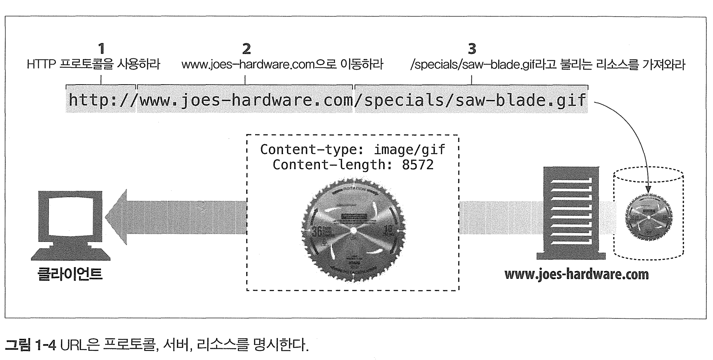

# I. HTTP: 웹의 기초

[toc]


# 1장 HTTP 개관

# 1.1 HTTP: 인터넷의 멀티미디어 배달부

# 1.2 웹 클라이언트와 서버

# 1.3 리소스


어떤 종류의 콘텐츠 소스도 리소스가 될 수 있다.

정적 파일, 이미지, 동영상, 워드, 게이트웨이, 검색엔진도

## 미디어 타입

수천가지 데이터 타입을 다루기 위해 HTTP는 웹에서 전송되는 객체 각각에 MIME 타입이라는 데이터 포맷 라벨을 붙인다.

* Multipurpose Internet Mail Extensions : 다목적 인터넷 메일 확장
* 원래는 각기 다른 전자메일 시스템 사이에서 메시지가 오갈 때 겪는 문제점을 해결하기 위해 설계되었지만 HTTP에서도 콘텐츠를 기술하기 위해 채택

```http
Content-type: image/jpeg // MIME 타입
```

* 주 타입(primary object type) / 부 타입(specific subtype) 으로 이루어진 문자열 라벨


### URI - (Uniform resource identifier)

서버 리소스 이름은 통합 자원 식별자 (URI, uniform resource identifier)라고 불린다.

```
http://www.joes-hardware.com/specials/saw-blade.gif // 이런식으로
```

HTTP는 주어진 URI로 객체를 찾아온다.

URI는 URL과 URN을 포괄하는 넓은 범주에 속한다.



### URL (uniform resource location, URL)

URL은 특정 서버의 리소스에 대한 구체적인 위치를 의미한다.

* 리소스의 위치와 그 위치에 접근하는 방법을 지정하는 URI의 하위 집합

대부분의 URL은 세 부분으로 이루어진 표준 포맷을 따른다.

- URL의 첫 번째 부분은 스킴(scheme)이라고 불리는데, 리소스에 접근하기 위해 사용되는 프로토콜을 서술한다. 보통 HTTP 프로토콜(http://)이다.
- 두 번째 부분은 서버의 인터넷 주소를 제공한다(예: www.joes-hardware.com).
- 마지막은 웹 서버의 리소스를 가리킨다(예: /specials/saw-blade.gif).

```text
https://www.abc.com/special/saw-blade..gif
```

오늘날의 위와 같은 **URL**이 **URI**가 되는 것이다!

*  보통 첫번째로 `https://` 가 **scheme** 이 되고,

*  두번째로  `www.abc.com` 이 인터넷 서버의 주소,

*  마지막인 `/special/saw-blade.gif` 가 리소스가 되는 것이다!

오늘날 대부분의 URI는 URL 이다.

### URN (Uniform resource name)

URN은 리소스의 **특정 이름**을 지칭한다.

이 리소스인 URN은 콘텐츠를 이룰때 위치에 영향받지 않는 유일무이한 이름 역할을 한다.

URN은 리소스의 지속적인, 위치에 독립적인 자원 식별자를 제공하려는 의도로 설계되었다.

* 그러나 효율적인 동작을 제공하기 위해 리소스 위치를 분석하기 위한 인프라 지원이 부재하여 늦춰지고 있다.

# 1.4 트랜잭션

HTTP 트랜잭션은 요청 명령(요청 메시지)과 응답 결과(응답 메시지)로 구성되어 있다. 이 상호작용은 HTTP 메시지라고 불리는 정형화된 데이터 덩어리를 통해 이루어진다.

## 메서드

HTTP 요청 메서드는 한개의 메서드를 가지며 서버에게 어떤 동작이 취해져야 하는지 말해준다.

| HTTP 메서드 | 설명                                                         |
| ----------- | ------------------------------------------------------------ |
| GET         | 클라이언트에서 지정한 리소스를 받는다                        |
| PUT         | 클라이언트에서 서버로 보낸 데이터를 지정한 이름의 리소스로 저장 |
| DELETE      | 리소스를 서버에서 삭제                                       |
| POST        | 클라이언트 데이터를 서버 게이트웨이 애플리케이션으로 보냄    |
| HEAD        | 지정한 리소스에 대한 응답에서 HTTP 헤더 부분만 받음          |

## 상태 코드

모든 HTTP 응답 메시지는 클라이언트에게 상태 코드와 함께 반환된다.

## 웹 페이지는 여러 객체로 이루어질 수 있다.

하나의 작업 또는 페이지를 위해 여러 HTTP 트랜잭션(요청과 응답)을 수행하기도 한다.

# 1.5 메시지

HTTP 메시지는 단순한 줄 단위이 문자열이며 이진 형식이 아닌 일반 텍스트이다.

HTTP는 다음의 세부분으로 이루어진다.

```
┌─────────────────────────┐ ┌─────────────────────────┐
│      요청 메시지           │ │      응답 메시지           │
├─────────────────────────┤ ├─────────────────────────┤
│ 시작줄: GET /test/...     │ │ 시작줄: HTTP/1.0 200 OK   │
│ ── 헤더 부분 시작 ──        │ │ ── 헤더 부분 시작 ──       │
│ Accept: text/*          │ │ Content-type: text/plain│
│ Accept-Language: en, fr │ │ Content-length: 19      │
│ ── 헤더 부분 종료 ──        │ │ ── 헤더 부분 종료 ──        │
│ 본문: [요청 본문 없음]       │ │ 본문: Hi! I'm a message! │
└─────────────────────────┘ └─────────────────────────┘
```

- 시작줄: 요청이라면 무엇을 해야하는지, 응답이라면 무슨일이 일어났는지 나타낸다.
- 헤더: `:`로 구분되는 이름과 하나의 값으로 구성된다.  헤더는 빈줄로 끝난다.
- 본문: 요청의 본문은 서버로 데이터를 실어 보내며, 응답의 본문은 클라이언트로 데이터를 반환한다.

# 1.6 TCP 커넥션

### TCP/IP

HTTP는 7계층 애플리케이션 계층 프로토콜이여서 네트워크 통신의 핵심 세부사항에 신경쓰지 않는다.

대신 신뢰성있는 TCP/IP에게 맡긴다.

TCP 는 다음을 제공한다.

- 오류 없는 데이터 전송
- 순서에 맞는 전달
- 조각나지 않는 데이터 스트림

일단 TCP 커넥션이 맺어지면 클라이언트와 서버간 교환되는 메시지가 없어지거나 손상되거나 순서가 뒤바뀌어 수신되는 일은 결코 없다.

### 접속, IP 주소, 포트번호

HTTP로 서버에 메시지를 전송할 수 있기 전에 IP 주소와 포트번호를 사용해 TCP/IP 커넥션을 맺어야 한다. 

웹브라우저가 어떻게 HTTP를 이용해서 사용자에게 문서를 보여줄까?

1. (a) 웹브라우저는 서버의 URL에서 호스트 명을 추출한다.
2. (b) 웹브라우저는 서버의 호스트 명을 IP로 변환한다.
3. (c) 웹브라우저는 URI에서 포트번호(있다면)를 추출한다.
4. (d) 웹브라우저는 웹 서버와 TCP 커넥션을 맺는다.
5. (e) 웹브라우저는 서버에 HTTP 요청을 보낸다. 
6. (f) 서버는 웹브라우저에 HTTP 응답을 돌려준다.
7. (g) 커넥션이 닫히면, 웹브라우저는 문서를 보여준다.


# 1.7 프로토콜 버전

## HTTP/1.0

버전 번호, 헤더, 메서드, 멀티미디어 객체 처리(Content-type) 를 0.9버전에 추가했다.

## HTTP/1.0+

급격히 웹이 진화함에 따라 HTTP 1.0에 여러 기능을 추가함. 확장된 HTTP1.0으로써 keep-alive 커넥션, 가상 호스팅, 프락시 연결 등이 추가됌 

* `Keep-Alive` 커넥션을 사용하면 단일 TCP 연결을 통해 여러 HTTP 요청과 응답을 전송할 수 있습니다. 이를 통해 연결의 성립과 종료에 따른 오버헤드를 줄여 통신 효율을 높임
* **가상 호스팅 (Virtual Hosting)**:하나의 웹 서버가 여러 도메인 이름으로 동작할 수 있도록 한다. 이를 통해 단일 서버에서 여러 웹사이트를 호스팅할 수 있다
  *  `example1.com`과 `example2.net`이라는 두 개의 웹사이트가 동일한 서버에 있을 수 있음
* Proxy : 클라이언트와 목적지 서버 사이에 위치한 중간 서버를 통해 HTTP 요청과 응답을 전송하며 보안, 캐싱, 내용 필터링 등 다양한 기능을 수행

# 1.8 웹의 구성요소

- 프락시(proxy): 클라이언트와 서버 사이에 위치한 HTTP 중개자
- 캐시: 많이 찾는 웹페이지를 클라이언트 가까이에 보관하는 HTTP 창고
- 게이트웨이: 다른 애플리케이션과 연결된 특별한 웹 서버
- 터널: 단순 HTTP 통신을 전달하기만 하는 특별한 프락시
- 에이전트: 자동화된 HTTP 요청을 만드는 준지능적 웹클라이언트

## 프락시(proxy)

HTTP 프락시 서버는 보안, 어플리케이션 통합, 성능 최적화를 위한 중요한 구성요소이다. 

클라이언트와 서버 사이에 위치하여, 클라이언트의 모든 HTTP 요청을 받아 서버에 전달한다.

주로 요청과 응답을 필터링 하는 중개자 역할을 한다

- 프락시는 주로 `보안`을 위해 사용된다
- 요청과 응답을 필터링한다.

## 캐시(cache)

웹 캐시와 캐시 프락시는 자주 찾는 것의 사본을 저장해 두는 특별한 종류의 HTTP 프락시 서버다. 클라이언트는 멀리 떨어진 웹 서버보다 근처의 캐시에서 훨 씬 더 빨리 문서를 다운 받을 수 있다. ( 사실 캐시 프락시에 대한 설명같다)

## 게이트웨이(gateway)

게이트웨이는 다른 서버들의 중개자로 동작하는 특별한 서버이다. 

주로 HTTP 트래픽을 다른 프로토콜로 변환하기 위해 사용한다.

* HTTP로 요청을 게이트웨이로 보내면 FTP로 FTP 서버로 보낸다음 다시 받아 클라이언트로 HTTP 전달 

## 터널

두 커넥션 사이에서 raw 데이터를 열어보지 않고 그대로 전달해주는 HTTP 어플리케이션이다. 

주로 `비 HTTP 데이터`를 하나 이상의 HTTP 연결을 통해 그대로 전송해주기 위해 사용한다.

## 에이전트 (Agent)

사용자 에이전트는 사용자를 위해 HTTP 요청을 만들어주는 클라이언트 프로그램이다.

* 여러 종류가 있는데, 스파이더나 웹 로봇, User-Agent 등

