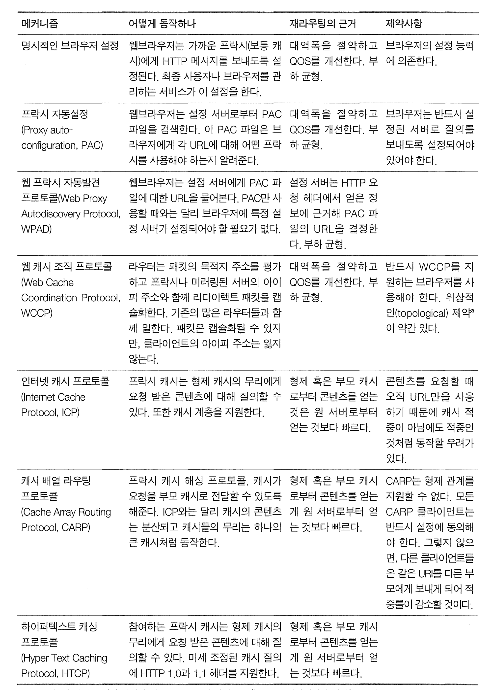

# 20장 리다이렉션과 부하 균형

주제 : 

- HTTP 리다이렉션
- DNS 리다이렉션
- 임의 캐스트 라우팅
- 정책 라우팅
- 아이피 맥 포워딩
- 아이피 주소 포워딩
- 웹 캐시 조직 프로토콜(wCCP)
- 인터캐시 커뮤니케이션 프로토콜(ICP)
- 하이퍼텍스트 캐싱 프로토콜(HTCP)
- 네트워크 요소 제어 프로토콜(NECP)
- 캐시 배열 라우팅 프로토콜(CARP)
- 웹 프락시 자동발견 프로토콜(WPAD)

# 20.1 왜 리다이렉트인가?

HTTP 애플리케이션은 다음 세가지를 원한다

* 신뢰할 수 있는 HTTP 트랜잭션 - 다이렉트는 사용자가 존재하지 않는 페이지나 오래된 정보로 이동하는 것을 방지
* 지연 최소화 - 리다이렉트를 통해 사용자는 올바른 최종 목적지로 빠르게 이동
* 네트워크 대역폭 절약 

**리다이렉션이란 최적의 분산된 콘텐츠를 찾는 것을 도와주는 기법의 집합**

리다이렉션은 보안을 강화하는 데에도 사용

*  사용자를 HTTP에서 보다 안전한 HTTPS 페이지로 이동시키거나, 
* 로그인 후 특정 페이지로 사용자를 안내하는 경우 등

# 20.2 리다이렉트 할 곳

서버,프락시,캐시,게이트웨이는 모두 서버라고 할 수 있으며 모든 리다이렉션 기법이 동작한다.

프락시로의 리다이렉트는 주 진입로의 트래픽을 근처에 있는 지름길로 보내는것이다.

# 20.3 리다이렉션 프로토콜의 개요

리다이렉션의 목표 : 웹브라우저를 다른 URL로 자동으로 보내는것. 가용가능한 웹서버로 가급쩍 빨리 보내는것이다.

* 브라우저를 프락시 서버로 리다이렉트 보내 캐싱 등을 빨리 이용하게 할수있음


**일반 리다이렉션 방법**

| 메커니즘             | 어떻게 동작하나                                              | 재라우팅의 근거                                              | 제약사항                                                     |
| -------------------- | ------------------------------------------------------------ | ------------------------------------------------------------ | ------------------------------------------------------------ |
| HTTP 리다이렉션      | 첫 번째 웹 서버로의 HTTP 요청은 콘텐츠를 제공하기에 최적인 웹 서버를 선택해줄 첫 번째 웹 서버가 요청 부하를 다룰 수 있어야 한다. 서버는 클라이언트에게 선택한 서버로의 HTTP 리다이렉트를 보내 클라이언트는 선택된 서버에게 다시 요청을 보낸다. | 라운드 로빈 부하 균형, 지연(latency) 최소화, 최단 거리 선정 등의 여러 옵션 | 모든 트랜잭션에 추가 리다이렉트 단계를 포함하게 된다.        |
| DNS 리다이렉션       | DNS 서버가 URL의 호스트명에 대한 응답으로 어떤 IP 주소를 사용할지 결정한다. | 라운드 로빈 부하 균형, 지연(latency) 최소화, 최단 거리 선정 등의 여러 옵션 | DNS 서버를 설정할 필요가 있다.                               |
| 임의 캐스트 어드레싱 | 여러 서버가 같은 IP 주소를 사용한다. 각 서버는 백본 라우터인 척 한다. 그 외의 라우터들은 그 공유된 IP 주소로 향하는 패킷을 가장 가까운 서버로 보낸다(그들이 패킷을 가장 가까운 라우터로 보내고 있다고 믿으면서). | 라우터들은 내장된 최단거리 라우팅 기능을 사용한다.           | 주소가 충돌할 위험이 있다. 만약 라우팅이 바뀌고 커넥션과 연관된 패킷들이 다른 서버들로 보내진다면, 수립된 TCP 커넥션이 깨질 수도 있다. |
| MAC 포워딩           | 스위치나 라우터 같은 네트워크 요소가 패킷의 목적지 주소를 읽는다. 만약 패킷이 리다이렉트되어야 한다면, 스위치는 그 패킷에게 서버나 프락시의 목적지 MAC 주소를 준다. | 대역폭을 절약하고 QoS (Quality of Service, 서비스 품질)를 개선한다. 부하 균형. | 서버나 프락시는 반드시 한 홉 거리에 있어야 한다.             |
| IP 주소 포워딩       | 레이어 4 스위치는 패킷의 목적지 포트를 평가하고, 리다이렉트 패킷의 IP 주소를 프락시나 미러링된 서버의 IP 주소로 바꾼다. | 대역폭을 절약하고 QoS를 개선한다. 부하 균형.                 | 서버나 프락시가 클라이언트의 IP 주소를 잃어버릴 수 있다.     |

**메시지를 프락시 서버로 리다이렉트하기 위해 사용되는 리다이렉션 방법**



# 20.4 일반적인 리다이렉션 방법


## HTTP 리다이렉션

다른곳에 요청을 보내보라고 말해주는 짧은 리다이렉트를 클라이언트에게 돌려주어 부하를 분산한다.

리다이렉션 응답은 다음과 같다.

```
HTTP/1.0 302 Redirect
Server: Stronghold/2.4.2 Apache/1.3.6
Location: http://161.58.228.45/hammers.html
```

HTTP 리다이렉션은 요청의 방향을 변경할 수 있지만 다음과 같은 단점이 있다.

* 리다이렉트 결정시, 원 서버는 많은 처리가 필요한 경우가 있다.
* 페이지 접근시 두번의 왕복이 기다리기 때문에 사용자가 더 오래 기다려야 한다
* 리다이렉트 서버가 고장나면 사이트도 고장난다.


## DNS 리다이렉션

DNS 분석자는 여러 아이피 주소를 반환하도록 설정할 수 있다. 

어떤 아이피 주소를 반환할것인가는 단순한 알고리즘부터 복잡한 알고리즘을 지원한다.

### DNS 라운드 로빈

가장 단순한 리다이렉션 기법. 

DNS 호스트명 분석 기능을 사용하여 리다이렉션하여 부하를 분산한다. 

### 다중 주소와 라운드 로빈 주소 순환

대부분 DNS 클라이언트는 대부분 다중 주소 집합의 첫번째 주소를 사용한다.

룩업이 끝났을때마다 주소를 순환시켜 이 주소 순환을 DNS 라운드 로빈이라 부르기도 한다.

### 부하 균형을 위한 DNS 라운드 로빈

부하의 균형을 위해 DNS 라운드 로빈 순환은 이렇게 동작한다.

*  DNS 서버는 동일한 도메인 이름에 대해 여러 IP 주소를 순차적으로 반환
* 클라이언트가 조회시마다 다음 순서의 IP주소를 제공하여 트래픽 분산

- **장점**:
  - **간단하고 쉽게 구현 가능**: 복잡한 부하 분산 장치 없이도 트래픽 분산이 가능
  - **비용 효율적**: 추가적인 하드웨어나 소프트웨어 비용이 들지 않는다.
- **단점**:
  - **고가용성 부족**: 한 서버가 다운되면, 그 서버에 할당되는 트래픽은 에러를 경험할 수 있다. 
  - **균등 분산의 한계**: 모든 서버가 동일한 성능과 용량을 가진 것이 아니라면, 트래픽 분산이 균등하게 이루어지지 않을 수 있다.
  - **캐싱과의 상호작용**: 클라이언트 또는 중간 네트워크 장비의 DNS 캐싱으로 인해 실제로는 트래픽이 균등하게 분산되지 않을 수 있다.

제일 단점은, 애플리케이션, OS,자식 DNS 서버에 의해 캐싱될 수 있어 다음 요청시에는 캐시에 저장된 주소로 요청을 보내 주소를 몇번이고 사용되어서 제대로 분산 되지 않을 수도 있다.

### 다른 DNS 기반 리다이렉션 알고리즘

**부하 균형 알고리즘** : DNS 서버는 웹 서버의 로드를 추적하고 가장 로드가 적은 웹 서버를 반환한다.

* 장점
  - **고가용성**: 한 서버에 문제가 생겨도 다른 서버가 요청을 처리할 수 있어 시스템의 가용성이 높다.
  - **균등한 자원 분배**: 자원을 효과적으로 분산시켜 각 서버의 부하를 줄인다.
* 단점
  - **복잡성 증가**: 부하 분산을 위한 추가적인 구성 및 관리가 필요하다.
  - **비용**: 부하 분산 장치나 소프트웨어에 대한 투자가 필요하다.
* **하드웨어 기반 부하 분산 장치(Load Balancer)** 또는 **소프트웨어 기반 솔루션** (예: NGINX, HAProxy)을 사용

**근접 라우팅 알고리즘** : 웹 서버들의 팜이 지리적으로 분산되어 있는 경우, 사용자에게 가장 가까운 서버로 트래픽을 라우팅하는 방법

* 장점
  - **속도 향상**: 사용자에게 물리적으로 가까운 서버에서 응답을 제공함으로써 응답 시간이 단축
  - **로컬 콘텐츠 제공**: 지역별 특화된 콘텐츠 제공이 용이
* 단점
  - **지리적 데이터의 정확성**: IP 주소 기반의 위치 결정은 항상 정확하지 않을 수 있다.
  - **관리 복잡성**: 여러 위치에 서버를 유지하고 관리
* CDN 또는 **GeoDNS**와 같은 지리적 위치 기반의 DNS 서비스

**결함 마스킹 알고리즘** : DNS 서버는 네트워크의 건강 상태를 모니터링하고 여러 서버가 동일한 IP 주소를 공유하고, 네트워크는 가장 가까운 서버로 사용자의 요청을 라우팅하는 방식 

* 장점
  - **효율적인 트래픽 분산**: 네트워크 트래픽이 자동으로 가장 가까운 서버로 라우팅되어 처리
  - **빠른 응답 시간**: 사용자에게 가장 가까운 서버가 응답을 처리하여 빠른 서비스 제공이 가능합
* 단점
  - **TCP 연결의 복잡성**: 동일한 IP 주소를 공유하는 서버 간에 TCP 연결이 복잡 


## 아이피 맥 포워딩

이더넷 네트워크에서 HTTP메시지는 주소가 붙은 데이터 패킷(출발지 목적지 IP, TCP 포트번호) 의 형태로 보내진다.

MAC 주소를 보고 특정 MAC 주소로도 라우팅 할 수 있다. (2계층 창비 스위치나 허브)

MAC 주소 포워딩은 점 대 점으로만 가능하기 때문에, 서버나 프락시는 스위치와 한 흡 거리에 위치해야 한다.

## 아이피 주소 포워딩

 3계층 장비는 패킷에 대해 아이피주소에 따라 라우팅한다. 

# 20.5 프락시 리다이렉션 방법

클라이언트들이 프락시의 위치를 찾는법

* 브라우저 설정
* 프락시 동적 자동 설정
* 가로채기

프락시는 클라이언트의 요청을 다른 프락시로 리다이렉트 한다.

* 요청받은 프락시캐시가 캐시가 없다면, 캐시가 있는 다른 프락시서버로 리다이렉트

## 명시적 브라우저 설정

브라우저에서 프락시 이름, 아이피 주소, 포트번호를 설정하여 프락시로 요청을 보낼 수 있다.

단점

* 프락시를 사용하면 프락시 장애 등에 의해 응답하지 않더라도 원 서버와 접촉하지 않음 -> 접속 불가
* 네트워크 아키텍처 변경시, 변경사항을 모든 클라이언트에게 전파할 수 없음

## 프락시 자동 설정

브라우저가 동적으로 프락시 서버를 설정

( Proxy Auto-configuration PAC 프로토콜)

PAC는 프락시를 지정한 PAC라는 파일을 얻기 위해 지정된 서버에 접속하여, 브라우저 재시작시마다 PAC를 가져와 호출한다.

현재는 잘 쓰이지 않는다

## 프락시 자동 발견 프로토콜 (WPAD)

브라우저가 근처의 프락시를 자동으로 찾아내어 사용할 수 있음.

* 여전히 잘 사용 안함. 브라우저마다 차이가 있기 때문

# 20.6 캐시 리다이렉션 방법

## WCCP 리다이렉션

시스코 시스템즈가 개발. 버전 2가 개방된 프로토콜임. 

라우터들과 캐시사이의 대화를 관리하여 라우터가 캐시를 동작중인지 검사하여 트래픽을 특정 캐시로보냄

* 일부 시소코 장비를 사용하는 네트워크나 대규모 네트워크에서 가끔씩 사용한다고 한다
* 클라우드, CDN 등으로 인해 현대에서는 잘 안사용하는 추세 