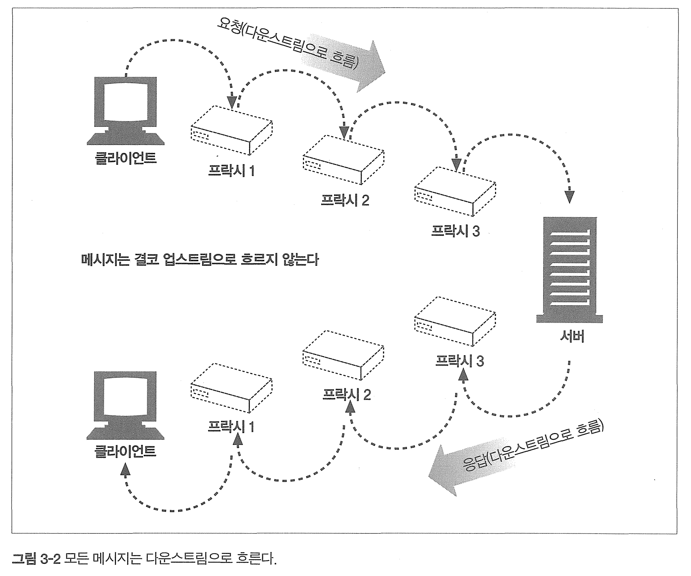
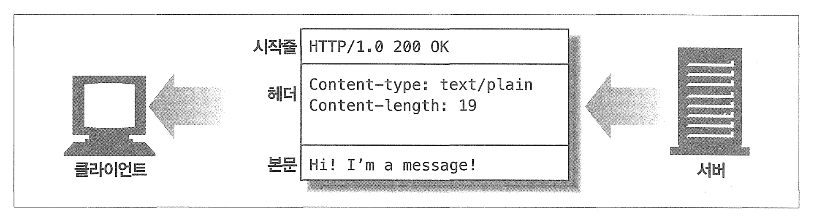
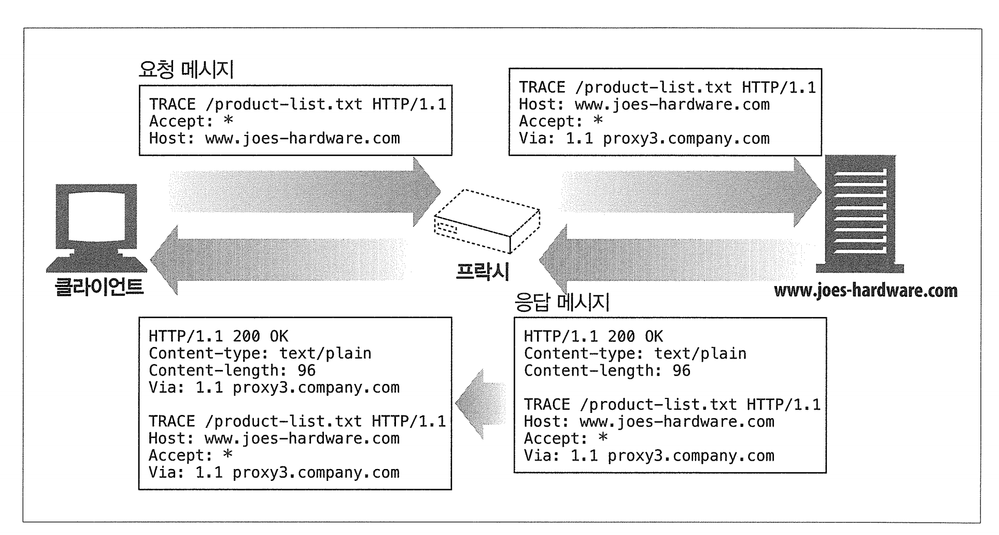
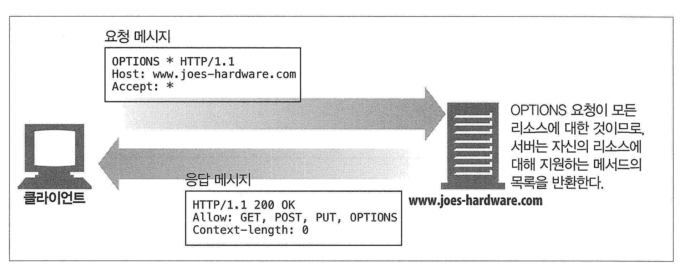

# 3장 HTTP 메시지

[toc]

- 메시지가 어떻게 흘러가는가
- HTTP 메시지의 세 부분(시작줄, 헤더, 개체 본문)
- 요청과 응답 메시지의 차이
- 요청 메시지가 지원하는 여러 기능(메서드)들
- 응답 메시지가 반환하는 여러 상태 코드들
- 여러 HTTP 헤더들은 무슨 일을 하는가

# 3.1 메시지의 흐름

HTTP 메세지는 애플리케이션 간에 주고받은 데이터의 블록들이다.

- 메시지의 내용과 의미를 설명하는 `메타 정보(헤더)`로 시작하고,  `데이터`가 들어있을수도, 아닐수도 있다.

HTTP 메시지는 메시지가 흘러가는 방향에 따라 '인바운드', '아웃바운드', '업스트림', '다운스트림'으로 나뉜다

* 인바운드(Inbound) 트래픽 :  서버로 들어오는 요청을 의미한다. 이 용어는 서버 관점에서 사용되며, 서버로 들어오는 트래픽을 가리킨다.
  * **서버-서버 (마이크로서비스) 입장에서:** 한 서버가 다른 서버로 요청을 보낼 때, 이 요청은 받는 서버의 관점에서 '인바운드'이다

* 아웃바운드(Outbound) 트래픽:  "아웃바운드" 메시지는 서버에서 클라이언트로 나가는 응답이다. 서버 관점에서의 용어이며, 서버에서 나가는 트래픽을 의미한다.
  * **서버-서버 (마이크로서비스) 입장에서:** 한 서버가 요청받은 서버로 응답을 보낼 때, 보내는 서버의 관점에서 그 메시지는 '아웃바운드'다

* 업스트림(Upstream) : "업스트림"은 일반적으로 클라이언트에서 서버로 향하는 방향을 가리키는데 사용된다. 즉, 요청을 보내는 쪽으로의 흐름이다. 
  * **서버-서버 (마이크로서비스) 입장에서:** 종속된 서비스(예: 데이터베이스 서비스)로 가는 요청은 상위 서비스(예: 애플리케이션 서버)에서 '업스트림'으로 간주된다.

* 다운스트림(Downstream):  업스트림의 반대 방향, 즉 서버에서 클라이언트로 흐르는 방향을 말한다. 서버가 응답을 클라이언트에 보내는 경우, 그 응답 메시지는 다운스트림이라고 말할 수 있다. 
  * **서버-서버 (마이크로서비스) 입장에서:** 상위 서비스로부터 요청을 받는 서비스(예: 애플리케이션 서버가 요청을 받는 경우)는 '다운스트림'에서 작동된다.

## 메시지는 원 서버 방향을 인바운드로 하여 송신된다. 

메시지는 서버로 향할 때 보내지는데, 이를 '인바운드'라고 부른다는 뜻이다.

모든 처리가 끝난뒤에 메시지는 클라이언트로 돌아가는데 이를 아웃바운드라고 부른다.

## 다운스트림으로 흐르는 메시지

요청메시지냐 응답메시지냐에 관계 없이 모든 메시지는 다운스트림으로 흐르며, 

메시지의 발송자는 수신자의 업스트림이다. 



# 3.2 메시지의 각 부분

각 메세지는 시작줄, 헤더 블록, 본문 세 부분으로 이루어지며,

어떤 메시지인지를 서술하는 `시작줄`, 속성을 나타내는 `헤더 블록`, 데이터를 담고있는 `본문`으로 나뉜다.



```http
HTTP/1.1 200 OK\r\n
Date: Sat, 09 Oct 2021 19:43:31 GMT\r\n
Server: Apache/2.4.37 (Unix)\r\n
Last-Modified: Sat, 09 Oct 2021 19:43:31 GMT\r\n
Content-Length: 438\r\n
Content-Type: text/html; charset=UTF-8\r\n
Connection: close\r\n
\r\n
본문~
```

## 메시지 문법

요청 메시지의 형식은 다음과 같다.

```
// 요청 메시지 형식

<메서드> <요청 URL> <버전>
<헤더>
<엔터티 본문>
```


응답 메시지 형식은 다음과 같다

```
// 응답 메시지 형식

<메서드> <상태 코드> <사유 구절>
<헤더>
<엔터티 본문>
```

- 메서드(Method): 서버가 리소스에 대해 수행해주길 바라는 동작.
  - 예시: `GET` (서버에게 리소스를 요청할 때 사용)
- 요청 URL(Request URL): 요청 대상이 되는 리소스를 지칭하는 URL. 완전한 URL이거나 혹은 경로 구성요소 path다
  - 예시: `/index.html` (도메인 루트에 있는 'index.html' 파일을 지칭)
- 버전(Version): 메시지에서 사용하는 HTTP 버전.
  - 예시: `HTTP/1.1` (HTTP 버전 1.1을 사용하고 있음을 나타냄) 메이저.마이너
- 상태코드(Status Code): 성공, 에러 등을 나타내는 세 자리의 숫자.
  - 예시: `200` (요청이 성공적으로 처리되었음을 나타냄)
- 사유 구절(Reason Phrase): 숫자로 된 상태 코드의 의미를 사람이 이해할 수 있게 설명해주는 문구.
  - 예시: `OK` (상태 코드 `200`에 대한 설명)
- 헤더들(Headers): 이름, 콜론, 선택적인 공백, 값, CRLF가 순서대로 나타나는 0개 이상의 헤더들.
  - 예시: `Content-Type: text/html\r\n` (리소스의 미디어 타입을 나타냄)
- 엔터티 본문(Entity Body): 데이터 블록을 포함한다.
  - 예시: (HTML 문서가 본문에 포함될 경우) `<html>...</html>` (본문에 HTML 문서 데이터 포함)

## 시작줄

모든 HTTP 메시지는 시작줄로 시작하며 요청메시지의 시작줄은 무엇을 해야하는지, 응답메시지의 시작줄은 무슨 일이 일어났는지 말해준다.

- 요청줄: 서버에서 어떤 동작이 일어나야 하는지 설명해주는 메서드와 동작에 대한 대상을 지칭하는 요청 URL 이 들어있다
- 응답줄: 응답 메시지에서 쓰인 HTTP 의 버전, 숫자로 된 상태 코드, 수행 상태에 대해 설명해주는 텍스트 사유구절
- 메서드: 서버에게 무엇을 해야하는지 말해준다.
- 상태코드: 클라이언트에게 무엇이 일어났는지 말해준다. (100 - 정보, 200 - 성공, 300 - 리다이렉션, 400 - 클라이언트 에러, 500 - 서버에러)
- 사유구절: 상태 코드에 대한 글로 된 설명을 제공한다.
- `버전 번호: 응답, 요청 메세지 모두에 기술된다. 자신이 따르는 프로토콜 버전을 상대방에게 말해주기 위한 수단이 된다.`
  - 버전 번호는 어떤 애플리케이션이 지원하는 가장 높은 HTTP 버전을 가리킨다.
  - 즉 응답에 HTTP/2.0이 있다는건 이는, 응답하는 서버가 HTTP/2.0까지 이해할 수 있음을 의미한다. 

## 헤더

헤더 필드는 요청과 응답 메시지에 추가 정보를 더한다.

- 일반 헤더: 요청과 응답 양쪽에 모두 나타낼 수 있다.
- 요청 헤더: 요청에 대한 부가 정보를 제공
- 응답 헤더: 응답에 대한 부가 정보를 제공
- Entity 헤더: 본문 크기와 콘텐츠, 리소스 그 자체를 서술
  - **엔터티**는 HTTP 메시지를 통해 전송되는 리소스의 표현 (Payload)
  - 리소스와 비슷한 의미로 사용된다(같은건 아님.) 
- 확장 헤더: 명세에 정의되지 않은 새로운 헤더

| 헤더의 예                                | 설명                                                     |
| ---------------------------------------- | -------------------------------------------------------- |
| Date: Tue, 3 Oct 1997 02:16:03 GMT       | 서버가 응담을 만들어 낸 시각                             |
| Content-length: 15040                    | 15,040바이트의 데이터를 포함한 엔터티 본문               |
| Content-type: image/gif                  | `엔터티 `본문은 GIF 이미지다                             |
| Accept: image/gif, image/jpeg, text/html | 클라이언트는 GIF, JPEG 이미지와 HTML을 받아들일 수 있다. |

## 엔터티 본문

HTTP 메시지의 화물로, HTTP가 수송하게 된다.

이미지, 비디오, HTML문서, 소프트웨어 애플리케이션, 신용카드 트랜잭션, 전자 우편 등 여러 종류의 디지털 데이터를 실어 나를 수 있다.

# 3.3 메서드

요청의 시작줄에 있으며, 서버에게 무엇을 해야 하는지 말해준다.

| 메서드  | 설명                                                    | 메시지 본문이 있는가? |
| ------- | ------------------------------------------------------- | --------------------- |
| GET     | 서버에서 어떤 문서를 가져온다.                          | 없음                  |
| HEAD    | 서버에서 어떤 문서에 대한 헤더만 가져온다.              | 없음                  |
| POST    | 서버가 처리해야 할 데이터를 보낸다.                     | 있음                  |
| PUT     | 서버에 요청 메시지의 본문을 저장한다.                   | 있음                  |
| TRACE   | 메시지가 프락시를 거쳐 서버에 도달하는 과정을 추적한다. | 없음                  |
| OPTIONS | 서버가 어떤 메서드를 수행할 수 있는지 확인한다.         | 없음                  |
| DELETE  | 서버에서 문서를 제거한다.                               | 없음                  |


## 안전한 메서드

GET, HEAD 메서드는 안전한 메서드이다. 이는 HTTP 요청의 결과로 서버에 어떤 작용도 없음을 의미한다.

### GET

서버에게 리소스를 달라고 요청하기 위해 쓰인다

### HEAD

GET처럼 동작하지만, 응답 메시지에 헤더만 있음(본문 없음)

- 리소스를 가져오지 않고도 타입 등의 정보를 알아낼 수 있음 (Content-type 등으로)
- 응답 상태 코드를 보고 개체가 존재하는지 확인할 수 있음
- 리소스가 변경되었는지 여부를 확인할 수 있음

- 서버 개발자들은 GET과 HEAD의 헤더가 정확히 일치하도록 구현해야 한다.

### PUT

서버가 요청의 본문을 가지고 요청 URL 의 이름대로 새 문서를 만들거나, 이미 URL 이 존재한다면 본문을 사용해서 교체하는 것이다.

* 요청 본문을 가지고 요청 URL의 이름대로 새 문서를 만들거나, 이미 URL이 존재한다면 본문을 사용해서 교체함

- 콘텐츠 변경이 수반되기 때문에 많은 웹서버가 PUT을 수행하기 전에 비밀번호를 입력해서 로그인을 하도록 요구함

### POST

서버에 입력 데이터를 전송

### TRACE

클라이언트에게 자신의 요청이 서버에 도달했을 때 어떻게 보이게 되는지 알려주는 메서드

- 진단을 위해 주로 사용됨



`TRACE` 요청의 목적은 클라이언트와 서버 사이의 요청/응답 사이클에서 발생하는 변경이나 추가를 확인하는 것이다.

* 예를 들어, 중간에 위치한 프락시 서버가 요청 헤더에 필드를 추가하거나 변경
* `TRACE` 메서드는 이러한 변경 사항을 클라이언트가 발견할 수 있게 해주어, HTTP 통신이 의도한 대로 정확하게 이루어지고 있는지 검증할 수 있도록 도와준다.
* 하지만 XST 등의 공격과 같은 보안상의 이유로 `TRACE` 메서드는 실제 웹 애플리케이션에서는 거의 사용되지 않는다.

### OPTIONS

웹 서버에게 여러 가지 종류의 지원 범위에 대해 물어본다. 

서버에게 특정 리소스에 대해 어떤 메서드가 지원되는지 물어볼 수 있다.



- 예시:`Allow: GET, POST, PUT, OPTIONS`

### 확장 메서드

HTTP/1.1 명세에 정의되지 않은 메서드로, 개발자가 필요에 따라 설계할 수 있다

| 메서드 | 설명                                                         |
| ------ | ------------------------------------------------------------ |
| LOCK   | 사용자가 리소스를 잠글 수 있게 해준다. 예를 들어, 문서를 편집하는 동안 다른 사람이 동시에 같은 문서를 편집하지 못하도록 문서를 잠글 수 있다. |
| MKCOL  | 사용자가 서버에 새로운 컬렉션(보통 디렉터리)을 생성할 수 있게 해준다. |
| COPY   | 서버에 있는 리소스를 복사한다.                               |
| MOVE   | 서버에 있는 리소스를 다른 위치로 옮긴다.                     |

확장 메서드(그리고 대부분의 HTTP 확 장)를 다룰 때는 "엄격하게 보내고 관대하게 받아들여라"리는 오랜 규칙에 따르는 것이 가장 좋다.

# 3.4 상태 코드

| 전체 범위 | 정의된 범위 | 분류             |
| --------- | ----------- | ---------------- |
| 100-199   | 100-101     | 정보성 상태 코드 |
| 200-299   | 20-206      | 성공             |
| 300-399   | 300-305     | 리다이렉션       |
| 400-499   | 400-415     | 클라이언트 에러  |
| 500-599   | 500-505     | 서버 에러        |


### 100번대 - 정보성 상태 코드 

| 상태 코드 | 사유 구절           | 의미                                                         |
| --------- | ------------------- | ------------------------------------------------------------ |
| 100       | Continue            | 요청의 시작 부분 일부가 받아들여졌으며, 클라이언트는 나머지를 계속 이어서 보내야 함을 의미한다. 이것을 보낸 후, 서버는 반드시 요청을 받아 응답해야 한다. 더 자세한 정보는 부록 C의 Expect 헤더를 보라. |
| 101       | Switching Protocols | 클라이언트가 Upgrade 헤더에 나열한 것 중 하나로 서버가 프로토콜을 바꾸었음을 의미한다. |

### 200번대 - 성공 상태 코드 

| 상태코드 | 사유구절                      | 의미                                                         |
| -------- | ----------------------------- | ------------------------------------------------------------ |
| 200      | OK                            | 요청은 정상이고, 엔터티 본문은 요청된 리소스를 포함하고 있다. |
| 201      | Created                       | 서버 개체를 생성하라는 요청(예: PUT)을 위한 것. 응답은, 생성된 리소스에 대한 최대한 구체적인 참조가 담긴 Location 헤더와 함께, 그 리소스를 참조할 수 있는 여러 URL을 엔터티 본문에 포함해야 한다. 서버는 상태 코드를 보내기에 앞서 반드시 객체를 생성해야 한다. |
| 202      | Accepted                      | 요청은 받아들여졌으나 서버는 아직 어떤 동작도 수행하지 않았다. |
| 203      | Non-Authoritative Information | 엔터티 헤더가 아닌 리소스의 사본에서 왔다.                   |
| 204      | No Content                    | 응답 메시지는 헤더와 상태줄을 포함하지만 엔터티 본문은 포함하지 않는다. |
| 205      | Reset Content                 | 브라우저에게 현재 페이지에 있는 HTML 폼에 채워진 모든 값을 비우라고 한다. |
| 206      | Partial Content               | 부분 혹은 범위 요청이 성공했다.                              |

### 300번대 - 리다이렉션 상태 코드

다른 위치를 사용하라고 말해주거나, 다른 응답을 준다.

리다이렉션 상태 코드와 선택적으로 Location 헤더를 보낼 수 있다. 브라우저가 알아서 이동하게 해준다.

| 상태코드 | 사유구절           | 의미                                                         |
| -------- | ------------------ | ------------------------------------------------------------ |
| 300      | multiple choices   | 클라이언트가 여러 리소스를 가리키는 URL 을 요청한 경우, 그 리소스의 목록과 함께 반환한다 |
| 301      | moved permanently  | 요청한 URL이 옮겨졌을 때 사용한다.                           |
| 302      | found              | 301 상태코드와 같다. 그러나 클라이언트는 location 헤더로 주어진 URL을 리소스를 임시로 가리키기 위한 목적으로 사용해야한다. |
| 303      | see other          | 리소스를 다른 URL에서 가져와야 한다고 말해주고자 할때 쓰인다 |
| 304      | not modified       | 헤더를 이용해 조건부 요청을 만들 수 있다.                    |
| 305      | use proxy          | 리소스가 반드시 프락시를 통해서 접근되어야 함을 나타내기 위해 사용한다. |
| 307      | temporary redirect | 301 상태코드와 같다. 그러나 클라이언트는 location 헤더로 주어진 URL을 리소스를 임시로 가리키기 위한 목적으로 사용해야한다. 이후 요청에서는 원래 URL을 사용해야 한다. |

HTTP 1.0과 1.1의 차이로 인해 1.1은 일시적인 리다이렉트를 위해 307을 사용하라고 권고하며, 서버는 302를 1.0을 위해 남겨둔다.

### 400번대 - 클라이언트 에러 상태 코드

| 상태코드 | 사유구절                        | 의미                                                         |
| -------- | ------------------------------- | ------------------------------------------------------------ |
| 400      | bad request                     | 잘못된 요청                                                  |
| 401      | unauthorized                    | 인증하라고 요구하는 내용의 응답을 적절한 헤더와 함께 반환한다. |
| 402      | payment required                | 현재 사용되지 않고있다.                                      |
| 403      | forbidden                       | 요청이 서버에 의해 거부되었음을 알려주기 위해 사용           |
| 404      | not found                       | 요청한 URL을 찾을 수 없음을 알려주기 위해 사용               |
| 405      | method not allowed              | 지원하지 않는 메서드로 요청을받았을 때 사용                  |
| 406      | not aceeptable                  | 어떤 종류의 엔터티를 받아들이고자 하는지에 대해 매개변수로 명시할 수 있다. |
| 407      | proxy authentication required   | 401 상태코드와 같으나, 리소스에 대해 인증을 요구하는 프락시 서버를 위해 사용한다 |
| 408      | request timeout                 | 요청을 완수하기에 시간이 너무 많이 걸리는 경우, 서버는 408 코드를 반환하고 응답하고 연결을 끊을 수 있다 |
| 409      | confilct                        | 리소스에 대해 일으킬 수 있는 몇몇 충돌을 지칭하기 위해 사용  |
| 410      | gone                            | 404와 비슷하나 서버가 한때 그 리소스를 가지고 있었다는 점이 다르다 |
| 411      | length required                 | 서버가 요청 메시지에 content-length 헤더가 있을 것을 요구한다 |
| 412      | precondition failed             | 조건부 요청을 했는데 그중 하나가 실패했을 때 사용한다        |
| 413      | request entity too large        | 한계의 크기를 넘은 요청을 클라이언트가 보냈을때              |
| 414      | request uri to long             | 한계의 길이를 넘은 요청 url 이 포함된 클라이언트가 보냈을때  |
| 415      | unsupported media type          | 서버가 이해하거나 지원하지 못하는 내용 유형의 엔터티를 클라이언트가 보넀을 때 사용 |
| 416      | requested range not satisfiable | 요청 메시지가 리소스의 특정 범위를 요청했는데, 그 범위가 잘못되었거나 맞지 않을때 |
| 417      | expectation failed              | 요청에 포함된 expect 요청 헤더에 서버가 만족시킬 수 없는 기대가 담겨있는 경우 사용 |

### 500 - 서버 에러 상태 코드

| 상태코드 | 사유구절                   | 의미                                                         |
| -------- | -------------------------- | ------------------------------------------------------------ |
| 500      | internal sever error       | 서버가 요청을 처리할 수 없게 만드는 에러를 만났을 때 사용    |
| 501      | not implemented            | 클라이언트가 서버의 능력을 넘은 요청을 했을 때 (지원 x 메서드 등) |
| 502      | bad gateway                | 가짜 응답에 맞닥뜨렸을 때 사용                               |
| 503      | service unavailable        | 현재는 요청을 처리할 수 없지만 나중에는 가능함을 의미        |
| 504      | gateway timeout            | 408과 비슷하지만 응답을 기다리다 타임아웃이 발생한 게이트웨이나 프락시에서 온 응답이라는점이 다르다 |
| 505      | http version not supported | 지원하지 않으려고 하는 버전의 프로토콜로 된 요청을 받았을 때 |

# 3.5 헤더

헤더와 메서드는 클라이언트와 서버가 무엇을 하는지 결정하기 위해서 사용된다.

- 일반헤더: 서버, 클라이언트 양쪽에서 사용, 메시지를 보내는 다른 애플리케이션들을 위해 다양한 목적으로 사용
- 요청 헤더: 요청 메시지를 위한 헤더, 서버에게 클라이언트가 받고자 하는 데이터의 타입이 무엇인지와 같은 정보를 제공
- 응답 헤더: 응답 메세지는 클라이언트에게 정보를 제공하기 위한 자신만의 헤더를 가지고 있다.
- 엔터티 헤더: 본문에 대한 헤더를 말한다. 본문에 들어있는 데이터의 타입이 무서인지 말해줄 수 있다.
- 확장 헤더: 비표준 헤더다.

### 일반 캐시 헤더

- cache-control: 메시지와 함께 캐시 지시자를 전달하기 위해 사용한다.
- pragma: 메시지와 함께 지시자를 전달하는 또 다른 방법. 캐시에 국한되지 않는다.

### ACCEPT 관련 헤더

서버에게 자신의 선호와 능력을 알려 줄 수 있다. 서버는 이 정보를 활용해서 무엇을 보낼 것인가에 대한 처리를 할 수 있다.

- accept: 보내도 되는 미디어의 종류
- accept - charset, encoding, language, te: 보내도되는 문자집합, 인코딩, 언어, 전송코딩

### 요청 보안 헤더

HTTP는 자체적으로 요청을 위한 간단한 인증요구/응답 체계를 갖고 있다.

- authorization: 클라이언트가 서버에게 제공하는 인증 그 자체에 대한 정보를 담고있다.
- cookie: 클라이언트가 서버에게 토큰을 전달할 때 사용한다.
- cookie2: 요청자가 지원하는 쿠키의 버전을 알려줄 때 사용한다.

### Proxy 요청 헤더 

프락시의 기능을 돕기 위해 몇몇 헤더들이 정의되었다.

- max-forwards: 프락시나 게이트웨이로 전달될 수 있는 최대 횟수
- proxy-authorization: 프락시에서 인증을 할 때 쓰인다.
- proxy-connect: 프락시에서 연결을 맺을 때 쓰인다.

## 응답 헤더

클라이언트에게 부가 정보를 제공한다.

- age: 응답이 얼마나 오래되었는지
- public: 특정 리소스에 대해 지원하는 요청 메서드의 목록
- retry-after: 현재 리소스가 사용불가일때 언제 가능해지는지 날짜 혹은 시각
- server: 서버 애플리케이션의 이름과 버전
- title: html 문서에서 주어진 것과 같은 제목
- warning: 사유 구절에 있는 것보다 더 자세한 경고 메세지

## 엔티티 헤더

엔터티와 그것의 내용물에 대한, 개체의 타입부터 시작해서 주어진 리소스에 대해 요청 할 수 있는 유요한 메서드들까지 광범위한 정보를 제공한다.

- allow: 수행될 수 있는 요청 메서드들을 나열한다.
- location: 클라이언트에게 엔터티가 실제로 어디에 위치하고 있는지 말해준다.

### 콘텐츠 헤더 (Content)

엔터티의 콘텐츠에 대한 구체적인 정보를 제공한다.

- content-base: 기저 url
- content-encoding: 적용된 인코딩
- content-language: 적절한 언어
- content-length: 본문의 길이나 크기
- content-location: 리소스의 위치
- content-md5: md5 체크섬
- content-range: 범위를 바이트 단위로 표현
- content-type: 어떤 종류의 객체인지

## 엔티티 캐싱 헤더

언제 어떻게 캐시가 되어야 하는지에 대한 지시자를 제공

- etag: 엔터티 태그
- expires: 엔터티가 더 이상 유효하지 않아 원본을 다시 받아와야 하는 일시
- last-modified: 가장 최근 엔터티가 변경된 일시

# 3.6 추가 정보

