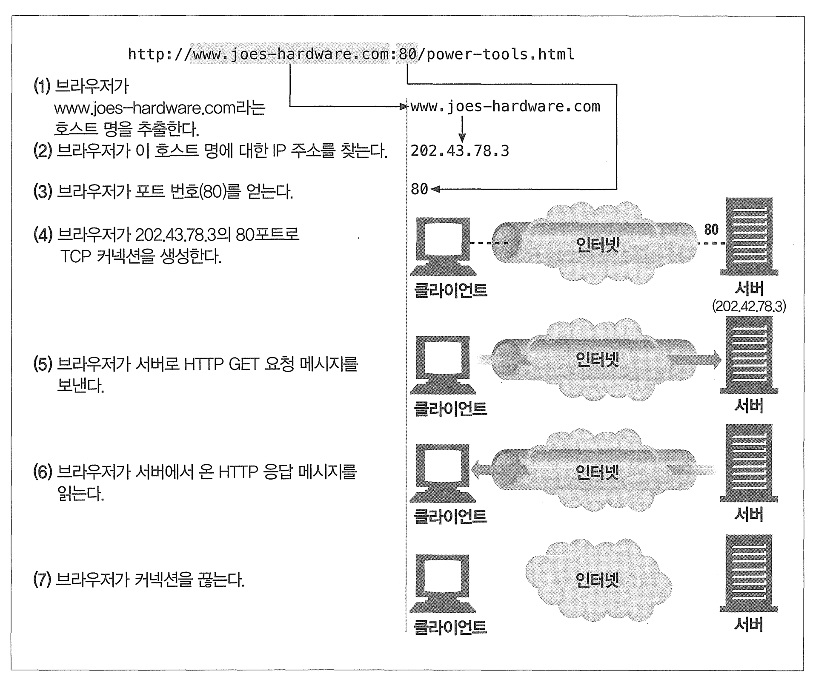
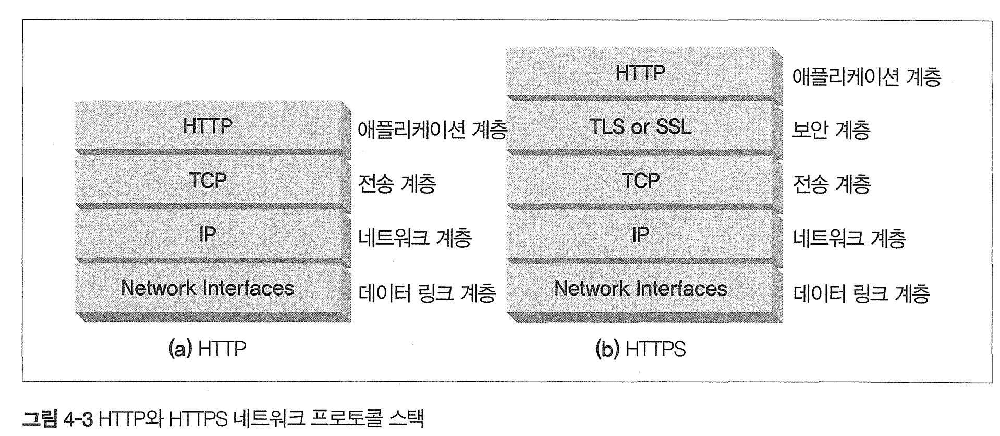
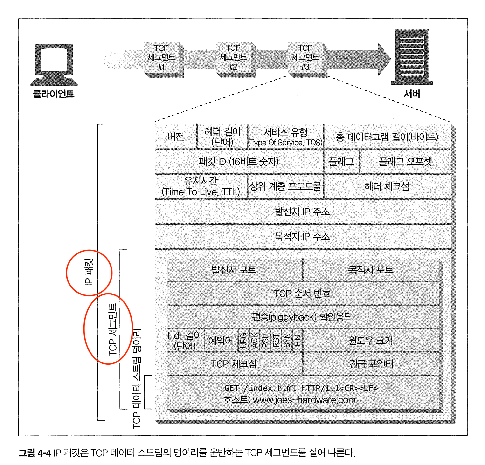
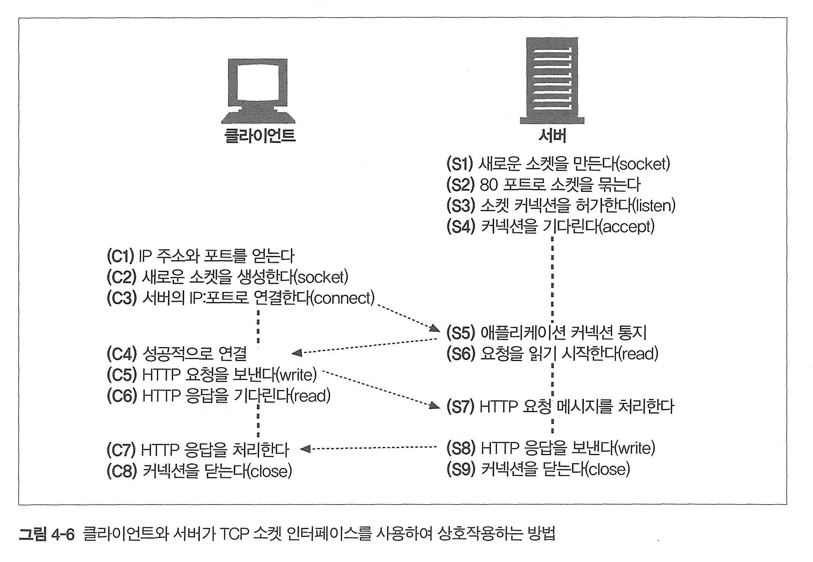
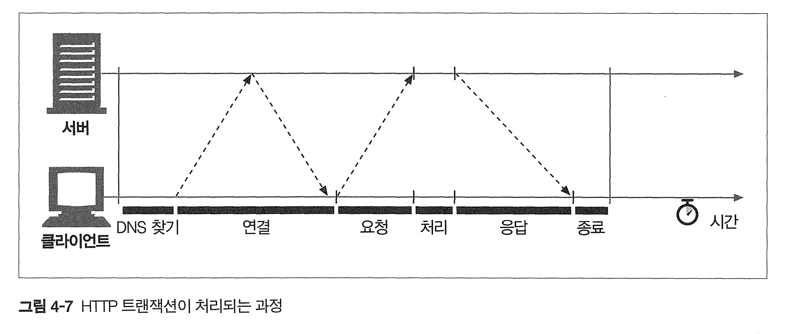
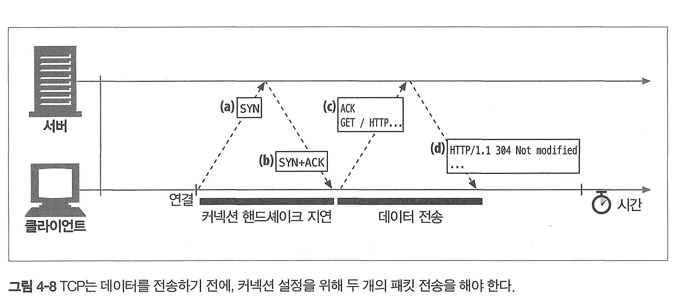
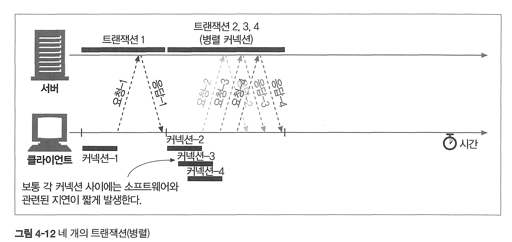
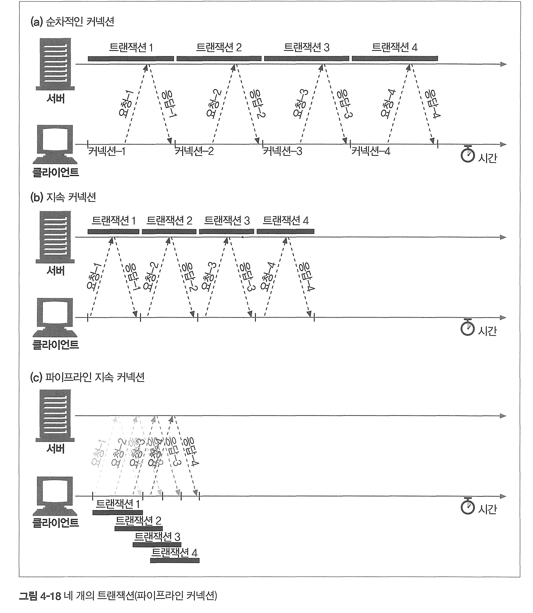
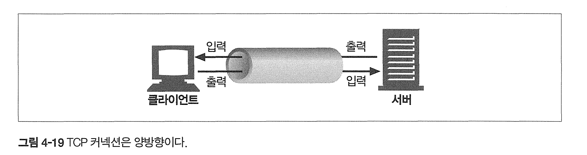
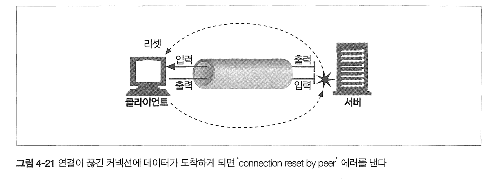

# 4장 커넥션 관리

[toc]

- HTTP는 어떻게 TCP 커넥션을 사용하는가
- TCP 커넥션의 지연, 병목, 막힘
- 병렬 커넥션,keep-alive 커넥션, 커넥션 파이프라인을 활용한 HTTP의 최적화
- 커넥션 관리를 위해 따라야 할 규칙들

# 4.1 TCP 커넥션

모든 HTTP 통신은 패킷 교환 네트워크 프로토콜들의 계층화된 집합인 TCP/IP 를 통해 이루어진다. 

커넥션이 맺어지면 클라이언트와 서버 컴퓨터 간에 주고받는 메시지들은 손실 혹은 손상되거나 순서가 바뀌지 않고 안전하게 전달된다.



## 신뢰할 수 있는 전송 통로인 TCP

TCP 커넥션은 인터넷을 안정적으로 연결해준다. TCP 는 HTTP 에게 신뢰할 만한 통신 방식을 제공한다.

## TCP 스트림은 세그먼트로 나뉘어 IP 패킷을 통해 전송된다

HTTP 가 메시지를 전송하고자 할 경우, 현재 연결되어 있는 TCP 커넥션을 통해서 메시지 데이터의 내용을 순서대로 보낸다. 

TCP 는 세그먼트라는 단위로 데이터 스트림을 잘게 나누고, 세그먼트를 IP 패킷이라고 불리는 봉투에 담아서 인터넷을 통해 데이터를 전달한다.

이때, IP 패킷들은 다음의 정보들을 담고있다

- IP 패킷 헤더 (보통 20바이트)
- TCP 세그먼트 헤더 (보통 20바이트)
- TCP 데이터 조각 (0이상)



* TCP 세그먼트는 4계층 전송 계층에서 사용된다.
  * 메시지를 세그먼트로 분할하고, 이를 네트워크 계층으로 보내기 전에 포트 번호를 부여하여 올바른 프로세스로 메시지가 전달되도록 한다. 
  * **구조:** TCP 세그먼트는 소스 포트, 목적지 포트, 순서 번호, 확인 응답 번호, 데이터 오프셋, 예약, 플래그, 윈도우 사이즈, 체크섬, 긴급 포인터 및 옵션을 포함한 헤더

* IP 패킷은 3계층 네트워크 게층에서 사용된다. 
  * 패킷을 다른 네트워크에 전달하는 역할을 하며,IP(Internet Protocol)는 이 계층에서 사용되며, 데이터를 호스트 간에 전달하기 위해 경로를 결정한다.
  * **구조:** IP 패킷은 버전, 헤더 길이, 서비스 유형, 전체 길이, 식별, 플래그, 프래그먼트 오프셋, 생존 시간(TTL), 프로토콜, 헤더 체크섬, 소스 IP 주소, 목적지 IP 주소 및 옵션을 포함한 헤더

IP 헤더는 발신지와 목적지 IP 주소, 크기, 기타 플래그를 가진다.

 TCP 세그먼트 헤더는 TCP 포트 번호, TCP 제어 플래그, 그리고 데이터의 순서와 무결성을 검사하기 위해 사용되는 숫자 값을 포함한다.



### TCP 커넥션 유지하기

컴퓨터는 항상 TCP 커넥션을 여러개 가지고 있다.

TCP는 포트 번호를 통해서 이런 여러개의 커넥션을 유지한다.

TCP 커넥션은 네 가지 값으로 식별한다.

```
<발신지 IP 주소, 발신지 포트, 수신지 IP 주소, 수신지 포트>
```

* 이 4가지 값으로 유일한 커넥션을 생성한다.

| 커넥션 | 발신지 IP 주소 | 발신지 포트 | 목적지 IP 주소 | 목적지 포트 | TCP 커넥션 식별자                        |
| ------ | -------------- | ----------- | -------------- | ----------- | ---------------------------------------- |
| A      | 209.1.32.34    | 2034        | 204.62.128.58  | 4133        | <209.1.32.34, 2034, 204.62.128.58, 4133> |
| B      | 209.1.32.35    | 3227        | 204.62.128.58  | 4140        | <209.1.32.35, 3227, 204.62.128.58, 4140> |
| C      | 209.1.32.35    | 3105        | 207.25.71.25   | 80          | <209.1.32.35, 3105, 207.25.71.25, 80>    |
| D      | 209.1.33.89    | 5100        | 207.25.71.25   | 80          | <209.1.33.89, 5100, 207.25.71.25, 80>    |

커넥션들은, 같은 목적지 또는 같은 포트 번호를 가리킬 수 있지만, 모두 똑같이 가리킬수는 없다

### TCP 소켓 프로그래밍

운영체제는 TCP 커넥션의 생성과 관련된 여러 기능(TCP API)을 제공한다.

소켓 API를 사용하면 TCP endpoint간 데이터 구조를 생성하고 연결하여 데이터 스트림을 읽고 쓸수있다.

그러나 TCP API는 핸드셰이킹, 데이터 스트림, IP 패킷간 분할및 재조립에 대한 모든 세부사항을 숨겨서 제공한다.

다음은 커넥션이 소켓 API를 이용해서 맺어지는 과정이다.



커넥션 생성은 서버와의 거리, 부하, 인터넷 혼잡도에 따라 시간이 걸리며 다 다르다.

# 4.2 TCP의 성능에 대한 고려

HTTP는 TCP의 바로 위에 있는 계층이기 때문에 HTTP의 성능은 TCP 성능에 영향을 받는다.

## HTTP 트랜잭션 지연

먼저 트랜잭션이 처리되는 과정을 보자.



* DNS찾기와 요청 사이의 연결 과정이 TCP 처리시간이다.

요청을 전송하고, 응답받는 시간에 비하면 TCP 커넥션 시간은 짧다는걸 알 수 있다.

HTTP 트랜잭션을 지연시키는 원인은 여러 가지가 있다.

- 만약 URI 에 기술되어 있는 호스트에 방문한 적이 최근에 없다면, DNS 이름 분석 인프라를 사용하여 URI 에 있는 호스트 명을 IP 주소로 변환하는데 수십 초의 시간이 걸릴 것 이다.
- 클라이언트는 TCP 커넥션 요청을 서버에게 보낼 것인데, 커넥션 설정 시간은 새로운 TCP 커넥션에서 항상 발생한다. 수백 개의 HTTP 트랜잭션이 만들어지면 소요시간은 크게 증가할 것이다.
- 요청 메시지가 인터넷을 통해 전달되고 서버에 의해서 처리되는 시간이 소요된다.
- 웹 서버가 HTTP 응답을 보내는 것 역시 시간이 소요된다.

이런 TCP 네트워크 지연은 하드웨어의 성능, 네트워크와 서버의 전송 속도, 요청 과 응답 메시지의 크기, 클라이언트와 서버 간의 거리에 따라 크게 달라진다

## TCP 성능 관련 중요 요소

- TCP 커넥션의 핸드셰이크 설정
- 인터넷의 혼잡을 제어하기 위한 TCP의 느린 시작(slow-start)
- 데이터를 한데 모아 한 번에 전송하기 위한 네이글(nagle) 알고리즘
- TCP의 편승(piggyback) 확인 응답(acknowledgment)을 위한 확인응답 지연 알고리즘 
- TIME WAIT 지연과 포트 고갈

### TCP 커넥션 핸드셰이크 지연

어떤 새로운 TCP 커넥션을 열 때면, TCP 소프트웨어는 커넥션을 맺기 위한 조건을 맞추기 위해 연속으로 IP 패킷을 교환한다. 



* TCP는 데이터를 전송하기 전 커넥션 설정을 위해 두 개의 패킷 전송을 해야한다는것을 명심하자.

TCP 3-way 핸드셰이크 과정

a. 클라이언트는 커넥션을 생성하기 위해 작은 SYN(synchronize라는 TCP 패킷(보통40~60바이트 정도) 보내는데 이 요청이 커넥션 생성 요청이다

b. 서버가 SYN요청을 받고 SYN_ACK응답을 클라이언트에게 보내준다

c. 마지막으로 클라이언트는 커넥션이 잘 맺어졌음을 알리기 위해 서버로 부터 받은 시퀀스 번호에 1을 더한 ACK(확인응답) 패킷을 서버로 보내 이후에 연결 과정을 맺는다. 그러나 요즘 TCP는 마지막 ACK패킷에 데이터를 갇이 요청보낸다.

* TCP는 "piggybacking" 기법을으로 ACK 신호를 데이터 패킷이 업어 태워 보낸다. 


HTTP 트랜잭션이 아주 큰 데이터를 주고받지 않는 평범한 경우에는, a-b 과정인 SYN/SYN+ACK 핸드셰이크가 눈에 띄는 지연을 발생시킨다.

`결국, 크기가 작은 HTTP 트랜잭션은 50% 이상의 시간을 TCP를 구성하는 데 쓴다`

### 확인응답 지연(ACK 지연)

만약 송신자(클라이언트)가 특정 시간에 안에 확인응답(ACK)를 받지 못하면 오류가 있는것으로 판단하고 데이터를 다시 전송한다.

확인응답(ACK)는 크기가 작기 때문에 TCP는 같은 방향으로 송출되는 데이터 패킷에 확인응답을 편승(piggyback, 업음)하여 네트워크를 좀더 효율적으로 사용한다.

조금이라도 더 piggyback 하기 위해 바로 ACK를 보내는 대신, 짧은 시간동안 기다렸다가 들어오는 패킷과 함께 ACK를 보낼려고 확인응답 지연 알고리즘(Ack delay)을 사용하기도 한다. 

그러나 

안타깝게도, 요청과 응답 두 가지 형식으로만 이루어지는 HTTP 동작 방식은, 

`막상 piggyback할 패킷을 찾으려고 하면 해당 방향으로 송출될 패킷이 많지 않기 때문에 오히려 확인응답 지연 알고리즘으로 인해 지연이 발생한다. 때문에 확인 응답이 송출 데이터 패킷에 편승할 기회를 감소시킨다.` 

### TCP 느린 시작 (slow start)

TCP 의 데이터 전송 속도는 TCP 커넥션이 만들어진 지 얼마나 지났는지에 따라 달라질 수 있다. 

시간이 지나면서 자체적으로 튜닝되어서, 처음에는 커넥션의 최대 속도를 제한하고 데이터가 성공적으로 전송됨에 따라서 속도 제한을 높여나간다.

왜 초기엔 느리고 점점 빨라지게 했는지에 대한 목적은 인터넷의 갑작스러운 부하와 혼잡을 방지하기 위한것이다.

`TCP 느린시작은 TCP가 한번에 전송할 수 있는 패킷의 수를 제한한다.`

* 간단히 말해서, 초반엔 1개 패킷만 보낼 수 있고, ACK를 받으면 2개의 패킷을 보낼 수 있게 되며, 그 패킷 각각 ACK를 받으면 총 4개의 패킷을 보낼 수 있게 된다 - 혼잡 윈도우를 연다 라고 표현

### 네이글(nagle) 알고리즘과 TCP_NODEPLAY

TCP는 1바이트라도 전송할 수 있다.

그러나 각 TCP 세그먼트는 40바이트 상당의 플래그와 헤더를 포함하여 전송하기 때문에, 작은 여러 데이터를 패킷으로 보낸다면 네트워크 성능은 떨어질 수 있다.

이 비효율적인 것을 효율적으로 만들기 위해 네이글 알고리즘은 패킷을 전송하기 전 많은 양의 TCP 데이터를 한개의 덩어리로 합쳐 보낸다.

* 네이글 알고리즘은 세그먼트가 최대 크기(패킷의 최대 크기는 LAN상에서 1,500바이트 정도, 인터넷상에서는 수백 바이트 정도다) 가 되지 않으면 전송을 하지 않 는다. 
* 다만 다른 모든 패킷이 확인응답을 받았을 경우에는 최대 크기보다 작은 패킷의 전송을 `허락`한다. 
* 다른 패킷들이 아직 전송 중이면 데이터는 버퍼에 저장된다. 
* 전송되고 나서 확인응답을 기다리던 패킷이 확인응답을 받았거나 전송하기 충 분할 만큼의 패킷이 쌓었을 때 버퍼에 저장되어 있던 데이터가 전송된다.

그러나 효율적으로 만들기 위해 기다렸다 뭉쳐서 보내는 네이글 알고리즘은 다음의 단점을 가진다.

1. 크기가 작은 HTTP 메시지는 패킷을 채우지 못하기 때문에 앞으로 생길지도 모를 추가적인 데이터를 기다리며 지연된다
2. 확인응답 지연과 함께 쓰이면 확인응답이 도착할때까지 데이터 전송을 멈춰버려 100~200밀리초 지연시켜버린다

때문에 HTTP 스택에 TCP_NODELAY라는 파라미터를 설정하여 네이글 알고리즘을 비활성화 하기도 한다.

* `TCP_NODELAY`는 HTTP 헤더가 아닌 TCP 소켓의 옵션이다.

```properties
server.tomcat.tcpno-delay=true # TCP_NODELAY 설정 활성화
```

```java
Socket socket = new Socket("host", port);
socket.setTcpNoDelay(true); // TCP_NODELAY 옵션 활성화
```

 많은 실시간 어플리케이션, 게임, 또는 HTTP/2와 같이 작은 패킷들이 빠르게 전송되어야 하는 환경에서는 TCP_NODELAY를 활성화하여 네이글 알고리즘의 영향을 받지 않도록 설정한다.

### TIME_WAIT의 누적과 포트 고갈

TCP 커넥션의 종단에서 TCP 커넥션을 끊으면, 종단에서는 커넥션의 IP 주소와 포트 번호를 메모리의 작은 제어영역(control block)에 기록해 놓는다.

특정 커넥션이 생성되고 닫힌 다음, 그와 같은 IP 주소와 포트 번호를 가지는 커넥션이 2분 이내에 또 생성되는 것을 막아준다.

`TIME_WAIT`은 네트워크 지연으로 인해 재전송될 수 있는 마지막 ACK 패킷을 기다리거나, 같은 포트로 빠르게 재연결 시 발생할 수 있는 문제를 예방하기 위해 존재한다. 

**포트 고갈:**

- 시스템은 TCP 연결에 사용할 수 있는 한정된 수의 포트를 가지고 있다(일반적으로 1024~65535).
- 매우 많은 수의 연결을 빠르게 열고 닫을 경우, 각 연결은 `TIME_WAIT` 상태에 들어가며, 사용 가능한 포트를 차지하게 된다.
- 이러한 연결이 충분히 빠르게 종료되고 `TIME_WAIT` 상태가 계속 축적되면 사용 가능한 포트 수가 줄어들어, 결국 새로운 연결을 위한 포트를 찾지 못해 '포트 고갈'이 발생할 수 있게 된다 

**간단한 예:**

- 웹 서버가 수천 개의 연결을 매우 빠른 속도로 열고 닫으면, 각 연결은 일정 시간 동안 `TIME_WAIT` 상태에 머물게 된다.
- 이런 연결이 많아지면, 시스템에서 사용할 수 있는 포트가 고갈될 수 있다.
- 포트가 고갈되면, 새로운 연결을 시작할 수 없게 되고, 이는 서비스 거부(DoS) 상태로 이어질 수 있게 되는것 이다 .


알다시피 컴퓨터당 최대 65535개의 TCP, 65535개의 UDP 포트를 사용할 수 있다.

* 각의 포트 번호는 16비트 정수로 표현되는데, 16비트 정수가 표현할 수 있는 값의 범위는 0부터 65535까지
* 65535개로 제한되는 이유는 포트 번호를 나타내는데 사용되는 데이터 필드의 크기 때문, TCP와 UDP 헤더에서 포트 번호를 저장하는 필드는 16비트로 지정되어 있기 때문에 2^16 = 65535개이다. 
* 참고로 웰노운 포트 다른 애플리케이션 포트 등 나머지는 쓸수없다. 
* 하나의 포트에서 멀티플렉싱을 통해 수천 개의 동시 연결을 포트 80 또는 443에서 처리할 수 있다. 이것은 각 TCP 연결이 고유한 소스 IP 주소와 소스 포트를 갖기 때문에 가능하다. 

> 멀티 플렉싱?
>
> TCP는 위에서 말햇듯 4가지 정보 조합으로 식별된다 : <요청 주소, 요청 포트, 목적 주소, 목적 포트>
>
> 각각의 클라이언트는 여러 원본 IP와 여러 원본 포트 조합을 사용하므로, 서버는 동일한 목적지 포트 (예: 80)로 들어오는 수많은 연결을 구분할 수 있다. 서버는 들어오는 각 연결을 개별 스트림으로 취급하고, 각 클라이언트에게 해당 데이터를 독립적으로 전송하며, 클라이언트로부터의 데이터를 개별적으로 처리한.
>
> 이러한 방식으로 하나의 포트를 통해 동시에 여러 클라이언트와 통신할 수 있으며, 웹 서버는 단일 포트를 통해 수천 개의 동시 요청을 처리할 수 있다.

그렇다면 어떻게 포트 고갈 문제를 해결할 수 있을까? 

* **HTTP 킵얼라이브(Keep-Alive) - 응용 프로그램 레벨의 최적화**: 응용 프로그램 코드를 최적화하여 연결을 재사용하거나, 불필요한 연결을 생성하지 않도록 한다. HTTP 킵얼라이브(Keep-Alive)를 사용하여 여러 요청에 대해 동일한 TCP 연결을 재사용하는 것
* **스케일 아웃**: 서버의 수를 늘려 가용 포트의 수를 증가시키는 것. 
* **로드 밸런싱**: 부하 분산 장치나 소프트웨어를 사용하여 여러 서버에 걸쳐 트래픽을 분산시킨다. 이 방법은 단일 서버에 가해지는 부하를 줄여주어 `TIME_WAIT` 상태의 누적과 포트 고갈 문제를 줄여준다.
* `TIME_WAIT` 상태의 시간을 조정하는 것 및 `SO_REUSEADDR` 소켓 옵션을 설정하여 빠르게 포트를 재사용할 수 있도록 한다

* 서버 시스템 리소스를 증가시킨다.

  * **파일 디스크립터 한계 증가**: 대부분의 운영 체제에서 각 프로세스가 열 수 있는 파일의 수(여기에는 네트워크 소켓도 포함됩니다)에는 한계가 있습니다. `ulimit` (Linux 기반 시스템의 경우)와 같은 명령을 사용하여 이 한계를 높여서 시스템이 더 많은 연결을 동시에 유지할 수 있도록 한다.

  * **TCP TIME_WAIT 지속 시간 조정**: `TIME_WAIT` 지속 시간을 조정함으로써, 포트가 다시 사용 가능하게 되는 시간을 줄일 수 있다. 

  * 최대 TCP 포트 수 조정: TCP/IP 네트워크 통신에서 사용 가능한 포트 범위는 1024에서 65535까지다. 일반적으로 많은 시스템은 이 중 일부 범위만을 사용하는데, `sysctl` 설정 (리눅스 시스템에서)을 사용하여 이를 조정할 수 있다. 

  * 예를 들어, 다음 명령어는 사용 가능한 최소 포트를 낮추고 최대 포트를 높여 전체 범위를 확장합니다:

    * 그러나 매우 주의해야 한다. 보안 등과 충돌 문제가 있을 수 있기 때문이다. 

    ```
    shCopy code
    sysctl -w net.ipv4.ip_local_port_range="1024 65535"
    ```

### 리눅스서버와 자바 애플리케이션에서에서 연결 정보를 관리하는 방법

서버에서 각각의 연결에 대한 정보는 주로 "커넥션 테이블" 또는 "세션 테이블"이라고 불리는 데이터 구조에 저장된다. 

이러한 테이블은 서버의 메모리 상에 위치하며, 네트워크 스택이나 서버 응용 프로그램에 의해 관리된다

저장되는 데이터의 형식은 일반적으로, 서버가 관리하는 각 TCP 연결 정보에는 다음과 같은 요소들이 포함된다:

1. 클라이언트 정보:
   - **소스 IP 주소**와 **소스 포트 번호**: 이를 통해 서버는 들어오는 패킷을 적절한 클라이언트와 연결한다.
2. 서버 정보:
   - **목적지 IP 주소**와 **목적지 포트 번호**: 서버의 IP 주소와 포트 번호이다.
3. 연결 상태 정보:
   - TCP 연결의 현재 상태 (예: LISTEN, SYN_RECEIVED, ESTABLISHED, CLOSE_WAIT 등).
4. 세션 데이터:
   - 사용자 인증 정보, 세션 토큰, 쿠키 등 클라이언트와의 세션을 유지하기 위한 데이터.
5. 버퍼 정보:
   - 수신 버퍼와 송신 버퍼의 크기 및 현재 상태.
   - 미처리 데이터, 이미 전송된 데이터, 재전송을 위한 데이터 등이 버퍼에 저장.
6. 타임아웃 설정:
   - 연결에 적용된 다양한 타임아웃 설정들 (예: keep-alive 타임아웃, TCP 연결 타임아웃 등).

자바 애플리케이션 내에서 네트워크 연결을 개설할 때, 

`자바의 소켓 관련 클래스들은 내부적으로 운영 체제의 시스템 콜을 사용해서 소켓을 생성하고 연결하고 닫는다.`

- 예를 들어, `ServerSocket` 클래스는 클라이언트의 연결 요청을 기다리는 서버 소켓을 생성하며, 이는 내부적으로 `listen` 시스템 콜을 사용한다.
  - 이때,  TCP 연결 상태, IP 주소, 포트 번호 등의 네트워크 정보는 운영 체제의 커널 메모리 공간에서 관리된다
  - 각 연결에 대한 식별자로서 파일 디스크립터나 소켓 디스크립터를 할당하며, 이는 커널 메모리에 저장된다
- 연결이 이루어지면, 해당 연결에 대한 새로운 `Socket` 인스턴스가 생성되고, 이 인스턴스는 운영 체제가 할당한 소켓 디스크립터와 연결된다.
  - 애플리케이션 레벨에서의 세션 정보, 사용자 데이터 등은 애플리케이션의 힙 메모리에 저장된다.
  -  "JVM은 자체 가상 메모리 공간을 사용하고 운영 체제 내에서 독립된 프로세스로 실행된다"

> 네트워크 소켓의 데이터와 상태 정보는 커널 메모리 내의 특정 어떤 자료구조에 저장된다.
>
> 소켓을 생성하면, 운영 체제는 다음과 같은 정보를 저장하는 구조체를 할당한다.
>
> 1. **소켓 디스크립터**: 이는 소켓을 참조하는 숫자로, 프로세스가 소켓을 식별하고 커널과의 통신에 사용
> 2. **소켓 버퍼**: 송수신 데이터는 커널 내부의 버퍼에 임시 저장됩니다. 이 버퍼는 데이터를 네트워크를 통해 보내거나 받을 때 사용
> 3. **프로토콜 제어 블록(PCB)**: 소켓의 현재 상태, 로컬 및 원격 IP 주소, 포트 번호, 연결 상태 등의 네트워크 파라미터가 여기에 저장
> 4. **송수신 큐**: 연결 지향형 프로토콜인 TCP를 사용하는 경우, 세그먼트의 순서를 관리하고 제어하기 위한 큐
> 5. **기타 메타데이터**: 타임아웃, 소켓 옵션, 에러 상태 등 추가적인 정보
>
> 실제 '파일'이라기보다는 네트워크 연결을 위한 엔드포인트를 참조하는데, 소켓 디스크립터는 연결의 생성, 상태, 데이터 전송 등을 관리하는데 사용된다. 
>
> ### 연결의 생명주기:
>
> - **연결 생성**: 애플리케이션이 네트워크 연결을 생성하면, 운영 체제는 해당 연결을 위한 소켓 디스크립터를 할당한다. 이 디스크립터를 통해 애플리케이션과 커널은 연결을 관리한다.
> - **연결 상태**: 커널 내부의 네트워크 스택은 연결의 상태, 로컬 및 원격 주소, 포트, 전송 중인 데이터의 버퍼 등을 관리한다. 이 정보는 '파일' 형태로 저장되는 것이 아니라 커널의 메모리 내에 있는 구조체에서 관리된다.
> - **연결 종료**: 연결이 종료되면, 커널은 해당 소켓 디스크립터와 연결된 리소스를 정리하고 디스크립터를 회수한다.. 디스크립터가 가리키던 연결 정보는 더 이상 유효하지 않게 된다. 

즉, 운영 체제 수준에서의 연결 정보는 커널 공간의 메모리에 저장되며, 애플리케이션 수준에서의 사용자 데이터는 자바 프로세스의 힙 메모리에 저장되며,

자바에서는 `InputStream`과 `OutputStream`을 통해 소켓으로부터 데이터를 읽고 쓸 수 있으며, 이 데이터는 JVM의 메모리에 존재하는 버퍼에 저장된다.

# 4.3 HTTP 커넥션 관리

## 흔히 잘못 이해하는 Connection 헤더

HTTP Connection 헤더 필드는 커넥션 토큰을 쉼표로 구분하여 가지고 있으며, 그 값들은 다른 커넥션에 전달되지 않는다. 

예를 들어, 다음 메시지를 보낸 다음 끊어져야 할 커넥션은 Connection: close 라고 명시할 수 있다.

connection 헤더에는 세 가지 종류의 토큰이 전달될 수 있기 때문에 다소 혼란스러울 수 있다.

- HTTP 헤더 필드 명은, 이 커넥션에만 해당되는 헤더들을 나열한다.
- 임시적인 토큰 값은, 커넥션에 대한 비표준 옵션을 의미한다.
- close 값은 커넥션이 작업이 완료되면 종료되어야 함을 의미한다.

애플리케이션이 Connection 헤더와 함께 메시지를 받으면 해당 요청에 기술되어 있는 모든 옵션을 적용한다.

다음으로 다음 hop에 메시지를 전달하기 전에 Connection 헤더와 Connection 헤더에 기술되어 있는 모든 헤더를 삭제하여 다른 커넥션에 Connection 헤더를 전달하는것을 방지한다. 

* 여기서 "hop"이란 용어는 HTTP 메시지가 소스에서 목적지로 이동할 때 거치는 중간 지점들을 의미하며 "hop"들은 보통 프록시 서버나 게이트웨이 등을 의미

즉, 한번의 요청에 사용된 Connection 헤더는 다른곳으로 넘어갈때 쓰이지 않으며,  `Connection` 헤더에 포함된 옵션들은 그 메시지가 직접 도달하는 서버나 프록시에만 적용되며, 그 요청/응답 사이클이 끝나면 더 이상 유효하지 않다. 

> 이러한 동작은 HTTP/1.1 프로토콜에 의해 정의되며, 그 목적은 HTTP 통신을 단순화하고, 연결 옵션들이 원치 않는 네트워크 경로를 통해 전파되는 것을 방지하기 위한 것

## 순차적인 트랜잭션 처리에 의한 지연

예를들어, 3개의 이미지가 있는 웹페이지라면 4번의 HTTP 트랜잭션을 열어야 한다. (1개는 HTML, 나머지는 이미지) 

그런데 HTTP는 요청을 순차적으로 요청을 로드하는 방식을 사용한다. 때문에 지연이 발생한다.

이 단점을 보완하기 위한 HTTP 커넥션의 성능을 향상시킬 수 있는 여러 최신 기술이 있다

* 병렬(parallel) 커넥션 : 여러 개의 TCP 커넥션을 통한 동시 HTTP 요청

* 지속(persistent) 커넥션 : 커넥션을 맺고 끊는 데서 발생하는 지연을 제거하기 위한 'TCP 커넥션의 재활용

* 파이프라인(pipelined) 커넥션 : 공유 TCP 커넥션을 통한 병렬 HTTP 요청

* 다중(multiplexed) 커넥션 : 요청과 응답들에 대한 중재(실험적인 기술이다)

# 4.4 병렬 커넥션

HTTP 는 클라이언트가 여러 개의 커넥션을 맺음으로써 여러 개의 HTTP 트랜잭션을 병렬로 처리할 수 있게 한다.

* 웹페이지의 컴포넌트들을 각각의 HTTP 커넥션에서 처리되게 하는것이다.

## 병렬 커넥션은 페이지를 더 빠르게 내려받는다

단일 커넥션의 대역폭 제한과 커넥션이 동작하지 않고 있는 시간을 활용하면, 객체가 여러 개 있는 웹페이지를 더 빠르게 내려받을 수 있을 것이다.



* 첫 트랜잭션에서 html을 받아버리고, 다음 이미지들을 위한 트랜잭션을 병렬로 유지해서 병렬로 이미지를 받는다 .

## 병렬 커넥션이 항상 더 빠르지는 않다

클라이언트의 대역폭이 제한되어 있다면, 제한된 대역폭 내에서 각 객체를 전송받는 것은 느리기 때문에 성능상의 장점은 거의 없어진다. 

또한 다수의 커넥션은 메모리를 많이 소모하고 자체적인 성능 문제를 발생시킨다.

백 명의 가상 사용자가 각각 100개의 커넥션을 맺고 있다면, 서버는 총 10,000개 의 커넥션을 떠안게 되는 것이다

* 브라우저는 병렬 커넥션을 사용하긴 하지만 4개의 병렬 커넥션만을 허용한다.  -> 요즘에는 6~8개까지 허용한다 
  * 또한 HTTP/2의 도입으로 상황이 변해서 multiplex할수있게됐다.  
  * HTTP/2에서는 단일 커넥션만 유지하며, 이 커넥션 위에서 여러 개의 독립적인 스트림을 사용합니다. 각 스트림은 별도의 HTTP 트랜잭션
* 서버는 특정 클라이언트로부터 과도하게 커넥션이 맺어지면 임의로 끊을 수 있다.

## 병렬 커넥션은 더 빠르게 느껴질 수 있다

실제로 페이지를 더 빠르게 내려받는 것은 아니지만 화면에 여러 개의 객체가 동시에 보이면서 내려받고 있는 상황을 볼 수 있기 떄문에 사용자는 더 빠르게 내려받고 있는 것처럼 느낄 수 있다.

# 4.5 지속 커넥션

HTTP/1.1 을 지원하는 기기는 처리가 완료된 후에도 TCP 커넥션을 유지하여 앞으로 있을 HTTP 요청에 재사용할 수 있다. 

처리가 완료된 후에도 계속 연결된 상태로 있는 TCP 커넥션을 지속 커넥션이라고 부른다. 

지속 커넥션을 재사용함으로써, 커넥션을 맺기 위한 준비작업에 따르는 시간을 절약할 수 있다.

## 지속 vs 병렬 커넥션

병렬 커넥션에는 아래와 같은 단점이 있다.

- 트랜잭션마다 새로운 커넥션을 맺고 끊기 때문에 시간과 대역폭이 소요된다.
- 새로운 커넥션은 TCP 느린 시작 때문에 성능이 떨어진다.
- 실제로 연결할 수 있는 병렬 커넥션의 수에는 제한이 있다.

지속 커넥션의 장단점은 아래와 같다

- 커넥션을 맺기 위한 사전작업과 지연을 줄여주고, 튜닝된 커넥션을 유지하며, 커넥션의 수를 줄여준다.
- 하지만 지속 커넥션을 잘못 관리할 경우, 연결된 상태로 있는 커넥션들이 쌓이게된다.

지속 커넥션과 병렬 커넥션을 함께 사용하는것이 가장 효과적이다.

## HTTP/1.0+ 의 keep alive 커넥션

`keep-alive` 연결은 HTTP/1.1의 개념으로, 클라이언트와 서버 간의 연결을 유지하여 여러 HTTP 요청과 응답이 같은 TCP 연결을 재사용할 수 있도록 하는 기능이다.

keep-alive 커넥션은 커넥션을 맺고 끊는 데 필요한 작업이 없어서 시간이 단축되었다는 장점이 있다.


## Keep-alive 동작

HTTP/1.1 클라이언트는 기본적으로 keep-alive를 사용한다. 그러나 명시적으로 keep-alive를 요청하고자 할 때는 HTTP 요청 헤더에 다음을 포함시킨다.

응답에 keep-alive 헤더가 없으면, 클라이언트는 서버가 keep-alive 를 지원하지 않으며, 응답 메시지가 전송되고 나면 서버 커넥션을 끊을 것이라 추정한다.

```http
GET /index.html HTTP/1.1
Host: www.example.com
Connection: keep-alive << 
```

이후 서버는 다음과 같은 응답헤더로 클라이언트가 예상할 수 있는 연결 유지 조건을 알려준다.

```http
HTTP/1.1 200 OK
Content-Type: text/html
Content-Length: 1234
Connection: keep-alive
Keep-Alive: timeout=5, max=100
```

* `Keep-Alive: timeout=5, max=100`는 연결을 최대 5초 동안 유지하고, 최대 100개의 요청을 처리한 후에 연결을 닫는다는 의미
  * 하지만 이대로 동작한다는 보장은 없다.

* 클라이언트에서 `Keep-Alive` 헤더를 보낼 수 있는 기능은 있지만, 서버가 그 요청을 인정하고 그에 따라 동작할지는 서버의 구현에 달려있어서 기본적으로 실제 연결 유지는 서버에 의해 결정된다. 

## Keep-Alive 커넥션 제한과 규칙

- HTTP/1.0 에서 기본적으로 사용되지 않는다.
- 커넥션을 계속 유지하려면 모든 메시지에 Connection: Keep-Alive 헤더를 포함해 보내야한다.
- 커넥션이 끊어지기 전에 엔터티 본문의 길이(Content-length)를 알 수 있어야 커넥션을 유지할 수 있다.


프락시는 Connection 헤더를 이해하지 못해서 해당 헤더들을 삭제하지 않고 요청 그대로를 다음 프락시에 전달하므로 주의해야 한다

(멍청한 프락시 ㅋㅋ)

## Proxy Connection

클라이언트 요청이 중개서버를 통해 이어지는 경우 `모든 헤더(Connection : Keep-alive 포함)를 무조건 전달하는 문제`를 해결하기 위해 proxy-connection 이라는 헤더를 사용한다

프락시가 proxy-connect 헤더를 무조건 전달하더라도 웹 서버는 그것을 무시하기 때문에 별 문제가 되지 않는다. 

영리한 프락시는 해당 헤더를 받아 connection 헤더로 바꿈으로써 원하던 효과를 얻게 한다.

> 영리한 프락시랑 멍청한 프락시는, 프락시 서버를 잘 구현했느냐 못해느냐에 따라 그렇게 부르는거 같다. 

## HTTP/1.1의 지속 커넥션

HTTP/1.1 에서는 keep-alive 커넥션을 지원하지 않는 대신, 설계가 더 개선된 지속 커넥션을 지원한다 (기본으로 활성화).

 HTTP/1.1 클라이언트는 응답에 Connection: close 헤더가 없으면 응답 후에도 HTTP/1.1 커넥션을 계속 유지하자는 것으로 추정한다.

## 지속 커넥션의 제한과 규칙

- 클라이언트가 Connection: close 헤더를 포함해 보냈으면, 클라이언트는 그 커넥션으로 추가적인 요청을 보낼 수 없다.
- 커넥션에 모든 메시지가 자신의 길이 정보를 정확히 가지고 있을 때에만 커넥션을 지속시킬 수 있다.
- HTTP/1.1 프락시는 클라이언트와 서버 각각에 대해 별도의 지속 커넥션을 맺고 관리해야한다.
- 서버의 과부하를 방지하기 위해서, 넉넉잡아 두 개의 지속 커넥션만을 유지해야 한다.

> 과연 지켜질수 있을까 ..? 

# 4.6 파이프라인 커넥션

파이프라인 커넥션은 keep-alive 커넥션의 성능을 더 높여준다. 

여러 개의 요청은 응답이 도착하기 전까지 큐에 쌓인다. 

첫 번째 요청이 전달되면 두 번째, 세 번째 요청이 전달되는데, 이는 대기 시간이 긴 네트워크 상황에서 네트워크상의 왕복으로 인한 시간을 줄여서 성능을 높여준다.

그림에서 a에서 c는 지속 커넥션이 어떻게 TCP 커넥션 지연을 제거하며, 파이프라인을 통한 요청이(그림 4-18c) 어떻게 전송 대기 시간을 단축시키는지 보여준다.



다음은 파이프라인의 제약사항이다.

- HTTP 응답은 요청 순서와 같게 와야한다.
- HTTP 클라이언트는 커넥션이 지속 커넥션인지 확인하기 전까지는 파이프라인을 이어서는 안된다.
- HTTP 클라이언트는 POST 요청같이 반복해서 보낼 경우 문제가 생기는 요청은 파이프라인을 통해 보내면 안 된다.

# 4.7 커넥션 끊기에 대한 미스터리

커넥션 관리(특히 언제 어떻게 커넥션을 끊는가)에는 명확한 기준이 없다

## 마음대로 커넥션 끊기

클라이언트, 서버, 프락시는 언제든지 TCP 전송 커넥션을 끊을 수 있다. 

하지만 서버가 그 유휴상태에 있는 커넥션을 끊는 시점에, 서버는 클라이언트가 데이터를 전송하지 않을 것이라고 확신하지 못한다. 

클라이언트는 그 요청 메시지를 보내는 도중에 문제가 생긴다.

## Content-Length 와 Truncation

각 HTTP 응답은 본문의 정확한 크기 값을 가지는 Content-Length 헤더를 가지고 있어야 한다. 클라이언트나 프락시가 커넥션이 끊어졌다는 HTTP 응답을 받은 후, 실제 전달된 엔터티의 길이와 Content-Length 의 값이 일치하지 않거나 Content-Length 자체가 존재하지 않으면 수신자는 데이터의 정확한 길이를 서버에게 물어봐야 한다. 

이때 쓰이는것이 Content-length이다.

> 때문에 캐시서버나 프록시 서버는 Content-Length를 캐시하면 안된다. 메시지 받은 그대로 돌려줘야 한다.

## 4.7.3 커넥션 끊기의 허용, 재시도, 멱등성

커넥션은 에러가 없더라도 언제든 끊을 수 있다. 커넥션이 끊어 졌을 때에 적절히 대응할 수 있는 준비가 되어 있어야한다. 

한 번 혹은 여러 번 실행됐는지에 상관없이 같은 결과를 반환한다면 트랜잭션은 멱등하다고 한다. 

> GET, HEAD, PUT, DELETE, TRACE 그리고 OPTIONS 메서드들은 멱등하다고 이해하면 된다.

비멱등인 메서드나 순서에 대해 클라이언트가 요청을 다시 보낼 수 있도록 기능을 제공한다 하더라도 자동으로 재시도하면 안 된다.

## 4.7.4 우아한 커넥션 끊기

TCP 커넥션은 양방향이다.



TCP 커넥션의 양쪽에는 데이터를 읽거나 쓰기 위한 입력 큐와 출력 큐가 있다.

- 전체 끊기와 절반 끊기: close() 를 호출하면 TCP 커넥션의 입력 채널과 출력 채널의 커넥션을 모두 끊는다. 개별적으로 끊을라면 shutdown() 을 호출하면 된다.

파이프라인 지속 커넥션을 사용할 때 애플리케이션이 각기 다른 HTTP 클라이언트, 서버와 통신할때 `절반 끊기를 사용`해야 한다. 

그래야 지속 커넥션 사용시 예상치 못한 쓰기 에러를 방지할 수 있다. 

* 절반 끊기 : 입력과 출력 중 하나만 개별적으로 끊은것

보통 출력 채널을 끊는것이 안전하다. 클라이언트가 데이터가 더 안오면 끊은것을 알기 때문이다.

왜 그럼 입력을 끊는것이 안전하지 않을까? 클라이언트에서 더 데이터를 보내지 않을것을 확신할 수 없기 때문이다. 

* 만약 이런 상황이 발생하면 운영체제는 읽다 만 데이터를 모두 삭제한다. 



우아하게 커넥션 끊기: 자신의 출력 채널을 먼저 끊고 다른 쪽에 있는 기기의 출력 채널이 끊기는 것을 기다리는 것이다

