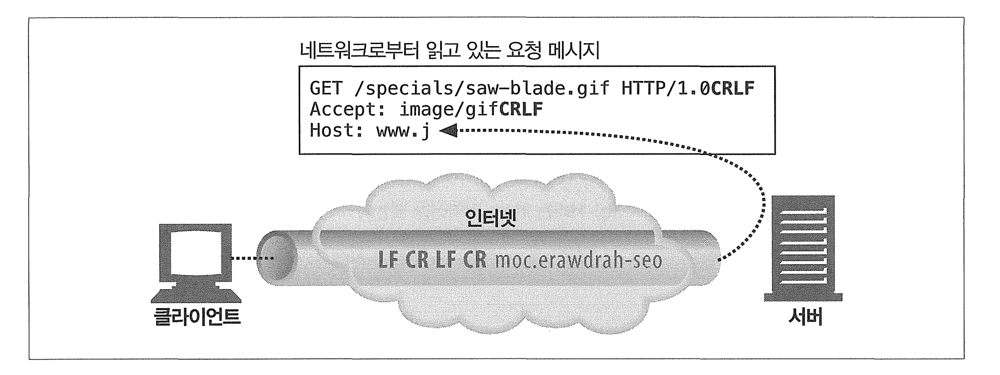
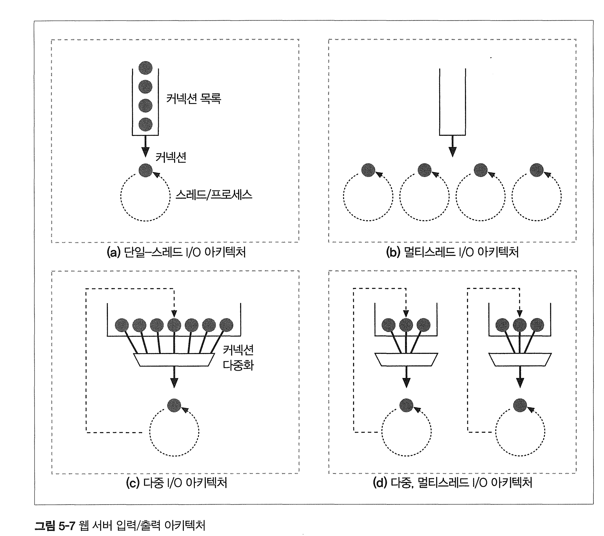

# 5장 웹 서버

# 5.3 진짜 웹 서버가 하는 일

1. 커넥션을 맺는다 : 클라이언트의 접속을 받아들이거나, 원치않는 클라이언트라면 닫는다
2. 요청을 받는다 -- HTTP 요청 메시지를 네트워크로부터 읽어들인다.
3. 요청을 처리한다 -- 요청 메시지를 해석하고 행동을 취한다
4. 리소스에 접근한다 - 메시지에서 지정한 리소스에 접근한다. 
5. 응답을 만든다 -- 올바른 헤더를 포함한 HTTP 응답 메시지를 생성한다
6. 응답을 보낸다 -- 응답을 클라이언트에게 돌려준다
7. 트랜잭션을 로그로 남긴다 -- 로그파일에 트랜잭션 완료에 대한 기록을 남긴다.

# 5.4 단계 1: 클라이언트 커넥션 수락

## 새 커넥션 다루기

웹 서버에 TCP 커넥션을 요청하면, 웹 서버는 커넥션을 맺고 TCP 커넥션에서 IP 주소를 추출하여 커넥션 맞은편에 어떤 클라이언트가 있는지 확인한다.

## 클라이언트 호스트 명 식별

웹 서버는 클라이언트 IP 주소를 Reverser DNS를 통해 호스트명으로 바꿀 수 있다.

접근 제어와 로깅을 위해 사용되며, 호스트 명 룩업은 꽤 시간이 걸릴 수 있어 느려질 수 있다.

* 때문에 대용량 웹서버는 호스트 명 분석을 꺼두거나 특정 콘텐츠에 대해서만 켜놓는다 

# 5.5 단계 2: 요청 메시지 수신

커넥션에 데이터가 도착하면 웹 서버는 네트워크 커넥션에서 그 데이터를 읽어 들이고 파싱하여 요청 메시지를 구성한다.

요청 메시지를 파싱할 때 웹 서버는 다음과 같은 일을 한다.

* 요청줄을 파싱하여 [메서드, URI, 버전 번호]를 찾는다. 
  * 각 값은 스페이스 한개로 분리되어 있으며 요청줄은 캐리지 리턴 줄바꿈(CRLF) 문자열로 끝난다 
* 메시지 헤더들을 읽는다. 각 메시지 헤더는 CRLF로 끝난다 (\r\n)
* 요청 본문이 있따면 읽어들인다. 

## 커넥션 / 입력 출력 처리 아키텍처

고성능 웹서너는 수천개의 커넥션을 동시에 열 수 있도록 지원한다.

웹서버 아키텍처의 차이에 따라 요청을 처리하는 방식도 달라진다.

### 단일 스레드 웹 서버 (그림 a)

이 웹서버는 요청을 한번에 하나씩 처리하며 트랜잭션이 완료되어야지만 다음 커넥션이 처리된다.

구현 간단, 그러나 요청은 1개씩밖에 안되고 나머지 커넥션은 대기해야 하므로 성능이 안좋다

### 멀티스레드 웹 서버 (그림 b)

여러 요청을 동시에 처리하기 위해 여러 스레드를 할당하며 필요할때마다 만들어질수도있꼬, 미리 풀을 만들어 놓을수도 있다.

너무 많은 스레드는 많은 메모리나 리소스를 소비하므로 적당히 만들어야 한다. 

* 컨텍스트 스위칭으로 인한 오버헤드가 증가

### 다중 I/O 서버(그림 c) -> 이벤트 기반 아키텍처 또는 비동기I/O 모델을 사용하는 웹 서버

대량의 커넥션 지원을 위해 많은 웹서버는 다중 아키텍처를 채택했다.

모든 커넥션은 동시에 활동을 감시당하며 커넥션의 상태가 바뀌면 그커넥션에 대해 조금의 처리가 생긴다

이후 처리가 완료되면 커넥션은 다음번 상태 변경을 위해 열린 커넥션 목록으로 돌아간다. 

스레드와 프로세스는 유휴 상태의 커넥션에 매여 기다리느냐 리소스를 낭비하지 않는다. 

* 이벤트 루프에 의해 모니터링되고. 이벤트 루프는 네트워크 I/O, 타이머, 인터럽트 같은 다양한 소스로부터 이벤트를 감지
* 커넥션의 상태가 바뀌면 (예를 들어, 새 데이터가 도착하거나 데이터를 보낼 준비가 되었을 때) 해당 커넥션에 대한 작업이 트리거
* 이 모델에서는 스레드나 프로세스가 유휴 상태의 커넥션에 묶여있지 않으므로, 대기 시간에 다른 작업을 처리할 수 있어 리소스를 보다 효율적으로 사용할 수 있다.

### 다중 멀티스레드 I/O 아키텍처

멀티 이벤트 루프에 대한 설명이다 

**멀티스레딩 이벤트 루프**: 이벤트 루프가 멀티 스레드로 운영될 수 있는 구조를 가지며, 각 스레드는 자체 이벤트 큐를 가지고 독립적으로 작동한다.

즉 각 프로세스가 자체 이벤트 루프를 관리한다.

# 5.6 단계 3: 요청 처리

나중에 이야기한다. 

# 5.7 단계 4: 리소스의 매핑과 접근

웹 서버가 클라이언트에 콘텐츠 전달하려면 그전에 메시지의 URI(자원)에 대응하는 콘텐츠를 찾아 식별해야 한다.

# 5.8 단계 5: 응답 만들기

요청 메서드로 동작을 수행한 뒤 응답 메시지를 반환한다

응답 메시지는

* 응답 상태코드
* 응답 헤더
* 응답 본문을 포함한다

## 응답 엔티티

응답 본문이 있다면 응답 메시지는 다음을 포함한다

* MIME 타입을 서술하는 Content-Type 헤더
* 응답 본문의 길이를 서술하는 Content-Length 헤더
* 실제 응답 본문의 내용

### 리다이렉션

리다이렉션시 응답 코드는 3XX로 돌려주며, Location 헤더에 새로운 URI를 포함한다.

리다이렉트는 다음의 경우에 유용하다

* 영구히 리소스가 옮겨진 경우 : 301 Moved Permanetly 사용
* 임시로 옮겨진 경우 : 303 또는 307 Temporary Redirect
* 부하가 걸렸을시

# 5.9 단계 6: 응답 보내기

응답을 보낸 후 커넥션을 닫는다.

비지속 커넥션이라면 서버는 모든 응답을 보낸 후 자신의 커넥션을 닫을것이며

지속적 커넥션이라면 서버의 ContentLength를 이용해 계싼한 후 클라이언트가 닫을것이다

# 5.10 단계 7: 로깅

웹 트랜잭션이 어떻게 수행되었는지에 대한 로그를 로그 파일에 기록한다.