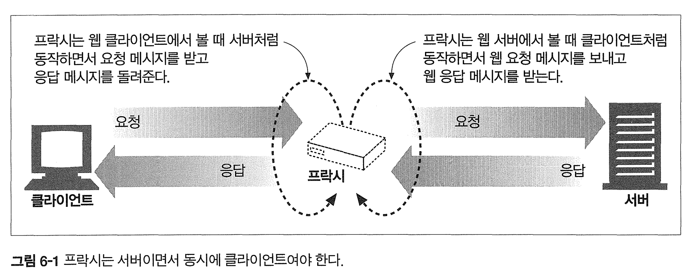
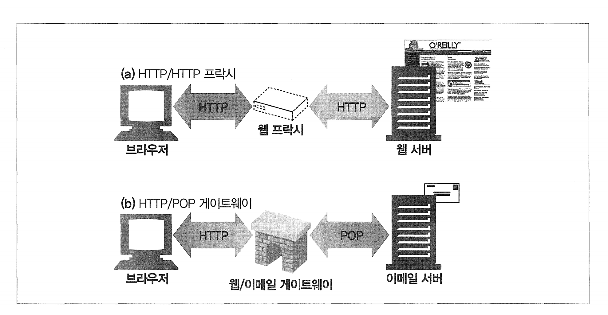

# 6장 프락시

프락시는 중개자다.

클라이언트와 서버사이에 위치한다.


# 6.1 웹 중개자

HTTP 프락시 서버는 웹 서버이기도 하고 웹 클라이언트이기도 하다.



## 프락시 대 게이트웨이

프락시는 같은 프로토콜을 사용하는 둘이 상의 애플리케이션을 연결하고

게이트웨이는 서로 다른 프로토콜을 사용하는 둘 이상을 연결한다.



하지만 실질적으로 요즘에는 둘 차이가 모호하다.

상용 프락시 서버가 WAS를 지원하기 때문에 게이트웨이 기능을 구현하기 때문 

# 6.2 왜 프락시를 사용하는가?

보안 개선, 로드밸런싱을 통한 성능 증가. 부가 기능 구현을 위함

* 유해사이트 필터링, 보안 방화벽, 특정 리소스 접근제어도 가능 

## 프락시는 콘텐츠라우터도 가능

요청을 특정 웹 서버로 유도하는 콘텐츠 라우터로도 동작할 수 있따 (CDN 처럼)

## 익명화 프락시

익명화 전용 프락시가 있따. 메시지에서 신원을 식별할 수 있는 IP, 헤더, 쿠키, 세션아이디 등을 제거하는 역할을 하기도 한다.

# 6.3 프락시는 어디에 있는가?

## 프락시 서버 배치

**출구 프락시** : 트래픽을 제거하기 위해 프락시를 로컬 네트워크의 출구에도 넣을 수 있다

**입구 프락시** : ISP 접근 지점에 위치하여 다운로드 속도를 개선하고 인터넷 대역폭 비용을 줄이기 위해 캐시 프락시도 사용

**대리 프락시(리버스 프락시)** : 웹서버의 앞에 위치해서 웹 서버로 향하는 모든 요청을 선으로 처리.

* 보안 기능 추가, 웹 서버 캐시 등 가능
* 또한 웹 서버의 앞에 놓아서 성능을 개선하고 앞에서 먼저 요청을 받기 때문에 뒤 서버를 지킬 수 있다.

# 6.4 클라이언트 프락시 설정

## 프락시 URI는 서버 URI와 다르다.

클라이언트가 프락시로 요청을 보낼때랑 프락시에서 서버로 요청을 보낼때랑 URI가 달라질 수 있다.

# 6.6 메시지 추적

프락시가 점점 많아지면서 서로 다른 스위치와 라우터를 넘나드는 IP 패킷흐름 추적 못지않게

프락시를 넘나드는 메시지의 흐름을 추적의 필요성이 늘어났다

## Via 헤더

Via 헤더 필드는 메시지가 지나는 각 프락시나 게이트웨이의 정보를 나열한다. 

노드를 지날때마다 Via 목록의 끝에 추가된다

**Via 헤더 필드는 메시디 전달 추적, 루프 진단, 서버들의 프로토콜 다룰수 있는 능력을 알아보기 위해 사용된다**

```http
Via: 1.1 proxy-62.irenes-isp.net, 1.0 cache.joes-hardware.com
```

* 첫번째 프락시는 HTTP 1.1, 두번쨰 프락시는 1.0

요청 응답 메시지 모두 프락시를 지나면 둘 모두 Via 헤더를 가진다.

만약 요청 메시지가 A, B, C 프락시를 지나간다면 응답은 C, B, A로 응답 Via는 요청 Via의 반대다 

## ServerHeader

Server 응답 헤더 필드는 원 서버에 의해 사용되는 소프트웨어를 알려준다.

```http
Server: Apache/1.3.14 (Unix) PHP/4.0.4
Server: Netscape-Enterprise/4.1
Server: Microsoft-IIS/5.0
```

## TRACE

TRACE 메서드는 각 프락시 서버 흐름을 디버깅하는데 유용하다.

## Max-Forwards

TRACE나 OPTIONS 요청의 프락시 홉(hop) 개수를 Max-Forwards 헤더로 고정할 수 있다. 

* 메시지가 무한 루프에 빠지지 않는지 프락시 연쇄를 테스트하거나 프락시 서버 효과 체크용으로 사용 

# 6.8 프락시 상호운용성

프락시는 이해할 수 없는 헤더 필드를 반드시 그대로 전달해야 하며, 순서나 형태도 그대로 유지해야 한다.

그렇지 않으면 제대로 메시지를 전달할 수 없기 때문이다.

## Allow 헤더

Allow 헤더는 지원되는 메서드들을 모두 열거한다

```
Allow: GET, HEAD, PUT
```

