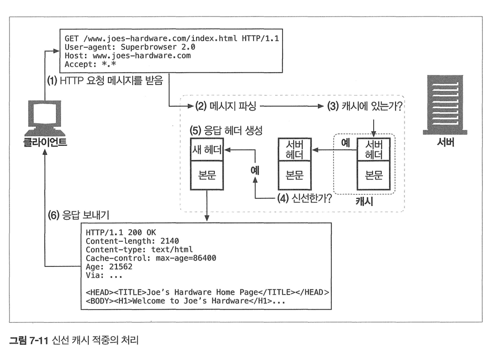

# 7장 캐시

캐시는 자주 쓰이는 데이터를 보관하는 장치다.

캐시의 장점

- 캐시는 불필요한 데이터 전송을 줄여 네트워크 비용을 줄인다
- 네트워크 병목을 줄여준다. 응답시간이 빠르기 때문
- 원서버에 대한 요청을 줄여줘서 부하를 줄인다
- 거리로 인한 지연을 줄일 수 있다.

# 7.1 불필요한 데이터 전송

복수의 클라이언트가 자주 쓰이는 원 서버 페이지에 접근할때 같은 문서를 반복하게 되는데

이건 대역폭을 낭비하는 행위다. 같은 바이트 데이터를 계속 보내기 때문.

캐시를 이용하면 대역폭도 줄이고 원서버 부하도 줄일 수 있다.

# 7.2 대역폭 병목

물리적으로 가까운 서버에 캐시해서 응답을 돌려준다면 훨씬 빠르게 응답을 줄 수 있다.

# 7.3 갑작스런 요청 쇄도(Flash Crowds)

갑작스러운 api 요청에 대응할 수 있다. 원서버는 비교적 안전하기 때문이다.

# 7.4 거리로 인한 지연

모든 네트워크 라우터가 제각각 인터넷 트래픽을 지연시키며 빛의속도라 해도 유의미한 지연을 발생시킨다.

병렬이면서 keep-alive인 커넥션이라 할지라도 빛의 속도는 뚜렷한 지연을 발생시킨다.

# 7.5 적중과 부적중

요청을 보냈는데 캐시서버에 있어 캐시에서 응답을 돌려주면 캐시 히트

캐시서버에 없어 서버에서 응답을 돌려주면 캐시 미스

만약 캐시에 없는 데이터를 요청하면 원서버로 전달되어 무의미해진다.

## 캐시 재검사 

원본서버 컨텐츠는 변경될 수 있기 때문에 캐시는 캐시된 데이터가 최신인지 때때로검사해야 한다.

이러한신선도 검사를 HTTP 재검사라 부른다.

HTTP는 서버로부터 전체 응답을 안받아도 콘텐츠가 신선한지 빠르게 검사할 수 있는 특별한 요청을 정의했다.

가장 많이 쓰이는것 : If-Modified-Since 헤더

- https://developer.mozilla.org/en-US/docs/Web/HTTP/Headers/If-Modified-Since

다음은  If-Modified-Since 헤더를 가진 요청이 서버로 도착했을때의 세가지 경우의수다

### 1. 재검사 적중

만약 서버 객체가 변경되지 않았다면 HTTP 304 Not Modified 응답을 준다

```docker
GET /announce.html HTTP/1.0
If-Modified-Since: Sat, 29 Jun 2002 ~~
```

응답

```docker
HTTP/1.0 304 Not Modified
Date :
...
Expires: Fir, 05, Jul 2002
```

Expires로 구분가능

### 재검사 부적중

서버 객체가 캐시된 사본과 다르면 새로운 사본과 200응답을 준다

### 객체 삭제

만약 삭제되었다면 404를 돌려보낸다

## 적중률

실제 적중률은

- 캐시크기, 캐시 사용자의 관심도, 캐시된 데이터, 캐시설정 에 따라 크게 달라진다.

책에선 40%정도면 괜찮다고 한다

### 적중과 부적중의 구별

클라에서 응답이 캐시왔는지 알아내는 법은 쉽지않다. 거의없다

근데 응답의 Date 헤더로 구분할 수는 있을수도 있따. 현재시간과 비교해서 오래됐는지

# 7.7 캐시 처리 단계

보통 기본적인 캐시 처리 절차는 일곱 단계로 이루어져 있따.



1. 요청 받기 - 캐시는 네트워크로부터 도착한 요청 메시지를 읽는다.
2. 파싱 - 캐시는 메시지를 파싱하여 URL과 헤더들을 추출한다.
3. 검색 - 캐시는 로컬 복사본이 있는지 검사하고, 사본이 없다면 사본을 받아온 다(그리고 로컬에 저장한다).
4. 신선도 검사 - 캐시는 캐시된 사본이 충분히 신선한지 검사하고, 신선하지 않다면 변경사항이 있는지 서버에게 물어본다.
5. 응답 생성 - 캐시는 새로운 헤더와 캐시된 본문으로 응답 메시지를 만든다.
6. 발송 - 캐시는 네트워크를 통해 응답을 클라이언트에게 돌려준다.
7. 로깅 - 선택적으로, 캐시는 로그파일에 트랜잭션에 대해 서술한 로그 하나를 남긴다.

# 7.8 사본을 신선하게 유지하기

HTTP는 어떤 캐시가 사본을 갖고있는지 몰라도,

문서 만료와 서버 재검사로 사본을 서버와 유지시킬 수 있게 해준다

## 문서 만료

Cache-Control, Expires라는 특별한 헤도로 원 서버가 각 문서에 유효기간을 붙일 수 있게 해준다.

```docker
Expires: fir, 05, Jul, 2002, 00:00:00 GHT

또는

Cache-Control: max-age=484200
```

- Http 1.0+는 Expires
- Http 1.1은 Cache-Control: max-age

## 유효기간과 나이

| 헤더                                    | 설명                                                         |
| --------------------------------------- | ------------------------------------------------------------ |
| Cache-Control: max-age                  | max-age 값은 문서의 최대 나이를 정의한다. 최대 나이는 문서가 처음 생성된 이 후부터, 제공하기엔 더 이상 신선하지 않다고 간주될 때까지 경과한 시간의 합법 적인 최댓값(초 단위)이다 |
| Cache-Control: max-age=484200           |                                                              |
| Expires                                 | 절대 유효기간을 명시한다. 만약 유효기간이 경과했다면, 그 문서는 더 이상 신선 하지 않다. |
| Expires: Fri, 05 Jul 2002, 05:00:00 GMT |                                                              |

## 서버 재검사

캐시 문서가 변경되었는지 서버한테 요청을 보내어 알아내는것을 서버 재검사라고 한다.

- 재검사 결과 콘텐츠가 변경되었다면, 캐시는 그 문서의 새로운 사본을 가져와 오래된 데이터 대신 저장한 뒤 클라이언트에게도 보내준다.
- 재검사 결과 콘텐츠가 변경되지 않았다면, 캐시는 새 만료일을 포함한 새 헤더들만 가져와서 캐시 안의 헤더들을 갱신한다.

## 캐시 검사에 사용되는 두 조건부 헤더

조건부 GET은 GET 요청 메시지의 아래에 특별한 두 헤더를 추가함으로써 시작된다.

| 헤더                      | 설명                                                         |
| ------------------------- | ------------------------------------------------------------ |
| If-Modified-Since: (date) | 만약 문서가 주어진 날짜 이후로 수정되었다면 요청 메서드를 처리한다. 이것은 캐시된 버전으로부터 콘텐츠가 변경된 경우에만 콘텐츠를 가져오기 위해 Last-Modiied 서버 응답 헤더와 함께 사용된다. |
| If-None-Match: (tags)     | 마지막 변경된 날짜를 맞춰보는 대신, 서버는 문서에 대한 일련번호와 같이 동작 하는 특별한 태그(부록 C의 "ETag"를 보라)를 제공할 수 있다. If-None-Match 헤더는 캐시된 태그가 서버에 있는 문서의 태그와 다를 때만 요청을 처리한다. |

## If-Modifed-Since: 날짜 재검사

가장 흔히 쓰이며 IMS 요청이라고도 불린다.

IMS는 서버에게 리소스가 특정날짜 이후로 변경된 경우에만 요청한 본문을 보내달라고 한다.

Last-Modifed 헤더와 같이 쓰인다

- 컨텐츠가 마지막으로 수정된 시점을 값으로 가짐


## If-None-Match : 엔티티 태그 재검사

ETag를 사용한다

캐시는 ETag v2.6(엔터티 태그)를 갖고있는데 서버에게 요청시 이걸 보내 v2.6이 아닌경우에만 새 객체를 달라고 요청하는 방법으로 검사한다.

- 태그가 유효하면 304 NotModified
- 만약 태그가 변경되어 새 콘텐츠이면, 콘텐츠와 200 OK

캐시가 객체에 여러 사본을 갖고있는경우 하나의 If-None-Match 헤더에 여러 엔터티 태그를 포함시킬 수 있다.

```docker
If-None-Match: "v2.6"
If-None-Match: "v2.4","v2.5", "V2.6"
If-None-Match: "foobar", "A34FAC0095", "Profiles in Courage"
```

## 언제 ETag를 사용하고 언제 Last-Modified를 사용할까?

HTTP 1.1 클라는 서버가 ETag를 반환 했따면 반드시 그 검사기를 사용해야 한다

만약 서버가 Last-Modified 값만 반환했다면, 클라는 If-Modified-Since 검사를 이용할 수 있다.

# 캐시 제어

- Cache-Control: no-store 헤더를 응답에 첨부할 수 있다.

- Cache-Control: no-cache 헤더를 응답에 첨부할 수 있다.

- Cache-Control: must-revalidate 헤더를 응답에 첨부할 수 있다.

- Cache-Control: max-age 헤더를 응답에 첨부할 수 있다.

- Expires 날짜 헤더를 응답에 첨부할 수 있다.

- 아무 만료 정보도 주지 않고, 캐시가 스스로 체험적인(휴리스틱) 방법으로 결정 하게 할 수 있다.

## no-cache와 no-store 응답 헤더

no-store와 no-cache헤더는 캐시가 검증되지않은 캐시된 객체로 응답하는 것을 막는다

```docker
Cache-Control: no-store
Cache-Control: no-cache
Pragma: no-cache
```

http1.0 애플리케이션에 대응할게 아니라면 CacheControl: no-cache를 사용해야 한다.

## Cache-Contol Max-Age 응답 해더

Cache-Contol: max-age 헤더는 신선하다고 간주되었던 문서가 서버로부터 온 이후로 흐른 시간이고 초로 나타낸다.

s-maxage헤더는 max-age처럼 행동하지만 공용 캐시에만 적용된다

```docker
Cache-Control: max-age=3600
Cache-Control: s-maxage=3600
```

만약 max-age를 0으로 설정하면 캐시가 매 접근시 문서를 캐시하거나 리프레시 하지 않게 요청할 수 있다. 

## Expires 응답 헤더

얘는 쓰지말랜다.

이 헤더에 설정된 날짜와 시간 이후에는 해당 응답을 오래되고 새롭지 않은 것으로 간주되는데

얘는 정적이다. Expires로 그 에 맞춰 바껴야하는데 안바뀌므로 신뢰성이 없다.

현대에는 cache-control에 더 우선순위를 두고 expires를 무시한다

## must-Revalidate 응답 헤더

캐시의 만료 정보를 엄격하게 따르길 원한다면 서버는

Cache-Control: must-revalidate 라는 헤더를 붙일 수 있다.

이 응답헤더는 캐시가 객체의 신선하지 않은 사본을 원서버 검사 없이 제공해서는 안된다는 의미다.

만약 캐시가 must-revalidate 신선도 검사를 시도했을 때 사용할 수 없는 상태면 504 Timeout Error를 반환해야 한다.

## 휴리스틱 만료 

만약 응답이 Cache-Control: max-age 헤더나 Expires 어느것도 포함하지 않고있따면

경험적인(heuristic)방법으로 최대 수명을 계싼한다.

**휴리스틱 만료 알고리즘 -  LM 인자 알고리즘**

* 문서가 최근 변경일시를 포함하고 있따면 사용 가능  - 얼마나 자주 바뀌는지에 대한 추정에 사용 

* > 만약 캐시된 데이터가 최근에 변경되었다면, 아마 자주 변경될것이고 그러므로 짧은기간동안만 캐시해야 한다 


## 클라이언트 신선도 제약 

클라이언트는 Cache-Control 요청 헤더를 사용하여 만료 제약을 엄격하게 하거나 느슨하게 할 수 있다. 

다음 캐시 요청 지시어를 사용해서 클라이언트는 캐시를 제어할 수 있다. 

| 지시어                        | 목적                                                         |
| ----------------------------- | ------------------------------------------------------------ |
| Cache-Control: max-stale      | 캐시는 신선하지 않은 문서라도 자유롭게 제공할 수 있다.       |
| Cache-Control: max-stale=<S>  | (S) 매개변수가 지정되면, 클라이언트는 만료시간이 그 매개변수의 값만큼 지난 문서도 받아들인다. 이것은 캐싱 규칙을 느슨하게 한다. |
| Cache-Control: min-fresh=<S>  | 클라이언트는 지금으로부터 적어도 (S) 초 후까지 신선한 문서만을 받아들인다. 이것은 캐싱 규칙을 엄격하게 한다. |
| Cache-Control: max-age=<S>    | 캐시는 (S) 초보다 오랫동안 캐시된 문서를 반환할 수 없다. 나이가 유효기간을 넘어서게 되는 max-stale 지시어가 함께 설정되지 않는 이상, 이 지시어는 캐싱 규칙을 더 엄격하게 만든다. |
| Cache-Control: no-cache       | 이 클라이언트는 캐시된 리소스는 재검사하기 전에는 받아들이지 않을 것이다. |
| Pragma: no-cache              | Cache-Control: no-cache와 비슷하게, 클라이언트는 캐시된 리소스를 재검사하기 전에는 받아들이지 않을 것이다. |
| Cache-Control: no-store       | 캐시는 저장소에서 문서의 흔적을 최대한 빨리 삭제해야 한다. 그 문서에는 민감한 정보가 포함되어 있기 때문이다. |
| Cache-Control: only-if-cached | 클라이언트는 캐시에 들어있는 사본만을 원한다.                |

# 7.11 자세한 알고리즘

## 캐시의 나이와 신선도 수명

캐시가 신선한지 알려주려면 단 두가지 값만 계싼하면 된다.

* 캐시된 사본의 나이, 신선도 수명

캐시된 사본이 신선도 수명보다 작으면 캐시 사본은 충분히 신선한것이다

```
$ 충분히_신선한가 = ($나이 < $신선도_수명);
```

* 캐시된 사본의 나이 : 서버가 데이터를 보낸 후 시간이 지난 총 합 (Date나 Age 헤더 등을 통해 계산해서 한다 )


# 7.12 캐시와 광고

광고 회사나 콘텐츠 제공자는 캐시를 이용해서 더 많은 광고를 보여주고 이득을 얻고 싶어한다.

## 퍼블리셔의 응답

그러나 오늘날 광고회사들은 캐시가 광고 시청수를 가로채지 못하도록 모든 종류의 캐시 무력화 기법을 사용한다.

그들은 광고를 CGI 게이트웨이를 통해 제공하며 매 접근마다 광고 URL을 고쳐쓴다 

* CGI (Common Gateway Interface) 게이트웨이는 웹 서버와 외부 컨텐츠 제공 프로그램 사이의 인터페이스
* 광고를 클릭하면 CGI스크립트가 있는 서버로 요청을 보내 처리하고 특정 알고리즘에 따라 광고를 생성하거나 선택하게 하고 이 정보를 기반으로 타겟팅 광고를 준비한다.

이상적으로는 콘텐츠 제공자가 그들에게 캐시가 얼마나 적중되어서 얼마만큼봐는지 등을 알 수 있게 해야한다.

한가지 방법은 모든 접근에 대해 원서버가 알수 있게 하는거지만 이는 트래픽을 가증시켜 트랜잭션을 느리게 만든다 

### 로그 마이그레이션

캐시가 모든 캐시 히트 로그를 갖고있지만 이 로그를 서버에게 후에 나눠줘야 하는데 쉽지 않다.

이 로그를 정산에서 광고주들에게 알려줘야하는데 수동으로 처리해서 직접건네준다고 한다

크기때문에 옮기기 어렵기 때문이다.