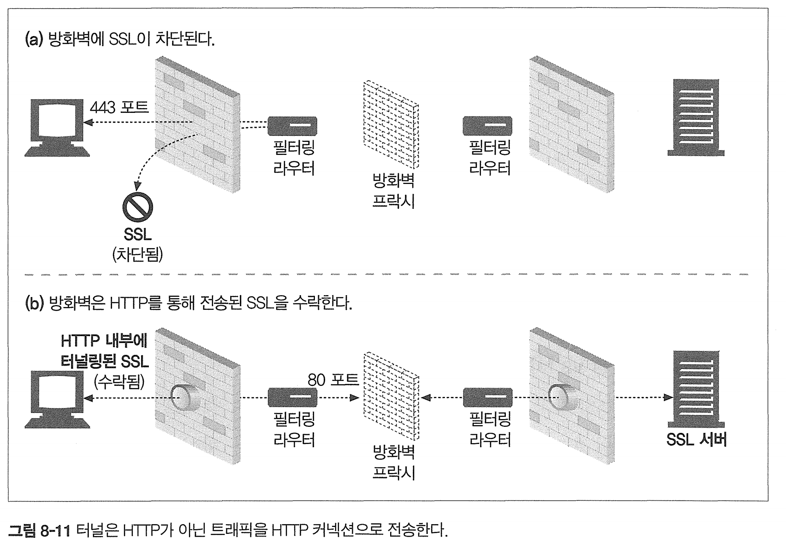

# 8장 통합점: 게이트웨이, 터널, 릴레이

[toc]

이장에선 여러 종류의 리소스에 접근하는데 HTTP가 어떻게 쓰이는지 알아보자 

- 게이트웨이: 서로 다른 프로토콜과 애플리케이션 간의 HTTP 인터페이스다.
- 애플리케이션 인터페이스: 서로 다른 형식의 웹 애플리케이션이 통신하는 데 사
   용한다.
- 터널: HTTP 커넥션을 통해서 HTTP가 아닌 트래픽을 전송하는 데 사용한다.
- 릴레이: 일종의 단순한 HTTP 프락시로, 한 번에 한 개의 흡에 데이터를 전달하는 데 사용한다.

# 8.1 게이트웨이

모든 리소스를 한개의 애플리케이션으로만 해결할 수 없다는것에 대한 해결책으로

리소스를 받기 위한 경로를 안내하는 역할을 하는 게이트웨이를 고안해냈다.

* 리소스와 애플리케이션을 연결한다. 

애플리케이션은 게이트웨이에게 요청 처리 를 부탁할수도, 다른 리소스를 연결해줄수도 있따.

# 8.2 프로토콜 게이트웨이

게이트웨이도 HTTP 트래픽을 보내 게이트웨이를 거쳐가게 하거나,

리버스 프락시 서버로 설정할수도 있따. 


## HTTP/HTTPS: 서버측 보안 게이트웨이

기업 내부의 웹 요청을 암호화함으로써 개인 정보 보호와 보안을 게이트웨이로 제공할 수 있다.

게이트웨이로 요청을 보내면 자동으로 사용자의 세션을 암호화 시킨다. 

* 이건 HTTP 요청을 내부적으로 HTTPS로 보안을 유지하게 바꾸는것

## HTTPS/HTTP - 클라이언트 측 보안 가속 게이트웨이

이 게이트웨이는 웹 서버 앞단에서 인터셉터나 리버스 프락시 역할을 한다.

HTTPS 트래픽을 받아 복호화 해서 내부적으로 웹서버들에게는 HTTP 요청을 만든다. 

보통 이런 게이트웨이는 암호화 하드웨어를 내장해서 책임지고 복호화를 해서 원 서버의 부하를 줄여주기도 한다. 

# 8.3 리소스 게이트웨이

리소스 게이트웨이는 API를 통해 백엔드에서 동작하는 여러 애플리케이션으로 서빙하는 역할을 한다.

## CGI Common Gateway Interface

최초이며 가장 널리쓰이는 서버 확장 게이트웨이.

동적 HTML, 데이터 신용카드 처리, 데이터베이스 쿼리 등을 제공하는데 사용된다. 

애플리케이션이라고 볼 수 있다. 

# 8.4 애플리케이션 인터페이스와 웹 서비스

HTTP로 애플리케이션들끼리 연결하는 도구로 활용할 수 있지만 둘의 인터페이스를 맞추기 힘들다. 

때문에 SOAP를 이용한 XML과 JSON 등이 나오게 되었다.  

# 8.5 터널

웹 터널은 HTTP 프로토콜을 지원하지 않는 애플리케이션에 HTTP를 사용해 접근하는 방법을 제공한다.

 웹 터널을 사용하면 HTTP 커넥션을 통해서 HTTP가 아닌 트래픽을 전송할 수 있고, 다른 프로토콜을 HTTP위에 올릴 수 있다

* 가장 사용하는 주된 이유 : 다른 프로토콜을 HTTP위에 올려서 같이 전송시켜 통신하려는 이유 


## CONNECT로 HTTP 터널 커넥션 맺기

웹 터널은 HTTP의 CONNECT 메서드를 사용하여 커넥션을 맺는다

* HTTP/1.1 명세에는 자세히 없지만 많이 구현하는 확장

CONNECT 문법은 시작줄 제외하고 HTTP와 같다

```
CONNECT home.netscape.com:443 HTTP/1.0
User-agent: Mozilla/4.0
```

* URI는 호스트명이 대체하며 호스트와 포트는 위와같이 기술
* 시작줄 다음에는 다른 HTTP메시지와 똑같이 추가적인 HTTP 요청 헤더 필드가 있거나 없다.

**CONNECT 응답**

```
HTTP/1.0 200 Connection Established
Proxy-agent: Netscape-Proxy/1.1
```

## SSL 터널링

웹터널의 꽃. 핵심. 암호화된 SSL 트래픽을 전달할 수 있는 기술.

터널을 사용하여 SSL 트래픽을 HTTP 커넥션으로 전송하여 80포트의 HTTP만을 허용하는 방화벽을 통과시킬 수 있따.



이 터널링은 HTTP 메시지에 암호화된 데이터를 담고 일반 HTTP채널을 통해 데이터를 전송한다.

즉 HTTP가 아닌 트래픽이 포트를 제한하는 방화벽을 통과할 수 있게 해준다.

* 악의적인 트래픽도 당연히 통과할 수 있다.

## 터널 보안에 고려사항들

터널 게이트웨이는 터널이 올바른 용도로 사용하고있는지 검증할 방법이 없다.

이를 위해 게이트웨이는 HTTPS 전용 프로토콜인 443같이 잘 알려진 특정 포트만을 터널링할수있게 조정해야한다


# 8.6 릴레이

HITp 릴레이는 HTTP 명세를 완전히 준수하지는 않는 간단한 HTTP 프락시다. 

* 요청과 응답을 전달하면서 분석하거나 수정하지 않는 그냥 간단힌 프록시 그냥 전송할뿐 

릴레이는 커넥션을 맺기 위한 HTTP 통신을 한 다음, 바이트를 맹목적으로 전달한다.


* 릴레이는 keep-alive에 대해 아무것도 모르기 때문에 커넥션을 끊지 않고 계속 맺고있게 된다. 

이 맹몽적 릴레이가 Connection 헤더를 제대로 처리하지 못해서 keep-alive 커넥션이 hang에 걸린다.

* `Keep-Alive 커넥션`은 HTTP 1.1에서 기본적으로 사용되는 메커니즘으로, 클라이언트와 서버 사이에 연결을 유지하며, 여러 HTTP 요청과 응답이 이루어질 수 있게 해준다. 매번 새로운 연결을 만들지 않고 연속적으로 커넥션으로 토인하는것.

왜냐하면 연결을 계속 열어둠으로써 자원이 고갈되거나 연결이 불필요하게 유지될 수 있기 때문이다. 즉 hang -> 응답없음이 된다 


