# JVM 퍼포먼스 옵티마이저 및 성능분석

[toc]


# JVM 메모리 구조

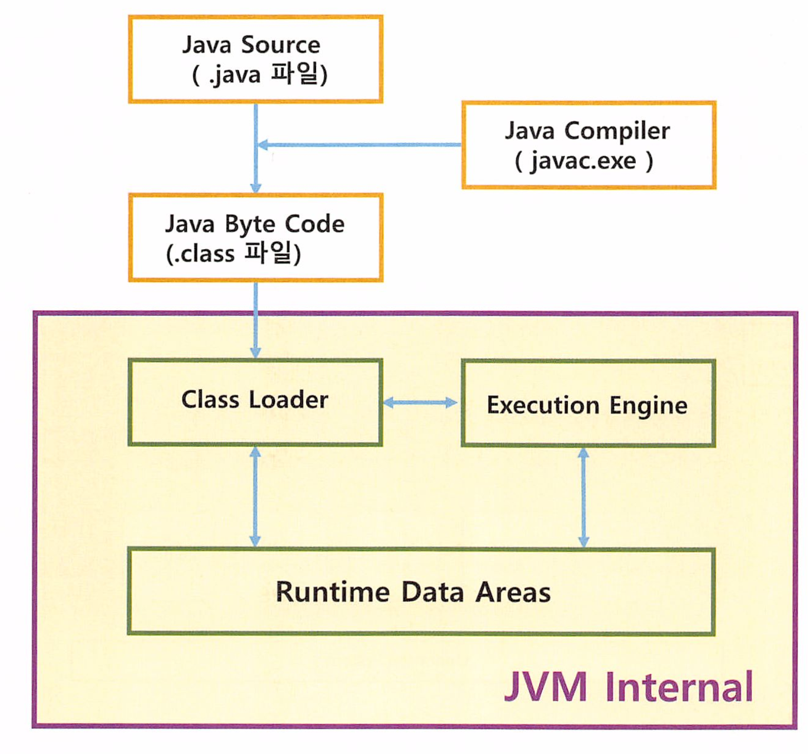

* JavaCompiler: Source파일을 ByteCode로 변경
  * ByteCode : .class파일
* Class Loader: JVM내로 .class 파일들을 Load하고 Runtime Data Area에 배치
* Execution Engine : 로딩된 .class의 bytecode를 해석한다

JVM은 컴파일 과정을 통하여 생성된 Class 파일을 JVM으로 로딩하고, ByteCode를 해석(interpret)하는 과정을 거쳐 메모리 등의 리소스를 할당하고 관리하며 정보를 처리한다. 

## JVM 메모리 구조

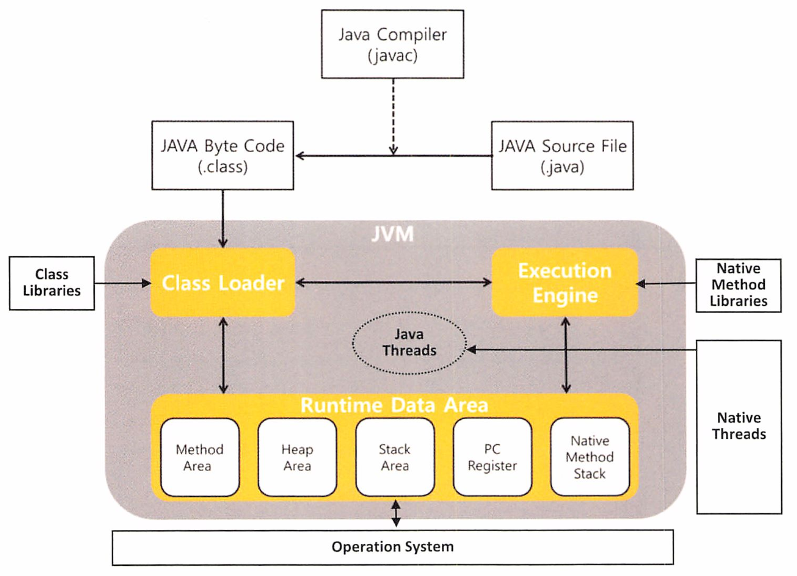

* Method Area : 클래스, 변수, Method, static변수, 상수 등이 저장되는 영역이며 `모든 쓰레드가 공유한다`.
* Heap Area: new 명령어로 생성된 인스턴스와 객체가 저장되는 구역. `모든 쓰레드가 공유한다.`
* Stack Area: 메소드 내에서 사용되는 지역변수, 매개변수, 리턴값 등이 저장되는 구역으로, 메소드가 호출될때 후입선출로 하나씩 생성되고, 메소드 실행이 완료되면 하나씩 지워진다.` 각 쓰레드별로 하나씩 생성된다.`
* PC Register: CPU의 Register와 비슷하다. 현재 수행중인 JVM 명령의 주소값이 저장된다. `각 쓰레드별로 하나씩 생성된다`
* Native Method Stack: 다른 언어의 네이티브 메소드를 호출하기 위해 할당되는 구역.

## Java Heap

Heap 영역은 Instance와 Array 객체 두가지만 저장되는 공간이다. 

객체가 공유되므로 모든 쓰레드들이 접근할 수 있어. 동기화 이슈가 발생할 수 있다.

## Hotspot JVM Heap 구조

가장 기본적인 JVM

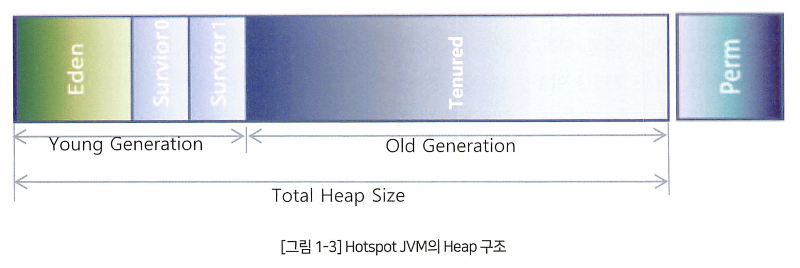

Young Generation은 Eden영역과 Suvivor 1,2영역으로 구성된다.

Eden영역은 객체가 힙에 최초로 할당되는 장소이며, Eden영역이 꽉 차게되면 객체의 참조 여부를 따져 만약 참조가 되고있는 객체라면 Survior영역으로 넘기고 참조가 끊어진 객체이면 그냥 남겨놓는다. 모든 참조되는 객체가 Survivor영역으로 넘어가면 Eden영역을 가비지 컬렉터한다.


Survivor영역은 Eden에서 살아남은 객체들이 잠시 머무른다. 2개의 Survivor 영역중 Eden에서 살아있는 객체를 대피시킬때는 하나의 영역만 사용한다.

이 과정들을 Minor GC라고 한다.


Young Generation에서 오래 살아남은 객체는 OldGeneration으로 이동한다. 

* 오래살아남은 객체는 특정 회수 이상 참조되어 기준 Age를 초과한 객체

OldGeneration 영역도 메모리가 충분하지 않으면 Full GC(Major GC)가 발생한다.


Perm 영역은 클래스, 메소드의 메타정보, static 변수와 상수 정보들이 저장되는 영역이다.

* 자바 8부터는 Static Object는 Heap 영역으로 옮겨져서 GC의 대상이 될수도 있다.

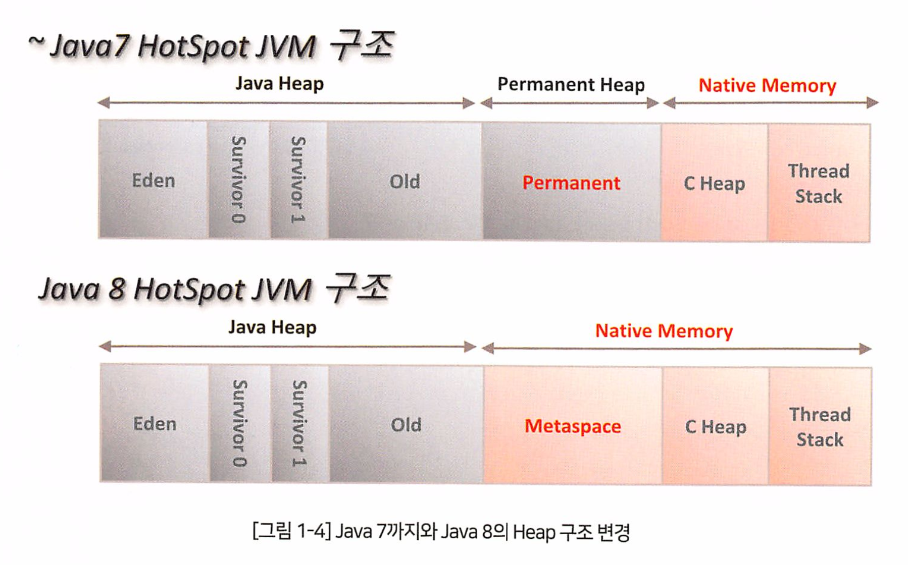

| 구분        | 상세 구분                | 자바 7 (Perm)                           | 자바 8 (Metaspace)                                           |
| ----------- | ------------------------ | --------------------------------------- | ------------------------------------------------------------ |
| 저장 정보   | Class의 Meta 정보        | 저장                                    | 저장                                                         |
|             | Method의 Meta 정보       | 저장                                    | 저장                                                         |
|             | Static Object 변수, 상수 | 저장                                    | Heap 영역으로 이동                                           |
| 관리 포인트 | 메모리 관리 (튜닝)       | Heap 영역 튜닝 외에 Perm 영역 별도 튜닝 | Heap 영역 튜닝, Native 영역 동적 조정 (별도 옵션으로 조절 가능) |
| GC 측면     | GC 수행 대상             | Full GC 수행 대상                       | Full GC 수행 대상                                            |
| 메모리 측면 | 메모리 크기 (옵션)       | -XX:PermSize, -XX:MaxPermSize           | -XX:MetaspaceSize, -XX:MaxMetaspaceSize                      |

* 자바 7과 자바8의 Perm -> Metaspace 변경 사항

# GC 

가비지 컬렉터.

System.GC()를 명시적으로 사용하면, Full GC가 발생한다


## Root Set과 Garbage

객체의 사용여부는 Root Set과의 관계로 판단하게 된다.

어떤식으로든 Reference 관계가 있다면 Reachable Object라고 하며 이는 현재 사용하고 있는 객체로 볼 수 있따.

 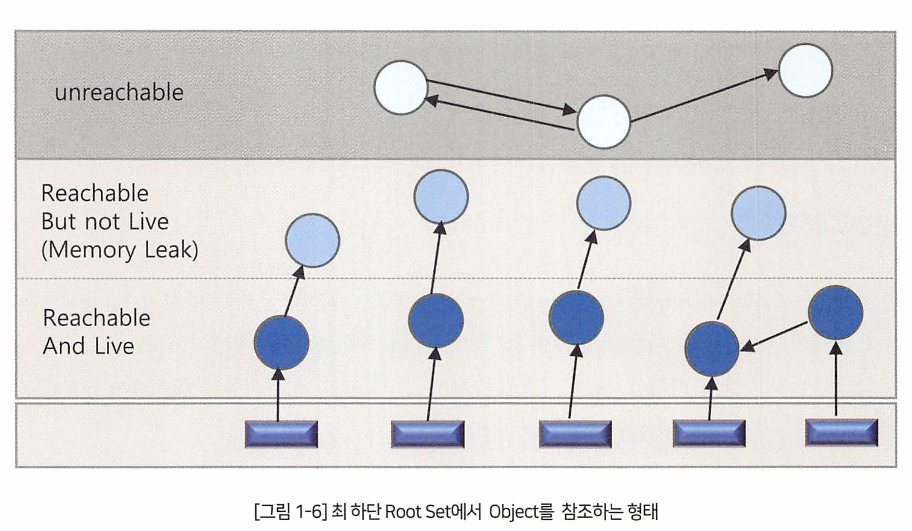

아래 3가지 참조 형태를 통해 Reachable Object를 판별한다.

* Local variable Section, Operande stack에 객체의 참조정보가 있다면 Reachable
  * 이 둘은 Stack 메모리 구조에 해당된다. Local variable Section는 로컬 변수, Operand Stack은 연산을 수행하기 위한 스택. int a = b + c; 연산 수행시 b, c는 여기에 저장
* Method Area에 로딩된 클래스 중 constant pool에 있는 정보를 토대로 쓰레드에서 직접 참조하진 않지만 constant pool을 통해 간첩 link를 하고있다면 Reachable
* 아직 메모리에 있고, Native Method Area의 JNI 객체가 참조관계가 있는경우

이 3가지를 제외하면 모두 GC 대상이다.

메모리 릭은 언제 발생할까?

```java
class Leak {
  List list = new ArrayList();
  
  public void removeStr(int i) {
    Object obj = list.get(i);
    obj = null; // 이부분 주의 
  }
  
  public void add(int a) {
    list.add("가나다라" + a);
  }
}

main {
  Leak leak = new Leak();
  for (int i = 0; i < 9999999; i++) {
    leak.add(i);
    leak.removeStr(i);
  }
}
```

이 코드는 메모리 릭이다.

list.get(i)를 호출해서 obj로 받은것은 String이 아닌, String 객체로 접근하는 Reference 값이기 때문이다. 

add()메소드에서 list = null을 초기화해도 ArrayList에 들어가있는 객체가 아니기 때문에 GC에 수집되지 않는다.

이것이 바로 Reachable but not Live 객체이다. 

* null로 치환돼도 Array List에 들어간 String Obiect가 사라진 건 아니며 더불어 참조변수가

  없어서 이들은 앞으로 사용되지 않을 것이다.

## GC 목적

메모리가 필요하면 수행된다. 

힙메모리도 메모리기 때문에 단편화 문제가 발생한다. 각 GC는 이 문제를 해결하기 위해 Compaction(압축)과 같은 알고리즘을 사용한다. 


# Hotspot JVM의 GC

GC 메커니즘은 두가지 가설을 두고있다.

1. 대부분의 객체는 생성된 후 금방 가비지가 된다.
2. 오래된 객체가 새로 생긴 객체를 참조할 일은 드물다.

첫번째 가설을 보면 새로 할당되는 객체가 모이는 곳은 금방 수거되므로 단편화 발생 확률이 높다. 

메모리 할당은 기존 객체 바로 다음 주소에서 수행이 되기 때문이다.

이때 Sweep작업 (Mark되지 않은 객체 제거)를 수행하면 단편화가 발생하며 이후 Compaction같은 비싼 작업을 해야한다.

`단편화 때문에 핫스팟은 할당만을 위한 공간인 Eden 영역을 만들고, GC시 살아있는 객체들을 피신시키는 Survivor영역을 따로 구성한것이다. `* 

* 즉 가비지가 될 확률이 적은 객체는 따로 관리하겟다는 목적.

Root Set에서 참조관계를 추적해서 마크하는 작업은, 오래된 객체가 젊은 객체를 참조하는 상황이 발생하면 suspend time이 길어지므로 핫스팟은 Card Table(이벤트 프로그램)이란 장치를 마련했다.

**Card Table**

 CardTable이란 Old 영역의 Memory를 대표하는 별도의 영역이다. 만약 젊은 객체를 참조하는 오래된 객체가 있다면,

오래된 객체의 시작주소에 카드(Flag)를 표시해서 카드 테이블에 기록하고, 참조가 끊어지면 표시한 카드도 사라지게 해서 참조 관게를 쉭베 파악할 수 있다. 

* Card는 Old Ara의 512바이트당 1바이트를 차지한다.

## GC 대상 범위

Young, Old, Permanent 영역이 GC 대상이다.

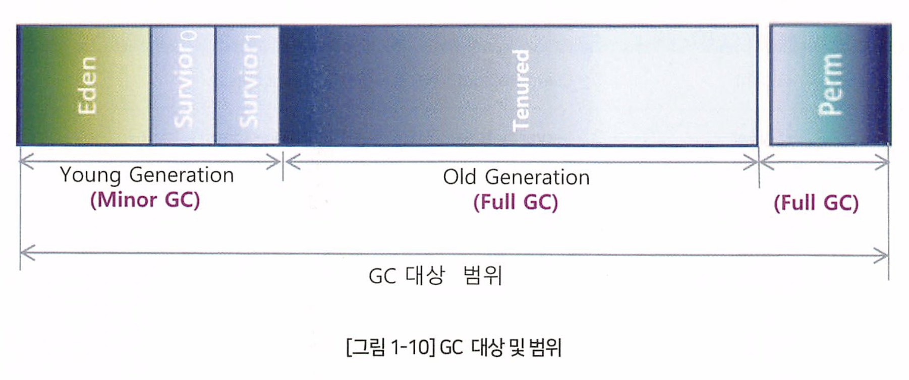

핫스팟은 각 영역별로 GC를 수행한다.

Young은 `Minor GC`라고 부르며 빈번하게 수행된다.

Old 영역은 `Full GC(메이저)`라고 말한다.

Permanent 영역의 메모리가 부족해도 GC가 발생하는데, 너무 많은 클래스가 로딩되어 메모리가 부족하기 때문이다.

* Permanent의 GC는 Full GC이다. 

## Hotspot GC 관련 옵션

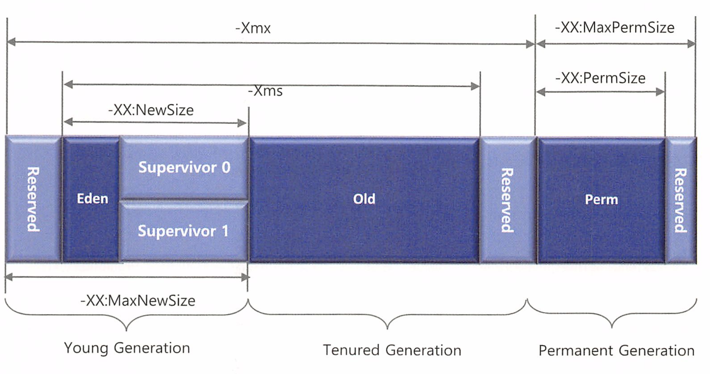

| 옵션                               | 상세 설명                                                    |
| ---------------------------------- | ------------------------------------------------------------ |
| `-Client`                          | Client Hotspot VM으로 구동한다. (Client Class)               |
| `-Server`                          | Server Hotspot VM으로 구동한다. (Server Class)               |
| `-Xms<Size>`                       | Young Generation의 최소 크기를 설정한다.                     |
| `-Xmx<Size>`                       | Young Generation의 최대 크기를 설정한다.                     |
| `-XX:NewSize=<Size>`               | Intel CPU에서는 기본값 640kbytes, 그 외에는 2.124Mbytes.     |
| `-Xss<Size>`                       | 스택 사이즈를 설정한다.                                      |
| `-XX:MaxNewSize=<Size>`            | Young Generation의 최대 크기를 지정한다. 1.4 버전 이후 NewRatio에 따라 자동 계산된다. |
| `-XX:PermSize`                     | Permanent Area의 초기 크기를 설정한다.                       |
| `-XX:MaxPermSize`                  | Permanent Area의 최대 크기를 설정한다. (기본값=64Mbytes)     |
| `-XX:SurvivorRatio=<value>`        | 값이 n이면 n:1:1 (Eden:Survivor 1:Survivor 2) 비율이다. (기본값=8) |
| `-XX:NewRatio=<value>`             | 값이 n이면 Young:Old 비율은 1:n (Client Class 기본값=8, Server Class 기본값=2, Intel CPU 사용 시 기본값=12) |
| `-XX:TargetSurvivorRatio=<value>`  | Survivor Area가 Minor GC를 유발하는 비율. 기본값=50 (즉, Survivor Area가 50% 차면 Minor GC 발생) |
| `-XX:MinHeapFreeRatio=<percent>`   | 전체 Heap 대비 Free Space가 지정된 수치 이하면 Heap을 -Xmx로 지정된 수치까지 확장한다. (기본값=40) |
| `-XX:MaxHeapFreeRatio=<percent>`   | 전체 Heap 대비 Free Space가 지정된 수치 이상이면 -Xms까지 축소한다. (기본값=70) |
| `-XX:MaxTenuringThreshold=<value>` | Value 만큼 SS1, SS2를 이동하면 Old Generation으로 Promotion 한다. |
| `-XX:+DisableExplicitGC`           | `System.gc()` 함수를 통한 수동 GC를 방지한다.                |

```
최소 힙 크기 설정:
java -Xms512m MyApplication

명시적 가비지 컬렉션 호출 무시:
java -XX:+DisableExplicitGC MyApplication

최대 힙 크기 설정:
java -Xmx1024m MyApplication
```

## Garbage Collector 종류

### 가비지 컬렉터 옵션 표

| Garbage Collector             | Option                    | Young Generation Collection 알고리즘 | Old Generation Collection 알고리즘 |
| ----------------------------- | ------------------------- | ------------------------------------ | ---------------------------------- |
| Serial Collector              | `-XX:+UseSerialGC`        | Serial                               | Serial Mark-Sweep-Compact          |
| Parallel Collector            | `-XX:+UseParallelGC`      | Parallel Scavenge                    | Serial Mark-Sweep-Compact          |
| Parallel Compacting Collector | `-XX:+UseParallelOldGC`   | Parallel Scavenge                    | Parallel Mark-Sweep-Compact        |
| CMS Collector                 | `-XX:+UseConcMarkSweepGC` | Parallel                             | Concurrent Mark-Sweep              |
| G1 Collector                  | `-XX:+UseG1GC`            | Snapshot-At-The-Beginning (SATB)     | Snapshot-At-The-Beginning (SATB)   |

```
Serial Collector 사용:
java -XX:+UseSerialGC MyApplication

Parallel Collector 사용:
java -XX:+UseParallelGC MyApplication

Parallel Compacting Collector 사용:
java -XX:+UseParallelOldGC MyApplication

CMS Collector 사용:
java -XX:+UseConcMarkSweepGC MyApplication

G1 Collector 사용:
java -XX:+UseG1GC MyApplication
```


java 8 : Parallel GC

java 9 이후 G1GC


### Serial Collector

Single CPU 즉 1개 쓰레드를 가지고 GC를 수행한다. 

### Parallel Collector

Young 영역에서의 컬렉션을 병렬로 처리한다. 

* 목표 : 다른 CPU가 대기상태로 남아있는것을 최소화 하자.

멀티스레드가 동시에 GC를 수행하며 적용범위는 Young 영역이다.

Old 영역은 Mark-Sweep-Compact 알고리즘이 사용되며 싱글 스레드 방식이다. 

### CMS Collector

low-latency collector. 힙 영역의 크기가 클때 적합하다.

CMS는 suspend time을 분산하여 응답 시간을 개선한다.

목표 : 여유 메모리 있는 상태에서의 GC의 Pause time을 줄이는것.


### Garbage First Collector - G1GC

CMS에 비해 Pause Time이 개선되었고 예측 가능한게 장점이다.

G1GC는 Young, old 구분을 업생고 전체 힙을 1MB단위 region으로 잰편한다.

가비지만 꽉찬 리전별로 먼저 가비지 컬렉션을 수행한다. 

G1GC에서 객체가 Allocation되는 영역의 집합을 Young, Promotion되는 Region의 집합을 Old라고 한다.

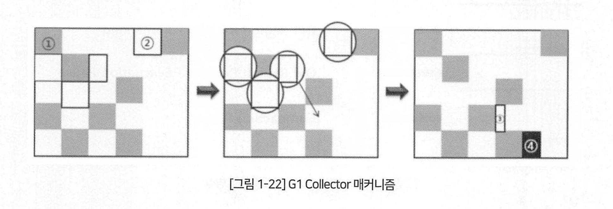 

작은 네모가 Region이며, 까만 네모는 Old Region, 하얀 네모는 Young Region이다

3은 Young에서 방금 Copy된 Survivor Region이다.

4는 방금 Promotion 되어 새로 Old가 된 Region이다.

Miner GC가 발생하면 Young Region을 대상으로 Reachable을 찾고, Survivor Region으로 카피한다.

Promotion의 대상 객체는 Old Region으로 카피한다.

기존 Young Region은 가비지로 간주해 Region 단위로 컬렉션한다.

Young Region GC가 끝나면 바로 Old region GC를 시작하는데, 힙 전체가 아닌 철저한 Region 단위이다. 

#### Garbage First Collector| Garbage First Collection

G1 Collector의 Garbage Collection은 4 단계, 세부적으로는 6 단계이다.

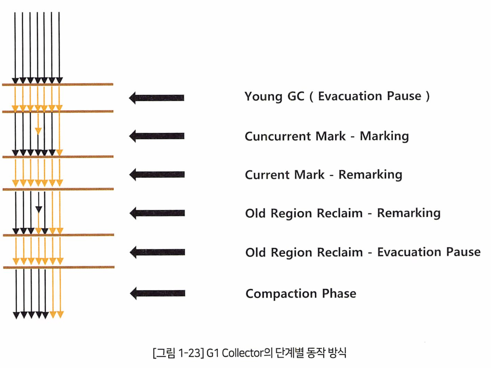

1. Young GC : Minor GC. 멀티쓰레드가 작업한다. 살아있는 객체는 Age에 맞게 Survivor 또는 Old로 Copy되며 기존 공간은 해지된다. 이후 새로운 객체가 할당되는 리전은 그 근처 비어있는 Region이 된다.

2. Concurrent Mark phase (mark -> remark): Old 영역 GC 시작.

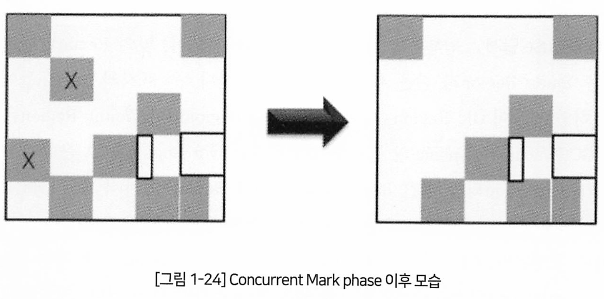

* Marking 단계 : Single Thread, 전체적으로 Concurrent, 이전 단계 때 변경된 정보 바탕으로 Initial Mark를 빠르게 수행한다.

- Remarking 단계 : Suspend 있고 전체 Thread가 동시작업, 각 Region마다 Reachable Object의 Density를 계산, 그 후 Garbage Region은 다음 단계로 안 넘어가고 바로 해지된다.


# GC 튜닝

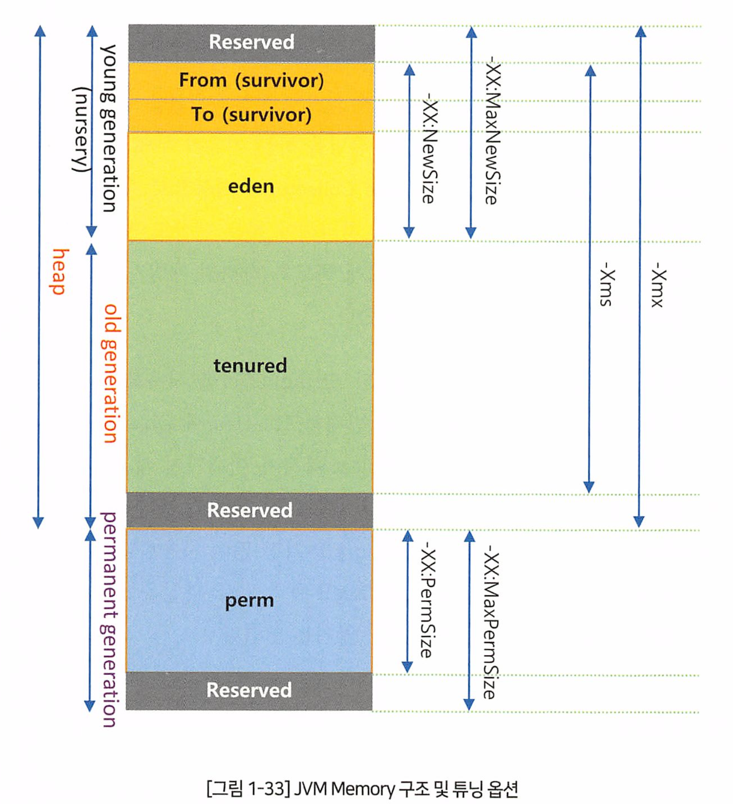

* 튜닝 옵션들.

## 튜닝 필요성

일반적으로 다음과 같은 상황이라면 GC 옵션을 통한 튜닝이 필요하다고 볼 수 있다.

- -Xms 옵션과 -Xmx 옵션으로 Memory 크기 설정 없이 사용중이다.
- JVM 옵션에 -Server 옵션이 설정되어 있지 않다.
- 시스템에 Timeout 같은 로그가 발생하면서 정상적인 트랜잭션 처리가 이루어지지 않는다.

1. 가능한 객체 생성을 줄이면 GC가 적다
2. String대신 StringBuffer, Builder 사용. 문자열을 변경할 경우 String은 객체 자체를 복사해서 값을 변경하므로 Heap에 객체가 계속 쌓이지만, StringBuffer, Builder는 내부적으로 복사가 이뤄지지 않고 객체의 값만 변경된다.
3. 로그를 최대한 적게 쌓는것이 좋다

## GC 튜닝 목적

시스템의 Suspend Time (Stop the word)를 줄이는것이 목적.

세부적으로 보면

1. Old 영역으로 넘어가는 객체 수 최소화
2. Full GC 실행시간 감소

## 객체 수 최소화의 중요성

객체 수를 줄이면 Old 영역으로 넘어가는 객체 수를 줄일 수 있기 때문에 Full GC가 발생하는 빈도를 많이 줄일 수 있다.

## Full GC Time 줄이기

1~2초 걸리면 오래걸린것이다. 

Old 영역의 크기를 줄이게 되면 OOM이 발생하거나 Full GC가 더 많이 발생한다.

반대로 늘리게 되면 Full GC 횟수는 줄지만 발생하면 실행시간이 오래걸리므로 Old 영역은 적절해야 한다.

## GC의 성능을 결정하는 옵션

* -Xms 옵션 - JVM 시작 시 할당할 초기 힙 메모리 크기를 설정
* -Xmx 옵션 - JVM이 사용할 수 있는 최대 힙 메모리 크기를 설정
* -XX:NewRaio 옵션 - Young Generation과 Old Generation 사이의 메모리 비율을 설정
  *  `-XX:NewRatio=3`은 Old Generation이 Young Generation의 세 배 크기가 되도록 설정
  * Young이 작으면 자주 마이너 GC 발생, 너무 크면 Old에 공간이 모자름

## GC 튜닝고정

1. jstat을 이용한 지표 모니터링

-verbosegc 옵션과 -Xloggc:<파일위치> 옵션을 사용하여 JVM에서 로그를 멀구 도록 설정한다. 

2. VisuamVM 사용, JConsole,MAT 등 사용

## GC 튜닝이 불필요한 상황

*  Minor GC의 처리 시간이 50ms 내외로 빠른 경우

* Minor GC 주기가 10초 내외로 빈번하지 않은 경우

* Full GC의 처리 시간이 보통 1초 이내로 빠른 경우

* Full GC 주기가 10분에 1 회 정도로 빈번하지 않은 경우

## GC 방식 선택

CMS가 다른 GC보다 빠르지만, 항상 빠른것은 아님.

Compaction (압축, 단편화 해제) 작업에 따라 항상 다르다.

GC와 운영중인 특성에 따라 적절한 GC를 선택해야 한다.

* **CMS의 속도**: CMS는 빠르고 중단 시간이 짧지만, 메모리 단편화와 CPU 사용량이 높은 문제가 있다.
* **Compaction (압축)**: CMS는 메모리를 압축하지 않아, 오래 실행될수록 단편화 문제가 발생할 수 있다. 반면, G1과 같은 다른 GC는 메모리를 주기적으로 압축하여 단편화를 방지
* 예를 들어, 낮은 중단 시간이 중요하다면 CMS나 ZGC가 좋은 선택일 수 있다.

즉

1. **저지연, 대응 시간이 중요한 실시간 시스템**:
   - **적절한 GC**: ZGC 또는 G1 GC
   - **이유**: ZGC는 매우 낮은 지연 시간을 제공하며 대용량 힙에서도 효과적입니다. G1 GC도 예측 가능한 중단 시간을 제공하여 실시간 성능에 적합합니다.
2. **대규모 힙을 사용하는 데이터 분석 및 처리 시스템**:
   - **적절한 GC**: G1 GC
   - **이유**: G1 GC는 대용량 힙을 관리하면서도 중단 시간을 줄일 수 있어, 대규모 데이터를 다루는 시스템에 적합합니다.
3. **CPU 사용량이 민감한 시스템**:
   - **적절한 GC**: Parallel GC
   - **이유**: Parallel GC는 여러 CPU 코어를 활용하여 빠르게 메모리를 정리할 수 있으나, 중단 시간이 길 수 있습니다. CPU 자원이 충분한 시스템에서 효과적입니다.


## Memory 크기와 GC 상관관계 

* Memory 크기가 크면 GC 발생 횟수는 줄어들고 GC 수행 시간은 증가한다.

* Memory 크기가 작으면 GC 수행 시간은 줄어들고 GC 발생 횟수는 증가한다.

정답은아니다. 트레이드오프다. 

어떤서버는 10GB 메모리여도 1~2초고, 일반적으로는 10GB 면 20~30초이상은 소요된다.

만약 Full GC 후 300MB 밖에 안되면 500MB이상 여유 있도록 공간을 여유롭게 하자. 


NewRatio도 고려해야 한다 (Young, Old의 비율)

-XX:NewRaio=1이면 1:1, 1GB 메모리라면 500MB:500MB

2면, 1:2, 즉 333: 666이 된다. 


# 2.5 GC 성능 테스트 - p90쪽까지 볼것 


1) 개요
2) Case 1
3) Case 2 / Case 2-1
4) Case 3
5) Case 4
6) 결론


# 2.6 GC 관련 장애 발생 유형(OOME) 및 분석 방법  91


## 1. OOME의 종류

JVM이 Heap Memory에 더 이상 Object를 할당할 수 없을 때 발생하는 오류이다. 

OOME 에러는 보통 아래와 같이 두 가지 유형으로 크게 구분할 수 있다.

- Java.lang.OutOfMemoryError: Java heap space
- Java.lang.OutOfMemoryError : PermGen space 


해결하기 쉬운 방법은 -Xmx 옵션을 사용하여 힙메모리 증가 시키는 법이 있다. 그러나 GC Time의 증가를 동반한다.

두 번째 방법은 힙덤프 분석으로 많은 메모리를 사용하는 로직을 찾아 수정해야 한다.


### Java.lang.OutOfMemoryError : PermGen space 

Jvm 기동시 로딩되는 Class 또는 String 수가 많으면 OOM PermGen space의 원인이 된다.

해결방법 : JVM Option 튜닝


## 2. OOME 발생 원인 및 해결 방법


## 3. OOME 분석 툴


3. JVM Sychronization이란?

3.1 개요 ㆍㆍㆍㆍㆍㆍㆍ 94

1) Java 그리고 Thread
2) Thread 동기화
3) Mutual Exclusion과 Critical Section
4) Monitor

3.2 Java의 동기화(Synchronization) 방법 ㆍㆍㆍㆍㆍㆍㆍ 96

1) Synchronized Statement
2) synchronized Method
3) Wait And Notify
4) synchronized Statement와 synchronized Method 사용

3.3 Thread 상태 ㆍㆍㆍㆍㆍㆍㆍ 101
3.4 Thread의 종류 ㆍㆍㆍㆍㆍㆍㆍ 102
3.5 JVM에서의 대기 현상 분석 ㆍㆍㆍㆍㆍㆍㆍ 102
3.6 Thread Dump 104
3.7 Case별 synchronized에 대한 Thread Dump 분석 ㆍㆍㆍㆍㆍㆍㆍ 105

1) 동기화 방식별 소스 코드
2) Hot Spot JVM 실행 분석
3) IBM JVM 실행 분석

3.8 Thread Dump를 통한 Thread 동기화 문제 해결의 실 사례 ㆍㆍㆍㆍㆍㆍㆍ 113

“도구(Tool)를 이용한 성능분석”

1. Java 성능분석 도구 개요

1.1 JDK 내장 성능분석 도구 ㆍㆍㆍㆍㆍㆍㆍ 118
1.2 3rd Party 성능분석 도구 ㆍㆍㆍㆍㆍㆍㆍ 120

2. JVM Thread, 메모리 정보

2.1 Thread Dump와 Stack Trace 정보 ㆍㆍㆍㆍㆍㆍㆍ 123
2.2 Heap 메모리 구조 ㆍㆍㆍㆍㆍㆍㆍ 124
2.3 Heap Dump 정보 ㆍㆍㆍㆍㆍㆍㆍ 126
2.4 객체 참조, GC와 메모리 누수 ㆍㆍㆍㆍㆍㆍㆍ 128

3. jcmd

3.1 jcmd를 이용하여 Java 프로세스 정보 확인하기 ㆍㆍㆍㆍㆍㆍㆍ 129
3.2 Java Flight Recording 기능 사용하기 ㆍㆍㆍㆍㆍㆍㆍ 134
3.3 GC 메모리 분석 기능 사용하기 ㆍㆍㆍㆍㆍㆍㆍ 146
3.4 Management Agent(JMX) 기능 사용하기 ㆍㆍㆍㆍㆍㆍㆍ 149
3.5 jcmd 도구 vs 다른 도구 비교 ㆍㆍㆍㆍㆍㆍㆍ 152

4. Java Mission Control 도구의 활용

4.1 실시간 모니터링 ㆍㆍㆍㆍㆍㆍㆍ 154
4.2 Java Flight Recorder 레코딩하기 ㆍㆍㆍㆍㆍㆍㆍ 161
4.3 General 정보 ㆍㆍㆍㆍㆍㆍㆍ 164
4.4 Memory 정보 ㆍㆍㆍㆍㆍㆍㆍ 168
4.5 Code 정보 ㆍㆍㆍㆍㆍㆍㆍ 176
4.6 Threads 정보 보기 ㆍㆍㆍㆍㆍㆍㆍ 177
4.7 IO 정보 보기 ㆍㆍㆍㆍㆍㆍㆍ 181
4.8 System 정보 보기 ㆍㆍㆍㆍㆍㆍㆍ 182
4.9 Events 정보 보기 ㆍㆍㆍㆍㆍㆍㆍ 184

5. JConsole ㆍㆍㆍㆍㆍㆍㆍ 188


6. VisualVM

6.1 Monitor 탭 ㆍㆍㆍㆍㆍㆍㆍ 195
6.2 Heap Dump 내용 보기 ㆍㆍㆍㆍㆍㆍㆍ 195
6.3 Threads 탭 ㆍㆍㆍㆍㆍㆍㆍ 197
6.4 Profiler 수행하기 ㆍㆍㆍㆍㆍㆍㆍ 200
6.5 Sampler 수행하기 ㆍㆍㆍㆍㆍㆍㆍ 201
6.6 MBeans Plugin으로 JMX 모니터링하기 ㆍㆍㆍㆍㆍㆍㆍ 202
6.7 Visual GC Plugin 기능 덧입기 ㆍㆍㆍㆍㆍㆍㆍ 205
6.8 JConsole Plugin기능을 VisualVM에서 사용하기 ㆍㆍㆍㆍㆍㆍㆍ 206

7. Eclipse Memory Analyzer (MAT)

7.1 MAT 설치하기 ㆍㆍㆍㆍㆍㆍㆍ 209
7.2 HeapDump 분석 방법 ㆍㆍㆍㆍㆍㆍㆍ 212
7.3 HeapDump 파일 열기 ㆍㆍㆍㆍㆍㆍㆍ 214
7.4 객체 참조관계 분석 ㆍㆍㆍㆍㆍㆍㆍ 215
7.5 ClassLoader 누수 분석 (PermGen이슈) ㆍㆍㆍㆍㆍㆍㆍ 224
7.6 객체를 사용하는 Thread 분석 ㆍㆍㆍㆍㆍㆍㆍ 224
7.7 Collection 분석 ㆍㆍㆍㆍㆍㆍㆍ 225
7.8 Dominator Tree 분석 ㆍㆍㆍㆍㆍㆍㆍ 227
7.9 Leak Suspects 분석 ㆍㆍㆍㆍㆍㆍㆍ 229
7.10 Heap Dump 파일 비교 분석 ㆍㆍㆍㆍㆍㆍㆍ 237

8. IBM HeapAnalyzer

8.1 IBM HeapAnalyzer 사용되는 용어 정의 ㆍㆍㆍㆍㆍㆍㆍ 241
8.2 Summary ㆍㆍㆍㆍㆍㆍㆍ 242
8.3 Leak Suspect ㆍㆍㆍㆍㆍㆍㆍ 243
8.4 Object List ㆍㆍㆍㆍㆍㆍㆍ 247
8.5 Type List ㆍㆍㆍㆍㆍㆍㆍ 248
8.6 Root List / Root Type List ㆍㆍㆍㆍㆍㆍㆍ 249
8.7 Gaps by Size/ Gap Statistics ㆍㆍㆍㆍㆍㆍㆍ 250

9. Java Thread Dump Analyzer(TDA)

9.1 TDA 사용하기 ㆍㆍㆍㆍㆍㆍㆍ 253
9.2 TDA를 이용한 분석 ㆍㆍㆍㆍㆍㆍㆍ 256

10. 성능분석 도구들 비교 ㆍㆍㆍㆍㆍㆍㆍ 261


“APM(InterMax) 활용 성능 분석 사례”

1. InterMax란 무엇인가?

1.1 실시간 모니터링 ㆍㆍㆍㆍㆍㆍㆍ 264
1.2 사후 분석 ㆍㆍㆍㆍㆍㆍㆍ 272
1.3 트랜잭션 조회 ㆍㆍㆍㆍㆍㆍㆍ 278

2. 성능 분석 사례

2.1 과도한 SQL Fetch에 의한 OOME 발생 사례 ㆍㆍㆍㆍㆍㆍㆍ 283
2.2 Full GC 수행에 따른 애플리케이션 수행 지연 발생 사례 ㆍㆍㆍㆍㆍㆍㆍ 287
2.3 특정 오브젝트의 메모리 과다 사용으로 인한 OOME 발생 사례 ㆍㆍㆍㆍㆍㆍㆍ 291
2.4 소켓 타임아웃에 의한 서비스 지연 발생 사례 ㆍㆍㆍㆍㆍㆍㆍ 294
2.5 Exception이 발생하며 서비스 수행에 실패하는 사례 ㆍㆍㆍㆍㆍㆍㆍ 298
2.6 SQL 수행 지연에 따른 애플리케이션 지연 현상 분석 사례 ㆍㆍㆍㆍㆍㆍㆍ 300
2.7 DB Lock에 의한 애플리케이션 지연 현상 분석 사례 ㆍㆍㆍㆍㆍㆍㆍ 304