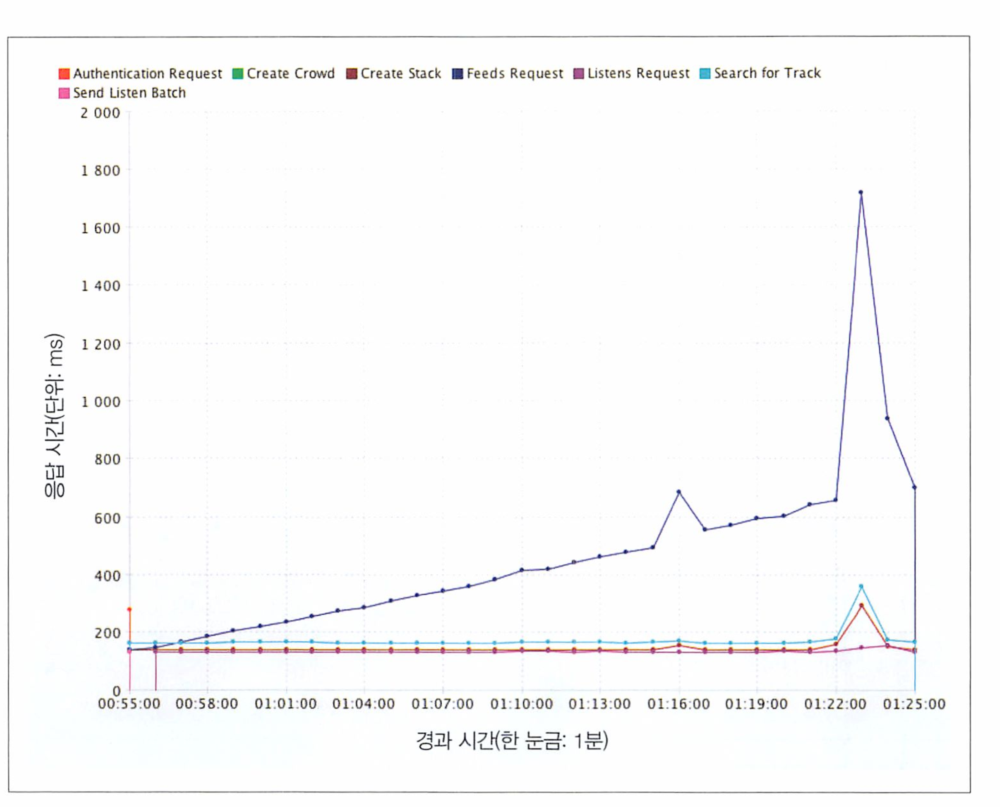
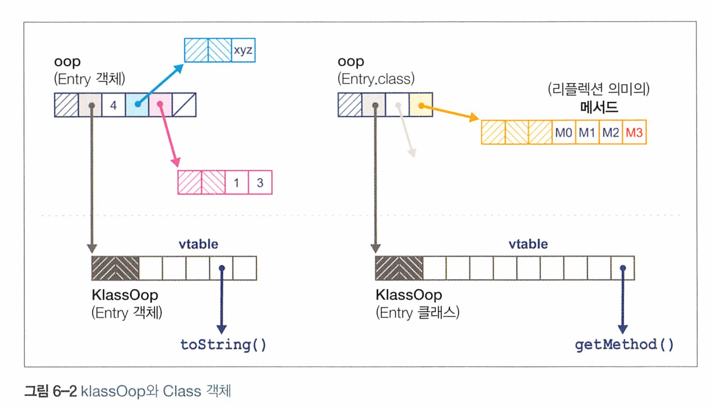
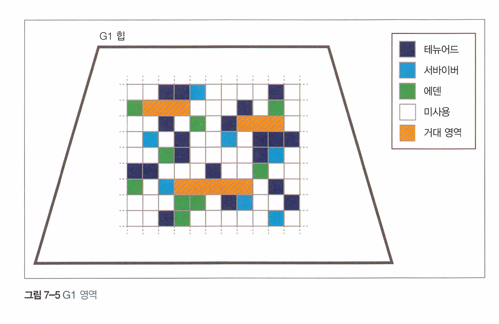
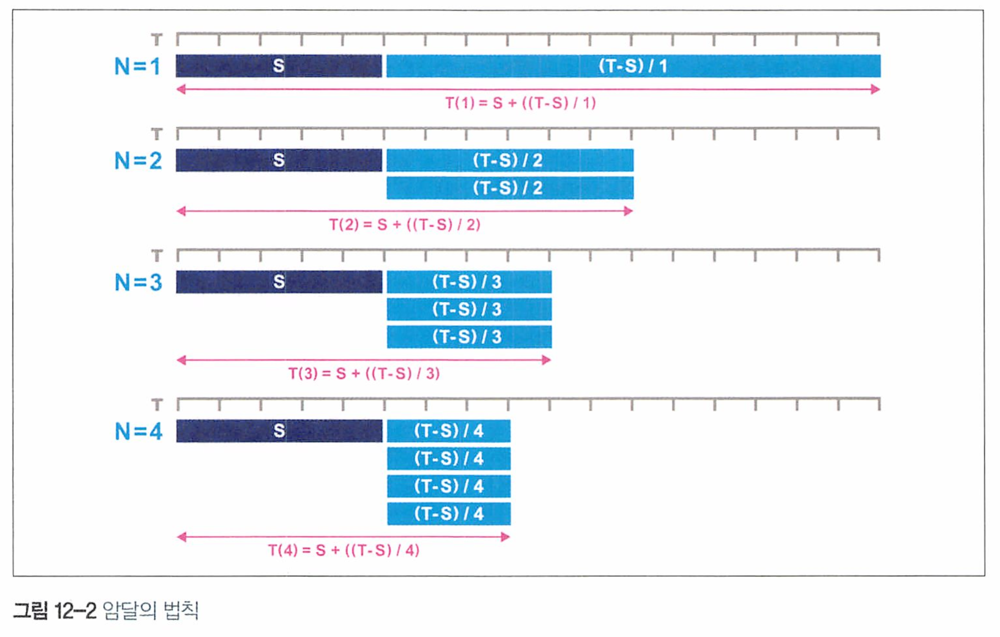
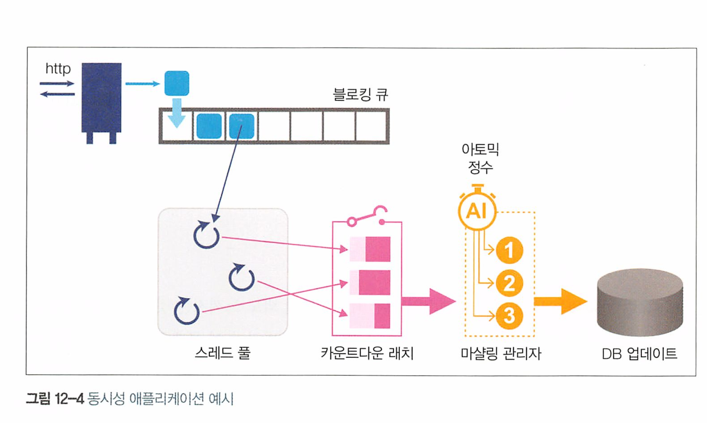

# 자바 최적화 - 가장 빠른 성능을 구현하는 검증된 10가지 기법

# Table of Contents

- [1. 성능과 최적화](#1-성능과-최적화)
- [2. JVM 이야기](#2-jvm-이야기)
- [3. 하드웨어와 운영체제](#3-하드웨어와-운영체제)
- [4. 성능 테스트 패턴 및 안티패턴](#4-성능-테스트-패턴-및-안티패턴)
- [5. 마이크로벤치마킹과 통계](#5-마이크로벤치마킹과-통계)
- [6. 가비지 수집 기초](#6-가비지-수집-기초)
- [7. 가비지 수집 고급](#7-가비지-수집-고급)
- [8. GC 로깅, 모니터링, 튜닝, 툴](#8-gc-로깅-모니터링-튜닝-툴)
- [9. JVM의 코드 실행](#9-jvm의-코드-실행)
- [10. JIT 컴파일의 세계로](#10-jit-컴파일의-세계로)
- [11. 자바 언어의 성능 향상 기법](#11-자바-언어의-성능-향상-기법)
- [12. 동시 성능 기법](#12-동시-성능-기법)
- [13. 프로파일링](#13-프로파일링)
- [14. 고성능 로깅 및 메시징](#14-고성능-로깅-및-메시징)
- [15. 자바 9와 미래](#15-자바-9와-미래)


# 1. 성능과 최적화
## 1.3 성능은 실험과학이다


* 원하는 결과를 정의한다.
* 기존 시스템을 측정한다.
* 요건을 충족시키려면 무슨 일을 해야 할지 정한다.
* 개선 활동을 추진한다
* 다시 테스트한다.
* 목표가 달성됐는지 판단한다

이를 반복해서 성능향상을 하기위한 연구를 한다.

## 1.4 성능 분류

일반적인 기본 성능 지표

* 처리율(throughput)
* 지연(latency)
* 용량, 사용률, 효율, 확장성, 저하

### 처리율

시스템이 수행 가능한 작업 비율을 나타낸 지표. 보통 일정 시간 동안 완료한 작업 단위 수로 표시(TPS : 초당 처리 가능한 트랜잭션 수)

### 지연

하나의 트랜잭션을 처리하고 결과를 받을때까지 소요된 시간

### 용량

capacity는 시스템의 동시 처리 가능한 작업(트랜잭션) 갯수. 

시스템에 동시 부하가 증가할수록 처리율은 영향을 받는다. 

# 2. JVM 이야기
## 2.1 인터프리팅과 클래스로딩
JVM은 스택 기반의 해석 머신. 

JVM 인터프리터의 기본 로직은, 평가 스택을 이용해 중간값들을 담아두고 가장 마지막에 실행된 명령어와

독립적으로 프로그램 구성하는 OperationCode(기계어)를 하나씩 순서대로 `처리하는 while 루프안의 switch문`


XXX.class파일의 main 시작시 사슬처럼 연결된 클래스로더가 작동함.

1. 제일 먼저 부트스트랩 클래스가 자바 런타임 코어 클래스를 로드. 
   * 부트스트랩 클래스 로더의 주임무는, 다른 클래스로더가 시스템에 필요한 클래스를 로드할 수 있게 최소한의 필수 클래스(java.lang.Object, Class, Classloader)만 로드


2. 확장 클래스 로더가 생성. 부트스트랩 클래스로더를 자기 부모로 설정하고 필요할 때 클래스 로딩 작업을 부모로 넘김.

3. 애플리케이션 클래스로더 생성되고(확장 클래스로더의 자식). 지정된 classpath에 위치한 유저 클래스를 로드.
   * 시스템 클래스 로더라고 하면 안되고 애플리케이션 클래스로더하는것이 옳다. 


정리하자면

- **단계 1: 부트스트랩 클래스 로더**
  - **역할**: 자바의 핵심 라이브러리 클래스들을 로드합니다.
  - **특징**: 가장 기본적인 클래스 로더로, 모든 다른 클래스 로더의 최상위에 위치합니다.
  - **변화**: 자바 9 이후로, 클래스 로딩 방식이 모듈화되어 변경되었습니다.
- **단계 2: 확장 클래스 로더**
  - **역할**: 특정 플랫폼에 특화된 라이브러리(예: 네이티브 코드)를 로드합니다.
  - **예시**: 자바 8에서는 JavaScript 런타임인 Nashorn을 로드하는데 사용됩니다.
- **단계 3: 애플리케이션 클래스 로더**
  - **역할**: 사용자 정의 클래스 또는 추가된 라이브러리를 로드합니다.
  - **기능**: 특정 클래스가 시스템에 없을 경우, 클래스 경로에서 해당 클래스를 찾아 로드합니다.


자바는 프로그램 실행중 처음보는 클래스를 dependency에 로드한다 (의존체 )

각 클래스 로더는 부모-자식 관계를 가지며, 클래스 로드 요청을 받았을 때 자신이 로드할 수 없는 경우 부모 클래스 로더에게 요청을 전달하여 찾는다.. 이 과정을 통해, 요청은 최상위인 부트스트랩 클래스 로더까지 올라갈 수 있다.

- 최상위 로더까지 클래스를 찾지 못하면 `ClassNotFoundException` 예외가 발생.

* **자바에서 클래스는 패키지명을 포함한 풀 클래스명과, 자신을 로드한 클래스로더 2가지 정보로 식별된다.** 

## 2.2 바이트코드 실행

javac가 자바 소스코드를 바이트코드 파일인 .class로 바꾼다.

* 자바소스코드를 컴파일해서 클래스파일은 만든다.

JVM은 클래스를 로드할 때 올바른 형식을 준수하는지 빠짐없이 검사한다.

JVM 클래스 파일 구조는 다음으로 이루어져 있다.

| 컴포넌트                    | 설명                                                         | 추가 설명                                                    |
| --------------------------- | ------------------------------------------------------------ | ------------------------------------------------------------ |
| 매직 넘버 (Magic Number)    | OXCAFEBABE                                                   | 클래스 파일임을 식별하는 고유의 코드                         |
| 클래스 파일 포맷 버전       | 클래스 파일의 메이저/마이너 버전                             | JVM 호환성을 보장하기 위해 필요                              |
| 상수 풀 (Constant Pool)     | 클래스 상수들이 모여 있는 위치                               | 코드에서 사용되는 다양한 상수와 심볼의 참조를 저장           |
| 액세스 플래그 (Access Flag) | 추상 클래스, 정적 클래스 등 클래스 종류를 표시 (public, final인지 ) | 클래스의 접근 제어와 관련된 플래그                           |
| this 클래스                 | 현재 클래스명                                                | 클래스 파일이 정의하는 현재 클래스의 이름                    |
| 슈퍼클래스 (Superclass)     | 슈퍼클래스(부모클래스)명                                     | 현재 클래스의 부모 클래스의 이름                             |
| 인터페이스 (Interface)      | 클래스가 구현한 모든 인터페이스                              | 클래스가 구현하고 있는 인터페이스 목록                       |
| 필드 (Field)                | 클래스에 들어 있는 모든 필드                                 | 클래스 내 정의된 변수들                                      |
| 메서드 (Method)             | 클래스에 들어 있는 모든 메서드                               | 클래스에 정의된 함수 또는 메서드                             |
| 속성 (Attribute)            | 클래스가 지닌 모든 속성(예: 소스 파일명 등)                  | 클래스와 관련된 추가 정보, 예를 들어 디버그 정보, 소스 파일명 등 |

* 모든 클래스 파일은 OXCAFEBABE라는 매직 넘버, 즉 이 파일이 클래스 파일임을 나타내는 4바 이트 16진수로 시작

다음코드를 컴파일하면

```java
public class HelloWorld {
    public static void main(String[] args) {
        for (int i = 0; i < 10; i++) {
            System.out.println("Hello World");
        }
    }
}
```

다음 바이트코드가 나온다

```java
Compiled from "HelloWorld.java"
public class HelloWorld {
  public HelloWorld();
    Code:
       0: aload_0
       1: invokespecial #1                  // Method java/lang/Object."<init>":()V
       4: return

  public static void main(java.lang.String[]);
    Code:
       0: iconst_0
       1: istore_1
       2: iload_1
       3: bipush        10
       5: if_icmpge     26
       8: getstatic     #2                  // Field java/lang/System.out:Ljava/io/PrintStream;
      11: ldc           #3                  // String Hello World
      13: invokevirtual #4                  // Method java/io/PrintStream.println:(Ljava/lang/String;)V
      16: iinc          1, 1
      19: goto          2
      22: return
}

```

## 2.3 핫스팟 입문

### JIT 컴파일이란?

자바 프로그램은 바이트코드 인터프리터가 가상화한 스택 머신에서 명령어를 실행하며 시작된다.

* 프로그램이 최대로 성능을 내려면 네이티브 기능을 활용해 CPU에서 직접 프로그램을 실행시켜야 한다

자바의 JIT(Just-In-Time, 적시, 그때그때 하는) 컴파일은 자바 프로그램이 실행될 때 바이트코드를 기계어로 변환하는 과정이다.

바이트코드를 네이티브 코드(기계어)로 컴파일 한다. 

### JIT 컴파일의 작동 방식

1. **코드 로딩**: 자바 애플리케이션을 실행하면 JVM은 먼저 자바 클래스 파일들을 로드하고, 이 파일들을 포함하는 바이트코드를 인터프리터를 통해 실행합니다.
2. **성능 분석**: 인터프리터는 실행 중에 각 코드 부분의 성능을 분석합니다. 자주 실행되는 코드 블록(핫스팟이라고 불림)을 식별합니다.
3. **JIT 컴파일**: 핫스팟으로 식별된 코드는 JIT 컴파일러에 의해 기계어로 컴파일됩니다. 이 과정에서 최적화가 수행되어, 해당 코드 블록의 실행 속도가 향상됩니다.
4. **실행**: 일단 JIT 컴파일러에 의해 기계어로 번역된 코드는 직접 실행됩니다. 이후 해당 코드가 실행될 때마다 JVM은 기계어로 번역된 코드를 직접 실행하여 성능이 개선됩니다.

### JIT 컴파일의 장점

- **성능 향상**: JIT 컴파일은 프로그램의 실행 속도를 향상시키며, 특히 반복적으로 사용되는 코드에서 그 효과가 두드러집니다.
- **런타임 최적화**: 실행 시간에 프로그램의 실제 사용 패턴에 따라 최적화를 수행할 수 있어, 전통적인 컴파일 방식보다 더 효율적인 경우가 많습니다.
- **동적 어댑티브 최적화**: 프로그램의 실행 환경과 사용 패턴에 맞추어 지속적으로 최적화를 조정할 수 있습니다.

### JIT 컴파일의 단점

- **초기 부하**: JIT 컴파일 과정은 실행 초기에 추가적인 처리 시간을 필요로 합니다. 따라서, 프로그램이 짧게 실행되거나 한 번만 실행되는 경우, JIT 컴파일의 이점이 크게 나타나지 않을 수 있습니다.
- **메모리 사용량 증가**: JIT 컴파일 과정에서 생성된 기계어 코드를 저장하기 위해 추가적인 메모리가 필요합니다.


## 2.4 JVM 메모리 관리

자바는 가비지 수집으로 힙메모리를 자동 관리한다.

* 가비지 수집이란 불필요한 메모리 회수하거나 재사용하는 불확정적 프로세스다


## 2.5 스레딩과 자바 메모리 모델(JMM)

1990년대 후반부터 자바의 멀티스레드 방식은 다음 세 가지 기본 설계 원칙에 기반합니다.

- 자바 프로세스의 모든 스레드는 가비지가 수집되는 하나의 공용 힙을 가진다.
- 한 스레드가 생성한 객체는 그 객체를 참조하는 다른 스레드가 액세스할 수 있다.
- 기본적으로 객체는 변경 가능하다. 즉, 객체 필드에 할당된 값은 프로그래머가 애써 final 키워드로 불변 표시하지 않는 한 바뀔 수 있다.


## 2.7 JVM 모니터링과 툴링
JVM 모니터링 기술

* 자바 관리 확장 (JMX) : JVM과 애플리케이션을 제어하고 모니터링하는 툴. 메서드 호출 및 매개변수 변경 가능 
* 자바 에이전트 : 자바로 작성된 툴 컴포넌트. 메서드 바이트코드를 조작한다
  * JVM에 시작플래그를 추가해서 설치한다. `-javaagent:<에이전트 Jar 파일이 위치한 경로>=<옵션>`
* JVM 툴 인터페이스
* 서비스어빌리티 에이전트

# 4. 성능 테스트 패턴 및 안티패턴
## 4.1 성능 테스트 유형
### 지연 테스트(Latency test)

종단 트랜잭션에 걸리는 시간은?


### 처리율 테스트(Throughput test)

현재 시스템이 처리 가능한 동시 트랜잭션 개수는?


### 부하 테스트(Load test)

특정 부하를 시스템이 감당할 수 있는가?

-> 애플리케이션 트래픽이 상당할것으로 예상되는 특정 비즈니스 이벤트(광고, 소셜미디어이벤트, 바이럴콘텐츠)를 대비

### 스트레스 테스트(Stress test)

이 시스템의 한계점은 어디까지인가?

시스템 여력 테스트.

일정한 수준의 특정 처리율을 시스템에 계속 걸어놓는다.

측정값이 나빠지기 시작하기 직전 값이 최대 처리율 


### 내구성 테스트(Endurance test)

시스템을 장시간 실행할 경우 성능 이상 증상이 나타나는가?

메모리 누수, 캐시 오염, 메모리 단편화 등을 테스트 

### 용량 계획 테스트(Capacity planning test)

리소스를 추가한 만큼 시스템이 확장되는가?


### 저하 테스트(Degradation)

시스템이 부분적으로 실패할 경우 어떤 일이 벌어지나?

페일오버 테스트. 

부분 실패 테스트 중에는 카오스 멍키Chtos Monkey (혼돈의 원숭이)라는 하위 유형이 있습니다.

넷플릭스에서 자사 인프라의 견고함을 검증하려고 수행한 프로젝트명에서 유래됐죠.

카오스 멍키의 요지는, 진짜 복원성 있는 아키텍처에서는 어느 한 컴포넌트가 잘못돼도 다른 컴포넌트까지 연쇄적으로 무너뜨리면서 전체 시스템에 부정적 영향을 끼치는 일은 없어야 한 다는 겁니다.

**실제로 운영 환경에 떠 있는 라이브 프로세스를 하나씩 랜덤하게 죽이면서 검증하죠.**

## 4.2 기본 베스트 프랙티스

성능 튜닝 시 주안점을 두어야 할 부분은 다음 세 가지 기본 원칙에 따라 결정합니다.

- 나의 관심사가 무엇인지 식별하고 그 측정 방법을 고민한다.
- 최적화하기 용이한 부분이 아니라. 중요한 부분을 최적화한다.
- 중요한 관심사를 먼저 다룬다.

## 테스트 환경 구축 

가급적이면 운영환경과 똑같이 복제해야 한다

서버 (CPU 수, OS, 자바 버전), 웹 서버, DB, 로드 밸런서, 서드파티 서비스 등 

성능을 평가하는 지표는 코드 관점에서만 생각해서도 안 되고, 시스템을 전체적으로 바라보며 고객과 경영진에게 중요한 측정값을 고려해야 합니다. 이렇게 최적화하려는 핵심 지표를 성능 비기능 요건Nonf uncional Requiremen (NFR)이라고 합니다.

어떤 목표는 아주 명확합니다.

- 95% 백분위percenille 트랜잭션 시간을 100밀리초 줄인다.
- 기존 하드웨어 처리율을 5배 높일 수 있게 시스템을 개선한다.
- 평균 응답 시간을 30% 줄인다.

조금 모호한 목표도 있습니다.

- 일반 고객을 서비스하는 리소스 비용을 50% 줄인다.
- 애플리케이션 클러스터 성능이 50% 떨어져도 시스템이 응답 목표를 25% 이내로 유지한다.
- 고객 '이탈률cop -off rate'을 25밀리초 지연당 2.5% 낮춘다.

# 5. 마이크로벤치마킹과 통계
## 5.1 자바 성능 측정 기초


## 5.2 JMH 소개

JMH는 자바를 비롯해 JVM을 타깃으로 하는 언어로 작성된 나노/마이크로/밀리/매크로 벤치마크를 제작, 실행, 분석하는 자바 도구

그래서 JMH는 벤치마크 코드에 애너테이션을 붙 여 자바 소스를 추가 생성하는 식으로 작동


```java
public class MyBenchmark {
  @Benchmark
  public void testMethod() {
    
  }
}
```

JVM과 밀접하게 맞닿아 작동하는 JMLH는 아주 강력한 기능을 자랑합니다.

- 컴파일러를 제어한다.
- 벤치마크 도중 CPU 사용 수준을 시뮬레이션한다.


## 5.3 JVM 성능 통계

### 오차 유형

엔지니어가 자주 접하는 오차의 주된 근원 

* 랜덤 오차 (random error)
* 계통 오차 (systematic error) 

정확도는 계통 오차의 수준을 나타내는 용어로, 정확도가 높으면 계통 오차가 낮은 것. 

정밀도pecision는 랜덤 오차를 나타내는 용어로서, 정밀도가 높으면 랜덤 오차 가 낮은 것

정밀도는 높으나 정확도는 낮을 수 있고,

정밀도는 낮으나 정확도는 높을 수 있다. 

### 계통 오차

* 예시 : JSON 백엔드 자바 웹 서비스 성능 테스트 



* 특정 서비스를 보면 리소스를 놔주지 않는다. 


## 5.4 통계치 해석


# 6. 가비지 수집 기초
모든 가비지 수집 구현체는 다음 두가지 기본 원칙을 준수해야 한다

* 알고리즘은 반드시 모든 가비지를 수집해야 한다
* 살아있는 객체는 절대로 수집해선 안 된다.


## 6.1 마크 앤 스위프

### 가장 초보적인 마크앤스위프

아직 회수되지 않은 객체를 가리키는 포인터를 포함한 할당 리스트(allocated list)를 사용한다.

1. 할당 리스트를 순회하면서 마크 비트mark bi를 지운다.

2. GC 루트부터 살아 있는 객체를 찾는다.

3. 이렇게 찾은 객체마다 마크 비트를 세팅한다.

4. 할당 리스트를 순회하면서 마크 비트가 세팅되지 않은 객체를 찾는다.

   1. 힙에서 메모리를 회수해 프리 리스트에 되돌린다.

   1. 할당 리스트에서 객체를 삭제한다.

살아있는 객체를 대부분 깊이원 방식으로 찾으며, 이렇게 생성된 객체 그래프를 라이브 객체그래프라고 한다.

### 가비지 수집 용어

STW (Stop The World) : GC 발생시 모든 애플리케이션 스레드가 중단. 

동시 : GC 스레드는 애플리케이션 스레드와 동시(병행) 실행 가능. 

병렬 : 여러 스레드를 동원해서 가비시 수집함

방출 : 수집 사이클 마지막에 할당된 영역을 완전히 비우고 살아남은 객체는 모두 다른 메모리 영역으로 이동 (방출)합니다.

압착 : 할당된 메모리(즉, 살아남은 객체들)는 GC 사이클 마지막에 연속된 단일 영역으로 (대개 이 영역 첫 부분부터) 배열되며, 객체 쓰기가 가능한 여백의 시작점을 가리키는 포인터가 있습니 다. 압착 수집기는 메모리 단편화를 방지합니다.

## 6.2 핫스팟 런타임 개요

### 객체를 런타임에 표현하는 방법

핫스은 런타임에 oop라는 구조체로 자바 객체를 표현한다. oop는 평범한 객체 포인터의 줄임말이다.

oop는 지역 변수 안에 위치하며, 자바 메서드의 스택 프레임으로부터 **자바 힙을 구성하는 메모리 영역 내부를 가리킨다.** 

oop를 구성하는 자료 구조는 여러 가지가 있다. 그중 instanceoop는 자바 클래스의 인스턴스를 나타낸다.

instanceOop의 메모리 레이아웃은 모든 객체에 대해 기계어 워드 2개로 **구성된 헤더**로 시. 

* Mark 워드(인스턴스 관련 메타데이터를 가리키는 포인터)가 먼저 나오고, 
* 그다음은 Klass 워드(클래스 메타데이터를 가리키는 포인터)
  * Klass는 Class<?>의 객체를 나타내는 instanceOop 구조체와 구분하기 위함이다. 둘은 전혀 다르다. 

> 최신 버전의 자바는 Klass 워드가 자바 힙 밖을 가리키므로 객체 헤더가 필요 없다. 



klassOop에는 클래스용 가상 함수 테이블urun funcion thle (vtable)이 있지만, 

Class 객체에는 리플렉션으로 호출할 Method 객체의 레퍼런스 배열이 담겨 있다. 


**핫스팟 객체 헤더**는 일반적으로 다음과 같이 구성

- Mark 워드(32비트 환경은 4바이트, 64비트 환경은 8바이트)
- Klass 워드(압축됐을 수도 있음)
- 객체가 배열이면 length 워드 (항상 32비트임)
- 32비트 여백(정렬 규칙 때문에 필요할 경우)

JVM 환경에서 자바 레퍼런스는 instanceOop (또는 nuLL)를 제외한 어떤 것도 가리킬 수 없다.

- 자바 값은 기본형 값 또는 instanceOop 주소(레퍼런스)에 대응되는 비트 패턴이다.
- 모든 자바 레퍼런스는 자바 힙의 주 영역에 있는 주소를 가리키는 포인터라고 볼 수 있다.
- 자바 레퍼런스가 가리키는 주소에는 Mark 워드 + Klass 워드가 들어 있다.
- Kass0op와 CLass?> 인스턴스는 다르며, (KassOop는 힙의 메타데이터 영역에 있음) KassOop을 자 바 변수 안에 넣을 수 없다.

### GC 루트 및 아레나

GC 루트 : 메모리의 고정점으로, 메모리 풀 외부에서 내부를 가리키는 포인터. 즉 외부포인터다

GC 루트는 다음과 같이 종류가 다양하다

* stack frame
* JNI
* 레지스터
* 코드 루트
* 전역 객체
* 로드된 클래스의 메타데이터

핫스팟은 자바 heap을 관리할 때 system call을 사용하지 않는다. 

* 스팟 JVM이 시스템 호출을 사용하지 않고 자바 힙을 관리한다는 것은, 힙 메모리 할당과 관리가 운영 체제의 기본 메모리 관리 메커니즘을 직접적으로 사용하지 않고, JVM 내부에서 독립적으로 이루어진다는 의미
* JVM이 운영 체제의 기본 제공 메모리 관리 함수(예: `malloc`, `free` 등)를 사용하지 않고, 자체적인 방법으로 메모리를 할당하고 관리한다는 의미

## 6.3 할당과 수명

자바 애플리케이션에서 가비지 수집이 일어나는 주된 원인은 다음 두 가지

- 할당률
- 객체 수명

### 약한 세대별 가설Weak Generational Hypothesis.

JVM 및 유사 소프트웨어 시스템에서 객체 수명은 이원적bimodal 분포 양상을 보인다. 거의 대부분의 객체는 아주 짧은 시간만 살아 있지만, 나머지 객체는 기대 수명이 훨씬 길다.

이 법칙은 사람들이 객체 지향 워크로드를 상대로 실제로 실험을 하며 얻은 것으로, 결론은 '가비지를 수집하는 힙은, 단명 객체를 쉽고 빠르게 수집할 수 있게 설계해야 하며, 장수 객체와 단명 객체를 완전히 떼어놓는 게 가장 좋다'

핫스팟은 몇 가지 메커니즘을 응용하여 약한 세대별 가설을 십분 활용합니다.

- 객체마다 **'세대 카운트senerational count** (객체가 지금까지 무사 통과한 가비지 수집 횟수)'를 센다.
- 큰 객체를 제외한 나머지 객체는 에덴Eden (탁아소Nursery라고도 함) 공간에 생성한다. 여기서 살아남은 객체는 다른 곳으로 옮긴다.
- 장수했다고 할 정도로 충분히 오래 살아남은 객체들은 별도의 메모리 영역(올드old 또는 테뉴어드Tenured (종신) 세대)에 보관한다.

> '늙은 객체가 젊은 객체를 참조할 일은 거의 없다'는 게 약한 세대별 가설의 두 번째 포인트입니다.


JVM 핫스팟은 카드 테이블이라는 자료 구조에 늙은 객체가 젊은 객체를 참조하는 정보를 기록한다. 

* 카드 테이블은 JVM이 관리하는 바이트 배열. 

## 6.4 핫스팟의 가비지 수집

프로세스가 시작되면 JVM은 메모리를 할당(또는 예약)하고 유저 공간에서 연속된 단일 메모리 풀을 관리한다.

* 초기에 설정된 힙크기만큼 메모리를 운영체제로부터 할당받아 알아서 관리한다. 지정된 최대 힙 크기까지 늘릴 수 있다.


### 스레드 로컬 할당.

JVM이 관리하는 에덴 영역은 대부분 객체가 탄생하는 장소이고, 짧은 수명의 객체는 다른 곳에 위치하지않고 에덴에 위치하지므로 특별히 관리를 잘해야 한다.

JVM은 에덴을 여러 버퍼로 나누어 각 스레드가 새 객체를 할당하는 구역으로 활용하도록 배포한다.

* 이렇게 하면 각 스레드가 다른 스레드가 자신의 버퍼에 객체를 할당하지는 않을까 염려할 필요가 없게된다

이것을 TLAB(스레드 로컬 할당 버퍼)라고 한다.

## 6.5 병렬 수집기

자바 8 이전까지 디폴트 GC는 페러렐 수집기다. 

영 GC 풀 GC 모두 풀 STW를 일으킨다. 모든 스레드를 중단시키고 가용 CPU를 총동원해 가능한 빨리 메모리를 수집한다.

한계 : 풀 STW 유발. 올드영역 수집시 영 영역 수집보다 훨씬 오래걸림. 즉 힙 크기에 비례해 STW가 길어짐.

# 7. 가비지 수집 고급
가비지 수집기 선정 시 다음 항목을 충분히 고민해야 한다.

- 중단 시간(중단 길이 또는 기간이라고도 함)
- 처리율(애플리케이션 런타임 대비 GC 시간 %)
- 중단 빈도(수집기 때문에 애플리케이션이 얼마나 자주 멈추는가?)
- 회수 효율(GC 사이클 당 얼마나 많은 가비지가 수집되는가?)
- 중단 일관성(중단 시간이 고른 편인가?)

## 7.2 동시 GC 이론
### JVM 세이브포인트

 세이프포인트는 스레드가 가진 실행지점이자 스레드의 내부 자료 구조가 훤히 보이는 지점으로, 여기서 어떤 작업을 하기 위해 스레드는 잠시 중단될 수 있다. 

즉 세이프포인트는 자바 가상 머신(JVM)에서, 가비지 컬렉션(GC)과 같은 중요한 작업을 안전하게 수행하기 위해 모든 스레드의 실행을 일시 중지(suspend)할 수 있는 지점이다. 

GC전에 세이브 포인트에 모든 스레드가 도달하고, GC 작업이 완료되면, 모든 스레드는 세이프포인트에서 대기 상태를 벗어나 계속해서 실행된다.

다음은 세이프포인트 상태로 바뀌는 몇 가지 일반적인 경우이다.

1. JVM이 전역 '세이프포인트 시간 ' 플래그를 세팅한다.
2. 각 애플리케이션 스레드는 폴링 하면서 이 플래그가 세팅됐는지 확인한다.
3. 애플리케이션 스레드는 일단 멈췄다가 다시 깨어날 때까지 대기한다.

시간 플래그가 세팅되면 모든 애플리케이션은 반드시 멈춰야 한다. 

## 7.3 CMS

CMS는 STW를 아주 짧게 하려고 설계뙨 테뉴어드(올드)공간 수집기이다.

보통 영세대 수집용 Parallel GC와 같이 사용한다.

CMS는 중단 시간을 최소화하기 위해 애플리케이션 스레드 실행 중에 가급적 많은 일을 합니 다.

그러다 보니 수행 단계는 병렬 수집기보다 더 복잡하다

1. 초기 마킹 (STW)
2. 동시 마킹 concurrent Mark
3. 동시 사전 정리 concurent Predlean
4. 재마킹 remark (STW)
5. 동시 스위프 Concurent sweep
6. 동시 리셋concurrent Reset

두 단계(1. 초기 마킹, 4. 재마킹) 동안 모든 애플리케이션 스레드가 멈추고, 나머지 단계에서 는 애플리케이션 스레드와 병행하여 GC를 수행한다. 전체적으로 한 차례 긴 STW 중단을 일반적으로 매우 짧은 두 차레 STW 중단으로 대체한 셈


워크로드에 CMS를 적용하면 다음과 같은 효험이 있습니다.

1. 애플리케이션 스레드가 오랫동안 멈추지 않는다.
2. 단일 풀 GC 사이클 시간(벽시계 시간)이 더 길다.
3. CMS GC 사이클이 실행되는 동안, 애플리케이션 처리율은 감소한다.
4. GC가 객체를 추적해야 하므로 메모리를 더 많이 쓴다.
5. GC 수행에 훨씬 더 많은 CPU 시간이 필요하다.
6. CNS는 힙을 압착하지 않으므로 테뉴어드 영역은 단편화될 수 있다.

## 7.4 G1

처음부터 중단 시간이 짧은 새로운 수집기로 설계된 G1은 다음과 같은 특성이 있습니다.

- CMS보다 훨씬 튜닝하기 쉽다.
- 조기 승격에 덜 취약하다.
- 대용량 힙에서 확장성(특히, 중단 시간)이 우수하다.
- 풀 STW 수집을 없앨 수(또는 풀 STV 수집으로 되돌아갈 일을 확 줄일 수 있다.

### G1 힙 레이아웃 및 영역

G1 힙은 영역cgio (리전)으로 구성됩니다. 영역은 디폴트 크기가 1메가바이트 (힙이 클수록 크 기가 커짐>인 메모리 공간입니다. 영역을 이용하면 세대를 불연속적으로 배치할 수 있고, 수집 기가 매번 실행될 때마다 전체 가비지를 수집할 필요가 없습니다.



G1 알고리즘에서는 1, 2, 4, 8. 16, 32, 64메가바이트 크기의 영역을 사용할 수 있습니다. 

기본적으로 힙에는 2,048~4,095개의 영역이 있고, 이 개수에 따라 영역 크기도 조정됩니다.

영역 크기는 다음 값을 구한 뒤,

> <힙 크기> / 2048

허용된 영역 크기 값에 가장 가까운 수치로 반올림하여 계산합니다. 그러면 영역 개수는 다음 식으로 구할 수 있습니다.

> 영역 개수 =<힙 크기> / <영역 크기>

### G1 알고리즘 설계

G1 수집기가 하는 일은 대략 다음과 같다. 

- 동시 마킹 단계를 이용한다.
- 방출 수집기다.
- 통계적으로 압착한다.

> _ 영역을 절반 이상을 점유한 객체는 거대 객체로 간주하여 거대 영역이라는 별도 공간에 곧바로 할당된다. 
>
> 거대 영역은 (에덴이 아닌) 테뉴어드 세대에 속한, 연속된 빈 공간

G1 수집기에도 기억 세트 remembered set (RSet)라는 비슷한 장치로 영역을 추적한다. 

RSet은 영역별로 하나씩, 외부에서 힙 영역 내부를 참조하는 레퍼런스를 관리하기 위한 장치이다.

* 덕분에 레퍼런스를 찾으려고 전체 힙 뒤지지 말고 RSet만 꺼내보면 된다. 

### G1 수집단계

1. 초기 마킹(STW)
2. 동시 루트 탐색 : 초기 마킹 단계의 서바이버 영역에서 올드 세데를 가리키는 레퍼런스를 찾는 동시 단계 
3. 동시 마킹
4. 재마킹(STW) : 레퍼런스를 처리하고 정리하는 단계 
5. 정리(STW) : 에덴영역에서 재사용준비를 마친 영역을 식별하는 작업을 함. RSet도 정리함. 


## 7.5 셰난도아

## 7.6 C4(아줄 징)
## 7.7 밸런스드(IBM J9)
## 7.8 레거시 핫스팟 수집기
# 8. GC 로깅, 모니터링, 튜닝, 툴
## 8.1 GC 로깅 개요
## 8.2 로그 파싱 툴
## 8.3 GC 기본 튜닝
## 8.4 Parallel GC 튜닝
## 8.5 CMS 튜닝
## 8.6 G1 튜닝
## 8.7 jHiccup
## 8.8 마치며

# 9. JVM의 코드 실행
## 9.1 바이트코드 해석
## 9.2 AOT와 JIT 컴파일
## 9.3 핫스팟 JIT 기초
## 9.4 코드 캐시
## 9.5 간단한 JIT 튜닝법
## 9.6 마치며

# 10. JIT 컴파일의 세계로
## 10.1 JITWatch란?
## 10.2 JIT 컴파일 개요
## 10.3 인라이닝
## 10.4 루프 펼치기
## 10.5 탈출 분석
## 10.6 단형성 디스패치
## 10.7 인트린직
## 10.8 온-스택 치환
## 10.9 세이프포인트 복습
## 10.10 코어 라이브러리 메서드
## 10.11 마치며

# 11. 자바 언어의 성능 향상 기법
## 11.1 컬렉션 최적화

참조형 필드는 힙에 레퍼런스 형태로 저장되며, 컬렉션 컨테이너에 저장되는건 객체 자체가 아닌 객체를 가리키는 레퍼런스다.

그러므로 성능이 매우 빠르지 않다.

## 11.2 List 최적화

### ArrayList

고정 크기 배열에 기반한 리스트. 배열이 꽉차면 더 큰 배열을 새로 할당한 다음 기존 값을 복사한다.

배열이 꽉차면 값을 복사하는데 시간이 드므로, 가능하다면 초반에 크기를 지정해두는게 낫다. 

### LinkedList

동적으로 증가하는 리스트. double Linked List로 구현되어 있어서 리스트에 덧붙이는 작업은 항상 O(1)이다.

### ArrayList vs LinkedList

특정 인덱스에 원소 추가시 

* ArrayList : 다른 원소들을 모두 한칸씩 우측으로 이동시켜야함
* LinkedList : 삽입 지점을 찾고 교체하기만 하면된다.

원소 삭제시

* ArrayList : 모두 좌측으로 옮겨야함
* LinkedList : 레퍼런스 2개만 바꾸면 됌

랜덤액세스시

* ArrayList : O(1).
* LinkedList : 최대 O(n). 인덱스 카운트만큼 원소 방문해야함 


## 11.3 Map 최적화

### HashMap

자바 문서에도 나와 있듯이, initialcapacity와 LoadFactor를 높게 잡으면 순회 시 성 능에 상당한 영향을 받는다.

* **InitialCapacity (초기 용량)**:
  - `initialCapacity`는 `HashMap`이 생성될 때 내부 데이터 구조인 해시 테이블의 크기를 지정
* **LoadFactor (부하 계수)**:
  - `loadFactor`는 해시 테이블의 버킷이 얼마나 채워졌을 때 크기 조정을 해야 하는지를 결정하는 데 사용되는 수치입니다. 즉, 이 값은 최대로 채워질 수 있는 데이터의 밀도를 의미합니다.
* 예를 들어, `loadFactor`가 0.75라면, 해시 테이블의 75%가 채워지면 테이블의 크기를 늘립니다. 이 때 해시 테이블의 크기는 보통 현재의 두 배로 증가합니다.
  - `loadFactor`를 높게 설정하면 공간 효율성은 높아지지만, 충돌의 가능성이 증가하여 검색 시간이 길어질 수 있습니다. 반대로 낮게 설정하면 충돌은 줄지만, 메모리 사용량이 증가할 수 있습니다.

### LinkedHashMap

LinkedHashMap은 HashMap의 서브클래스로, 이중 연결 리스트를 사용해 원소의 삽입 순서를 관리. 

순서가 중요하면 이것을 사용한다. 

### TreeMap

Read-BlackTree를 구현한 Map

삽입 삭제 조회 연산에 O(log n)시간복잡도 -> 트리의 높이에 시간이 든다. 균형때문에

* 노드 수에 따라 용량이 많이 커진다 

## 11.4 Set 최적화

### HashSet

HashSet은 HashMap으로 구현되어있다 ( LinkedHashSet은 LinkedHashMap)

## 11.5 도메인 객체

도메인 객체 : 애플리케이션에 유의미한 비즈니스를 나타낸 코드.

도메인객체는 다른 객체간에 연관관계가 있다.


힙덤프를 떳을때, 메모리 점유량과 인스턴스 개수 모두 보통 코어 JDK에 있는 자료구조 (컬렉션, 스트링 등)가 상위권을 형성하는게 보통이다.

그런데 애플리케이션 도메인 객체가 jmap 결과치 상위 30위정도 안에 든다면, 높은 확률로 메모리 누수가 발생한것.

## 11.6 종료화 안 하기

## 11.7 메서드 핸들
## 11.8 마치며

# 12. 동시 성능 기법
## 12.1 병렬성이란?
순차 작업의 시간을 𝑆*S*라 하고, 전체 작업 시간을 𝑇*T*라고 합시다. 이제, 사용 가능한 프로세서(코어)의 수가 𝑁*N*이라면, 전체 작업 시간 𝑇(𝑁)*T*(*N*)은 다음과 같이 계산할 수 있습니다:

> 𝑇(𝑁) = S + (1 / N) X (T - S)

이 수식은 *S*가 순차 작업 시간이고, 1/𝑁 × (𝑇−𝑆) 는 병렬 작업 시간을 프로세서 수로 나눈 것을 의미합니다. 

프로세서 수 *N*을 늘릴수록 병렬 작업의 시간은 줄어듭니다.

하지만, 중요한 점은 순차 작업 𝑆*S*는 어떤 경우에도 줄일 수 없다는 것입니다. 즉, 아무리 많은 프로세서를 사용한다 해도, *S* 이하로 전체 작업 시간을 줄일 수는 없습니다. 예를 들어, 순차 작업이 전체 작업 시간의 5%를 차지한다면, 이론적으로 최대 20배까지만 속도를 높일 수 있다는 것이 암달의 법칙입니다.



보통은 데이터 공유 없이 워크로드를 나누어 여러 워커worker (작업자) 스레드에 분산시킨다.

스레드끼리 상태나 데이터를 공유하기 시작하면 워크로드는 점차 복잡해지면서 결국 어쩔 수

없이 일부 태스크를 순차 처리하게 되고 통신 오버헤드가 발생한다..

정확한 동시 프로그램을 작성하는 건 훨씬 더 어렵다.  순차 프로그램보다 동시 프로그램이 잘못될 가능성이 더 크기 때문

### 자바 동시성 기초 

아무 생각 없이 synchronized만 달랑 추가했다간 프로그램이 빨라지기는커녕 더 느려질 수도 있다.

이처럼 처리율 향상은 동시성을 부여하는 전체 목표와 상충된다. 따라서 코드 베이스를 병 렬화하는 작업을 진행할 때에는 복잡도가 늘어난 대가로 얻은 혜택을 충분히 입증할 수 있도록 성능 테스트가 수반되어야 한다.


## 12.2 JMM의 이해

JMM(JAVA MEMORY MODEL)은 Java에서 멀티스레드 프로그램의 동작 방식을 정의하는 일부.

JMM의 주 목적은 다양한 하드웨어와 운영 체제 환경에서도 Java 프로그램의 일관성과 예측 가능성을 유지하는 것

JMM은 다음 질문에 답을 찾는 모델

- 두 코어가 같은 데이터를 액세스하면 어떻게 되는가?
- 언제 두 코어가 같은 데이터를 바라본다고 장담할 수 있는가?
- 메모리 캐시는 위 두 질문의 답에 어떤 영향을 미치는가?

### MM의 주요 목표

1. **가시성(Visibility)**: 한 스레드에서 변수에 대한 변경이 다른 스레드에 언제 어떻게 보이는지를 정의한다. 예를 들어, `volatile` 키워드는 변수 변경 사항이 다른 스레드에 즉시 보이도록 한다.
2. **원자성(Atomicity)**: 작업이 중간 단계 없이 완전히 수행되거나 전혀 수행되지 않는 것처럼 보장한다. 예를 들어, `synchronized` 블록 안에서의 작업은 원자적으로 수행된다.
3. **순서화(Ordering)**: 코드의 실행 순서를 제어하여, 컴파일러와 프로세서가 최적화를 할 때 원본 코드의 의도와 다르게 명령어 순서가 바뀌는 것을 방지한다. 예를 들어, `happens-before` 규칙은 메모리 작업의 순서를 정의하며, 한 작업의 결과가 다음 작업에 영향을 미치는 순서를 보장한다.

자바 플랫폼은 공유 상태를 어디서 액세스하든지 JMIM이 약속한 내용을 반드시 이행한다.

고수준에서 JNM 같은 메모리 모델은 두 가지 방식으로 접근한다.

* 강한 메모리 모델 : 전체 코어가 항상 같은 값을 바라본다.

* 약한 메모리 모델 : 코어마다 다른 값을 바라볼 수 있고 그 시점을 제어하는 특별한 캐시 규칙이 있다.

**JMM은 다음 기본 개념을 기반으로 애플리케이션을 보호한다.**

* Happens-Before (~보다 먼저 발생) : 한 이벤트는 무조건 다른 이벤트보다 먼저 발생한다.
* Synchronizes-With (~와 동기화) : 이벤트가 객체 뷰를 메인 메모리와 동기화시킨다.
* As-lf-Serial (순차적인 것처럼) : 실행 스레드 밖에서는 명령어가 순차 실행되는 것처럼 보인다.
* Release-Before-Acquire (획득하기 전에 해제) : 한 스레드에 걸린 락을 다른 스레드가 그 락을 획득하기 전에 해제한다.


자바에서 스레드는 객체 상태 정보를 들고다니며, **스레드가 변경한 내용은 메인 메모리로 곧장 반영되고**, 같은 데이터를 액세스하는 다른 스레드가 다시 읽는 구조이다.

* synchronized 키워드는 모니터를 장악한 스레드의 로컬 뷰가 메인 메모리와 동기화 되었다 라는 뜻

하지만 기존 자바 synchronized 락은 여러 한계점이 노출됐는데요, 시간이 갈수록 그 증 상이 점점 심각해졌다.

- 락이 걸린 객체에서 일어나는 동기화 작업은 모두 균등하게 취급된다.
- 락 획득/해제는 반드시 메서드 수준이나 메서드 내부의 동기화 블록 안에서 이루어져야 한다.
- 락을 얻지 못한 스레드는 블로킹된다. 락을 얻지 못할 경우, 락을 얻어 처리를 계속하려고 시도하는 것조차 불가능하다.

쓰기 작업에만 synchronized를 적용하면 lost updare 현상이 나타나며,

읽기 작업에는 락을 걸 필요가 없을 것 같지만, 다른 스레드가 업데이트한 내용을 바라보게 하려면 반드시 synchronized를 사용해야 한다.


## 12.3 동시성 라이브러리 구축

java. util.concurrent 패키지는 멀티스레드 애플리케이션을 자바로 더 쉽게 개발할 수 있게 세심하게 설계된 라이브러리.

추상화가 잘 된 java, util.concurrent 라이브러리를 골라 쓰면 '스레드 핫 thread hot 성능도 함께 좋아진다.

* 스레드가 "hot" 즉, 활동적이라는 의미로, CPU 시간을 많이 사용하고, 고성능을 유지하는 상태를 지칭

이 라이브러리를 구성하는 핵심 요소는 몇 가지 일반 카테고리로 분류됩니다.

- 락, 세마포어semaphore
- 아토믹스 atomics
- 블로킹큐
- latch
- executor



일부 라이브러리(락, 아토믹스)는 비교해서 바꾸기 compare and svap (CAS) 라는 기법을 구현하기 위해 저수준 프로세서 명령어 및 OS별 특성 사용. 

CAS는 '예상되는 현재 값epected curent value'과 '원하는 새 값wanted new value', 그리고 메모리 위치 (포인터)를 전달받아 다음 두 가지 일을 하는 아토믹 유닛.

1. 예상되는 현재 값을 메모리 위치에 있는 콘텐츠와 비교한다.
2. 두 값이 일치하면 현재 값을 원하는 새 값으로 교체한다.

CAS는 어러 가지 중요한 고수준의 동시성 기능을 구성하는 기본 요소

### 아토믹스와 CAS

아토믹 변수는 volatile의 확장판이라고 할 수 있지만, volatile보다 유연해서 state 의존 업데이트를 안전하게 수행할 수 있다.

아토믹스는 자신이 감싸고 있는 베이스 타입을 상속하지 않고 직접 대체하는 것도 허용되지 않는다다. 

예를 들어, AtomicInteger는 Integer를 상속한 클래스가 아닙니다. 사실 java.lang. Integer가 final 클래스라서 애당초 불가능

Unsafe로 단순 아토믹 호출을 구현하는 원리

```java
public class AtomicInteger extends Number implements java.io.Serializable {
    private static final long serialVersionUID = 6214790243416807050L;

    /*
     * This class intended to be implemented using VarHandles, but there
     * are unresolved cyclic startup dependencies.
     */
    private static final Unsafe U = Unsafe.getUnsafe();
    private static final long VALUE  = U.objectFieldOffset(AtomicInteger.class, "value");

    private volatile int value;

}
```

* Unsafe는 자바표준이 아니지만 자바표준처럼 쓰인다. 

* 다음은 Unsafe로 할 수 있는 일들

  - 객체는 할당하지만 생성자는 실행하지 않는다.
  - 원메모리raw memory15 에 액세스하고 포인터 수준의 연산을 수행한다.
  - 프로세서별 하드웨어 특성(예: CAS)을 이용한다.
  - 덕분에 다음과 같은 고수준의 프레임워크 기능을 구현할 수 있다.

  - 신속한 (역)직렬화
  - 스레드-안전한 hread-safe 네이티브 메모리 액세스(예: 오프-힙 또는 64비트 인덱스 액세스)
  - 아토믹 메모리 연산
  - 효율적인 객체/메모리 레이아웃
  - 커스텀 메모리 펜스memory fence(메모리 배리어. 연산 실행 순서를 cpu나 컴파일러가 함부로 못바꾸게함)

핵심은 Unsafe에 있는 네이티브 코드

```java
@IntrinsicCandidate
public final int getAndAddInt(Object o, long offset, int delta) {
    int v;
    do {
        v = getIntVolatile(o, offset);
    } while (!weakCompareAndSetInt(o, offset, v, v + delta));
    return v;
}

@IntrinsicCandidate
public native int getIntVolatile(Object o, long offset);
```

Unsafe 내부에서 루프를 이용해 CAS 작업을 반복적으로 재시도

### AS(Compare-And-Swap)

CAS는 아토믹 연산을 구현하는 기본적인 방법 중 하나로, "비교하고 바꾸기" 연산을 의미. 이 기술은 세 가지 주요 부분으로 구성:

1. **현재 값 읽기**: 메모리에서 변수의 현재 값을 읽기.
2. **계산 수행**: 새 값을 계산하거나 어떤 변경을 적용.
3. **비교하고 설정**: 메모리의 현재 값이 첫 번째 단계에서 읽은 값과 동일한 경우에만 메모리에 새 값을 저장.

CAS 연산은 멀티스레딩 환경에서 한 스레드가 데이터를 변경하는 동안 다른 스레드가 동시에 그 데이터를 변경하지 못하도록 보장. 만약 중간에 다른 스레드가 값에 영향을 준 경우, CAS 연산은 실패하고 일반적으로는 연산을 다시 시도.

### CAS의 장점과 단점

**장점**:

- 락을 사용하지 않기 때문에, 데드락(deadlock)이 발생할 위험이 없다. 
- 스레드의 컨텍스트 전환 비용이 없거나 적어서 성능이 좋다.

**단점**:

- 연산 실패 시 반복적으로 시도해야 하므로, 많은 스레드가 동시에 같은 데이터에 접근할 때 성능 저하가 발생할 수 있다 (ABA 문제).
- 복잡한 상황에서는 프로그래밍이 어려울 수 있다.

### 락과 스핀락

블로킹된 스레드를 CPU에 활성 상태로 놔두고 락을 손에 넣을 때까지 'CPU를 태워가며 계속 재시도하여 얻는것이 스핀 락

스핀락을 구현한 코드는 CPU마다 조금씩 다르지만. 핵심 개념은 모두 동일

- '테스트하고 세팅'하는 작업(xchg 코드)은 반드시 아토믹해야 한다.
- 스핀락에 경합이 발생하면 대기 중인 프로세서는 빽빽한 루프를 실행하게 된다.

## 12.4 동시 라이브러리 정리

### java.util.concurrent Lock

java.util.concurrent Locks. Lock 이 인터페이스를 이용하면 인트린직 락보다 더 많은 일을 할 수 있다.

* lock() : 기존 방식대로 락을 획득하고 락을 사용할 수 있을 때까지 블로킹

* newCondition() : 락 주위에 조건을 설정해 좀 더 유연하게 락을 활용합니다. 락 내부에서 관심사를 분리할 수 있 죠(예: 읽기와 쓰기).
* tryLock() 락을 획득하려고 시도합니다(타임아웃 옵션 설정 가능). 덕분에 스레드가 락을 사용할 수 없 는 경우에도 계속 처리를 진행할 수 있습니다.
* unlock() : 락을 해제합니다. Lock ()에 대응되는 후속 호출


ReentrantLock은 Lock의 주요 구현체로, 내부적으로는 int 값으로 compareAndSwap ()을 합 니다. 즉, 경합이 없는 경우에는 락을 획득하는 과정이 락-프리하다.

LockSupport 클래스는 스레드에게 퍼밋Pemi (허가증)을 발급합니다. 발급할 퍼밋이 없으면 스 레드는 기다려야하며, 받지 못한경우 파킹(블락) 되었다가 퍼밋을 받으면 언파킹되어 다시 사용할 수 있다.

* park(Object blocker) 다른 스레드가 unpark ()을 호출하거나, 스레드가 인터럽트되거나, 또는 스퓨리어스 웨이크업 spurious wakeup 발생할 때까지 블로킹.

### 읽기/쓰기 락

전통적인 락 메커니즘을 사용할 때, **일반적으로 하나의 락을 사용하여 읽기와 쓰기 모두를 관리한다**. 이 경우, 읽기 작업이 많이 발생하는 상황에서도 쓰기 작업을 위해 락을 획득해야 하기 때문에, 한 스레드가 데이터를 쓰려고 할 때 다른 모든 읽기 스레드도 대기 상태가 되는 문제가 발생한다. 

synchronized나 ReentrantLock을 이용하면 하나의 락을 이용해서 읽기 쓰기 모두 관리하게 된다. 

이 문제를 해결하기 위해 읽기와 쓰기 작업에 대해 다른 락 정책을 적용할 수 있는 "읽기/쓰기 락(Read/Write Lock)"이라는 개념이 사용된다. 

ReentrantReadWriteLock클래스의 ReadLock과 WriteLock을 활용하면 여러 스레드가 읽기 작업을 하는 도중에도 다른 읽기 스레드를 블로킹 하지 않을 수 있다. 블로킹은 쓰기작업에만 일어난다.

* 이럴경우 스레드 처리율이 향상되고 락이 줄어든다. 

```java
import java.util.concurrent.locks.ReadWriteLock;
import java.util.concurrent.locks.ReentrantReadWriteLock;

public class SharedResource {
    private ReadWriteLock rwLock = new ReentrantReadWriteLock();
    private int data = 0;

    public void writeData(int value) {
        rwLock.writeLock().lock();  // 쓰기 락 획득
        try {
            data = value;
        } finally {
            rwLock.writeLock().unlock();  // 쓰기 락 해제
        }
    }

    public int readData() {
        rwLock.readLock().lock();  // 읽기 락 획득
        try {
            return data;
        } finally {
            rwLock.readLock().unlock();  // 읽기 락 해제
        }
    }
}

```

### 세마포어

세마포어는 풀 스레드나 DB 접속 객체 등 여러 리소스의 액세스를 허용하는 독특한 기술을 제공한다.

최대 O개 객체까지만 액세스를 허용한다는 전제하에 정해진 수량의 퍼밋으로 액세스를 제어한다

```java
// 퍼밋은 2개, 공정 모드로 설정된 세마포어 생성
private Semaphore poolPermits = new Semaphore (2, true);
```

* 공정모드 : 공정 모드에서는 세마포어를 기다리는 스레드들이 FIFO(First-In-First-Out) 순서로 퍼밋을 획득합니다. 이는 대기 시간이 긴 스레드가 더 먼저 리소스에 접근할 수 있도록 하여, 스타베이션(starvation)이나 불필요한 지연을 방지합
* acquire () 메서드는 사용 가능한 퍼밋 수를 하나씩 줄이는데, 더 이상 쓸 수 있는 퍼밋이 없을 경우 블로킹
*  release () 메서드는 퍼밋을 반납하고 대기 중인 스레드 중에서 하나에게 해제한 퍼밋을 전달.

퍼밋이 하나뿐인 세마포어(이진 세마포어binany semaphore)는 뮤텍스와 동등하다.

* 그러나 뮤텍스는 뮤텍스가 걸린 스레드만 해제할 수 있는 반면, 세마포어는 비소유 스레드도 해제할 수 있다는 점이 다르다다. 
  * 데드락을 강제로 해결해야 할 경우 필요한 방법

* 퍼밋을 여러 개 쓸 경우, 불공정 모 드에선 스레드가 고갈될 가능성이 크기 때문에 공정 모드는 필수

### 래치와 배리어

래치와 배리어는 스레드 세트의 실행을 제어하는 유용한 기법 

가령, 어떤 시스템에서 워커 스레드로 다음과 같은 작업을 한다고 가정

1. API로 데이터를 조회 후 파싱한다.
2. 그 결과를 DB에 쓴다.
3. 끝으로, SQL 쿼리로 결값을 계산한다.

시스템이 그냥 전체 스레드를 실행하면 이벤트 순서는 어떻게 될지 알 수 없습니다.

 모든 스레드가 태스크#1-> 태스크#2 -> 태스크#3 순서로 진행되는 것이 이상적이라면 래치를 쓰기에 딱 좋은 경우

> 래치는 애플리케이션을 처음 시작하거나 멀티스레드를 테스트하는 도중, 캐시 적재 등의 작업을 할 때 아주 유용

## 12.5 실행자와 태스크 추상화

Callable<V>는 V를 반환하되 게산할 수 없으면 예외를 던진다.

Runnable는 결과를 반환하거나, 예외를 던지지 않는다.

Executors는 헬퍼 클래스로, 선택한 로직에 따라서 서비스 및 기반 스레드 풀을 생성:

### **newFixedThreadPool(int nThreads)**

- **설명**: 고정된 수의 스레드를 갖는 스레드 풀을 생성합니다. 모든 스레드는 재사용되며, 여러 태스크를 실행할 수 있습니다.
- **장점**: 태스크마다 스레드를 생성하는 비용을 절약할 수 있습니다.
- **대기 메커니즘**: 스레드가 모두 사용 중일 때, 새로운 태스크는 큐에서 대기합니다.

### 2. **newCachedThreadPool()**

- **설명**: 필요에 따라 스레드를 생성하며, 가능한 한 스레드를 재사용합니다.
- **특징**: 스레드는 생성 후 60초 동안 유지되고, 이후에는 캐시에서 제거됩니다.
- **적합한 사용**: 짧은 비동기 태스크 처리에 적합하며, 자원 사용을 최적화할 수 있습니다.

### 3. **newSingleThreadExecutor()**

- **설명**: 단일 스레드로 작동하는 ExecutorService를 생성합니다.
- **특징**: 모든 태스크는 단일 스레드를 통해 순차적으로 실행되며, 새 태스크는 사용 가능해질 때까지 큐에서 대기합니다.
- **용도**: 동시성을 제한해야 할 때 유용하며, 태스크 실행 순서를 보장합니다.

### 4. **newScheduledThreadPool(int corePoolSize)**

- **설명**: 스케줄링 기능을 갖춘 스레드 풀을 생성합니다. 이 풀을 사용하여 미래 특정 시점에 태스크를 실행할 수 있습니다.
- **기능**: 일정한 지연 시간 후에 또는 주기적으로 태스크를 실행할 수 있는 메서드를 제공합니다.
- **적합한 사용**: 반복적인 작업이나 특정 시간에 실행해야 하는 작업에 적합합니다.

### ExecutorService 선택하기

가장 흔히 사용하는 지표가 코어 수 대비 풀 스레드 수

동시 실행 스레드 개수를 프로세 서 개수보다 높게 잡으면 경합이 발생하는 문제가 발생

* 컨텍스트 스위칭이 더 많이 일어난다.

# 13. 프로파일링
## 13.1 프로파일링 개요
## 13.2 샘플링과 세이프포인팅 편향
## 13.3 개발자용 프로파일링 툴
## 13.4 최신 프로파일러
## 13.5 할당 프로파일링
## 13.6 힙 덤프 분석
## 13.7 마치며

# 14. 고성능 로깅 및 메시징
## 14.1 로깅
## 14.2 성능에 영향이 적은 로거 설계하기
## 14.3 리얼 로직 라이브러리를 이용해 지연 줄이기
## 14.4 마치며

# 15. 자바 9와 미래
## 15.1 자바 9에서 소소하게 개선된 성능
## 15.2 자바 10과 그 이후 버전
## 15.3 자바 9 Unsafe 그 너머
## 15.4 발할라 프로젝트와 값 타입
## 15.5 그랄과 트러플
## 15.6 바이트코드의 향후 발전 방향
## 15.7 동시성의 향후 발전 방향
## 15.8 마치며