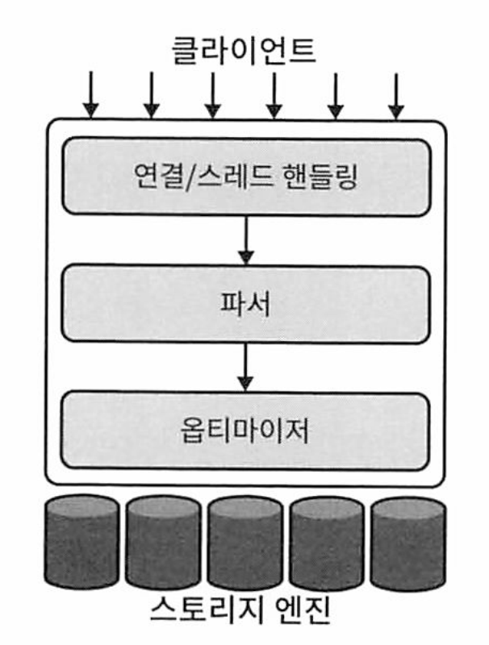
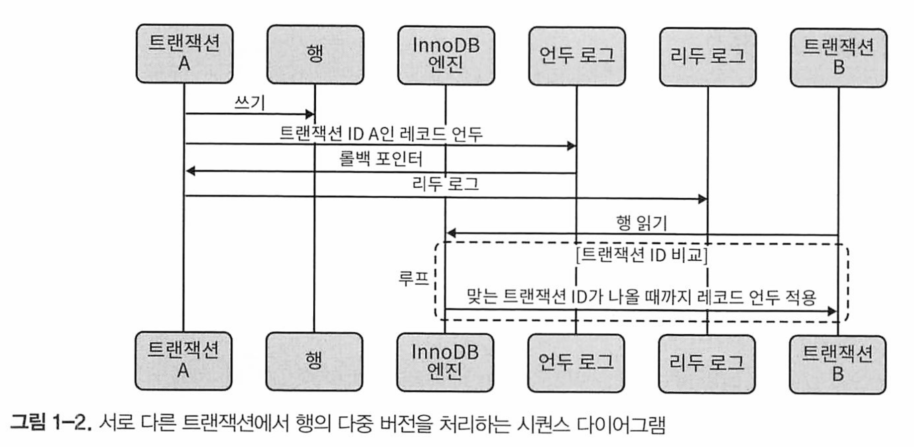

# 1장 MySQL 아키텍처


# MySQL의 논리적 아키텍처



**최상위 계층**

클라이언트 : 대부분 네트워크 기반 클라이언트 /서버 도구 또는 서버에 필요한 연결 처리, 인증, 보안 등의 서비스가 포함되어 있다.

**두 번째 계층**

쿼리 파싱, 분석, 최적화 및 모든 기본 제공 함수(날짜, 시간, 수학)들을 포함하며 MySQL의 지능적인 부분이 여기에 속한다.

스토리지 엔진에서 제공되는 모든 기능(저장 프로시저, 트리거, 뷰)를 여기에서 사용할 수 있다.

**세 번쨰 계층**

스토리지 엔진이 포함된다.

MySQL에 저장된 모든 데이터를 저장하고 검색하는 역할을 담당한다.

서버는 스토리지 엔진 API를 통해 통신하는데, 이 API는 스토리지 엔진 간의 차이를 숨겨서 쿼리 계층에서는 그 차이를 느끼지 못한다.

또한 트랜잭션 시작, 또는 해당 기본키를 가진 행 가져오기와 같은 작업을 수행하는 수십개의 하위수준 함수도 포함되어 있따.

스토리지 엔진은 SQL을 구문 분석 하거나 서로 통신하지 않으며 단순히 서버의 요청에 응답할 뿐이다.

## 연결 관리 및 보안

기본적으로 각 클라이언트 연결은 서버 프로세스 내에서 고유한 스레드를 가진다.

연결 쿼리는 하나의 코어 또는 CPU에 존재하는 단일 스레드 내에서 실행된다.

* 서버는 즉시 사용할 수 있는 스레드의 캐시를 유지 관리하므로, 새로운 연결마다 매번 스레드를 생성하거나 폐기할 필요가 없다.

클라이언트(응용 프로그램)가 MySQL 서버에 연결되면 서버에서 인증해야 한다.

* 인증은 사용자 이름, 호스트 및 암호를 기반으로 한다.

* X.509 인증서는 TLS(전송 계층 보안: Transport Layer Security) 연결에서도 사용할 수 있다.

클라이언트가 연결되면 서버는 각 쿼리에 대해 권한이 있는지를 확인한다. 

## 최적화 및 실행

MySQL은 쿼리를 구문 분석하여 내부 구조(분석 트리)를 생성한 다음 최적화를 적용한다

* 쿼리 재작성, 테이블 읽는 순서 결정, 사용할 인덱스 선택 등이 포함된다.
* 쿼리의 특수 키워드를 통해 옵티마이저에 힌트를 전달하여 의사 결정 프로세스에 영향을 줄 수 있다.

옵티마이저는 특정 테이블이 어떤 스토리지 엔진을 사용하는지에는 관심이 없지만, 스토리지 엔진은 서버가 쿼리를 최적화하는 방법에 영향을 미친다.

옵티마이저는 스토리지 엔진에게 테이블 데이터에 대한 통계뿐만 아니라 일부 기능과 특정 작업의 비용에 대해 묻는다.

MySQL 5.7.20 부터 쿼리 캐시는 MySQL 기능으로 더이상 사용되지 않으며 8.0 릴리스에서부터 완전히 사라졌다.

* 그러나 자주 제공되는 결과 셋은 캐싱하는 것이 좋다.

* 널리 사용되는 디자인 패턴은 memcached 또는 Redis로 데이터를 캐시하는 것 

## 동시성 제어

MySQL은 서버와 스토리지 엔진의 두 레벨에서 동시성 제어 작업을 한다.

https://dev.mysql.com/doc/refman/8.0/en/innodb-locking.html

### 읽기 / 쓰기 잠금 (Lock)

동시 읽기/쓰기 액세스를 처리하는 시스템은 일반적으로 두 가지 잠금 유형으로 구성된 잠금 시스템을 구현한다.

* 공유 잠금(shared Lock) - 읽기 잠금 : 여러 클라이언트가 읽기 잠금을 걸 수 있고 동시에 읽을 수 있다
* 전용 잠금(Exclusive Lock) - 쓰기 잠금 : 읽기, 쓰기 잠금을 걸 수 없고 동시에 읽을 수 없다.

### 잠금(Lock) 세분화

전체 리소스를 잠그는 대신 변경될 데이터가 포함된 부분만 잠그는 것이 좋다.

잠금은 무료가 아니며 잠금 설정, 잠금 해제 여부 확인, 잠금 해제 등 모든 잠금(Lock)작업에는 오버헤드가 있다.

잠금 전략은 잠금 오버헤드와 데이터 안전 사이의 트레이드 오프이며, 성능에 영향을 미친다.

### 테이블 잠금

기본적인 잠금 전략이자 가장 낮은 오버헤드를 가진 전략.

전체 테이블을 잠근다.

클라이언트가 테이블에 쓰기를 원할 때(삽입, 삭제, 업데이트 등) 쓰기 잠금을 획득한다.

테이블 잠금의 특정 상황에서 성능을 향상시키기 위한 몇가지 기능이 있다.

* READ LOCAL 테이블 잠금은 일부 유형의 동시 쓰기 작업을 허용한다.
* 쓰기 및 읽기 대기열은 읽기 대기열보다 전적으로 우선순위가 높은 쓰기 대기열과 별도로 관리된다

### 행 장금 (record Lock)

가장 큰 동시성을 제공하고 오버헤드가 가장 큰 잠금 형태이다.

각 행 잠금을 한 사람, 열린 기간, 잠긴 행별 유형을 추적하고 잠금 정리가 필요하기 때문에 비용이 더 많이 든다. 

행 잠금은 서버가 아닌 스토리지 엔진에서 구현된다. 

## 트랜잭션

START TRANSACTION 문으로 트랜잭션을 시작한 다음 COMMIT과 ROLLBACK을 이용한다.

```sql
START TRANSACTION
...
작업
...
COMMIT | ROLLBACK
```

시스템이 ACID 테스트를 통과해야 한다.

**원자성**(Atomicitiy)

트랜잭션은 전체 트랜잭션이 적용되거나 커밋되지 않도록 분할할 수 없는 단일 작업 단위여야 합니다. 트랜잭 션이 원자적이면 트랜잭션이 부분적으로 완료되는 일은 없습니다. 전부 완료되거나 전부 실패합니다.

**일관성**(Consistency)

데이터베이스는 항상 일관된 상태에서 다음 상태로 이동해야 합니다. 앞의 예에서 일관성을 유지하면 3행과 4 행 사이에 충돌이 발생하더라도 당좌예금 계좌에서 $200가 사라지지않습니다.  트랜잭션이 커밋되지 않으면 트랜잭션의 변경사항은 데이터베이스에 반영되지 않습니다.

**격리성**(Isolation)

트랜잭션의 결과는 일반적으로 트랜잭션이 완료될 때까지 다른 트랜잭션에서 보이지 않습니다. 이렇게 하면 은행 계좌 결산이 3행 뒤, 4행 앞에서 실행되더라도 당좌 예금에 200달러가 표시됩니다. 이 장의 뒷부분에서 격리 수준에 대한 설명을 보면 왜 '보통 보이지 않는다'고 하는지 이해할 수 있을 것입니다.

**지속성**(Durability)

일단 커밋되면 트랜잭션의 변경 사항은 영구적입니다. 이는 시스템 충돌 시 데이터가 손실되지 않도록 변경 사 항을 기록해야 함을 의미합니다. 실제로는 지속성에도 다양한 수준이 있기 때문에 약간 모호한 개념입니다. 일부 지속성 전략은 다른 전략보다 더 강력한 안전 보장을 제공하며 100%의 지속성은 없습니다(데이터베이스 자체가 정말 지속성이 있다면 어떻게 백업으로 지속성을 높인다고 할 수 있을까요?).

### 격리 수준

ANI SQL 표준은 네 가지 격리 수준을 정의한다.

* ANSI SQL 요약 : https://blog.acolyer.org/2016/02/24/a-critique-of-ansi-sql-isolation-levels/

> 각 DBMS라던가, MySQL 스토리지 엔진마다 격리 수준을 조금씩 다르게 구현한다.
>
> 각 DBMS나 스토리지 엔진에 대한 설명서를 읽어야 격리 수준을 알 수 있


**READ UNCOMMITTED**

READ UNCOMMITTED 격리 수준에서 트랜잭션은 커밋되지 않은 트랜잭션의 결과를 볼 수 있습니다.

이 수준을 사용할 이유가 충분치 않다 면 많은 문제가 발생할 수 있습니다. 이 레벨에서 발생할 수 있는 커밋되지 않은 데이터를 읽는 것을 더티 리드 (Duty read)라고도 합니다.

**READ COMMITTED**

MySQL을 제외한 대부분 데이터베이스 시스템의 기본 격리 수준은 READ COMMITTED입니다. 트랜잭션이 시작된 후 커밋된 트랜잭션으로 인한 변경 사항 을 계속 확인할 수 있으며 커밋될 때까지 변경 사항은 다른 사람에게 표시되지 않습니다. 이 수준에서는 여전히 넌리피터블 리드(Nonrepeatable read)를 허용합니다. 이는 곧 동일한 명령문 을 두 번 실행하면 다른 데이터를 볼 수 있음을 의미합니다.

**REPEATABLE READ**

REPEATABLE READ는 READ COMMITTED의 문제를 해결합니다. 트랜잭션이 읽는 모든 행이 동일한 트랜 잭션 내에서 후속 읽기에서 '동일하게 보이도록 하지만 이론적으로는 여전히 또 다른 까다로운 문제인 팬텀 리드를 허용합니다. 간단히 말해, 특정 범위의 행을 선택하고 다른 트랜잭션이 그 범위에 새 행을 삽입한 다음 동일한 범위를 다시 선택하면 팬텀 리드가 발생할 수 있습니다. 그 러면 새로운 '팬텀' 행이 표시됩니다. InnoDB와 XtraDB는 다중 버전 동시성 제어로 팬텀 리드 문제를 해결합니다.

* REPEATABLE READ는 MySQL의 기본 트랜잭션 격리 수준입니다.
* 팬텀 리드는 다른 트랜잭션 INSERT 또는 DELETE 쿼리에서 커밋된 데이터를 읽는 것으로, 트랜잭션 과정에서 두 개의 동일한 쿼리가 실행되어 두 쿼리에서 각각 반환된 행 집합이 다른 결과를 초래한다. 

**SERIALIZABLE**

가장 높은 수준의 격리인 SERIALIZABLE은 트랜잭션이 충돌하지 않도록 읽는 모든 행에 잠금을 설정하고 강제로 트랜잭션을 정렬하여 팬텀 읽기 문제를 해결합니다.이 수준에서 많은 시간이 소요되고 잠금 경합이 발생할 수 있습니다. 이 격리 수준을 사용하는 사람을 거의 본 적은 없지만, 애플리케이션의 요구 사항으로 인한 결과로 데이터 안전을 우선 시한다면 동시성 감소를 감수해야 할 수도 있습니다.

* s-lock을 사용

| 더티 리드        | 넌리피터블 리드 | 팬텀 리드 | 잠금 리드 |        |
| ---------------- | --------------- | --------- | --------- | ------ |
| READ UNCOMMITTED | 가능            | 가능      | 가능      | 불가능 |
| READ COMMITTED   | 가능            | 가능      | 가능      | 불가능 |
| REPEATABLE READ  | 불가능          | 불가능    | 가능      | 불가능 |
| SERIALIZABLE     | 불가능          | 불가능    | 불가능    | 가능   |

### 교착 (Deadlock)

교착 상태는 두 개 이상의 트랜잭션이 동일한 리소스에 대해 잠금을 상호 유지 및 요청하여 종속성 주기를 생성하는 것.

예) 기본 키가 (stock_id, date)인 StockPrice 테이블에 대해 실행되는 두 트랜잭션

```sql
트랜잭션1
START TRANSACTION;
UPDATE StockPrice SET close = 45.50 WHERE stock_id = 4 and date = '2020-05-01';
UPDATE StockPrice SET close = 19.80 WHERE stock_id = 3 and date = '2020-05-02';
COMMIT;
--------
트랜잭션 2
START TRANSACTION;
UPDATE StockPrice SET hich = 20.12 WHERE stock id = 3 and date = '2020-05-02';
UPDATE StockPrice SET high = 47.20 WHERE stock_id = 4 and date = '2020-05-01';
COMMIT;
```

각 트랜잭션은 첫 번째 쿼리를 실행하고 데이터 행을 업데이트하여 기본 키 인덱스에서 해당 행을 잠그고 프로세스에 속한 모든 추가 고유 인덱스에서도 해당 행을 잠근다.

* MySQL에서는 업데이트 시 해당 행에 lock을 건다.

그런 다음 각 트랜잭션은 두 번째 행을 업데이트 하려고 시도하지만 이미 잠긴 상태임을 확인한다.

교착 상태를 없애기 위해 무언가가 개입하지 않는 한 두 트랜잭션은 서로가 완료되기를 영원히 기다린다. 

이 문제를 해결하기 위해 InnoDB 스토리지 엔진은 순환 종속성을 감지하고 오류를 즉시 반환한다.

쿼리가 잠금 대기 시간 제한을 초과하면 다른 쿼리들은 포기하게 되는데 이는 좋은 상황이 아니다.

InnoDB가 현재 교착 상태를 처리하는 방법은 배타적 행 잠금 (x-lock)이 가장 적은 트랜잭션(가장 롤백하기 쉬운 대략적인 메트릭을 따른)을 롤백하는 것이다.

일단 교착상태가 발생하면 트랜잭션의 일부 또는 전체를 롤백하지 않고는 교착 상태를 해제할 수 없으니 애플리케이션에서 잘 처리하고 설계해야 한다.

### 트랜잭션 로깅

변경 사항이 발생할 때마다 스토리지 엔진은 디스크의 테이블을 업데이트 하는 대신 데이터의 메모리 내 복사본을 변경할 수 있으며 매우 빠르다.

스토리지 엔진은 트랜잭션 로그에 변경 사항을 기록할 수 있는데 이 로그는 디스크에 있으므로 내구성이 있다.

로그 선행 기법을 사용하는 대부분의 스토리지 엔진은 디스크에 변경 사항을 두번 기록하게 된다. 

업데이트가 트랜잭션 로그에 기록됐지만, 데이터 자체에는 변경 사항이 적용되기 전 충돌이 발생하는 경우 스토리지 엔진이 재시작 시 변경 사항을 복구할 수 있다.

### AUTOCOMMIT 이해

기본적으로 단일 INSERT, UPDATE 또는 DELETE 문은 트랜잭션으로 처리되어 즉시 커밋된다.

이것을 AUTOCOMMIT 모드라고 한다

이 모드를 비활성화 하면 트랜잭션 내에서 일련의 구문을 실행하고 최종적으로 COMMIT 또는 ROLLBACK할 수 있다.

SET 명령을 사용하여 현재 연결(세션)에 대해 AUTOCOMMIT 변수를 활성화 하거나 비활성화할 수 있다.

```sql
SET AUTOCOMMIT = 1;
```

* 1 : ON
* 0 : OFF

격리 레벨도 설정할 수 있다.

```sql
SET SESSION TRANACTION ISOLATION LEVEL READ COMMITED;
```

* MySQL의 Default 격리레벨은 Repeatable Read이다.


### 암시적 잠금과 명시적 잠금

InnoDB는 2단계 잠금 프로토콜을 사용한다.

COMMIT 또는 ROLLBACK이 될때까지 잠금을 해제하지 않는다.

SELECT FOR SHARE - S Lock

SELECT FRO UPDATE - X Lock

뿐만 아니라 LOCK TABLES 및 UNBLOCK TABLES 명령도 지원한다.


## MVCC - 다중 버전 동시성 제어

MySQL의 MVCC는 특정 시점에 존재했던 데이터의 스냅숏을 사용하여 작동한다

즉 트랜잭션은 실행 기간에 관계없이 데이터를 일관되게 볼 수 있다. 

스토리지 엔진별로 MVCC의 구현은 다르며, 낙관적 및 비관적 동시성 제어가 포함된다. 



InnoDB는 시작되는 트랜잭션마다 트랜잭션 ID를 할당하여 MvCC를 구현한다. 이 ID는 트 랜잭션이 데이터를 처음 읽을 때 할당됩니다.

 트랜잭션 내에서 **레코드를 수정하면 변경 내용을 되돌리는 방법을 설명하는 언두(Undo) 레코드가 언두 로그에 기록**되고 

트랜잭션의 **롤백 포인터가 언두 로그 레코드를 가리킵니다**. 

**이것은 트랜잭션이 필요한 경우 롤백하는 방법을 찾는 방식입니다.**


다른 세션(session)이 클러스터 키 인덱스 레코드를 읽을 때, InnoDB는 레코드의 트랜잭션 ID와 해당 세션의 읽기 뷰를 비교합니다.

변경한 트랜잭셩이 아직 커밋되지 않은 경우(현재 상태 레코드는 표시되면 안됌) 세션이 볼 수 있는 트랜잭션 ID에 도달할 때 까지

언두 로그 레코드를 추적하고 적용합니다. 이 프로세스는 이 행을 완전히 삭제하는 언두 레코드까지 계속 반복하여 읽기 뷰에 이 행이 존재하지 않는다는 신호를 보낼 수 있습니다.


트랜재션의 레코드는 레코드의 info flags에서 deleted 비트를 설정하여 삭제됩니다. 

* 이것은 언두로그에서 **remove delete mark** 로 추적된다


또한 언두 로그 쓰기는 (undo log write) 서버 충돌 복구 프로세스의 일부이며, 트랜잭션이기 때문에 

모든 언두 로그 쓰기도 리두(redo) 로그로 처리됩니다. 이러한 리두 및 언두로그의 크기는 높은 동시성 트랜잭션 수행에 큰 영향을 줍니다.


이러한 모든 레코드 보관으로 대부분 읽기 쿼리는 잠금(lock)을 얻지 못합니다.

단점은 스토리지 엔진이 각 행에 더 많은 데이터를 저장해야 하고, 행을 검사할 때 더 많은 작업을 수행해야 하며 일부 추가 관리 작업을 처리해야 합니다.


MVCC는 REPEATABLE READ 및 READ COMMITTED 격리 수준에서만 작동합니다. 

* 쿼리가 트랜잭션 버전에 부합하는 버전의 행을 읽지 않기 때문에 READ UNCOMMITTED는 MVCC와 호환되지 않는다.

그러므로 쿼리는 최신 버전만을 읽습니다.

* SERIALIZABLE은 모든 행을 잠그기 때문에 MVCC와 호환되지 않는다.


## 복제 (replication)

MySQL은 지정된 시간에 한노드에서만 쓰기를 허용하게 설계뙤었습니다.

이렇게 하면 일관성 관리에는 이점이 있지만, 여러 서버 또는 여러 위치에 데이터를 기록해야 하는 경우 트레이드(trade off) 오프가 필요합니다.


MySQL은 한 노드가 사용하는 쓰기를 추가 노드에 배포하는 기본적인 방법을 제공합니다. 이를 **복제**라고 합니다.


노드에 쓰려고 할 때 새 데이터를 보내는 복제 클라이언트로 로그인된 레플리카에 대한 스레드가 존재합니다.


운영 환경에서 실행하는 데이터의 경우, 재해 복구 계획을 위해 복제를 사용하고 여러 위치(클라우드 호스트환경 등 영역)에 

분산되어 있는 3개 이상의 레플리카를 보유하는 것이 이상적입니다.


## InnoDB 엔진

InnoDB는 MySQL의 기본 트랜잭션 스토리지 엔진이며, 일반적으로 롤백되지 않고 완료되는 많은 단기 트랜잭션을 처리하도록 설 계되었습니다. 성능과 자동 충돌 복구로 인해 비트랜잭션 스토리지 요구 사항에도 널리 사용됩 니다.

> 모든 애플리케이션의 기본 엔진으로 InnoDB 스토리지 엔진을 사용하는 것이 가장 좋습니다. MySQL은 몇 가지 주요 버전부터 InnoDB를 기본 엔진으로 만들어 이를 쉽게 만들었습니다.

기본적으로 InnoDB는 데이터를 모아 테이블 스페이스로 알려진 일련의 데이터 파일에 저장합니다. 테이블 스페이스는 기본적으로 InnoDB가 자체적으로 관리하는 블랙박스입니다.

InnoDB는 MvCC를 사용하여 높은 동시성을 달성하고 네 가지 SQL 표준 격리 수준을 모두 구 현합니다. REPEATABLE READ 격리 수준이 기본 설정이며, 이 격리 수준에서 팬텀 리드를 방지하는 next-key 잠금 전략을 사용합니다. InnoDB는 쿼리에서 터치한 행만 잠그는 대신 인덱스 구조 의 공백도 잠가서 팬텀이 삽입되는 것을 방지합니다.


InnoDB 테이블은 클러스터형 인덱스로 구성되어 있습니다.


