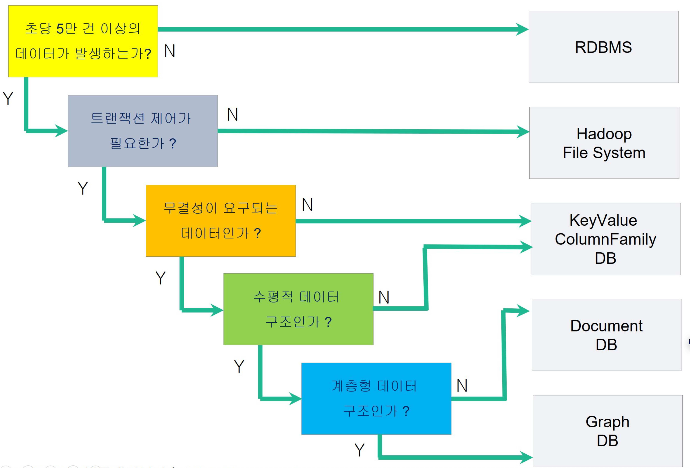

# 1. 레디스 소개

[toc]

# NoSQL 개념

## NoSQL의 장점

### 1. 클라우드 컴퓨팅 환경에 적합하다

**관계형 DBMS로 구축 운영 시 비용과 성능 지연 문제와 같은 다양한 문제점에 부딪힘**

개발 운영 플랫폼은 새로운 변화를 요구하고 있지만 데이터 관리 기술을 관계형 DBMS로 구축 운영하다 보니 비용 및 성능 지연문제와 같은 다양한 문제점에 부딪히게 되고 이에 최적화된 새로운 저장 관리 기술이 필요하다

**기존 관계형 DBMS는 대부분 사용 라이선스이기 때문에 구축단계부터 구매 비용이 발생하게 됨**

기존 관계형 DBMS는 2대 이상의 서버를 요구하는 분산 시스템을 구축할 경우, 여러 개의 라이선스를 구매해야 하기 때문에 비용이 2~3배 이상 소요되는 문제가 있다.

 NoSQL의 경우, 대부분 오픈소스 라이선스와 엔터프라인즈 라이선스, 2개의 듀얼 라이선스를 제공하기 때문에 꼭 필요한 경우가 아니라면 오픈 소스 라이선스를 구매하여 시스템 구축을 할 수 있다

오픈 소스 라이선스를 사용하면서 발생하는 다양한 장애와 기능 문제는 직접 소스를 수정할 수 있어 유연성있는 개발도 가능하다.

### 2. 유연한 데이터 모델

**NoSQL의 데이터는 쉽고 간단하게 설계할 수 있다**

\- 관계형 DB의 테이블(정형 구조)을 생성하기 위해서는 설계 단계에서 테이블명, 컬럼명, 컬럼 개수, 데이터 타입, 데이터 길이, 제약조건(PK, FK, NOT NULL, CHECK, UNIQUE)들을 반드시 결정해야하지만 NoSQL은  다르다

\- NoSQL의 데이터 저장 구조는 제품에 따라 다르지만 컬렉션(collection), 테이블(table), 노드(node)라고 하며, 비정형 구조로 표현됨

\- 비정형 구조도 분석하고 설계하는 단계는 필요하지만 정형 구조처럼 구체적이고 까다롭지 않아 보다 쉽고 간단하게 설계할 수 있음

### **3. 빅데이터 처리에 효과적이다**

관계형 DBMS에 비해 단정적으로 몇 배 이상 빠르다고 표현할 수 없지만, NoSQL 기술을 잘 이해하고 분석, 설계, 구축한다면 보편적으로 최소 3배 이상의 성능을 기대해볼 수 있음

## 1.2 NoSQL 종류

NoSQL 제품

**1) NoSQL은 Key-Value DB, Column-Family DB, Document DB, Graph DB 등의 데이터 구조를 제공한다**

* 예) Redis(Key-Value DB), MongoDB(Document DB)

4가지 유형으로 나누는 이유는 데이터의 Availability, Consistency, Partioning을 고려한 결과를 나타낸다

**2) 대표 NoSQL 제품**

* MongoDB, 
* Redis, 
* Cassandra, 
* Neo4J

동일한 데이터 저장구조가 아니며, 데이터의 논리적, 물리적 구조가 다르다는 것은 설계와 구축, 운영, 관리방법이 다름을 의미한다

| **구분**         | **설명**                                                     |
| ---------------- | ------------------------------------------------------------ |
| Key-Value DB     | - Amazon Dynamo Paper- 데이터 모델 : Key와 Value 쌍으로 된 Collection- 제품 유형 : Riak, Redis, Tokyo |
| Column-Family DB | - Google Big Table paper- 데이터 모델 : Column Families- 제품 유형 : HBase, Cassandra |
| Document DB      | - Lotus Notes- 데이터 모델 : Key와 Value 쌍으로 된 Collection- 제품 유형 : MongoDB, CoughDB |
| Graph DB         | - Euler & Graph Theory- 데이터 모델 : nodes, rels, K-V on both- 제품 유형 : AllegroGraph, Neo4J |

**1.2.2 빅데이터 데이터 모델링을 위한 가이드라인**

**1 초당 5만건 이상의 데이터가 발생하는가?**

시스템 비즈니스 환경에서 초당 데이터 발생량이 5만~10만건 이상이 발생한다면 기존 관계형 DBMS로 처리할 수 없기 때문에 빅데이터 솔루션을 선택해야 함

**2 트랜잭션 제어가 필요한가?**

\- 관계형 DBMS는 commit과 rollback 명령어를 통해 사용자가 직접 트랜잭션 제어를 하고, 이를 통해 데이터의 입력/수정/삭제가 이루어진다.

\- Hadoop Echo-System은 파일 시스템 기반으로 하기 때문에 사용자가 직접 트랜잭션을 제어할 수 없고, 데이터를 공유할 수 없기 때문에 트랜잭션 제어가 필요한 비즈니스 환경이라면 NoSQL 제품을 선택해야 함

**3 데이터 무결성이 요구되는가?**

관계형 DBMS

* 제약 조건(PK, FK, Not Null, Check, Unique)을 통해 원치 않는 데이터가 저장되는 것을 방지하기 위해 무결성 보장을 위한 설계를 함→ 장점도 있으나 매번 데이터를 저장할 때마다 무결성을 검증하기 때문에 `성능 지연 문제`를 유발하게 된다

NoSQL

* Key-Value, Column-Family
  * 무결성 기능이 필요하지 않는 경우, Key-Value DB 또는 Column Family DB를 선택하는 것이 바람직함→ 무결성을 보장해 줄 기능들이 없다
* DocumentDB
  * 무결성을 보장해 줄 수 있는 기능의 사용을 사용자가 선택할 수 있음→ Document DB 중에도 무결성을 보장하지 않는 제품이 있다.

**4 수평적 DataSet인가?**

관계형 DB의 테이블 구조는 일반적으로 2차원 수평 데이터 구조로 표현하는데, 여러 개의 컬럼으로 구성되는 열과 다수의 행이 교차되는 구조를 가진다

수평 DataSet 구조로 저장/관리해야 하는 경우, Document DB를 선택하는것이 좋다.

**5 계층형 데이터인가?**

\- 계층형 데이터 구조는 보편적으로 발생하고 있는 데이터 유형 중 하나로, 이전에은 데이터들을 계층형 DBMS를 통해 저장/관리했으나 최근에는 Graph DB를 통해 저장/관리할 수 있음

→ 기본적인 계층형 데이터 구조는 Document DB로 충분히 저장/관리할 수 있고, 계층 Depth가 10~20 레벨 이상이 경우, 선택적으로 Graph DB의 사용을 권장함

## 1.3 키-밸류(KeyValue) DB 활용

### 1.3.1 장점

**1. Redis DB는 인메모리(In Memory) 기반의 데이터 저장 구조**

기존 관계형 DBMS는 파일 기반 데이터 저장 구조이고, Redis DB는 순수 인메모리 기반의 데이터 저장 구조이다.

* 관계형 DB는 메모리 저장 후 파일에 저장되고
* 인메모리 DB는 메모리에 저장 후 선택적으로 파일에 저장한다

파일은 DBMS에 의해 할당되거나 자동 관리되지 않고 필요에 따라 사용자는 수동 관리할 수 있다.

그러나 인메모리는 사용자가 추가적인 관리를 안해주면 모든 데이터는 메모리 상에만 존재하고 예기치 못한 장애가 발생했을 때 모든 데이터가 유실되는데, 필요에 따라 데이터 유실을 방지할 수 있는 다양한 기능들이 제공되지만 완벽하게 보호하는 것은 한계가 있을 수 있다.

**2. Key-Value 데이터 구조는 하나의 Key와 데이터 값으로 구성된다**

\- Redis의 DB 데이터 저장 구조를 테이블이라고 표현한다. -> 표현하긴 하지만 RDB의 테이블과는 다르다

\- 관계형 DB에서 데이터의 빠른 검색을 위해 인덱스를 사용하는 것처럼 Redis에서도 인덱스를 생성할 수 있지만 인덱스의 종류와 구조는 다르기 때문에 표현에 한계가 있다.

관계형 DB의 데이터 구조를 그대로 매핑해서 사용할 수 없고, 데이터의 일부를 잠시 보관하거나 가공 처리된 데이터를 임시로 보관할 수 없다.

**3. 가공 처리가 요구되는 비즈니스 환경에 적합하다**

대부분 하이브리드 구조(예: Redis-MongoDB, MYSQL)로 구축 운영되고 있는데, 메인 DB로 선택한 제품들은 파일 기반의 저장 구조이다 보니 디스크 IO 문제로 인해 발생하는 성능 지연 문제를 해소하기 위해 Key-Value DB를 보조 DB로 사용한다

*  데이터의 가공 처리, 통계 분석, 데이터 캐싱, 메시지 큐 등의 용도로 사용할 수 있다

### 1.3.2 활용 영역

**1. 실시간 분석 영역**

메인 DB에는 현재 시점 또는 과거 시점 데이터를 저장하고, 필요에 따라 데이터를 읽은 다음 가공 처리 및 분석 작업은 Redis 서버에 수행한 후 메모리 저장하고, 그 결과를 사용자에게 제공한다

**2. IoT 영역**

NoSQL 기술 중에 Redis는 다른 Document DB, Column-Family DB, Graph DB와 비교했을 때, 매우 경량 SW로 다양한 IoT 디바이스와 쉽고 간단하게 연동할 수 있어 IoT 제품들의 데이터 저장 및 관리에 매우 적합하다

예) 라즈베리파이, 아두이노, 안드로이드, ARM 플랫폼

**3. 계층 정보수집 영역**

Redis는 서버는 계측 장비(온도, 습도, 조도, 속도, 위치 정보, 맥박/심박 박동수 등)로부터 수집된 데이터를 쉽고 빠르게 저장할 수 있고 이를 가공 처리할 수도 있다

 **4. 개인화 정보관리 영역**

Redis DB에 저장되어 있는 데이터를 사용자의 필요에 따라 쉽게 가공하고 처리하여 편집이 요구되는 비즈니스 환경에 활용할 수 있음

**5. 전자 상거래 비즈니스 영역**

기존 관계형 DBMS를 기반으로 했던 보편적인 비즈니스 영역에도 동일하게 적용할 수 있으나, 과거 시점 데이터를 지속적으로 저장하는 것은 한계가 있고, 예기치 못한 문제로 인해 시스템 크래시가 발생하는 경우, 지속적인 서비스를 할 수 없어 반드시 분산-복제(Shard-Replication) - 이중화 시스템을 구축 운영해야 한다.

## **1.4 NoSQL 선정 방법**

**1. Simple API를 지원하는가?**

대부분의 NoSQL 제품은 오픈소스 라이선스를 제공하기 때문에 다양한 개발 언어들과 쉽고 간편하게 연동되지 않은 경우가 발생하는데

간단한 API를 지원하는 제품을 선택하는것이 좋다

**2. Easy Distributed(쉬운 분산) 기술을 제공하는가?**

초당 10만 건 이상의 데이터를 빠르게 쓰고 읽기를 통해 가공 처리 및 분석이 가능하도록 설계된 데이터 분산 저장과 처리 기법을 사용하는데, 샤딩과 파티션닝과 같은 기능이 제공되는지 혹은 제공된다면 구현 방법이 개발 환경에 적합한지에 대한 여부가 충분히 검토되어야 한다

**3. Easy Replication(쉬운 복제)이 지원되는가?**

분산 기술은 예기치 못한 문제로 인해 시스템이 종료되는 경우가 종종 발생하여 서비스가 중단되고 데이터가 유실되는 장애가 발생할 수 있는데, 이를 방지하기 위해 반드시 복제(Replication) - 이중화 시스템을 함께 구축해야 하므로 복제 기술이 제공되는지 알아보고 검토해야 한다.

**4. Scale-Out이 가능한가?**

관계형 DBMS는 시스템 자원이 부족한 경우, 확장하는 방법으로 해당 서버의 자원을 최대 임계치까지 늘려주는데, 이는 상용 라이선스로 제공되기 때문에 서버 대수를 늘려 확장하는 방법을 선택할 수 있지만 추가로 라이선스를 구매해야 하는 문제가 발생한다.

반면 NoSQL은 오픈소스 라이선스를 제공하기 때문에 하나의 서버에 구축하는 것과 여러 대의 서버에 구축하는 것에 따른 추가 비용이 발생하지 않아 관계형 DBMS에 비해 훨씬 유연성이 있다

**5. 유지보수 비용이 저렴한가?**

**6) 비정형 데이터 구조를 지원하고 트랜잭션 제어가 가능한가?**

1.  관계형 DBMS는 비정형 데이터를 처리하는데 한계가 있는데, NoSQL은 처음 개발될 때부터 비정형 데이터를 쉽고 간단하게 저장 관리할 수 있도록 설계되었다

2. NoSQL은 Auto Commit을 기본적으로 제공하지만 몇몇 제품은 사용자가 트랜잭션을 직접 제어할 수 있다.
   * 예) Redis 서버의 multi 명령어, MonoDB의 Multi Document Transaction, Cassandra DB의 LWT
   * NoSQL에서 관계형 DB 처럼 트랜잭션 제어가 필요하다면 충분히 고려되어야 함

**7) 오픈 소스인가?**

\- 대부분의 NoSQL은 기본적으로 듀얼 라이선스(Community Edition, Enterprise Edition) 정책으로 제공하는데  Enterprise Edition은 커뮤니티 에디션에 없는 추가 SW들이 내장되어 있어 향후 1년간 유지보수 비용이 포함되어 초기 구매 비용이 발생한다

\- 제품에 대한 기술 지원 업체가 있는지 고려해야 한다.