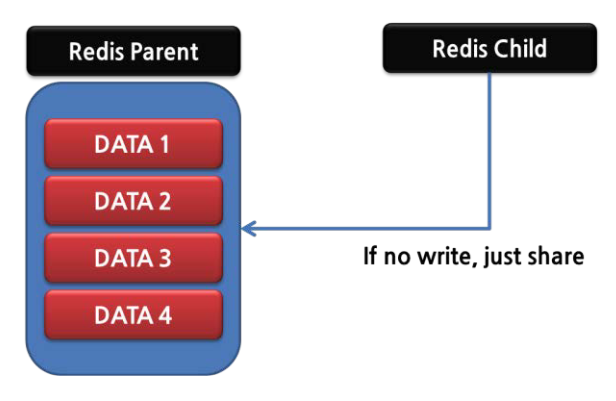
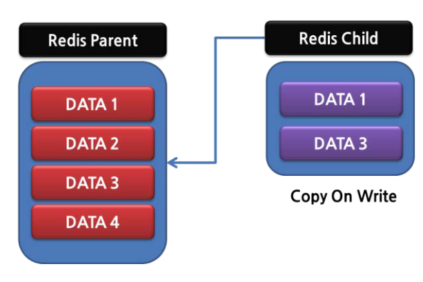
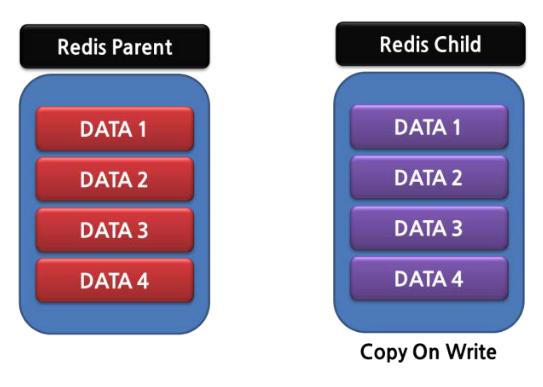
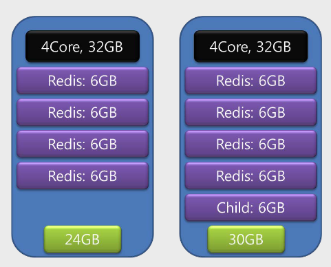

# 2 Redis 운영과 관리

[toc]


# 2.1 Redis는 싱글 스레드다

하나의 명령이 오랜시간을 소모하는 작업에는 적합하지 않다


## 서버에서는 keys 명령을 사용하지 말자


현재 db의 모든 Key를 처음부터 끝까지 함수를 이용해서 비교하므로 O(n)이 걸린다.

때문에 다른 클라이언트의 모든 요청이 병목될 수 있다

### key 명령을 꼭 사용해야 한다면?

예를 들어, 사용자 목록을 Key로 저장하고 날짜별로 구분이 필요한 사용자의 경우, 

Redis의 'list', 'set', 'sorted set'을 활용하여 "register_userlist_20130801"와 같은 이름으로 자료 구조를 생성한다. 

이후 "charsyam", "bhkim", "nadia"와 같은 사용자 Key를 저장한다. 

이렇게 하면 "register_userlist_20130801"을 조회하여 "charsyam", "bhkim", "nadia"와 같은 Key 목록을 알 수 있으며,

 `get`이나 `hget` 등의 명령어를 사용하여 해당 Key에 연결된 값을 검색할 수 있다.

그러나, `keys` 명령을 사용하여 바로 목록을 가져올 수 있지만, 

"register_userlist_20130801" 혹은 "register_userlist_20130802"와 같은 방식으로 추가로 관리해야 하는 문제점이 있다. 

만약 각 날짜에 저장해야 하는 사용자 수가 많을 경우, "register_userlist_20130801_1", "register_userlist_20130801_2" 등의 방식으로 내부적으로 분할을 고려해야 할 수도 있다.

## flushall/flushdb 명령을 주의하자

모든 데이터를 삭제하는 명령어이다.

Redis는 db라는 가상의 공간을 분리할 수 있는 개념을 제공하여 select 명령으로 이동할 수 있다.

그러나 이런 db 하나를 지우는것이 flushdb이고, 모든 db를 지우는것이 flushall 명령이다 

실제로 내부를 보면, 구조체 내부에서 while문과 for문으로 모든 키를 지운다. 

> memcached는 바로 삭제하지 않고, 나중에 지우는데 삭제된 key에 접근하면 없다고 하면서 나중에 지운다.
> lazy delete 같은 개념이다


# 2.2 Redis Persistent

레디스는 디스크에 저장할 수 있는 기능을 지원해준다.

하지만 이 기능이 주 장애 원인이 될 수 있다. 

ROD, AOF를 알아보자

## 2.2.1 RDB

현재 메모리에 대한 덤프를 생성하는 기능을 RDB라고 한다.

Redis는 싱글스레드인데 어떻게 RDB를 만들고, 다른 요청을 처리할까?

Redis는 지속적인 서비스와 RDB 저장을 위해 fork를 통해서 자식 프로세스를 생성한다.

자식 프로세스가 생성되면 현재 메모리 상태가 복제되므로 이것을 기반으로 데이터를 저장한다.

RDB는 사실 가장 최신의 데이터 보다는 특정 시점의 데이터, 즉 스냅샷이라고 생각하면 된다

RDB 저장 위한 명령으로 SAVE, BGSAVE가 있다.

* SAVE : 모든 작업을 멈추고 현재 메모리 상태에 대한 RDB 파일 생성 
* BGSAVE : 백그라운드 SAVE. 자식 프로세스를 생성하는 fork작업을 통해 자식 프로세스에서 RDB 저장

```
RDB를 사용하려면 redis.conf에 다음 내용을 추가해야 한다

dbfilename 원하는파일명.rdb
```

또는 config set/get 명령을 통해 바꿀 수 있다

```sh
redis > config get dbfilename
1) "dbfilename"
2) "dump.rdb"

redis > config set dbfilename test.rdb
OK

redis > config get dbfilename
1) "dbfilename"
2) "test.rdb"
```

RDB는 redis.conf에 사용함으로 설정되고 다음 save 구문에 의해 동작한다

```sh
save <Seconds> <change>

save 900 1
save 300 10
save 60 10000
```

900초안에 1번이라도 변경이 있을때,

300초안에 10번의 변경이 있을 때,

60초안에 10,000번의 변경이 있을 때

각각 RDB를 저장한다.

서비스 유형이 따라 이 값을 조정하면 된다.

## 2.2.2 AOF

AOF : Append Only File

기존의 RDBMS에서 제공하는 WAL(Write Ahead Log)와 비슷한 기능을 제공한다

* 트랜잭션의 동작을 안전하게 관리하고 시스템 장애가 발생했을 때 복구를 가능하게 하는 로깅 메커니즘에 사용

데이터를 저장하기 전 AOF 파일에 현재 수행해야 할 명령을 미리 저장해두고, 장애가 발생하면 AOF 기반으로 복구한다

1. 클라이언트가 Redis에 업데이트 관련 명령을 요청한다.
2. Redis는 해당 명령을 AOP에 저장한다.
3. 파일쓰기가 완료되면 실제로 해당 명령을 실행해서 메모리의 내용을 변경한다.

### Redis 프로토콜

Redis 서버와 클라이언트 간의 통신을 위한 저수준의 네트워크 프로토콜입니다. 이 프로토콜은 간단하면서도 효율적으로 설계되어 있어, 클라이언트와 서버 간의 데이터 교환을 빠르고 쉽게 할 수 있다.

* https://redis.io/docs/reference/protocol-spec/

* RESP (REdis Serialization Protocol)**: Redis 프로토콜의 공식 이름은 RESP 이는 텍스트 기반의 프로토콜로, 인간이 읽을 수 있는 형태로 설계되었다.

* 꼭 TCP 에서 사용되어야 하는 것도 아니지만 Redis 에서는 TCP 로만 사용한다.

* RESP 는 다음 3가지 요소를 중점적으로 여기며 고안되었다.

  - 쉬운 구현

  - 빠른 파싱

  - 사람이 읽을 수 있어야 함

* 데이터 유형**: RESP는 다양한 데이터 유형을 지원한다

  - 단순 문자열 (Simple Strings) -  "**+**"

  - 오류 (Errors) -  "**+**"

  - 정수 (Integers) - "**:**"
  - Bulk Strings - "**$**"

  - 문자열 배열 (Arrays) - "*"

  - 단순 문자열, 오류, 정수, 배열 등을 조합하여 복합적인 메시지나 명령을 구성할 수 있다.

ex) set key value라는 명령 전달

* 3개의 키워드로 구성, 각 크기는 3 , 3 ,5

Redis 프로토콜에서 하나의 명령은 다음과 같은 형태로 구성된다. 

```
* 키워드 개수\r\n
[키워드 개수만큼 반복]
$키워드 크기\r\n
키워드\r\n
```

```sh
*3\r\n
$3\r\n
Set r\n
$3 r\n
Key\r\n
$5\r\n
Value\r\n
```

### AOF와 RDB의 우선 순위

AOF와 RDB 모두 Redis에서 Persistent를 구현하는 방법인데, 두 개의 파일이 모두 있다면 어떤 것 을 읽게 될까?

 당연히 최신 데이터를 더 많이 가진 파일을 읽어야 할 텐데 어떤 파일이 최신 데이터를 더 많이 가지고 있는지는 알 수 없다. 

하지만 특정 시점을 기준으로 한 스냅샷인 RDB와 WAL 형태의 AOF 중에서,

 `AOF는 항상 메모리에 반영하기 직전에 쓰기 때문에 AOF를 읽게 된다`

* (AOF가 신규 데 이터를 더 많이 가지고 있다고 생각한다). 

RDB의 경우, 한 시간 단위로 저장한다면 장애 발생 시 다음 저장할 때까지의 데이터는 모두 유실되게 되지만, 

AOF는 매 작업마다 디스크에 기록을 남기기때문에 모든 데이터가 남아 있다.

AOF를 사용 하려면  redis.conf에서  설정을 다음과 같이 변경해야 한다.

```
\#appendonly는 기본적으로 no로 설정되어 있음

appendonly yes

appendfilename appendonly.of appendfsync everysec
```

appendfsync : 디스크와 동기화를 얼마나 자주 할 것인지에 대해서 설정하는 값

| 옵션     | 설명                                                         |
| -------- | ------------------------------------------------------------ |
| always   | AOF 값을 추가할 때마다 fsync를 호출해서 디스크에 실제 쓰기를 한다. |
| everysec | 매초마다 fsync를 호출해서 디스크에 실제 쓰기를 한다.         |
| no       | OS가 실제 sync를 할 때까지 따로 설정하지 않는다.             |

디스크 쓰기가 실제 속도에 영향을 주므로 당연히 Redis의 속도는 no 〉 everysec > always" 순이다.

## Redis가 메모리를 두 배로 사용하는 문제 

Redis가 운영되는 중에 장애를 일으키는 가장 큰 원인은 RDB를 저장하는 Persistent 기능으로, fork를 사용하기 때문이다

부모의 데이터를 RAM에 그대로 복사하기 때문에 2배가 생기기 때문이다

* Copy on Wirite(COW) 라는 기술로 부모 프로세스의 변경된 부분(쓰기)만 차후에 복사할 수 있지만, redis는 여전히 write가 많으므로 마찬가지로 두배로 쓰게된다

정리하자면 다음과 같다.

1. **최초에 fork로 자식 프로세스 생성하면, 부모 프로세스와 자식 프로세스는 같은 메모리를 공유한다.**



2. **자식 프로세스에 Write가 발생할 때마다, 공유하는 해당 데이터는 자식 프로세스에 복사된다.**
   * 여기서는 1번과 3번이 바뀌었다. 



3. Write 작업이 많아서 부모 페이지에 있는 모든 페이지가 자식 페이지에 복사되 면, 부모 프로세스와 자식 프로세스가 모두 같은 양의 메모리를 사용하게 되어 사용 메모리 양이 두 배가 된다.




### Redis 메모리 할당 팁

Redis 자체는 64bit에서 메모리를 다루는 크기에 한계가 없지만

* (다만 Key와 Value는 각각 하나당 최대 512MB가 한계다),

 다음과 같은 기준으로 메모리를 할당하는 것이 좋다.

예를 들어 Core 4개를 가지고 있으며 메모리가 32GB인 장비를 사용한다면, 프로세스 별로 6GB 정도를 할당하는 것이 좋다. 

* 즉, 4개 서버(코어 수, 코어당 1개) * 6 = 24GB 정도의 메모리를 사용하면 된다. 

Redis가 싱글 스레드이기 때문에, 하나의 Redis 서버를 하나의 장비에서 사용하는 것보다는 

`멀티 코어를 활용하기 위해 여러 개의 Redis 서버를 한 서버에 띄우는 것이 성능 면에서 좋다(단, 관리 비용은 늘어난다).` 

여러 개의 Redis 서버를 하나의 서버에 띄우면, RDB 저장으로 인해서 자식 프로세스가 생성된다. 

즉 프로세스4개와 RDB용 저장 프로세스를 합쳐 총 5개의 프로세스가 생성되더라도, 

30GB(= 프로세스 5개 X 6GB)만 사용하므로 메모리에 여유가 있다.



## Redis 장애 : Read는 가능한데 Write만 실패하는 경우

Redis 서버는 동작하지 않는데, 정기적인 Heartbeat 체크(PING 명령을 이용한 주기적인 확인)에는 이상이 없다고 나온다면 다음을 의심해볼 수 있다.

`RDB 저장이 실패할 때, 기본 설정상 Write 관련 명령이 동작하지 않기 때문에 발생한다.`

즉, Redis의 기본 설정상 RDB 저장이 실패시 장비 이상 판단을 내려 Write 명령을 더는 처리하지 않으며, 데이터가 변경되지 않아서이다.

 일반적으로 Heartbeat 체크는 읽기 명령을 이용하여 검사하기 때문에, 현재 그런 상태에 있다는 것을 확인하지 못하고 서비스에 장애가 발생한 것으로 인식하기 때문이다.

그렇다면 어떤 이유로 RDB 생성에 실패할까?

1. RDB를 저장할 수 있을 정도의 디스크 여유 공간이 없는 경우
2. 실제 디스크가 고장 난 경우
3. 메모리 부족으로 인해서 자식 프로세스를 생성하지 못한 경우
4. 누군가 강제적으로 자식 프로세스를 종료시킨 경우
5. 그 외 기타 등등

> Redis 내부의 'lastbgsave_status'라는 변수가 REDIS_ERR로 설정된다. 
> 그러면 processCommand' 라는 함수에서 요청이 들어왔을 때 Write 관련 요청은 모두 무시하게 된다(src/redis.c).

### 해결방법

#### 1. 해당 상황 맞는지 확인

해당 상황이라면 Write 명령어에 다음 응답을 받는다 

```bash
127.0.0.1:6379> set a 123

(error) MISCONF Redis is configured to save RDB snapshots, 
but is currently not able to persist on disk. 
Commands that may modify the data set are disabled. 
Please check Redis logs for details about the error
```

#### 2. info 명령 사용해서 다음 값 체크

```bash
127.0.0.1:6379> info persistence
// 엄청많이나옴
...
rdb_last_bgsave_status:ok
...
```

또는 리눅스에서 

```bash
docker exec -it redis redis-cli -a 1234 INFO Persistence | grep rdb_last_bgsave_status
rdb_last_bgsave_status:ok
```

* `ok`는 마지막 저장 작업이 성공적으로 완료되었음을 나타내고, `err`는 오류로 인해 완료되지 않았음을 나타냅니다.

#### 3. Write 명령 허용하도록 수정

1. 이미 운영 중인 Redis 서버에서 변경하는 방법

```bash
127.0.0.1:6379) config set stop-writes-on-bgsave-error no
OK
```

2. redis.conf 에 미리 등록하는 방법

해당 방법은 Redis 2.6.12 버전까지는 지원하지 않다가 Redis 2.6.13 버전에서 추가된 것이다. 

Redis.conf에 다음과 같이 추가해 둔다.

```
\#기본적으로는 stop-writes-on-bgsave-error yes로 되어 있음

stop-writes-on-bgsave-error no
```