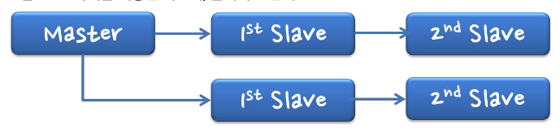
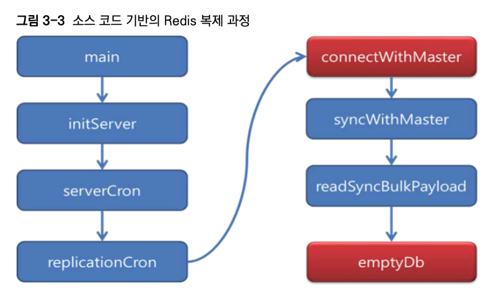
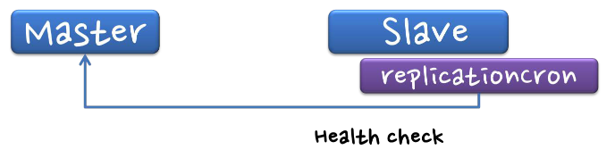
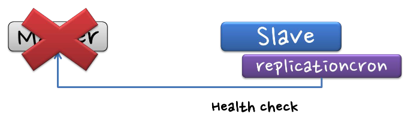
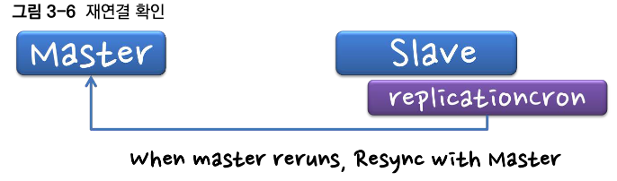

# 3 Redis 복제

[toc]


RDB와 비슷하게 Replication을 지원한다


# 3.1 Redis 복제 모델

마스터/슬레이브 복제 모델을 제공한다.

한대의 Slave는 오직 하나의 Master만 가질 수 있다.

* 


슬레이브를 다른 슬레이브의 마스터로 동작하게 둘수도 있다.



## 복제 동작 수행 순서

1. 운영중인 장비를 다른 장비의 슬레이브로 설정할 때 - replicaof 사용

```bash
127.0.0.1:6379> replicaof 마스터아이피 포트번호
OK
```

2. redis.conf 수정하기

```
// in redis.conf

# replicaof <masterip> <masterport>
replicaof 127.0.0.1 7000

...

# repl-ping-replica-period 10
repl-ping-replica-period 10

...

# repl-timeout 60
repl-timeout 60
```

* `repl-ping-replica-period` 설정은 마스터가 복제본에게 ping 메시지를 보내는 빈도를 초 단위로 설정한것.
  * 연결 상태 확인하는데 쓰인다
* `repl-timeout` 설정은 마스터와 복제본 간의 연결에 대한 타임아웃 값을 초 단위로 설정
  * `repl-timeout 60`은 마스터와 복제본 간의 통신에 문제가 생겼을 때 60초 동안 대기한 후 연결이 끊기도록 설정


# 3.2 Redis 복제 과정

1. 슬레이브에서 replicaof 사용해서 마스터 서버 설정
2. 마스터 서버가 설정되면, replicationCron에서 현재 상태에 따라 connectWithMaster 호출
3. 마스터는 복제를 위해 RDB 생성 후 슬레이브에 전송
4. 슬레이브는 RDB를 로드하고 나머지 차이에 대한 명령을 마스터에서 전달받아 복제를 완료



# 3.3 Redis 복제 사용시 주의사항

## reflicaof no one

`replicaof no one`은 Redis의 복제(replication) 설정에서 사용되는 명령. 

이 명령은 현재 Redis 인스턴스가 replica 모드에서 동작하고 있을 때 마스터와의 복제 연결을 해제하고 독립적인 스탠드얼론(standalone) 모드로 전환하도록 지시할때 사용된다.

슬레이브는 마스터의 상 태를 지속적으로 감시하면서 바뀌는 내용을 계속 전달받는다. 

만약 이상이 발생 서 마스터와 연결이 끊어지면 재접속을 시도하며, 

마스터에서 `전체 데이터를 다시 가져와 마스터의 최종 상태로 자신의 데이터를 변경한다`. 

이 과정을 좀 더 자세히 살펴보면 다음과 같다.

1. slave는 마스터 상태 체크



2. 마스터 연결 이상을 슬레이브가 감지



3. 슬레이브에서 마스터와의 연결상태가 복원된것을 확인



4. 주의해야 할점 : 마스터에 장애가 발생하여 마스터에 데이터가 하나도 없는 경우 슬레이브의 모든 내용이 사라진다

이 문제는 복제 과정중 emptyDb 함수를 호출하기 때문에 발생한다


마스터와 동일한 데이터를 유지하기 위해, RDB를 읽어들이기 전 현재 슬레이브 데이터를 모두 삭제하고 마스터와 싱크를 맞춘다.

그러므로 마스터의 데이터가 모두 날라가면 슬레이브의 데이터도 다 날라간다.

때문에 `마스터 노드 장애 발생시, 슬레이브에서 replicaof no one 이라는 명령어를 꼭 사용해야 한다`

```bash
127.0.0.1:6380> replicaof no one
```

마스터 노드와의 연결을 끊고 스탠드 얼론으로 독자적으로 동작하게 때문에, 자신의 데이터를 날리지 않게된다.

## 복제시에 무조건 RDB를 백그라운드로 생성한다는것을 주의하자

위 그림처럼 복제를하면 사용자 RDB 설정과 상관없이, 무조건 슬레이브에 RDB를 전송해야 하므로 fork를해서 RDB를 생성한다.

이때 메모리를 두배로 사용할 수 있으니 주의해야한다


# 3.4 Redis 복제를 이용한 실시간 마이그레이션

다운타임없이 Redis의 복제기능을 이용하면 쉽게 데이터를 이전할 수 있다.

### 1. 데이터 이전을 위한 새로운 Redis 인스턴스를 실행한다.

 더 많은 메모리와 성능을 가진 장비에 새로운 Redis 프로세스를 하나 실행한다.


### 2. 새로운 Redis 인스턴스를 기존 마스터의 슬레이브로 설정한다.

새로운 장비에서 replicaof 명령을 수행하여 마스터의 슬레이브로 설정한다.

```bash
replicaof 127.0.0.1 6379
```


### 3. 새로운 장비의 slave-read-only 설정을 끈다.

기본적으로 슬레이브는 slave-read-only 설정되는데, 이 기능을 꺼서 슬레이브에서도 업데이트가 가능하도록 설정한다. 다만 슬레이브의 변경이 마스터 로 전달되지는 않는다.

```sh
127.0.0.1:6399> CONFIG SET replica-read-only no
```

* 또는 redis.conf에서 replica-read-only no 설정

### 4. 클라이언트들이 새로운 Redis 인스턴스를 마스터로 인식하도록 설정을 바꾼다.

이 설정이 바뀌는 동안 이전의 Redis 마스터와 새로운 Redis 서버로 모든 데이 터가 전달되고, 마스터에 전달된 내용은 자동적으로 새로운 서버로 복제되어 저 장된다. 따라서 새로운 Redis 서버에는 모든 데이터가 남아 있게 된다.


### 5.  "replicaof no One" 명령을 이용해서 새로운 Redis 인스턴스와 기존 마스터와의연결을 종료한다.

이 작업을 하기 전에, 기존 마스터 장비에 더는 요청이 없다는 것을 확인해야 한다. 

이 부분을 확인한 후에는 replicaof no one" 명령을 복사한 장비에서 실행하여, 더는 기존 마스터의 영향을 받지 않도록 설정한다.

후 기존 마스터 장비를 제거한다. 