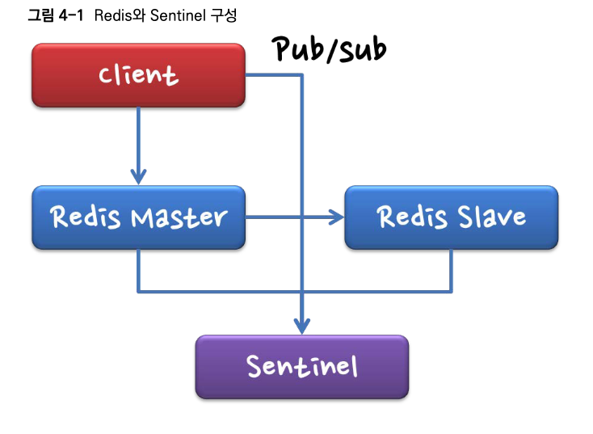
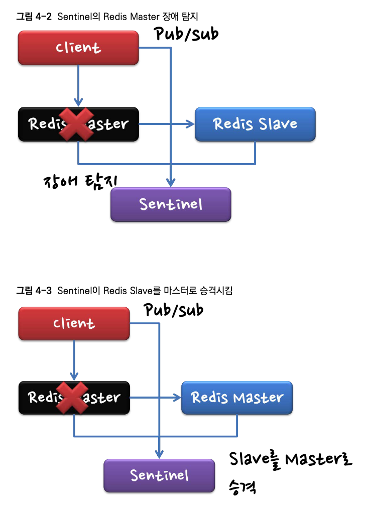
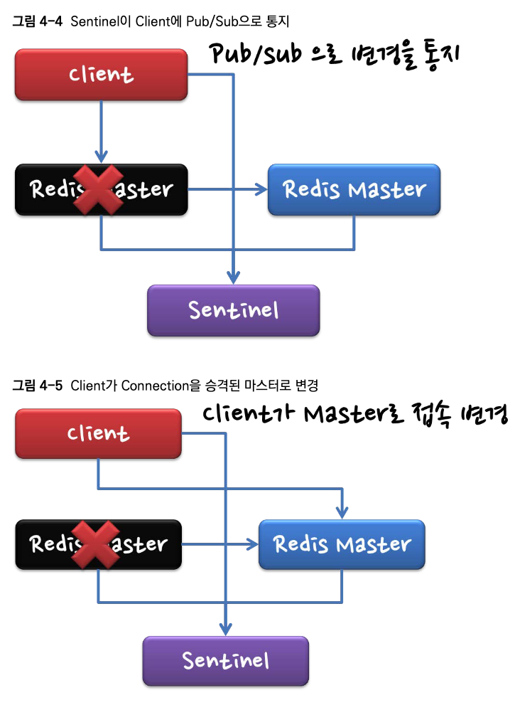
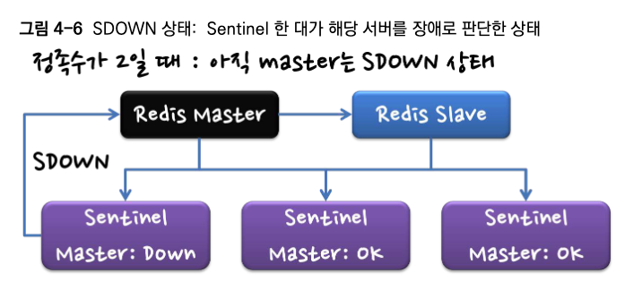
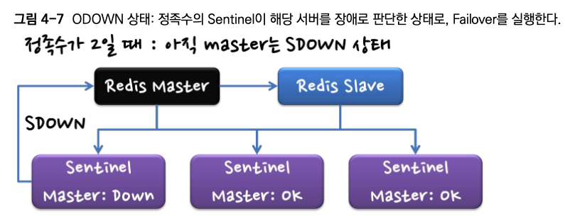

# Redis HA(고가용성)과 Sentinal

[toc]


SPOF와 고가용성을 위해 마스터/슬레이브 형태로 서비스한다.

다만 이렇게 운영할 경우 마스터 장애발생시 슬레이브가 마스터 대신 서비스하도록 변경해주는 기능이 필요하다

* 슬레이브의 reflicaof-read-only가 yes로 설정되어 있어 쓰기 요청은 모두 실패한다.

또한 마스터 서비스 장애 여부 판별도 필요하다.

장애가 발생하더라도 제대로 운영 하려면 다음과 같은 작업이 필요하다.

1. 마스터의 장애를 정확히 판별한다.

2. 슬레이브를 마스터로 승격시킨다.

3. 해당 작업 내용을 클라이언트에게 통지한다.

Redis에서 Sentinel을 통해 위 작업들을 할 수 있다.

# 4.1 Sentinel 구성



Redis Master에 장애 발생시 Sentinel은 슬레이브 중 한대를 마스터로 승격시킨다





# Sentinel 장애 판별 방법

PING 명령의 응답을 이용해서 판단하는데, 응답이 없다고 바로 장애라고 판단하진 않는다.

PING 명령은 sentinelPingReplyCallback 함수에서 응답 시간을 기록하여 판단한다

Sentinel는 'SDOWN'과 'ODOWN'이라는 두 가지 상태로 장애를 인식한다.



* SDOWN('Subjectively Down') : Sentinel 하나가 해당 서버가 장애 라고 인식하는 주관적인 장애 상태다. 



* ODOWN(Objectively Down') : 여러 대의 Sentinel이 해당 서버가 장애라고 인식하는 객관적인 다운 상태다.

Sentinel 설정을 보면 장애 발생 시 Failover를 위한 정족수이 설정이 있는데, 

이 값 이상의 Sentinel 서버가 장애라고 판단하면 해당 서버는 ODOWN 상태가 된다.

* 정족수 : 의사를 진행하고 결정하는데 필요한 최소한의 수 
* 정족수가 3인데 Sentinel이 2대라면 정족수가 3이 될수 없으니 마스터로 승격될수 없다. 때문에 이 설정은 매우 중요하며, 보통 Sentinel 장비를 홀수로 두고 그 과반수를 정족수로 설정하는것이 좋다. 
  * 예를 들어, 5대의 Sentinel 중 2대가 실패해도 나머지 3대로 정족수를 충족시켜 마스터의 장애를 감지하고 승격시킬 수 있기 때문이다.

PING 명령은 sentinelPingReplyCallback 함수에서 응답 시간을 기록하는데, 

해당 서버가 SDOWN인지를 판별하기 위해서 sentinelCheckSubjectivelyDown함수를 이용한다(sentinel.c 참조). 

해당 서버의 last_avail_time과 현재 시간과 의 차이가, 설정된 down_after_period 값보다 크면 SDOWN이 된다. 

* down_after_period는 슬레이브에서 기본 30초(30,000)로 설정되어 있다 

ODOWN을 판별하기 위해서 sentinelCheckObjectivelvDown 함수를 이용한다. 

현재 Sentinel의 입장에서 해당 서버가 SDOWN일 때만 정족수를 체크하며, 정족수에 도달하면 ODOWN 상태로 설정된다.

ODOWN 상태가 되면, 슬레이브가 마스터가 된다.

# Sentinel은 마스터로 승격할 슬레이브를 어떻게 선택할까?

어떤 슬레이브를 선택하는지는 sentinelSelectSlaye 함수 를 통해 결정된다.

소스 코드를 분석해보면, 새로운 마스터가 다음과 같이 설정됨을 알 수 있다.

1. **문제가 있는 슬레이브 제외** : SDOWN, ODOWN, DISCONNECT 된 상태인 슬레이브는 제외
2. **데이터 불신뢰 슬레이브 제외**: 정보가 오래되어 신뢰할 수 없는 슬레이브는 제외 : last_avail_time'이 'info_validity_time' 보다 작으면 제외
   * **last_avail_time**: 슬레이브가 마지막으로 사용 가능했던 시간
   * **info_validity_time**: 슬레이브의 정보가 유효하다고 판단되는 최대 시간을
3. **정보 갱신이 느린 슬레이브 제외**: 'info_refresh 값이 'info_validity_time' 보다 작으면 제외
   * **info_refresh**: 마지막으로 슬레이브 정보가 갱신된 시간
4. **마스터와의 연결이 너무 오래 끊긴 슬레이브 제외** : master_link_down_time이 max_master_down_time'보다 크면 제외
   * **master_link_down_time**: 슬레이브가 마스터와 연결이 끊긴 시간
   * **max_master_down_time**: 마스터와의 연결이 끊긴 상태로 허용되는 최대 시간
5. **최우선 슬레이브 선택**: 이후, Sentinel은 남아있는 후보 슬레이브 중에서 가장 우선 순위가 높은 슬레이브를 선택합니다. 만약 우선 순위가 동일한 슬레이브가 있다면, 식별자(runid)를 기준으로 가장 큰 값을 가진 슬레이브가 선택됩니다. 단, 우선순위가 0인 슬레이브는 제외됩니다. 
   * 남은 후보들 중에서 slave priority가 높은 슬레이브가 우선적으로 선택되 고, slave_priority가 같으면 runid를 비교해서 가장 큰 값의 마스터로 선택 (slave_priority가 0이면 제외)
   * **runid**: Redis 인스턴스의 고유 식별자

## 절대로 승격되지 않는 슬레이브가 필요하다면?

때로는 백업 전용 서버가 필요하며, 해당 서버는 절대 서비스하지 않을 경우 redis.conf'에서 slave_priority 값을 0으로 설정하면 된다.

* 우선순위이다

 그러면 해당 슬레이브는 절대 마스터로 승격되지 않는다. 단, 슬레이브가 한 대밖에 없더라도 마스터로 승격되지 않으므로 주의해야 한다.

# 4.4 센티넬 설정과 사용

다음은 sentinel.conf의 내용으로 하나의 클러스터(마스터/슬레이브 쌍)를 위한 설정이다.

sentinel.conf 파일

```
sentinel monitor resque 127.0.0.1 2001 2
sentinel down-after-milliseconds resque 3000
sentinel failover-timeout resque 900000
sentinel can-failover resque yes sentinel parallel-syncs resque 1
```

### 1. 모니터링할 마스터 서버의 주소와 해당 클러스터의 이름, 정족수로 구성된다.
``` 
sentinel monitor resque 127.0.0.1 2001 2
sentinel monitor <클러스터 명> <마스터 IP> <마스터 Port> <정족수>
```

- `monitor`: 이 명령어는 Sentinel에게 어떤 Redis 마스터를 모니터링할 것인지 알려줍니다.
- `resque`: 모니터링 대상 Redis 마스터의 이름입니다.
- `127.0.0.1`: 모니터링 대상 Redis 마스터의 IP 주소입니다.
- `2001`: 모니터링 대상 Redis 마스터의 포트 번호입니다.
- `2`: 마스터를 "다운" 상태로 판단하기 전에 해당 마스터가 다운됐다고 보고해야 하는 Sentinel의 최소 개수입니다.

### 2. 다운으로 인식하는 시간을 설정한다.

이 값이 sentinelCheckSubjectivelyDown()에서 사용하는 마스터의 'down_after_period'가 된다.

```
sentinel down-after-milliseconds resque 3000
sentinel down-after-milliseconds <클러스터 명> <시간 miliseconds>
```

- `down-after-milliseconds`: 마스터가 응답을 하지 않는 시간이 이 설정값을 초과하면, 마스터가 다운됐다고 간주됩니다.
- `resque`: 해당 설정이 적용되는 Redis 클러스터(마스터)의 이름입니다.
- `3000`: 3초 동안 마스터로부터 응답이 없을 경우, 마스터가 다운됐다고 판단합니다.

### 3. Failover 시에 사용되는 timeout을 설정한다.

```
 sentinel failover-timeout resque 900000
 sentinel failover-tiemout <클러스터 명> <시간 miliseconds>
```

- `failover-timeout`: Sentinel이 마스터에 문제가 있다고 감지하고 해당 마스터에 대한 실패 전환(failover)을 시작한 후, 새로운 마스터가 선택될 때까지의 최대 시간입니다.
- `resque`: 해당 설정이 적용되는 Redis 마스터의 이름입니다.
- `900000`: 900,000 밀리초 (즉, 15분) 이내에 실패 전환을 완료해야 합니다.

### 4. Failover할 것인지 여부를 설정한다.

이 값을 yes로 해야만 마스터에 장애가 발생할 때 해당 Sentinelo Failover를 진행할 수 있다.

```
sentinel can-failover resque yes

sentinel can-failover <클러스터 명> <yes/no)
```

- `can-failover`: 해당 마스터에 대해 자동 실패 전환을 수행할지 여부를 결정합니다.
- `resque`: 해당 설정이 적용되는 Redis 마스터의 이름입니다.
- `yes`: 자동 실패 전환을 허용한다는 의미입니다.

### 5. 새로운 마스터 승격 후에 몇 개의 슬레이브가 싱크를 해야 실제로 클라이언트에게 알려줄 것인지를 설정한다.

```
sentinel parallel-syncs resque 1

sentinel parallel-syncs <클러스터 명> <sync할 slave 숫자>
```

- `parallel-syncs`: 마스터가 실패했을 때, 새로운 마스터에 동시에 동기화할 수 있는 슬레이브의 최대 개수를 나타냅니다.
- `resque`: 해당 설정이 적용되는 Redis 마스터의 이름입니다.
- `1`: 한 번에 하나의 슬레이브만 새로운 마스터에 동기화됩니다.


## 클라이언트가 Sentinel에서 통지받는 방법

Sentinel는 Psubscribe 명령을 통해서 정보를 받는다. 

클러스터 가정 

* 먼저 "127.0.0.1:2000 (Master)”, "127.0.0.1:2001", "127.0.0.1:2002” 등 서버 3대를 하나의 클러스터로 설정
*  그런 다음, Sentinel에 접속한 후 psubscribe *'로 pub/ sub을 이용한 상태에서 마스터를 종료시킨다.

이후 메시지를 쭉 보고  '+switch-master'를 감지하는 것이다. 

+switch-master 값이 mymaster 127.0.0.1 2000 127.0.0.1 2002 라고 되어 있는데, 이는 다음과 같은 내용이다.

<클러스터 명><이전 마스터 IP) <이전 마스터 Port><새 마스터 IP) <새 마스터 Port>

즉, 위의 메시지를 받은 클라이언트가 새로운 마스터의 IP와 Port를 이용하여 서버 목록을 바꿔서 다시 접속하면, Failover가 완료된다.

# Sentinel은 다른 노드를 어떻게 발견할까?

Sentinel은 “sentinel monitor 127.0.0.1 6379 1”로 설정되어 있다. 마스터의 주소만 적고, 

다른 Sentinel 노드나 슬레이브 노드에 대한 주소값은 지정하지 않는다. 

또 슬레이브 노드에 대한 주소가 설정되어 있어도, 슬레이브 노드의 마스터 주 소를 자동으로 설정한다. 

왜 이렇게 설정할까?

`Sentinel은 마스터 노드나 슬레이브 노드를 info 명령어로 찾는다.`

* `INFO` 응답은 여러 정보를 제공하는데, 그 중에 현재 슬레이브 노드들의 목록과 연결 상태, 그리고 마스터 노드에 대한 정보도 포함되어있다. 

그러면 다른 센티넬 노드는?

Sentinel은 현재 Redis 마스터 노드에 `“SENTINEL_ HELLO_CHANNEL(__sentinel__:hello)”` 라는 Pubscribe 채널을 만드는데, 

새로 접속한 Sentinel은 해당 채널에 hello 메시지를 전달하며 이를 통해서 서로의 존재를 알게 된다.

* `__sentinel__:hello` 채널은 Sentinel의 내부 로직에 의해 "특별하게" 정의된 채널이다. Redis PUB/SUB 메커니즘에서, 실제로 채널을 "만드는" 것이 아니라, 특정 채널에 메시지를 발행(publish)하면, 그 채널이 자동으로 생성된 것처럼 동작한다.

1. **Sentinel A, B, C** 세 개의 Sentinel 인스턴스가 있다.
2. 세 인스턴스 모두 시작될 때 `__sentinel__:hello` 채널을 구독한다.
3. **Sentinel A**는 자신의 상태와 네트워크 정보를 포함하는 HELLO 메시지를 `__sentinel__:hello` 채널에 발행합니다.
4. **Sentinel B**와 **Sentinel C**는 `__sentinel__:hello` 채널을 구독하고 있기 때문에 **Sentinel A**의 HELLO 메시지를 수신합니다.
5. 마찬가지로, **Sentinel B**와 **Sentinel C**도 자신들의 상태와 네트워크 정보를 포함하는 HELLO 메시지를 동일한 채널에 발행하고, 다른 Sentinel 인스턴스들이 이를 수신합니다.

### 센티넬 구독 메시지

```
*4
$8
pmessage
$1
*
$18
__sentinel__:hello
$58
127.0.0.1:26379:7d717f945afde99e6f82f825de052f17cab7e6f3:1
```

* https://github.com/redis/redis/blob/unstable/src/sentinel.c의 sentinelReconnectInstance메소드에서 볼 수 있다.
* 코드에 #define SENTINEL_HELLO_CHANNEL "__sentinel__:hello" 이라는 메시지가 정의되어 있다

이메시지는 RESP (Redis Serialization Protocol) 형식이다. 

1. `*4`: 이 메시지는 4개의 파트로 구성
2. `$8`: 다음 문자열의 길이는 8.
   - `pmessage`: "pmessage" 문자열. 이것은 패턴을 사용하여 구독한 채널에서 메시지가 발행되었음을 나타낸다.
3. `$1`: 다음 문자열의 길이는 1.
   - `*`: 패턴 구독에 사용된 와일드카드 문자.
4. `$18`: 다음 문자열의 길이는 18.
   - `__sentinel__:hello`: Sentinel 간에 정보를 교환하기 위해 사용되는 특별한 채널의 이름.
5. `$58`: 다음 문자열의 길이는 58.
   - 127.0.0.1:26379:7d717f945afde99e6f82f825de052f17cab7e6f3:1
     - `127.0.0.1:26379`: 메시지를 보낸 Sentinel의 IP 주소와 포트.
     - `7d717f945afde99e6f82f825de052f17cab7e6f3`: 해당 Sentinel의 고유한 identifier입니다. (일반적으로 SHA1 해시)
     - `1`: 이것은 Sentinel의 버전 등.

요약하면, 이 메시지는 `*` 패턴을 사용하여 모든 채널을 구독하는 클라이언트에게 `__sentinel__:hello` 채널에서 메시지가 발행되었음을 알리고, 발행된 메시지의 내용에는 특정 Sentinel 인스턴스의 정보를 포함하고 있다.

> 이 정보는 설정 파일에 명시적으로 제공해서 서로의 서버정보를 알 수 있다. 

```
- 공통 센티널 수정
<sentinel_*.conf>
# 포트 설정
port 각자포트
# 백그라운드에서 시작하도록 설정
daemonize yes
# log 파일 남도록 설정
dir "/Users/hongyoolee/redis/redis-5.0.6/"
logfile "logs/redis_[각자포트].log"
# 감시할 마스터 정보 및 쿼럼(quorum) 설정
sentinel monitor mymaster 127.0.0.1 6382 2
# 다운 되었다고 인지하는 시간 (3초)
- 마스터 서버에 정기적으로 PING을 보내는데, 이 시간 동안 응답이 없으면 다운된 것으로 판단하고 장애조치(failover) 작업을 시작합니다
sentinel down-after-milliseconds mymaster 3000
```

### 레디스 채널

* 레디스 PUB/SUB 메커니즘은 레디스 서버 인스턴스가 동작하는 특정 네트워크 내에서 작동한다.
* 대부분의 사용 사례에서 레디스 PUB/SUB 메커니즘이 사용되는 경우 해당 레디스 인스턴스와 연결된 로컬 네트워크 또는 내부 네트워크 내에서만 사용된다.
* 레디스의 PUB/SUB 메커니즘을 사용하기 위해서는 구독하려는 레디스 서버의 IP와 포트 번호를 알아야 합니다. 그 후, 해당 서버에 연결하여 특정 채널을 구독해야 한다.
* 따라서, 다른 네트워크나 VPC에 있는 센티널 인스턴스들끼리 통신하기 위해서는 서로의 IP와 포트 정보를 알고 있어야 하며, 그 위에서 PUB/SUB 메커니즘을 활용하는 것


레디스에서는 미리 채널을 만들거나 설정할 필요가 없다. 

누군가 해당 채널에 메시지를 발행(`PUBLISH`)하기만 하면 다른 클라이언트들은 해당 채널을 구독(`SUBSCRIBE`)하여 메시지를 수신할 수 있다.

1. **발행자(Publisher)**: 어떤 클라이언트든지 특정 채널에 메시지를 발행할 수 있다. 예를 들면, `"news-channel"`이라는 이름의 채널에 메시지를 발행하려면 다음과 같은 명령어를 사용할 수 있습니다:

   ```
   PUBLISH news-channel "Hello, world!"
   ```

2. **구독자(Subscriber)**: 다른 클라이언트는 `"news-channel"`을 구독하여 메시지를 수신할 수 있다:

   ```
   SUBSCRIBE news-channel
   ```

구독자가 먼저 채널을 구독하게 되면 그들은 그 채널에 발행되는 모든 새로운 메시지를 수신하게 된다. 

따라서, "채널을 만든다"는 명확한 작업이나 명령어가 따로 존재하지 않는다. 누군가 메시지를 발행하기만 하면 그 채널은 "존재"하는 것으로 간주되며, 다른 클라이언트들은 그 채널을 구독할 수 있다.


## **다른 네트워크에 있는 redis가 구독할 수 있는 문제도 있는 거 아니야?**

네트워크 토폴로지와 설정에 따라서 이러한 문제가 발생할 수 있다. 

다른 네트워크의 Redis나 Sentinel 인스턴스가 같은 네트워크로 연결되거나 동일한 Redis 서버에 액세스할 수 있다면, 그들도 `__sentinel__:hello` 채널의 메시지를 수신할 수 있다. 

`이는 네트워크 분리, 방화벽, 인증 메커니즘 등으로 방지되어야 합니다.` 

Sentinel 구성 시 `bind` 옵션과 `protected-mode` 옵션을 사용하여 무작위 액세스를 제한할 수 있다. 

또한, Redis의 `requirepass` 옵션을 사용하여 암호 인증을 강제하여 추가적인 보안을 제공할 수 있다.