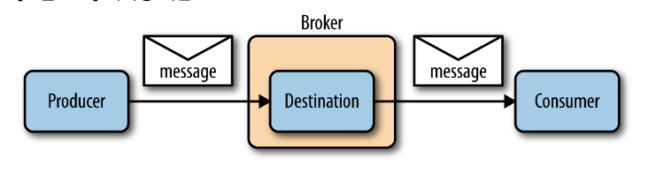
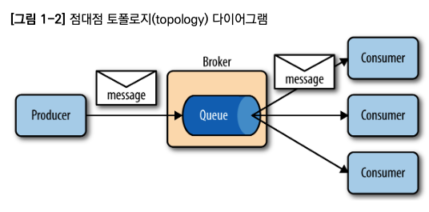
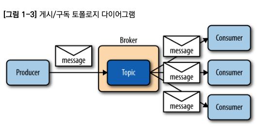
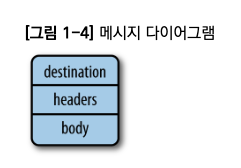

# STOMP와 MQTT로 개발하는 I/OT 모바일 웹 애플리케이션

[toc]


메시징 프로토콜 개념은 간단하다


* 애플리케이션은 중개자(Broker)를 통해 목적지(Destination)으로 메시지를 produce 한다
* 애플리케이션은 메시지를 consume하기 위해 같은 destination을 subscribe 한다.


모바일 디바이스들이 필요로 하는 메시징 프로토콜은 

AMQP등과 비해 배터리를 덜 소모시키고 네트워크가 항상 연결될 필요도 없는 사용하기에 단순하고 효율적인 것들이다.


STOMP : 텍스트 메시지를 보내고 싶은 경우 단순함 측면에서 강점을 가진다. 


MQTT : 적은 전력과 제약이 많은 메모리 자원을 가진 작은 디바이스들에서 사용하기 위해 만들어졌다.

메시지 broker들이 이 둘을 종종 지원하므로, 데스크탑에서 STOMP 사용해서 발송하고 모바일에서 MQTT로 소비할수있다

### 1. AMQP (Advanced Message Queuing Protocol)

- AMQP는 바이너리 프로토콜이기 때문에 텍스트 형태로 나타내기는 어렵습니다.
- 메시지, 큐, 라우팅, 브로커, 채널 등의 여러 추상화 개념을 포함하고 있습니다.
- AMQP 프레임의 기본 구성은 다음과 같습니다:
  - Frame type (e.g., method, header, body)
  - Channel number
  - Frame payload length
  - Frame payload
  - Frame end marker

### 2. MQTT (Message Queuing Telemetry Transport)

- MQTT는 헤더와 페이로드로 구성된 간단한 메시지 포맷을 사용합니다.

- 예를 들면:

  ```
  sqlCopy code
  CONNECT
  PUBLISH topic_name message_payload
  SUBSCRIBE topic_name
  ```

- MQTT는 다음의 커맨드를 지원합니다: CONNECT, DISCONNECT, PUBLISH, SUBSCRIBE, UNSUBSCRIBE 등.

### 3. STOMP (Simple Text Oriented Messaging Protocol)

- STOMP는 텍스트 기반의 프로토콜로 간단한 헤더와 바디를 사용하여 메시지를 표현합니다.

- 예를 들면:

  ```
  makefileCopy code
  COMMAND
  header1:value1
  header2:value2
  
  Body content here^@
  ```

- STOMP는 다음의 커맨드를 지원합니다: CONNECT, SEND, SUBSCRIBE, UNSUBSCRIBE, ACK, NACK, BEGIN, COMMIT, ABORT, DISCONNECT 등.

# 1장 소개


## 메시징 개념

- 애플리케이션은 중개자를 통해 목적지로 메시지를 공급한다.
- 애플리케이션은 메시지를 소비하기 위해 같은 목적지를 구독한다.


* 메시지Message : 애플리케이션 간에 교환되는 데이터

* 목적지Destination : 메시지를 교환하는 데 사용되는 주소의 한 형태

* 공급자Producer : 메시지를 목적지로 보내는 애플리케이션

* 소비자 Consumer : 메시지를 목적지로부터 소비하는 애플리케이션

* 중개자 Broker : 공급자로부터의 메시지를 다루고 목적지에 따라 소비자에게 메시지를 전달하는 하나의 독립된 개체



producer는 sender, publisher와 동의어고

consumer는 receiver, publisher로 불릴 수 있다.

공급자와 소비자는 자신들이 연결될 중개자를 알아야 한다. 

하지만 꼭 같은 중개자에 연결될 필요는 없다. 

여러 개의 중개자들이 하나의 클러스터로 구성될 수 있고, 메시지는 소비자에게 최종 전달되기 전에 이 중개자들을 거쳐갈 수 있다.

## 메시징 모델

메시징 모델은 어떻게 공급자와 소비자 사이를 이동하는지 설명한다

* 점대점 - Point to Point
* 게시/구독 - Publish / Subscribe

### 점대점 - Point to Point

공급자에 의해 보내진 메시지가 1명의 소비자에게만 전달된다.

* one-to-one model 이라고도 부른다.

broker는 오직 1명의 소비자에게만 메시지를 전달한다.



큐에 연결된 소비자가 없다면 broker는 소비자가 올때까지 메시지를 보관했다가 전달한다.

* 몇몇 broker는 일정 시간이 지나면 만료시킨다. 이는 메시지 품질관리에 좋다

### 게시 구독 - publish/subscribe

공급자는 topic에 의해 식별된 목적지로 전달하며, 이 topic을 구독하는 소비자는 0명이나 여러명 일 수 있고 모든 구독자에게 전달한다.

소비자가 아무도 없는 경우 broker는 메시지를 보관하지 않는다.



게시-구독 모델은 변경 사항을 보내는데 적합하다. 

### 메시지 표현

메시지는 3개의 분리된 조각으로 구성된다

* 목적지 - destination
* 헤더 - headers
* 바디 - body



목적지를 통해 소비자는 어떤 목적지의 메시지인지 알 수 있으며, 이는 소비자가 여러 목적지를 구독하고 있는 경우 식별하는데 유용하다.

헤더는 보통 메타 데이터를 넣으며 메타데이터는 메시지에 정보를 더한다.

* 메시지 식별자, 보낸 시간 타임스탬프, 메시지 실패 횟수 및 여부 등

* STOMP는 헤더에 고유 값을 넣는것을 허용하지만, MQTT는 애플리케이션 헤더를 허용하지 않는다.

* 이런 경우 애플리케이션 헤더를 메시지 payload에 넣어야 한다

바디의 형태는  데이터나 페이로드를 담을 수 있으며 STOMP는 텍스트, MQTT는 바이너리 형식이다.


# 2장 STOMP를 통한 모바일 메시징


# 3장 STOMP를 통한 웹 메시징


# 4장 STOMP 고급


# 5장 STOMP를 넘어서


# 6장 MQTT를 통한 모바일 메시징


# 7장 MQTT를 통한 웹 메시징


# 8장 MQTT 고급

