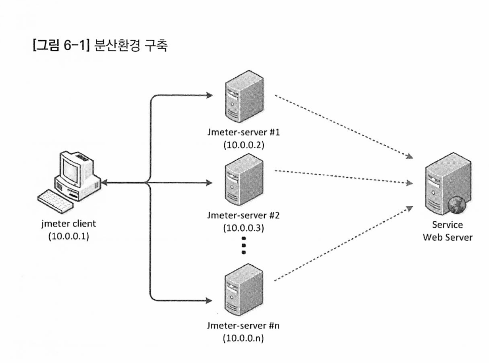
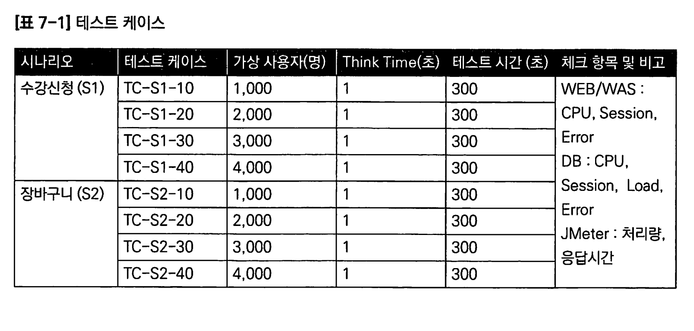

# Apache JMEter

[toc]


# 1장 JMeter와 성능 테스트
## 1.1 JMeter란
## 1.2 성능 테스트
성능테스트를 통해 응답시간과 처리량, 병목구간 확인 가능

성능테스트의 종류

* Load 테스트 : 성능을 벤치마크 하기 위한 테스트. 부하(Load)를 증가시키면서 CPU 메모리 등의 임계점을 찾아내고 이를 바탕으로 튜닝과 테스트를 반복
* Stress 테스트 : 비정상적인 요청을 보내 시스템의 최고 성능 한계를 측정하기 위한 테스트
* Spike 테스트 : 갑자기 부하가 몰렸을 때 요청 정상 처리여부랑 부하가 줄어들 때 정상적으로 반응하는지 위한 테스트
* Stability / Soak 테스트 : 긴 시간동안 부하를 보내 메모리 증가, 성능 변화를 확인하는 테스트. 길게 몇일 몇주도 진행가능

성능 테스트 프로세스

1. **요구사항 분석**

   - 테스트 목적과 범위 설정 - 구-신규 시스템 성능비교, 신규 서비스 오픈 임계치 테스트, 장애 failover 테스트
   - 시스템 구조 분석
   - 테스트 실행 방법, 시기, 담당자 및 위치 결정

2. **테스트 계획**

   - 인력과 역할 배정 - 언제, 누가, 어떤방법으로, 어디서 
   - 테스트 환경 구축 시기 및 방법

3. **테스트 환경 구축**

   * 서버 구성. 클라우드 환경. 

   * 네트워크 최적화

   * 테스트 절차, 시나리오, 케이스 및 스크립트 작성

4. **테스트 설계**

   - 테스트 절차 및 시나리오 작성
   - 테스트 케이스 및 스크립트 구현
   - 필요한 데이터 셋 준비: 충분한 양의 데이터 확보 중요
     - 불충분한 데이터는 잘못된 결과를 초래할 수 있음
     - 실제 환경과 유사한 수준의 데이터 준비로 정확성 향상

5. **테스트 수행 및 결과 수집**

   - **Pre-Test**: 스크립트 정확성 및 테스트 환경 검증. Main-Test 전 필수적으로 수행.

   - **Main-Test**: 실제 테스트 실행 및 시스템 성능 데이터 수집 (CPU, Memory, I/O 등).

6. **테스트 분석**

   - 테스트 결과 및 시스템 성능 데이터를 종합적으로 분석.

   - 성능 문제점과 영향 요소 식별.

7. **문제점 수정 및 재테스트**

   - 분석된 문제점을 개발팀 또는 시스템 운영팀에 전달.

   - 문제 해결 후 재테스트 실시.

8. **결과 리포트 작성**

   - 테스트 목적에 맞게 요약 및 상세 리포트 작성.

   - 부서별 필요에 따라 적절한 형태의 리포트 제공.

## 1.4 주요 용어 및 개념
* Active User : 실제 서버에 연결된 상태로 요청을 처리중인 사용자
* InActive User : 서버와의 세션 정보를 가지고 있지만 직접 접속하여 요청을 주고받는 상태는 아닌 사용자
* ConCurrent User(Active + InActive) : 동시 접속자 수. 일반적으로 1 : 10정도의 비율 
* Virual User : 가상 사용자 수. Thread로 표현하기도 함
* Ramp-Up Period : Thread 생성에 걸리는 시간. 초당 몇개씩 생성하는것. 
* Throughput : 처리량. TPS로도 표현
* Response, Load Tile : 응답시간 또는 처리시간
* Latency : 지연 시간 (요청 후 응답 시간)
* Think time : 하나 요청 수신 후 다음 요청을 보내는 시간. 적절히 조정해야 실제 사용자마냥 테스트 가능

# 5장 테스트 계획
## 5.1 요구사항 분석 및 목표 설정
테스트 목표

1. 신규 서비스 또는 리뉴얼 오픈 테스트
   * 성능 -> 처리량, 응답시간, CPU 리소스
2. 비교 테스트
   * H/W 증설 또는 S/W 변경 시 기존과의 차이
3. 사이징 테스트
   * 이벤트 등을 대비. 보통 stress 테스트로 최대 처리량을 계싼해서 전체 사이징 계산

가상 사용자

가상 사용자의 숫자가 많아야 하는 경우.

* 10,000명 이상 필요하면 여러대의 부하 발생기를 두는게 좋음.

처리량이 높아야 하는경우

* 고사양의 부하발생기를 이용

# 6장 테스트 환경 구축

## 6.2 튜닝

리눅스 베이스 os에서 대용량 테스트를 하려면 커널을 튜닝해야 한다

### 6.2.1 open file 수 변경

리눅스, 유닉스에서는 Socket 하나하나가 파일이므로 대용량 요청시 파일이 모자를 수 있다.

### 파일 디스크립터 제한 확인 및 변경

1. **현재 사용자의 파일 디스크립터 제한 확인**

   ```
   ulimit -n
   ```

2. **현재 사용자의 파일 디스크립터 제한 변경 (임시)**

   - 이 명령은 현재 세션에만 적용

   ```
   ulimit -n [새 제한값]
   ```

3. **시스템 전체 파일 디스크립터 제한 변경 (영구)**

   - 이 변경은 시스템 재부팅 후에도 유지

   - `/etc/sysctl.conf` 파일을 편집

   - 다음과 같은 라인을 추가 또는 변경

     ```
     fs.file-max = [새 제한값]
     ```

   - 변경사항을 적용하기 위해 시스템을 재부팅하거나 `sysctl -p` 명령을 실행

### 6.2.2 Socket 관련 커널 파라미터 수정

설정값이 PC를 재시작해도 적용되게 하려면 letclsysctl.conf에서 다음 내용을 수정한다.

**Port Range** : 웹 서버에 접속하려면 서버의 80포트로 접속한다. 이때 로컬 PC에도 임의의포트를 할당받는데 이 포트로 사용할 수 있는 범위를 말한다.

이 값이 작으면 더는 접속하지 못하는 상황이 발생한다.

1. 파일 열기

```
sudo nano /etc/sysctl.conf
```

2. 포트 범위 설정

```
net.ipv4.ip_local_port_range = 1024 65535
```

3. 변경사항 적용

```
sudo sysctl -p
```

Time Wait 소켓 처리 : 접속이 종료되어도 소켓은 패킷 수신을 위해 잠시 켜둔다. 대량으로 발생하면 계속 유지되서 더는 접속하지 못하므로 다음 설정 사용

* 필요에따라 Time Wait 접속 허용
* Time Wait 유지 시간 감소 설정

`/etc/sysctl.conf` 파일에 다음 설정을 추가

```
net.ipv4.tcp_tw_reuse = 1 # 재사용 허용
net.ipv4.tcp_fin_timeout = [시간(초)] # 유지시간 감소 
```

작성하고 변경사항 적용

```
sudo sysctl -p
```

## 6.3 분산 테스트 환경 구축

여러대의 부하 발생기를 병렬로 연결해서 동시에 테스트해야만 한다.



- jmeter controller : 실제로 부하를 발생시키는 jmeter-server에 명령을 전 달하는 Master 역할을 수행하는 노드다.
- jmeter-server : 실제로 부하를 발생하는 노드로, jmeter controller에서 받 은 명령을 수행하고 그 결과값을 다시 jmeter controller로 전달하는 Slave 역할을 한다.


컨트롤러의 jmeter.properties 파일을 편집한다.

* jmeter-server 접속을 위한 IP 설정과 결과 데이터를 받아온다

remote_hosts 설정

* 콤마로 구분된 ip 리스트를 적어준다. 포트를 별도로 설정하지 않으면 1099로 된다
* 포트 별로 설정도 가능하다. 

```
remote_hosts=10.0.0.2,10.0.0.3, ......, n
```


이후 RUN -> Remote Start All 을 클릭하여 실행하면 된다

# 7장 테스트 설계 및 Test Plan 작성

대학교 수강신청 시스템 테스트

## 7.2 테스트 방법
1. 가상사용자 수를 순차적으로 증가시키면서 응답시간, CPU 사용률 등 변곡시키기
2. 요청량을 순차적으로 증가시키기
3. 웹서버 -> WAS, 웹서버 -> DB 순서로 
4. 장시간테스트. 한두시간~ 며칠에 걸쳐 걸기 

## 7.3 테스트 케이스 작성

ex) 한학년에 1천명, 전체는 4천명



## 7.4 테스트 데이터 준비

로그인파일, 수강신청파일 등등을 준비. 

# 9장 결과 분석 및 리포트 작성
## 개선방안 제시

1. 로드밸런싱 최적화 
2. 이미지,동영상 등은 대역폭을 늘리거나 CDN을 쓴다 