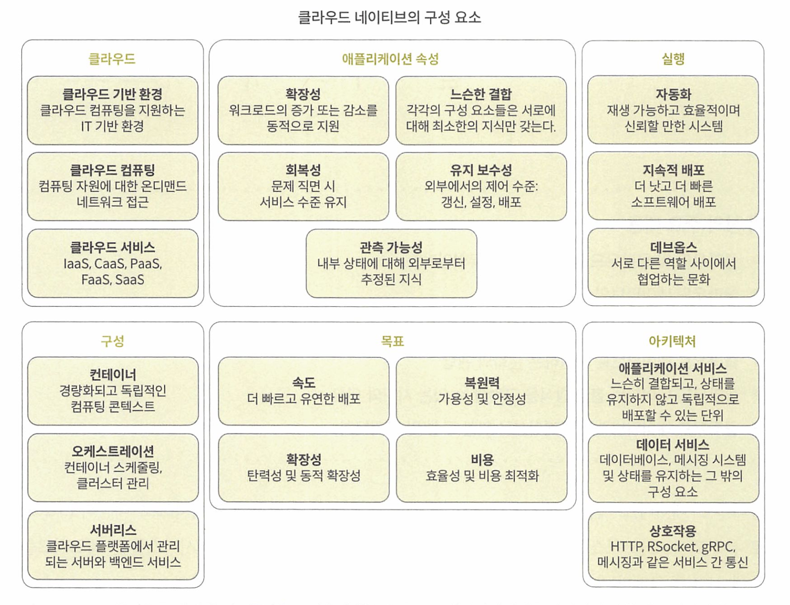
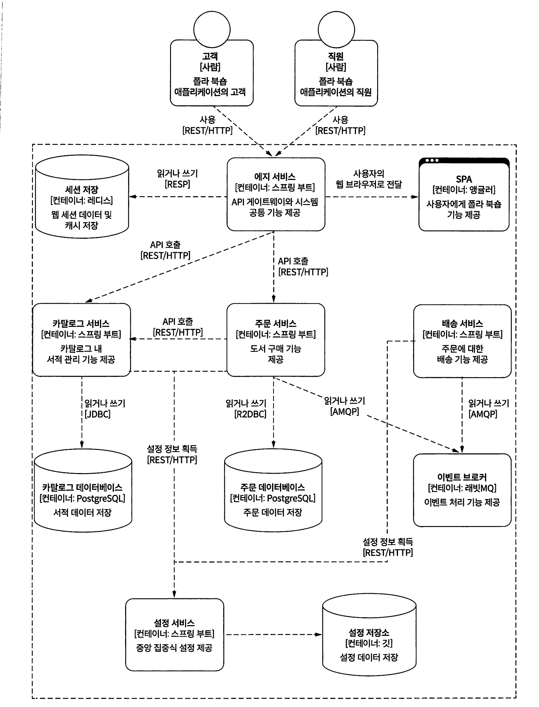

# 클라우드 네이티브 스프링 인 액션

* https://github.com/ThomasVitale/cloud-native-spring-in-action

# 1. 클라우드 네이티브

기업과 같은 조직에서 클라우드 네이티브 기술을 사용하면 동적인 환경에서 확장가능한 애플리케이션을 구축하고 실행할 수 있다.

컨테이너, 서비스 메시, 마이크로서비스 불가변인프라, 선언적 API 등.

느슨하게 결합된 시스템에서 이러한 기술을 사용하면 복원력이 뛰어나고 관리가 용이하며 관찰 가능한 시스템을 만들 수 있다.

**컨테이너(Container)**
컨테이너는 애플리케이션의 코드와 모든 종속성을 패키지화하여 어디서나 동일하게 실행될 수 있도록 합니다. 도커(Docker), 쿠버네티스(Kubernetes) 같은 도구가 대표적입니다.

**마이크로서비스(Microservices)**
애플리케이션을 작고 독립적인 서비스 단위로 나누어 각 서비스가 독립적으로 개발, 배포, 확장될 수 있게 합니다. 이 방식은 변화에 빠르게 대응하고, 문제 발생 시 전체 서비스가 아닌 해당 서비스만 수정할 수 있는 장점을 제공합니다.

**지속적 통합 및 지속적 배포(CI/CD)**
애플리케이션의 업데이트 및 배포 과정을 자동화하여 코드를 더 자주, 더 신속하게 배포할 수 있게 합니다. 이를 통해 코드 변경 사항이 빠르고 안정적으로 프로덕션 환경에 적용됩니다.

**데브옵스(DevOps)와 자동화**
개발과 운영의 협업 문화를 중시하며, 자동화된 도구를 통해 인프라 관리와 배포 프로세스를 최적화합니다. DevOps는 클라우드 네이티브의 필수적인 요소로, 개발 주기를 단축하고 서비스 신뢰성을 높이는 데 기여합니다.

**탄력적 인프라(Elastic Infrastructure)**
클라우드 네이티브 애플리케이션은 클라우드 제공자의 탄력적 리소스를 활용해 필요에 따라 자원을 동적으로 할당하거나 해제합니다. 이로써 트래픽 증가에 유연하게 대응할 수 있습니다.

### 클라우드 네이티브의 장점

- **확장성**: 수요에 따라 빠르게 확장하거나 축소할 수 있어 리소스를 효율적으로 사용할 수 있습니다.
- **유연성**: 각 서비스가 독립적으로 배포되고 확장되므로 변화에 유연하게 대응할 수 있습니다.
- **자동화된 관리**: 지속적 통합, 지속적 배포, 자동화를 통해 운영 비용과 시간을 절감할 수 있습니다.
- **신속한 배포**: CI/CD 파이프라인을 통해 더 빠르게 배포하고 피드백을 받아 애플리케이션을 개선할 수 있습니다.

클라우드 네이티브의 3가지 P

- 플랫폼platiorm: 클라우드 네이티브 애플리케이션은 클라우드(공용, 사설 또는 하이브리드) 같은 동 적 분산 환경을 기반으로 하는 플랫폼에서 실행된다.
- 속성property: 클라우드 네이티브 애플리케이션은 확장 가능하고 느슨하게 결합되며 복원력이 뛰어나고 관리가 용이하며 관찰 가능하도록 설계된다.
- 실행practice: 견고한 자동화를 통해 빈번하고 예측 가능한 방식으로 시스템을 변경하는 것이 여 기에 포함되는데 자동화, 지속적 전달, 데브옵스 등이 있다.

### 서버 용어

스노 플레이크 서버 : 신뢰성이 떨어지는 서버

피닉스 서버 : 작동하는 모든 작업을 자동화하고 모든 변경사항을 형상관리시스템추적 가능한 서버 -> 불가변 서버 

# 아키텍처

