# 핵심개념과 패턴 설계 구현으로 배우는 DDD와 MSA

* https://github.com/CNAPS-MSA

[toc]

# 현대 애플리케이션이 갖춰야 할 바람직할 속성들 - 리액티브 선언

* Responsive : 사용자에게 신뢰성 있는 응답을 빠르고 적절하게 제공 ,
* Resilient : 장애가 발생하거나 시스템이 고장나더라도 빠르게 복구하는 능력 
* Elastic : 시스템 사용량의 변화가 있더라도 균일한 응답성을 제공. 시스템 사용량에 비례해 자원을 업다운 
* Message Driven : 비동기 메시지 전달을 통해 위치 투명성, 느슨한 결합, 논블로킹 통신 지향

## MSA 구성요소 및 MSA 패턴

| 패턴 유형         | 설명                                                        |
| ----------------- | ----------------------------------------------------------- |
| 인프라 구성요소   | 마이크로서비스를 지원하는 하부구조를 구축하기 위한 구성요소 |
| 플랫폼 패턴       | 인프라 상에서 마이크로서비스의 운영과 관리를 지원하는 패턴  |
| 애플리케이션 패턴 | 마이크로서비스 애플리케이션을 구성하기 위한 패턴            |

인프라가 구축돼야 하고, 위에 미들웨어가 올라가고, 미들웨어 위에 애플리케이션이 동작해야 한다.

## 마이크로서비스 생태계와 운영관리 요소의 탄생

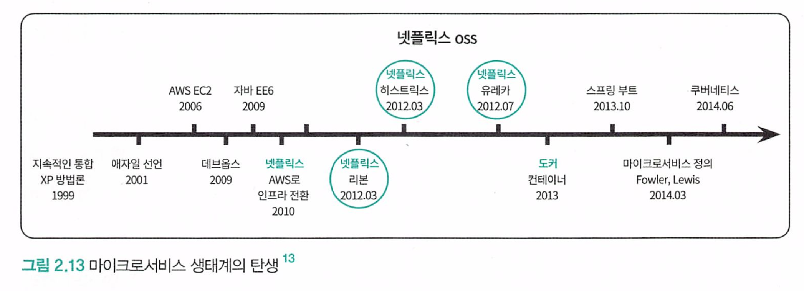

* 라우팅과 로드밸런싱을 위한 zuul, ribbon
* 모니터링을 위한 hystrix
* 서비스 등록을 위한 eureka

# 인프라 구성요소 및 MSA 관리 운영 패턴

## 스프링 클라우드 : 스프링 부트 + 넷플릭스 Oss(Open Source Software)

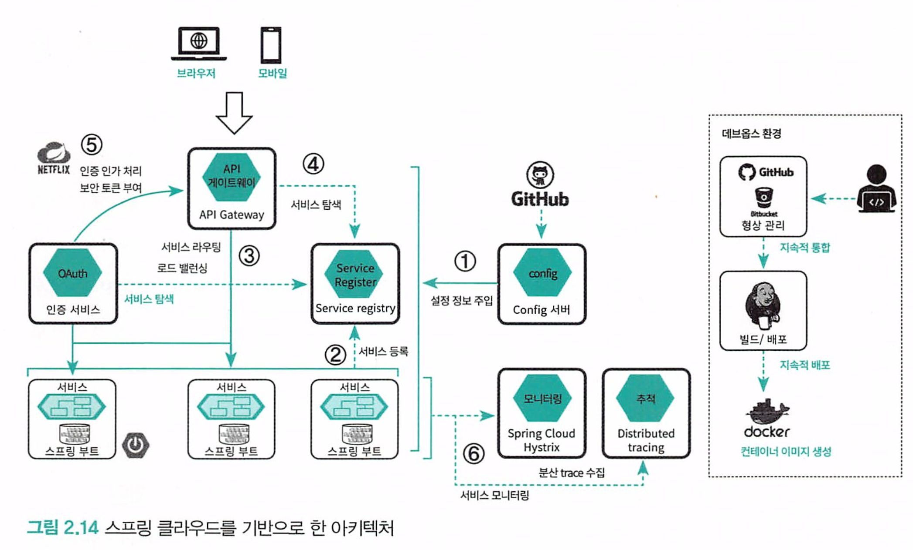

1. 모든 마이크로서비스는 인프라에 종속되지 않고 환경 설정 정보를 형상 관리 시스템에 연결된 Config Service에서 가져와 설정 정보를 주입
2. 로딩과 동시에 서비스 레지스트리에 자신의 서비스명과 인프라로부터 할당받은 물리 주소를 매핑하여 등록 
3. 클라이언트가 API 게이트웨이를 통해 마이크로서비스에 접근. 게이트웨이는 적절한 라우팅 및 부하 관리를 위한 로드밸런싱 수행 
4. API 게이트웨이도 서비스 레지스트리에서 서비스의 위치 검색
5. API 게이트웨이는 인증 서비스와 연계하여 인증 인가 처리 
6. 모니터링 서비스와 추적 서비스에 의해 모니터링되고 추적 

## 다양한 서비스의 등록 및 탐색을 위한 서비스 레지스트리, 서비스 디스커버리 패턴

클라이언트가 여러 마이크로서비스를 호출할때 동적으로 변경되더라도 서비스를 자동 발견 하여 통신하기 위한 디자인 패턴.

최적 경로를 찾아주는 라우팅 기능과 적절한 부하분산을 위한 로드밸런싱 기능이 제공돼야 한다.

* 라우팅 : Zuul이 담당. 현재 v2로 사용해야함
* 로드밸런싱 : ribbon 이 담당. 현재 deprecated. 

* 유동적인 IP 관리 : Eureka

각 서비스 인스턴스가 로딩될 때 서비스명과 IP를 유레카(서비스 레지스트리)에 등록하고, 클라이언트가 서비스명 호출시 라우터가 레지스트리 서비스를 검색해 서비스 + IP정보를 확인 후 호출한다.

서비스 레지스트리는 관리와 운영을 위한 서비스 주소도 함께 보관한다. Config, Monitoring, tracing Service 모두.

## 서비스 단일 진입을 위한 API 게이트웨이 패턴

여러서비스를 각각 호출하게 된다면 복잡해지는데, 게이트웨이를 통한 단일 진입점을 만들어놓고 게이트웨이에서 여러 서비스를 호출한다.

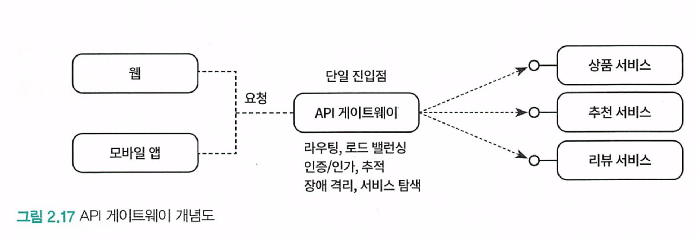

- 레지스트리 서비스와 연계한 동적 라우팅, 로드 밸런싱
- 보안: 권한 서비스와 연계한 인증/인가
- 로그 집계 서비스와 연계한 로깅. 예: API 소비자 정보, 요청/응답 데이터
- 메트릭(Metrics). 예: 에러율, 평균/최고 지연시간, 호출 빈도 등
- 트레이싱 서비스와 연계한 서비스 추적. 예: 트래킹 ID 기록
- 모니터링 서비스와 연계한 장애 격리(서킷 브레이커 패턴)

## BFF 패턴 (Backend For Frontend)

모바일 장비, 다양한 클라이언트를 고려하기 위해 특화된 처리를 위한 API 조합이나 처리가 필요할 경우 사용하는 방법.

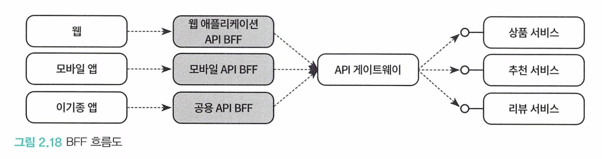

## 외부 구성 저장소 패턴 (Config)

DB정보, 파일 스토리지 정보 등 변경이 되는경우 서비스 중단과함께 배포해야한다.

런타임에 외부 설정정보를 특정 저장소에 저장해놓고, 배포시나 재시작시 해당 설정정보를 읽게 하는 방법이다.

## 인증 인가 패턴 

주로 다음 패턴을 사용한다

### 중앙 집중식 세션 관리

서버 세션에 사용자 로그인 정보 및 권한 정보를 저장. 

그러나 MSA는 사용량에 따라 수시로 확장되고 로드밸런싱 처리가 되기 때문에 세션 데이터가 손실될 수 있다.

때문에 공유 저장소에 세션을 저장하고 모든 서비스가 동일한 사용자 데이터를 얻게한다. 

### 클라이언트 토큰

JWT 토큰 등을 이용한다

### API 게이트웨이를 사용한 클라이언트 토큰

인증 서비스와 API 게이트웨이를 연동해서 인증 인가를 처리한다. 

통신은 API 게이트웨이랑만 하므로 리소스 서비스가 자체적으로 인증을 게이트웨이가 처리해서 요청을 전달한다.

리소스 서버는 인가만 확인한다. 

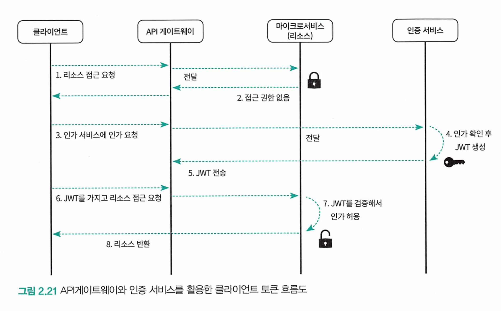

## 장애 및 실패 처리를 위한 서킷 브레이커 패턴

특정 서비스가 장애가 감지되면 격리해서 장애를 다른 서비스로 전파시키지 않으려고 하는 서킷 브레이커 패턴

호출에 대한 실패 횟수가 임곗값을 초과하면 회로를 차단하여 모든 시도를 즉시 실패하게 만들다.

fallback 메서드를 통해 요청 처리를 진행한다.

## 중앙화된 로그 집계 패턴

로그 원칙을 보면, 로그를 이벤트 스트림으로 처리하라고 한다. 시작과 끝이 고정이 아닌 연속적으로 계속 흐르는것이다.

스트림의 전달이나 저장에 관여하지 않아야 특정 기술이나 인프라에 의존적이지 않을 수 있다.

## 서비스 메시 패턴 (이스티오, isto)

스프링 클라우드가 많은 기능을 제공해주지만, 자바기반이기 때문에 다른 언어로 폴리글랏하게 구현된 경우 스프링 클라우드 서비스를 사용할 수 없다.

또한 서비스 탐색, 서킷브레이커, 추적, 로드밸런싱 등을 비즈니스 로직과 분리해서 인프라 계층에서 수행하기 위해 서비스 메시 패턴을 사용하기도 한다.

이스티오는 애플리케이션 컨테이너와 다르게 격리되어 별도의 컨테이너로 배포되는 사이드카 패턴을 적용해서 서비스 디스커버리, 로드밸런싱, 로깅 등을 제공한다

* 사이드카 패턴 : 모든 서비스 컨테이너에 추가로 사이드카 컨테이너가 배포되는 패턴. 다른 서비스를 직접 호출하지 않고 사이드카인 프락시를 통해 연계해서 통신

이스티오는 다음과 같이 스프링 클라우드와 넷플릭스 OSS에서 제공했던 대부분의 기능을 모두 제공하면서 동시에 차별점도 있다.

주요 기능

- 트래픽 관리(Traffic Management): 동적 라우팅, 로드 밸런싱
- 보안 보안 통신 채널(TLS) 2, 인증/인가/암호화
- 관측성(Observabilify): 메트릭, 분산 트레이싱, 로깅

스프링 클라우드 및 넷플릭스 0SS와의 차별점

- 애플리케이션 코드의 변경이 거의 없다. 스프링 클라우드나 넷플릭스 OsS 기반은 비즈니스 로직과 함께 코드로 표현돼야 하지만 이스티오는 완전히 사이드카로 격리되며 yaml 파일과 같은 설정 파일에 의해 정 의된다.
- 폴리글랏 애플리케이션도 지원한다. 스프링 클라우드나 넷플릭스 기반은 자바 언어만 지원하나 이스티오는 각 마이크로서비스를 다른 언어(자바, Node.s, Ct)로 작성한 경우에도 지원 가능하다
- 이스티오는 쿠버네티스와 완벽하게 통합된 환경을 지원한다.

# 애플리케이션 패턴

## 마이크로 프론트엔드

프론트엔트도 백엔드 MSA처럼 기능별로 분리하고 조합하기 위한 프레임 형태의 부모 창을 통해 각 프런트엔드를 조합해서 동작하게 한다.

## 마이크로 서비스 통신 패턴

### 동기 통신 방식 (SYNC)

REST API를 호출할 때 사용되는 기본 통신 방법.

동기 API 호출을 받은 다른 서비스에 장애가 생긴다면, 요청을 보낸 서비스는 대기하게 되고 계속 기다리면서 재호출하게된다. 

또한 서비스가 다른 서비스를 호출해 얻은 정보를 이용해 기능을 제공한다는것은 해당 서비스간 의존관게가 높다는 의미.

### 비동기 통신 방식 (async)

응답을 기다리지 않고, 메시지를 보낸 다음 다음 일을 처리한다. 

주로 메시지를 보장하기 위한 메커니즘으로 카프카, 레빗엠큐 같은 메시지 브로커를 사용한다

이 방식은 메시지 브로커에 의해 중계되기 때문에 서로 물리적으로 동일한 위치할 필요도 없고, 서로 프로세스를 공유할 필요도 없으며 동일한 시간대에 같이 동작하지 않아도 된다.

## 분산 트랜잭션 처리 패턴

2단계 커밋은 각 서비스에 잠금이 걸려 성능 문제 탓에 효율적인 방법이 아니다. 

* NoSQL은 2단계 커밋을 지원하지도 않음

SAGA 패턴을 사용하는것이좋다

사가 패턴은 각 서비스의 로컬 트랜잭션을 순차적으로 처리하는 패턴.

여러 분산된 서비스를 하나의 트랜잭션으로 묶는대신 각 로컬 트랜잭션과 보상 트랜잭션을 이용해 비즈니스 데이터 정합성을 맞춘다.

롤백이 필요하면 보상 트랜잭션을 사용한다.

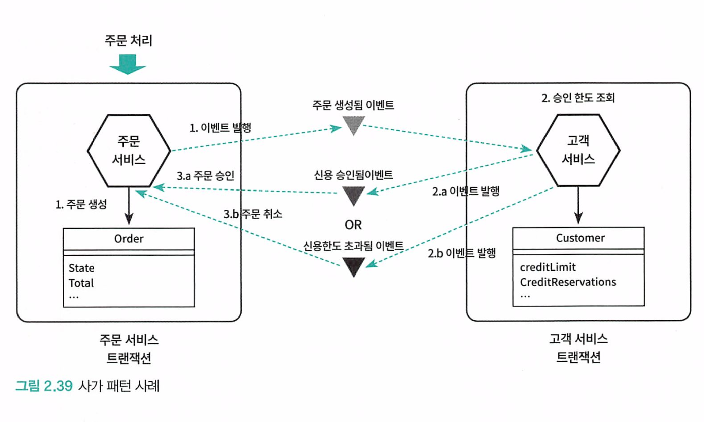

1. 주문 처리가 시작되면 주문 서비스는 가주문을 생성하고 주문자 정보가 담긴 '주문 생성됨' 이벤트를 발 행하고 트랜잭션을 종료한다.
2. 고객 서비스가 '주문 생성됨' 이벤트를 확인한 뒤 다음 처리를 수행한다.
   1. 이벤트에 존재하는 주문자 정보로 고객의 신용한도를 조회해서 신용한도가 충족되면 '신용 승인됨' 이 벤트를 발행한다.
   2. 신용한도가 충족되지 않는다면 '신용한도 초과됨' 이벤트를 발행한다.

3. 주문 서비스는 고객 서비스가 발행한 이벤트를 확인해 다음 처리를 수행한다.
   1. 고객 서비스가 발행한 이벤트가 신용 승인됨'인 경우에는 주문 승인 처리를 한다.
   2. 신용한도 초과됨' 이벤트인 경우에는 보상 트랜잭션인 주문 처리 취소를 수행한다.

이처럼 하나의 큰 트랜잭션으로 묶지 않고 4개의 분리된 로컬 트랜잭션으로 비즈니스의 정합성 을 맞출 수 있다.

### 데이터 일관성에 대한 생각의 전환 : 결과적 일관성

모든 비즈니스 규칙들이 실시간으로 일관성을 맞춰야 할까?

잘 생각해보면 모든 비즈니스 처리가 반드시 실시간성을 요구하는 것은 아니다.

실시간으로 맞지 않더라도 어느 일정 시점이 됐을 때 일관성을 만족해도 되는것이 있따 이것을   eventual consistency 라고 한다. 

실시간성을 중요시하게되면 성능 및 가용성을 낮츨 수 있다.

## MSA 아키텍처 흐름과 구성요소와 패턴 정리

*  MSA 아키텍처는 기존의 벤더 중심의 강 결합 아키텍처에서 오픈소스 중심의 느슨한 결합의 아키텍처로 변화할 것을 요구한다.

- MSA 아키텍처는 마이크로서비스 외부의 구성을 위한 외부 야키텍처와 마이크로서비스 내부 정으를 위한 내부 아키텍처로 구성된다.
- MSA 아키텍처 영역의 문제 해결 방식이 다양한 MSA 패턴으로 정리되고 있고, 인프라 구성요소, 플랫폼 운영 관리 패턴, 애플리케이션 연계와 관련된 패턴 등이 존재한다.
- 클라우드 인프라 구성요소로 가상 머신, 컨테이너, 컨테이너 오케스트레이션 등이 고려된다.
- 마이크로서비스의 생태계 발전과 함께 마이크로서비스 운영 관리를 위한 플랫폼 패턴들이 탄생했다.
- 플랫폼 패턴으로 넷플릭스 OSs 기반의 애플리케이션을 활용한 패턴이 최초로 등장했고, 이를 발전시킨 패 턴이 쿠버네티스, 이스티오 등의 기술로 발전해 오고 있다.
- 마이크로서비스 애플리케이션을 구성하고 연계하기 위해 니 컴포지트, 통신 패턴, 이벤트 기반 아키텍처 등 이 고려된다.
- 저장소 분리 등으로 인한 분산 트랜잭션의 근본적인 문제 등을 해결하기 위해 사가 패턴, CORS, 이벤트 소 싱 패턴 등이 고려된다.

# 마이크로서비스 애플리케이션 아키텍처

특정 코드나 SQL문에 로직이 집중되어 특정 개발자 말고 다른 개발자가 코드를 이해할 수 없으면 큰 문제가 생긴다.

모든 업무 변경이 그에게 집중되어도, 팀의 업무 병목지점이 되고 시스템은 변경하기 힘들다.

**애플리케이션의 유지보수성이 높다는 의미는 특정 개인에 의존하기 보다는 어느 누구라도 손쉽게 애플리케이션을 이해하고 유지보수할 수 있음을 의미한다.**

## 헥사고날 아키텍처 (포트 앤 어뎁터 아키텍처)

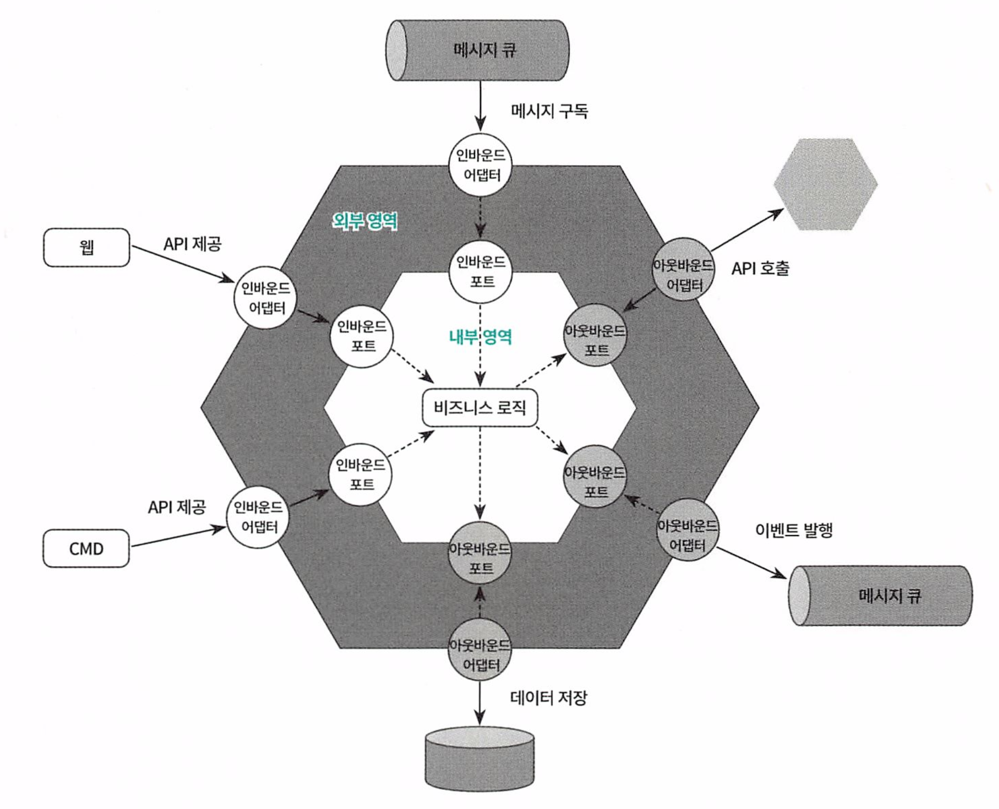

* 고수준의 비즈니스를 포함하는 내부영역 (순수한 비즈니스 로직을 표현하는 기술 독립적인 영역)

* 인터페이스 처리를 담당하는 저수준의 외부영역

* 외부에서 들어오는 요청 : 인바운드 어뎁터

* 비즈니스 로직에 의해 호출되어 외부와 연계되는 아웃바운드 어댑터 

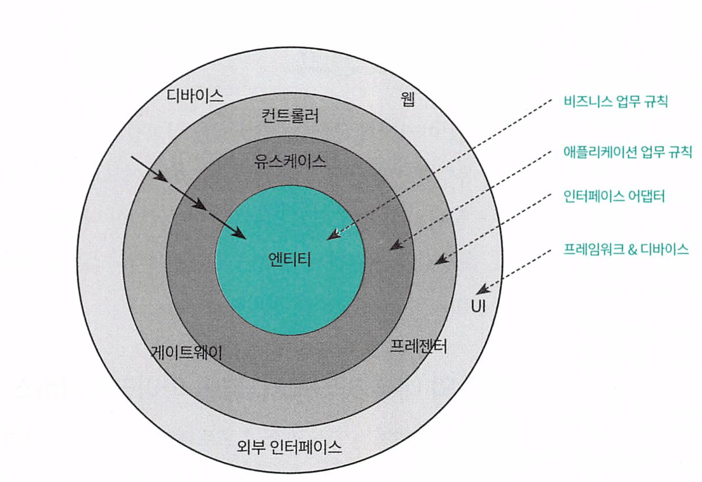

* 엔티티 : 비용, 사업과 관련된 규칙을 정의하고, 규칙과 연관된 데이터들의 묶음
* 유즈케이스 : 애플리케이션에 특화된 규칙을 표현하고, 엔티티 내부의 업무 규칙을 호출하며 시스템을 사용. 엔티티를 감싼다.
  * 엔티티같은 고수준 영역은 저수준의 유스케이스를 알면 안된다.
* 입출력장치, 저장소, 웹, 통신 : 유스케이스를 감싸고있는 세부사항. 플러그인처럼 유연하게 처리

바람직한 마이크로서비스의 내부구조.

- 지향하는 관심사에 따라 응집성을 높이고 관심사가 다른 영역과는 의존도를 낮추게 해야 한다.
- 업무 규칙을 정의하는 비즈니스 로직 영역을 다른 기술 기반 영역으로부터 분리하기 위해 노력한다.
- 세부 기술 중심, 저수준의 외부 영역과 핵심 업무 규칙이 정의된 고수준의 내부 영역으로 구분한다.
- 고수준 영역은 저수준 영역에 의존하지 않게 해야 하며, 저수준 영역이 고수준 영역에 의존하게 해야 한다.
- 저수준 영역은 언제든지 교체, 확장 가능해야 하며, 이 같은 변화가 고수준 영역에 영향을 줘서는 안 된다.
- 자바처럼 인터페이스 및 추상 클래스를 지원하는 언어의 경우 저수준 영역의 구체 클래스가 고수준 영역의
   추상 인터페이스에 의존하게 하는 의존성 역전의 원칙을 적용한다.
- 인터페이스는 고수준의 안정된 영역에 존재해야 하며, 저수준의 어댑터가 이를 구현한다.

# 마이크로서비스 설계

## 도메인과 서브도메인

많은 개념들이 하나로 엮인 복잡한 비즈니스 도메인을 논리적으로 구분되는 여러개의 하위 영역으로 분리된 하위 도메인을 서브 도메인이라고 한다.

서브도메인은 중요도에 따라 핵심 서브도메인, 지원 서브도메인, 일반 서브도메인 3가지 유형으로 나뉜다

* 핵심 서브 도메인 : 비즈니스 영역. 다른 경쟁업체와의 비즈니스 차이를 두고 가장 높은 우선순위를 갖고 가장 큰 투자를 해야하는 영역
  * ex) 아마존의 추천시스템, 쿠팡의 로켓배송 
* 지원 서브 도메인 : 필수적이지만 핵심은 아닌 영역
* 일반 서브도메인 : 비즈니스적으로 특화되진 않지만 전체 비즈니스에는 필요한 부분 .

## 컨텍스트 매핑

도메인 모델들을 구성하다 보면 도메인 모델과 다른 도메인 모델과의 경계까 보인다.

특정한 도메인 모델그룹과 그 그룹 내에서 사용되는 용어 규칙 개념의 집합이 다른 도메인 모델 그룹과 상이되는 경계가 바운디드 컨텍스트다.

- 하나의 바운디드 컨텍스트는 특정한 도메인 모델의 한 부분에 대한 경계이며, 특정한 문맥 안에서 사용되는 용어, 규칙, 그리고 개념의 집합을 의미
- 바운디드 컨텍스트는 그 안에서는 일관된 의미를 가지며, 다른 바운디드 컨텍스트와는 다른 용어나 규칙을 사용할 수 있다

바운디드 컨텍스트를 식별할 때 각 컨텍스트는 내부적으로 응집성은 높게, 다른 컨텍스트와 의존성은 낮아야 한다는 원칙을 두고 설계한다.

이러한 **여러 컨텍스트 간에 의존 관계를 DDD 에서는 컨텍스트 매핑**이라고 하고, 연관관계에 있는 두 컨텍스트 사이에 선을 그어서 표시한다

아래는 주요 컨텍스트 매핑 관계이다.

### 공유 커널(Shared Kernal)

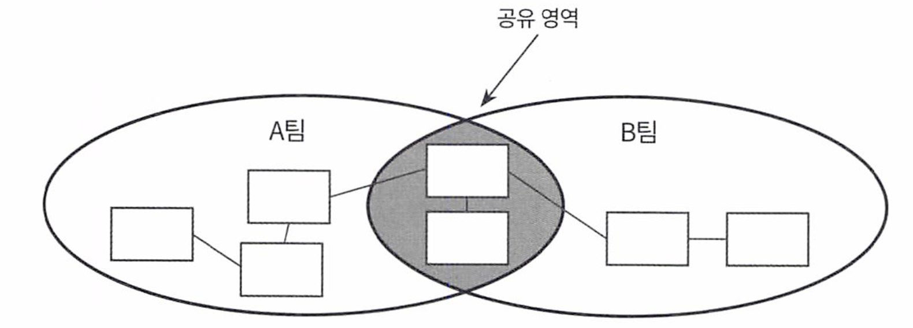

공유 커널은 바운디드 컨텍스트 사이에 공통적인 모델을 공유하는 관계다. 

각 팀은 공유하는 모델에 서로 합의해야 하며 보통 공통 라이브러리 등이 여기에 해당한다.

여러 바운디드 컨텍스트가 협력해야 하는 경우 공유 커널을 사용하여 공통된 모델이나 코드를 공유하여, 중복 방지 및 일관성을 유지한다.

* 이부분이 변경되면 여러 관련 컨텍스트에 영향을 미치므로, 코드를 수정할때 주의해야한다.

### 소비자와 공급자 (Customer - Supplier)

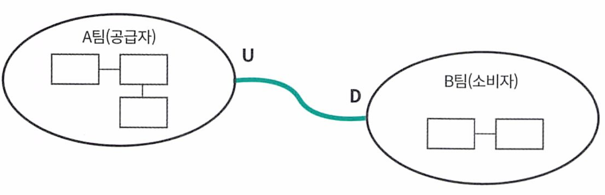

공급하는 컨텍스트는 상류(Upstream), 소비하는 컨텍스트는 하류 (downStream)으로 표시한다.

데이터는 상류 -> 하류로 흐르고 반대로는 불가능하다. 즉 공급자는 소비자가 원하는 기능을 제공해야 한다

### 준수자 (Confirmlist)

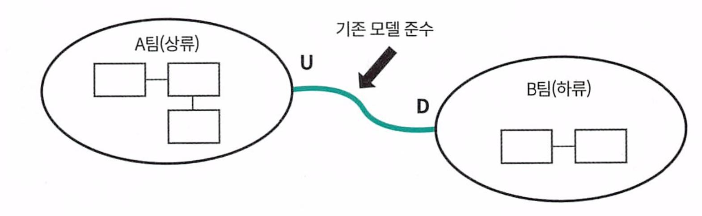

소비자와 공급자유형과 비슷하지만, 상류팀이 하류팀의 요구를 지원하지 않거나 못하는 경우에 사용한다.

즉 다른 컨텍스트의 기존 모델을 그대로 사용한다.

### ACL 충돌 방지 계층 (Anti Corruption Layer)

충돌 방지 계층은 하류 팀이 상류 팀의 모델에 영향을 받을 때, 하류 팀의 고유 모델을 지키기 위해 호환성을 위한 번역 계층을 만드는 것.

즉 상류 모델의 변경 없이 하위 모델과 통합하기 위해 데이터를 ㅂ변환하는 메커니즘을 구현한것이다.

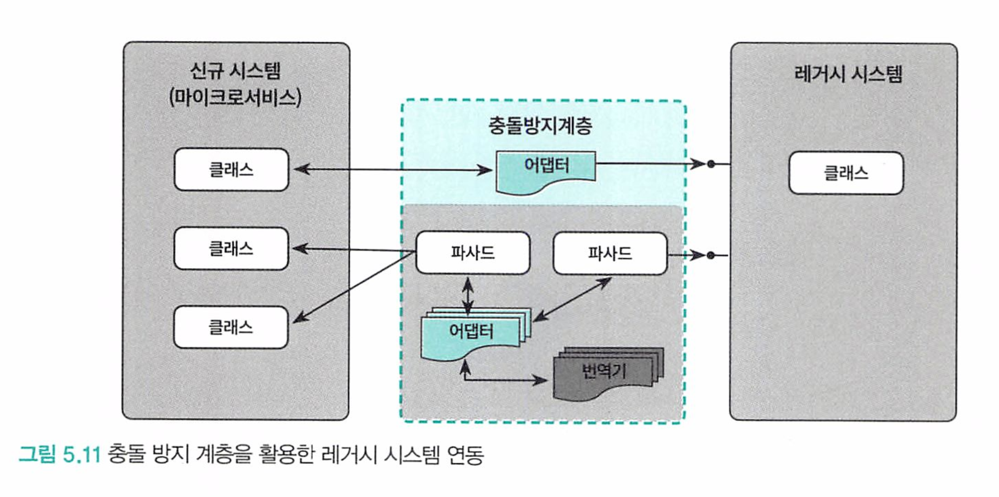

주로 레거시 시스템과 통합하는 경우에 사용할 수 있다.

### 공개 호스트 서비스 (OHS, Open Host Service)

바운디드 컨텍스트에 대한 접근을 제공하는 프로토콜이나 인터페이스를 제공한다. 즉 외부에 노출된 서비스이다.

다른 컨텍스트에서 이를 상호작용하여 사용할 수 있다.

### 발행된 언어, PL

여러 컨텍스트가 제공하는 기능을 서로 사용하기 위해 간단한 사용과 번역을 가능하게 하는 XML이나 JSON 같은 문서화된 정보 교환 언어다. 주로 OHS랑 짝을 이뤄 사용된다. 

### 도메인 서비스

도메인의 비즈니스 로직 처리가 특정 엔티티 등에 속하지 않을때 단독으로 객체를 만들어서 처리하는데 이것을 도메인 서비스라고 한다.

도메인 서비스에서는 상태를 관리하지 않고 행위만 존재한다. 도메인 로직 처리시 처리 후에 상태를 엔티티나 값 객체로 전달한다.