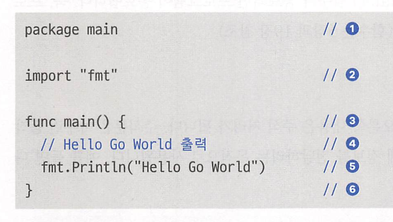
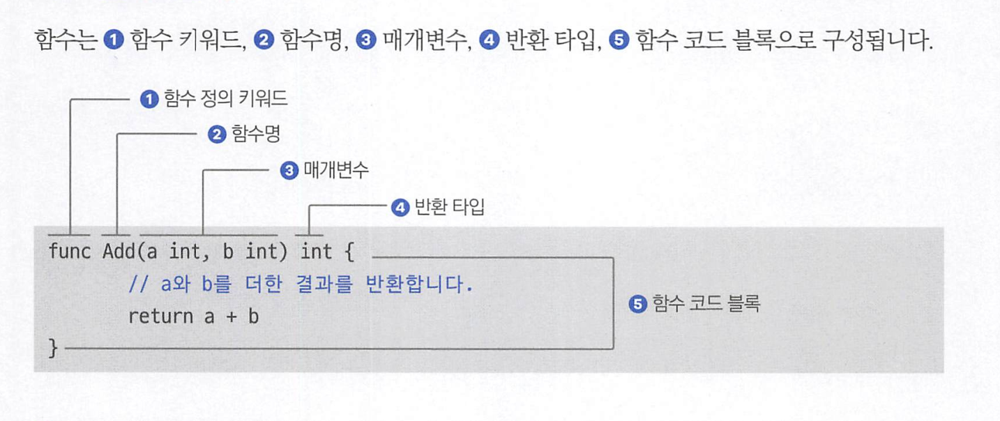
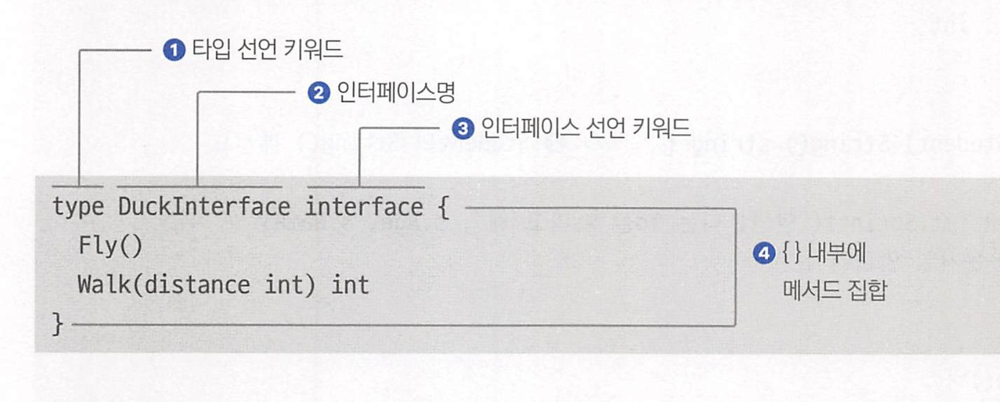
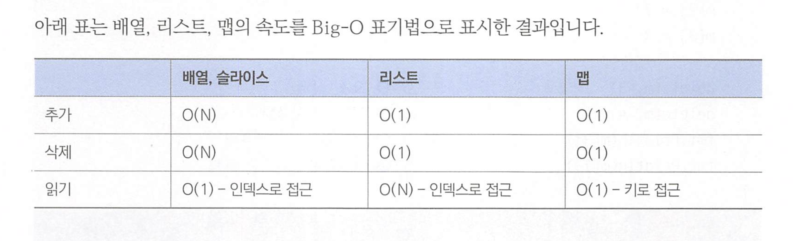
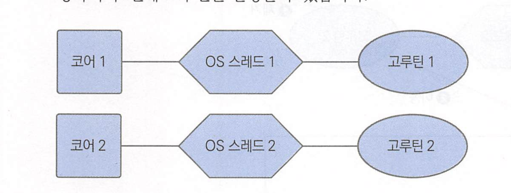
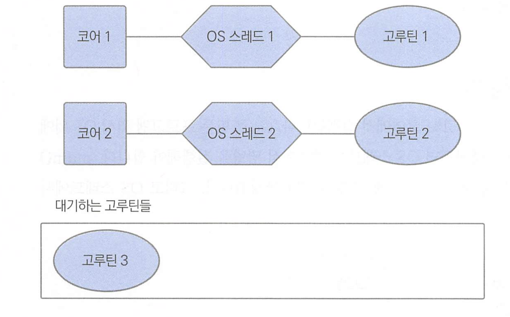

# 터커의 고언어 프로그래밍

* https://github.com/tuckersGo/musthaveGo2
* 홈페이지 : https://go.dev
* 온라인 컴파일러 ; https://go.dev/play


## Go 특징

| 개념              | 있다/없다 | 설명                                                         |
| ----------------- | --------- | ------------------------------------------------------------ |
| 클래스            | 없다      | 클래스는 없지만, 메서드를 가지는 구조체를 지원합니다.        |
| 상속              | 없다      | 상속을 지원하지 않습니다.                                    |
| 메서드            | 있다      | 구조체가 메서드를 가질 수 있습니다.                          |
| 인터페이스        | 있다      | 상속이 없지만 인터페이스는 있습니다.                         |
| 익명 함수         | 있다      | 함수 리터럴이라는 이름으로 제공합니다.                       |
| 가비지 컬렉터     | 있다      | 고성능 가비지 컬렉터를 제공합니다.                           |
| 포인터            | 있다      | 메모리 주소를 가리키는 포인터가 있습니다.                    |
| 제네릭 프로그래밍 | 있다      | 제네릭 프로그래밍을 1.18 버전부터 지원합니다.                |
| 네임스페이스      | 없다      | 네임스페이스를 제공하지 않습니다. 모든 코드는 패키지 단위로 분리됩니다. |


코드가 프로그램이 되어 실행되기까지 다음과 같이 5단계를 거쳐야 합니다.

1. 폴더 생성

2. g0 파일 생성 및 작성

3.  Go 모듈 생성

4. 빌드

5.  실행


### 1. 폴더 생성

모든 코드는 패키지 단위로 작성한다. 같은 폴더에 위치한.go 파일은 모두 같은 패키지명에 포함되고, 패키지명으로 폴더명 사용한다.

ex) goproject/hello

* .go파일들은 hello 패키지에 포함

e)goproject/hello/extra

* extra 패키지에 포함. 

### 3. go 모듈 생성

모든 Go 코드는 빌드하기 전 모듈을 생성해야 한다

모듈 생성은 go mod init으로 실행하며, 뒤에 모듈이름을 적는다

```go
go mod init goproject/hello
```


### 4. go build

go build는 Go 코드를 기계어로 변환하여 실행파일을 만든다.

GO OS와 GOARCH 환경변수를 조정해서 다른 운영체제와 아키텍처에서 실행되는 실행파일을 만들 수 있다.

터미널에서 go tool dist list 명령 실행시 실행가능 운영체제와 아키텍처 목록이 나온다

ex) AMD64계열 리눅스

```
GOOS=linux GOARCH=amd64 go build
```

arm64계열 리눅스

```
GOOS=linux GOARCH=arm64 go build
```



1. package main

해당 코드가 어느 패키지에 속하는지 선언하는것.

모든 코드는 패키지 선언으로 시작해야 한다. package main은 main에 속한 코드임을 컴파일러에게 알려주며, 프로그램 시작점이다.

main()함수가 없는 패키지는 main을 쓸 수 없으며, 해당 패키지는 외부 패키지로 시작된다.

### 특별한 자료형

byte = uint8의 별칭 (언사인드 int 8 = 1바이트)

rune = int32의 별칭  (4바이트 인트)

int = 64비트컴퓨터에서는 8바이트 인트

uint = 64비트컴퓨터에서는 8바이트 언사인드 인트 (ㅈㄴ큼)


### 타입 변환

원하는 타입명을 적고 ()로 변화시키고 싶은 변수 입력

```go
func main() {
	a := 3              // int
	var b float64 = 3.5 // float64

	var c int = int(b)         // ❶ float64에서 int로 변환
	d := float64(a * c)        // int에서 float6로 변환
	var e int64 = 7
	f := int64(d) * e // float64에서 int64로 변환

	var g int = int(b * 3) // float64에서 int로 변환
	var h int = int(b) * 3 // float64에서 int로 변환 g와 값이 다릅니다.
	fmt.Println(g, h, f)
}
```

* float64 * int 같은 연산이나, int64 * int 같은 아예 타입이 다르면 연산 불가


## 함수



1. func 키워드
2. 명명 규칙은 변수명과 같으나, 첫 글자가 대문자인 함수는 패키지 외부로 공개되는 함수 
3. 없으면 안적으면 됌
4. 반환 타입 없으면 안적어도 됌


함수 인수는 매개변수로 복사되며 값에 의한 호출이라고 생각하면 된다.


## 열거형 iota

```go
const (
	Red int = iota
  Blue int = iota
  Green int = iota
)
```

0부터 시작해서 매김.

1부터 시작하고 싶다면 

```go
const (
	Red int = iota + 1
  Blue int = iota
  Green int = iota
)
```


# 인터페이스

구현을 포함하지 않는 메서드 집합.

구현여부를, 특정 타입이 인터페이스에 해당하는 메서드를 가지고 있는지 여부로 판단하는 덕 타이핑을 지원한다.



1. 메서드는 메서드명이 있어야함
2. 이름이 같은 메서드(오버로딩 불가)는 존재할 수 없다
3. 메서드 구현을 포함하지 않는다

```go
type Stringer interface { // ❶ Stringer 인터페이스 선언
	String() string
}

type Student struct {
	Name string
	Age  int
}

func (s Student) String() string { // ❷ Student의 String() 메서드

	return fmt.Sprintf("안녕! 나는 %d살 %s라고 해", s.Age, s.Name) // ❸ 문자열 만들기
}

func main() {
	student := Student{"철수", 12} // Student 타입
	var stringer Stringer        // Stringer 타입

	stringer = student // 4 stringer값으로 student 대입

	fmt.Printf("%s\n", stringer.String()) // 5 stringer의 String() 메서드 호출
}

```


# 함수 리터럴

함수를 반환하여 변수에 저장할 수도 있다.

이름없는 함수는 고언어에서 리터럴 이라고 부른다.  (람다)

```go
type opFunc func(a, b int) int

func getOperator(op string) opFunc {
	if op == "+" {

		return func(a, b int) int { // ❶ 함수 리터럴을 사용해서 더하기 함수를 정의하고 반환
			return a + b
		}
	} else if op == "*" {

		return func(a, b int) int { // ❷ 함수 리터럴을 사용해서 곱하기 함수를 정의하고 반환
			return a * b
		}
	} else {
		return nil
	}
}

func main() {
	fn := getOperator("*")

	result := fn(3, 4) // ❸ 함수 타입 변수를 사용해서 함수 호출
	fmt.Println(result)
}
```

내부 상태도 필요한 변수로 갖는다.(클로저같으는낌인가 )

```go
func main() {
	i := 0

	f := func() {
		i += 10 // ❶ i에 10 더하기
	}

	i++

	f() // ❷ f 함수 타입 변수를 사용해서 함수 리터럴 실행

	fmt.Println(i) // 11 

	f()

	fmt.Println(i) // 21
	
}
```


# Go 자료구조

리스트, 링, 맵, 큐, 스택

```go
import (
	"container/list"
	"fmt"
)

func main() {
	v := list.New()       // ❶ 새로운 리스트 생성
	e4 := v.PushBack(4)   // ❷ 리스트 뒤에 요소 추가
	e1 := v.PushFront(1)  // ❸ 리스트 앞에 요소 추가
	v.InsertBefore(3, e4) // ❹ e4 요소 앞에 요소 삽입
	v.InsertAfter(2, e1)  // ➎ e1 요소 뒤에 요소 삽입

	for e := v.Front(); e != nil; e = e.Next() { // ➏ 각 요소 순회
		fmt.Print(e.Value, " ")
	}

	fmt.Println()
	for e := v.Back(); e != nil; e = e.Prev() { // ➐ 각 요소 역순 순회
		fmt.Print(e.Value, " ")
	}
}

```

큐 구현

```go
import (
	"container/list"
	"fmt"
)

type Queue struct { // ❶ Queue 구조체 정의
	v *list.List
}

func (q *Queue) Push(val interface{}) { // ❷ 요소 추가
	q.v.PushBack(val)
}

func (q *Queue) Pop() interface{} { // ❸ 요소을 반환하면서 삭제
	front := q.v.Front()
	if front != nil {
		return q.v.Remove(front)
	}
	return nil
}

func NewQueue() *Queue {
	return &Queue{list.New()}
}
```

스택 구현

```go
import (
	"container/list"
	"fmt"
)

type Stack struct {
	v *list.List
}

func NewStack() *Stack {
	return &Stack{list.New()}
}

func (s *Stack) Push(val interface{}) {
	s.v.PushBack(val) // ❶ 맨 뒤에 요소 추가
}

func (s *Stack) Pop() interface{} {
	back := s.v.Back() // ❷ 맨 뒤에서 요소를 반환
	if back != nil {
		return s.v.Remove(back)
	}
	return nil
}
```

보통 큐는 리스트로 스택은 배열로 구현한다.

요소의 추가와 삭제가 항상 맨 뒤에서 발생하기 때문이다.

## 링 환형 리스트, 서큘러 

```go
import (
	"container/ring"
	"fmt"
)

func main() {
	r := ring.New(5) // ❶ 요소가 5개인 링 생성

	n := r.Len() // ❷ 링 개수 반환

	for i := 0; i < n; i++ {
		r.Value = 'A' + i // ❸ 순회하면 모든 요소에 값 대입
		r = r.Next()
	}

	for j := 0; j < n; j++ {
		fmt.Printf("%c ", r.Value) // ❹ 순회하며 값 출력
		r = r.Next()
	}

	fmt.Println() // 한줄 띄우기

	for j := 0; j < n; j++ {
		fmt.Printf("%c ", r.Value) // ➎ 순회하며 값 출력
		r = r.Prev()
	}
}

```

링은 언제 쓸까?

저장할 개수가 고정되고, 오래된 요소는 지워도 되는경우.

## 맵 - Map

go 기본 패키지

```go
import "fmt"

func main() {
	m := make(map[string]string) // ❶ 맵 생성
	m["이화랑"] = "서울시 광진구"
	m["송하나"] = "서울시 강남구"
	m["백두산"] = "부산시 사하구"
	m["최번개"] = "전주시 덕진구"

	m["최번개"] = "청주시 상당구" // ❸ 값 변경

	fmt.Printf("송하나의 주소는 %s입니다.\n", m["송하나"])
	fmt.Printf("백두산의 주소는 %s입니다.\n", m["백두산"])
}
```

요소 삭제

```go
delete(m, key) // 맵 변수와 key 
```

값이 없거나 0일때 둘다 0을 반환한다

요소 존재 여부는 다음과 같이 확인 가능

```go
v, ok := m[3]
```




# 에러 핸들링

사용자 에러 반환

```go
import (
	"fmt"
	"math"
)

func Sqrt(f float64) (float64, error) {
	if f < 0 {
		return 0, fmt.Errorf(
			"제곱근은 양수여야 합니다. f:%g", f) // ❶ f가 음수이면 에러 반환
	}
	return math.Sqrt(f), nil
}

func main() {
	sqrt, err := Sqrt(-2)
	if err != nil {
		fmt.Printf("Error: %v\n", err) // ❷ 에러 출력
		return
	}
	fmt.Printf("Sqrt(-2) = %v\n", sqrt)
}

```

fmt.ErrorF 함수 이용시 원하는 에러 메시지를 만들 수 있다.

또한 아래처럼도 가능하다

```
import "errors"

errors.New("에러 메시지")
```

에러는 인터페이스로, 문자열을 반환하는 Error() 메서드로 구성되어 있다.

```go
type error interface {
  Error(): string
}
```

커스텀 에러도 만들 수 있다.

```go
ype PasswordError struct { // ❶ 에러 구조체 선언
	Len        int
	RequireLen int
}

func (err PasswordError) Error() string { // ❷ Error() 메서드
	return "암호 길이가 짧습니다."
}
```

에러도 이렇게 감쌀 수 있다.

```go
func MultipleFromString(str string) (int, error) {
	scanner := bufio.NewScanner(strings.NewReader(str)) // ❶ 스캐너 생성
	scanner.Split(bufio.ScanWords)                      // ❷ 한 단어씩 끊어읽기

	pos := 0
	a, n, err := readNextInt(scanner)
	if err != nil {
		return 0, fmt.Errorf("Failed to readNextInt(), pos:%d err:%w", pos, err) // ➏ 에러 감싸기
	}

	pos += n + 1
	b, n, err := readNextInt(scanner)
	if err != nil {
		return 0, fmt.Errorf("Failed to readNextInt(), pos:%d err:%w", pos, err)
	}
	return a * b, nil
}
```

감싸진 에러는 As()함수나 Is()함수로 확인할 수 있따.

```go
func readEq(eq string) {
	rst, err := MultipleFromString(eq)
	if err == nil {
		fmt.Println(rst)
	} else {
		fmt.Println(err)
		var numError *strconv.NumError
		if errors.As(err, &numError) { // ➐ 감싸진 에러가 NumError인지 확인
			fmt.Println("NumberError:", numError)
		}
	}
}
```

## panic

panic()은 프로그램 흐름을 중지시키는 기능이다.

문제 발생시 바로 프로그램을 종료시켜서 문제 발생 시점을 알 수 있다.

```go
func divide(a, b int) {
	if b == 0 {
		panic("b는 0일 수 없습니다") // ❶ Panic 발생
	}
	fmt.Printf("%d / %d = %d\n", a, b, a/b)
}

func main() {
	divide(9, 3)
	divide(9, 0) // ❷ Panic 발생
}

```

패닉 함수는 any라 어떤 값이든 들어갈 수 있다.

```go
panic(42)
panic("패닉임")
panic(fmt.Errorf("this is error"))
```

panic은 호출 순서를 거슬러 올라가면서 전파되어서, 다시 해당 함수를 실행한 main까지 복구되지 않으면 강제 종료된다.

### 패닉 복구 방법

```go
func f() {
	fmt.Println("f() 함수 시작")
	defer func() { // ❹ 패닉 복구
		if r := recover(); r != nil {
			fmt.Println("panic 복구 -", r)
		}
	}()

	g() // ❶ g() -> h() 순서로 호출
	fmt.Println("f() 함수 끝")
}

func g() {
	fmt.Printf("9 / 3 = %d\n", h(9, 3))
	fmt.Printf("9 / 0 = %d\n", h(9, 0)) // ❷ h() 함수 호출 - 패닉
}

func h(a, b int) int {
	if b == 0 {
		panic("제수는 0일 수 없습니다.") // ❸ 패닉 발생!!
	}
	return a / b
}

func main() {
	f()
	fmt.Println("프로그램이 계속 실행됨") // ➎ 프로그램 실행 지속됨
}
```

panic이 h에서 발생했으나, defer를 사용해 함수 종료 전 함수 리터럴이 실행된다.

함수 리터럴 내부에서 recover()를 사용해 패닉 복구를 시도한다.

* recover()는 제한적으로 사용하는것이 좋다. 예를들어 파일에 데이터를 쓰고 있다 발생하면 비정상적 상태로 남으므로 지워줘야 한다.

recover()는 발생한 panic()객체를 반환해준다.


# 고루틴

* 고루틴을 이용하면 여러 작업을 동시에 수행할 수 있습니다.

*  고루틴은 Go 언어에 내장된 기능으로 외부 라이브러리에 의존하지 않고 동시성 프로그램을 구현할 수 있습니다.

*  멀티코어 환경에서 CPU를 더 효율적으로 사용해 빠르게 작업을 완료할 수 있습니다.

*  고루틴은 기존 OS 스레드에서 발생되는 컨텍스트 스위칭에 따른 성능 손실을 최소화해서 효율적으로 사용합니다.

*  고루틴 간 메모리 간섭으로 인해 발생하는 문제점에 주의해야 합니다.


고루틴 생성 구문

go 함수_호출_

```go
func main() {
	go PrintHangul()
	go PrintNumbers()

	time.Sleep(3 * time.Second) // ❷ 3초간 대기
}
```

sleep으로는 한계가 있다.

고루틴이 종료될때까지 기다리려면 sync 패키지의 WaitGroup 객체를 사용하면 된다

```go
var wg sync.WaitGroup

wg.Add(3)
wg.Done()
wg.Wait()
```

```go
var wg sync.WaitGroup // ❶ waitGroup 객체

func SumAtoB(a, b int) {
	sum := 0
	for i := a; i <= b; i++ {
		sum += i
	}
	fmt.Printf("%d부터 %d까지 합계는 %d입니다.\n", a, b, sum)
	wg.Done() // ❸ 작업이 완료됨을 표시
}

func main() {
	wg.Add(10) // ❷ 총 작업 개수 설정
	for i := 0; i < 10; i++ {
		go SumAtoB(1, 1000000000)
	}

	wg.Wait() // ❹ 모든 작업이 완료되길 기다림.
	fmt.Println("모든 계산이 완료되었습니다.")
}
```

## 고루틴의 동작 방법

OS 스레드를 이용하는 경량 스레드이다.

### 고루틴이 하나일때 - 2개의 코어 가정 

main() 루틴만 존재하면, OS 스레드를 하나 만들어 첫 번째 코어와 연결한다. 그리고 OS 스레드에서 고루틴을 실행한다.

## 고루틴이 두개일때 - 2개의 코어 가정 



두번째 고루틴이 생성되고 첫번쨰 코어가 첫번째 고루틴을 실행하고 있지만, 코어가 남아있으면 두번쨰 OS 스레드를 생성하여 두번째 고루틴을 실행한다.

### 고루틴이 3개일때 - 2개의 코어 가정

코어가 남아있지 않으면, 세번째 고루틴용 스레드를 만들지 않고 남는 코어가 생길때까지 대기한다.



이때 두번째 고루틴이 끝나면 코어 2가 비므로 고루틴3이 실행된다 

## 시스템 콜 호출시

네트워크 I/O나 시스템 콜 호출시 대기하여 고루틴은 블락된다.

이런 대기상태에 들어간 루틴을 대기 상태로 보내고, 실행을 기다리는 다른 루틴에 코어와 스레드를 할당하여 실행될 수 있게 한다.


멀티스레드와 다르게, 코어와 스레드가 변경되지 않고 고루틴만 옮겨 다니므로 컨텍스트 스위칭이 발생되지 않는다

## 동시성 프로그래밍 주의점

뮤텍스를 이용하면 자원 접근 권한을 통제할 수 있다.

Lock 메소드를 이용한다.

```go
import (
	"fmt"
	"sync"
	"time"
)

var mutex sync.Mutex // ❶ 패키지 전역 변수 뮤텍스

type Account struct {
	Balance int
}

func DepositAndWithdraw(account *Account) {
	mutex.Lock()         // ❷ 뮤텍스 획득
	defer mutex.Unlock() // ❸ defer를 사용한 Unlock()
	if account.Balance < 0 {
		panic(fmt.Sprintf("Balance should not be negative value: %d", account.Balance))
	}
	account.Balance += 1000
	time.Sleep(time.Millisecond)
	account.Balance -= 1000
}

func main() {
	var wg sync.WaitGroup

	account := &Account{0}
	wg.Add(10)
	for i := 0; i < 10; i++ {
		go func() {
			for {
				DepositAndWithdraw(account)
			}
			wg.Done()
		}()
	}
	wg.Wait()
}

```

* defer를 이용해서 함수 호출 전 뮤텍스를 해제한다.

반드시 뮤텍스를 획득하면 Unlock을 호출해야 한다.

## 뮤텍스와 데드락

어떤 고루틴이든 뮤텍스를 확보하지못하면 영원히 대기 상태에 놓이게 된다.

뮤텍스가 꼬이지 않도록 좁은 범위에서 확인해서 사용하는것이 좋다.

## 다른 자원 관리 기법

각 고루틴이 서로 다른 자원에 접근하게 만드는 두가지 방법이 있다.

* 영역을 나누는 방법
* 역할을 나누는 방법

# 채널과 컨텍스트

동시성 프로그래밍을 도와주는 기능

채널은 고루틴간 메시지를 전달하는 메시지 큐이다. 채널을 사용하면 뮤텍스 없이 동시성 프로그래밍이 가능하다.

컨텍스트는 고루틴에 작업을 요청할 때 작업 취소나 시간 등을 설정할 수 있다.

즉 특정 데이터를 전달하거나, 특정 시간만 작업 및 작업 취소를 요청할 수 있다.

## 채널 생성

```go
var messages chan string = make(chan string)
    채널 인스턴스   채널 타입         채널 키워드
```

채널에 데이터 넣기

```go
messages <- "넣을 데이터" // 스트링 타입이기 때문 
```

채널에서 데이터 빼기

```go
var msg string = <- messages
```

데이터를 뺼때, 데이터가 없으면 데이터가 들어올때까지 대기하게 된다.


채널에 크기를 지정하지 않으면 고루틴이 영원히 대기하게 되어 데드락 메시지를 출력하고 프로그램이 종료된다.

**채널 버퍼 크기 지정**

```go
var chan string messages = make(chan string, 2)
```


채널을 다 사용하면 close(channel)을 호출해 채널을 닫고 채널이 닫혔음을 알려줘야 한다.

* 수급해주는 쪽에서.

```go
func square(wg *sync.WaitGroup, ch chan int) {
	for n := range ch { // ❷ 채널이 닫히면 종료
		fmt.Printf("Square: %d\n", n*n)
		time.Sleep(time.Second)
	}
	wg.Done()
}

func main() {
	var wg sync.WaitGroup
	ch := make(chan int)

	wg.Add(1)
	go square(&wg, ch)

	for i := 0; i < 10; i++ {
		ch <- i * 2
	}
	close(ch) // ←- ❶ 채널을 닫는다.
	wg.Wait()
}

```

## select문

여러 채널을 동시에 대기하거나, 데이터가 들어오지 않으면 다른 작업을 하고싶으면 select문을 사용한다

```go
import (
	"fmt"
	"sync"
	"time"
)

func square(wg *sync.WaitGroup, ch chan int, quit chan bool) {
	for {
		select { // ❷ ch와 quit 양쪽을 모두 기다린다.
		case n := <-ch:
			fmt.Printf("Square: %d\n", n*n)
			time.Sleep(time.Second)
		case <-quit:
			wg.Done()
			return
		}
	}
}

func main() {
	var wg sync.WaitGroup
	ch := make(chan int)
	quit := make(chan bool) // ❶ 종료 채널

	wg.Add(1)
	go square(&wg, ch, quit)

	for i := 0; i < 10; i++ {
		ch <- i * 2
	}

	quit <- true
	wg.Wait()
}

```


특정 시간 뒤 고루틴을 종료시키고 싶다면?

* termninate가 10초뒤 발생하면 종료됌. 

```go
func square(wg *sync.WaitGroup, ch chan int) {
	tick := time.Tick(time.Second)            // ❶ 1초 간격 시그널
	terminate := time.After(10 * time.Second) // ❷ 10초 이후 시그널

	for {
		select { // ❸ tick, terminate, ch 순서로 처리
		case <-tick:
			fmt.Println("Tick")
		case <-terminate:
			fmt.Println("Terminated!")
			wg.Done()
			return
		case n := <-ch:
			fmt.Printf("Square: %d\n", n*n)
			time.Sleep(time.Second)
		}
	}
}
```

* time.Tick()은 일정 시간 간격 주기로 신호를 보내주는 채널을 생성해서 반환하는 함수입 니다. 이 함수가 반환한 채널에서 데이터를 읽어오면 일정 시간 간격으로 현재 시각을 나타내는 Time 객체를 반환합니다.

*  time.After()는 현재 시간 이후로 일정 시간 경과 후에 신호를 보내주는 채널을 생성해서 반 환하는 함수입니다. 이 함수가 반환한 채널에서 데이터를 읽으면 일정 시간 경과 후에 현재 시각 을 나타내는 Time 객체를 반환합니다.


## 컨텍스트 사용하기

context 패키지에서 제공

작업 가능 시간, 취소, 데이터 전달 가능

## 작업 취소가 가능한 컨텍스트

```go
import (
	"context"
	"fmt"
	"sync"
	"time"
)

var wg sync.WaitGroup

func main() {
	wg.Add(1)
	ctx, cancel := context.WithCancel(context.Background()) // ❶ 컨텍스트 생성
	go PrintEverySecond(ctx)
	time.Sleep(5 * time.Second)
	fmt.Println("취소요청")
	cancel() // ❷ 취소
	fmt.Println("취소완료")
	wg.Wait()
}

func PrintEverySecond(ctx context.Context) {
	tick := time.Tick(time.Second)
	for {
		select {
		case <-ctx.Done(): // ❸ 취소 확인
			wg.Done()
			return
		case <-tick:
			fmt.Println("Tick")
		}
	}
}

```

## 작업 시간을 설정한 컨텍스트.

지정한 시간 뒤에 작업이 종료된다

```go
ctx, cancel := context.WithCancel(context.Background(), 3 * time.Second)
```

## 컨텍스트로부터 값 꺼내기

```go
import (
	"context"
	"fmt"
	"sync"
)

var wg sync.WaitGroup

func main() {
	wg.Add(1)

	ctx := context.WithValue(context.Background(), "number", 9) // ❶ 컨텍스트에 값을 추가한다
	go square(ctx)

	wg.Wait()
}

func square(ctx context.Context) {
	if v := ctx.Value("number"); v != nil { // ❷ 컨텍스트에서 값을 읽어온다.
		n := v.(int)
		fmt.Printf("Square:%d", n*n)
	}
	wg.Done()
}
```

# 제네릭 프로그래밍

모든 숫자 타입을 사용할 수 있는 함수

```go
import (
	"fmt"

	"golang.org/x/exp/constraints"
)

// 1 제네릭 함수 정의
func add[T constraints.Integer | constraints.Float](a, b T) T {
	return a + b
}

func main() {
	var a int = 1
	var b int = 2
	fmt.Println(add(a, b))
	var f1 float64 = 3.14
	var f2 float64 = 1.43
	fmt.Println(add(f1, f2))
}

```


제네릭 함수 선언

```go
func funcName[T constraint](p T)
```

* constraint는 타입 제한이다.
* any가 들어가면 모든 타입이 가능하단 뜻이다. 

그러나 서로 다른 타입은 들어갈 수 없다. 

```go
func print(T any)(a, b T) {
  fmt.Println(a, b)
}

print(1, "any") // 불가능 
```

타입은 이렇게 제한할수도 있다.

```go
type Integer interface {
  int8 | int16 | int32 | int64 | int
}

func add(T Integer)(a, b T) T {
  return a + b
}
```

모든 별칭 타입까지 포함시키고 싶다면

```go
type Integer interface {
  ~int8 | ~int16 | ~int32 | ~int64 | ~int
}

```

## 제네릭 타입

타입 선언시에도 사용 가능하다

```go
type Node[T any] struct {
	val  T
	next *Node[T]
}

func NewNode[T any](v T) *Node[T] { // 1 T 타입의 val 필드값을 갖는 객체 생성
	return &Node[T]{val: v}
}

func (n *Node[T]) Push(v T) *Node[T] { // 2 Node[T] 타입의 메서드 정의
	node := NewNode(v)
	n.next = node
	return node
}

func main() {
	node1 := NewNode(1) // 3 객체 생성
	node1.Push(2).Push(3).Push(4)
	for node1 != nil {
		fmt.Print(node1.val, " - ")
		node1 = node1.next
	}
	fmt.Println()
	node2 := NewNode("Hi") // 4 객체 생성
	node2.Push("Hello").Push("How are you")
	for node2 != nil {
		fmt.Print(node2.val, " - ")
		node2 = node2.next
	}
	fmt.Println()
}
```


## 인터페이스 vs 제네릭

빈 인터페이스 타입은 타입이 빈 인터페이스 타입인반면, 제네릭은 실제 구체화된 타입으로 정의된다


### 성능 차이

타입 파라미터와 인터페이스는 성능 차이가 발생한다.

박싱 언박싱이 발생한다

```go
var v1 int = 3
var v2 interface{} = v1 // boxing
var v3 int = v2.(int) // unboxking

```

그러나 제네릭은 타입이 고정되기 때문에 박싱 언박싱이 필요 없다.

## 제네릭 vs 인터페이스

제네릭을 사용하기 좋은 곳은 공통으로 사용되는 자료구조나 다양한 타입에 대해 비슷한 동작을 하는곳이 좋다.

반면, 객체의 타입보단 기능이 강조되는곳은 인터페이스를 사용하는곳이 좋다.

## 유용한 기본 패키지

slices, maps


slices는 slice를 다룰때 사용할 수 있는 유용한 기능을 제공한다.


maps는 map을 다룰때 유용한 기능을 제공한다.


# 파일 핸들링

os 패키지의 Open 함수를 이용해서 파일 핸들을 가져온다

파일 열기

```go
func Open(name string) (*File, error)
```

파일 목록 가져오기

```go
func Glob(pattern string) (matches []string, err error)

filespaths, err := filepath.Glob("*.txt")
```

파일 내용 한줄씩 읽기

```go
func NewScanner(r io.Reader) *Scanner
```

* Scanner의 Scan()은 다음줄을 읽어오고, TEXT()는 읽어온 한 줄을 문자열로 반환한다


# 테스트 코드

3가지 규약을 따라 테스트 코드를 작성하며, go test 명령으로 실행한다.

1. 파일명이_test.go로 끝나야 합니다.
   1. 테스트 코드는 파일명이 _test.go로 끝나는 파일 안에 존재해야 합니다.
2.  testing 패키지를 임포트해야 합니다.
   1.  테스트 코드를 작성하려면 import "testing”으로 testing 패키지를 가져와야 합니다.
3. 테스트 코드는 func TestXxxx(t*testing.T) 형태이어야 합니다.
   1. 테스트 코드들은 모두 함수로 묶여 있어야 하고 함수명은 반드시 Test로 시작해야 합니다.
   2. Test 다음에 나오는 첫 글자는 대문자여야 합니다. 또한 함수 매개변수는 t ttesting.T 하나만 존재해야 한다. 


테스트를 돕는 패키지 가 있다.

stretchr/testify

* https://github.com/stretchr/testify

```go
import (
	"testing"

	"github.com/stretchr/testify/assert"
)

func TestSquare1(t *testing.T) {
	assert := assert.New(t)                               // ❶ 테스트 객체 생성
	assert.Equal(81, square(9), "square(9) should be 81") // ❷ 테스트 함수 호출
}

func TestSquare2(t *testing.T) {
	assert := assert.New(t)
	assert.Equal(9, square(3), "square(3) should be 9")
}

```

# 벤치마크 지원

Go 언어는 테스트 외에도 코드 성능을 검사하는 **벤치마크 기능**을 지원합니다. 이 기능은 `testing` 패키지를 통해 제공되며, 다음과 같은 규약을 가지고 있습니다:

1. **파일명**이 `_test.go`로 끝나야 한다.
2. **`testing` 패키지**를 임포트해야 한다.
3. **벤치마크 함수의 형식**은 `func BenchmarkXxxx(b *testing.B)`이어야 한다.

### 각 규약에 대한 해석:

1. **_test.go 파일**:  
   벤치마크 코드는 (테스트 코드와 마찬가지로) 파일명이 `_test.go`로 끝나는 파일 안에 존재해야 합니다.

2. **`testing` 패키지 임포트**:  
   벤치마크 코드에서는 반드시 `testing` 패키지를 가져와야 합니다. 이는 테스트와 벤치마크에서 공통적으로 사용됩니다.

3. **벤치마크 함수 형식**:  
   테스트 코드와 달리, 벤치마크 함수는 `Benchmark`로 시작해야 하며, 그다음 글자는 대문자로 시작하는 함수명을 가져야 합니다. 함수의 매개변수는 `*testing.T` 타입이 아닌 `*testing.B` 타입을 사용해야 합니다.

이 규칙을 준수하여 벤치마크 코드를 작성하면 Go 언어의 성능 측정을 할 수 있습니다.

```go
func BenchmarkFibonacci1(b *testing.B) {
	for i := 0; i < b.N; i++ { // ❶ b.N만큼 반복
		fibonacci1(20)
	}
}
```

결과

```go
goos: darwin
goarch: arm64
pkg: github.com/tuckersGo/musthaveGo/v2/ch26/ex26.2
cpu: Apple M1 Pro
BenchmarkFibonacci1
BenchmarkFibonacci1-10    	   52269	     23006 ns/op
PASS
```

명령어는

```go
go test -bench .
```


# Go언어 프로파일링


특정 구간 프로파일링이 가능하다.

- 성능 측정을 시작하길 원하는 곳에 pprof.StartCPUProfile() 함수를 콜합니다. 이것으로 성능 측정을 시작합니다.
- 성능 측정을 끝내는 곳에 pprof.StopCPUProfile() 함수를 콜합니다. 이로써 성능 측정을 마무리하고 결과를 저장합니다.

이후, pprof를 사용해 결과를 분석한다. 

```go
import (
	"fmt"
	"log"
	"os"
	"runtime/pprof"
	"time"
)

func Fib(n int) int {
	if n == 0 {
		return 0
	} else if n == 1 {
		return 1
	} else {
		return Fib(n-1) + Fib(n-2)
	}
}
func main() {
	// 1 프로파일링 결과를 저장할 파일을 만듭니다
	f, err := os.Create("cpu.prof")
	if err != nil {
		log.Fatal(err)
	}
	defer f.Close()
	// 2 프로파일링을 시작합니다.
	pprof.StartCPUProfile(f)
	// 3 프로그램 종료 전에 프로파일링을 종료합니다
	defer pprof.StopCPUProfile()
	fmt.Println(Fib(50))
	// 10초를 대기합니다.
	time.Sleep(10 * time.Second)
}
```

프로그램 실행이 종료된 후에 cpu.prof 파일이 생성된 것을 알 수 있습니다. 이제 pprof 툴을 통 해서 프로그래밍 결과를 분석합니다. 아래 명령을 실행해 pprof 툴을 시작합니다.

```go
go tool pprof cpu.prof
```

top 명령어 실행시 점유율을 가장 많이 먹고있는것을 알 수가 있다.

web을 실행하려면 Graphviz를 설치해야 한다. 

```shell
brew install graphviz
```

web을 실행하면 브라우저에서 볼 수 있다. 

## 실행중인 웹 서버 프로파일링

```go
import (
	"math/rand"
	"net/http"
	_ "net/http/pprof" // 1 웹 프로파일링을 실행합니다.
	"time"
)

func main() {
	http.HandleFunc("/log", logHandler)
	http.ListenAndServe(":8080", nil)
}
func logHandler(w http.ResponseWriter, r *http.Request) {
	ch := make(chan int)
	go func() {
		// simulation of a time consuming process like writing logs into db
		time.Sleep(time.Duration(rand.Intn(400)) * time.Millisecond)
		ch <- http.StatusOK
	}()
	select {
	case status := <-ch:
		w.WriteHeader(status)
	case <-time.After(200 * time.Millisecond):
		w.WriteHeader(http.StatusRequestTimeout)
	}
}

```

localhost:8080에 접속 후 http://localhost:8080/debug/pprof/ 에 접속하면 프로파일링 화면을 볼 수 있다.

| **항목**         | **설명**                                                     |
| ---------------- | ------------------------------------------------------------ |
| **allocs**       | 프로그램에서 할당된 모든 메모리와 어디에서 할당되었는지 소스 위치를 통해 알 수 있게 해줍니다. |
| **block**        | Mutex나 WaitGroup, 채널 등과 같은 멀티 스레드 환경에서 현재 대기 중인 객체들을 보여줍니다. |
| **cmdline**      | 이 프로그램이 실행될 때 어떤 실행 인수로 실행되었는지 보여줍니다. |
| **goroutine**    | 현재 실행되고 있는 모든 고루틴을 보여줍니다.                 |
| **heap**         | 현재 메모리가 할당되어 사용 중인 객체들을 보여줍니다.        |
| **mutex**        | 현재 대기 중인 Mutex의 콜스택을 보여줍니다.                  |
| **profile**      | CPU 프로파일링을 시작하고 그 결과를 파일로 다운로드받을 수 있습니다. 프로파일링 시간은 seconds 파라미터로 조정 가능하며, 없으면 30초 동안 동작합니다. |
| **threadcreate** | 새로운 OS 스레드를 생성한 콜스택을 보여줍니다.               |
| **trace**        | 트레이스 정보 수집을 시작한 뒤 그 결과를 파일로 다운로드받을 수 있습니다. 트레이스 정보는 Go 프로파일링 툴을 통해 분석할 수 있습니다. |

# 웹 서버 만들기

핸들러를 등록하고 웹서버를 실행한다.

```go
import (
	"fmt"
	"net/http"
)

func main() {
	http.HandleFunc("/", func(w http.ResponseWriter, r *http.Request) {
		fmt.Fprint(w, "Hello World") // ❶ 웹 핸들러 등록
	})

	http.ListenAndServe(":3000", nil) // ❷ 웹 서버 시작
}
```


## ServeMux 인스턴스 이용하기

`ServeMux`는 **"Serve Multiplexer"**의 줄임말입니다.

- **Serve**: 서버에서 요청을 처리한다는 의미입니다.
- **Mux**: **Multiplexer**의 줄임말로, 여러 입력을 하나의 출력으로 라우팅하는 역할을 의미합니다.

`http.ServeMux`는 Go의 표준 라이브러리에서 제공하는 **HTTP 요청 라우터**입니다. 이는 **HTTP 요청을 적절한 핸들러 함수**로 라우팅하는 데 사용되며, 여러 URL 경로에 대해 서로 다른 핸들러를 정의할 수 있게 해줍니다.

`ServeMux`는 HTTP 서버에서 다양한 경로(path)별로 요청을 처리하는 방식을 관리하며, 특정 URL 경로와 해당 경로를 처리할 핸들러를 매핑하는 역할을 합니다.

### 기본적인 사용 예시

```go
package main

import (
    "fmt"
    "net/http"
)

func main() {
    mux := http.NewServeMux()  // 새로운 ServeMux 생성

    // "/" 경로에 대한 핸들러
    mux.HandleFunc("/", func(w http.ResponseWriter, r *http.Request) {
        fmt.Fprintln(w, "Welcome to the home page!")
    })

    // "/about" 경로에 대한 핸들러
    mux.HandleFunc("/about", func(w http.ResponseWriter, r *http.Request) {
        fmt.Fprintln(w, "This is the about page!")
    })

    // HTTP 서버 시작
    http.ListenAndServe(":8080", mux)
}
```

### 설명:

- **`http.NewServeMux()`**: `ServeMux` 인스턴스를 생성합니다. 이 인스턴스는 여러 경로(path)와 핸들러(handler)를 매핑할 수 있습니다.
  
- **`mux.HandleFunc()`**: 경로와 핸들러 함수를 연결합니다. 예를 들어, `"/"` 경로에 대한 요청은 첫 번째 핸들러에서 처리되고, `"/about"` 경로는 두 번째 핸들러에서 처리됩니다.

- **`http.ListenAndServe()`**: 이 함수는 지정된 포트(8080)에서 HTTP 서버를 시작하며, `ServeMux`를 사용하여 경로에 따른 요청을 처리합니다.

### `ServeMux`의 주요 기능

- **경로별 핸들러 등록**: `HandleFunc` 또는 `Handle` 메서드를 사용하여 특정 경로에 대한 핸들러를 등록할 수 있습니다.
- **서브 경로 라우팅**: `ServeMux`는 경로가 일치하는지 확인하며, 더 구체적인 경로가 먼저 처리됩니다. 예를 들어 `/about`과 `/about/team`이 모두 정의되어 있으면, `/about/team`에 대한 요청은 `/about`보다 먼저 처리됩니다.

### 고루틴과의 통합
Go에서는 `ServeMux`를 고루틴과 함께 사용하여 여러 요청을 동시에 처리할 수 있습니다. Go의 HTTP 서버는 기본적으로 고루틴을 사용하여 비동기적으로 요청을 처리합니다.

### 결론
`http.ServeMux`는 Go의 HTTP 서버에서 경로별 요청을 처리하기 위해 사용하는 라우터입니다. 이 라우터는 각 경로에 대해 다른 핸들러를 등록할 수 있으며, 경로별로 요청을 처리하여 동적이고 다양한 웹 애플리케이션을 개발할 수 있게 해줍니다.


## 웹서버 테스트 코드 만들기

웹서버 코드

```go
import (
	"fmt"
	"net/http"
)

func MakeWebHandler() http.Handler { // ❶ 핸들러 인스턴스를 생성하는 함수
	mux := http.NewServeMux()
	mux.HandleFunc("/", func(w http.ResponseWriter, r *http.Request) {
		fmt.Fprint(w, "Hello World")
	})
	mux.HandleFunc("/bar", func(w http.ResponseWriter, r *http.Request) {
		fmt.Fprint(w, "Hello Bar")
	})
	return mux
}

func main() {
	http.ListenAndServe(":3000", MakeWebHandler())
}
```

테스트 코드

```go
import (
	"io"
	"net/http"
	"net/http/httptest"
	"testing"

	"github.com/stretchr/testify/assert"
)

func TestIndexHandler(t *testing.T) {
	assert := assert.New(t)

	res := httptest.NewRecorder()
	req := httptest.NewRequest("GET", "/", nil) // ❶ / 경로 테스트

	mux := MakeWebHandler() // ❷
	mux.ServeHTTP(res, req)

	assert.Equal(http.StatusOK, res.Code) // ❸ Code 확인
	data, _ := io.ReadAll(res.Body)       // ❹ 데이터를 읽어서 확인
	assert.Equal("Hello World", string(data))
}

func TestBarHandler(t *testing.T) {
	assert := assert.New(t)

	res := httptest.NewRecorder()
	req := httptest.NewRequest("GET", "/bar", nil) // ➎ /bar 경로 테스트

	mux := MakeWebHandler()
	mux.ServeHTTP(res, req)

	assert.Equal(http.StatusOK, res.Code)
	data, _ := io.ReadAll(res.Body)
	assert.Equal("Hello Bar", string(data))
}
```

## JSON 웹 서버

```go
import (
	"encoding/json"
	"fmt"
	"net/http"
)

type Student struct {
	Name  string
	Age   int
	Score int
}

func MakeWebHandler() http.Handler { // ❶ 핸들러 인스턴스를 생성하는 함수
	mux := http.NewServeMux()
	mux.HandleFunc("/student", StudentHandler)
	return mux
}

func StudentHandler(w http.ResponseWriter, r *http.Request) {
	var student = Student{"aaa", 16, 87}
	data, _ := json.Marshal(student)                   // ❷ Student 객체를 []byte로 변환
	w.Header().Add("content-type", "application/json") // ❸ json 포맷임을 표시
	w.WriteHeader(http.StatusOK)
	fmt.Fprint(w, string(data)) // ❹ 결과 전송
}

func main() {
	http.ListenAndServe(":3000", MakeWebHandler())
}

```

테스트

```go
package main

import (
	"encoding/json"
	"net/http"
	"net/http/httptest"
	"testing"

	"github.com/stretchr/testify/assert"
)

func TestJsonHandler(t *testing.T) {
	assert := assert.New(t)

	res := httptest.NewRecorder()
	req := httptest.NewRequest("GET", "/student", nil) // ❶ /student 경로 테스트

	mux := MakeWebHandler()
	mux.ServeHTTP(res, req)

	assert.Equal(http.StatusOK, res.Code)
	student := new(Student)
	err := json.NewDecoder(res.Body).Decode(student) // ❷ 결과 변환
	assert.Nil(err)                                  // ❸ 결과 확인
	assert.Equal("aaa", student.Name)
	assert.Equal(16, student.Age)
	assert.Equal(87, student.Score)
}
```


  # Restful WebServer 만들기 feat gin

```go
// ch29/ex29.4/ex29.4.go
package main

import (
	"net/http"
	"sort"
	"strconv"

	"github.com/gin-gonic/gin"
)

type Student struct {
	Id    int    `json:"id,omitempty"`
	Name  string `json:"name"`
	Age   int    `json:"age"`
	Score int    `json:"score,omitempty"`
}

var students map[int]Student // ❶ 학생 목록을 저장하는 맵
var lastId int

func SetupHandlers(g *gin.Engine) {
	g.GET("/students", GetStudentsHandler)
	g.GET("/student/:id", GetStudentHandler)
	g.POST("/student", PostStudentHandler)
	g.DELETE("/student/:id", DeleteStudentHandler)

	students = make(map[int]Student) // ❹ 임시 데이터 생성
	students[1] = Student{1, "aaa", 16, 87}
	students[2] = Student{2, "bbb", 18, 98}
	lastId = 2
}

type Students []Student // Id로 정렬하는 인터페이스
func (s Students) Len() int {
	return len(s)
}
func (s Students) Swap(i, j int) {
	s[i], s[j] = s[j], s[i]
}
func (s Students) Less(i, j int) bool {
	return s[i].Id < s[j].Id
}

func GetStudentsHandler(c *gin.Context) {
	list := make(Students, 0) // ➎ 학생 목록을 Id로 정렬
	for _, student := range students {
		list = append(list, student)
	}

	sort.Sort(list)
	c.JSON(http.StatusOK, list)
}

func GetStudentHandler(c *gin.Context) {
	idstr := c.Param("id")
	if idstr == "" {
		c.AbortWithStatus(http.StatusBadRequest)
		return
	}
	id, err := strconv.Atoi(idstr)
	if err != nil {
		c.JSON(http.StatusBadRequest, err.Error())
		return
	}
	student, ok := students[id]
	if !ok {
		c.AbortWithStatus(http.StatusNotFound) // ❷ id에 해당하는 학생이 없으면 에러
		return
	}
	c.JSON(http.StatusOK, student)
}

func PostStudentHandler(c *gin.Context) {
	var student Student
	if err := c.ShouldBindJSON(&student); err != nil {
		c.JSON(http.StatusBadRequest, err.Error())
		return
	}
	lastId++ // ❷ id를 증가시킨후 맵에 등록
	student.Id = lastId
	students[lastId] = student
	c.String(http.StatusCreated, "Success to add id:%d", lastId)
}

func DeleteStudentHandler(c *gin.Context) {
	idstr := c.Param("id")
	if idstr == "" {
		c.AbortWithStatus(http.StatusBadRequest)
		return
	}
	id, err := strconv.Atoi(idstr)
	if err != nil {
		c.JSON(http.StatusBadRequest, err.Error())
		return
	}
	delete(students, id)
	c.String(http.StatusOK, "success to delete")
}

func main() {
	r := gin.Default()
	SetupHandlers(r)
	r.Run(":3000")
}
```


# Go 언어 가비지 컬렉터 

## 알고리즘

### mark and sweep

* 모든 메모리 블록을 검사해서 사용하고있으면 1 아니면 0 으로 표시. 0으로 표시된 모든 메모리 블록 삭제 

### tri-color mark and sweep(삼색 표시)

mark and sweep에서 발전한 방식. 

* 회색 : 검사하지 않은 메모리 
* 흰색 : 사용 x
* 검은색 : 검사 끝

회색블록을 찾아 검은색으로 바꾸고 그 메모리 블록에서 참조중인 다른 모든 블록을 회색으로 바꾼다. 이걸 모든 회색 블록이 없어질때까지 반복한 후 흰색 블록을 삭제한다.

장점 : 실행중에도 검사 가능해서 멈춤 현상이 적음 

단점 : 모든 메모리 블록을 검사하므로 속도가 느림 

### moving object (객체 위치 이동)

삭제할 메모리를 표시한 뒤 한쪽으로 몰아서 한꺼번에 삭제하는 방식

장점 : 몰아서 지우기 때문에 단편화가 발생 안함

단점 : 메모리 위치 이동이 쉽지 않음. 연관관계를 갖기 때문에 이동시키려면 모든 연관된 블록에 대한 조작을 멈춘 다음에 해야 함. 

### generational garbage collection (세대 단위 수집)

대부분 객체는 할당 후 얼마되지 않아 삭제된다는것을 이용해,

할당된지 얼마 안된 메모리 블록을 먼저 검사하는 방식.

방금 할당된 메모리를 1세대 목록에 넣고, 1세대 가비지 컬렉터를 돌아 삭제, 그리고 살아남은 블록은 2세대로 옮기고 3~4세대까지 늘린다.

각각 가비지컬렉팅을 수행한다.

## go version별 gc

1.16버전은 동시성 삼색 표시 수집. 여러 고루틴에서 병렬로 한다.

Go언어는 세대 단위 수집을 하지 않는다. 그래서 메모리 이동 비용이 발생하지 않는다. 

이 결과 Go 언어 가비지 컬렉터는 한 번 돌때 1ms 미만의 프로그램 멈춤만 으로 가비지 컬렉팅을 할 수 있습니다. Go 언어 가비지 컬렉터의 장단점을 살펴보겠습니다.

- 정점
  - 매우 짧은 멈춤 시간(1ms 이하)
- 단점
  - 추가 힙 메모리 필요
  - 실행 성능이 저하될 수 있음