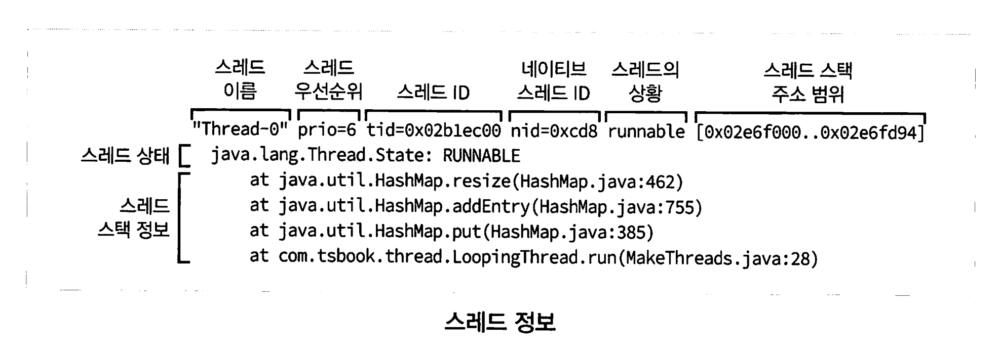
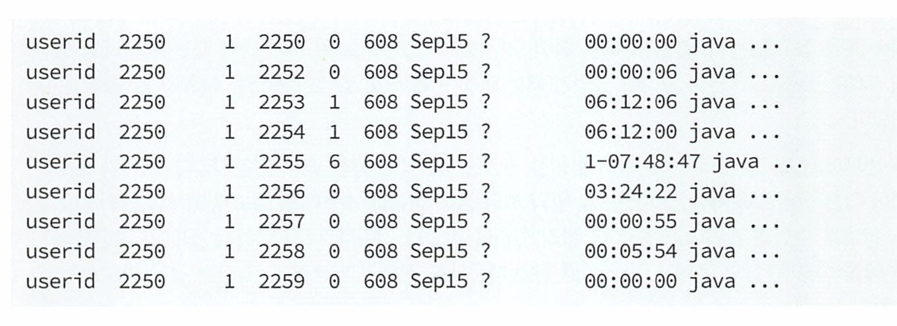
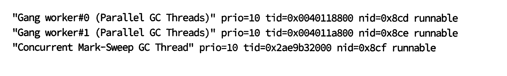
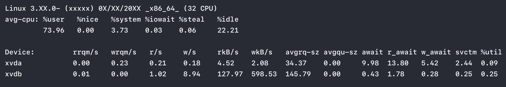

# 자바 트러블 슈팅 

[toc]

책의 구성

- 전반적인 장애의 유형
- 스레드의 정보로 장애를 분석하는 법
- 메모리의 정보로 장애를 분석하는 법
- 리눅스를 기준으로 한 각종 명령어를 이용하여 장애를 분석하는 법
- scouter의 설치부터 책 곳곳에 숨어 있는 scouter 활용법


# 오라클의 트러블 슈팅 가이드

https://docs.oracle.com/en/java/javase/17/troubleshoot/#Java-Platform%2C-Standard-Edition


# **CHAPTER 1 자바 기반의 시스템에서 발생할 수 있는 문제들 3**

## 발생 가능한 병목 지점들 10

애플리케이션 관점

- 웹 서버
- 웹 애플리케이션 서버(이하 WAS)
- 각종 API 서버
- DB 서버
- 데몬 프로그램
- 레거시(Legacy) 시스템(이하 레거시)
- 기타 생각지도 못한 서버

서버의 구성요소

- CPU
- 네트워크
- 메모리

- 디스크 및 파일 서버
- OS 커널


# CHAPTER 2 scouter 개요 및 설치 15

## APM 15

애플리케이션 성능 모니터링 및 관리 도구.

* 외국 APM - dynatrace, AppDynamics, New Relic, Instana

국산 APM

* whatap - https://www.whatap.io/ko
  * 요금제 : https://www.whatap.io/ko/pricing/
* 핀포인트 - 네이버 오픈소스. 
  * https://github.com/pinpoint-apm/pinpoint
  * 장점 : 
  * 전반적인 시스템의 연계 현황을 한눈에 확인할 수 있다.
  * 하나의 요청을 여러 서버에 걸쳐 처리할 경우, 마치 하나의 서버에서 처리한 것 처럼 프로파일링된 결과를 확인할 수 있다.
  * 웹 기반의 U로 어디서나 쉽게 상황을 모니터링할 수 있다.
  * 단점
  * 실시간 모니터링 기능이 매우 약하다.
  * 화면을 사용자의 입맛대로 수정할 수 있는 기능이 존재하지 않는다.
  * 초당 처리량이 매우 많을 경우(하나의 인스턴스에서 약 1,000TPS 이상 처리할 경우)
     성능 저하 및 문제가 발생할 수 있다. 따라서 적절한 샘플링 기능을 사용하여 운영 중인 서비스에 부하가 가지 않도록 하는 것을 권장한다.

* 스카우터 - LG산 오픈소스 
  * https://github.com/scouter-project/scouter
  * UI : https://github.com/scouter-contrib/scouter-paper (관리가 안되고 있네.)


| ***모듈\***            | ***설명\***                                                  |
| ---------------------- | ------------------------------------------------------------ |
| **Scouter Agent**      | 모니터링 대상 시스템에 구성되며, 각종 성능 정보를 수집, 스카우터 서버로 전달하는 역할 |
| **Scouter Collector**  | 에이전트로부터 실시간 모니터링 정보를 수집, 가공하며 실시간 대시보드 제공 및 통계정보 관리, 장애/에러 경보 등 관리에 필요한 각종 기능을 수행 |
| **Scouter Repository** | 서버에서 가공된 데이터는 데이터 형태에 따라 DB, File 시스템에 저장되며 이러한 데이터를 통해 시스템 분석에 필요한 각종 데이터 확보 |
| **Scouter Client**     | 이클립스 기반의 클라이언트를 통해 시스템 모니터링 및 스카우터에 대한 관리를 수행 |

기본 포트는 6100번.

서버 <-> 클라 모두 TCP 포트를 열어줘야 하며, 기본은 6100번. 변경 가능하다. 


## scouter 데모 프로그램 설치하기 23

https://github.com/scouter-project/scouter/blob/master/scouter.document/main/Quick-Start_kr.md

- 이거 자바 버전 호환 안되서 안됌.

## scouter 다운로드하기 28

* https://github.com/scouter-project/scouter/releases

all-X.Y.Z 다운로드


클라이언트도 다운로드 해야한다.

[scouter.client.product-macosx.cocoa.aarch64.tar.gz](https://github.com/scouter-project/scouter/releases/download/v2.20.0/scouter.client.product-macosx.cocoa.aarch64.tar.gz)


## scouter 서버 설정하기 29

서버 실행

```
cd server
./startup.sh
```


스카우터 Client 다운로드시 맥에서 에러가 난다면

```
‘scouter.client’은(는) 손상되었기 때문에 열 수 없습니다. 해당 항목을 휴지통으로 이동해야 합니다
```

다음 명령어 입력

```
xattr -cr scouter.client.app
```

* 비밀번호(password) : admin 이다

## scouter 호스트 에이전트 설정하기 35

agent : 데이터를 취합해서 수집 서버로 전달하는 역할을 함.

3가지가 있다.

- 호스트 에이전트
- 자바 에이전트
- 배치 에이전트

### 호스트 에이전트

서버의 리소스 상태 데이터들을 취합하여 전송한다

* CPU, 메모리, 네트워크, 디스크

스카우터 설정 파일 수정하는법 

* conf 디렉토리 및 scouter.conf 설정 파일 수정.

* scouter/agent.host/conf 아래의 scouter.conf 설정 파일을 수정한다

필수 호스트 에이전트 설정사항

```
net_collector_ip=127.0.0.1 # 수집 서버의 IP 지정 
net_collector_udp_port=6100 # 수집 서버의 TCP 포트를 지정 
net_collector_tcp_port=6100 # 수집 서버의 UDP 포트를 지정 
```

## scouter 자바 에이전트 설정하기 - 기초 36


### 자바의 ClassFileTransformer 38

ClassFileTransformer는 모든 모니터링도구들의 핵심.

transform()메서드에 클래스가 바이트 배열로 넘어오면 필요 내용 수정 후 JVM에 바이트 배열로 돌려준다.

# scouter 클라이언트의 종류 45

웹 클라이언트 : https://github.com/scouter-contrib/scouter-paper  (관리 안됌)


## 수집 서버 추가/삭제하기 48


## Tomcat/Java 필수 그래프 목록 58

- GC Count
- GC Time
- Heap Used $ & Heap Memory

- TPS
- Active Service EQ
- Active Speed
- XLog

## 서버 필수 그래프 목록 58

- CPU(무조건 필수)
- Memory
- Network TX Bytes/RX Bytes
- Swap

# **CHAPTER 6 scouter 서버/에이전트 플러그인 89**
서버 플러그인의 종류 89

* https://github.com/scouter-project/scouter/blob/master/scouter.document/main/Plugin-Guide_kr.md

스크립팅 플러그인 : scouter 서버에 저장이 되기전 호출. 운영중 상황에서도 변경 후 저장하면 바로 반영. 그러나 텍스트파일로 저장되어 관리 불편 

빌트인 플러그인  : jar 파일을 통해 필요한 기능 추가 


# WAS의 적절한 스레드 개수는 몇 개일까? 107

시스템 A의 상위 80% URL 추출하여 성능 테스트한 결과

: 최대 초당 처리량 TPS : 200건

몇개 스레드가 좋을까?

ex) 80, 50, 200

책에서 나온 설명은 애매하다.

1. **최대 처리량 (TPS)**: 시스템이 초당 처리할 수 있는 최대 건수는 200건
2. **스레드 별 처리 속도**: 각 스레드가 처리할 수 있는 요청의 수를 추정해야 한다. 이는 서버의 응답 시간, I/O 대기 시간, 네트워크 지연 등에 의해 영향을 받습니다.
3. **안정성과 여유 고려**: 실제 운영 환경에서는 예상치 못한 부하 증가, 장애 대응, 리소스 여유 등을 고려해야 한다

예를 들어, 성능 테스트 결과 한 스레드가 평균적으로 초당 4개의 요청을 처리할 수 있다면, 초당 200건을 처리하기 위해서는 최소 50개의 스레드가 필요하다.

## 스레드에서 발생하는 문제 중 가장 대표적인 것은? 108

- **레이스 컨디션(Race Condition)**: 두 개 이상의 스레드가 공유 자원에 접근하려 할 때, 그 실행 순서에 따라 결과가 달라지는 상황.
- **데드록(Deadlock)**: 두 개 이상의 스레드가 서로가 보유한 자원의 해제를 기다리며 영원히 대기 상태에 빠지는 상황.
- **스타베이션(Starvation)**: 특정 스레드가 자원에 접근하지 못하고 무한히 대기 상태에 머무르는 경우.
- **라이브 록(Live Lock)**: 스레드들이 서로를 방해하지 않으려고 계속 상태를 변경하지만, 결국 아무런 진행도 이루어지지 않는 상황.
- **다른 형태의 예측 불가능한 오류(Nondeterminism)**: 스레드의 실행 순서나 타이밍에 따라 결과가 달라지는 모든 상황을 포괄하는 용어.

## 록(락, Lock) 경합을 피하는 방법 113

1. 코드가 아닌 데이터를 보호하라 -> 함수를 큰 Lock으로 잡는다
2. Lock 사용 부분에서는 계산을 비싸게 하지말자 -> 정렬, for 등
3. atomic 연산을 사용
4. 읽기는 Lock없이 쓰기만 Lock 사용
5. 읽기전용 데이터 사용 -> 불변변수 
6. 지역변수 또는 쓰레드로컬 사용


# **CHAPTER 9 스레드 단면 잘라 놓기 119(스레드 덤프)**
스레드 덤프 뜨는 명령어

1. **Java 프로세스 ID 찾기**

```
jps 
또는
jps -v
```

2. 프로세스 PID를 얻고 jstack으로 생성

``` 
jstack -l 12345
```

* `-l` 옵션은 락 정보를 포함한 자세한 스레드 덤프를 생성


 Unix 계열 시스템에서, 프로세스 ID(PID)의 Java 프로세스에 대한 스레드 덤프를 생성

```
kill -3 [PID]
```


OutOfMemoryError가 발생했을 때 자동으로 덤프를 생성하는 명령어

### 1. Heap Dump 자동 생성 (OutOfMemoryError 발생 시)

```
bashCopy code
java -XX:+HeapDumpOnOutOfMemoryError -XX:HeapDumpPath=/path/to/heapdump.hprof -jar your-application.jar
```

이 명령은 OutOfMemoryError가 발생할 때 힙 덤프를 `/path/to/heapdump.hprof` 경로에 생성

### 2. OutOfMemoryError 발생 시 특정 명령 실행 (예: 스레드 덤프 생성)

```
java -XX:OnOutOfMemoryError="jstack -l %p > /path/to/threaddump.txt" -jar your-application.jar
```

이 명령은 OutOfMemoryError가 발생했을 때 `jstack -l %p` 명령을 실행하여 스레드 덤프를 `/path/to/threaddump.txt`에 저장 여기서 `%p`는 현재 Java 프로세스의 PID

### 3. OutOfMemoryError 발생 시 JVM 강제 종료

```
java -XX:+ExitOnOutOfMemoryError -jar your-application.jar
```

이 명령은 OutOfMemoryError가 발생했을 때 JVM을 즉시 종료

```
java -XX:+CrashOnOutOfMemoryError -jar your-application.jar
```

이 명령은 OutOfMemoryError가 발생했을 때 JVM을 강제로 크래시


## 스레드 단면은 언제 자를까?

다음의 경우에는 스레드 단면을 분석하면 매우 빨리 원인을 찾을 수 있다.

- 모든 시스템이 응답이 없을 때(전문가들은 시스템 행이 걸렸다고 말한다)
- 사용자 수가 많지도 않은데, 시스템의 CPU 사용량이 떨어지지않을 때
- 특정 애플리케이션을 수행했는데, 전혀 응답이 없을 때
- 기타 여러 가지 상황에서 시스템이 내 마음대로 작동하지 않을 때


## 스레드 덤프 데이터들

1. 스레드 단면 생성 시간 정보
2. JVM에 대한 정보
3. 각 스레드의 스택을 포함한 다양한 정보
4. 데드록에 대한 정보
5. 힙 영역의 사용 현황

**스레드 단면 생성 시간 정보**

20XX-XX-27 09:14:02

말 그대로 단면을 생성한 날짜와 시간 정보를 출력한다.

**JVM에 대한 정보**

Full thread dump Java HotSpot (TM) Client VM (11.2-b01 mixed mode, sharing) :

JVM에 대한 종류와 상태, 버전 등에 대한 정보를 출력한다.

**각 스레드의 스택을 포함한 다양한 정보**



* at은 스레드의 스택 정보

첫줄에 있는 항목

- **Thread Name**(스레드 이름, Thread-0): 스레드의 이름이며, 이 이름은 스레드 객체 생성 시 지정할 수 있 다.
- ID (식별자(여긴없지만 #1 ...#n)): 데몬 스레드일 경우에만 표시된다(daemon이라고 표시된다).
- Thread Priority스레드 우선순위(prio): 스레드의 우선순위를 숫자로 나타낸다(가장 낮은 것이 1, 높은 것이 10이다).
- 스레드 ID(tid):다른 스레드와 구분되는 스레드의 ID를 나타낸다. 정확하게 말하 면, 해당 스레드가 점유하는 메모리의 주소를 표시한다.
- 네이티브 스레드 ID(nid VM 내부(JNI 코드)에서 관리하는 Native Thread 구조체의 포인터 주소): OS에서 관리하는 스레드의 ID를 나타낸다.
- 스레드의 상태: 스레드 단면을 생성할 때 해당 스레드가 하고 있던 작업에 대한 설명을 표시해 준다.
- 주소 범위: 스레드의 스택 영역의 예상된 주소 범위다.

스레드의 상태?

| 스레드 상태   | 설명                                                         |
| ------------- | ------------------------------------------------------------ |
| NEW           | 스레드가 아직 시작되지 않은 상태                             |
| RUNNABLE      | 스레드가 수행 중인 상태                                      |
| BLOCKED       | 스레드가 잠겨 있어 풀리기를 기다리는 상태                    |
| WAITING       | 다른 스레드가 특정 작업을 수행하여 깨울 때까지 무한정 기다리는 상태 |
| TIMED WAITING | 다른 스레드가 특정 작업을 수행하여 깨울 때까지 지정된 시간만큼 기다리고 있는 상태 |
| TERMINATED    | 스레드가 종료된 상태                                         |

* 문제가 될만한 상태는 RUNNABLE과 BLOCKED상태.

* WATING은 대부분 pool에 있는 상태이다.

`-XX:+PrintConcurrentLocks` 및 `-XX:+PrintClassHistogram`은 Java 가상 머신(JVM)의 진단 및 디버깅 관련 옵션

* `-XX:+PrintConcurrentLocks`: 이 옵션은 JVM이 동시성 관련 잠금(Concurrent Locks)에 대한 정보를 출력
* `-XX:+PrintClassHistogram`: 이 옵션은 프로그램 실행 중 클래스 히스토그램을 출력. JVM 힙 메모리 내의 객체 및 클래스별 인스턴스 수와 메모리 사용량을 보여준다. 

```
java -XX:+PrintConcurrentLocks -XX:+PrintClassHistogram MyJavaProgram
```


**데드록에 대한 정보**

데드록이 발생했을 경우에만 출력되며, 다음과 같은 형식으로 제공된다(이 예는 앞장 에서 알아본 오라클의 데드록 샘플을 수행했을 때 발생한 데드록의 덤프 결과다).


**힙 영역의 사용 현황** 


힙 영역의 사용 현황은 GC 방식에 따라서 보여지는 영역의 이름이 조금씩 다르며, 각 영역별로 한 줄씩 출력된다. 각 줄은 순서대로 다음과 같은 내용으로 이루어져 있다.

1. 영역 이름
2. 영역에 할당된 메모리 크기
3. 메모리 사용량(혹은 비율)
4. 메모리의 영역 정보(range)

## 스레드 단면 파일로 남기기 135

```sh
java MakeThreads > MakeThreadResult.txt
```

tail 명령어로 라이브하게 볼수도 있다. 

```sh
tail -f MakeThreadResult.txt
```


# 스레드 단면(덤프)으로 어떤 문제를 확인할 수 있을까? 154

| 구분                   | 장애                                                     | 확인 가능 여부 |
| ---------------------- | -------------------------------------------------------- | -------------- |
| 시스템이 느려요        | 전체적인 시스템이 항상 느린 경우                         | O              |
|                        | 특정 기능(화면)이 느린 경우                              | O              |
|                        | 특정 시간대(기간)에 전체 애플리케이션이 느린 경우        | O              |
|                        | 특정 시간대(기간)에 특정 애플리케이션이 느린 경우        | O              |
|                        | 특정 기능(화면)이 점점 느려질 경우                       | O              |
|                        | 특정 사용자만 애플리케이션이 느린 경우                   | O              |
| 시스템이 응답이 없어요 | 모든 애플리케이션이 응답하지 않는 경우                   | O              |
|                        | 특정 기능이 응답하지 않는 경우                           | O              |
| 예외가 계속 발생해요   | 모든 사용자가 특정 기능을 수행하면 예외가 발생하는 경우  | △              |
|                        | 특정 사용자의 특정 기능에서만 예외가 발생하는 경우       | △              |
|                        | 특정 시간대에만 전체 애플리케이션에 예외가 발생하는 경우 | △              |
|                        | 특정 시간대에 특정 애플리케이션에 예외가 발생하는 경우   | △              |
| 시스템이 죽어요        | 시스템의 프로세스가 죽는 경우                            | X              |

시스템이 죽는 경우 스레드 덤프를 하고싶다면 다음 옵션 지정. 

```
java -XX:OnError="kill -3 %p" -jar your-application.jar
```

# 시스템이 느릴 때도 스레드와 관련이 있을까? 156


다음과 같은 순서대로 점검해보자.

1. CPU, 메모리와 같은 리소스 사용량 점검
2. 외부와 연동하는 리소스 사용량 점검
3. WAS 메모리 및 스레드 설정 및 사용량 점검
4. Web 서버 설정 점검
5. OS 설정 점검
6. 스레드 상태 점검
7. 메모리 상태 점검


사실 대부분 웹 애플리케이션이 속도가 느린 원인중 대부분은 DB 쿼리가 느려서이다.

# 시스템 응답이 없을 때에는 스레드 단면이 가장 효과적이다 157

JVM 힙 메모리가 부족해서 시스템이 응답하지 않을수도 있다.

* 메모리가 부족할 경우 GC 쓰레드가 RUNNABLE이고 CPU 코어를 하나 이상 점유하고 나머지 모든 스레드는 대기중일 수 있다.

```
스레드 실행 중인 상태 -> CPU 코어 하나가 100% 이상 사용 -> 메모리 상태 모니터링
```

1. **스레드 단면 주기적 수집**: 스레드 단면(thread dump)을 주기적으로 떠서 분석 준비
   * 스레드 단면을 뜰 때마다 `ps -Lf <pid>` 명령어를 함께 사용하여 프로세스의 상태를 확인

```
jstack -l <pid> > thread-dump-$(date +%F_%T).txt
```

2. **CPU 사용량이 증가하는 스레드 점검**: 스레드 단면과 함께 수집한 데이터를 통해 CPU 사용 시간이 지속해서 증가하는 스레드를 찾아내고, 해당 스레드의 아이디를 확인

3. 해당 스레드가 GC 관련 스레드라면 메모리 부족 일 확률 높음 jstat으로 메모리 사용량 확인 

```
jstat -gcutil <pid> 5000ms
```

* 이 명령은 5초(5000ms) 간격으로 가비지 컬렉션(GC) 통계를 출력
* 만약 GC 관련 스레드에서 문제가 발생했다면, `-XX:+HeapDumpOnOutOfMemoryError` 옵션을 사용하여 메모리 단면(heap dump)을 자동으로 수집

4. 무한 루프에 빠지지는 않앗는지 확인 

> 주의할점 jstats을 사용하면 JVM이 중단되므로 유의해야 한다.  

# 사례 하나. CPU 사용량이 갑자기 올라가서 안 내려와요 160
하나의 CPU 코어 사용량이 급증하는 원인은 여러 가지다. 

- 애플리케이션 로직상의 잘못으로 무한 루프에 빠졌을 때
- XML 라이브러리의 문제로 특수문자가 들어왔을 때 parsing을 제대로 못 하고 무한 루프에 빠졌을 때
- 정규 표현식을 잘못 사용하여 무한 루프에 빠졌을 때
- 메모리가 부족하여 GC 관련 스레드만 반복적으로 수행하고 있을 때

**접근 방법**

1. 장애가 발생한 장비에서 스레드 덤프를 30초나 1분 간격으로 5~10회 정도생성한다.
   * kill -3 pid
2. 스레드 덤프를 생성할 때 동시에 각 스레드별 사용 시간에 대한 덤프도생성한다.
   * ps -Lf -p pid
3. 스레드 단면 분석 도구로 스레드 덤프 파일을 연다.
4. ps 명령어를 사용하여 수집한 덤프에서 수행 시간이 가장 오래 걸린 스레드를 확인한다(조금 더 정확하게 말하면, 오랫동안 수행했으면서 매번 덤프를 생성할 때마다 그 시간이 증가한 스레드를 찾는다).
5. 스레드 단면 분석 도구에서 해당 스레드에서 어떤 작업을 하고 있는지 스택
    정보를 확인해 본다.
6. 결과를 공유한다.

# 사례 둘. 스레드 풀의 스레드 개수가 계속 증가해요 162

WAS 스레드 풀 갯수 1024개

10대 장비중 1대만 이 현상 발생

**접근 방법**

스레드 덤프를 뜬다.

* 한번만 안됌. 주기적으로 여러번 떠야함


원인

* java.io.File 메서드들이 락이 걸려있음 


# 사례 셋. 시스템 응답이 없어요 165

스레드 덤프와 ps -Lf 명령어를 사용하여 어떤 스레드가 CPU를 계속 사용하고 있는지 확인부터 한다.



* 2255라는 스레드가 매우 오랫동안 수행됌. 

스레드 단면 분 석 도구를 열어 Native ID를 확인해 보면 된다



* 스레드 명을 보니 GC 쓰레드. 즉 메모리 릭이다. 


# CHAPTER 12 메모리 때문에 발생할 수 있는 문제들 171

## 자바의 메모리 영역 171

- pc(program counter) 레지스터: 스레드별 보유 : 각 스레드가 현재 실행 중인 JVM 명령어의 위치를 가리키는 주소를 가짐
- JVM 스택: 스레드별 보유 : 지역변수, 부분결과, 메서드 호출 및 리턴 정보 
- 힙(Heap): 대부분의 데이터가 저장되는 일반적인 저장소 : 인스턴스와 배열
- 메서드 영역(Method area) : 모든 스레드가 공유하며 각 클래스의 구조 정보 저장. 상수 풀, 필드, 메서드 데이터, 등
- 런타임 상수 풀(Runtime Constant Pool): 메서드 영역에 할당되어 있음 : 상수 
- 네이티브 메서드 스택(Native Method stack) : 네이티브 언어 타 언어 스택 정보 저장


# OutOfMemoryError는 언제 발생할까? 175

OutOfMemoryError는 java.lang.VirtualMachineError 클래스의 서브클래스. 

다음과 같은 경우에 발생.

- 가비지 컬렉터가 새로운 객체를 생성할 공간을 더 이상 만들어주지 못하고, 더 이상 힙 영역의 메모리가 증가될 수 없을 때
- 네이티브 라이브러리 코드에서 스왑(Swap) 영역이 부족하여, 더 이상 네이티브 할당(allocation)을 할 수 없을 때(이러한 경우는 자주 발생하지 않는다)

OutOfMemoryError의 로그

- Exception in thread "main": java. lang.OutOfMemoryError: Java heap space
- Exception in thread "main": java lang.OutOfMemoryError: Metaspace
- Exception in thread "main": java. lang. OutOfMemoryError: Requested array size exceeds VM limit
- Exception in thread "main": java. lang. OutOfMemoryError: request (size) bytes for (reason). Out of swap space?
- Exception in thread "main": java. lang.OutOfMemoryError: (reason) (stacktrace) (Native method)

## Exception in thread "main": java. lang.OutOfMemoryError: Java heap space

힙 영역에 더이상 객체를 생성하기 어려울대 출력된다.

다음과 같은 상황에서 출력될 수 있다.

- **메모리 크기를 너무 적게 잡아 놓거나, 아예 메모리 크기를 지정하지 않은 경우**
  -  자바 실행 옵션 중 -Xms는 JVM 메모리의 최소 크기를, Xmx는 JVM의 최대 메모 리크기를 지정한다. 
  - 예를 들어, 최소 최대 크기를 512MB로 지정하고 싶으면 Xms512m -Xmx512m으로 지정하면 된다.

- **오래된 객체들이 계속 참조되고 있어서 GC가 되지 않는 경우:** 
  - static을 잘못 사용하는 경우나 애플리케이션이 의도치 않게 객체를 지속해서 참조할 경우 문제가 발생 할 수 있다. 이것이 바로 메모리 릭이 발생하는 경우다.
- **finalize 메서드를 개발자가 개발한 클래스에 구현해 놓은 경우**: 
  - GC가 발생하기 전에 GC가 되어야 하는 객체들은 큐에 쌓이도록 되어 있다. 
  - 그래서 오라클의 JVM에서는 자바의 GC를 처리하기 위한 데몬 스레드가 존재하며, 이 스레드에서 쓰레기 객체들을 처리한다. 이 스레드가 청소할 객체들을 처리하기 전에 finalize 큐에 너무 많은 객체가 있으면 발생한다.
- **스레드의 우선순위를 너무 높일 경우:** 개발된 프로그램의 스레드 우선순위를 너무 높게 지정해 놓으면, GC를 처리하는 속도보다 우선순위가 높은 스레드를 메모리에 생성하는 속도가 더 빨라 문제가 발생할 수 있다.

* **큰 덩어리의 객체가 여러 개 있을 경우**: 예를 들어, 한번 호출되면 100MB(Mega bytes)의 메모리를 점유하는 화면이 있다고 생각해 보자. 그 서버를 256MB로 설 정했을 때, 동시에 세 개의 요청을 그 화면에서 수행할 경우는 어떻게 될까? 그 럴 때에도 마찬가지로 힙 영역에 outofMemoryError가 발생한다.

## Exception in thread "main": java lang.OutOfMemoryError: Metaspace

보통 너 무 많은 클래스가 해당 자바 프로세스에 로딩될 경우 이 메시지가 나타날 수 있다.

이 경우 현재 사용하고 있는 메타 영역의 크기보다 크게 지정하면 되며, 관련옵션은 

`-XX:MaxMetaspacesize=128m`를 사용하면 된다.

여기서 128m은 128MB를 의미한다.

# Exception in thread "main": java. lang. OutOfMemoryError: Requested array size exceeds VM limit

배열의 크기가 힙 영역의 크기보다 크게 지정되었을 때 발생. 

주로 소스코드 오류이다. 

# Exception in thread "main": java. lang. OutOfMemoryError: request (size) bytes for (reason). Out of swap space?

Native 힙 영역 즉 OS의 Swap메모리까지 메모리가 부족하면 발생한다.

즉.

- 개발된 자바 애플리케이션에서 호출하는 네이티브 메서드에서 메모리를 반환하지 않는 경우
- 다른 애플리케이션에서 메모리를 반환하지 않는 경우

이 메시지가 나타나면, 치명 오류 처리 메커니즘이 JVM에서 작동하여 치명 에러 파일을 발생시킨다. 그 파일에는 에러가 발생할 당시의 스레드, 프로세스, 시스템에 대한 상세한 정보가 들어 있다.

# Exception in thread "main": java. lang.OutOfMemoryError: (reason) (stacktrace) (Native method)

네이티브 힙 영역에 메모리를 할당할때 발생하는 메시지.

이경우나 JNI나 네이티브 코드에서 발생하므로 자주 마주할일이 없다.

# 메모리 릭의 세 종류 178

* 수평적 메모리 릭  : 하나의 객체에서 매우 많은 객체를 참조하는 경우. ArrayList나 배열에서 객체를 계속 참조하고 놓아주지 않을 때 
* 수직적 메모리 릭 : 각 객체들이 링크로 연결되었을경우. 대표적으로 LinkedList 사용시 
* 대각선 형태의 메모리 릭 : 복합적으로 메모리 점유시 발생. 
  * 
  * https://stackify.com/java-memory-leaks-solutions/ 꼭 읽어보길 추천 


# OutOfMemoryError 이외의 메모리 문제는 없을까? 180

Crash가 발생하는 경우이다.

보통 네이티브 힙에 메모리 할당이 실패하여 발생한다. 

또한 너무 찾은 FULL GC가 발생하면 성능에 많은 영향을 끼친다. 

가장 먼저 해야하는작업은 GC튜닝보다 GC를 많이 발생 시키지 않도록 한다.

다음과 같다.

- 임시 메모리의 사용을 최소화
- 객체의 재사용
- XML 처리 시 메모리를 많이 점유하는 DOM보다 SAX를 사용
- 너무 많은 데이터를 한 번에 보여주는 비즈니스 로직 제거
- 기타 프로파일링을 통하여 임시 메모리를 많이 생성하는 부분 제거

jstat을 이용하여 메모리를 얼마나 사용하는지 확인부터 하자.

```
jstat [options] <pid> [<interval> [<count>]]
```

- `options`: `jstat`의 여러 옵션 중 하나를 선택하여 사용합니다.
- `<pid>`: 대상 Java 프로세스의 프로세스 ID (PID)를 지정합니다.
- `<interval>` (선택 사항): 측정 간격을 지정합니다. 초 단위로 지정하며 기본값은 1초입니다.
- `<count>` (선택 사항): 측정 횟수를 지정합니다. 기본적으로 무한대로 설정되며 특정 횟수로 제한하려면 이 값을 지정합니다.

다음 명령은 PID가 12345인 Java 프로세스의 힙 메모리 사용 정보를 2초 간격으로 총 5번 조회합니다.

```
jstat -gc 12345 2 5
```

- **-gc**: 가비지 컬렉션 통계 정보를 보여줍니다. 예를 들어, `-gcutil` 옵션을 사용하면 힙 메모리 사용률을 보여줍니다.

  ```
  jstat -gcutil <pid> <interval> <count>
  ```

- **-class**: 클래스 로딩 통계를 보여줍니다.

  ```
  jstat -class <pid> <interval> <count>
  ```

- **-compiler**: JIT 컴파일러 통계를 보여줍니다.

  ```
  jstat -compiler <pid> <interval> <count>
  ```

- **-gcnew, -gcold**: Young과 Old 영역의 가비지 컬렉션 통계를 볼 수 있습니다.

  ```
  jstat -gcnew <pid> <interval> <count>
  jstat -gcold <pid> <interval> <count>
  ```

- **-gccapacity**: 가비지 컬렉션 힙 용량 정보를 보여줍니다.

  ```
  jstat -gccapacity <pid> <interval> <count>
  ```

**GC가 얼마나 자주 일어나는지를 확인한 이후에 GC 튜닝작업을 해야 한다.**

* 근본적 원인을 없애지 않은 상황에서 해봤짜 아무런 의미가 없다. 


**CHAPTER 13 메모리 단면 잘라 놓기 183** (힙 덤프)

메모리 부족 확인방법.

- jstat으로 확인
- WAS의 모니터링 콘솔이 있을 경우 콘솔의 메모리 사용량에서 확인
- Java Visual VM이나 JConsole과 같은 IMX 기반의 모니터링 도구로 확인
- scouter와 같은 APM이 설치되어 있으면 APM으로 확인
- verbosegc 옵션으로 확인

예를 들어 프로세스 id가 99037인 프로세스를 확인 하려면 다음과 같이 사용하면 된다.

``` 
jps
24384 RemoteJdbcServer
98961
96945 KotlinCompileDaemon
99042 Launcher
99752 Jps
10827
99037 ApiApplicationKt // 내가 실행시킨 SpringBoot 애플리케이션
8252 Main
64141 Boot

jstat -gcutil 99037 ls // 1초마다 출력
```

결과는 다음과 같다

```
jstat -gcutil 99037 1s
S0     S1     E      O      M     CCS    YGC     YGCT    FGC    FGCT    CGC    CGCT     GCT
0.00   84.52  50.00  54.52  99.41  98.05  19     0.12    0      0.00   10     0.01     0.13
0.00   84.52  50.00  54.52  99.41  98.05  19     0.12    0      0.00   10     0.01     0.13
0.00   84.52  50.00  54.52  99.41  98.05  19     0.12    0      0.00   10     0.01     0.13
0.00   84.52  50.00  54.52  99.41  98.05  19     0.12    0      0.00   10     0.01     0.13
```

- S0: Survivor 0 영역의 사용률. 이 영역은 Young 세대의 일부로, 새로 생성된 객체 중 일부가 여기에 할당
- S1: Survivor 1 영역의 사용률. 이 영역 역시 Young 세대의 일부
- E: Eden 영역의 사용률. 이 영역은 Young 세대에서 객체가 최초로 할당되는 곳
- O: Old 영역 또는 Tenured 영역의 사용률. 이 영역은 오랫동안 살아남은 객체가 이동하는 곳
- M: Metaspace 영역 또는 Perm 영역의 사용률. 이 영역은 클래스 메타데이터와 클래스 로딩 정보를 저장
- CCS: Compressed Class Space 영역의 사용률. 이 영역은 클래스 정보를 압축하여 저장
- YGC: Young 세대에서의 가비지 컬렉션 횟수.
- YGCT: Young 세대에서의 가비지 컬렉션 시간(초).
- FGC: Old 세대 또는 Full 세대에서의 가비지 컬렉션 횟수.
- FGCT: Old 세대 또는 Full 세대에서의 가비지 컬렉션 시간(초).
- CGC: Concurrent 가비지 컬렉션 횟수. (가비지 컬렉션의 일부가 병행으로 수행될 때 발생)
- CGCT: Concurrent 가비지 컬렉션 시간(초).
- GCT: 전체 가비지 컬렉션 시간(초).

Tenured 영역(보통 Old 영역이라고 부르는 영역)의 메모리 사 용량은 애플리케이션을 사용하고 있는 동안에는 계속 증가하는 것이 기본이다.

* 일반적으로 Old 영역 메모리가 증가한다고 잘못되는게 아니다.

* TPS 100~1천이 넘으면 FullGC가 자주 발생하는것은 당연한 현상이다. 

**힙 덤프를 아무때나 뜨면 안되는 이유.** 

- 덤프 파일을 생성하는 동안 서비스가 불가능한 상황이 된다.
- 덤프 생성 시 너무 많은 시간이 소요된다.
- 큰 파일(대부분 점유하고 있는 메모리 크기만큼의 파일)이 생성된다.

이러한 힙 덤프는 다음과 같이 상황을 구분하여 생성할 수 있다.

- 자바 프로세스 실행 시 옵션에 포함하여 자동 파일 생성
- 실행 옵션과 상관없이 명령어를 사용하여 파일 생성


## 힙덤프 생성 - 1. jmap으로 생성하기


1. java 작성

```java
public class HoldMemory {
	private final static HashMap<String, String> leakMap = new HashMap<>();
	private final static String STORE_DATA = "STORE DATA";

	public static void main(String[] args) {
		HoldMemory holdMemory = new HoldMemory();
		holdMemory.addObject(50000);
		try {
			System.out.println("Holding memory. It will be stopped after 10 min.");
			Thread.sleep(60000); // Wait for 10 min
		} catch (Exception e) {
			e.printStackTrace();

		}
	}

	public void addObject(int objectCount) {
		int mapSize = leakMap.size();
		int maxCount = mapSize + objectCount;
		for (int loop = mapSize; loop < maxCount; loop++) {
			leakMap.put(STORE_DATA + loop, STORE_DATA);
		}

	}
}
```

2 실행

```
javac HoldMemory.java
java holdMemory
```

3. -finalizerinfo 옵션

```
jmap -finalizerinfo [PID]
```

파이널라이저는 Java 객체의 소멸자 메서드로, 객체가 가비지 컬렉션에 의해 수집되기 직전에 호출되는 메서드입니다. `jmap -finalizerinfo`를 사용하면 파이널라이저 스레드와 파이널라이저 대기열에 대한 정보가 포함된 힙 덤프 파일을 생성

```
jmap -finalizerinfo 50827
No instances waiting for finalization found
```

* GC 수행 대기 객체가 없다는 소리.

4. -clstats 옵션

```
jmap -clstats 60179
ClassLoader         Parent              CLD*               Classes   ChunkSz   BlockSz  Type
0x0000000800084120  0x00000008000863f8  0x000000013281eab0       1       768       387  jdk.internal.loader.ClassLoaders$AppClassLoader
0x0000000000000000  0x0000000000000000  0x00000001329170d0     581    557056     21499  <boot class loader>
                                                                 6      2432      1750   + hidden classes
0x00000008000863f8  0x0000000000000000  0x000000013281d4f0       0         0         0  jdk.internal.loader.ClassLoaders$PlatformClassLoader
Total = 3                                                      588    560256     23636
ChunkSz: Total size of all allocated metaspace chunks
BlockSz: Total size of all allocated metaspace blocks (each chunk has several blocks)
```

JVM)의 클래스 로더(class loader) 통계 정보를 보여주는 명령어 옵션

이 옵션을 사용하면 현재 JVM에서 로드된 클래스의 정보를 요약하고 통계를 제공

5. -histo 옵션

```
jmap -histo 63525

 num     #instances         #bytes  class name (module)
-------------------------------------------------------
   1:           933        4704336  [I (java.base@17.0.5)
   2:         58174        1991032  [B (java.base@17.0.5)
   3:         51000        1632000  java.util.HashMap$Node (java.base@17.0.5)
```

힙(heap) 메모리에 있는 객체의 통계 정보를 보여주는 명령어 옵션

가장 많이 메모리를 점유한 객체부터 데이터를 출력

`-histo:live`로 사용할 경우 살아있는 객체들에 대한 정보만 출력 

1. **객체의 클래스명**: JVM 힙에 로드된 클래스명을 통해 객체의 종류를 확인할 수 있습니다.
2. **객체의 개수**: 각 클래스별로 JVM 힙에 생성된 객체의 개수를 보여줍니다.
3. **객체의 총 메모리 사용량**: 각 클래스별로 JVM 힙에 생성된 객체가 차지하는 총 메모리 사용량을 보여줍니다.


## 힙덤프 생성 - jmap의 -dump 옵션

명령어

```
jmap -dump:format=b,file=<덤프 파일 경로> <대상 JVM 프로세스의 PID>
```

dump 옵션은 다음처럼 하위 옵션을 지정가능하다 

* live : 살아있는 객체만 덤프. 사용법 -dump[live,]
* format=b : 바이너리 포맷 지정
* file=<fileName> : 파일이름

### 자동으로 덤프 생성

```
java -XX:+HeapDumpOnOutOfMemoryError -XX:HeapDumpPath=/경로/힙덤프파일.hprof -jar yourApp.jar
```

`HeapDumpOnOutOfMemoryError는 선택이 아니라 필수다. `


# 힙덤프 분석 
MAT 준비하기 197

https://eclipse.dev/mat/

* m1 다운로드 : [Mac OSX (Mac/Cocoa/AArch64)](https://www.eclipse.org/downloads/download.php?file=/mat/1.15.0/rcp/MemoryAnalyzer-1.15.0.20231206-macosx.cocoa.aarch64.dmg)

> MAT으로 분석시 파일이 있는 디렉터리에 여러 파일이 생성되기 때문에 덤프마다 별도 디렉토리 추천. 

File -> Open Heap Dump 클릭 후 덤프 파일 선택.

분석이 끝나면 Leak Suspect Report 선택 


가장 메모리를 많이 점유한 객체가 Problem Suspect1이라는 타이틀 아래에 존재. 

details 클릭 


Details를 클릭했을 때 화면에 정리되어 나오는 항목들은 다음과 같다.

- **Description**: 해당 객체에 대한 설명
- **Shortest Paths To the Accumulation Point**: 메모리를 점유하고 있는 객체가 가 장 상단에 있고, 그 객체를 생성하고 호출한 객체가 하단에 있는 트리 형태의 목록 목록 목록 
- **Accumulated Objects;** 메모리를 점유하고 있는 객체가 가장 하단에 있고, 그 객체를 생성하고 호출한 객체가 가장 상단에 있는 트리 형태의 목록

가장 왼쪽에 있는 Inspector 창에서는 객체가 선택될 경우 해당 객체에 대한 상세한 정보를 제공한다. 

이곳에서 해당 객체의 주소, 패키지, 부모 클래스, 클래스 로더. 점 유하고 있는 메모리 크기 등을 확인할 수 있다.


## **메인 뷰인 OverView**

**Actions**

각종 세부정보 

*  Dominator Tree: 각 클래스별(클래스 로더 단위)로 점유하고 있는 메모리의 양이가장 많은 클래스부터 트리 형태로 확인할 수 있다.

* Top Consumers: 클래스, 패키지 등의 각종 그룹에 따라서 많은 메모리를 점유 하고 있는 객체를 확인할 수 있다.

*  Duplicate Classes; 여러 클래스 로더에서 중첩되게 로딩한 클래스에 대한 정보 를 확인할 수 있다

**Reports**

각종 보고서를 제공한다.

- Leak suspects: 우리가 처음에 사용한 메모리 릭으로 추정되는 부분을 분석하기 위한 보고서를 제공한다.
- Top Components: 전체 힙 메모리 중에서 1% 이상 되는 모든 컴포넌트에 대한정보를 제공한다

**Step By Step**

* Component Report : 메모리 단면을 오픈하는 방법부터 분석하는 방법까지 도구 설명이 적혀있다.

## 객체 상세 정보 메뉴


* 중앙 작업 화면(원형)에서 각 객체 여러개중 클릭시 하나씩 메뉴가 뜬다.

- List objects: incoming과 outgoing 참조 객체 목록을 보여준다. 여기서 incoming과 outgoing의 차이는 뭘까? 쉽게 생각하면, 이 객체를 호출하는 경로 에 있는 객체들이 incoming이고(쉽게 말하면 얘를 부른 애들), 이 객체가 호출하는 경로에 있는 객체들이 outgoing(얘가 부른 애들)이다.
- Show Objects by Class: incoming과 outgoing 참조 객체를 클래스 단위로 보여
   준다.
- Path to GC Roots: GC Root들을 보여준다.
- Merge Shortest Paths to GC Roots: GC Root로의 가장 짧은 경로를 보여준다.
- Java Basics: 자바의 기본 정보들을 제공하는데, 앞 절에서 설명한 기능으로 연 결되는 기능이 대부분이다.
- Java Collections: Collection에 대한 상세한 정보를 제공한다.
- Leak ldentifications: 앞 절에서 설명한 Component Report나 Top Consumer 화면으로 이동한다.
- Immediate Dominators: 선택한 클래스를 점유하고 있는 모든 객체를 클래스 단위로 제공한다.
- Show Retained Set: 선택한 클래스가 보유하고 있는 객체들의 목록을 보여준다.
- Copy: 선택한 클래스의 주솟값, 클래스 이름, 저장되어 있는 값 등을 클립보드 에 복사하거나 파일로 저장하는 기능을 제공한다.


# 메모리 단면으로 어떤 문제를 확인할 수 있을까? 213

| 구분                   | 문제 유형                                                | 확인 가능 여부 |
| ---------------------- | -------------------------------------------------------- | -------------- |
| 시스템이 느려요        | 전체적인 시스템이 항상 느린 경우                         | O              |
|                        | 특정 기능(화면)이 느린 경우                              | X              |
|                        | 특정 시간대(기간)에 전체 애플리케이션이 느린 경우        | O              |
|                        | 특정 시간대(기간)에 특정 애플리케이션이 느린 경우        | 세모           |
|                        | 특정 기능(화면)이 점점 느려질 경우                       | O              |
|                        | 특정 사용자만 애플리케이션이 느린 경우                   | X              |
| 시스템이 응답이 없어요 | 모든 애플리케이션이 응답하지 않는 경우                   | O              |
|                        | 특정 기능이 응답하지 않는 경우                           | 세모           |
| 예외가 계속 발생해요   | 모든 사용자가 특정 기능을 수행하면 예외가 발생하는 경우  | X              |
|                        | 특정 사용자의 특정 기능에서만 예외가 발생하는 경우       | X              |
|                        | 특정 시간대에만 전체 애플리케이션에 예외가 발생하는 경우 | X              |
|                        | 특정 시간대에 특정 애플리케이션에 예외가 발생하는 경우   | X              |
| 시스템이 죽어요        | 시스템의 프로세스가 죽는 경우                            | O              |

## 애플리케이션의 응답 시간이 메모리 문제로 인해 느린 경우 

- 메모리 크기를 잡지 않거나 너무 작게 잡아 GC가 너무 자주 발생하는 경우
- 임시 메모리를 많이 사용하여 GC가 자주 발생하는 경우

> jstats 을 이용해서 
> 메모리 크기가 문제인 경우 -gccpapacity
> 사용량과 관련 문제인경우 -gcutil 
> 사용

만약 애플리케이션이 응답이 없을 시 메모리 릭이 원인인 경우는 다음의 절차를 따른다.

1. 현재 메모리 사용량을 확인해 본다. 만약 메모리 사용량이 지속해서 95% 이상일 경 우에는 메모리 릭이 문제의 원인일 확률이 매우 높다.
2. 메모리 사용량이 지속해서 높을 경우에는 메모리 단면을 생성한다.
3. 도구를 이용하여 어떤 객체가 죽지 않고 계속 점유되고 있는지를 확인해 본다.

## 시스템 응답이 없어요 218

다음과 같은 절차를 따라 분석하자.

1. 스레드 덤프 확인
2. 각 스레드별 CPU 사용 시간 확인 -> GC 관련 스레드가 원인이라는 것을 파악
3. istat으로 메모리 사용량 확인
4. gcore로 메모리 단면 파일 생성
5. imap으로 파일 변환
6. 메모리 단면 분석


분석시에는jstat을 이용하여 힙 문제인지 파악 후 힙 문제라면 그때 힙 덤프를 뜨는것이 좋다.

1. jstat 확인
2. 스레드 덤프 확인
3. WAS 로그 확인
4. 힙 덤프

# 알리바바 Arthas - 자바 종합 분석 도구

운영 서버에 문제가 생겼을 때 서버 를 재시작하지 않고 문제의 원인을 분석하는 것이 이 도구를 사용하는 가장 큰 목적이다.

https://alibaba.github.io/arthas/

https://github.com/alibaba/arthas

아서스의 주요 기능은 다음과 같다.

- 클래스가 로딩되었는지, 어디에서 로딩되었는지 확인 가능
- 코드가 예상한 대로 실행되는지를 확인하기 위한 클래스 역컴파일 기능
- 클래스 로더의 통계 확인
- 메서드 호출 상세 정보(메서드 매개변수, 리턴값, 예외 등)
- 지정한 메서드가 호출되었을 때의 스택 추적 정보
- 느린 하위 호출을 찾기 위한 메서드 호출 추적
- 메서드 호출 통계(초당 호출량, 응답 시간, 성공률 등)

- 시스템 메트릭, 스레드 상태, GC 통계
- 텔넷과 웹소켓 지원


다운로드

* https://github.com/alibaba/arthas/releases/

* -bin.zip, -doc.zip 파일을 다운로드

실행

```
java -jar arthas-boot.jar
```

실행시 터미널로 분석을 원하는 자바 프로세스를 입력하라고 한다. 

```
Found existing java process, please choose one and input the serial number of the process, eg : 1. Then hit ENTER.
* [1]: 24384 com.intellij.database.remote.RemoteJdbcServer
  [2]: 98961
  [3]: 96945 org.jetbrains.kotlin.daemon.KotlinCompileDaemon
  [4]: 8252 com.intellij.idea.Main
  [5]: 64141 scouter.boot.Boot
```

docs를 살펴보고 원하는 데이터가 있으면 보자. 

# 리눅스 진단 명령어를 알아야 하는 이유 243


https://www.brendangregg.com/linuxperf.html

* 이 엔지니어가 리눅스의 분석 도구를 정리해놓은 이미지


## 60,000밀리초에 리눅스 시스템 분석하기 245

다 명령어이다. 

**uptime** : 서버가 시작한지 얼마나 되는지 확인을 위한 명령어

뒤의 load average가 낮을수록 좋다. 

**dmesg | tail** : 시스템 메시지 확인 명령어

**vmstat 1** : 가상 메모리의 상황을 확인하는 도구


* r : CPU의 RunQueue. 코어개수보다 이 숫자가 많으면 서버가 바쁜 상황
* free : KB 단위의 여유 메모리.
* swap : 디스크 스왑메모리.


**pidstat 1** : 프로세스별 CPU 사용량 확인 명령어


* 코어별 누적값. 16개의 CPU 점유중

**iostat -xz 1** 



I/O 상황 확인 용도로 사용 - r : Read, w: Write

* %util이 60%를 넘어가면 성능이 매우 안좋은것.

**free -m** : 메모리 사용량 확인. 

* free -h는 더 보기좋게 해줌

# 225~ 335 페이지는 리눅스 명령어 관련임 - 유용하니 참고 


# CHAPTER 25 장애 진단은 이렇게 한다 
1. 장애 유형 확인(인터뷰나 메일을 통한 증상 확인)
2. 시스템 기본 정보 확인
3. 각종 데이터를 통한 원인 진단
4. 원인이 발견되었을 경우. 장애 원인 제거 후 확인
5. 진단 결과 보고서 작성(필요할 경우)


## 꼭 필요한 도구들

- 모니터링 도구가 있는 경우
- 각종 로그가 잘 쌓여져 있는 경우


**이슈 대응순서**

1. 원인을 찾아내고 반드시 기록을 남긴다.
2. 내가 찾아낸 원인이 정답이라고 확신하면 안된다. 수정을 가하고 문제점이 다시 발생하지 않는다는 확인이 될떄까지는. 
3. 여기가 문제네요 x -> 여기가 의심이 되는데 확인해봐야겠네요.
4. 상황에 따라 다음과 같은 방안으로 해결
   * 팀내에있는 사수에게 문의하여 답을 찾아내야함
   * 기술지원팀에 문의
   * 오픈소스면 구글링


## 장애 원인 및 해결 보고서 예시

 **개요**

1. 장애의 증상과 시기
2. 장애가 발생한 서버의 스펙과 사용 중인 소프트웨어의 버전
3. 진단에 참여한 인원, 진단 기간, 사용한 도구
4. 기타 각종 상황(자세할수록 좋다)

**진단 내역 및 원인**

1. 가장 효과가 많은 부분부터 작성
2. 진단은 했지만, 문제가 없었던 부분은 필요할 경우 작성
3. 장애의 원인, 가능하다면, 진단의 절차와 문제가 된 소스 코드나 부분에 대한 로 그 파일의 내용도 포함(중요한 부분은 굵게 표시하고, 강조되는 색으로 밑줄을 붙여주는 센스가 필요)

 **해결 방안**

1. 반영 전과 후의 차이를 쉽게 확인할 수 있는 수치나 그래프로 표시
2. 필요에 따라서는 수정한 소스 코드나, 수정 후 로그 파일의 내용도 포함

**종합 의견**

A. 진단 내역과 반영 결과를 한 장에 정리(내용이 많으면 두 장이 될 수도 있음)

**권고 사항**

A. 해당 장애와 많은 연관은 없지만, 문제가 될 수 있는 부분에 대한 정리(일종의 추가 서비스라고 생각하면 됨)


# 모니터링 패턴

## 상어 패턴


* 특정 URL이 갑자기 호출되거나 다량 데이터 전송시 

## 파도 패턴


* 타임아웃이 발생하고 재호출 하는경우 나타낼 수 있음.
* 연계된 서비스에 문제가 발생하여 발생한 확률이 높음

## ㅡ ㅡ 패턴


* 원격저장소나 서버의 연결 불가능한 경우 Connection Timeout시

## 운석 낙하 패턴


* 특정 요청 한두개가 WAS나 DB의 사용량을 모두 점유한경우 이런 패턴이 발생. 

