# JVM 밑바닥까지 파헤치기

[toc]

* 자바 가상 머신 명세서 : https://docs.oracle.com/javase/specs/index.html


# 1장 자바 기술 시스템 소개


JDK : 자바 언어, JVM, 자바 클래스 라이브러리의 묶음. 자바 프로그램 개발에 필요한 최소한의 환경

* JRE를 포함함.

JRE : 자바 SE API, JVM, 배포 기술의 묶음. 실행할 수 있는 표준 환경

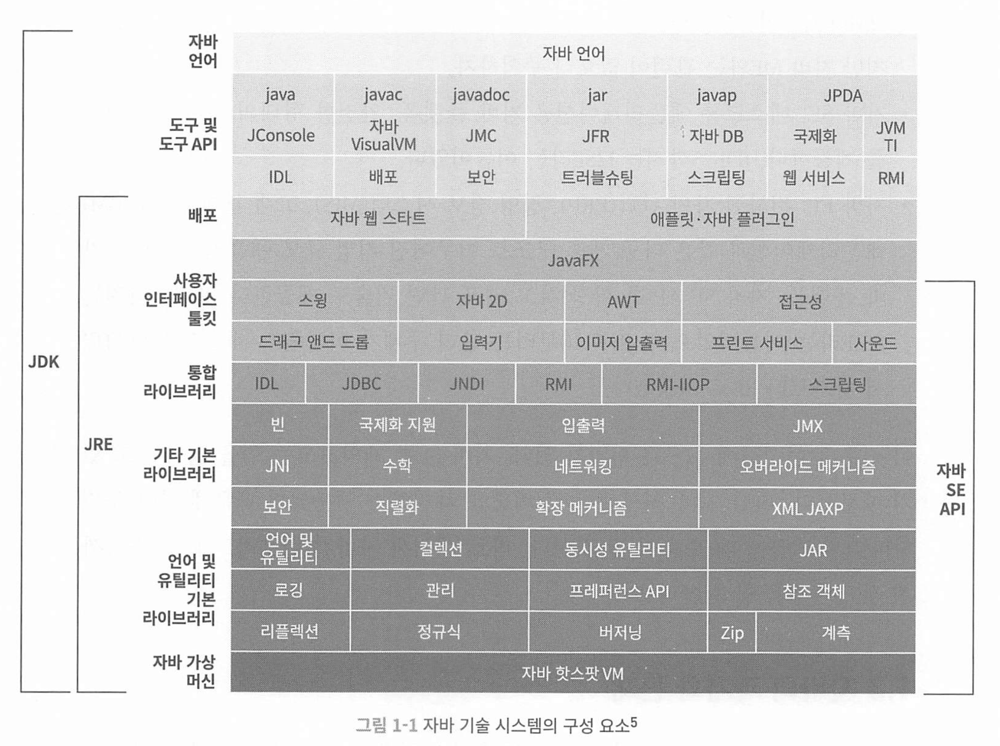

### Hotspot VM

자바 프로그램을 실행할 때 사용하는 가장 대표적인 JVM 중 하나

자바 프로그램은 먼저 `.java` 파일을 `.class` 바이트코드로 컴파일하고, 이 바이트코드를 실행하는 게 바로 **JVM**이고, 그 JVM 구현체 중 하나가 **HotSpot**

HotSpot VM의 핵심 특징은 "어떤 코드가 자주 실행되는지(=hot spot)"를 **스스로 판단해서**, 그 **핫한 부분만 더 빠르게 실행**하도록 하는 기능. 이게 바로 **JIT(Just-In-Time) 컴파일러** 덕분

* 핫 코드 감지 기술

핫 코드 감지 기술은, 컴파일했을 때 가장 효과를 크게 볼 수 있는 코드 영역을 런타임에 알아내어 JIT 컴파일러에게 알려주고, JIT 컴파일러가 해당 코드를 메서드 단위로 컴파일한다.

* 런타임에 스택을 치환하는 기술을 온스택 치환이라고 함
* JIT(Just-In-Time) 컴파일러는 프로그램 실행 시점(runtime)에 코드를 기계어로 변환하여 실행 성능을 극대화하는 기술
  * 처음에는 바이트코드를 인터프리터가 한 줄씩 해석하면서 실행해요.
  * 그런데 어떤 **코드 블록이 자주 실행된다**면, JIT 컴파일러가 **그 부분을 진짜 기계어로 컴파일해서 캐시에 저장**해요.
  * 다음부터는 그 코드 블록은 기계어로 된 걸 바로 실행하니 더 빨라요!
  * **AOT 컴파일러:** 미리 전체 프로그램을 기계어로 변환하여 실행 파일을 생성합니다. 실행 전에 모든 코드가 컴파일되므로, 실행 시에는 별도의 컴파일 단계가 없지만, 실행 환경의 특성이나 데이터에 최적화된 코드를 생성하기 어렵습니다 <-> jit과 반대됌. c, c++, golang 등. 운영체제별로 따로 컴파일해서 배포해야함

Java는 모든 플랫폼에서 동작하게 하기 위해 java를 .class라는 바이트코드로 변환 후 JVM 으로 실행된다.

JIT 컴파일러는 각 플랫폼 특성을 고려하여 런타임에 최적의 기계어 코드를 생성한다. 

JIT 컴파일러는 처음에는 바이트 코드를 인터프리팅 방식으로 실행하다, 핫스팟 코드를 만나면 런타임에 기계어로 컴파일하여 캐싱해서 재사용한다. 


### 차세대 jit 컴파일러

핫스팟 vm은 jit 컴파일러를 2개 내장하고 있음

* 컴파일 속도가 빠른 대신 최적화를 적게 하는 c1 컴파일러(클라이언트)
* 컴파일 속도가 느리지만 더 많은 최적화를 하는 c2 컴파일러(서버 컴파일러)

최신 HotSpot JVM은 **티어드 컴파일** 기법을 사용하여 두 컴파일러의 장점을 결합합니다.

- 초기에는 빠른 시작을 위해 C1으로 컴파일하고,
- 실행 중 반복적으로 호출되는 핫스팟 코드가 감지되면 C2로 재컴파일하여 최적의 성능을 달성합니다.

### 프로젝트 발할라

프로젝트 발할라(Project Valhalla)**는 Java의 성능과 메모리 효율을 **획기적으로 개선하기 위한 장기 프로젝트

> Java에서 더 빠르고, 메모리 효율 좋은 데이터 구조를 만들 수 있게 해주는 프로젝트

* 성능 개선: CPU 캐시 히트율 증가, GC 부담 감소

* 메모리 절약: 객체 헤더 제거, 참조 대신 직접 메모리 배치

* 병렬 처리 효율 향상

* 앞으로의 Java 성능 진화 기반

자바의 기본 메모리 구조 (복습)

| 메모리 영역                    | 역할                                        |
| ------------------------------ | ------------------------------------------- |
| **스택(Stack)**                | 메서드 호출 시 생성되는 지역 변수 저장 공간 |
| **힙(Heap)**                   | `new`로 생성된 객체가 저장되는 공간         |
| **메서드 영역 / 메타스페이스** | 클래스 정의, static 변수 등 저장            |

Project Valhalla 도입 시: 값 타입(Value Class)

```java
value class Point {
    int x;
    int y;
}
```

이제 Point는 **identity 없는 값 객체**, 즉 기본 타입처럼 작동하게 돼요.

```java
Point p = new Point(1, 2);
```

메모리 구조 

```
[ Stack ]
p.x = 1
p.y = 2

(힙 사용 X, 객체 헤더 X)
```

> 마치 `int`나 `double`처럼 **stack에 직접 저장**됨.
>  필요시 배열 같은 곳에 들어가도 **연속된 메모리 공간**으로 저장 가능!

| 구분        | 기존 Java 객체   | Valhalla 값 타입       |
| ----------- | ---------------- | ---------------------- |
| 메모리 위치 | 힙 (heap)        | 스택 또는 인라인       |
| 메모리 구성 | 참조 + 객체 헤더 | 데이터만 존재          |
| GC 대상     | O (GC가 수집함)  | X (기본 타입처럼 취급) |
| 배열 저장   | 참조 배열        | 데이터 인라인 배열     |
| 성능        | 상대적으로 느림  | 훨씬 빠름              |

기존 java 

```
Point[] arr = new Point[3];
arr[0] = new Point(1, 2);
```

→ 힙 구조:

```
arr ─────────▶ [ref0][ref1][ref2]  ← 배열은 참조만 저장
              │     │     │
              ▼     ▼     ▼
            객체0  객체1  객체2
```

Valhalla 구조

```
Point[] arr = new Point[3];
```

→ 메모리 구조:

```
arr ─────────▶ [x0][y0][x1][y1][x2][y2]  ← 연속된 구조 (primitive처럼)
```

값 타입은 **"힙에도 저장될 수 있다"**, 하지만 **GC 대상이 아니다**

스코프가 벗어나면 사라짐. (선언한 함수라던가), 값타입을 반환하는 함수에서 반환받고, 그 함수가 종료된 경우 


GC가 해줘야 할 일이 거의 없도록 설계된 타입

스택 값은 GC가 관리할 필요 없이, **JVM이 스택 프레임 날리면서 자동 제거**

| 질문                                       | 답변                                              |
| ------------------------------------------ | ------------------------------------------------- |
| value class를 리턴하면 값 사라지지 않나요? | ❌ 절대 안 사라짐. 값이 복사되어 호출자에게 전달됨 |
| 스택에만 저장되면 함수 끝나면 날아가나요?  | 복사된 값은 호출자 쪽으로 안전하게 넘어감         |
| 참조처럼 공유되나요?                       | ❌ 공유 안 됨. 항상 **복사**                       |
| 그러면 성능 좋은가요?                      | 네. 힙 사용 없고 GC 부담도 없음                   |

메모리 구조

```
mathematica


복사편집
[Heap - 배열]
┌────────────────────────────┐
│ Point[3]                   │  ← 배열 자체는 힙에 있음
├────────────────────────────┤
│ x0=1 │ y0=2                │ ← 인라인 저장 (Point 0)
│ x1=3 │ y1=4                │ ← 인라인 저장 (Point 1)
│ x2=5 │ y2=6                │ ← 인라인 저장 (Point 2)
└────────────────────────────┘
```

- ✔️ 배열 자체는 힙에 있지만
- ✔️ 각각의 `Point`는 **별도 객체가 아니라 값 자체로 저장됨** (primitive처럼!)
- ❌ `new Point()` 객체가 힙에 올라가는 게 아님 → **GC 추적 불필요**

GC 동작 방식

| 항목       | 설명                                               |
| ---------- | -------------------------------------------------- |
| 배열       | 힙에 저장됨 → GC가 필요함                          |
| 배열의 값  | 값 타입이라 참조 없음 → GC가 따로 추적할 필요 없음 |
| `Point` 값 | 그냥 숫자 덩어리 → GC가 인식할 필요 없음           |

> 즉, **배열이 수거되면 값들도 같이 사라짐. 따로 추적은 안 함.**

반면, 같은 상황에서 `record`로 하면?

```
record Point(int x, int y) {}

Point[] points = new Point[3];
points[0] = new Point(1, 2);
```

메모리 구조

```
[Heap - 배열]                    [Heap - 객체들]
┌────────────────────────────┐   ┌─────────────┐
│ Point[3]                   │ ─▶│ Point(1,2)  │
├────────────────────────────┤   └─────────────┘
│ ref0 │ ref1 │ ref2         │
└────────────────────────────┘
```

- 배열은 힙에 존재
- 각 요소는 **Point 객체에 대한 참조(reference)**
- 각 `Point` 객체도 **힙에 따로 존재**
- 👉 GC는 배열뿐 아니라 **Point 객체도 추적해서 수거해야 함**


# 2장 자바 메모리 영역과 메모리 오버플로

## 런타임 데이터 영역

각 영역마다 생성/삭제 시점이 다르다.

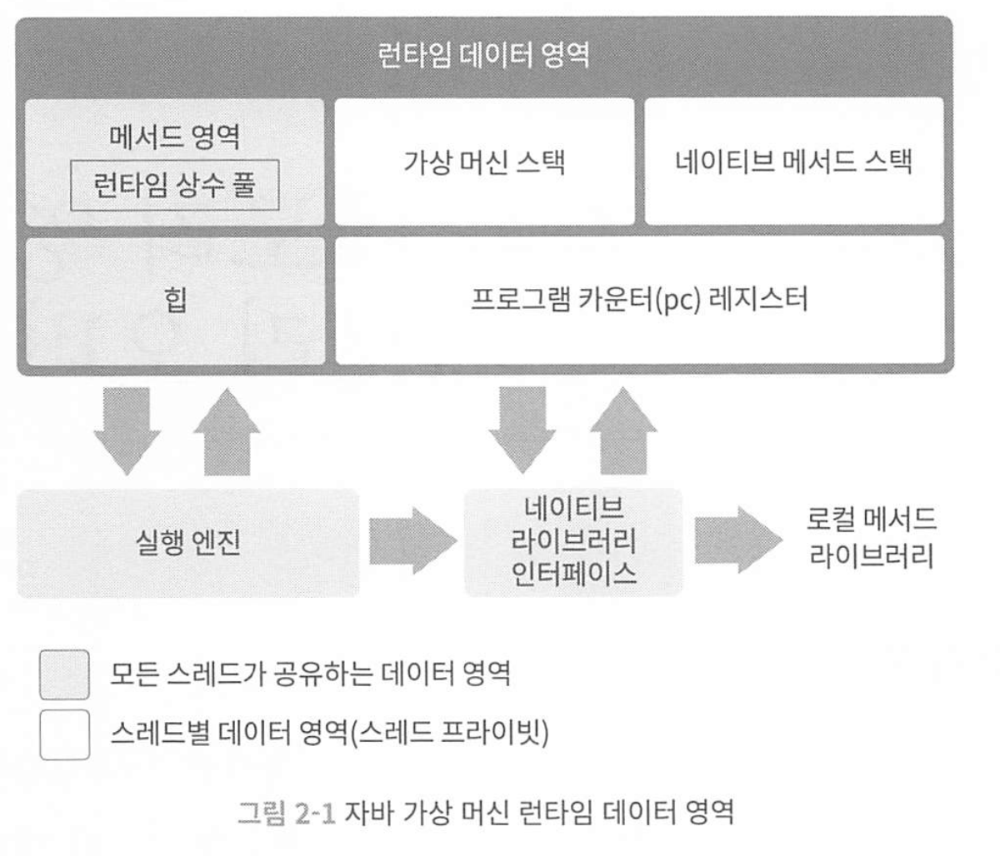

* 어떤 영역은 JVM 시작 동시에 만들어지고, 어떤 영역은 사용자 스레드의 시작/종료에 맞춰 생성/삭제

* 힙과 메서드 영역은 모든 스레드가 공유
  * 메서드 : JVM이 로드한 클래스의 메타데이터(클래스 구조, 필드, 메서드 정보) 저장 공간
  * 런타임 상수 풀 : 문자열 리터럴, 상수, 메서드 참조. 스태틱 변수
  * 힙 : 객체 인스턴스가 저장되는 공간

### 프로그램 카운터.

프로그램 카운터 레지스터는 작은 메모리 영역으로, 현재 실행중인 스레드의 바이트코드 줄 번호 표시기

일반 프로그램 레지스터 처럼, 카운터의 값을 바꿔 다음에 실행할 바이트 코드 명령어를 선택해서 동작

* if, 분기, 순환, 점프, 예외처리, 스레드 복원 등 이 프로그램 카운터를 이용함

JVM에서 멀티스레딩은 CPU 코어 하나가 여러 스레드를 실행하기 때문에, 스레드 전환 후 이전에 실행하다 멈춘 지점을 복원하려면 프로그램 카운터가 필요하다. 그래서 각 스레드에 고유한 프로그램 카운터가 있고 공유되지 않는다.

* 스레드가 실행중인 자바 메서드의 바이트 코드 명령어의 주소가 프로그램 카운터에 기록된다 

### 자바 가상 머신 스택(stack)

각 메서드 호출시 jvm은 스택 프레임을 만들어 지역 변수 테이블, 피연산자 스택, 동적 링크, 메서드 반환값들의 정보를 저장한다.

지역변수 테이블에는 primitive type, ref 참조 변수, 반환 주소 타입(바이트코드 명령어 주소)를 저장한다.

* 일반적으로 슬롯 하나의 크기는 32비트로, double같은 8바이트 변수는 두개를 사용함

스택 깊이가 매우 깊어지면 StackOverflowError, 스택 용량이 초과하면 OutOfMemoryError를 던진다

### 네이티브 메서드 스택

네이티브 메서드는 네이티브 메서드 실행할 때 사용하는 스택이다. 

마찬가지로, 스택 깊이가 매우 깊어지면 StackOverflowError, 스택 용량이 초과하면 OutOfMemoryError를 던진다

### 자바 힙

모든 스레드가 공유하며, 가상 머신이 구동될 때 만들어진다.

객체 인스턴스 저장하는것을 말하며 모든 인스턴스와 배열은 힙에 할당된다.

### 메서드 영역

메서드 영역도 자바 힙처럼 모든 스레드가 공유한다.

타입 정보, 상수, 정적 변수, JIT 컴파일러가 컴파일한 코드 캐시 등을 저장하는데 사용된다. 

자바 힙과 구분하기 위해 non-heap라고 부르기도 한다. 

용량이 초과하면 OutOfMemoryError를 던진다

### 런타임 상수 풀

메서드 영역의 일부로, 클래스 버전, 필드, 메서드, 인터페이스 등 클래스 파일에 포함된 설명 정보에 더해 컴파일 타임에 생성된 리터럴 문자열과 심벌 참조가 저장된다. 

가상머신이 클래스 로드시 이러한 정보를 런타임 상수 풀에 저장한다.

상수 풀의 공간이 부족해도 OutOfMemoryError를 던진다.

### 다이렉트 메모리

JVM에도 속하지 않는, JVM 외부의 메모리(native) 공간을 의미한다.

이부분도 OutOfMemoryError 원인이 될 수 있따.

JDK 1.4에서 NIO가 도입되면서 채널과 버퍼 기반 I/O 메서드가 소개됐다.

NIO는 힙이 아닌 메모리를 직접할당할 수 있는 네이티브 함수 라이브러리를 이용하며, 이 메모리에 저장되어 있는 DirectByteBuffer 객체를 통해 작업을 수행한다.

즉, 네트워크/파일 처리시 JVM Heap에잇는 데이터를 네이티브 힙에 복사해 주고받지 않아도 되어 성능을 개선했다.

* Zero-Copy

그리고 GC 부담이 감소됐다.

-Xmx 등의 매개 변수 설정시, 가상 머신 메모리 뿐만 아니라 다이렉트 메모리도 고려해서 램을 설정해야 한다. 

## 핫스팟 가상 머신에서의 객체


### 객체 생성

가상 머신 수준에서는 어떤 과정을 거쳐 객체가 생성될까.

1. 

자바 가상 머신이 new 명령에 해당하는 바이트코드 만나면, 명령의 매개 변수가 상수 풀안의 클래스를 가리키는 심벌 참조인지 확인한다. 그런 다음 이 심벌 참조가 뜻하는 클래스가 로딩, 해석, 초기화 되었는지 확인한다 

준비되지 않은 클래스라면 클래스 로딩을 해야 한다. 

클래스 로딩?

```
[1] 로딩 (Loading)
[2] 연결 (Linking)
   ├─ 검증 (Verification)
   ├─ 준비 (Preparation)
   └─ 분석 (Resolution)
[3] 초기화 (Initialization)
[4] 사용 (Usage)
[5] 언로드 (Unloading) ← 필요 시

// 전체 클래스 로딩 과정 
```

1. 로딩 : .class 파일을 ClassLoader가 읽어서 JVM 메모리에 올리는 단계.
   * Method Area(MetaSpace)에 클래스의 구조 정보 저장. 필드 메서스 상수 등 

2. 연결 (Linking) : 
   1. 검증(Verification) : .class 파일이 JVM 명세에 맞는지 확인. bytecode 검증등
   2. 준비 : static 변수들 메모리 할당 및 기본값 설정
   3. 분석 : 클래스 내부의 심볼릭 레퍼런스를 실제 레퍼런스로 변환  
3. 초기화 : static 블록 초기화 및 필드 값 대입. 클래스가 실행 가능한 상태가 됌

이런 과정을 거친다 클래스 로딩은


로딩이 완료된 클래스라면, 새 객체를 담을 메모리를 할당함. 

객체 메모리 공간 할당은, 특정 크기의 메모리 블록을 잘라주는 일.

자바 힙은 불규칙적이여서 사용중, 여유 메모리가 뒤섞여 있음. 

가상머신이 할당하는 두가지 방법

1. 사용중인 메모리 포인터에서 새 객체 크기만큼 포인터를 밀쳐 할당하는법
2. 가용 메모리 블록들을 목록으로 관리하고, 충분한 공간을 찾아 할당하고 목록을 갱신함

멀티스레드 환경에서 객체 생성시 CAS 등과 재시도를 이용해 갱신을 원자적으로 수행한다.

두번째방법으로는 스레드마다 다른 메모리 공간을 미리 할당해놓는다. 

* 이런 메모리를 스레드 로컬 할당 버퍼 : TLAB 

다음으로 모든 필드를 0으로 초기화 한다.

그다음 객체에 필요한 설정을 한다, 어느 클래스의 인스턴스인지, 메타 정보, 해시 코드, gc age 등.

이후 new에 이어 내부적으로 init()이 실행되고 사용 가능해진다.

### 객체의 메모리 레이아웃

핫스팟 가상 머신은 객체를 3부분으로 나눠 힙에 저장한다.

객체 헤더, 인스턴스 데이터, 길이 맞추기용 정렬 패딩

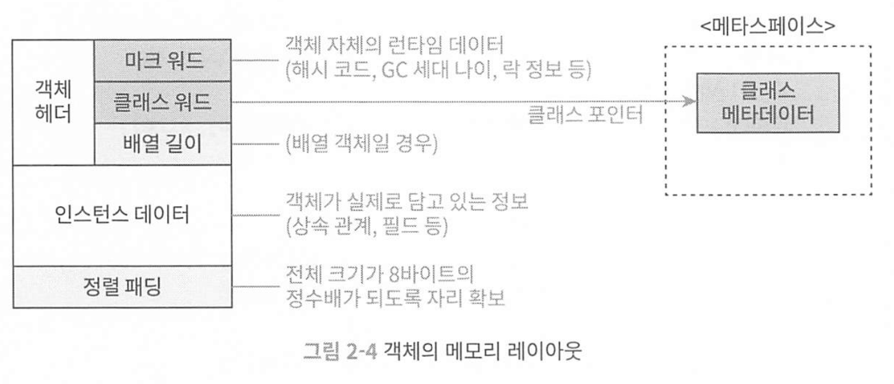

#### 객체 헤더

두 유형의 정보를 담음 

첫번째로, 해시 코드, gc age, 락 flag, 스레드 점유하고 있는 락들, Biased 스레드의 id, 타임스탬프 등.

이 부분들을 mark word라고 하며 64비트다.

마크 워드 다음 에는 klass ward가 온다. 객체의 클래스 관련 메타데이터를 가리키는 클래스 포인터가 저장됌.

#### 인스턴스 데이터

객체가 실제로 담고있는 정보들. 다양한 타입의 필드 관련 내용, 부모 클래스 유무, 부모 클래스의 필드 등.

#### 정렬 패딩

존재하지 않을수도 있으며 특별한 의미없이 자리를 확보하는 역할만 함 

### 객체에 접근하기

대다수 객체는 다른 객체 여러개를 조합해 만들어짐.

객체 접근하는 방식 가상 머신에서 구현하기 나름이며, 주로 다이렉트 포인터 또는 핸들 방식을 사용해 구현

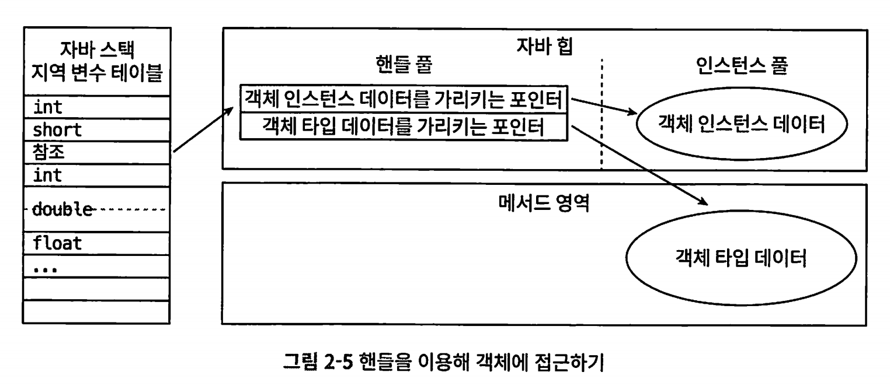

객체 참조가 곧바로 객체를 가리키지 않고, **"핸들 테이블"을 거쳐서 실제 객체에 접근**하는 방식

핸들 방식에서는 자바 힙에 핸들 저장용 풀이 별도로 존재하며, 참조에는 객체의 핸들 주소가 저장되고 핸들에는 해당 객체의 인스턴스 데이터, 타입 데이터, 구조 등의 정확한 주소 정보가 담김.


핸들 방식의 가장 큰 장점은 안정적인 핸들의 주소가 저장.

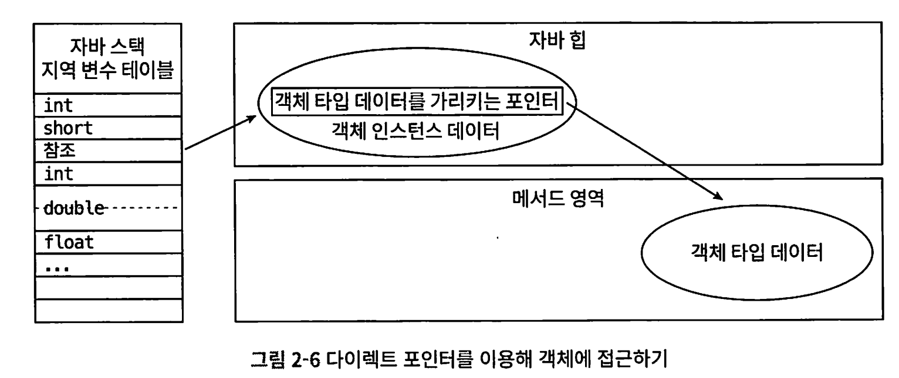

다이렉트 포인터 방식에서는 **자바 힙에 위치한 객체에서 인스턴스 데이터**뿐 아니라 **타입 데이터에 접근하는 길**도 제공해야 한다.

다이렉트 포인터의 장점은 속도다. 핸들을 공유하는 오버헤드가 없기 때문.

| 항목             | 다이렉트 포인터 방식                      | 핸들 방식                               |
| ---------------- | ----------------------------------------- | --------------------------------------- |
| 접근 속도        | 빠름 (직접 접근)                          | 느림 (중간 테이블 거침)                 |
| 구조 변경 유연성 | 낮음                                      | 높음 (객체 이동해도 핸들만 수정하면 됨) |
| GC 시 이점       | GC가 객체 주소를 바꾸면, 참조도 바꿔야 함 | 핸들만 바꾸면 되니 더 간편              |
| 구현 복잡도      | 간단                                      | 복잡                                    |
| JVM 예           | 대부분의 HotSpot JVM                      | 예전 JVM 또는 특정 상황에서 사용        |

현재 대부분은 다이렉터 포인터를 사용한다.

## OutOfMemoryError 예외

테스트용 환경

```
-Xms20m -Xmx20m -XX:+HeapDumpOnOutOfMemoryError
```

* -Xms20M : JVM 시작시 힙 메모리 20mb
* -Xmx20m : 최대 힙 메모리 크기 20mb
* -XX:+HeapDumpOnOutOfMemoryError :  OOM 발생시 힙덤프 생성 

JDK 8 이후로는 permanent generation(영구 세대)가 사라져서로 메타스페이스 공간이 생겼다.

```
// jdk 7 이하 (예전 방식)
Heap 영역
 ├─ Young Generation (Eden + Survivor)
 ├─ Old Generation (Tenured)
 └─ Permanent Generation (PermGen) ← 클래스 메타데이터, static, 문자열 상수 등


// JDK 8 이후 (현대 JVM)
Heap 영역
 ├─ Young Generation
 └─ Old Generation

Heap 밖 (Native 영역)
 └─ Metaspace ← PermGen 대체
```

- `Metaspace`는 **JVM 밖 네이티브 메모리**에 위치
- PermGen보다 **유연하고 안정적**
- 크기를 동적으로 확장 가능 (`-XX:MaxMetaspaceSize` 로 제한 가능)
- **클래스 로딩 문제, PermGen OOM 문제 해결**


다이렉트 메모리에서 발생한 메모리 오버플로우는 힙덤프 파일에서는 이상한 점을 찾을 수 없다.

# 3장 가비지 컬렉터와 메모리 할당 전략.

## 들어가며

가비지 컬렉션과 메모리 할당의 내부를 이해해야 하는 이유

* 다양한 메모리 오버플로우와 누수 문제를 해결해야 하는 상황
* 높은 동시성을 위한 가비지 컬렉션 제어

## 대상이 죽었는가.

GC가 힙을 청소하려면 어떤 객체가 살아있고 죽어있는지 판단해야 회수 가능

### 참조 카운팅 알고리즘

자바의 gc는 참조 카운팅 알고리즘을 사용하지 않음.

* 왜?
* objA.instance = objB, objB.instance = objA 로 두면, 서로 참조하고 있기에 참조 카운터는 0이 아니라서 해제 불가 

gc 로그를 볼려면 실행시에

```
-Xlog:gc*:file=gc.log:time,uptime,level,tags
```

### 도달 가능성 알고리즘 (관측 가능성 알고리즘)

이 알고리즘의 아이디어는 gc 루트라고 하는 루트 객체들을 시작 노드 집합으로 써서, 출발해서 다른 객체들로 탐색함.

자바의 GC 방식: **Tracing 방식 (추적 기반)**

* GC 루트(GC Root)에서부터 객체들을 **따라가며(추적하며)** 살아있는 객체를 찾는 방식

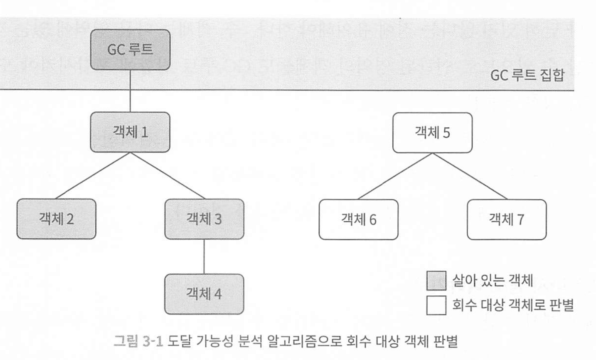

자바의 GC 루트 이용 가능 객체는 정해저 있다.

* 가상 머신 스택(스택 프레임의 지역 변수 테이블)에서 참조하는 객체 : 현재 실행중인 메서드에서 쓰는 매개변수, 지역변수, 임시변수 등
* 메서드 영역에서 클래스가 static 필드로 참조하는 객체 
* 메서드 영역에서 상수로 참조되는 객체 
* JNI가 참조하는 객체
* JVM 내부에서 쓰이는 참조 : Class 객체, 일부 예외 객체(NPE, OOME)

또한, GC 루트가 너무 많아지면 성능이 느려지므로 다양한 최적화를 통해 줄이려고 함. 

#### 참조

jdk 1.2부터 참조 개념이 4가지로 구분됌.

* 강한 참조 : 프로그램 코드에서 참조를 할당하는 강한 참조. gc가 절대 회수 안함. var obj = new Object()
* soft 참조 : 유용하지만 필수는 아닌 객체. 
* 약한 참조 : 다음번 gc 까지만 살아 있고 약한 참조 객체는 모수 회수됨
* 유령 참조

### 살았나 죽었나?

gc 루트를 통해 도달 불가능이라고 판단해서 바로 죽은건 아님. 유예 과정을 거치고 2번의 marking 과정을 거쳐야 대신 됌. 

### 메서드 영역의 가비지 컬렉션.

메타스페이스인 메서드 영역도 gc를 수행함.  크게 2가지.

* 더이상 사용되지 않는 상수와 클래스

상수는 지우기 쉽지만 클래스는 까다로움. 다음 세조건을 만족해야함.

* 해당 클래스의 인스턴스가 모두 회수 되어야함.
* 이 클래스를 읽어들인 클래스 로더가 회수.
* 이 클래스에 해당하는 java.lang.Class 객체를 아무 곳에서도 참조하지 않고, 리플렉션으로 이용하는곳도 없음 

## 가비지 컬렉션 알고리즘

| GC 알고리즘                     | 등장 Java 버전                       | 주요 특징 및 설명                                           | 기본 GC 여부 (Java 버전 기준) |
| ------------------------------- | ------------------------------------ | ----------------------------------------------------------- | ----------------------------- |
| **Serial GC**                   | Java 1.2                             | 단일 스레드 GC. 단순하고 작고 느린 환경에 적합.             | ✅ 기본 (Java 1.2~1.3)         |
| **Parallel GC**                 | Java 1.4                             | Young GC를 멀티스레드로 병렬 처리. Throughput 중심.         | ✅ 기본 (Java 1.4~1.8)         |
| **CMS (Concurrent Mark Sweep)** | Java 1.5 (정식)                      | Old 영역 GC를 동시 처리. STW 줄이기 목적. 단편화 문제 존재. | ❌ (선택 가능, 기본은 아님)    |
| **G1 GC (Garbage First)**       | Java 6 (실험), Java 7 (정식)         | Region 기반 GC. CMS 대체. pause time 예측 가능.             | ✅ 기본 (Java 9~현재까지 기본) |
| **ZGC (Z Garbage Collector)**   | Java 11 (실험), Java 15 (정식)       | 초저지연 GC. 수백 GB 메모리에서도 <10ms pause.              | ❌ (선택 가능)                 |
| **Shenandoah GC**               | Java 12 (Red Hat), Java 15 (OpenJDK) | 저지연, region 기반 GC. ZGC와 유사하지만 접근 방식 다름.    | ❌ (선택 가능)                 |
| **Epsilon GC**                  | Java 11                              | 아무 것도 안 하는 GC. 성능 실험/벤치마크용.                 | ❌ (선택 가능)                 |
| **Generational ZGC**            | Java 21                              | ZGC에 Young/Old 세대 개념 추가. 성능/효율 향상.             | ❌ (선택 가능. 기본은 G1)      |

### 📌 Java 버전별 기본(Default) GC 요약

| Java 버전    | 기본 GC                                    |
| ------------ | ------------------------------------------ |
| Java 1.2~1.3 | Serial GC                                  |
| Java 1.4~1.8 | Parallel GC                                |
| Java 9~20    | G1 GC                                      |
| Java 21+     | G1 GC (기본), Generational ZGC (선택 가능) |

gc 알고리즘을 참조 카운팅 gc와 trace gc로 나눌 수 있음. 

대부분 세대 단위 컬렉션 이론에 기초해 설계됌. 다음 두가지 가정

1. 약한 세대 가설 : 대다수 객체는 일찍 죽음
2. 강한 세대 가설 : gc에서 살아남을수록 더 오래 살 가능성이 커짐

자바 힙을 몇가지 영역으로 나누고, 객체들을 나이에 따라 각기 다른 영역에 할당한다.

이렇게 특정 지역만 회수하는 것들을 마이너 gc, 메이저 gc, full gc라고 한다.

각 영역에 담긴 객체들의 특성에 따라 mark-sweep, mark-copy, mark-compact 등의 gc 알고리즘을 구분해 적용한다.

**다양한 gc 방식** 

| GC 이름                  | 대상 영역                   | 설명                                        |
| ------------------------ | --------------------------- | ------------------------------------------- |
| **마이너 GC (Minor GC)** | **Young 영역만**            | Eden 공간이 꽉 찼을 때 발생                 |
| **메이저 GC (Major GC)** | **Old 영역**                | Old 영역이 부족할 때 발생                   |
| **풀 GC (Full GC)**      | **Young + Old + Metaspace** | 전체 힙 영역 + 메타스페이스까지 정리        |
| **혼합 GC (Mixed GC)**   | **Young + 일부 Old**        | G1 GC에서 사용. 일부 Old 영역 포함          |
| **부분 GC (Partial GC)** | Young 또는 특정 영역만 GC   | 특정 영역만 대상으로 하는 GC. 상황별로 다름 |

* Old는 구세대, Young은 신세대. 

### mark-sweep 알고리즘

**도달할 수 있는 객체만 남기고, 나머지는 청소(Sweep)하는 방식**
 이름 그대로 `Mark(표시)` → `Sweep(제거)` 2단계로 동작

장점

* 구현 간단, 순환 참조 문제 없음

단점

* 실행 효율이 일정하지 않아서 많아질수록 효율이 떨어지는 구조
* sweep 후 남은 메모리 공간이 불연속해서 파편화가 심해짐 이는 full gc 유발  

### mark-copy 알고리즘

회수할 객체가 많아질수록 효율이 떨어지는 마크-스윕 의 문제를 해결하기 위한 알고리즘

이 알고리즘은, 두 블록으로 나누고 살아있는 객체만 복사해서 메모리를 정리하는 방식.

단점

* 가용 메모리를 절반으로 줄여 낭비가 심함 

### mark-compact 알고리즘

살아있는 객체는 남기고, 죽은 객체는 지운 뒤, 남은 객체를 한쪽으로 밀어 정리(Compact)하는 방식

**Mark 단계**: 살아있는 객체를 표시하고

**Compact 단계**: 이 살아있는 객체들을 **한쪽으로 쭉 밀어서** 빈 공간을 정리해주는 구조

마크-스윕과의 핵심 차이는 메모리 이동이 일어남.

여기서 stop-the-world 문제가 발생함.

회수때마다 생존된 객체를 이동시키고, 다른 쓰레드가 계속 객체를 변경하면 참조 꼬이고 오류가 생겨서 멈추고 하기 때문

### cms 알고리즘 - Concurrent Mark-sweep

java8시절 많이 사용되던 저 지연을 목표로 한 gc 알고리즘.

*  **Old Generation** 영역을 **Stop-the-world 없이 대부분의 시간을 백그라운드에서 GC** 하려는 알고리즘

CMS는 Old 영역 수거 시 아래처럼 **여러 단계를 나눠 수행**

```
[1] Initial Mark         (Stop-the-world)
[2] Concurrent Mark      (백그라운드)
[3] Remark               (Stop-the-world)
[4] Concurrent Sweep     (백그라운드)
```

그러나 cms 도 단점이 있음.

* compact 단계가 없어서 큰 객체 할당 실패 가능하고 이경우 fullgc발생
* cpu 사용량이 증가함.
* stop the world가 짧지만 존재하긴 함.

## 핫스팟 알고리즘 상세 구현

cms, g1, zgc같은 컬렉터들도 루트 노드를 열거할 때만은 stop-the-world를 피할수 없다.

* JVM이 **"어디서부터 객체를 따라가야 할지"**, 즉 **"살아있는 객체들을 추적하기 위한 출발점들(GC Root)"**을
   **하나하나 나열하고 수집하는 것**을 **"루트 노드를 열거한다라고 함

* 루트 노드들이 참조 관계가 변하지 않아야 하므로 무조건 일시 정지 시킬수밖에 없음.

OopMap은 "현재 이 스레드의 레지스터나 스택에 어떤 값이 '객체 참조(Oop)'인지 표시하는 지도(map)인데 이 지도를 이용해 객체 참조가 저장된 **정확한 위치**를 구별한다. 


### serial gc

이 컬렉터는 단일 스레드로 동작하며, 회수가 완료될때까지 다른 모든 작업 스레드는 멈춰 있는다.

Young 제너레이션에서도 하나의 스레드로 처리하고, old 제너레이션에서도 하나의 스레드로 실행한다. 

* jdk 1.4~1.5까지 사용 

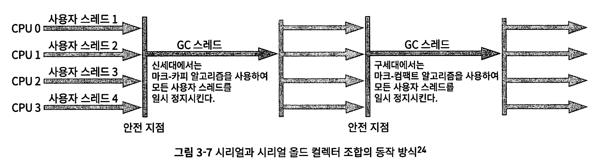

* Young 제너레이션에서는 mark-copy 알고리즘을 사용
* old 제너레이션에서는 mark-compact 알고리즘을 사용 

### 파뉴 컬렉터 - parallel new collector

멀티 스레드로 serial gc를 병렬화한 버전. 멀티스레드란점말고 모두 시리얼과 같음 

* jdk 1.6~1.8에서 사용 

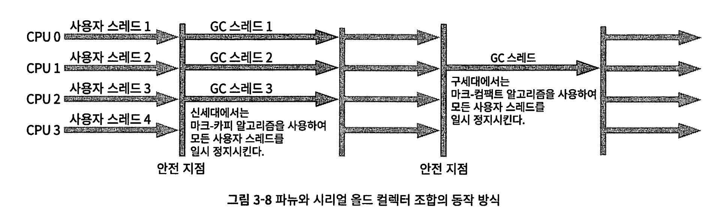

* young 제너레이션에서 mark-copy 알고리즘 사용
* old 제너레이션에서 mark-compact 알고리즈 ㅁ사용

### 페러렐 스캐빈지 컬렉터 -Parallel Scavenge Collector

**Young Generation**에서 작동하는 GC로,
 **GC 성능 = 최대 처리량 확보**에 초점을 둔 병렬 수집기입니다.

mark-copy 알고리즘에 기초하여 여러 스레드를 이용해 병렬로 회수 

- 여러 스레드로 Young 영역의 GC 작업을 병렬 처리

### 시리얼 올드 컬렉터

시리얼 올드 컬렉터는 시리얼 컬렉터의 구세대용 버전이다. 마찬가지로 단일 스레 드 컬렉터이며 마크-컴팩트 알고리즘을 쓴다.

### 패러렐 올드 컬렉터

패러렐 올드 컬렉터는 PS 컬렉터의 구세대용 버전이다. 

멀티스레드를 이용한 병렬 회수를 지원하며 마크-컴팩트 알고리즘을 기초로 구현되었다.

이 조합을 사용하려면 -XX:+UseParalletcc 매개 변수를 지정하자.

### cms 컬렉터 (컨커런트 마크 앤 스윕)

**CMS (Concurrent Mark-Sweep)**는 자바의 **Old Generation(노화 세대)**를 위한
 **저지연(Low Pause)** 중심의 가비지 컬렉터입니다.

마크와 스윕 단계 모두 사용자 스레드와 동시에 수행한다.

* 목표 : stw월드 최소화. 

* jdk 1.8에서 사용, 단 기본은 아니였음. gc 설정을 해야함 

- Young 영역은 보통 **parallel GC**와 함께 사용
- Old 영역은 **CMS GC**가 병렬 + 동시적으로 수거

전체 과정은 다음 네 단계로 구성된다.

```
[1] Initial Mark (최초표시)       ← STW (짧음)
[2] Concurrent Mark (동시표시)     ← 백그라운드
[3] Remark  (재표시)            ← STW (조금 더 길음)
[4] Concurrent Sweep (동시 정리)    ← 백그라운드
```

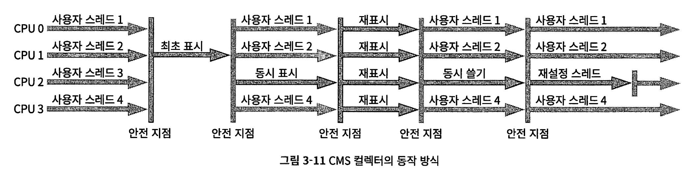

**장점**

- **GC 중단 시간(지연)**을 최소화 가능
- 애플리케이션이 GC와 동시에 돌아감
- 고성능 서버, API 서버에서 인기 많았음

단점

| 단점                     | 이유                                               |
| ------------------------ | -------------------------------------------------- |
| ❌ 메모리 단편화          | Compact가 없음 → 큰 객체 할당 실패 가능            |
| ❌ Full GC 자주 발생 가능 | 공간 부족, concurrent 실패 시 전체 정리 필요       |
| ❌ CPU 사용량↑            | GC와 애플리케이션이 동시에 CPU를 사용              |
| ❌ 유지보수 종료됨        | **JDK 9에서 deprecated**, **JDK 14에서 완전 제거** |

jvm 옵션 2가지

* -XX:+UseCMSCompactAtFullCollectio : 
  * **"Full GC 시, 단편화도 해결할 수 있도록 Compaction(압축)도 수행하라**
  * 단점: **압축 과정은 Stop-the-world이고, 오래 걸림**

* XX:CMSFullGCsBeforeCompaction=<N>
  - "N번의 Full GC 이후에 한 번 압축(Compaction)을 수행하라"

### 대망의 g1 컬렉터 (garbage first)

가비지 우선 컬렉터.

기존의 CMS GC가 단편화 문제나 Full GC 발생 이슈가 있었는데,
 G1은 힙 메모리를 **고정 크기의 Region** 단위로 나누고,
 **가비지가 많은 Region부터 우선 수거**하는 방식으로 동작합니다.

GC는 Young, Mixed, Full GC로 나뉘며, 특히 **Mixed GC**는 Young + Old 일부를 함께 처리해
 점진적으로 Old 영역까지 정리하는 점이 특징이고요.

CMS의 **단편화 문제, 튜닝 난이도, Full GC 문제** 등을 보완했어요.

* jdk 9부터 21까지 기본임. 
* 기존 CMS GC의 한계를 극복하기 위해 만들어짐. 


 G1의 등장 전까지 CMS를 포함한 모든 컬렉터의 회수 범위는 신세대 전체 (마이너 GC), 구세대 전체(메이저 GC) 또는 자바 힙 전체(전체 GC)였다. 

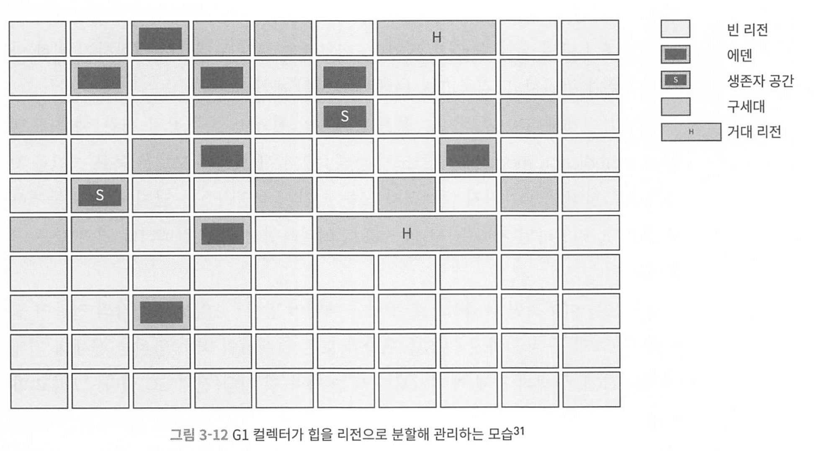

G1은 전체 Heap을 **균일한 크기의 Region**(1~32MB, 보통 8MB)으로 나누고, 

모든 리전 중 가비지가 가장 많은 영역부터 먼저 수거해서 가비지 펄스트라는 이름이 붙었어요.

크게 3가지 gc를 수행하는데

young gc단계는 eden region이 가득 차면 발생하고, 살아남은 객체는 suvivor로 복사합니다.

이 단계는 병렬로 스탑더 월드를 수반해요

다음으로 mixed gc는  g1만이 가지고있는데 old 영역의 일부도 조금씩 수거함

full gc는 메모리가 심하게 부족하거나 큰 객체가 처리되지 않을때, 힙전체는 stw하고 mark-sweep-compact 수행합니다.

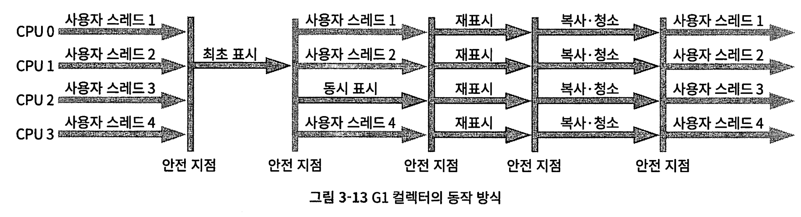

## 저지연 가비지 컬렉터

가비지 컬렉터를 측정하는 가장 중요한 지표는 세 가지다. 처리량, 지연 시간, 메 모리 사용량이다.

다양한 컬렉터의 동시성 비교

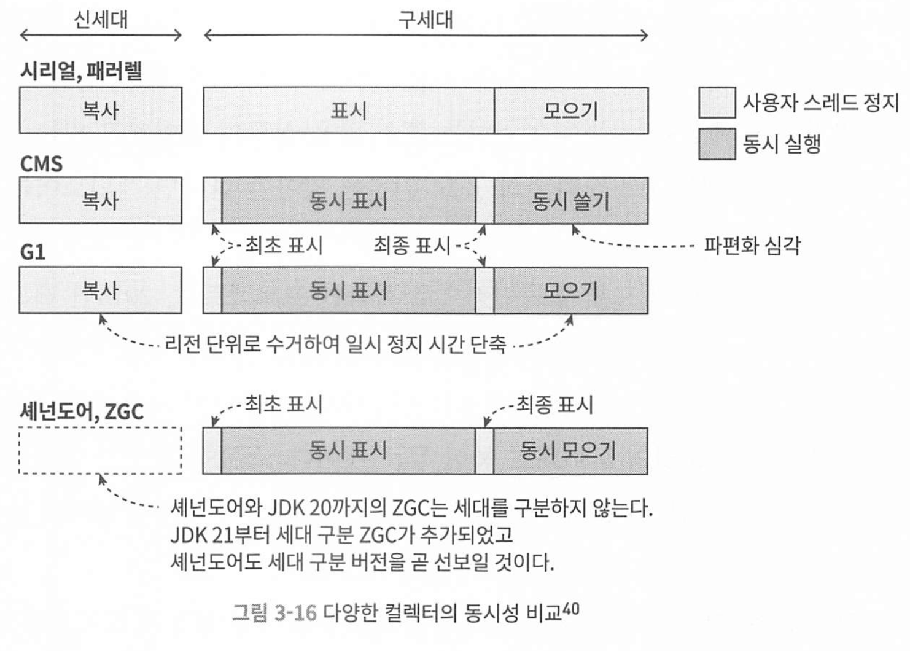

셰넌도어와 zgc는 거의 모든 과정이 동시에 수행된다.

### 셰넌도어 Shenandoah 컬렉터

**Shenandoah GC**는 **"모든 GC 단계를 애플리케이션과 동시에 실행하는 Concurrent GC"**입니다.

**GC로 인한 Stop-The-World(정지 시간)를 밀리초(ms) 단위로 줄이기 위해 개발**되었고,
 특히 **지연 시간(latency)에 민감한 시스템**에서 사용됩니다.

```
[1] Initial Mark        ← STW (매우 짧음)
[2] Concurrent Marking  ← 백그라운드
[3] Final Mark          ← 짧은 STW
[4] Concurrent Evacuation (복사/이동)
[5] Concurrent Update References
```

장점

| 장점                              | 설명                                                         |
| --------------------------------- | ------------------------------------------------------------ |
| ✅ 지연 시간 극소화                | GC로 인한 STW 시간을 **수 밀리초 이내로 유지 가능**          |
| ✅ 고성능 시스템에 적합            | 응답 지연에 민감한 실시간 시스템 (거래 시스템, 게임 서버 등) |
| ✅ 대용량 힙에 강함                | 수십~수백 GB 힙도 안정적으로 처리                            |
| ✅ 객체 이동도 백그라운드에서 수행 | 애플리케이션과 동시에 진행                                   |

단점

| 단점                                | 설명                                          |
| ----------------------------------- | --------------------------------------------- |
| ❌ Throughput(총 처리량)은 다소 낮음 | GC가 항상 일부 CPU 자원을 사용하기 때문       |
| ❌ JVM 요구 버전 있음                | JDK 12 이상에서만 사용 가능                   |
| ❌ CPU 사용량 ↑                      | GC와 앱이 같이 돌기 때문에 멀티코어 환경 필요 |

### ZGC

목표 : 초 저지연 stw와 처리량을 늘리는 것.

정지시간(Stop-The-World Pause Time)을 **10ms 이하로 제한**하도록 설계되었고,
 **수백 GB에서 수 TB 단위의 대용량 힙**도 안정적으로 처리할 수 있어요.


"ZGC는 세대 구분 없이 리전 기반 메모리 레이아웃을 사용한다. 낮은 지연 시간을 최우선 목표로 하며, 동시 마크-컴팩트 알고리즘을 구현하기 위해 읽기 장벽, 컬러 포인터, 메모리 다중 매핑 기술을 이용하는 가비지 컬렉터다."


#### 리전 기반 메모리 레이아웃

ZGC는 셰넌도어 g1처럼 힙 메모리를 리전들로 나누지만, 동적으로 생성/파괴되고 ZPage라고 표현한다

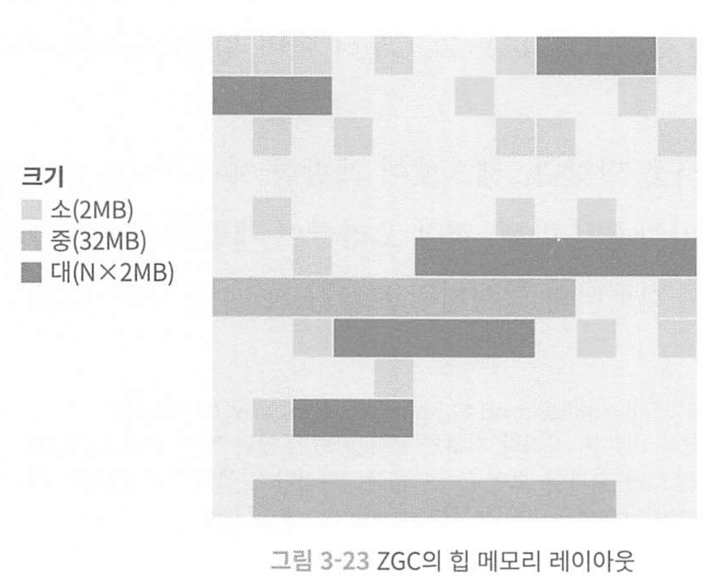

리전은 3개 크기로 나뉜다

* 소리전 : 2MB로 고정, 256KB 미만의 작은 객체
* 중리전 : 32MB, 256KB이상 4MB 미만 객체
* 대리전 : 크기가 동적으로 2MB의 배수로, 변할 수 있음. 4MB이상 객체


핵심은 병렬 & 동시 수집 (Concurrent + Parallel GC) + Color Pointer

#### 병렬 모으기와 컬러 포인터

모든 GC단계를 애플리케이션 실행과 동시에 병렬로 처리함. 

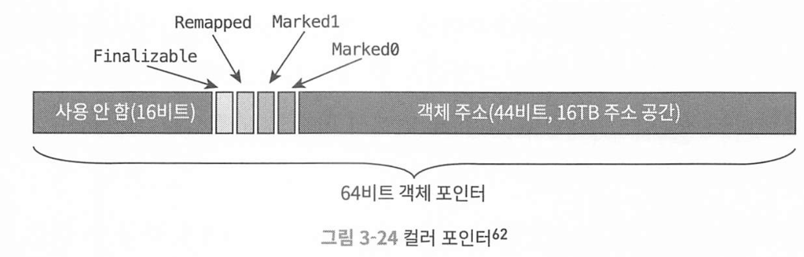

컬러포인터란, 객체가 GC 중 이동중인지, 마킹됐는지, 참조가능한 상태인데 객체 주소 헤더에 색(flag)를 마킹함

####  ZGC의 동작 방식

크게 4단계로 나뉘며 모두 사용자 스레드와 동시에 실행된다.

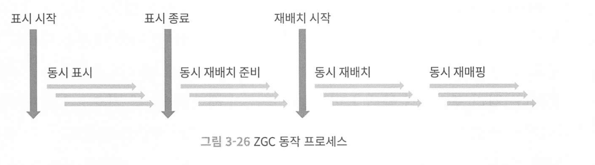

1. 동시 표시 : 객체 그래프를 탐색하며 마킹한다. 살아있는 객체와 죽은 객체 식별 짧은 일시정지가 발생한다. 
2. 동시 재배치(relocation) 준비 : 동시에 g1과 달리 모든 리전을 스캔하고, 정리할 리전을 선택하여 재배치 set에 넣음 
3. 동시 재배치 : 재배치 set안의 생존 객체들을 새로운 리전으로 복사하고, 이주 관계를 기록함. 이로 인해 메모리 단편화가 줄어듬
4. 동시 재매핑 : 객체가 새로운 위치로 옮겨진 후, 참조(포인터)들이 모두 올바른 위치를 가리키도록 갱신하는 단계. 복사한 옛 객체들을 향하는 참조 전부를 갱신함. 이 과정이 끝나면, 이전에 사용되던 메모리는 회수될 수 있으며, GC 사이클이 종료


죽은 객체가 있던 ‘옛 메모리’가 완전히 비워지고 모든 참조가 새 위치로 옮겨졌음을 확인하는 순간, ZGC는 해당 메모리를 **회수(Free**

### ZGC 동작원리 정리

#### 1. **동시 마킹 (Concurrent Marking)**

힙 전체를 스캔하면서 **살아 있는 객체(live object)**를 식별합니다.
 이 과정은 애플리케이션 스레드와 **동시에 실행**되며, 전체 힙을 빠르게 비동기적으로 훑습니다.

#### 2. **재배치 집합 선정 (Relocation Set Selection)**

회수 대상으로 삼을 리전(region)들을 골라 **재배치 집합**을 구성합니다.
 G1 GC와 달리, ZGC는 전체 힙을 스캔하므로 일부만 선택해도 전체 상태를 파악할 수 있습니다.

#### 3. **동시 재배치 (Concurrent Relocation)**

살아 있는 객체들을 **새로운 리전으로 복사**하고,
 기존 객체 위치에는 **Forwarding Table**을 만들어 이주한 위치 정보를 저장합니다.

여기서 핵심 기술이 바로 **자가 치유 포인터(Self-Healing Pointer)**입니다.
 → 객체가 복사된 후에도 애플리케이션이 옛 객체를 참조하면,
 ZGC는 자동으로 새로운 위치로 리디렉션해주고, 참조 자체도 새 주소로 수정합니다.
 이 덕분에 프로그램을 멈추지 않고도 안전하게 객체를 이동시킬 수 있습니다.

#### 4. **리전 회수 및 재사용**

복사가 끝난 리전은 바로 회수되어 재사용이 가능합니다.
 이 때 **컬러 포인터** 덕분에 포인터만 보고도 해당 객체가 재배치 대상인지 알 수 있습니다.


ZGC는 정지 시간을 최소화하기 위해 대부분의 GC 작업을 동시(concurrent)로 수행하며,
 컬러 포인터와 자가 치유 포인터 같은 메커니즘을 활용하여
 **힙이 매우 커져도 GC로 인한 응답 지연을 거의 없애는 것이 특징**입니다.
 따라서 실시간 시스템이나 대규모 JVM 애플리케이션에서 매우 유용하게 활용됩니다.


G1 gc와 비교하면,

G1 GC와 ZGC는 모두 정지 시간을 줄이기 위해 병렬 처리와 동시 처리를 지원하지만, **적용 범위와 방식에 있어 큰 차이점**이 있습니다.

**G1 GC**는 Young GC와 일부 Old GC 단계에서 병렬 처리를 지원하며, 특정 단계는 동시 처리로 수행됩니다.
 예를 들어, **Concurrent Mark 단계는 애플리케이션 스레드와 동시에 실행**되며, **Evacuation(YG 회수)**이나 **Remark**, **Cleanup** 단계는 **병렬 처리되지만 Stop-the-world(STW)**로 수행됩니다.
 따라서 G1 GC는 전반적으로 정지 시간을 줄이긴 하지만, 여전히 STW 구간이 여러 번 존재합니다.

반면 **ZGC**는 설계 철학 자체가 다릅니다. ZGC는 거의 모든 가비지 컬렉션 단계가 **병렬(멀티스레드)**이고 동시에 애플리케이션과 **동시(concurrent)**로 수행됩니다.
 실제로 **Concurrent Marking**, **객체 재배치(Relocation)**, **약한 참조 처리**, **클래스 언로딩**까지 대부분의 단계가 앱 실행과 동시에 병렬 처리됩니다.
 단지, 루트 객체를 마킹하는 **Mark Start** 단계만 극히 짧은 STW를 동반하며, 이 역시 1~2ms 수준으로 제한됩니다.

요약하자면, **G1 GC는 일부 동시 처리와 병렬 처리를 조합하지만 STW가 여러 차례 존재하고**,
 **ZGC는 거의 모든 단계를 병렬 + 동시로 수행하면서 STW를 사실상 없애 정지 시간을 최소화**하는 것이 가장 큰 차이점입니다.

> 언제 zgc를 사용할까?
>
> 8~16GB 정도로 큰 편이 아닌(중간 수준) 서버에서 수 ms 미만의 pause가 절대적으로 필요한 경우가 아니라면 그냥 기본값인 g1gc를 쓰고, 
>
> 낮은 pause time이 필요하면서 대량의 데이터를 처리하는 경우에 적합. 최소 8GB이상의 실시간 성을 보장하는데 초점을 맞추는 API 서버에 사용하는것이 좋을거같습니다.
>
> 물론 gc 모니터링을 해서, 많이 일어나면서 stw가 길어지면 zgc를 고려할거같습니다. 

### 세대 구분 ZGC (generational ZGC)

ZGC를 확장하여, 은 세대(young generation)의 특성을 활용해 수명이 짧은 객체들을 더 자주 회수한다.

기존의 ZGC는 힙 전체를 동일하게 관리하지만, generational 모드에서는 힙의 일부 영역을 nursery(신세대)로 분리하여, 새로 생성된 객체들을 집중적으로 관리한다. 

다음과 같이 실행한다

```
java -XX:+UseZGC -XX:+ZGenerational ...
```

컬러포인트를 그대로 사용하며, 컬러포인터에 새로운 메타데이터를 추가했다.


기존 zgc의 한계는 모든 객체를 대상으로 마킹 & 복사를 수행하여 비용이 높음, 제너레이셔널은 Young gc를 더 자주 해서 비용을 줄이고 Old gc도 가끔씩 처리한다. 

## 3.7 적합한 GC 선택

### 엡실론 컬렉터

단 몇분 또는 몇초만 동작하는 애플리케이션은 gc를 할 필요가 없으므로 gc를 하지 않는 컬렉터이다.

### 컬렉터들 간 비교 및 선택

애플리케이션에 맞는 컬렉터 선택지

* 주 목적이 무엇인가? : 데이터분석이나 과학계산이면 처리량이 중요하다.
* 애플리케이션 구동하는 하드웨어는 어떤가?
* ZDK 제공자는 어딘가? 자바가상 명세를 지원하는가

다음과 같은 클라-서버 시스템은?

* 자금은 여유로우나 최적화 경험이 부족하다면 : 유료 기술 지원을 받는 C4
* 상용은 못쓰나, 소프트웨어, 하드웨어 제어 능력이 된다면 : ZGC
* 레거시 시스템 오래된 하드웨어나 소프트웨어라면 : 메모리가 4~8gb -> CMS, 이상 G1

* 처리량보다 응답시간이 중요하고 stw가 짧아야 한다면 -> G1
* 응답시간이 매우중요하다면 -> ZGC

### 가비지 컬렉터 매개변수 정리

P184


## 메모리 할당과 회수 전략

시리얼 컬렉터를 예로, 분석 방법을 확인해본다. 

### 객체는 먼저 에덴에 할당된다

대부분 경우 객체는 먼저 신세대의 에덴에 할당된다. 에덴의 공간이 부족해지면 가상머신은 마이너 GC를 시작한다.

```css
[ Java 힙 (Heap) ]
├─ Young Generation
│   ├─ Eden (에덴)
│   └─ Survivor (서바이버)  ← S0 / S1 두 개 번갈아 사용
│
└─ Old Generation (Tenured)
```

| 용어                 | 의미                                            | 관계                |
| -------------------- | ----------------------------------------------- | ------------------- |
| **Young Generation** | 새로 생성된 객체들이 저장되는 영역              | 전체 영역           |
| **Eden**             | 대부분의 새 객체가 처음 저장되는 곳             | Young의 일부        |
| **Survivor**         | Eden에서 살아남은 객체들이 일시적으로 거치는 곳 | Young의 일부        |
| **Old Generation**   | 여러 번 살아남은, 오래된 객체들이 저장되는 곳   | Young과 분리된 영역 |

마이너 gc 과정

1. **Stop-the-world 발생 (짧음)**
    → 애플리케이션 일시 정지
2. **Eden 영역의 객체들 스캔**
    → GC root에서 도달할 수 없는 객체 삭제
3. **살아남은 객체는 Survivor 영역(S0)으로 복사**
4. **이전 Survivor(S1)에 남아있던 객체도 GC 수행 후, 새 Survivor로 복사**
5. **지속적으로 살아남은 객체는 승격(Promotion) → Old 영역으로 이동**
6. **Survivor 역할 교체 (S0 ↔ S1)**

### 큰 객체는 곧바로 old generation에 할당한다.

큰 객체란, 커다란 연속된 메모리 공간을 필요로 하는 자바 객체이다. 

* 긴 문자열이나 원소가 매우 많은 배열 등 

이럴 때 -Xx:PretenuresizeThreshold 매개 변수를 설정하면 설정값보다 큰 객체 를 곧바로 구세대에 할당한다. 이 매개 변수의 목적은 에덴과 두 생존자 공간 사이 의 대규모 복사를 줄이는 데 있다

* 시리얼과 파뉴 신세대 컬렉터에만 지원하고 다른 gc는 없음

### 나이가 차면 구세대로 옮겨진다

태어나면 주로 에덴(큰객체 제외), 나이는 0.

첫번째 마이너 gc에서 살아남으면 suvivor 공간으로 옮겨지면서 나이가 1씩 증가.

특정 나이가 되면 old generation으로 승격

### 공간이 비좁으면 강제로 승격시킨다

생성시 에덴 공간이나, suvivor 영역의 공간이 모자르면 바로 old 영역으로 승격 시킨다. 