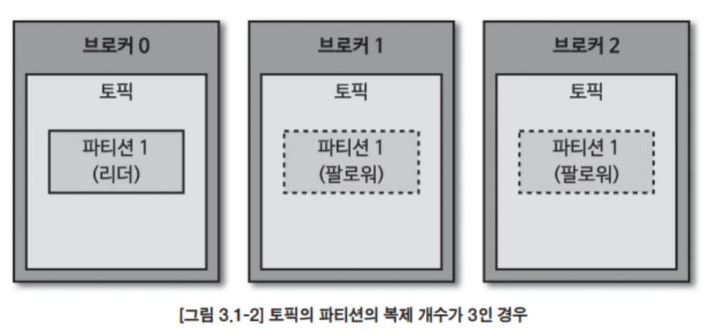
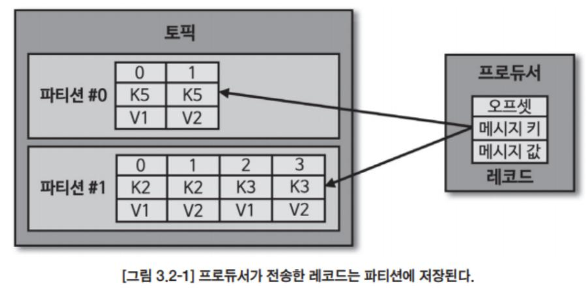

# 아파치 카프카 애플리케이션 프로그래밍

* https://github.com/bjpublic/apache-kafka-with-java

* docs https://kafka.apache.org/documentation/
* https://www.confluent.io/resources/ebook/dummies/?utm_medium=sem&utm_source=google&utm_campaign=ch.sem_br.nonbrand_tp.prs_tgt.content-search_mt.mbm_rgn.apac_lng.eng_dv.all_con.dummies&utm_term=kafka%20dummies&creative=&device=c&placement=&gad_source=1&gclid=Cj0KCQiA1Km7BhC9ARIsAFZfEIt3PQuelX4lvYhAO3FH8s1qUlGFGbtNdKEojz1GhZQe-JfbmxJm8U0aAkBeEALw_wcB


# Single Kafka 

```
version: '3.8'

services:
  kafka:
    image: confluentinc/cp-kafka:latest
    container_name: kafka
    ports:
      - "9092:9092"
    environment:
      KAFKA_BROKER_ID: 1
      KAFKA_PROCESS_ROLES: broker,controller
      KAFKA_NODE_ID: 1
      KAFKA_LISTENERS: PLAINTEXT://kafka:9092,CONTROLLER://kafka:9093
      KAFKA_ADVERTISED_LISTENERS: PLAINTEXT://kafka:9092
      KAFKA_LISTENER_SECURITY_PROTOCOL_MAP: PLAINTEXT:PLAINTEXT,CONTROLLER:PLAINTEXT
      KAFKA_INTER_BROKER_LISTENER_NAME: PLAINTEXT
      KAFKA_CONTROLLER_QUORUM_VOTERS: 1@kafka:9093
      KAFKA_CONTROLLER_LISTENER_NAMES: CONTROLLER
      KAFKA_LOG_DIRS: /var/lib/kafka/data
      KAFKA_OFFSETS_TOPIC_REPLICATION_FACTOR: 1
      KAFKA_TRANSACTION_STATE_LOG_MIN_ISR: 1
      KAFKA_TRANSACTION_STATE_LOG_REPLICATION_FACTOR: 1
      KAFKA_MIN_INSYNC_REPLICAS: 1
      CLUSTER_ID: WH5p_YTESu-Y3Hu7O9R_FQ
    volumes:
      - ./kafka-data:/var/lib/kafka/data
    networks:
      - kafka-network

  kafka-ui:
    image: provectuslabs/kafka-ui:latest
    container_name: kafka-ui
    ports:
      - "8080:8080"
    environment:
      - KAFKA_CLUSTERS_0_NAME=local
      - KAFKA_CLUSTERS_0_BOOTSTRAPSERVERS=kafka:9092
    depends_on:
      - kafka
    networks:
      - kafka-network

networks:
  kafka-network:
    driver: bridge

```

```
docker exec kafka kafka-topics --create --topic hello.kafka --bootstrap-server kafka:9092 --partitions 1 --replication-factor 1

파티션 수 3 복제 수 2 데이터 유지기간 7일
docker exec kafka kafka-topics --create \
  --topic example-topic \
  --bootstrap-server kafka:9092 \
  --partitions 3 \
  --replication-factor 2 \
  --config retention.ms=604800000 \
  --config cleanup.policy=delete

```

```
토픽 목록 확인

docker exec kafka kafka-topics --list --bootstrap-server localhost:9092
```

```
토픽 데이터 삽입 

docker exec -it kafka kafka-console-producer --topic hello.kafka --bootstrap-server kafka:9092

토피 데이터 컨슘
docker exec -it kafka kafka-console-consumer --topic hello.kafka --bootstrap-server kafka:9092 --from-beginning

```

````
Kafka를 효과적으로 사용하기 위해 다양한 명령어들을 사례에 맞게 정리했습니다. 이 명령어들은 Kafka 토픽 관리, 데이터 생산/소비, 그룹 관리 등 다양한 작업에 유용합니다.

---

### **1. 토픽 관련 명령어**

#### **1.1 토픽 목록 확인**
모든 토픽의 이름을 나열합니다.
```bash
docker exec kafka kafka-topics --list --bootstrap-server kafka:9092
```

#### **1.2 토픽 상세 정보 확인**
특정 토픽의 설정 및 상태를 확인합니다.
```bash
docker exec kafka kafka-topics --describe --topic hello.kafka --bootstrap-server kafka:9092
```

#### **1.3 토픽 삭제**
특정 토픽을 삭제합니다.
```bash
docker exec kafka kafka-topics --delete --topic hello.kafka --bootstrap-server kafka:9092
```

---

### **2. 데이터 생산 및 소비 관련 명령어**

#### **2.1 메시지 소비 (특정 시간 이후 데이터 읽기)**
특정 시간 이후의 데이터를 읽습니다.
```bash
docker exec kafka kafka-console-consumer --topic hello.kafka --bootstrap-server kafka:9092 --property print.timestamp=true --property print.key=true
```

#### **2.2 특정 키를 가진 메시지 생산**
메시지에 키를 추가하여 토픽에 삽입합니다.
```bash
docker exec -it kafka kafka-console-producer --topic hello.kafka --bootstrap-server kafka:9092 --property "parse.key=true" --property "key.separator=:"
```

입력 예시:
```plaintext
key1:value1
key2:value2
```

---

### **3. Consumer Group 관리 명령어**

#### **3.1 Consumer Group 목록 확인**
Kafka의 모든 Consumer Group을 나열합니다.
```bash
docker exec kafka kafka-consumer-groups --list --bootstrap-server kafka:9092
```

#### **3.2 특정 Consumer Group 상세 정보 확인**
Consumer Group의 오프셋 정보를 확인합니다.
```bash
docker exec kafka kafka-consumer-groups --describe --group <consumer-group-name> --bootstrap-server kafka:9092
```

#### **3.3 Consumer Group 오프셋 리셋**
특정 Consumer Group의 오프셋을 처음으로 리셋합니다.
```bash
docker exec kafka kafka-consumer-groups --bootstrap-server kafka:9092 --group <consumer-group-name> --topic hello.kafka --reset-offsets --to-earliest --execute
```

---

### **4. Kafka 클러스터 및 브로커 명령어**

#### **4.1 브로커 목록 확인**
Kafka 클러스터에 있는 브로커 목록을 확인합니다.
```bash
docker exec kafka zookeeper-shell kafka:2181 ls /brokers/ids
```

#### **4.2 브로커 정보 확인**
특정 브로커 ID에 대한 정보를 확인합니다.
```bash
docker exec kafka zookeeper-shell kafka:2181 get /brokers/ids/<broker-id>
```

---

### **5. 토픽 설정 변경 명령어**

#### **5.1 데이터 유지 기간 변경**
토픽의 데이터 유지 기간을 변경합니다.
```bash
docker exec kafka kafka-configs --alter --entity-type topics --entity-name hello.kafka --add-config retention.ms=3600000 --bootstrap-server kafka:9092
```

#### **5.2 파티션 수 변경**
기존 토픽의 파티션 수를 늘립니다. (단, 기존 파티션은 줄일 수 없음)
```bash
docker exec kafka kafka-topics --alter --topic hello.kafka --partitions 5 --bootstrap-server kafka:9092
```

---

### **6. 고급 명령어**

#### **6.1 특정 시간 이후의 메시지 소비**
특정 타임스탬프 이후의 메시지를 읽습니다.
```bash
docker exec kafka kafka-console-consumer --topic hello.kafka --bootstrap-server kafka:9092 --offset latest
```

#### **6.2 특정 파티션만 소비**
특정 파티션에서만 데이터를 소비합니다.
```bash
docker exec kafka kafka-console-consumer --topic hello.kafka --partition 0 --bootstrap-server kafka:9092 --offset earliest
```

#### **6.3 메시지 최대 크기 제한**
Producer를 통해 큰 메시지를 전송할 수 있도록 크기 제한을 설정합니다.
```bash
docker exec kafka kafka-topics --alter --topic hello.kafka --bootstrap-server kafka:9092 --config max.message.bytes=10485760
```

---

### **7. Kafka 상태 점검**

#### **7.1 토픽의 오프셋 상태 확인**
토픽의 오프셋 상태를 확인합니다.
```bash
docker exec kafka kafka-run-class kafka.tools.GetOffsetShell --broker-list kafka:9092 --topic hello.kafka
```

#### **7.2 클러스터 ID 확인**
Kafka 클러스터의 ID를 확인합니다.
```bash
docker exec kafka kafka-storage info --config /etc/kafka/kraft/server.properties
```

````


# 카프카 개념

### **브로커**

*  클라이언트와 데이터를 주고받기위해 사용하는 주체이자 데이터를 분산 저장하도록 도와주는 애플리케이션

* 하나의 서버의 한개의 카프카 브로커 프로세스가 실행 
* 3대이상의 브로커가 한개의 클러스터로 묶어서 운영. 클러스터로 묶인 브로커들은 프로듀서가 보낸 데이터를 안전하게 분산 저장하고 복제

### **전달된 데이터는 파일 시스템에 저장된다**

* 토픽 이름과 파티션 번호의 조합으로 하위 디렉토리를 생성하여 데이터를 저장한다
  * xxxxxx.index, xxxxxx.log, xxxxx.timeindex, partion.metadata
  * index는 메시지의 오프셋을 인덱싱한 정보, timeindex에는 메시지에 포함된 timestamp 값을 기준으로 인덱싱한 정보 
* 카프카는 페이지 캐시를 사용하여 디스크 입출력 속도를 높여서 속도 문제를 해결함
  * 페이지 캐시 : OS에서 파일 입출력 성능 향상을 위해 만들어놓은 메모리 영역. 한번 읽은 파일의 내용은 메모리의 페이지 캐시 영역에 저장하고, 동일한 파일의 접근이 일어나면 디스크에서 읽지 않고 메모리의 페이지 캐시에서 직접 읽음 

### 데이터 복제, 싱크

* 카프카의 데이터 복제는 파티션 단위로 이루어지며, 토픽 생성시 파티션의 복제 개수(replication factor)도 같이 설정된다.
* 복제 갯수의 최솟값은 1(복제 없음)이고 최댓값은 브로커 개수만큼 설정하여 사용가능하다 



* 복제된 파티션은 리더와 팔로워로 구성된다. 프로듀서 또는 컨슈머와 직접 통신하는 파티션을 리더, 나머지는 팔로워라고 부른다
* 팔로워 파티션들은 리더 파티션의 오프셋을 확인하여 현재 자신의 오프셋과 다른 경우 리더 파티션으로부터 데이터를 가져와 자신의 파티션에 저장한다. 
* 복제 개수만큼 저장 용량이 증가한다는 단점이 있지만 안전하다. 
* 리더 파티션이 있는 브로커가 다운되면, 팔로워 파티션 중 하나가 리더 파티션 지위를 넘겨받는다. 
  * 데이터가 일부 유실되어도 무관하고 속도가 중요하다면 복제는 1 또는 2, 중요하다면 최소 3으로 설정한다

### 컨트롤러

다수 브로커 중 한대가 컨트롤러 역할을 하며, 다른 브로커들의 상태를 체크하고 브로커가 클러스터에서 빠지는 경우 해당 브로커에 존재하는 리터 파티션을 재분배 한다. 컨트롤러 브로커가 장애가나면 다른 브로커가 컨트롤러 역할을 한다.

### 데이터 삭제

카프카는 다른 메시징 플랫폼과 다르게 컨슈머가 데이터를 컨슘하더라도 토픽의 데이터는 삭제되지 않는다. 컨슈머나 프로듀서가 데이터 삭제를 요청할 수도 없고, 브로커만이 데이터를 삭제할 수 있다.

데이터 삭제는 파일 단위로 이루어지는 이 단위를 로그 세그먼트라고 한다. 

카프카 브로커에 log.segement.bytes 또는 log.segment.ms옵션에 값이 설정되면 세그먼트 파일이 닫힌다. 세그먼트 파일이 닫히게 되는 기본값은 1GB용량에 도달했을떄인데, 간격을 줄이고 싶다면 작은용량으로 설정하면 된다

너무 작은 용량으로 설정하면, 데이터들을 저장하는 동안 세그먼트 파일을 자주 여닫음으로써 부하가 발생하게 된다. 

삭제 정책은 메시지를 어떻게 삭제할지 결정합니다.

- `log.cleanup.policy=delete`: 메시지가 유지 기간이 초과하면 삭제됩니다. (기본값)
- `log.cleanup.policy=compact`: 같은 키를 가진 메시지의 최신 값만 유지하고 이전 메시지는 삭제됩니다. (로그 컴팩션)

### 코디네이터

클러스터의 브로커 중 한대는 코디네이터의 역할을 수행한다. 

코디네이터는 컨슈머 그룹의 상태를 체크하고 파티션을 컨슈머와 매칭되도록 분배하는 역할을 한다.

그리고 컨슈머가 컨슈머 그룹에서 빠지면 매칭되지 않은 파티션을 컨슈머로 할당하여 끊임없이 데이터를 처리되도록 도와준다. 


# 토픽과 파티션

토픽은 카프카에서 데이터를 구분하기 위한 단위이다.



1개 이상의 파티션을 소유하고 있으며, 파티션에는 프로듀서가 보낸 데이터들이 들어가 저장되는 이 데이터를 레코드라고 부른다

파티션은 카프카 병렬처리 핵심으로써 그룹으로 묶인 컨슈머들이 레코드를 병렬로 처리할 수 있도록 매칭된다. 

컨슈머 개수와 파티션 개수도 늘리면 처리량이 증가하는 효과를 볼 수 있다.

### 토픽 이름 제약 조건

* 빈 문자열 지원하지 않음
* 이름의 길이 249 자 미만.
* 영어 대소문자 숫자 0~9, 마침표, 언더바, 하이픈 조합 생성 가능. 언더바와 마침표가 동시에 들어가면 안됌 

### 의미 있는 토픽 작성방법

* 환경.팀명.애플리케이션명.메시지타입 : prd.marketing-team.sms-platform.json
* 프로젝트명.서비스명.환경.이벤트명 : commerce.payment.prd.notification
* 환경.서비스명.jira번호.메시지타입 : dev.email-sender.jira-1234.emai-vo-custom
* 카프카클러스터명.환경.서비스명.메시지타입 : aws-kafka.live.marketing-platform.json

# 레코드

레코드는 타임스탬프, 키, 값, 오프셋, 헤더로 구성되어 있다.

브로커에 적재된 레코드는 수정할 수 없고, 로그 리텐션 기간 또는 용량에 따라서만 삭제된다.

타임스탬프는 자동으로 생성되지만, 프로듀서가 생성시 임의의 타임스탬프값도 설정할 수 있다. 

토픽 설정에 따라 브로커에 적재된 시간으로 설정될수도있다. 

메시지 키는 메시지 값을 순서대로 처리하거나 메시지 값의 종류를 나타내기 위해 사용한다. 

메시지 키의 해시값을 토대로 파티션을 지정한다. 동일한 메시지 키는 동일 파티션에 들어간다. 단 어느 파티션에 지정될 수는 알 수 없고, 파티션 개수가 변경되면 메시지 키와 파티션 매칭이 달라지게 되므로 주의해야 한다.

메시지 키를 사용하지 않는다면 null로 설정되고, 아무 파티션에 분배된다. 
