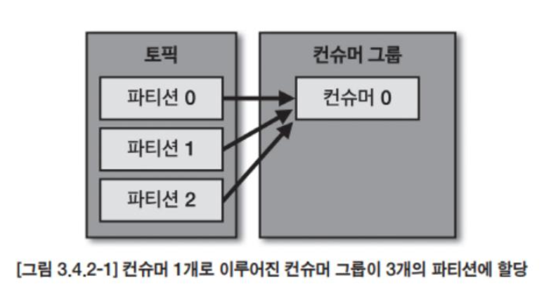
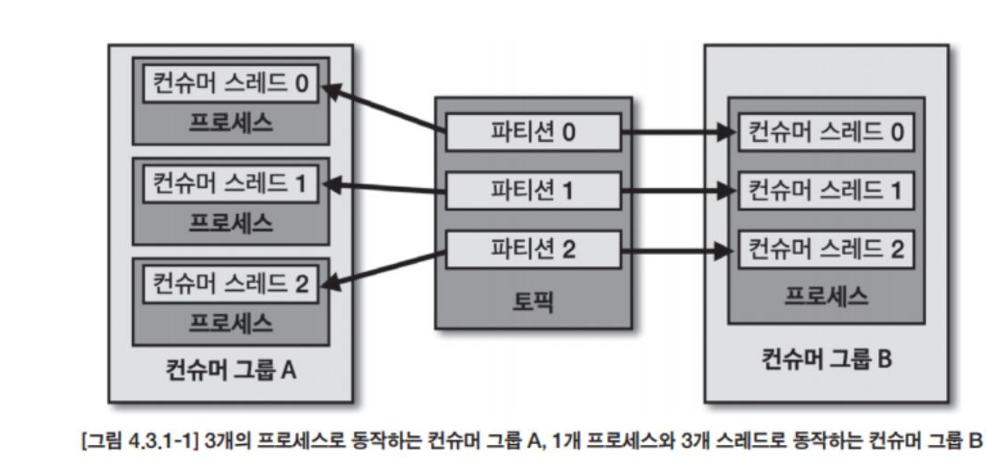

# 아파치 카프카 애플리케이션 프로그래밍

* https://github.com/bjpublic/apache-kafka-with-java

* docs https://kafka.apache.org/documentation/
* https://www.confluent.io/resources/ebook/dummies/?utm_medium=sem&utm_source=google&utm_campaign=ch.sem_br.nonbrand_tp.prs_tgt.content-search_mt.mbm_rgn.apac_lng.eng_dv.all_con.dummies&utm_term=kafka%20dummies&creative=&device=c&placement=&gad_source=1&gclid=Cj0KCQiA1Km7BhC9ARIsAFZfEIt3PQuelX4lvYhAO3FH8s1qUlGFGbtNdKEojz1GhZQe-JfbmxJm8U0aAkBeEALw_wcB


# Single Kafka 

```
version: '3.8'

services:
  kafka:
    image: confluentinc/cp-kafka:latest
    container_name: kafka
    ports:
      - "9092:9092"
    environment:
      KAFKA_BROKER_ID: 1
      KAFKA_PROCESS_ROLES: broker,controller
      KAFKA_NODE_ID: 1
      KAFKA_LISTENERS: PLAINTEXT://kafka:9092,CONTROLLER://kafka:9093
      KAFKA_ADVERTISED_LISTENERS: PLAINTEXT://kafka:9092
      KAFKA_LISTENER_SECURITY_PROTOCOL_MAP: PLAINTEXT:PLAINTEXT,CONTROLLER:PLAINTEXT
      KAFKA_INTER_BROKER_LISTENER_NAME: PLAINTEXT
      KAFKA_CONTROLLER_QUORUM_VOTERS: 1@kafka:9093
      KAFKA_CONTROLLER_LISTENER_NAMES: CONTROLLER
      KAFKA_LOG_DIRS: /var/lib/kafka/data
      KAFKA_OFFSETS_TOPIC_REPLICATION_FACTOR: 1
      KAFKA_TRANSACTION_STATE_LOG_MIN_ISR: 1
      KAFKA_TRANSACTION_STATE_LOG_REPLICATION_FACTOR: 1
      KAFKA_MIN_INSYNC_REPLICAS: 1
      CLUSTER_ID: WH5p_YTESu-Y3Hu7O9R_FQ
    volumes:
      - ./kafka-data:/var/lib/kafka/data
    networks:
      - kafka-network

  kafka-ui:
    image: provectuslabs/kafka-ui:latest
    container_name: kafka-ui
    ports:
      - "8080:8080"
    environment:
      - KAFKA_CLUSTERS_0_NAME=local
      - KAFKA_CLUSTERS_0_BOOTSTRAPSERVERS=kafka:9092
    depends_on:
      - kafka
    networks:
      - kafka-network

networks:
  kafka-network:
    driver: bridge

```

```
docker exec kafka kafka-topics --create --topic hello.kafka --bootstrap-server kafka:9092 --partitions 1 --replication-factor 1

파티션 수 3 복제 수 2 데이터 유지기간 7일
docker exec kafka kafka-topics --create \
  --topic example-topic \
  --bootstrap-server kafka:9092 \
  --partitions 3 \
  --replication-factor 2 \
  --config retention.ms=604800000 \
  --config cleanup.policy=delete

```

```
토픽 목록 확인

docker exec kafka kafka-topics --list --bootstrap-server localhost:9092
```

```
토픽 데이터 삽입 

docker exec -it kafka kafka-console-producer --topic hello.kafka --bootstrap-server kafka:9092

토피 데이터 컨슘
docker exec -it kafka kafka-console-consumer --topic hello.kafka --bootstrap-server kafka:9092 --from-beginning

```

````
Kafka를 효과적으로 사용하기 위해 다양한 명령어들을 사례에 맞게 정리했습니다. 이 명령어들은 Kafka 토픽 관리, 데이터 생산/소비, 그룹 관리 등 다양한 작업에 유용합니다.

---

### **1. 토픽 관련 명령어**

#### **1.1 토픽 목록 확인**
모든 토픽의 이름을 나열합니다.
```bash
docker exec kafka kafka-topics --list --bootstrap-server kafka:9092
```

#### **1.2 토픽 상세 정보 확인**
특정 토픽의 설정 및 상태를 확인합니다.
```bash
docker exec kafka kafka-topics --describe --topic hello.kafka --bootstrap-server kafka:9092
```

#### **1.3 토픽 삭제**
특정 토픽을 삭제합니다.
```bash
docker exec kafka kafka-topics --delete --topic hello.kafka --bootstrap-server kafka:9092
```

---

### **2. 데이터 생산 및 소비 관련 명령어**

#### **2.1 메시지 소비 (특정 시간 이후 데이터 읽기)**
특정 시간 이후의 데이터를 읽습니다.
```bash
docker exec kafka kafka-console-consumer --topic hello.kafka --bootstrap-server kafka:9092 --property print.timestamp=true --property print.key=true
```

#### **2.2 특정 키를 가진 메시지 생산**
메시지에 키를 추가하여 토픽에 삽입합니다.
```bash
docker exec -it kafka kafka-console-producer --topic hello.kafka --bootstrap-server kafka:9092 --property "parse.key=true" --property "key.separator=:"
```

입력 예시:
```plaintext
key1:value1
key2:value2
```

---

### **3. Consumer Group 관리 명령어**

#### **3.1 Consumer Group 목록 확인**
Kafka의 모든 Consumer Group을 나열합니다.
```bash
docker exec kafka kafka-consumer-groups --list --bootstrap-server kafka:9092
```

#### **3.2 특정 Consumer Group 상세 정보 확인**
Consumer Group의 오프셋 정보를 확인합니다.
```bash
docker exec kafka kafka-consumer-groups --describe --group <consumer-group-name> --bootstrap-server kafka:9092
```

#### **3.3 Consumer Group 오프셋 리셋**
특정 Consumer Group의 오프셋을 처음으로 리셋합니다.
```bash
docker exec kafka kafka-consumer-groups --bootstrap-server kafka:9092 --group <consumer-group-name> --topic hello.kafka --reset-offsets --to-earliest --execute
```

---

### **4. Kafka 클러스터 및 브로커 명령어**

#### **4.1 브로커 목록 확인**
Kafka 클러스터에 있는 브로커 목록을 확인합니다.
```bash
docker exec kafka zookeeper-shell kafka:2181 ls /brokers/ids
```

#### **4.2 브로커 정보 확인**
특정 브로커 ID에 대한 정보를 확인합니다.
```bash
docker exec kafka zookeeper-shell kafka:2181 get /brokers/ids/<broker-id>
```

---

### **5. 토픽 설정 변경 명령어**

#### **5.1 데이터 유지 기간 변경**
토픽의 데이터 유지 기간을 변경합니다.
```bash
docker exec kafka kafka-configs --alter --entity-type topics --entity-name hello.kafka --add-config retention.ms=3600000 --bootstrap-server kafka:9092
```

#### **5.2 파티션 수 변경**
기존 토픽의 파티션 수를 늘립니다. (단, 기존 파티션은 줄일 수 없음)
```bash
docker exec kafka kafka-topics --alter --topic hello.kafka --partitions 5 --bootstrap-server kafka:9092
```

---

### **6. 고급 명령어**

#### **6.1 특정 시간 이후의 메시지 소비**
특정 타임스탬프 이후의 메시지를 읽습니다.
```bash
docker exec kafka kafka-console-consumer --topic hello.kafka --bootstrap-server kafka:9092 --offset latest
```

#### **6.2 특정 파티션만 소비**
특정 파티션에서만 데이터를 소비합니다.
```bash
docker exec kafka kafka-console-consumer --topic hello.kafka --partition 0 --bootstrap-server kafka:9092 --offset earliest
```

#### **6.3 메시지 최대 크기 제한**
Producer를 통해 큰 메시지를 전송할 수 있도록 크기 제한을 설정합니다.
```bash
docker exec kafka kafka-topics --alter --topic hello.kafka --bootstrap-server kafka:9092 --config max.message.bytes=10485760
```

---

### **7. Kafka 상태 점검**

#### **7.1 토픽의 오프셋 상태 확인**
토픽의 오프셋 상태를 확인합니다.
```bash
docker exec kafka kafka-run-class kafka.tools.GetOffsetShell --broker-list kafka:9092 --topic hello.kafka
```

#### **7.2 클러스터 ID 확인**
Kafka 클러스터의 ID를 확인합니다.
```bash
docker exec kafka kafka-storage info --config /etc/kafka/kraft/server.properties
```

````

# 카프카 성능 테스트 1

#### **성능 테스트 및 벤치마킹**

Kafka 클러스터의 지연 시간을 정확히 측정하고 최적화하기 위해 성능 테스트를 수행하는 것이 중요합니다. 다음과 같은 도구와 방법을 사용할 수 있습니다.

- **Kafka Performance Tools**:
  - **kafka-producer-perf-test.sh**: 프로듀서의 처리량과 지연 시간을 테스트할 수 있는 도구입니다.
  - **kafka-consumer-perf-test.sh**: 컨슈머의 처리량과 지연 시간을 테스트할 수 있는 도구입니다.
- **벤치마킹 절차**:
  1. **테스트 환경 구성**: 실제 운영 환경과 유사한 테스트 클러스터를 구성합니다.
  2. **테스트 시나리오 정의**: 다양한 메시지 크기, 전송 속도, 파티션 수 등을 설정하여 테스트 시나리오를 정의합니다.
  3. **성능 측정**: 각 테스트 시나리오에서 지연 시간과 처리량을 측정합니다.
  4. **결과 분석 및 최적화**: 측정된 결과를 분석하여 병목 지점을 식별하고, 설정을 조정하여 성능을 최적화합니다.

# 카프카 개념

### **브로커**

*  클라이언트와 데이터를 주고받기위해 사용하는 주체이자 데이터를 분산 저장하도록 도와주는 애플리케이션

* 하나의 서버의 한개의 카프카 브로커 프로세스가 실행 
* 3대이상의 브로커가 한개의 클러스터로 묶어서 운영. 클러스터로 묶인 브로커들은 프로듀서가 보낸 데이터를 안전하게 분산 저장하고 복제

### **전달된 데이터는 파일 시스템에 저장된다**

* 토픽 이름과 파티션 번호의 조합으로 하위 디렉토리를 생성하여 데이터를 저장한다
  * xxxxxx.index, xxxxxx.log, xxxxx.timeindex, partion.metadata
  * index는 메시지의 오프셋을 인덱싱한 정보, timeindex에는 메시지에 포함된 timestamp 값을 기준으로 인덱싱한 정보 
* 카프카는 페이지 캐시를 사용하여 디스크 입출력 속도를 높여서 속도 문제를 해결함
  * 페이지 캐시 : OS에서 파일 입출력 성능 향상을 위해 만들어놓은 메모리 영역. 한번 읽은 파일의 내용은 메모리의 페이지 캐시 영역에 저장하고, 동일한 파일의 접근이 일어나면 디스크에서 읽지 않고 메모리의 페이지 캐시에서 직접 읽음 

### 데이터 복제, 싱크

* 카프카의 데이터 복제는 파티션 단위로 이루어지며, 토픽 생성시 파티션의 복제 개수(replication factor)도 같이 설정된다.
* 복제 갯수의 최솟값은 1(복제 없음)이고 최댓값은 브로커 개수만큼 설정하여 사용가능하다 


* 복제된 파티션은 리더와 팔로워로 구성된다. 프로듀서 또는 컨슈머와 직접 통신하는 파티션을 리더, 나머지는 팔로워라고 부른다
* 팔로워 파티션들은 리더 파티션의 오프셋을 확인하여 현재 자신의 오프셋과 다른 경우 리더 파티션으로부터 데이터를 가져와 자신의 파티션에 저장한다. 
* 복제 개수만큼 저장 용량이 증가한다는 단점이 있지만 안전하다. 
* 리더 파티션이 있는 브로커가 다운되면, 팔로워 파티션 중 하나가 리더 파티션 지위를 넘겨받는다. 
  * 데이터가 일부 유실되어도 무관하고 속도가 중요하다면 복제는 1 또는 2, 중요하다면 최소 3으로 설정한다

### 컨트롤러

다수 브로커 중 한대가 컨트롤러 역할을 하며, 다른 브로커들의 상태를 체크하고 브로커가 클러스터에서 빠지는 경우 해당 브로커에 존재하는 리터 파티션을 재분배 한다. 컨트롤러 브로커가 장애가나면 다른 브로커가 컨트롤러 역할을 한다.

### 데이터 삭제

카프카는 다른 메시징 플랫폼과 다르게 컨슈머가 데이터를 컨슘하더라도 토픽의 데이터는 삭제되지 않는다. 컨슈머나 프로듀서가 데이터 삭제를 요청할 수도 없고, 브로커만이 데이터를 삭제할 수 있다.

데이터 삭제는 파일 단위로 이루어지는 이 단위를 로그 세그먼트라고 한다. 

카프카 브로커에 log.segement.bytes 또는 log.segment.ms옵션에 값이 설정되면 세그먼트 파일이 닫힌다. 세그먼트 파일이 닫히게 되는 기본값은 1GB용량에 도달했을떄인데, 간격을 줄이고 싶다면 작은용량으로 설정하면 된다

너무 작은 용량으로 설정하면, 데이터들을 저장하는 동안 세그먼트 파일을 자주 여닫음으로써 부하가 발생하게 된다. 

삭제 정책은 메시지를 어떻게 삭제할지 결정합니다.

- `log.cleanup.policy=delete`: 메시지가 유지 기간이 초과하면 삭제됩니다. (기본값)
- `log.cleanup.policy=compact`: 같은 키를 가진 메시지의 최신 값만 유지하고 이전 메시지는 삭제됩니다. (로그 컴팩션)

### 코디네이터

클러스터의 브로커 중 한대는 코디네이터의 역할을 수행한다. 

코디네이터는 컨슈머 그룹의 상태를 체크하고 파티션을 컨슈머와 매칭되도록 분배하는 역할을 한다.

그리고 컨슈머가 컨슈머 그룹에서 빠지면 매칭되지 않은 파티션을 컨슈머로 할당하여 끊임없이 데이터를 처리되도록 도와준다. 


# 토픽과 파티션

토픽은 카프카에서 데이터를 구분하기 위한 단위이다.


1개 이상의 파티션을 소유하고 있으며, 파티션에는 프로듀서가 보낸 데이터들이 들어가 저장되는 이 데이터를 레코드라고 부른다

파티션은 카프카 병렬처리 핵심으로써 그룹으로 묶인 컨슈머들이 레코드를 병렬로 처리할 수 있도록 매칭된다. 

컨슈머 개수와 파티션 개수도 늘리면 처리량이 증가하는 효과를 볼 수 있다.

### 토픽 이름 제약 조건

* 빈 문자열 지원하지 않음
* 이름의 길이 249 자 미만.
* 영어 대소문자 숫자 0~9, 마침표, 언더바, 하이픈 조합 생성 가능. 언더바와 마침표가 동시에 들어가면 안됌 

### 의미 있는 토픽 작성방법

* 환경.팀명.애플리케이션명.메시지타입 : prd.marketing-team.sms-platform.json
* 프로젝트명.서비스명.환경.이벤트명 : commerce.payment.prd.notification
* 환경.서비스명.jira번호.메시지타입 : dev.email-sender.jira-1234.emai-vo-custom
* 카프카클러스터명.환경.서비스명.메시지타입 : aws-kafka.live.marketing-platform.json

## 레코드

레코드는 타임스탬프, 키, 값, 오프셋, 헤더로 구성되어 있다.

브로커에 적재된 레코드는 수정할 수 없고, 로그 리텐션 기간 또는 용량에 따라서만 삭제된다.

타임스탬프는 자동으로 생성되지만, 프로듀서가 생성시 임의의 타임스탬프값도 설정할 수 있다. 

토픽 설정에 따라 브로커에 적재된 시간으로 설정될수도있다. 

메시지 키는 메시지 값을 순서대로 처리하거나 메시지 값의 종류를 나타내기 위해 사용한다. 

메시지 키의 해시값을 토대로 파티션을 지정한다. 동일한 메시지 키는 동일 파티션에 들어간다. 단 어느 파티션에 지정될 수는 알 수 없고, 파티션 개수가 변경되면 메시지 키와 파티션 매칭이 달라지게 되므로 주의해야 한다.

메시지 키를 사용하지 않는다면 null로 설정되고, 아무 파티션에 분배된다. 

## 카프카 클라이언트

### 프로듀서

카프카 클라이언트는 라이브러리이며 직접 카프카 서버와 통신한다. 프로듀서 애플리케이션은 브로커의 특정 토픽에 파티션에 전송한다. 프로듀서는 리더 파티션을 가지고 있는 카프카 브로커와 직접 통신한다. 직렬화하면 이미지 텍스트 동영상 등 바이너리 데이터도 프로듀서를 통해 전송할 수 있다. 


프로듀서는 카프카 브로커로 데이터 전송시 내부적으로 파티셔너, 배치 생성 단계를 거친다.


프로듀서 인스턴스가 send() 호출시, ProducerRecord는 파티셔너에서 토픽의 어느 파티션으로 전송될 것인지 정해진다. 파티셔너를 따로 설저하지 않으면 기본값은 DefaultPartinioner로 설정되어 파티션이 정해진다. 

파티셔너에의해 구분된 레코드는 데이터를 전송하기 전에 accumulator에 데이터를 버퍼로 쌓아놓고 발송한다. 그리고 sender 스레드가 지정되어 어큐물레이터에 쌓인 배치 데이터를 가져가 카프카 브로커로 전송한다.

압축 옵션을 통해 전송할 수 있으며 ,디폴트는 압축을 안한 상태이고 gzip, snappy, lz4, zstd를 지원한다. 

* 카프카가 압축 및 해제하는게아니고 프로듀서 앱, 컨슈머 앱에서 압축과 해제를 진행함. 

### 프로듀서 주요 옵션

* http://bit.ly/3aSdIRr

### **Kafka 프로듀서 설정 옵션**

| 옵션 이름                                 | 필수/선택 | 설명                                                         | 기본값                                                       |
| ----------------------------------------- | --------- | ------------------------------------------------------------ | ------------------------------------------------------------ |
| **bootstrap.servers**                     | 필수      | 프로듀서가 데이터를 전송할 대상 Kafka 클러스터에 속한 브로커의 호스트 이름:포트를 1개 이상 지정합니다. 2개 이상의 브로커 정보를 입력하여 일부 브로커에 문제가 발생해도 연결에 문제가 없도록 설정할 수 있습니다. | 없음                                                         |
| **key.serializer**                        | 필수      | 레코드의 메시지 키를 직렬화하는 클래스를 지정합니다. 일반적으로 `StringSerializer` 또는 사용자 정의 직렬화기를 사용합니다. | 없음                                                         |
| **value.serializer**                      | 필수      | 레코드의 메시지 값을 직렬화하는 클래스를 지정합니다. 일반적으로 `StringSerializer` 또는 사용자 정의 직렬화기를 사용합니다. | 없음                                                         |
| **acks**                                  | 선택      | 프로듀서가 전송한 데이터가 브로커들에 정상적으로 저장되었는지 확인하는 옵션입니다. `0`, `1`, `all` 중 하나로 설정할 수 있으며, 설정값에 따라 데이터 유실 가능성이 달라집니다. `all`은 가장 높은 안정성을 제공합니다. | `1`                                                          |
| **buffer.memory**                         | 선택      | 브로커로 전송할 데이터를 배치로 모으기 위해 설정할 버퍼 메모리 양을 지정합니다. | `33554432` (32MB)                                            |
| **retries**                               | 선택      | 프로듀서가 브로커로부터 에러를 받고 난 뒤 재전송을 시도하는 횟수를 지정합니다. 높은 값을 설정하면 일시적인 네트워크 문제나 브로커 장애 시 데이터 전송 성공 가능성이 높아집니다. | `2147483647`                                                 |
| **batch.size**                            | 선택      | 배치로 전송할 레코드의 최대 용량을 지정합니다. 너무 작게 설정하면 네트워크 부담이 증가하고, 너무 크게 설정하면 메모리 사용량이 증가할 수 있습니다. | `16384` (16KB)                                               |
| **linger.ms**                             | 선택      | 배치를 전송하기 전까지 기다리는 최소 시간을 지정합니다. 이 값을 늘리면 더 많은 레코드를 배치로 보낼 수 있어 처리량이 증가하지만, 지연 시간이 증가할 수 있습니다. | `0`                                                          |
| **partitioner.class**                     | 선택      | 레코드를 특정 파티션에 전송할 때 적용할 파티셔너 클래스를 지정합니다. 기본값은 `org.apache.kafka.clients.producer.internals.DefaultPartitioner`입니다. | `org.apache.kafka.clients.producer.internals.DefaultPartitioner` |
| **enable.idempotence**                    | 선택      | 프로듀서를 멱등성 모드로 설정할지 여부를 지정합니다. 멱등성 프로듀서를 활성화하면 중복된 메시지 전송을 방지할 수 있습니다. | `false`                                                      |
| **transactional.id**                      | 선택      | 프로듀서가 레코드를 트랜잭션 단위로 묶을지 여부를 설정하며, 고유한 트랜잭션 ID를 지정할 수 있습니다. 이 옵션을 설정하면 트랜잭션 프로듀서로 동작하게 됩니다. | `null`                                                       |
| **compression.type**                      | 선택      | 전송되는 메시지의 압축 방식을 지정합니다. `none`, `gzip`, `snappy`, `lz4`, `zstd` 중 선택할 수 있으며, 압축을 통해 네트워크 대역폭을 절약할 수 있습니다. | `none`                                                       |
| **max.in.flight.requests.per.connection** | 선택      | 단일 연결당 동시에 보낼 수 있는 최대 요청 수를 지정합니다. 높은 값을 설정하면 처리량이 증가하지만, 메시지 순서 보장이 어려울 수 있습니다. `enable.idempotence`를 `true`로 설정한 경우 이 값을 `5` 이하로 설정해야 메시지 순서가 보장됩니다. | `5`                                                          |
| **security.protocol**                     | 선택      | Kafka 클러스터와의 통신에 사용할 보안 프로토콜을 지정합니다. `SSL`, `SASL_PLAINTEXT`, `SASL_SSL` 등을 설정하여 보안을 강화할 수 있습니다. | `PLAINTEXT`                                                  |
| **client.id**                             | 선택      | 클라이언트 식별을 위해 사용되는 식별자입니다. 모니터링 및 로깅 목적으로 유용하며, 여러 프로듀서 인스턴스를 구분할 때 사용됩니다. | 없음                                                         |
| **max.request.size**                      | 선택      | 단일 요청에서 보낼 수 있는 최대 바이트 수를 지정합니다. 큰 메시지를 전송해야 하는 경우 이 값을 늘릴 수 있습니다. | `1048576` (1MB)                                              |
| **delivery.timeout.ms**                   | 선택      | 메시지가 전송되기까지의 최대 시간을 밀리초 단위로 지정합니다. 이 시간이 초과되면 메시지 전송이 실패한 것으로 간주됩니다. | `120000` (2분)                                               |
| **retry.backoff.ms**                      | 선택      | 재시도 간 대기 시간을 밀리초 단위로 지정합니다. 기본값은 `100ms`이며, 재시도 시 브로커에 부담을 줄이기 위해 대기 시간을 설정할 수 있습니다. |                                                              |

### **추가적으로 중요한 설정 옵션**

| 옵션 이름                                 | 필수/선택 | 설명                                                         | 기본값          |
| ----------------------------------------- | --------- | ------------------------------------------------------------ | --------------- |
| **compression.type**                      | 선택      | 메시지 압축 방식을 지정합니다. 압축을 사용하면 네트워크 대역폭을 절약할 수 있으며, `gzip`, `snappy`, `lz4`, `zstd` 등을 선택할 수 있습니다. 압축 방식에 따라 CPU 사용량과 압축/압축 해제 속도가 달라집니다. | `none`          |
| **max.in.flight.requests.per.connection** | 선택      | 단일 연결당 동시에 보낼 수 있는 최대 요청 수를 지정합니다. 높은 값을 설정하면 처리량이 증가하지만, 메시지 순서 보장이 어려울 수 있습니다. 특히 `enable.idempotence`를 `true`로 설정한 경우 이 값을 `5` 이하로 설정해야 메시지 순서가 보장됩니다. | `5`             |
| **security.protocol**                     | 선택      | Kafka 클러스터와의 통신에 사용할 보안 프로토콜을 지정합니다. `SSL`, `SASL_PLAINTEXT`, `SASL_SSL` 등을 설정하여 보안을 강화할 수 있습니다. 보안 요구사항에 따라 적절히 설정해야 합니다. | `PLAINTEXT`     |
| **client.id**                             | 선택      | 클라이언트 식별을 위해 사용되는 식별자입니다. 모니터링 및 로깅 목적으로 유용하며, 여러 프로듀서 인스턴스를 구분할 때 사용됩니다. | 없음            |
| **max.request.size**                      | 선택      | 단일 요청에서 보낼 수 있는 최대 바이트 수를 지정합니다. 큰 메시지를 전송해야 하는 경우 이 값을 늘릴 수 있습니다. 기본값은 `1MB`입니다. | `1048576` (1MB) |
| **delivery.timeout.ms**                   | 선택      | 메시지가 전송되기까지의 최대 시간을 밀리초 단위로 지정합니다. 이 시간이 초과되면 메시지 전송이 실패한 것으로 간주됩니다. 기본값은 `2분`입니다. 이 값을 조정하여 애플리케이션의 요구사항에 맞게 메시지 전송 시간을 조절할 수 있습니다. | `120000` (2분)  |
| **retry.backoff.ms**                      | 선택      | 재시도 간 대기 시간을 밀리초 단위로 지정합니다. 기본값은 `100ms`이며, 재시도 시 브로커에 부담을 줄이기 위해 대기 시간을 설정할 수 있습니다. |                 |


### 메시지 키를 가진 데이터를 전송하는 프로듀서

```
val record = ProducerRecord(TOPIC_NAME, "Pangyo", "Pangyo")
        producer.send(record)
```

```
docker exec -it kafka kafka-console-consumer \
    --bootstrap-server localhost:9092 \
    --topic test \
    --from-beginning \
    --property print.key=true \
    --property key.separator=-
```

### 커스텀 파티셔너

특정 데이터를 가지는 레코드를 특정 파티션으로 보내야 한다면?

* Pangyo라는 값을 가진 메시지 키가 0번 파티션으로 들어가야 한다면?

기본 설정 파티셔너 사용할 경우 메시지 키의 해시 값을 파티션에 매칭하여 전송해서 어떤 파티션에 들어가는지 알수 없다.

Partitoner 인터페이스를 사용하여 사용자 정의 파티셔너를 생성하면, 특정 키 값을 가진 메시지 키에 대해 무조건 파티션 0번으로 지정하도록 할 수 있다.

이렇게 지정할 경우 토픽의 파티션 개수가 변경되더라도 특정 키는 무조건 특정 파티션으로 보낼 수 있다.

### 브로커 정상 여부 확인

producer.send로 보내고 난 후 get()을 통해서 future를 얻을 수 있다.

send는 카프카 브로커로부터 응답을 기다렸다 브로커로부터 응답이 오면 RecordMetadata 인스턴스를 반환한다

* 토픽이름 ,파티션번호, 오프셋번호, 타임스탬프 등

매번 확인하는것은 빠른 전송에 허들이 되므로 비동기로 콜백을 전달할 수 있다.

```kotlin
class ProducerCallback : Callback {
    override fun onCompletion(recordMetadata: RecordMetadata, e: Exception?) {

        if (e != null) logger.error(e.message, e)
        
        else logger.info(recordMetadata.toString())
    }

    companion object {
        private val logger: Logger = LoggerFactory.getLogger(ProducerCallback::class.java)
    }
}

val record = ProducerRecord(TOPIC_NAME, "Pangyo", "Pangyo")
producer.send(record, ProducerCallback())
```

데이터의 순서가 중요하다면 재전송으로 인해 순서가 섞일 수 있으므로 동기로 전송 결과를 받아야 한다. 

## 컨슈머 API

```kotlin
object SimpleConsumer {
    private val logger: Logger = LoggerFactory.getLogger(SimpleConsumer::class.java)
    private const val TOPIC_NAME = "test"
    private const val BOOTSTRAP_SERVERS = "localhost:9092"
    private const val GROUP_ID = "test-group1"

    @JvmStatic
    fun main(args: Array<String>) {
        val configs = Properties()
        configs[ConsumerConfig.BOOTSTRAP_SERVERS_CONFIG] = BOOTSTRAP_SERVERS
        configs[ConsumerConfig.GROUP_ID_CONFIG] = GROUP_ID
        configs[ConsumerConfig.KEY_DESERIALIZER_CLASS_CONFIG] = StringDeserializer::class.java.name
        configs[ConsumerConfig.VALUE_DESERIALIZER_CLASS_CONFIG] = StringDeserializer::class.java.name

        val consumer = KafkaConsumer<String, String>(configs)

        consumer.subscribe(listOf(TOPIC_NAME))

        while (true) {
            val records = consumer.poll(Duration.ofSeconds(1))
            println(records.count())
            for (record in records) {
                logger.info("record:{}", record)
            }
        }
    }
}
```

프로듀서가 전송한 데이터는 브로커에 적재되며 컨슈머는 데이터를 가져와서 필요한 처리를 함

* 컨슈머 그룹을 통해 컨슈머의 목적 구분 가능. 
  * email 처리면 애플리케이션을 email-app-group 으로 묶어 동일한 역할을 하는 컨슈머를 묶어 관리 가능
  * 컨슈머 그룹 기준으로 컨슈머 오프셋을 관리하기 때문에 subscribe()메소드를 사용하여 토픽을 구독하는 경우 그룹을 선언해야함
  * 컨슈머가 중단되거나 재시작 되더라도 컨슈머 오프셋을 기준으로 이후 데이터를 처리하기 때문. 
  * 선언하지 않으면 어떤 그룹에도 속하지 않는 컨슈머로 동작

### 컨슈머 주요 개념

토픽의 파티션으로부터 데이터를 가져가기 위해 컨슈머를 운영하는 방법은 크게 2가지가 있다.



1. 1개 이상의 컨슈머로 이루어진 컨슈머 그룹 운영
2. 토픽의 특정 파티션만 구독하는 컨슈머 운영

컨슈머 그룹으로 묶인 컨슈머들은 토픽의 1개 이상 파티션들에 할당되어 데이터를 가져갈 수 있다.


* 컨슈머 그룹으로 묶인 컨슈머가 토픽을 구독해서 데이터를 가져갈 때, 1개의 파티션은 최대 1개의 컨슈머에 할당 가능하다. 
  * 이는 Kafka의 파티션 소비 모델의 핵심으로, 파티션의 메시지가 중복 소비되지 않도록 보장

* 그리고 1개 컨슈머는 여러개의 파티션에 할당될 수 있다.
  * 4개의 파티션과 2개의 컨슈머가 있는 경우, 2개의 파티션이 각 컨슈머에 할당
  * 만약 컨슈머의 수가 파티션 수보다 적다면, 1개의 컨슈머가 여러 파티션을 담당

* 즉, 컨슈머 그룹의 컨슈머 수는 가져가고자 하는 토픽의 파티션 개수보다 같거나 작아야 한다. 
  * **컨슈머 수가 파티션 수보다 많을 경우**:
    - 남는 컨슈머는 할당받을 파티션이 없으므로 대기 상태가 됌.
    - 예를 들어, 4개의 파티션과 6개의 컨슈머가 있다면, 2개의 컨슈머는 아무 파티션도 할당받지 못한다.

**Kafka의 파티션-컨슈머 할당 규칙**:

1. **1 파티션당 1 컨슈머**: 파티션은 컨슈머 그룹 내에서 유일하게 할당.
2. **1 컨슈머가 여러 파티션을 소비 가능**: 컨슈머 수가 파티션 수보다 적을 때 발생.
3. **컨슈머는 파티션보다 많을 수 있음**: 이 경우, 여분의 컨슈머는 할당받지 못하고 대기 상태.

컨슈머 그룹은 다른 컨슈머 그룹과 격리되므로, 각기 다른 역할을 하는 컨슈머 그룹끼리는 영향을 받지 않는 장점이 있다.

> 엘라스틱서치의 장애로 인해 더는 적재 가 되지 못하더라도 하둡으로 데이터를 적재하는 데에는 문제가 없다. 엘라스틱서치의 장애가 해소되면 엘라스틱서치로 적재하는 컨슈머의 컨슈머 그룹은 마지막으로 적재 완료한 데이터 이후부터 다시 적재를 수행하여 최종적으로 모두 정상화될 것이다.
>
> 그룹별로 컨슈머는 처리한 메시지의 마지막 오프셋을 Kafka 브로커에 저장(커밋하므로 **커밋된 오프셋 이후의 데이터부터 다시 소비**할 수 있다.

* 카프카는 그룹별로 오프셋을 관리한다.
* group1은 오프셋이 10, group2는 20일 수 있다.
* 오프셋은 카프카 내부 __consumer_offsets라는 내부 토픽에 오프셋 정보를 저장한다.  

컨슈머에 장애 발생시, 장애가 발생한 컨슈머에 할당된 파티션은 장애가 발생하지 않은 컨슈머에 소유권이 넘어간다 -> 리밸런싱

리밸런싱은 2가지 상황에서 일어난다

1. 컨슈머가 추가되는 상황
2. 컨슈머가 제외되는상황

리밸런싱은 언제든 발생할 수 있으므로 리밸런싱에 대응하는 코드를 작성해야 한다. 

```kotlin
object RebalanceConsumer {
    private val logger: Logger = LoggerFactory.getLogger(RebalanceConsumer::class.java)
    private const val TOPIC_NAME = "test-topic"
    private const val BOOTSTRAP_SERVERS = "localhost:9092"
    private const val GROUP_ID = "rebalance-group"

    @JvmStatic
    fun main(args: Array<String>) {
        val configs = Properties().apply {
            put(ConsumerConfig.BOOTSTRAP_SERVERS_CONFIG, BOOTSTRAP_SERVERS)
            put(ConsumerConfig.GROUP_ID_CONFIG, GROUP_ID)
            put(ConsumerConfig.KEY_DESERIALIZER_CLASS_CONFIG, StringDeserializer::class.java.name)
            put(ConsumerConfig.VALUE_DESERIALIZER_CLASS_CONFIG, StringDeserializer::class.java.name)
            put(ConsumerConfig.ENABLE_AUTO_COMMIT_CONFIG, "false") // 수동 커밋 설정
        }

        val consumer = KafkaConsumer<String, String>(configs)
        val currentOffsets = mutableMapOf<TopicPartition, OffsetAndMetadata>()

        // 리밸런스 리스너 정의
        val rebalanceListener = object : ConsumerRebalanceListener {
            override fun onPartitionsRevoked(partitions: Collection<TopicPartition>) {
                // 리밸런스 이전 작업: 처리 중인 데이터의 오프셋 커밋
                logger.info("Partitions revoked: $partitions")
                logger.info("Committing current offsets: $currentOffsets")
                consumer.commitSync(currentOffsets) // 현재 처리된 데이터를 안전하게 저장
                currentOffsets.clear()
            }

            override fun onPartitionsAssigned(partitions: Collection<TopicPartition>) {
                // 리밸런스 이후 작업: 새롭게 할당된 파티션에 대한 초기화
                logger.info("Partitions assigned: $partitions")
                for (partition in partitions) {
                    val committedOffset = consumer.committed(partition)
                    logger.info("Starting consumption from committed offset: $committedOffset for partition $partition")
                }
            }
        }

        consumer.subscribe(listOf(TOPIC_NAME), rebalanceListener)

        try {
            while (true) {
                val records = consumer.poll(Duration.ofMillis(100))
                for (record in records) {
                    logger.info("Consumed record: partition=${record.partition()}, offset=${record.offset()}, value=${record.value()}")
                    // 현재 처리 중인 파티션의 오프셋 저장
                    currentOffsets[TopicPartition(record.topic(), record.partition())] =
                        OffsetAndMetadata(record.offset() + 1)
                }
                // 오프셋 커밋
                consumer.commitAsync(currentOffsets) { offsets, exception ->
                    if (exception != null) {
                        logger.error("Commit failed for offsets $offsets", exception)
                    } else {
                        logger.info("Offsets successfully committed: $offsets")
                    }
                }
            }
        } catch (e: Exception) {
            logger.error("Unexpected error in consumer loop", e)
        } finally {
            consumer.close()
        }
    }
}
```

리밸런싱은 가용성을 높여주지만 자주 일어나서는 안됀다. 리밸런싱 발생시 컨슈머가 토픽의 데이터를 읽을 수 없는 타이밍이 생기기 때문이다.

컨슈머는 카프카 브로커로부터 데이터를 어디까지 가져갔는지 오프셋을 commit을 통해 기록한다. 오프셋을 남기지 않으면 어디까지 읽었는지 모르기 때문에 주옵ㄱ이 발생할 수 있기 때문이다. 

* 카프카 브로커 내부 토픽인 __consumer_offsets에 기록된다.

오프셋 커밋은 컨슈머 애플리케이션에서 명시적/비명시적 으로 수행할 수 있다.

기본 옵션은 enable.auto.commit=true다. 

* 일정 간격마다 자동 커밋되는것을 비명시 오프셋 커밋이라 한다
* auto.commit.interval.ms에 설정된 값과 함께 사용된다. 이 값 이상이 지나면 그 시점까지 읽은 레코드의 오프셋을 커밋한다. 

비명시 오프셋 커밋은 편리하지만, poll 메서드 호출 이후 리밸런싱 또는 컨슈머 강제 종료 발생시, 데이터가 중복 또는 유실될 수 있는 가능성이 있다.

**때문에 데이터 중복이나 유실을 허용하지 않는 서비스라면 자동 커밋을 사용해서는 안된다.**

명시적으로 오프셋을 커밋하려면 poll() 메서드 호출 이후 commitSync()메서드를 호출하면 된다.  poll() 메서드를 통해 반환된 레코드의 가장 마지막 오프셋을 기준으로 커밋을 수행한다.

```kotlin
while (true) {
    val records = consumer.poll(Duration.ofMillis(1000))
    val offsets: MutableMap<TopicPartition, OffsetAndMetadata> = HashMap()
    for (record in records) {
        System.out.printf(
            "Consumed record: key=%s, value=%s, partition=%d, offset=%d%n",
            record.key(), record.value(), record.partition(), record.offset()
        )
        // Store the offset to commit
        offsets[TopicPartition(record.topic(), record.partition())] = OffsetAndMetadata(record.offset() + 1)
    }
    // 1. 기본 커밋
    consumer.commitSync()
    // 2. 특정 오프셋 커밋
    consumer.commitSync(offsets)
    // 3. 특정 오프셋 커밋 + 타임아웃 설정
    consumer.commitSync(offsets, Duration.ofSeconds(5))
}
```

commitSync()는 브로커에 커밋 요청을 하고, 커밋이 정상적으로 처리되었는지 응답을 기다리는데 이는 컨슈머의 처리량에 영향을 끼친다.

데이터 처리시간에 비해 커밋 요청 및 응답에 시간이 오래 걸리면 동일 시간당 데이터 처리량이 줄어들기 때문이다. 이를 위해 commitAsync()메서드를 사용하여, 커밋 요청을 전송하고 응답이 오기 전까지 데이터 처리를 수행할 수 있다.

그러다 async(비동기)커밋은 커밋 요청이 실패했을 경우, 현재 처리중인 데이터의 순서를 보장하지 않으며 데이터의 중복 처리가 발생할 수 있다.

```kotlin
val records = consumer.poll(Duration.ofSeconds(1))
for (record in records) {
    logger.info("record:{}", record)
}
consumer.commitAsync { offsets, e ->
    if (e != null) System.err.println("Commit failed")
    else println("Commit succeeded")
    if (e != null) logger.error("Commit failed for offsets {}", offsets, e)
}
```


컨슈머 내부에서는, poll()을 통해 레코드를 반환받지만 호출 시점에 클러스터에서 데이터를 가져오는것은 아니다. 내부 Fetcher 인스턴스가 애플리케이션 시작시점에 생성되어 poll 메서드들을 호출하기 전에 미리 레코드들을 내부 큐로 가져온다. 이후 사용자가 명시적으로 호출하면, 컨슈머는 내부 큐에 있는 레코드들을 반환받아 처리를 수행한다.

### 컨슈머 주요 옵션

* https://kafka.apache.org/documentation/#consumerconfigs

| **구분**      | **옵션 이름**             | **설명**                                                     | **기본값**         |
| ------------- | ------------------------- | ------------------------------------------------------------ | ------------------ |
| **필수 옵션** | `bootstrap.servers`       | 프로듀서가 데이터를 전송할 대상 Kafka 클러스터에 속한 브로커의 호스트 이름:포트를 1개 이상 작성한다. <br />2개 이상의 브로커 정보를 입력하면 일부 브로커에 이슈가 발생하더라도 접속 이슈를 방지할 수 있다. | -                  |
|               | `key.deserializer`        | 레코드의 메시지 키를 역직렬화하는 클래스를 지정한다.         | -                  |
|               | `value.deserializer`      | 레코드의 메시지 값을 역직렬화하는 클래스를 지정한다.         | -                  |
| **선택 옵션** | `group.id`                | 컨슈머 그룹 ID를 지정한다.<br /> `subscribe()` 메서드로 토픽을 구독하여 사용할 때 필수이다. | `null`             |
|               | `auto.offset.reset`       | 컨슈머 그룹이 특정 파티션을 읽을 때 저장된 오프셋이 없을 경우 어느 오프셋부터 읽을지 선택한다. 옵션 값: `latest` (가장 최근 오프셋), `earliest` (가장 오래된 오프셋), `none` (오프셋 기록이 없으면 오류 반환). | `latest`           |
|               | `enable.auto.commit`      | 오프셋을 자동 커밋으로 할지 수동 커밋으로 할지 선택한다.     | `true`             |
|               | `auto.commit.interval.ms` | 자동 커밋(`enable.auto.commit=true`)일 경우 오프셋 커밋 간격을 지정한다. | `5000` (5초)       |
|               | `max.poll.records`        | `poll()` 메서드를 통해 반환되는 레코드 개수를 지정한다.      | `500`              |
|               | `session.timeout.ms`      | 컨슈머가 브로커와 연결이 끊기는 최대 시간. 이 시간 내에 하트비트(heartbeat)를 전송하지 않으면 브로커는 컨슈머에 문제가 있다고 판단하고 리밸런싱을 시작한다. 보통 하트비트 간격의 3배로 설정한다. | `10000` (10초)     |
|               | `heartbeat.interval.ms`   | 하트비트를 전송하는 시간 간격.                               | `3000` (3초)       |
|               | `max.poll.interval.ms`    | `poll()` 메서드를 호출하는 간격의 최대 시간을 지정한다. 호출 후 데이터 처리 시간이 너무 길어지면 비정상으로 판단하고 리밸런싱을 시작한다. | `300000` (5분)     |
|               | `isolation.level`         | 트랜잭션 프로듀서가 레코드를 트랜잭션 단위로 보낼 경우 사용한다. 옵션 값: `read_committed` (커밋된 레코드만 읽음), `read_uncommitted` (커밋 여부와 관계없이 모든 레코드 읽음). | `read_uncommitted` |

### 리밸런스 리스너를 가진 컨슈머

컨슈머 그룹에서 컨슈머가 추가 또는 제거되면 파티션을 컨슈머에 재할당하는 과정인 리밸런스가 일어난다.

poll() 메서드를 통해 반환받은 데이터를 처리하기 전에 리밸런스가 발생하면 커밋하지 않았기 때문에 데이터를 중복 처리할 수 있다.

리밸런스 발생 시 중복 처리를 방지하기 위해서는 리밸런스 발생 시 처리한 데이터를 기준으로 커밋을 시도해야 한다.

리밸런스 발생 감지하기 위해 ConsumterRebalanceListener 인터페이스를 지원한다,

* 수동 커밋하기 위해 ENABLE_AUTO_COMMIT_CONFIG를 false로 두고 리스너를 구현한다.

### 컨슈머의 안전한 종료

컨슈머를 안전하게 종료 안하면, 동작을 하지 않는 컨슈머가 파티션에 할당되있어서 파티션의 데이터는 소모되지 못하고 컨슈머 랙이 늘어나게 된다. 즉 처리지연이 발생한다.

컨슈머를 안전하게 종료하기 위해 wakeup()메서드를 지원한다.

```
consumer.wakeup()
```


## 어드민 API

카프카 클라이언트는 내부 옵션 설정 및 조회하기 위해 AdminClient 클래스를 제공한다

활용예시

* 컨슈머를 멀티 스레드로 생성시 구독하는 토픽의 파티션 수만큼 스래드 생성
* 웹 대시보드 구현
* 토픽의 파티션을 늘림

```kotlin
object KafkaAdminClient {
    private val logger: Logger = LoggerFactory.getLogger(KafkaAdminClient::class.java)
    private const val BOOTSTRAP_SERVERS = "localhost:9092"

    @Throws(java.lang.Exception::class)
    @JvmStatic
    fun main(args: Array<String>) {
        val configs = Properties()
        configs[ProducerConfig.BOOTSTRAP_SERVERS_CONFIG] = BOOTSTRAP_SERVERS
        val admin = AdminClient.create(configs)
        
        logger.info("== Get broker information")
        
        for (node in admin.describeCluster().nodes().get()) {
          ...
```

* 브로커 정보 조회
* 토픽 리스트 조회(파티션 수, 위치, 리더 파티션 위치 등 )
* 컨슈머 그룹 조회
* 신규 토픽 생성
* 파티션 개수 변경
* 접근 제어 규칙 생성 등

## 3.5 카프카 스트림즈

카프카 스트림즈는 토픽에 적재된 데이터를 statueful 또는 stateless로 실시간 변환하여 다른 토픽에 적재하는 라이브러리이다.

카프카 스트림즈의 토폴로지 구조는 트리와 유사하다.


토폴로지를 이루는 노드를 하나의 프로세서라고 부르고, 노드와 노드를 이은 선을 스트림 이라고 부른다. 

프로세서는 소스, 스트림, 싱크 프로세서가 있다.

소스 프로세서는 하나 이상의 토픽에서 데이터를 가져오는 역할을 한다.

스트림 프로세서는 반환한 데이터를 처리하는 역할을 한다

싱크 프로세서는 데이터를 특정 카프카 토픽으로 저장하는 역할을 한다.

카프카 스트림즈는 DSL과 프로세서 API 2가지 방법으로 개발 가능하다. 

### 스트림즈 DSL 

스트림즈 dsl에는 레코드의 흐름을 추상화한 KStream, KTable, GlobalKTable이 있다.

KStream

* 레코드의 흐름을 표현, 메시지 키와 메시지 값으로 구성되어있음. 

KTable

* 메시지 키를 기준으로 묶어서 사용. 
* 유니크한 메시지 키를 기준으로 가장 최신 레코드를 조회 가능 

GlobalKTable

* KTable과 동일하지만, KTable로 선언된 토픽은 1개 파티션이 1개 태스크에 할당되어 사용, GlobalKTable로 선언된 토픽은 모든 파티션 데이터가 각 태스크에 할당되어 사용됌

## 카프카 커넥트

특정한 작업 형태를 템플릿으로 만들어놓은 커넥터를 실행함으로써  파이프라인 반복 작업을 줄여주기 위한 툴.

프로듀서 - 소스 커넥터

컨슈머 - 싱크 커넥터

MySQL, s3, mongodb등과 같은 저장소에서도 가져올 수 있따.


오픈소스 커넥터는 https://confluent.io/hub/에서 검색할 수 있다.

### 커넥트 실행 방법

단일모드 커넥트, 분산모드 커넥트가 있다.

단일모드 커넥트는 비교적 간단한 애플리케이션이고 1개 프로세스만 실행하는데 단일 모드라서 SPOF가 될 수 있다. 

분산모드 커넥트는 2대 이상의 서버에서 클러스터 형태로 운영함으로써 단일모드 커넥트 대비 안전하게 운영할 수 있다. 또한 댓수를 늘려 스케일 아웃해서 처리량을 늘릴수도 있다.

REST API로 커넥트의 종류 상태 등을 조회할 수 있다.

* localhost:8083/connectors ~ 

## 소스 커넥터

소스 커넥터는 소스 애플리케이션 또는 소스 파일로부터 데이터를 가져와 토픽으로 넣는 역할을 한다. 

* 오픈소스 말고 직접 구현하려면 SourceConnector와 SourceTask 클래스를 사용하여 직접 소스 커넥터를 구현하면 됀다. jar로 만들고 플러그인으로 추가해서 쓴다.

## 싱크 커넥터

싱크 커넥터는 토픽의 데이터를 타깃 애플리케이션 또는 파일로 저장하는 역할을 한다.

## 카프카 미러메이커2

카프카 미러메이커2는 서로 다른 두개의 클러스터 간 토픽을 복제하는 애플리케이션.

굳이 미러메이커2를 쓰는 이유는 모든 것을 복제할 필요성이 있기 때문

MirrorMaker는 특정 용도에 적합하지만, 대규모 또는 고도화된 데이터 복제 시 다음과 같은 대체 도구가 더 많이 사용됩니다:

1. **Confluent Replicator**:
   - Confluent Platform의 일부로 MirrorMaker보다 더 강력한 복제 기능을 제공합니다.
   - GUI 기반 관리 도구와 Confluent Control Center를 통해 사용하기 쉽습니다.
   - Kafka 클러스터 간 복제를 위한 상업용 솔루션으로 주로 사용됩니다.
2. **Debezium**:
   - Kafka를 활용한 Change Data Capture(CDC) 도구로, MirrorMaker 대신 주로 데이터베이스 변경 사항을 복제하는 데 사용됩니다.
3. **Apache Flink**:
   - MirrorMaker 대신 사용될 수 있는 스트리밍 처리 엔진으로, 실시간 데이터 복제를 포함하여 복잡한 스트리밍 데이터 파이프라인 구축에 적합합니다.
4. **Custom Kafka Connect Pipelines**:
   - Kafka Connect를 사용하여 데이터를 복제하는 사용자 정의 파이프라인을 구축할 수 있습니다.
   - MirrorMaker 2가 Kafka Connect 기반이므로 일부 복제 시나리오에서는 MirrorMaker 2보다 더 유연하게 사용할 수 있습니다.

### 현재 MirrorMaker를 쓸지 고민해야 할 시점

MirrorMaker(특히 2)는 여전히 특정 복제 시나리오에서 적합하지만, 다음과 같은 경우 대안을 고려하는 것이 좋습니다:

- **고도화된 요구사항**: 예를 들어, 메시지 필터링, 데이터 변환, 높은 가용성 요구사항.
- **대규모 클러스터 간 복제**: 복제 속도와 안정성을 최우선으로 요구.
- **운영 및 관리 편의성**: MirrorMaker는 설정 및 모니터링이 비교적 번거롭습니다.

### 액티브 스텐바이 클러스터

재해 복구를 위해 임시 카프카 클러스터를 하나 더 구성해서 액티브-스탠바이로 운영할 수 있다.

### 액티브-액티브 클러스터

서비스 애플리케이션간 통신 지연을 최소화 하기 위해 2개 이상의 클러스터를 두고 서로 데이터를 미러링하면서도 사용할 수 있다.

### 허브 앤 스포크 클러스터

각 팀에서 소규모 카프카 클러스터를 사용하고, 각 팀의 클러스터의 데이터를 한개의 카프카 클러스터에 모아 데이터 레이크로 사용하고 싶다면?


# 카프카 상세 개념

## 토픽과 파티션

토픽은 카프카의 시작과 끝. 토픽을 삭제하면 데이터는 삭제되고 파이프라인은 중단됌

### 적정 파티션 개수

토픽의 파티션 수는 카프카의 성능과 관련이 있다.

토픽 최초 생성시 파티션 개수를 고려해야할 점

* 데이터 처리량
* 메시지 키 사용 여부
* 브로커,컨슈머 영향도

데이터 처리 속도를 올리는 방법

* 컨슈머의 처리량 증가 (단일)
  * 스케일 업, GC 튜닝 
* 컨슈머를 추가해서 병렬 처리량 증가 
  * 파티션 수를 늘리고 파티션 수만큼 컨슈머 추가 
  * 컨슈머 데이터 처리량과 생성량 파티션 개수 공식
    * 프로듀서 전송 량 < 컨슈머 처리량 x 파티션 수 
    * 프로듀서가 보내는 데이터보다처리량이 적다면 컨슈머 랙이 생김 
    * 랙 : 프로듀서가 생성한 데이터와 컨슈머가 소비한 데이터 간의 차이

컨슈머 데이터 처리량 구하는 방법

* 더미 데이터로 테스트 해봐야 함 
  * 로컬에서는 다른 시스템과 연동이 되지 않기때문에 상용 처리량과 차이가 날 확률이 높음 

파티션 개수를 무조건 늘리는것이 답은 아니다.

* 컨슈머, 브로커의 부담이 있기 때문 ( 리밸런싱 )
* 지연 발생에 따른 서비스 영향도를 고려하여 파티션 수를 구하는것이 중요

메시지 키 사용 여부

* 메시지 키 사용 여부와 데이터 처리 순서와 연관이 있다.
* 메시지 키를 해싱하여 파티션을 매칭시키는데, 파티션 수가 달라지면 이미 매칭된 파티션과 메시지 키의 매칭이 깨져 전혀 다른 파티션에 데이터가 할당됌
* 파티션 수가 변해야 하는 경우, 기존에 사용하던 메시지 키의 매칭을 그대로 가져가기 위해 커스텀 파티셔너를 개발하고 적용해야 한다
* 이런 어려움 때문에 파티션 수를 프로듀서가 전송하는 양보다 넉넉하게 잡고 생성하는 것이 좋다.
* 반면 메시지 키를 사용하지만 데이터 처리 순서를 지키지 않아도 된다면 파티션 개수를 처음부터 넉넉하게 잡지않아도 됌.

브로커와 컨슈머의 영향도

* 파티션은 각 브로커의 파일 시스템을 사용하기 때문에 파티션이 늘어나는 만큼 브로커에서 접근하는 파일 수가 많아짐.
* os는 프로세스당 열 수 있는 파일 최대 개수를 제한함 
* 그러므로 각 브로커당 파티션 개수를 모니터링 해야 함 
* 브로커가 관리하는 파티션 수가 너무 많다면, 파티션 수를 분산하기 위해 카프카 브로커 개수를 늘려야 함

### 토픽 정리 정책

토픽의 데이터는 시간 또는 용량에 따라 삭제 규칙을 적용할 수 있다.

삭제를 원치 않는다면 클러스터가 살아있는 한 데이터를 삭제하지 않을수도 있다.

데이터를 더는 사용하지 않을 경우 남겨두면 비용이 늘어나므로 cleanup.policy 옵션을 사용하여 데이터를 삭제한다

* 첫번째는 delete로 완전 삭제
* 두번째는 compect로 동일 메시지 키의 가장 오래된 데이터를 삭제

**delete**

명시적으로 토픽의 데이터를 삭제. 삭제할때는 세그먼트 단위로 삭제를 진행 

삭제 정책이 실행되는 시점은 시간 또는 용량이 기준이 된다

* retention.ms : 토픽의 데이터를 유지하는 기간.
  * 일정 주기마다 세그먼트 파일의 마지막 수정시간과 retention.ms를 비교하는데 마지막 수정 시간이 retention.ms를 넘어가면 세그먼트는 삭제됌
* retention.bytes: 토픽의 최대 데이터 크기를 제어
  * retention.bytes를 넘어간 세그먼트 파일은 삭제되며 삭제되면 복구 불가능

compact

* 일반적인 압축이 아님. 해당 메시지 키의 레코드 중 오래된 데이터를 삭제하는 정책

* 1개 파티션에서 오프셋 증가가 일정하지 않을 수 있다. 왜?

* 1부터 10까지 오프셋이 있고, 4 5 6 이 동일한 키를 가질 경우 오프셋과 관계 없이 중간에 있는 4,5 오프셋 레코드가 삭제될 수 있음. 6에 비해 45는 오래되었기 때문 

* 압축 정책은 액티브 세그먼트를 제외한 나머지 세그먼트에 한해서만 데이터를 처리함. 

  * 압축 시작지점 : min.cleanable.dirty.ratio 
  * 액티브 세그먼트를 제외한 세그먼트에 남아있는 데이터의 tail 영역의 레코드 수와 head 영역의 레코드 개수의 비율.
  * tail은 브로커 압축정책에 의해 압축 완료된 레코드를 뜻하며 clean 로그라고 부름. 
  * 더티 영역은 헤드 영역의 레코드

  

  * 0.5 로 설정시 더티 비율이 0.5가 넘어가면 압축 수행
  * 0.9를 설정하면 한번 압축 할 시 많은 데이터가 줄지만, 용량을 계속 차지하므로 용량 효율이 좋지 않음
  * 0.1처럼 두면 압축이 자주 일어나기 때문에 메시지 키의 최신 데이터만 유지할 수 있지만, 그만큼 브로커에 부담을 줌

### ISR (In-Sync-Replicas)

ISR은 리더 파티션과 팔로워 파티션이 모두 싱크가 된 상태를 뜻한다.

싱크(동기화)가 완료됐다는 의미는 리더 파티션의 모든 데이터가 팔로워에 모두 (오프셋 모두) 복제된 상태이다.

리더에 데이터 적재된 후 팔로워가 복제하는 시간이 걸리므로 오프셋 차이가 발생한다. 이런 차이를 리더 파티션은 replica.lag.time.max.ms값 만큼 주기를 가지고 팔로워가 데이터를 복제하는지 확인한다.

팔로워 파티션이 해당 값보다 더 긴 시간동안 가져가지 않는다면 문제가 생긴것으로 판단하고 ISR 그룹에서 제외한다.

ISR 로 묶인 리더-팔로워 파티션은 데이터가 모두 동일하기 때문에 팔로워는 리더로 선출될 자격을 가진다.

unclean.leader.election.enable이 true이면 ISR이아닌, 싱크되지 않은 파티션도 리더로 선출될 수 있으며, false인경우 리더 파티션이 부활할떄까지 기다린다.

일부 데이터 유실되더라도 무중단 운영이 중요하다면 true

절대 유실되면 안되면 false

* false인경우, 부활할때까지 몇분 또는 몇시간 중단 발생 가능 
* 해당옵션은 토픽별로 설정할 수 있다. 

## 카프카 프로듀서

### acks 옵션

acks는 0, 1, all(-1)을 가질 수 있으며 이 옵션을 통해 프로듀서가 전송한 데이터가 클러스터에 얼마나 신뢰성 높게 저장할 지 지정할 수 있다.

복제개수가 1인경우에 옵션에 따른 성능변화는 크지 않지만 복제개수가 2 이상인 경우는 성능 차이가 좀 있다.

#### acks = 0

프로듀서가 리더 파티션으로 데이터 전송했을 때 데이터가 저장되었는지 확인하지 않음. 프로듀서는 데이터 전송 실패시 리트라이도 가능한데, acks가 0이면 데이터가 저장되었음을 가정하고 다음 데이터를 보내므로 리트라이 하지 않음.

일부 유실이 발생하더라도 전송 속도가 중요한 경우 이 옵션을 사용

#### acks = 1

1인경우 리더 파티션에만 정상 적재되었는지 확인한다. 리더에 정상 적재 되지 않았으면 리트라이가 가능하다. 

리더에 적재된게 보장되더라도 데이터는 유실될 수 있는데, 적재되자마자 리더에 장애가나도 팔로워에 복제되지 않았으면 데이터는 유실될 수 있음. 

1로 설정하면 데이터 적재 뒤 응답 값을 받기 때문에 akcs = 0보다 전송속도가 느리다.

#### acks=all 

리더와 팔로워 모두에 적재 완료되었는지 확인하므로 0, 1 옵션보다 느리다.

이 경우 토픽 단위로 설정 가능한 min.insync.replicas 옵션에 따라 안정성이 달라진다. all은 ISR에 포함된 파티션들을 뜻하는 것이기 때문에.

이 옵션이 1이라면 최소 1개이상의 파티션에 적재가 되었음을 확인하는것. 즉 리더만 확인하는것이라 1인경우 의미가 없고 2부터 의미가 있다. ISR의 2개 이상 파티션에 정상 적재되었음을 확인한다는 뜻 

min.insync.replicas옵션 사용시 복제 수도 고려해야 한다. 

카프카 브로커 개수가 min.insync.replicas 옵션보다 작은 경우엔 프로듀서가 데이터를 전송할 수 없기 때문. 

* min.insync.replicas가 3인데 브로커 한대 장애나서 클러스터 브로커가 2대뿐이라면 

절대 브로커와 동일하게 두면 안되고 브로커 개수 미만으로 설정해서 운영해야 함. 

### 멱등성(idempotence) 프로듀서

멱등성 프로듀서는 동일한 데이터를 여러번 전송하더라도 클러스터에 단 한번만 저장됨을 의미한다. 프로듀서에서 enable.idempotence옵션을 사용하여 exactly once를 지원한다. 기본값은 false이다. 

멱등성 프로듀서는 데이터를 브로커로 전달시 프로듀서 유니크 id와 시퀀스 넘버를 전달한다. 브로커는 프로듀서 유니크 id와 시퀀스를 확인하여, 동일한 메시지가 와도 단 한번만 데이터를 적재한다. 

단, 멱등성 프로듀서는 동일한 세션 에서만 지원한다. 즉 애플리케이션을 재시작하면 PID( 프로듀서 유니크 아이디)가 달라지므로, 껏다 켜지지 않는 경우에만 해야한다.

### 트랜잭션 프로듀서

다수 파티션에 데이터를 저장할 경우 모든 데이터에 대해 동일한 원자성을 만족시키기 위해 사용한다. 원자성을 만족시킨단 것은 다수의 데이터를 동일 트랜잭션으로 묶음으로써 전체 데이터를 처리하거나 하지 않는것을 의미

* 트랜잭션 프로듀서 사용하려면 
  * enable.idempotence = true, transactional.id = 임의 String 값으로 정의
  * 컨슈머의 isolation.level을 read_committed로 설정 


트랜잭션은 파티션의 레코드로 구분하며, 프로듀서는 트랜잭션의 시작과 끝을 표현하기 위해 트랜잭션 레코드를 한 개 더 보낸다.

트랜잭션 컨슈머는 트랜잭션 레코드를 보고 트랜잭션이 완료 되었음을 확인하고 데이터를 가져간다. 

* 레코드의 특성상 오프셋은 한개 차지할 수밖에 없다

커밋 데이터가 있어야만 가져가지, 만약 데이터만 있고 트랜잭션 레코드가 없다면 트랜잭션이 완료된것이 아니므로 데이터를 가져가지 않는다. 

## 카프카 컨슈머

## 멀티스레드 컨슈머

토픽의 파티션은 1개 이상이며 1개의 파티션은 1개 컨슈머가 할당되어 데이터 처리 가능.

파티션 개수가 n개라면 동일 컨슈머 그룹으로 묶인 컨슈머 스레드를 최대 n개 운영 가능. 그러므로 n개의 스레드를 가진 1개의 프로세스를 운영할 수도 있다.



컨슈머를 멀티 스레드로 활용하는 방식은 크게 두가지로 나뉜다.

1. 컨슈머 스레드는 1개만, 데이터 처리용 워커 스레드를 여러개 둠
2. 컨슈머 인스턴스에서 poll을 하는 스레드를 여러개 띄워 사용하는 컨슈머 멀티 스레드

### 카프카 컨슈머 멀티 워커 스레드 전략

멀티 스레드 사용시 각기 다른 레코드 들을 동시에 실행할 수 있기 때문에 처리 시간을 현저히 줄일 수 있음. 

```kotlin
val executorService = Executors.newCachedThreadPool()
while (true) {
    val records = consumer.poll(Duration.ofSeconds(10))
    for (record in records) {
        val worker = ConsumerMultiWorker(record.value())
        executorService.execute(worker)
    }
}
```

주의할점

* 스레드를 사용함으로써 데이터 처리가 끝나지 않았음에도 불구하고 커밋을 하기 때문에 리밸런싱 컨슈머 장애시 유실 발생할 수 있음.
* 스레드의 처리시간이 각기 다를 수 있기 때문이 이전 레코드가 다음 레코드가보다 나중에 처리될 수 있음. 

즉 데이터 역전현상이 발생해도 상관없고 매우 빠른 처리를 할 시 적합

### 컨슈머 멀티 스레드 전략

구독하고자 하는 토픽의 파티션 수 만큼 컨슈머 스레드 개수를 늘려서 운영

```kotlin

object MultiConsumerThread {
    private const val TOPIC_NAME = "test"
    private const val BOOTSTRAP_SERVERS = "my-kafka:9092"
    private const val GROUP_ID = "test-group"
    private const val CONSUMER_COUNT = 3

    @JvmStatic
    fun main(args: Array<String>) {
        val configs = Properties()
        configs[ConsumerConfig.BOOTSTRAP_SERVERS_CONFIG] = BOOTSTRAP_SERVERS
        configs[ConsumerConfig.GROUP_ID_CONFIG] = GROUP_ID
        configs[ConsumerConfig.KEY_DESERIALIZER_CLASS_CONFIG] = StringDeserializer::class.java.name
        configs[ConsumerConfig.VALUE_DESERIALIZER_CLASS_CONFIG] = StringDeserializer::class.java.name

        val executorService = Executors.newCachedThreadPool()

        for (i in 0 until CONSUMER_COUNT) {
            val worker = MultiConsumerWorker(configs, TOPIC_NAME, i)
            executorService.execute(worker)
        }
    }
}

class MultiConsumerWorker internal constructor(
    private val prop: Properties,
    private val topic: String, number: Int
) : Runnable {
    private val threadName = "consumer-thread-$number"
    private var consumer: KafkaConsumer<String, String> = KafkaConsumer(prop)

    override fun run() {
        consumer.subscribe(listOf(topic))
        
        while (true) {
            val records = consumer.poll(Duration.ofSeconds(1))
            for (record in records) {
                logger.info("{}", record)
            }
            consumer.commitSync()
        }
    }

    companion object {
        private val logger: Logger = LoggerFactory.getLogger(MultiConsumerWorker::class.java)
    }
}
```

## 컨슈머 랙 LAG

토픽의 최신 오프셋과 컨슈머 오프셋간의 차이다.

컨슈머 랙은 컨슈머가 정상 동작하는지 여부를 확인할 수 있기 때문에 필수적으로 모니터링 해야한다. 

컨슈머 랙은 컨슈머 그룹과 토픽, 파티션별로 생성된다. 

* 1개의 토픽에  3개의 파티션이 있고, 1개의 컨슈머 그룹이 토픽을 구독한다면 컨슈머 랙은 총 3개 가 됌.


프로듀서의 전송량이 컨슈머 처리량보다 크면 랙은 커지고, 컨슈머 처리량이 더크면 랙은 작아진다. 최솟값은 0 

컨슈머 랙을 모니터링함으로써 처리량, 장애, 파티션 개수 지정에 도움이 된다. 

#### 컨슈머 랙 확인방법

프로그래밍 방법

컨슈머 metrics() 사용

```kotlin
for ((metricName, metric) in kafkaConsumer.metrics()) {
    if (metricName.name() == "records-lag-max" ||
        metricName.name() == "records-lag" ||
        metricName.name() == "records-lag-avg") {
        logger.info("${metricName.name()}: ${metric.metricValue()}")
    }
}
```


1. 명령어

```
kafka-consumer-groups.sh --bootstrap-server localhost:9092 --describe --group <consumer-group-id>

GROUP           TOPIC         PARTITION  CURRENT-OFFSET  LOG-END-OFFSET  LAG
my-consumer     test-topic    0          100             150             50
my-consumer     test-topic    1          200             220             20

```

* *LAG: 각 파티션별 컨슈머 랙.*

2. 모니터링 도구 

   1. **Confluent Control Center**: Kafka의 컨슈머 그룹과 랙을 직관적으로 확인 가능.

      **Prometheus + Grafana**:

      - Kafka Exporter를 사용하여 컨슈머 랙 데이터를 수집하고 시각화.
      - 관련 메트릭: `kafka_consumergroup_lag`

3. 어드민 클라이언트 사용

   1. Kafka AdminClient나 Metrics API를 사용하여 랙 데이터를 프로그래밍 방식으로 수집 가능.

#### 카프카 버로우

LinkedIn에서 개발한 **Kafka 클러스터의 컨슈머 랙(Consumer Lag)을 모니터링하기 위한 도구**

* REST API를 통해 컨슈머 그룹별 컨슈머 랙을 조회할 수 있다.

* 이메일 슬랙 알림 설정 등이 있다.
* 다중 클러스터를 지원하며 설정은 간단한 JSON 등으로 설정한다

그러나 CPU / 디스크 I/O등은 모니터링할 수 없어 주로 프로메테우스 그라파나 카프카 익스포터를 사용해서 메트릭을 수집한다. 

카프카 버로우는 컨슈머 그룹 중심의 모니터링만 필요한 경우 사용하면 좋다. 

#### 컨슈머 랙 줄이는 방법

1. **컨슈머 스케일 아웃**:
   - 컨슈머 그룹 내 컨슈머 개수를 늘려 병렬 처리를 강화.
   - 주의: 파티션 수보다 컨슈머 수가 많아도 의미 없음.
2. **컨슈머 애플리케이션 최적화**:
   - 데이터 처리 로직의 병목 제거.
   - 비동기 처리 도입.
3. **Kafka 클러스터 튜닝**:
   - 브로커 수 증가.
   - 네트워크 성능 최적화.
   - 압축 및 파티션 구성을 최적화.
4. **오프셋 커밋 주기 조정**:
   - 오프셋을 자주 커밋하여 재처리 범위를 줄임.
   - `auto.commit.interval.ms` 값을 조정.

### 컨슈머 배포 프로세스

애플리케이션은 자주 변경되고 배포된다. 카프카 컨슈머 운영시 로직 변경으로 인한 배포 방법은 크게 두가지가 있다.

1. 중단배포
2. 무중단 배포


#### 중단 배포

컨슈머 앱을 완전히 종료 이후 애플리케이션을 배포하는 방식. 한정된 서버 자원을 운영하는 기업에 적합하다.

중단배포 사용시 특정 오프셋 지점으로 명확하게 나눌 수 있는것이 장점이다.

#### 무중단 배포

무중단 배포는 3가지 방법이 있따

* 블루/그린, 롤링, 카나리

**블루그린배포는** 파티션 수와 컨슈머 수를 동일하게 실행하는 애플리케이션 운영시 유용하다. 왜냐하면 신규버전 애플리케이션을 배포하고 동일 컨슈머 그룹으로 파티션을 구독하도록 실행하면 신규 컨슈머들은 파티션을 할당받지 못할 수 있기 때문이다. 

신규 버전 애플리케이션들이 준비되면 기존 애플리케이션을 모두 중단하고, 리밸런싱이 발생하면서 파티션은 모두 신규 컨슈머와 연동한다. 

블루그린은 리밸런스가 1번만 발생하기 때문에 많은 수의 파티션을 운영하는 경우에도 짧은 리밸런스 시간으로 배포를 수행할 수 있다.

**롤링배포는** 파티션 개수가 인스턴스 수와 같거나 그보다 많아야 한다.

파티션을 2개로 운영하는 토픽이 있다면 롤링 배포를 위해 최소 2개 인스턴스가 필요하다 

2개 인스턴스 중 1개 인스턴스를 신규로 실행하고 나머지 1개 인스턴스를 신규 버전으로 배포하여 롤링을 진행한다

이 경우 리밸런스가 총 2번 발생하며, 파티션 개수가 많을수록 리밸런스 시간도 길어지므로 파티션 개수가 많지 않은 경우에 효과적이다. 

**카나리 배포는** **새로운 컨슈머 애플리케이션 버전**을 배포할 때, 전체 컨슈머를 업데이트하지 않고 **소수의 컨슈머**에만 먼저 업데이트를 적용하여 변경 사항의 안정성을 확인하는 **점진적 배포 전략**

카나리 배포로 사전 테스트가 완료 되면 나머지 파티션에 할당된 컨슈머는 롤링 또는 블루 그린 배포를 수행하여 무중단 배포를 수행한다. 
