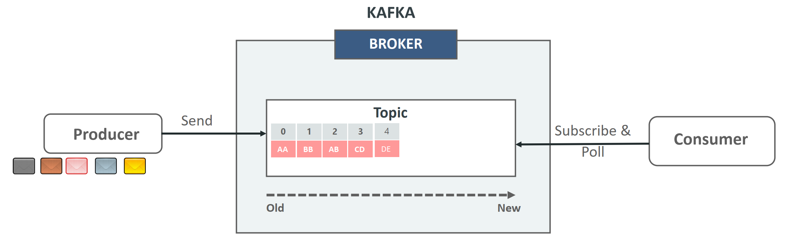
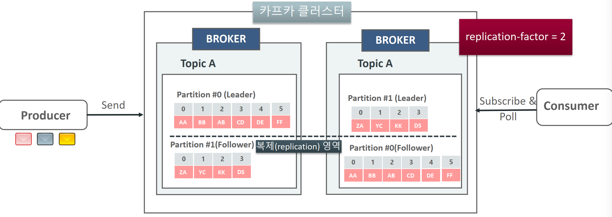
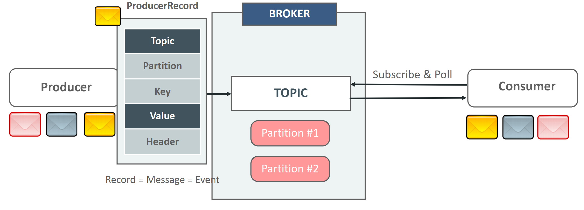
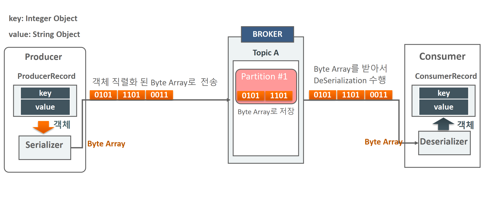
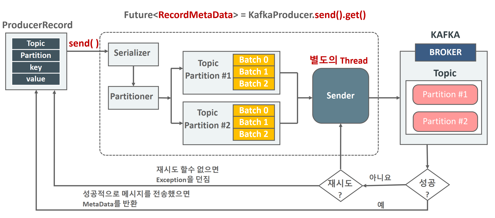
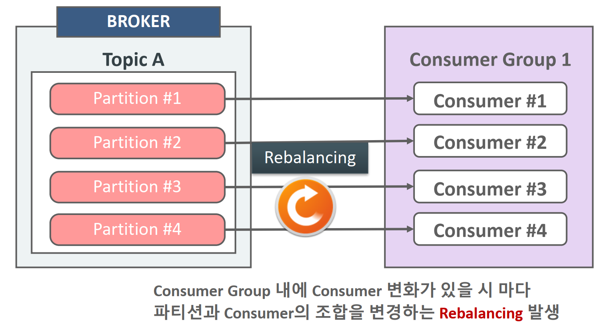

# 카프카 완벽가이드 - 코어편

* https://github.com/chulminkw


# 섹션1


카프카는 과거 메시징 시스템보다, 고성능 대용량 파이프라인, 스트리밍 분석, 데이터 통합에 사용되어 이벤트 스트리밍 플랫폼이라 한다. 

* 메시지 플랫폼은 **애플리케이션 간 통신**을 목적으로 한 도구로, **메시지 전송 및 라우팅**에 초점이 맞춰져 있다.
* 반면 이벤트 스트리밍 플랫폼은
  * **실시간 데이터 처리**: 데이터를 생성하자마자 소비자가 처리할 수 있도록 스트림 형태로 전달.
  * **저장 및 재생**: 스트림 데이터를 로그 형태로 저장하여 소비자가 나중에 다시 읽거나 재처리할 수 있다.
  * **분산 아키텍처**: 대규모 데이터 처리에 적합하도록 설계되며, 분산 환경에서 높은 확장성과 가용성을 제공
  * **데이터 스트림 재생**: 데이터를 재처리하거나 여러 소비자 그룹이 각기 다른 속도로 데이터를 소비할 수 있다.

다른 메시지 플랫폼에 비해 고성능이다.


## 오라클 버추얼 박스 다운로드

* https://www.virtualbox.org/wiki/Downloads

* https://docs.confluent.io/platform/current/installation/versions-interoperability.html

최신 아파치 카프카 3.8x는 컨플루언트 7.8.x랑 호환된다


m1 맥북에서 우분투 환경은 - https://ubuntu.com/download/server/arm


무인설치시 버추얼박스 기본 아이디 패스워드 - 

ID: `vboxuser`

비밀번호: `changeme`


우분투 카프카 설치

```
sudo apt-get update && sudo apt-get upgrade

sudo apt install openjdk-17-jdk -y

sudo update-alternatives --config java
sudo update-alternatives --config javac

curl -O https://packages.confluent.io/archive/7.8/confluent-7.8.0.tar.gz

tar -xvf confluent-7.5.0.tar.gz
sudo mv confluent-7.5.0 /opt/confluent

echo "export CONFLUENT_HOME=/opt/confluent" >> ~/.bashrc
echo "export PATH=\$CONFLUENT_HOME/bin:\$PATH" >> ~/.bashrc
source ~/.bashrc

confluent --version
```


## 도커컴포즈 설정

* 도커 가이드 : https://docs.confluent.io/platform/current/installation/docker/installation.html?_ga=2.99232413.260700743.1736096644-901714698.1735029409&_gac=1.228030703.1735828113.Cj0KCQiAj9m7BhD1ARIsANsIIvDrufPIA3TGKJf1psPaoMcaTdyZ0gwoV3wio2qeNSUlkjSyykgkS9caAvBREALw_wcB&_gl=1*j85p6v*_gcl_aw*R0NMLjE3MzYxNTk2OTIuQ2p3S0NBaUFtLTY3QmhCbEVpd0FFVmZ0TnVsMFU0bUJxd0xMX0xSTnQ3elR0WVdCc25jWC1NcW9obERibjZYVUJxSnF2QVljUzZxd2p4b0NmWjhRQXZEX0J3RQ..*_gcl_au*MTAyMzg1NjQwNi4xNzM1MDI5NDA5LjE3NDcwOTAyMjUuMTczNjA5OTEwNy4xNzM2MDk5MTA4*_ga*OTAxNzE0Njk4LjE3MzUwMjk0MDk.*_ga_D2D3EGKSGD*MTczNjE1OTY5Mi4xMS4xLjE3MzYxNjA2MTUuNjAuMC4w


### 싱글 브로커

```yaml
version: '3.8'

services:
  ###############################################################################
  # Zookeeper(싱글 노드)
  ###############################################################################
  zookeeper:
    image: confluentinc/cp-zookeeper:latest     ## Confluent Zookeeper 최신 이미지
    container_name: zookeeper
    ports:
      - "2181:2181"                             ## 호스트의 2181 포트를 컨테이너의 2181 포트와 매핑
    environment:
      ## Zookeeper가 클라이언트와 통신할 포트
      ZOOKEEPER_CLIENT_PORT: 2181
      ## 단일 환경에서의 기본 tickTime 설정
      ZOOKEEPER_TICK_TIME: 2000
    volumes:
      - ./zookeeper_data_single:/var/lib/zookeeper/data  ## Zookeeper 데이터 디렉토리 (현 디렉토리)
      - ./zookeeper_log_single:/var/lib/zookeeper/log    ## Zookeeper 로그 디렉토리 (현 디렉토리)
    # ------------------------------------------------

  ###############################################################################
  # Kafka 브로커(싱글 노드)
  ###############################################################################
  kafka:
    image: confluentinc/cp-kafka:latest         ## Confluent Kafka 최신 이미지
    container_name: kafka_broker_single
    depends_on:
      - zookeeper                               ## zookeeper 서비스를 먼저 띄움
    ports:
      - "9092:9092"                             ## 호스트의 9092 포트를 컨테이너의 9092와 매핑
    environment:
      ## 브로커 고유 ID
      KAFKA_BROKER_ID: 1
      ## Zookeeper 접속 정보 (호스트명:포트)
      KAFKA_ZOOKEEPER_CONNECT: zookeeper:2181
      ## 클라이언트(호스트)에서 접속할 브로커 주소
      KAFKA_ADVERTISED_LISTENERS: PLAINTEXT://localhost:9092
      ## 브로커 내부에서 열리는 리스너
      KAFKA_LISTENERS: PLAINTEXT://0.0.0.0:9092
      ## 자동으로 토픽 생성 여부 (테스트 환경에서 편의성)
      KAFKA_AUTO_CREATE_TOPICS_ENABLE: "true"
      ## 오프셋 토픽 복제 계수 (싱글 브로커이므로 1)
      KAFKA_OFFSETS_TOPIC_REPLICATION_FACTOR: 1
      ## 트랜잭션 로그 관련(싱글 브로커이므로 1)
      KAFKA_TRANSACTION_STATE_LOG_MIN_ISR: 1
      KAFKA_TRANSACTION_STATE_LOG_REPLICATION_FACTOR: 1
    volumes:
      - ./kafka_data_single:/var/lib/kafka/data        ## Kafka 데이터 디렉토리 (현 디렉토리)
    # ------------------------------------------------

volumes: {}
  ## docker compose down -v로 제거 가능하도록 named volume이 아닌 bind mount 사용

```

## 브로커 클러스터 - zookeeper

```yaml
version: '3.8'

services:
  ###############################################################################
  # Zookeeper 1
  ###############################################################################
  zookeeper1:
    image: confluentinc/cp-zookeeper:latest
    container_name: zookeeper1
    hostname: zookeeper1                      ## 도커 내부 네트워크에서의 호스트명
    ports:
      - "2181:2181"
    environment:
      ZOOKEEPER_SERVER_ID: 1                 ## 고유 Zookeeper 서버 ID
      ZOOKEEPER_CLIENT_PORT: 2181            ## 클라이언트 연결 포트
      ZOOKEEPER_TICK_TIME: 2000
      ZOOKEEPER_INIT_LIMIT: 5
      ZOOKEEPER_SYNC_LIMIT: 2
      ZOOKEEPER_SERVERS: "zookeeper1:2888:3888;zookeeper2:2889:3889;zookeeper3:2890:3890"
    volumes:
      - ./zookeeper_data_1:/var/lib/zookeeper/data
      - ./zookeeper_log_1:/var/lib/zookeeper/log

  ###############################################################################
  # Zookeeper 2
  ###############################################################################
  zookeeper2:
    image: confluentinc/cp-zookeeper:latest
    container_name: zookeeper2
    hostname: zookeeper2
    ports:
      - "2182:2181"
    environment:
      ZOOKEEPER_SERVER_ID: 2
      ZOOKEEPER_CLIENT_PORT: 2181
      ZOOKEEPER_TICK_TIME: 2000
      ZOOKEEPER_INIT_LIMIT: 5
      ZOOKEEPER_SYNC_LIMIT: 2
      ## 서버 목록에서 포트 정보를 달리 설정 (2889:3889)
      ZOOKEEPER_SERVERS: "zookeeper1:2888:3888;zookeeper2:2889:3889;zookeeper3:2890:3890"
    volumes:
      - ./zookeeper_data_2:/var/lib/zookeeper/data
      - ./zookeeper_log_2:/var/lib/zookeeper/log

  ###############################################################################
  # Zookeeper 3
  ###############################################################################
  zookeeper3:
    image: confluentinc/cp-zookeeper:latest
    container_name: zookeeper3
    hostname: zookeeper3
    ports:
      - "2183:2181"
    environment:
      ZOOKEEPER_SERVER_ID: 3
      ZOOKEEPER_CLIENT_PORT: 2181
      ZOOKEEPER_TICK_TIME: 2000
      ZOOKEEPER_INIT_LIMIT: 5
      ZOOKEEPER_SYNC_LIMIT: 2
      ## 서버 목록에서 포트 정보를 달리 설정 (2890:3890)
      ZOOKEEPER_SERVERS: "zookeeper1:2888:3888;zookeeper2:2889:3889;zookeeper3:2890:3890"
    volumes:
      - ./zookeeper_data_3:/var/lib/zookeeper/data
      - ./zookeeper_log_3:/var/lib/zookeeper/log

  ###############################################################################
  # Kafka 브로커 1
  ###############################################################################
  kafka1:
    image: confluentinc/cp-kafka:latest
    container_name: kafka1
    depends_on:
      - zookeeper1
      - zookeeper2
      - zookeeper3
    ports:
      - "9092:9092"
    environment:
      KAFKA_BROKER_ID: 1
      KAFKA_ZOOKEEPER_CONNECT: "zookeeper1:2181,zookeeper2:2181,zookeeper3:2181"
      KAFKA_ADVERTISED_LISTENERS: PLAINTEXT://localhost:9092
      KAFKA_LISTENERS: PLAINTEXT://0.0.0.0:9092
      KAFKA_AUTO_CREATE_TOPICS_ENABLE: "true"
      KAFKA_OFFSETS_TOPIC_REPLICATION_FACTOR: 3
      KAFKA_TRANSACTION_STATE_LOG_MIN_ISR: 2
      KAFKA_TRANSACTION_STATE_LOG_REPLICATION_FACTOR: 3
    volumes:
      - ./kafka_data_1:/var/lib/kafka/data

  ###############################################################################
  # Kafka 브로커 2
  ###############################################################################
  kafka2:
    image: confluentinc/cp-kafka:latest
    container_name: kafka2
    depends_on:
      - zookeeper1
      - zookeeper2
      - zookeeper3
    ports:
      - "9093:9092"
    environment:
      KAFKA_BROKER_ID: 2
      KAFKA_ZOOKEEPER_CONNECT: "zookeeper1:2181,zookeeper2:2181,zookeeper3:2181"
      ## 다른 호스트 포트 매핑을 위해 ADVERTISED_LISTENERS 변경
      KAFKA_ADVERTISED_LISTENERS: PLAINTEXT://localhost:9093
      KAFKA_LISTENERS: PLAINTEXT://0.0.0.0:9092
      KAFKA_AUTO_CREATE_TOPICS_ENABLE: "true"
      KAFKA_OFFSETS_TOPIC_REPLICATION_FACTOR: 3
      KAFKA_TRANSACTION_STATE_LOG_MIN_ISR: 2
      KAFKA_TRANSACTION_STATE_LOG_REPLICATION_FACTOR: 3
    volumes:
      - ./kafka_data_2:/var/lib/kafka/data

  ###############################################################################
  # Kafka 브로커 3
  ###############################################################################
  kafka3:
    image: confluentinc/cp-kafka:latest
    container_name: kafka3
    depends_on:
      - zookeeper1
      - zookeeper2
      - zookeeper3
    ports:
      - "9094:9092"
    environment:
      KAFKA_BROKER_ID: 3
      KAFKA_ZOOKEEPER_CONNECT: "zookeeper1:2181,zookeeper2:2181,zookeeper3:2181"
      KAFKA_ADVERTISED_LISTENERS: PLAINTEXT://localhost:9094
      KAFKA_LISTENERS: PLAINTEXT://0.0.0.0:9092
      KAFKA_AUTO_CREATE_TOPICS_ENABLE: "true"
      KAFKA_OFFSETS_TOPIC_REPLICATION_FACTOR: 3
      KAFKA_TRANSACTION_STATE_LOG_MIN_ISR: 2
      KAFKA_TRANSACTION_STATE_LOG_REPLICATION_FACTOR: 3
    volumes:
      - ./kafka_data_3:/var/lib/kafka/data

volumes:
  ## down -v 시 모두 제거 가능

```

## Kraft 싱글 브로커

```yaml
version: '3.8'

services:
  ###############################################################################
  # Kafka(KRaft 싱글 브로커)
  ###############################################################################
  kafka_kraft_single:
    image: confluentinc/cp-kafka:latest
    container_name: kafka_kraft_single
    ports:
      - "9092:9092"                                  ## KRaft 브로커 포트 매핑
    environment:
      ## 싱글 노드에서 컨트롤러 및 데이터 노드 모두 수행
      KAFKA_PROCESS_ROLES: "broker,controller"
      ## 클러스터 고유 ID (임의의 UUID 사용 가능)
      KAFKA_CLUSTER_ID: "kraft-cluster-single-12345"
      ## 브로커 고유 ID
      KAFKA_BROKER_ID: "1"
      ## 리스너 설정
      KAFKA_ADVERTISED_LISTENERS: PLAINTEXT://localhost:9092
      KAFKA_LISTENERS: PLAINTEXT://0.0.0.0:9092
      ## Controller Quorum Voters - 싱글 노드이므로 1개
      KAFKA_CONTROLLER_QUORUM_VOTERS: "1@kafka_kraft_single:9093"
      ## 컨트롤러와 브로커 간 내부 통신용 포트 (KRaft 전용)
      KAFKA_LISTENER_SECURITY_PROTOCOL_MAP: "PLAINTEXT:PLAINTEXT,CONTROLLER:PLAINTEXT"
      KAFKA_CONTROLLER_LISTENER_NAMES: "CONTROLLER"
      KAFKA_INTER_BROKER_LISTENER_NAME: "PLAINTEXT"
      ## 싱글 브로커에서의 자동 토픽 생성
      KAFKA_AUTO_CREATE_TOPICS_ENABLE: "true"
      ## 데이터 및 메타데이터 저장 위치
      KAFKA_LOG_DIRS: "/var/lib/kafka/data"
      KAFKA_NODE_ID: "1"
    volumes:
      - ./kraft_data_single:/var/lib/kafka/data              ## KRaft 데이터 디렉토리 (현 디렉토리)
    command: |
      sh -c "
      ## KRaft 모드용 설정 파일 생성
      echo 'node.id=1' >> /etc/kafka/kafka.properties && \
      echo 'process.roles=broker,controller' >> /etc/kafka/kafka.properties && \
      echo 'controller.quorum.voters=1@kafka_kraft_single:9093' >> /etc/kafka/kafka.properties && \
      echo 'listeners=PLAINTEXT://0.0.0.0:9092,CONTROLLER://0.0.0.0:9093' >> /etc/kafka/kafka.properties && \
      echo 'advertised.listeners=PLAINTEXT://localhost:9092' >> /etc/kafka/kafka.properties && \
      echo 'listener.security.protocol.map=PLAINTEXT:PLAINTEXT,CONTROLLER:PLAINTEXT' >> /etc/kafka/kafka.properties && \
      echo 'controller.listener.names=CONTROLLER' >> /etc/kafka/kafka.properties && \
      echo 'inter.broker.listener.name=PLAINTEXT' >> /etc/kafka/kafka.properties && \
      echo 'log.dirs=/var/lib/kafka/data' >> /etc/kafka/kafka.properties && \
      echo 'auto.create.topics.enable=true' >> /etc/kafka/kafka.properties && \
      echo 'cluster.id=kraft-cluster-single-12345' >> /etc/kafka/kafka.properties && \
      ## 서버 실행
      /etc/confluent/docker/run
      "

```

## kfraft 클러스터

```yaml
version: '3.8'

services:
  ###############################################################################
  # KRaft Node 1
  ###############################################################################
  kafka_kraft_1:
    image: confluentinc/cp-kafka:latest
    container_name: kafka_kraft_1
    ports:
      - "9092:9092"
    environment:
      KAFKA_PROCESS_ROLES: "broker,controller"            ## broker + controller
      KAFKA_CLUSTER_ID: "kraft-cluster-12345"             ## 모든 노드가 동일한 클러스터 ID를 사용해야 함
      KAFKA_BROKER_ID: "1"
      ## 컨트롤러 투표자 설정 (3노드 모두 기재)
      KAFKA_CONTROLLER_QUORUM_VOTERS: "1@kafka_kraft_1:9093,2@kafka_kraft_2:9095,3@kafka_kraft_3:9097"
      KAFKA_LISTENER_SECURITY_PROTOCOL_MAP: "PLAINTEXT:PLAINTEXT,CONTROLLER:PLAINTEXT"
      KAFKA_CONTROLLER_LISTENER_NAMES: "CONTROLLER"
      KAFKA_INTER_BROKER_LISTENER_NAME: "PLAINTEXT"
      ## Node 1의 리스너
      KAFKA_ADVERTISED_LISTENERS: PLAINTEXT://localhost:9092
      KAFKA_LISTENERS: PLAINTEXT://0.0.0.0:9092,CONTROLLER://0.0.0.0:9093
      KAFKA_AUTO_CREATE_TOPICS_ENABLE: "true"
      KAFKA_LOG_DIRS: "/var/lib/kafka/data"
      KAFKA_NODE_ID: "1"
    volumes:
      - ./kraft_data_1:/var/lib/kafka/data
    command: |
      sh -c "
      echo 'node.id=1' >> /etc/kafka/kafka.properties && \
      echo 'process.roles=broker,controller' >> /etc/kafka/kafka.properties && \
      echo 'controller.quorum.voters=1@kafka_kraft_1:9093,2@kafka_kraft_2:9095,3@kafka_kraft_3:9097' >> /etc/kafka/kafka.properties && \
      echo 'listeners=PLAINTEXT://0.0.0.0:9092,CONTROLLER://0.0.0.0:9093' >> /etc/kafka/kafka.properties && \
      echo 'advertised.listeners=PLAINTEXT://localhost:9092' >> /etc/kafka/kafka.properties && \
      echo 'listener.security.protocol.map=PLAINTEXT:PLAINTEXT,CONTROLLER:PLAINTEXT' >> /etc/kafka/kafka.properties && \
      echo 'controller.listener.names=CONTROLLER' >> /etc/kafka/kafka.properties && \
      echo 'inter.broker.listener.name=PLAINTEXT' >> /etc/kafka/kafka.properties && \
      echo 'log.dirs=/var/lib/kafka/data' >> /etc/kafka/kafka.properties && \
      echo 'auto.create.topics.enable=true' >> /etc/kafka/kafka.properties && \
      echo 'cluster.id=kraft-cluster-12345' >> /etc/kafka/kafka.properties && \
      /etc/confluent/docker/run
      "

  ###############################################################################
  # KRaft Node 2
  ###############################################################################
  kafka_kraft_2:
    image: confluentinc/cp-kafka:latest
    container_name: kafka_kraft_2
    ports:
      - "9094:9092"
    environment:
      KAFKA_PROCESS_ROLES: "broker,controller"
      KAFKA_CLUSTER_ID: "kraft-cluster-12345"
      KAFKA_BROKER_ID: "2"
      ## 모든 노드 동일한 voter 설정
      KAFKA_CONTROLLER_QUORUM_VOTERS: "1@kafka_kraft_1:9093,2@kafka_kraft_2:9095,3@kafka_kraft_3:9097"
      KAFKA_LISTENER_SECURITY_PROTOCOL_MAP: "PLAINTEXT:PLAINTEXT,CONTROLLER:PLAINTEXT"
      KAFKA_CONTROLLER_LISTENER_NAMES: "CONTROLLER"
      KAFKA_INTER_BROKER_LISTENER_NAME: "PLAINTEXT"
      ## Node 2의 리스너
      KAFKA_ADVERTISED_LISTENERS: PLAINTEXT://localhost:9094
      KAFKA_LISTENERS: PLAINTEXT://0.0.0.0:9092,CONTROLLER://0.0.0.0:9095
      KAFKA_AUTO_CREATE_TOPICS_ENABLE: "true"
      KAFKA_LOG_DIRS: "/var/lib/kafka/data"
      KAFKA_NODE_ID: "2"
    volumes:
      - ./kraft_data_2:/var/lib/kafka/data
    command: |
      sh -c "
      echo 'node.id=2' >> /etc/kafka/kafka.properties && \
      echo 'process.roles=broker,controller' >> /etc/kafka/kafka.properties && \
      echo 'controller.quorum.voters=1@kafka_kraft_1:9093,2@kafka_kraft_2:9095,3@kafka_kraft_3:9097' >> /etc/kafka/kafka.properties && \
      echo 'listeners=PLAINTEXT://0.0.0.0:9092,CONTROLLER://0.0.0.0:9095' >> /etc/kafka/kafka.properties && \
      echo 'advertised.listeners=PLAINTEXT://localhost:9094' >> /etc/kafka/kafka.properties && \
      echo 'listener.security.protocol.map=PLAINTEXT:PLAINTEXT,CONTROLLER:PLAINTEXT' >> /etc/kafka/kafka.properties && \
      echo 'controller.listener.names=CONTROLLER' >> /etc/kafka/kafka.properties && \
      echo 'inter.broker.listener.name=PLAINTEXT' >> /etc/kafka/kafka.properties && \
      echo 'log.dirs=/var/lib/kafka/data' >> /etc/kafka/kafka.properties && \
      echo 'auto.create.topics.enable=true' >> /etc/kafka/kafka.properties && \
      echo 'cluster.id=kraft-cluster-12345' >> /etc/kafka/kafka.properties && \
      /etc/confluent/docker/run
      "

  ###############################################################################
  # KRaft Node 3
  ###############################################################################
  kafka_kraft_3:
    image: confluentinc/cp-kafka:latest
    container_name: kafka_kraft_3
    ports:
      - "9096:9092"
    environment:
      KAFKA_PROCESS_ROLES: "broker,controller"
      KAFKA_CLUSTER_ID: "kraft-cluster-12345"
      KAFKA_BROKER_ID: "3"
      KAFKA_CONTROLLER_QUORUM_VOTERS: "1@kafka_kraft_1:9093,2@kafka_kraft_2:9095,3@kafka_kraft_3:9097"
      KAFKA_LISTENER_SECURITY_PROTOCOL_MAP: "PLAINTEXT:PLAINTEXT,CONTROLLER:PLAINTEXT"
      KAFKA_CONTROLLER_LISTENER_NAMES: "CONTROLLER"
      KAFKA_INTER_BROKER_LISTENER_NAME: "PLAINTEXT"
      ## Node 3의 리스너
      KAFKA_ADVERTISED_LISTENERS: PLAINTEXT://localhost:9096
      KAFKA_LISTENERS: PLAINTEXT://0.0.0.0:9092,CONTROLLER://0.0.0.0:9097
      KAFKA_AUTO_CREATE_TOPICS_ENABLE: "true"
      KAFKA_LOG_DIRS: "/var/lib/kafka/data"
      KAFKA_NODE_ID: "3"
    volumes:
      - ./kraft_data_3:/var/lib/kafka/data
    command: |
      sh -c "
      echo 'node.id=3' >> /etc/kafka/kafka.properties && \
      echo 'process.roles=broker,controller' >> /etc/kafka/kafka.properties && \
      echo 'controller.quorum.voters=1@kafka_kraft_1:9093,2@kafka_kraft_2:9095,3@kafka_kraft_3:9097' >> /etc/kafka/kafka.properties && \
      echo 'listeners=PLAINTEXT://0.0.0.0:9092,CONTROLLER://0.0.0.0:9097' >> /etc/kafka/kafka.properties && \
      echo 'advertised.listeners=PLAINTEXT://localhost:9096' >> /etc/kafka/kafka.properties && \
      echo 'listener.security.protocol.map=PLAINTEXT:PLAINTEXT,CONTROLLER:PLAINTEXT' >> /etc/kafka/kafka.properties && \
      echo 'controller.listener.names=CONTROLLER' >> /etc/kafka/kafka.properties && \
      echo 'inter.broker.listener.name=PLAINTEXT' >> /etc/kafka/kafka.properties && \
      echo 'log.dirs=/var/lib/kafka/data' >> /etc/kafka/kafka.properties && \
      echo 'auto.create.topics.enable=true' >> /etc/kafka/kafka.properties && \
      echo 'cluster.id=kraft-cluster-12345' >> /etc/kafka/kafka.properties && \
      /etc/confluent/docker/run
      "

volumes:
  ## down -v 시 모두 제거 가능

```

| 환경변수/옵션                          | 예시값                                                       | 설명                                              |
| -------------------------------------- | ------------------------------------------------------------ | ------------------------------------------------- |
| `KAFKA_PROCESS_ROLES`                  | `"broker,controller"`                                        | KRaft 브로커 + 컨트롤러 역할 동시 수행 가능       |
| `KAFKA_CLUSTER_ID`                     | `"kraft-cluster-12345"`                                      | KRaft 클러스터 고유 ID (모든 노드 동일 값)        |
| `KAFKA_BROKER_ID`                      | `"1"`, `"2"`, `"3"`                                          | 각 노드별 고유 브로커 ID                          |
| `KAFKA_CONTROLLER_QUORUM_VOTERS`       | `"1@kafka_kraft_1:9093,2@kafka_kraft_2:9095,3@kafka_kraft_3:9097"` | 컨트롤러 투표자 노드 (NodeId@호스트:컨트롤러포트) |
| `KAFKA_LISTENER_SECURITY_PROTOCOL_MAP` | `"PLAINTEXT:PLAINTEXT,CONTROLLER:PLAINTEXT"`                 | 리스너 이름과 보안 프로토콜 매핑                  |
| `KAFKA_CONTROLLER_LISTENER_NAMES`      | `"CONTROLLER"`                                               | 컨트롤러 리스너 이름                              |
| `KAFKA_INTER_BROKER_LISTENER_NAME`     | `"PLAINTEXT"`                                                | 브로커 간 내부 통신에 사용하는 리스너             |
| `KAFKA_ADVERTISED_LISTENERS`           | `"PLAINTEXT://localhost:9092"` 등                            | 호스트에서 연결 시 사용되는 브로커 주소           |
| `KAFKA_LISTENERS`                      | `"PLAINTEXT://0.0.0.0:9092,CONTROLLER://0.0.0.0:9093"` 등    | 브로커 및 컨트롤러 리스너                         |
| `KAFKA_AUTO_CREATE_TOPICS_ENABLE`      | `"true"`                                                     | 자동 토픽 생성                                    |
| `KAFKA_LOG_DIRS`                       | `"/var/lib/kafka/data"`                                      | Kafka 데이터 폴더                                 |
| `KAFKA_NODE_ID`                        | `"1"`, `"2"`, `"3"`                                          | 해당 노드의 ID                                    |
| 볼륨                                   | `./kraft_data_1:/var/lib/kafka/data` 등                      | 노드별 KRaft 데이터 디렉토리를 호스트에 저장      |


## 카프카 시작하기

* Topic, Partition, offsets
* producer, consumer
* producer serializer, partitioning, 파티션 분배 전략
* consumer와 consumer group, 그리고 rebalance


### 토픽

카프카가 메시지를 저장하는 영역.  Kafka를 메시지 큐(Message Queue)나 로그 시스템으로 사용할 때, 토픽은 데이터를 **카테고리별로 분류**하는 역할을 한다.

Topic은 partition으로 구성된 로그 파일로, RDBMS의 Table과 유사한 기능을 한다.

 

토픽의 구성요소

* 파티션

  * 각 토픽은 1개이상의 파티션으로 구성
  * 파티션 내의 메시지는 offset 이라는 고유한 id로 정렬

* 오프셋

  * 파티션 내에서 각 메시지의 고유 번호. 오프셋은 컨슈머가 데이터를 어디까지 읽었는지 추적하는데 사용하며 순차적으로 저장된다.

* 복제본

  * 고가용성과 장애 복구를 위해 각 파티션은 다른 브로커에 복제본을 가질 수 있다.

* 토픽의 메시지

  * 메시지는 헤더, key, 바디로 이루어져 있다.

    * 헤더 : 메시지에 대한 부가 정보를 포함한다.

    * key : 메시지를 특정 파티션에 매핑하는데 사용되며 없을경우 라운드 로빈으로 파티션에 매핑된다. 

    * 바디 : JSON, Avro, XML, String, Int.. 또는 바이너리로 저장 가능 

    * 메타데이터 : 타임스탬프, 오프셋, 파티션 등 

    * ```json
      {
          "headers": {
              "transactionId": "TX12345",
              "sourceType": "web"
          },
          "key": "order-456",
          "value": {
              "orderId": 456,
              "product": "smartphone",
              "quantity": 2,
              "price": 699.99
          },
          "metadata": {
              "partition": 2,
              "offset": 125,
              "timestamp": "2025-01-06T12:34:56.789Z"
          }
      }
      
      ```

  * 메시지는 최대 유지 기간 입력을 통해 얼마나 오래 지정될지 결정할 수 있다.(log.retention.hours = 168 , 7일)

  * 하나의 메시지가 가질 수 있는 최대 크기는 message.max.bytes 설정을 지정할 수 있으며 기본값은 1MB 



토픽에는 메시지가 순차적으로 물리적 파일에 write 되며 WAL(Write Append Log) 구조로, 파일의 마지막에만 추가된다. 

파티션은 Kafka의 **수평 확장성**과 **병렬 처리**를 가능하게하여 처리량을 증가시키는 핵심 요소이다.

* 레코드, 로그 메시지가 동의어이며, 각 레코드는 offset으로 불리는 일련 번호를 할당 받는다
* 개별 파티션은 같은 토픽일 수 있지만, 다른 파티션과 완전히 독립적인 데이터를 가지고 있다.

 메시지는 병렬성능과 가용성을 고려해 파티션에 분산 저장되며, 고가용성을 위해 이 파티션은 또다른 브로커에 복제된다. 개별 파티션은 정렬되고 변경할 수 없는 레코드로 쭉쭉 이어진 로그 메시지이다.



* replication-factor = 2 는 토픽의 복제 수를 2로 둔다는 뜻

* 리더와 팔로워? : 리더는 프로듀서 컨슈머와 직접 상호작용 하는 파티션이고 팔로워는 리더의 데이터를 복제해놓는 파티션이다. 컨슈머나 프로듀서가 레플리카된 파티션에서 데이터를 읽거나 쓰지 못한다.

## 카프카 토픽 생성 및 정보 확인

```
docker exec -it kafka_broker_single kafka-topics --create \
  --bootstrap-server localhost:9092 \
  --replication-factor 1 \
  --partitions 1 \
  --topic test_topic_01
```

* `--replication-factor`: 복제본 수.
* `--partitions`: 파티션 수.
* `--topic`: 생성할 토픽 이름.
  * 토픽명에는 .와 _를 같이쓰면 안된다. 내부적으로 언더바로 바뀌어서 쓰이기 때문

토픽 확인 명령어

```
docker exec -it kafka_broker_single kafka-topics --bootstrap-server \ localhost:9092 --list

docker exec -it kafka_broker_single kafka-topics --bootstrap-server \ localhost:9092 --describe --topic test_topic_01
```

확인

```
[appuser@3331323e0c89 data]$ pwd
/var/lib/kafka/data
[appuser@3331323e0c89 data]$ ls
cleaner-offset-checkpoint    meta.properties		       replication-offset-checkpoint
log-start-offset-checkpoint  recovery-point-offset-checkpoint  test_topic_01-0
```

## producer와 Consumer 개요



* 프로듀서는 공급자, Topic에 메시지를 보낸다.
  * key는 nullable이며 존재하면 특정 파티션으로 특정 해시연산으로 통해 보내고, 존재하지 않으면 라운드 로빈으로 파티션들에 분배한다. 
* 컨슈머는 소비자. 구독한 Topic의 파티션에서 메시지를 읽어 들인다.  
  * 카프카의 파티션에서 메시지를 읽어들여도 바로 삭제되지 않는다. 지정한 용량이 가득차거나 리텐션 시간이 지나면 메시지가 삭제된다. 


프로듀서 cli 실행

```
docker exec -it kafka_broker_single kafka-topics --bootstrap-server localhost:9092 --create --topic test-topic

docker exec -it kafka_broker_single kafka-console-producer \
  --bootstrap-server localhost:9092 \
  --topic test_topic_01
```

컨슈머 cli 실행

```
docker exec -it kafka_broker_single kafka-console-consumer \
  --bootstrap-server localhost:9092 \
  --topic test_topic_01 \
  --group my_test_1 \
  --from-beginning
  
---
특정 컨슈머 그룹 조회
docker exec -it kafka_broker_single kafka-consumer-groups \
  --bootstrap-server localhost:9092 \
  --group my_test_1 \
  --describe
```

### consumer의 auto.offset.reset

Consumer는 Topic에서 메시지를 가져올때 가장 오래된 offset부터 가져올지, 가장 최근(마지막)으로부터 가져올지 설정할 수 있다.

* auto.offset.reset = earliest:  처음 offset부터 읽음
  * --from-beginning이 auto.offset.reset = earlist 이다. 
* auto.offset.reset = latest : 마지막 offset부터 읽음

> 이 옵션으로 인해, 같은 그룹의 컨슈머가 읽었떤 메시지를 다시 읽던 말던 할 수 있다.



네트워크로부터 프로듀서에서 브로커를 통해 컨슈머로 전송될때에는, 직렬화를 통해 바이너리로 전송되고, 저장되며 컨슈머에서 다시 역직렬화를 통해 값으로 복구된다

* 카프카 시리얼라이저, 디시리얼라이즈를 구현해서 적용할 수 있다. 

* 여기서 궁금한점, 메시지 본체를 압축할 수 있을까?
  * 가능하다. zstd, gzip, snappy, lz4, zstd 를 지원한다. 
  * Kafka는 메시지를 배치 단위로 압축한다. 컨슈머가 특정 오프셋을 요청하면, Kafka는 해당 배치를 압축 해제한 후 필요한 메시지를 제공한다. 
  * producer의 compression.type 속성을 지정할 수 있다. 기본값은  none 
  * 메시지를 압축하면 압축된 데이터가 바이너리로 전송되며, 브로커는 그대로 저장하거나 필요시 재압축한다. 컨슈머가 배치 단위로 압축을 해제하고 개별 메시지를 처리한다. 

```java
import org.apache.kafka.clients.producer.KafkaProducer;
import org.apache.kafka.clients.producer.Producer;
import org.apache.kafka.clients.producer.ProducerConfig;
import org.apache.kafka.clients.producer.ProducerRecord;
import org.apache.kafka.common.serialization.StringSerializer;

import java.util.Properties;

public class KafkaProducerExample {

    public static void main(String[] args) {
        // Kafka 프로듀서 설정
        Properties props = new Properties();
        props.put(ProducerConfig.BOOTSTRAP_SERVERS_CONFIG, "localhost:9092"); // Kafka 브로커 주소
        props.put(ProducerConfig.KEY_SERIALIZER_CLASS_CONFIG, StringSerializer.class.getName()); // 키 직렬화
        props.put(ProducerConfig.VALUE_SERIALIZER_CLASS_CONFIG, CustomIntegerSerializer.class.getName()); // 값 직렬화
        props.put(ProducerConfig.COMPRESSION_TYPE_CONFIG, "zstd"); // 압축 설정 (zstd)
        props.put(ProducerConfig.ACKS_CONFIG, "all"); // 메시지 확인 (acks)
        props.put(ProducerConfig.BATCH_SIZE_CONFIG, 16384); // 배치 크기 (16KB)
        props.put(ProducerConfig.LINGER_MS_CONFIG, 5); // 배치 대기 시간 (5ms)

        // Kafka 프로듀서 생성
        Producer<String, Integer> producer = new KafkaProducer<>(props);

        // 메시지 전송
        for (int i = 0; i < 10; i++) {
            ProducerRecord<String, Integer> record = new ProducerRecord<>("test_topic", "key-" + i, i);
            producer.send(record, (metadata, exception) -> {
                if (exception == null) {
                    System.out.println("Sent message to " + metadata.topic() +
                            " partition: " + metadata.partition() +
                            " offset: " + metadata.offset());
                } else {
                    exception.printStackTrace();
                }
            });
        }

        // 프로듀서 종료
        producer.close();
    }
}
```

시리얼라이저는 인터페이스이며, String, Shot, Integer, Long, Double, Bytes는 기본으로 제공한다.

```java
public interface Serializer<T> extends Closeable {
    default void configure(Map<String, ?> configs, boolean isKey) {
    }

    byte[] serialize(String var1, T var2);

    default byte[] serialize(String topic, Headers headers, T data) {
        return this.serialize(topic, data);
    }

    default void close() {
    }
}
```

### 카프카 프로듀서의 send 메소드 호출 프로세스



프로듀서가 메시지 전송시 메시지는 직렬화되고, 파티셔너에 의해 파티션이 결정되어 메시지가 뭉쳐져서(배치) 별도의 스레드를 통해 브로커로 전달된다.

### key값?

카프카는 Partioner를 통해 토픽의 어떤 파티션으로 전송되어야 할지 정할 수 있다.

이때 Key 값은 메시지를 어느 파티션에 저장할지를 결정하는 데 사용된다.

```
// 공식
partition = hash(key) % number_of_partitions
```

키가 없는 경우(null) 라운드 로빈 혹은 스티키 파티션(고정)으로 파티션 별로 메시지가 고르게 분배할 수 있다.

Topic이 여러 개의 파티션을 가질 때 메시지의 전송 순서가 보장되지 않은 채로 Consumer에서 읽혀질 수 있다.

* 1 2 3 4 5 메시지가 있고, 파티션 1, 2, 3 이 있을때 각각 1 2, 3, 4 5 로 들어가면 3개의 컨슈머에서 4 3 1 이런식으로 읽힐 수 있다.

만약 메시지의 순서가 중요하다면, 특정 파티션으로 고정해서 보내게 되면 메시지 순서를 보장할 수 있게 된다.

같은 Key 값을 가진 메시지는 항상 **같은 파티션**에 저장되기 때문이다.

* 주문 데이터를 고객 ID(Key)로 묶으면, 같은 고객의 주문이 항상 같은 파티션에 저장

그러면 단일 파티션 내에서 읽히므로 12 3 4 5 순차적으로 읽히게 된다.

* 주의할점
  * Key를 잘못 설정하면 데이터가 특정 파티션에 몰릴 수 있다(**파티션 불균형**).
    * 이를 방지하려면 Key 값이 고르게 분포되도록 설계해야함. UUID나 해시 함수 설계. 
  * 파티션 수를 늘리면 기존 Key 값이 새로운 파티션으로 매핑될 수 있어 메시지 정렬이 깨질 수 있다.
    * 미리 파티션을 이빠이 늘려놓거나,
    * 파티션 수를 변경한 경우, 데이터를 재처리하거나 새로운 정렬 기준을 설정하거나 해야한다.

### 라운드 로빈, 스티키 파티셔닝

라운드 로빈은 최대한 메시지를 파티션에 균일하게 분배하려는 전략으로서 메시지 배치를 순차적으로 다른 파티션으로 전송

* 메시지가 배치 데이터를 빨리 채우지 못하면서 전송이 늦어지거나 배치를 다 채우지 못하고 전송 하면서 전송 성능이 떨어지는 문제 발생
* 사용사레 : 메시지 순서가 중요하지 않거나 데이터를 고르게 분산하는것이 중요한 경우

스티키 파티셔닝은 라운드 로빈의 성능을 개선하고자 특정 파티션으로 전송되는 **하나의 배치에 메시지를 빠르게 먼저 채워서 보내는 방식** 

배치를 채우지 못하고 전송을 하거나 배치를 채우는데 시간이 너무 오래 걸리는 문제를 개선

* 카프카 2.4부터 디폴트 전략이다.
* 새로운 배치를 시작할 때 파티션을 선택하며, 선택된 파티션에 **배치가 가득 찰 때까지** 메시지를 계속 보낸다.
* 배치가 가득 차거나, 일정 시간이 경과하면 새로운 파티션을 선택하여 다시 전송한다. 
* 단점으로는 특정 시점에 한 파티션에 가득 채워 보내고, 다른 파티션에 가득 못채우면 특정 파티션에만 데이터가 몰릴 수 있으며 라운드로빈과 마찬가지로 메시지가 여러 파티션에 나뉘어 저장되므로 전역적인 순서를 보장하지 않는다.
  * 대량의 데이터를 균등하게 분산하며 전송 비용을 줄이고자 하거나, 리소스 효율이 중요한경우 사용 

### Consumer Group과 Consumer

모든 컨슈머들은 단 하나의 컨슈머 그룹에 소속되어야 하며, 그룹은 1개 이상의 컨슈머를 가질 수 있다.

컨슈머 그룹은 고유한 컨슈머 그룹 id(group.id)를 가지고 카프카 브로커에게 전달한다.

파티션의 레코드들은 단 하나의 컨슈머에만 할당된다.

* 파티션은 무조건 컨슈머 1대 에게만 배치된다 (스레드 기준으로 봐도 무방)
* 컨슈머는 n개의 파티션에게서 메시지를 받을 수 있다.
* 때문에 파티션 수보다 컨슈머 수가 많을경우 컨슈머는 유휴 컨슈머가 되어 놀게된다 



리밸런스 : 컨슈머 리밸런스는 컨슈머 그룹 내에서 파티션과 컨슈머 간의 **매핑을 재조정**하는 작업. 컨슈머 그룹 내 컨슈머 변화가 있을시마다 파티션과 컨슈머의 할당을 변경하는 리밸런싱이 발생한다.

리밸런스가 발생하면 일부 또는 모든 파티션의 데이터 처리가 중단되었다가 다시 시작된다. 

**리밸런스 발생 케이스**

* 주로 배포, 네트워크 장애시 발생 

* 컨슈머가 새로 그룹에 가입하거나, 기존 컨슈머가 그룹을 떠나거나 장애로 인해 연결이 끊어질때
  * 애플리케이션 배포 시 새로운 컨슈머 인스턴스가 생성되거나 삭제될 때.
* 컨슈머가 구독중인 토픽 목록에 새 토픽이 추가되거나 제거될때
* 파티션 수가 증가할 때
* 컨슈머 그룹 id가 변경될 때
* 컨슈머 장애로 인해 비정상 종료되거나 네트워크 장애 발생시

**리밸런스 과정에서 발생할 수 있는 문제**

리밸런스는 **오버헤드**를 발생시킬 수 있습니다:

- **데이터 처리 중단:** 리밸런스 동안 메시지 처리가 일시적으로 중단
  - **성능 저하:** 자주 발생하면 애플리케이션의 안정성과 처리 성능에 영향
- **오프셋 관리 문제:** 잘못 설계된 경우, 리밸런스 이후 메시지 중복 처리나 누락이 발생할 수 있다.

리밸런스 대응방법

* 리밸런스 리스너 구현 : 컨슈머에 리밸런스 리스너 인터페이스를 구현한것을 장착하여 대응 
  * **onPartitionsRevoked**: 파티션이 해제되기 전에 현재 처리 중인 데이터를 정리하거나 커밋.
  * **onPartitionsAssigned**: 새로운 파티션이 할당된 후 필요한 초기화를 수행
  * 이를 통해 리밸런스 동안 데이터 유실이나 중복 처리를 방지
* 백오프 및 재시도 로직 구현
  * 리밸런스로 인해 일시적인 메시지 처리 지연이 발생할 수 있으므로, 애플리케이션 내에서 백오프(backoff)와 재시도(retry) 로직을 구현

* (1) **리밸런스 최소화**

  - **정상 종료 시 LeaveGroup 호출:** 애플리케이션 종료 시 `Consumer.close()`를 호출하여 컨슈머가 정상적으로 그룹을 떠났음을 알리면 리밸런스를 예측 가능하게 줄일 수 있다.

  - **세션 타임아웃 조정:** `session.timeout.ms` 및 `heartbeat.interval.ms` 값을 적절히 설정하여 리밸런스가 불필요하게 발생하지 않도록 한다.

  - **스테이틱 멤버십(Static Membership) 사용:** `group.instance.id`를 설정하면 컨슈머가 그룹에 재조인해도 리밸런스가 발생하지 않게 설정할 수 있다.

- (2) **리밸런스 시점의 데이터 처리 안정화**

  - **처리 중단 관리:** 리밸런스가 발생하는 동안 오프셋을 정확히 커밋하거나, 적절한 중복 방지 로직을 구현 합니다.

  - **Idempotent Producer와 Exactly Once Delivery:** 중복 메시지 처리를 방지하기 위해 멱등성 프로듀서와 정확히 한 번의 전달(Exactly Once)을 활성화

* (3) **리밸런스 모니터링**

  - 컨슈머 로그를 주기적으로 모니터링하여 리밸런스가 얼마나 자주 발생하는지 확인

  - 리밸런스가 자주 발생하면 네트워크 문제, 타임아웃 설정 오류, 또는 컨슈머 그룹 크기 문제일 가능성이 높다.


실습

```
docker exec -it kafka_broker_single kafka-topics --bootstrap-server localhost:9092 --create --topic multipart-topic --partitions 3

1. Consumer Group id group_01을 가지는 consumer를 3개 생성(아래 명령어 3번 수행) 
docker exec -it kafka_broker_single  kafka-console-consumer --bootstrap-server localhost:9092 --group group_01 --topic multipart-topic \
   --property print.key=true --property print.value=true \
   --property print.partition=true

2. keyload.log 파일 만들기
   touch keyload.log

3. key 메시지 2000개를 keyload.log에 기록하기. 
for i in $(seq 1 2000); do
  echo "${i}:test key message sent test00000000000000 ${i}" >> keyload.log
done


4. keyload.log 파일 기반으로 메시지 2000개 전송. 
docker exec -i kafka_broker_single kafka-console-producer --bootstrap-server localhost:9092 --topic multipart-topic \
   --property key.separator=: --property parse.key=true < ./keyload.log

```

리밸런스된 카프카 로그 메시지

```
[2025-01-07 05:07:18,136] INFO [GroupCoordinator 1]: Dynamic member with unknown member id joins group group_01 in Empty state. Created a new member id console-consumer-e2976694-14a6-4ec0-bb35-5c6fbcaf6d4e and request the member to rejoin with this id. (kafka.coordinator.group.GroupCoordinator)

[2025-01-07 05:07:18,138] INFO [GroupCoordinator 1]: Preparing to rebalance group group_01 in state PreparingRebalance with old generation 0 (__consumer_offsets-45) (reason: Adding new member console-consumer-e2976694-14a6-4ec0-bb35-5c6fbcaf6d4e with group instance id None; client reason: need to re-join with the given member-id: console-consumer-e2976694-14a6-4ec0-bb35-5c6fbcaf6d4e) (kafka.coordinator.group.GroupCoordinator)

[2025-01-07 05:07:21,144] INFO [GroupCoordinator 1]: Stabilized group group_01 generation 1 (__consumer_offsets-45) with 1 members (kafka.coordinator.group.GroupCoordinator)

[2025-01-07 05:07:21,157] INFO [GroupCoordinator 1]: Assignment received from leader console-consumer-e2976694-14a6-4ec0-bb35-5c6fbcaf6d4e for group group_01 for generation 1. The group has 1 members, 0 of which are static. (kafka.coordinator.group.GroupCoordinator)

-- 두번째 그룹 추가
[2025-01-07 05:09:12,864] INFO [GroupCoordinator 1]: Preparing to rebalance group group_01 in state PreparingRebalance with old generation 1 (__consumer_offsets-45) (reason: Adding new member console-consumer-b01e993a-19eb-43a8-bd8c-b675b0e11116 with group instance id None; client reason: need to re-join with the given member-id: console-consumer-b01e993a-19eb-43a8-bd8c-b675b0e11116) (kafka.coordinator.group.GroupCoordinator)
[2025-01-07 05:09:15,313] INFO [GroupCoordinator 1]: Stabilized group group_01 generation 2 (__consumer_offsets-45) with 2 members (kafka.coordinator.group.GroupCoordinator)
[2025-01-07 05:09:15,320] INFO [GroupCoordinator 1]: Assignment received from leader console-consumer-e2976694-14a6-4ec0-bb35-5c6fbcaf6d4e for group group_01 for generation 2. The group has 2 members, 0 of which are static. (kafka.coordinator.group.GroupCoordinator)
```

### kafka-consumer-groups 명령어

- ConsumerGroup list 정보
- Consumer Group과 Consumer 관계, Partition등에 대한 상세 정보
- Consumer Group 삭제
- Producer가 전송한 Log message의 지연 Lag 정보
  - **Lag**는 **Consumer Group의 오프셋(offset)**이 **현재 Producer가 생산한 최신 오프셋과 얼마나 차이가 나는지**를 나타내는 지표
  - Lag 값이 클수록 Consumer가 Producer의 데이터를 실시간으로 따라잡지 못하고 있음을 의미
  - **멀티 스레딩**이나 **멀티 인스턴스**로 Consumer의 병렬 처리 성능을 높이거나 브로커 성능을 높여 처리량을 증가시켜 해결한다. 
  - LAG은 kafka-consumer-groups 명령어로 랙 상태를 확인하거나, kafka exporter 혹은 링크드인 burrow로 모니터링을 통해 확인한다. 

```
docker exec -it kafka_broker_single kafka-consumer-groups --bootstrap-server localhost:9092 --describe --group group_01

```


| **Config 구분**                      | **설명/사용법**                                              |
| ------------------------------------ | ------------------------------------------------------------ |
| **Broker와 Topic 레벨 Config**       | • Kafka 서버에서 설정되는 Config<br>• Topic의 Config 값은 Broker 레벨에서 지정한 Config를 기본으로 설정하며, 별도 Topic 레벨 Config를 설정할 경우 이를 따름<br>• 보통 `server.properties`에 있는 Config는 변경 시 Broker 재기동이 필요한 Static Config이며, Dynamic Config는 `kafka-configs`를 이용하여 동적으로 변경 가능 |
| **Producer 및 Consumer 레벨 Config** | • Kafka 클라이언트에서 설정되는 Config<br>• Client 레벨에서 설정되므로 `server.properties`에 존재하지 않으며, `kafka-configs`로 수정할 수 없음<br>• Client 수행 시마다 설정할 수 있음 |
| **Config 값 확인**                   | `kafka-configs --bootstrap-server [host:port] --entity-type [brokers/topics] --entity-name [broker id / topic name] --all --describe` |
| **Config 값 설정**                   | `kafka-configs --bootstrap-server [host:port] --entity-type [brokers/topics] --entity-name [broker id / topic name] --alter --add-config property=value` |
| **Config 값 Unset**                  | `kafka-configs --bootstrap-server [host:port] --entity-type [brokers/topics] --entity-name [broker id / topic name] --alter --delete-config property` |

### kafka-dump-log 명령어로 로그 파일 메시지 내용 확인하기

```
docker exec -it kafka_broker_single kafka-dump-log --deep-iteration --files /var/lib/kafka/data/multipart-topic-0/00000000000000000000.log --print-data-log
```


# 섹션 2


