# 카프카 완벽가이드 - 코어편

* https://github.com/chulminkw


# 섹션1


카프카는 과거 메시징 시스템보다, 고성능 대용량 파이프라인, 스트리밍 분석, 데이터 통합에 사용되어 이벤트 스트리밍 플랫폼이라 한다. 

* 메시지 플랫폼은 **애플리케이션 간 통신**을 목적으로 한 도구로, **메시지 전송 및 라우팅**에 초점이 맞춰져 있다.
* 반면 이벤트 스트리밍 플랫폼은
  * **실시간 데이터 처리**: 데이터를 생성하자마자 소비자가 처리할 수 있도록 스트림 형태로 전달.
  * **저장 및 재생**: 스트림 데이터를 로그 형태로 저장하여 소비자가 나중에 다시 읽거나 재처리할 수 있다.
  * **분산 아키텍처**: 대규모 데이터 처리에 적합하도록 설계되며, 분산 환경에서 높은 확장성과 가용성을 제공
  * **데이터 스트림 재생**: 데이터를 재처리하거나 여러 소비자 그룹이 각기 다른 속도로 데이터를 소비할 수 있다.

다른 메시지 플랫폼에 비해 고성능이다.


## 오라클 버추얼 박스 다운로드

* https://www.virtualbox.org/wiki/Downloads

* https://docs.confluent.io/platform/current/installation/versions-interoperability.html

최신 아파치 카프카 3.8x는 컨플루언트 7.8.x랑 호환된다


m1 맥북에서 우분투 환경은 - https://ubuntu.com/download/server/arm


무인설치시 버추얼박스 기본 아이디 패스워드 - 

ID: `vboxuser`

비밀번호: `changeme`


우분투 카프카 설치

```
sudo apt-get update && sudo apt-get upgrade

sudo apt install openjdk-17-jdk -y

sudo update-alternatives --config java
sudo update-alternatives --config javac

curl -O https://packages.confluent.io/archive/7.8/confluent-7.8.0.tar.gz

tar -xvf confluent-7.5.0.tar.gz
sudo mv confluent-7.5.0 /opt/confluent

echo "export CONFLUENT_HOME=/opt/confluent" >> ~/.bashrc
echo "export PATH=\$CONFLUENT_HOME/bin:\$PATH" >> ~/.bashrc
source ~/.bashrc

confluent --version
```


## 도커컴포즈 설정

* 도커 가이드 : https://docs.confluent.io/platform/current/installation/docker/installation.html?_ga=2.99232413.260700743.1736096644-901714698.1735029409&_gac=1.228030703.1735828113.Cj0KCQiAj9m7BhD1ARIsANsIIvDrufPIA3TGKJf1psPaoMcaTdyZ0gwoV3wio2qeNSUlkjSyykgkS9caAvBREALw_wcB&_gl=1*j85p6v*_gcl_aw*R0NMLjE3MzYxNTk2OTIuQ2p3S0NBaUFtLTY3QmhCbEVpd0FFVmZ0TnVsMFU0bUJxd0xMX0xSTnQ3elR0WVdCc25jWC1NcW9obERibjZYVUJxSnF2QVljUzZxd2p4b0NmWjhRQXZEX0J3RQ..*_gcl_au*MTAyMzg1NjQwNi4xNzM1MDI5NDA5LjE3NDcwOTAyMjUuMTczNjA5OTEwNy4xNzM2MDk5MTA4*_ga*OTAxNzE0Njk4LjE3MzUwMjk0MDk.*_ga_D2D3EGKSGD*MTczNjE1OTY5Mi4xMS4xLjE3MzYxNjA2MTUuNjAuMC4w


### 싱글 브로커

```yaml
version: '3.8'

services:
  ###############################################################################
  # Zookeeper(싱글 노드)
  ###############################################################################
  zookeeper:
    image: confluentinc/cp-zookeeper:latest     ## Confluent Zookeeper 최신 이미지
    container_name: zookeeper
    ports:
      - "2181:2181"                             ## 호스트의 2181 포트를 컨테이너의 2181 포트와 매핑
    environment:
      ## Zookeeper가 클라이언트와 통신할 포트
      ZOOKEEPER_CLIENT_PORT: 2181
      ## 단일 환경에서의 기본 tickTime 설정
      ZOOKEEPER_TICK_TIME: 2000
    volumes:
      - ./zookeeper_data_single:/var/lib/zookeeper/data  ## Zookeeper 데이터 디렉토리 (현 디렉토리)
      - ./zookeeper_log_single:/var/lib/zookeeper/log    ## Zookeeper 로그 디렉토리 (현 디렉토리)
    # ------------------------------------------------

  ###############################################################################
  # Kafka 브로커(싱글 노드)
  ###############################################################################
  kafka:
    image: confluentinc/cp-kafka:latest         ## Confluent Kafka 최신 이미지
    container_name: kafka_broker_single
    depends_on:
      - zookeeper                               ## zookeeper 서비스를 먼저 띄움
    ports:
      - "9092:9092"                             ## 호스트의 9092 포트를 컨테이너의 9092와 매핑
    environment:
      ## 브로커 고유 ID
      KAFKA_BROKER_ID: 1
      ## Zookeeper 접속 정보 (호스트명:포트)
      KAFKA_ZOOKEEPER_CONNECT: zookeeper:2181
      ## 클라이언트(호스트)에서 접속할 브로커 주소
      KAFKA_ADVERTISED_LISTENERS: PLAINTEXT://localhost:9092
      ## 브로커 내부에서 열리는 리스너
      KAFKA_LISTENERS: PLAINTEXT://0.0.0.0:9092
      ## 자동으로 토픽 생성 여부 (테스트 환경에서 편의성)
      KAFKA_AUTO_CREATE_TOPICS_ENABLE: "true"
      ## 오프셋 토픽 복제 계수 (싱글 브로커이므로 1)
      KAFKA_OFFSETS_TOPIC_REPLICATION_FACTOR: 1
      ## 트랜잭션 로그 관련(싱글 브로커이므로 1)
      KAFKA_TRANSACTION_STATE_LOG_MIN_ISR: 1
      KAFKA_TRANSACTION_STATE_LOG_REPLICATION_FACTOR: 1
    volumes:
      - ./kafka_data_single:/var/lib/kafka/data        ## Kafka 데이터 디렉토리 (현 디렉토리)
    # ------------------------------------------------

volumes: {}
  ## docker compose down -v로 제거 가능하도록 named volume이 아닌 bind mount 사용

```

## 브로커 클러스터 - zookeeper

```yaml
version: '3.8'

services:
  ###############################################################################
  # Zookeeper 1
  ###############################################################################
  zookeeper1:
    image: confluentinc/cp-zookeeper:latest
    container_name: zookeeper1
    hostname: zookeeper1                      ## 도커 내부 네트워크에서의 호스트명
    ports:
      - "2181:2181"
    environment:
      ZOOKEEPER_SERVER_ID: 1                 ## 고유 Zookeeper 서버 ID
      ZOOKEEPER_CLIENT_PORT: 2181            ## 클라이언트 연결 포트
      ZOOKEEPER_TICK_TIME: 2000
      ZOOKEEPER_INIT_LIMIT: 5
      ZOOKEEPER_SYNC_LIMIT: 2
      ZOOKEEPER_SERVERS: "zookeeper1:2888:3888;zookeeper2:2889:3889;zookeeper3:2890:3890"
    volumes:
      - ./zookeeper_data_1:/var/lib/zookeeper/data
      - ./zookeeper_log_1:/var/lib/zookeeper/log

  ###############################################################################
  # Zookeeper 2
  ###############################################################################
  zookeeper2:
    image: confluentinc/cp-zookeeper:latest
    container_name: zookeeper2
    hostname: zookeeper2
    ports:
      - "2182:2181"
    environment:
      ZOOKEEPER_SERVER_ID: 2
      ZOOKEEPER_CLIENT_PORT: 2181
      ZOOKEEPER_TICK_TIME: 2000
      ZOOKEEPER_INIT_LIMIT: 5
      ZOOKEEPER_SYNC_LIMIT: 2
      ## 서버 목록에서 포트 정보를 달리 설정 (2889:3889)
      ZOOKEEPER_SERVERS: "zookeeper1:2888:3888;zookeeper2:2889:3889;zookeeper3:2890:3890"
    volumes:
      - ./zookeeper_data_2:/var/lib/zookeeper/data
      - ./zookeeper_log_2:/var/lib/zookeeper/log

  ###############################################################################
  # Zookeeper 3
  ###############################################################################
  zookeeper3:
    image: confluentinc/cp-zookeeper:latest
    container_name: zookeeper3
    hostname: zookeeper3
    ports:
      - "2183:2181"
    environment:
      ZOOKEEPER_SERVER_ID: 3
      ZOOKEEPER_CLIENT_PORT: 2181
      ZOOKEEPER_TICK_TIME: 2000
      ZOOKEEPER_INIT_LIMIT: 5
      ZOOKEEPER_SYNC_LIMIT: 2
      ## 서버 목록에서 포트 정보를 달리 설정 (2890:3890)
      ZOOKEEPER_SERVERS: "zookeeper1:2888:3888;zookeeper2:2889:3889;zookeeper3:2890:3890"
    volumes:
      - ./zookeeper_data_3:/var/lib/zookeeper/data
      - ./zookeeper_log_3:/var/lib/zookeeper/log

  ###############################################################################
  # Kafka 브로커 1
  ###############################################################################
  kafka1:
    image: confluentinc/cp-kafka:latest
    container_name: kafka1
    depends_on:
      - zookeeper1
      - zookeeper2
      - zookeeper3
    ports:
      - "9092:9092"
    environment:
      KAFKA_BROKER_ID: 1
      KAFKA_ZOOKEEPER_CONNECT: "zookeeper1:2181,zookeeper2:2181,zookeeper3:2181"
      KAFKA_ADVERTISED_LISTENERS: PLAINTEXT://localhost:9092
      KAFKA_LISTENERS: PLAINTEXT://0.0.0.0:9092
      KAFKA_AUTO_CREATE_TOPICS_ENABLE: "true"
      KAFKA_OFFSETS_TOPIC_REPLICATION_FACTOR: 3
      KAFKA_TRANSACTION_STATE_LOG_MIN_ISR: 2
      KAFKA_TRANSACTION_STATE_LOG_REPLICATION_FACTOR: 3
    volumes:
      - ./kafka_data_1:/var/lib/kafka/data

  ###############################################################################
  # Kafka 브로커 2
  ###############################################################################
  kafka2:
    image: confluentinc/cp-kafka:latest
    container_name: kafka2
    depends_on:
      - zookeeper1
      - zookeeper2
      - zookeeper3
    ports:
      - "9093:9092"
    environment:
      KAFKA_BROKER_ID: 2
      KAFKA_ZOOKEEPER_CONNECT: "zookeeper1:2181,zookeeper2:2181,zookeeper3:2181"
      ## 다른 호스트 포트 매핑을 위해 ADVERTISED_LISTENERS 변경
      KAFKA_ADVERTISED_LISTENERS: PLAINTEXT://localhost:9093
      KAFKA_LISTENERS: PLAINTEXT://0.0.0.0:9092
      KAFKA_AUTO_CREATE_TOPICS_ENABLE: "true"
      KAFKA_OFFSETS_TOPIC_REPLICATION_FACTOR: 3
      KAFKA_TRANSACTION_STATE_LOG_MIN_ISR: 2
      KAFKA_TRANSACTION_STATE_LOG_REPLICATION_FACTOR: 3
    volumes:
      - ./kafka_data_2:/var/lib/kafka/data

  ###############################################################################
  # Kafka 브로커 3
  ###############################################################################
  kafka3:
    image: confluentinc/cp-kafka:latest
    container_name: kafka3
    depends_on:
      - zookeeper1
      - zookeeper2
      - zookeeper3
    ports:
      - "9094:9092"
    environment:
      KAFKA_BROKER_ID: 3
      KAFKA_ZOOKEEPER_CONNECT: "zookeeper1:2181,zookeeper2:2181,zookeeper3:2181"
      KAFKA_ADVERTISED_LISTENERS: PLAINTEXT://localhost:9094
      KAFKA_LISTENERS: PLAINTEXT://0.0.0.0:9092
      KAFKA_AUTO_CREATE_TOPICS_ENABLE: "true"
      KAFKA_OFFSETS_TOPIC_REPLICATION_FACTOR: 3
      KAFKA_TRANSACTION_STATE_LOG_MIN_ISR: 2
      KAFKA_TRANSACTION_STATE_LOG_REPLICATION_FACTOR: 3
    volumes:
      - ./kafka_data_3:/var/lib/kafka/data

volumes:
  ## down -v 시 모두 제거 가능

```

## Kraft 싱글 브로커

```yaml
version: '3.8'

services:
  ###############################################################################
  # Kafka(KRaft 싱글 브로커)
  ###############################################################################
  kafka_kraft_single:
    image: confluentinc/cp-kafka:latest
    container_name: kafka_kraft_single
    ports:
      - "9092:9092"                                  ## KRaft 브로커 포트 매핑
    environment:
      ## 싱글 노드에서 컨트롤러 및 데이터 노드 모두 수행
      KAFKA_PROCESS_ROLES: "broker,controller"
      ## 클러스터 고유 ID (임의의 UUID 사용 가능)
      KAFKA_CLUSTER_ID: "kraft-cluster-single-12345"
      ## 브로커 고유 ID
      KAFKA_BROKER_ID: "1"
      ## 리스너 설정
      KAFKA_ADVERTISED_LISTENERS: PLAINTEXT://localhost:9092
      KAFKA_LISTENERS: PLAINTEXT://0.0.0.0:9092
      ## Controller Quorum Voters - 싱글 노드이므로 1개
      KAFKA_CONTROLLER_QUORUM_VOTERS: "1@kafka_kraft_single:9093"
      ## 컨트롤러와 브로커 간 내부 통신용 포트 (KRaft 전용)
      KAFKA_LISTENER_SECURITY_PROTOCOL_MAP: "PLAINTEXT:PLAINTEXT,CONTROLLER:PLAINTEXT"
      KAFKA_CONTROLLER_LISTENER_NAMES: "CONTROLLER"
      KAFKA_INTER_BROKER_LISTENER_NAME: "PLAINTEXT"
      ## 싱글 브로커에서의 자동 토픽 생성
      KAFKA_AUTO_CREATE_TOPICS_ENABLE: "true"
      ## 데이터 및 메타데이터 저장 위치
      KAFKA_LOG_DIRS: "/var/lib/kafka/data"
      KAFKA_NODE_ID: "1"
    volumes:
      - ./kraft_data_single:/var/lib/kafka/data              ## KRaft 데이터 디렉토리 (현 디렉토리)
    command: |
      sh -c "
      ## KRaft 모드용 설정 파일 생성
      echo 'node.id=1' >> /etc/kafka/kafka.properties && \
      echo 'process.roles=broker,controller' >> /etc/kafka/kafka.properties && \
      echo 'controller.quorum.voters=1@kafka_kraft_single:9093' >> /etc/kafka/kafka.properties && \
      echo 'listeners=PLAINTEXT://0.0.0.0:9092,CONTROLLER://0.0.0.0:9093' >> /etc/kafka/kafka.properties && \
      echo 'advertised.listeners=PLAINTEXT://localhost:9092' >> /etc/kafka/kafka.properties && \
      echo 'listener.security.protocol.map=PLAINTEXT:PLAINTEXT,CONTROLLER:PLAINTEXT' >> /etc/kafka/kafka.properties && \
      echo 'controller.listener.names=CONTROLLER' >> /etc/kafka/kafka.properties && \
      echo 'inter.broker.listener.name=PLAINTEXT' >> /etc/kafka/kafka.properties && \
      echo 'log.dirs=/var/lib/kafka/data' >> /etc/kafka/kafka.properties && \
      echo 'auto.create.topics.enable=true' >> /etc/kafka/kafka.properties && \
      echo 'cluster.id=kraft-cluster-single-12345' >> /etc/kafka/kafka.properties && \
      ## 서버 실행
      /etc/confluent/docker/run
      "

```

## kfraft 클러스터

```yaml
version: '3.8'

services:
  ###############################################################################
  # KRaft Node 1
  ###############################################################################
  kafka_kraft_1:
    image: confluentinc/cp-kafka:latest
    container_name: kafka_kraft_1
    ports:
      - "9092:9092"
    environment:
      KAFKA_PROCESS_ROLES: "broker,controller"            ## broker + controller
      KAFKA_CLUSTER_ID: "kraft-cluster-12345"             ## 모든 노드가 동일한 클러스터 ID를 사용해야 함
      KAFKA_BROKER_ID: "1"
      ## 컨트롤러 투표자 설정 (3노드 모두 기재)
      KAFKA_CONTROLLER_QUORUM_VOTERS: "1@kafka_kraft_1:9093,2@kafka_kraft_2:9095,3@kafka_kraft_3:9097"
      KAFKA_LISTENER_SECURITY_PROTOCOL_MAP: "PLAINTEXT:PLAINTEXT,CONTROLLER:PLAINTEXT"
      KAFKA_CONTROLLER_LISTENER_NAMES: "CONTROLLER"
      KAFKA_INTER_BROKER_LISTENER_NAME: "PLAINTEXT"
      ## Node 1의 리스너
      KAFKA_ADVERTISED_LISTENERS: PLAINTEXT://localhost:9092
      KAFKA_LISTENERS: PLAINTEXT://0.0.0.0:9092,CONTROLLER://0.0.0.0:9093
      KAFKA_AUTO_CREATE_TOPICS_ENABLE: "true"
      KAFKA_LOG_DIRS: "/var/lib/kafka/data"
      KAFKA_NODE_ID: "1"
    volumes:
      - ./kraft_data_1:/var/lib/kafka/data
    command: |
      sh -c "
      echo 'node.id=1' >> /etc/kafka/kafka.properties && \
      echo 'process.roles=broker,controller' >> /etc/kafka/kafka.properties && \
      echo 'controller.quorum.voters=1@kafka_kraft_1:9093,2@kafka_kraft_2:9095,3@kafka_kraft_3:9097' >> /etc/kafka/kafka.properties && \
      echo 'listeners=PLAINTEXT://0.0.0.0:9092,CONTROLLER://0.0.0.0:9093' >> /etc/kafka/kafka.properties && \
      echo 'advertised.listeners=PLAINTEXT://localhost:9092' >> /etc/kafka/kafka.properties && \
      echo 'listener.security.protocol.map=PLAINTEXT:PLAINTEXT,CONTROLLER:PLAINTEXT' >> /etc/kafka/kafka.properties && \
      echo 'controller.listener.names=CONTROLLER' >> /etc/kafka/kafka.properties && \
      echo 'inter.broker.listener.name=PLAINTEXT' >> /etc/kafka/kafka.properties && \
      echo 'log.dirs=/var/lib/kafka/data' >> /etc/kafka/kafka.properties && \
      echo 'auto.create.topics.enable=true' >> /etc/kafka/kafka.properties && \
      echo 'cluster.id=kraft-cluster-12345' >> /etc/kafka/kafka.properties && \
      /etc/confluent/docker/run
      "

  ###############################################################################
  # KRaft Node 2
  ###############################################################################
  kafka_kraft_2:
    image: confluentinc/cp-kafka:latest
    container_name: kafka_kraft_2
    ports:
      - "9094:9092"
    environment:
      KAFKA_PROCESS_ROLES: "broker,controller"
      KAFKA_CLUSTER_ID: "kraft-cluster-12345"
      KAFKA_BROKER_ID: "2"
      ## 모든 노드 동일한 voter 설정
      KAFKA_CONTROLLER_QUORUM_VOTERS: "1@kafka_kraft_1:9093,2@kafka_kraft_2:9095,3@kafka_kraft_3:9097"
      KAFKA_LISTENER_SECURITY_PROTOCOL_MAP: "PLAINTEXT:PLAINTEXT,CONTROLLER:PLAINTEXT"
      KAFKA_CONTROLLER_LISTENER_NAMES: "CONTROLLER"
      KAFKA_INTER_BROKER_LISTENER_NAME: "PLAINTEXT"
      ## Node 2의 리스너
      KAFKA_ADVERTISED_LISTENERS: PLAINTEXT://localhost:9094
      KAFKA_LISTENERS: PLAINTEXT://0.0.0.0:9092,CONTROLLER://0.0.0.0:9095
      KAFKA_AUTO_CREATE_TOPICS_ENABLE: "true"
      KAFKA_LOG_DIRS: "/var/lib/kafka/data"
      KAFKA_NODE_ID: "2"
    volumes:
      - ./kraft_data_2:/var/lib/kafka/data
    command: |
      sh -c "
      echo 'node.id=2' >> /etc/kafka/kafka.properties && \
      echo 'process.roles=broker,controller' >> /etc/kafka/kafka.properties && \
      echo 'controller.quorum.voters=1@kafka_kraft_1:9093,2@kafka_kraft_2:9095,3@kafka_kraft_3:9097' >> /etc/kafka/kafka.properties && \
      echo 'listeners=PLAINTEXT://0.0.0.0:9092,CONTROLLER://0.0.0.0:9095' >> /etc/kafka/kafka.properties && \
      echo 'advertised.listeners=PLAINTEXT://localhost:9094' >> /etc/kafka/kafka.properties && \
      echo 'listener.security.protocol.map=PLAINTEXT:PLAINTEXT,CONTROLLER:PLAINTEXT' >> /etc/kafka/kafka.properties && \
      echo 'controller.listener.names=CONTROLLER' >> /etc/kafka/kafka.properties && \
      echo 'inter.broker.listener.name=PLAINTEXT' >> /etc/kafka/kafka.properties && \
      echo 'log.dirs=/var/lib/kafka/data' >> /etc/kafka/kafka.properties && \
      echo 'auto.create.topics.enable=true' >> /etc/kafka/kafka.properties && \
      echo 'cluster.id=kraft-cluster-12345' >> /etc/kafka/kafka.properties && \
      /etc/confluent/docker/run
      "

  ###############################################################################
  # KRaft Node 3
  ###############################################################################
  kafka_kraft_3:
    image: confluentinc/cp-kafka:latest
    container_name: kafka_kraft_3
    ports:
      - "9096:9092"
    environment:
      KAFKA_PROCESS_ROLES: "broker,controller"
      KAFKA_CLUSTER_ID: "kraft-cluster-12345"
      KAFKA_BROKER_ID: "3"
      KAFKA_CONTROLLER_QUORUM_VOTERS: "1@kafka_kraft_1:9093,2@kafka_kraft_2:9095,3@kafka_kraft_3:9097"
      KAFKA_LISTENER_SECURITY_PROTOCOL_MAP: "PLAINTEXT:PLAINTEXT,CONTROLLER:PLAINTEXT"
      KAFKA_CONTROLLER_LISTENER_NAMES: "CONTROLLER"
      KAFKA_INTER_BROKER_LISTENER_NAME: "PLAINTEXT"
      ## Node 3의 리스너
      KAFKA_ADVERTISED_LISTENERS: PLAINTEXT://localhost:9096
      KAFKA_LISTENERS: PLAINTEXT://0.0.0.0:9092,CONTROLLER://0.0.0.0:9097
      KAFKA_AUTO_CREATE_TOPICS_ENABLE: "true"
      KAFKA_LOG_DIRS: "/var/lib/kafka/data"
      KAFKA_NODE_ID: "3"
    volumes:
      - ./kraft_data_3:/var/lib/kafka/data
    command: |
      sh -c "
      echo 'node.id=3' >> /etc/kafka/kafka.properties && \
      echo 'process.roles=broker,controller' >> /etc/kafka/kafka.properties && \
      echo 'controller.quorum.voters=1@kafka_kraft_1:9093,2@kafka_kraft_2:9095,3@kafka_kraft_3:9097' >> /etc/kafka/kafka.properties && \
      echo 'listeners=PLAINTEXT://0.0.0.0:9092,CONTROLLER://0.0.0.0:9097' >> /etc/kafka/kafka.properties && \
      echo 'advertised.listeners=PLAINTEXT://localhost:9096' >> /etc/kafka/kafka.properties && \
      echo 'listener.security.protocol.map=PLAINTEXT:PLAINTEXT,CONTROLLER:PLAINTEXT' >> /etc/kafka/kafka.properties && \
      echo 'controller.listener.names=CONTROLLER' >> /etc/kafka/kafka.properties && \
      echo 'inter.broker.listener.name=PLAINTEXT' >> /etc/kafka/kafka.properties && \
      echo 'log.dirs=/var/lib/kafka/data' >> /etc/kafka/kafka.properties && \
      echo 'auto.create.topics.enable=true' >> /etc/kafka/kafka.properties && \
      echo 'cluster.id=kraft-cluster-12345' >> /etc/kafka/kafka.properties && \
      /etc/confluent/docker/run
      "

volumes:
  ## down -v 시 모두 제거 가능

```

| 환경변수/옵션                          | 예시값                                                       | 설명                                              |
| -------------------------------------- | ------------------------------------------------------------ | ------------------------------------------------- |
| `KAFKA_PROCESS_ROLES`                  | `"broker,controller"`                                        | KRaft 브로커 + 컨트롤러 역할 동시 수행 가능       |
| `KAFKA_CLUSTER_ID`                     | `"kraft-cluster-12345"`                                      | KRaft 클러스터 고유 ID (모든 노드 동일 값)        |
| `KAFKA_BROKER_ID`                      | `"1"`, `"2"`, `"3"`                                          | 각 노드별 고유 브로커 ID                          |
| `KAFKA_CONTROLLER_QUORUM_VOTERS`       | `"1@kafka_kraft_1:9093,2@kafka_kraft_2:9095,3@kafka_kraft_3:9097"` | 컨트롤러 투표자 노드 (NodeId@호스트:컨트롤러포트) |
| `KAFKA_LISTENER_SECURITY_PROTOCOL_MAP` | `"PLAINTEXT:PLAINTEXT,CONTROLLER:PLAINTEXT"`                 | 리스너 이름과 보안 프로토콜 매핑                  |
| `KAFKA_CONTROLLER_LISTENER_NAMES`      | `"CONTROLLER"`                                               | 컨트롤러 리스너 이름                              |
| `KAFKA_INTER_BROKER_LISTENER_NAME`     | `"PLAINTEXT"`                                                | 브로커 간 내부 통신에 사용하는 리스너             |
| `KAFKA_ADVERTISED_LISTENERS`           | `"PLAINTEXT://localhost:9092"` 등                            | 호스트에서 연결 시 사용되는 브로커 주소           |
| `KAFKA_LISTENERS`                      | `"PLAINTEXT://0.0.0.0:9092,CONTROLLER://0.0.0.0:9093"` 등    | 브로커 및 컨트롤러 리스너                         |
| `KAFKA_AUTO_CREATE_TOPICS_ENABLE`      | `"true"`                                                     | 자동 토픽 생성                                    |
| `KAFKA_LOG_DIRS`                       | `"/var/lib/kafka/data"`                                      | Kafka 데이터 폴더                                 |
| `KAFKA_NODE_ID`                        | `"1"`, `"2"`, `"3"`                                          | 해당 노드의 ID                                    |
| 볼륨                                   | `./kraft_data_1:/var/lib/kafka/data` 등                      | 노드별 KRaft 데이터 디렉토리를 호스트에 저장      |


## 카프카 시작하기

* Topic, Partition, offsets
* producer, consumer
* producer serializer, partitioning, 파티션 분배 전략
* consumer와 consumer group, 그리고 rebalance


### 토픽

카프카가 메시지를 저장하는 영역.  Kafka를 메시지 큐(Message Queue)나 로그 시스템으로 사용할 때, 토픽은 데이터를 **카테고리별로 분류**하는 역할을 한다.

Topic은 partition으로 구성된 로그 파일로, RDBMS의 Table과 유사한 기능을 한다.

 

토픽의 구성요소

* 파티션

  * 각 토픽은 1개이상의 파티션으로 구성
  * 파티션 내의 메시지는 offset 이라는 고유한 id로 정렬

* 오프셋

  * 파티션 내에서 각 메시지의 고유 번호. 오프셋은 컨슈머가 데이터를 어디까지 읽었는지 추적하는데 사용하며 순차적으로 저장된다.

* 복제본

  * 고가용성과 장애 복구를 위해 각 파티션은 다른 브로커에 복제본을 가질 수 있다.

* 토픽의 메시지

  * 메시지는 헤더, key, 바디로 이루어져 있다.

    * 헤더 : 메시지에 대한 부가 정보를 포함한다.

    * key : 메시지를 특정 파티션에 매핑하는데 사용되며 없을경우 라운드 로빈으로 파티션에 매핑된다. 

    * 바디 : JSON, Avro, XML, String, Int.. 또는 바이너리로 저장 가능 

    * 메타데이터 : 타임스탬프, 오프셋, 파티션 등 

    * ```json
      {
          "headers": {
              "transactionId": "TX12345",
              "sourceType": "web"
          },
          "key": "order-456",
          "value": {
              "orderId": 456,
              "product": "smartphone",
              "quantity": 2,
              "price": 699.99
          },
          "metadata": {
              "partition": 2,
              "offset": 125,
              "timestamp": "2025-01-06T12:34:56.789Z"
          }
      }
      
      ```

  * 메시지는 최대 유지 기간 입력을 통해 얼마나 오래 지정될지 결정할 수 있다.(log.retention.hours = 168 , 7일)

  * 하나의 메시지가 가질 수 있는 최대 크기는 message.max.bytes 설정을 지정할 수 있으며 기본값은 1MB 


토픽에는 메시지가 순차적으로 물리적 파일에 write 되며 WAL(Write Append Log) 구조로, 파일의 마지막에만 추가된다. 

파티션은 Kafka의 **수평 확장성**과 **병렬 처리**를 가능하게하여 처리량을 증가시키는 핵심 요소이다.

* 레코드, 로그 메시지가 동의어이며, 각 레코드는 offset으로 불리는 일련 번호를 할당 받는다
* 개별 파티션은 같은 토픽일 수 있지만, 다른 파티션과 완전히 독립적인 데이터를 가지고 있다.

 메시지는 병렬성능과 가용성을 고려해 파티션에 분산 저장되며, 고가용성을 위해 이 파티션은 또다른 브로커에 복제된다. 개별 파티션은 정렬되고 변경할 수 없는 레코드로 쭉쭉 이어진 로그 메시지이다.


* replication-factor = 2 는 토픽의 복제 수를 2로 둔다는 뜻

* 리더와 팔로워? : 리더는 프로듀서 컨슈머와 직접 상호작용 하는 파티션이고 팔로워는 리더의 데이터를 복제해놓는 파티션이다. 컨슈머나 프로듀서가 레플리카된 파티션에서 데이터를 읽거나 쓰지 못한다.

## 카프카 토픽 생성 및 정보 확인

```
docker exec -it kafka_broker_single kafka-topics --create \
  --bootstrap-server localhost:9092 \
  --replication-factor 1 \
  --partitions 1 \
  --topic test_topic_01
```

* `--replication-factor`: 복제본 수.
* `--partitions`: 파티션 수.
* `--topic`: 생성할 토픽 이름.
  * 토픽명에는 .와 _를 같이쓰면 안된다. 내부적으로 언더바로 바뀌어서 쓰이기 때문

토픽 확인 명령어

```
docker exec -it kafka_broker_single kafka-topics --bootstrap-server \ localhost:9092 --list

docker exec -it kafka_broker_single kafka-topics --bootstrap-server \ localhost:9092 --describe --topic test_topic_01
```

확인

```
[appuser@3331323e0c89 data]$ pwd
/var/lib/kafka/data
[appuser@3331323e0c89 data]$ ls
cleaner-offset-checkpoint    meta.properties		       replication-offset-checkpoint
log-start-offset-checkpoint  recovery-point-offset-checkpoint  test_topic_01-0
```

## producer와 Consumer 개요


* 프로듀서는 공급자, Topic에 메시지를 보낸다.
  * key는 nullable이며 존재하면 특정 파티션으로 특정 해시연산으로 통해 보내고, 존재하지 않으면 라운드 로빈으로 파티션들에 분배한다. 
* 컨슈머는 소비자. 구독한 Topic의 파티션에서 메시지를 읽어 들인다.  
  * 카프카의 파티션에서 메시지를 읽어들여도 바로 삭제되지 않는다. 지정한 용량이 가득차거나 리텐션 시간이 지나면 메시지가 삭제된다. 


프로듀서 cli 실행

```
docker exec -it kafka_broker_single kafka-topics --bootstrap-server localhost:9092 --create --topic test-topic

docker exec -it kafka_broker_single kafka-console-producer \
  --bootstrap-server localhost:9092 \
  --topic test_topic_01
```

컨슈머 cli 실행

```
docker exec -it kafka_broker_single kafka-console-consumer \
  --bootstrap-server localhost:9092 \
  --topic test_topic_01 \
  --group my_test_1 \
  --from-beginning
  
---
특정 컨슈머 그룹 조회
docker exec -it kafka_broker_single kafka-consumer-groups \
  --bootstrap-server localhost:9092 \
  --group my_test_1 \
  --describe
```

### consumer의 auto.offset.reset

Consumer는 Topic에서 메시지를 가져올때 가장 오래된 offset부터 가져올지, 가장 최근(마지막)으로부터 가져올지 설정할 수 있다.

* auto.offset.reset = earliest:  처음 offset부터 읽음
  * --from-beginning이 auto.offset.reset = earlist 이다. 
* auto.offset.reset = latest : 마지막 offset부터 읽음

> 이 옵션으로 인해, 같은 그룹의 컨슈머가 읽었떤 메시지를 다시 읽던 말던 할 수 있다.


네트워크로부터 프로듀서에서 브로커를 통해 컨슈머로 전송될때에는, 직렬화를 통해 바이너리로 전송되고, 저장되며 컨슈머에서 다시 역직렬화를 통해 값으로 복구된다

* 카프카 시리얼라이저, 디시리얼라이즈를 구현해서 적용할 수 있다. 

* 여기서 궁금한점, 메시지 본체를 압축할 수 있을까?
  * 가능하다. zstd, gzip, snappy, lz4, zstd 를 지원한다. 
  * Kafka는 메시지를 배치 단위로 압축한다. 컨슈머가 특정 오프셋을 요청하면, Kafka는 해당 배치를 압축 해제한 후 필요한 메시지를 제공한다. 
  * producer의 compression.type 속성을 지정할 수 있다. 기본값은  none 
  * 메시지를 압축하면 압축된 데이터가 바이너리로 전송되며, 브로커는 그대로 저장하거나 필요시 재압축한다. 컨슈머가 배치 단위로 압축을 해제하고 개별 메시지를 처리한다. 

```java
import org.apache.kafka.clients.producer.KafkaProducer;
import org.apache.kafka.clients.producer.Producer;
import org.apache.kafka.clients.producer.ProducerConfig;
import org.apache.kafka.clients.producer.ProducerRecord;
import org.apache.kafka.common.serialization.StringSerializer;

import java.util.Properties;

public class KafkaProducerExample {

    public static void main(String[] args) {
        // Kafka 프로듀서 설정
        Properties props = new Properties();
        props.put(ProducerConfig.BOOTSTRAP_SERVERS_CONFIG, "localhost:9092"); // Kafka 브로커 주소
        props.put(ProducerConfig.KEY_SERIALIZER_CLASS_CONFIG, StringSerializer.class.getName()); // 키 직렬화
        props.put(ProducerConfig.VALUE_SERIALIZER_CLASS_CONFIG, CustomIntegerSerializer.class.getName()); // 값 직렬화
        props.put(ProducerConfig.COMPRESSION_TYPE_CONFIG, "zstd"); // 압축 설정 (zstd)
        props.put(ProducerConfig.ACKS_CONFIG, "all"); // 메시지 확인 (acks)
        props.put(ProducerConfig.BATCH_SIZE_CONFIG, 16384); // 배치 크기 (16KB)
        props.put(ProducerConfig.LINGER_MS_CONFIG, 5); // 배치 대기 시간 (5ms)

        // Kafka 프로듀서 생성
        Producer<String, Integer> producer = new KafkaProducer<>(props);

        // 메시지 전송
        for (int i = 0; i < 10; i++) {
            ProducerRecord<String, Integer> record = new ProducerRecord<>("test_topic", "key-" + i, i);
            producer.send(record, (metadata, exception) -> {
                if (exception == null) {
                    System.out.println("Sent message to " + metadata.topic() +
                            " partition: " + metadata.partition() +
                            " offset: " + metadata.offset());
                } else {
                    exception.printStackTrace();
                }
            });
        }

        // 프로듀서 종료
        producer.close();
    }
}
```

시리얼라이저는 인터페이스이며, String, Shot, Integer, Long, Double, Bytes는 기본으로 제공한다.

```java
public interface Serializer<T> extends Closeable {
    default void configure(Map<String, ?> configs, boolean isKey) {
    }

    byte[] serialize(String var1, T var2);

    default byte[] serialize(String topic, Headers headers, T data) {
        return this.serialize(topic, data);
    }

    default void close() {
    }
}
```

### 카프카 프로듀서의 send 메소드 호출 프로세스


프로듀서가 메시지 전송시 메시지는 직렬화되고, 파티셔너에 의해 파티션이 결정되어 메시지가 뭉쳐져서(배치) 별도의 스레드를 통해 브로커로 전달된다.

### key값?

카프카는 Partioner를 통해 토픽의 어떤 파티션으로 전송되어야 할지 정할 수 있다.

이때 Key 값은 메시지를 어느 파티션에 저장할지를 결정하는 데 사용된다.

```
// 공식
partition = hash(key) % number_of_partitions
```

키가 없는 경우(null) 라운드 로빈 혹은 스티키 파티션(고정)으로 파티션 별로 메시지가 고르게 분배할 수 있다.

Topic이 여러 개의 파티션을 가질 때 메시지의 전송 순서가 보장되지 않은 채로 Consumer에서 읽혀질 수 있다.

* 1 2 3 4 5 메시지가 있고, 파티션 1, 2, 3 이 있을때 각각 1 2, 3, 4 5 로 들어가면 3개의 컨슈머에서 4 3 1 이런식으로 읽힐 수 있다.

만약 메시지의 순서가 중요하다면, 특정 파티션으로 고정해서 보내게 되면 메시지 순서를 보장할 수 있게 된다.

같은 Key 값을 가진 메시지는 항상 **같은 파티션**에 저장되기 때문이다.

* 주문 데이터를 고객 ID(Key)로 묶으면, 같은 고객의 주문이 항상 같은 파티션에 저장

그러면 단일 파티션 내에서 읽히므로 12 3 4 5 순차적으로 읽히게 된다.

* 주의할점
  * Key를 잘못 설정하면 데이터가 특정 파티션에 몰릴 수 있다(**파티션 불균형**).
    * 이를 방지하려면 Key 값이 고르게 분포되도록 설계해야함. UUID나 해시 함수 설계. 
  * 파티션 수를 늘리면 기존 Key 값이 새로운 파티션으로 매핑될 수 있어 메시지 정렬이 깨질 수 있다.
    * 미리 파티션을 이빠이 늘려놓거나,
    * 파티션 수를 변경한 경우, 데이터를 재처리하거나 새로운 정렬 기준을 설정하거나 해야한다.

### 라운드 로빈, 스티키 파티셔닝

라운드 로빈은 최대한 메시지를 파티션에 균일하게 분배하려는 전략으로서 메시지 배치를 순차적으로 다른 파티션으로 전송

* 메시지가 배치 데이터를 빨리 채우지 못하면서 전송이 늦어지거나 배치를 다 채우지 못하고 전송 하면서 전송 성능이 떨어지는 문제 발생
* 사용사레 : 메시지 순서가 중요하지 않거나 데이터를 고르게 분산하는것이 중요한 경우

스티키 파티셔닝은 라운드 로빈의 성능을 개선하고자 특정 파티션으로 전송되는 **하나의 배치에 메시지를 빠르게 먼저 채워서 보내는 방식** 

배치를 채우지 못하고 전송을 하거나 배치를 채우는데 시간이 너무 오래 걸리는 문제를 개선

* 카프카 2.4부터 디폴트 전략이다.
* 새로운 배치를 시작할 때 파티션을 선택하며, 선택된 파티션에 **배치가 가득 찰 때까지** 메시지를 계속 보낸다.
* 배치가 가득 차거나, 일정 시간이 경과하면 새로운 파티션을 선택하여 다시 전송한다. 
* 단점으로는 특정 시점에 한 파티션에 가득 채워 보내고, 다른 파티션에 가득 못채우면 특정 파티션에만 데이터가 몰릴 수 있으며 라운드로빈과 마찬가지로 메시지가 여러 파티션에 나뉘어 저장되므로 전역적인 순서를 보장하지 않는다.
  * 대량의 데이터를 균등하게 분산하며 전송 비용을 줄이고자 하거나, 리소스 효율이 중요한경우 사용 

### Consumer Group과 Consumer

모든 컨슈머들은 단 하나의 컨슈머 그룹에 소속되어야 하며, 그룹은 1개 이상의 컨슈머를 가질 수 있다.

컨슈머 그룹은 고유한 컨슈머 그룹 id(group.id)를 가지고 카프카 브로커에게 전달한다.

파티션의 레코드들은 단 하나의 컨슈머에만 할당된다.

* 파티션은 무조건 컨슈머 1대 에게만 배치된다 (스레드 기준으로 봐도 무방)
* 컨슈머는 n개의 파티션에게서 메시지를 받을 수 있다.
* 때문에 파티션 수보다 컨슈머 수가 많을경우 컨슈머는 유휴 컨슈머가 되어 놀게된다 


리밸런스 : 컨슈머 리밸런스는 컨슈머 그룹 내에서 파티션과 컨슈머 간의 **매핑을 재조정**하는 작업. 컨슈머 그룹 내 컨슈머 변화가 있을시마다 파티션과 컨슈머의 할당을 변경하는 리밸런싱이 발생한다.

리밸런스가 발생하면 일부 또는 모든 파티션의 데이터 처리가 중단되었다가 다시 시작된다. 

**리밸런스 발생 케이스**

* 주로 배포, 네트워크 장애시 발생 

* 컨슈머가 새로 그룹에 가입하거나, 기존 컨슈머가 그룹을 떠나거나 장애로 인해 연결이 끊어질때
  * 애플리케이션 배포 시 새로운 컨슈머 인스턴스가 생성되거나 삭제될 때.
* 컨슈머가 구독중인 토픽 목록에 새 토픽이 추가되거나 제거될때
* 파티션 수가 증가할 때
* 컨슈머 그룹 id가 변경될 때
* 컨슈머 장애로 인해 비정상 종료되거나 네트워크 장애 발생시

**리밸런스 과정에서 발생할 수 있는 문제**

리밸런스는 **오버헤드**를 발생시킬 수 있습니다:

- **데이터 처리 중단:** 리밸런스 동안 메시지 처리가 일시적으로 중단
  - **성능 저하:** 자주 발생하면 애플리케이션의 안정성과 처리 성능에 영향
- **오프셋 관리 문제:** 잘못 설계된 경우, 리밸런스 이후 메시지 중복 처리나 누락이 발생할 수 있다.

리밸런스 대응방법

* 리밸런스 리스너 구현 : 컨슈머에 리밸런스 리스너 인터페이스를 구현한것을 장착하여 대응 
  * **onPartitionsRevoked**: 파티션이 해제되기 전에 현재 처리 중인 데이터를 정리하거나 커밋.
  * **onPartitionsAssigned**: 새로운 파티션이 할당된 후 필요한 초기화를 수행
  * 이를 통해 리밸런스 동안 데이터 유실이나 중복 처리를 방지
* 백오프 및 재시도 로직 구현
  * 리밸런스로 인해 일시적인 메시지 처리 지연이 발생할 수 있으므로, 애플리케이션 내에서 백오프(backoff)와 재시도(retry) 로직을 구현

* (1) **리밸런스 최소화**

  - **정상 종료 시 LeaveGroup 호출:** 애플리케이션 종료 시 `Consumer.close()`를 호출하여 컨슈머가 정상적으로 그룹을 떠났음을 알리면 리밸런스를 예측 가능하게 줄일 수 있다.

  - **세션 타임아웃 조정:** `session.timeout.ms` 및 `heartbeat.interval.ms` 값을 적절히 설정하여 리밸런스가 불필요하게 발생하지 않도록 한다.

  - **스테이틱 멤버십(Static Membership) 사용:** `group.instance.id`를 설정하면 컨슈머가 그룹에 재조인해도 리밸런스가 발생하지 않게 설정할 수 있다.

- (2) **리밸런스 시점의 데이터 처리 안정화**

  - **처리 중단 관리:** 리밸런스가 발생하는 동안 오프셋을 정확히 커밋하거나, 적절한 중복 방지 로직을 구현 합니다.

  - **Idempotent Producer와 Exactly Once Delivery:** 중복 메시지 처리를 방지하기 위해 멱등성 프로듀서와 정확히 한 번의 전달(Exactly Once)을 활성화

* (3) **리밸런스 모니터링**

  - 컨슈머 로그를 주기적으로 모니터링하여 리밸런스가 얼마나 자주 발생하는지 확인

  - 리밸런스가 자주 발생하면 네트워크 문제, 타임아웃 설정 오류, 또는 컨슈머 그룹 크기 문제일 가능성이 높다.


실습

```
docker exec -it kafka_broker_single kafka-topics --bootstrap-server localhost:9092 --create --topic multipart-topic --partitions 3

1. Consumer Group id group_01을 가지는 consumer를 3개 생성(아래 명령어 3번 수행) 
docker exec -it kafka_broker_single  kafka-console-consumer --bootstrap-server localhost:9092 --group group_01 --topic multipart-topic \
   --property print.key=true --property print.value=true \
   --property print.partition=true

2. keyload.log 파일 만들기
   touch keyload.log

3. key 메시지 2000개를 keyload.log에 기록하기. 
for i in $(seq 1 2000); do
  echo "${i}:test key message sent test00000000000000 ${i}" >> keyload.log
done


4. keyload.log 파일 기반으로 메시지 2000개 전송. 
docker exec -i kafka_broker_single kafka-console-producer --bootstrap-server localhost:9092 --topic multipart-topic \
   --property key.separator=: --property parse.key=true < ./keyload.log

```

리밸런스된 카프카 로그 메시지

```
[2025-01-07 05:07:18,136] INFO [GroupCoordinator 1]: Dynamic member with unknown member id joins group group_01 in Empty state. Created a new member id console-consumer-e2976694-14a6-4ec0-bb35-5c6fbcaf6d4e and request the member to rejoin with this id. (kafka.coordinator.group.GroupCoordinator)

[2025-01-07 05:07:18,138] INFO [GroupCoordinator 1]: Preparing to rebalance group group_01 in state PreparingRebalance with old generation 0 (__consumer_offsets-45) (reason: Adding new member console-consumer-e2976694-14a6-4ec0-bb35-5c6fbcaf6d4e with group instance id None; client reason: need to re-join with the given member-id: console-consumer-e2976694-14a6-4ec0-bb35-5c6fbcaf6d4e) (kafka.coordinator.group.GroupCoordinator)

[2025-01-07 05:07:21,144] INFO [GroupCoordinator 1]: Stabilized group group_01 generation 1 (__consumer_offsets-45) with 1 members (kafka.coordinator.group.GroupCoordinator)

[2025-01-07 05:07:21,157] INFO [GroupCoordinator 1]: Assignment received from leader console-consumer-e2976694-14a6-4ec0-bb35-5c6fbcaf6d4e for group group_01 for generation 1. The group has 1 members, 0 of which are static. (kafka.coordinator.group.GroupCoordinator)

-- 두번째 그룹 추가
[2025-01-07 05:09:12,864] INFO [GroupCoordinator 1]: Preparing to rebalance group group_01 in state PreparingRebalance with old generation 1 (__consumer_offsets-45) (reason: Adding new member console-consumer-b01e993a-19eb-43a8-bd8c-b675b0e11116 with group instance id None; client reason: need to re-join with the given member-id: console-consumer-b01e993a-19eb-43a8-bd8c-b675b0e11116) (kafka.coordinator.group.GroupCoordinator)
[2025-01-07 05:09:15,313] INFO [GroupCoordinator 1]: Stabilized group group_01 generation 2 (__consumer_offsets-45) with 2 members (kafka.coordinator.group.GroupCoordinator)
[2025-01-07 05:09:15,320] INFO [GroupCoordinator 1]: Assignment received from leader console-consumer-e2976694-14a6-4ec0-bb35-5c6fbcaf6d4e for group group_01 for generation 2. The group has 2 members, 0 of which are static. (kafka.coordinator.group.GroupCoordinator)
```

### kafka-consumer-groups 명령어

- ConsumerGroup list 정보
- Consumer Group과 Consumer 관계, Partition등에 대한 상세 정보
- Consumer Group 삭제
- Producer가 전송한 Log message의 지연 Lag 정보
  - **Lag**는 **Consumer Group의 오프셋(offset)**이 **현재 Producer가 생산한 최신 오프셋과 얼마나 차이가 나는지**를 나타내는 지표
  - Lag 값이 클수록 Consumer가 Producer의 데이터를 실시간으로 따라잡지 못하고 있음을 의미
  - **멀티 스레딩**이나 **멀티 인스턴스**로 Consumer의 병렬 처리 성능을 높이거나 브로커 성능을 높여 처리량을 증가시켜 해결한다. 
  - LAG은 kafka-consumer-groups 명령어로 랙 상태를 확인하거나, kafka exporter 혹은 링크드인 burrow로 모니터링을 통해 확인한다. 

```
docker exec -it kafka_broker_single kafka-consumer-groups --bootstrap-server localhost:9092 --describe --group group_01

```


| **Config 구분**                      | **설명/사용법**                                              |
| ------------------------------------ | ------------------------------------------------------------ |
| **Broker와 Topic 레벨 Config**       | • Kafka 서버에서 설정되는 Config<br>• Topic의 Config 값은 Broker 레벨에서 지정한 Config를 기본으로 설정하며, 별도 Topic 레벨 Config를 설정할 경우 이를 따름<br>• 보통 `server.properties`에 있는 Config는 변경 시 Broker 재기동이 필요한 Static Config이며, Dynamic Config는 `kafka-configs`를 이용하여 동적으로 변경 가능 |
| **Producer 및 Consumer 레벨 Config** | • Kafka 클라이언트에서 설정되는 Config<br>• Client 레벨에서 설정되므로 `server.properties`에 존재하지 않으며, `kafka-configs`로 수정할 수 없음<br>• Client 수행 시마다 설정할 수 있음 |
| **Config 값 확인**                   | `kafka-configs --bootstrap-server [host:port] --entity-type [brokers/topics] --entity-name [broker id / topic name] --all --describe` |
| **Config 값 설정**                   | `kafka-configs --bootstrap-server [host:port] --entity-type [brokers/topics] --entity-name [broker id / topic name] --alter --add-config property=value` |
| **Config 값 Unset**                  | `kafka-configs --bootstrap-server [host:port] --entity-type [brokers/topics] --entity-name [broker id / topic name] --alter --delete-config property` |

### kafka-dump-log 명령어로 로그 파일 메시지 내용 확인하기

```
docker exec -it kafka_broker_single kafka-dump-log --deep-iteration --files /var/lib/kafka/data/multipart-topic-0/00000000000000000000.log --print-data-log
```


# 섹션 2

카프카 프로듀서 사용

```java

public class SimpleProducer {

    public static void main(String[] args) {

        String topicName = "simple-topic";

        //KafkaProducer configuration setting
        // null, "hello world"

        Properties props  = new Properties();
        //bootstrap.servers, key.serializer.class, value.serializer.class
        props.setProperty(ProducerConfig.BOOTSTRAP_SERVERS_CONFIG, "127.0.0.1:9092");
        props.setProperty(ProducerConfig.KEY_SERIALIZER_CLASS_CONFIG, StringSerializer.class.getName());
        props.setProperty(ProducerConfig.VALUE_SERIALIZER_CLASS_CONFIG, StringSerializer.class.getName());

        //KafkaProducer object creation
        KafkaProducer<String, String> kafkaProducer = new KafkaProducer<String, String>(props);

        //ProducerRecord object creation
        ProducerRecord<String, String> producerRecord = new ProducerRecord<>(topicName,"hello world " + new Random().nextInt(1000));
        // ProducerRecord<String, String> producerRecord = new ProducerRecord<>(topicName, "key001", "hello world 2");

        //KafkaProducer message send
        kafkaProducer.send(producerRecord, (metadata, exception) -> {
            if (exception == null) {
                System.out.println("\n ###### record metadata received ##### \n" +
                        "partition:" + metadata.partition() + "\n" +
                        "offset:" + metadata.offset() + "\n" +
                        "timestamp:" + metadata.timestamp());
            } else {
                System.out.println("exception error from broker " + exception.getMessage());
            }
        });

        kafkaProducer.flush();
        kafkaProducer.close();
    }

}
```

1. producer properties 환경 설정후 객체 생성
2. 토픽 명과 메시지 값(key : optional, value)를 이용해서 ProducerRecord(메시지) 생성
3. producer.send()를 호출하여 레코드 전송
4. 종료 전, flush(), close()하여 프로듀서 리소스 해제


### kafka producer의 send 메소드 호출 프로세스

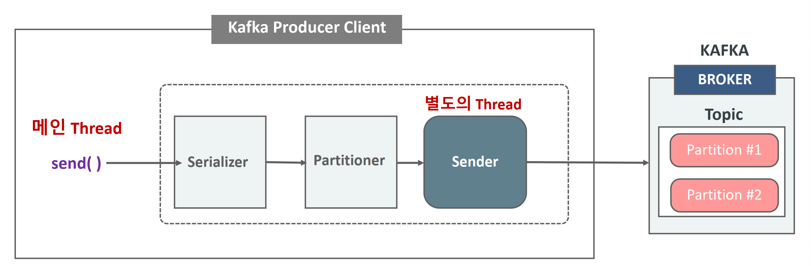

- Kafka Producer 전송은 Producer Client의 별도 Thread가 전송을 담당한다는 점에서 기본적으로 Thread간 Async 전송 임.
- Producer Client의 Main Thread가 send() 메소드를 호출하여 메시지 전송을 시작하지만 바로 전송되지 않으며 내부 Buffer에 메시지를 저장 후에 별도의 Thread가 Kafka Broker에 실제 전송을 하는 방식
  - 이렇게 배치로 모아서 보내야 네트워크 비용이 줄기 때문에 효율적이다

카프카 메시지는 동기 혹은 비동기로 전송할 수 있다.

* Sync 방식 : 프로듀서가 브로커로부터 메시지를 받았다는 Ack를 받은 후 다음 메시지 전송
  * producer.send()하면 Future가 반환되는데, future.get()을 호출해서 브로커로부터 메시지 받을때까지 대기
  * 장점 : 
    * 전송 결과 보장: 브로커로부터 메시지의 성공/실패 여부를 확인하므로 데이터 손실 가능성이 낮음.
    * 순차적 처리 : 각 메시지 전송이 완료된 후에 다음 메시지를 전송하므로 순서를 보장하기 쉬움.
  * 단점
    * 성능 저하 : 각 메시지 전송 시 응답을 기다려야 하므로 처리 속도가 느림.
    * 응답 대기 중 스레드가 블로킹되므로 고성능이 요구되는 애플리케이션에는 부적합.
    * **네트워크 레이턴시**나 **브로커 장애**로 인해 전송 시간이 길어질 수 있음 
* Async 방식: 브로커로부터 Ack를 기다리지 않고 전송. Ack 메시지를 비동기로 받기 위해선 Callback을 인자로 넘길 수 있다. 
  * 장점 
    * 고성능 : 응답을 기다리지 않으므로 대량의 메시지를 빠르게 전송 가능.
    * 비동기 작업 처리: 여러 메시지를 병렬로 처리하여 애플리케이션의 처리 속도를 높임.
  * 단점 
    * 오류 관리 복잡성 : 전송 성공/실패 여부를 콜백으로 처리해야 하므로 코드가 복잡해질 수 있음.
    * 순서 보장 어려움 : 메시지 전송 순서가 보장되지 않을 수 있음(분할된 파티션의 경우 특히 주의).


| 특징          | 동기(Sync)                            | 비동기(Async)                   |
| ------------- | ------------------------------------- | ------------------------------- |
| **전송 방식** | 전송 후 응답 대기                     | 전송 요청 후 응답 대기 없음     |
| **성능**      | 느림                                  | 빠름                            |
| **오류 처리** | 응답 확인 후 처리                     | 콜백을 통해 비동기적으로 처리   |
| **순서 보장** | 보장 가능                             | 보장 어려움(추가 구현 필요)     |
| **적용 사례** | 신뢰성이 중요한 작업(예: 금융 데이터) | 대량 데이터 처리(예: 로그 수집) |

실제 운영 환경에서는 **비동기 전송 방식**을 기본으로 사용하며, 추가적인 모니터링과 재시도 로직을 통해 신뢰성을 확보하는 것이 일반적


kafkaProduver.get()같은방식으로 개별 응답 블로킹은 배치 처리가 불가능하다. 전송은 배치지지만 배치 메시지는 1개뿐이다.

# 섹션 4

producer는 해당 Topic의 파티션 리더 브로커에게만 메시지를 송신한다.

* 리더란, 파티션이 복제되어있을때 복제되는 대상(팔로워들이 복제함)

**`acks` 설정**:

- `0`: 메시지 전송만 하고 응답을 기다리지 않음. 가장 빠르지만 데이터 손실 위험.
  - 메시지가 제대로 전송되었는지 브로커로 부터 확인을 받지 않기 때문에 메시지가 브로커에 기록되지 않더라도 재 전송하지 않음
- `1`: 리더 파티션의 확인만 받음. 기본값.
  - 리더가 메시지 수신 후 적재중 다운될경우 다른 브로커에는 복제되지 않았으므로 메시지 소실 우려 있음 
- `all`: 모든 복제본의(레플리카) 확인을 받음. 가장 신뢰성 높음.
  - min.insync.replicas 수(최소 복제 완료 수) 만큼 레플리카에 복제 수행 후 리더 브로커가 확인 후에 ack 전송 
  - **`min.insync.replicas` > 파티션 복제본 수**:
    - 설정 값이 복제본 수를 초과하면 메시지 전송이 항상 실패하므로 적절한 복제본 수를 설정해야 함.


### acks 0

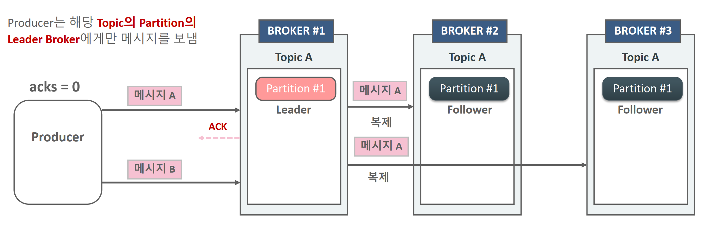

- Producer는 Leader broke가 메시지 A를 정상적으로 받았는지에 대한 Ack 메시지를 받지 않고 다음 메시지인 메시지 B를 바로 전송
- 메시지가 제대로 전송되었는지 브로커로 부터 확인을 받지 않기 때문에 메시지가 브로커에 기록되지 않더라도 재 전송하지 않음
- 메시지 손실의 우려가 가장 크지만 가장 빠르게 전송할 수 있음(IOT 센서 데이터등 데이터의 손실에 민감하지 않은 데이터 전송에 활용)

### acks 1

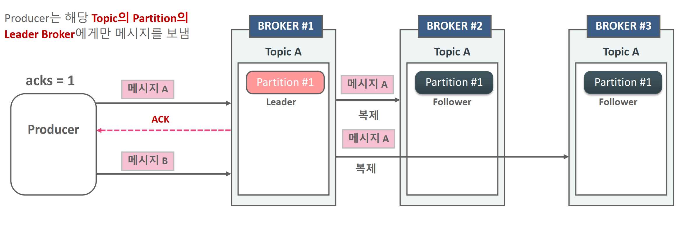

*  Producer는 Leader broke가 메시지 A를 정상적으로 받았는지에 대한 Ack 메시지를 받은 후 다음 메시지인 메시지 B를 바로 전송. 만약 오류 메시지를 브로커로 부터 받으면 메시지 A를 재 전송.

* 메시지 A가 모든 Replicator에 완벽하게 복사되었는지의 여부는 확인하지 않고 메시지 B를 전송.

* 만약 Leader가 메시지를 복제 중에 다운될 경우 다음 Leader가 될 브로커에는 메시지가 없을 수 있기 때문에 메시지를 소실할 우려가 있음.

### acks all

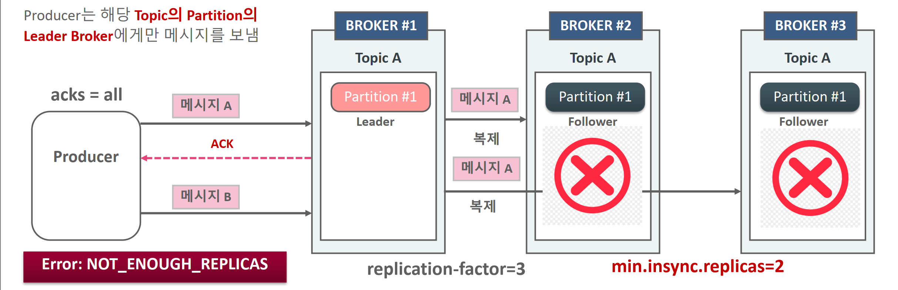

* Producer는 Leader broke가 메시지 A를 정상적으로 받은 뒤 min.insync replicas 개수 만큼의 Replicator에 복제를 수행한 뒤에 보내는 Ack 메시지를 받은 후 다음 메시지인 메시지 B를 바로 전송. 만약 오류 메시지를 브로커로 부터 받으면 메시지 A를 재 전송.

*  메시지 A가 모든 Replicator에 완벽하게 복사되었는지의 여부까지 확인후에 메시지 B를 전송.

* 메시지 손실이 되지 않도록 모든 장애 상황을 감안한 전송 모드이지만 Ack를 오래 기다려야 하므로 상대적으로 전송속도가 느림.


acks 설정

```java
Properties props = new Properties();
props.setProperty(ProducerConfig.BOOTSTRAP_SERVERS_CONFIG, "127.0.0.1:9092");
props.setProperty(ProducerConfig.KEY_SERIALIZER_CLASS_CONFIG, StringSerializer.class.getName());
props.setProperty(ProducerConfig.VALUE_SERIALIZER_CLASS_CONFIG, StringSerializer.class.getName());

props.setProperty(ProducerConfig.ACKS_CONFIG, "0"); // 0, 1, all

//KafkaProducer object creation
KafkaProducer<String, String> kafkaProducer = new KafkaProducer<>(props);
```


### producer의 Sync와 Callback Async 에서의 acks와 retry

* Callback 기반의 async에서도 동일하게 acks 설정에 기반하여 retry가 수행됨

* Callback 기반의 async에서는 retry에 따라 Producer의 원래 메시지 전송 순서와 Broker에 기록되는 메시지 전송 순서가 변경 될 수 있음.

* Sync 방식에서 acks=0일 경우 전송 후 ack/error를 기다리지 않음(fire and forget).


### 메시지 배치 전송의 이해

메시지가 전송되는 순서는 다음과 같다

* 직렬화 -> 파티션 결정 -> 압축(선택) -> Record Accumulator 저장 -> 별도의 Thread에서 전송

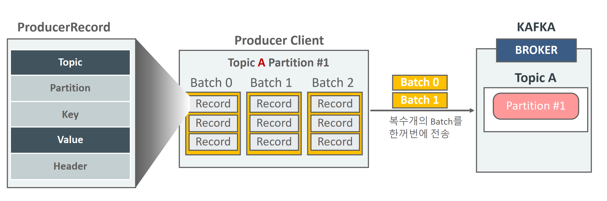

카프카는 메시지를 내부 메모리에 단일 메시지를, 파티션에 따라 레코드 배치단위로 묶어 전송한다.

buffer.memory 설정(바이트) 만큼 보관될 수 있으며 이게 다 차면 전송하거나 시간이 지나면 전송한다.

#### Kafka Producer Record Accumulator

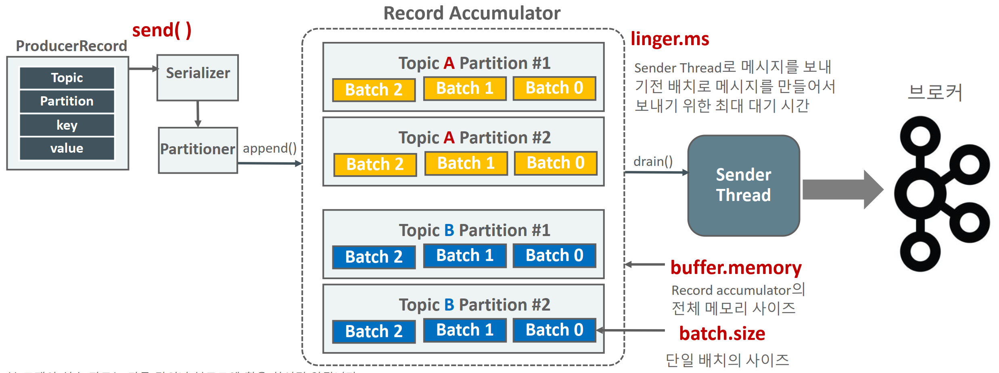

* Record Accumulator는 Partitioner에 의해서 메시지 배치가 전송이 될 토픽과 Partition에 따라 저장되는 KafkaProducer 메모리 영역

* Sender Thread는 Record Accumulator에 누적된 메시지 배치를 꺼내서 브로커로 전송함.

* KafkaProducer의 Main Thread는 send() 메소드를 호출하고 Record Accumulator 에 데이터 저장하고 Sender Thread는 별개로 데이터를 브로커로 전송

### Producer의 linger.ms 와 batch.size 옵션

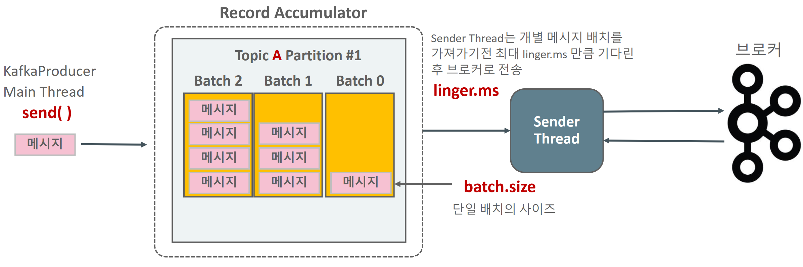

* Sender Thread는 기본적으로 전송할 준비가 되어 있으면 Record Accumulator에서 1개의 Batch를 가져갈수도, 여러 개의 Batch를 가져 갈 수도 있음. 또한 Batch에 메시지가 다 차지 않아도 가져 갈 수 있음.

*  linger.ms를 0보다 크게 설정하여 Sender Thread가 하나의 Record Batch를 가져갈 때 일정 시간 대기하여 Record Batch에 메시지를 보다 많이 채울 수 있도록 적용
  * **`batch.size`**:  default 16KB 
    - 비동기 전송에서 한 번에 전송할 배치 크기. 크기를 너무 작게 설정하면 효율이 낮아지고, 너무 크게 설정하면 메모리 사용량 증가.
    - 배치 크기는 **압축되기 전 크기** 기준이며 메시지가 `batch.size`에 도달하지 않아도, **`linger.ms` 시간이 초과하면 배치를 전송**\
  * **`linger.ms`**: 기본값 0ms. 5~100ms 설정시 네트워크 효율 증가 
    - 비동기 전송 시 배치를 기다리는 시간. 설정 시간이 길수록 대기 후 전송하며, 성능에 영향을 줌.
    - 크기가 다 차지 않아도 시간이 되면 전송함. 
      - 반드시 0보다 크게 설정할 필요는 없다. 
    - 전반적인 Producer와 Broker간의 전송이 느리다면 linger.ms를 높여서 메시지가 배치로 적용될 수 있 는 확률을 높이는 시도를 해볼 만함. linger.ms는 보통 20ms 이하로 설정 권장

#### sync와 async callback에서의 batch

- 기본적으로 KafkaProducer객체의 send()메소드는 비동기(Async)이며 Batch 기반으로 메시지 전송
- Calback 기반의 Async는 비동기적으로 메시지를 보내면서 RecordMetadata를 Client가 받을 수 있는 방식을 제공
- Calback 기반의 Async는 여러 개의 메시지가 Batch로 만들어짐.
- Kafkaproducer.send(.get() 와 같은 방식으로 개별 메시지 별로 응 답을 받을 때까지 block이 되는 방식으로는 메시지 배치 처리가 불가. 전송은 배치레벨이지만 배치 에 메시지는 단 1개


## Producer 메시지 전송/ 재전송 시간 파라미터 이해

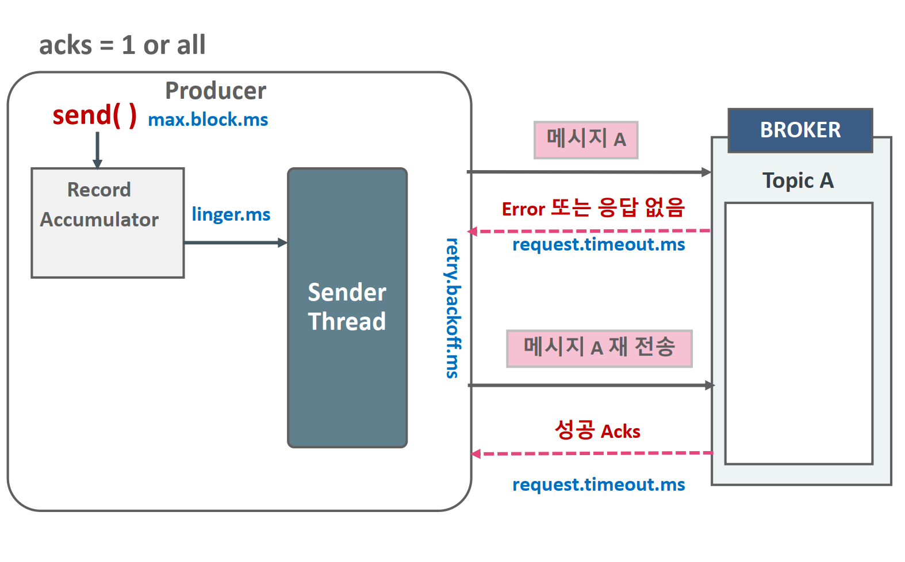

```
delivery.timeout.ms >= linger.ms + request.timeout.ms

Kafka 프로듀서의 메시지 전송과 관련된 시간 설정 간의 관계.
각각의 설정은 메시지 전송의 최대 지연 시간 및 전송 실패 처리에 영향을 미침 
```

> delivery.timeout.ms < linger.ms + request.timeout.ms 이면,
>
> - 아직 메시지를 배치로 모으기 위해 기다리는 동안(linger.ms) + 브로커 응답 대기(request.timeout.ms) 시간만큼은 필요할 텐데, 그보다 더 짧은 시간 내에 delivery.timeout.ms가 만료되어버려, 메시지가 실제로 성공할 수 있는 기회를 사전에 “실패”로 간주하는 상황이 발생할 수 있다.

* delivery.timeout.ms : 기본값: 120,000 ms (2분)

  - 메시지가 프로듀서에서 전송 요청된 시점부터 성공(ACK 수신) 또는 실패로 간주되기까지의 최대 허용 시간(밀리초).

  - 이 시간 내에 메시지가 전송되지 않으면 실패로 처리되며, `RetriesExhaustedException`이 발생할 수 있음.
  - 왜 중요한가
    - 만약 이 값이 너무 짧으면, 실제로는 브로커가 메시지를 받았어도 일시적 지연 때문에 ACK가 늦게 도착하면 실패로 잘못 간주될 수있고, 너무 길면, 프로듀서가 메시지 전송을 오랫동안 붙들고 있어서 장애 상황 인지가 늦어지고, 후속 처리가 지연될 수 있다.

* linger.ms : 기본값: 0 ms

  - 프로듀서가 메시지를 배치로 묶기 위해 기다리는 시간(밀리초).

  - 메시지가 도착하자마자 보내는 대신, 효율성을 위해 약간의 지연 시간을 두고 배치 전송.

* request.timeout.ms : 기본값: 30s
  - 브로커로 전송된 요청에 대해 응답을 기다리는 최대 시간(밀리초).
  - 브로커가 이 시간 내에 응답하지 않으면 실패로 간주하며, 프로듀서는 재시도를 시도할 수 있음.

* max.block.ms
  * 프로듀서의 `send()` 호출 시, 내부 버퍼(Record Accumulator)가 꽉 차거나(배출이 안 되면) 다른 원인으로 **블로킹**되는 상황에서 **최대 대기할 시간** 만약 이 시간이 max.block.ms를 초과하면, 프로듀서는 **TimeoutException**을 던짐.
    * 메시지 생산속도가 소비(또는 전송) 속도보다 훨씬 빠를 때, 버퍼가 꽉 차면 생산자는 send()에서 대기(block)하게 되며, 이때 시간이 너무 길면 서비스 장애로 이어질 수 있음. 

* retry.backoff.ms : 재전송을 위한 대기 시간 
  * 너무 짧으면 대규모 트래픽에서 브로커가 복구되기도 전에 과도한 재시도가 발생할 수 있고, 너무 길면 복구 후에도 재전송이 지연될 수 있다. 

> 시나리오 1: **실시간 로그 처리 (지연에 민감, 메시지 양이 많음)**
>
> - 목표
>
>   : 로그를 최대한 빠르게 브로커로 보내야 하며, 지연이 너무 커지면 안 됨.
>
>   - 그러나 동시에 엄청난 양의 로그를 보내므로, 너무 자주 전송하면 오버헤드가 클 수 있음.
>
> - 설정 예시
>
>   - `linger.ms = 5~10 ms` 정도로 소폭 배치. (기본 0ms → 5~10ms로 늘려 네트워크 효율 개선)
>
>   - `request.timeout.ms = 30,000 ms` (기본값 사용, 혹은 약간 증가)
>
>   - ```
>     delivery.timeout.ms = 120,000 ms
>     ```
>
>      (기본 2분, 보통 그대로 사용)
>
>     - linger + request.timeout 합쳐도 여유가 충분함.
>
>   - `retry.backoff.ms = 100 ms` (실패 시 0.1초 간격으로 재시도)
>
> 이렇게 하면, 로그 생산에 따른 전송이 약간씩 지연되지만(최대 10ms), 네트워크 효율은 좋아지고, 한 번에 여러 레코드를 묶어 전송할 수 있다
>
>
> 시나리오 2: **불안정한 네트워크 환경에서 이벤트 전송**
>
> - **목표**: 네트워크 패킷 손실이나 지연이 잦은 상황에서 **재시도 로직**을 안정적으로 처리.
> - 설정 예시
>   - `linger.ms = 10~50 ms` (너무 길게 배치하지 않고, 안정적으로 전송)
>   - `request.timeout.ms = 60,000 ms` 이상 (네트워크 지연이 크므로 응답 대기 시간을 늘림)
>   - `delivery.timeout.ms = 180,000 ms` (3분 정도로 늘려서 재시도와 지연을 커버)
>   - `retry.backoff.ms = 1,000 ms` (1초 정도 대기 후 재시도, 네트워크가 복구될 시간을 줌)
>
> 네트워크가 자주 끊긴다면, ACK 수신에 더 많은 시간이 걸릴 수 있으므로 `request.timeout.ms`를 늘리고, 그만큼 `delivery.timeout.ms`도 증가


ackes가 1 또는 all일때, retries 설정 횟수 만큼 재전송 시도하다가, delivery.tmeout.ms가 되면 재전송이 중지된다.

* retries와 delivery.timeout.ms 를 이용하여 재 전송 횟수 조정 

* retries는 재 전송 횟수를 설정. 
* delivery.timeout.ms 는 메시지 재전송을 멈출때 까지의 시간 
* 보통 retries는 무한대값으로 설정하고 delivery.timeout.ms(기 본 120000, 즉 2분) 를 조정하는 것을 권장.

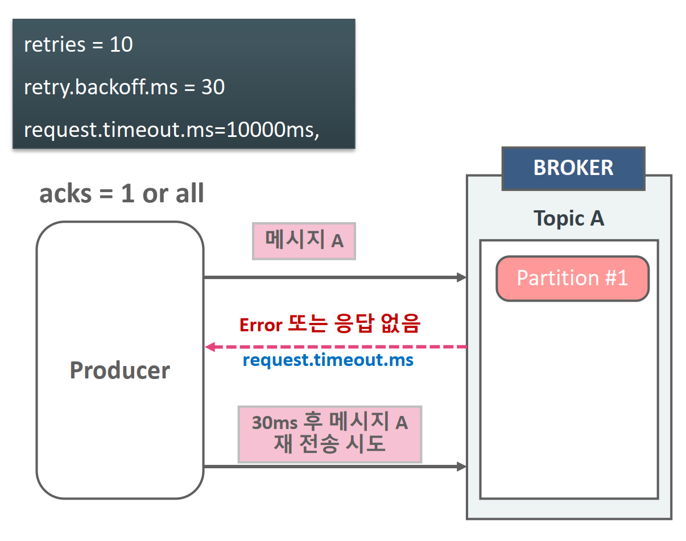

- retry.backoft.ms는 재 전송 주기 시간을 설정
- retries=10, request.timeout.ms=10000ms, retry.backoff.ms=30의 경우 request.timeout.ms 기다린후 재 전송하기전 30ms 이후 재전송 시도. 이와 같은 방식으로 재 전송을 10회 시도하고 더 이상 retry 시도 하지 않음.
- 만약 10회 이내에 delivery.timeout.ms에 도달하면 더 이상 retry 시도하지 않음.

#### max.in.flight.requests.per.connection

max.in.flight.requests.per.connection란, **브로커로 전송한 요청(Request)이 응답을 기다리는 동안 동시에 보낼 수 있는 최대 요청 수**를 설정하는 옵션 

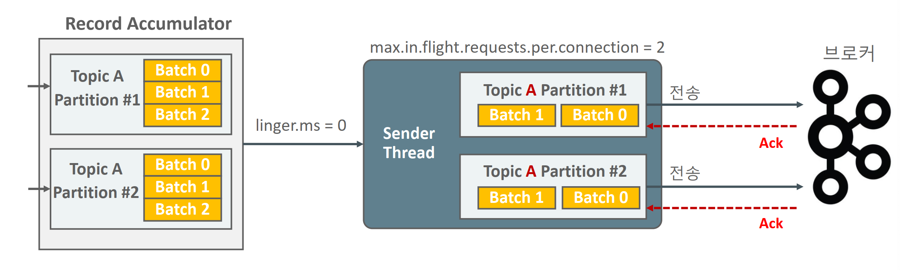

기본적으로 요청은 순서대로 처리되지만, 이 값을 증가시키면 **동시 요청**이 가능하여 성능이 향상될 수 있다.

**`max.in.flight.requests.per.connection` 기본값**: **5**

**값을 증가시키면**:

- **장점**: 처리량(Throughput)이 증가하여 성능이 개선될 수 있음.
- **단점**: 재시도(`retries`)가 활성화된 경우, 요청 순서가 뒤바뀌는(out-of-order) 현상이 발생할 수 있음.

**값을 낮추면**:

- **장점**: 메시지 순서가 보장되므로 데이터의 순서가 중요한 애플리케이션에서 유리.
- **단점**: 동시 요청이 감소하므로 처리량이 낮아질 수 있음.

#### 설정 주의사항

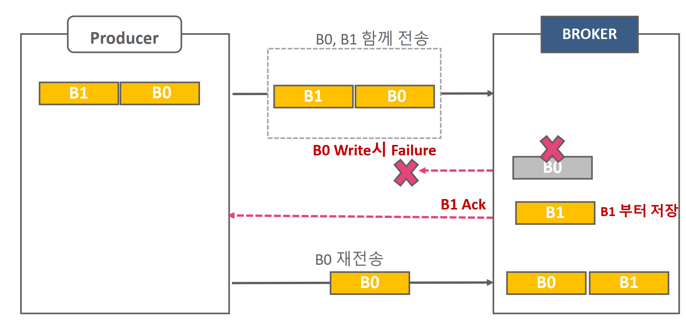

* BO가 B1보다 먼저 Producer에서 생성된 메시지 배치.
*  max.infight.requests.per.connection = 2(>1) 에서 B0, B1 2개의 배치 메시지를 전송 시 B1은 성공적으로 기록 되었으나 B0의 경우, write되지 않고 Ack 전송이 되지 않는 Failure 상황이 된 경우 Producer는 B0를 재 전송하여 성공적으로 기록되며 Producer의 원래 메시지 순서와는 다르게 Broker에 저장 될 수 있음.
  * 멱등성 프로듀서인 enable.idempotence=true 설정으로 순서를 해결할 수 있긴 하다. 
  * **`enable.idempotence=true`**
    - 이 설정은 Kafka가 각 메시지에 고유한 **프로듀서 ID**와 **시퀀스 번호**를 추가하여 순서를 보장
    - 메시지가 브로커에 도착한 이후, Kafka는 메시지를 WAL에 기록하지만, 이때 **시퀀스 번호는 로그에 포함되지** 않고 메모리에 저장됌.
    - 따라서, `in-flight` 요청이 2 이상이고 재시도가 발생하더라도, Kafka는 메시지의 순서를 유지하고 중복 메시지가 저장되지 않도록 보장

1. **`retries`와의 관계**:
   - `retries` 옵션이 활성화된 경우, 요청 재시도로 인해 순서 역전 문제가 발생할 수 있음.
   - 이 경우 순서를 보장하려면 `max.in.flight.requests.per.connection=1`로 설정.
2. **`acks`와의 관계**:
   - `acks=all`로 설정하면 메시지 신뢰성이 높아지고, 순서 역전 가능성도 줄어듦.
3. **`batch.size` 및 네트워크 조건**:
   - 높은 처리량을 유지하려면 배치 크기(`batch.size`)와 네트워크 대역폭을 고려하여 최적화 필요.

### 최대 한번 전송, 적어도 한번 전송, 정확히 한번 전송

* 최대 한번 전송(at most once) - 중복 x 

*  적어도 한번 전송(at least once) - 중복 허용 -> retry, ack 1, all 

*  정확히 한번 전송(exactly once) -> 
  * 중복 없이 전송(Idempotence): Producer의 message 전송 retry시 중복 제거 
  * Transaction 기반 전송 

#### At Most Once (최대 한 번 전송)

Producer는 브로커로 부터 ACK또는 에러 메시지 없이 다음 메시지를 연속적으로 보냄.

메시지가 소실 될 수는 있지만 중복 전송은 하지 않음.

즉, 메시지가 생산(Producer) → 브로커(Kafka) → 소비(Consumer)로 가는 과정에서,

- **중복**은 발생하지 않지만,
- 어떤 이유로든 메시지가 소실될 수 있어도 괜찮은(허용하는) 시나리오에 적합

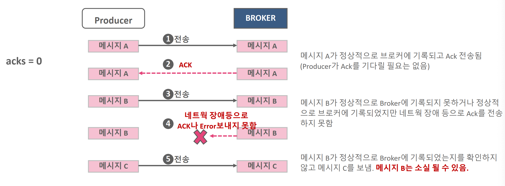

* 주로 **소비자(Consumer)에서 메시지를 읽고, 그 즉시 오프셋(Offset)을 커밋**

* 메시지를 아직 처리하기도 전에, “읽었다”라고 브로커에 알려버리는 방식.

  처리 중 장애가 발생하면, 해당 메시지를 다시 읽을 기회가 없으므로 “놓침”이 발생할 수 있다.

  단, 이미 “읽었다”로 간주했으므로 **중복**은 발생하지 않음.

* 로그 수집이나 성능과 간단한 구조 중요시 사용
* 신뢰도가 높은 시스템(금융 거래, 정산 등)에는 적합하지 않다. 

#### At Least Once (적어도 한번 전송 )

Producer는 브로커로 부터 ACK를 받은 다음에 다음 메시지 전송. 메시지 소실은 없지만 중복 전송을 할 수 있음

* 즉, **메시지 손실은 최소화**하지만(0에 가깝게), 중복 처리가 발생할 수 있다. 

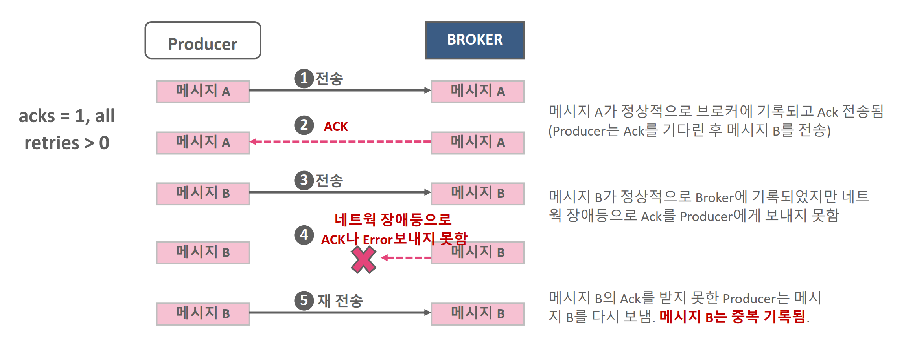

* **소비자(Consumer)가 메시지를 처리한 후에 오프셋을 커밋하는 경우 **.
  - 메시지를 실제로 “처리”한 뒤에, “이제 이 메시지를 읽었다”고 브로커에 보고
  - 만약 처리 완료 전에 장애가 나면, 재시작 시점에서 해당 메시지를 다시 가져와 처리
  - 그 결과, **중복** 처리(두 번 이상 처리) 가능성이 생김.
* **프로듀서(Producer) 재시도 시**
  - 네트워크나 브로커 응답 지연으로 인해 프로듀서가 동일 메시지를 여러 번 보낼 수 있다 (idempotent 설정이 없는 경우).
* 일반적인 이벤트 수집 처리 파이프라인 사용
  * 어떤 메시지가 중복으로 처리되어도 비즈니스적으로 큰 문제는 없는 경우 
* 메시지 손실이 거의 없어서 **신뢰성**이 높지만, 중복 처리가 발생할 수 있어 애플리케이션 레벨에서 중복 체크가 필요. 

#### Exactly Once (정확히 한 번 전송)

**“정확히 한 번”**은 메시지를 **놓치지도 않고**, **중복 처리도 없는** 이상적인 전송 보장 모델.

매우 강력한 보장이나, 달성하기 위해서는 **추가적인 복잡성**과 **비용**이 든다. 

카프카에서의 구현 방식

3.1 Idempotent Producer + Transactional Producer

- **Idempotent Producer**
  - 프로듀서가 동일한 레코드를 여러 번 전송하더라도, 브로커에서 **중복 레코드가 기록되지 않도록** 보장.
  - 브로커는 프로듀서 ID(pid)와 시퀀스 넘버를 추적해, **이미 처리한 시퀀스**면 무시
  - 이를 통해 **프로듀서 레벨**에서 중복 전송을 막아, 적어도 메시지가 브로커에 **중복 저장**되는 일은 없다.
- **Transactional Producer**
  - 프로듀서가 여러 레코드를 **트랜잭션 단위**로 묶어서 보내고, **commit** 또는 **abort**를 통해 원자적(atomic)으로 처리.
  - 카프카 브로커의 **Transaction Coordinator**가 이 과정을 관리.
  - Consumer가 `read_committed` 모드로 동작하면, **커밋된 레코드만** 읽어들일 수 있어, 중간에 abort된 레코드는 건너뛰게 된다.

3.2 Consumer 측 Exactly Once

- Kafka Streams, Flink등의 프레임워크에서 내부적으로 트랜잭션 을 활용해 소비(Consumer)와 프로듀스(Producer)를 하나의 트랜잭션으로 묶는 경우가 흔하다.
  - 예) Spark/Flink에서 “소비한 레코드를 DB에 쓰고, 해당 결과를 다시 카프카에 써야 하는 상황”을 모두 트랜잭션 범위 안에 둠.
  - 이렇게 하면 **한 번 읽은 메시지를 중복 없이 정확히 한 번**만 다음 단계로 넘기게 된다.

장애 대응 및 주의사항

- 장애로 인해 트랜잭션이 중간에 실패하면, 해당 배치(트랜잭션)는 **abort**되고 재시도될 수 있음.
- 트랜잭션 상태(Commit/Abort)를 관리하는 **Coordinator**가 장애나 지연을 겪을 경우, 성능 이슈 발생 가능.
- **정확히 한 번**을 보장하려면, 소비자 쪽도 `read_committed` 모드로 동작하고, **DB나 외부 시스템**과의 연계 시에도 원자성을 유지해야 합니다.
- **장애복구 시**, 트랜잭션이 제대로 커밋되지 않은 레코드는 “보이지 않게” 처리되거나 abort될 수 있으므로, 재처리 로직이 있어야 할 수도 있음.

#### 중복없이 전송(idempotence)

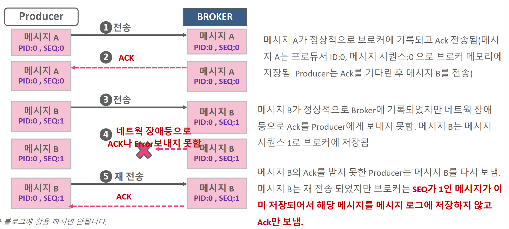

* Producer는 브로커로 부터 ACK를 받은 다음에 다음 메시지 전송하되, Producer ID와 메시지 Sequence를 Header에 저장하여 전송

* 메시지 Sequence는 메시지의 고유 Sequence번호. 0부터 시작하여 순차적으로 증가. Producer ID는 Producer가 기동시마다 새롭게 생성

* 브로커에서 메시지 Sequece가 중복 될 경우 이를 메시지 로그에 기록하지 않고 Ack만 전송.

* `브로커는 Producer가 보낸 메시지의 Sequence가 브로커가 가지고 있는 메시지의 Sequence보다 1만큼 큰 경우에만 브로커에 저장`


#### idempotence를 위한 producer 설정 방법

```java
Properties props = new Properties();
props.setProperty(ProducerConfig.BOOTSTRAP_SERVERS_CONFIG, "127.0.0.1:9092");
props.setProperty(ProducerConfig.KEY_SERIALIZER_CLASS_CONFIG, StringSerializer.class.getName());
props.setProperty(ProducerConfig.VALUE_SERIALIZER_CLASS_CONFIG, StringSerializer.class.getName());
props.setProperty(ProducerConfig.ACKS_CONFIG, "all");
props.setProperty(ProducerConfig.MAX_IN_FLIGHT_REQUESTS_PER_CONNECTION, "5");
//KafkaProducer object creation
KafkaProducer<String, String> kafkaProducer = new KafkaProducer<>(props);
```

> acks가 all이아니면 디폴트로 true여도 멱등적이게 설정되지 않는다. 

- enable.idempotence = true
- acks = all
- retries는 0보다큰 값
- max.in.flight.requests.per.connection은 1에서 5사이 값

dempotence 적용 후 성능이 약간 감소(최대 20%)할 수 있지만 기본적으로 idempotence 적용을 권장

* Kafka 3.0 버전 부터는 Producer의 기본 설정이 Idempotence 임.

* 하지만 기본 설정중에 enable.idempotence=true를 제외하고 다른 파라미터들을 잘못 설정하면(예를 들어 acks=1로 설정) Producer는 정상적으로 메시지를 보내지만 idempotence로는 동작하지 않음

* 명시적으로 enable.idempotence=true를 설정한 뒤 다른 파라미터들을 잘못 설정하면 Config 오류가 발생하면서 Producer가 기동되지 않음

#### idempotence 기반에서의 메시지 전송 순서 유지

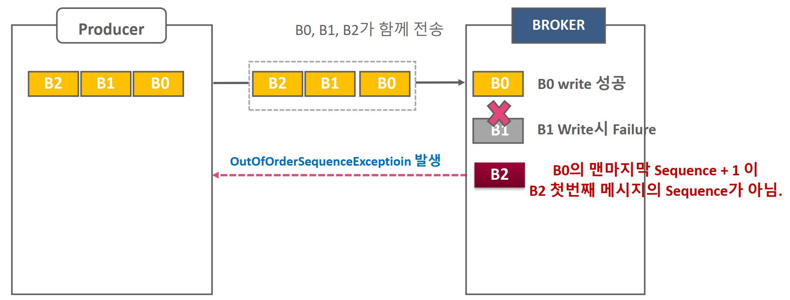

* B0이 가장 먼저, B1, B2 순에서 Producer에서 생성된 메시지 배치.

* Idempotence 기반에서 max.in.flight.requests.per.connection 만큼 여러 개의 배치들이 Broker에 전송됨.

* Broker는 메시지 배치를 처리시 write된 배치의 마지막 메시지 Sequence+1 이 아닌 배치 메시지가 올 경우OutoforderSequenceException을 생성하여 Producer에 오류로 전달.

* Idempotence(중복 없이 전송)은 Producer와 Broker간에 메시지 retry 시에만 중복 제거를 수행하는 메 커니즘
* 동일한 메시지를 send()로 두번 호출하여 전송하는 것은 Idempotence의 중복 제거 대상이 아님
* Producer가 재 기동되면 Producer ID가 달라지므로 이전 Producer가 전송한 메시지를 중복해서 보낼 수 있음.
* Consumer> Process-> Producer 로직에서 Consumer가 consumer_ofisets 에 읽은 offset을 저장하지 못하였지만 Producer는 메시지를 전송하였다면, Consumer는 이전 offset을 읽어서 Producer를 통해 중복된 메시지를 전송할 수 있음. Transaction 기반 처리 필요


### 전송방식 메커니즘 정리 및 주의사항

| 전송 모드         | 메시지 유실 | 중복 발생 | 구현 난이도     | 성능(오버헤드)            | 사용 사례                         |
| ----------------- | ----------- | --------- | --------------- | ------------------------- | --------------------------------- |
| **At Most Once**  | 가능        | 없음      | 낮음            | 가장 빠르고 간단          | 로그 등 일부 손실 허용 시         |
| **At Least Once** | 없음(거의)  | 가능      | 중간            | 일반적으로 우수           | 대부분의 애플리케이션 기본 모드   |
| **Exactly Once**  | 없음        | 없음      | 높음 (트랜잭션) | 트랜잭션 처리로 약간 하락 | 금융·결제 등 데이터 무결성 최우선 |

1. **At Most Once**
   - 빠르고 단순하지만 메시지 손실을 허용.
   - 소비자에서 “읽었다”는 오프셋 커밋을 처리보다 먼저 진행.
2. **At Least Once**
   - 메시지 손실은 방지하되, 중복은 발생 가능.
   - 장애 발생 시 메시지 재처리(중복).
   - 대부분의 카프카 환경에서 기본적으로 사용되는 방식.
3. **Exactly Once**
   - 메시지 손실도, 중복도 허용하지 않는 최상위 레벨 보장.
   - **Idempotent Producer** + **Transactions** + **read_committed Consumer** 필요.
   - 오버헤드(트랜잭션 관리, Coordinator 통신)로 인해 성능이 약간 떨어질 수 있음.

#### 장애 대응 및 운영 시 고려 사항

1. **Consumer 장애 시**
   - At Most Once: 이미 오프셋이 커밋되었을 수 있으므로 메시지 재처리 불가 → 손실 발생.
   - At Least Once: 장애 전 커밋되지 않은 메시지는 재처리 → 중복 가능.
   - Exactly Once: 트랜잭션 중이면 abort 후 재시도 (Kafka Streams나 Flink가 내부적으로 관리).
2. **Producer 장애 시**
   - At Most Once: 프로듀서 측에서 문제가 생겨도 별도 재시도 로직이 없으니 메시지 손실 가능.
   - At Least Once: 프로듀서 재시도 로직(acks 설정, retries, idempotent=false 시 중복 전송 가능).
   - Exactly Once: **Idempotent Producer** + **Transactional** 설정을 통해 중복/손실 방지.
3. **중복처리(Idempotency)**
   - At Least Once 시나리오에서, **데이터베이스나 어플리케이션에서 중복 삽입을 방지**하는 로직이 필요할 수 있음.
   - Exactly Once에서도 “카프카 내부”는 중복이 없게 처리해주지만, **카프카 밖(외부 DB, 다른 시스템)에 기록**할 때는 별도 보장 필요.
4. **트랜잭션 타임아웃**
   - Exactly Once를 사용하면, 트랜잭션 커밋 혹은 abort를 해야 하는 시간제한(트랜잭션 타임아웃)이 있다.
   - 장기간 오랜 시간 동안 열려 있는 트랜잭션은 브로커 리소스를 점유할 수 있으므로, **주기적으로 배치 사이즈나 타임아웃을 조절**해야 한다.

### Producer의 메시지 파티셔닝

```java
public interface Partitioner extends Configurable, Closeable {

    int partition(String topic, Object key, byte[] keyBytes, Object value, byte[] valueBytes, Cluster cluster);

    void close();

}

/**
 * 참고: 이 파티셔너는 더 이상 사용되지 않으며 사용해서는 안 됩니다.
 * 기본 파티셔닝 로직을 사용하려면 `partitioner.class` 설정을 제거하십시오.
 * Kafka 프로듀서 설정에서 partitioner.class를 명시적으로 설정하지 마세요.
 * Kafka는 자동으로 기본 파티셔너를 사용하여 메시지를 적절히 파티셔닝합니다.
 * 자세한 내용은 KIP-794를 참조하십시오.
 *
 * 기본 파티셔닝 전략:
 * <ul>
 * <li>레코드에 파티션이 지정된 경우, 해당 파티션을 사용
 * <li>파티션이 지정되지 않았지만 키가 있는 경우, 키의 해시 값을 기반으로 파티션 선택
 * <li>파티션과 키가 모두 없는 경우, 배치가 가득 찼을 때 변경되는 "스티키 파티션" 사용
 * 
 * 스티키 파티셔닝에 대한 자세한 내용은 KIP-480을 참조하십시오.
 */
@Deprecated
public class DefaultPartitioner implements Partitioner {

    private final StickyPartitionCache stickyPartitionCache = new StickyPartitionCache();

    public void configure(Map<String, ?> configs) {}

    public int partition(String topic, Object key, byte[] keyBytes, Object value, byte[] valueBytes, Cluster cluster) {
        return partition(topic, key, keyBytes, value, valueBytes, cluster, cluster.partitionsForTopic(topic).size());
    }

    public int partition(String topic, Object key, byte[] keyBytes, Object value, byte[] valueBytes, Cluster cluster,
                         int numPartitions) {
        if (keyBytes == null) {
            return stickyPartitionCache.partition(topic, cluster);
        }
        return BuiltInPartitioner.partitionForKey(keyBytes, numPartitions);
    }

    public void close() {}
    
    /**
     * 현재 스티키 파티션에서 배치가 완료된 경우, 스티키 파티션을 변경합니다.
     * 또는, 아직 스티키 파티션이 결정되지 않은 경우 새로 설정합니다.
     */
    @SuppressWarnings("deprecation")
    public void onNewBatch(String topic, Cluster cluster, int prevPartition) {
        stickyPartitionCache.nextPartition(topic, cluster, prevPartition);
    }
}
```

* KafkaProducer는 기본적으로 DefaultPartitioner 클래스를 이용하여 메시지 전송 시 도착할 Partition을 지정
* Defaultpartitioner는 키를 가지는 메시지의 경우 키 값을 Hashing하여 키 값에 따라 파티션 별로 균일하게 전송


Partitioner 인터페이스를 보면 직접 구현할 수 있다.

직접 구현해서 프로듀서에

```
props.put("partitioner.class", "com.example.CustomPartitioner");
```

하면 된다.

# 섹션5

## java 기반 컨슈머 구현 실습 및 consumer 내부 메커니즘 이해

브로커의 Topic 메시지를 읽는 역할을 수행.

모든 Consumer들은 고유한 그룹아이디 group.id를 가지는 Consumer Group에 소속되어야 함.

개별 Consumer Group 내에서 여러 개의 Consumer 들은 토픽 파티션 별로 분배됨.

```java
public class SimpleConsumer {

    public static final Logger logger = LoggerFactory.getLogger(SimpleConsumer.class.getName());

    public static void main(String[] args) {
        logger.atLevel(org.slf4j.event.Level.INFO);
        String topicName = "simple-topic";

        Properties props = new Properties();
        props.setProperty(ConsumerConfig.BOOTSTRAP_SERVERS_CONFIG, "127.0.0.1:9092");
        props.setProperty(ConsumerConfig.KEY_DESERIALIZER_CLASS_CONFIG, StringDeserializer.class.getName());
        props.setProperty(ConsumerConfig.VALUE_DESERIALIZER_CLASS_CONFIG, StringDeserializer.class.getName());
        props.setProperty(ConsumerConfig.GROUP_ID_CONFIG, "group-01");


        KafkaConsumer<String, String> kafkaConsumer = new KafkaConsumer<String, String>(props);

		try (kafkaConsumer) {
			kafkaConsumer.subscribe(List.of(topicName));
			while (true) {
				ConsumerRecords<String, String> consumerRecords = kafkaConsumer.poll(Duration.ofMillis(1000));
				for (ConsumerRecord record : consumerRecords) {
					logger.info("record key:{}, record value:{}, partition:{}", record.key(), record.value(), record.partition());
				}
				kafkaConsumer.commitSync();
			}
		}

    }
}
```


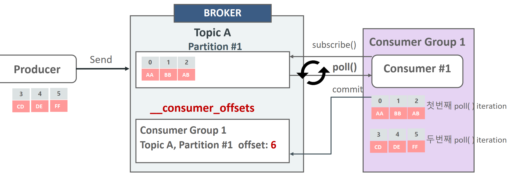

Consumer는 poll() 메소드를 이용하여 주기적으로 브로커의 토픽 파티션에서 메시지를 가져옴.

메시지를 성공적으로 가져왔으면 commit을 통해서 _consumer_offse에 다음에 읽을 offset 위치를 기재함.

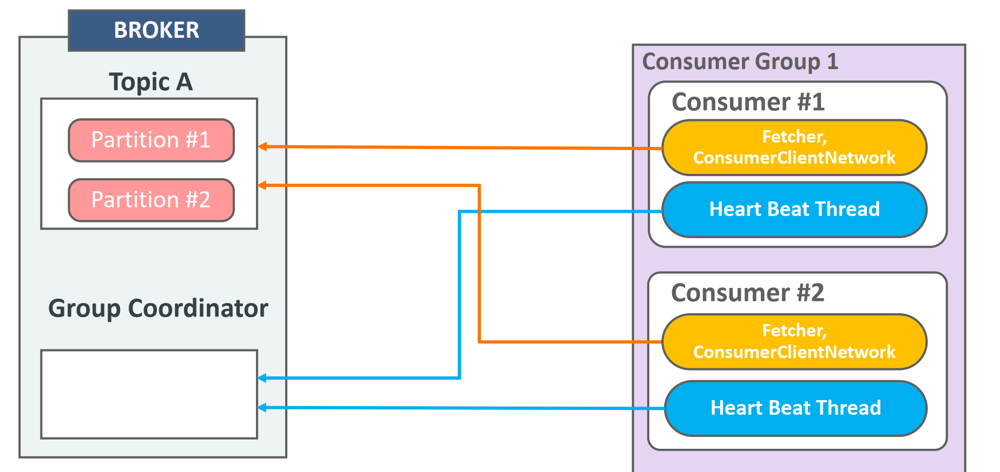

* kafkaConsumer는 Fetcher, ConsumerClientNetwork등의 주요 내부 객체와 별도의 Heart Beat Thread를 생성

* Fetch, ConsumerClientNetwork 객체는 Broker의 토픽 파티션에서 메시지를 Fetch 및 Poll 수행

* **Heart Beat Thread**는 Consumer의 정상적인 활동을 **Group Coordinator**에 보고하는 역할을 수행
  * (Group Coordinator는 주어진 시간동안 Heart Beat을 받지 못하면 Consumer들의 Rebalance를 수행 명령)

### consumer subscribe, poll, commit

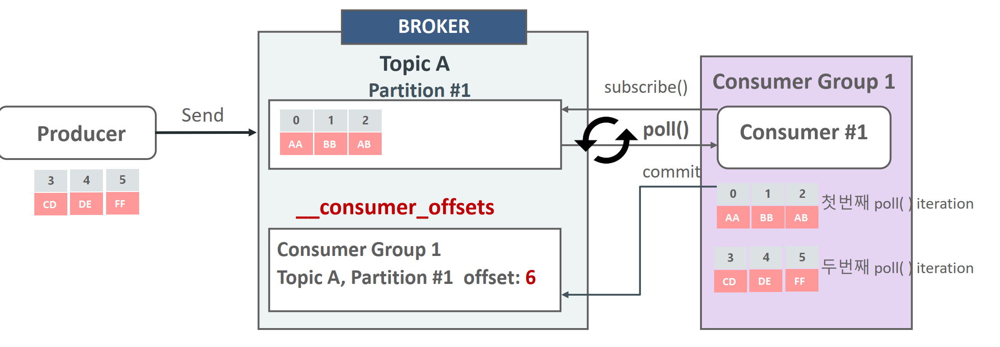

Consumer는 subscribe()를 호출하여 읽어 들이려는 토픽을 등록.

Consumer는 poll() 메소드를 이용하여 주기적으로 브로커의 토픽 파티션에서 메시지를 가져옴.

메시지를 성공적으로 가져 왔으면 commit을 통해서 _consumer_offse에 다음에 읽을 offset 위치를 기재함.

* Kafka는 오프셋이 선형적으로 증가하는 것을 보장하며, 오프셋 순서를 건너뛰는 폴링은 지원하지 않는다. 
* 컨슈머에서 `seek` 메서드를 사용해 강제로 **2번 메시지의 오프셋**으로 이동하면, 다음번 메시지를 가져올 수 있긴 하다.


### consumer api

1. Consumer 환경 설정(Properties 객체를 이용)

2. 1에서 설정한 환경 설정값을 반영하여 KafkaConsumer 객체 생성.

3. 읽어들일 Topic을 subscribe()를 호출하여 설정

4. 지속적으로 pol() 을 호출하여 Topic의 새로운 메시지를 계속 읽어 들임.

5. KafkaConsumer객체를 명확하게 close() 수행

컨슈머의 구성요소

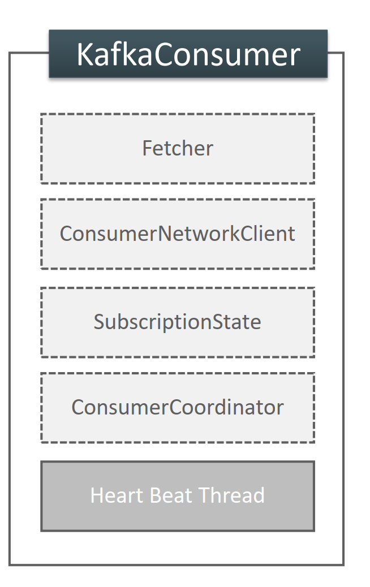

* 조회하는 패처, 네트워크 클라이언트, 구독 상태, 쿠디네이터, 하트비트 스레드로 구성
  * **Fetcher (패처)**
    - 역할
      - Kafka 브로커에서 메시지를 가져오는 역할.
      - 메시지 요청(`fetch`)을 처리하며, 데이터 압축 해제 등도 수행.
  * **NetworkClient (네트워크 클라이언트)**
    - 역할
      - Kafka 브로커와의 모든 네트워크 통신을 담당.
      - 데이터 요청(패치), 메타데이터 요청, 하트비트 전송 등을 관리.
      - 비동기 I/O로 구현.
  * **SubscriptionState (섭스크립션 상태)**
    - 역할
      - 컨슈머가 구독한 토픽/파티션의 상태를 추적.
      - 현재 읽고 있는 오프셋 및 커밋된 오프셋을 관리.
      - 리밸런싱 중인지 여부 등을 저장.
  * **ConsumerCoordinator (컨슈머 코디네이터)**
    - 역할
      - 컨슈머 그룹 내 조정을 담당.
      - 리밸런싱 처리 및 파티션 할당 관리.
      - 오프셋 커밋과 연동.
  * **Heartbeat Manager (하트비트 매니저)**
    - 역할
      - 컨슈머가 활성 상태임을 Kafka 브로커에 알림.
      - 설정된 주기(`heartbeat.interval.ms`)로 하트비트를 전송.
      - 하트비트 누락 시 `session.timeout.ms`에 따라 리밸런싱 트리거.
  * **Metadata (메타데이터)**
    - 역할
      - Kafka 클러스터의 정보(토픽, 파티션, 브로커 리더 등)를 유지.
      - 변경 사항 발생 시 동기화.
  * **Offset Commit Manager (오프셋 커밋 매니저)**
    - 역할
      - 처리 완료된 메시지의 오프셋을 Kafka 브로커에 커밋.
      - 수동(`commitSync`) 또는 자동(`enable.auto.commit=true`)으로 동작.
  * **Rebalance Listener (리밸런스 리스너)**
    - 역할
      - 리밸런싱 이벤트 발생 시 사용자 정의 작업을 수행.
      - `onPartitionsRevoked`와 `onPartitionsAssigned` 콜백을 제공.
  * **Background Threads (백그라운드 스레드)**
    - 역할 : 데이터 패치, 하트비트 전송, 재시도 등을 비동기적으로 처리.

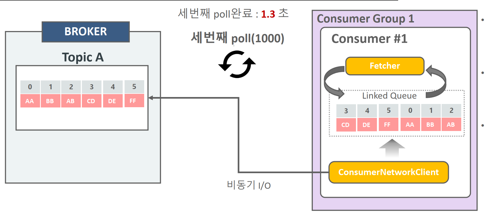

위 그림은 패쳐의 프로세스

- Linked Queue에 데이터가 있을 경우 Fetcher는 데이터를 가져오고 반환 하며 poll() 수행 완료
- ConsumerNetworkClient는 비동기로 계속 브로커의 메시지를 가져와서 Linked Queue에 저장
  - 내부적으로 BlockingQueue를 가지고 있음. 
- Linked Queue에 데이터가 없을 경우 1000ms 까지 Broker에 메시지 요청 후 poll 수행() 완료

```java
// in AsynckafkaConsumer
/**
 * "{@link FetchCollector#collectFetch(FetchBuffer) fetch collection}" 단계를 수행합니다.
 * 이 단계에서는 {@link #fetchBuffer}에서 원시 데이터를 읽어와 적절한 형식의 {@link CompletedFetch}로 변환하고,
 * 해당 데이터와 내부 {@link SubscriptionState 상태}가 올바른지 검증한 뒤,
 * 모든 데이터를 {@link Fetch}로 변환하여 반환합니다.
 *
 * <p/>
 *
 * 이 메서드는 반환하기 전에 {@link ConsumerNetworkThread#wakeup() 네트워크 스레드를 깨웁니다}.
 * 이는 <em>다음 데이터를 미리 가져올 수 있도록</em> 최적화를 위한 작업입니다.
 */
private Fetch<K, V> collectFetch() {
    final Fetch<K, V> fetch = fetchCollector.collectFetch(fetchBuffer);

    // Notify the network thread to wake up and start the next round of fetching.
    applicationEventHandler.wakeupNetworkThread();

    return fetch;
}

```


*  Fetcher는 Linked Queue 데이터를 가져오되, Linked Queue에 데이터가 없을 경우 ConsumerNetworkClient 에서 데이터를 브로커로 부터 가져올 것을 요청

#### 컨슈머 패처 관련 주요 설정 파라미터

* fetch.min.bytes
  * Fetcher가 record들을 읽어들이는 최소 bytes. 브로커는 지정된 fetch.min.bytes 이상의 새로운 메시지가 쌓일때 까지 전송을 하지 않음. 기본은 1이며 예시 설정은 `1024` (1KB)
  * 작은 값: 낮은 대기 시간(즉각 응답). 큰 값: 대기 후 더 많은 메시지를 가져옴(대역폭 최적화).
  * 이 크기가 다차면 fetch.max.wait.ms 를 기다리지 않고 바로 보냄. 
* fetch.max.bytes
  * fetcher가 한번에 가져올 수 있는 최대 데이터 bytes. 기본은 50MB

* fetch.max.wait.ms
  * 브로커에 fetch.min.bytes 이상의 메시지가 쌓일 때까지 최대 대기 시간. 기본은 500ms
    * 설정된 시간 안에 데이터가 준비되지 않으면, 현재 가능한 데이터를 반환.

* max.partition.fetch.bytes : 파티션별 한번에 최대로 가져올 수 있는 바이트
* max.poll.records
  * poll()로 한번에 가져올 수 있는 레코드 수. 기본은 500
  * 메시지 처리 시간이 긴 경우 작은 값(예: `10`)을 설정.

정리하자면,

브로커가 **`fetch.min.bytes` 이상의 데이터를 준비**한 경우, **`fetch.max.wait.ms`를 기다리지 않고** 데이터를 즉시 전송

반대로, `fetch.max.wait.ms`가 초과되더라도 **현재 준비된 데이터**를 전송.이 경우 데이터 크기가 `fetch.min.bytes`를 충족하지 못하더라도 전송

### **주요 상관관계**

- `fetch.min.bytes` vs. `fetch.max.wait.ms`
  - 데이터 크기가 `fetch.min.bytes`를 충족하면 대기 없이 바로 전송.
  - 준비된 데이터가 적으면 `fetch.max.wait.ms`까지 기다림.
- `fetch.max.bytes` vs. `fetch.min.bytes`
  - `fetch.max.bytes`가 더 우선 적용되어, `fetch.min.bytes`를 충족하더라도 초과된 데이터는 잘려 나감.
- `max.partition.fetch.bytes` vs. `fetch.max.bytes`
  - 각 파티션 제한이 우선 적용되며, 총합이 `fetch.max.bytes`를 초과하지 않음.
- `max.poll.records` vs. 데이터 크기 옵션
  - 크기(`fetch.min.bytes`, `fetch.max.bytes`)와 상관없이 최대 레코드 수(`max.poll.records`)로 데이터를 제한.

예시

```
fetch.min.bytes = 16384
fetch.max.wait.ms = 500
fetch.max.bytes = 52428800
max.partition.fetch.bytes=1024168
max.poll.records = 500
```

- 가져올 데이터가 1건도 없으면 poll() 인자 시간만큼 대기 후 Return
- 가져와야할 과거 데이터가 많을 경우 max.partition.fetch.bytes로 배치 크기 설정.
   그렇지 않을 경우 fetch.min.bytes로 배치 크기 설정
- 가장 최신의 offset 데이터를 가져오고 있다면 fetch.min.bytes 만큼 가져오고 return 하고 fetch.min bytes만큼 쌓이지 않는다면 fetch.max.wait.ms 만큼 기다린 후 return
- 오랜 과거 offset 데이터를 가져 온다면 최대 max.partition.fetch.bytes 만큼 파티션 에서 읽은 뒤 반환
- max.partition.feth.bytes에 도달하지 못하여도 가장 최신의 offset에 도달하면 반환
- 토픽에 파티션이 많아도 가져오는 데이터량은 fetch.max.bytes로 제한
- Fetcher가 Linked Queue에서 가져오는 레코드의 개수는 max.poll.records로 제한

### 컨슈머 안전하게 종료하기 - wakeup

`KafkaConsumer`의 `wakeup()` 메서드는 Kafka 컨슈머가 실행 중인 스레드에서 안전하게 작업을 중단하고 종료할 수 있도록 설계된 메서드.일반적으로 Kafka 컨슈머는 `poll()` 메서드 호출을 통해 데이터를 가져오며, 이 작업은 블로킹 상태가 될 수 있다. 이때 `wakeup()` 메서드를 호출하면 블로킹 상태를 해제하고 `WakeupException`을 던지게딘다. 

```java
public class ConsumerWakeupV2 {

	public static final Logger logger = LoggerFactory.getLogger(ConsumerWakeupV2.class.getName());

	public static void main(String[] args) {

		String topicName = "pizza-topic";

		Properties props = new Properties();
		props.setProperty(ConsumerConfig.BOOTSTRAP_SERVERS_CONFIG, "127.0.0.1:9092");
		props.setProperty(ConsumerConfig.KEY_DESERIALIZER_CLASS_CONFIG, StringDeserializer.class.getName());
		props.setProperty(ConsumerConfig.VALUE_DESERIALIZER_CLASS_CONFIG, StringDeserializer.class.getName());
		props.setProperty(ConsumerConfig.GROUP_ID_CONFIG, "group_02");
		props.setProperty(ConsumerConfig.MAX_POLL_INTERVAL_MS_CONFIG, "60000");

		KafkaConsumer<String, String> kafkaConsumer = new KafkaConsumer<String, String>(props);
		kafkaConsumer.subscribe(List.of(topicName));

		//main thread
		Thread mainThread = Thread.currentThread();

		//main thread 종료시 별도의 thread로 KafkaConsumer wakeup()메소드를 호출하게 함.
		Runtime.getRuntime()
			.addShutdownHook(new Thread(() -> {
				logger.info(" main program starts to exit by calling wakeup");
				kafkaConsumer.wakeup();

				try {
					mainThread.join();
				} catch (InterruptedException e) {
					e.printStackTrace();
				}
			}));

		int loopCnt = 0;

		try {
			while (true) {
				ConsumerRecords<String, String> consumerRecords = kafkaConsumer.poll(Duration.ofMillis(1000));
				logger.info(" ######## loopCnt: {} consumerRecords count:{}", loopCnt++, consumerRecords.count());
				for (ConsumerRecord record : consumerRecords) {
					logger.info("record key:{},  partition:{}, record offset:{} record value:{}",
						record.key(), record.partition(), record.offset(), record.value());
				}
				try {
					logger.info("main thread is sleeping {} ms during while loop", loopCnt * 10000);
					Thread.sleep(loopCnt * 10000);
				} catch (InterruptedException e) {
					e.printStackTrace();
				}
			}
		} catch (WakeupException e) {
			logger.error("wakeup exception has been called");
		} finally {
			logger.info("finally consumer is closing");
			kafkaConsumer.close();
		}

		//kafkaConsumer.close();

	}
}
```


### 컨슈머의 auto.offset.reset

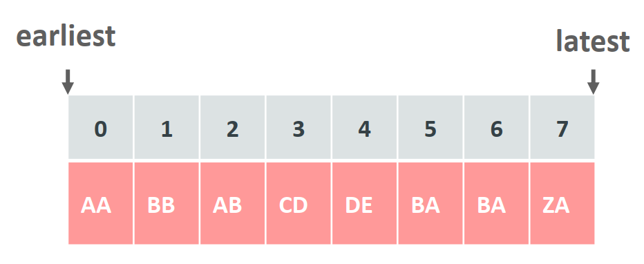

* consumer_offsets에 Consumer Group이 해당 Topic Partition 별로 offset 정보를 가지고 있지 않을 시 Consumer가 접속 시 해당 파티션의 처음 offset 부터(earliest) 가져올 것인지, 마지막 ofiset 이후 부터 가져올 것인지를 설정하는 파라미터

  * auto.offset.reset = earliest: & offset 28
  * auto.offset.reset = latest: offset

* 동일 consumer Group으로 Consumer가 새롭게 접속할 시 consumer_ofisets에 있는 Offset 정보를 기반으로 메시지를 가져오기 때문에 earliest로 설정하여도 0번 오프셋 부터 읽어 들이지 않음.

* Consumer Group의 Consumer가 모두 종료 되어도 Consumer Group이 읽어들인 ofset 정보는 7일동안 consumer_ofisets에 저장되어 있음

  (offsets.retention.minutes)

* 해당 Topic이 삭제되고 재 생성될 경우에는 해당 topic에 대한 Consumer Group의 offset 정보는 0으로 _consumer_offsets으로 기록됨


