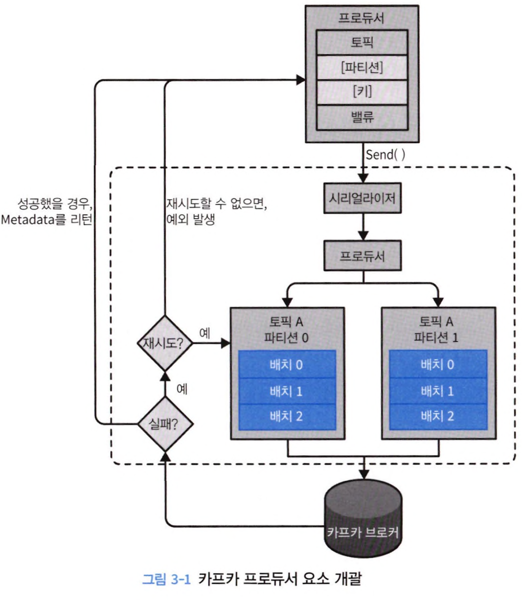

# 카프카 핵심 가이드

* 코드 : https://dongjinleekr.github.io/kafka-the-definitive-guide-v2/example/


# 1 카프카 시작하기

모든 기업은 데이터로 움직임. 로그메시지 metric, 행동, 커스텀 등. 모든 행동은 데이터를 생성하며 이것은 의미가 있고 중요하다.

트래픽이 많을수록 어마어마한 데이터가 생성되고 이것을 어떻게 보낼지 고민을 하게 된다. 

## 1.1 발행 구독 메시지 전달

발행 구독 메시지 전달 패턴의 특징은 퍼블리셔가 직접 섭스크라이버한테 보내는게 아니고 중간에 브로커를 통해 이동되게 된다.

### 초기의 발행 구독 시스템.

발행 구독 패턴을 따르는 시스템은 초기 가운데 간단한 메시지 큐나 프로세스간 통신을 통해 메시지를 전달한다.

그러나 이 패턴은 문제가 있다. 

지표를 생성하는 애플리케이션이 늘어날수록 또 똑같은 직접 연결을 만들어야 하는 문제가 생긴다


결과적으로 위와 같은 그림이 된다. 어떤 문제가 있을까

* 높은 결합도 : 새 발행자나 구독자가 추가될때마다 확장성과 유지보수성에 문제가 생김
* 복잡한 네트워크 : 관리와 디버기이 어려움
* 중복 데이터 문제. 

이 시스템을, 모든 애플리케이션으로부터 지표를 받는 **중앙 집중화된** 하나의 애플리케이션을 만들고 지표값들을 필요로 하는 어떤 시스템이든 지표를 질의할 수 있는 서버를 제공하면 해결할 수 있다. -> 중앙 브로커


## 1.2 카프카 입문

카프카는 위와 같은 문제를 해결하기 위해 고안된 메시지 발행 구독 시스템이다.

분산 커밋 로그 혹은 분산 스트리밍 플랫폼이라고 한다. 

모든 기록을 커밋을 남겨 영속성있게 보존해서 일관성을 유지하면서 복구할 수 있고, 저장된 메시지는 순서를 유지한채로 읽을 수 있다.

### 메시지와 배치

데이터의 기본 단위는 메시지며 레코드라고도 부른다.

다양한 메타데이터를 포함할 수 있다. 

메시지를 바이너리로 저장하므로 직렬화해서 전송해야 한다.

* 지원하는 직렬화 타입

  - **Avro**: 스키마를 포함하며, 데이터 크기를 최적화.

  - **Protobuf**: Google에서 개발한 경량화된 직렬화 형식.

  - **JSON**: 간단하고 사람이 읽기 쉬운 형식.

  - **Thrift**: Facebook에서 개발한 직렬화 형식.

  - **ByteArray**: 순수 바이너리 데이터.

메타데이터는 타임스탬프를 가진다.

* 메시지가 **생성된 시간**을 나타냄

* Kafka는 두 가지 타임스탬프를 제공 

  1. **Create Time**: 메시지가 생산자(Producer)에서 생성된 시간.

  2. **Log Append Time**: 메시지가 브로커에 추가된 시간.

오프셋이라고 하는 마지막으로 읽은 값도 메시지에 포함된다

* 메시지 소비시 받을 수 있음.

메시지는 키라고 불리는 메타데이터를 포함하며 이 키는 메시지를 파티션으로 라우팅하기 위해 사용된다.

* 키가 없는경우 라운드 로빈 방식으로 균등하게 파티션에 분배
* 키가 있는경우 해싱을 통해 특정 파티션으로 매핑한다 - 기본 알고리즘 : hash(key) % partitionCount
  * 커스텀 가능하다.
  * 같은 키는 동일한 파티션에 저장되게 된다 
* 키가 없는경우 다른 파티션으로 분산될 수 있어 순서 보장이 안될수도 있다. (컨슈머는 현재 지정된 같은 파티션에서만 데이터를 쭉쭉 컨슘함)
* 키가 있을떄와 없을때의 차이 

| **특성**                     | **키가 있을 때**                                             | **키가 없을 때**                                             |
| ---------------------------- | ------------------------------------------------------------ | ------------------------------------------------------------ |
| **파티션 할당**              | 키를 해싱하여 특정 파티션에 저장 (일관성 있는 파티셔닝).     | 메시지가 라운드 로빈 방식으로 모든 파티션에 고르게 분산.     |
| **데이터 순서 보장**         | 같은 키에 대해 메시지 순서가 보장됨.                         | 순서 보장이 불가능함 (같은 데이터가 여러 파티션에 분산될 수 있음). |
| **데이터 처리**              | 키를 기준으로 데이터를 처리할 수 있어 특정 데이터를 효율적으로 그룹화 가능. | 특정 키에 기반한 데이터 그룹화를 수행할 수 없음.             |
| **확장성**                   | 파티션 수를 늘리면 키-파티션 매핑이 변경될 수 있음 (재해싱 발생). | 파티션 수가 늘어나도 메시지가 라운드 로빈 방식으로 분산되므로 매핑이 변경되지 않음. |
| **애플리케이션 로직 단순화** | 키를 활용하여 특정 파티션에 데이터를 집중적으로 처리 가능.   | 라운드 로빈 방식으로 분배되므로 파티션에 집중된 처리는 어려움. |
| **사용 사례**                | 사용자를 기준으로 데이터를 분리, 특정 그룹의 데이터를 처리할 때 유리함. | 단순히 데이터를 균등하게 분배하고 싶을 때 유리함.            |

활용사례

1. **사용자 기반 데이터 처리**:
   - 사용자를 식별하는 고유 ID (예: `userId`)를 키로 설정.
   - 동일 사용자의 데이터가 항상 동일한 파티션에 저장되므로 데이터 순서가 보장됨.
2. **지리적 데이터 처리**:
   - 지역 정보 (예: `countryCode`, `regionId`)를 키로 설정.
   - 특정 지역별 데이터를 동일 파티션에서 처리.
3. **로그 분석**:
   - 서비스 ID 또는 로그 레벨 (예: `ERROR`, `INFO`)을 키로 설정.
   - 특정 서비스 또는 로그 레벨별로 데이터를 처리.
4. **이벤트 스트림**:
   - 트랜잭션 ID 또는 주문 ID를 키로 설정.
   - 하나의 트랜잭션 데이터가 순서대로 처리될 수 있도록 보장.


카프카는 효율성을 위해 메시지를 배치 단위로 쓰고 읽을 수 있다. 

이것은 지연시간과 처리량 사이에 트레이드 오프이다. 배치 크기가 커질수록 시간당 처리량은 늘어나지만 전송시 지연이 생긴다 

### 스키마

메시지는 단순한 바이트 배열이지만 이해하기 쉽도록 일정한 구조 혹은 스키마를 부여하는것이 권장된다

지원하는 직렬화 타입

- **Avro**: 스키마를 포함하며, 데이터 크기를 최적화.

- **Protobuf**: Google에서 개발한 경량화된 직렬화 형식.

- **JSON**: 간단하고 사람이 읽기 쉬운 형식.

- **Thrift**: Facebook에서 개발한 직렬화 형식.

- **ByteArray**: 순수 바이너리 데이터.

이중에서 에이브로가 많이 선호된다고 한다. 

### 토픽과 파티션

저장되는 메시지는 토픽 단위로 분류되며 직역하면 주제이다. 같은 주제로 보낸 메시지는 같은 주제에서 꺼낼 수 있다.

토픽은 여러 개의 파티션으로 나뉜다. 파티션은 하나의 로그 배열이라고 볼 수 있고, 파티션에 메시지가 추가될때는 append-only로 끝에만 쓰여진다. 

토픽 안의 파티션들에 대해 메시지 순서는 보장되지 않지만, 단일 파티션안에서는 순서가 보장된다 

토픽과 파티션은 데이터 처리량 및 확장성을 제공하며 큰 성능을 이끌어낼 수 있다. 

또한 다른 서버들이 동일한 파티션의 복제본을 저장할 수 있어, 서버 중 하나에 장애가 발생하더라도 복구할 수 있는 고가용성을 지닌다.

### 프로듀서와 컨슈머

프로듀서는 메시지를 생성하며 퍼블리셔 라고도 볼수 있다. 메시지는 토픽에 쓰여지며 메시지 키가 없으면 파티션들에 대해 균등하게, 키가 있다면 키에 대응되는 파티션에 저장된다. 

컨슈머는 메시지를 읽으며 1개 이상의 토픽을 구독해서 저장된 메시지들을 파티션에 쓰여진 순서대로 읽어온다.

메시지의 오프셋을 커밋함으로써 어느 메시지까지 읽었는지를 유지한다. 

주어진 파티션의 각 메시지를 고유한 오프셋을 가지며, 뒤에오는 메시지가 더 큰 오프셋 값을 가진다. 


컨슈머는 컨슈머 그룹의 일원으로써 작동하며 서로다른 컨슈머 그룹은 파티션에 대해 서로 다른 오프셋 값을 가진다.

컨슈머는 수평 확장 가능하며 파티션을 각 재할당 받은뒤 이어서 데이터를 읽어올 수 있기도 하다

### 브로커와 클러스터

하나의 카프카 서버를 브로커라고 부른다. 브로커는 프로듀서로부터 메시지를 받아 오프셋을 할당한 뒤 디스크 저장소에 쓴다. 시스템 하드웨어의 성능에 따라 다르겠지만, 하나의 브로커는 초당 수천 개의 파티션과 수백만개의 메시지를 쉽게 처리할 수 있다.

한 클러스터 안에 여러 브로커가 있으며, 그중 하나의 브로커가 컨트롤러의 역할을 한다(컨트롤러는 자동으로 선정됌)

 컨트롤러의 역할

* 파티션을 브로커에 할당
* 장애가 발생한 브로커를 모니터링

파티션은 여러개가 있을 수 있는데, 그 중 대표적으로 읽고 쓰고하는 파티션을 갖고있는 브로커가 파티션 리더이며 나머지 브로커는 팔로워라고 부른다.

* 컨슈머는 리더나 팔로워에서 데이터를 읽어올 수 있도록 선택 가능 

이것을 복제 기능이라고 하며 메시지를 중복 저장함으로써 리더에 장애 발생시 팔로워중하나가 리더 역할을 이어받을 수 있다.


카프카는 데이터 보존기능이 있는데, 특정 기간(7일)동안 메시지를 보관하거나 파티션 크기가 특정 사이즈(1GB)에 도달할떄까지 데이터를 보존한다. 한도값에 도달하면 메시지는 삭제된다.

### 다중 클러스터

한개의 클러스터는 여러 브로커로 이루어져있고, 이를 또 여러 클러스터로 운영할 수 있다.

장점

- 데이터 유형별 분리
- 보안 요구사항을 충족시키기 위한 격리
- 재해 복구disaster recovery, DR를 대비한 다중 데이터센터


다수의 데이터센터에서 운용될때 데이터 센터간 메시지를 복제할 수 있게 된다.

데이터를 다른 클러스터로 복제하려면 미러메이커라는 툴을 사용한다. 

* 미러메이커도 근본적으로 큐로 연결된 카프카 컨슈머와 프로듀서다


## 1.3 왜 카프카인가?

다중 프로듀서 지원.

* 프로듀서 클라이언트가 여러 토픽을 사용하는 하나를 사용하든 여러 프로듀서 처리 가능

다중 컨슈머

* 많은 컨슈머가 상호 간섭없이 어떤 메시지 스트림도 읽을 수 있음
* 하나의 메시지를 하나의 클라이언트에서만 소비 가능한 다른 메시지 큐 시스템과의 차이점.
* 다수의 컨슈머는 컨슈머 그룹의 일원으로 하나의 스트림을 여럿이서 나눠 읽을 수 있음. 
  * 이 경우 주어진 메시지는 컨슈머 그룹에 대해 한번만 처리 (그룹이 달라지면 다시 처리 가능)

디스크 기반 보존

* 디스크에 쓰여지기 때문에 반영구적이며(지우지않는한) 항상 데이터를 실시간으로 읽지 않아도 되는 점이 있다.
* 이로 인해 트래픽 폭주로 인해 느린 처리속도를 가져도 데이터 유실 위험은 없다

확장성

* 어떠한 크기의 데이터도 쉽게 처리 가능
* 수십 수백개 브로커로 구성된 시스템에서도 처리 가능 .
* 작동 중에도 시스템의 가용성에 영향을 주지 않으면서 확장 가능

고성능

* 분산 아키텍처로 한 토픽의 데이터를 여러 파티션에 저장하고 여러 컨슈머가 처리함으로써 대용량 처리 가능
* 시퀀셜 디스크와 페이지 캐시를 이용해 순차 I/O를 이용해서 매우 빠른 성능을 냄 
* 배치 처리 및 데이터 압축

## 1.4 데이터 생태계

각기 다른 시스템에서 생산되는 다양한 데이터를 처리 가능하다.

일관된 인터페이스를 제공하면서 다양하게 처리 가능하다.


### 이용 사례

* 활동 추적
* 메시지 교환 - 이메일 슬랙 알림 
* 지표 및 로그 수집 
* 커밋 로그 - 디비 기반 커밋 로그 개념을 이용하므로 디비의 변경점도 카프카로 전송 가능 
* 대용량 메시지들이 생성되자마자 실시간으로 처리가 가능한 스트림 처리

## 카프카의 탄생

링크드인의 문제를 해결하기 위함으로 탄생

초기 주된 목표

* push - pull 모델을 사용해서 프로듀서와 컨슈머 분리
* 다수의 컨슈머가 사용 가능하도록 영속적으로 데이터 저장
* 높은 메시지 처리량 
* 시스템 수평 확장 가능

2020년 기준 매일 7조개, 5페타바이트가 넘는 데이터를 처리했음

카프카의 이름은 쓰기 최적화 시스템에서 쓰기를 빌려온 프란츠 카프카에서 따왔늗네 별 관계가 없다.

# 2. 카프카 설치하기

최신버전 설치시 jdk 17 권장됌 - https://github.com/apache/kafka

## 주키퍼 설치하기 - https://github.com/apache/zookeeper

* 클러스터의 메타데이터와 컨슈머 클라이언트에 대한 정보를 저장하기 위해 주키퍼 사용 
* 설정 정보 관리, 이름 부여, 분산 동기화, 그룹 서비스를 제공하는 중앙화된 서비스 
* 카프카 배포판에 포함된 스크립트를 사용해서 주키퍼 설치도 가능 
* 주키퍼는 고가용성을 위해 ensemble이라 불리는 클러스터 단위로 작동한다.
* 앙상블은 쿼럼이라는 투표 시스템을 위해 홀수 개의 서버를 가지는것이 권장 
  * 9대 이상의 노드는 사용하지 않는것을 권장. 합의(consensues)프로토콜 때문에 성능이 느려질 수 있음
  * 클라이언트 연결이 너무 많으면 옵저버 노드(읽기 전용)를 추가

## 카프카 설치하기

간단하게 하기 위해 도커 컴포즈 파일을 사용

1. 싱글

```yaml
version: '3.8'

services:
  kafka:
    image: confluentinc/cp-kafka:latest
    container_name: kafka
    ports:
      - "9092:9092"
    environment:
      KAFKA_BROKER_ID: 1
      KAFKA_PROCESS_ROLES: broker,controller
      KAFKA_NODE_ID: 1
      # 외부 클라이언트 접근 허용을 위한 설정
      KAFKA_LISTENERS: PLAINTEXT://0.0.0.0:9092,CONTROLLER://kafka:9093
      KAFKA_ADVERTISED_LISTENERS: PLAINTEXT://localhost:9092
      KAFKA_LISTENER_SECURITY_PROTOCOL_MAP: PLAINTEXT:PLAINTEXT,CONTROLLER:PLAINTEXT
      KAFKA_INTER_BROKER_LISTENER_NAME: PLAINTEXT
      KAFKA_CONTROLLER_QUORUM_VOTERS: 1@kafka:9093
      KAFKA_CONTROLLER_LISTENER_NAMES: CONTROLLER
      KAFKA_LOG_DIRS: /var/lib/kafka/data
      KAFKA_OFFSETS_TOPIC_REPLICATION_FACTOR: 1
      KAFKA_TRANSACTION_STATE_LOG_MIN_ISR: 1
      KAFKA_TRANSACTION_STATE_LOG_REPLICATION_FACTOR: 1
      KAFKA_MIN_INSYNC_REPLICAS: 1
      CLUSTER_ID: WH5p_YTESu-Y3Hu7O9R_FQ
    volumes:
      - ./kafka-data:/var/lib/kafka/data
    networks:
      - kafka-network

  kafka-ui:
    image: provectuslabs/kafka-ui:latest
    container_name: kafka-ui
    ports:
      - "8080:8080"
    environment:
      - KAFKA_CLUSTERS_0_NAME=local
      - KAFKA_CLUSTERS_0_BOOTSTRAPSERVERS=localhost:9092
    depends_on:
      - kafka
    networks:
      - kafka-network

networks:
  kafka-network:
    driver: bridge
```

2. 클러스터 (kfraft)

```yaml
version: '3.8'

services:
  kafka1:
    image: confluentinc/cp-kafka:latest
    container_name: kafka1
    hostname: kafka1
    ports:
      - "9092:9092"   # EXTERNAL_PLAINTEXT 리스너
      - "29091:29091" # INTERNAL_PLAINTEXT 리스너
      # 컨트롤러 리스너는 내부 통신용으로만 사용
    environment:
      # KRaft 모드 활성화
      KAFKA_KRAFT_MODE: "true"

      # 이 노드가 브로커와 컨트롤러 역할을 모두 수행하도록 설정
      KAFKA_PROCESS_ROLES: "broker,controller"

      # Kafka 노드의 고유 ID 설정
      KAFKA_NODE_ID: 1

      # 컨트롤러 쿼럼 투표자 설정 (노드 ID@호스트:포트 형식)
      KAFKA_CONTROLLER_QUORUM_VOTERS: "1@kafka1:9093,2@kafka2:9095,3@kafka3:9097"

      # Kafka가 청취할 리스너 설정
      KAFKA_LISTENERS: INTERNAL_PLAINTEXT://0.0.0.0:29091,EXTERNAL_PLAINTEXT://0.0.0.0:9092,CONTROLLER://0.0.0.0:9093

      # 리스너별 보안 프로토콜 매핑 설정
      KAFKA_LISTENER_SECURITY_PROTOCOL_MAP: INTERNAL_PLAINTEXT:PLAINTEXT,EXTERNAL_PLAINTEXT:PLAINTEXT,CONTROLLER:PLAINTEXT

      # 클라이언트와 다른 브로커에 광고할 리스너 설정
      KAFKA_ADVERTISED_LISTENERS: INTERNAL_PLAINTEXT://kafka1:29091,EXTERNAL_PLAINTEXT://localhost:9092

      # 브로커 간 통신에 사용할 리스너 이름 설정
      KAFKA_INTER_BROKER_LISTENER_NAME: INTERNAL_PLAINTEXT

      # 컨트롤러와의 통신에 사용할 리스너 이름 설정
      KAFKA_CONTROLLER_LISTENER_NAMES: CONTROLLER

      # Kafka 로그 데이터 저장 디렉토리 설정
      KAFKA_LOG_DIRS: /var/lib/kafka/data

      # 자동으로 토픽 생성 허용 여부 설정
      KAFKA_AUTO_CREATE_TOPICS_ENABLE: "true"

      # 오프셋 토픽의 복제 인수 설정
      KAFKA_OFFSETS_TOPIC_REPLICATION_FACTOR: 3

      # 로그 보존 시간 설정 (시간 단위)
      KAFKA_LOG_RETENTION_HOURS: 168

      # 그룹 초기 리밸런싱 지연 시간 설정 (밀리초 단위)
      KAFKA_GROUP_INITIAL_REBALANCE_DELAY_MS: 0

      # 클러스터 ID 설정
      CLUSTER_ID: "Mk3OEYBSD34fcwNTJENDM2Qk"
    volumes:
      - ./kafka-data/kafka1:/var/lib/kafka/data
    networks:
      - kafka-net

  kafka2:
    image: confluentinc/cp-kafka:latest
    container_name: kafka2
    hostname: kafka2
    ports:
      - "9094:9094"   # EXTERNAL_PLAINTEXT 리스너
      - "29092:29092" # INTERNAL_PLAINTEXT 리스너
      # 컨트롤러 리스너는 내부 통신용으로만 사용
    environment:
      # KRaft 모드 활성화
      KAFKA_KRAFT_MODE: "true"

      # 이 노드가 브로커와 컨트롤러 역할을 모두 수행하도록 설정
      KAFKA_PROCESS_ROLES: "broker,controller"

      # Kafka 노드의 고유 ID 설정
      KAFKA_NODE_ID: 2

      # 컨트롤러 쿼럼 투표자 설정 (노드 ID@호스트:포트 형식)
      KAFKA_CONTROLLER_QUORUM_VOTERS: "1@kafka1:9093,2@kafka2:9095,3@kafka3:9097"

      # Kafka가 청취할 리스너 설정
      KAFKA_LISTENERS: INTERNAL_PLAINTEXT://0.0.0.0:29092,EXTERNAL_PLAINTEXT://0.0.0.0:9094,CONTROLLER://0.0.0.0:9095

      # 리스너별 보안 프로토콜 매핑 설정
      KAFKA_LISTENER_SECURITY_PROTOCOL_MAP: INTERNAL_PLAINTEXT:PLAINTEXT,EXTERNAL_PLAINTEXT:PLAINTEXT,CONTROLLER:PLAINTEXT

      # 클라이언트와 다른 브로커에 광고할 리스너 설정
      KAFKA_ADVERTISED_LISTENERS: INTERNAL_PLAINTEXT://kafka2:29092,EXTERNAL_PLAINTEXT://localhost:9094

      # 브로커 간 통신에 사용할 리스너 이름 설정
      KAFKA_INTER_BROKER_LISTENER_NAME: INTERNAL_PLAINTEXT

      # 컨트롤러와의 통신에 사용할 리스너 이름 설정
      KAFKA_CONTROLLER_LISTENER_NAMES: CONTROLLER

      # Kafka 로그 데이터 저장 디렉토리 설정
      KAFKA_LOG_DIRS: /var/lib/kafka/data

      # 자동으로 토픽 생성 허용 여부 설정
      KAFKA_AUTO_CREATE_TOPICS_ENABLE: "true"

      # 오프셋 토픽의 복제 인수 설정
      KAFKA_OFFSETS_TOPIC_REPLICATION_FACTOR: 3

      # 로그 보존 시간 설정 (시간 단위)
      KAFKA_LOG_RETENTION_HOURS: 168

      # 그룹 초기 리밸런싱 지연 시간 설정 (밀리초 단위)
      KAFKA_GROUP_INITIAL_REBALANCE_DELAY_MS: 0

      # 클러스터 ID 설정
      CLUSTER_ID: "Mk3OEYBSD34fcwNTJENDM2Qk"
    volumes:
      - ./kafka-data/kafka2:/var/lib/kafka/data
    networks:
      - kafka-net

  kafka3:
    image: confluentinc/cp-kafka:latest
    container_name: kafka3
    hostname: kafka3
    ports:
      - "9096:9096"   # EXTERNAL_PLAINTEXT 리스너
      - "29093:29093" # INTERNAL_PLAINTEXT 리스너
      # 컨트롤러 리스너는 내부 통신용으로만 사용
    environment:
      # KRaft 모드 활성화
      KAFKA_KRAFT_MODE: "true"

      # 이 노드가 브로커와 컨트롤러 역할을 모두 수행하도록 설정
      KAFKA_PROCESS_ROLES: "broker,controller"

      # Kafka 노드의 고유 ID 설정
      KAFKA_NODE_ID: 3

      # 컨트롤러 쿼럼 투표자 설정 (노드 ID@호스트:포트 형식)
      KAFKA_CONTROLLER_QUORUM_VOTERS: "1@kafka1:9093,2@kafka2:9095,3@kafka3:9097"

      # Kafka가 청취할 리스너 설정
      KAFKA_LISTENERS: INTERNAL_PLAINTEXT://0.0.0.0:29093,EXTERNAL_PLAINTEXT://0.0.0.0:9096,CONTROLLER://0.0.0.0:9097

      # 리스너별 보안 프로토콜 매핑 설정
      KAFKA_LISTENER_SECURITY_PROTOCOL_MAP: INTERNAL_PLAINTEXT:PLAINTEXT,EXTERNAL_PLAINTEXT:PLAINTEXT,CONTROLLER:PLAINTEXT

      # 클라이언트와 다른 브로커에 광고할 리스너 설정
      KAFKA_ADVERTISED_LISTENERS: INTERNAL_PLAINTEXT://kafka3:29093,EXTERNAL_PLAINTEXT://localhost:9096

      # 브로커 간 통신에 사용할 리스너 이름 설정
      KAFKA_INTER_BROKER_LISTENER_NAME: INTERNAL_PLAINTEXT

      # 컨트롤러와의 통신에 사용할 리스너 이름 설정
      KAFKA_CONTROLLER_LISTENER_NAMES: CONTROLLER

      # Kafka 로그 데이터 저장 디렉토리 설정
      KAFKA_LOG_DIRS: /var/lib/kafka/data

      # 자동으로 토픽 생성 허용 여부 설정
      KAFKA_AUTO_CREATE_TOPICS_ENABLE: "true"

      # 오프셋 토픽의 복제 인수 설정
      KAFKA_OFFSETS_TOPIC_REPLICATION_FACTOR: 3

      # 로그 보존 시간 설정 (시간 단위)
      KAFKA_LOG_RETENTION_HOURS: 168

      # 그룹 초기 리밸런싱 지연 시간 설정 (밀리초 단위)
      KAFKA_GROUP_INITIAL_REBALANCE_DELAY_MS: 0

      # 클러스터 ID 설정
      CLUSTER_ID: "Mk3OEYBSD34fcwNTJENDM2Qk"
    volumes:
      - ./kafka-data/kafka3:/var/lib/kafka/data
    networks:
      - kafka-net

  kafka-ui:
    image: provectuslabs/kafka-ui:latest
    container_name: kafka-ui
    ports:
      - "8085:8080"
    environment:
      # Kafka 클러스터 이름 설정
      KAFKA_CLUSTERS_0_NAME: local

      # Kafka 클러스터의 부트스트랩 서버 설정
      KAFKA_CLUSTERS_0_BOOTSTRAP_SERVERS: "kafka1:29091,kafka2:29092,kafka3:29093"
    depends_on:
      - kafka1
      - kafka2
      - kafka3
    networks:
      - kafka-net

networks:
  kafka-net:
    driver: bridge
```

## 2.3 브로커 설정하기

### 핵심 브로커 매개변수

* broker.id : 모든 브로커는 정수 식별자를 갖는다. 정숫값은 클러스터 안의 브로커별로 다 달라야 한다 

* listeners : 구버전은 단순히 port를 썻지만 리스너 설정은 쉼표로 구분된 리스너 이름과 uri 목록이다

  * 리스너 이름이 ssl이 아니라면 listener.security.protocal.map
  * {프로토콜}://{호스트이름}:{포트}의 형태로 정의
  * PLAINTEXT://localhost:9092,SSL://:9091
  * 0.0.0.0으로 잡을 경우 모든 네트워크인터페이스로부터 연결을 받음 

* zookeeper.connect : 주키퍼의 위치를 가리킴

  * 호스트이름:포트/경로 
  * 카프카 클러스터에서는 chroot를 사용하는것이 좋다. 다른 애플리케이션과 충돌할일없이 앙상블 공유해서 사용 가능 

* log.dirs : 로그를 세그먼트 단위로 묶어서 log.dir 설정에 지정된 디렉토리에 저장.

  * 다수의 디렉토리 지정하고자 할 경우 log.dirs

* num.recovery.threads.per.data.dir

  * 카프카는 스레드풀을 사용해서 로그 세그먼트를 관리
  * 브로커 정상적으로 시작시 각 파티션 로그 세그먼트 파일을 염
  * 장애 발생 후 다시 시작되엇을 때 파티션의 로그 세그먼트 검사 후 잘못된 부분 삭제
  * 브로커 종료시 로그 세그먼트 닫음

  * 하나의 로그 디렉토리에 대해 하나의 스레드만 사용, 작업을 병렬화 하기 위해서는 많은 수의 스레드 할당이 좋다
  * 브로커에 많은 파티션 저장시 재시작 시간에 차이남.
  * num.recovery.threads.per.data.dir이 8 이고 log.dirs에 지정된 경로가 3개인경우 전체 스레드 수는 24개

* auto.create.topics.enable : 토픽 자동 생성 옵션

  * 기본적으로 true. 이때 없는 토픽에 쓰면 자동 토픽 생성
  * 토픽생성을 명시적으로 관리할경우 false로 둘수있음 

* auto.leader.rebalance.enable : 리더 역할을 균등하게 분산되도록 함 

* delete.topic.enable : 토픽 삭제 기능 여부. false이면 토픽 삭제 불가

### 토픽별 기본값

* num.partitions : 토픽 생성시 몇개의 파티션을 갖게되는지 설정. 기본값은 1. 토픽 파티션 수는 늘릴수만있지 줄일 수 없다.
  * 토픽당 파티션 수를 클러스터 내 브로커 수와 맞추거나 배수로 설정하면 고르게 분배되어 메시지 부하도 고르게 분배된다.

> 파티션 수 결정 요소
>
> * 토픽에 대해 달성하고자 하는 처리량은 어느정도인가. 초당 쓰기속도가 얼마정도?
> * 단일 파티션에 대해 최대 읽기 처리량은 어느정도?
>
> 키 값을 기준으로 분배할 경우 나중에 파티션을 추가하고자 하면 골치아플 수 있다. 미래의 사용량을 예측하자
>
> * 기본적으로 hash(key) % 파티션 수인데, 전체 파티션 수가 달라지므로 다른 파티션에 생성될수도 있음.
>
> * 브로커별로 사용가능한 디스크공간, 네트워크 대역폭 고려.
> * 과대 추산은 피하고, 미러링 할 예정이라면 미러링 처리량도 고려해야함 
> * 클라우드 서비스라면 가상머신이나 디스크에 초당 입출력 제한이 얼마인지 고려
>
> 예를들어 토픽에 초당 1GB를 쓰는데 컨슈머당 50MB 처리량이라면 파티션은 20개가 필요하다고 예측 가능 

* default.replication.factor : 토픽의 복제 팩터를 결정한다. -> **레플리카(복제본)** 개수를 설정
  * 일반적인 클러스터에서는 3 -> (리더 포함해서 3개 )
  * min.insync.replicas 설정값보다 1이상 크게 잡아줄것을 권장한다.
  * 2 큰값으로 설정하는것이 좋다는데, 레플리카 셋 안에 일부러 정지시킨 레플리카와 예상치않게 정ㄷ지된 레플리카가 2개 발생해도 장애가 발생하지 않기 때문. 
  * 이렇게 되면 적어도 1개의 레플리카는 정상 작동중이란걸 보장할 수 있다. 

* log.retention.ms : 시간 기준 메시지 보존 주기 설정. 
  * 디폴트로는 log.retention.hours에 있는 168시간(1주일)
  * log.retetion.minutes도 사용 가능 
  * 여러 설정이 있을떄, 가장 작은 단위인 ms 설정이 우선권을 가지므로 이 값을 설정하는것을 권장 
  * 시간 기준 보존은 디스크에 저장된 각 로그 세그먼트 파일의 마지막 수정 시각(mtime)을 기준으로 작동한다.
* log.retention.bytes : 보존되는 메시지의 용량 기준 만료
  * 파티션이 8개에 이 값이 1GB라면 토픽의 최대 저장 용량은 8GB 
  * 파티션 기준이지 토픽 단위가 아님 .
  * -1로 두면 데이터는 영구히 보존

> 크기와 시간 기준으로 보존 설정하기
>
> 만약 log.retention.bytes와 log.retetion.ms를 둘다 잡아두면 둘중하나만 충족해도 메시지가 삭제될 수 있다.
>
> 그러므로 둘중 하나만 선택하는것이 좋다 

* log.segment.bytes : **로그 세그먼트 파일의 최대 크기**를 설정하는 옵션. 하나의 세그먼트 파일이 가질 수 있는 최대 크기 정의
  * 메시지는 해당 파티션의 현재 로그 세그먼트 끝에 추가되는 구조다.
  * 디폴트로 1GB인데, 지정된 크기에 다다르면 기존 로그 세그먼트를 닫고 새로운 세그먼트를 연다. 닫히기 전까지는 만료와 삭제의 대상이 되지 않는다.
  * 작은 로그 세그먼트 크기는 곧 파일을 더 자주 닫고 새로 할당하므로 디스크 쓰기의 효율성이 감소된다.
  * 메시지가 적게 들어오면 이 크기를 조정해줘야 쓸데없는 메시지가 지워질 수 있다.
* log.roll.ms : 로그 세그먼트 파일이 닫혀야 할 떄까지 기다리는 시간을 지정 
  * 디폴트로 설정되어있지않음. 기본적으로 크기로만 세그먼트가 닫힘 
* min.insync.replicas : 메시지가 성공적으로 쓰여졌다고 간주하기 위해 **동기화된 복제본(In-Sync Replica, ISR)** 중 최소 몇 개의 복제본이 데이터를 수신해야 하는지 설정하는 옵션
  * 2로 잡으면 최소한 2개의 레플리카가 최신 상태로 동기화 되도록 함
  * 프로듀서의 ack 설정을 all로 잡아주는것과 함께 사용된다
  * 2로 하면 프로듀서의 쓰기 작업이 성공하기 위해 최소한 2개의 레플리카가 응답하도록 할 수 있으며 데이터 유실을 방지할 수 있다.
* message.max.bytes : 쓸 수 있는 메시지의 최대 크기를 제한. 기본값은 1MB
  * 이 값보다 큰 메시지를 보내면 브로커는 에러를 반환 
  * 이 설정 역시 압축된 메시지 크기를 기준으로 한다. 


## 2.4 하드웨어 선택하기

카프카 자체는 특정 하드웨어 구성을 요구하지 않으며 대부분 시스템에서 문제없이 실행된다.

하지만 성능을 고려한다면 디스크 처리량, 메모리 ,네트워크, CPU를 감안해야 한다

### 디스크 처리량

브로커 디스크 처리량은 프로듀서의 성능에 영향을 끼친다. 메시지 쓸시, 메시지는 브로커의 로컬에 커밋되어야 하며 대부분 프로듀서 클라이언트는 메시지 전송이 성공했다고 결론 내리기 전 최소한 1개 이상의 브로커가 메시지 커밋 응답 보내기 전까지 대기하게 된다.

즉 디스크 쓰기 속도가 빨라지는것은 곧 쓰기 지연이 줄어든다.

경험적으로 많은 수의 클라이언트 요청을 받아내야하는경우 SSD, 자주 쓸 일이 없는 데이터를 많이 저장해야 하면 HDD가 낫다

### 디스크 용량

하루 1TB, 1주일 보존이면 최소한 7TB 필요하며 최소 10% 오버헤드를 고려하는것이 좋다.

### 메모리

컨슈머는 프로듀서가 추가한 메시지를 뒤에서 쫒아가는 식으로 파티션 끝에서 메시지를 읽어오는것이 보통이다.

최적의 작동은 시스템의 페이지 캐시에 저장되어있는 메시지를 읽어오는것이며, 시스템의 페이지 캐시에 메모리를 할당해 줘야 한다.

카프카는 JVM에 많은 힙 메모리를 필요로 하지 않으며, 초당 15만개의 메시지에 200MB 속도처리하는 브로커라도 5GB 힙과 함께 돌아간다. 나머지 메모리는 페이지 캐시로 사용된다

### 네트워크

네트워크도 중요하다. 카프카는 다수의 컨슈머를 동시에 지원해서 네트워크 불균형이 나올수밖에엇ㅂ다.

예를들어 프로듀서는 주어진 토픽에 초당 1MB를 쓰는데, 해당 토픽에 컨슈머가 다수 붙으면 나가는 네트워크량이 달라질수밖에없다. 네트워크 문제를 방지하기 위해 최소 10GB NIC를 권장하며 1GB는 쉽게 포화상태에 빠진다

### CPU

디스크나 메모리만큼은 중요하진 않지만, 메시지 압축때문에 쓰인다. 각 메시지 체크섬을 확인하고 오프셋을 부여하기 위해 모든 메시지 배치의 압축을 해제하기 때문에 여기서 리소스를 좀 쓴다. 

## 2.6 카프카 클러스터 설정하기

클러스터로 구성해서 사용하면 부하를 다수의 서버로 확장하고 복제를 이용해 장애로 인한 데이터 유실을 방지할 수 있다.


### 브로커 개수

적절한 크기를 결정할때 고려해야 할 수

* 디스크 용량
* 브로커당 레플리카 용량
* CPU 용량, 네트워크 용량

만약 클러스터가 10TB를 저장해야 하는데 하나의 클러스터가 저장가능한 용량이 2TB면 클러스터는 5대가 필요.

10개의 브로커를 가진 클러스터에서 레플리카의 수는 백만개(복제 팩터가 2인 파티션이 50만개)가 넘는다면, 각 브로커가 대략 10만개 레플리카를 보유해서 엄청난 병목을 발생하게 됌.

현재는 파티션 레플리카 수를 브로커당 14,000개, 클러스터당 100만개 이하로 유지할것을 권장

네트워크 용량에 대해 이야기하자면, 다음과 같은 사항을 염두에 둘 필요가 있다.

- 네트워크 인터페이스의 전체 용량이 얼마인지?
- 데이터를 읽어가는 컨슈머가 여럿이거나, 데이터가 보존되는 동안 트래픽이 일정하지 않을 경우(예 를 들어서, 피크 시간대에 트래픽이 집중적으로 쏟아지는 경우)에도 클라이언트 트래픽을 받아낼 수 있 는지?

### 운영체제 튜닝하기

리눅스 배포판 커널 튜닝을 통해 카프카 브로커 성능을 올릴 수 있다.

#### 가상 메모리 더티 페이지

1. 가상 메모리 : 처리량이 중요한 애플리케이션에서는 스와핑을 막는것이 좋다. 메모리 페이지가 디스크로 스와핑 되는 과정에서 막대한 비용을 지출하기 때문. 카프카는 시스템 페이지 캐시를 매우 많이 사용하기 때문에, 가상 메모리 시스템이 디스크로 페이지를 스와핑할 경우 페이지 캐시에 할당할 메모리가 충분하지 않음 
   * 스왑 메모리보다 페이지 캐시쪽에 많은 메모리를 할당하는것이 좋다 
   * 리눅스 커널에서 **더티 페이지 관리**를 조정하면 Kafka의 디스크 I/O 성능과 안정성을 개선할 수 있다.

> - **더티 페이지(Dirty Page)**:
>   프로세스가 데이터를 디스크에 쓰기 전에 메모리에 임시로 저장된 데이터.
> - **`vm.dirty_background_ratio`**:
>   커널이 **백그라운드에서 더티 페이지를 디스크로 내보내기 시작하는 임계값**을 설정(시스템 메모리의 %).
>   → 기본값: 10
>   → 권장값: **5**
>   → 이 값을 너무 작게 설정하면 디스크 쓰기가 자주 발생해 성능 저하 가능.
>   → **0으로 설정 금지**: 디스크 작업의 성능 스파이크(급격한 성능 저하)가 발생.
> - **`vm.dirty_ratio`**:
>   커널이 **프로세스의 쓰기 작업을 중단시키고 강제로 디스크로 데이터를 쓰기 시작하는 임계값**을 설정(시스템 메모리의 %).
>   → 기본값: 20
>   → 권장값: **60~80**
>   → 값이 크면 메모리에 더 많은 데이터를 유지하므로 쓰기 성능 향상, 하지만 **밀린 디스크 작업**과 **긴 I/O 멈춤** 가능성 증가.
>
> #### **`vm.dirty_background_ratio` 설정**
>
> - 더티 페이지를 디스크로 내보내기 시작하는 백그라운드 작업의 임계값.
> - **권장값: 5** (기본값 10에서 감소).
>   → 메모리에서 디스크로 더 빠르게 데이터를 내보내 안정성 향상.
>   → 너무 작게 설정하면 디스크 쓰기 작업 증가 가능.
>
> #### **2) `vm.dirty_ratio` 설정**
>
> - 프로세스의 쓰기 작업이 중단되고 강제로 디스크로 데이터를 쓰는 임계값.
> - **권장값: 60~80** (기본값 20에서 증가).
>   → 메모리 사용을 늘려 디스크 쓰기를 줄이고 Kafka의 쓰기 성능 향상.
>   → 위험: 밀린 작업 증가 및 긴 I/O 멈춤 발생 가능.

카프카는 로그 세그먼트를 저장하고 연결을 열기 위해 파일 디스크립터를 사용한다. 만약 브로커에 많은 파티션이 저장되어 있을 경우, 브로커는 최소한 아래와 같은 수의 파일 디스크립터를 필요로 한다.

{파티션 수} x ({파티션 수} / {세그먼트 크기}) + {브로커에 생성된 네트워크 연결 수}

결론적으로, 카프카는 파일 시스템을 사용하기 떄문에 디스크 성능 튜닝이 카프카 성능에 영향을 미친다

#### 디스크

파일시스템의 마운트 옵션을 조정하는 방법

리눅스 파일 시스템에 noatime 옵션을 지정해주는것이 좋다.

* 파일 메타데이터는 3개의 타임 스탬프를 포함. 생성시각(ctime), 마지막 수정시간(mtime), 마지막 사용시간 atime

* atime은 파일이 읽힐때마다 변경되므로 대량의 디스크 쓰기가 발생함.

#### **`noatime` 옵션**

- **기능**: 파일이 읽힐 때마다 갱신되는 **atime(마지막 접근 시간)** 기록을 비활성화.
- 이유
  - 디스크에 **불필요한 쓰기 작업**을 줄여 I/O 성능 개선.
  - Kafka는 `atime` 데이터를 사용하지 않으므로 비활성화해도 안전.
- 대안 옵션 : (relatime)
  - 필요 시 `atime`을 기록하되, 최소한의 업데이트(파일이 수정되거나 이전 `atime` 이후 24시간 이상 경과한 경우에만 갱신).

Largeio 옵션 

- **기능**: 대규모 I/O 작업(큰 블록 쓰기)을 처리할 때 효율성을 향상.
- **이유**: Kafka는 로그 세그먼트와 같은 큰 데이터를 주로 처리하므로, 이 옵션을 통해 디스크 쓰기 성능을 최적화.

Kafka 클러스터의 파일시스템 성능을 최적화하려면 **`noatime`**과 **`Largeio`** 옵션을 설정하는것이 좋다. 

#### 네트워킹 튜닝

각 소켓의 송신, 수신 버퍼에 할당되는 기본/최대 메모리양 튜닝

* 기본 크기 net.core.wmem_default, net.core.rmem_default 를 128KB로 설정 
* 송신, 수신 버퍼의 최대크기 net.core.wmem_max, net.core.rmem_max는 2MB가 적절 

* net.ipv4.tcp_max_sync_backlog 설정값을 1024보다 크게 잡아줄 경우 동시에 받을 수 있는 연결 수를 증가시킬 수 있다. 

## 2.7 프로덕션 환경에서의 고려사항

### G1GC 옵션

* MaxGCPauseMillis : 가비지 수집 사이클에 있어 선호되는 중단 시간. 기본값은 200 ms
  * 호출되는 주기가 200ms
  * 단위 사이클에 걸리는 시간도 200ms
* InitiatingHeapOccupancyPecent : 전체 힙에서 사용 가능한 비율을 백분율로 지정
  * 기본값은 45, 전체 힙의 45%가 사용되기 전까지 가비지 수집 사이클을 시작하지 않는다는 의미

카프카는 힙 메모리를 효율적으로 쓰고 가비지 수집 객체도 적게 생성하기 때문에 설정값들을 낮게 잡아줘도 괜찮다.

다음 예시는 64GB 메모리 서버의 5GB 크기 힙과 함꼐 카프카 실행시킬때 주는 옵션

```
# Kafka JVM 성능 옵션 설정
export KAFKA_JVM_PERFORMANCE_OPTS="
  -server                              # 서버 모드 활성화, 성능 최적화.
  -Xmx6g                               # JVM 최대 힙 메모리 크기를 6GB로 설정.
  -Xms6g                               # JVM 초기 힙 메모리 크기를 6GB로 설정 (Xmx와 동일하게 설정해 GC 부하 감소).
  -XX:MetaspaceSize=96m                # 초기 메타스페이스 크기를 96MB로 설정.
  -XX:+UseG1GC                         # G1 GC(Garbage Collector) 사용, 낮은 GC 지연 시간 목표.
  -XX:MaxGCPauseMillis=20              # 최대 GC 일시정지 시간을 20ms로 설정.
  -XX:InitiatingHeapOccupancyPercent=35 # G1 GC가 전체 힙 사용률 35%에 도달했을 때 GC 트리거.
  -XX:G1HeapRegionSize=16M             # G1 GC 힙 영역의 크기를 16MB로 설정.
  -XX:MinMetaspaceFreeRatio=50         # 메타스페이스의 최소 여유 공간 비율을 50%로 유지.
  -XX:MaxMetaspaceFreeRatio=80         # 메타스페이스의 최대 여유 공간 비율을 80%로 유지.
  -XX:+ExplicitGCInvokesConcurrent     # 명시적인 GC 호출 시 동시 GC 수행.
"

# Kafka 서버 시작 명령
/usr/local/kafka/bin/kafka-server-start.sh -daemon /usr/local/kafka/config/server.properties
```


# 3 카프카 프로듀서

프로듀서와 레코드 객체를 어떻게 생성하는지, 어떻게 전송하는지 에러 처리, 옵션 정의, 파티셔너와 시리얼라이저 등을 정리한다.

* 다양한 서드파티 클라이언트 목록 : https://cwiki.apache.org/confluence/display/KAFKA/clients

## 프로듀서 개요

카프카에 메시지를 보내야 하는 상황은 다양하다.

요구조건도 다음과 같이 다양하다

* 메시지 유실이 용납되지 않는가 허용되는가
* 중복이 허용되도 상관없는가
* 반드시 지켜야할 레이턴시나 스루풋이 존재하는가

카프카 프로듀서는 매우 단순하지만, 내부적으로 더 많은 작업이 이루어진다.



* 먼저 ProducerRecord 객체를 생성하고, 저장될 토픽과 값 지정 그리고 키와 파티션을 지정한다.

* 그리고 키와 값 객체를 직렬화 해서 바이트 배열로 변환한다

* 그다음 파티션을 지정하지 않으면 해당 데이터를 파티셔너에게로 보내고 파티셔너는 파티션을 결정한다. 

* 전송될 토픽과 파티션이 확정되면 레코드를 같은 토픽 파티션으로 전송될 레코드들을 모든 레코드 배치에 추가하고 별도의 스레드가 적절한 카프카 브로커에게 전송한다.

* 브로커는 메시지를 받으면 응답을 돌려주는데, 성공적으로 저장되었을 경우 토픽 파티션 오프셋을 담은 RecordMetadata를 리턴, 실패시 에러를 리턴한다. 


## 3.2 프로듀서 생성하기

```kotlin
fun main() {
    val props = Properties().apply {
        put(ProducerConfig.BOOTSTRAP_SERVERS_CONFIG, "localhost:9092")
        put(ProducerConfig.KEY_SERIALIZER_CLASS_CONFIG, "org.apache.kafka.common.serialization.StringSerializer")
        put(ProducerConfig.VALUE_SERIALIZER_CLASS_CONFIG, "org.apache.kafka.common.serialization.StringSerializer")
        put(ProducerConfig.RETRIES_CONFIG, Integer.MAX_VALUE)
        put(ProducerConfig.ACKS_CONFIG, "all")
    }

    KafkaProducer<String, String>(props).use { producer ->
        repeat(5) {
            val record = ProducerRecord<String, String>("demo", "key$it", "value$it")
            producer.send(record) { metadata, exception ->
                if (exception == null) {
                    println("메시지 전송 성공 ${it} : ${metadata.serializedValueSize()}")
                    println("key : \"key$it\", value : \"value$it\"")
                } else {
                    println("메시지 전송 실패 : ${exception.message}")
                }
            }
        }
    }
}
```

프로듀서는 3개의 필수 속성값을 갖는다

* bootstrap.servers : 프로듀서와 사용할 브로커의 host:port 목록, 모든 브로커를 포함할 필요는 없다. 첫 연결시 추가 정보를 받아올 수 있기 때문. 다만 브로커중 하나가 작동 정지시 프로듀서가 클러스터에 연결할 수 있도록 최소 2개 이상 지정할것을 권장
* key.serializer : 레코드의 키 값을 직렬화 하기 위해 사용하는 시리얼라이저 클래스 이름
  * 키값 벨류값으로 바이트 배열을 받는데, 프로듀서 인터페이스는 임의의 자바 객체를 키 혹은 벨류로 전송할 수 있도록 매개변수화된 타이븡ㄹ 사용할 수 있다. 
  * 카프카 클라이언트 패키지에는 ByteArray,String,Integer등이 포함되어 있으므로 필요없다면 커스텀할필요가없다. 
  * 키 값없이 벨류만 보낼때도 설정은 해줘야하지만 VoidSerializer가 있다
* value.serializer : 벨류값을 직렬화 하기 위해 사용하느 클래스 이름 지정. 

메시지 전송 방법에는 3가지가 있따

* fire and forget : 메시지를 전송만하고 성공 혹은 실패는 상관하지 않음. 메시지는 유실될 수 있다
* synchronous send : 카프카 프로듀서는 언제나 future를 반환하며 비동기적으로 작동하는데, 동기적으로 확인하고 싶다면 .get()을 호출해서 기다린 후 성공 여부 확인해야 한다
* async send : 콜백 함수와 함께 send 메서드를 호출하면 응답 받는 시점 자동으로 콜백 함수가 호출된다 

프로듀서 객체는 스레드 세이프해서 다수의 스레드가 동시에 사용할 수 있다. 

### 동기적으로 메시지 전송하기

동기적으로 메시지 전송할경우 요청 스레드는 블로킹 된다. 결과적으로 성능이 크게 낮아진다

```
KafkaProducer<String, String>(props).use { producer ->
        val record = ProducerRecord<String, String>("demo", "key", "value")
        val metadata = producer.send(record).get()
        println("메시지 전송 성공 : ${metadata.serializedValueSize()}")
        println("key : \"key\", value : \"value\"")
    }
```

프로듀서에는 두종류의 에러가 있다.

재시도 가능한 에러

* 연결 에러 : 연결 회복되면 해결
* 브로커가 리더가 아닐 경우 발생하는 에러 : 해당 파티션에 새 리더가 선출되고 클라이언트 메타데이터 업데이트시 해결

```java
package org.apache.kafka.common.errors;

/**
 * A retriable exception is a transient exception that if retried may succeed.
 */
public abstract class RetriableException extends ApiException {
```

```kotlin
kafkaProducer<String, String>(props).use { producer ->
        val record = ProducerRecord<String, String>("demo", "key", "value")
        try {
            val metadata = producer.send(record).get()
            println("메시지 전송 성공 : ${metadata.serializedValueSize()}")
            println("key : \"key\", value : \"value\"")
        } catch (e: RetriableException) {
            // 재시도 가능한 에러 처리
            println("재시도 가능한 에러 발생: ${e.message}")
            // 로그 작성 및 재시도 로직 추가
        } catch (e: SerializationException) {
            // 메시지 직렬화 에러 처리
            println("직렬화 에러 발생: ${e.message}")
            // 직렬화 에러는 일반적으로 재시도 불가능
        } catch (e: ProducerFencedException) {
            // 프로듀서가 다른 트랜잭션에 의해 fencing된 경우
            println("프로듀서 fencing 에러 발생: ${e.message}")
            // 트랜잭션 사용 중이라면 트랜잭션 종료 필요
        } catch (e: Exception) {
            // 기타 에러 처리
            println("예기치 못한 에러 발생: ${e.message}")
        }
    }
```


재시도 불가능한 에러

* 메시지 크기가 너무 큰경우

### 비동기적으로 메시지 전송

대부분의 경우 응답이 필요 없는 경우들이다. 레코드를 쓴 뒤 토픽, 파티션, 오프셋을 리턴하는데, 대부분에서는 이런 메타데이터가 필요 없다. 

비동기적으로 전송하고 에러 처리를 위해 콜백을 지정할 수 있다.

```kotlin
class DemoCallback : Callback {
    override fun onCompletion(metadata: org.apache.kafka.clients.producer.RecordMetadata?, exception: Exception?) {
        if (exception == null) {
            println("메시지 전송 성공 : ${metadata?.serializedValueSize()}")
            println("key : \"key\", value : \"value\"")
        } else {
            println("메시지 전송 실패 : ${exception.message}")
        }
    }
}

fun sendAsyncWithCallback() {
    val props = Properties().apply {
        put(ProducerConfig.BOOTSTRAP_SERVERS_CONFIG, "localhost:9092")
        put(ProducerConfig.KEY_SERIALIZER_CLASS_CONFIG, "org.apache.kafka.common.serialization.StringSerializer")
        put(ProducerConfig.VALUE_SERIALIZER_CLASS_CONFIG, "org.apache.kafka.common.serialization.StringSerializer")
        put(ProducerConfig.RETRIES_CONFIG, Integer.MAX_VALUE)
        put(ProducerConfig.ACKS_CONFIG, "all")
    }

    KafkaProducer<String, String>(props).use { producer ->
        val record = ProducerRecord<String, String>("demo", "key", "value")
        producer.send(record, DemoCallback())
    }
}
```

* 콜백은 프로듀서의 메인 스레드에서 실행된다. 
* 만약 두개의 메시지를 동일한 파티션에 전송시, 콜백도 순서대로 실행되는데 이렇기 때문에 콜백도 충분히 빨라야 메시지 순서가 섞이지 않을 수 있다.
* 콜백 안에서 블로킹 작업을 수행하는것 역시 권장되지 않는다. 

## 프로듀서 설정하기 - 다양한 설정들

* client.id : 프로듀서와 애플리케이션을 구분하기 위한 논리 식별자. 프로듀서가 보내온 메시지들을 구분하기 위해 브로커는 이 값을 사용한다
  * "TP 104.27.155.134에서 인증 실패가 자주 발생하고 있네?"
  * "주문 확인 서비스가 인증에 실패하고 있는 듯한데, 로라한테 한 번 봐달라고 말해 줄래?"
* acks : 프로듀서가 쓰기 작업이 성공했다고 판별하기 위해 몇개의 파티션 레플리카가 해당 레코드를 받아야 하는지 여부
  * acks = 0 : 무조건 성공이라 간주하고 응답을 기다리지 않는다. 메시지는 유실될 수 있지만 매우 빠르게 보낼 수 있다
  * ackes=1 : 리더 레플리카가 메시지를 받은 경우에 바로 성공했다는 응답을 받을 수 있다. 리더에 크래시가 난 상태에서 해당 메시지가 복제가 안된 채 새 리더가 선출될 경우 메시지는 유실될 수 있다.
  * ackes=all : 모든 in-sync replica에 전달된 뒤에 응답을 받을 수 있다. 모두 복제가 완료되었다고 판단되었기 때문에 가장 안전하지만, 브로커들의 복제 여부를 판단하기 때문에 그 수만큼 지연이 발생한다 

### 메시지 전달 시간

아파치 카프카 2.1부터 개발진은 ProducerRecord를 보낼 때 걸리는 시간을 두 구간으로 나누어 따로 처리할 수 있도록 했다

* send()에 대한 비동기 호출이 이뤄진 시각부터 결과를 리턴할 떄까지 걸리는 시간 : send()를 호출한 스레드는 블록된다
* send()에 대한 비동기 호출이 성공적으로 리턴한 시각부터 콜백이 호출될때까지 걸리는 시간 


* max.blocks.ms : send()를 호출했을때 프로듀서가 얼마나 오랫동안 블록되는지 결정한다

  * 프로듀서의 전송 버퍼가 가득 차거나 메타 데이터가 사용가능하지 않을때 블록된다.  
  * max.blocks.ms 만큼 시간이 흐르면 예외가 발생한다

* delivery.timeout.ms : 전송 준비가 완료된 시점(send()가 리턴되고 레코드가 배치에 저장된 시점)부터 브로커의 응답을 받거나 전송을 포기하게 되는 시점까지 제한시간. linger.ms와 request.timeout.ms보다 커야한다. 

  * 프로듀서가 재시도 하는 도중 넘어가 버리면, 예외와 함께 콜백이 호출됌

* request.timeout.ms : 프로듀서가 데이터 전송시 서버로부터 응답을 받기 위해 얼마나 기다릴것인지 결정

  * 각각의 쓰기 요청 후 전송을 포기하기까지 대기하는 시간이다. 
  * 타임아웃 발생시 재전송을 시도하거나, TimeoutException고 함께 콜백을 호출한다

* retiries, retry.backoff.ms : 프로듀서가 메시지 전송을 포기하고 에러를 발생시킬 떄까지 재전송하는 횟수를 결정

  * 각각의 재시도 사이에 디폴트로 100ms를 대기하는데, 이 간격을 조정할 수도 있따.
  * 크래시가 나서 모든 파티션에 대해 새 리더가 선출되는데 얼마나 시간이 걸리는지 테스트 한 뒤 delivery.timeout.ms 매개변수를 잡아주는것을 권장한다. 그렇지않으면 너무 빨리 메시지 전송을 포기한다. 
  * 일반적으로 재시도 가능한 에러면 애플리케이션에는 관련 처리를 수행하는 코드가 필요 없이 알아서 재시도를 해준다. 재시도 횟수 고갈되었을 경우에만 처리하면 된다 
  * 재전송 기능을 끄려면 retires = 0 하면 된다. 

* linger.ms : 현재 배치를 전송하기 전까지 대기하는 시간을 결정한다. 

  * 프로듀서는 배치가 가득 차거나, iinger.ms에 설정된 제한 시간이 되었을때 배치를 전송한다.
  * 디폴트로, 메시지 전송에 사용할 수 있는 스레드가 있을때 바로 전송한다
  * 0보다 큰 값으로 설정하면 몇 ms 가량 더 기다리도록 할 수 있다. 
  * 이것은 지연시간을 늘리고 처리량을 증가시키는 트레이드 오프이다

* buffer.memory : 프로듀서가 메시지를 전송하기 전 메시지를 대기시키는 버퍼의 크기를 결정한다

* compression.type : 기본적으로 압축되지 않은 상태로 전송된다

  * snappy, gzip, lz4, zstd중 하나로 설정해서 압축한채로 전송할 수 있다.
  * snappy는 cpu부하가 적으면서 성능이 좋으며, gzip은 cpu와 시간을 더 쓰지만 압축율은 좋다. 

* batch.size : 각각 배치에 사용될 메모리 양을 결정한다. 개수가 아니라 바이트 단위이다. 

* max.in.flight.request.per.connection

  * 프로듀서가 서버로부터 응답을 받지 못한 상태에서 전송할 수 있는 최대 메시지의 수를 결정한다
  * 이 값을 올려잡으면 메모리 사용량이 증가하지만 처리량도 증가한다.
  * 값이 2일때 최대 처리량이며, 기본값은 5를 사용할때도 비슷한 성능을 보여준다
  * retiries가 1이상이고 이 값이 1이상이면 메시지 순서가 뒤집어 질 수 있다(첫번째 배치 재시도하는데 이 설정은 응답 받지 못한상태에서도 보내니까 순서가 뒤집어짐 )
  * 성능때문에 in-flight가 최소 2이상이고, 재시도도 높다면 가장 합당한건 enable.idempotence=true로 설정한다. 
    * enable.idempotence=true는 멱등성을 보장하기 위해 사용하며, 최소 1회 at least once를 보장한다
  * 이 설정은 최대 5개의 in-flight 요청을 허용하면서도 순서를 보장하고 재전송이 발생하더라도 중복이 발생하는것 또한 방지해준다 
    * **`enable.idempotence=true`**
      - 이 설정은 Kafka가 각 메시지에 고유한 **프로듀서 ID**와 **시퀀스 번호**를 추가하여 순서를 보장
      - 메시지가 브로커에 도착한 이후, Kafka는 메시지를 WAL에 기록하지만, 이때 **시퀀스 번호는 로그에 포함되지** 않고 메모리에 저장됌.
      - 따라서, `in-flight` 요청이 2 이상이고 재시도가 발생하더라도, Kafka는 메시지의 순서를 유지하고 중복 메시지가 저장되지 않도록 보장

* max.request.size : 프로듀서가 전송하는 쓰기 요청의 크기를 제한. 디폴트는 1MB

  * 메시지가 1kb면 한번에 1024개 전송 
  * message.max.bytes도 있음. 동일하게 맞추는게 중요 

* receive.buffer.bytes, send.buffer.bytes : 소켓이 사용하는 TCP 송수신 버퍼의 크기

  * 값이 -1일경우 운영체제 기본값이 사용됌 

* enable.idempotence : 정확히 한번(exacty once)를 지원하기 위한 멱등성 프로듀서 

  * 레코드 보낼때마다 순차적인 시퀀스 번호를 붙여서 보내게 되고 이걸 비교해서 동일한 번호면 하나만 저장한다. 

  * 멱등적 프로듀서 기능을 활성화하기 위해서는 max.in.flight. requests.per.conection 매개변수는

    5 이하로, retries는 1 이상으로 그리고 acks=al1로 잡아 주어야 한다. 만약 이 조건을 만족하지 않는 설 정값을 지정한다면 ConfigException이 발생한다.


## 3.5 시리얼라이저

키와 밸류를 전송할때 직렬화 하기 위한 시리얼라이저.

기본적으로 제공되는 시리얼라이저들 외에 커스텀이 필요한 경우 커스텀할 수 있다.

### 3.5.1 커스텀 시리얼라이저

카프카로 전송해야 하는 객체가 단순한 문자열이나 정승값이 아닐 경우에는 두 가지의 선택지가 있 을 수 있다.

1. 레코드를 생성하기 위해 에이브로Avro, 스리프트Thrift, 프로토버프Protobur와 같은 범용 직렬화 라 이브러리를 사용한다.
2. 사용하고 있는 객체를 직렬화하기 위한 커스텀 직렬화 로직을 작성한다.

```kotlin
class CustomSerializer : Serializer<Customer> {
    override fun serialize(topic: String?, data: Customer?): ByteArray {
        return data.toString().toByteArray()
    }
}

class Customer(
    val id : Int,
    val name : String,
)
```

만약 같은 회사의 여러 팀에서 Customer 데이터를 카프카로 쓴다면, 같은 로직을 쓰기 때문에 데이터 수정시 코드를 동시에 변경해야 하는 복잡한 상황이 발생한다

이런 이유 때문에 JSON, 아파치 에이브로, 스리프트, 프로토버프와 같은 범용 라이브러리를 쓰는것이 권장된다

### 아파치 에이브로

아파치 에이블로는 언어 중립적인 데이터 직렬화 형식이다.

언어에 독립적인 스키마 형태로 기술되며, 스키마는 보통 JSON 형식으로 정의된다.

주어진 데이터를 스키마에 따라 직렬화 하면 이진 파일 형태로 결과물이 나오고, 직렬화된 결과물이 저장된 파일을 읽거나 직렬화 할때 스키마 정보가 별도로 주어진다고 가정하고 보통 에이브로 파일 자체에 스키마를 내장한다.

장점은, 애플리케이션이 새로운 스키마로 바뀌더라도 기존 스키마와 호환성을 유지하면 데이터 읽는 애플리케이션은 계속 읽을 수 있따.

```json
{
  "namespace": "customerManagement.avro",
  "type": "record",
  "name": "Customer",
  "fields": [
    {
      "name": "id",
      "type": "int"
    },
    {
      "name": "name",
      "type": "string"
    },
    {
      "name": "faxNumber",
      "type": [
        "null",
        "string"
      ],
      "default": "null"
    }
  ]
}
```

* #### **`namespace`**

  - `"namespace": "customerManagement.avro"`
  - Avro의 네임스페이스로, 스키마의 논리적 그룹화를 정의
  - 네임스페이스는 Java의 패키지와 유사하며, 이름 충돌을 방지하는 데 사용

  #### 2. **`type`**

  - `"type": "record"`
  - 이 스키마는 **레코드(Record)** 타입으로 정의되
  - 레코드는 여러 필드로 구성된 복합 데이터 구조를 나타냅니다.

  #### 3. **`name`**

  - `"name": "Customer"`
  - 이 레코드의 이름은 `Customer
  - 데이터를 저장하거나 전송할 때 이 이름을 통해 레코드 구조를 식별

  #### 4. **`fields`**

  - 이 레코드가 포함하는 필드의 목록
    - `name`: 필드의 이름.
    - `type`: 필드의 데이터 유형.
    - `default`(선택적): 기본값(필수가 아님).

### 카프카에서 에이브로 레코드 사용하기

파일 안에서 스키마를 저장함으로써 오버헤드를 감수할 수 있지만, `스키마 레지스트리`를 활용하여 스키마 아키텍쳐를 저장해두고, 이를 활용해 구현한다.

스키마 레지스트리는 카프카의 일부가 아니며 오픈소스 인터페이스다.

컨플루언트에서 개발한 스키마 레지스트리 : https://github.com/confluentinc/schema-registry

핵심 아이디어 : 카프카에 데이터를 쓰기 위해 사용되는 모든 스키마를 레지스트리에 저장 

카프카에 쓰는 레코드에는 사용된 스키마의 고유 식별자만 심어주면 된다. 컨슈머는 이 식별자를 사용해서 스키마 레지스트리에서 스키마를 가져와 역직렬화 한다.


* 이 작업은 시리얼라이저와 디시리얼라이저 내부에서 사용된다

avro set

```kotlin
plugins {
    id("com.github.davidmc24.gradle.plugin.avro") version "1.9.1"
}

repositories {
    mavenCentral()
    gradlePluginPortal()
    maven {
        url = uri("https://packages.confluent.io/maven/")
    }
}

dependencies {
    implementation("org.apache.avro:avro:1.12.0")
    implementation("io.confluent:kafka-avro-serializer:7.8.0")
    implementation("org.apache.kafka:kafka-clients:3.9.0")
}

avro {
    setCreateSetters(false) // 필요시 Setter 생성 비활성화
    stringType = "String" // 문자열 타입 설정
    fieldVisibility = "PRIVATE" // 필드 가시성 설정
}

tasks.withType<com.github.davidmc24.gradle.plugin.avro.GenerateAvroJavaTask> {
    setOutputDir(file("src/main/avro/generated-avro")) // 출력 디렉토리 설정
}

```

```kotlin

fun produce() {

    val props = Properties().apply {
        put(ProducerConfig.BOOTSTRAP_SERVERS_CONFIG, "localhost:9092")
        put(ProducerConfig.KEY_SERIALIZER_CLASS_CONFIG, "org.apache.kafka.common.serialization.StringSerializer")
        put(ProducerConfig.VALUE_SERIALIZER_CLASS_CONFIG, "io.confluent.kafka.serializers.KafkaAvroSerializer")
        put("schema.registry.url", "http://localhost:8081")
    }
    // generate
    val customer = Customer.newBuilder()
        .setId(1)
        .setName("John")
        .build()

    KafkaProducer<String, Customer>(props).use { producer ->
        val record = ProducerRecord<String, Customer>("demo", "key", customer)
        producer.send(record) { metadata, exception ->
            if (exception == null) {
                println("메시지 전송 성공  : ${metadata.serializedValueSize()}")
                println("key : \"key\", value : \"value$\"")
            } else {
                println("메시지 전송 실패 : ${exception.message}")
            }
        }
    }
}

fun consume() {
    val props = Properties().apply {
        put(ProducerConfig.BOOTSTRAP_SERVERS_CONFIG, "localhost:9092")
        put(ProducerConfig.KEY_SERIALIZER_CLASS_CONFIG, "org.apache.kafka.common.serialization.StringSerializer")
        put(ProducerConfig.VALUE_SERIALIZER_CLASS_CONFIG, "io.confluent.kafka.serializers.KafkaAvroSerializer")
        put("schema.registry.url", "http://localhost:8081")
    }
    KafkaProducer<String, Customer>(props).use { producer ->
        val record = ProducerRecord<String, Customer>("demo", "key", Customer.newBuilder().setId(1).setName("John").build())
        val metadata = producer.send(record).get()
        println("메시지 전송 성공 : ${metadata.serializedValueSize()}")
        println("key : \"key\", value : \"value\"")
    }
}
```

* schema.registry.url은 에이브로 시리얼라이저의 설정 매개변수로, 프로듀서가 시리얼라이저에

넘겨주는 값이다. 이 값은 우리가 스키마를 저장해 놓는 위치를 가리킨다.*

### avro 스키마 서버

```yaml
version: '3.7'
services:
  zookeeper:
    image: confluentinc/cp-zookeeper:7.4.0
    environment:
      ZOOKEEPER_CLIENT_PORT: 2181
      ZOOKEEPER_TICK_TIME: 2000

  kafka:
    image: confluentinc/cp-kafka:7.4.0
    depends_on:
      - zookeeper
    ports:
      - "9092:9092"
    environment:
      KAFKA_ZOOKEEPER_CONNECT: zookeeper:2181
      KAFKA_LISTENER_SECURITY_PROTOCOL_MAP: PLAINTEXT:PLAINTEXT
      KAFKA_ADVERTISED_LISTENERS: PLAINTEXT://localhost:9092
      KAFKA_OFFSETS_TOPIC_REPLICATION_FACTOR: 1

  schema-registry:
    image: confluentinc/cp-schema-registry:7.4.0
    depends_on:
      - kafka
    ports:
      - "8081:8081"
    environment:
      SCHEMA_REGISTRY_KAFKASTORE_BOOTSTRAP_SERVERS: PLAINTEXT://kafka:9092
      SCHEMA_REGISTRY_LISTENERS: http://0.0.0.0:8081

```

```
// 설정 파일 경로 /etc/schema-registry/schema-registry.properties

# Schema Registry가 수신할 포트
schema.registry.listeners=http://0.0.0.0:8081

# Kafka 클러스터 연결 정보
kafkastore.bootstrap.servers=PLAINTEXT://localhost:9092

# Schema 저장에 사용하는 Kafka 토픽 (기본값: _schemas)
kafkastore.topic=_schemas

```


Schema Registry 상태 확인

```
curl -X GET http://localhost:8081/subjects

curl -X GET http://localhost:8081/subjects/<topic>-value/versions/latest
```


## 파티션 

실제 카프카 데이터가 들어오고 나가는 논리적인 개념이다.

카프카 레코드는 키를 포함할 수 있는데 이 키를 기준으로 해서 어떤 파티션에 저장될지 결정된다

키값이 null인경우 현재 사용가능한 파티션 중 하나에 랜덤하게 저장되며 sticky하게 라운드 로빈 알고리즘이 사용된다.


* sticky하게 되지 않으면, 배치 전송시 파티 각 파티션에 메시지가 흩어져서 여러개의 요청이 필요함
* sticky하면 키 값이 없는 메시지는 특정 파티션에 뭉쳐서 배치되어 요청도 적고 효율적으로 전송하게 됌

키 값이 지정된 상황의 기본 파티셔너는 키 값을 해시한 결과를 기준으로 저장할 파티션을 결정함.

* 기본 파티셔너 외에도 RoundRobinPartitioner와 UniformStickeyPartitioner를 포함하고 있다.

기본 파티셔너가 사용될 때 특정한 키 값에 대응되는 파티션은 수가 변하지 않는한 변하지 않는다.

만약 토픽에 파티션을 추가하면 안된다. 

* 이전 레코드들은 특정 파티션에 있겠지만, 추가된 이후는 다른 파티션에 저장된다.

만약 파티션을 결정하는데 사용되는 키가 중요해서 같은 키 값이 저장되는 파티션이 변경되어서는 안될 경우, 가장 쉬운 해법은 충분한 수의 파티션을 가진 토픽을 생성한 뒤 더 이상 추가하지 않는것이다.

* 파티션 수를 결정하는 방법 : https://www.confluent.io/blog/how-choose-number-topics-partitions-kafka-cluster/

### 커스텀 파티셔너 구현

만약, 일일 트랜잭션 10% 이상이 한 키값(바나나)에 많이 몰릴 경우, 키값의 해시값을 기준으로 파티션을 할당하는 기본 파티셔너를 사용한다면, 바나나에서 생성된 레코드들은 다른 레코드들과 같은 파티션에 저장되고, 한 파티션에 다른 파티션보다 훨씬 많은 레코드들이 저장되는 사태가 발생할 수 있다.

* 이경우 서버 공간이 모자르거나 처리가 느려질 수 없음

바나나는 특정 파티션에 저장되도록 하고, 다른 레코드들은 해시값을 사용해서 나머지 파티션에 할당되도록 할 수 있따.

```kotlin
class BananaPartitioner : Partitioner {

    override fun configure(configs: Map<String, *>) {
        // 설정 관련 처리 필요 시 구현
    }

    override fun partition(
        topic: String,
        key: Any?,
        keyBytes: ByteArray?,
        value: Any?,
        valueBytes: ByteArray?,
        cluster: Cluster
    ): Int {
        val partitions: List<PartitionInfo> = cluster.partitionsForTopic(topic)
        val numPartitions = partitions.size

        if (keyBytes == null || key !is String) {
            throw InvalidRecordException("We expect all messages to have customer name as key")
        }

        return if (key == "Banana") {
            numPartitions - 1 // Banana는 항상 마지막 파티션으로 보냄
        } else {
            // 다른 레코드는 나머지 파티션으로 해시 처리
            abs(Utils.murmur2(keyBytes) % (numPartitions - 1))
        }
    }

    override fun close() {
        // 리소스 정리 필요 시 구현
    }
}
```

## 3.7 메시지 헤더

헤더는 추가 메타데이터를 심을때 사용한다.

헤더는 순서가 있는 키/밸류 쌍의 집합으로 규현되어 있으며, 키 값은 항상 String 이여야 하지만 벨류는 아무 직렬화된 객체라도 상관없다.

```kotlin

fun main() {
    val record = ProducerRecord<String, String>("demo", "Banana", "Banana")
    
    record.headers().add("headerKey", "headerValue".toByteArray())
}
```


## 인터셉터

클라이언트 코드를 고치지 않으면 작동을 변경할 수 있다.

```kotlin
public interface ProducerInterceptor<K, V> extends Configurable, AutoCloseable {
    ProducerRecord<K, V> onSend(ProducerRecord<K, V> var1);

    void onAcknowledgement(RecordMetadata var1, Exception var2);

    void close();
}
```

* onSend : 프로듀서가 레코드를 브로커로 보내기 전, 직렬화 되기 직전 호출된다. 
* onAcknowledgement : 카프카 브로커가 보낸 응답을 클라이언트가 받았을 때 호출된다. 변경은 불가하고 일을 순 있따.

일반적인 인터셉터 사례로, 모니터링 정보 추적 표준 헤더 삽입이 있다.

```kotlin
// 적용
val props = Properties().apply {
    put("bootstrap.servers", "localhost:9092")
    put("key.serializer", "org.apache.kafka.common.serialization.StringSerializer")
    put("value.serializer", "org.apache.kafka.common.serialization.StringSerializer")
    put("interceptor.classes", "com.example.CustomProducerInterceptor") // 인터셉터 클래스 등록
}

val producer = KafkaProducer<String, String>(props)
```


## 3.9 쿼터 스로틀링

쓰기 읽기 속도를 제한할 수 있다.

* 쓰기 쿼터
* 읽기 쿼터
* 요청 쿼터

쓰기 쿼터와 읽기 쿼터는 초당 바이트 수로 제한하고, 요청 쿼터의 경우 브로커가 요청을 처리하는 시간 비율 단위로 제한할 수 있다.

기본값 또는 특정 client.id, 특정 사용자에 대해 설정할 수 있다.

브로커 설정 파일에 quota.producer.default=2M을 추가하거나, AdminClient API를 사용하면 된다.

동적으로 설정하고 싶다면 AdminClient API를 사용하는것이 좋다.

# 4 컨슈머

## 컨슈머 개념

### 컨슈머와 컨슈머 그룹

여러개의 컨슈머는 같은 토픽으로부터 데이터를 분할해서 읽어올 수 있게 한다.

컨슈머는 보통 컨슈머 그룹의 일부로서 작동한다. 동일한 컨슈머 그룹에 속한 여러 컨슈머들이 동일 토픽을 구독할 경우, 각각 컨슈머는 해당 토픽에서 서로 다른 파티션의 메시지를 받는다.

파티션 개수보다 컨슈머 그룹에 속한 컨슈머가 더 많으면 유휴 컨슈머가 발생한다. 

한 파티션은 한 컨슈머에게만 할당될 수 있으며, 한 컨슈머는 여러 파티션을 할당받을 수 있다. 


새로운 컨슈머 그룹을 추가하면, 기존 컨슈머 그룹과 동일한 모든 메시지를 받는다. 단, 오프셋 값에 따라 받는다.

### 컨슈머 그룹과 파티션 리밸런스

컨슈머 그룹에 속한 컨슈머들은 자신들이 구독하는 토픽의 파티션들에 대한 소유권을 공유한다.

새로운 컨슈머를 컨슈머 그룹에 추가하면 이전에 다른 컨슈머가 읽고 있던 파티션으로부터 메시지를 읽기 시작한다.

컨슈머에 파티션을 재 할당 하는 작업은

* 컨슈머 추가
* 토픽에 새 파티션 추가

에 일어나며, 이 작업을 리밸런스라고 한다.

리벨런스는 파티션 할당 전략에 따라 2가지가 있다.

* 조급한 리밸런스(eager rebalance) : 이게 시작되면, 모든 컨슈머는 읽기 작업을 멈추고 자신에게 할당된 모든 파티션에 대한 소유권을 포기한 뒤 컨슈머 그룹에 다시 참여하여 완전히 새로운 파티션을 할당받는다. 
  * 이경우 짧은시간 작업을 멈추게 된다. 
* 협력적 리밸런스(cooperative rebalance) : 한 컨슈머에게 할당되어있던 파티션만을 다른 컨슈머에 재할당한다. 재할당되지 않은 파티션에서 레코드를 읽어서 처리하던 컨슈머들은 작업에 방해받지 않고 하던일을 계속 한다.
  * 이 경우 리밸런싱은 2개 이상의 단계에 걸쳐 수행된다
  * 우선 컨슈머 그룹 리더가 다른 컨슈머들에게 각자에게 할당된 파티션 일부가 재할당된다 통보하면 컨슈머들은 데이터를 읽어오는 작업을 멈추고 파티션 소유권을 포기한다
  * 두번째 단계에서는 리더가 이 포기된 파티션들을 새로 할당한다.
  * 안정적으로 파티션이 할당될때까지 몇 번 반복될수는 있지만, 전체 작업이 중단되는 사태는 발생하지 않는다

컨슈머 그룹내에서 리더한테 하트비트를 백그라운드 스레드를 통해 전송하는데, 일정 시간 이상 전송하지 않으면 죽었다고 간주하고 리밸런스를 수행한다. 

* 이 몇 초동안은 죽은 컨슈머에 할당되어 있던 파티션에서는 아무 메시지도 처리되지 않는다.

컨슈머를 깔끔하게 닫아줄 경우엔 그룹 코디네이터한테 나간다고 통지하면, 즉시 리밸런스를 실행해서 처리 유휴 시간을 줄인다.

버전 3.1 이후부터는 협력적 리밸런스가 디폴트 값이 되었다.

### 정적 그룹 멤버십

컨슈머가 갖는 컨슈머 그룹의 멤버로서의 자격(멤버십)은 일시적이다.

그룹을 떠나는 순간 파티션은 해제되고 다시 참여시 새로운 멤버 id가 발급되면서 새로운 파티션이 할당된다

이 설명은 컨슈머에 고유한 group.instance.id를 보내주지 않는 한 유효하다 

정적 그룹 멤버십static group membership은 애플리케이션이 각 컨슈머에 할당된 파티션의 내용물을 사 용해서 로컬 상태나 캐시를 유지해야 할 때 편리하다

## 카프카 컨슈머 생성하기

```kotlin
fun main() {
    val props = Properties().apply {
        put(ConsumerConfig.BOOTSTRAP_SERVERS_CONFIG, "localhost:9092, localhost:9093")
        put(ConsumerConfig.KEY_DESERIALIZER_CLASS_CONFIG, StringDeserializer::class.java.name)
        put(ConsumerConfig.VALUE_DESERIALIZER_CLASS_CONFIG, StringDeserializer::class.java.name)
        put(ConsumerConfig.GROUP_ID_CONFIG, "demo-group")
        put(ConsumerConfig.AUTO_OFFSET_RESET_CONFIG, "earliest") // 가장 오래된 메시지부터 읽기 시작
    }

    KafkaConsumer<String, String>(props).use { consumer ->
        consumer.subscribe(listOf("demo")) // "demo" 토픽 구독

        while (true) {
            val records = consumer.poll(Duration.ofMillis(100)) // 메시지 가져오기
            for (record in records) {
                println("토픽: ${record.topic()}, 파티션: ${record.partition()}, 오프셋: ${record.offset()}")
                println("key: ${record.key()}, value: ${record.value()}")
            }
        }
    }
}
```

* bootstrap.servers : 브로커 목록
* group.id : 고유한 그룹 아이디


### 토픽 구독하기

1개 이상의 토픽에 구독이 가능하다

```kotlin
consumer.subscribe(listOf("demo")) // "demo" 토픽 구독
```

* 정규식을 사용해서 매칭하는것도 가능하다. 
* 만약 누군가가 정규식과 매치되는 이름을 가진 새 토픽 생성할 경우, 거의 즉시 리밸런스 발생하면서 컨슈머들은 새로운 토픽으로부터도 읽기 시작한다

ex) 모든 테스트 토픽

```
consumer.subscribe(Pattern.compile("test.*"));
```

## 폴링 루프

컨슈머 API의 핵심은 폴링하는 단순한 loop다 while

```kotlin
KafkaConsumer<String, String>(props).use { consumer ->
    consumer.subscribe(listOf("demo")) // "demo" 토픽 구독
    while (true) {
        val records = consumer.poll(Duration.ofMillis(100)) // 메시지 가져오기
        for (record in records) {
            println("토픽: ${record.topic()}, 파티션: ${record.partition()}, 오프셋: ${record.offset()}")
            println("key: ${record.key()}, value: ${record.value()}")
        }
    }
}
```

poll  호출시 컨슈머는 GroupCoordinator를 찾아서 컨슈머 그룹에 참가하고 파티션을 할당받는다 

poll이 max.poll.interval.ms 에 지정된 시간 이상으로 호출되지 않을 경우 컨슈머는 죽은것으로 판정되어 컨슈머 그룹에서 퇴출되므로, 폴링 루프 안에서 예측 불가능한 시간동안 블록되는 작업은 피해야 한다 

### 스레드 안전성

하나의 스레드에서 그룹 내 여러 컨슈머를 생성할 수 없으며 같은 컨슈머를 다수의 스레드가 안전하게 사용할 수도 없다.

하나의 스레드당 하나의 컨슈머가 원칙이다.

ExecutorService를 사용해서 각자의 컨슈머를 가지는 다수의 스레드를 시작시키면 좋다

* https://www.confluent.io/blog/tutorial-getting-started-with-the-new-apache-kafka-0-9-consumer-client/

## 컨슈머 설정하기

* fetch.min.bytes : 브로커로부터 레코드를 얻어올때 받는 데이터 최소량을 지정할 수 있다. 디폴트는 1바이트 
  * 읽어올 데이터가 많지 않을떄 CPU를 많이 사용하거나 수가 많을때 부하를 줄여야 할 경우 값을 증가하면 좋다
  * 물론 그러면 지연시간도 증가한다
* fetch.max.wait.ms : 응답하기 전 충분한 데이터가 모일떄까지 대기
  * fetch.max.wait.ms는 얼마나 오래 기다릴것인지 결정. 디폴트는 500ms
  * 잠재적 지연을 줄이고 싶은 경우 작게 잡아주면 된다 
* fetch.max.bytes : 폴링시 카프카가 리턴하는 최대 바이트 수를 지정한다 디폴트는 50MB
  * 메모리 양을 제한하기 위해 사용한다. 
* max.poll.records : 리턴되는 최대 레코드 수 지정. 크기가 아니라 개수이다
* max.partition.fetch.bytes: 파티션별로 리턴하는 최대 바이트 수를 결정한다. 디폴트 1MB
* sessions.timeout.ms : 살아있는것으로 판정되는 최대 시간. 기본 45초.
  * 값을 지나면 죽은것으로 간주하고 리밸런싱함 
  * session.timeout.ms를 기본값보다 낮춰 잡을 경우 죽은 컨슈머를 빨리 찾아내지만 원치 않는 리밸런싱을 초래할 수 있음.
* heartbeat.interval.ms : 하트비트를 얼마나 자주 보낼지 여부

* max.poll.inteval.ms : 컨슈머가 폴링을 하지 않고 죽은것으로 판정되지 않을 수 있는 최대 시간
  * 리턴된 레코드가 시간이 오래걸리는 작업을 처리해야하는 경우 max.poll.records를 사용하고 자연스럽게 poll을 호출하는 시간도 길어지니 길게 잡는다. 
  * 기본값은 5분이다.
* default.api.timeout.ms : API 타임아웃 값. 기본값은 1분
* request.timeout.ms : 브로커로부터 응답을 기다릴 수 있는 최대 시간. 이 지정된 시간 사이에 브로커가 응답하지 않은 경우 클라이언트는 연결을 닫은 뒤 재연결을 시도함. 기본값은 30초
* auto.affset.reset : 컨슈머가 오프셋을 읽을때 작동을 정의
  * 기본값은 latest -> 마지막 오프셋부터
  * earliest : 맨 처음부터 데이터를 읽음 

* enable.auto.commit : 컨슈머가 자동으로 오프셋을 커밋할지 여부를 결정 
  * 수동 커밋시 false
  * true로 놓으면 자동 커밋이고 auto.commit.interval.ms를 사용해서 얼마나 자주 커밋될지 제어함
* partition.assignment.strategy : 파티션 할당 전략. PartitionAssignor 클래스를 이용 
  * Range : 컨슈머가 구독하는 각 토픽의 파티션들을 연속된 그룹으로 나눠서 할당한다. 
  * RoundRobin : 모든 구독된 토픽의 모든 파티션을 가져다 순차적으로 하나씩 컨슈머에 할당. 모든 컨슈머들이 동일한 수(혹은 1개차이)의 파티션을 할당받게 됌
  * Sticky : 파티션들을 가능한 한균등하게 할당하거나, 리밸런스 발생시 같은 컨슈머에 같은 파티션이 할당되도록 하기 위함 
  * Coopertative Sticky : Sticky전략과 동일하지만, 재할당되지않은 파티션으로부터 레코드를 읽어올 수 있도록 해주는 협력적 리밸런스 기능을 지원한다 
* client.id : 어떠한 문자열도 될 수 있으며, 브로커가 요청 보낸 클라이언트를 식별하는데 쓰임.
  * 로깅 모니터링 지표 쿼터에서 사용
* client.rack
  * 클라이언트가 위치한 영역을 식별하여 가까운 곳에서 읽어오게 함 
* group.instance.id : 정적 그룹 멤버십을 적용하기 위해 사용되는 설정
* receive.buffer.bytes, send.buffer.bytes : 데이터를 읽거나 쓸떄 소켓이 사용하는 TCP의 수신 및 버퍼의 크기르 가리키며 -1시 운영체제 기본값 사용


## 4.6 오프셋과 커밋

파티션에서 현재 작업한 위치를 업데이트 한 작업을 오프셋 커밋이라고 부름.

카프카는 레코드를 개별적으로 커밋하지 않고 컨슈머별로 커밋한다.

카프카의 특수 토픽인 __consumer_offsets 토픽에 각 파티션별로 커밋된 오프셋을 업데이트 하도록 한다. 

만약 커밋된 오프셋이 클라이언트가 처리한 마지막 메시지 오프셋보다 작을 경우, 두번 처리되게 된다 

오프셋은 가져온 레코드 중 마지막 오프셋 다음 오프셋을 커밋하는것이 기본적인 작동이다. 

### 자동 커밋

enable.auto.commit 설정을 true로 잡아주면 5초에 한번 받은 메시지의 마지막 메시지의 오프셋을 커밋한다

5초 간격은 기본값으로, auto.commit.inerval.ms 설정을 잡아줌으로써 바꿀 수 있다.

주의해야 할점

* 마지막 커밋 후 3초 뒤 컨슈머가 크래시되면, 자동 커밋되지못하고 커밋되어있는 오프셋은 3초 이전것이기 때문에 다시 컨슘했을떄 중복 메시지 처리가 된다.

그러므로 자동 커밋 기능은 조심해야 한다. 중복 멧지ㅣ를 방지하기엔 충분하지 않다

### 현재 오프셋 커밋하기

enable.auto.commit=false 설정하고 commitSync()를 호출한다

commitSync()는 리턴된 마지막 오프셋을 커밋한다.

만약 poll에서 리턴된 모든 레코드의 처리가 완료되기 전 commitSync() 호출할 경우, 애플리케이션 장애시에 이미 커밋 되었으므로 처리되지 않은 메시지들이 누락될 위험을 감수해야 한다

### 비동기적 커밋

수동 커밋의 단점은 브로커가 커밋 요청에 응답할때까지 애플리케이션이 블록된다. 즉 처리량에 영향을 끼친다 

commiyAsync()를 사용하면 브로커가 커밋에 응답할때까지 기다리는 대신 요청만 보내고 처리를 계속한다.

이 방식의 단점은 commitSync()는 성공하거나 재시도 불가능한 실패가 발생할 때까지 재시도 하는 반면,  비동기는 재시도를 하지 않는다.

오프셋 2000을 커밋하는 요청을 보냈는데, 장애 발생하고 3000을 커밋하는 요청 보내고 3000 커밋 성공, 이후 2000을 재시도해서 성공한다면, 2000이 커밋되는 사태가 발생가능하다.

commitAsync()에는 callback이있어서 재시도를 할 수도 있다.

```kotlin
fun commitAsync() {
    val props = Properties().apply {
        put(ConsumerConfig.BOOTSTRAP_SERVERS_CONFIG, "localhost:9092, localhost:9093")
        put(ConsumerConfig.KEY_DESERIALIZER_CLASS_CONFIG, StringDeserializer::class.java.name)
        put(ConsumerConfig.VALUE_DESERIALIZER_CLASS_CONFIG, StringDeserializer::class.java.name)
        put(ConsumerConfig.GROUP_ID_CONFIG, "demo-group")
        put(ConsumerConfig.AUTO_OFFSET_RESET_CONFIG, "earliest") // 가장 오래된 메시지부터 읽기 시작
        put(ConsumerConfig.ENABLE_AUTO_COMMIT_CONFIG, "false") // 자동 커밋 비활성화
    }

    KafkaConsumer<String, String>(props).use { consumer ->
        consumer.subscribe(listOf("demo")) // "demo" 토픽 구독

        while (true) {
            val records = consumer.poll(Duration.ofMillis(100)) // 메시지 가져오기
            for (record in records) {
                println("토픽: ${record.topic()}, 파티션: ${record.partition()}, 오프셋: ${record.offset()}")
                println("key: ${record.key()}, value: ${record.value()}")
            }
            consumer.commitAsync { offsets, exception ->
                if (exception == null) {
                    println("오프셋 커밋 성공")
                } else {
                    println("오프셋 커밋 실패 : ${exception.message} ,${offsets}")
                }
            } // 오프셋 커밋
        }
    }
}
```

비동기적 커밋 재시도하기

순차적으로 단조증가하는 번호를 사용하면 비동기적 커밋을 재시도할 때 순서를 맞출 수 있다. 

* 커밋할 때마 다 번호를 1씩 증가시킨 뒤 commitAsync 콜백에 해당 번호를 넣어 준다.
*  그리고 재시도 요청을 보낼 준비가 되었을 때 콜백에 주어진 번호와 현재 번호를 비교해주는 것이다. 
* 만약 콜백에 주어진 번호가 더 크다면 새로 운 커밋이 없었다는 의미이므로 재시도를 해도 된다. 하지만 그게 아니라면, 새로운 커밋이 있었다는 의미이 므로 재시도하면 안 된다.


### 동기적 커밋과 비동기적 커밋 함께 사용하기

대체로, 재시도 없는 커밋이 이따금 실패한다고 해서 큰 문제가 되지는 않는다. 일시적인 문제일 경우 뒤이은 커밋이 성공할 것이기 때문이다. 하지만 이것이 컨슈머를 닫기 전 혹은 리밸런스 전 마지막 커 밋이라면, 성공 여부를 추가로 확인할 필요가 있을 것이다.

이 경우, 일반적인 패턴은 종료 직전에 commitAsync()와 commitSync()를 함께 사용하는 것이다. 다 음과 같이 사용한다

```kotlin
KafkaConsumer<String, String>(props).use { consumer ->
    consumer.subscribe(listOf("demo")) // "demo" 토픽 구독
    while (!closing) {
        val records = consumer.poll(Duration.ofMillis(100)) // 메시지 가져오기
        for (record in records) {
            println("토픽: ${record.topic()}, 파티션: ${record.partition()}, 오프셋: ${record.offset()}")
            println("key: ${record.key()}, value: ${record.value()}")
        }
        consumer.commitAsync()
    }
    consumer.commitSync() // 오프셋 커밋
}
```

* 정상적인 상황에서는 commitAsync를 사용한다. 더 빠를 뿐더러 설령 커밋이 실패하더라도 다음 커밋이 재시도 기능을 하게 된다.

* 하지만 컨슈머를 닫는 상황에서는 다음 커밋'이라는 것이 있을 수 없으므로 commitsync()를 호 출한다. 커밋이 성공하거나 회복 불가능한 에러가 발생할 때까지 재시도할 것이다.

## 리밸런스 리스너

컨슈머는 종료하기 전이나 리밸렁싱이 시작되기 전에 정리 작업을 해줘야 한다

컨슈머 API는 컨슈머에 파티션이 할당되거나 해제될 때 사용자의 코드가 실행되도록 하는 메커니즘 을 제공한다. 앞에서 살펴본 subscribe()를 호출할 때 ConsumerRebalanceListener를 전달해주면 된다. 

ConsumerRebalance에는 다음과 같이 3개의 메서드를 구현할 수 있다.

```kotlin
public interface ConsumerRebalanceListener {
    void onPartitionsRevoked(Collection<TopicPartition> var1);

    void onPartitionsAssigned(Collection<TopicPartition> var1);

    default void onPartitionsLost(Collection<TopicPartition> partitions) {
        this.onPartitionsRevoked(partitions);
    }
}
```

* onPartitionsAssigned : 파티션이 컨슈머에 재할당된 후, 메시지를 읽기전에 호출된다. 컨슈머가 그룹에 문제없이 조인하려면 max.poll.timeout.ms 안에 완료되어야 한다
* onPartitionsRevoked : 컨슈머가 할당받았던 파티션이 할당 해제될 때 호출된다. 
  * 조급한 리밸런스일시 메시지 읽기를 멈추고 리밸런스가 시작되기 전에 호출된다 
  * 협력적 리밸런스일시 리밸런스가 완료될 때 컨슈머에서 할당 해제되어야 할 파티션들에 대해서만 호출된다. 여기서 오프셋을 커밋 해주어야 이 파티션을 다음에 할당받는 컨슈머가 시작할 지점을 알아낼 수 있다.
* onPartitionsLost: 협력적 리밸런스 알고리즘이 사용되었을 경우 할당된 파티션이 리밸런스 알고리즘에 의해 해제되기 전에 다른 컨슈머에 먼저 할당된 예외적인 상황에서만 호출된다. 

파티션이 해제되기 전, onPartitionsRemovoked()로 오프셋을 커밋하는 방법

```kotlin
fun rebalanceListener() {
    val props = Properties().apply {
        put(ConsumerConfig.BOOTSTRAP_SERVERS_CONFIG, "localhost:9092, localhost:9093")
        put(ConsumerConfig.KEY_DESERIALIZER_CLASS_CONFIG, StringDeserializer::class.java.name)
        put(ConsumerConfig.VALUE_DESERIALIZER_CLASS_CONFIG, StringDeserializer::class.java.name)
        put(ConsumerConfig.GROUP_ID_CONFIG, "demo-group")
        put(ConsumerConfig.AUTO_OFFSET_RESET_CONFIG, "earliest") // 가장 오래된 메시지부터 읽기 시작
        put(ConsumerConfig.ENABLE_AUTO_COMMIT_CONFIG, "false") // 자동 커밋 비활성화
    }
    
    val currentOffsets : MutableMap<TopicPartition, OffsetAndMetadata> = mutableMapOf()

    KafkaConsumer<String, String>(props).use { consumer ->
        
        consumer.subscribe(listOf("demo"), object : ConsumerRebalanceListener {
            override fun onPartitionsRevoked(partitions: Collection<TopicPartition>) {
                println("리밸런스 발생 전 호출")
                consumer.commitSync(currentOffsets) // 오프셋 커밋
            }

            override fun onPartitionsAssigned(partitions: Collection<TopicPartition>) {
                println("리밸런스 발생 후 호출")
            }
        }) // "demo" 토픽 구독

        while (true) {
            val records = consumer.poll(Duration.ofMillis(100)) // 메시지 가져오기
            for (record in records) {
                println("토픽: ${record.topic()}, 파티션: ${record.partition()}, 오프셋: ${record.offset()}")
                println("key: ${record.key()}, value: ${record.value()}")

                currentOffsets[TopicPartition(record.topic(), record.partition())]= OffsetAndMetadata(record.offset() + 1, null)
            }
            consumer.commitAsync(currentOffsets, null)
        }
    }
}
```


## 특정 오프셋의 레코드 읽어오기

마지막 오프셋 말고, 다른 오프셋에서부터 읽을 수도 있다.

맨 앞에서부터 모든 메시지를 읽고자 하거나, 앞의 메시지는 전부 건너 뛰고 파티션에 새로 들어온 메시지 부터 읽기를 시작하고자 한다면

seekToBegging, seekToEnd를 사용하면 된다.

```kotlin
fun main() {
    val props = Properties().apply {
        put(ConsumerConfig.BOOTSTRAP_SERVERS_CONFIG, "localhost:9092")
        put(ConsumerConfig.GROUP_ID_CONFIG, "test")
        put(ConsumerConfig.KEY_DESERIALIZER_CLASS_CONFIG, "org.apache.kafka.common.serialization.StringDeserializer")
        put(ConsumerConfig.VALUE_DESERIALIZER_CLASS_CONFIG, "org.apache.kafka.common.serialization.StringDeserializer")
        put(ConsumerConfig.AUTO_OFFSET_RESET_CONFIG, "latest")
    }
    
    val oneHourEariler = Instant.now().atZone(ZoneId.of("Asia/Seoul")).minusHours(1).toEpochSecond()
    
    
    KafkaConsumer<String, String>(props).use { consumer ->
        consumer.subscribe(listOf("demo"))

        while (true) {
            val partitionTimestampMap = consumer.assignment().stream()
                .collect(Collectors.toMap({ tp -> tp }, { tp -> oneHourEariler }))

            val offsetMap = consumer.offsetsForTimes(partitionTimestampMap)
            
            offsetMap.forEach { (tp, offset) ->
                consumer.seek(tp, offset.offset())
            }
        }
    }
}
```

* consumer.assignment를 이용해서 얻오운 이 컨슈머에 할당된 모든 파티션에 대해 컨슈머를 되돌리고자 하는 타임 스태프 값을 담은 맵을 생성
* 각 타임스탬프에 해당하는 오프셋을 받아온다. 이 메서드는 브로커에 요청을 보내어 타임스템프 인덱스에 저장된 모든 오프셋을 리턴하도록 하낟
* 각 파티션의 오프셋을 앞 단계에서 리턴된 오프셋으로 재 설정해준다


## 4.9 폴링 루프를 벗어나는 방법

컨슈머를 종료하고자 할때 다른스레드에서 consumer.wakeup()을 호출해주면 된다

만약 메인 스레드에서 컨슈머 루프를 돌고 있다면 ShutdownHook을 사용할 수 있다.

## 4.10 디시리얼라이저

카프카로부터 받은 바이트 배열을 자바 객체로 변홯나기 위해 디시리얼라이저를 사용한다.

Serdes는 같은 데이터 타입의 시리얼라이저와 디시리얼라이저를 묶어놓은 클래스이다.

다시 한 번 강조하는 것이지만, 커스텀 시리얼라이저와 디시리얼라이저를 직접 구현하는 것은 권장되지 않는다. 프로듀서와 컨슈머를 너무 밀접하게 연관시키는 탓에 깨지기도 쉽고 에러가 발생할 가능성도 높기 때문이다. JSON, Thrift, Protobuf, 혹은 Avro와 같은 표준 메시지 형식을 사용하는것이 더 좋은 방법이 될 수 있다.


## 독립 실행 컨슈머(standalone consumer) 컨슈머 그룹 없이 컨슈머를 사용해야 하는 이유와 방법

하나의 컨슈머가 토픽의 모든 파티션으로부터 모든 데이터를 읽어와야 하거나, 특정 파티션으로부터 데이터를 읽어와야 할 때 이러한 경우 컨슈머 그룹이나 리밸런스 기능이 필요하지는 않다.

이런 특별한 경우는 **토픽을 구독할 필요 없이 파티션을 스스로 할당받을 수 있다.**

```kotlin
val partitionInfos = consumer.partitionsFor("topic")
partitionInfos?.let { partition ->
	partitions.add(partition.topic, partition.partition)
}

consumer.assign(partitions)

while (true) {
	cosumer.poll(timeout)
    // ...
}
```


# 5 프로그램에서 코드로 카프카 관리하기

## 어드민 Client

### 비동기적이고 최종적 일관성을 가지는 API 

AdminClient는 1개 이상의 Future객체를 리턴한다.

컨트롤러부터 브로커로의 전파가 비동기적으로 이루어지기 때문에 Future는 컨트롤러 상태가 모두 업데이트 된 시점에서 완료된것으로 가주된다.

## 어드민 클라이언트 사용법

```kotlin

fun main() {
    // AdminClient 사용 예시
    // 프로퍼티 먼저
    val props = mapOf<String, Any>(
        "bootstrap.servers" to "localhost:9092"
    )

    // AdminClient 인스턴스 생성
    val adminClient = AdminClient.create(props)

    adminClient.listTopics().names().get().forEach { println(it) }


    adminClient.describeCluster().nodes().get().forEach { println(it) }

    adminClient.createTopics(
        listOf(
            org.apache.kafka.clients.admin.NewTopic("topic1", 3, 2),
            org.apache.kafka.clients.admin.NewTopic("topic2", 3, 2)
        )
    ).all().get()

    adminClient.listTopics().names().get().forEach { println(it) }

    adminClient.deleteTopics(listOf("topic1", "topic2")).all().get()

    adminClient.listTopics().names().get().forEach { println(it) }

    
    adminClient.listConsumerGroups().valid().get().forEach { println(it) }
    val describeCluster = adminClient.describeCluster()

    println(describeCluster.clusterId().get())
    println(describeCluster.controller().get())
    describeCluster.nodes().get().forEach { println(it) }
    adminClient.close()

}
```


# 6 카프카 내부 매커니즘

* 카프카 컨트롤러
* 카프카에서 replication이 작동하는 방식
* 프로듀서와 컨슈머의 요청을 처리하는 방식
* 저장을 처리하는 방식

## 컨트롤러

컨트롤러는 브로커 + 파티션 리더를 선출하는 역할을 가진다.


## Kraft : 래프트 기반 컨트롤러

래프트 기반 컨트롤러는 분산 시스템에서 **Raft 합의 알고리즘(Raft Consensus Algorithm)**을 기반으로 동작하는 컨트롤러를 의미.

주키퍼로부터 탈피해서 래프트 기반으로 클러스터를 동작하게 하기 위함.

이러한 결정이 나오게된 이유

* 컨트롤러가 주키퍼에 메타데이터를 쓰는 작업은 동기지만, 브로커 메시지를 보내는 작업은 비동기로 이루어진다. 주키퍼로부터 메타데이터 업데이트를 받는 과정 역시 비동기로 이루어져 메타데이터 불일치가 발생할 수 있다.
* 컨트롤러가 재시작될때마다 주키퍼로부터 모든 브로커와 파티션에 대한 메타데이터를 읽어와야 한다. 이부분은 여전히 병목이다. 
* 주키퍼도 분산 시스템이여서 카프카를 사용하려는 개발자도 두개의 분산 시스템에 대해 배워야 한다

#### **KRaft의 주요 구성 요소**

1. **Controller Quorum (컨트롤러 코럼):**
   - Kafka 브로커 중 일부가 컨트롤러로 역할하며, Raft를 통해 메타데이터의 일관성을 유지합니다.
   - 컨트롤러 코럼은 여러 브로커에 분산되어 있고, 항상 리더가 존재합니다.
   - 리더 컨트롤러가 메타데이터 변경을 관리하고, 다른 컨트롤러가 이를 복제합니다.
2. **Raft 합의 알고리즘:**
   - 메타데이터 로그를 브로커 간에 복제하여 일관성을 유지.
   - 리더 선출, 로그 복제, 데이터 커밋 등을 수행.
3. **Kafka 브로커 통합:**
   - KRaft는 Kafka 브로커 내에 통합되어 있으며, 별도의 ZooKeeper 인스턴스 없이 작동.

### **KRaft의 작동 방식**

1. **컨트롤러 선출:**
   - 브로커 간에 Raft 알고리즘을 사용하여 리더 컨트롤러를 선출.
   - 리더 컨트롤러는 클러스터 메타데이터를 관리하고 변경사항을 로그로 기록.
2. **메타데이터 관리:**
   - 리더 컨트롤러는 모든 메타데이터 변경 요청을 처리.
   - 변경된 메타데이터는 Raft 로그를 통해 다른 컨트롤러 브로커에 복제.
3. **장애 복구:**
   - 리더 컨트롤러가 실패하면 Raft 알고리즘에 따라 새로운 리더가 선출되고, 로그를 기반으로 복구.

새로운 컨트롤러 설계의 핵심 아이디어는 카프카 그 자체에 상태를 이벤트 스트림으로 표현하는것.

컨트롤러 노드들은 메타데이터 이벤트 로그를 고나리하는 래프트 쿼럼이 된다. 이 로그는 클러스터 메타 데이터의 변경 내역을 저장하며 주키퍼에 저장되어 있는 모든 정보(토픽 파티션 ISR 설정 등)이 여기에 저장된다.

이 래프트 알고리즘을 사용함으로써, 컨트롤러 노드들은 외부 시스템에 의존하지 않고 자체적으로 리더를 선출할 수 있다.

메타데이터 로그의 리더 역할을 맡고있는 컨트롤러는 액티브 컨트롤러라고 부르며, 액티브 컨트롤러는 브로커가 보내온 모든 RPC 호출을 처리한다. 팔로워 컨트롤러들은 액티브 컨트롤러에 쓰여진 데이터들을 복제하며, 액티브에 장애 발생시 즉시 준비 상태를 유지한다.

컨트롤러는 다른 브로커에 변경사항을 push하지않고 다른 브로커가 컨트롤러로부터 데이터를 push한다.

> Kraft 도입 이후로, 카프카 프로세스가 다음 두개중 적어도 하나의 역할을 갖게 된다
>
> * 컨트롤러: 클러스터의 동적 메타데이터 저장 
> * 브로커 : 카프카 데이터를 저장하는 역할 


## 6.3 복제

카프카에 저장되는 데이터는 토픽을 단위로 해서 조직화 되며 각 토픽은 1개 이상의 파티션으로 분할된다

각 파티션은 다시 다수의 레플리카를 가질 수 있다. 각각의 레플리카는 브로커에 저장되는데 하나의 브로커는 수백개에서 수천개의 레플리카를 저장한다

레플리카의 종류

* 리더 레플리카 : 일관성을 보장하기 위해 모든 쓰기 요청은 리더 레플리카로 주어진다. 클라이언트들은 리더나 팔로워로부터 레코드를 읽어올 수 있다.
* 팔로워 레플리카 : 리더 레플리카를 제외한 나머지. 이들의 목적은 메시지를 복제해서 고가용성을 유지하는것 
  * 팔로워 레플리카 읽기 기능이 최근에 추가됏다.
  * 목표는 클라이언트가 리더 대신 ㅏ장 가까이에 있는 in-sync 레플리카로부터 읽을 수 있게 함으로써 네트워크 트래픽 비용을 줄이는 것이다
  * 이 기능을 사용하려면 클라이언트의 위치를 지정하는 client.rack 컨슈머 설정값을 잡아주고
    * 브로커 설정은 replica.selector.class를 잡아줘야 한 다
      * 기본값은 LeaderSelector고, RackAwareReplicaSelector로 잡아줄 수 있다.
      * ㄷ

리더 레플리카의 수행하는 다른일은, 어느 팔로워 레플리카가 리더 레플리카의 최신 상태를 유지하고 있는지를 확인한다. 팔로워들은 리더에게 읽기 요청을 보내고, 읽기 요청은 다음번 메시지 오프셋을 포함할 뿐만 아니라 언제나 메시지를 순서대로 돌려준다. 즉 리더 입장에서는 팔로워가 마지막까지 복제한지 알수 있다. 

지속적으로 최신 메시지를 요청하는 레플리카는 in-sync-replica라 부르며 이 레플리카만이 현재 리더 장애 발생시 새 리더가 될 수 있다.

## 요청 처리

카프카는 TCP로 전달되는 이진 프로토콜로 통신을 한다.

언제나 클라이언트가 연결을 시작하고 요청을 전송하며, 브로커는 요청을 처리하고 클라이언트로 응답을 보낸다.

즉 브로커로 전송된 요청은 받은 순서대로 처리되므로 메시지는 순서가 보장된다.

* 카프카 프로토콜 상세 내용 : https://kafka.apache.org/protocol.html


브로커는 연결을 받는 각 포트별로 acceptor 스레드를 하나씩 실행시킨다. 액샙터는 연결을 생성하고 들어온 요청을 프로세서 스레드에 넘겨 처리한다. 네트워크 스레드는 클라이언트 연결로부터 들어온 요청을 큐에 넣고 응답 큐에서 응답을 가져다 클라이언트로 보낸다.

쓰기 읽기 요청 모두 리더 레플리카로 전송되어야 하며, 리더가 아닌 브로커가 요청을 받으면 에러를 응답으로 받는다. 

또한 클라이언트는 토픽 목록, 파티션, 파티션에는 어떤 레플리카, 어떤 레플리카가 리더인지 등에 대한 메타데이터들을 받아 캐시해 두었다가 사용한다.

* 이 정보는 metadata.max.age.ms 설정 매개변수로 조정한다.

### 쓰기 요청

acks 매개 변수는 쓰기 작업이 성공한 것으로 간주되기 전 메시지에 대한 응답을 보내야 하는 브로커의 수를 가리킨다

* acks1 : 리더만이 메시지를 받았을때
* acks=all : 모든 in-sync 레플리카들이 메시지를 받았을 때
* acks= 0 브로커의 응답을 기다리지 않음

리더 브로커는 메시지들을 유효성 검증을 하고 로컬 디스크에 쓴다. 메시지가 파티션 리더에 쓰여지고 나면 브로커는 acks 설정에 따라 응답을 내려보낸다. 0이나 1이면 바로 응답을 내려보내지만 ,all이라면 일단 요청을 퍼거토리라는 버퍼에 저장 후, 레플리카 복제 확인 후 응답한다

### 읽기 요청

클라이언트는 브로커에 토픽 파티션 오프셋 목록에 해당하는 메시지들을 보내달라는 요청을 한다.

각 파티션에 대해 브로커가 리턴할 수 있는 최대 데이터 양 까지 지정한다. 그렇지 않으면 큰 응답을 보내기 때문이다.

카프카는 보내는 메시지에 zero-copy 최적화를 통해, 파일에서 읽어온 메시지들을 중간 버퍼를 거치지 않고 바로 네트워크 채널로 보내서 데이터를 복사하고 메모리 상에 버퍼를 관리하기 위한 오버헤드가 사라진다 

* 일반적으로 데이터를 파일에서 네트워크로 전송하려면 다음 단계가 필요

  * 파일 데이터를 디스크에서 읽어 사용자 공간(User Space)로 복사.
  * 사용자 공간 데이터를 네트워크 버퍼로 복사.
  * 네트워크 인터페이스를 통해 데이터를 전송.

  이 과정에서 데이터 복사가 여러 번 발생하여 성능이 저하될 수 있다.

* **Zero Copy**는 이러한 복사 과정을 최소화하여 데이터를 직접 **디스크 → 네트워크 버퍼**로 전송

* Kafka는 파일 데이터를 전송할 때 **`sendfile`** 시스템 호출을 사용

* **`sendfile`**은 운영 체제 커널에서 파일 데이터를 바로 네트워크 소켓으로 전송할 수 있게 함.

파티션 리더에 존재하는 모든 데이터를 클라이언트가 읽을수 있는건 아니다. 모든 in-sync 레플리카에 쓰여진 메시지들만 읽을 수 있다. 왜냐하면 리더에 크래시나고 다른 브로커에 해당 메시지가 복제된적이 없다면 해당 메시지는 사라지기 때문이다. 

## 물리적 저장소

카프카의 기본 저장 단위는 파티션 레플리카이다. 파티션은 서로 다른 브로커들 사이에 분리 저장되지않으며(복제 말고)같은 브로커의 서로 다른 디스크에 분할 저장되는것도 불가능하다. 

카프카 설정시, 운영자가 파티션이 저장될 디렉토리 목록을 정의하고(log.dirs) 각 마운트 지점별로 하나의 디렉토리를 포함한다.

### 계층화된 저장소

카프카 클러스터의 저장소를 로컬과 원격 두 계층으로 나누고, 로컬은 똑같이 카프카 브로커의 로컬 디스크에 저장한다.

새로운 원격 계층은 HDFS나 S3같은 전용 저장소에 저장한ㄷ.

계층별로 서로 다른 보존 정책을 설정할 수 있다. 물론 로컬 저장소가 원격보다 훨신 지연이 짧다.

이 이중화 덕분에 클러스터의 메모리나 CPU 상관없이 저장소를 확장할 수 있다. 복구와 리밸런싱 과정에서 복사되어야 할 데이터 양 역시 줄어들며, 원격 계층에 저장되는 로그 세그먼트는 브로커로 복원될 필요 없이 원격에서 바로 클라이언트로 저장된다. 

즉 카프카의 데이터를 외부 저장소로 복사하는 별도의 파이프라인을 구축할 필요가 없어진다 

* RemoteLogManager를 찾아보자.

즉, 계층화된 저장소 기능은 무한한 저장 공간, 더 낮은 비용, 탄력성뿐만 아니라 오래 된 데이터와 실시간 데이터를 읽는 작업을 분리시키는 기능이 있다.

### 파티션 할당

만약 브로커가 6개있고 파티션이 10개 복제 팩터가 3인 토픽이라면 30개의 파티션 레플리카를 6개의 브로커에 할당해줘야 한다. 

파티션 할당 목표

* 레플리카를 가능한 고르게 분산
* 각 파티션에 대해 각 레플리카는 서로 다른 브로커에 배치

### 파일 관리

카프카는 이만큼 오래된 메시지는 지운다 혹은 이 용량이 넘어가면 지울 수 있는 설정을 할 수 있다.

기본적으로 각 세그먼트는 1GB 혹은 1주일치의 데이터중 적은 쪽만큼을 저장한다. 파티션 단위로 메시지를 쓰는만큼 세그먼트 한도가 다 차면 세그먼트를 닫고 새 세그먼트를 생성한다.

현재 쓰여지고있는 세그먼트를 active segment라 부르는데 어떠한 경우에도 삭제 되지 않는다. 

닫혀야만 지울 수 있다. 그리고 각 파티션의 모든 세그먼트에 대해 파일 핸들을 여는데, 이것때문에 파일 핸들 수를 늘릴 필요가 있다.

### 파일 형식

각 세그먼트는 하나의 데이터 파일 형태로 저장되며 파일 안에는 메시지와 오프셋이 저장된다.

메시지 형식은 인풋 아웃풋 형식과 완전 같은 형태이다. 만약 우리가 메시지 형식을 변경하고자 한다면프로토콜과 디스크 저장형식이 모두 변경되어야 하는 큰 수고가 든다.

메시지는 사용자 페이로드와 시스템 헤더로 나뉘어진다

* 사용자 페이로드 : 키값 밸류값, 헤더모음

메시지 배치전송시 배치 헤더가 추가되며, 배치를 전송할수록 압축이 잘된다.

* 메시지 배치 헤더 형식

  * 메시지 형식의 현재 버전을 가리키는 매직 넘버
  * 배치에 포함된 첫번째 메시지의 오프셋과 마지막 오프셋과의 차이 
  * 첫번째 메시지의 타임스탬프와 배치에서 가장 큰 타임스탬프
  * 바이트 단위로 표시된 배치의 크기

  * 체크섬
  * 프로듀서 ID 프로듀서 에포크, 배치의 시퀀스 넘버

배치 헤더는 많은 정보를 포함하며 각각의 레코드 역시 자체적인 시스템 헤더를 가지고 있다.

이 모든 내용물들을 보고싶다면, 브로커에 포함되어있는 DumpLogSegment를을 사용하면 저장된 세그먼트를 읽고 내용물을 확인할 수 있게 해준다

```
kafka-run-class kafka.tools.DumpLogSegments --files /var/lib/kafka/data/demo-0/00000000000000000000.log --print-data-log

```

### 인덱스

컨슈머가 만약 오프셋 100부터 시작되는 1MB 어치 메시지 요청한 경우, 메시지가 저장된 위치를 빨리 찾을 수 있어야 한다

오프셋의 메시지를 빠르게 찾을 수 있도록 카프카는 각 파티션에 대해 오프셋을 유지하고, 이 인덱스는 오프셋과 세그먼트 파일 및 그 안에서 위치를 매핑한다.

또 유사하게 타임스탬프와 메시지 오프셋을 매핑하는 또다른 인덱스를 가지고있으며 이는 타임스탬프 기준으로 메시지 찾을때 사용된다.

인덱스는 삭제해도 자동으로 재생성된다

### 압착(compact)

압착 보존정책에서는 토픽에서 각 키의 가장 최근값만 저장하도록 할 수 있다.

보존 기한과 압착 설정을 동시에 delete,compact 값을 잡아줄수도있다. 

### 압착의 작동 원리

각 로그는 클린, 더티로 나뉘어진다


* 클린 : 이전에 압착된적이 있었던 메시지들. 
* 더티 : 마지막 압착 이후 쓰여진 메시지들이 저장 

압착이 활성화되면 브로커는 압착 매니저 스레드와 다수의 압착 스레드를 시작하여 압착을 한다.

* 클리너스레드는 파티션의 더티 영역을 읽어 인메모리 맵을 만들고, 각 항목은 24바이트만을 사용한다.
  * 만약 개별 메시지 크기가 1KB인 1GB 세그먼트를 압착한다고 치면, 세그먼트안에는 100만개의 메시지가 있을것이므로 맵의 크기는 24MB

### 삭제된 이벤트

가장 최근 메시지 조차도 남기지 않고 시스템에서 특정 키를 완전히 삭제하려면 키값과 null 벨류값을 갖는 메시지를 써주면 된다. 그러면 압착 스레드가 작업하면서 이 메시지만을 보존한다. 컨슈머는 이 메시지를 보고 삭제된것을 알 수 있다. 이 메시지를 툼스톤 메시지라고 한다. 

### 토픽은 언제 압착되는가

압착 정책은 현재 액티브 세그먼트를 절대로 압착하지 않고 다른 세그먼트만 압착한다.

기본적으로 토픽 내용물의 50% 이상이 더티 레코드인 경우에만 압착을 시작한다. 


# 7. 신뢰성 있는 데이터 전달

## 신뢰성 보장

아파치 카프카는 무엇을 보장할까

* 파티션 안의 메시지들 간 순서를 보장한다
* 커밋된 메시지들 최소 1개의 작동 가능한 레플리카가 남아 있는 한 유실되지 않는다
* 컨슈머는 커밋된 메시지만 읽을 수 있다.

## 복제

복제 매커니즘으로 다수의 레플리카를 유지하여 신뢰성을 보장한다.

## 브로커 설정

메시지 저장 신뢰성과 관련된 매개변수는 3개가 있다. 토픽 단위에서 신뢰성 트레이드오프를 제어할 수 있다는 것은 신뢰성이 필요한 토픽과 아닌 토픽을 같은 카프카 클러스터에 저장할 수 있음을 의미한다

### 복제 팩터

토픽 단위 설정은 replication.factor에, 자동으로 생성되는 토픽들에 적용되는 브로커 단위 설정은 default.replication.factor 설정에 잡아준다.

복제 팩터가 N이면 N-1개의 브로커가 중단되더라도 토픽의 데이터를 읽거나 쓸 수 있다.

반대로 Ndㅣ라는것은 최소한 N개의 브로커가 필요한 뜻이다. 디스크 공간도 N배이다

토픽에 몇개의 레플리카가 적합할까?

* 가용성
* 지속성 
* 처리량 - 네트워크 소곧
* 종단 지연 : 모든 인 싱크 레플리카에 복제되어야 하는데 지연 속도
* 비용 ; 네트워크 비용과 저장소 비용 

### 언클린 리더 선출

이 설정은 클러스터 단위에서만 가능하다. unclean.leader.election.enable. 기본값은 false

커밋된 데이터에 아무런 유실이 없음을 보장한다는점에서 이런 리더 선출을 클린하다고 한다.

언클린은 아웃오브 싱크 레플리카가 리더가 될 수 있단것이다.

만약 우리가 아웃-오브-싱크 레플리카가 리더가 될 수 있도록 허용할 경우 데이터 유실 과 일관성 깨짐의 위험성이 있다. 그렇지 않을 경우, 파티션이 다시 온라인 상태가 될 때까지 원래 리 더가 복구되는 것을 기다려야 하는 만큼 가용성은 줄어든다.

### 최소 인-싱크 레플리카

min.insync.replicas를 2로 잡으면 프로듀서들은 3개의 레플리카중 최소 2개가 in-sync인 파티션에만 쓸 수 있다.

### 레플리카를 인-싱크 상태로 유지하기

만약 레플리카가 replica.lag.time.max.ms에 설정된 값보다 더 오랫동안 리더로부터 데이터를 읽어 오지 못하거나 따라집조 못하는 경우 아웃 오브 싱크가 된다. 디폴트로 30초이다. 즉 컨슈머가 메시지를 읽는데 최대 30초가 걸릴수도 있다.


## 신뢰성 있는 프로듀서 사용하기

프로듀서도 신뢰성이 있도록 설정하지 않는다면 시스템에서 데이터 유실될 수 있다

이것을 나타내는 두 예

* 토픽별로 3개의 레플리카, 언클린 리더 선출기능을 끔. 이러면 커밋된 메시지는 유실되지않음
  * 하지만 프로듀서가 acks=1로하면, 리더에 적재, 그러나 리더 크래시, 레플리카는 복제되지 않음 - 데이터 유실
* 토픽별로 3개의 레플리카, 언클린 리더 선출기능을 끔. 이러면 커밋된 메시지는 유실되지않음
  * acks=all로 메시지 전송, 그러나 리더가 크래시나서 새리더는 아직 선출중, 이상태에서 프로듀서가 에러를 처리하지않고 재시도도 안하면 메시지는 유실. 브로커는 받지도 않았기 때문

즉 acks 설정과 에러를 올바르게 처리해야 한다


### 응답 보내기

* akcs = 0 : 지연은 나지만 유실 가능
* acks = 1 : 리더가 장애가 나지 않으면 유실 x 리더 장애시 유실 가능
* acks = all : 브로커의 min.insync.replicas 설정과 함께 조절시 유실되진 않지만 지연이 가장 많이됌


### 프로듀서 재시도 설정

프로듀서는 재시도 가능한 예외를 던져준다. 에러 코드를 2부류로 나뉘어주는데

* LEADER_NOT_AVAILABE은 재시도 가능
* INVALID_CONFIG는 재시도 불가능

일반적으로, 메시지가 유실되지 않는 것이 목표일 경우, 가장 좋은 방법은 재시도 가능한 에러가 발 생했을 경우 무한 재시도. 재시도 수를 기본 설정값(MAX_INT, 사실상 무한)으 로 내버려 두고 메시지 전송을 포기할 때까지 대기할 수 있는 시간을 지정하는 delivery. timout.ms 설정값을 최대로 잡아 주는 것이다. 

즉, 프로듀서는 이 시간 간격 내에 있는 한, 메시지 전송을 계속 해서 재시도한다.


### 추가적인 에러 처리

처리할 수 있는 쉬운 방법이다. 하지만 개발자 입장에서는 다른 종류의 에러들 역시 처리할 수 있어 야 한다.

- 메시지 크기에 관련되었거나 인가 관련 에러와 같이 재시도가 불가능한 브로커 에러
- 메시지가 브로커에 전송되기 전에 발생한 에러(예를 들어서, 직렬화 과정에서 발생한 에러)
- 프로듀서가 모든 재전송 시도를 소진했거나, 재시도 과정에서 프로듀서가 사용하는 가용 메모리 가 메시지로 가득 차서 발생하는 에러
- 타임아웃

만약 메시지 재전송이 에러 핸들라가 하는 일의 전부라면 프로듀서의 재전송 기능을 사용하라


## 신뢰성 있는 시스템에서 컨슈머 사용하기

컨슈머는 카프카에 커밋된 데이터만 읽을 수 있다. 즉, 모든 인-싱크 레 플리카에 쓰여진 다음부터 읽을 수 있는 것이다

컨슈머가 해야 할 일은 어느 메시지까지를 읽었고 어디까지는 읽지 않았는지를 추적하는 것이다. 이것은 메시지를 읽는 도중에 누락되지 않게 하기 위해서 필수적이다.

### 중요한 컨슈머 설정

1. group.id : 컨슈머들이 같은 메시지를 읽게 하기 위해 필수
2. auto.offset.reset : 만약 earliest를 사용한다면, 유효한 오프셋이 없는 한 컨슈머는 파티션의 맨 앞에서부터 읽기를 시작하게 된다. 이렇게 하면 컨슈머는 많은 메시지들을 중복 처리하게 될 수 있지만, 데이터 유실은 최소화할 수 있다. latest를 사용한다면 컨슈머는 파티션의 끝에서부터 읽기를 시작한다.이것은 중복 처리는 최소화하지만, 컨슈머가 일부 메시지는 누락할 것이 거의 확실하다.
3. enable.auto.commit : 자동 오프셋 커밋은 메시지 중복 처리를 우리가 제어할 수 없다. 즉 장애시 제어 불가
4. auto.commit.inteval.ms : 자동 커밋시 커밋되는 주기를 설정한다. 기본값은 5초 

### 컨슈머에서 명시적으로 오프셋 커밋하기

1. 메시지 처리 먼저, 오프셋 커밋은 나중에
2. 커밋 빈도는 성능과 크래시 발생시 중복 개수 사이의 트레이드 오프 
3. 정확한 시점에 정확한 오프셋 커밋 : 처리 완료된 메시지의 오프셋을 커밋하는것이 중요하다 
4. 리밸런스 : 할당된 파티션이 해제되기전에 오프셋을 커밋하고, 새로운 파티션 할당시 애플리케이션이 보유하고 있던 상태를 삭제해주는 자겁이 필요
5. 컨슈머는 재시도를 해야할 수 있음 : 에러를 다 처리하고, 마지막으로 처리에 성공한 레코드의 오프셋을 커밋하고, 컨슈머의 pause 메서드를 호출해서 추가적인 poll을 안하게 한 다음 레코드 처리를 계속한다
   * 두번째는 별도의 데드레터 토픽에 쓴 뒤에 진행한다.


### 애플리케이션 검증

커스텀 에러처리 코드, 오프셋 커밋, 리밸런스 리스너와 같은 곳들을 확인한다.

 우리는 개발 프로세스의 일부로서 애플리케이션의 통합 테스트를 수행할 것을 권 장하며, 다양한 장애 상황에 대해 테스트를 수행할 것 역시 권장한다.

- 클라이언트가 브로커 중 하나와 연결이 끊어짐
- 클라이언트와 브로커 사이의 긴 지연
- 디스크 꽉 참
- 디스크 멈춤

- 리더 선출
- 브로커 롤링 재시작
- 컨슈머 롤링 재시작
- 프로듀서 롤링 재시작

### 신뢰성 모니터링

클라이언트들은 상태와 이벤트를 모니터링해줄 수 있게 해주는 JMX 지표를 포함한다.

레코드별 에러율과 재시도율을 잘 봐야한다 이 둘이 올라가는것은 문제가 있다.

에러 로그에서 WARN과 ERROR를 잘 보고, ERROR는 재시도 불가능한 에러 등이다. 

컨슈머에서는 컨슈머 랙이다. 컨슈머가 브로커 내 파티션에 커밋된 가장 최신 메시지에서 얼마나 뒤떨어져 있는지를 가리킨다. 

* 링크드인 버로우 도구 확인

