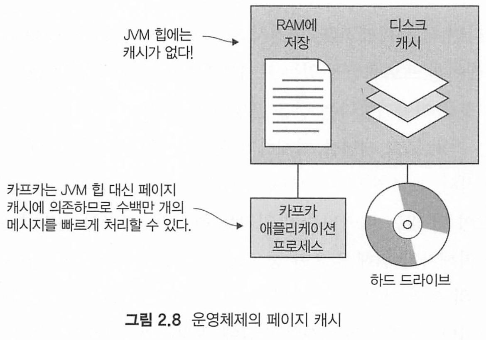
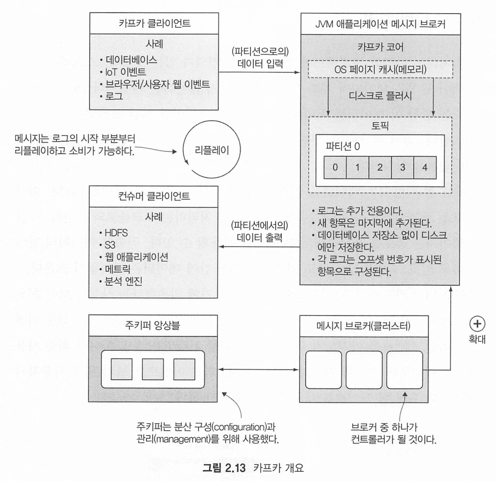
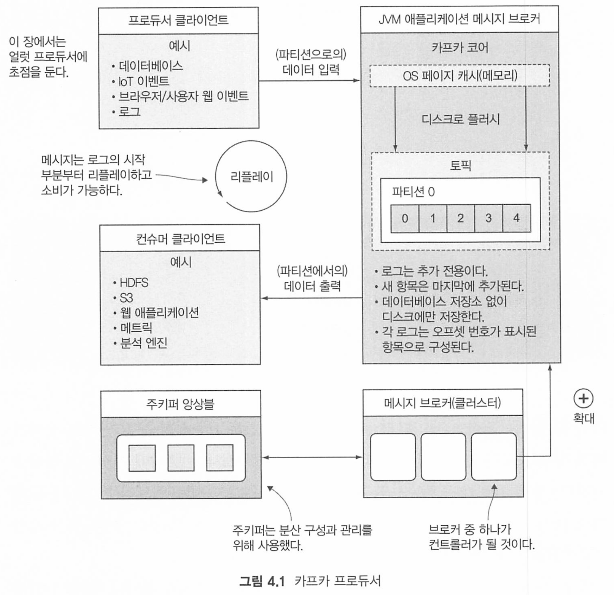
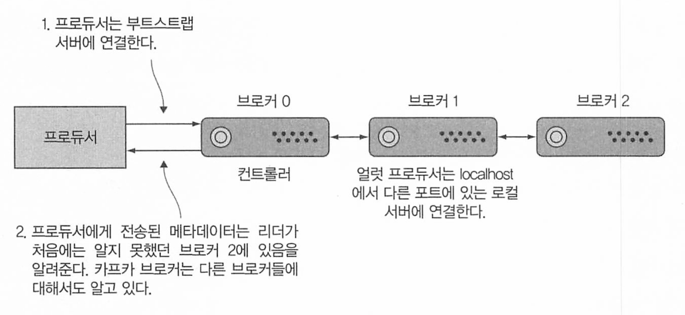
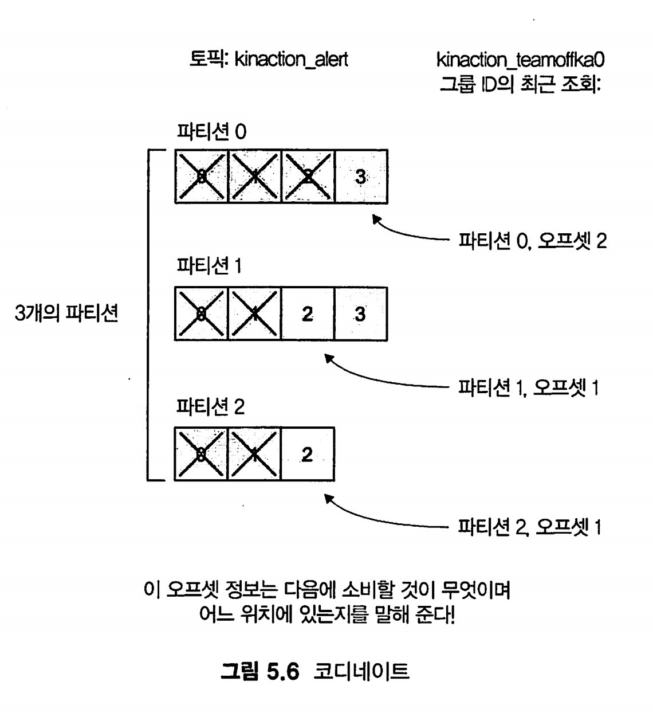
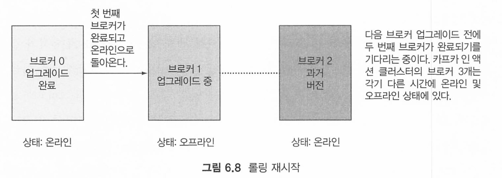

# 카프카 인 액션

* https://github.com/Kafka-In-Action-Book/Kafka-In-Action-Source-Code.git

* https://docs.spring.io/spring-boot/reference/messaging/kafka.html


# 카프카 소개


카프카 특징

* 메시지 큐처럼 레코드를 읽고 씀
* 내결험상으로 레코드 저장
* 스트림 처리

카프카는 다음 세가지 delivery 방식을 제공한다

* at least once : 최소 한번. 수신 확인이 될때까지 재발송
* at most once : 메시지는 단 한번 보내며 실패하더라도 재발송하지 않음
* exactly once : 메시지의 컨슈머에데 단 한번만 전송 


초 대형의 메시지 ( 1MB초과)를 카프카로 보내면 메모리 압박이 있을 수 있다. 페이지 캐시에 메시지를 저장하는데, 메모리가부족할수있기 때문이다. 이는 성능 저하로 이어진다.

거대한 데이터를 보내려면 아주 잘개 쪼개던가, 아니면 오브젝트 저장소에 저장하고 메타데이터만 보내는 것이 더 좋다.

아파치 카프카는 많은 수의 이벤트를 빠르게 처리하는 데 활용 가능한 스트 리밍 플랫폼이다.

카프카를 메시지 버스처럼 사용할 수는 있지만, 카프카의 실시간 데이터 처 리 능력을 완전히 사용한다고 볼 수는 없다.

# 2. 카프카 알아보기

카프카 메시지는 레코드라고 불리며 키(옵셔널), 헤더, 값, 타임스템프를 가지고 있다.

## 브로커란

카프카 브로커(Kafka Broker)는 아파치 카프카(Apache Kafka) 클러스터 내에서 데이터를 저장하고 관리하며 클라이언트의 요청을 처리하는 서버


토픽 생성

```
docker exec -it kafka1 kafka-topics --create \
  --bootstrap-server kafka1:29091 \
  --replication-factor 3 \
  --partitions 3 \
  --topic kinaction_helloworld
```

* --partions : 토픽 분할 파티션 생성 수. 브로커당 파티션 1개
* --replication-factor : 3 개별 파티션에 대해 레플리카 3개가 필요하다는 뜻 

토픽 확인

```
docker exec -it kafka1 kafka-topics --list \
  --bootstrap-server kafka1:29091
  
docker exec -it kafka1 kafka-topics --describe \
  --bootstrap-server kafka1:29091 \
  --topic kinaction_helloworld
```

메시지 전송

```
docker exec -it kafka1 kafka-console-producer --broker-list kafka1:29091 --topic kinaction_helloworld
```


메시지 수신 

```
docker exec -it kafka1 kafka-console-consumer --bootstrap-server kafka1:29091 \
  --topic kinaction_helloworld \
  --from-beginning
```

## 카프카 투어

* 프로듀서 : 메시지 전송
* 컨슈머 : 메시지 수신
* 토픽 : 메시지를 브로커에 저장하기 위한 논리적 이름
* 주키퍼 앙상블 : 클러스터 도우미
* 브로커 : 커밋 로그 처리


토픽은 지정한 파티션 수만큼 n개의 파티션으로 구성되며 파티션은 서로 다른 브로커에 분산된다.

파티션 복사본 중 하나가 리더가 되며, 리더는 요청을 받고 여기서 읽고 쓰며, 팔로워는 리더로부터 데이터를 업데이트 받는다. 

### 주키퍼 용도

아파치 주키퍼는 서비스 디스커버리, configuration, synchroization service를 제공하는 분산 저장소다. 

주키퍼가 카프카 래프트(kraft)로 대체되더라고 분산 시스템에서 코디네이션의 필요성은 있다.


### 카프카의 고가용성 아키텍처

카프카는 JVM에서 실행되는 java + scala 애플리케이션 프로세스다.

카프카가 메시지 빠르게 처리할 수 있는 이유



운영체제의 페이지 캐시를 이용해서 JVM GC 등과 같은 문제에서 좀 자유롭다

* 로그 구조화된 스토리지

  - **순차적 디스크 I/O**: 카프카는 데이터를 순차적으로 디스크에 기록합니다. 이는 랜덤 접근보다 훨씬 빠른 디스크 쓰기 속도를 가능하게 하며, 디스크 헤드 이동을 최소화하여 성능을 극대화합니다.

  - **Append-Only 로그**: 데이터는 추가(write-only) 방식으로 저장되어 데이터 손실 위험을 줄이고, 빠른 쓰기 성능을 유지합니다.

* 제로 카피 

  - **효율적인 데이터 전송**: 제로 카피 기술을 사용하여 사용자 공간과 커널 공간 간의 데이터 복사를 최소화합니다. 이를 통해 CPU 사용량을 절감하고 데이터 전송 속도를 향상시킵니다.

  - **sendfile 시스템 콜 활용**: 네트워크 전송 시 데이터를 직접 전송하여 중간 복사를 생략함으로써 전송 효율성을 높입니다.

* 배치 처리 및 압축

  - **배치 전송**: 프로듀서가 메시지를 배치 단위로 전송함으로써 네트워크 호출 횟수를 줄이고, 전송 효율성을 높입니다.	

  - **데이터 압축**: 메시지를 압축하여 네트워크 대역폭을 절약하고, 디스크 사용량을 줄이며, 전체적인 처리 속도를 향상시킵니다. 지원되는 압축 알고리즘으로는 GZIP, Snappy, LZ4 등이 있습니다.



# 카프카 프로젝트 설계


## 아파치 에이브로 

(Apache Avro)는 데이터 직렬화(serialization) 시스템으로, 주로 빅데이터 처리 환경에서 사용됩니다. Avro는 데이터 구조를 JSON 형식으로 정의하고, 효율적인 이진(binary) 형식으로 데이터를 직렬화하여 저장하거나 전송할 수 있게 해줍니다. 주요 특징은 다음과 같습니다:

1. **스키마 기반**: Avro는 데이터의 구조를 스키마(schema)로 정의하며, 이 스키마를 사용하여 데이터를 직렬화하고 역직렬화합니다.
2. **언어 독립적**: 다양한 프로그래밍 언어에서 Avro를 지원하여, 여러 언어 간의 데이터 교환이 용이합니다.
3. **효율성**: 이진 형식을 사용하여 데이터 크기를 줄이고, 빠른 직렬화/역직렬화를 제공합니다.
4. **스키마 진화 지원**: 기존 스키마에 변경이 생겨도 호환성을 유지할 수 있도록 스키마 진화를 지원합니다.

**카프카와의 관계**

아파치 카프카(Apache Kafka)는 분산형 스트리밍 플랫폼으로, 대용량의 실시간 데이터 스트림을 처리하고 관리하는 데 사용됩니다. Avro는 카프카와 함께 사용될 때 다음과 같은 이점을 제공합니다:

1. **데이터 직렬화**: 카프카는 메시지를 바이트 배열로 전송하는데, Avro는 이러한 메시지를 구조화된 형식으로 직렬화하고 역직렬화하는 데 사용됩니다.
2. **스키마 관리**: 카프카에서 Avro 스키마를 사용하면 생산자(producer)와 소비자(consumer) 간의 데이터 구조를 명확히 정의하고, 스키마 레지스트리(Schema Registry)를 통해 스키마의 버전 관리를 할 수 있습니다.
3. **호환성 유지**: Avro의 스키마 진화 기능을 통해 카프카 메시지의 스키마 변경 시 호환성을 유지할 수 있어, 시스템의 안정성을 높입니다.

**어떻게 사용할 수 있는지**

아파치 아브로와 카프카를 함께 사용하는 일반적인 방법은 다음과 같습니다:

1. **스키마 정의**: Avro 스키마 파일(.avsc)을 작성하여 메시지의 구조를 정의합니다. 예를 들어, 사용자 정보나 로그 데이터의 필드를 정의할 수 있습니다.

   ```
   {
     "type": "record",
     "name": "User",
     "fields": [
       {"name": "id", "type": "int"},
       {"name": "name", "type": "string"},
       {"name": "email", "type": "string"}
     ]
   }
   ```

2. **스키마 등록**: 스키마 레지스트리를 사용하여 정의한 스키마를 중앙에서 관리합니다. 이는 생산자와 소비자가 동일한 스키마를 참조하도록 보장합니다.

3. **데이터 직렬화 및 전송**:

   - **생산자**: Avro를 사용하여 데이터를 직렬화한 후, 카프카 토픽으로 전송합니다.
   - **소비자**: 카프카에서 메시지를 수신한 후, Avro를 사용하여 데이터를 역직렬화하여 사용합니다.

4. **스키마 진화 관리**: 데이터 구조가 변경될 경우, 새로운 스키마를 추가하고 기존 스키마와의 호환성을 유지하여 시스템 전반에 걸친 데이터 일관성을 확보합니다.

사용

**주의사항**:

- Avro를 사용하려면 Confluent Schema Registry를 실행 중이어야 합니다.
- 스키마 레지스트리의 URL(`http://localhost:8081`)을 적절히 설정해야 합니다.
- Avro 직렬화/역직렬화를 위해 Confluent의 Kafka Avro Serializer 라이브러리를 사용합니다.

```
dependencies {
    // 기존 의존성 외에 Avro 관련 라이브러리 추가
    implementation("io.confluent:kafka-avro-serializer:7.5.1")
}
```

스키마

```
// in user.avsc
{
  "type": "record",
  "name": "User",
  "fields": [
    {"name": "id", "type": "int"},
    {"name": "name", "type": "string"},
    {"name": "email", "type": "string"}
  ]
}

```

```kotlin
package com.example

import io.confluent.kafka.serializers.KafkaAvroDeserializer
import org.apache.kafka.clients.consumer.ConsumerConfig
import org.apache.kafka.clients.consumer.KafkaConsumer
import java.time.Duration
import java.util.*

fun main() {
    val topic = "user-topic"

    // 컨슈머 설정
    val props = Properties().apply {
        put(ConsumerConfig.BOOTSTRAP_SERVERS_CONFIG, "localhost:9092")
        put(ConsumerConfig.GROUP_ID_CONFIG, "user-group")
        put(ConsumerConfig.KEY_DESERIALIZER_CLASS_CONFIG, "org.apache.kafka.common.serialization.StringDeserializer")
        put(ConsumerConfig.VALUE_DESERIALIZER_CLASS_CONFIG, KafkaAvroDeserializer::class.java.name)
        put("schema.registry.url", "http://localhost:8081")
        put("specific.avro.reader", "true")
        put(ConsumerConfig.AUTO_OFFSET_RESET_CONFIG, "earliest")
    }

    KafkaConsumer<String, User>(props).use { consumer ->
        consumer.subscribe(listOf(topic))
        println("Subscribed to topic: $topic")

        while (true) {
            val records = consumer.poll(Duration.ofMillis(1000))
            for (record in records) {
                println("Received record(key=${record.key()}, value=${record.value()}, " +
                        "partition=${record.partition()}, offset=${record.offset()})")
            }
        }
    }
}
```

스키마 불일치가 발생하면 다음과 같은 문제가 발생할 수 있습니다:

- **프로듀서 오류**: 프로듀서가 데이터를 Avro 형식으로 직렬화할 때 스키마와 일치하지 않는 데이터를 전송하려고 하면 직렬화 과정에서 예외가 발생할 수 있습니다.
- **컨슈머 오류**: 컨슈머가 데이터를 역직렬화할 때 스키마와 일치하지 않는 데이터를 수신하면 역직렬화 과정에서 예외가 발생하거나 잘못된 데이터가 처리될 수 있습니다

#### **스키마 호환성 설정**

스키마 레지스트리(Schema Registry)를 사용할 때, 호환성 규칙을 설정하여 스키마 변경 시 자동으로 호환성을 검증할 수 있습니다. 호환성 수준에는 다음과 같은 옵션이 있습니다:

- **BACKWARD**: 새로운 스키마가 이전 스키마와 호환되도록 합니다. 이전 스키마로 직렬화된 데이터를 새로운 스키마로 역직렬화할 수 있습니다.
- **FORWARD**: 이전 스키마가 새로운 스키마와 호환되도록 합니다.
- **FULL**: 양방향 호환성을 보장합니다.
- **NONE**: 호환성 검사를 수행하지 않습니다.


# 4. 프로듀서



## 프로듀서 옵션

프로듀서 구성 옵션은 다음을 참고한다

* https://kafka.apache.org/27/javadoc/org/apache/kafka/clients/producer/ProducerConfig.html

### 브로커 목록 구성



bootstrap.servers 속성을 이용해 브로커에 연결하여 클러스터에 있는 다른 브로커에 대한 데이터도 포함하는 필요한 메타 데이터를 발견할 수 있다.

### 더 빨리, 안전하게 처리하기

acks키는 프로듀서가 완료된 요청을 반환하기 전 팔로워 들로부터 수신확인을 받았는지 제어한다

* all, -1, 1, 0

* 0 : 가장낮은대기시간, 안전한 배달은 모른다 

* all, -1 : ISR의 전체 목록에 대해 복제 완료 확인을 대기함. 다른 브로커 의존성으로 가장 느림
* 1: 리더 레플리카만 확인을 기다린다. 

### 타임스탬프

이벤트(메시지)에 대한 타임스탬프.

long 또는 현재 시스템 시간으로 전달 가능하다.

message.timestamp.type을 CreateTime으로 사용하면 클라이언트 시간, LogAppendTime으로 설정하면 브로커 시간이 사용된다.

클라이언트 시간 사용할때 주의점이, 1 2 레코드가 있고, 1번이 먼저 생성되었지만 전송 실패 발송하고 재시도 완료되기 전 더 늦은 2번이 먼저 도착할 수도 있기 때문 . 즉 순서가 맞지 않을수도 있다.


### 커스텀 파티셔너

고유한 파티셔너를 구성하여 데이터를 쓸 파티션을 제어할 수 있다.

크리티컬, 메이저, 마이너, 워닝이라는 수준이 있다고 가정 다른 파티션에 다른 얼럿 수준을 배치하는 파티셔너를 만들 수 있다. 

```java

public class AlertLevelPartitioner implements Partitioner {   //<1>

  public int partition(final String topic,
                       final Object objectKey,
                       final byte[] keyBytes,
                       final Object value,
                       final byte[] valueBytes,
                       final Cluster cluster) {
    
    
    int criticalLevelPartition = findCriticalPartitionNumber(cluster, topic);
    
    return isCriticalLevel(((Alert) objectKey).getAlertLevel()) ?
        criticalLevelPartition :
        findRandomPartition(cluster, topic, objectKey);
  }
  
  public int findCriticalPartitionNumber(Cluster cluster, String topic) {
    //not using parameters but could if needed for your logic
   return 0; 
  }
  
  public int findRandomPartition(Cluster cluster, String topic, Object objectKey) {
    //not using parameter objectKey but could if needed for your logic
    List<PartitionInfo> partitionMetaList =
        cluster.availablePartitionsForTopic(topic);
    
      Random randomPart = new Random(); 
      return randomPart.nextInt(partitionMetaList.size());
  }
  
  public boolean isCriticalLevel(String level) {
    if (level.toUpperCase().contains("CRITICAL")) {
      return true;
    } else {
      return false;
    }
  }
}
```

특정 파티셔너 클래스를 설정하기 위해서 partitioner.class 속성을 사용해야 한다

```java
    Properties kaProperties = new Properties();
    kaProperties.put("bootstrap.servers", "localhost:9092,localhost:9093");
    
    kaProperties.put("key.serializer", AlertKeySerde.class.getName());   //<1>
    kaProperties.put("value.serializer", "org.apache.kafka.common.serialization.StringSerializer");
    /** Use {@link org.kafkainaction.partitioner.AlertLevelPartitioner} to determine partition */
    kaProperties.put("partitioner.class", AlertLevelPartitioner.class.getName());    //<2>

```

# 5 컨슈머

컨슈머로 데이터가 푸시되지않고 폴링된다는 것은 처리 제어 권한이 컨슈머에게 있다는것을 말한다.

* 컨슈머 설정값 : https://docs.confluent.io/platform/current/installation/configuration/consumer-configs.html

오프셋은 각 파티션에 대해 증가하며 각 파티션에는 고유한 오프셋이 있다. 

컨슈머는 파티션 리더 레플리카에서 데이터를 읽는다. 

컨슈머는 연결할 파티션을 어떻게 알 수 있을까?

각 컨슈머 그룹에 대해 특정 브로커가 그룹 코디네이터 역할을 수행하고, 컨슈머 클라이언트는 파티션 할당 정보를 얻기 위해 코디네이터와 대화한다.

파티션 수가 컨슈머의 동시 처리량을 결정한다. 1:1로 매핑되기 때문이다.

파티션 수를 무조건 늘린다고 어마어마하게 늘어나지 않는다. 많은 파티션은 종단 간 대기 시간을 증가시킬 수 있기 때문이다. 

## 컨슈머가 상호작용하는 방식

group.id로 컨슈머 그룹을 지정할 수 있다.

그룹 id별로 오프셋을 관리하며 그룹 id가 바뀌면 일반적으로 0부터 다시 오프셋이 시작된다.

### 그룹 코디네이터

그룹 코디네이터는 컨슈머 클라이언트와 협력하여 특정 그룹이 읽은 토픽 내부의 기록을 유지한다. 즉 오프셋을 유지한다.



카프카에서 **컨슈머 그룹**은 동일한 작업을 수행하는 하나 이상의 컨슈머로 구성됩니다.

컨슈머 그룹은 **각 파티션에 대한 오프셋을 개별적으로 관리**합니다. 따라서, 동일한 파티션에 대해 컨슈머 그룹이 다르면, 각 그룹이 별도의 오프셋을 가지게 됩니다.

각 **파티션 내에서** 오프셋이 관리됩니다. 예를 들어, 하나의 토픽에 파티션이 3개 있다면, 각 파티션은 독립적인 오프셋 시퀀스를 가집니다.

* 컨슈머 그룹 A:

  - 파티션 0의 오프셋: 10

  - 파티션 1의 오프셋: 15

  - 파티션 2의 오프셋: 20

- 컨슈머 그룹 B:
  - 파티션 0의 오프셋: 30
  - 파티션 1의 오프셋: 25
  - 파티션 2의 오프셋: 35

**오프셋 저장 위치**:

- 카프카는 기본적으로 컨슈머 그룹의 오프셋을 **`__consumer_offsets`라는 내부 토픽**에 저장합니다.
- 이를 통해 컨슈머가 중단되었다가 다시 시작해도 동일한 위치에서 소비를 재개할 수 있습니다.

**파티션과 컨슈머 매핑:**

- 한 파티션은 동시에 하나의 컨슈머 그룹 내 한 컨슈머에만 할당됩니다.
- 파티션 수가 컨슈머 수보다 적으면 일부 컨슈머는 파티션을 할당받지 못합니다.
- 파티션 수가 컨슈머 수보다 많으면 한 컨슈머가 여러 파티션을 소비합니다.

## 작업 위치 표시

컨슈머 클라이언트가 커밋을 해야  오프셋이 바뀐다. 

커밋은 동기, 비동기 방식이 있다

```java
consumer.commitSync(kaOffsetMap); // 동기

// 비동기 커밋 
  public static void commitOffset(long offset, 
                                  int partition, 
                                  String topic, 
                                  KafkaConsumer<String, String> consumer) {
    OffsetAndMetadata offsetMeta = new OffsetAndMetadata(++offset, "");

    Map<TopicPartition, OffsetAndMetadata> kaOffsetMap = new HashMap<>();
    kaOffsetMap.put(new TopicPartition(topic, partition), offsetMeta);

    consumer.commitAsync(kaOffsetMap, (map, e) -> {
      if (e != null) {
        for (TopicPartition key : map.keySet()) {
          log.info("kinaction_error topic {}, offset {}", key.topic(),  map.get(key).offset());
        }
      } else {
        for (TopicPartition key : map.keySet()) {
          log.info("kinaction_info topic {}, offset {}", key.topic(), map.get(key).offset());
        }
      }
    });
  }
```


# 6 브로커

## 파티션 리더 레플리카와 역할

토픽은 파티션으로 구성되며 레플리카를 가진다. 파티션은 카프카 브로커 디스크에 기록되며 파티션 의 레플리카중 하나가 리더 역할을 한다. ISR 목록은 리더에 의해 유지 관리된다. 

레플리카가 장애나면 자체 복구되지 않는다. 파티션 사본 중 하나가 존재하는 브로커를 잃어버리면 새로 생성하지 않는다.

## 브로커 추가

클러스터에 브로커 추가하려면 고유한 id로 새 카프카 브로커를 시작하기만 하면 된다.

broker.id를 쓰거나 broker.id.generation.enable = true를 쓰면 된다. 

새 브로커에 파티션이 자동으로 할당되지는 않는다

## 카프카 클러스터 업그레이드

롤링 배포가 있다. 한번에 하나의 브로커만 업그레이드 한다.



controlled.shutdown.enable 값을 true 설정하면 브로커가 종료되기 전 파티션 리더십을 이전할 수 있다.

## 백업

전체 파티션 디렉터리를 복사하도 안된다.

클러스터를 또다른 클러스터에 완전 복제한다. 미러 메이커 도구가 있다.

컨플루언트 레플리케이터랑 클러스터 링킹이란 제품도 있다


# 토픽과 파티션

## 토픽

토픽은 추상적인 개념. 토픽 뒤에는 실제로 데이터를 보유하는 하나 이상의 파티션이 존재한다.

토픽 설계 고려

* 여러 데이터를 단일 토픽으로 보내야 할까 여러 토픽으로 나눠 보내야 할까
* 특정 유형의 이벤트인가 각각 다른 토픽으로 분리되어야하는가

저거보단

* 데이터 정확성
* 컨슈머당 메시지 양
* 처리해야 할 데이터 양

데이터 정확성이란  순서를 지정해야 하는 이벤트가 동일한 파티션, 동일한 토픽에 있는지 확인해야 하는가? 

메시지 지 키와 별도 토픽을 이용하면 도움이 된다.

또한 파티션 수를 줄이는 기능이 지원되지 않으므로 주의해야 한다. 무조건 늘리는것이 답은 아니다

## 파티션

파티션은 로그로 기록되며 index, log, timeindex, leader-epoch-checpoint 파일로 기록된다 


## 토픽 컴팩션

컴팩션의 목포는 메시지를 만료시키는것이 아닌 키의 최신 값이 존재하는지 확인하고 이전 상태를 새상태로 교체하는것

* 옵션 : cleanup.polcy=compact


# 카프카 스토리지 설정

토픽 데이터의 기본 보존 제한 기간은 7일이다

| **키**                    | **목적**                                                     |
| ------------------------- | ------------------------------------------------------------ |
| **log.retention.bytes**   | 로그 삭제를 위한 최대 크기 임곗값(바이트 단위)               |
| **log.retention.ms**      | 로그 삭제 전 유지 시간(밀리초 단위)                          |
| **log.retention.minutes** | 로그 삭제 전 유지 시간(분 단위). log.retention.ms가 함께 설정되어 있다면 log.retention.ms가 사용된다. |
| **log.retention.hours**   | 로그 삭제 전 유지 시간(시간 단위). log.retention.ms와 log.retention.minutes 중 하나가 설정되어 있다면 log.retention.ms나 log.retention.minutes가 사용된다. |


# 카프카 성숙도 모델

## 레벨 0

카프카를 서비스 버스 또는 펍섭 시스템으로 사용한다.

## 레벨1

ETC, CDC 프로세스를 사용해 많은 시스템에서 이벤트를 수집하고 실시간으로 데이터를 분석 시스템에 빠르게 공급한다. 

## 레벨 2

데이터를 이해하기 위해 스키마와 스키마 레지스트리를 활용한다.

## 레벨3

모든것이 무한 이벤트 스트림. 이벤트 발생시 밀리초 단위로 알림을 받음.

데이터 소스 대신 카프카 클러스터에서 직접 데이터를 가져온다.


# 카프카 스트림즈, ksqlDB

## 카프카 스트림즈

스트림 처리를 위한 애플리케이션이며, 라이브러리다.

