* 모던 자바 인 액션을 읽으면서 책에있는 내용을 간단하게 정리한 노트

# Part1 기초


## 스트림 처리

* 자바 8은 병렬 연산을 지원하는 스트림이라는 새로운 API 제공.
* 스트림을 이용하면 에러를 자주 일으키며 멀티코어를 이용하는것보다 비용이 훨씬 비싼 키워드 'synchronized'를 사용하지 않아도 된다 .

* 스트림이란, 한 번에 한 개씩 만들어지는 연속적인 데이터 항목들의 모임.
* java.util.stream 패키지
* Stream<T> : T형식으로 구성된 일련의 항목


## 동작 파라미터화 
동작 파라미터화 (behavior parameterization) : 아직은 어떻게 실행할 것인지 결정하지 않은 코드 블록.  
* 이 코드블록은 나중에 프로그램에서 호출.
* 나중에 실행될 메서드의 인수로 코드 블록 전달 가능. 
* 예를 들어 컬렉션 처리
    * 리스트의 모든 요소에 대해서 '어떤 동작' 수행
    * 리스트 관련 작업을 끝낸 다음에 '어떤 동작' 수행
    * 에러가 발생하면 '정해진 어떤 동작'을 수행

* 참 또는 거짓을 반환하는 함수를 `프레디케이트(prodicate)`라고 한다.


## 람다 표현식

* 메서드로 전달할 수 있는 익명 함수를 단순화한 것. 
* 이름은 없지만 파라미터 리스트, 바디, 반환형식, 예외리스트를 가질 수 있다.
  * 익명 : 이름이 없으므로 익명이라 표현
  * 함수 : 람다는 메서드처럼 특정 클래스에 종속되지 않으므로 함수라고 부른다.
  * 전달 : 람다 표현식을 인수로 전달하거나 변수로 저장 가능
  * 간결성 : 익명 클래스처럼 많은 자질구레한 코드를 구현할 필요가 없다. 

* 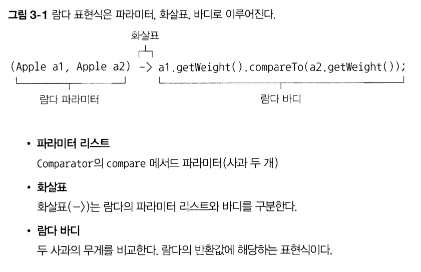
* 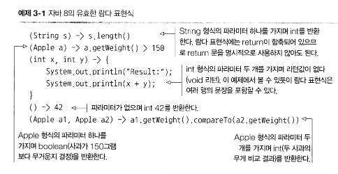

* 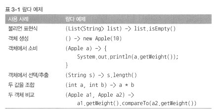

## 람다는 어디에 사용하는가
* 함수형 인터페이스 

### 함수형 인터페이스
* 정확히 하나의 추상 메서드를 지정하는 인터페이스
* 자바 API 함수형 인터페이스로 Comparator, Runnable 등이 있음
```java
public interface Comparator<T> { // | java.util.Comparator
    int compare(T o1, T o2);
}
public interface Runnable { //java.lang.Runnable
    void run();
}
public interface ActionListener extends EventListener { // java.awt.event.ActionListener
    void actionPerforined(ActionEvent e);
}
public interface Callable<V> { //java.util.concurrent.Callable
    V callO throws Exception;
}
public interface PrivilegedAction<T> { // java.secuhty.PhvilegedAction
    T run();
}
```

* 추상메서드가 오직 하나면 함수형 인터페이스이다.

* 람다 표현식으로 함수형 인터페이스의 추상 메서드 구현을 직접 전달할 수 있으므로 `전체 표현식을 함수형 인터페이스의 인스턴스`로 취급할 수 있따.
    * 기술적으로, 함수형 인터페이스를 구현한 클래스의 인스턴스.

### 함수 디스크럽터(function descriptor)
* 함수형 인터페이스의 추상 메서드 시그니처는 람다 표현식의 시그니처를 가리킨다.
* 람다 표현식의 시그니처를 서술하는 메서드를 함수 디스크립터 라고 부른다.
    * Runnable 인터페이스의 유일한 추상 메서드 run은 인수와 반환값이 없으므로 인수와 반환값이 없는 시그니처로 생각할 수 있다. 

* `@FunctionalInterface` 어노테이션
    * 함수형 인터페이스임을 가리키는 어노테이션
    * @FunctionalInterface로 인터페이스를 선언했지만, 실제로 함수형 인터페이스가 아니면 컴파일 에어.

## 람다 활용 : 실행 어라운드 (execute around parttern)

* 자원 처리에 사용하는 순환 패턴은 자원을 열고 처리하고 닫는 순서로 이루어 진다.
* 실제 자원을 처리하는 코드를 설정(열고) 정리 (닫는)하는 과정이 둘러싸는 패턴을 갖는다.

* 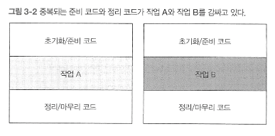
    * 실행 어라운드 패턴.

```java
public String processFile() throws IOException {
    try (BufferedReader br = new BufferedReader(new FileReader("data.txt"))) {
        return br.readLine(); // 실제 필요한 작업을 하는 행 
    }
}
```
* 동작 파라미터화(저 메서드의 동작을 파라미터화) 해서 람다를 이용해서 수정
```java
String result = processFile(BufferedReader br) -> br.readLine() + br.readLine());
```

* 2단계 : 함수형 인터페이스를 이용해서 동작 전달
```java
@FunctionalInterface
public interface BufferedReaderProcessor {
    String process(BufferedReader b) throws IOException;
}

public String processFile(BufferedReaderProcessor p) throws IOException {
    ...
}
```
* 3단계 : 동작 실행
```java
public String profcessFile(BufferedReaderProcessor p) thorws IOException {
    try (BufferedReader br = new BufferedReader(new FileReader("data.txt"))) {
        return p.process(br);
    }
}
```

* 4단계 람다 전달

```java
String oneLine = processFile((BufferedReader br) -> br.readerLine());
String twoLine = processFile((BufferedReader br) -> br.readerLine() + br.readLine());
```


## Predicate

* <T> 형식의 객체를 사용하는 Boolean 표현식이 필요한 상황에서 Predicate 인터페이스를 사용할 수 있따.

## Consumer

* java.util.function.Consumer
* T객체를 받아 void를 반환한다.

## Function

* java.util.function.Function<T, R>
* T를 인수로 받아 R객체를 반환 
* 입력을 출력으로 매핑하는 람다를 정의할 때 활용. 

* 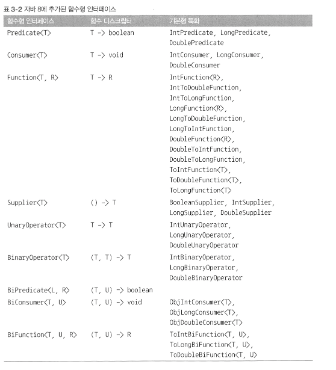


|사용 사례| 람다 예제|함수형 인터페이스|
|---|---|---|
|불리언|(`List<String> list`) -> list.isEmpty()|Predicate(`<List<String>>`)|
|객체 생성| () -> new Apple(10)| Supplier `<Apple>` |
|객체에서 소비| (Apple a) -> System.out.print(a)|Consumer`<Apple>`|
|객체에서 선택 / 추출| (String s) -> s.length()|Function`<String, Integer>` 또는 ToIntFunction`<String>` |
|두 값 조합|(int a, int b) -> a * b|IntBinaryOperator |
|두 객체 비교|(Apple a1, Apple a2) -> a1.getWeight().compareTo(a2.getWeight())|Comparator`<Apple>` 또는 BiFunction`<Apple, Apple, Integer>` 또는 ToIntBiFunction`<Apple, Apple>` |

* 함수형 인터페이스는 확인된 예외를 동작을 허용하지 않는다.
* 예외를 던지는 람다 표현식을 만들려면 확인된 예외를 선언하는 함수형 인터페이스를 정의하거나 람다를 try / catch블록으로 감싸야 한다.

## 람다의 형식 검사, 형식 추론, 제약

* 람다가 사용되는 Context를 이용해서 람다의 type(형식)을 추론할 수 있따.
* 어떤 context에서 기대되는 람다 표현식의 형식을 대상 형식(target type)이라고 부른다.

```java
List<Apple> heavierThan150g = filter(inventory, (Apple apple) -> apple.getWeight()  > 150);
```
* 위코드의 형식 확인 과정

1. filter 메서드의 선언 확인
2. filter 메서드는 두번째 파라미터로 Predicate`<Apple>` 형식 을 기대한다.
3. Predicate`<apple>`은 test라는 한 개의 추상 메서드를 정의하는 함수형 인터페이스.
4. test 메서드는 Apple을 받아 boolean을 반환하는 함수 디스크립터를 묘사
5. filter 메서드로 전달된 인수는 이와 같은 요구사항을 만족해야한다.

* 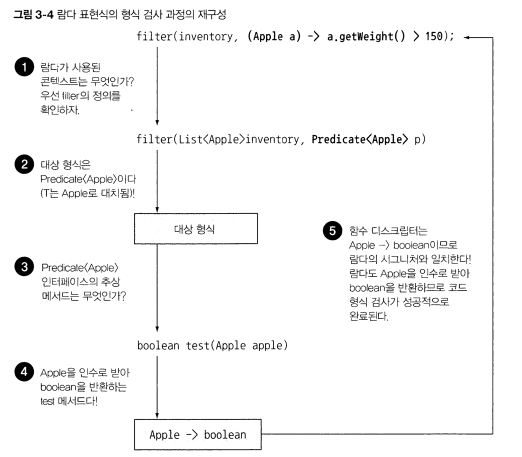

* 람다 표현식이 예외를 던질 수 있다면 추상 메서드도 `같은 예외` 를 던질 수 잇도록 thorws로 선언해야함 .

## 람다의 지역 변수 사용
```java
int portNumber = 1337;
Runnable r = () -> System.out.println(portNumber);
```
* 람다는 인스턴스 변수와 정적 변수를 자유롭게 캡처(자신의 바디에서 참조할 수 있도록)
* 히지만 그러려면` 지역변수는 명시적으로 final로`선언이 되어있어야 하거나 실질적으로 `final`로 선언된 변수와 똑같이 사용되어야한다
    * 람다 표현식은 한 번만 할당할 수 있는 지역 변수를 캡처할 수 있다.
    * 인스턴스 변수 캡처는 final 지역 변수 this를 캡처하는 것과 마찬가지다.
* 지역 변수에 재할당을 하면 람다 표현식에서는 사용할 수 없다.

### 왜 지역 변수에 제약이 있나?
* 인스턴스 변수는 `힙에 저장`되는 반면 지역 변수는 `스택에 위치`.
* 람다에서 지역 변수에 바로 접근할 수 있다는 가정 하에 람다가 스레드에서 실행된다면 변수를 할당한 스레드가 사라져서 변수 할당이 해제되었는데도 해당 변수에 접근하려 할 수없음.
* 따라서 자바 구현에서는 원래 변수에 접근을 허용하는 것이 아니라 `자유 지역변수의 복사본`을 제공
    * `복사본의 값이 바뀌지 말아야 한다`

#### `클로저`

* 클로저란 함수의 비지역 변수를 자유롭게 참조할 수 있는 함수의 인스턴스.
* 클로저 외부에 정의된 변수에 값에 접근하고 값을 바꿀 수 있다.
* 다만 `람다와 익명 클래스는 !람다가 정의된 메서드의! 지역변수의 값을 바꿀 수 없다.`
    * 람다가 정의된 메서드의 지역 변수 값은 final 변수여야 한다.

* 그래야 람다는 변수가 아닌 값에 국한되어 어떤 동작을 수행한다는 사실이 명확해짐.
* 지역 변수값은 스택에 존재하므로 자신의 스레드와 생존을 같이해야 한다.

## 메서드 참조
* 기존의 메서드 정의를 재활용해서 람다처럼 전달할 수 있다.
* 명시적으로 메서드명을 참조함으로써 가독성을 높일 수 있따.
* 메서드명 앞에 구분자 ::를 붙이는 방식으로 활용 가능.
```java
(Apple apple) -> apple.getWeight(); -> Apple::getWeight
(String s) -> System.out.println(s) -> System.out::println
```
* 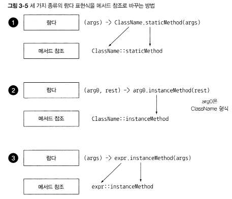

## 생성자 참조
* ClassName::new
```java
Supplier<Apple> c1 = Apple::new;
Apple a1 = c1.get(); // Supplier의 get 메서드를 통해 메서드 실행
```

* 인스턴스화 하지 않고도 생성자에 접근할 수 있는 기능을 만들 수 있다.
    * Map으로 생성자와 문자열값을 관련시킬 수 있다.

```java
static Map<String, Function<Intger, Fruit>> map = new HashMap<>();
static {
    map.put("apple", Apple::new);
    map.put("orange", Orange::new);
}

public static Fruit giveMeFruit(String fruit, Integer weight) {
    return map.get(fruit.toLoWerCase())
                .apply(weight);
}
```

* 인수가 세개인 생성자 참조를 사용하려면?
```java
public interface TriFunction<T, U, V, R> {
    R apply(T t, U u, V v);
}

TriFunction<Integer, Integer, Integer, Color> colorFactory = Color::new;
```

## 람다, 메서드 참조 활용하기

### 1단계 : 코드 전달 방법
```java
void sort(Comparator<? super E> c);
```
* 이 코드는 Comparator 객체를 인수로 받아 두 사과를 비교한다.
* sort의 동작은 파라미터화 되었다고 할 수 있다.
```java
public class AppleComparator implements Comparator<Apple> {
    public int compare(Apple a1, Apple a2) {
        return a1.getWeight().compareTo(a2.getWeight());
    }
}

inventory.sort(new AppleComparator());

// 람다 표현식으로 변환
inventory.sort((a1, a2) -> a1.getWEight().compareTo(a2.getWeight()));

// 정먹세더드 comparing 사용
Comparator<Apple> c = Comparator.comparing((Apple a) -> a.getWeight());

inventory.sort(comparing(apple -> apple.getWeight()));

// 메서드 참조 사용
inventory.sort(comparing(Apple::getWeight));
```

### Comperator 연결
* 무게 비교시, 무게가 같은 두 사과가 존재한다면 어떻게 해야 할까? 
    * 만약 무게로 두 사과를 비교한 다음에 무게가 같다면 원산지 국가별로 사과를 정렬한다면?

* thenComparing 메서드로 체이닝 해서 두 번째 비교자를 만든다
```java
inventory.sort(comparing(Apple::getWeight)
        .reversed()
        .thenComparing(Apple::getCountry));
```
### Predicate 조합

* Predicate 인터페이스는 복잡한 프레디케이트를 만들 수 있도록 `negate, and, or` 세가지 메서드 제공

```java
Predicate<Apple> notRedApple = redApple.negate; // 기존 프레디케이트 객체 redApple의 결과를 반대로 한 객체를 만듬 

// and 메서드를 이용해서 조합
Predicate<Apple> redAndHeavyApple = redApple.and(apple -> apple.getWeight > 150); 

// or 메서드를 이용해서 조합

Predicate<Apple> redAndHeavyAppleOrGreen = redApple.and(apple -> apple.getWeight() > 150)
                                                    .or(apple -> GREEN.eqauls(a.getColor()));
```

### Function 조합

* andThen, compose 두가지 디폴트 메서드 제공

* andThen : 주어진 함수를 먼저 적용한 결과를 다른 함수의 입력으로 전달하는 함수를 반환
* ex : (x -> x + 1) 시키는 f라는 함수가 있고 숫자에 2를 곱하는 g라는 숫자가 있따면?
```java
Function<Integer, Integer> f = x -> x + 1;
Function<Integer, Integer> g = x -> x * 2;
Function<Integer, Integer> h = f.andThen(g);
```
* f 먼저 연산 하고 g를 연산함.

* compose : 인수로 주어진 함수를 먼저 실행한 다음에 그 결과를 외부 함수의 인수로 제공
```java
Function<Integer, Integer> f = x -> x + 1;
Function<Integer, Integer> g = x -> x * 2;
Function<Integer, Integer> h = f.compose(g);
int result = h.apply(1); // 3을 반환
```
* f(g(x))가 되는것.
    * 인수인 g함수가 먼저 실행되고 그 결괏값을 f함수로 넘겨줘서 연산한다.

## 정리

* 람다 표현식은 익명 함수의 일종. 파라미터 리스트, 바디, 반환형식을 가지며 예외를 던질 수 있음.
* 함수형 인터페이스는 하나의 추상 메서드만을 정의하는 인터페이스
* 함수형 인터페이스를 기대하는곳에서만 람다 표현식 사용 가능
* 람다 표현식을 이용해서 함수형 인터페이스의 추상 메서드를 제공할 수 있으며, 람다 표현식 전체가 `함수형 인터페이스의 인스턴스` 로 취급됨


# 4장 스트림(Stream)

* 스트림을 이용하면 선언형(데이터를 처리하는 임시 구현 코드 대신 질의로 표현)으로 컬렉션 데이터 처리를 할 수 있다.
* 멀티스레드 코드를 구현하지 않아도 데이터를 투명하게 병렬로 처리 가능.

* 스트림을 사용함으로써 이득
    * 선언형으로 코드 구현 가능. 루프와 if 조건문 등의 제어 블록을 사용해서 동작을 구현할 필요 없이 동작의 수행 지정 가능.
    * filter, sorted, map, collect와 같은 빌딩 블록 연산을 연결해서 복잡한 데이터 처리 파이프라인을 만들 수 있다.

* 스트림 API는 매우 비싼 연산이다. 

* 장점
    * 선언형 : 더 간결하고 가독성이 좋아짐
    * 유연성 : 조립할 수 있음
    * 성능 : 병렬화로 성능이 좋아짐

## 스트림 시작하기

* 스트림 : 데이터 처리 연산을 지원하도록 소스에서 추출된 연속된 요소(Sequence of elements)
    * 연속된 요소 : 특정 요소 형식으로 이루어진 연속된 값 집합의 인터페이스 제공. 컬렉션의 주제는 데이터, 스트림의 주제는 계산
    * 소스 : 컬렉션, 배열 , I/O자원 등의 데이터 제공 소스로부터 데이터를 소비. 리스트로 스트림을 만들면 스트림의 요소는 리스트의 요소와 같은 순서 유지. 
    * 데이터 처리 연산 : 함수형 프로그래밍 언어에서 일반적으로 지원하는 연사과 DB와 같은 연산 지원. filter, map, reduce, find, match

* 스트림의 두 가지 중요 특징
    * 파이프라이닝(Pipelining) : 대부분의 스트림 연산끼리 연결해서 커다란 파이프라인을 구성할 수 있도록 스트림 자신을 반환. 게으름(laziness), 쇼트서킷(short-circuiting) 같은 최적화도 얻을 수 있다.
    * 내부 반복 : 반복자를 이용해서 명시적으로 반복하는 컬렉션과 달리 스트림은 내부 반복을 지원. 

* filter : 람다를 인수로 받아 스트림에서 특정 요소를 제외시킴. 조건에 맞는 요소만 선택한다.
* map : 람다를 이용해서 한 요소를 다른 요소로 변환하거나 정보를 추출.
* limit : 정해진 개수 이상의 요소가 스트림에 저장되지 못하게 스트림 크기를 축소 (truncate) 한다.
* collect : 스트림을 다른 형식으로 변환. 

## 스트림과 컬렉션

* 자바의 기존 컬렉션과 새로운 스트림 모두 연속된 요소 형식의 값을 저장하는 자료구조의 인터페이스를 제공.

* 데이터를 언제 계싼하느냐가 컬렉션과 스트림의 가장 큰 차이.
    * 컬렉션은 현재 자료구조가 포함하는 모든 값을 메모리에 저장하는 자료구조
        * 즉 컬렉션의 모든 요소는 컬렉션에 추가하기 전에 계산되어야 한다. 
    * 스트림은 이론적으로 요청할 때만 요소를 계산하는 고정된 자료구조(스트림에 요소를 추가하거나 요소를 제거할 수 없다.)
        * 스트림은 사용자가 데이터를 요청할 때만 값을 계산한다.

### 딱 한 번만 탐색할 수 있다.

* 탐색된 스트림의 요소는 소비된다.
    * 한 번 탐색한 요소를 다시 탐색하려면 초기 데이터 소스에서 새로운 스트림을 만들어야 한다.

## 외부 반복과 내부 반복
* 외부 반복 : 사용자가 직접 요소를 반복(for-each 등을 사용해서)하는것
* 내부 반복 : 반복을 알아서 처리하고 결과 스트림값을 어딘가에 저장. 어떤 작업을 수행할지만 지정하면 모든 것이 알아서 처리된다.

* 스트림은 내부반복.

## 스트림 연산

* 연결할 수 있는 스트림 연산을 중간 연산(intermediate operation)
* 스트림을 닫는 연산을 최종 연산(terminal operation)
* 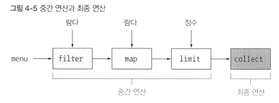

### 중간 연산

* filter, sorted, map 같은 중간 연산은 다른 스트림을 반환. 
* 연산을 스트림 파이프라인에서 실행하기 전까지는 아무 연산도 수행하지 않는다.
    * 중간 연산들을 합친 다음에 합쳐진 중간 연산을 최종 연산으로 '한 번에'처리

### 최종 연산
* 결과를 도출하는 연산. List, Integer, void 등 스트림 이외에 결과가 반환.

* 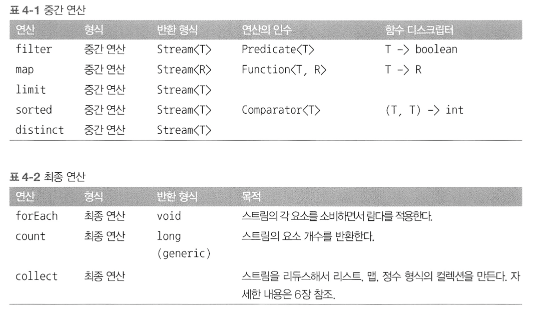

# 5장 스트림 활용

## 필터링

* 스트림은 filter 메서드를 지원.
* filter 메서드는 프레디케이트(Predicate)를 인수로 받아서 일치하는 모든 요소를 포함하는 스트림을 반환.

* 고유 요소로 이루어진 스트림을 반환하는 distinct 메서드도 지원.(고유 여부는 스트림에서 만든 객체의 hashcode, equlas로 결정).
    * 중복제거

## 스트림 슬라이싱
* 자바9는 스트림의 요소를 효과적으로 선택할 수 있도록 takeWhile, dropWhile 두가지 새로운 메서드 지원
* takeWhile : 이미 정렬되어 있다는 사실을 이용해 반복 작업을 중단할 수 있다. 
    * 스트림을 포함한 모든 스트림에 프레디케이트를 적용하는것. 
* dropWhile : takeWhile과 정반대 작업 수행. 
    * 프레디케이트가 처음으로 거짓이 되는 지점까지 발견된 모든 요소를 버린다.
    * 프레디케이트가 거짓이 되면 그 지점에서 작업을 중단하고 남은 모든 요소 반환.

### 요소 건너뛰기
* skip(n) 메서드.
    * 처음 n개 요소를 제외한 스트림을 반환. 

## 매핑 (map, flatMap)

* 함수를 인수로 받는 map 메서드 지원
* 각 요소에 적용되며 함수를 적용한 결과가 새로운 요소로 매핑됨.
    * 기존의 값을 고치는게(modify) 아닌 새로운 요소로 반환함.


### map과 Arrays.stream 활성

* map을 이용해서 단어 리스트에서 고유 문자를 찾는법

```java
String[] arrayOfWords = {"GoodBye", "World"};
Stream<String> streamOfWords = Arrays.stream(arrayOfWords);

words.stream()
    .map(word -> word.split("")) // 각 단어를 개별 문자열 배열로 변환
    .map(Arrays::stream)         // 각 배열을 별도 스트림으로 생성
    .distinct()
    .collect(toList());
```

* 스트림 리스트(`List<Stream<String>>`)가 만들어 지면서 문제는 해결되지 않음.
    * 먼저 각 단어를 개별 문자열로 이루어진 배열로 만든 다음에 각 배열을 별도의 스트림으로 만들어야함.

* flatMap 사용
```java
List<String> uniqueCharacters = 
    words.stream()
        .map(word -> word.split(""))
        .flatMap(Arrays::stream)
        .distinct()
        .collect(toList());
```
* flatMap은 각 배열을 스트림이 아니라 스트림의 콘텐츠로 매핑. 하나의 평면화된 스트림을 반환.
* 스트림의 각 값을 다른 스트림으로 만든 다음에 모든 스트림을 하나의 스트림으로 연결하는 기능 수행.


* 두 개의 숫자 리스트가 있을 때 모든 숫자 쌍의 리스트를 반환하려면?
    * `[1, 2, 3]과 [3, 4]가 주어지면 [(1, 3), (1, 4), (2, 3), (2, 4), (3, 3), (3, 4)]`를 반환해야 한다.

```java
List<Integer> numbersl = Arrays.asList(1, 2, 3);
List<Integer> numbers2 = Arrays.asList(3, 4);
List<int[]> pairs = numbersl.stream{)
                .flatMap(i -> nutrbers2.stream()
                                        .map{j -> new int[]{i, j})
                )
                .collect(toList());
```


## 검색과 매칭

* allMatch, anyMAtch, noneMatch, findFirst, findAny 등

### anyMatch

* 프레디케이트가 적어도 한 요소와 일치하는지 확인

* item.stream().anyMatch(Predicate());
* 최종 연산

### allAtch

* 프레디케이트가 모든 요소와 일치하는지 검사

* item.stream().allAtch(Predicate())

* boolean 반환

### noneMatch

* allMatch와의 반대 연산.

* 프레디케이트와 일치하는 요소가 없는지 확인

* item.stream().noneMatch(Predicate())


####
* anyMatch, allMatch, noneMatch 세 메서드는 스트림 쇼트서킷 기법, 즉 자바의 &&, || 와 같은 연산을 활용한다

* 쇼트서킷
> 전체 스트림을 처리하지 않았더라도 결과를 반환할 수 있다.  
> 표현식에서 하나라도 거짓이라는 결과가 나오면 나머지 표현식의 결과와 상관 없이 전체 결과도 거짓이 된다.  
> 이런 상황을 쇼트서킷이라고 한다.  
> 원하는 요소를 찾았으면 즉시 결과를 반환할 수 있다.  
> 특히 무한한 요소를 가진 스트림을(무한스트림) 유한한 크기로 줄일 수 있는 유용한 연산

### Optional

* Optional<T>는 값의 존재나 부재 여부를 표현하는 컨테이너 클래스.
    * isPresent() : 값을 포함하면 true, 없으면 false
    * ifPresent(Consumer<T> block) : 값이 있으면 주어진 블록 
    * T get() : 값이 있으면 값 반환, 없으면 NoSuchElementException()
    * T orElse(T other) : 값이 있으면 값을 반환, 없으면 기본값 반환

### 첫 번째 요소 찾기 findFirst()

* Optional<T> 반환.

* findFirst findAny는 언제 사용하는가?
    * 병렬 실행에서는 첫 번째 요소는 찾기 어렵다.
    * 요소의 반환 순서가 상관없다면 병렬 스트림에서는 제약이 적은 findAny를 사용한다.


## 리듀싱

* 리듀싱 연산 : 모든 스트림 요소를 처리해서 값으로 도출하는 것
* reduce는 두개의 인수를 갖는다.
    * 초깃값
    * 두 요소를 조합해서 새로운 값을 만드는 BinaryOperator<T>. (a, b) -> a + b

* reduce로 스트림의 모든 숫자 더하기
```java
int sum = numbers.stream().reduce(0, Integer::sum);
```

#### 초깃값 없는 reduce
* 이 reduce는 Optional 객체를 반환한다.
```java
Optinal<Integer> sum = numbers.stream().reduce((a, b) -> (a + b));
```

### reduce - 최댓값과 최솟값
```java
Optional<Integer> max = numbers.stream().reduce(Integer::max);
Optinal<Integer> min = numbers.stream().reduce(Integer::max);
```
 
* map과 reduce (맵 리듀스)를 이용해서 스트림의 갯수 구하는법
```java
int count = item.stream()
                .map(d -> 1)
                .reduce(0, (a, b) -> a + b);
```

#### reduce 메서드의 장점과 병렬화 
> 기존의 단계적 반복(for문, for-each)로 구하는 것과 reduce를 이용하는것의 차이가 뭘까?  
> reduce를 이용하면 내부 반복이 추상화 되면서 내부 구현에서 병렬로 reduce를 실행할 수 있다.  
> 단계적 반복에서는 sum 변수를 공유해야 하므로 쉽게 병렬화하기 어렵다.  

#### 스트림 연산 : 상태 없음과 상태 있음.
* map, filter 등은 입력 스트림에서 각 요소를 받아 0 또는 결과를 출력 스트림으로 보낸다.
    * 따라서 (사용자가 제공한 람다나, 메서드 참조가 내부적인 가변 상태를 갖지 않는다는 가정하에) 이들은 보통 상태가 없는, 내부 상태를 갖지 않는 연산이다.
* reduce, sum, max 같은 연산은 결과를 누적할 내부 상태가 필요하다.
    * 스트림에서 처리하는 요소 수와 관계없이 내부상태의 크기는 한정 되어있다.

* sorted나 distinct 같은 연산은 filter와 map과는 다르다.
    * 정렬하거나 중복을 제거하려면 과거의 이력을 알고 있어야 하기 때문에.
    * 이러한 연산을 내부상태를 갖는 연산 이라고 한다.

* 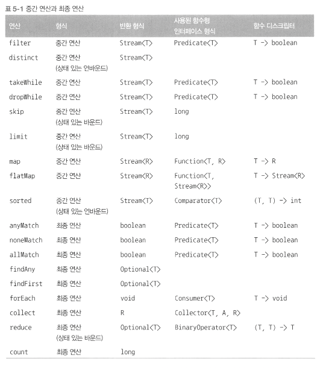

## 실전 연습

* 연습용 데이터
```java
Trader raoul = new Trader("Raoul", "Cambridge");
Trader mario = new Trader("Mario", "Milan");
Trader alan = new Trader("Alan", "Cambridge");
Trader brian = new Trader("Brian", "Cambridge");

List<Transaction> transactions = Arrays.asList(
    new Transaction(brian, 2011, 300),
    new Transaction(raoul, 2012, 1000),
    new Transaction(raoul, 2011, 400),
    new Transaction(mario, 2012, 710),
    new Transaction(mario, 2012, 700),
    new Transaction(alan, 2012, 950)
)
```

1. 2011년에 일어난 모든 트랜잭션을 찾아 값을 오름차순으로 정렬 
2. 거래자가 근무하는 모든 도시를 중복 없이 나열.
3. 케임브리지에서 근무하는 모든 거래자를 찾아서 이름순으로 정렬.
4. 모든 거래자의 이름을 알파벳 순으로 정렬해서 반환
5. 밀라노에 거래자가 있는가?
6. 케임브리지에 거주하는 거래자의 모든 트랜잭션값을 출력
7. 전체 트랜잭션 중 최댓값은?
8. 전체 트랜잭션 중 최솟값은?

```java
// 1. 2011년에 일어난 모든 트랜잭션을 찾아 값을 오름차순으로 정렬
List<Transaction> lists = 
    transactions.stream()
                .filter(t -> t.getYear() == 2011)
                .sorted(comparing(Transaction::getValue))
                .collect(toList());

//2. 거래자가 근무하는 모든 도시를 중복 없이 나열.
List<String> cities =
    transactions.stream()
                .map(t -> t.getTrader().getCity())
                .distinct()
                .collect(toList());// collect(toSet()) 으로도 가능

//3. 케임브리지에서 근무하는 모든 거래자를 찾아서 이름순으로 정렬.
List<Trader> cambridgeTraders = 
    transactions.stream()
                .map(Transaction::getTrader)
                .filter(trader -> trader.getCity().eqauls("Cambridge"))
                .distinct()
                .sorted(comparing(Trader::getName))
                .collect(toList());

//4. 모든 거래자의 이름을 알파벳 순으로 정렬해서 반환
String traderStr =
    transactions.stream()
                .map(transaction -> transaction.getTrader().getName())
                .distinct()
                .sorted()
                .reduce("", (name1, name2) -> name1 + name2); // collect(joining()); 도 가능 joining()은 내부적으로 StringBuilder 이용

//5. 밀라노에 거래자가 있는가?
boolean milanBased =
    transactions.stream()
                .anyMatch(t -> t.getTrader().getCity().eqauls("Milan"));

//6. 케임브리지에 거주하는 거래자의 모든 트랜잭션값을 출력
transactions.stream()
        .filter(t -> t.getTrader().getCity().eqauls("Cambridge"))
        .map(Transaction::getValue)
        .forEach(System.out::println);

//7. 전체 트랜잭션 중 최댓값은?

Optinal<Integer> highestValue = transactions.stream()
                    .map(Transaction::getValue)
                    .reduce(Integer::max);

//8. 전체 트랜잭션 중 최솟값은?

Optinal<Integer> smallestTransaction = 
    transactions.stream()
                .reduce((t1, t2) -> t1.getValue() < t2.getValue() ? t1 : t2);

Optinal<Transaction> smallestTransaction =
    transactions.stream()
                .min(comparing(Transaction::getValue));
```

## 숫자형 스트림

```java
int calories = menu.stream()
                    .map(Dish::getCalories)
                    .reduce(0, Integer::sum);
```

* 이 코드에는 박싱 비용이 숨어있다. 내부적으로 합계를 계산하기 전에 Integer를 기본형으로 언박싱 해야한다.
* reduce 대신 바로 sum()을 호출하고 싶지만 호출 할 수 없다.
* map 메서드가 Stream<T> 를 생성하기 때문이다.
    * 스트림의 요소 형식은 Integer이지만 인터페이스에는 sum 메서드가 없다.
* 스트림 API 숫자 스트림을 효율적으로 처리할 수 있도록 기본형 특화 스트림이 있다.

## 기본형 특화 스트림(primitive stream specialization)

* int : IntStream
* double : DoubleStream
* long : LongStream


### 숫자 스트림으로 매핑

* 스트림을 기본형 특화 스트림으로 변환할 때는 mapToInt, mapToDouble, mapToLong 세가지 메서드를 가장 많이 사용
```java
int calories = menu.stream()
                    .mapToInt(Dish::getCalories)
                    .sum();
```

* `Stream<Integer>` 가 아닌 IntStream을 반환.

* IntStream은 max, min, average등 다양한 유틸 메서드도 지원


### 숫자 스트림에서 객체 스트림으로 복원

* boxed()

```java
IntStream intStream = menu.stream().mapToInt(Dish::getCalories);
Stream<Integer> stream = intStream.boxed();
```

#### 기본형 특화 스트림의 숫자 스트림 기본값 : OptionalInt

* Optional을 OptinalInt, OptinalDobule, OptionalLong 등 참조 형식으로 파라미터화 할 수 있다.

* 값이 없을 때 기본 최댓값을 명시적으로 설정 가능하다
```java
OptionalInt maxCalories = menu.stream().mapToInt(Dish::getCaloories).max();

int max = maxCalories.orElse(1);
```

### 숫자 범위 - 숫자스트림

* IntStream, LongStream 에서는 range()와 rangeClosed() 라는 두 가지 정적 메서드를 제공한다. 
    * 첫 번째 인수로 시작값,
    * 두 번째 인수로 종료값.
* filter, map 등 체이닝 가능.

## 스트림 만들기

* 임의의 수를 인수로 받는 정적 메서드 Stream.of()

* `Stream<String> emptyStream = Stream.empty()` // 스트림을 비우기

* null이 될 수 있는 객체로 스트림 만들기
    * Stream.ofNullable()

```java
String homeValue = System.getProperty("home"); // 제공된 키에 대응하는 속성이 없으면 null 반환
Stream<String> homeValueStream = homeValue == null ? Stream.empty() : Stream.of(value);

Stream<String> homeValueStream = Stream.ofNullable(System.getProperty("home"));
```

### 배열로 스트림 만들기

* Arrays.stream()

* int sum = Arrays.stream(numbers).sum();

### 함수로 무한 스트림 만들기.

* Stream.iterate(), Stream.generate()

* 고정된 컬렉션에서 고정된 크기로 만들었던 것과는 달리 크기가 고정되지 않은 스트림.

* 보통 무한한 값을 출력하지 않도록 limit(n)과 함께 사용

* iterate 메서드

```java
Stream.iterate(0, n -> n + 2)
        .limit(10)
        .forEatch(System.out::println);
```

* 초깃값과 람다를 인수로 받아 새로운 값을 끊임없이 생산할 수 있다.

* iterate는 요청할 때마다 값을 생산할 수 있으며 끝이 없으므로 무한 스트림 이라고 한다.
    * 이러한 스트림을 언바운드 스트림 이라고 한다.
    * 피보나치 수열도 생산할 수 있음. 

* iterate는 생산된 각 값을 연속적으로 계산함.

* Predicate도 지원한다.
* takeWhile를 이용해서 숫자 생성을 중단하는 코드
```java
IntStream.iterate(0, n -> n + 4)
        .takeWhile(n -> n < 100)
        .forEach(System.out::println)
```

* generate 메서드

* iterate와는 달리 각 값을 연속적으로 계산하지 않는다.

# 6장 스트림으로 데이터 수집

## 미리 정의된 컬렉터(Collectors)

* Collectors에서 제공하는 메서드의 기능은 크게 세 가지로 구분할 수 있다.
    * 스트림 요소를 하나의 값으로 리듀스 하고 요약
    * 요소 그룹화
    * 요소 분할

## 리듀싱과 요약

### 문자열 연결

* Collect에 joining 팩토리 메서드.
* 스트림의 각 객체에 toString 메서드를 호출해서 모든 문자열을 하나의 문자열로 연결해서 반환.
    * item.stream().collect(joining());
* 각 객체에 구분 문자열을 넣을 수 있도록 오버로드된 joining 팩토리 메서드
    * item.stream().collect(joining(", "));

### reducing(리듀싱) 팩토리 메서드

```java
int totalCalories = menu.stream().collect(reducing(0, Dish::getCAlories, (i, j) -> i + j));
```

* reducing은 인수 3개를 받는다.

* 첫 번째 인수 : 리듀싱 연산의 시작값. 인수가 없을 때는 반환값.
* 두 번째 인수 : 변환 함수
* 세 번째 인수 : BinaryOperator

## 그룹화

* Collectors.groupingBy()

* 인자로 전달해준 함수로 그룹화한다.

```java
Map<Dish.Type, List<Dish>> caloricDishesByType =
    menu.stream().collect(groupingBy(Dish::getType, filtering(dish -> dish.getCalories() > 500, toList())));
```
* filtering 메소드는 Collectors 클래스의 정적 팩토리 메서드
* 프레디케이트를 인수로 받는다.
* 이 프레디케이트로 각 그룹의 요소와 필터링 된 요소를 재 그룹화.
* 목록이 비어있다면, 빈 목록도 항목으로 추가된다.

* 매핑 함수와 각 항목에 적용한 함수를 모으는 데 사용하는 mapping() 함수도 있다.
    * flatMapping()

## 분할 함수

* 프레디케이트를 분류 함수로 사용한 특수한 그룹화 기능.
* 불리언을 반환하므로 맵의 키 형식은 Boolean
* ex) 채식 요리와 채식이 아닌 요리 분류

```java
Map<boolean, List<Dish>> partitionedMenu =
    menu.stream().collect(partitioningBy(Dish::isVegetarian)); // 분할 함수

List<Dish> vegetarianDishes = partitionedMenu.get(true); // 채식요리
```

### 숫자를 소수와 비소수로 분할

```java
public boolean isPrime(int candidate) {
    return IntStream.range(2, candidate)
                    .noneMatch(i -> candidate % i == 0); // 스트림의 모든 정수로 candidate를 나눌 수 없으면 참
}
// 다음처럼 소수의 대상을 주어진 수의 제곱근 이하의 수로 제한할 수도 있음.
public boolean isPrime(int candidate) {
    int candidateRoot = (int)Math.sqrt((double)candidate);
    return IntStream.rangeClosed(2, candidateRoot)
                    .noneMatch(i -> candidate % i == 0);
}

// partitioningBy 컬렉터로 리듀흐 해서 숫자를 소수와 비소수로 분류 가능.

public Map<Boolean, List<Integer>> paritionPrimes(int n) {
    return IntStream.rangeClosed(2, n).boxed()
                        .collect(partitioningBy(candate -> isPrime(candidate)));
}
```

* 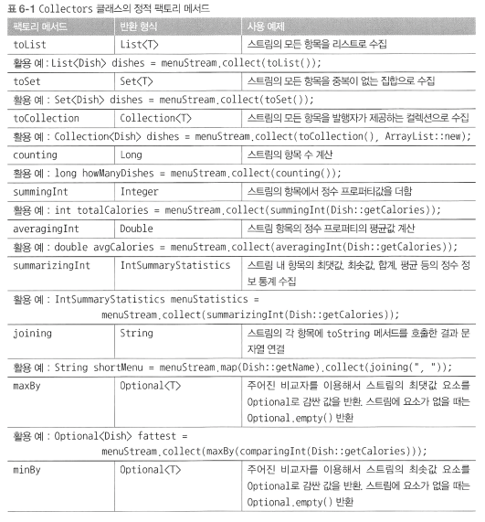
* 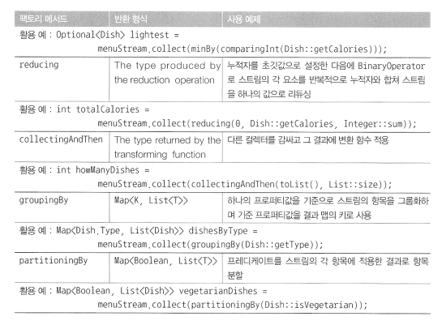

## Collector 인터페이스

```java
public interface Collector<T, A, R> {
    Supplier<A> supplier();
    BiConsumer<A, T> accumulator();
    Function<A, R> finisher();
    BinaryOperator<A> combiner();
    Set<Chracteristics> characteristics();
}
```

* T : 수집될 스트림 항목의 제네릭 형식
* A : 누적자. 수집 과저정에서 중간 결과를 누적하는 객체의 형식.
* R : 수집 연산 결과 객체의 형식.

* ex : `Stream<T>의 요소를 List<T>로 수집하는 ToListColecctor<T>`
```java
public class ToListCollector<T> implements Colecctor<T, List<T>, List<T>>
```

## supplier 메서드 : 새로운 결과 만들기

* supplier 메서드는 빈 결과로 이루어진 Supplier를 반환해야 한다.
* 즉 수집 과정에서 빈 누적자 인스터르를 만드는 파라미터가 없는 함수
```java
public Supplier<List<T>> supplier() {
    return () -> new ArrayList<T>();
    // or  return ArrayList::new;
}
```
## accumulator 메서드

* 리듀싱 연산을 수행하는 함수 반환.
* 스트림에서 n번째 요소를 탐색할 때 두 인수, 누적자(스트림의 첫 n-1개 항목을 수집한 상태)와 n번째 요소를 함수에 적용
* 반환값은 void
```java
public BiConsumer<List<T>, T> accumullator() {
    return (list, item) -> list.add(item);
    // or return List::add;
}
```

## finisher 메서드 : 최종 변환값을 결과 컨테이너로 적용

* 스트림 탐색을 끝내고 누적자 객체를 최종 결과로 변환하면서 누적 과정을 끝낼 때 호출함 함수를 반환해야 한다.

```java
public Fnction<List<T>, List<T>> finisher() {
    return Function.identity();
}
```

* 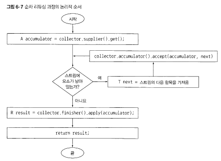

## combiner 메서드 : 두 결과 컨테이너 병합

* 스트림의 서로 다른 서브파트를 병렬로 처리할 때 이 결과를 어떻게 처리할지 정의
```java
public BinaryOperator<List<T>> combiner() {
    return (list1, lsit2) -> {
        list1.addAll(list2);
        return list1;
    }
}
```

## Characterisitics 메서드
* 컬렉터의 연산을 정의하는 Characterisitcs 형식의 불변 집합 반환.
* 다음 세 항목을 포함하는 열거 형

1. UNORDERED : 리듀싱 결과는 스트림 요소의 방문 순서나 누적 순서에 영향을 받지 않는다.
2. CONCURRENT : 다중 스레드에서 accmulator 함수를 동시에 호출할 수 있으며 이 컬렉터는 스트림의 병렬 리듀싱 수행 가능. 
3. IDENTITY_FINISH : finisher 메서드가 반환하는 함수는 단순히 identity를 적용할 뿐이므로 이를 생략 가능. 
    * 리듀싱 과정의 최종 결과로 누적자 객체를 사용하거나 누적자 A를 결과 R로 안전하게 형변환 가능.


## 마치며

* collect는 스트림의 요소를 요약 결과로 누적하는 다양한 방법을 인수로 갖는 최종 연산.

* 스트림의 요소를 하나의 값으로 리듀스하고 요약하는 컬렉터뿐 아니라 최솟값, 최댓값, 평균값을 계산하는 컬렉터 등이 미리 정의되어 있다.

* 미리 정의된 컬렉터인 groupingBy로 스트림의 요소를 그룹화 하거나, partitioningBy로 스트림의 요소를 분할할 수 있다.

* 컬렉터는 다수준의 그룹화, 분할, 리듕신 연산에 적합하게 설계되어 있다.

* collector 인터페이스에 정의된 메서드를 구현해서 커스텀 컬렉터를 개발할 수 있다. 

# 7장 병렬 데이터 처리와 성능

## 병렬 스트림

* 컬렉션에 parallelStream을 호출하면 병렬 스트림이 생성된다.
* 병렬 스트림 : 각각의 스레드에서 처리할 수 있도록 스트림 요소를 여러 청크로 분할한 스트림.

* 숫자 n을 인수로 받아서 1부터 n까지의 모든 숫자의 합계를 반환하는 메서드

```java
public long sequentialSum(long n) {
    return Stream.iterate(1L, i -> i + 1) 
                .limit(n)
                .reduce(0L, Long::sum);
}
```

###  순차 스트림을 병렬 스트림으로 변환
* 순차 스트림에 parallel 메서드를 호출하면 기존의 리듀싱 연산이 병렬로 처리된다.

```java
public long sequentialSum(long n) {
    return Stream.iterate(1L, i -> i + 1) 
                .limit(n)
                .parallel()
                .reduce(0L, Long::sum);
}
```

* 반대로 병렬 스트림에서 순차 스트림으로 변환하려면?
* sequential 사용.
```java
stream.parallel()
        .filter(...)
        .sequential()
        .map()
        .reduce();
```

## !! 병렬 스트림에서 사용하는 스레드 풀 설정

> 병렬 스트림은 내부적으로 FockJoinPool을 사용 .  
> ForkJoinPool은 프로세서 수, 즉 Runtime.getRuntime().availableProcessors()가 반환하는 값에 상응하는 스레드를 갖는다.

* 전역 설정 방법 : System.setProperty("java.util.concurrent.ForkJoinPool.common.parallelism", "12"); 
    * 특별한 이유가 없다면 기본값을 그대로 사용할 것을 권장.


### 병렬 스트림을 효과적으로 사용하기

 * 확신이 서지 않으면 직접성능을 측정 해봐야 한다

 * `박싱` 을 주의하자. 자동 박싱, 자동 언박싱은 성능을 크게 저하시킬 수 있는 요소다.
    * 기본형 특화 스트림(IntStream, LongStream, DoubleStream)을 사용할 수 있으면 사용하자.

* 순차 스트림보다 병렬 스트림에서 성능이 떨어지는 연산 : limit, findFirst 등 요소의 '순서'에 의존하는 연산.
* 소량의 데이터에서는 병렬 스트림이 도움 되지 않는다.
* 스트림을 구성하는 자료구조가 적절한지 확인하자.
    * ArrayList를 LinkedList보다 효율적으로 분할 할 수 있다.
        * LinkedList를 분할하려면 모든 요소를 탐색해야 하지만, ArrayList는 탐색하지 않고도 분할할 수 있다.

* 최종 연산의 병합 과정(ex: Collector의 combiner 메서드) 비용을 살펴보자.
    * 병합 과정의 비용이 비싸다면 병렬 스트림으로 얻은 성능의 이익이 서브스트림의 부분 결과를 합치는 과정에서 상쇄될 수 있다.
    * 이러면 순차 스트림을 사용하는 것이 낫다.

* 스트림의 분해와 관련해서 스트림 소스의 병렬화 친밀도.
    * 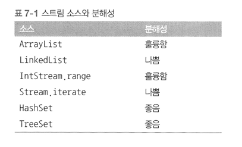

## 7.2 포크/조인 프레임워크
포크/조인 프레임워크는 병렬화 할 수 있는 작업을 재귀적으로 작은 작업으로 분할한 다음에 서브태스크의 각각의 결과를 합쳐 전체 결과를 만들도록 설계되었다.  
포크/조인 프레임워크에서는 서브태스크를 스레드 풀의 작업자 스레드에 분산 할당하는 ExecutorService인터페이스를 구현한다.

### RecursiveTask 활용

* 스레드 풀을 이용하려면 `RecursiveTask<R>`의 서브클래스를 만들어야 한다.
    * R은 병렬화된 태스크가 생성하는 결과 형식 또는 결과가 없을 때 RecursiveAction 형식.
* RecursiveTask를 정의하려면 추상 메서드 compute를 구현해야 한다
    * protected abstract R compute();

* compute() 메서드 : 태스크를 서브 태스크로 분할하는 로직과 더 이상 분할할 수 없을 때 개별 서브태스크의 결과를 생산할 알고리즘을 정의

```java
if (태스크가 충분히 작거나 더 이상 분할할 수 없으면) {
    순차적으로 태스크 계산
} else {
    태스크를 두 서브태스크로 분할
    태스크가 다시 서브태스크로 분할되도록 이 메서드를 재귀적으로 호출
    모든 서브태스크의 연산이 완료될때까지 대기
    각 서브태스크의 결과를 합침.
}

```

* 이 알고리즘은 분할 후 정복 알고리즘의 병렬화 버전이다.

* 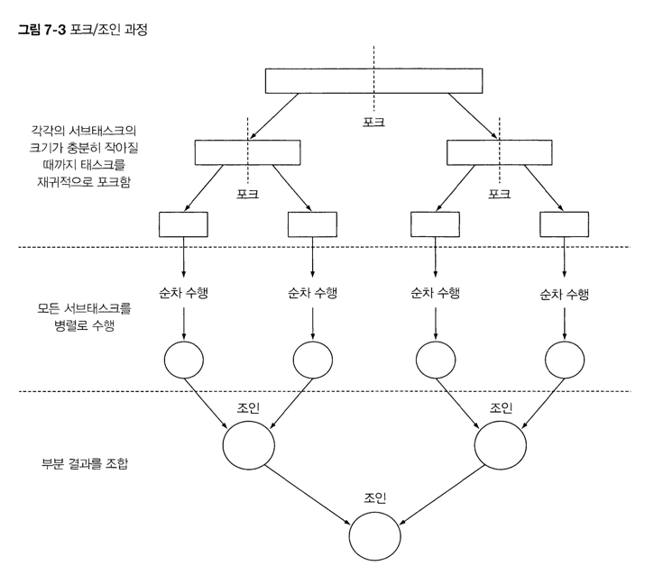

```java

public class ForkJoinSumCalculator extends RecursiveTask<Long> { // RecursiveTask를 상속 받아 사용할 태스크 생성

  public static final long THRESHOLD = 10_000; // 이 값 이하의 서브태스크는 더 이상 분할 불가.

  private final long[] numbers;
  private final int start;  // 이 서브 태스크에서 처리할 배열의 초기 위치와 최종 위치 
  private final int end;

  public ForkJoinSumCalculator(long[] numbers) {
    this(numbers, 0, numbers.length);
  }

  private ForkJoinSumCalculator(long[] numbers, int start, int end) { // 메인 태스크의 서브 태스크를 재귀적으로 만들 때 사용
    this.numbers = numbers;
    this.start = start;
    this.end = end;
  }

  @Override
  protected Long compute() {
    int length = end - start;   // 이 태스크에서 더할 배열의 길이
    if (length <= THRESHOLD) {
      return computeSequentially(); // 기준값과 같거나 작으면 순차적으로 결과를 계산.
    }
    ForkJoinSumCalculator leftTask = new ForkJoinSumCalculator(numbers, start, start + length / 2); // 배열의 첫 번째 절반을 더하도록 서브 태스크 생성
    leftTask.fork();
    ForkJoinSumCalculator rightTask = new ForkJoinSumCalculator(numbers, start + length / 2, end); // 배열의 나머지 절반을 더하도록 서브태스크 생성.
    Long rightResult = rightTask.compute(); // 두 번째 서브태스크를 동기 실행. 추가 분할이 일어날 수 있음.
    Long leftResult = leftTask.join();      // 첫 번째 서브태스크의 결과를 읽거나 결과가 없으면 기다림. 
    return leftResult + rightResult;        // 두 서브태스크의 결과를 조합한 값이 이 태스크의 결과.
  }

  private long computeSequentially() {      // 더 분할할 수 없을 때 서브태스크의 결과를 계산하는 단순한 알고리즘. 
    long sum = 0;
    for (int i = start; i < end; i++) {
      sum += numbers[i];
    }
    return sum;
  }

  public static long forkJoinSum(long n) {
    long[] numbers = LongStream.rangeClosed(1, n).toArray();
    ForkJoinTask<Long> task = new ForkJoinSumCalculator(numbers);
    return FORK_JOIN_POOL.invoke(task);
  }

}
```

### 포크/조인 프레임워크를 제대로 사용하는 방법. 주의할점.

* join 메서드를 태스크에 호출하면 테스크가 생산하는 결과가 준비될 때까지 호출자를 '블록'시킨다.
    * 두 서브태스크가 모두 시작된 다음에 join을 호출해야 한다. 

* RecursiveTask 내에서는 ForkJoinpool의 invoke 메서드를 사용하지 말아야 한다. 대신 compute나 fork 메서드를 직접 호출할 수 있다.
    * 순차 코드에서 병렬 계산을 시작할 때만 invoke 사용.

* 서브태스크에 foke 메서드를 호출해서 FokrJoinPool의 일정 조절.
    * 왼쪽 작업과 오른쪽 작업 모두에 foke 메서드 호출 보다는 한쪽에는 compute 다른 한쪽에는 foke를 호출하는 것이 효율적이다.
    * 그러면 두 서브태스크의 한 태스크에는 같은 스레드를 재 사용 할 수 있다.
        * 불필요한 오버헤드를 줄일 수 있다.

* 포크/조인 프레임워크를 이용하는 병렬 계산은 디버깅하기 어렵다. 스택트레이스가 도움이 되지 않는다.


### 작업 훔치기.
작업 훔치기 알고리즘. 

* 포크/조인 프레임워크에서는 작업 훔치기 라는 기법으로 FokeJoinPool의 모든 스레드를 거의 공정하게 분할할 수 있다.
* 각각의 스레드는 자신에게 할당된 태스크를 포함하는 이중 연결 리스트를 참조하면서 작업이 끝날 때 마다 큐의 헤드에서 다른 태스크를 가져와서 작업을 처리
* 할일이 없어진 스레드가 유휴 상태가 아닌 다른 스레드 큐의 꼬리(tail)에서 작업을 훔쳐오게 한다.
    * 모든 태스크가 작업을 끝낼 때 까지, 즉 모든 큐가 빌 때까지 이 과정을 반복한다.

* 즉 풀에 있는 작업 스레드의 태스크를 재분배하고 균형을 맞출 때 사용


### Spliterator 인터페이스

* Spliterator : 분할할 수 있는 반복자
* 병렬 작업에 특화되어 있음.

```java
public interface Spliterator<T> {
    boolean tryAdvance(Consumer<? supter T> action);
    Spliterator<T> trySplit();
    long estimateSize();
    int characterisitcs();
}
```
* T : 탐색하는 요소의 형식
* tryAdvance : 요소를 순차적으로 소비하면서 탐색해야 할 요소가 남아있으면 참(true) 반호나
* trySplit : 일부 요소(자신이 반환한요소)를 분할해서 두번째 Spliterator를 생성
* estimateSize : 탐색해야 할 요소 수 정보 제공

* chracteristics : Spliterator 자체의 특성 집합을 포함하는 int 반환. 

* 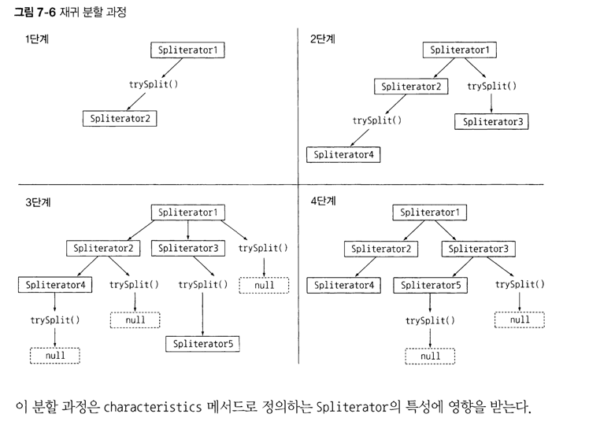

* 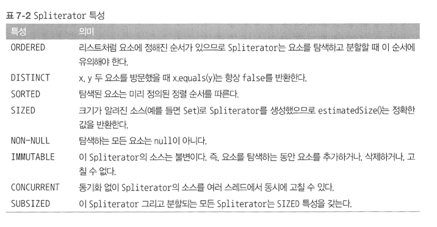


# 스트림과 람다를 이용한 효과적 프로그래밍

## 컬렉션 팩토리
* 자바 9 에서 제공
* 짝은 컬렉션 객체를 쉽게 만들 수 있는 방법
* Arrays.asList(...)
    * 요소를 갱신(수정)할 순 있지만 추가하거나 삭제할 순 없다.
    * UnsupportedOperationException
        * Arrays.asList()는 내부적으로 고정된 크기의 변환할 수 있는 배열로 구현되었기 때문에 발생.(고정 크기)

* Set
    * `Set<String> friends = new hashSet<>("1", "2", "3");`
    * Stream.of("1", "2", "3").collect(Collectors.toSet());

* 그러나 두 방법 모두 매끄럽지 못하고 내부적으로 불필요한 객체 할당을 필요로 한다. 

### 리스트 팩토리 List Factory

* List.of 팩토리 메소드
    * .add로 요소를 추가할 순 없다.
    * UnsupportedOperationException 발생
    * .set 메서드로 요소도 바꿀 순 없다.

### 집합 팩토리 Set Factory

* Set.of("1, "2, "3);

### 맵 팩토리

* Map.of("1", "s", "2", "a");
* 열 개 이하의 키와 값 쌍을 가진 작은 맵을 만들 때는 이 메소드가 유용.

### 리스트와 집합 처리

* removeIf : 프레디케이트를 만족하는 요소를 제거.

* replaceAll : UnaryOperator 함수를 이용해 요소를 바꾼다. 

* sort : List 정렬


