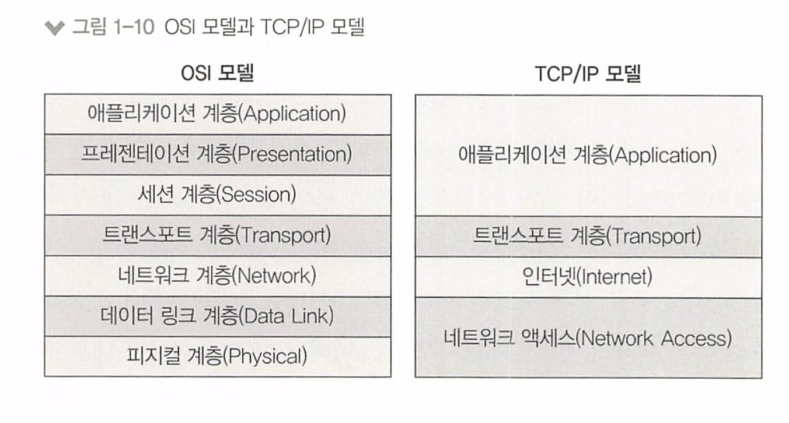
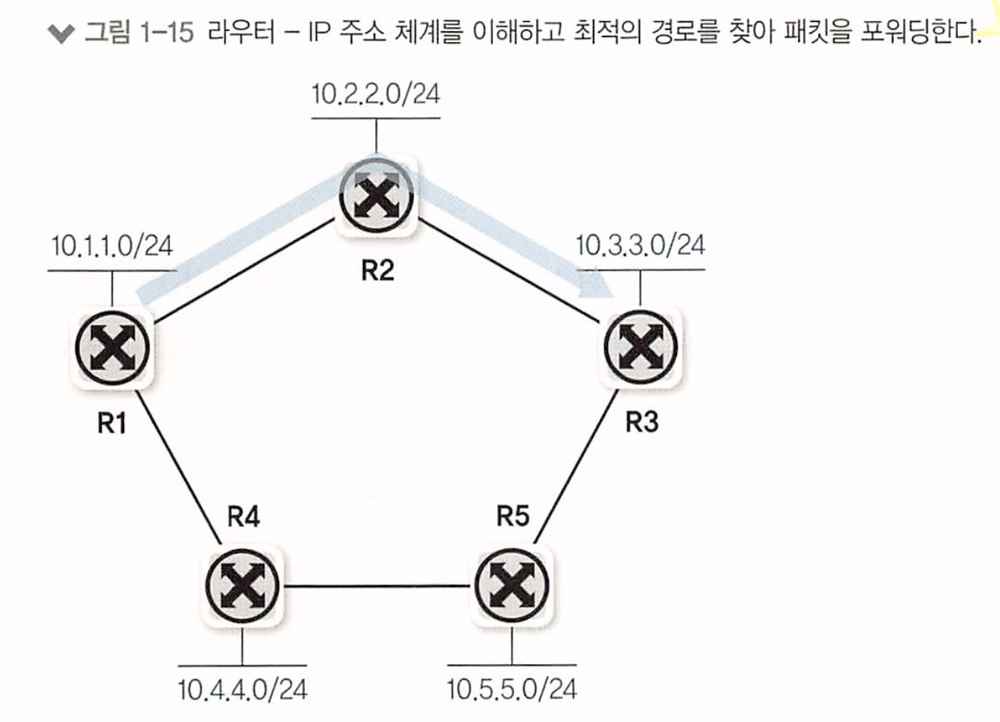

# 1장 네트워크 시작하기

- 1.1 네트워크 구성도 살펴보기
- 1.2 프로토콜
- 1.3 OSI 7계층과 TCP/IP
- 1.4 OSI 7계층별 이해하기
- 1.5 인캡슐레이션과 디캡슐레이션

# 1. 네트워크 구성도 살펴보기

## 1. 홈 네트워크

홈 네트워크를 구성하는데 필요한 요소 : 모뎀, 공유기, 단말.

무선 연결은 무선 랜카드와 공기(전달 매체)가 필요하고,

유선 연결은 유선 랜카드(이더넷 랜 카드), 랜 케이블이 필요하다.

## 2. 데이터 센터 네트워크

데이터센터 네트워크의 목표: 안정적이고 빠른 대용량 서비스 제공.

다양한 이중화 기술과 높은 통신량이 필요하다. - 10G, 25G, 40G , 100G, 400G 등 다양한 이더넷 기술이 사용됌

기존에는 3계층 구성이 일반적이었지만, 가상화 기술과 높은 대역폭을 요구하는 **스케일 아웃(scale out)** 기반의 애플리케이션과 서비스가 등장하면서 **스파인-리프(Spine-Leaf) 구조**로 데이터 센터 네트워크가 변경되었다.

* sacle-out : 여러 서버를 추가하여 수평적으로 시스템을 확장하는 방법. 저렴한 하드웨어를 추가하여 처리능력 향상  

스파인-리프 구조는 서버 간 통신이 늘어나는 트래픽 경향을 지원하게 위해 제안되었다. (MSA 뿐만 아니라 외부 API도)

일반 서버에 10G Base-T 이더넷 포트가 기본적으로 제공되어 TOR(Top of Rack)

스위치와 연결되고 리프(Leal) 스위치인 TOR 스위치는 스파인(Spine) 스위치와 40G, 100G로 연결되는 추세이다. 

더 높은 대역폭을 제공하기 위해 400G 네트워크도 표준화되가고 있다.

서버는 보통 '리프' 스위치를 통해 네트워크에 연결되며, 이 '리프' 스위치는 랙의 상단(Top of Rack, TOR)에 위치한다. 

이렇게 연결된 서버는 보통 10Gbps(기가비트 당 초)의 속도로 데이터를 전송할 수 있다다.

> 데이터 센터에서는 여러 대의 서버를 물리적으로 저장하기 위해 '랙(rack)'이라는 프레임을 사용하는데, 이 랙에는 여러 대의 서버가 수직으로 쌓여있다. 'Top of Rack'이라는 용어는 말 그대로 랙의 가장 윗부분에 위치한 네트워크 스위치.

* 스파인-리프(Spine-Leaf) : 여러 스위치를 연결하는 방식
  * 스파인-리프 아키텍처는 '리프'와 '스파인' 두 가지 주요 구성 요소로 이루어진다. 
  * '리프'는 일반적으로 랙 상단에 위치한 스위치로, 서버와 직접 연결되는 네트워크 장비를 의미하며,
  *  '스파인'은 리프 스위치를 연결하는 중심적인 역할을 하는 스위치를 의미
  * 이는 고정된 경로가 아니라 여러 경로를 제공하므로 트래픽의 분산이 용이하고, 이로 인해 고성능과 고가용성이 가능

> 예로 들자면, 건물의 각 층에 있는 사람들이 서로 통신하려면 엘리베이터를 이용해야 한다. 
>
> 그런데 만약 각 층에 있는 사람들이 직접 연결되는 계단이 있다면 서로 통신하기 훨씬 빠를 것.
> 여기서 각 층은 '리프' 스위치(서버를 직접 연결하는 장비), 계단은 '스파인' 스위치(리프 스위치들을 연결하는 장비)에 비유할 수 있다.

## 2. 프로토콜

프로토콜 : 네트워크 통신할때의 규약. 

여러 프로토콜 기술들이 이더넷-TCP/IP 기반 프로토콜들로 변경되는 추세.

- 물리적 측면: 데이터 전송 매체, 신호 규약, 회선 규격 등. 이더넷이 널리 쓰인다.
- 논리적 측면: 장치들끼리 통신하기 위한 프로토콜 규격. TCP/IP가 널리 쓰인다.

HTTP 프로토콜의 헤더는 문자로 표현되므로 사람이 읽을 수 있다. 

실제 TEXT 기반 파일과 같은 데이터가 전달되기 때문에 효율성은 bit 기반 프로토콜보다 떨어지지만 다양한 확장이 가능하다. 

일반적으로 TCP/IP는 프로토콜이라고 부르지 않고 `프로토콜 스택` 이라고 부른다

* TCP, IP는 별도 계층에서 동작하는 프로토콜이지만 프로토콜 묶음(프로토콜 스택)으로 같이 사용되기 때문이다.
* TCP / IP 프로토콜 스택에는 UDP, ICMP, ARP, HTTP, SMTP, FTP 등과 같은 매우 다양한 application layer 프로토콜이 있따.

# 3. OSI 7계층과 TCP / IP

데이터 통신을 위한 프로토콜 스택을 계층화하여 설명하는 모델이며,

과거의 흩어져있던 규약들을 하나의 규약으로 통합한것.

> 7. 응용 계층(Application Layer): 사용자에게 네트워크 접근을 가능하게 해주는 서비스를 제공합니다. 이메일, 파일 전송, 웹 브라우징과 같은 응용 프로그램들이 이 계층에서 작동합니다.
>
> 6. 표현 계층(Presentation Layer): 데이터의 형식 변환, 암호화와 복호화, 압축, 인코딩 등을 처리하여 데이터 표현에 대한 독립성을 제공합니다.
>
> 5. 세션 계층(Session Layer): 통신 세션을 생성, 관리하며, 종료합니다. 동시성 제어, 대화 관리, 동기화 등의 기능을 수행합니다.
>
> 4. 전송 계층(Transport Layer): 송신자와 수신자 간의 신뢰성 있는 데이터 전송을 관리합니다. 데이터 분할, 오류 제어, 흐름 제어 등의 기능을 담당하며, TCP(Transmission Control Protocol) 등의 주요 프로토콜을 사용합니다.
>
> 3. 네트워크 계층(Network Layer): 데이터의 최적 경로를 선택하여 데이터 전송을 관리합니다. IP(Internet Protocol) 주소를 이용하여 목적지로 데이터를 전송합니다.
>
> 2. 데이터 링크 계층(Data Link Layer): 네트워크 상에서의 직접적인 연결을 담당하며, 프레임 전송의 오류 없는 신뢰성을 보장합니다. MAC(Media Access Control) 주소를 이용하여 데이터를 목적지로 전달합니다.
>
> 1. 물리 계층(Physical Layer): 데이터 전송에 필요한 전기적, 물리적 특성을 정의합니다. 전압, 케이블, 무선 주파수 등과 같은 하드웨어적인 요소들을 다룹니다.

OSI 7계층은 다시 두가지 계층으로 나눌 수 있다.

* 1~4 계층 : 데이터 플로 계층(Data Flow Layer) / 하위 계층 (Lower Layer)
* 5~7 계층 : 애플리케이션 계층 (Application Layer) / 상위 계층 (Upper Layer)

데이터 플로 계층은 데이터를 전달하는 역할, 

애플리케이션 계층은 하위 데이터 플로 계층을을 고려하지 않고 데이터를 표현하는데 초점을 맞춘다.

개발자는 이러한 응용 프로그램을 사용하여 텍스트, 이미지, 파일 등을 보낼 수 있으며, 애플리케이션 계층은 이러한 데이터의 표현 방식에 집중한다.

개발자는 왜 네트워크를 하향식으로 바라보고, 네트워크 엔지니어는 상향식으로 바라볼까?

* 개발자는 주로 애플리케이션 개발에 집중하며, 네트워크를 통해 데이터를 주고받는 기능을 구현하기 때문이다.
* 애플리케이션 계층에서 데이터의 형식, 구조, 표현 방법 등을 다루고, 네트워크의 상세한 동작과 구성 요소들은 하위 계층에 의존하기 때문이다.
* 반면에 네트워크 엔지니어는 네트워크의 설계, 구성, 운영, 유지보수에 전문적으로 다루기 때문에 데이터 플로 계층부터 시작하여 하위 계층들까지 모든 계층을 고려하여 네트워크를 설계하고 문제를 해결한다.
* 따라서 네트워크 엔지니어는 전체적인 시스템을 상향식으로 바라보며, 모든 계층의 동작과 상호작용을 이해하고 관리한다.

## TCP / IP 프로토콜 스택

TCP/ IP는 이론인 OSI 7 계층의 이론보다 실용성에 중점을 둔 프로토콜이다. 

TCP/IP 모델은 실제로 인터넷에서 사용되는 프로토콜인 TCP와 IP를 중심으로 설계되었다.

TCP/IP 모델은 OSI 7계층과 비교하여 더 간단하고 유연한 구조를 가지고 있으며, 인터넷을 기반으로 한 네트워크 통신에 맞추어져 있다.

즉, 목적이 무엇이냐? 현실에 쉽게 반영하도록 간단히 구분하기 위해서다. 

# 4. OSI 7 계층별 이해.

## 1계층 (물리, 피지컬 계층)

물리 계층으로 물리적 연결과 관련된 정보를 정의한다. 주로 전기 신호를 전달하는 데 초점이 맞추어져 있다.

* 1계층의 주요 장비 : 허브, 리피터, 케이블, 커넥터, 트랜시버, 탭
  * 허브, 리피터 : 네트워크 통신을 중재하는 네트워크의 장비
  * 케이블 커넥터 : 케이블 본체를 구성하는 요소
  * 트랜시버 : 컴퓨터의 랜카드와 케이블을 연결하는 장비
  * 탭 : 네트워크 모니터링과 패킷 분석을 위해 전기신호를 다른 장비로 복제 

1계층에서는 들어온 전기 신호를 그대로 잘 전달하는 것이 목적이다.

전기 신호가 1계층 장비에 들어오면 이 전기 신호를 재생성하여 내보낸다.

* 1계층 장비는 주소의 개념이 없으므로 전기 신호가 들어온 포트를 제외하고 모든 포트에 같은 전기 신호를 전송한다.

## 2계층 (데이터 링크 계층)

데이터 링크 계층은 전기 신호를 모아 우리가 알아볼 수 있는 데이터 형태로 처리한다.

1계층과는 다르게 전기 신호를 정확히 전달하기 보다는, 주소 정보를 정의하고 정확한 주소로 통신이 되도록 하는데 초점이 맞추어져 있다.

* 2계층에서는 출발지와 도착지 주소를 확인하고, 내게 보낸것이 맞는지, 처리해야하는것이 맞는지 검사한 후 데이터 처리를 수행한다.

**플로 컨트롤(Flow Control)** : 데이터를 받는 사람이 현재 데이터를 받을 수 있는지 확인하는 작업.

2계층의 네트워크 구성 요소 : 네트워크 인터페이스 카드(NIC), 스위치

* 네트워크 카드, 랜카드, 이더넷 카드, 네트워크 어뎁터 등 같은 용어이다.

2계층의 주요 특징 : **MAC 주소라는 주소 체계가 있다.**

네트워크 인터페이스 카드(NIC)와 스위치 모두 MAC 주소를 이해하고, 스위치는 MAC 주소를 보고 통신해야 할 포트를 지정해 내보낸다.

**네트워크 인터페이스 동작 방식.**

1. 전기 신호를 데이터 형태로 만든다.
2. 목적지 MAC 주소와 출발지 MAC 주소를 확인한다.
3. 네트워크 인터페이스 카드의 MAC 주소를 확인한다.
4. 목적지 MAC 주소와 네트워크 인터페이스 카드가 갖고 있는 MAC 주소가 맞으면 데이터를 처리하고 다르면 데이터를 폐기한다.

또한 NIC는 자신에게 들어오는 전기신호가 맞으면 이 데이터를 상위계층에서 처리할 수 있도록 메모리에 적재한다.

**스위치의 동작 방식**

스위치는 데이터 링크 계층에서 동작하며, MAC 주소를 기반으로 네트워크 트래픽을 전달하는 네트워크 장비

즉 단말들이 통신할 때 포트를 적절히 필터링하고 정확한 포트로 포워딩 해준다. 

1. 프레임 수신: 스위치는 포트에 연결된 디바이스로부터 프레임(데이터 패킷)을 수신.
2. MAC 주소 학습: 스위치는 수신된 프레임에서 출발지 MAC 주소를 읽어와 포트와 매핑. 이를 "MAC 주소 테이블"에 저장. 이 과정을 통해 스위치는 어떤 장치가 어느 포트에 연결되어 있는지를 기억.
3. 프레임 전달: 목적지 MAC 주소를 가진 프레임이 도착하면, 스위치는 해당 MAC 주소가 저장된 포트로 프레임을 전송. 이렇게 하여 프레임은 필요한 포트로 전달되고, 다른 포트로는 전달되지 않는다. 이를 통해 스위치는 네트워크 트래픽을 분리하고 성능을 향상시킨다
4. 유니캐스트, 브로드캐스트, 멀티캐스트 처리: 유니캐스트 프레임(특정 디바이스로 전송되는 프레임)은 목적지 MAC 주소를 가진 포트로 전달. 브로드캐스트 프레임(네트워크 상의 모든 디바이스로 전송되는 프레임)은 모든 포트로 전달. 멀티캐스트 프레임(특정 그룹에 속한 디바이스로 전송되는 프레임)은 그룹에 속한 포트로 전달.
5. 충돌 도메인 분리: 스위치는 각각의 포트로 충돌 도메인을 분리. 즉, 한 포트에서 발생하는 충돌은 다른 포트에 영향을 주지 않는다. 이를 통해 스위치는 충돌을 최소화하고 네트워크 성능을 향상시킨다.

## 3계층 (네트워크 계층)

데이터 통신을 할 때에는 2계층의 물리적 MAC 주소와 3계층의 논리적 IP 주소 두 가지 주소가 쓰인다.

MAC주소와 달리 IP 주소는 사용자가 환경에 맞게 변경해 사용할 수 있고, 네트워크 주소 부분과 호스트 주소 부분으로 나뉜다.

3계층을 이해할 수 있는 장비는 자신의 네트워크와 원격지 네트워크를 구분할 수 있고, 어디로 가야하는지 경로 지정 능력이 있따.

3계층 장비 : 라우터

* 라우터는 IP 주소를 사용해 최적의 경로를 찾아 해당 경로로 패킷을 전송하는 역할을 한다.

## 4계층 (트랜스포트, 전송 계층)

하위 4개 계층은 데이터를 잘 쪼개 보내고 받는 역할을 맡아 애플리케이션에서는 데이터를 하위 4계층으로만 보내기만 하면 

데이터를 쪼개 정보를 붙여 목적지까지 잘 전달한다.

1, 2, 3 계층은 신호와 데이터를 올바른 위치로 보내고 실제 신호를 잘 만들어 보내는데 집중한다.

4계층 장비 : 로드밸런서, 방화벽 

* 포트 번호(애플리케이션 구분자)와 sequence, ack 번호를 이용해 부하를 분산하거나 보안 정책을 수립해 패킷을 통과, 차단하는 기능을 수행한다. 

**4계층은 해당 데이터들이 정상적으로 잘 보내지도록 확인하는 역할을 한다.**

* 패킷이 유실되거나 순서가 바뀌었을 때 바로잡아 주는 역할.
* 4계층에서 패킷을 분할할 때 패킷 헤더에 보내는 순서와 받는 순서를 적어 통신하므로 패킷이 유실되더라도 재전송을 요청할 수 있고, 순서가 바뀌어도 바로잡을 수 있다.
* 패킷에 보내는 순서를 명시한 것이 **sequence number** 이고 받는 순서를 나타낸 것이 **ACK NUMBER** 이다. 

* 또한 **Port Number** 를 이용해 상위 애플리케이션을 구분한다. 

## 5계층 (세션 계층)

양 끝단의 응용 프로세스가 연결을 성립하도록 도와주고 연결이 안정적으로 유지되도록 관리하고 작업 완료 후에는 이 연결을 끓는 역할을 한다. 

세션 계층은 TCP/IP 세션을 만들고 없애는 책임을 지며, 에러로 중단된 통신에 대한 에러 복구와 재전송도 수행한다.

세션 계층은 주로 네트워크 응용 프로그램에서 사용되는데 웹 브라우저와 웹 서버 사이의 세션을 생성하고 유지하는데 세션 계층이 사용될 수 있다. 이를 통해 사용자가 웹 페이지를 요청하고 응답을 받을 때 데이터의 정확성과 순서가 유지될 수 있다.

## 6계층 (프레젠테이션,표현 계층 )

일종의 번역기나 변환기 역할을 수행하는 계층이며, 7계층인 응용계층에서의 데이터의 형식상 차이를 다루는 부담을 덜어준다.

1. 데이터 형식 변환: 표현 계층은 데이터를 송신자에서 수신자로 전송하기 전에 형식을 변환한다. 예를 들어, 텍스트 데이터를 이미지 형식으로 변환하거나, 숫자 데이터를 텍스트로 변환하는 등의 변환 작업을 수행할 수 있다.
2. 암호화와 복호화: 표현 계층은 데이터의 보안을 위해 암호화와 복호화를 수행. 암호화는 데이터를 암호화하여 무단 접근으로부터 보호하는 과정이며, 복호화는 암호화된 데이터를 원래의 형태로 복원하는 과정.
3. 압축: 표현 계층은 데이터의 압축을 수행하여 전송 시에 더 효율적인 데이터 전송을 가능하게 한다. 압축을 통해 데이터의 크기를 줄이고 대역폭을 절약할 수 있다.
4. 인코딩: 표현 계층은 데이터의 인코딩을 수행하여 데이터를 전송 가능한 형태로 변환한다. 예를 들어, 특정 문자 집합을 다른 문자 집합으로 변환하거나, 바이너리 데이터를 텍스트로 변환하는 등의 인코딩 작업을 수행할 수 있다.

표현 계층은 주로 데이터의 형식 변환과 보안 관련 작업을 처리하기 위해 사용된다. 예를 들어, 웹 브라우저와 웹 서버 간의 데이터 통신에서 표현 계층은 HTML 문서를 표시 가능한 형태로 변환하거나, SSL/TLS 프로토콜을 사용하여 데이터의 암호화와 복호화를 수행한다.

## 7계층 (애플리케이션, 응용 계층)

애플리케이션 프로세스를 정의하고 네트워크에 접근할 수 있도록 서비스를 제공한다.

SW의 UI부분이나 사용자 입,출력 부분을 정의하는 역할

이메일, 파일전송, 웹 브라우징 등 응용 프로그램이 동작하는 계층 

1. 사용자 인터페이스 제공: 응용 계층은 사용자와 컴퓨터 간의 상호작용을 가능하게 해준다. 사용자 인터페이스를 통해 사용자는 응용 프로그램을 조작하고 네트워크를 통해 데이터를 주고받을 수 있다.
2. 서비스 제공: 응용 계층은 다양한 서비스를 제공합니다. 이메일, 파일 전송, 웹 브라우징, 동영상 스트리밍 등 다양한 응용 프로그램들이 이 계층에서 동작하며, 사용자에게 필요한 서비스를 제공한다.
3. 프로토콜 지원: 응용 계층은 다양한 프로토콜을 지원하는데 각 프로토콜을 사용하여 데이터를 주고받는다. 예를 들어, 이메일은 SMTP 프로토콜을 사용하고, 웹 브라우징은 HTTP 프로토콜을 사용한다.

# 5 인캡슐레이션과 디 캡슐레이션

상위 계층에서 하위 계층으로 데이터를 보내면 물리계층에서 전기 신호 형태로 네트워크를 통해 신호를 보낸 후,

받는 쪽의 하위 계층에서 다시 상위 계층으로 데이터를 보낸다.

인캡슐레이션 : 데이터를 보내는 과정

디캡슐레이션 : 데이터를 받는 과정

현대 네트워크는 대부분 패킷 네트워크이며 데이터를 패킷이라는 작은 단위로 쪼개 보내는데, 이 기법으로 하나의 통신이 회선 전체를 점유하지 않고 동시에 여러 단말이통신하도록 해준다.

패킷으로 쪼갠 다음에 목적지로 보내고 받는쪽에서 패킷을 다시 큰 데이터 형태로 결합해 사용합니다

4계층부터 네트워크 전송을 위한 정보를 헤더에 붙여 넣는데 

그림처럼 4 -> 3 -> 2 계층에서 각각 자신이 필요한 정보를 헤더에 추가한다. 

그리고 1계층에서 전기 신호로 변환해 수신자에게 전송한다. 

그리고 받는쪽에서는 반대로 받는 전기신호를 데이터로 만들고, 

2계층에서는 헤더를 확인하여 자신에게 온 정보가 아니면 버린다. 

자신에게 온 정보라면 3계층으로 정보로 만들고, 2계층의 헤더는 필요 없으므로 버린다. 

마찬가지로 자신에게 온것인지 확인하고 맞으면 3계층 헤더 정보를 업생고 4계층으로 보낸다. 

정리하자면 A 상위 계층 -> A  하위 계층 ->  B 하위계층 -> A 상위 계층 으로 전달되면서 헤더 정보는 각 계층끼리 전달된다. 

위 그림은 2, 3, 4 계층의 헤더를 비교한 그림이다.

모든 계층이나 프로토콜마다 특성이 달라 헤더에 넣는 정보가 다르지만 규칙이 있다.

1. 현재 계층에서 정의하는 정보
   * 각 계층은 자신의 기능과 역할에 맞게 필요한 정보를 헤더에 포함시키는데, 이 정보는 해당 계층에서 수행되는 프로토콜이 데이터를 처리하고 전송하는데 필요한 정보. 
   * ex) 네트워크 계층의 IP 프로토콜은 송신자와 수신자의 IP주소를 헤더에 담는다.
2. 상위 프로토콜 지시자 
   * 현재 계층에서 상위 계층으로 데이터를 전달할 때 어떤 프로토콜을 사용하는지 알려주는 역할을 한다.
   * ex) 응용 계층에서 HTTP 프로토콜을 사용하여 전달하는 경우, 응용 계층 헤더에 HTTP라는 상위 프로토콜 지시자를 포함시켜 수신자가 HTTP를 사용하여 처리한다.

상위 프로토콜 지시자는 왜 필요할까?

상위 계층으로 올라갈 수록 종류가 많아지기 때문이다.

3계층 프로토콜인 IP는 4계층에서 TCP / UDP로 나뉘고, 더 상위 계층에서는 FTP, HTTP, SMTP 등 더 다양한 프로토콜로 다시 나뉜다.

헤더에 아무 정보가 없으면 어떤 상위 프로토콜로 올려야할지 결정할 수 없다.

* ex) 수신시 3계층에서 목적지 IP주소를 확인하고 4계층으로 올려보낼 때 헤더에 상위 프로토콜 정보가 없다면 TCP, UDP중 어디로 보내야할지 구분할 수 없기 때문이다. 그 위 계층으로도 마찬가지다.

각 계층마다 상위 프로토콜 지시자의 이름이 다르다

* 4계층 : Port number
* 3계층 : Protocol Number
* 2계층 : Ether Type

