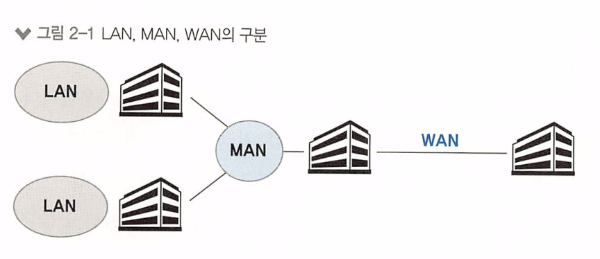

# 2장 네트워크 연결과 구성요소

2.1 네트워크 연결 구분

2.2 네트워크 회선

2.3 네트워크 구성 요소

#  네트워크 연결 구분

네트워크는 규모와 관리 범위에 따라 LAN, MAN, WAN 으로 구분된다.

**LAN(Local Area Network)**

\- 사용자 내부 네트워크

**MAN(Metro Area Network)**

\- 한 도시 정도를 연결하고 관리하는 네트워크

**WAN(wide Area Network)**

\- 멀리 떨어진 LAN을 연결해주는 네트워크

## LAN (Local Area Network)

홈 네트워크, 사무실 등 비교적 소규모의 네트워크 .

먼 거리를 통신할 필요가 없으므로 스위치와 같은 비교적 간단한 장비로 연결된 네트워크를 LAN이라고 불러왔다.

* 스위치는 여러개의 네트워크 장치를 연결하고, 목적지 주소를 확인하여 패킷을 해당 포트로 전달한다. 

## WAN (Wide Area Network)

먼 거리에 있는 네트워크를 연결하기 위해 사용한다.

멀리 떨어진 **LAN** 을 연결하거나, 인터넷에 접속하기 위한 네트워크가 WAN에 해당한다.

WAN은 특별한 경우가 아니면 직접 구축할 수 없는 범위의 네트워크라서 대부분 통신사업자(SSK, LGU+, SKB)

로 부터 **회선을 임대해** 사용한다

# 네트워크 회선

## 인터넷 회선

일반 가정에서 인터넷에 연결하여 사용하는 회선은 **인터넷 전용 회선** 과는 약간 다르다

가입자와 통신사업자 간에 직접 연결되는 구조가 아니라 **전송 선로 공유** 기술을 사용한다

전송 선로를 공유하므로, 일반 가정에서 사용되는 인터넷 회선의 속도는 주변 인터넷의 사용량에 따라 속도가 다르며, <u>전용 회선 과 달리 속도를 보장하지 않는다.</u>  

## 전용 회선

가입자와 통신사업자 간에 대역폭을 보장해주는 서비스를 전용 회선이라고 부른다.

* 가입자 : 개인 또는 기업과 같은 네트워크를 사용하는 사용자 
* 통신사업자 : 전화통신사, 인터넷 서비스 제공자(ISP), 통신 기업 등과 같은 회사

> 전용 회선(Leased Line)은 통신사업자와 가입자 간에 맺어진 계약에 따라 보장된 대역폭을 가진 전용 통신 회선을 의미

가입자와 통신사업자 간에 전용 케이블로 연결되어 있고, 통신사업자 내부에서 TDM(시분할 다중화) 같은 기술로 

마치 `직접 연결한것처럼 통신 품질을 보장해준다.`

## VPN (Virutal private Network)

물리적으로는 전용선이 아니지만, 가상으로 직접 연결한 것 같은 효과가 나도록 한 네트워크.

### 통신사업자 VPN

전용선은 연결 거리가 물리적으로 늘어날수록 비용이 증가한다.

비용을 줄이기 위해 통신사업자가 직접 가입자를 구분할 수 있는 VPN 기술을 사용해 비용을 낮출 수 있다.

가장 대표적인 기술이 MPLS VPN 이다

* Multi-Protocol Label Switching Virtual Private Network

여러 가입자가 하나의 MPLS 망에 접속하지만, 가입자를 구분하여 전용으로 사용할 수 있는것처럼 보이느 ㄴ기술.

### 가입자 VPN

가입자가 일반 인터넷망을 이용해 사용자가 직접 가상 전용 네트워크를 구성할 수 있다.

* 포인트는 일반 인터넷 망을 이용해 VPN을 구축한것. 

# 네트워크 구성 요소

## 네트워크 인터페이스 카드 (NIC, 랜카드)

컴퓨터를 네트워크에 연결하기 위한 **하드웨어 장치**

주요 역할

* 직렬화 (Serialization) : 전기적 신호를 데이터 신호 형태로 또는 데이터 신호 형태를 전기적 신호 형태로 변환한다. (직렬화와 역직렬화)

* MAC 주소 : MAC이란  네트워크 장치에 할당된 고유한 식별자. 패킷의 도착지에 MAC이 적혀있는데, 이걸 구분으로 도착지를 찾고 자신의 주소가 맞으면 시스템에서 처리한다.
* 흐름 제어(Flow Control) : 이미 통신 중인 데이터 처리 때문에 새 데이터를 받지 못할 경우, 데이터 유실 방지를 위해 상대방에게 통신 중지를 요청하는 등의 행위

## 케이블과 커넥터 

트위스티드 페어 케이블 (Twisted Pair), 동축(Coaxial), 광(Fiber) 케이블 등이 존재한다.

### 이더넷 네트워크 표준

가장 많이 사용되는 네트워크 기술은 이더넷 방식이다.

* 유선 네트워크 기술. 
* 이더넷은 LAN(Local Area Network)에서 컴퓨터와 기타 네트워크 장치들이 데이터를 주고받는 데 사용되며, 데이터 링크 계층인 OSI 모델에서 동작
* 이더넷은 데이터 전송을 위한 프레임 형식과 통신 규약을 정의하고 있으며, 다양한 전송 매체를 사용할 수 있다.

일반 PC 같은 종단(최종 도착지)은 기가비트 이더넷,

데이터 센터의 서버 등과 같은 종단은 기가비트 or 10기가 비트 이더넷. 

서버나 스위치간 연결을 10기가비트 이더넷으로 구성할 경우, 스위치에서는 상위 스위치와의 연결을 위한

대역폭을 확보하기 위해 40기가비트나 100기가비트 이더넷을 사용한다.

**기가비트 이더넷의 표준** - 1000BASE-T

1000 : 속도. 단위 - 1000Mbits(1000Mbps)

BASE : 채널

T : 케이블 타입 

## 허브

케이블과 동일한 1계층에서 동작하는 장비 (물리 계층)

거리가 멀어질수록 줄어드는 전기 신호를 재생성 해주고, 여러대의 장비를 연결해준다.

허브는 단순히 들어온 신호를 모든 포트로 내보내는데, 장애의 주 원인이 되어 현재는 거의 사용되지 않는다. 

## 스위치

허브와 동일하게 여러 장비를 연결하고 통신을 중재하는 2계층 장비

* 2계층, 3계층, 4계층, 6계층, 7계층 등 거의 모든 계층에 존재한다.

허브와 달리 스위치는 MAC주소를 이해할 수 있어, 목적지 MAC 주소의 위치를 파악하여 목적지가 연결된 포트로만 전기 신호를 내보낸다.

## 라우터

3계층에서 동작하면서, 먼 거리로 통신할 수 있는 프로토콜로 변홯내준다. 

라우터는 원격지로 쓸데없는 패킷이 전송되지 않도록 브로드캐스트와 멀티캐스트를 컨트롤하고 불분명한 주소로 통신을 시도할 경우 이를 버린다.

* 브로드캐스트는 네트워크에서 모든 호스트 또는 장치에게 데이터를 전송하는 방식입니다.
* 멀티캐스트는 특정 그룹의 호스트 또는 장치에게 데이터를 전송하는 방식입니다.

## 로드 밸런서

로드 밸런서(Load Balancer)는 네트워크나 서버 인프라에서 발생하는 트래픽을 여러 대상 서버들에 균등하게 분산시켜주는 장치 또는 소프트웨어. 

로드 밸런서는 대량의 트래픽을 처리하고 서버의 부하를 분산하여 성능 향상과 가용성을 개선하는데 사용된다.

일반적으로 로드밸런서는 주로 OSI7 계층 중 4계층(Transfort 계층) 에서 동작한다.

7계층에서도 사용되는데, 7계층 로드 밸런서를 ADC(Application Delivery Controller) 라고도 부른다.

4계층 로드밸런서는 L4 스위치 라고도 불리는데, 스위치처럼 여러 포트를 가지고 있으면서 로드 밸런서 역할을 하기 때문이다.

로드밸런서는 4계층 포트 주소를 확인하는 동시에 IP 주소를 변경할 수 있다. 

일반적으로 웹 서비스에 가장 많이 사용되며, 대표 IP는 로드 밸런서가 갖고, 로드 밸런서가 각 웹 서버로 패킷의 목적지 IP 주소를 변경해 보내주어 부하 분산 등을 실행한다. 

로드밸런서는 서비스 헬스 체크(Helath check) 대용량 세션 처리 기능이 있다. 

* **4계층 (전송 계층)**: 로드 밸런서가 4계층 에서 동작하는 경우, 일반적으로 TCP/UDP 패킷의 목적지 포트 번호를 기반으로 트래픽을 분배한다. 로드 밸런서는 수신한 요청을 여러 대상 서버로 분산시킨다. 
  *  L4 로드 밸런서 또는 패킷 로드 밸런서라고도 부른다 .

* **7계층 (응용 계층)**: 로드 밸런서가 응용 계층에서 동작하는 경우, HTTP, HTTPS, SMTP, FTP 등의 프로토콜을 분석하여 트래픽을 분배한다.. 이로 인해 로드 밸런서는 실제 요청의 내용과 상태에 따라 서버로 트래픽을 분산시킬 수 있습니다.
  * 주로 L7 로드 밸런서 또는 애플리케이션 로드 밸런서라고도 부른다. 

로드 밸런서의 주요 목표

1. 성능 향상: 로드 밸런서는 여러 대상 서버에 트래픽을 분산시켜 병렬 처리를 가능하게 하여 응답 시간을 단축시킵니다. 이로써 네트워크의 대역폭을 최대한 활용하고, 서버 자원을 효율적으로 활용할 수 있습니다.
2. 부하 분산: 로드 밸런서는 서버 간 부하를 균등하게 분산하여 과부하 상태를 방지하고 서버의 가용성을 높입니다. 특정 서버에 장애가 발생하면 로드 밸런서는 자동으로 다른 정상 서버로 트래픽을 전달하여 서비스 중단을 최소화합니다.
3. 확장성: 로드 밸런서는 새로운 서버를 서버 풀에 추가하거나 기존 서버를 제거하는 등의 유연한 확장성을 제공합니다. 이로써 시스템의 성능과 용량을 쉽게 확장할 수 있습니다.