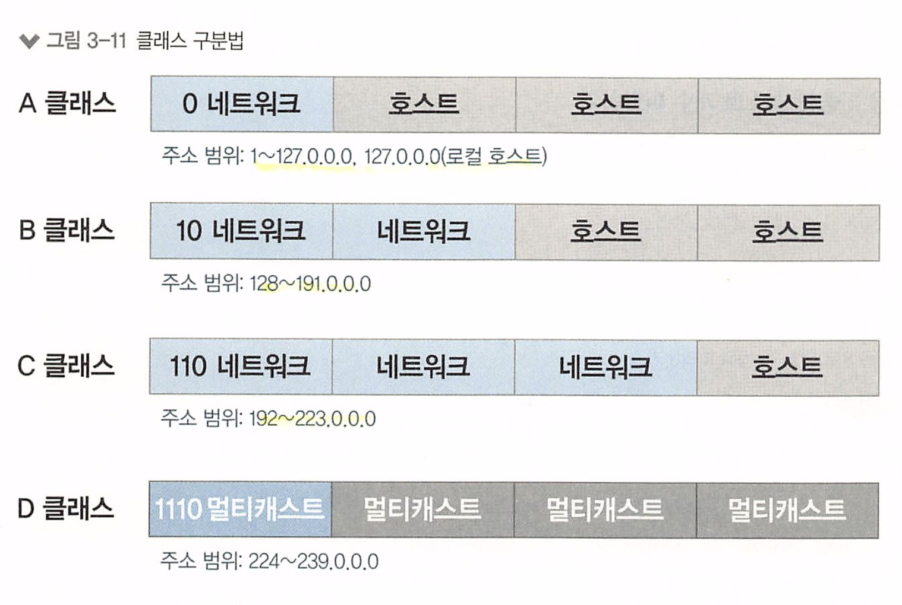
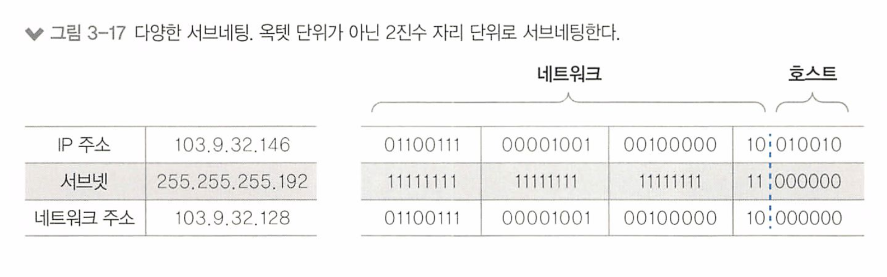

# 3장 네트워크 통신하기

- 3.1 유니캐스트, 멀티캐스트, 브로드캐스트, 애니캐스트
- 3.2 MAC 주소
- 3.3 IP 주소
- 3.4 TCP 와 UDP
- 3.5 ARP
- 3.6 서브넷과 게이트웨이


# 3.1 유니캐스트, 멀티캐스트, 브로드캐스트, 애니캐스트


네트워크 출발지에서 목적지로 데이터를 전송할 때 사용하는 통신방식은 다음과 같다.

* 유니캐스트 (Unicast)
* 브로드캐스트(Boardcast)
* 멀티캐스트(Multicast)
* 애니캐스트(Anycast)


### 유니캐스트

- 1:1 통신
- 출발지와 목적지가 1:1로 통신


유니캐스트는 네트워크에서 가장 일반적으로 사용되는 전송 방식으로, 1:1 통신이다.

예를 들어, 웹 브라우저가 서버에 웹 페이지를 요청하고, 서버가 해당 웹 페이지를 해당 클라이언트에게 전송하는 것이 유니캐스트다

> 실제로 사용하는 대부분의 통신은 유니캐스트 방식이다. 


### 브로드캐스트

- 1:모든 통신
- 동일 네트워크에 존재하는 모든 호스트가 목적지


브로드캐스트는 네트워크에서 모든 호스트나 장치에게 데이터를 전송하는 방식이다.

유니캐스트로 통신하기 전, 주로 상대방의 정확한 위치를 알기 위해 사용되는데, 기본 동작은 로컬 네트워크 내 모든 모든 호스트에게 동일한 메시지를 보내기 위해 사용된다.


 예를 들어, 로컬 네트워크에서 IP 주소 255.255.255.255를 사용하여 브로드캐스트 패킷을 전송하면, 해당 네트워크의 모든 호스트가 이를 수신한다.

### 멀티캐스트

- 1:그룹(멀티캐스트 구독 호스트) 통신
- 하나의 출발지에서 다수의 특정 목적지로 데이터 전송


멀티캐스트는 멀티캐스트 그룹 주소를 이용해 해당 그룹 멤버(다수의 호스트)에게 데이터(패킷)를 전송하는 방식이다.

IPTV와 같은 실시간 방송이나, 사내 방송, 증권 시세 전송과 같이 단방향으로 다수에게 동시에 같은 내용을 전달할 때 사용된다.

멀티캐스트 그룹은 그룹 멤버들에게 고유한 그룹 주소를 부여받고, 송신자는 그룹 주소를 사용하여 데이터를 전송한다. 


**애니캐스트**

- 1:1 통신(목적지는 동일 그룹 내의 1개 호스트)
- 다수의 동일 그룹 중 가장 가까운 호스트에서 응답
- IPv4에서는 일부 기능 구현, IPV6은 모두 구현 가능


애니캐스트는 애니캐스트 주소가 같은 호스트들 중에서 가장 가깝거나 가장 효율적으로 서비스 할 수 있는 호스트와 통신하는 방식


동일한 목적지 주소를 가지는 여러 호스트 후보들 중에서 경로 선택 프로토콜에 의해 가장 가까운 호스트가 선택되어 데이터를 처리한다.

애니캐스트는 대규모 분산 시스템, CDN, DNS 서비스, 로드 밸런싱 등에 사용된다.

* DNS 애니캐스트를 사용하면 사용자의 DNS 쿼리가 가장 가까운 DNS 서버로 전송되어 빠른 응답 시간과 안정적인 서비스를 제공할 수 있다.


현재 주로 사용되는 네트워크 주소 체계는 **IPV4** 기반이다. 

일부 모바일 네트워크와 대규모 데이터 센터 위주로 새로운 IPV6 기반 주소 체계가 사용되는데,  IPV6에서는 브로드캐스트가 존재하지 않고 링크 로컬 멀티캐스트로 대체되어 사용된다.


 통신방식을 구분할 때 중요한 점은 실제 데이터를 전달하려는 **출발지가 기준이 아니라 목적지 주소를 기준**으로 구분한다.

왜? - 효율성, 확장성, 유연성, 보안

* 출발지가 아닌 목적지 주소를 기준으로 통신을 구분하면, 특정 그룹이나 호스트에게 데이터를 전송하는 데 **효율적이다**. 목적지 주소를 기준으로 통신을 구분하면, 해당 그룹 또는 호스트에게만 데이터를 전송하므로 네트워크 대역폭을 절약할 수 있기 때문이다
* 출발지를 기준으로 구분한다면, 대규모 네트워크에서 출발지 주소를 추적하고 관리하는 것이 어려울 수 있다.
* 목적지 주소를 기준으로 통신을 구분하면, 특정 그룹이나 호스트에게만 데이터를 전송할 수 있으므로 보안성이 향상될 수 있다.

**BUM 트래픽**

BUM(Broadcast, Unknown unicast, Multicast) 트래픽은 네트워크에서 브로드캐스트, 알 수 없는 유니캐스트, 멀티캐스트 트래픽을 모두 포함하는 용어이다.

* Unknown Unicast 트래픽 : 목적지 주소를 알 수 없는 트래픽을 의미한다. 목적지가 명시되어있지만, 스위치가 목적지에 대한 주소를 학습하지 못한 상황(스위치 입장에서 Unknown)이어서 패킷을 모든 포트로 플러딩(전송)하는 유니캐스트를 Unknown 유니캐스트라고 한다. 즉 브로드 캐스트와의 동작이 같다. 


BUM 트래픽이 왜 중요하냐면, 유니캐스트이므로 전달받는 모든 단말에서는 도착지 주소를 확인하고 자신이 목적지가 아니므로 패킷을 버리는데, 이런 트래픽을 네트워크 대역폭을 낭비하므로 성능이 저하될 수 있기 때문이다.

* 이더넷 환경에서는 ARP 브로드 캐스트를 먼저 보내고 이후 통신을 시작하므로 BUM 트래픽이 많이 발생하지 않는다.


# 3.2 MAC 주소

MAC : Media Access Control

데이터 링크 계층(2계층) 에서 통신을 위해 네트워크 인터페이스에 **할당된 고유 식별자이다.**

이더넷과 와이파이를 포함한 대부분 IEEE802 네트워크 기술에서 2계층 주소로 사용된다.

이때 물리적인 주소인 MAC주소를 이용해 통싱한다.


## 3.2.1 MAC 주소 체계

MAC 주소는 변경할 수 없으며 하드웨어에 고정되어 출하된다.

네트워크 장비 업체에 IEEE가 주소 풀을 할당하며 이것을 제조사 코드라고 한다.

MAC 주소는 48비트의 16진수 12자리로 표현된다.

```
 "00:1A:2B:3C:4D:5E"
```

다시 뒤의 24비트와 뒤의 24비트로 나누고, 제조사 코드(Vendor Code)가 앞의 24비트인 OUI 값이다.


* OUI : IEEE가 제조사에 할당하는 부분
* UAA : 각 제조사에서 네트워크 구성 요소에 할당하는 부분.

MAC 주소를 BIA(Burend-In Address) 라고도 부른다.

MAC 주소는 **동일 네트워크에서만 중복되지 않으면 동작하는데 문제 없다.**

라우터에서 다른 네트워크로 넘겨줄 때 출발지와 도착지의 MAC 주소가 변경되므로, 네트워크가 넘어가면 기존 출발지와 도착지 MAC 주소를 유지하지 않는다.

* 트워크 간에 패킷이 라우터를 통해 전달될 때 MAC 주소는 변경된다.

## 3.2.2 MAC 주소 동작

NIC(네트워크 인터페이스 카드) 는 자신의 MAC주소를 가지고 전기 신호를 2계층에서 데이터 형태(패킷)으로 변환하여 도착지 MAC 주소를 확인한다.

* 도착지 주소가 자신의 주소와 다르면 패킷을 패기한다.

패킷의 목적지 주소가 자기 자신이거나, 브로드 캐스트 멀티 캐스트와 같은 그룹 주소이면 처리해야 할 주소로 인지해 패킷 정보를 상위 계층으로 넘겨준다.


NIC에서 자체적으로 패킷을 폐기하는것과 달리(목적지 주소가 자신이 아니므로)

본인의 주소이거나 브로드캐스트 주소인 경우에는 **OS나 애플리케이션에서 처리해야 하므로 시스템에 부하가 작용한다.**

이러한 처리는 시스템의 리소스를 사용하므로, 패킷 처리량이 많아지면 시스템에 부하를 줄 수 있으므로, 패킷 필터링, 병렬 처리, 애플리케이션 최적화 로직 등으로 부하를 최소화 하여 성능을 향상시켜야 한다.

**무차별 모드**(Promiscuouse Mode)

패킷이 목적지 주소가 자신이 아닌 경우 NIC가 폐기하는 것을 무차별 모드(프로미스큐어) 라고 한다.

다른 목적지를 가진 패킷을 분석하거나 수집해야 할 경우 무차별 모드를 설정하여 수집한다.

* 대표적인 애플리케이션 : 와이어샤크

# 3.3 IP 주소

2계층은 물리주소인 MAC 주소를 사용하고, 3계층은 논리 주소인 IP를 사용한다.

IP 주소를 포함한 다른 프로토콜 스택의 3계층 주소는 다음과 같은 특징이 있다.

\- 프로토콜 스택이란, OSI 7계층, TCP/IP 4계층 등을 의미한다.

1. 사용자가 변경 가능한 논리 주소.
2. 주소에 레벨이 있다. 그룹을 의미하는 네트워크 주소와 호스트 주소로 나뉜다.

## 3.3.1 IP 주소 체계

우리가 흔히 사용하는 IP 주소는 32비트 IPv4 주소이다.

* IPv6는 128비트이다

IPv4 주소를 표기할 때는 8비트 단위로 나누고 나눈 값을 각 옥텟(Octet) 으로 구분한다.


IP 주소는 **네트워크 주소** 와 **호스트 주소** 로 나뉜다

- 네트워크 주소
   호스트들을 모든 네트워크를 지칭하는 주소. 네트워크 주소가 동일한 네트워크를 로컬 네트워크라고 함.
- 호스트 주소
   하나의 네트워크 내에 존재하는 호스트를 구분하기 위한 주소

IP주소는 MAC과 달리 24비트씩 절반으로 나누지 않고, 경계점이 구분되어 있지 않다.

IP 주소 체계는 필요한 호스트 IP 개수에 따라 네트워크의 크기를 다르게 할당할 수 있는 **클래스(Class) 개념을 도입**했다.

* A클래스는 약 1600만개의 IP주소를 가짐
* B클래스는 약 65000개
* C클래스는 약 250개


IP 주소가 도입한 클래스 개념은, 주소 수를 절약할 수 있다는 장점이 있다.

* **네트워크의 크기가 모두 같은 경우**, 큰 네트워크를 필요로 하는 조직은 **네트워크를 여러 개 확보해야 하는 어려움이 있고** 연속된 네트워크를 할당받기 어렵다. 또한 작은 네트워크가 필요한 조직의 입장에서는 **너무 많은 IP를 가져가므로 IP가 낭비된다.** 



**A클래스** : 네트워크 주소 1옥텟(앞 8바이트), 호스트 3옥텟(뒤 24바이트) = 2^8(256)개의 네트워크와 한 네트워크당 2^24(16,777,216) 개의 호스트 주소를 가질 수 있다. 

**B클래스** : 네트워크 주소 2옥텟, 호스트 주소 2옥텟 = 216(65,536)개의 네트워크와 네트워크당 2^16(65,536)개의 IP를 가질 수 있다.

**C클래스** : 2^24(16,777,216)개의 네트워크와 1개의 네트워크당 2^8(256)개의 호스트를 가질 수 있다.


A클래스에서 127만 예외로 자신을 의미하는 루프백(127.0.0.1)주소로 사용되므로 A클래스는 1.0.0.0 ~ 126.255.255.255까지이다.

B클래스는 128~191 까지이며, 128.0.0.0부터 191.255.0.0까지

C클래스는 192~223까지이며, 192.0.0.0부터 223.255.255.0까지


클래스 기반 네트워크 분할 기반 기법은 과거에 사용했던 개념으로, 현재는 클래스 기반으로 분할하지 않고,

요즘엔 보다 세밀하게 필요한 네트워크의 크기에 맞추어 1비트 단위로 네트워크를 상세히 분할하는 방법을 사용한다. 

**네트워크에서 사용한 가능한 호스트 개수 파악하기**


## 클래스풀과 클래스 리스

클래스(Class) 기반의 IP 주소 체계를 클래스풀(Classful) 이라고 부른다.

클래스풀 체계에서는 서브넷 마스크가 필요 없다.

그런데 클래스리스(ClassLess)가 왜 나오게 되었을까?

### 클래스리스 네트워크

인터넷 상용화 되면서 호스트 숫자가 증가했고, 이론적으로 사용할 수 있는 IP 수는 43억여개이지만 실제로는 훨씬 적다.

네트워크가 클래스리스이면 낭비되는 IP가 매우 많아 다른 네트워크에서 사용하지 못했기 때문이다.

때문에 첫번째 단기 대책은 클래스리스, CIDR(Classless Inter-Domain Routing) 기반의 주소 체계 도입이였고

두번째 중기 대책은 NAT과 사설 IP주소

세번째 장기 대책으로 IPv6를 내세웠다.


이런 클래스풀 체계에서 낭비되는 IP와 네트워크를 위해 클래스 개념 자체를 버린것을 클래스리스라고 부른다.


클래스리스 네트워크에서는 별도로 네트워크와 호스트 주소를 나누는 구분자를 사용해야 하는데

이 구분자를 **서브넷 마스크** 라고 부른다


**서브넷 마스크** 

서브넷 마스크는 ip주소에서 네트워크 ID와 호스트 ID로 구분하기 위한 목적으로 만들어 졌다.

서브넷 마스크는 IP주소와 똑같은 32비트 2진수로 표현된다.

```
255.255.255.0
```

아이피와 표현이 다른 점은 **서브넷 마스크는 연속된 1과 연속된 0으로 구성**되어있다는 것이다.

2진수 숫자 1은 네트워크 주소, 0은 호스트 주소로 표시한다. 

서브넷 마스크는 네트워크 아이디와 호스트 아이디를 보다 편하게 구분하기 위해 사용되는데,

서브넷 마스크 해당 옥텟(8비트, 1바이트)이 255면 네트워크 아이디를 가리킨다. 

때문에 IP주소와 서브넷 마스크를 이용해서 **이 IP가 어느 클래스인지 알 수 있다.** 


| CLASS | 대역                        | 디폴트 서브넷 마스크 |
| ----- | --------------------------- | -------------------- |
| A     | 1.0.0.0 ~ 126.255.255.255   | 255.0.0.0            |
| B     | 128.0.0.0 ~ 191.255.255.255 | 255.255.0.0          |
| C     | 192.0.0.0 ~ 223.255.255.255 | 255.255.255.0        |

2진수의 and(&) 연산으로 IP주소에서 네트워크 주소만 뽑아낼 때 사용할 수 있다.


103.9.32.146 주소 (A클래스)에 255.255.255.0 서브넷 마스크를 사용하는 IP는 

네트워크 주소가 103.9.32.0 이고 호스트 주소는 0.0.0.146이 된다. 

* 서브넷 마스크가 2진수 1인 부분은 IP 숫자가 그대로 연산 결과가 되고, 서브넷 마스크가 0인 부분은 모두 0이된다.


**클래스리스 기반의** IP 네트워크에서는 네트워크를 표현하는데 반드시 서브넷 마스크가 필요하며, 

서버나 PC에 IP 주소를 부여할때도 사용이된다.  

> 네트워크 ID(식별자)로 해당 IP 주소가 어떤 네트워크에 속하는지를 식별한 다음, 
>
> \- IP 주소에서 서브넷 마스크와의 and(&)연산을 통해 네트워크 주소만 뽑아낸다 
>
> 네트워크에 도착한 후 서브넷팅을 통해 호스트 ID(주소)를 알아내어 어디로 보내야 할지 정하기 때문이다.

#### **Prefix 표현** (서브넷 마스크 표현 방법)

서브넷 마스크를 위보다 더욱 간소화해서 표현할 수도 있다.
바로 비트를 이용한 방법인데, IP 주소가 192.168.0.1/24 라면 뒤에 /24가 서브넷 마스크를 표현한 것이다.


/24 라는 뜻은 32비트 중 앞에서부터 차례대로 **1의 개수가 24개**라는 의미이다. 나머지 32-24=8은 0으로 채워주면 서브넷 마스크 숫자가 되는 것이다.

```
/24 -> 11111111.11111111.11111111.00000000 -> C클래스 
```

*  **192.168.1.17 255.255.255.0** 를 **192.168.1.17/24**로 간략히 줄인것

이 네트워크에서는 192.168.0.0부터 192.168.0.255까지 총 256개의 호스트를 사용할 수 있다


## 3.3.3 서브네팅

서브네팅(Subnetting) : 

\- 원래 부여된 클래스의 기준을 무시하고 새로운 네트워크-호스트 구분 기준을 사용자가 정해, 원래 클래스풀 단위의 네트워크보다 더 쪼개 사용하는 것

> IP주소를 절약하고, 네트워크 성능 및 관리 향상을 위해 필요하다.
>
> 라우팅 효율성과 관리가 수월해진다.

즉 부여된 네트워크를 다시 잘라 사용하는것이다.



**네트워크 디자인 단계**에서 네트 워크 설계자가 **네트워크를 효율적으로 어떻게 분할할것인지 계획하는 경우**와 

**이미 분할된 네트 워크에서 사용자가 자신의 네트워크와 원격지 네트워크를 구분해야 하는 경우**를 고려해야 한다.

*  네트워크 사용자 입장
  * 네트워크에서 사용할 수 있는 IP 범위 파악
  * 기본 게이트웨이와 서브넷 마스크 설정이 제대로 되어 있는지 확인

*  네트워크 설계자 입장
  * 네트워크 설계 시 네트워크 내에 필요한 단말을 고려한 네트워크 범위 설계

### 네트워크 사용자 입장에서의 서브네팅

**주어진 네트워크 범위 밖의 IP를 할당**하거나 

**서브넷 마스크를 잘못 입력하면 로컬 네트워크 의 특정 범위에 속해있는 단말과 통신에 문제가 생기거나 외부 네트워크 전체에 통신하지 못하는 상황**이 발생하므로

네트워크 사용자는 **이미 설계되어 있는 네트워크에서 사용할 수 있는 IP 주소 범위를 파악**해야 한다.

일반적으로 자신이 속한 네트워크의 유효 범위를 파악하는 방법은 다음과 같다.

1. 내 IP를 2진수로 표현한다.
2. 서브넷 마스크를 2진수로 표현한다.
3. 2진수 AND 연산으로 서브네팅된 네트워크 주소를 알아낸다.
4. 호스트 주소 부분을 2진수 1로 모두 변경해 브로드캐스트 주소를 알아낸다.
5. 유효 IP 범위를 파악한다. 서브네팅된 네트워크 주소+1은 유효 IP 중 가장 작은 IP이다.
6. 브로드캐스트 주소-1은 유효 IP 중 가장 큰 IP이다.
7. 2진수로 연산되어 있는 결값을 10진수로 변환한다.


1. 서브넷 마스크를 2진수로 변환한다.
2. 현재의 서브넷이 가질 수 있는 최대 IP 개수 크기를 파악한다. 2^6=64
3. 64의 배수로 나열하여 기준이 되는 네트워크 주소를 파악한다. 첫 블록은 0부터 시작한 다. 각 네트워크의 마지막 주소가 브로드캐스트 주소가 된다. 이 주소는 다음 블록 네트워크 주소의 -1 수이다.
   * 0~63/64~127/128~191/192~255

4. 103.9.32.146에서 호스트 주소 146이 속한 네트워크를 선택한다.
   * 128~191

5. 필요한 주소를 정리한다.

   - 네트워크 주소: 103.9.32.128(첫 번째 숫자)

   - 브로드캐스트 주소: 103.9.32.191(마지막 숫자)

   - 유효 IP 범위: 103.9.32.129 ~ 103.9.32.190(네트워크 주소와 브로드캐스트 주소 사이)

중요한 것은 서브넷 마스크를 중심으로 네트워크 크기를 파악해 서브넷된 네트워크의 크기 를 알아내는 것이다. 

그 이후는 

1. 해당 네트워크의 호스트 주소 숫자를 배수로 나열하고 현재 자 신이 속한 IP 범위를 찾고나면 
2. 현재의 네트워크 주소, 브로드캐스트 주소, 유효 IP 범위를 쉽게 파악한다

### 네트워크 설계자 입장의 서브네팅

 네트워크 설계자가 IP를 설계할 때 고민해야 할 부분은 다음과 같다.

- 서브넷된 하나의 네트워크에 IP를 몇 개나 할당해야 하는가?(또는 PC는 몇 대나 있는가?)
- 그리고 서브넷된 네트워크가 몇 개나 필요한가?

ex) 회사에 총 12곳의 지사가 있고, 이 지사들에는 최대 12대의 IP가 필요한 PC와 복합기, IP 카메라가 운영될 예정이다

* 현재 가진 네트워크는 103.9.32.04/24 네트워크이다

1. 서브넷된 하나의 네트워크에 12개 IP를 할당해야 한다.
2. 네트워크는 2진수의 배수로 커지므로 4, 8, 16, 32, 64, 128, 256개 단위로 네트워크를 할당할 수 있다. 12개 IP를 수용할 수 있는 가장 작은 네트워크는 16개이므로 16개짜리 네트워크를 할당한다.
   *  16개짜리 네트워크는 네트워크 주소와 브로드캐스트 주소로 사용할 2개 IP를 제외해야 하므로 실제로 사용할 수 있는 IP는 14개다. 
   * 이 유효 IP 개수는 필요한 12개에 포함 되므로 사용 가능하다.

3. 16개짜리 네트워크 12개를 확보한다. 16의 배수를 0부터 나열해 네트워크 주소를 확인 한다

4. 16개 네트워크 중 12개 네트워크를 할당한다.


네트워크를 설계할 때 가능하면 사설 IP 대역을 사용해 충분한 IP 대역을 사용하는 것이 좋다.

공인 IP는 인터넷에서 유일하게 사용되므로 사용할 수 있는 IP가 제한되어 있기 때문이다.

사설 IP는 회사 내부에서만 사용하므로 제한없이 큰 네트워크를 사용할 수 있다.


잘못 설계된 오른쪽 네트워크 : 실제로 존재하는 네트워크 수만큼 Core 라우터가 모든 경로를 알고 있어야 한다. 

잘 설계된 왼쪽 네트워크 : 네트워크 전체 성능이 향상되고 관리가 편하지만 IP 주소가 낭비된다

* 10.1.0.0/16 네트워크가 할당 되었지만, 실제 사용 네트워크가 3개밖에 없을 경우 나머지 253 개의 네트워크가 낭비된다. 

> 그림 이해가 잘 안됌..


## 3.3.4 공인 IP와 사설 IP

공인  IP : 전 세계에서 유일해야 하는 식별자이며, 인터넷에 접속시 필요한 IP 주소

인터넷 연결하지 않고 개인적으로 네트워크를 구성하면 네트워크를 구축할 수 있다.

이때 사용하는 IP주소를 사설 IP주소라고한다. 

* 사설 IP 주소는 네트워크에서 내부 통신을 위해 사용된다.
* 공유기에 연결되어 있는 가정이나 회사의 각 네트워크 기기에 사설 IP를 할당하여 그룹으로 묶는 방법

> 사설 IP 주소(Private IP address)는 인터넷 상에서 내부 네트워크에서 사용하기 위해 예약된 IP 주소 범위이다.
>
>  이 주소 범위는 공용 IP 주소와 대비되며, 인터넷에서 직접 접근할 수 없고 내부 네트워크에서만 유효하다.

인터넷에 접속하지 않거나  NAT(Natwork Address Translation, 네트워크 주소 변환)기술을사용할 경우 사설  IP주소를 이용할 수 있다.

사설 IP를 사용하면 인터넷에 직접 접속하지 못하지만 IP를 변환해주는 NAT 장비에서 공인 IP로 변경한 후에는 인터넷 접속이 가능하다.  

* 사설 IP 주소는 공용 IP 주소와 달리 중복 사용이 가능하다.
* 사설 IP 주소는 인터넷을 통한 외부 통신을 위해서 NAT 기술을 사용해서 공용  IP주소로 변환한다. 

* NAT 장비을 역할을 하는 대표적인 예 : 공유기


1. 클래스 A 사설 IP 주소 범위: 10.0.0.0에서 10.255.255.255까지
   - 10.0.0.0/8 서브넷
2. 클래스 B 사설 IP 주소 범위: 172.16.0.0에서 172.31.255.255까지
   - 172.16.0.0/12 서브넷
3. 클래스 C 사설 IP 주소 범위: 192.168.0.0에서 192.168.255.255까지
   - 192.168.0.0/16 서브넷


* 공인 IP는 181.227.3.33
* 공인 IP를 통해 외부와 통신된다.
* NAT 원리 : 우선 공유기(라우터)에 연결되어있는 각 사내 컴퓨터들의 사설 IP (192.168.0.xxx)를 받아와 유일한 공인 IP로 변환 후 외부 인터넷으로 공인 IP 주소정보를 보내는 것.
* 외부 입장에서는 어떤 컴퓨터가 보냈는지 알지는 못하며 라우터 주소(공인 IP 181.227.3.33)만 알고 있다.
* 문제는 없다. 응답을 181.227.3.33(라우터)로 받아도, 해당 라우터가 요청 정보를 다 기록하여 기억하므로 누군지 보내줄 수 있다.

> 192.168.0.2 가 naver에 접속과정 
>
> 192.168.0.2(컴퓨터) -> 라우터(공유기, 181.227.3.33) -> naver 
>
> naver -> 181.227.3.33(라우터, 공유기) -> 192.168.0.2 
>
> 로 NAT 기술을 이용한다.


사설 IP는 A클래스 1개, B클래스 16개, C클래스 256개를 사용할 수 있다.

규모가 큰 엔터프라이즈 네트워크에서는 대부분 A클래스 크기인 10.0.0.0/8 네트워크를 사용하고,

규모가 작은 네트워크를 위해서는 C클래스 192.16.x.0/24 를 사용한다

> 공유기에서 가장 많이 사용되는 기본 IP가 192.168.0.1 인 이유이다.


모바일 디바이스에서는 10.x대 A클래스와 C클래스가 겹치지 않도록 B클래스인 172.x.x.x 네트워크를 이용해 테더링 기능을 제공한다. 

## Bogon IP

IP주소 할당 최상위 기구가 여러가지 목적으로 예약해놓은 공인 IP 주소들을 Bogon IP라고 한다. 

