# 스위치 : 2계층 장비

* 스위치 장비 동작
* VLAN
* STP

네트워크의 핵심장비인 스위치는 2계층 주소인 MAC 주소를 기반으로 동작한다. 

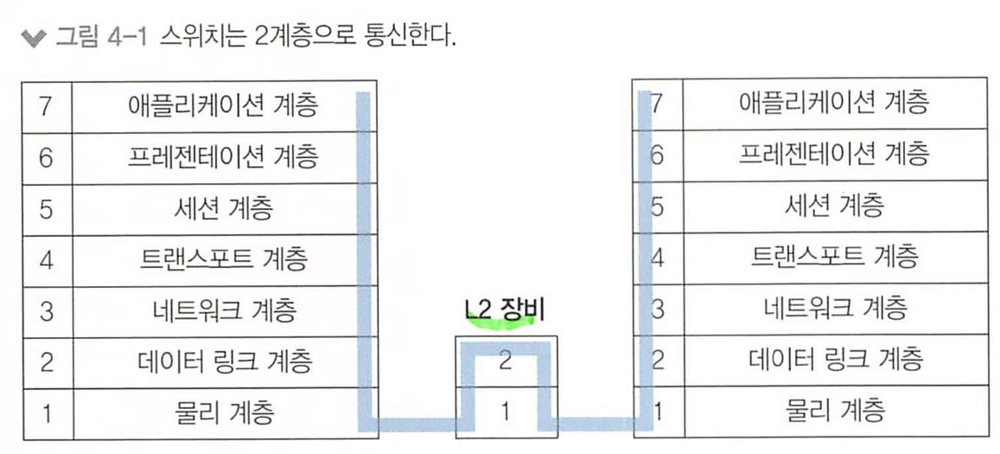

네트워크 스위치는 물리 포트에 연결된 디바이스가 보낸 패킷을 받아서 패킷이 도달하려는 다른 디바이스로 전달(Forward)한다

* 네트워크 스위치는 여러 대의 컴퓨터나 네트워크 장치들이 연결된 네트워크에서 데이터를 전송하고 수신하는 역할
* **네트워크의 중재자**

스위치는 MAC주소를 기반으로 패킷을 전달한다.

* 맥 주소 기반이기 때문에 패킷이 동일한 네트워크 안에 있는 다른 장치로 전송되는 경우에도 해당 장치만이 패킷을 받을 수 있다. 

또한, VLAN 기능(한 대의 장비에서 논리적으로 네트워크를 분리할 수 있는 기능)과 STP(스패닝 트리 프로토콜, 네트워크 루프 방지)와 같은 기능을 기본적으로 가지고있다.

> 패킷? 프레임
>
> 각 계층에서 헤더와 데이터를 합친 부분을 PDU(Protocol Data Unit) 이라고 한다.
>
> 1계층 PDU : 비트
>
> 2계층 : 프레임
>
> 3계층 : 패킷
>
> 4계층 세그먼트 
>
>  5 6 7 : 데이터

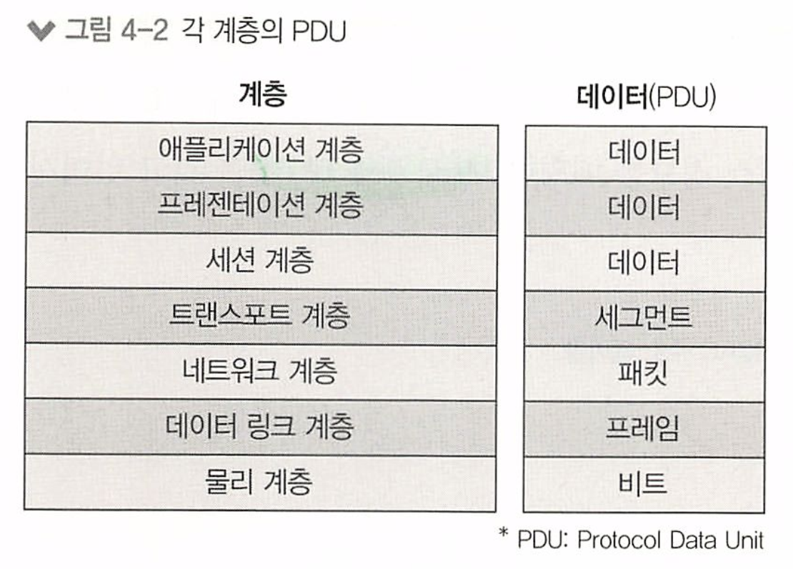

# 4.1 스위치 장비 동작

스위치가 없던 오래된 이더넷 네트워크에서 는 패킷을 전송할 때 서로 경합해 그로 인한 네트워크 성능 저하가 컸는데, 이런 경쟁을 없애고 패킷을 동시에 여러 장비가 서로 간섭 없이 통신하도록 도와줌으로써. 여러 단말이 한꺼번에 통신할 수 있어 통신하기 위해 기다리거나 충돌 때문에 대기하는 문제가 해결되고 네트워크 전체의 통신 효율성이 향상되었다.

> 스위치의 핵심 역할은 누가 어느 위치에 있는지 파악하고 패킷을 정확히 전송하는 것이다 

스위치가 2계층 맥주소를 이해하고 MAC 주소 테이블을 고 있어서 가능한 일이다.

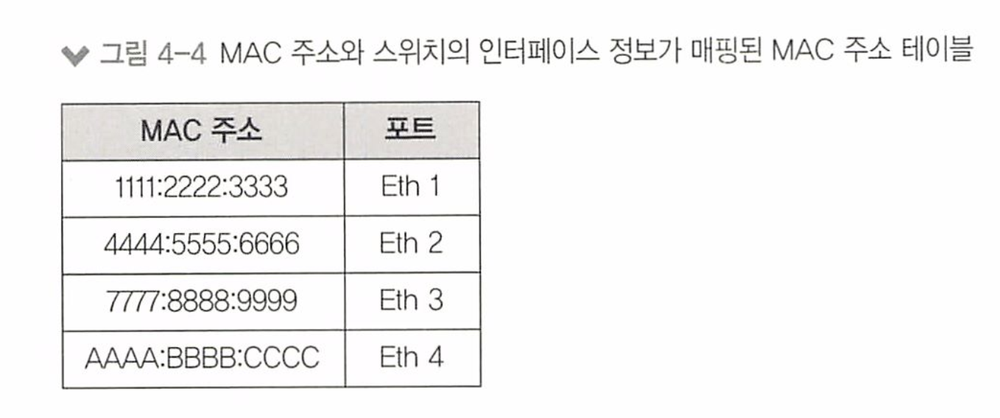

스위치는 전송하려는 패킷의 헤더 안에 있는 2계층 목적지 주소를 확인하고 MAC주소 테이블에서 해당 주소가 어느 포트에 있는지 확인하고 해당 포트로만 패킷을 전송한다.

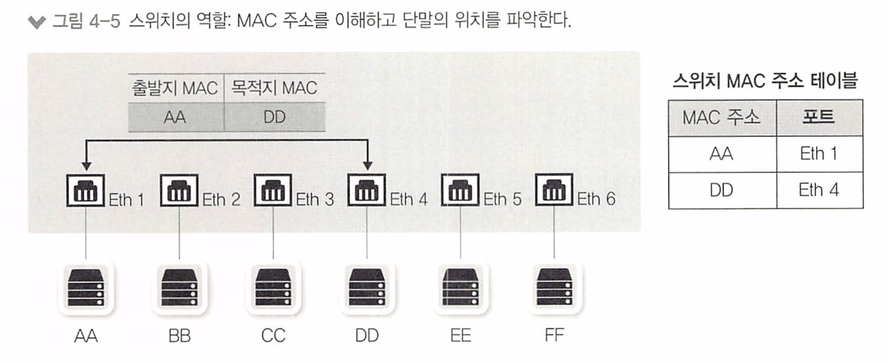

패킷의 도착지 주소가 맥 주소 테이블에 있으면 해당 주소가 매핑된 포트로만 패킷을 전송하고 다른 포트로는 전송하지 않는다.

이 동작 방식을 다음3가지로 정리한다

1. 플러딩(Flooding)
2. 어드레스 러닝(Address Learning)
3. 포워딩 / 필터링 (Forwarding / Filtering)

> 이 세가지 를 이용해서 동작한다. 

## 4.1.1 플러딩 (Flooding)

스위치는 처음 부팅하면 네트워크 관련 정보가 아무 것도 없어 네트워크 통신을 중재하는 자신의 역할을 하지 못하고 허브처럼 동작한다.

* 허브는 데이터를 받으면 그 데이터를 연결된 모든 포트 또는 장치로 데이터를 중계하여 전송한다. 

**플러딩**이란, 이렇게 스위치가 특정 맥 주소의 포트에만 전송하는 것이 아닌, 허브와 같이 모든 포트로 패킷을 전송하는 것을 의미한다. 

* 스위치가 목적지 주소를 알지 못하는 경우에 사용

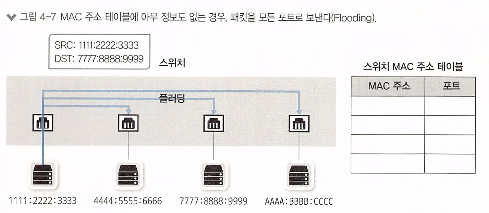

스위치는 패킷이 들어오면 도착지 맥 주소를 확인하고, 자신이 갖고있는 MAC 주소 테이블에 해당 MAC 주소를 확인하여 전송하는데,

없으므로 연결된 모든 포트 또는 장치로 전송하는 것이다.

이 이유는, 스위치는 LAN에서 동작하므로 자신이 정보를 갖고있지 않더라도 어딘가에 있는 다른 장비가 있을 수 있다고 가정하고 보내는 것이다. 

즉 네트워크 목적지 주소를 모르는 경우에 동작한다. 

이렇게 진행되다가, 패킷이 스위치에 들어오면 해당 패킷 정보의 MAC 주소를 보고 이를 학습해 MAC 주소 테이블을 만든 후 이를 통해 패킷을 전송한다.

**비 정상적인 플러딩**

스위치를 사용하면 필요한 곳에만 패킷을 포워딩(forward)하므로 주변 통신을 가로채기 힘들어 보안에 도움이 된다. 

공격자들은 스위치하게 엉뚱한(이상있는) MAC 주소를 습득시키거나 MAC 테이블을 꽉 차게 해 스위치의 플러딩 동작을 유발하는  **MAC 주소 스푸핑** 기법을 이용해 공격한다.

이 외에도 ARP 포이즈닝(Poisoning) 기법을 이용해 모니터링해야 할 IP의 MAC 주소를 공격자 자신인것처럼 속여 원하는 통신을 가로채기도 한다. 

## 4.1.2 어드레스 러닝(Address Learning)

어드레스 러닝 : 스위치가 MAC 주소 테이블을 만들고 유지하는 과정

* MAC 주소 테이블은 어느 위치(포트)에 어떤 장비(MAC 주소)가 연결되었는지에 대한 정보가 저장되어 있는 임시 테이블

어드레스 러닝은 패킷의 **출발지 MAC 주소 정보**를 이용한다.

1. 패킷이 특정 포트에 들어오면 스위치에 해당 패킷의 출발지 MAC 주소와 포트번호를 MAC 주소 테이블에 기록한다.

2. 1번 포트에서 들어온 패킷의 출발지 MAC 주소가 AAAA 라면 1번 포트에 AAAA MAC 주소를 가진 장비가 연결되었다고 추론하여 정보를 습득한다.

3. 이 과정을 반복하다. 

어드레스 러닝은 출발지의 MAC 주소 정보를 사용하므로 브로드캐스트나 멀티캐스트에 대한 MAC 주소를 학습할 수 없다. 

* 두 가지 모두 목적지 MAC 주소 필드에서만 사용하기 때문.
* 브로드캐스트와 멀티캐스트 패킷은 **목적지 주소 필드에 특정 값**이 사용되므로 스위치는 이러한 패킷을 통해 출발지 MAC 주소를 학습하지 않는다.
  * 브로드 캐스트의 경우 : 6바이트로 구성된 모든 비트가 1로 설정된 값인 "FF:FF:FF:FF:FF:FF" 같은 값. **기본 게이트웨이**.
  * 멀티캐스트의 경우 : 멀티캐스트 주소는 01:00:5E로 시작하는 3바이트로 구성된 값. 나머지 3바이트는 멀티캐스트 그룹 식별자
  * 이렇게 브로드캐스트와 멀티캐스트 패킷은 목적지 MAC 주소 필드에 특정 값이 사용되어 네트워크 상의 모든 장치 또는 특정 그룹의 멤버에게 패킷을 전송
* **브로드캐스트와 멀티캐스트 패킷은 네트워크에 있는 모든 장치에게 동시에 전송되어야 하기 때문에, 스위치가 출발지 MAC 주소를 학습하면 패킷을 올바르게 전달할 수 없게 되기 때문**

 스위치가 사전에 미리 정의된 MAC 주소 정보를 가지고 있는데, 이 주소들은 대부분 스위치 간 통신을 위해 사용되는 주소dㅣ다.

* 스위치에서 MAC 주소 테이블을 보기 위해서는 show mac address-table 명령어를 사용한다

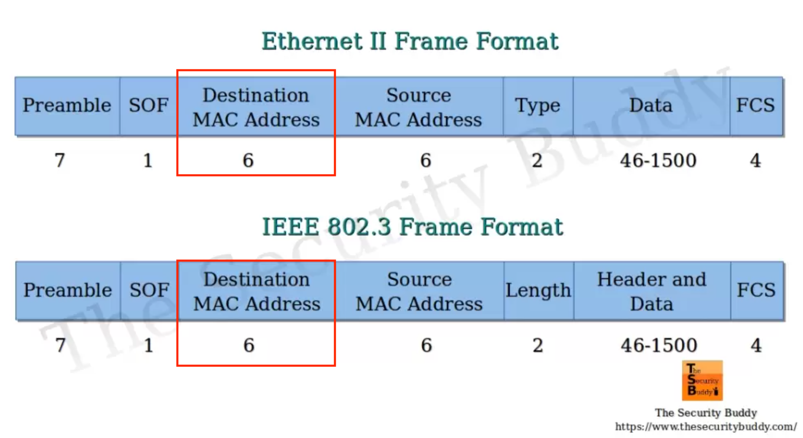

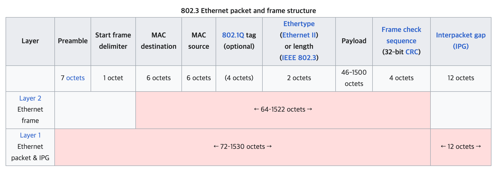

이더넷 프레임의 내부 구조는 IEEE 802.3에 규정되어 있다

d일반적으로 이더넷 프레임은 목적지 MAC 주소, 출발지 MAC 주소, 유형/길이, 데이터 및 CRC 등의 필드를 포함하는 구조

* 출발지 맥 주소 : MAC Source
* 목적지 맥 주소 : MAC Destination

* "Octet"은 8 비트로 구성된 데이터 단위 = 1Byte 
  * 네트워크 프로토콜에서 데이터 단위를 나타낼 때 "octet"이라는 용어를 사용
* "MAC destination이 6 octets"는 "MAC 목적지 주소가 6바이트(48비트)"를 의미

즉, 물리 계층에서 전송된 비트들을, 데이터 링크 계층에서 NIC가 물리적인 연결로부터 비트 스트림을 만들어 비트들을 그룹화하여 프레임을 만든다. 이 프레임이 이더넷 프레임이며 패킷이 이것을 한번 감싼 구조이다

패킷은 특정 프로토콜에서 정의된 헤더와 데이터로 구성되어 있다. 패킷은 일반적으로 프레임 안에 포함되는 데이터의 단위로 간주된다. 

* EtherType은 이더넷 프레임의 헤더에 있는 필드로, 해당 프레임의 **상위 계층 프로토콜**을 식별하는 값이다. 이 값으로 프로토콜을 구분할 수 있다.
  * 예를 들어, IPv4 패킷은 EtherType 값으로 0x0800을 사용하고, IPv6 패킷은 0x86DD를 사용

* https://en.wikipedia.org/wiki/Ethernet_frame

## 4.1.3 포워딩 / 필터링

스위치의 동작은 다음과 같다

패킷이 스위치에들어온 경우 도착지 MAC 주소를 확인하고 MAC 테이블과 비교해 맞는 정보가 있으면 패킷을 전송한다

해당 포트로 패킷을 전송하는 것을 **포워딩(패킷 포워딩)** 이라 하고, 다른 포트로는 보내지 않는것을 **필터링** 이라고 한다.

**포워딩과** **필터링을** 통해 목적지로만 패킷을 전달시키는 것이다.

* 스위치에서는 포워딩과 필터링 작업이 여러 포트에서 동시에 수행될 수 있다.
* 통신이 다른 포트에 영향을 미치지 않는다.

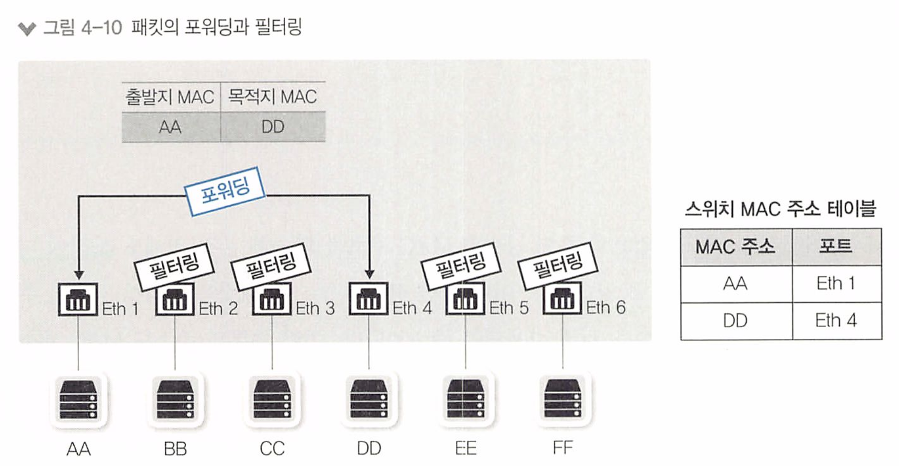

일반적인 **유니캐스트** 에 대해서만 포워딩과 필터링 작업을 수행한다.

BUM 트래픽은 조금 다르게 동작한다.

* 브로드 캐스트
* 언노운 유니캐스트
* 멀티캐스트

브로드, 멀티 캐스트 두 가지 모두 목적지 MAC 주소 만 사용하기 때문에 이런 트래픽은 모두 플러딩 한다.

* 언노운 유니캐스트도 맥 주소 테이블에 없는 주소이다.

**LAN에서의 ARP - 스위치 동작**

이더넷 - TCP/IP 네트워크에서는 스위치가 유니캐스트를 플러딩 하는 경우는 거의 없다 - **중요**

* 유니캐스트 : 특정 목적지를 가진 단일 호스트 간의 통신

패키을 만들기 전에 통신해야 하는 단말의 MAC 주소를 알아내기 위해 ARP 브로드캐스트가 먼저 수행되어야 하므로 ARP 브로드 캐스트가 먼저 전달되기 때문이다.

이 ARP를 이용한 MAC 주소 습득 과정에서 이미 스위치는 출발지와 목적지의 MAC주소를 습득하여, 실제 유니캐스트 통신이 시작되면 이미 만들어진 MAC 주소 테이블로  패킷을 전송(포워딩 / 필터링)한다.

ARP와 MAC 테이블이 일정시간동안 지워지지 않는것을 **Aging Time** 이라고 한다.

* 일반적으로 MAC 테이블의 에이징 타임이 단말의 ARP 에이징 타임보다 길어 플러딩 없이 효율적으로 운영할 수 있다.

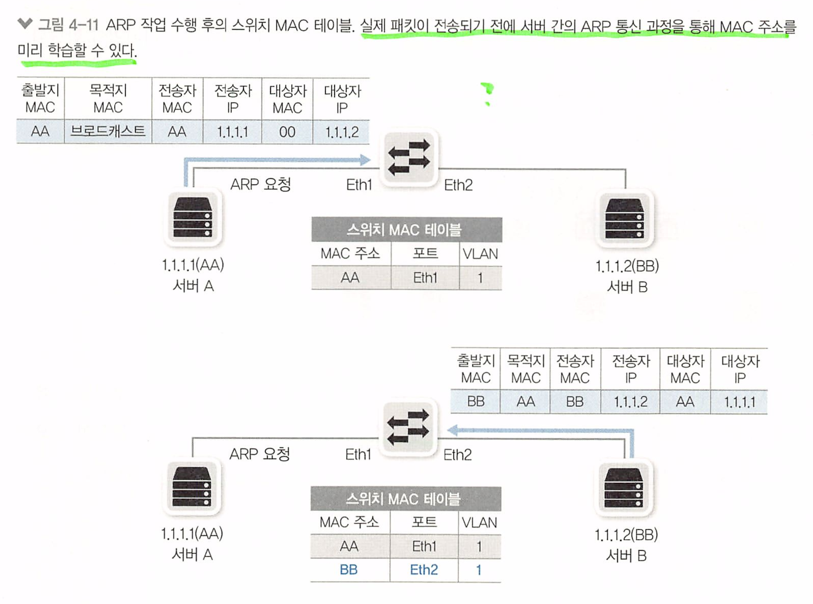

# 4.2 VLAN

VLAN (Virtual Local Area Network) : 하나의 물리 스위치에서 여러 개의 네트워크를 나누어 사용할 수 있게 도와주는 기술

* 물리적으로 분리된 네트워크 장치들을 논리적으로 그룹화하여 하나의 네트워크처럼 동작하도록 하는 네트워크 관리 기술

> 가상화 기술 

## 4.2.1 VLAN 이란?

물리적 배치와 상관 없이 LAN을 논리적으로 분할, 구성하는 기술

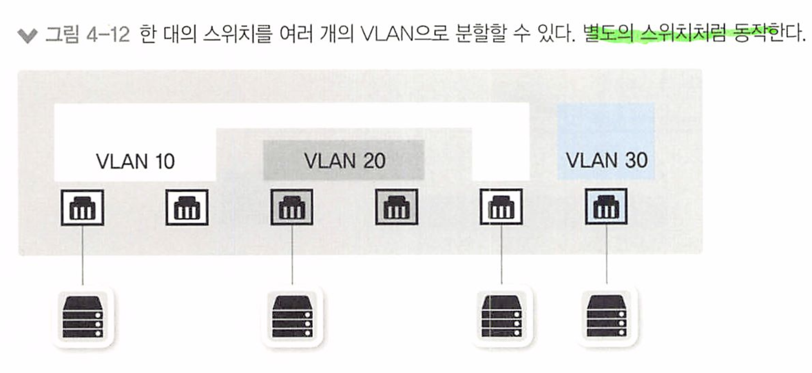

과도한 브로드캐스트로 인한 단말들의 성능 저하, 보안 향상 을 위한 차단 용도, 서비스 성격에 따른 정책 적용과 같은 이유로 네트워크가 분리되어야 한다.

네트워크가 왜 분리되어야 할까?

1. 성능 저하 방지: 하나의 네트워크에 많은 수의 단말이 연결되어 있을 때, 브로드캐스트 트래픽이 과도하게 발생할 수 있다. VLAN을 사용하면 브로드캐스트 트래픽을 VLAN 단위로 분리하여 제한할 수 있다. 각 VLAN은 독립적으로 동작하므로, 브로드캐스트는 해당 VLAN 내에서만 전파되어 다른 VLAN에는 영향을 미치지 않는다
   * 브로드캐스트는 네트워크에 연결된 모든 단말에게 전송되므로 , 네트워크 대역폭을 소비하고 단말의 성능을 저하시킬 수 있다
2. 보안 향상: VLAN을 사용하면 네트워크를 논리적으로 분리하여 그룹화하고, 각 VLAN은 서로 다른 보안 정책을 적용할 수 있으며, 한 VLAN의 호스트는 다른 VLAN의 호스트와 직접적인 통신을 할 수 없다. 
   * 이는 외부에서의 침입을 제한하고, 중요한 데이터와 시스템을 보호하는 데 도움을 준다.
3. 정책 적용: VLAN은 서비스 성격에 따라 정책을 적용하는 데 유용하다. 
   * 예를 들어, 회사 내에서 부서별로 VLAN을 구성하면 각 부서별로 특정 서비스에 대한 액세스 권한을 제어하여 외부 사용자가 내부 리소스에 직접 액세스하는 것을 제한할 수 있다. 

  

VLAN을 나누면 하나의 장비를 서로 다른 네트워크를 갖도록 논리적으로 분할한 것이므로 유니, 브로드 캐스트도 VLAN간에 통신할 수 없다.

* 서로 다른 네트워크로 구분되기 때문이다.

때문에 3계층 장비(L3)가 필요하다. 

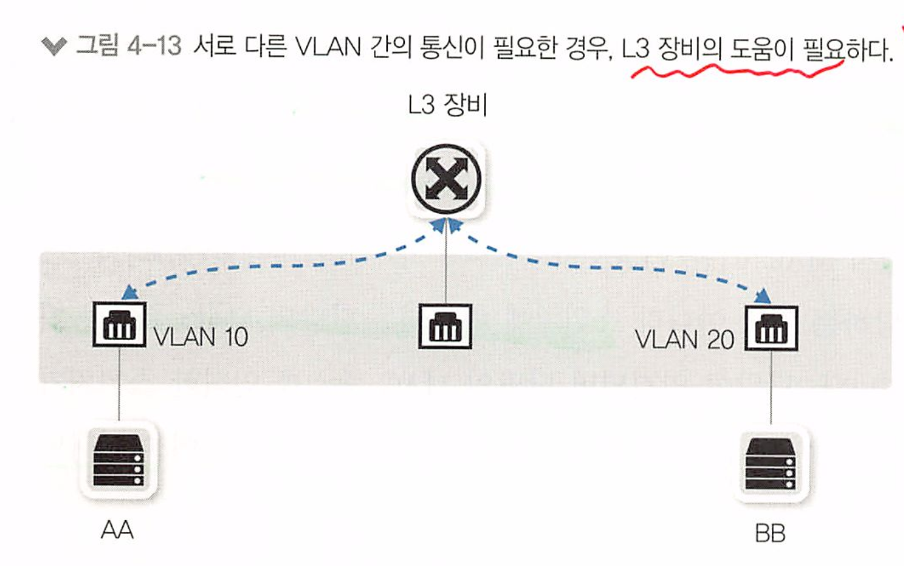

> L3 장비는 라우터 또는 L3 스위치이다
>
> * 라우터는 네트워크 간의 경계에 위치하여 패킷의 출발지와 목적지 IP 주소를 확인하여 최적의 경로를 결정하고 패킷을 전달하는 역할
> * L3 스위치는 스위치와 라우터의 기능을 결합한 장비로, 주로 로컬 네트워크에서 VLAN 간의 통신을 관리하는 데 사용

## 4.2.2 VLAN의 종류와 특징

VLAN의 할당 방식에는 포트 기반의 VLAN과 맥 주소 기반의 VLAN이 있다.

> VLAN은 스위치가 할당한다 

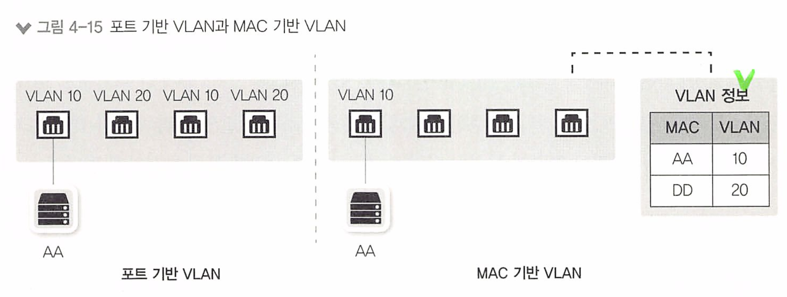

**포트 기반 VLAN** :  스위치의 포트를 기준으로 VLAN을 설정하는 방식

* 각 포트를 특정 VLAN에 연결함으로써 해당 포트에 연결된 단말들은 해당 VLAN에 속하게 된다

* 스위치를 논리적으로 분할해 사용하는 것이 목적
  * **스위치**는 **네트워크 회선과 서버 컴퓨터를 연결**하는 **네트워크 장비**이며 필요로 하는 해당 포트로만 전달한다. 

**MAC 기반 VLAN** : 스위치에 고정 포트에 VLAN을 할당하는 것이 아닌, 스위치에 연결되는 호스트 단말의 MAC 주소를 기반으로 할당하는 방식

* 각 호스트의 맥 주소를 기반으로 VLAN을 지정함으로써 호스트마다 VLAN에 속하게된다
* 사용자들의 자리 이동이 많아지면서 개발되었다.
* 단말이 연결되면 단말의 MAC 주를 인식한 스위치가 해당 포트를 지정된 VLAN으로 변경된다 
* Dynamic VLAN 이라고도 부른다

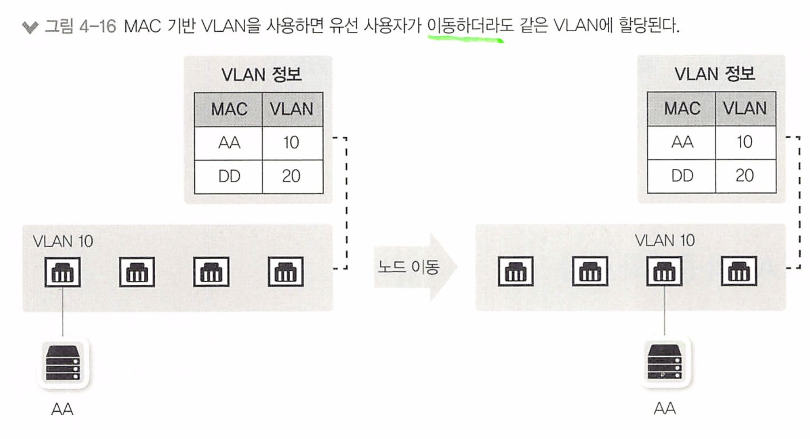

포트 기반 VLAN으로 설정된 스위치에서 VLAN 선정 기준은 스위치 **포트다**.

* 포트 기반 VLAN에서는 할당하는 기준이 포트이므로 AA PC가 1번 포트에 연결하면 VLAN10에 속하고 4번 포트에 연결하면 VLAN 20에 속한다.

* MAC 기반 VLAN 에서는 할당하는 기준이 PC의 MAC 주소

> 지금부터는 포트 기반 VLAN을 주로 다루면서 이야기한다

## 4.2.3 VLAN 모드 (Trunk / Access) 동작 방식

 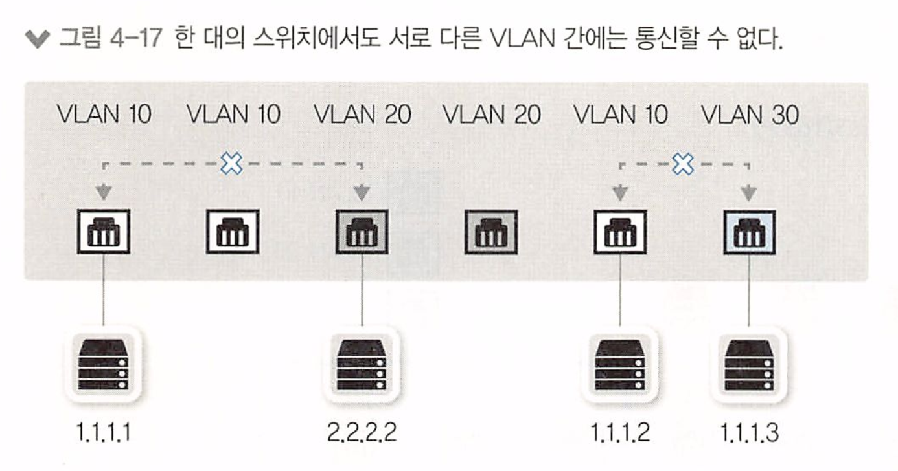

포트기반 VLAN에서는 한 대의 스위치에 연결되더라도 서로 다른 VLAN이 설정된 포트 간에는 통신할 수 없다.

* VLAN이 다르면 별도의 분리된 스위치에 연결된것과 같이 동작한다.

결국 VLAN 분리는 다수의 논리적인 스위치를 만드는 효과가 있다.

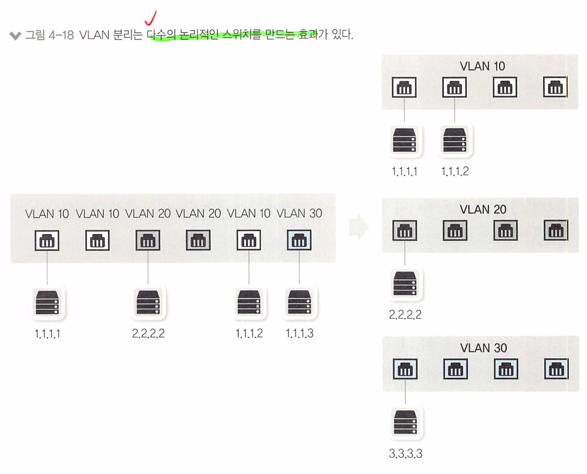

여러 개의 VLAN이 존재하는 상황에서 스위치를 서로 연결해야 하는 경우에는 각 VLAN끼리 통신하려면 VLAN 개수만큼 포트를 연결해야 한다.

스위치간 통신을 위한 포트를 추가로 연결해야 하는 것이다. 

예를들어, 그림처럼 3개의 VLAN(10, 20, 30)이 구성되어 있는 경우 각 VLAN이 스위치에 통신하려면 3개의 포트가 필요하다 

그런데, 이렇게 VLAN별로 포트를 연결하면 많은 포트가 낭비되므로 VLAN 태그 기능을 이용하여 해결할 수 있다.

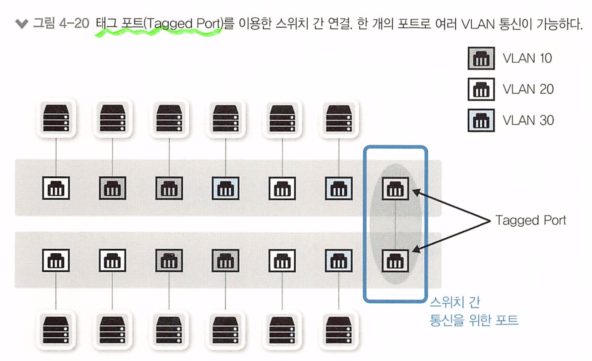

하나의 포트에 여러개의 VLAN을 함께 전송하는데, 이 하나의 포트를 Tagged 포트 또는 Trunk 포트라고 한다.

* 이더넷 프레임 중간에 VLAN ID 필드를 끼워 넣어 이 정보를 이용한다. 
* 수신측에서는 VLAN ID를 제거하면서 해당 VLAN으로 패킷을 전송한다.

그리고 MAC 주소 테이블에도 다른 VLAN끼리 통신하지 못하도록 VLAN을 지정하는 필드가 추가된다.

* 즉, 하나의 스위치에서 VLAN을 이용해 네트워크를 분리하면 VLAN별로 MAC 주소 테이블이 존재하는 것처럼 동작

  

일반적인 포트는 Untagged 포트 또는 Access 포트라고 한다. 

즉 Tagged 포트는 여러 네트워크가 동시에 설정된 스위치간의 연결되서 사용

하나의 네트워크에 속한 서버의 경우에는 Untagged(access)로 설정한다.

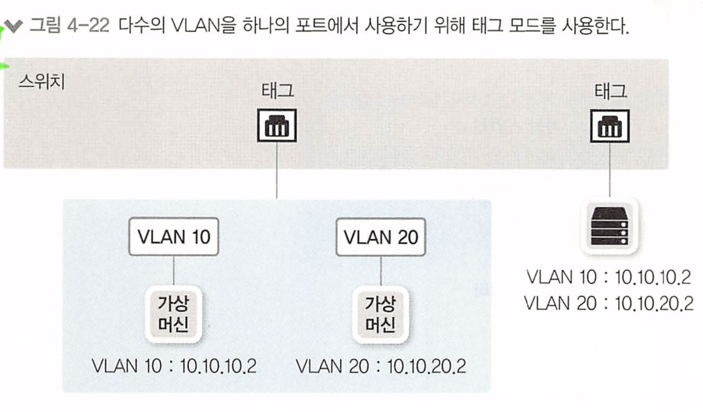

언태그 포트로 패킷이 들어올 경우 같은 VLAN으로''만'' 패킷을 전송하는데, 이는 같은 네트워크에서만 쓰이기 때문이다

태그 포트로 패킷이 들어올 경우, 다른 VLAN으로 패킷을 전송해야 하므로 태그를 벗겨내면서 태그된 VLAN쪽으로 패킷을 전송한다.

 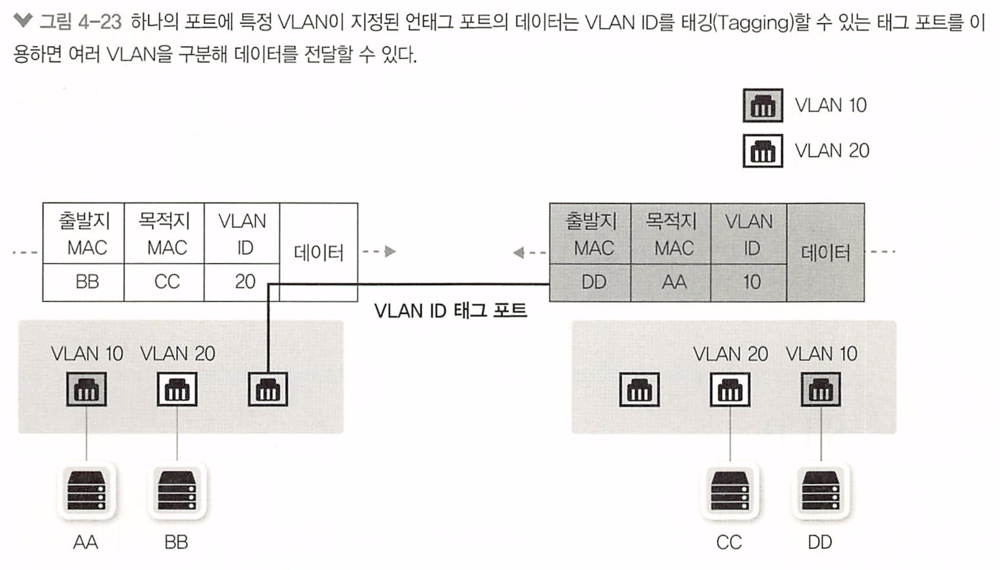

> VLAN간 통신
>
>
> VLAN은 스위치 통신을 분할하는 기능 때문에 유니, 멀티, 브로드 캐스트 모두 다른 VLAN으로 넘어가지 못한다
> VLAN이 다르다는 것은 별도의 네트워크로 분할한것이므로 네트워크가 다르고 IP 주소 할당도 다르기 때문이다. 

# 4.3 STP

STP(스패닝 트리 프로토콜, Spanning Tree Protocol)은 네트워크에서 루프(Loop)를 방지하고 높은 가용성과 안정성을 유지하기 위한 프로토콜 

  

SPof(Single Point of Failure: 단일 장애점)으로 인한 장애를 피하기 위해 다양한 노력이 필요하다.

* 하나의 요소때문에 장애가 발생한 경우 전체 시스템에 장애가 발생하는 지점인데, 이 장애 전파로 인해 전체 시스템이 마비되는건 막아야 한다. 안정성과 가용성을 위협하는 요소이기 때문이다

네트워크에서도 하나의 장비 고장으로 전체 네트워크가 마비되는 것을 막기 위해 이중화, 다중화된 네트워크를 구성한다.

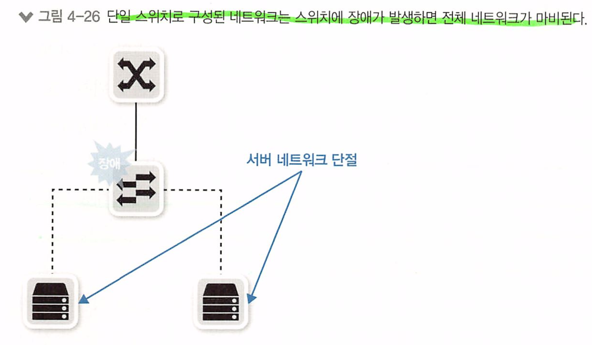

이런 SPoF를 피하기 위해 스위치 두대로 네트워크를 디자인 해도, 패킷이 네트워크를 따라 계속 전송되므로 네트워크를 마비시킬 수 있다.

* 싱글 스위치로 인해 장애가 생겨 전송이 안되서 다중 스위치로 전송 시키는데 왜 마비 시키는거지?
* 아래에 설명이 나와있다. 

이런 상황을 네트워크 루프라고 한다. 

## 4.3.1 루프란?

루프 : 네트워크에 연결된 모양이 고리처럼 되돌아 오는 형태로 구성된 상황 

* 목적지로 가지 못하고 빙빙 도므로 네트워크가 마비된다

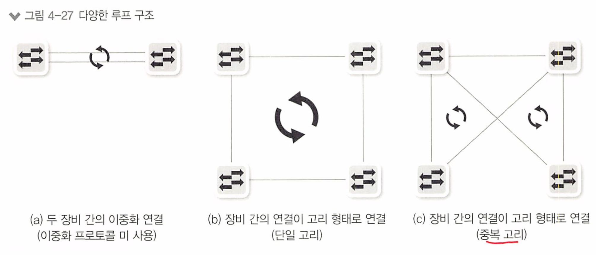

* 3가지 큰 이유가 있지만, 루프로 문제가 발생했다면 대부분 `브로드캐스트 Storm`으로 인한 문제이다

### 브로드캐스트 스톰 (Broadcast storm)

브로드캐스트 스톰 : 루프 구조로 연결된 네트워크에서, 브로드 캐스트가 발생하면 스위치는 이 패킷을 모든 포트로 플러딩 하는데, 각 포트의 스위치가 계속 플러딩해서 반복되어 부하를 일으키는 문제

* 플러딩 : 홍수. 모든 포트로 패킷을 흘리는 동작을 의미

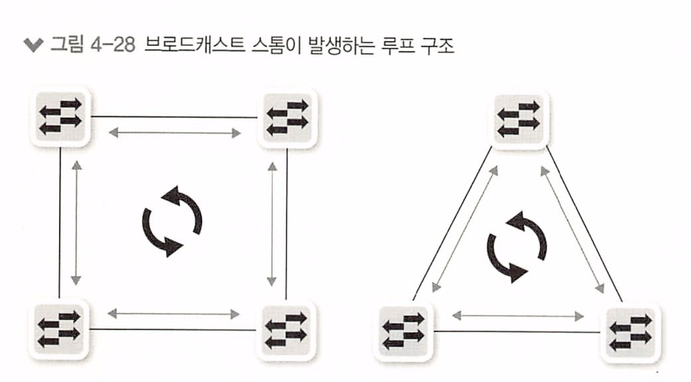

3계층(네트워크) 헤더에는 TTL(TIme To Live)라는 패킷 수명을 갖고 있지만, 2계층 헤더에는 이런 라이프타임 매커니즘이 없어 루프가 발생하면 패킷이 죽지않고 살아남아 패킷 하나가 전체 네트워크 대역폭을 차지할 수 있다

브로드 캐스트 스톰이 발생하면

1. 네트워크 접속된 단말의 속도가 느려진다(많은 브로드캐스트를 처리해야 하므로  CPU 사용률이 높아짐)
2. 거의 통신 불가능 수준으로 네트워크 접속 속도가 느려진다
3. 네트워크에 설치된 스위치의 모든 LED들이 동시에 빠른 속도로 깜빡인다.

> 케이블을 제거하기 전까지 계속 반복된다. 그래서 루프이다

#### 스위치 MAC 러닝 중복 문제 

루프 구조 상태의 네트워크에서는 브로드 캐스트뿐만이 아니라 유니캐스트도 문제를 일으킨다

* 유니캐스트는 정보를 전송하기 위한 프레임에 자신의 MAC 주소와 목적지의 MAC 주소를 첨부하여 전송하는 방식. 타겟으로만 보냄

같은 패킷이 루프를 돌아 도착지 쪽에서 중복 수신되는 혼란을 일으키기도 한다.

루프를 돌다보니 스위치는 MAC 주소를 학습하는데, 직접 전달되는 패킷과 스위치를 돌아 들어간 패킷간의 포트가 달라 MAC 주소를 정상적으로 학습할 수 없다.  

**MAC 주소 플래핑 현상(Mac Address Flapping)** : 동일한 MAC 주소가 여러 포트에서 학습되어 MAC 테이블이 반복 갱신되어 정상적으로 동작하지 않는 현상. 스위치는 하나의 MAC 주소에 대해 하나의 포트만 학습할 수 있다.

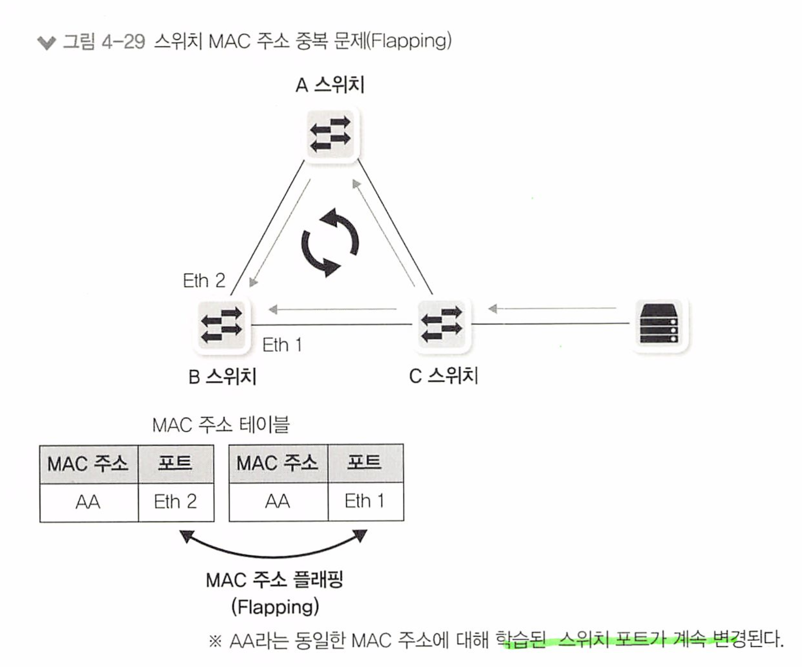

* AA 출발한 패킷이 스위치 C에서 A와 B에 전달된다
* 스위치는 A는 이 패킷을 다시 포워딩에 B 스위치로 전달한다.
* 스위치 C는 동일한 출발지 AA를 가진 패킷이 스위치 C를 통해 eth1로, 스위치 A를 통해 eh2로 전달된다

이 현상을 예방하기 위해 스위치 설정에 따라 Warning 메시지를 관리자에게 알려주거나 수시로 일어나는 플래핑 현상을 학습하지 않도록 자동으로 조치한다.

다른 네트워크 조치로는

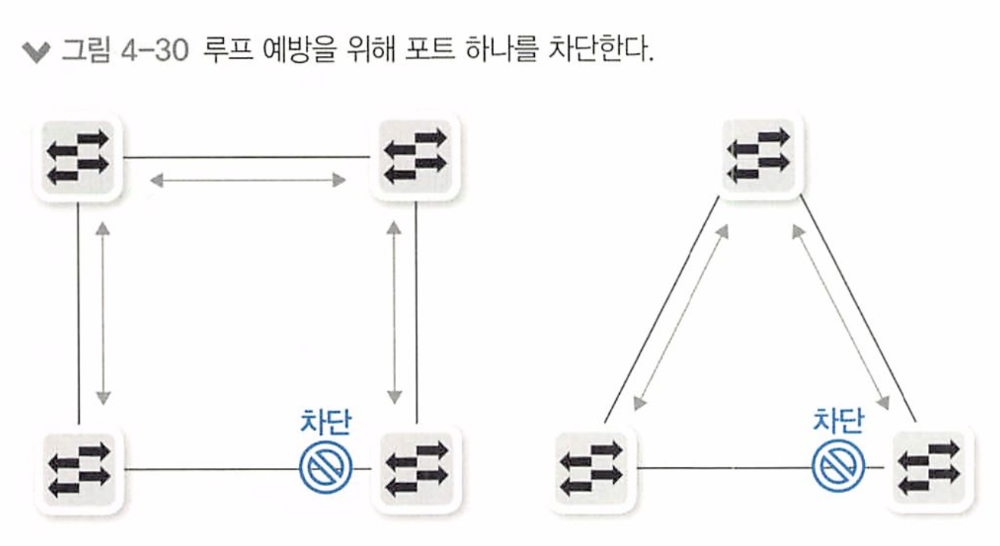

루프 구성 포트중 하나의 포트만 사용하지 못하도록 셧다운 되도록 하여 루프를 예방한다. 

하지만, 이방법도 마땅한 해결책이 아니여서 루프를 자동 감지해 포트를 차단하고 장애 때문에 우회로가 없을 때 차단된 포트를 스위치 스스로 풀어주는 스패닝 트리 프로토콜이 개발되었다.

* 네트워크 관리자가 적극적으로 개입하여 언제 장애에 대응하는가? 복잡한 루프를 어떻게 찾아낼껀데?

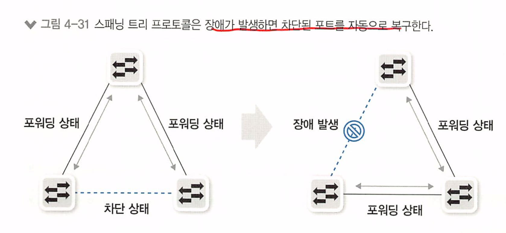

## 4.3.2 STP란?

Spanning Tree Protocol : 루프를 확인하고 적절히 포트를 사용하지 못하게 만들어 루프를 예방하는 방식

STP를 이용해 루프를 예방하려면 전체 스위치 연결 방식을 알아야 하는데, 이를 위해 BPDU(Bridge Procol Data Unit)라는 프로토콜을 통해 스위치간에 정보를 전달하여 네트워크 트리를 만들어 루프 구간을 확인한다.

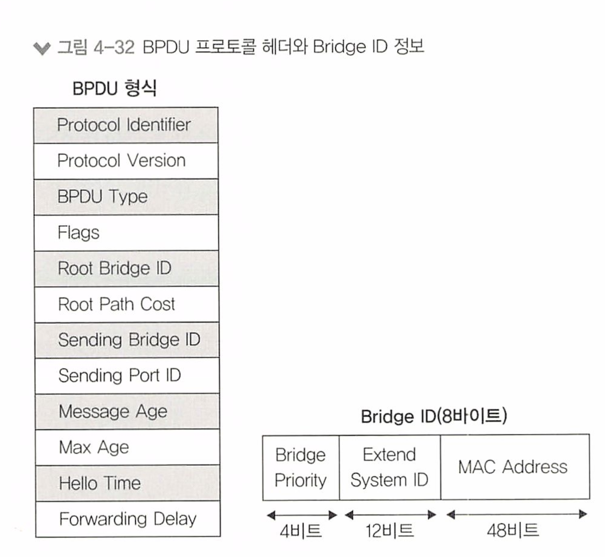

* BPDU에는 스위치가 갖고있는 ID와 비슷한 **고유 값**이 들어가서 스위치간 서로 상호전달하여 루프 파악이 가능해진다. 

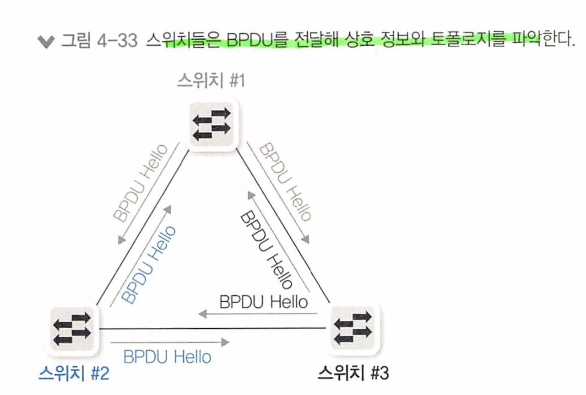

### 4.3.2.1 스위치 포트의 상태 및 변경 과정

STP가 동작중인 스위치에서 루프를 막기 위해 스위치 포트에 신규 스위치가 연결되면 바로 트래픽이 흐르지 않도록 차단한다.

그리고 트래픽이 흐리기전 BPDU를 기다려 학습하고 구조를 파악한 후 트래픽을 전송하거나 루프구조인 경우 차단한다.

차단 상태에서 트래픽이 흐를떄까지 스위치 포트의 상태는 다음 4가지로 구분할 수 있다

* Blocking
  * 패킷데이터를 차단한 상태로 상대방이 보내는 BPDU를 기다림
  * 총 20초인 MAX Age 기간 동안 상대방 스위치에서 BPDU를 받지 못했꺼나 후순위 BPDU를 받으면 포트는 리스닝 상태로 변경
  * BPDU 기본 교환주기는 2초이며 10번의 BPDU를 기다린다
* Listening
  * 해당 포트가 전송 상태로 변경되는 것을 결정하고 준비하는 단계. 자신의 BPDU 정보를 상대방한태 저농한다
  * 총 15초동안 대기한다
* Learning
  * 해당 포트를 포워딩하기로 결정하고 실제 패킷 포워딩이 일어날 때 스위치가 곧바로 동작하도록 MAC를 학습하는 단계
  * 총 15초동안 대기한다
* Forwarding
  * 패킷을 포워딩하는 단계. 정상적 통신 상태

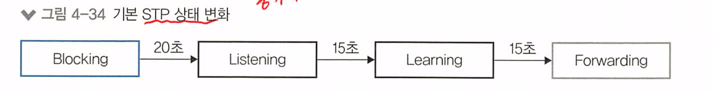

> 스위치에 신규로 장비를 붙이면 통신하는데 50여초가 소요된다.

### STP 동작 방식

STP는 루프를 없애기 위해 바텀업(뿌리에서 가지로)으로 네트워크 토폴로지를 구성한다.

뿌리가 되는 가장 높은 스위치를 통해 모든 BPDU가 교환되도록 하는데, 이 스위치가 루트 스위치이다.

* BPDU를 통해 2초마다 자신이 루트 스위치임을 광고하는데 새 스위치가 들어오면 서로 교환된 BPDU를 통해 브릿지 ID 값을 비교한다
* 브릿지 ID 값이 더적은 스위치이면 루트 스위치로 선정하고, 루트 스위치로 선정된 스위치가 BPDU를 다른 스위치쪽으로 보낸다

SPT는 루프를 예방하기 위해 다음과 같이 동작한다.

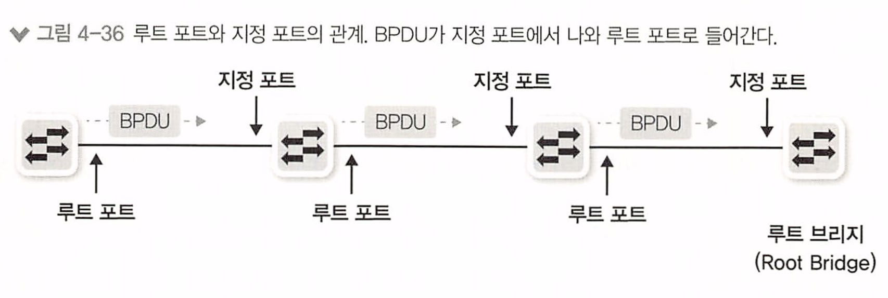

1. 하나의 루트(root) 스위치를 선정

   * 전체 네트워크에 하나의 루트 스위치를 선정

   * 자신을 전체 네트워크의 대표 스위치로 적은 BPDU를 옆 스위치로 전달

2. 루트가 아닌 스위치 중 하나의 루트 포트를 선정

   * 루트 브릿지로 가는, 경로가 가장 짧은 포트를 루트 포트라고 함

   * 루트 브릿지에서 보낸 BPDU를 받는 포트

3. 하나의 세그먼트에 하나의 지정(Designated) 포트를 선정

   * 스위치와 스위치가 연결되는 포트는 하나의 지정 포트(1esignated Pori)를 선정

   * 스위치 간의 연결에서 이미 루트 포트로 선정된 경우. 반대쪽이 지정 포트로 선정되어 양쪽 모두 포워딩 상태가 됌
   * 스위치 간의 연결에서 아무도 루트 포트가 아닐 경우, 한쪽은 지정 포트로 선정되고 다른 한쪽은 대체 포트(Alicrmate. Non-designatcd)가 되어 차단 상태가 된다
   * BPDU가 전달되는 포트.

## 4.3.3 향상된 STP(RSTP, MST)

SPT 에서 포워딩할때까지 시간이 너무 오래걸린다. 

이 문제를 해결하기 위해 향상된 STP가 나왔다.

#### RSTP

Rapid Spanning Tree Protocol : 경로를 활성화 하는데 2~3초로 절체 시간이 짧아 일반적인 TCP 기반 애플리케이션이 세션을 유지할 수 있게 한다.

STP와 달리, 토폴로지(구성)가 변경될 때, 자신이 직접 모든 네트워크에 토폴로지 변경을 직접 전파한다.

RSTP는 **다양한 BPDU 메시지**, **대체 포트 개념**, **토폴로지 변경 전달 방식의 변화**로 

 일반 STP보 다 빠른 시간 내에 토폴로지 변경을 감지. 복구할 수 있다. 

* 실제로 RSTP는 불과 2~3초 안에 장애 복구가 가능하므로 장애가 발생해 경로가 절체되더라도 애플리케이션 세션이 끊기지 않는다.

#### MST(Multiple Spanning Tree)

MST를 알기 전 CST와 PVST를 알아보자.

* CST (Common Spanning Tree) : 일반 스패닝 포로토콜. 스패닝 트리 한개만 동작하며, 한개의 포트와 회선만 활성화 됌
* PVST(Per Vlan Spanning Tree) : VLAN마다 다른 스패닝 트리 가 동작하여 VLAN마다 별도의 경로와 트리를 가짐 . 때문에 최적의 경로와 LVAN마다 다른 경로를 이용하여 셰어링 할 수 있는 장점이 있따. 그런데, STP 자체가 스위치에 많은 부담을 주는데, 트리가 많아지므로 부담이 더 강해졌다.  
  * VLAN이 100개면 트리도 100개. 

CST와 PVST의 단점을 극복하기 위해 개발되었다.

여러 개의 VLAN을 그룹으로 묶고 그룹마다 별도의 스패닝 트리와 동작한다. PVST보다 훨씬 적은 STP 프로세스가 돌게 되었다.

* 1 ~ 50 VLAN그룹의 트리 1개, 51~100의 트리 1개 = 총 2개

### 스위치의 구조와 스위치에 IP 주소가 할당된 이유

스위치는 스위치 관리용 컨트롤 플레인(Control Plane)과 패킷을 포워딩하는 데이터 플레인(Data Planc)으로 크게 나뉜다. 

* 앞에서 설명한 STP나 스위치 원격관리용 텔넷. SSH, 웹과 같은 서비스는 컨트롤 플레인에서 수행된다.

스위치는 2계층에서 동작하는 장비어서 MAC 주소만 이해할 수 있습니다. 

사실, 스위치가 동작하는 데 IP는 필요없지만 일정 규모 이상의 네트워크에서 운영되는 스위치는 관리 목적으로 대부분 IP 주소 가 할당된다.
