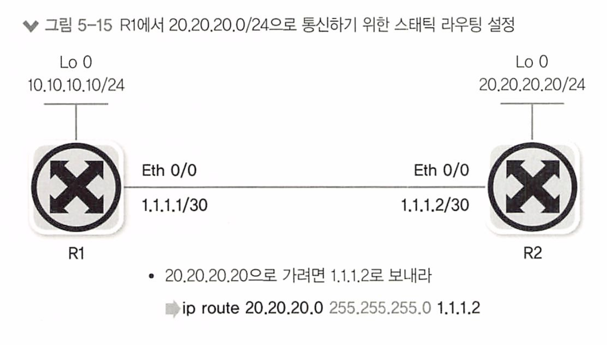

# 5장 라우터/ L3 스위치 : 3계층 장비

- 5.1 라우터의 동작 방식과 역할
- 5.2 경로 지정 - 라우팅/스위칭
- 5.3 라우팅 설정 방법

라우터는 3계층에서 동작하는 여러 네트워크 장비의 대표격으로 이름처럼 경로를 지정해주는 장비. 

라우터에 들어오는 패킷의 목적지 IP 주소를 확인하고 자신이 가진 경로(route)를 활용해 패킷을 최적의 경로로 포워딩 한다.

현대 네트워크 환경에선 인터넷을 통해 다양한 서비스를 제공받기 때문에 인터넷 연결을위한 원격지 통신이 매우 중요한데, 라우터는 이러한 원격지 통신에서 필수적인 장비이다. 


**라우터? L3 스위치?** 

> 스위치는 대표적인 2계층 장비이다. 
>
> 하지만, 3계층에서 동작하는 L3 스위치라 부르는 장비들도 많이 사용되고있다. 
>
> 과거에는 라우터는 소프트웨어로 구현하고 스위치는 하드웨어로 구현하는 형태로 구분하거나 다양한 기능의 라우터와 패킷을 빨리 보내는데 최적화된 스위치로 구분했지만, 최근에는 기술의 발전으로 라우터와 L3 스위치를 구분하기 어렵다. 
>
> 그렇기에 이번 챕터에서 다루는 내용은 라우터를 설명하지만 L3 스위치로도 모두 동일하게 적용된다.


# 5.1 라우터의 동작 방식과 역할

라우터의 동작 방식

1. 경로 지정: 다양한 경로수집 후 최적의 경로를 라우팅 테이블에 저장한 뒤 패킷이 들어오면 도착지 IP주소를 라우팅 테이블과 비교해 최선의 경로로 패킷을 내보낸다. 

2. 브로드캐스트 컨트롤: 들어온 패킷의 목적지 주소가 라우팅 테이블에 없으면 패킷을 버린다.

3. 프로토콜 변환: 패킷 포워딩 과정에서 기존 2계층 헤더 정보를 제거 후 새로운 2계층 헤더를 만든다.


## 경로 지정 - 5.1.1

라우터는 패킷이 들어오면 패킷의 도착지 IP주소를 확인해서 경로를 지정해 패킷을 포워딩해줘야 한다.

경로를 어떻게 지정할까?

IP주소는 네트워크 주소와 호스트 주소로 나뉜다. 

그렇기에 로컬 네트워크와 원격지 네트워크 구분이 가능하고 이 네트워크 주소를 기반으로 경로를 찾을 수 있다. 

라우터는 이 IP주소를 확인해 원격지에 있는 적절한 경로로 패킷을 포워딩한다. 

라우터가 `경로지정을 하기위해서는 우선 경로학습이 필요`한데 그 방법은 다음과 같다. 

* IP 주소를 입력하며 자연스럽게 인접 네트워크 정보를 얻는 방법

* 관리자가 직접 경로 정보를 입력하는 방법

* 라우터끼리 서로 경로 정보를 자동으로 교환하는 방법


## 브로드 캐스트 컨트롤(Broadcast Control)

스위치는 패킷의 도착지 주소를 모르면 모든 장비와의 통신을 위해 플러딩한다.

라우터는 패킷을 원격지로 보내는 것이 목표이기에 3계층에서 동작하고 분명한 도착지 정보가 있을때만 통신을 허락한다. 

* 라우터는 바로 연결되어 있는 네트워크 정보를 제외하고 경로 습득 설정을 하지 않으면 패킷을 포워딩 할 수 없다. 

* 라우터는 기본적으로 멀티캐스트 정보를 습득하지 않고 브로드캐스트 패킷을 전달하지 않는다. 
  * 이 기능을 이용해 브로드 캐스트가 다른 네트워크로 전파되는 것을 막을 수 있다.
  * 이 기능을 브로드캐스트 컨트롤/멀티캐스트 컨트롤이라 한다. 

* 네트워크에 브로드캐스트가 많이 발생하는 경우 라우터로 네트워크를 분리하면 브로드캐스트 네트워크를 분할해 네트워크 성능을 높힐 수 있다. 


# 5.2 경로 지정 - 라우팅 /스위치

라우터가 패킷을 처리할 때 다음 두가지를 수행한다.

* 경로 정보를 얻어 경로 정보를 정리하는 역할

* 정리된 경로 정보를 기반으로 패킷을 포워딩하는 역할

요즘에 들어서는 클래스리스(Classless) 네트워크로 전환된 후 같은 클래스에 있는 주소조차 `서브네팅으로` 분산되어 존재하기에 정보는 경로정보는 기존보다도 많아진 상황이다.  하지만 라우터는 이런 상황에서도 많은 경로 정보를 얻어 최적의 경로 정보인 라우팅 테이블을 유지해야 한다. 


라우터는 서브넷 단위로 라우팅 정보를 습득 후 라우팅 정보를 최적화하기 위해 서머리(Summary) 작업을 통해 여러 서브넷 정보를 뭉쳐 전달

라우팅 테이블과 정보가 정확히 일치(Exact Match)하지 않더라도 가장 목적지에 유사한 정보를 찾아 패킷을 포워딩한다. 


## 5.2.1 라우팅 동작과 라우팅 테이블

#### 홉-바이-홉(Hop-by-Hop)과 넥스트 홉(Next Hop)

현재 출발점(단말)부터 도착점(단말) 까지 모든 경로를 한 번에 이동하는게 아니다. 

인접한 라우터까지만 경로를 지정 후 인접 라우터에서 최적의 경로를 다시 파악해 라우터로 패킷을 포워딩한다. 

이처럼 네트워크를 한 단계씩 뛰어넘는다는 의미로 홉-바이-홉(Hop-by-Hop)라우팅이라 부르고,

 이 때 `인접한 라우터를 넥스트 홉(Next Hop)`이라 부른다. 

즉, 라우터는 패킷이 목적지로 가는 전체 경로를 파악하지 않고 `최적의 넥스트 홉`을 선택해 보내준다.


여기서 넥스트 홉을 지정할 때 일반적으로 세 가지 방법을 사용할 수 있다.

1. 다음 라우터의  IP를 지정하는 방법( 넥스트 홉 IP 주소)

2.  라우터의 나가는 인터페이스를 지정하는 방법 
   * : 상대방 넥스트 홉 라우터의 IP주소를 몰라도 MAC주소 정보를 알아낼 수 있을 때만 사용.

3. 라우터의 나가는 인터페이스과 다음 라우터의 IP를 동시에 지정하는 방법
   * IP주소와 인터페이스를 동시에 사용할 땐 VLAN 인터페이스와 같은 논리적인 인터페이스를 사용할 수 있다. 

어떻게 넥스트 홉을 지정할까?

* 라우터는 출발지와 상관없이 목적지 주소와 라우팅 테이블을 비교해 포워딩 경로를 결정한다.

* 라우팅 테이블을 만들 땐 목적지 주소만 수집한다. 

* 패킷이 들어오면 목적지 주소를 확인해 패킷을 넥스트 홉으로 포워딩한다

라우팅 테이블에 저장하는 정보는 다음과 같다.

* 목적지 주소

* 넥스트 홉 IP주소, 나가는 로컬 인터페이스(선택 가능)

> 3계층의 IP 헤더에는 TTL이라는 필드가 있다. 
>
> 이 필드는 패킷이 네트워크에 살아있을 수 있는 시간(홉)을 제한한다. 
>
> 인터넷 환경에서는 운영되던 사이트가 갑자기 없어지거나 라우팅 루프 현상이 발생해서 패킷이 사라지지 않고 핑퐁을 치면서 사라지지 않는 유령 패킷이 될 수 있는데, 이 TTL이라는 수명 값을 가지고 있어서 이 값이 0이 되면 네트워크 장비에서 버려지면서 루프를 막을 수 있다.
>
> TTL은 실제 초와 같은 시간이 아니라 홉을 지칭하며 하나의 홉을 지날 때마다 TTL값이 1씩 줄어든다.


## 5.2.2 라우팅(라우터가 경로 정보를 얻는 방법)

라우팅 : 경로 정보를 얻어 최적의 경로를 라우팅 테이블에 올려 유지하는 과정

라우터가 경로 정보를 얻는 방법은 다음과 같다. 이렇게 수집 경로로 최적의 경로를 선정하여 라우팅 테이블을 만든다. 

1. 다이렉트 커넥티드

2. 스태틱 라우팅

3. 다이나믹 라우팅

#### 다이렉트 커넥티드


 `다이렉트 커넥티드(Direct Connected)` : 사용된 IP주소와 서브넷 마스크로 얻은 해당 IP주소가 속한 네트워크 주소 정보로 라우터가 자동으로 만든 라우팅 테이블에 있는 경로 정보 

해당 경로 정보는 인터페이스에 IP를 설정하면 자동 생성되는 정보이기에 정보를 강제로 지울 수 없고 해당 네트워크 설정을 삭제하거나 해당 네트워크 인터페이스가 비활성화되어야만 자동으로 사라진다. 

#### 스태틱 라우팅

스태틱 라우팅(Static Routing) :  관리자가 목적지 네트워크와 넥스트 홉을 라우터에 직접 지정해 경로 정보를 입력한것.

이 정보는 연결된 인터페이스 정보가 삭제되거나 비활성화되면 연관된 스태틱 라우팅 정보가 자동 삭제된다. 

다만, 물리 인터페이스가 아닌 논리 인터페이스는 물리 인터페이스가 비활성화 되더라도 함께 비활성화되지 않는 경우도 있어 라우팅 테이블에서 사라지지 않을 수 있다. 

#### 다이나믹 라우팅

다이나믹 라우팅 : 스태틱 라우팅의 단점을 보완한 라우팅. 

* 라우터끼리 자신이 알고 이는 경로 정보나 링크 상태 정보를 교환해 전체 네트워크 정보를 학습한것. 

스태틱 라우팅 방법은 관리자가 직접 작성을 해줄 수 있기에 직관적으로 관리가 가능하다. 

하지만 변화가 크거나 규모가 큰 네트워크일 경우 스태틱 라우팅으로 관리하기는 몹시 힘들다. 

스태틱 라우팅은 라우터 너머 다른 라우터의 상태 정보를 파악할 수 없기에 라우터 사이의 회선이나 장애가 발생하면 장애 파악 및 대체 경로로 패킷을 전송할 수 없다. 

> 예를 들어, 다음과 같은 4개의 라우터가 연결되어 있다고 가정하자. 
>
> 기존에는 R1에서 R4를 가기위한 Next Hop은 R2이고 R2에서 R4로 가는 경로라고 하자. (R1→R2→R4)그런데 R2-R4간에 경로에 장애가 발생할 경우 R2는 R4로 가는 경로가 장애로 인해 사라졌기 때문에 해당 패킷을 드롭할 것이다. 
>
> R1은 R4로 갈 수 있는 또 다른 경로가 있음에도 불구하고 이런 상황을 파악할 수 없어 계속해서 R2로 패킷을 포워딩 할 것이고 R2에서는 이 패킷을 드랍할 것이다. 


## 5.2.3 스위칭( 라우터가 경로를 지정하는 방법)

라우터가 들어온 패킷을 라우팅 테이블을 참조하고 최적의 경로를 찾아 외부로 포워딩 하는 작업


롱기스트 프리픽스 매치 기법 (Longest Prefix Match) : 갖고있는 정보 중 가장 가까운 라우팅 경로를 찾는법

* 라우터가 패킷을 포워딩할 때 자신이 갖고있는 라우팅 테이블에서 가장 좋은 항목을 찾는 알고리즘
* Longest Prefix Matching or Longest Match Rule 이라고도 부른다. -> **LPM**

여러 라우팅 테이블 엔트리가 같은 목적지를 지정할 때, 가장 긴 네트워크 주소 (즉, 가장 많은 수의 연속적인 비트가 주어진 IP 주소와 일치하는)를 가진 엔트리를 선택한다.

예를 들어, 라우팅 테이블에 다음과 같은 항목이 있다고 가정해보자:

1. 192.0.2.0/24
2. 192.0.2.0/25
3. 192.0.2.0/26

이 때, 패킷이 

* 192.0.2.0/24와 
* 192.0.2.0/25,
* 192.0.2.0/26 모두에 해당한다면, 

가장 많은 비트 수 (즉, 가장 긴 프리픽스)를 가진 엔트리인 192.0.2.0/26에 따라 라우팅을 수행합니다. 이렇게 하면 라우팅 결정이 더 정확하게 이루어질 수 있습니다.

## 5.2.4 라우팅, 스위칭 우선순위

라우팅 테이블에 저장되는 경로 정보는 최적의 경로들을 모아놓은 핵심 정보다. 

일반적인 경로 정보를 모아놓은 토폴로지 테이블이란것이 존재하는데, 

이 테이블에서 좋은 경로들의 우선순위를 정한다.

경로 정보에서, 목적지 네트워크 정보가 동일한 서브넷을 사용하면 정보를 얻은 소스에 따라 가중치를 정한다. 

이 가중치 값은 라우팅 정보의 분류와 마찮가지로 크게 3가지로 나뉜다. 

* 내가 갖고 있는 네트워크(다이렉트 커넥티드) -  우선순위: 높음

* 내가 경로를 직접 지정한 네트워크(스태틱 라우팅) - 우선순위: 중간

* 경로를 전달받은 네트워크(다이나믹 라우팅) - 우선순위: 낮음

또한 어떤 라우팅 프로토콜을 통해 경로 정보를 얻었는가에 따라 **우선순위가** 다르다. 

기본적인 우선순위는 미리 정해져있지만 필요에 따라 관리자가 조정할 수 있다.  이런 우선순위를 AD(Administrative Distance, 관리 거리)라 하며 라우터 생산업체마다 AD값이 조금씩 다르다. 

라우팅별 가중치 값(시스코 장비 기준) - AD는 다음과 같다. 

| 우선순위 | 기본 디스턴스                           |
| -------- | --------------------------------------- |
| 0        | Connected Interface (다이렉트 커넥티드) |
| 1        | Static Route (스태틱 라우팅)            |
| 20       | External BGP                            |
| 110      | OSPF                                    |
| 115      | IS-IS                                   |
| 120      | RIP                                     |
| 200      | Internal BGP                            |
| 255      | Unknown                                 |

#### 우선순위를 정리하면

라우터의 라우팅, 스위칭 역할들을 전체적인 우선순위를 정리하면 다음과 같다. 

| 우선순위 | 구분                 | 적용 방법 |
| -------- | -------------------- | --------- |
| 1        | 롱기스트 매치 스위칭 | 스위칭    |
| 2        | AD(관리 거리)        | 라우팅    |
| 3        | 코스트라우팅         | 라우팅    |
| 4        | 부하 분산(ECMP)      | 라우팅    |

- 1순위 (롱기스트 매치스위칭): 스위칭 방법을 사용하여 우선적으로 처리합니다.
- 2순위 (AD(관리 거리)): 관리 거리를 기준으로 라우팅하여 우선순위에 따라 패킷을 전달합니다.
- 3순위 (코스트라우팅): 경로의 코스트를 기준으로 라우팅하여 우선순위에 따라 패킷을 전달합니다.
- 4순위 (부하 분산(ECMP)): Equal Cost Multi-Path(ECMP)를 사용하여 부하를 분산하고 여러 경로 중 하나를 선택하여 패킷을 전달합니다.

**정리**

1. **직접 연결된 네트워크 (Directly Connected Networks):** 이는 라우터가 직접 연결된 네트워크에 대한 정보를 사용하는 가장 기본적인 방법. 즉, 물리적으로 라우터에 연결된 모든 네트워크에 대한 정보가 라우팅 테이블에 저장된다. 라우터는 이 정보를 사용하여 연결된 네트워크 내의 다른 기기로 패킷을 전달한다.
2. **정적 라우팅 (Static Routing):** 정적 라우팅은 네트워크 관리자가 수동으로 라우팅 테이블에 경로를 설정하는 방법. 이는 일반적으로 매우 작은 네트워크에서만 사용되며, 라우팅 경로가 자주 변경되지 않는 경우 유용하다. 정적 라우팅은 보안이 뛰어나지만, 관리가 복잡하고, 네트워크 변화에 즉시 대응하기 어려울 수 있다.
3. **동적 라우팅 (Dynamic Routing):** 동적 라우팅은 라우터가 자동으로 라우팅 테이블을 업데이트하고 최적의 경로를 선택하는 방법. 이를 위해 라우터는 네트워크의 변화를 지속적으로 모니터링하고 라우팅 프로토콜(예: OSPF, EIGRP, BGP 등)을 사용하여 다른 라우터와 정보를 교환한다. 동적 라우팅은 큰 네트워크에서 관리가 용이하고, 네트워크의 변화에 유연하게 대응할 수 있다. 그러나 구성이 복잡하고, 라우팅 프로토콜에 따라 보안 이슈가 있을 수 있다.

# 5.3 라우팅 설정 방법

라우팅 우선순위와 각각의 라우팅 설정 방법

## 5.3.1 다이렉트 커넥티드 - 직접 연결


> 이는 라우터가 직접 연결된 네트워크에 대한 정보를 사용하는 가장 기본적인 방법.
>
>  즉, 물리적으로 라우터에 연결된 모든 네트워크에 대한 정보가 라우팅 테이블에 저장된다. 
>
> 라우터는 이 정보를 사용하여 연결된 네트워크 내의 다른 기기로 패킷을 전달한다.

라우터나 PC에 IP주소, 서브넷 마스크를 입력하면 다이렉트 커넥티드 라우팅 테이블이 생성된다. 

목적지가 다이렉트 커넥티드라면 라우터는 L2(*ARP 요청을 직접 보내는*)으로 목적지에 도달한다. 

외부 네트워크와 통신하려면 다이렉트 커넥티드 외에 스태틱 라우팅이나 다이나믹 라우팅에서 얻은 원격지 네트워크에 대한 적절한 라우팅 정보가 필요하다.

* 외부 네트워크로 통신하려면 다이렉트 커넥티드 외에 스태틱, 다이나믹 라우팅에서 얻은 원격지 네트워크에 대한 라우팅 정보가 있어야 한다

반대로 외부 네트워크 주소가 있더라도 다이렉트 커넥티드 정보가 잘못되면 통신이 불가능하다.

*  외부 네트워크로 나가는 첫 번쨰 길목이 다이렉트 커넥티드이기 때문이다. 


## 5.3.2 스태틱 라우팅 - 정적 라우팅

> 정적 라우팅은 네트워크 관리자가 수동으로 라우팅 테이블에 경로를 설정하는 방법. 
>
> 이는 일반적으로 매우 작은 네트워크에서만 사용되며, 라우팅 경로가 자주 변경되지 않는 경우 유용하다. 
>
> 정적 라우팅은 보안이 뛰어나지만, 관리가 복잡하고, 네트워크 변화에 즉시 대응하기 어려울 수 있다.

원격지 네트워크와 통신하기위해 관리자가 직접 라우터에 연결되지않은 원격지 네트워크 정보를 입력하는 것을 스태틱 라우팅이라 한다. 

스태틱 라우팅 정보를 기입할 때의 문법 체계는 대략 다음과 같다. 

문법 체계 구조

```
ip route NETWORK NETMAST NEXTHOP //네트워크 장비가 시스코인 경우
```

```
route add -net NETWORK /Prefix gw NEXTHOP  // 서버 운영체제가 리눅스인 경우
```

이 문법을 쉽게 표현하면

```
목적지(네트워크/호스트-서브넷/서브넷 마스크)로 가려면 패킷을 넥스트 홉으로 보내야 한다.
```

그림으로 표현하면



위와같이 스태틱 라우팅을 입력하면 R1 라우터의 라우팅 테이블은 다음과 같다. 

```
20.20.20.0/24, ubest/mbest: 1/0 (스태틱 라우팅으로 입력한 라우팅 정보)
	*via 1.1.1.2, [1/0], 118w, static 
1.1.1.0/30, ubest/mbest: 1/0, attached  (다이렉트 커넥티드 라우팅 정보)
	*via 1.1.1.1, Etho/0, [0/0], 43w2d, direct 
1.1.1.1/32, best/mbest: 1/0, attached
	*via 1.1.1.1, Eth0/0, [0/0], 43w2d, local (로컬 인터페이스 정보)
```

#### 디폴트 라우팅

스태틱 라우팅을 통해 라우팅 테이블에 직접 값을 추가하면서 회사내 제한된 경로 정보를 처리하는것은 문제가 없다. 하지만 네트워크의 규모가 매우 커지거나 인터넷 연결을 해야 하는 경우 라우팅을  스태틱라우팅으로 처리하는건 불가능에 가깝다. 

(인터넷에 21년 7월 기준으로 라우팅 정보가 88만개를 넘었다.)

어짜피 인터넷 정보를 모두 가지는 전용 라우터는 인터넷 사업자(KT, SK, LGU+,  ...)가 운영하기에 회선을 임대해서 사용하는 비교적 규모가 작은 일반적 회사같은 경우 모든 인터넷 경로 정보를 받아 처리한은 것은 부적절하다. 

이 경우 스태틱 라우팅을 확장한 디폴트 라우팅을 사용하면 문제를 쉽게 해결할 수 있다. 

디폴트 라우팅은 다음과 같이 목적지 주소의 서브넷 마스크가 모두 0인 스태틱 라우팅을 의미한다.

```
ip route 0.0.0.0 0.0.0.0 1.1.1.1
```

서브넷 마스크를 이용해 네트워크를 뽑아내는데 2진수 and 연산을 사용하는데 서브넷 마스크 1은 체크, 0은 IP주소와 상관없이 연산 결과가 모두 0이므로 체크하지 않았다는 의미이다. 

여기서 모든 네트워크 정보를 체크하지 않는 다는 의미를 확장하면 모든 네트워크 라는 의미가 되버리는데 디폴트 라우팅은 이런 점을 이용한 방법dl다. 

현재 인터넷으로 향하는 경로나 자신에게 경로 정보가 없는 경우 마지막 대체 경로로 디폴트 라우팅을 사용한다. 

`디폴트 라우팅`과 `디폴트 게이트웨`이는 같은 의미로 서버에서 디폴트 게이트웨이를 설정하면 서버의 라우팅 테이블에 디폴트 라우팅이 생성된다. 

**-**

네트워크 장비에서 디폴트 라우팅과 디폴트 게이트웨이를 구분하기도 하는데, 

`디폴트 라우팅`은 `라우팅 능력이 있는 장비(패킷을 특정 경로로 포워딩하는 능력)에서 사용`하고,

 `디폴트 게이트웨이`는 `이런 능력이 없는 장비`에서 사용한다.

즉, 라우터도 라우팅이 불가능하게 설정하면 디폴트 게이트웨이 명령을 이용해야 인터넷에 접속할 수 있다. 

## 5.3.3 다이나믹 라우팅

>  동적 라우팅은 라우터가 자동으로 라우팅 테이블을 업데이트하고 최적의 경로를 선택하는 방법. 
>
> 이를 위해 라우터는 네트워크의 변화를 지속적으로 모니터링하고 라우팅 프로토콜(예: OSPF, EIGRP, BGP 등)을 사용하여 다른 라우터와 정보를 교환한다. 동적 라우팅은 큰 네트워크에서 관리가 용이하고, 네트워크의 변화에 유연하게 대응할 수 있다. 
>
> 그러나 구성이 복잡하고, 라우팅 프로토콜에 따라 보안 이슈가 있을 수 있다.
