# 6장 로드 밸런서 / 방화벽: 4계층 장비(세션 장비)

6.1 4계층 장비의 특징

6.2 로드 밸런서

6.3 방화벽

6.4 4계층 장비를 통과할 때의 유의점(세션 관리)

# 6.1 4계층 장비의 특징

4계층은 특징인 포트번호, 시퀀스번호 ACK 번호에 대해 이해해야 한다.

또한 2,3 계층에서 고려하지 않았던 통신의 방향성과 순서와 같은 정보를 세션 테이블 이라는 공간에 담아 관리한다.

4계층 장비는 4계층 헤더에 있는 정보들을 기반으로 동작한다. 

기존 네트워크 장비와 다르게 세션 테이블과 세션 정보가 관리된다.

* 4계층 이상에서 동작하는 장비 (세션 장비): 로드 밸런서, 방화벽 

세션 장비에서 고려해야할 요소는 다음과 같다. 

**세션 테이블**

세션: 일반적으로 사용자가 시스템에 로그인한 시간 동안의 상호 작용을 나타낸다. 세션은 시작 시간과 종료 시간, 총 활동 시간, 사용자의 행동 등 다양한 요소를 포함할 수 있다.

* 프로토콜, 포트번호, 상태, IP주소, 데이터 흐름, 시작 및 종료시간 등의 정보 

테이블: 데이터베이스에서의 테이블 용어랑 비슷하다. 테이블은 다양한 데이터 항목을 저장하고 정렬하며, 데이터를 검색하고 수정하는 데 사용된다.

*  세션 장비는 세션 테이블 기반으로 운영된다.

*  세션 정보를 저장, 확인하는 작업 전반을 이해해야 한다.

*  세션 정보는 세션 테이블에 남아 있는 **라이프타임**이 존재한다.  -> 시간이 지나면 사라진다

 **Symmetric(대칭)경로 요구**

*  Inbound와 Outbound 경로가 일치해야 한다.

**정보 변경(로드 밸런서의 경우)**

*  IP주소가 변경되며 확장된 1.7 로드 밸런서(ADC)는 애플리케이션 프로토콜 정보도 변경된다. 

# 6.2 로드 밸런서

로드밸런서 - 서버나 장비의 부하를 분산하기 위해 사용하는 장비 또는 소프트웨어

4계층 이상에서 동작하면서 **트래픽을 분산**해주며 IP**주소**, **4계층 정보**, **애플리케이션 정보**를 확인 및 수정해주는 기능이 있다. 그래서 가장 많이 쓰이는 곳이 **웹 서버 부하 분산**이다. 

로드 밸런서는 서비스에 사용될 **대표 IP주소**를 서비스 IP로 갖고 그 밑에 시스템이 늘어나면 로드밸런서가 각 시스템의 실제 IP로 변경해 요청을 보낸다. 

이러한 로드밸런서는 웹이나 애플리케이션 뿐아니라 

* FWLB(FireWall Load Bancing: 방화벽 로드밸런싱), 
  * 여러 대의 방화벽 장치 간에 트래픽을 분산시키는데 사용하여 보안 및 방화벽 성능 향상. 공격을 더 효과적으로 분산시킨다
  * 여러 대의 방화벽이 있는데, 모든 트래픽이 하나의 방화벽을 통과하도록 하면 그 방화벽은 과부하 상태가 될 수 있으므로 각각 다른 방화벽으로 분산시킨다
* VPNLB(VPN Load Balancing: VPN 로드 밸런싱)
  * VPN 연결에서 로드 밸런싱은 사용자가 다수의 VPN 서버 중 하나에 접속할 수 있도록 돕는다
  * 모든 사용자가 하나의 VPN 서버만 이용하면 그 서버는 과부하 상태가 될 수있으므로 각각의 VPN 서버로 분산시킨다.

와 같이 다양한 서비스를 위해 사용될 수 있다.

이런 로드밸런서는 동작하는 계층에 따라 다음과 같이 4계층과 7계층으로 나뉜다.

#### L4 로드 밸런싱

\- 일반적인 로드밸런서가 동작하는 방식. 

4계층 이므로 TCP, UDP 정보(특히 포트 정보)를 기반으로 로드 밸런싱을 수행한다. 

최근의 로드 밸런서는 L4, L7의 기능을 모두 지원하기에 L4 로드 밸런싱만 제공하는 전용장비는 찾기 힘들지만, 장비에서 L7 지원 여부와 상관없이 4계층에 대한 정보로만 분산 처리하는 경우를 L4로드 밸런싱이라 한다. 

즉, L4만 지원하던 L4, L7를 모두 지원하는 로드밸런서든, 
 `4계층에 대한 정보로 분산처리가 가능하면 L4 로드 밸런싱이라 할 수 있다.` 

#### L7 로드 밸런싱

: HTTP, FTP, SMTP와 같은 애플리케이션 프로토콜 정보를 기반으로 로드 밸런싱을 수행한다. 

HTTP 헤더 정보나 URI와 같은 정보를 기반으로 프로토콜을 이해한 뒤에 부하를 분산할 수 있다. 

일반적으로 이런 장비를 `ADC(Application Delivery Controller)`라 부르며 `프록시(Proxy)역할`을 수행한다. 스퀴드(Squid)나 `Nginx`에서 수행하는 리버스 프록시(Reverse Proxy)와 유사한 기능을 갖고 있다. 

> AWS의 
>
> NLB(Network Load Ballancer)가 L4 로드 밸런싱
>
> ALB (Appliaction Load Balancer)가 L4가 로드 밸런싱 전용 컴포넌트이다

## L4 스위치

L4스위치는 용어 그대로 4계층에서 동작하면서 로드 밸런서 기능이 있는 스위치이다.

내부 동작 방식은 4계층 로드밸런서지만 외형은 스위치처럼 여러 포트를 가지고 있다. 

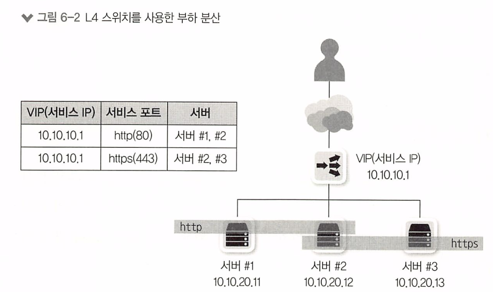

다양한 네트워크 구성이 가능한 **스위치형 로드 밸런서**가 가장 대중화되어있다. 

* 부하 분산, 성능 최적화, 리다이렉션 기능을 제공한다.

L4스위치가 동작하려면 다음 4가지를 설정해야 한다. 

1. 가상 서버(Virtual Server) : 사용자가 바라보는 실제 서비스

2. 가상 IP(Virtual IP) : 사용자가 접근해야 하는 서비스 IP 주소

3. 리얼 서버(Real Server) : 실제 서비스를 수행하는 서버

4. 리얼 IP(Real IP) : 실제 서버의 IP

사용자는 L4스위치의 가상 IP를 목적지로 서비스를 요청 -> L4스위치가 목적지로 설정된 가상 IP를 리얼 IP로 다시 변경해 요청 (이 과정에서 자체 로드밸런싱 알고리즘을 통함) -> L4 스위치로 응답 돌아옴 -> 사용자에게 응답

## 6.2.2 ADC(Application Delivery Controller)

ADC(Application Delivery Controller)는 애플리케이션 계층(7계층)에서 동작하는 로드 밸런서

애플리케이션 프로토콜의 헤더와 내용을 이해하고 동작한다. (4계층 L4 스위치와는 다르게 이해 가능)

* 부하 분산, 정보 수정, 정보 필터링이 가능하다.

ADC는 이런 동작을 위해 `프록시로` 동작한다

* "프록시"는 컴퓨터 네트워크에서 다른 서버에 대한 요청을 전달하는 중개자 역할을 하는 서버를 의미
* 클라이언트는 서비스를 요청할 때 직접 서버와 연결하는 것이 아니라 `프록시 서버를 통해 요청`을 전달하며, 프록시 서버는 이 요청을 받아 실제 서버로 전달

또한 대부분의 ADC는 L4스위치의 기능을 포함하고 있다. 

* 세션관리, 로드밸런싱 등 

또한 대부분의 ADC는 4계층에서 애플리케이션 계층까지 다음과 같은 기능을 제공 및 수행한다.

* 로드 밸런싱 기능

* 페일 오버(Failover, 장애극복 기능)

* 리다이렉션(Redirection)

애플리케이션 프로토콜을 이해하고 최적화 기능도 제공한다. 

*  캐싱(Caching), 압축(Compression), 콘텐츠 변환 및 재작성, 인코딩 변환

그리고 플러그인 형태로 보안 강화기능을 추가로 제공해서 다음과같은 기능을 제공한다. 

* WAF(Web Application Firewall) 기능

* HTML, XML 검증및 변환 수행

## 6.2.3 L4 스위치 vs ADC

L4 스위치는

* 4계층에서 동작하며 TCP, UDP 정보를 기반으로 부하를 분산한다. 

* TCP 계층에서의 최적화, 보안기능도 함께 제공한다. 

* TCP레벨의 Dos(Denial of Service)공격을 방어할 수 있다.
* 서버 부하를 줄이기 위해 **TCP 세션 재사용**과 같이 보안과 성능을 높여주는 기능도 제공할 수 있다.

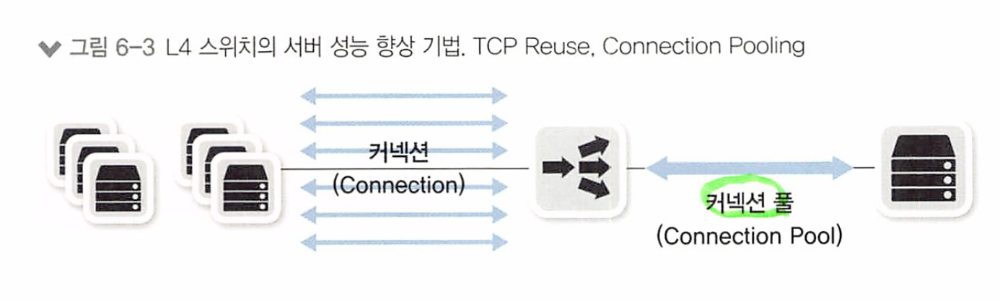

* **TCP Reuse**: TCP 연결 재사용은 같은 목적지로 가는 TCP 연결을 다른 클라이언트 요청에 재사용하는 기술
  *  이는 매번 새로운 연결을 생성하고 종료하는 비용을 줄여 네트워크 성능을 개선하는데 도움이 된다. 
  * 예를 들어, 로드 밸런서나 프록시 서버는 연결 재사용을 통해 서버에 대한 연결을 빠르게 전환하고 재활용할 수 있다

* **Connection Pooling**:미리 생성된 네트워크 연결의 집합, 즉 '풀(pool)'을 유지하고 필요할 때 이를 재사용하는 기술. 클라이언트가 서버에 요청을 보낼 때 매번 새로운 연결을 설정하는 대신, 연결 풀에 있는 기존 연결을 재사용된다.
  * DB 커넥션 풀, 쓰레드 풀과 비슷한 기능

ADC는

* L7에서 동작하며 애플리케이션 프로토클을 이해하고 애플리케이션 내용에 의하여 분산, 리다이렉션, 최적화를 제공
* 성능 최적화를 위해 부하가 많이 걸리는 작업을 별도로 수행하는데 그 중 하나가 이미지나 정적 콘텐츠 캐싱 기능

* 웹 서버에 콘텐츠 압축 기능이 있지만, ADC를 이용해 웹 서버 자체의 부하를 줄일 수 있다.

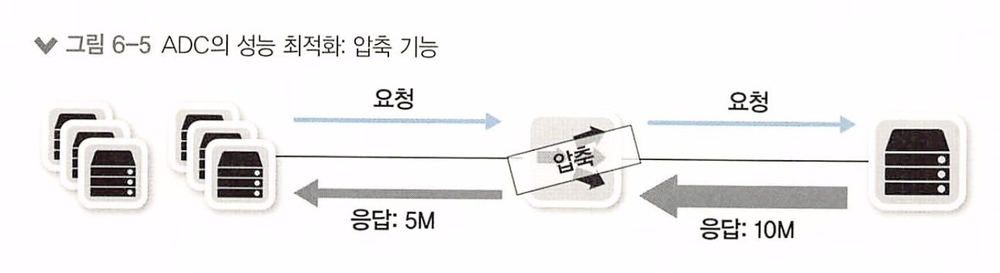

* 또한 SSL(HTTPS) 프로토콜을 사용하면서 웹 서버의 암복호화 부하가 늘었다.
  * 이를 ADC(로드밸런서) 구간 까지 ssl로 처리하고 ADC와 웹 서버 사이에는 일반 HTTP로 통신하여 부하를 줄인다. 

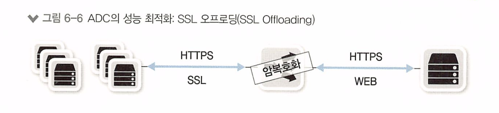

* 전용 SSL 가속 카드를 내장하는 것은, SSL/TLS 처리를 ADC의 주 프로세서(CPU)가 아닌 `전용 하드웨어`에서 처리하도록 하는 것을 의미 -> 이것을 SSL 오프 로딩이라고 함

> 시스템 확장 방법 : 스케일 업과 스케일 아웃 
>
> 스케일 업 : 서버의 CPU, 메모리, 디스크 등 용량을 키우는것
>
> 스케일 아웃 : 서버 대수 자체를 늘리는것 -> 병렬 운영
>
> 일반적으로 스케일 업이 비용이 더 많이 든다. 고급 CPU 높은 용량 메모리, 비싼 보드 등등
> 스케일 아웃이 조금 더 저렴한 편이지만, 로드 밸런서와 같이 부하를 분산해주는 외부 시스템이 필요하다.

|      | 스케일 업 (Scale-Up)                                         | 스케일 아웃 (Scale-Out)                                      |
| ---- | ------------------------------------------------------------ | ------------------------------------------------------------ |
| 설명 | 하드웨어 성능 자체를 업그레이드하거나  더 높은 성능의 단일 서버를 사용하여 처리하는 방법 | 같은 서비스를 여러 대의 서버로 분산하여 처리하는 방법        |
| 장점 | - 부품을 쉽게 추가할 수 있어 시스템 확장이 비교적 쉬움 - 시스템 설계 변경 없이 성능 향상 가능 | - 서비스 사용량을 쉽게 늘릴 수 있음 - 여러 대의 시스템에 로드를 분산하여 결함 허용(Fault Tolerance) 가능 |
| 단점 | - 부품 추가가 어려울 수 있음 - 시스템이 커질수록 복잡성 증가 | - 별도의 복잡한 아키텍처 및 운영 필요 - 추가 프로세스 및 네트워크 장비 필요 할 수 있음 |

# 6.3 방화벽

방화벽 : 네트워크 중간에 위치해 해당 장비를 통과하는 트래픽을, 사전에 정한 정책에 맞춰 허용(permit)하거나 차단(deny) 하는 장비

* 일반적으로 3,4계층 에서 동작하고 세션을 인지, 관리하는 SPI(Statueful Packet Inspection) 엔진을 기반으로 동작하는 장비를 방화벽이라고 부른다

방화벽은 NAT(Network Address Transation) 동작 방식과 유사하게, 세션 정보를 장비 내부에 저장한다.

* NET(Network Address Translation)은 네트워크에서 IP 주소를 변환하는 기술
* NET의 동작 방식
  1. 로컬 네트워크에서 인터넷으로 나가는 패킷은 출발지 IP 주소와 포트를 가지고 있다. 이를 출발지 주소(Source Address)라고 한다.
  2. NET 장비(일반적으로 방화벽이나 라우터)는 출발지 주소를 임시 주소로 변환한다. 이 임시 주소는 인터넷에서는 실제 주소로 인식되지 않고 로컬 네트워크 내에서만 유효하다. 이를 출발지 NAT 주소(Source NAT Address)라고도 한다.
  3. 인터넷으로 나가는 패킷의 출발지 주소가 변환되었기 때문에, 패킷이 인터넷 상에서 전송될 때는 출발지 주소가 변환된 NAT 주소로 나타낸다.
  4. 외부 서버가 응답 패킷을 보낼 때, 해당 응답 패킷의 목적지 주소는 NAT 주소로 전송된다.
  5. NET 장비는 목적지 주소를 원래의 출발지 주소로 변환하여 패킷을 로컬 네트워크로 전달한다.

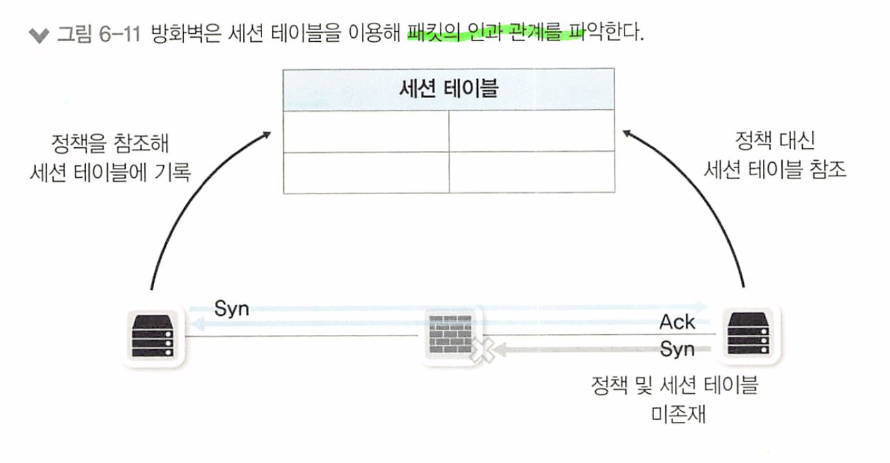

패킷이 외부로 나갈 때 세션 정보를 저장하고, 패킷이 들어오거나 나갈 때 저장했던 세션 정보를 먼저 참조해

들어오는 패킷이 외부에서 시작된건지, 내부사용자가 외부로 요청의 응답인지 구분한다.

* 만약 방화벽이 차단되어있다면 외부 사용자의 요청은 차단되지만, 내부 사용자가 요청한 내용의 응답은 들어와야 하기 때문이다

만약 세션 테이블과 같이 패킷의 상태 정보(응답, 요청 등)를 담아두는 공간이 없어서 세션의 방향성을 파악하지 못한다면, 많은 정책을 복잡하게 관리해야 한다.

* 상태, 세션 정보가 없다면 패킷이 내부에서 시작한건지, 외부에서 시작한건지 인지할 수 없기 때문이다.

# 6.4 4계층 장비를 통과할 때의 유의점 (세션 관리)

세션 장비는 세션 테이블 정보를 이용해 패킷을 변경하거나 패킷을 forward 하거나 drop 할 수 있다.

* 애플리케이션 성능을 최적화하고 보안을 강화하기 위해

## 6.4.1 세션 테이블 유지, 세션 정보 동기화

세션 장비는 통신을 시작하면 해당 세션 상태를 테이블에 기록하는데, 통신이 없더라도 통신이 정상적으로 종료되지 않았다면 일정 시간동안 세션 테이블을 유지한다.

* 이런 세션 테이블은 메모리에 저장되므로, 메모리 사용률을 적절히 유지하기 위해 `일정 시간만` 저장한다

또한 악의적인 공격자가 과도하게 세션을 발생시킬 수 있으므로 타임아웃 값으로 조절하기도 한다.

세션이 길게 유지되어야 해서 세션 타임아웃값이 길게 유지되는 애플리케이션이 필요할 때, 
`세션 장비의 타임아웃 값`이 애플리케이션의 세션 타임아웃보다 짧으면 통신에 `문제가 생긴다`

* 세션 장비의 테이블에 세션이 없는데, SYN이 아닌 ACK로 표시된 패킷이 온다면 장비는 비정상 통신으로 판단하여 패킷을 차단하기 때문이다

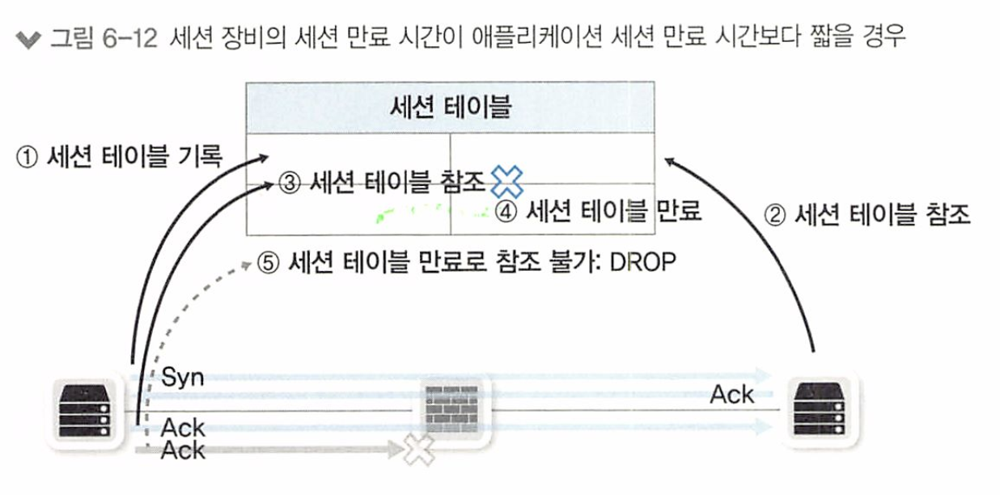

동작 순서는 다음과 같다 

1. 3방향 핸드셰이크를 통해 정상적으로 세션 설정
   * (1)방화벽에서 세션 설정 과정을 확인하고 세션 테이블 기록

2. (2), (3) 세션 테이블을 참조해 방화벽에서 패킷 통과

3. 일정 시간 동안 통신 없음

4. (4)세션 타임으로 세션 테이블 만료

5. 세션 만료 후 애플리케이션 통신 시작

6. 세션이 만료되어 방화벽에서 패킷 드롭

이런 문제를 해결하기 위해, 세션 장비와 애플리케이션에서 각각 적용할 수 있는 설정이 있다.

* 세션 장비 운영자 입장
* 개발자 입장
  * 이것만 정리한다

### 개발자 입장

**애플리케이션에 주기적인 패킷 발생 기능을 추가한다**

애플리케이션과 세션 장비의 세션 타임아웃 시간을 일치시키는 가장 좋은 방법은 

**애플리케이션에서 패킷을 주기적으로 발생시키는 것이다**

일정 시간마다 양 단말 애플리케이션의 세션 상태 정보를 체크하는 더미 패킷을 보내는 기능을 추가하면 된다.

* 헬스 체크 패킷

## 6.4.2 비대칭 경로 문제

네트워크 안정성을 높이기 위해 회선과 장비를 이중화 한다. 이 때 경로가 2개 이상이므로 각각 다른 경로가 나오게 될 수 있다.

* 대칭 경로(Symmetric Path) : 인바운드와 아웃바운드 패킷이 같은 장비를 통과하는 경로
* 비대칭 경로(Asymmetric Path) : 인바운드와 아웃바운드 패킷이 다른 장비를 통과하는 경로 

세션 장비는 세션 테이블을 만들어 관리해야 하므로 패킷이 들어오고 나갈때 동일한 장비를 통과해야 하지만,

네트워크 경로 이중화를 위해 세션 장비를 두 대 이상 설치한 경우에 경로가 일정하게 유지되지 않으면 정상적인 서비스가 되지 않는다

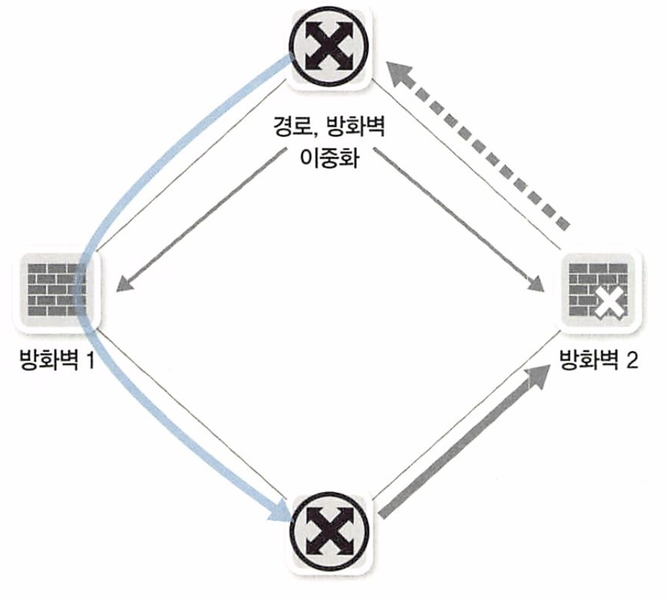

* 그림은 비대칭 경로. 인바운드 패킷과 아웃바운드 패킷이 한 장비를 통과하지 않아 세션 정보가 없어 패킷이 드롭됌

이 문제의 가장 좋은 해결 방법 - **비대칭 경로 생기지 않도록 네트워크와 경로 디자인**

* 그러나 매우 어려워 성능이 저하되거나 보안이 약화될 수 있다.

### 1. 비대칭 경로 해결 방법 1 - 세션 테이블 동기화하여 해결

방화벽에서는 `세션 테이블을 동기화` 하여 처리할 수 있다.

* 세션 테이블을 동기화 하면 여러 장비가 하나의 장비처럼 동작하므로 비대칭 경로에서도 구분하여 정상 동작 가능하다.
* 그러나 세션을 동기화하는 시간보다 패킷 응답이 빠르면 정상적으로 동작하지 않을 수 있다.

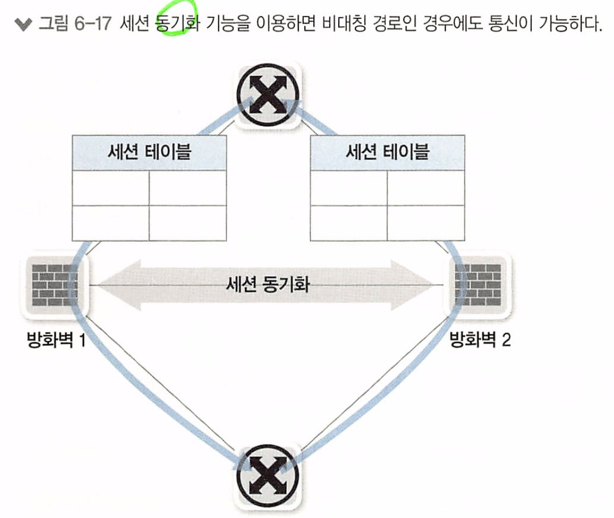

세션 테이블을 동기화는 응답시간이 긴 인터넷 게이트웨이로 방화벽이 사용될 때 유용하게 사용될 수 있다.

### 2. 비대칭 경로 해결 방법 2 - 세션 장비에서 다른 다양한 방법으로 보정

인바운드 패킷이 통과하지 않았는데 아웃바운드 패킷이 장비로 들어오면, 아웃바운드 패킷을 다른 세션 장비로 패킷을 보내 경로를 보정한다.

* 그러면 강제로 대칭 경로가 된다.

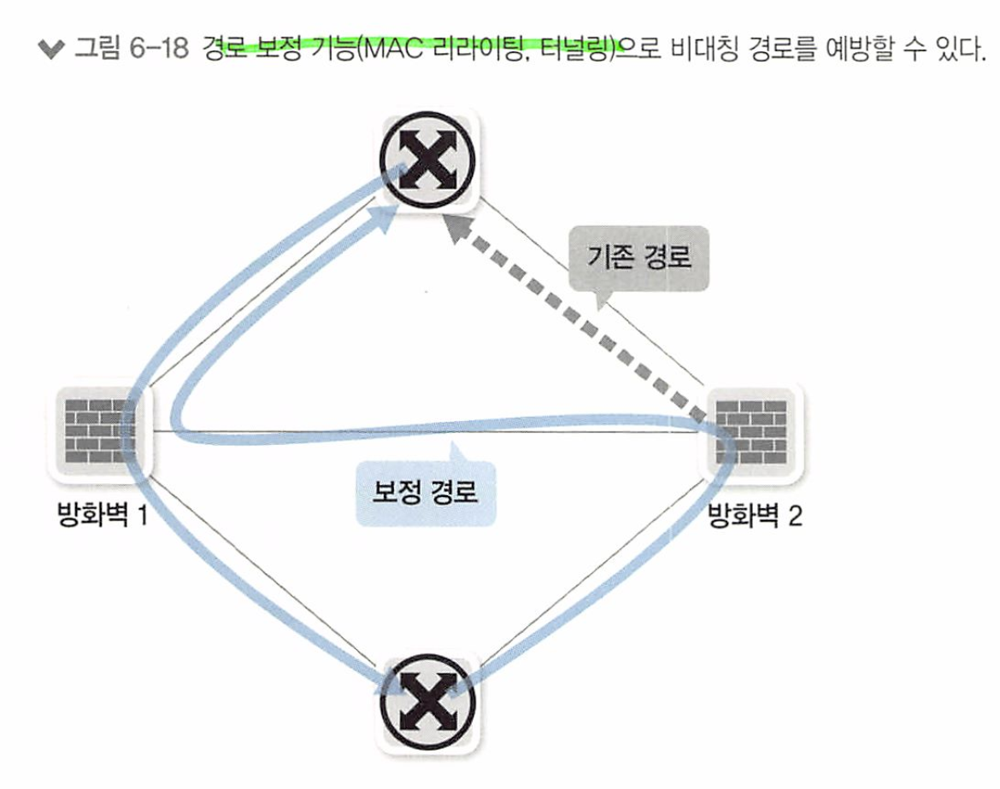

그러나 강제로 다른 방화벽으로 패킷을 보내기 위해, `방화벽 간 통신용 링크` 와 `MAC 리라이팅(MAC주소 변경기능)`

이나 `터널링(MAC 주소를 한번더 캡슐화)` 하는 기법으로 경로를 보정한다.

## 6.4.3 하나의 통신에 두 개 이상의 세션이 사용될 때의 고려사항

하나의 통신에 두개 이상의 세션이 사용된다면,

서로 다른 두 세션이 하나의 통신을 위해 사용한다는 것을 세션 장비도 파악해야 한다.

* 세션 장비가 모르면 단방향 통신만 가능하거나 아예 불가능 할수도 있기 때문이다

프로토콜은 `데이터 프로토콜` 과 `컨트롤 프로토콜로` 구분할 수 있다.

* 데이터 프로토콜 : 데이터를 실어 나르는 프로토콜
* 컨트롤 프로토콜 : 데이터가 잘 전송되도록 세션을 제어하는 프로토콜

`현대 프로토콜`은 두 프로토콜의 기능을 하나의 프로토콜에서 `헤더나 메시지로 해결`하지만 오래된 프로토콜은 두 개의 프로토콜로 분리되어 있다.

* 대표적으로 FTP

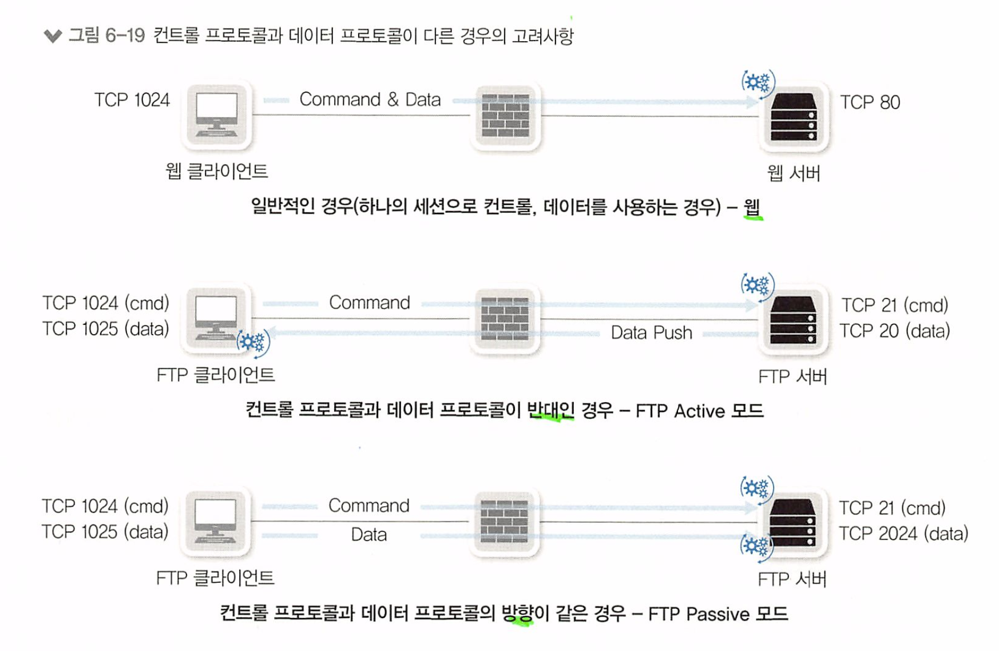

FTP Active 모드 : 기본 구동 방식. 컨트롤 프로토콜과 데이터 프로토콜의 방향이 반대이다

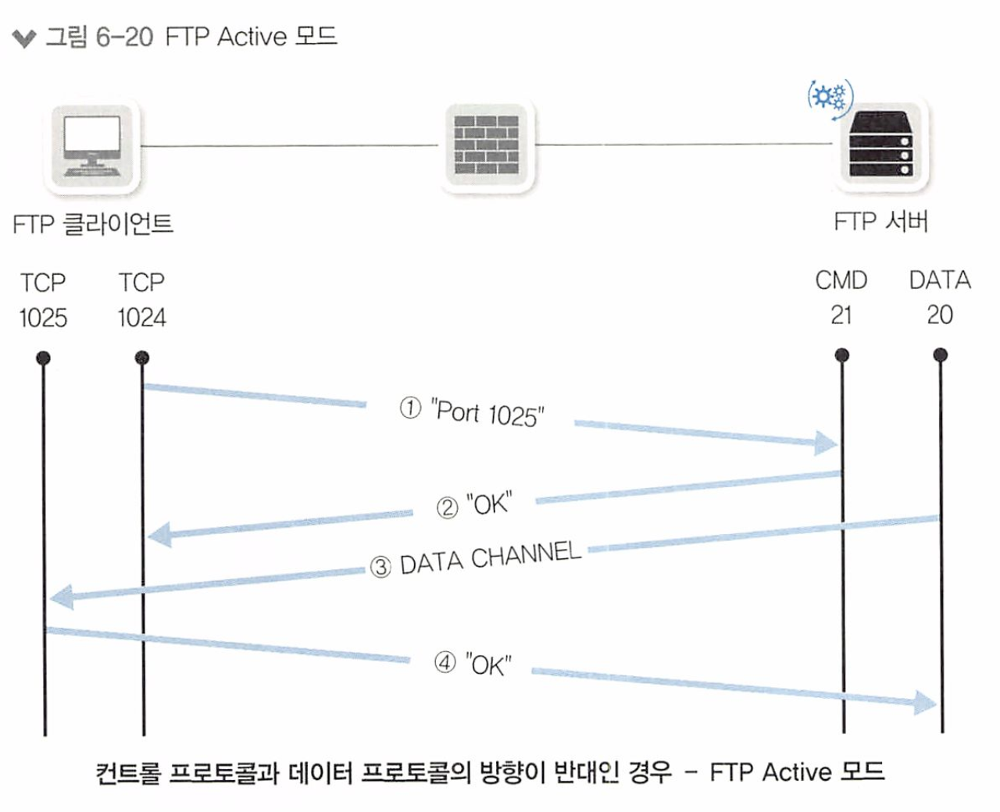

1. 클라이언트가 FIP 서버에 접속. 클라언트는 1023번 이상의 TCP 포트를 사용. 서버는 TCp 21번 포트를 사용
2. (1) 클라이언트가 서버에 데이터를 1025번 포트를 사용해 수신하겠다고 알림
3. (2)서버는 클라이언트에 1025번 포트를 사용해 송신하겠다고 응답
4. (3) 서버에서 데이터를 보냄. 클라이언트에서 응답하고 데이터를 수신

Active 모드를 사용할때 중간 방화벽이나 세션 장비가 있다면, 반대 방향도 열어줘야 한다.

* 컨트롤 프로토콜의 포트로 요청하고, 데이터 프로토콜의 포트로 데이터를 보내줘야 하기 때문이다.

이 단점을 해결하기 위해 FTP Passive 모드가 나왔다.

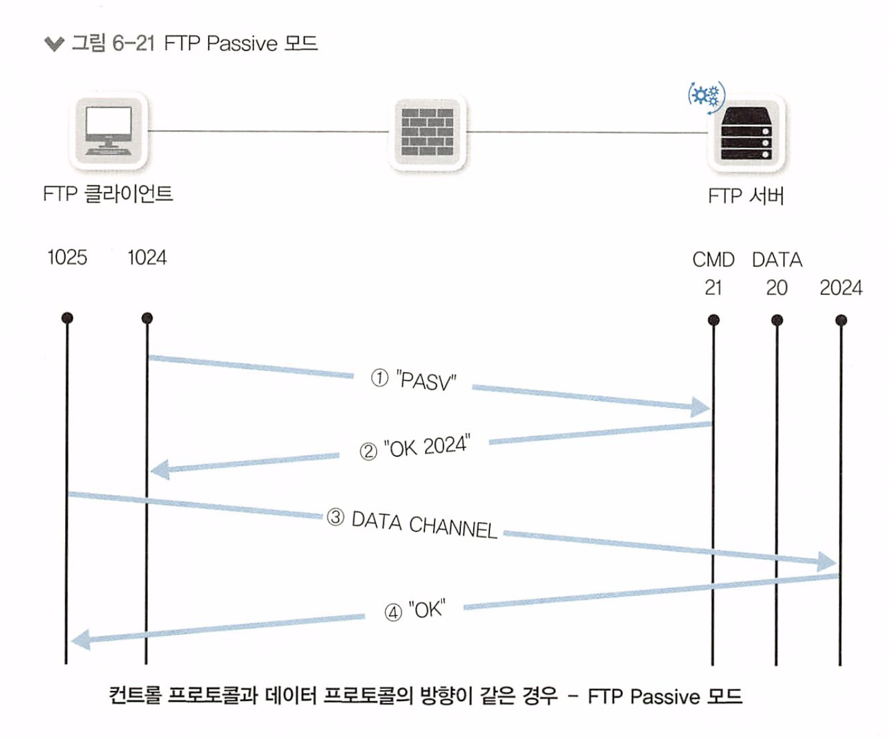

1. 클라이언트가 서버에 접속. 클라언트는 1023번 이상의 TCP 포트를 사용, 서버는 TCP 21번 포트를 사용(Active 모드와 동일)
2. 클라이언트가 Passive 모드를 사용하겠다고 알림
3. ② 서버는 클라이언트에 데이터 수신에 사용할 포트를 알림. 2024번 포트를 사용해 수 신하겠다고 응답
4. ③ 클라이언트에서 서버에 데이터를 요청. ② 과정에서 서버에서 알려준 2024번 포트에 요청.
5. 데이터 전송

방화벽이나 세션 장비가 있을 경우, 특별한 추가 작업은 필요 없지만

서버 쪽에 방화벽이 있으면 데이터 다운로드를 위한 추가 포트를 열어주어야 하는 단점이 있다.