# 7장 통신을 도와주는 네트워크 주요 기술

사용자가 IP 설정을 하지 않더라도 IP 주소를 자동으로 할당해주는 DHCP(Dynamic Host Configuration Prolocol), 

사용자가 복잡한 목적지 IP를 기억하지 않고 쉬운 도메인 이름을 사용하도 록 도메인 이름과 IP 주소를 매핑해주는 DNS(Domain Name Syster), 

사용자가 가장 가까운 지역 의 데이터 센터에 접속해 신속한 서비스를 받게 해주는 GiSLB(Global Service Load 3alancing), 

하나의 IP를 사용해 여러 단말 장비를 포함하는 네트워크를 손쉽게 구축하도록 도와주는 NAT

이번 장에서는 자주 사용되면서 실무환경에서 네트워크 통신을 이해하는 데 중요한 NAT, DNS, GSIB, DHCP에 대해 자세히 알아본다


# 7.1 NAT /PAT

NAT(Network Address Tranlsation, 네트워크 주소 변환) 

: IP 주소를 다른 IP주소로 변환해 라우팅을 원활히 해주는 기술, 사설 IP 주소에서 공인 IP 주소로 변경하는 경우가 많다.

공인 IP <-> 사설 IP, 사설 IP <-> 사설 IP, 공인 IP

IPv4 <-> IPv6로 변환하는 AFT(Address Family Translation)도 NAT 기술의 일종 

* NAPT(NAT이라고도 함, RFC2663) : IP주소가 고갈되는 문제를 해결하기 위해 1:1 변환이 아닌 여러개의 IP를 하나의 IP로 변환하기도 한다.
  * https://datatracker.ietf.org/doc/html/rfc2663

* 실무에선 PAT(Port Address Translation) 라는 용어로 더 많이 사용된다


## 7.1.1 NAT/PAT 의 용도와 필요성

 내부 네트워크와 외부 네트워크 간의 통신을 허용하고 관리하는 데 사용된다.

다음과 같은 4가지 이유로 사용한다.

- **IPv4 주소 고갈문제의 솔루션으로 NAT가 사용됨**: 외부에 공개해야 하는 서비스는 공인 IP, 공개할 필요가 없는 일반 사용자의 PC나 기타 종단 장비에 대해서는 사설 IP를 사용해 필요한 곳에만 효율적으로 IP를 사용할 수 있게 됨.

> IP 주소 보존 전략 단기, 중기, 장기
>
> \- 단기 : 서브네팅
>
> \- 중기 : NAT와 사설 IP 체계
>
> \- 장기 : IPv6 전환 

- **보안을 강화하는데 NAT 기술 사용**: 외부와 통신할때 내부 IP를 다른 IP로 변환해 통신하면 외부에 사내 IP 주소 체계를 숨길 수 있음. 내부 네트워크에서 외부 네트워크로 나가는 방향 통신은 허용하지만 외부에서 시작해 내부로 들어오는 통신은 방어할 수 있음.(보안을 쉽게 강화할 수 있다)

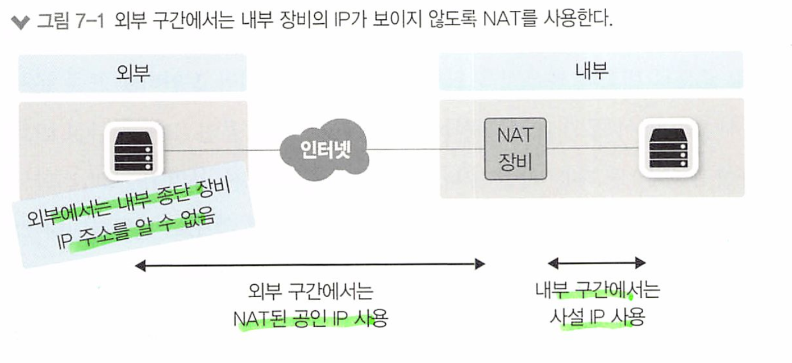

- **IP주소 체계가 같은 두 개의 네트워크 간 통신을 가능하게 해줌**: IP 네트워크에서 서로 통신하려면 식별 가능한 유일 IP 주소가 필요하다. 사설 IP 대역이 같은 네트워크와 통신할 가능성이 높은 대외계 네트워크를 연결하기 위해 `출발지와 도착지를 한꺼번에 변환하는 “더블 나트(Double NAT)” 기술을 사용함.`
- **불필요한 설정 변경을 줄일 수 있음**: 외부에 서비스하던 공인 IP 주소가 변경되므로 DNS 서비스나 NAT를 수행하는 네트워크 장비 설정은 변경해야 하지만 내부 서버나 PC 설정 변경을 최소화 할 수 있어 불필요한 설정 변경을 줄일 수 있음.

그러나 개발자들이 애플리케이션을 제작할 때 NAT 환경을 항상 고려해야 하는 상황이 되었다

1. **End-to-end 연결의 파괴:** NAT는 개별 호스트의 실제 IP 주소를 숨기므로, 애플리케이션들이 종단간(end-to-end) 연결을 설정하는 데 어려움을 겪을 수 있다. 이는 특히 P2P(Peer-to-Peer) 애플리케이션, VoIP(Voice over IP) 같은 애플리케이션에서 문제가 될 수 있다.
   * 네트워크 주소 변환(NAT)은 내부 네트워크의 IP 주소를 외부 네트워크로 변환하고 이를 라우팅하는 역할을 하는데,  원래의 IP 주소가 변경되므로, 인터넷 상의 다른 장치들이 원래의 IP 주소를 알 수 없게 됌
2. **IP 주소 의존성:** NAT는 호스트의 IP 주소를 변경합니다. 따라서, IP 주소에 의존하는 애플리케이션의 경우 NAT 환경에서 제대로 작동하지 않을 수 있다.
   * 예를 들어, IP 주소를 사용하여 장치를 식별하거나, IP 기반의 인증 메커니즘을 사용한다면, NAT은 사용할 수 없다
3. **상태(state) 정보의 필요성:** NAT는 상태 정보를 유지하고 이를 기반으로 패킷을 변환한다. 이러한 상태 정보는 시간이 지나면서 변경될 수 있는데, 일부 애플리케이션에서는 연결이 끊어질 수 있다.
4. **포트 변환:** PAT는 특정 포트를 다른 포트로 변환한다. 이로 인해, 애플리케이션에서 사용하는 포트가 변환되면, 원격 호스트와의 통신에 문제가 생길 수 있다.

## 7.1.2 NAT 동작 방식

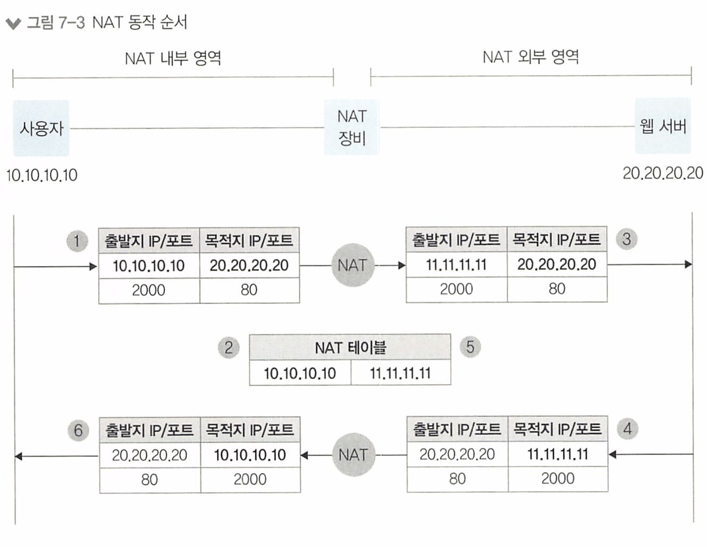

NAT의 동작 방식을 이해하기 위해 출발지 사용자(10.10.10.10)가 목적지의 웹 서버(20.20.20.20) 로 통신하는 과정

1. 사용자는 웹 서버에 접근하기 위해 출발지 IP를 10.10.10.10으로, 목적지 IP와 서비스 포트는 20.20.20.20과 80으로 패킷을 전송. 출발지 서비스 포트는 임의의 포트로 할당된다. 여기서는 2000번 포트로 가정.
2. (2 NAT 테이블)NAT 역할을 수행하는 장비에서는 사용자가 보낸 패킷을 수신한 후 NAT 정책에 따라 외부 네트워크와 통신이 가능한 공인 IP인 11.11.11.11로 IP 주소를 변경. NAT 장비에서 변경 전후의 IP 주소는 NAT 테이블에 저장된다.
3. NAT 장비에서는 출발지 주소를 11.11.11.11로 변경해 목적지 웹 서버로 전송한다.
4. 패킷을 수신한 웹 서버는 사용자에게 응답을 보낸다. 응답이므로 수신한 내용과 반대 로 출발지는 웹 서버(20.20.20.20)가 되고 목적지는 NAT 장비에 의해 변환된 공인 IP 11.11.11.11로 사용자에게 전송한다.
5. 웹 서버로부터 응답 패킷을 수신한 NAT 장비는 자신의 NAT 테이블에서 목적지 IP에 대한 원래 패킷을 발생시킨 출발지 IP 주소가 10.10.10.10인 것을 확인.
6. NAT 변환 테이블에서 확인된 원래 패킷 출발지 IP(10.10.10.10)로 변경해 사용자에게 전송하면 사용자는 최종적으로 패킷을 수신

## 7.1.3 PAT 동작 방식

> 포트 주소 변환(Port Address Translation, PAT), 또는 포트 오버로딩이라고도 불리우는 이 기술은 네트워크 주소 변환(NAT)의 확장된 형태. PAT는 여러 내부 장치가 동일한 공인 IP 주소를 공유하면서도 서로 다른 통신 세션을 유지할 수 있게 해준다
>
> -> 포트가 다르니까
>
> 즉, PAT 동작방식은 NAT과 유사하지만  IP 주소뿐만이 아닌 서비스 포트까지 변경해 관리

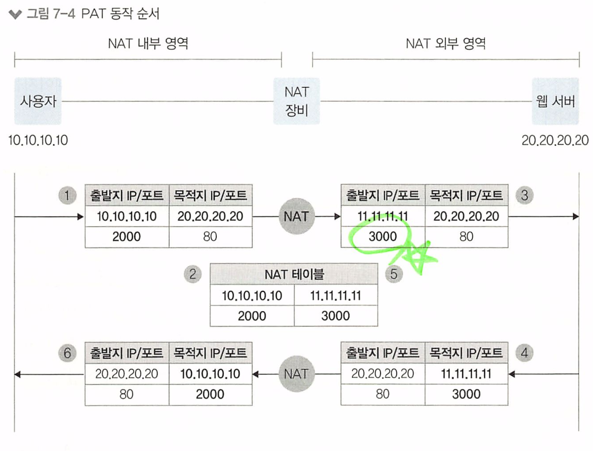

1. 사용자가 웹 서버로 접근하기 위해 패킷에 출발지 10.10.10.10, 목적지 20.20.20.20, 목적지 서비스 포트는 웹 서비스 포트인 80으로 채워 패킷을 전송한다. 출발지 서비스 포트는 NAT와 마찬가지로 임의의서비스 포트가 할당
2. NAT 장비는 사용자가 보낸 패킷을 받아 외부 네트워크와 통신이 가능한 공인 IP인 11.11.11.11로 변경. 다만 출발지에 있는 다수의 사용자가 동일한 공인 IP로 변환되어야 하므로 `패킷의 주소 변경 시 출발지 IP뿐만 아니라 출발지의 서비스 포트도 변경`. 출발지 IP와 출발지 서비스 포트는 NAT 장비에 의해 모두 변경되고 변경정보를 NAT 테이블에 기록.
3. NAT 장비에서 변경된 출발지 IP 주소인 11.11.11.11과 서비스 포트 3000으로 패킷을 재작성해 웹 서버로 다시 전송.
4. 패킷을 수신한 웹 서버는 패킷을 응답하는데 출발지 IP는 웹  서버의 IP 주소인 20.20.20.20으로 채워지고 `목적지 IP는 NAT 장비에 의해 변환된 공인IP 11.11.11.11과 서비스 포트로` 채워져 전송.
5. 응답 패킷을 수신한 NAT 장비는 NAT 테이블을 확인해 받은 패킷의 목적지 IP 주소인 11.11.11.11이 원래 10.10.10.10이며 서비스 포트 3000이 원래 2000인 것을 확인.

6. NAT 장비는 NAT 테이블에서 확인한 목적지 IP 주소와 서비스 포트로 패킷을 재작성한 후 사용자에게 전달합니다. 사용자는 NAT 장비에서 역변환된 패킷을 받음.

만약 다른 IP를 가진 사용자가 동일하게 20,20,20,20 서버로 접속해도, NAT 장비에서는 출발지 IP만 동일하게 변경하고 서비스 포트는 다른 포트로 변경


동시 사용자가 많을 때는, PAT에서 사용하는 공인 IP주소 1개만으로는 포트가 모자르므로 Pool로 구성해서 사용해야 한다 .

PAT은 내부에서 외부로 요청하는 경우에만 가능하며, 외부에서 PAT IP를 목적일 때에는 어떤 IP에 바인딩 되었는지 NAT 테이블에서 알 수 없으므로 사용할 수 없다.

* SNAT와 DNAT 중 SNAT에만 적용된다

## SNAT와 DNAT

NAT를 사용해 네트워크 주소를 변환할 때 어떤 IP 주소를 변환하는지에 따라 두 가지로 구분

- SNAT(Source NAT) - 출발지 주소를 변경하는 NAT
- DNAT(Destination NAT) - 도착지 주소를 변경하는 NAT


SNAT의 사용 경우

* 사설에서 공인으로 통신할 때 사용 
* 회사에서 다른대외사와 통신시 내부 IP주소를 감춰 전송
* 로드밸런서 구성시 사용

DNAT의 사용 경우

* 로드밸런서에서 많이 사용 (도착지 주소를 포워딩하므로)
* 사내망이 아닌 대외망과의 네트워크 구성에서 사용 

## 동적 NAT과 정적 NAT

정적 NAT : 출발지와 목적지의 IP를 미리 매핑해 고정해놓은 NAT

동적 NAT : 출발지나 목적지 어느 경우든 미리 고정 안되있는 동적 NAT

| 항목                         | 동적 NAT                               | 정적 NAT                                   |
| ---------------------------- | -------------------------------------- | ------------------------------------------ |
| **NAT 설정**                 | 1:N, N:1, N:M                          | 1:1                                        |
| **NAT 테이블**               | NAT 수행 시 생성                       | 사전 생성                                  |
| **NAT 테이블 타임아웃 동작** | 있음                                   | 없음                                       |
| **NAT 수행 정보**            | 실시간으로만 확인하거나 별도 필요 없음 | 별도 변경 로그 저장 필요 (설정 = NAT 내역) |


# DNS

6장에서 이야기한것과 같이 네트워크 프로토콜은 2가지로 나눌 수 있다

데이터를 나르는 **데이터 프로토콜**, 데이터 프로토콜이 잘 동작하도록 도와주는 **컨트롤 프로토콜**

컨트롤 프로토콜은 통신에 직접 관여하지 않고, 통신 관계를 처음 맺거나 유지하는 역할 

TCP/IP 프로토콜 체계를 유지하기 위한 주요 컨트롤 프로토콜로는 ARP, ICMP, DNS가 있다.


**DNS : 도메인 주소를 IP 주소로 변환하는 역할.**

숫자로 이루어진 IP 주소(202.179.177.21)보다 도메인 주소([www.naver.com](http://www.naver.com/))를 사용 하는 것이 기억하기 더 쉽고, 서비스 중인 IP 주소가 변경되더라도 도메인 주소를 그대로 유지해 접속 방법 변경 없이 서비스를 그대로 유지할 수 있다.

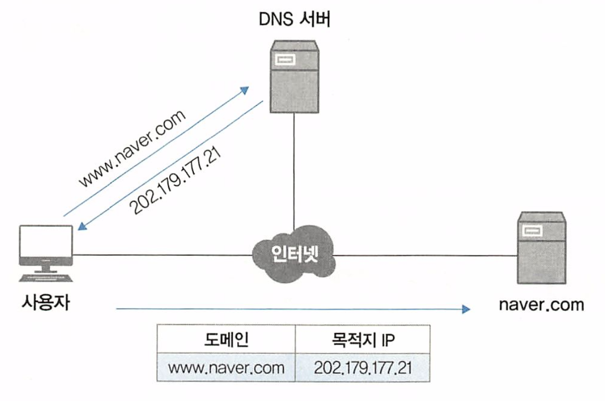

1. 사용자가 웹 브라우저에 naver.com을 입력하면 DNS 서버에 naver.com의 주소가 무엇인지 질의함
2. DNS 서버는 naver.com의 IP 주소(202.179.177.21)를 사용자에게 알려줌
3. 사용자는 DNS로 응답받은 IP 주소를 이용해 naver.com에 접속함

> DNS는 내부 시스템의 서비스간 연결에도 사용된다

## 7.2.2 DNS 구조와 명명 규칙

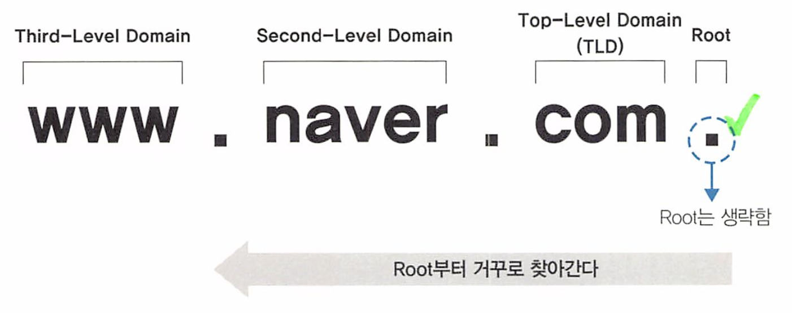

역트리 구조로 최상위 루트부터 Top-level 도메인, Second-level 도메인, Thired-Level 도메인과 같이 하위 레벨로 원하는 주소를 단계적으로 사용한다.

| 레벨                         | 도메인 이름 |
| ---------------------------- | ----------- |
| **최상위(Top-Level) 도메인** | .com        |
| **2차(Second-Level) 도메인** | naver       |
| **3차(Third-Level) 도메인**  | www         |

도메인 계층은 최대 128계층까지 구성할 수 있으며, 계층별 길이는 최대 63바이트까지 사용할 수 있다.

문자는 알파벳, 숫자, "-"만 사용할 수 있고 대소문자 구분이 없다.

1. 도메인 이름 전체의 길이는 최대 253 문자(ASCII 기반) 혹은 255 바이트를 넘을 수 없다. 이 길이는 각 계층을 구분하는 점('.')을 포함합니다.
2. 각 도메인 레벨(즉, 각 레벨 도메인 라벨)의 길이는 최대 63 문자를 넘을 수 없다.
3. 도메인 이름은 최대 127 레벨까지 가질 수 있다.

naver.com ex)

> sub1.sub2.sub3.sub4.....sub123.sub124.sub125.sub126.naver.com


### 루트 도메인

root domain은  도메인을 구성하는 최상위의 영역, 전세계 13개,

만약 DNS서버에 해당 도메인에 대한 정보가 없으면 루트 도메인을 관리하는 루트 DNS에 쿼리한다

| 호스트 이름        | IP 주소                           | 관리 기관                               |
| ------------------ | --------------------------------- | --------------------------------------- |
| a.root-servers.net | 198.41.0.4, 2001:503:ba3e::2:30   | VeriSign, Inc.                          |
| b.root-servers.net | 192.228.79.201, 2001:500:84::b    | University of Southern California (ISI) |
| c.root-servers.net | 192.33.4.12, 2001:500:2::c        | Cogent Communications                   |
| d.root-servers.net | 199.7.91.13, 2001:500:2d::d       | University of Maryland                  |
| e.root-servers.net | 192.203.230.10, 2001:500:a8::e    | NASA (Ames Research Center)             |
| f.root-servers.net | 192.5.5.241, 2001:500:2f::f       | Internet Systems Consortium, Inc.       |
| g.root-servers.net | 192.112.36.4, 2001:500:12::d0d    | US Department of Defense (NIC)          |
| h.root-servers.net | 198.97.190.53, 2001:500:1::53     | US Army (Research Lab)                  |
| i.root-servers.net | 192.36.148.17, 2001:7fe::53       | Netnod                                  |
| j.root-servers.net | 192.58.128.30, 2001:503:c27::2:30 | VeriSign, Inc.                          |
| k.root-servers.net | 193.0.14.129, 2001:7fd::1         | RIPE NCC                                |
| l.root-servers.net | 199.7.83.42, 2001:500:9f::42      | ICANN                                   |
| m.root-servers.net | 202.12.27.33, 2001:dc3::35        | WIDE Project                            |

* 표를 보면 모든 루트 서버는 IPv6 주소를 가지고 있다.

### Top-Level Domain (TLD)

최상위 도메인인 TLD는 IANA(nternet Assigned Numbers Authoriy)에서 구분한 6가지 유형으로 구분할 수 있다. 

각 유형은 다음과 같으며 전체 리스트는 IANA 사이트(https://www.iana.org/domains/root/db)에서 확인할 수 있다.

| TLD 유형                   | 설명                                                         |
| -------------------------- | ------------------------------------------------------------ |
| Generic (gTLD)             | .com, .org, .net 등이 이 유형에 속한다. <br />일반적으로 가장 널리 사용되는 도메인 유형. |
| Country-Code (ccTLD)       | .kr(대한민국), .us(미국), .jp(일본) 등이 이 유형에 속한다. <br />특정 국가 또는 지역을 나타내는 도메인. |
| Sponsored (sTLD)           | .gov(미국 정부), .edu(교육 기관) 등이 이 유형에 속한다. <br />특정 커뮤니티에 의해 승인 및 관리되는 도메인 유형. |
| Infrastructure             | .arpa 도메인이 이 유형에 속한다. <br />인터넷 인프라를 지원하기 위한 도메인 유형. |
| Generic-Restricted (grTLD) | .biz(비즈니스), .name(개인) 등이 이 유형에 속한다. <br />특정 요건을 충족하는 엔티티만 사용할 수 있는 도메인 유형. |
| Test (tTLD)                | 이 유형의 도메인은 실제로 사용되지 않는다. <br />도메인 이름 시스템 확장을 테스트하기 위한 도메인 유형. |

**Generic(gILD)**

일반적으로 사용되는 최상위 도메인. 3글자 이상으로 구성된다. 

| gTLD | 설명                |
| ---- | ------------------- |
| .com | 일반 기업체         |
| .edu | 4년제 이상 교육기관 |
| .gov | 미국 연방정부기관   |
| .int | 국제기구, 기관      |
| .mil | 미국 연방군사기관   |
| .net | 네트워크 관련 기관  |
| .org | 비영리기관          |

**Country-Code (ccTLD)**

국가 최상위 도메인, ISO 3166 표준에 의해 규정된 2글자의 국가코드 사용. 

* 위키피디아 https://ko.wikipedia.org/wiki/1S0_3166-1_alpha-2

## 7.2.3 DNS 동작 방식

도메인을 IP 주소로 변환하려면 DNS 서버에 도메인 쿼리하는 과정을 거쳐야 한다.

DNS 서버 없이 로컬에 도메인과 IP 주소를 직접 설정해 사용할 수도 있다.

 로컬에서 도메인과 IP 주소를 관리하는 파일 hosts 파일이라고 하고, hosts 파일에 도메인과 IP 주소를 설정해두면 해당 도메인 리스트는 항상 DNS 캐시에 저장된다.

**캐시와 DNS를 이용해 도메인 이름 쿼리하는 예제**

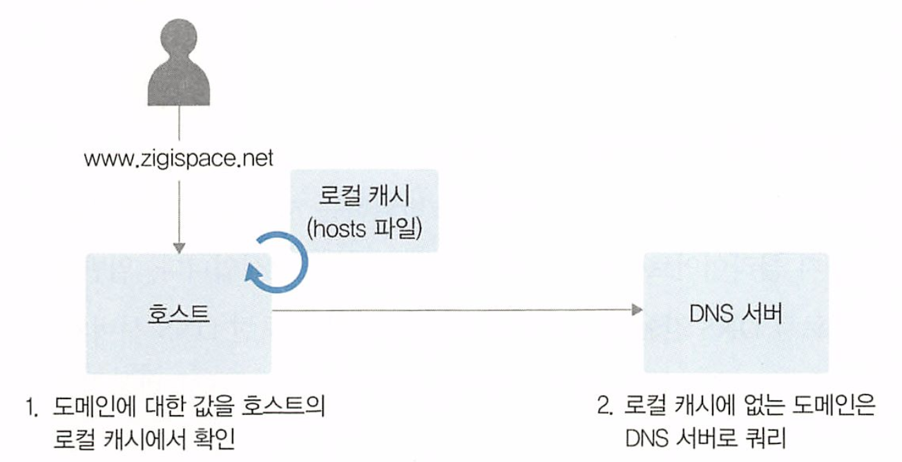

전세계 도메인 정보는 너무 방대하므로 DNS 서버 하나에 저장할수는 없다.

때문에 DNS 는 분산된 데이터베이스로 서로 도와주도록 설계되었다.

1. 클라이언트의 쿼리가 자신에게 없는 정보라면 루트 DNS 쿼리

2. 루트 DNS에서는 쿼리한 도메인의 TLD(Top level domain) 값을 확인해 해당 TLD값을 관리하는 DNS가 어디인지 응답
3. 해당 응답을 받으면 해당 TLD 을 관리하는 DNS에 질의하여 응답을 받음

> 호스트가 DNS 서버에 질의했던 방식을 재귀적 쿼리
>
> DNS가 루트 와 다른 NS에 질의한 방식을 반복적 쿼리라고 한다.

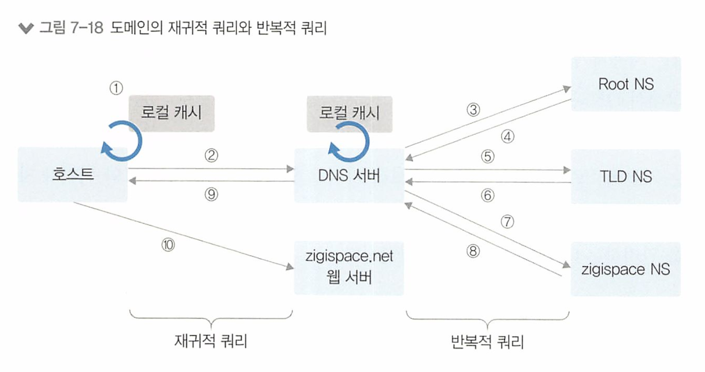

1. 사용자 호스트는 zigispace.net'이라는 도메인 주소의 IP 주소가 로컬 캐시에 저장되어 있는지 확인.
2. zigispace.net이 로컬 캐시에 저장되어 있지 않으면 사용자 호스트에 설정된 DNS에  zigispace.net'에 대해 쿼리.
3. DNS 서버는 zigispace.net'이 로컬 캐시와 자체에 설정되어 있는지 직접 확인하고 없 으면 해당 도메인을 찾기 위해 루트 NS에 .net에 대한 TLID 정보를 가진 도메인 주소를 쿼리다.
4. 루트 DNS는 zigispace.net의 TLD인 net'을 관리하는 TLD 네임 서버 정보를 DNS 서버에 응답.

5. DNS는 TLD 네임 서버에 'zigispace.net'에 대한 정보를 다시 쿼리.

6. TLD 네임 서버는 zigispace.net'에 대한 정보를 가진 2igi 네임 서버에 대한 정보를 DNS 서버로 응답.

7. DNS는 zigi 네임 서버에 zigispace.net'에 대한 정보를 쿼리.

8. zigi 네임 서버는 zigispace.net'에 대한 정보를 DNS 응답.

9. DNS는 zigispace.net'에 대한 정보를 로컬 캐시에 저장하고 사용자 호스트에  zigispace.net'에 대한 정보를 응답.

10. 사용자 호스트는 DNS로부터 받은 zigispace.net'에 대한 IP 정보를 이용해 사이트에 접속


## 7.2.4 마스터와 슬레이브

DNS 서버는 마스터(Master, Primary) 서버와 슬레이브(Slave, Secondary) 서버로 나눌 수 있다. 

마스터 서버가 우선순위가 더 높지 않고 두 서버 모두 도메인 쿼리에 응답하는데, 마스터와 슬레이브는 도메인에 대한 Zone 파일을 직접 관리하는지 여부로 구분한다.

* 슬레이브 서버가 우선순위가 더 높다

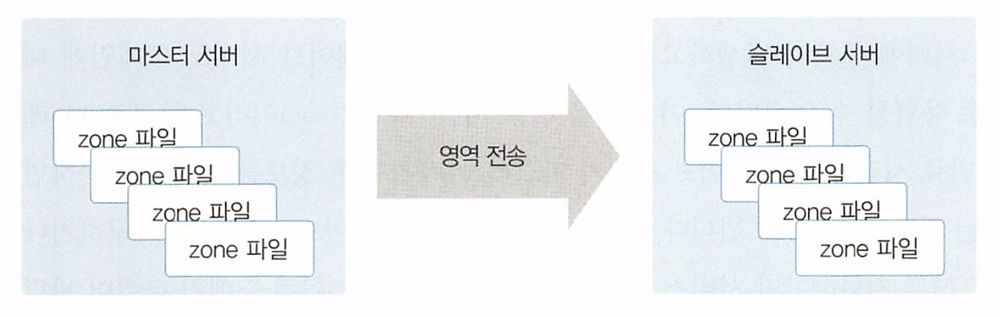

* 마스터 서버는 존(zone) 파일을 직접 생성해 도메인 관련 정보를 괸라한다.
*  슬레이브 서버는 마스터에 만들어진 존 파일을 복제하고, 이 과정을 ‘**영역 전송(Zone Transfer)**’이라고 한다. 
* 마스터 서버는 도메인 영역을 생성하고 레코드를 직접 관리하지만 슬레이브 서버는 마스터 서버에 설정된 도메인이 가진 레코드값을 정기적으로 복제한다.

| 마스터 서버                                 | 슬레이브 서버                  |
| ------------------------------------------- | ------------------------------ |
| 존 파일을 직접 생성해 도메인 관련 정보 관리 | 마스터에 만들어진 존 파일 복제 |

DNS 서버는 일반적인 이중화 형태랑 다르게, 

DNS 서버는 마스터 서버에 문제가 발생하면 슬레이스 서버도 도메인에 대한 질의를 정상적으로 응답할 수 없다

만료 시간(Expiry Time) 이라고 하고 SOA 레코드에 설정된다. 

* 만료 시간 안에 마스터 서버를 복구하거나, 슬레이브 서버를 마스터로 전환해야만 장애를 막을 수 있다.

존 정보가 유효하지 않았을 경우를 대비해서 이렇게 설계한 것이다. 

> SOA(Start of Authority)
> 이 레코드는 DNS 존의 모든 정보에 대한 권한을 가진 DNS 서버를 지정합니다. 
>
> 존 자체에 대한 정보, 존에 대한 기본 DNS 서버, DNS 관리자의 이메일 등을 포함하고 있습니다.
>
> 1. Primary name server: 존에 대한 기본 서버를 나타냅니다.
> 2. Email of the domain admin: DNS 존 관리자의 이메일 주소입니다.
> 3. Serial number: 이것은 존 파일이 마지막으로 수정된 횟수를 나타냅니다. 이는 DNS 서버 간의 동기화를 지원합니다.
> 4. Refresh rate: 이것은 보조 DNS 서버가 주 DNS 서버로부터 존 정보를 새로 고칠 빈도를 나타냅니다.
> 5. Retry time: 주 DNS 서버 접근 실패 후 다시 시도할 때까지 대기하는 시간입니다.
> 6. **Expire time**: 보조 DNS 서버가 존 정보를 '신선'으로 간주하는 최대 시간을 나타냅니다. 이 시간이 지나면 보조 DNS 서버는 존 정보가 더 이상 유효하지 않다고 판단합니다.
> 7. Default TTL (Time To Live): 캐시된 데이터가 얼마나 오래 유효한지를 지정합니다. TTL이 지나면 캐시된 데이터는 더 이상 사용되지 않습니다

## 7.2.5 DNS 주요 레코드

| 레코드 종류            | 내용                                         |
| ---------------------- | -------------------------------------------- |
| A(IPV4 호스트)         | 도메인 주소를 IP 주소(IPv4)로 매핑           |
| AAAA(IPV6 호스트)      | 도메인 주소를 IP 주소(IPv6)로 매핑           |
| CNAME(별칭)            | 도메인 주소에 대한 별칭                      |
| SOA(권한 시작)         | 본 영역 데이터에 대한 권한                   |
| NS(도메인의 네임 서버) | 본 영역에 대한 네임 서버                     |
| MX(메일 교환기)        | 도메인에 대한 메일 서버 정보(Mail exchanger) |
| PTR(포인터)            | IP 주소를 도메인에 매핑(역방향)              |
| TXT(레코드)            | 도메인에 대한 일반 텍스트                    |

### A(IPv4 레코드)

A레코드는 기본 레코드로 도메인 주소를 IP주소로 변환하는 레코드

사용자가 DNS에 질의한 도메인 주소를 A 레코드에 설정된 IP 주소로 응답한다. 하나의 A 레코드에는 한 개의 도메인 주소와 한 개의 IP 주소가 1:1로 매핑되는데 동일한 도메인을 가진 A 레코드를 여러 개 만들어 서로 다른 IP 주소와 매핑할 수 있다.

 반대로 다수의 도메인에 동일한 IP를 매핑한 A 레코드를 만들 수 있다.

서버 한 대에 여러 웹 서비스를 구동해야 한다면 여러 도메인에 동일한 IP를 매핑하고 HTTP 헤더의 HOST 필드에 도메인을 명시해 웹 서버를 구분해 서비스할 수 있다.

```
예제
P 주소: 203.0.113.5
도메인: example1.com, example2.com
이 웹 서버에는 두 개의 서비스가 있다. example1.com 과 example2.com. 
둘 다 같은 IP 주소 (203.0.113.5)를 사용하지만, 서로 다른 내용을 제공한다.

www.example1.com HTTP GET 요청

GET / HTTP/1.1
Host: www.example1.com

www.example2.com을 요청하면, HTTP GET 요청

GET / HTTP/1.1
Host: www.example2.com

```

### AAA (IPv6 레코드)

IPv6 주소 체계에서 사용되는 레코드. 역할은 A레코드와 같다

### CNAME (Canonical Name 레코드)

별칭 이름을 사용하게 해주는 레코드.

레코드 값에 IP 주소를 매핑하는 A레코드와 달리 CNAME 레코드는 도메인 주소를 매핑

* 네임 서버가 CNAME 레코드에 대한 질의를 받으면, CNAME 레코드에 설정된 도메인 정보를 내부적으로 질의한 결과 IP를 응답

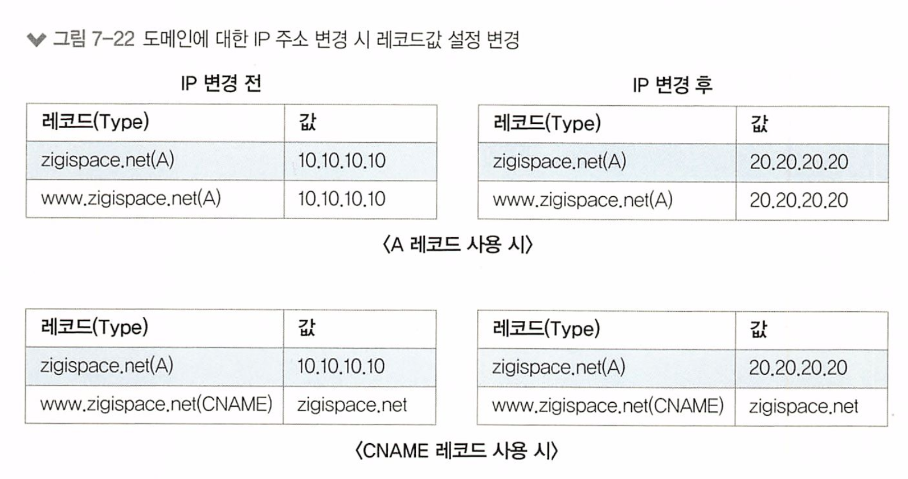

ysk.net 웹사이트 접속시 보통 www.ysk.net, ysk.net 으로 접속.

www.ysk.net, ysk.net을 각각 A 레코드로 매핑하면 IP 주소 변경시 둘다 변경해야 하는 단점.

그러나 CNAME 으로써 ysk.net을 매핑하면, ysk.net의 IP만 변경해도 동일한 결과를 가져올 수 있다.

### SOA (Start Of Authorty) 레코드

도메인 영역에 대한 권한을 나타나는 레코드.

도메인 영역 선언시 SOA 레코드는 필수 항목이므로 반드시 만들어야 하며, 만들지 않으면 해당 도메인은 네임 서버에서 정상 동작할 수 없다.

### NS(Name Server) 레코드

도메인에 대한 권한이 있는 네임 서버 정보를 설정하는 레코드. 

NS 레코드의 경우 권한이 있는 네임 서버 정보를 해당 도메인에 설정하는 역할 외에 하위 도메인에 대한 권한을 다른 네임 서버로 위임(Delegatc)하는 역할로도 많이 사용

### MX(Mail eXchange) 레코드

메일 서버를 구성할 때 사용되는 레코드. 

해당 도메인을 메일 주소로 갖는 메일 서버를 MX 레코드를 통해 선언. 

메일 서버에서 메일을 보낼 때는 MX 레코드를 참조해 동작하는데 우선순위 값을 이용해 다수의 MX 레코드를 선언할 수 있다. 

우선순위가 높은(값이 적은) 서버 로 메일을 보내고 실패하면 다음 순서의 MX 레코드의 메일 서버에서 처리하는 방식.

### PTR(Pointer) 레코드

A 레코드는 도메인 주소에 대한 질의를 IP로 응답하기 위한 레코드이고 PTR 레코드는 그와 반대 로 IP 주소에 대한 질의를 도메인 주소로 응답하기 위한 레코드. 

* A 레코드가 정방향 조회용 레코드라면 PTR 레코드는 역방향 조회용 레코드. 

A 레코드와 달리 하나의 IP 주소에 대해 하나의 도메인 주소만 가질 수 있다.

* PTR 레코드는 주로 화이트 도메인 구성용으로 사용


## 7.2.6 DNS 에서 알아두면 좋은 내용

- 도메인 위임
- TTL
- 화이트 도메인
- 한글 도메인

### 도메인 위임 (DNS Delegation)

도메인은 도메인 내의 모든 레코드를 해당 네임 서버가 직접 관하지 않고, 일부 영역에 대해서는 다른곳에서 레코드를 관리하도록 위임한다.

* 네임 서버는 DNS 데이터를 저장하고 서비스하는 서버

도메인은 계층 구조여서 특정 계층의 레코드를 위임하면 해당 레코드의 하위 계층은 함께 위임처리된다

ex) zigispace.net이 관리되는 A레코드

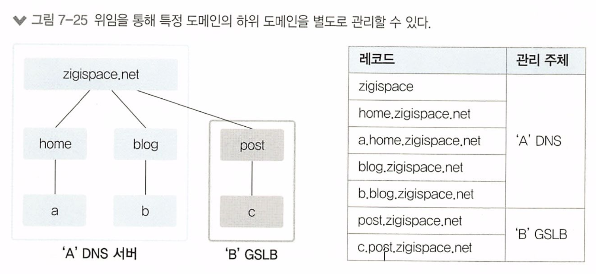

이때 zigispace.net 도메인 하위에 post 영역을 추가하고,

이 영역을 'A' DNS 서버가 아닌 'B' GSLB에서 관리하려고 할 때 'A' DNS 서버에서 post라는 영역 의 관리 권한을 'B' GSLB로 넘겨줄 수 있다.

이 방식을 위임(Delegation) 이라고 한다

> GLSB(Global Server Load Balancing)는 여러 위치에 분산되어 있는 서버에 걸쳐서 네트워크 트래픽을 분산시키는 기술

특정 영역에 대한 관리 주체를 분리하는 용도로 사용할 수 있어 계열사에서 특정 도메인을 분리하거나 GSIB 등 다양한 용도로 사용할 수 있다.

### TTL

도메인의 TTL(Time To Live) 값은 DNS에 질의해 응답받은 걸값을 캐시에서 유지하는 시간이다.

DNS 서버에서 TTL 값을 늘려 캐시를 많이 이용하면 DNS 재귀적 쿼리로 인한 응답 시간을 많이 줄일 수 있고 결과적으로 전체적인 네트워 크응답 시간이 단축되지만,

DNS에서 해당 도메인 관련 정보가 변경되었을 때,  TTL 값이 크면 새로 변경된 값으로 DNS 정보 갱신이 그만큼 지연되거나. 

반대로 TTL 값이 너무 작으면 DNS의 정보 갱신이 빨라지므로 DNS 쿼리량이 늘어나 DNS 서버 부하가 증가 할 수 있다

* 윈도우의 기본 TTL -> 3600초(1시간)

* 리눅스의 기본 TTL -> 10,800초(3시간)

> 기타 도메인 관련 시간
>
> **refresh(새로 고침 간격)**: 보조 네임 서버에서 Zone Transfer를 통해 정보를 주기적으로  받아오는 주기
>
> **retry(다시 시도 간격)**: 보조 네임 서버가 주 네임 서버로 접근이 불가능할 때 재시도하는 주기
>
> **expire(다음 날짜 이후 만료):** 보조 네임 서버가 주 네임 서버로부터 도메인 정보를 받아오 지 못할 때 유지되는 시간 해당 시간 동안 도메인 관련 정보를 받아오지 못하면 주 네임 서버에서 삭제된 것으로 간주하고 보조 네임 서버에서도 해당 도메인 정보를 삭제

### 화이트 도메인 (White Domain)

> 정상적으로 발송하는 대량 이메일이 RBL. 이력으로 간주되어 차단되는 것을 예방하기 위해 사전에 등록된 개인이나 사업자에 한해 국내 주요 포탈 사이트로의 이메일 전송을 보장해주는 제도입니다.
>
> \- 통합 White Domain 등록제 [한국인터넷진흥원 사이트]

정상적인 도메인을 인증, 관리하는 제도가 화이트 도메인이다.

* 불법적인 스팸메일을 발송하는 사이트를 실시간 블랙리스트 정보로 관리해 메일 발송을 제한하는데, 
  이것을 RBL(Realtime Blackhole List, RealTime Blocking List) 라고 한다.

현재 보유중인 도메인을 화이트 도메인으로 등록하려면 KISA RBL 사이트에서 화이트 도메인으로 등록해야 한다

* https://spam.kisa.or.kr/spam/wd/chkWhiteDomain.do?mi=1015

이를 위해 사전에 해당 도메인에 SPF 레코드(Sender Policy Framework)가 설정 되어 있어야 한다.

* 메일 정보와 도메인의 SPF정보가 일치하지 않을 때는 비정상적인 이메일 서버에서 전 송된 것으로 간주해 해당 이메일을 수신하지 않고 스팸 처리할 수 있다

### 한글 도메인

사용자가 도메인을 한글로 등록하고 사용하기 위해 DNS에서는 해당 한글을 "퓨니코드'로 변경하고 이 퓨니코드로 DNS에 도메인을 생성해야한다.

**퓨니코드란(Punycode)?** 

애플리케이션 국제화 도메인 네임(IDNA) 기반 하에서 다국어 도메인이 아스키로 변환(Encoding)된 구문. 

다국어 문자 셋으로부터 온 코드 포인트들을 기본적인 문자열(영숫자, 하이픈)들로 유일 하게 표현한 것으로 IDNA는 다국어 도메인 처리 작동 원리에 의해 인터넷 사용자가 입력한 다국어 도메인 질의는 클라이언트 단에서 아스키 기반의 퓨니코드 형태로 변환(xn--로 시작하는 문 자열로 변환)되어 네임 서버에 전송되며 네임 서버는 퓨니코드 형태의 영역 데이터를 운영한다.

퓨니코드로 변환된 문자열은 접두어 'xn--'이 붙는다. 

```
"지기스페이스.net"을 퓨니코 드로 변환하면

xn--okObx10ba140c67cc6u.net
```

* https://krnic.or.kr/jsp/resources/domainInfo/punyCode.jsp
* https://www.verisign.com/en_US/channel-resources/domain-registry-products/idn/idn-conversion-tool/index.xhtml

## 7.2.8 DNS 설정 - LINUX - P 264

bind 패키지를 이용해 리눅스에서 DNS 서버를 구축하는 과정 이 궁금하다면 P 259~ P 264를 보면된다


---

# 7.3 GLSB (Global Server/Service Load Balancing)

* DNS 로드밸런싱 : 동일한 레코드 이름으로 서로 다른 IP 주소를 동시에 설정하여 쿼리에 따라 응답받는 IP 주소를 나누어 로드밸런싱하는것

GSLB는 전통적인 DNS와 같이 동작하며 추가적으로 health check와 active/backup을 지정 가능하게 하여 재해 복구(DR), 지역적인 부하분산, 응답시간 중심의 서비스를 제공 가능하게 할 수 있다.

* 그래서 인텔리전스 DNS라고도 부른다. 

DNS와 동일하게 도메인 질의에 응답해주는 역할과 로드밸런서처럼 등록된 도메인에 연결된 서비스가 정상적인지 헬스 체크를 수행한다.

* 즉, 등록된 도메인에 대한 서비스가 정상인지 상태를 체크해 정상인 레코드에 대해서만 사용

GSLB의 목표로는

- disaster recovery(재난 복구)
  실패에 대해 대체할 수 있는 서버를 제공한다.
- load sharing(부하 분산)
  많은 트래픽을 여러 서버로 분산시킨다.
- performance(성능)
  client의 위치나 네트워크를 기반으로 최적의 성능을 낼 서버를 선택해준다.

가 존재한다. 

### GLSB 동작 방식

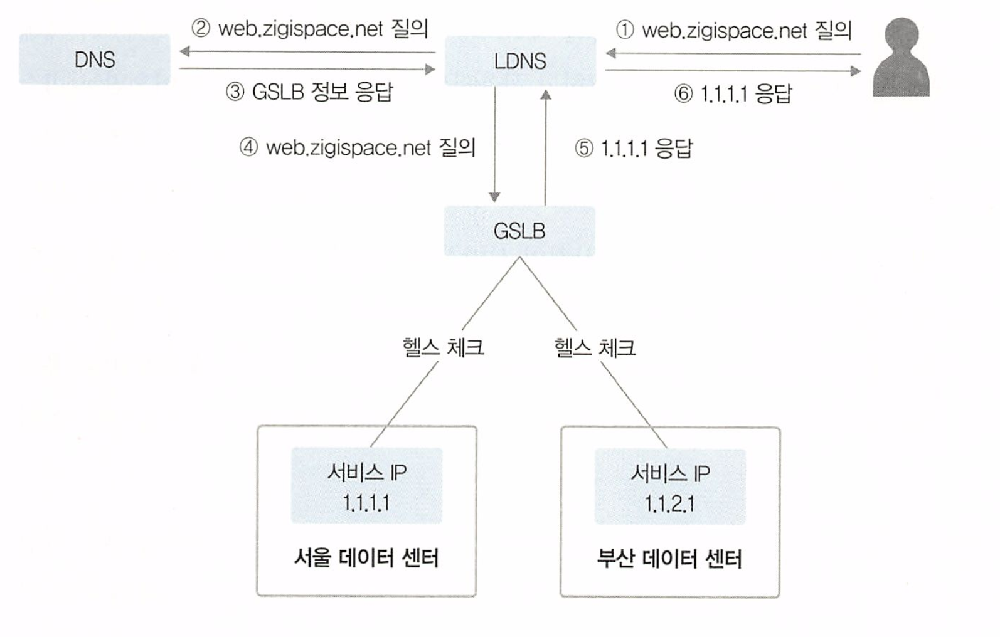

예 ) 서울과 부산의 데이터 센터에서 동일한 서비스가 가동중인 상황

1. 사용자가 web.zigispace.net에 접속하기 위해 DNS에 질의
2. LDNS는 web.zigispace.net을 관리하는 NS 서버를 찾기 위해 root부터 순차 질의
   * LDNS : 로컬 DNS
3. zigispace.net을 관리하는 NS 서버로 web.zigispace.net에 대해 질의.
4. DNS 서버는 GSLB로 web.zigispace.net에 대해 위임했으므로 GSIB 서버가 NS 서버라고 LDNS에 응답.
5. LDNS는 다시 GSLB로 web.zigispace.net에 대해 질의.
6. GSLB는 web.zigispace.net에 대한 IP 주솟값 중 현재 설정된 분산 방식에 따라 서 울 또는 부산 데이터 센터의 IP 주솟값을 DNS에 응답. 
   * 본 예제에서는 서울 데이 터 센터의 서비스 IP인 1.1.1.1을 응답하는 것으로 가정. 
   * GSLB가 응답하는 값은 GSLB에서 설정한 주기에 따라 서울과 부산 데이터 센터로 헬스 체크해 정상적인 값만 응답.
7. GSLB에서 결과값을 응답받은 LDNS는 사용자에게 wel.zigispace.neto 1.1.1.1로 서비스하고 있다고 최종 응답.


GLSB는 단순히 IP 정소만 가지고 있다 응답해주는것이 아니고 헬스 체크를 통하여 정상 서비스인지 확인한 후 돌려준다.

### GSLB 구성 방식

GLSB를 사용한 도메인 설정 방법은 2가지가 있다.

* 도메인 자체를 GLSB로 사용
* 도메인 내의 특정 레코드만 GLSB를 사용 

## 7.3.3 GSLB 분산 방식

GSLB를 이용하여 서비스를 분산하면 다음과 같은 목적을 달성할 수 있다.

- 서비스 제공의 가능 여부를 체크해 트래픽 분산
- 지리적으로 멀리 떨어진 다른 데이터 센터에 트래픽 분산
- 지역적으로 가까운 서비스에 접속해 더 빠른 서비스 제공이 가능하도록 분산

서비스 헬스 체크 외에도 트래픽을 다른 사이트로 분산시키는 다양한 서비스 분산 방식을 지원한다.

대부분 다음 두가지 헬스 체크 모니터링 요소를 지원한다

* 서비스 응답 시간/지연(RTT/Latency) : 서비스 요청에 대한 얼마나 빠른지, 지연이 없는지를 확인하여 분산처리
* IP에 대한 지리 정보 : Ip주소에 대한 GeoMetery 값을 확인해 가까운 사이트로 서비스 분산처리

**궁극적인 목표 : 트래픽을 분산하고, 더 신속하고 안정적인 서비스를 유도하는것이 목표**

# 7.4 DHCP

DHCP (Dynamic Host Configuration Protocal) : IP를 동적으로 할당하는데 사용되는 프로토콜

DHCP를 사용하면IP주소, 서브넷마스크, 게이트웨이 DNS 정보를 자동으로 할당받아서 별도의 IP 설정 작업이 필요 없어

사용자와 관리자 모두 편하게 네트워크에 접속할 수 있다.

사용하지 않는 IP 정보는 회수되고, 사용하는 경우에만 재할당되어서 `사용자 이동이 많고 한정된 IP 주소를 가진 경우 유용하게 사용될 수 있다.`

**DHCP의 주요 목적**

1. **IP 주소 관리 간소화**: DHCP를 사용하면, 네트워크 관리자는 각 클라이언트에게 수동으로 IP 주소를 할당하거나 추적할 필요가 없습니다. 대신 DHCP 서버는 IP 주소 풀(pool)을 관리하고, 클라이언트 요청에 따라 자동으로 IP 주소를 할당합니다.
2. **IP 주소 재사용**: DHCP는 IP 주소의 재사용을 가능하게 합니다. 클라이언트가 네트워크를 떠나면, 해당 클라이언트에게 할당되었던 IP 주소는 DHCP 서버에 의해 회수되어 다른 클라이언트에게 재할당 될 수 있습니다.
3. **네트워크 설정 오류 감소**: 수동 IP 주소 구성의 경우, 주소 충돌 또는 잘못된 구성으로 인한 문제가 발생할 수 있습니다. DHCP를 사용하면, 이러한 오류를 크게 줄일 수 있습니다.
4. **네트워크 변경 관리 용이**: DHCP를 사용하면 네트워크 설정 변경이 필요할 때 일괄적으로 관리할 수 있습니다. 예를 들어, DNS 서버 IP가 변경되었을 때, 각 클라이언트를 개별적으로 수정하는 대신 DHCP 서버 설정만 변경하면 됩니다.


우리가 사용하는 클라우드에서 언제 사용되냐면

**클라우드 컴퓨팅 및 가상화 환경**: 클라우드 서비스 제공자는 DHCP를 사용하여 가상 머신에 동적으로 IP 주소를 할당한다. 

## DHCP 프로토콜

DHCP는 BOOTP(Bootstrap Protocal)을 기반으로 한다

* BOOTP와 유사하지만 확장된 프로토콜이다

* DHCP와 BOOTP는 호환성이 있다.

DHCP는 서버와 클라이언트로 동작하며 클라이언트의 서비스 포트는 68, 서버의 서비스 포트는 67이다

DHCP 프로토콜에 대한 자세한 내용은 RFC 2131(https://tools.ietf.org/html/rfc2131) 에 있다

### DHCP 동작 방식

호스트가 자동으로 IP를 할당받는 과정을 보자

호스트가 DHCP 서버로 IP를 할당받는 과정은 다음과 같이 4단계로 진행된다

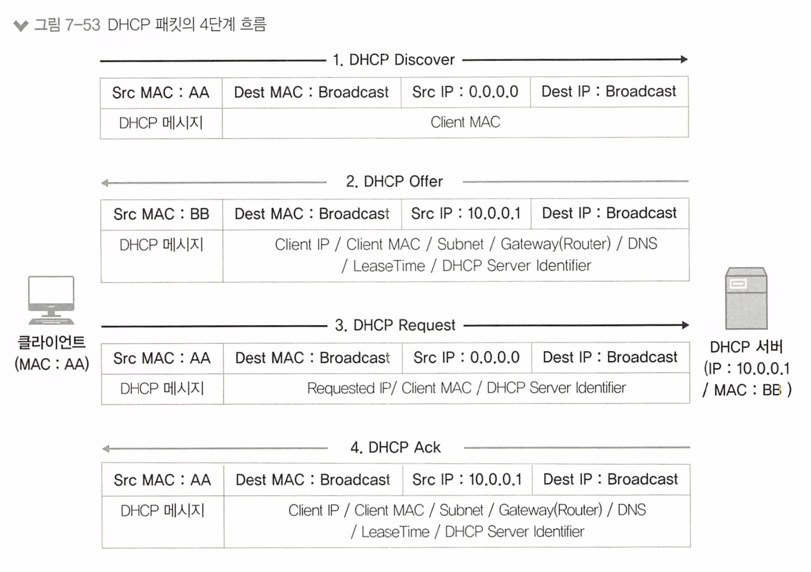

1. **DHCP Discover(탐색 메시지)** : DHCP 클라이언트는 DHCP 서버를 찾기 위해 **DHCP Discover 메시지**를 **브로드캐스트**로 전송.
   * DHCP 클라이언트의 IP가 없으므로 출발지 IP는 0.0.0.0 목적지는 브로드캐스트 주소인 255.255.255.255
   * 서비스 포트는 출발지가 UDP 68, 목적지는 UDP 67번 포트 - IP를 할당받는 과정이므로 패킷을 주고받을 수 없어 UDP 사용
2. **DHCP Offer** : DHCP Discover를 수신한 DHCP 서버는 클라이언트에 할당할 IP 주소와 서브넷, 게이트웨이, DNS 정보, Lease Time 등의 정보를 포함한 DHCP 메시지(이메시지가 DHCP Offer 메시지)를 클라이언트로 전송
   * 클라이언트로부터 메시지를 받으면 서버는 할당할 수 있는 IP를 할당
3. **DHCP Request** :  DHCP 서버로부터 제안받은 IP 주소(Requested IP)와 DHCP 서버 정보(DHCP Server identifier)를 포함한 DHCP 요청 메시지를 브로드캐스트로 전송.
   * 이때도 DHCP 서버가 어느 서버인지 알 수 없으므로 브로드 캐스트로 전송한다 
   * DHCP Offer 메시지에 자신이 제안한  IP 주소를 사용하는지 여부를 확인할 수 있으므로 그것을 확인하여 해당 패킷에만 응답한다. 
4. **DHCP Acknowledgement(ACK)** : DHCP 클라이언트로부터 IP 주소를 사용하겠다는 요청을 받으면, DHCP 서버에 해당 IP를 어떤 클라이언트가 언제부터 사용하기 시작했는지 정보를 기록하고 DHCP Request 메시지를 정상적으로 수신했다는 응답을 전송.


DHCP Offer에서 Lease Time(임대 시간)에 대한 정보를 준다고 했다.

임대 시간이 다 지나면 클라의 IP는 수거되어 사용되지 모샇므로 갱신이 필요하다

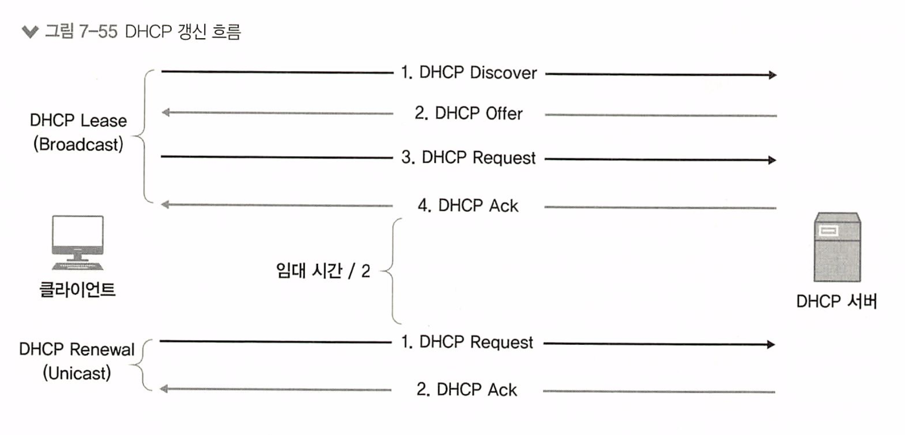

임대 시간(Lease Time)이 50%가 지나면 DHCP 갱신 과정을 수행한다.

1. DHCP Request를 전송
   * 임대 과정과 달리 이미 사용중인  IP 정보가 있으므로 DHCP Discover와 DHCP Offer 과정을 생략한다.
   * 임대 과정과 달리 브로드 캐스트가 아닌 유니캐스트로 진행한다
2. 초기 갱신에 실패하면, 임대시간의 75%가 지났을 경우 다시 갱신을 시도한다. 
   * 이때도 갱신에 실패하면 추가 갱신 없이 임대 시간이 모두 지난 후 IP를 반납하고, 처음부터 임대 과정을 거쳐 IP를 할당받게 된다.


> 

**DHCP 메시지 타입**

| 메시지 타입                         | 내용                                                         |
| ----------------------------------- | ------------------------------------------------------------ |
| DHCP Discover                       | 클라이언트가 DHCP 서버를 찾는 메시지                         |
| DHCP Offer                          | DHCP 서버가 IP 설정값에 대해 클라이언트에게 제안하는 메시지  |
| DHCP Request                        | 클라이언트가 DHCP 서버에서 제안받은 설정값을 요청하는 메시지 |
| DHCP Decline                        | 클라이언트가 이미 사용 중인 IP를 받았음을 DHCP 서버에 알려주는 메시지 |
| DHCP Ack                            | DHCP 서버가 클라이언트의 요청을 수락하고, 네트워크 설정을 보내주는 메시지 |
| DHCP Nak (Negative Acknowledgement) | DHCP 서버가 클라이언트의 요청을 수락하지 않는다는 메시지     |
| DHCP Release                        | 클라이언트가 현재 할당받은 IP 주소를 반납할 때 사용하는 메시지 |
| DHCP Inform                         | 이미 IP 주소를 가진 클라이언트가 추가적인 구성 옵션 정보를 요청하는 메시지 |


## DHCP 서버 구성

DHCP 서버는 리눅스의 DHCP 데몬을 사용해 구성하거나, 스위치, 라우터. 방화벽, VPN과 같은 네트워크, 보안 장비에서도 DHCP 서비스가 가능하다.

DHCP 서버를 구성할 때 주로 설정하는 값은 다음과 같다.

- **IP 주소 풀(IP 범위)**: 클라이언트에게 할당할 수 있는 IP 주소의 범위. 이 주소 풀은 DHCP 서버가 관리하며, 클라이언트가 DHCP 서버에 IP 주소를 요청하면 서버는 이 범위 내에서 주소를 할당한다.
- **예외 IP 주소 풀(예외 IP 범위)**: IP 주소 풀 내에서도, 특정 IP 주소는 예외적으로 할당되지 않는다. 이 주소들은 대개 네트워크 장비나 서버 등, 고정 IP 주소가 필요한 장치에게 할당된다.
- **임대 시간(Lease Time)**: DHCP 서버가 IP 주소를 얼마 동안 클라이언트에게 "임대"해 줄 것인지를 정하는 시간. 임대 시간이 만료되면, 클라이언트는 IP 주소를 갱신하거나 새로운 IP 주소를 요청해야 한다.
- **서브넷 마스크(Subnet Mask)**: IP 주소와 함께 할당되는 정보로, 이를 통해 클라이언트는 자신이 속한 네트워크 (서브넷)를 파악할 수 있다.
- **게이트웨이(Router)**: 클라이언트가 인터넷 등 외부 네트워크로 접근할 때 사용하는 라우터의 IP 주소
- **DNS(Domain Name Server)**: 클라이언트가 도메인 이름을 IP 주소로 변환하는 데 사용하는 DNS 서버의 IP 주소

