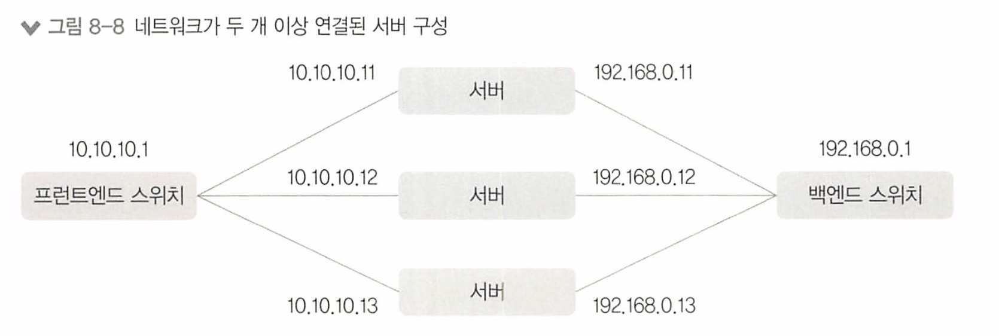

# 8장 서버 네트워크 기본

[toc]

우리가 만든 서비스를 사용자에게 제공하려면 서버와 네트워크 연결을 통해 통신이 되도록 구성하는 과정이 필요하다.

# 8.1 서버의 네트워크 설정 및 확인


## 8.1.1 리눅스 서버 네트워크

리눅스에서는 설정 파일이 텍스트 형태이고 텍스트를 수정하여 시스템 구성을 변경한다.

### 8.1.1.1 CentOs의 네트워크 설정

Centos 네트워크 설정 파일 경로

```
/etc/sysconfig/network-scripts
```

# 8.2 서버의 라우팅 테이블

웹용 프론트엔드, 백엔드 네트워크를 별도로 디자인 하는 경우 다음과 같은 네트워크가 사용될 수 있다.



`외부 공인망 네트워크`와 통신해야 하는 프런트엔드 네트워크 쪽 어댑터에만 디폴트 게이트웨이 를 설정하고 백엔드를 연결하는 어댑터에는 별도로 적절한 라우팅 정보를 반드시 설정해야 한다.

## 8.2.1 서버의 라우팅 테이블 확인

- 목적지(Destination)
- 서브넷(Genmask)
- 게이트웨이(Gateway)
- 인터페이스(Iface)
- 우선순위(Metric)

서버의 라우팅 테이블 확인하면 대부분 다음과 같이 출력된다.


**목적지 네트워크와 서브넷**
목적지 네트워크와 서브넷은 서버가 통신하려는 목적지 IP주소에 맞는 라우팅을 선택하는 기준이 된다.

예를들어, 서버가 통신하려는 목적지가 10.10.20.10일때,

라우팅 테이블에 목적지 네트워크와 서브넷이 각각 10.10.20.0/24 이면 

해당 라우팅 테이블이 표현하는 목적지 네트워크 범위가 10.10.20.0~255이므로 통신하려는 목적지인 10.10.20.10이 포함되어 해당 라우팅을 적용한다.

**게이트웨이**

게이트웨이는 선택된 목적지로 가기 위해 서버에서 선택하는 **넥스트 홉**

* 넥스트 홉 : 데이터 패킷이 목적지에 도달하기 위해 다음으로 이동해야 하는 장비나 노드
  * 라우팅 테이블을 참조하여 넥스트 홉을 결정한다

**인터페이스**

서버의 네트워크 카드. 어떤 물리적인 경로로 패킷을 내보낼지 설정한다.

* 각 인터페이스에는 고유한 MAC 주소와 IP 주소가 할당되며, 이를 통해 네트워크에서 해당 장치를 식별하고 통신할 수 있다

**우선순위(메트릭)**

* 라우팅 테이블이 두 개 이상 존재할 때 어떤 라우팅 테이블을 선택할지 정하는 값

**라우팅 추가 설정 예제**

라우팅 테이블 추가하는 설정 방법

```
route add { - host | -net } Target[/prefix] [gw Gw] [metric M] [ [dev] If]
```

ex

```shell
# route add - host 10.10.10.10 gw 10.1.1.1
- 특정 10.10.10.10 서버가 목적지인 경우, 10.1.1.1로 라우팅
# route add -net 10.10.10.0/24 dev etho
- 10.10.10.0/24 네트워크 대역이 목적지인 경우, eth0 인터페이스로 라우팅
# route add -net 10.10.10.0/24 gw 10.1.1.6 metric 20
- 10. 10. 10.0/24 네트워크 대역이 목적지인 경우, 10.1.1.6으로 라우팅. 이 라우팅 경로의 metric 값을 20으로 설정
```

라우팅 테이블 삭제 명령어

```
route del { - host | -net } Target[/prefix] [gw Gw] [metric M] [ [dev] If]
```


# 8.3 네트워크 확인을 위한 명령어 

갑자기 서버가 정상적으로 통신이 되지 않거나 서비스가 정상적으로 제공되지 않는 문제가 발생할 때 더 유용하게 사용될 수 있다.

## ping(Packet InterNet Groper)

**ping**은 IP 네트워크를 통해 특정 목적지까지 네트워크가 잘 동작하고 있는지 확인하는 네트워크 명령어

ICMP(Internet Control Message Protocol)라는 인터넷 프로토콜을 사용하고 ICMP의 제어 메시지를 통해 여러 가지 네트워 크 상태를 파악할 수 있다

**리눅스 ping 명령어 옵션**

| 옵션          | 설명                                                         |
| ------------- | ------------------------------------------------------------ |
| -c count      | ping을 보내는 패킷(ECHO_REQUEST)을 몇 번 보내고 종료할 것인지를 지정. 기본 설정은 강제로 정지(CTRL+C)할 때까지 패킷을 지속적으로 보냄. |
| -i interval   | 패킷을 보내는 시간 간격. 기본 설정값은 1초. 슈퍼 유저의 경우, 0.2 이하로 설정 가능. |
| -I interface  | 패킷을 보낼 때, 출발지 주소를 지정. 실제 IP 값을 지정하거나 인터페이스 이름을 지정하면 출발지 주소가 변경됨. 이 옵션을 사용하지 않는 경우, 라우팅 테이블에 의해 나가는 인터페이스(Outgoing-Interface)의 IP 주소가 출발지 주소가 됨. |
| -s packetsize | 패킷 크기를 지정. 기본 설정값은 56바이트(8바이트의 ICMP 헤더가 추가로 붙어 64바이트를 송신). |


**리눅스에서 ping을 사용해 목적지 8.8.8.8(google dns)로 100바이트 크기의 ping 패킷을 2회 보내는 예제**

```bash
[root@zigi ~]# ping 8.8.8.8 -c 2 -s 100 # 패킷 2번, 크기는 100바이트 송신
PING 8.8.8.8 (8.8.8.8) 100(128) bytes of data.
108 bytes from 8.8.8.8: icmp_seq=1 ttl=56 time=37.0 ms
108 bytes from 8.8.8.8: icmp_seq=2 ttl=56 time=36.8 ms
--- 8.8.8.8 ping statistics ---
2 packets transmitted, 2 received, 0% packet loss, time 1001ms
rtt min/avg/max/mdev = 36.845/36.945/37.046/0.216 ms
```

* `time`은 패킷이 보내지고 응답이 돌아오는 데 걸린 시간(밀리초)

## traceroute

traceroute는 출발지부터 통신하거나 목적지까지의 네트워크 경로를 확인할 때 사용하는 명령어

* ping은 목적지 단말이 잘 동작하는지 확인하는 데 사용

traceroute는 중간 경로의 더 상세 한정보를 얻는 데 사용한다.

어느구간에서 문제가 발생한 지 알 수 있고,

목적지까지의 네트워크 응답 시간이 느린 경우. 어느 구간에서 응답 시간이 느려지는지도 알아낼 수 있다.

**TTL(Time TO Tlive) 사용**

traceroute는 IP 헤더의 TTL을 이용하는데 TTL을 1부터 1씩 증가시키면서 목적지 도달시까지 패킷을 반복적으로 전송하면서 경로를 추적한다.


명령어

```bash
traceroute [옵션] 목적지 IP 주소
```

리눅스 traceroute 명령어 옵션

| 옵션                           | 설명                                                         |
| ------------------------------ | ------------------------------------------------------------ |
| -, --icmp                      | ICMP 프로토콜을 이용하여 traceroute를 수행합니다.            |
| -T, --tcp                      | TCP SYN 패킷을 이용하여 traceroute를 수행합니다. 기본 서비스 포트는 80입니다. |
| -n                             | IP 주소를 도메인 이름이 아닌 숫자 형식으로 표시합니다(도메인 이름 해석을 수행하지 않음). |
| -p port, --port=port           | traceroute 수행에 사용될 특정 포트를 지정합니다.             |
| -s src addr, --source=src addr | 패킷이 나가는 인터페이스가 아닌 다른 IP 주소를 출발지 IP로 지정합니다. |

* 리눅스/유닉스 계열에서는 UDP를 기반으로 동작한다.

## netstat(network statistics)

netstat은 서버의 다양한 네트워크 상태를 확인하는 데 사용하는 명렁어. 

주로 서비스 포트 상태를 확인하는 용도로 가장 많이 사용된다. 

명령어

```
netstat [옵션]
```

| 옵션             | 설명                                                         |
| ---------------- | ------------------------------------------------------------ |
| -a, --all        | 모든 연결과 수신 대기 포트를 표시합니다.                     |
| -n, --numeric    | 주소와 포트 번호를 숫자 형식으로 표시합니다. (예: http -> 80) |
| -r, --route      | 라우팅 테이블을 표시합니다.                                  |
| -i, --interfaces | 인터페이스별 입출력 패킷 통계를 표시합니다.                  |
| -S, --statistics | 네트워크 통계 데이터를 출력합니다.                           |
| -p, --programs   | 프로세스 ID(PID)와 프로그램 이름을 출력합니다.               |
| -t, --tcp        | TCP 연결만을 출력합니다. 이는 TCP와 TCPv6를 모두 포함합니다. |
| -4 / -6          | IPv4 또는 IPv6 연결에 대해 출력합니다.                       |

## nslookup (name server lookup)

nslookup은 DNS(Domain Name Server)에 다양한 도메인 관련 내용을 질의해 결값을 전송받을 수 있는 네트워크 명령

**주요 DNS 정보**

| DNS    | IP                             |
| ------ | ------------------------------ |
| SK     | 219.250.36.130, 210.220.163.82 |
| LG     | 168.126.63.1, 168.126.63.2     |
| KT     | 164.124.101.2, 203.248.252.2   |
| GOOGLE | 8.8.8.8, 4.4.4.4               |

**기본 사용법**:

```bash
nslookup [domain]
```

이 명령은 주어진 도메인에 대한 기본 DNS 정보를 조회

예:

```bash
nslookup www.google.com
```

**특정 DNS 서버에 대한 조회**:

```bash
nslookup [domain] [dns-server]
```

이 명령은 주어진 도메인에 대해 특정 DNS 서버를 사용하여 조회

**역 조회 (Reverse lookup)**:

```bash
nslookup [ip-address]
```

이 명령은 주어진 IP 주소에 대한 호스트 이름을 조회

## telnet(tele network)

 telnet 명렁어를 네트워크 문제 해결 용으로 특정 서비스가 열려 있는지 확인하는 용도로 사용 가능

명령어

```bash
telnet 목적지 IP 서비스 포트
```

**서비스 사용 가능시(포트 오픈시)**

```
root@zigi:~# telnet naver.com 80

Trying 125.209.222.141...
Connected to 125.209.222.141.
Escape character is '^]'.
```

* 위와같이 나온다.

**서비스 사용 불가능시(포트 오픈 불가능시)**

```
root@zigi:~# telnet naver.com 81
Trying 125.209.222.141..
```

텔넷으로 서비스를 테스트할 때 접근이 불가능한 이유는 보통 다음과 같은 몇가지 경우가 대부분이다.

출발지 네트워크 설정이나 연결이 올바르다고 가정한다면

- 도착지 단말이 꺼져 있거나 네트워크에 정상적으로 연결되어 있지 않은 경우

- 도착지 단말의 네트워크 설정에 문제가 있는 경우

  1. 출발지로부터 해당 서비스가 동작 중인 서버까지의 경로가 정상적으로 잡혀 있지 않은 경우

  2. 출발지로부터 해당 서비스가 동작 중인 서버까지의 경로상 보안 장비 등에 의해 차단된 경우
  3. 도착지 단말의 방화벽이나 iptables와 같은 보안 기능에서 차단된 경우
  4. 도착지 단말이 정상적으로 서비스가 열려 있지 않은 경우(서비스 포트가 Listening 상태가 아니거나 서버 서비스가 구동되지 않았거나 다른 포트로 매핑되어 서비스가 올라온경우)

> 텔넷은 평문으로 전송하여 취약하므로 SSH를 사용해야 한다.

## tcpdump

tcpdump는 네트워크 인터페이스를 오가는 패킷을 캡처 해보는 명령어

옵션

| 옵션               | 설명                                                         |
| ------------------ | ------------------------------------------------------------ |
| -i 인터페이스      | 패킷을 캡처할 인터페이스                                     |
| src IP 주소        | 출발지 IP 주소를 지정해 필터링                               |
| dst IP 주소        | 목적지 IP 주소를 지정해 필터링                               |
| host IP 주소       | 출발지/목적지와 상관없이 IP 주소를 지정해 필터링             |
| -n                 | 이름으로 표기되는 호스트 네임을 실제 IP 주소로 표기 (Localhost -> 127.0.0.1) |
| -nn                | 이름으로 표기되는 서비스 포트를 실제 포트 번호로 표기(http -> 80) |
| src port 포트 번호 | 출발지 포트를 지정해 필터링                                  |
| dst port 포트 번호 | 목적지 포트를 지정해 필터링                                  |
| port 포트 번호     | 출발지/목적지와 상관없이 tcp 포트를 지정해 필터링            |
| tcp 또는 udp       | tcp 또는 udp만 필터링                                        |
| -c 출력수          | tcpdump로 출력할 결과의 개수                                 |
| -w 파일명          | tcpdump의 결과를 화면에 출력하지 않고 파일명으로 저장        |
| -r 파일명          | 파일로 저장한 tcpdump 파일을 화면에 출력                     |

* 필터링 옵션은 and나 or을 이용해 필터 조건을 조합할 수 있다.
* 제외하려면 조건 앞에 not 키워드를 입력하면 된다.

**HTTP 서비스 패킷 캡처**

```
tcpdump -i eth tcp port 80
```


와이어샤크로도 캡쳐가 가능하다.