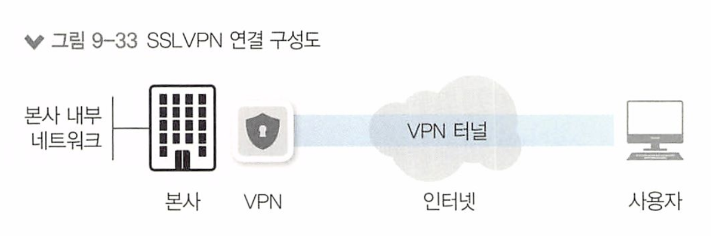
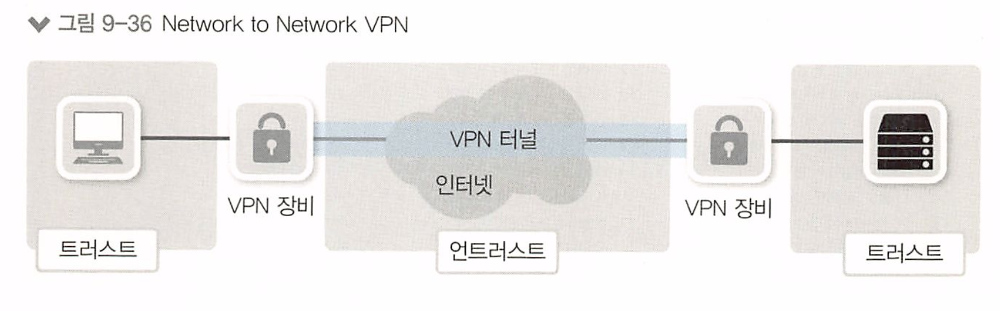

# 9장 - 보안

[toc]

# 9.1 보안의 개념과 정의

## 9.1.1 정보 보안의 정의

3대 보안 정의

- 기밀성(Confidentiality) : 인가되지 않은 사용자가 정보를 보지 못하게 하는 모든 작업 
  - 대표적 작업 : 암호화
- 무결성(Integrity) : 정확하고 완전한 정보 유지에 필요한 모든 작업
  - MD5, SHA와 같은 해시 함수를 이용해 변경여부를 파악
- 가용성(Availability) : 정보가 필요할 때 접근을 허락하는 일련의 작업

## 9.1.2 네트워크의 정보 보안

네트워크 입장에서 정보 보안은 수집된 정보를 침해하는 행동을 기술적으로 방어하거나 정보 송수신을 방어하는 작업

## 9.1.3 네트워크 보안의 주요 개념

네트워크 보안의 목표 : 외부 네트워크로부터 내부 네트워크를 보호

* Trust 네트워크 ; 외부로부터 보호받아야할 네트워크
* Untrust 네트워크 : 외부로부터 보호받아야할 네트워크

* DMZ 네트워크(DeMilitarized Zone) : 우리가 운영하는 내부 네트워크이지만 외부 사용자에게 개방해야 하는 서비스 네트워크

네트워크 보안 분야는 `트래픽의 방향` 과 `용도` 에 따라 두 가지로 나눌 수 있다.

- 인터넷 시큐어 게이트웨이(Internet Secure Gateway)\

- 데이터 센터 시큐어 게이트웨이(Data Center Secure Gateway)

  

**인터넷 시큐어 게이트웨이(Internet Secure Gateway)**

- 트러스트(또는 DMZ) 네트워크 -> 언트러스트 네트워크로의 통신을 통제
- 인터넷으로 나갈때는 그에 대한 정보와 요청 패킷을 적절히 인식하고 필터링하는 기능이 필요하다

웹 필터(Web Filter), Application Controler, Sandbox와 같은 다양한 서비스와 장비가 포함된다.

내부 사용자가 인터넷으로 통신할 때 보안을 통제하기 위해 사용된다

**데이터 센터 시큐어 게이트웨이(Data Center Secure Gateway)**

*  언트러스트 네트워크에서 트러스트(또는 DMZ)로의 통신을 통제
* 우리 서비스는 고성능이 필요하고 외부의 직접 공격을 막아야 하므로 공격 관련 정보가 더 중요하다

IPS, Web Application Firewall, Anti-Ddos(Distribute Denial of Service) 등의 장비가 사용된다 

### 9.1.3.1 네트워크 보안 정책에 따른 분류

네트워크 보안 정책 수립에 따라 네트워크 보안은 두 가지로 나눌 수 있습니다.

- 화이트리스트(White List)
- 블랙리스트(Black List)

**화이트리스트**

방어에 문제가 없다고 명확히 판단되는 통신만 허용하는 방식

일반적으로 IP와 통신 정보에 대해 명확히 아는 경우에 사용 

회사 내부에서 사용하는 방화벽이 명확한 정책에 의해 필요한 서비스만 허용하는 화이트 리스트 방식을 주요 사용한다

**블랙리스트**

공격이라고 명확히 판단되거나 문제가 있었던 `IP 리스트`나 `패킷 리스트`를 기반으로 `데이터베이스`를 만들고 그 정보를 이용해 방어하는 형태  

 

최근 보안 위협이 증가하면서 화이트리스트 기반 정책이 많이 사용된다.

그러나 화이트리스트는 많은 관리 인력을 필요로 하므로,

블랙리스트 기반 방어 정책을 수립하고 공격 데이터베이스를 최신으로 유지하는것이 바람직하다

### 정탐, 오탐, 미탐(탐지 에러 타입)

공격을 탐지할 때 예상한 내용과 다른 결과가 나온 경우를 오탐지, 미탐지 라고 구분하고

정상적으로 탐지한 경우를 정상 탐지(정탐) 이라고 한다.

예상했던 상황과 탐지 결과에 따라 다른 4가지 경우가 나타날 수 있다.

|           | 공격 상황 (True)               | 정상 상황 (False)               |
| --------- | ------------------------------ | ------------------------------- |
| 공격 인지 | True Positive (정상 탐지) | False Positive (오 탐지)   |
| 정상 인지 | False Negative (미 탐지)  | True Negative  (정상 탐지) |

1. **True Positive(정탐)** : Yes라고 추론했는데 정답이 Yes인 경우(공격이라고 추론했는데 실제로 공격인 경우): 
2. **False Negative(정탐)** : No라고 추론했는데 정답이 No인 경우(공격이 아니라고 추론했는데 실제로 공격이 아 닌 경우)
3. **False Positive(오탐)** : Yes라고 추론했는데 정답이 No인 경우(공격이라고 추론해 드롭했는데 공격이 아닌 경우)
4. **True Negative(미탐)** : No라고 추론했는데 정답이 Yes인 경우(공격이 아니라고 패킷을 허용했는데 실제로 공격인 경우):

True Positive(정탐), False Negative(정탐) (1,2번)은 공격과 공격아닌것을 구분했으므로 정상적인 동작,

그러나 3번 오탐과 예상했던 결과와 동작이 다른 경우 튜닝 작업이 필요한 경우이다

# 9.2 보안 솔루션의 종류

새로운 형태의 장비가 출시되더라도 기존 보안 정비에 새로운 보안 솔루션을 추가하는 형태로 보안을 강화한다.

데이터 센터에서 보안 장비를 디자인할 때 `DDos - 방화벽 - IPS - WAF 형태와 같이` 여러 단계로 공격을 막도록 인라인 상에 여러 장비를 배치한다. 

모든 공격을 장비 한 대로는 방어할 수 없으므로 여러 장비의 기능으로 단계적으로 방어합니다.

## DDos 방어 장비

DDoS는 "Distributed Denial of Service"의 약어로, 분산 거부 서비스 공격이다.

DDoS 공격은 다수의 컴퓨터 또는 디바이스들로부터 대상 시스템으로 트래픽을 집중시켜, 해당 시스템의 리소스를 고갈시키거나 네트워크 대역폭을 넘치게 함으로써 서비스에 접근하는 사용자들에게 정상적인 서비스를 받지 못하게 만든다.

## WAF

WAF(wel Application Firewal)는 웹 서버를 보호하는 전용 보안 장비로 HTTP. HTTPS처럼 웹 서 버에서 동작하는 웹 프로토콜의 공격을 방어한다. 

IDS/IPS 장비보다 범용성이 떨어지지만 `웹 프로토콜`에 대해서는 더 세밀히 방어할 수 있다.

WAP는 다음과 같이 다양한 형태의 장비나 소프트웨어로 제공

- 전용 네트워크 장비
- 웹 서버의 플러그인
- ADC 플러그인
- 프록시 장비 플러그인

## 샌드박스(sandbox)

Sandbox는 컴퓨터 시스템 내에서 애플리케이션 또는 프로그램을 `격리된 환경`에서 실행시키는 보안 기술

리된 환경은 원래의 시스템과 완전히 분리되어 있으며, 애플리케이션이 다른 시스템 컴포넌트에 영향을 미치지 않도록 보호한다.

 보통은 가상화 기술을 사용하여 구현된다

Sandbox의 주요 목적은 다음과 같습니다:

1. **보안**: 악성 코드나 악성 소프트웨어의 실행을 방지하고, 시스템을 보호하여 중요한 데이터나 리소스가 손상되거나 유출되지 않도록 한다
2. **시스템 안정성**: Sandbox는 애플리케이션이 시스템 전반에 영향을 미치지 않도록 분리된 환경에서 실행되기 때문에, 애플리케이션의 오류나 충돌이 전체 시스템에 영향을 미치지 않도록 한다
3. **애플리케이션 분석**: 보안 전문가들은 악성 코드나 새로운 애플리케이션의 동작을 분석하고 테스트하기 위해 샌드박스 환경을 사용한다. 

## NAC

NAC는 "Network Access Control"의 약어로, 네트워크 접근 제어를 의미

네트워크에 접속함 때 인가된 사용자만 내부망에 접속할 수 있고 인가받기 전이나 승인에 실패한 사 &자는 전소한 수 없도록 제어하는 기술

# 9.3 방화벽

## 9.3.1 방화벽의 정의

방화벽은 4계층에서 동작하는 패킷 필터링 장비. 

3, 4계층 정보를 기반으로 정책을 세울 수 있고 해당 정책과 매치되는 패킷이 방화벽을 통과하면 그 패킷을 허용(Allow, Permil)하거나 거 부(Deny)할 수 있다

## 9.3 현대적 방화벽의 등장(SPI 엔진)

현재 우리가 '방화벽'이라고 부 르는 모든 장비는 세션 기반으로 동작하는 상태 기반(SP1) 엔진을 탑재하고 있는데,

 상태 기반 방화벽(Stateful Inspection Firewall)이다.

상태 기반 방화벽은 네트워크 트래픽을 추적하고, 각 연결의 상태를 유지하며, 특정 연결이 허용되었는지 여부를 판단하는 데에 상태 정보를 사용한다.

SPI 엔진은 패킷의 상태야 방향성을 인지해 정책을 적용할 수 있어서

내부에서 외부 인터넷으로 통신을 시도해 받은 응답과 외부에서 내부로 직접 들어오려는 패킷을 구분할 수 있다.

## 9.3.4 방화벽 동작 방식

1. 장비에 패킷이 들어오면 우선 세션 상태 테이블을 확인
2. 조건에 맞는 세션 정보가 세션 테이블에 있을 때. 포워딩 테이블을 확인(라우팅, ARP 포함).
3. 조건에 맞는 세션 정보가 세션 테이블에 없을 때, 방화벽 정책을 확인.
4. 방화벽 정책은 맨 위의 정책부터 확인해 최종 정책까지 확인한 후 없을 때 암시적인 거부(mplicit Denial) 규칙을 참고해 차단한다.
5. `허용 규칙이 있으면` 내용을 세션 테이블에 적어 넣는다.
6. 포워딩 테이블을 확인(라우팅, ARP 포함).
7. 조건에 맞는 정보가 포워딩 테이블에 있을 때. 적절한 인터페이스로 패킷을 포워딩.
8. 조건에 맞는 정보가 포워딩 테이블에 없을 때. 패킷을 폐기한다.

### 5-튜플 데이터

5-튜플은 TCP/IP 연결을 구성하는 5개의 서로 다른 값의 집합이다. 

출발지, 도착지, IP, 포트, 프로토콜 5가지 데이터이다

1. source ip : 데이터를 전달하는 출발지 ip
2. source port : 데이터를 전달하는 출발지의 포트 번호
3. destination ip : 데이터를 전달받는 목적지 ip
4. destination port : 이터를 전달받는 목적지의 포트 번호
5. protocol : 프로토콜 번호(3계층 프로토콜 지시자로 TCP. UDP를 지정할 때 사용. TCP는 6, UDP는 17)

이러한 정보들은 TCP/IP 프로토콜 스택을 통해 데이터를 주고받을 때 사용되며, 인터넷에서 데이터의 원래 위치와 목적지를 식별하고 라우팅하는 데에 사용된다.

## 9.3.6 방화벽의 한계

방화벽은 OSI 3,4 계층에서만 동작하므로 근본적으로 바이러스를 감지하거나 백도어나 등을 방어할 수는 없다.

> 즉 애플리케이션 계층에서 이루어지는 공격은 방어할 수가 없다

1. `애플리케이션 단위 보안의 제한`: 방화벽은 애플리케이션 계층까지의 정교한 보안 제어가 어렵기 때문에 새로운 애플리케이션에 대한 정확한 식별과 제어가 어려울 수 있습니다.
2. `제로데이 공격 대응의 어려움`: 새로운 취약점이 발견되어 처음 보고된 공격인 경우, 방화벽은 효과적인 대응이 어려울 수 있습니다.
3. `암호화 트래픽의 처리`: HTTPS와 같이 암호화된 트래픽을 해독하지 못하여 악성 행위를 감지하는데 어려움이 있을 수 있습니다.
4. `내부 위협에 대한 제한`: 방화벽은 주로 외부로부터의 접근을 제어하지만, 내부에서의 악의적인 행동에 대한 대응이 제한적일 수 있습니다.
5. `복잡성과 관리 부담`: 다양한 보안 정책과 규칙의 관리는 복잡하고 번거로운 작업일 수 있으며, 이로 인해 인간의 실수로 보안 위협이 증가할 수 있습니다.
6. `높은 대역폭에서의 성능`: 대규모 네트워크에서 방화벽은 높은 대역폭을 처리하는데 어려움을 겪을 수 있고, 성능 문제가 발생할 수 있습니다.

이런 문제 때문에 IDS IPS가 개발되었따.

# 9.4 IPS, IDS

방화벽의 한계인 OSI 3,4 계층에서만 동작한다는점, 애플리케이션 단위 보안의 제한, 제로데이 공격 대응의 어려움, 암호화 트래픽의 처리, 내부 위협에 대한 제한, 복잡성과 관리 부담, 높은 대역폭에서의 성능이 안나옴으로 인해서

애플리케이션 계층에서 이루어지는 다양한 공격을 탐지, 방어하기 위해 IDS와 IPS가 개발되었따.

## 9.4.1 IPS와 IDS의 정의

*  IPS(Intrusion Prevention System) : 침입 방지 시스템

*  IDS(Intrusion Detection System) : 침입 탐지 시스템

**IDS(Intrusion Detection System) : 침입 탐지 시스템** 

공격자가 시스템을 해킹시도할 때 탐지를 목적으로 개발된 시스템으로서 방어보다 탐지에 초점을 맞추고 트래픽을 복제해 검토하여 침입 여부를 판단한다.

**IPS(Intrusion Prevention System) : 침입 방지 시스템**

공격이 발견되면 직접 차단하는 장비이다.

트래픽이 지나가는 인라인 상에 장비를 배치하고 통신에 개입하여

트래픽 차단, 세션 이해 등을 한다.

## 9.4.2 IPS IDS의 동작 방식 

기본적으로 IPS는 공격 데이터베이스(Signaturc)를 사용한 패턴 매칭 방식으로 운영되지만 

프로토콜 어노말리(Protocol Anomaly), 프로파일 어노말리(Profile Anomaly) 등의 다른 기법으로 공격을 방어하기도 한다. 

* 공격 데이터베이스는 주로 시그니처 데이터베이스라고도 불리며, 알려진 공격의 패턴이나 특징을 저장하고 있는 데이터베이스

### 패턴 매칭 방식

기존 공격이나 취약점을 통해 공격에 방식에 대한 데이터를 쌓아 데이터베이스에 저장하고

해당 패턴의 공격이 들어오면 패킷을 방어하고 차단한다

### 어노말리 공격 방어

패턴 매칭 기반의 공격 방어는 극미한 변화만 생겨도 적절한 대응이 어려웠다.

때문에 기존 블랙리스트 기반의 방어 방식인 패턴 기반 방어의 한계 떄문에 IPS에서도 화이트 리스트 기반으로 방어하는것이

어노말리 기법이다

**프로파일 어노말리 (Profile Anomaly)**

네트워크 트래픽의 '정상적인' 프로파일을 학습하고, 그 프로파일에서 크게 벗어난 행동을 탐지하는 방식. 

* 관리자가 정해놓은 기준이나 IPS 장비가 정해진 기준과 다른 행위가 일어나면 공격으로 판단한다.

이는 통계적, 행동적 방법 등을 사용하여 구현될 수 있다. 

예를 들어, 특정 사용자가 보통 일반적인 근무 시간에만 로그인하는데, 이와 달리 새벽 시간에 로그인하면 이는 프로파일 어노말리로 간주될 수 있다.

**프로토콜 어노말리 (Protocol Anomaly)**: 

특정 프로토콜이 정상적인 상황에서 어떻게 동작하는지를 알고, 그와 다르게 동작하는 패킷을 탐지하는 방식. 

예를 들어, TCP 프로토콜의 정상적인 3-way handshake 과정을 IPS가 알고 있을 때, 이와 다르게 동작하는 패킷은 공격으로 간주할 수 있다.

감염된 내부 PC가 외부와 공격을 위한 통신을 할 때에는 잘 알려진 서비스 포트를 사용하지만,

실제 해당 서비스 포트에서 동작하는 프로토콜이 아닌 다른 프로토콜을 사용하면 공격을 의심하여 제어한다.

### 9.4.3 IPS, IDS 한계와 극복 (NGIPS)

IPS는 오탐이 많이 발생하므로 초기에 설치된 환경에 맞는 튜닝작업을 오래 해주어야 하며 별도 의 관제 인력이 필요하다.

* 모니터링하고 최적화 작업
* 너무 많은 오탐으로 서비스 장애

이로 인해 NGIPS(Next Generation IPS) 개념의 장비가 나오게 되었다.

NGIPS는 

* 애플리케이션 인식 기능(Application Awareness), 
* 사용자 인식 기능(User Identity Awareness), 
* 통합적인 위협 관리 기능(Integrated Threat Management) 등을 제공하여,

 보다 정교한 보안을 제공하며, 잘못된 경보(false positives)를 줄이고, 운영의 효율성을 향상시킨다.

그러나, NGIPS도 완벽하지는 않으며, 여전히 세밀한 튜닝과 전문적인 관리가 필요하다는 점은 변하지 않는다

## 9.5.2 DDoS 방어 장비

DDoS 공격을 탐지해 공격을 수행하는 IP 리스트를 넘겨주면 방어 장비나 ISP 내부에서 이 IP를 버리는 것이 가장 흔한 DDoS 방어 기법

* DDoS 공격을 탐지하면, 공격에 참여하는 IP 주소들의 리스트를 만들 수 있다. 그 다음에 방어 장비나 인터넷 서비스 제공자(ISP)에 제공하여 해당 IP를 버린다.

두 가지 DDoS 방어 기법: 

* 인라인(탐지 및 방어를 하나의 장비에서), 

* 아웃 오브 패스(Out of Path: 탐지 및 방어를 다른 장비에서 수행)

DDoS 장비가 DDoS 여부를 판별하는 방식 

프로파일링 기법 :  평소 데이터 흐름을 습득해 일반적인 대역폭, 세션량, 초기 접속 량, 프로토콜별 사용량 등을 저장한다. 

이렇게 습득한 데이터와 일치하지 않는 과도한 트래픽이 인입되면 알려주고 차단한다

## 9.5.3 DDos 공격 타입

DDos 공격은 다양한 기법이 있지만 일반적으로  3가지가 있다.

* 회선 사용량을 가득 채우는 볼류메트릭 공격volumetric Autack) : 네트워크 대역폭을 포화 상태로 만들어, 적정 수준의 트래픽이 통과하지 못하게 한다

* 3, 4계층의 취약점과 리소스 고갈을 노리는 프로토콜 공격(Protocol Altack) : 대표적인 예로는 SYN 플러드, Ping of Death, Smurf DDoS 등 

* 애플리케이션의 취약점을 주로 노리는 애플리케이션 공격(Application Attack) : 대표적인 예로는 HTTP 플러드, Slowloris, Zero-day DDoS 등

다음은 DDoS의 주요 공격 타입을 정리한 표이다

| 볼륨 기반(Volumetric) 공격 | 프로토콜 공격                                                | 애플리케이션 공격                                            |                                                              |
| -------------------------- | ------------------------------------------------------------ | ------------------------------------------------------------ | ------------------------------------------------------------ |
| 무엇인가                   | 대용량의 트래픽을 사용해 대상의 대역폭을 포화시키는 공격. 간단한 증폭기술을 사용해 생성하기 쉽다. | 3, 4계층 프로토콜 스택의 취약점을 악용해 대상을 액세스할 수 없게 만드는 공격 | 7계층 프로토콜 스택의 약점을 악용하는 공격. 가장 정교한 공격 및 식별, 완화에 가장 까다로운 공격 |
| 장애를 어떻게 일으키는가   | 최종 자원(웹 사이트 또는 서비스)에 대한 액세스를 완전히 차단할 수 있다. 쓸모없는 패킷이 회선을 모두 차지해 정상적인 서비스 트래픽이 통과할 수 없다 | 공격에 의해 생성된 트래픽 양은 공격 대상이나 중간 위험 리소스의 처리 용량을 모두 사용해 서비스 중단을 유발함. 일반적인 네트워크 장비나 네트워크 보안 장비를 대상으로 하는 경우가 많음. | 대상과의 연결을 설정한 후 프로세스와 트랜잭션을 독점해 서버 자원을 소모시킴. 애플리케이션 프로토콜 자체의 취약점이나 서비스를 제공하는 플랫폼의 취약점을 악용하는 경우가 많음. |
| 예제                       | NTP 증폭, DNS 증폭, UDP 플러드(UDP Flood), TCP 플러드        | SYN 플러드, Ping of Death                                    | HTTP 플러드, Slowloris, Zero-day DDoS 등                     |

# 9.6 VPN

Vitual Private Network

물리적으로 전용선이 아닌, 논리적으로 직접 연결한 것처럼 망을 구성하는 기술.

* Tunnel(터널) : 논리적으로 직접 연결된 것처럼 만들어주는 통로

*  IPSEC, SSI과 같은 암호화 기법을 제공하는 프로토콜이 VPN에 주로 사용된다.

일반적으로 본사-지사처럼 네트워크 대 네트워크 연결에는 IPSEC VPN 기술이 사용되고 

개인 사용자가 본사 네트워크로 접속하는 경우에는 SSLVPN 기술이 사용된다.

**IPSEC VPN** 

본사와 지사 사이의 안전한 연결을 설정할 때 IPSec VPN을 사용.

* 본사, 지사 모두 IPSEC VPN 기능을 지원한다

IPSec은 IP 보안(IP Security)의 약자로, IP 패킷을 암호화하고 인증하여 인터넷 프로토콜(IP)을 통한 통신의 보안을 강화하는 일련의 프로토콜

**SSLVPN**

개인 사용자가 본사 네트워크로 접속하는 경우에는 SSLVPN 기술을 사용

SSL VPN은 Secure Sockets Layer VPN의 약자로, 웹 브라우저를 사용하여 인터넷에서 안전하게 액세스할 수 있는 VPN. 

웹 트래픽을 암호화하는 SSL(Secure Sockets Layer) 또는 그 후속인 TLS(Transport Layer Security) 프로토콜을 사용

## 9.6.1 VPN 동작 방식

VPN(Virtual Private Network)은 공용 네트워크(인터넷)를 통해 사설 네트워크에 안전하게 접근할 수 있게 해주는 기술

VPN의 동작 방식을 이해하려면, VPN이 세 가지 주요 요소를 사용하여 데이터를 보호하는 방법을 이해해야 한다. 

**터널링**, **암호화**, **인증** 

1. **터널링(Tunneling)**: 터널링은 원본 네트워크 패킷을 다른 패킷 내에 캡슐화하는 과정. 즉, 실제 네트워크 데이터가 VPN 프로토콜 헤더에 '포장'되어 이동하는 것이다. 이렇게 생성된 터널은 사용자와 VPN 서버 사이에 안전한 연결을 제공한다.
2. **암호화(Encryption)**: 암호화는 데이터를 보호하고, 데이터가 전송 중에 도청되거나 해독되는 것을 막는 데 사용된다. VPN에서 발생하는 데이터는 암호화 되어, 데이터가 VPN 터널을 통해 이동하는 동안에는 이해할 수 없는 형태로 변환된다. 이 데이터는 오직 올바른 암호화 키를 가진 수신자만이 해독(복호화)할 수 있다.
3. **인증(Authentication)**: VPN 연결이 설정될 때, VPN 클라이언트와 서버는 서로를 인증해야 한다. 이 인증 과정을 통해 사용자가 신뢰할 수 있는 네트워크에 접속하고 있는지를 확인한다. 일반적으로는 사용자 이름과 비밀번호를 통해 인증이 이루어지지만, 보안 수준이 높은 환경에서는 디지털 인증서나 토큰을 사용한 두 요소 인증을 사용하기도 한다.

VPN은 가상 네트워크를 만들어주는 장비로 터널링 기법을 사용한다. 

패킷을 터널링 프로토콜로 감싸 통신하는 기법이 터널링 기법이다. 

일반적으로 VPN은 3가지 형태로 구현된다.

1. Host to Host 통신 보호 : 
2. Network to Network 통신 보호 : 
3. Host가 Network로 접근할 때 보호

**Host to Host 통신 보호**

두 호스트간에 직접 VPN 터널을 연동하는 기법. 

* 일반적으로 이 VPN은 잘 사용하지 않는다.

* 그림을 보면 언트러스트 네트워크이다. 즉 외부 네트워크

**Network to Network 통신 보호**

 본사-지사 같은 특정 네트워크를 가진 두 종단을 연결하는 경우 IPSEC 프로토콜 스택이 가장 많이 사용된다. 

* 그림에서 보면, 다른 네트워크로 가기 위해 중간에 언트러스트 네트워크를 통과하는데, 이 과정에서 VPN 터널링을 이용해서 데이터를 보호한다.
* 본사와 지사 사이에서 암호화된 "터널"을 만들어, 이 "터널"을 통해 전송되는 데이터를 보호한다.

**Host가 Network로 접근할 때 보호**

Host to Network 통신은 모바일 사용자가 일반 인터넷망을 통해 사내망으로 연결하는 경우이며

IPSEC과 SSI 프로토콜이 범용적으로 사용된다.

VPN을 사용하면 인터넷 트래픽이 암호화되고, 사용자의 IP 주소가 VPN 서버의 IP 주소로 대체되므로, 사용자의 실제 위치와 활동을 숨길 수 있어 warning.or.kr 같은 사이트나 들어갈 수 업는 사이트를 우회할 수 있는것이다.

* 즉 IP주소를 숨겨 돌려 접속하는것이다.

