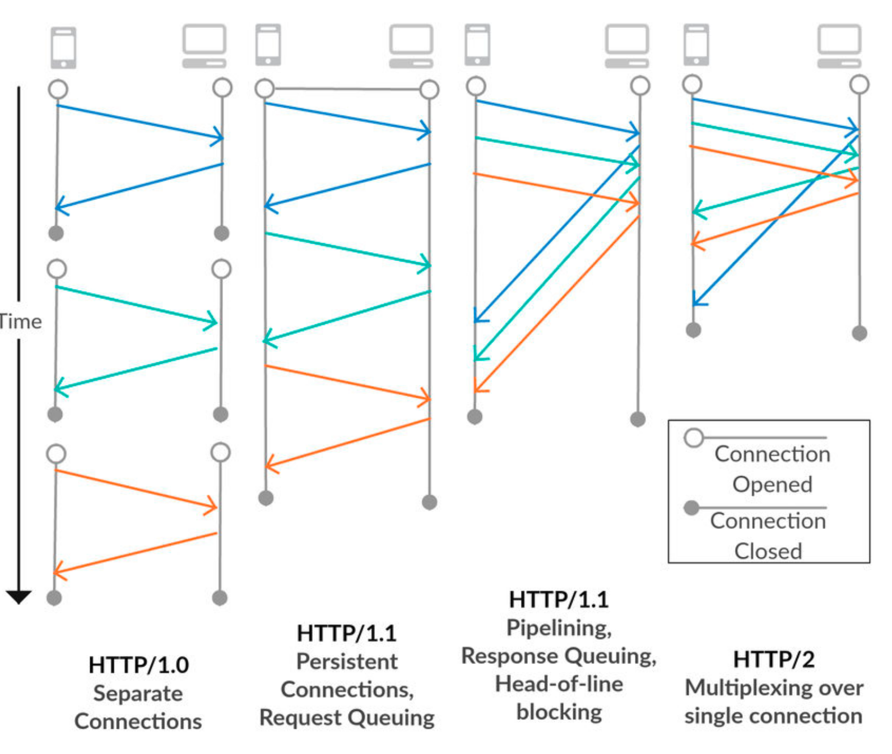
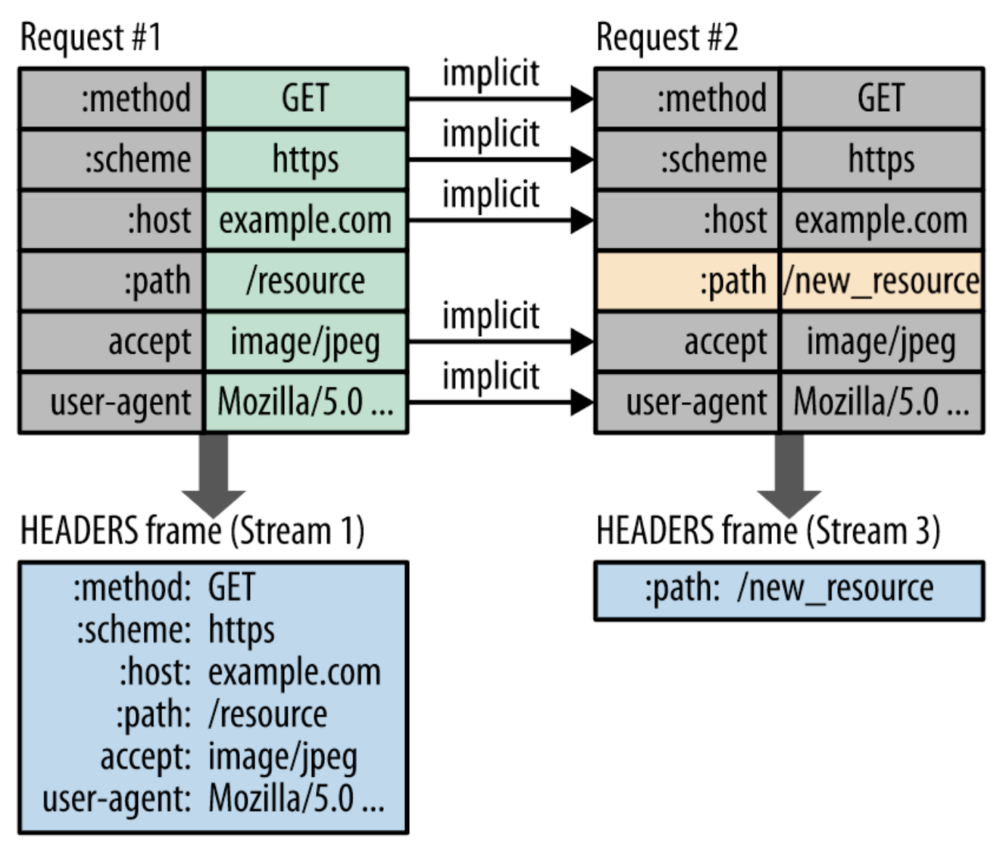

# http1.1 vs 2.0

HTTP, 또는 하이퍼텍스트 전송 프로토콜은 인터넷을 통한 데이터 전송을 위한 프로토콜이다.



## HTTP 1.1

HTTP 1.1은 1997년에 도입되었으며, HTTP 1.0의 개선된 버전. (엄청 오래됌)

HTTP 1.0에서 TCP 세션을 맺는 것을 중복해서 수행하는 성능 이슈가 있었고, HTTP 1.1에서 Keep-alive를 통해서 해당 문제를 해결했다.

또한, 파이프라이닝(Pipelining) 기능을 도입하여 여러 요청을 동시에 보낼 수 있도록 했는데 이는 TCP 안에 두 개 이상의 HTTP 요청을 담아 Network Latency을 줄이는 방식이다. 

* HTML 문서 내에 포함된 여러 개의 리소스 요청 `CSS 파일을 로드하는 link 태그, 이미지 파일을 로드하는 img 태그, 자바스크립트를 로드하는 script 태그 등` 이 개별적으로 전송되고 응답 또한 개별적으로 전송된다.

그러나, 기본적으로 Connection당 하나의 요청을 처리하도록 설계되었는데 이때문에 HOL Blocking 이라는 문제가 발생하였다.


또한, HTTP 1.1의 큰 단점 중 하나는 `헤더의 오버헤드 문제`이다.

HTTP 1.1 헤더는 많은 메타데이터를 포함하며 . 헤더 정보가 크면 클라이언트와 서버 간에 전송되는 데이터의 양이 불필요하게 증가하게 된다.

매 요청 시 마다 `중복된 Header` 값과 특히 Cookie를 전송하게 되며(별도의 domain sharding을 하지 않았을 경우) 또한 해당 domain에 설정된 cookie 정보도 매 요청 시 마다 헤더에 포함되어 전송되기 때문이다. 

불필요한 데이터를 주고 받는데 네트워크 자원이 소비되는 문제가 발생한다.

### HOL Blocking(**Head Of Line)**)

 하나의 응답이 지연될 때, 해당 응답이 완료될 때까지 다음 요청은 **무한대기상태**가 된다.

즉 앞선 요청이 지연되면 이후 응답도 모두 지연되는 현상이다.

예 ) 하나의 TCP연결에서 3개의 이미지( a.png, b.png, c.png )를 얻으려고 하는 경우 HTTP의 요청 순서.

```
| --- a.png --- |
    
    | --- b.png --- |

       | --- c.png --- |
```

순서대로 첫번째 이미지를 요청하고 응답 받고 다음 이미지를 요청하게 되는데 만약 첫번째 이미지를 요청하고 응답이 지연되면 아래 그림과 같이 b.png, c.png 당연히 첫번째 이미지의 응답 처리가 완료되기 전까지 대기하게된다. 

TCP 안에 여러 개의 HTTP 요청이 왔으므로 완료된 응답부터 보내면 되지 않을까라고 생각할 수 있지만 서버는 TCP에서 요청을 받은 순서대로 응답을 해야하기 때문이다. 


## HTTP 2.0

HTTP 2.0은 2015년에 도입되었으며, HTTP/1.1 에 비해 제한사항들을 해결하고 개선하며 성능 뿐 아니라 속도면에서도 우수하다.

### Multiplexed(다중화) Streams

단일 TCP 연결을 통해 여러 요청과 응답 메시지를 동시에 보내는 다중화(Multiplexing) 기능을 도입하여

한 커넥션에 여러 개의 메시지를 주고 받을 수 있다. 이는 요청에 대한 응답이 순차적으로 도착해야 하는 HTTP 1.1의 '헤드 오브 라인 블로킹' 문제를 해결하여 웹 페이지 로딩 시간이 단축되고 효율성이 향상되었다


### Stream Prioritization(스트림 우선 순위)

한 커넥션에 여러 요청을 보낼 수 있게 개선되었다고 했다.

그런데, 만약  하나의 HTML 문서에 CSS 파일과 여러 IMG 파일이 있을 때 

만일 여러 IMG 파일을 응답하느라 CSS 파일의 응답이 느려지면 클라이언트는 렌더링을 하지 못하고 기다리게 되며, 렌더링이 끝나지 않으면 의미가 없다.

이 문제를 해결하기 위한 간단한 방법은, 중요한 파일이 먼저(예를들면 HTML나 CSS) 응답되도록 우선순위를 부여하는 것이다. 

그래서 여러 요청이 와도, 우선순위를 부여하여 우선순위가 높은것이 먼저 응답되도록 하여 효율적으로 동작할 수 있게 하였다. 


### Header Compression

기존(HTTP 1.1)에서는 이전에 보냈던 요청과 중복되는 Header도 똑같이 전송하느라 자원을 낭비했다.

HTTP 2.0에서는 이를 개선하기 위해 Header정보를 압축하고, Header 정보를 압축하기 위해 Header Table과 Huffman Encoding 기법을 사용하여 처리하는데 이를 HPACK 압축방식이라 부르며 별도의 명세서(RFC 7531)로 관리한다.

클라이언트가 두번의 요청을 보낸다고 가정하면 HTTP/1.x의 경우 두개의 요청 Header에 중복 값이 존재해도 그냥 중복 전송한다. 

하지만 HTTP/2에선 Header에 중복값이 존재하는 경우 Static/Dynamic Header Table 개념을 사용하여 중복 Header를 검출하고 중복된 Header는 index값만 전송하고 중복되지 않은 Header정보의 값은 Huffman Encoding 기법으로 인코딩 처리 하여 전송한다.



헤더 테이블 관리 방법은, 클라이언트와 서버가 각각 Header Table을 관리하고, 이전 요청과 동일한 필드는 table의 index만 보낸다.

변경되는 값은 Huffman Encoding 후 보냄으로써 Header의 크기를 경량화한 것이다. 


### Server Push( 서버 푸시)

HTTP 2.0 이전에는, 클라이언트가 요청을 보내야 서버가 응답할 수 있고, 서버는 클라이언트에게 독자적으로 메시지를 저농하지 못했따.

그러나 HTTP 2.0 부터 서버는 클라이언트의 요청에 대해 요청하지도 않은 리소스를 보내줄 수 있다.

예를 들어, 클라이언트(브라우저)가 HTML문서를 요청하고 해당 HTML에 여러 개의 리소스(CSS, Image...) 가 포함되어 있는 경우 HTTP 1.1에서 클라이언트는 요청한 HTML문서를 수신한 후 HTML문서를 해석하면서 필요한 리소스를 재 요청하는 반면에,

HTTP 2.0에서는 Server Push기법을 통해서 클라이언트가 요청하지 않은 (HTML문서에 포함된 리소스) 리소스를 Push 해주는 방법으로 클라이언트의 요청을 최소화 해서 성능 향상을 이끌어 낼 수 있다. 


이러한 차이점들 때문에 HTTP 2.0은 데이터 전송에 있어 HTTP 1.1보다 더 효율적이고 빠른 성능을 제공한다. 

하지만 HTTP 2.0이 HTTP 1.1을 완전히 대체하지는 않았다. 

기존 시스템이 HTTP 1.1에 의존하고 있거나, HTTP 2.0에 대한 지원이 제한적인 경우가 여전히 있기 때문이다.

그리고 HTTP 2.0 는 기본적으로 TLS기반으로 동작하므로 반드시 TSL / SSH 인증서가 필요하다. (HTTPS)

# 웹 브라우저에서 http 2.0을 안쓸까?

HTTP 2.0은 2015년에 정식 승인되어 사용하고 있다.

Google Chrome, Mozilla Firefox, Safari, Microsoft Edge 등의 웹 브라우저는 HTTP 2.0을 지원한다.

* https://caniuse.com/http2

웹 서버 또한 HTTP 2.0을 지원해야 클라이언트가 HTTP 2.0을 이용할 수 있다. 

웹 서버가 HTTP 2.0을 지원하지 않으면, 2.0으로 요청을 보내도 1.1로 응답받게 된다. 

즉 웹 브라우저가 HTTP 2.0을 지원한다고 하더라도 실제로 HTTP 2.0을 사용하는지는 서버의 지원 여부와 보안 설정에 따라 달라지며,

이를 확인하려면 개발자 도구를 이용하거나, 특정 웹 사이트가 HTTP 2.0을 지원하는지를 검사하는 curl 등과 같은 도구를 사용해서 확인해야 한다.

# Spring Boot에서 HTTP 2.0 적용

> HTTP 2.0은 기본적으로 SSL 적용이 필수이다. 

* https://docs.spring.io/spring-boot/docs/current/reference/html/howto.html#howto.webserver.configure-http2

Spring Boot (Tomcat Base) 에서는 설정값 하나로 HTTP/2.0 적용이 가능하다.

server.http2.enabled 값을 true로 변경해주면 된다.

```properties
server.http2.enabled=true
```

```yml
server:
	http2:
		enabled: true
```

server.http2.enabled 옵션이 false이면 HTTP 2.0은 지원하지 않고 HTTP 1.1로만 통신이 된다. 

설정해놓고, HTTPS가 적용이 안되어있으면 HTTP 2.0를 사용하지 못한다.

이경우에는 웹 브라우저가 1.1을 사용하여 연결을 시도하게 된다.


따라서 HTTP 2.0을 사용하려면 반드시 SSL(HTTPS)를 적용하자. 


HTTPS ( SSL) 적용하는 방법은 아래를 참고하자

* https://docs.spring.io/spring-boot/docs/current/reference/html/howto.html#howto.webserver.configure-ssl

```yml
server:
  port: 8443
  ssl:
    key-store: "classpath:keystore.jks"
    key-store-password: "secret"
    key-password: "another-secret"
    key-alias: tomcat
```


# HTTP 2.0 초기 구현시 고려해야 할 점

1. HTTPS가 필요하다 : HTTP 2.0 을 설정하더라도 SSL이 적용이 안되어있으면 HTTP 2.0이 적용되지 않는다. 따라서 서버에 HTTPS(SSL) 설정이 필요하다.
2. 서버나 클라이언트가 지원하는지 여부를 확인해봐야 한다. 지원하지 않으면 대부분 1.1로 통신되기 때문에 의미가 없다.
3. 인프라에 프록시, 로드 밸런서, CDN 등의 중간 미들웨어, 게이트웨이 등이 있다면, 이들도 HTTP/2를 지원해야 한다. 이들을 통해서 요청이 흘러갈텐데 이들이 지원 안하면 무용지물이기 때문이다.