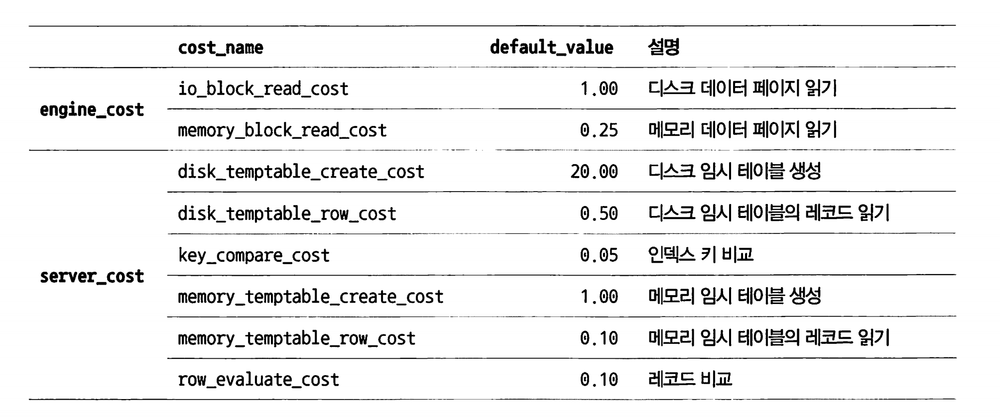
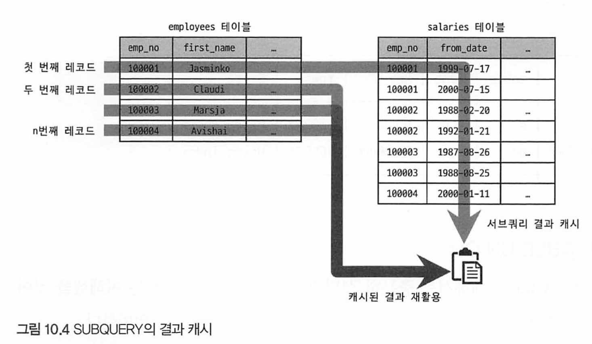

# 10장 실행 계획

[toc]

통계 정보는 실행 계획(explain)에 가장 많은 영향을 미친다.

# 10.1 통계 정보


## 테이블 및 인덱스 통계 정보

비용 기반 최적화(RBO)에서 통계 정보가 정확하지 않다면 쿼리를 제대로 수행하지 않는다.

* 1억건의 레코드가 저장되어있는데 갱신되지 않아 10건 미만이라고 판단하면? -> 적으니까 풀테이블 때릴수도있다.

### MySQL 서버의 통계 정보

MySQL 5.6부터 InnoDB 테이블에 대한 통계 정보를 영구적으로 관리한다.

* mysql 데이터베이스의 innodb_index_stats, innodb_table_stats 테이블

```mysql
mysql> show databases;

mysql> use mysql;

mysql> show tables like '%_stats';
+---------------------------+
| Tables_in_mysql (%_stats) |
+---------------------------+
| innodb_index_stats        |
| innodb_table_stats        |
+---------------------------+
```

테이블 생성시 STATS_PERSISTENT 옵션으로 테이블 단위로 영구적인 통계 정보를 보관할지 말지 결정할 수 있다.

```mysql
CREATE TABLE tab_test(
	a, b, c, PRIMARY KEY(a)
) ENIGNE=InnoDB
STATS_PERSISTENT= { DEFAULT | 0 | 1};
```

* STATSPERSISTENT = 0 : MySQL 5.5 이전 방식대로 메모리에 관리하고 테이블에 저장 안함
* 1 : 통계 정보를 mysql 데이터베이스의 innodb_index_stats, innodb_table_stats 테이블에 저장
* DEFAULT : STATS_PERSISTENT 옵션을 설정하지 않은것과 동일하며, 통계를 영구 관리 할지 여부를 innodb_stats_persistent 시스템 변수 값으로 결정
  * 기본적으로 1이다

innodb_index_stats의 통계 정보의 각 칼럼은 다음과 같은 값을 저장하고 있다.

```mysql
mysql> select * from mysql.innodb_index_stats where database_name = 'tuning' and table_name = '직급';
+------------+------------+--------------+------------+-------------+-------------------------------------+
| table_name | index_name | stat_name    | stat_value | sample_size | stat_description                    |
+------------+------------+--------------+------------+-------------+-------------------------------------+
| 직급       | PRIMARY    | n_diff_pfx01 |     298141 |          20 | 사원번호                            |
| 직급       | PRIMARY    | n_diff_pfx02 |     443021 |          20 | 사원번호,직급명                     |
| 직급       | PRIMARY    | n_diff_pfx03 |     441951 |          20 | 사원번호,직급명,시작일자            |
| 직급       | PRIMARY    | n_leaf_pages |       1189 |        NULL | Number of leaf pages in the index   |
| 직급       | PRIMARY    | size         |       1252 |        NULL | Number of pages in the index        |
+-----------+------------+--------------+------------+-------------+-------------------------------------+

```

* `innodb_index_stats.stat_name`='n_diff_pfx%': 인덱스가 가진 유니크한 값의 개수

- `innodb_index_stats.stat_name`='n_leaf_pages ': 인덱스의 리프 노드 페이지 개수
- `innodb_index_stats.stat_name`='size' : 인덱스 트리의 전체 페이지 개수
- `innodb_table_stats.n_rows`: 테이블의 전체 레코드 건수
- `innodb_table_stats.clustered_index_size`: 프라이머리 키의 크기(InnoDB 페이지 개수)
- `innodb_table_stats.sum_of_other_index_sizes`: 프라이머리 키를 제외한 인덱스의 크기(InnoDB 페이지 개수)

> sum_of_other_index_sizes의 값이 0이라면 ANALYZE TABLE 명령어를 시랳ㅇ하면 된다


자주 테이블의 통계정보가 갱신되면 의도하지 않은대로 실행할 수 있다.

* innodb_stats_auto_recalc 시스템 변수 값을 OFF로 하면 자동 갱신을 방지하고 영구적으로 통계정보를 사용한다 -> 컬럼이 많아지면 갱신이 되지 않아 느려질수도 있다.

MySQL 5.6 버전 부터는 다음을 제공한다.

- `innodo_stats_transient_sample_pages` : 이 시스템 변수의 기본값은 8인데. 이는 자동으로 통계 정보 수집이 실행될 때 8개 페이지만 임의로 샘플링해서 분석하고 그 결과를 통계 정보로 활용함을 의미한다.
- `innodb_stats_persistent_sample_pages` :  기본값은 20이며, ANALYZE TABLE 명령이 실행되면 임의로 20개 페이지만 샘플링해서 분석하고 그 결과를 영구적인 통계 정보 테이블에 저장하고 활용함을 의미한다.

영구적인 통계 정보를 사용한다면 MySQL 서버의 점검이나 사용량이 많지 않은 시간을 이용해 더 정확한 통계 정보를 수집할 수도 있다. 

더 정확한 통계 정보 수집에는 많은 시간이 소요되겠지만, 이 통계 정보의 정확성에 의해 쿼리의 성능이 결정되기 때문에 고려할만하다.

## 히스토그램

8.0 버전으로 업그레이드되면서 MySQL 서버도 드디어 칼럼의 데이터 분포도를 참조할 수 있는 히스토그램(Histogram) 정보를 활용할 수 있게 됐다.

### 히스토그램 정보 수집 및 삭제

MySOL 8.0 버전에서 히스토그램 정보는 칼럼 단위로 관리되는데, 이는 자동으로 수집되지 않고 `ANALYZE TABLE ... UPDATE HISTOGRAM` 명령을 실행해 `수동으로` 수집 및 관리된다. 

수집된 허스토그램은 시스템 딕셔너리에 함께 저장되고, MySQL 서버 시작시 딕셔너리의 히스토그램 정보를 `information_schema` DB의 `column_statistics 테이블`로 로드한다. 

#### 히스토그램 정보 수집 조회 예제

```mysql
mysql> describe tuning.직급;
\+--------------+-------------+------+-----+---------+-------+
| Field        | Type        | Null | Key | Default | Extra |
+--------------+-------------+------+-----+---------+-------+
| 사원번호     | int         | NO   | PRI | NULL    |       |
| 직급명       | varchar(50) | NO   | PRI | NULL    |       |
| 시작일자     | date        | NO   | PRI | NULL    |       |
| 종료일자     | date        | YES  |     | NULL    |       |
+--------------+-------------+------+-----+---------+-------+
4 rows in set (0.02 sec)

mysql> analyze table tuning.직급 update histogram on 직급명, 시작일자;
+---------------+-----------+----------+---------------------------------------------------------+
| Table         | Op        | Msg_type | Msg_text                                                |
+---------------+-----------+----------+---------------------------------------------------------+
| tuning.직급   | histogram | status   | Histogram statistics created for column '시작일자'.     |
| tuning.직급   | histogram | status   | Histogram statistics created for column '직급명'.       |
+---------------+-----------+----------+---------------------------------------------------------+
2 rows in set (3.54 sec)
```

```mysql
mysql> SELECT * FROM column_statistics WHERE schema_name='tuning' AND table_name = '직급' \G
```

* 너무 많은 정보가 나오므로 생략 

MysQL 8.0 버전에서는 다음과 같이 2종류의 히스토그램 타입이 지원된다.

- Singleton(싱글톤 히스토그램): 칼럼값 개별로 레코드 건수를 관리하는 히스토그램으로, Value-Based 히스토그램 또는 도수 분포라고도 불린다.
- Equi-Height(높이 균형 히스토그램): 칼럼값의 범위를 균등한 개수로 구분해서 관리하는 히스토그램으로, Height-Balanced 히스토그램이라고도 불린다.

히스토그램은 bucket 단위로 구분되어 레코드 건수나 칼럼값의 범위가 관리된다.

* 싱글톤 히스토그램은 칼럼이 가지는 값별로 버킷이 할당. 각 버킷이 칼럼값만 발생빈도의 비율 2개 값을 가짐
* 높이 균형 히스토그램은 개수가 균등한 칼럼값의 범위별로 하나의 버킷이 할당. 발생 빈도율과 각 버킷의 포함된 유니크한 값 등 4개 값을 가짐

싱글톤 히스토그램은 주로 코드 값(ENUM 등)이 유니크한 값의 개수가 상대적으로 적은 경우 사용 

높이 균형 히스토그램은 칼럼값이 각범위에 대해 레코드 건수 비율이 누적으로 표시. 

**information_schema.colum_statistics 테이블의 HISTOGRAN 칼럼이 가진 나머지 필드**

- `sampLing-rate`: 히스토그램 정보를 수집하기 위해 스캔한 페이지의 비율을 저장한다. 샘플링 비율이 0.35라면 전체 데이터 페이지의 35%를 스캔해서 이 정보가 수집됐다는 것을 의미한다. 물론 샘플링 비율이 높아질수록 더 정 확한 히스토그램이 되겠지만, 테이블을 전부 스캔하는 것은 부하가 높으며 시스템의 자원을 많이 소모한다. 그래서 MySQL 서버는
  - histogram_generation_max_mem_size 시스템 변수에 설정된 메모리 크기에 맞게 적절히 샘플링 한다. 
  - histogram_generation_max_mem_size 시스템 변수의 메모리 크기는 20MB로 초기화돼 있다.
- `histogram-type`: 히스토그램의 종류를 저장한다.
- `number-of-buckets-specified`: 히스토그램을 생성할 때 설정했던 버킷의 개수를 저장한다. 히스토그램을 생성 할 때 별도로 버킷의 개수를 지정하지 않았다면 기본으로 100개의 버킷이 사용된다. 버킷은 최대 1024개를 설정할 수 있지만, 일반적으로 100개의 버킷이면 충분한 것으로 알려져 있다.

> MySQL 8.0.19 이전에서는 샘플링 수집시 풀스캔을 했지만 이후부터는 풀스캔을 하지 않는다. 8.0.19 이전이면 히스토그램 수집시 풀스캔 주의

**생성된 히스토그램 삭제 명령어**

```mysql
mysql> ANLYZE TABLE table_name DROP HISTOGRAM on 컬럼1, 컬럼2;
```

* 딕셔너리 내용만 참조하기 때문에 다른 쿼리 처리 성능에 영향을 주지 않는다
* 그러나 히스토그램이 삭제되면 쿼리 실행 계획이 달라지므로 주의

히스토그램을 삭제하지 않고 옵티마이저가 히스토그램을 사용하지 않게 하려면?

```mysql
mysql> SET GLOBAL optimizer_switch='condition_fanout_filter=off';
```

특정 커넥션 또는 특정 쿼리에서만 히스토그램 사용하지 않으려면?

```mysql
--//현재 커넥션에서 실행되는 쿼리만 히스토그램을 사용하지 않게 설정
mysql> SET SESSION optimizer_switch='condition_fanout_filter=off'

~//현재 쿼리만 히스토그램을 사용하지 않게 설정
mysql> SELECT /*+ SET_VAR(optimizer_switch='condition_fanout_filter=off') */ *
			 FROM ...
```

### 히스토그램의 용도

히스토그램은 특정 칼럼이 가지는 모든 값에 대한 분포도 정보를 가지지는 않지만 각 범위(버킷) 별 로 레코드의 건수와 유니크한 값의 개수 정보를 가지기 때문에 훨씬 정확한 예측을 할 수 있다.

ex) 히스토그램 있을때 없을때 비교

다음 예제의 결과를 보면 옵티마이저는 first name='Zita' 조건에 일치하는 레코드가 224건이 있고,

그중에서 대략 11.11%인 24.8명 정도의 birth date가 1950년대 출생일 것으로 예측했다.

```
+----+--------+----+----------+------+-------------+------+----------+
| id | select_type |  table   | type |      key    | rows | filtered |
+----+-------------+----------+------+-------------+------+----------+
|  1 | SIMPLE      | employees| ref  | ix_firstname| 224  |   11.11  |
+----+-------------+----------+------+-------------+------+----------+
```

birth_date 칼럼에 히스토그랩 정보 수집

```mysql
mysql> ANALZE TABLE employees UPDATE histogram ON first_name, birth_date;
```

다시  실행계획 조회

```mysql
+----+--------+----+----------+------+-------------+------+----------+
| id | select_type |  table   | type |      key    | rows | filtered |
+----+-------------+----------+------+-------------+------+----------+
|  1 | SIMPLE      | employees| ref  | ix_firstname| 224  |   60.82  |
+----+-------------+----------+------+-------------+------+----------+
```

* 대략 60.82%인 136.2명이 1950년대 출생일것으로 예측
* 실제 데이터는 63.84%인 143명이 50년대 출생이다
* 즉 단순 통계정보보단 히스토그램을 이용했을때가 더 정확하다

히스토그램 정보가 없으면 옵티마이저는 데이터가 균등하게 배포돼 있을것으로 예측한다.

* 균등하다는건, 데이터가 균일하게 분포돼있다는 뜻. 즉 서울, 부산, 광주 레코드가 있을 때 셋 다 비슷하다고 착각하는것

`히스토그램 정보가 있으면 특정 범위 데이터가 많고 적음을 식별할 수 있다.`

ex) 2개 테이블 조인을 옵티마이저 힌트를 이용해 강제로 조인의 순서를 변경

```mysql
SELECT /*+ JOIN_ORDER(e, s) */ *
FROM salaries s
INNER JOIN employees e ON e.emp_no=s.emp_no
AND e.birth_date BETWEEN '1950-01-01' AND '1950-02-01'
WHERE s.salary BETWEEN 40000 AND 70000;

Empty set (0.13 sec)

SELECT /*+ JOIN_ORDER(s, e) */ *
FROM salaries s
INNER JOIN employees e ON e.emp_no=s.emp_no
AND e.birth_date BETWEEN '1950-01-01' AND '1950-02-01'
WHERE s.salary BETWEEN 40000 AND 70000;

Empty set (1.29 sec)
```

* birth_date 칼럼과 salary 칼럼은 `인덱스되지 않은 칼럼`이어서 이 칼럼들에 히스토그램이 없다면 옵티마이저는 이 칼럼들의 데이터 분포를 전혀 알지 못하고 실행 계획을 수립하게 된다


각 칼럼에 대해 히스토그램 정보가 있으면 어떤 테이블을 드라이빙으로 하여 먼저 읽어야 조인 횟수를 줄일 수 있을지 옵티마이저가 더 정확하게 판단할 수 있다.


### 히스토그램과 인덱스

MySQL 서버에서는 쿼리의 실행 계획을 수립할 때 사용 가능한 인덱스들로부터 조건절에 일치 하는 레코드 건수를 대략 파악하고 최종적으로 가장 나은 실행 계획을 선택한다

* 인덱스 다이브 : MySQL 옵티마이저가 쿼리의 실행 계획을 결정할 때 사용하는 기술. 인덱스 다이브는 옵티마이저가 인덱스의 실제 페이지를 읽어서 행의 수를 예측하는 데 사용된다.

MySQL 8.0 서버에서는 인덱스된 칼럼을 검색 조건으로 사용하는 경우 그 칼럼의 히스토그램은 사용하지 않고 실제 인덱스 다이브를 통해 직접 수집한 정보를 활용한다. 

* 실제 검색 조건의 대상 값에 대한 샘플링을 실행하는 것이므로 항상 히스토그램보다 정확한 결과를 기대할 수 있기 때 이다. 
* 그래서 MySOL 8.0 버전에서 `히스토그램은 주로 인덱스되지 않은 칼럼에 대한 데이터 분포도를 참조하는 용도`로 사용된다


쿼리**의 검색조건으로 많이 사용되는 컬럼에 일반적으로 인덱스를 생성한다. 그런데 인덱스된 칼럼에 대해 히스토그램 정보를 수집하는 것이 좋을지 고민된다면?**

일반적으로 인덱스 된 컬럼에는 히스토그램정보보다 인덱스 정보를 더 많이 활용하므로 굳이 사용 안해도 된다. -> 인덱스 다이브

그러나 인덱스 다이브는 어느정도 비용이 필요하므로 히스토그램 활용하여 최적화하는것도 고민해볼 수 있다.

1. **데이터의 분포**: 인덱스된 컬럼의 값이 `균등하게 분포되어 있다면, 히스토그램의 이점이 크지 않을 수 있다`. 그러나 값의 분포가 균등하지 않다면, 히스토그램을 통해 옵티마이저는 더 정확한 쿼리 실행 계획을 생성할 수 있다.
2. **쿼리 성능**: 히스토그램 정보가 있으면 옵티마이저는 쿼리 실행 계획을 최적화 할 수 있으므로, 쿼리 성능이 중요한 시스템에서는 히스토그램 정보를 수집하는 것이 좋다.
3. **리소스 사용**: 히스토그램 정보를 수집하고 유지하기 위해서는 추가적인 리소스(스토리지, CPU)를 고려해야 한다.


### 코스트 모델(Cost Model)

MySOL 서버가 쿼리를 처리하려면 다음과 같은 다양한 작업을 필요로 한다.

- 디스크로부터 데이터 페이지 읽기
- 메모리(InnoDB 버퍼 풀)로부터 데이터 페이지 읽기
- 인덱스 키 비교
- 레코드 평가
- 메모리 임시 테이블 작업
- 디스크 임시 테이블 작업

이렇게 전체 쿼리의 비용을 계산하는데 필요한 단위 작업들의 비용을 코스트 모델 이라고 한다.

MySQL 5.7 이전까지는 이 작업비용을 MySQL 소스 코드에 상수화해서 사용했지만 작업들의 비용은 하드웨어마다 다르기 때문에 고정된 비용은 최적의 실행 계획의 방해 요소였다.

때문에 각 이 상수들을 없애고 각 단위 작업의 비용을 DBMS 관리자가 조정할 수 있게 개선됐다.

MySOL 8.0 서버의 코스트 모델은 다음 2개 테이블에 저장돼 있는 설정값을 사용하는데, 두 테이블 모 두 mysql DB에 존재한다.

- server cost 테이블: 인덱스를 찾고 레코드를 비교하고 임시 테이블 처리에 대한 비용 관리. 아래는 컬럼이다. 
  - `cost_name`: 코스트 모델의 각 단위 작업
  - `default_value`: 각 단위 작업의 비용(기본값이며, 이 값은 MySQL 서버 소스 코드에 설정된 값
  - `cost_value`: DBMS 관리자가 설정한 값이 값이 NULL이면 MySQL 서버는 default_value 칼럼의 비용 사용)
  - `last_updated`: 단위 작업의 비용이 변경된 시점(단순 정보성임 쓸모 x)
  - `comment`: 비용에 대한 추가 설명
- engine_cost 테이블: 레코드를 가진 데이터 페이지를 가져오는 데 필요한 비용 관리. 아래는 컬럼이다. 
  - `cost_name`: 코스트 모델의 각 단위 작업
  - `default_value`: 각 단위 작업의 비용(기본값이며, 이 값은 MySQL 서버 소스 코드에 설정된 값
  - `cost_value`: DBMS 관리자가 설정한 값이 값이 NULL이면 MySQL 서버는 default_value 칼럼의 비용 사용)
  - `last_updated`: 단위 작업의 비용이 변경된 시점(단순 정보성임 쓸모 x)
  - `comment`: 비용에 대한 추가 설명
  - `engine_name`: 비용이 적용된 스토리지 엔진
  - `device_type`: 디스크 타입

engine_name칼럼은 스토리지 엔진별로 작업 비용을 설정한다. 기본값은 default이며 스토리지 엔진마다 다르게 가져갈 수 있다.



* 표 : MySQL 8.0 코스트 모델에서 지원하는 단위 작업 8가지


row_evaluate_cost : 스토리지 엔진이 반환한 레코드가 MySQL 엔진이 조건에 일치하는지 평가하는 단위 작업

* row_evaluate_cost 값이 증가할수록 풀 테이블 스캔과 같이 많은 레코드를 처리하는 비용이 높아지고, 인덱스 레인지 스캔과 같이 상대적으로 적은 수를 처리하는 쿼리의 비용이 낮아진다.
* key_compare_cost : 키 값 비교 작업. 값이 증가할수록 레코드 정렬 등과 같이 키 비교 비용이 높아진다.

MySQL 서버에서 각 실행 계획의 계산된 비용(Cost)은 다음과 같이 확인할 수 있다.

```mysql
mysql> EXPLAIN FORMAT=TREE
			 SELECT *
			 FROM employees WHERE first_name='Matt' \G
```

결과

```json
EXPLAIN: {
	"query block": {
	"select id": 1,
	"cost info": {
	"query_cost": "255.08"
	},
	"table": { ... }
```

코스트 모델에서는 각 단위 작업에 설정되는 비용 값이 커지면 어떤 실행 계획들이 비싸지는지 싸지는지 파악하는것이 중요하다.

각 단위 작업이 비용이 변경되면 에상할 수 있는 결과들

* 실행 계획에 전부 영향을 미치진 않지만 단위 작업 비용 조절 할 때 고려할 수 있다.

- `key_compare_cost` 비용을 높이면 옵티마이저가 가능하면 정렬을 수행하지 않는 방향의 실행 계획을 선택할 가능성이 높아진다.
- `row_evaluate_cost` 비용을 높이면 풀 스캔을 실행하는 쿼리들의 비용이 높아지고, 가능능하면 인덱스 레인지 스캔을 사용하는 실행 계획을 선택할 가능성이 높아진다.
- `disk_temptable_create_cost`와 `disk_temptabLe_row_cost` 비용을 높이면 디스크에 임시 테이블을 만들지 않는 방향의 실행 계획을 선택할 가능성이 높아진다.
- `memory_temptable_create_cost`와 `memory_temptable_row_cost` 비용을 높이면 메모리 임시 테이블을 만들지 않는 방향의 실행 계획을 선택할 가능성이 높아진다.
- `io_block_read_cost` 비용이 높아지면 가능하면 InnoDB 버퍼 풀에 데이터 페이지가 많이 적재돼 있는 인덱스를 사용하는 실행 계획을 선택할 가능성이 높아진다.
- `memory_block_read_cost` 비용이 높아지면 InnoDB 버퍼 풀에 적재된 데이터 페이지가 상대적으로 적어도 그 인덱스를 사용할 가능성이 높아진다.

> 꼭 바꿔서 사용해야 되는 것은 아니며 MySQL 전문가가 아니면 함부로 바꾸지 않는것이 좋다.


# 10.2 실행 계획 확인

DESC 또는 EXPLAIN으로 실행 계획 확인이 가능하다

## 실행 계획 출력 포맷 

테이블, 트리, JSON 으로 출력이 가능하다.

```mysql
-- // 테이블
mysql> EXPLAIN
			 SELECT * FROM TABLE ~~ 

-- // 트리
mysql> EXPLAIN FORMAT=TREE
			 SELECT * FROM TABLE ~~ 

-- // JSON
mysql> EXPLAIN FORMAT=JSON
			 SELECT * FROM TABLE ~~ 
		
			 
```

포맷 옵션별로 표시되는 정보의 차이가 있을 수 있지만 실행 계획 흐름에는 큰 차이가 없다.


## 쿼리 실행 시간 확인

EXPLAIN ANALYZE 기능을 사용한다.

* SHOW PROFILE 명령으로 어떤 부분에서 시간이 많이 소요되는지 확인 가능하지만, 단계별로 소요된 시간 정보를 보여주진 않는다.

```mysql
mysql> EXPLAIN ANALYZE FORMAT = TREE
		   SELECT e.emp_no, AVG(s.salary)
		   FROM employees e
				 INNER JOIN salaries s 
				 	ON s.emp_no = e.emp_no
				 		 s.salary > 50000
						 AND s.from_date <= '1990-01-01'
						 AND s.to_date > '1990-01-01'
				WHERE e.first_name = 'Matt'
				GROUP BY e.hire_date;
```

결과

```
A) -> Table scan on <temporary> (actual time=0.001..0.004 rows=48 loops=1)

B)  -> Aggregate using temporary table (actual time=3.799..3.808 rows=48 loops=1)

C)    -> Nested loop inner join (cost=685.24 rows=135, actual time=0.367..3.602 rows=48 loops=1)

D)      -> Index lookup on e using ix_firstname (first_name='Matt')
           (cost=215.08 rows=233, actual time=0.348..1.046 rows=233 loops=1)

E)      -> Filter: ((s.salary > 50000) and (s.from_date <= DATE '1990-01-01') 
																and (s.to_date > DATE '1990-01-01')) (cost=0.98 rows=1)
                   (actual time=0.009..0.011 rows=0 loops=233)

F)          -> Index lookup on s using PRIMARY (emp_no=e.emp_no) (cost=0.98 rows=10)
                 (actual time=0.007..0.009 rows=10 loops=233)
```

TREE 포맷의 실행 계획에서 들여쓰기는 호출 순서를 의미하며, 실제 실행 순서는 다음 기준으로 읽으 면 된다.

- 들여쓰기가 같은 레벨에서는 상단에 위치한 라인이 먼저 실행
- 들여쓰기가 다른 레벨에서는 가장 안쪽에 위치한 라인이 먼저 실행

때문에 위 쿼리의 실행 순서는? 

```
1. D) Index lookup on e using ix_firstname
2. F) Index lookup on s using PRIMARY
3. E) Filter
4. C) Nested loop inner join
5. B) Aggregate using temporary table
6. A) Table scan on (temporary)
```

```
1. employees 테이블의 ix_firstname 인덱스를 통해 first_name=' Watt' 조건에 일치하는 레코드를 찾고
2. salaries 테이블의 PRIMARY 키를 통해 emp_no가 (1)번 결과의 emp_no와 동일한 레코드를 찾아서
3. ((s.salary > 50000) and (s. from_date <= DATE' 1990-01-01') and (s.to_date > DATE '1990-01-01'))
조건에 일치하는 건만 가져와 (필터링)
4. 1번과 3번의 결과를 조인해서
5. 임시 테이블에 결과를 저장하면서 GROUP BY 집계를 실행하고
6. 임시 테이블의 결과를 읽어서 결과를 반환한다.
```

D -> F -> E의 순서는 각 테이블에서 필요한 데이터를 검색하고 필터링하는 과정,

C -> B -> A의 순서는 데이터를 결합, 집계, 반환하는 과정

EXPLAIN ANALYZE 명령의 결과에는 

* 단계별로 실제 소요된 시간(actual time)과 

* 처리한 레코드 건수 (rows),
* 반복 횟수(Loops)

가 표시된다. `실행 계획의 F) 라인에 나열된 필드들의 의미를 한 번 살펴보자.`

* **actual time=0.007.. 0.009**:  `employees` 테이블에서 읽은 `emp_no` 값을 기준으로 `salaries` 테이블에서 일치하는 레코드를 검색하는 데 걸린 시간(밀리초)의미

  * 첫 번째 숫자 값은 첫 번째 레코드를 가져오는 데 걸린 평균 시간(밀리초)을 의미

  - 두 번째 숫자 값은 마지막 레코드를 가져오는 데 걸린 평균 시간(밀리초)을 의미

* **rows=10**:  `employees` 테이블에서 읽은 `emp_no`에 일치하는 `salaries` 테이블의 평균 레코드 건수를 의미

* **loops=233**: `employees` 테이블에서 읽은 `emp_no`를 이용해 `salaries` 테이블의 레코드를 찾는 작업이 반복된 횟수를 의미
  - 결국 여기서는 `employees` 테이블에서 읽은 `emp_no`의 개수가 233개임을 의미.

즉 salaries 테이블에서 emp_no 일치 건을 찾는 작업을 233번 반복 해서 실행했는데, 

`매번` salaries 테이블에서 첫 번째 레코드를 가져오는 데 평균 0.007밀리초가 걸렸으며, 

마지막 레코드를 읽는 데는 평균 0.009밀리초가 걸린 것을 의미한다

* Rows 필드의 값이 10이므로, 여기서는 salaries 테이블에서 emp_no를 검색해서 10개의 레코드를 모두 가져오는 데 평균 0.009밀리 초가 걸린 것


EXPLAIN ANALYZE 명령은 실행게획만 추출하는 EXPLAIN 과 달리 실제 쿼리를 수행하므로,

아주 오래 걸리는 쿼리라면 EXPLAIN으로 먼저 튜닝 한 후 EXLAIN ANALYZE를 수행하는것이 좋다.

# 10.3 실행 계획 분석

```mysql
mysql> EXPLAIN
			 SELECT *
			 FROM employees e
			 INNER JOIN salaries s ON s.emp_no = e.emp_no
			 WHERE first_name='ABC';
```


* 표의 각 줄은 사용된 테이블 의 갯수만큼 출력된다(서브쿼리등으로 생성된 임시 테이블도 한줄로 추가 )
* 실행 순서는 위에서 아래로 순서대로 표시된다.(UNION이나 상관 서브쿼리는 순서대로 표시되지 않을수도 있음)
* 위쪽에 출력된(id 컬럼의 값이 작을수록)결과일수록 쿼리의 OUTER 이거나 먼저 접근한 테이블이고 
* 아래쪽에 출력된 결과(id 컬럼의 값이 클수록) 쿼리의 INNER 또는 나중에 접근한 테이블이다

## id 칼럼

하나의 SELECT 문장은 다시 1개 이상의 하위(SUB) SELECT 문장을 포함할 수 있다.

```mysql
SELECT ...
FROM (SELECT ... FROM tb_test1) tb1, tb_test2 tb2
WHERE tb1.id=tb2.id;
```

위 쿼리는 아래처럼 분리 가능하다.

```mysql
SELECT ... FROM tb_test1;
SELECT ... FROM tb1, tb_test2 tb2 WHERE tb1.id=tb2.id;
```

* SELECT 단위로 구분한것을 단위(SELECT) 쿼리라고 표현한다

id 컬럼은 단위 SELECT 별로 부여되는 식별자 값이다. 이 예제의 경우 2개가 표현된다.

여러개의 테이블이 조인되는 경우 id 값이 증가하지 않고 같은 id 값이 부여된다.

```mysql
EXPLAIN
SELECT e.emp_no, e.first_name, s.from_date, s.salary
FROM employees e, salaries s
WHERE e.emp_no=s.emp_no LIMIT 10;
```


`주의해야 할것은 실행계획의 id 컬럼이 테이블의 접근순서를 의미하진 않는다.`


테이블의 접근 순서가 혼란스러운 경우 `EXPLAIN FORMAT=TREE` 명령을 실행한다.

* 특정 부분이가장 들여쓰기가 많이 되어있다며 먼저 접근했다고 볼 수 있다.

## SELECT_TYPE 컬럼

각 단위 SELECT 쿼리가 어떤 타입의 쿼리인지 표시되는 칼럼이다.

select_type 칼럼에 표시될 수 있는 값은 다음과 같다.

### select_type = SIMPLE

UNION이나 서브쿼리를 사용하지 않는 단순한 SELECT 쿼리인 경우 (쿼리에 조인이 포함된 경우에도 마찬가지다). 

쿼리 문장이 아무리 복잡하더라도 실행 계획에서 `select_type SIMPLE인 단위 쿼리는 하나만 존재한`다. 

일반적으로 제일 OUTER SELECT 쿼리의 select_type이 SIMPLE로 표시된다.

### select_type = PRIMARY

UNION이나 서브쿼리를 가지는 SELECT 쿼리의 실행 계획에서 가장 바깥쪽(Outer)에 있는 단위 쿼리

SIMPLE과 마찬가지로 select_type 이 PRIMARY인 단위 SELECT 쿼리는 하나만 존재하며, 쿼리의 제일 바깥쪽에 있는 SELECT 단위 쿼리가 PRIMARY로 표시된다.

### select_type = UNION

UNION으로 결합하는 단위 SELECT 쿼리 가운데 `첫 번째를 제외한 두 번째 이후 단위 SELECT 쿼리`

UNION의 첫 번째 단위 SELECT는 select_ typeo UNION이 아니라 UNION되는 쿼리 결과들을 모아서 저장하는 임시 테이블(DERIVED)이 select_type으로 표시된다.

### select_type = DEPENDENT UNION

DEPENDENT UNION 또한 UNION select_type과 같이 UNION이나 UNION ALL로 집합을 결합하는 쿼리에서 표시된다. 

DEPENDENT는 UNIONOL UNION ALL로 결합된 단위 쿼리가 외부 쿼리에 의해 영향을 받는 것을 의미한다.

```mysql
EXPLAIN
SELECT *
FROM employees e1 WHERE e1.emp_no IN ( // e1을 먼저 읽음
	SELECT e2. emp_no FROM employees e2 WHERE e2.first_name='Matt'
	UNION
	SELECT e3.emp_no FROM employees e3 WHERE e3.last_name='Matt'
);
```

MySQL 옵티마이저는 IN 내부의 서브쿼리를 먼저 처리하지 않고, 외부의 employees 테이블을 먼저 읽은 다음 서브쿼리를 실행하는데 이때 empLoyees 테이블의 칼럼값이 서브쿼리에 영향을 준다. 


이렇게 내부 쿼리가 외부의 값을 참조해서 처리 될 때 select_type에 DEPENDENT 키워드가 표시된다.

### select_type = UNION RESULT

UNION RESULT는 UNION 결과를 담아두는 테이블을 의미한다. (UNION ALL)

UNION RESULT는 실제 쿼리에서 단위 쿼리가 아니기 때문에 별도의 id값은 부여되지 않는다 (NULL)

* MySQL 8.0 이전 버전에서는 UNION ALL이나 UNION(또는 UNION DISTINCT) 쿼리는 모두 UNION의 결과를 임시 테이블로 생성했는데, MySQL 8.0 버전부터는 UNION ALL의 경우 임시 테이블을 사용하지 않도록 기능이 개선됐다. 

* 하지만 UNION(또는 UNION DISTINCT)은 여전히 임시 테이블에 결과를 버퍼링 한다.

### select_type = SUBQUERY

select_type의 SUBQUERY는 `FROM 절 이외`에서 사용되는 서브쿼리만을 의미한다.

* SELECT절 , WHERE절 등
* 스칼라, 상관, IN, EXISTS, ALL, ANY

실행 계획에서 FROM 절에 사용된 서브쿼리는 select_type이 DERIVED(파생 테이블)로 표시되고, 그 밖의 위치에서 사용된 서브쿼리는 전부 SUBQUERY라고 표시된다

서브쿼리는 사용하는 위치에 따라 각각다른 이름을 지니고 있다.

- 중첩된 쿼리(Nested Query): SELECT되는 칼럼에 사용된 서브쿼리를 네스티드 쿼리라고 한다.
- 서브쿼리(Subquery): WHIERE 절에 사용된 경우에는 일반적으로 그냥 서브쿼리라고 한다.
- 파생 테이블(Derived Table): FROM 절에 사용된 서브쿼리를 MySQL에서는 파생 테이블이라고 하며, 일반 적으로 RDBMS에서는 인라인 뷰(nline View) 또는 서브 셀렉트(Sub Select)라고 부른다.

또한 서브쿼리가 반환하는 값의 특성에 따라 다음과 같이 구분하기도 한다.

* 스칼라 서브쿼리(Scalar Subquery): 하나의 값만(칼럼이 단 하나인 레코드 1건만) 반환하는 쿼리

* 로우 서브쿼리(Row Subquery): 칼럼의 개수와 관계없이 하나의 레코드만 반환하는 쿼리

### select_type = DEPENDENT SUBQUERY

서브쿼리가 바깥쪽(Outer) SELECT 쿼리에서 정의된 칼럼을 사용하는 경우, select_type에 DEPENDENT SUBQUERY라고 표시된다

```mysql
EXPLAIN
SELECT e.first_name,
	(SELECT COUNT (*)
	FROM dept_emp de, dept_manager dm
	WHERE dm.dept_no = de.dept_no AND de.emp_no=e.emp_no) AS cnt 
	// e.emp_no는 OUTER employees 테이블의 emp_no 를 의존
FROM employees e
WHERE e.first_name='Matt';
```

INNER 서브쿼리 결과가 OUTER SELECT 쿼리의 컬럼에 의존적이기 때문에 DEPENDENT 키워드가 붙는다.

또한 OUTER 쿼리가 먼저 수행된 후 SUBQUERY가 실행되야 하므로 

(e.first_name이 Matt인 애들 먼저 찾아야 하니까) 일반 서브쿼리보다는 처리 속도가 느릴때가 많다.

### select_type = DERIVED

DERIVED는 단위 SELECT 쿼리의 실행 결과로 메모리나 디스크에 임시 테이블을 생성하는 것을 의미한다

생성되는 임시 테이블은 파생 테이블이라고 한다.

* MySQL 5.6 버전부터는 옵티마이저 옵션(optinizer_switch 시스템 변수)에 따 라 FROM 절의 서브쿼리를 외부 쿼리와 통합하는 형태의 최적화가 수행되기도 한다. 

또한 옵티마이저 옵션에 따라 쿼리 특성에 맞게 임시 테이블에도 인덱스를 추가해서 만들 수 있다.

만약 MySQL에서 FROM절 서브쿼리를 사용했는데 실행계획이 DERIVED이면 최대한 JOIN으로 해결할 수 있게 쿼리를 바꿔주는 것이 최적화의 첫 단계다.

* 쿼리를 튜닝하기 위해 실행 계획을 확인할 때 가장 먼저 select_ type 칼럼의 값이 DERIVED인 것이 있는지 확 인해야 한다. 서브쿼리를 조인으로 해결할 수 있는 경우라면 서브쿼리보다는 조인을 사용할 것을 강력히 권장한다.

### select_type = DEPENDENT DERIVED

서브쿼리의 실행결과가 외부 쿼리에 의존적이라는 것

MySQL 8.0 버전부터는 래터럴 조인(LATERAL JOIN) 기능이 추가되면서 FROW 절의 서브쿼리에서도 외부 칼럼을 참조할 수 있게 됐다

다음 쿼리는 래터럴 조인의 가장 대표적인 활용 예제

* employees 테이블의 레코드 1건당 salaries 테이블의 레코드를 최근 순서대로 최대 2건까지만 가져와서 조인을 실행한다.

```mysql
SELECT *
FROM employees e
	LEFT JOIN LATERAL
		(SELECT *
		 FROM salaries S
		 WHERE s.emp_no=e.emp_no
		 ORDER BY s.from_date DESC LIMIT 2) AS s2 
	ON s2.emp_no = e.emp_no;
```

래터럴 조인의 경우 LATERAL 키워드를 사용해야 하며, LATERAL 키워드가 없는 서브쿼리에서 외부 컬럼을 참조하면 오류가 발생한다.

실행 계획

```
+----+------------------+----------+------+------------+----------------------+
| id | select_type      | table    | type | key        | Extra                |
+----+------------------+----------+------+------------+----------------------+
|  1 | PRIMARY          | e        | ALL  | NULL       | Rematerialize (<derived2>) |
|  1 | PRIMARY          | (derived2)| ref | auto_key0  |  NULL                |
|  2 | DEPENDENT DERIVED| s        | ref  | PRIMARY    |  Using filesort      |
+----+------------------+----------+------+------------+----------------------+
```

* 2번 id의 테이블이 레터럴 조인으로 사용됐다.

### select_type = UNCACHEABLE SUBQUERY

특정 상황에서 서브쿼리의 결과를 캐시할 수 없을 때 발생하는 `select_type`

조건이 똑같은 서브쿼리가 실행될 때는 다시 실행하지 않고 이전의 실행 결과를 그대로 사용 할 수 있게 서브쿼리의 결과를 내부적인 캐시 공간에 담아둔다.

*  여기서 언급하는 서브쿼리 캐시는  쿼리 캐시나 파생 테이블(DERIVED)과는 전혀 무관한 기능

간단히 SUBQUERY와 DEPENDENT SUBQUERY가 캐시를 사용하는 방법을 비교해 보자



- SUBQUERY는 바깥쪽(Outer)의 영향을 받지 않으므로 처음 한 번만 실행해서 그 결과를 캐시하고 필요할 때 캐시
   된 결과를 이용한다.
- DEPENDENT SUBQUERY는 의존하는 바깥쪽(Outer) 쿼리의 칼럼의 값 단위로 캐시해두고 사용한다.
  - 즉 OUTER 쿼리의 단위로 캐시가 만들어짐

`서브쿼리에 포함된 요소에 의해 캐시 자체가 불가능할 수가 있는데,`

`그럴 경우 select_typeo "TNCACHEABLE SUBQUERY"로 표시된다.` 

캐시를 사용하지 못하게 하는 요소로는 대표적으로 다음과 같은 것들이 있다.

- 사용자 변수가 서브쿼리에 사용된 경우
- NOT-DETERMINISTIC 속성의 스토어드 루틴이 서브쿼리 내에 사용된 경우
- UUID()나 RAND()와 같이 결값이 호출할 때마다 달라지는 함수가 서브쿼리에 사용된 경우

ex)

```mysql
EXPLAIN
SELECT *
FROM employees e WHERE e.emp_no = (
SELECT @status FROM dept_emp de WHERE de.dept no='d005'); // 사용자변수 @status 사용
```


### select_type = MATERIALIZED

주로 FROM 절이나 IN(subquery) 형태의 쿼리에 사용된 서브쿼리의 최적화를 위해 사용된다.

```mysql
EXPLAIN
SELECT *
FROM employees e
WHERE e.emp_no IN (SELECT emp no FROM salaries WHERE salary BETWEEN 100 AND 1000);
```

* 다음 쿼리는 급여가 100보다 크거나 같고 1000보다 적거나 같은 직원들의 정보를 모두 가져오는 쿼리다.

MysQL 5.7 버전부터는 서브쿼리의 내용을 임시 테이블로 구체화(Materialization)한 후, 임시 테이블과 employees 테이블을 조인하는 형태로 최적화되어 처리된다.

```
+----+--------------+------------+--------+-----------+-------+---------------------+
| id | select_type  |  table     | type   |     key   | rows  |        Extra        |
+----+--------------+------------+--------+-----------+-------+---------------------+
|  1 | SIMPLE       | (subquery2)| ALL    | NULL      | NULL  | NULL                |
|  1 | SIMPLE       | e          | eq_ref | PRIMARY   |    1  | NULL                |
|  2 | MATERIALIZED | salaries   | range  | ix_salary |    1  | Using where; Using index |
+----+--------------+------------+--------+-----------+-------+---------------------+
```

* id가 2인 테이블이 먼저 처리되어 임시 테이블로 구체화 되었다.
* 9.3.1.13절 구체화 에서 더 자세하게 볼수있다.

## table 컬럼

MySQL 서버의 실행 계획은 단위 SELECT 쿼리 기준이 아니라 테이블 기준으로 표시된다. 

테이블의 이름에 별칭이 부여된 경우에는 별칭이 표시된다

```mysql
mysql> EXPLAIN SELECT NOW();
```

* 별도 테이블을 사용하지 않으면 table 칼럼에 NULL이 표시된다

```
+----+-------------+-------+-----+---------+----------------+
| id | select type | table | key | key len | Extra          |
+----+-------------+-------+-----+---------+----------------+
| 1  | SIMPLE      | NULL  | NULL| NULL    | No tables used |
+----+-------------+-------+-----+---------+----------------+
```


table 칼럼에 `<derived N>` 또는 <union M.N>과 같이 ">”로 둘러싸인 이름이 명시되는 경우 임시 테이블을 의미한다. 

또한 ">” 안에 항상 표시되는 숫자는 단위 SELECT 쿼리의 id 값을 지칭한다.


* SELECT 쿼리의 id = 2 인 실행 계획으로부터 만들어진 파생 테이블을 조회했다는 의미 

이 3개의 칼 럼만으로 위의 실행 계획을 분석해 보자.

1. 첫 번째 라인의 테이블이 `<derived2>` 므로 이 라인보다 id 값이 2인 라인이 먼저 실행되고 그 결과가 파생 테이블로 준비돼야 한다는 것을 알 수 있다.

2. 세 번째 라인(id 값이 2인 라인)을 보면 select_type 칼럼의 값이 DERIVED로 표시돼 있다. 즉. 이 라인은 table 칼럼에 표시된 dept_emp(de) 테이블을 읽어서 파생 테이블을 생성한다

3. 세 번째 라인의 분석이 끝났으므로 다시 실행 계획의 첫 번째 라인으로 돌아가자.

4. 첫 번째 라인과 두 번째 라인은 같은 id 값을 가지고 있는 것으로 봐서 2개 테이블(첫 번째 라인의 `<derived2>`)와 
      두 번째 라인의 e 테이블)이 조인되는 쿼리라는 사실을 알 수 있다. 
      그런데 `<derived2>` 테이블이 e 테이블보다 먼저윗 라인에) 표시됐기 때문에 `<derived2>가 드라이빙 테이블`이 되고, `e 테이블이 드리븐 테이블`이 된다는 것을 알 수 있 다. 
      * 즉, derived2 테이블을 먼저 읽어서 e 테이블로 조인을 실행했다는 것을 알 수 있다.

## partitions 칼럼

`partitions` 칼럼은 사용된 테이블이 파티셔닝(partitioning) 되어 있는 경우, 해당 쿼리가 액세스할 파티션들을 나타낸다.

MySQL 5.7 버전까지는 옵티마이저가 사용하는 파티션들의 목록은 EXPLAIN PARTITION 명령을 이용해 확인 가능했지만,
MySQL 8.0 버전부터는 EXPLAIN 명령으로 파티션 관련 실행 계획까지 모두 확인할 수 있게 변경됐다.


ex) 파티션 테이블 생성

* hire_date 컬럼값 기준으로 5년단위로 나눔

```mysql
CREATE TABLE employees_2 (
    emp_no INT NOT NULL,
    birth_date DATE NOT NULL,
    first_name VARCHAR(14) NOT NULL,
    last_name VARCHAR(16) NOT NULL,
    gender ENUM('M', 'F') NOT NULL,
    hire_date DATE NOT NULL,
    PRIMARY KEY (emp_no, hire_date)
) 
PARTITION BY RANGE COLUMNS (hire_date) (
    PARTITION p1986_1990 VALUES LESS THAN ('1990-01-01'), -- 파티션 범위: 1986년 ~ 1989년
    PARTITION p1991_1995 VALUES LESS THAN ('1996-01-01'), -- 파티션 범위: 1991년 ~ 1995년
    PARTITION P1996_2000 VALUES LESS THAN ('2000-01-01'), -- 파티션 범위: 1996년 ~ 1999년
    PARTITION p2001_2005 VALUES LESS THAN ('2006-01-01')  -- 파티션 범위: 2001년 ~ 2005년
);
```

hire_date 칼럼의 값이 1999년 11월 15일과 2000년 1월 15일 사이인 레코드를 검색 하는 쿼리

```mysql
EXPLAIN
SELECT *
FROM employees_2
WHERE hire_date BETWEEN '1999-11-15' AND '2000-01-15';
```

계획

```
+----+-------------+------------+-------------------------+------+-------+
| id | select_type | table      | partitions               | type | rows  |
+----+-------------+------------+-------------------------+------+-------+
| 1  | SIMPLE      | employees_2| p1996_2000, p2001_2005  | ALL  | 21743 |
+----+-------------+------------+-------------------------+------+-------+
```

* 파티션을 참조하는 쿼리(파티션 키 칼럼을 WHERE 조건으로 가진)의 경우 옵티마이저가 쿼리 처리를 위해 필요한 파티션들의 목록만 모아서 실행 계획의 partitions 칼럼에 표시해준다.
* ALL 인것을 보아 풀 테이블 스캔이다
* 대부분 RDBMS에서 지원하는 파티션은 물리적으로 개별 테이블 처럼 별도의 저장 공간을 가지기 때문이다
  * p1996_2000 파티션과 p2001_2005 파티션만 풀 스캔을 실행한다 


파티션이 여러 개인 테이블에서 불필요한 파티션을 빼고 쿼리를 수행 하기 위해 접근해야 할 것으로 판단되는 테이블만 골라내는 과정을 파티션 프루닝(Partition pruning) 이라고 한다.


## type 컬럼

MySQL 서버가 각 테이블의 레코드를 어떤 방식으로 읽었 는지를 나타낸다. 

* 인덱스를 사용해 레코드를 읽었는지, 풀 테이블 스캔으로 레코드를 읽었는지

* 조인 타입이라고도 한다. 하나의 테이블 읽는것도 조인 처럼 처리한다. 

실행 계획의 type 칼럼에 표시될 수 있는 값은 현재 많이 사용되는 대부분의 버전에서 거의 차이 없이

다음과 같이 표시된다.

- system
- const
- eq_ref
- ref

* fulltext

* a ref or null

- unique subquery
- index subquery
- range
- index merge
- index
- ALL

> 가장 빠른순서대로 system -> const -> eq_ref ... 위에서 아래로다.

index_merge를 제외한 나머지는 하나의 인덱스씩만 사용한다. 그러므로 접근 방법(type)이 2개 이상 표시되지 않고 하나의 인덱스 이름만 표시된다.

### type - system

레코드가 1건만 존재하는 테이블 또는 한 건도 존재하지 않는 테이블을 참조하는 형태의 접근 방법

InnoDB 스토리지 엔진을 사용하는 테이블에서는 나타나지 않고, MYISAM이나 MEMORY 테이블에서만 사용되는 접근 방법

* InnoDB는 type이 ALL 또는 indexfh 표시될 가능성이 크다

### type - const(상수)

쿼리가 프라이머리 키나 유니크 키 칼럼을 이용하는 WHERE 조건절을 가지고 있으며, 반드시 1건을 반환하는 쿼리의 처리 방식

* 유니크 여야만 1건이 보장된다.

* 다른 DBMS에서는 이를 유니크 인덱스 스캔(UNIQUE INDEX SCAN)이라고도 표현한다.

```mysql
mysql> EXPLAIN
       SELECT * FROM employees WHERE emp_no = 10001;

+----+-------------+-----------+-------+---------+----------+
| id | select_type | table     | type  | key     | key_len  |
+----+-------------+-----------+-------+---------+----------+
| 1  | SIMPLE      | employees | const | PRIMARY | 4        |
+----+-------------+-----------+-------+---------+----------+
```

다중 컬럼으로 구성된 PK나 Unique Key인 경우 const 타입은 사용할수없다.

* 실제 레코드가 1건만 있어도 엔진이 데이터를 읽어보지 않고서는 1건이라는 것을 확신할 수 없기 때문 

또한 복합키인 PK의 일부만 조건으로 사용하는 경우 `type 컬럼에 const가 아닌 ref로 표시된다`

```mysql
+----+-------------+----------+-------+---------+-------+
| id | select_type | table    | type  | key     | rows  |
+----+-------------+----------+-------+---------+-------+
| 1  | SIMPLE      | dept_emp | ref   | PRIMARY |165571 |
+----+-------------+----------+-------+---------+-------+
```

실행 계획의 type 칼럼이 const인 실행 계획은 MySQL의 옵티마이저가 쿼리를 최적화하는 단계에서 
쿼리를 먼저 실행해서 통째로 상수화한다. 그래서 실행 계획의 type 칼럼의 값이 "상수(const)”로 표시되는 것이다.

### type - eq_ref (조인, equal reference)

eq_ref 접근 방법은 `여러 테이블이 조인되는 쿼리의 실행 계획`에서만 표시된다.
조인에서 처음 읽은 테이블의 칼럼값을, `그다음 읽어야 할 테이블의 프라이머리 키나 유니크 키 칼럼의 검색 조건에 사용할 때`를 가리켜 eq_ref라고 한다

* 조인되는 테이블에 대한 각 행에 대해 정확히 하나의 행만이 조인될 것임을 의미한다 (드리븐이 유니크여야한다)

* 이때 두 번째 이후에 읽는 테이블의 type 칼럼에 eq_ref가 표시된다.
* 두 번째 이후 읽히는 테이블의 유니크 인덱스는 NOT NULL이여야 한다.

`다중 칼럼으로 만들어진 프라이머리 키나 유니크 인덱스`라면 `인덱스의 모든 칼럼이 비교 조건에 사용 돼야만 eq_ref 접근 방법이 사용`될 수 있다. 

즉, 조인에서 두 번째 이후에 읽는 테이블에서 반드시 1건만 존재한다는 보장이 있어야 사용할 수 있는 접근 방법이다.

* 유니크 여야만 1건이 보장된다.

```mysql
mysql> EXPLAIN
			 SELECT * FROM dept_emp de, employees e
       WHERE e.emp_no = de.emp_no AND de.dept_no='d005';
```

```
+----+-------------+-------+--------+---------+--------+--------+
| id | select_type | table |  type  |   key   | key_len| rows   |
+----+-------------+-------+--------+---------+--------+--------+
|  1 | SIMPLE      | de    | ref    | PRIMARY |  16    | 165571 |
|  1 | SIMPLE      | e     | eq_ref | PRIMARY |  4     |   1    |
+----+-------------+-------+--------+---------+--------+--------+
```

* id가 1로 같으므로 두 테이블은 조인한다.
* de(dept_emp)가 실행 계획의 위에 있으므로 드라이빙 테이블이 되고 e.emp_no = de.emp_no로 employees 테이블을 검색한다.
* employees 테이블의 e.emp_no는 PK라서 2번째의 type 칼럼이 eq_ref로 표시된다.

### type - ref 

인덱스의 종류와 관계없이 동등(Equal) 조건으로 검색할 때는 ref 접근 방법이 사용된다.

* 조인 연산이나 WHERE 조건에서 사용되는 인덱스의 일부만을 참조하는 경우에 `type` 칼럼에서 `ref`로 표시
* PK나 UNIQUE등이 아니여도 되고 조인 순서와 상관 없다. 
* ref 타입은 반환되는 레코드가 반드시 1건이라는 보장이 없으므로 const나 eq_ref보다는 빠르지 않지만 동등한 조건으로만 비교되므로 매우 빠른 레코드 조회 방법

```mysql
// dept_no는 pk가 dept_no, emp_no로 복합 키이다. 
mysql> EXPLAIN
       SELECT * FROM dept_emp WHERE dept_no='d005';
```

```
+----+------------+----------+-------+---------+---------+------+
| id | select_type| table    | type  | key     | key_len | ref  |
+----+------------+----------+-------+---------+---------+------+
| 1  | SIMPLE     | dept_emp | ref   | PRIMARY | 16      | const|
+----+------------+----------+-------+---------+---------+------+
```

* dept_emp 테이블의 프라이머리 키를 구성하는 칼럼(dept_no, emp_no) 중에서 
  일부만 동등(Equal) 조건으로 WHERE 절에 명시됐기 때문에 조건에 일치하는 레코드가 1건이라는 보장이 없다.

  그래서 const가 아닌 ref 접근 방법이 사용됐으며 실행 계획의 ref 칼럼값에는 const가 명시됐다


#### const vs eq_ref vs ref

* const: 조인의 순서와 관계없이 프라이머리 키나 유니크 키의 모든 칼럼에 대해 동등(Equal) 조건으로 검색(반드시1건의 레코드만 반환)

- eq_ref: 조인에서 첫 번째 읽은 테이블의 칼럼값을 이용해 두 번째 테이블을 프라이머리 키나 유니크 키로 동등
   (Equal) 조건 검색(두 번째 테이블은 반드시 1건의 레코드만 반환)
- ref: 조인의 순서와 인덱스의 종류에 관계없이 동등(Equal) 조건으로 검색(1건의 레코드만 반환된다는 보장이 없어 도 됨)

. 동등 비교 연산자는 `"="` 또는 `"<=>"`을 의미한다.

*  `"<=>"` 연산자는 NULL에 대한 비교 방식만 조금 다를 뿐 "=" 연산자와 같은 연산자다.

* `=` 연산자를 사용한 경우:

```mysql
SELECT NULL = NULL;  -- 결과는 NULL
```

* `"<=>"` 연산자를 사용한 경우:

```mysql
SELECT NULL <=> NULL;  -- 결과는 1 (참)
```


### type - fulltext (전문검색 인덱스 )

fulltext 접근 방법은 MySQL 서버의 전문 검색(Full-text Search) 인덱스를 사용해 레코드를 읽는 접근방법을 의미한다

MySQL 에서 전문 검색 조건은 우선순위가 상당히 높다. 
쿼리에서 전문 인덱스를 사용하는 조건 과 그 이외의 일반 인덱스를 사용하는 조건을 함께 사용하면 
일반 인덱스의 접근 방법이 const, eg_ref, ref가 아니면 일반적으로 MySQL은 전문 인덱스를 사용하는 조건을 선택해서 처리한다.

* 인덱스의 접근 방법이 const, eg_ref, ref 이면 전문 검색 인덱스를 사용하지 않고 먼저 해당 인덱스들을 사용한다

전문 검 색은 "MATCH (...) AGAINST (...)" 구문을 사용해서 실행하는데. 테이블에 전문 인덱스가 없다면 쿼리는 오류가 발생하고 중지된다. 

전문 검색 인덱스를 사용하기 위해서는 다음과 같이 전문 검색 인덱스가 테이블에 정의돼 있어야 한다.

```mysql
CREATE TABLE ex (
  first_name varchar not null,
  last_name varchar not null,
	FULLTEXT KEY fx_name (first_name, last_name) WITH PARSER gram
)
```

실행 쿼리

```mysql
EXPLAIN
SELECT *
FROM employee name
WHERE emp_no = 10001
AND emp no BETWEEN 10001 AND 10005
AND MATCH(first_name, last_name) AGAINST 'Facello' IN BOOLEAN MODE);
```

실행계획 

```
+----+-------------+---------+-------+----------+---------+
| id | select_type | table   | type  | key      | key_len |
+----+-------------+---------+-------+----------+---------+
| 1  | SIMPLE      | ex      | const | PRIMARY  | 4       |
+----+-------------+---------+-------+----------+---------+
```

* 인덱스의 접근 방법이 const, eg_ref, ref 이므로 전문 검색 인덱스를 사용하지 않고 PK로만 처리

다른 실행 쿼리

```mysql
EXPLAIN
SELECT *
FROM employee_name
WHERE emp_no BETWEEN 10001 AND 10005
AND MATCH(first_name, last_name) AGAINST('Facello' IN BOOLEAN MODE);
```

실행 계획

```
+----+-------------+---------------+---------+----------+----------------------------------+
| id | select_type | table         | type    | key      | Extra                            |
+----+-------------+---------------+---------+----------+----------------------------------+
| 1  | SIMPLE      | employee_name | fulltext| fx_name  | Using where; Ft_hints: no_ranking|
+----+-------------+---------------+---------+----------+----------------------------------+
```

* 2번째 조건인 비트윈 대신 전문 검색 조건 선택


일반적으로 쿼리에 전문 검색 조건(MATCH ....AGAINST ...)을 사용하면  fulltext 접근 방법을 우선적으로 사용한다. 

하지만 지금까지의 경험으로 보면 전문 검색 인덱스를 이용하는 fulltext보다 일반 인덱스를 이용하는 range 접근 방법이 더 빨리 처리되는 경우가 더 많으므로 조건별로 성능을 확인해보자

### type - ref_or_null

ref는 인덱스의 종류와 관계없이 동등(Equal) 조건으로 검색할 때 사용하는 방식이다.

* 유니크가 아니여도.

ref_or_null은 ref에 더해 인덱스를 사용하여 특정 값을 참조하거나 NULL 값을 참조할 때 사용된다.

* 나쁘지 않은 접근 방법정도로 기억해두면 좋다

### type - unique-subquery

WHERE 조건절에서 사용될 수 있는 IN(subquery) 형태의 쿼리를 위한 접근 방법이다.

서브쿼리에서 중복되지 않는 유니크한 값만 반환할 때 이 접근 방법을 사용한다

```mysql
mysql> EXPLAIN
SELECT * FROM departments
WHERE dept_no IN (SELECT dept_no FROM dept_emp WHERE emp_no = 10001);
```

```
+----+--------------------+------------+-----------------+---------------+---------+
| id | select_type        | table      | type            | key           | key_len |
+----+--------------------+------------+-----------------+---------------+---------+
| 1  | PRIMARY            | departments| index           | ux_deptname   | 162     |
| 2  | DEPENDENT SUBQUERY | dept_emp   | unique_subquery | PRIMARY       | 20      |
+----+--------------------+------------+-----------------+---------------+---------+
```

MySOL 8.0 버전에서는 이렇게 WHERE 조건절에 사용된 `" IN ( subquery)"` 형태의 세미 조인을 최적화 하므로 

 MySQL 8.0 버전에서는 실제로 더 최적화된 다른 실행 계획이 보일 것이다.

unique_subauery와 index_subquery 설명에서 사용된 실행 계획 예제는 다음과 같이 semijoin 최적화 옵션을 비

활성화한 상태에서 만들어진 실행 계획이다.

```mysql
mysql> SET optimizer_switch='semijoin=off'
```

### type - index_subquery

서브쿼리 결과 의 중복된 값을 인덱스를 이용해서 제거할 수 있을 때 index_ subquery 접근 방법이 사용된다.

- unique_subquery: IN (subquery) 형태의 조건에서 subquery의 반환 값에는 중복이 없으므로 ``별도의 중복 제거`
   작업이 필요하지 않음`
- index subquery: IN (subquery) 형태의 조건에서 subquery의 반환 값에 ``중복된 값이 있을 수 있지만 인덱스를 이용해 중복된 값을 제거할 수 있음`


### type - range

인덱스 레인지 스캔 형태의 접근 방법

range는 범위로 검색하는 경우 

*  주로  `>, <.  IS NULL, BETWEEN, IN, LIKE` 등의 연산 자를 이용해 인덱스를 검색할 때 사용

우선순위는 낮지만, 얼마나 많은 레코드를 필요로 하느냐에 따라 차이는 있지만 range 접근 방법도 상당히 빠르며, 모든 쿼리가 이 접근 방법만 사용해도 최적의 성능이 보장된다 고 볼 수 있다.

* 이 책에서 인덱스 레인지 스캔이라고 하면 const, ref, range라는 세 가지 접근 방법을 모두 묶어서 지칭하는 것 임을 기억하자. 또한 "인덱스를 효율적으로 사용한다" 또는 "작업 범위 결정 조건으로 인덱스를 사용한다"라는 표현 모두 이 세 가지 접근 방법을 의미한다


### type - index_merge

index_merge 접근 방법은 2개 이상의 인덱스를 이용해 각각의 검색 결과를 만들어낸 후, 그 결과를 병합해서 처리하는 방식이다. 
하지만 index_merge 접근 방법이 사용되는 경우를 생각해보면 이름만큼 그렇게 효율적으로 작동하는 것은 아니다. 

index_merge 접근 방법에는 다음과 같은 특징이 있다.

- 여러 인덱스를 읽어야 하므로 일반적으로 range 접근 방법보다 효율성이 떨어진다.
- 전문 검색 인덱스를 사용하는 쿼리에서는 index_merge가 적용되지 않는다.
- Index merge 접근 방법으로 처리된 결과는 항상 2개 이상의 집합이 되기 때문에 그 두 집합의 교집합이나 합집합, 또는 중복 제거와 같은 부가적인 작업이 더 필요하다.

다음은 두 개의 조건이 OR 연산자로 연결된 쿼리다. 
그런데 OR로 연결된 두 개 조건이 모두 각각 다른 인덱스를 최적으로 사용할 수 있는 조건이다. 

옵티마이저는 `"emp_no BETMEEN 10001 AND 11009`" 조건은 테이블의 프라이머리 키를 이용해 조회하고, 
`"first_name='smith"` 조건은 ix_firstname 인덱스를 이용해 조회한 후 두 결과를 병합하는 형태로 처리하는 실행 계획을 만들어 낸다.

```mysql
mysql> EXPLAIN
			 SELECT * FROM employees
			 WHERE emp_no BETWEEN 10001 AND 11000
			 OR first name='Smith';
```

### type - index

type - index는 인덱스를 첨부터 끝까지 읽는 인덱스 풀 스캔이다

range처럼 효율적으로 읽는 방식이 아니다.

그러나 풀 테이블 스캔보단 빠르다.

index 접근 방법은 다음 조건 가운데 중 1, 2 조건을 충족하거나 1, 3 조건을 충족하는 쿼리에서 사용되는 읽기 방식이다.

1. range, const, ret 같은 접근 방법으로 인덱스를 사용하지 못하는 경우

2. 인덱스에 포함된 칼럼만으로 처리할 수 있는 쿼리인 경우(즉, 데이터 파일을 읽지 않아도 되는 경우)

3. 인덱스를 이용해 정렬이나 그루핑 작업이 가능한 경우즉, 별도의 정렬 작업을 피할 수 있는 경우)


* 또는 `WHERE` 절이나 `ORDER BY` 조건에서 사용되는 칼럼에 적절한 인덱스가 없는 경우 사용될 수 있다

* 오해할 수 있는 접근 방식이다

```mysql
EXPLAIN
SELECT * FROM departments ORDER BY dept_name DESC LIMIT 10;

실행 계획

+----+-------------+------------+-------+-------------+-----------+---------+------+
| id | select_type |   table    | type  |     key     | key_len   |  rows   | ...  |
+----+-------------+------------+-------+-------------+-----------+---------+------+
|  1 | SIMPLE      | departments| index | ux_deptname |    162    |    9    | ...  |
+----+-------------+------------+-------+-------------+-----------+---------+------+
```

* 첨부터 끝까지 읽는 index 접근 방식이지만 limit 10 이 있기때문에 효율적이다.
* limit이 없거나 가져와야할 레코드 건수가 많아지면 비효율적이고 느리다.


### type - ALL

테이블을 처음부터 끝까지 전부 읽 어서 불필요한 레코드를 제거(체크 조건이 존재할 때)하고 반환한다. 
풀 테이블 스캔은 지금까지 설명 한 접근 방법으로는 처리할 수 없을 때 가장 마지막에 선택하는 가장 비효율적인 방법이다.

풀 테이블 스캔이나 인덱스 풀 스캔과 같은 대량의 디스크 I/0를 유 발하는 작업을 위해 한꺼번에 많은 페이지를 읽어 들이는 기능을 제공한다. InnoDB에서는 이 기능을

"리드 어헤드(Read Ahead)”라고 하며, 한 번에 여러 페이지를 읽어서 처리할 수 있다

#### 리드 어헤드

인접한 페이지가 연속해서 몇 번 읽히면 백그라운드로 작동하는 읽기 스레드가 최대 64개 의 페이지씩 한꺼번에 디스크로부터 읽어 드리는 방식.

한 번에 페이지 하나씩 읽어 들이는 작업보다는 상당히 빠르 게 레코드를 읽을 수 있다


## possible_key 칼럼

`사용될 법`했던 인덱스의 목록

possible.keys 칼럼에 있는 내용은 옵티마이저가 최적의 실행 계획을 만들기 위해 후보로 선정했던 접근 방법에서 사용되는 인덱스의 목록일 뿐이다. 

해당 컬럼에 인덱스가 나열됐다고 나열된 인덱스가 사용된것은 아니다. 앵간해선 제외해도 된다

## key 칼럼

possible_keys 칼럼의 인덱스가 사용 후보였던 반면, key 칼럼에 표시되는 인덱스는 `최종 선택된 실행 계획에서 사용하는 인덱스`

* key 칼럼에 표시되는 값이 PRIMARY인 경우에는 프라이머리 키를 사용한다는 의미
* 쿼리를 튜닝할 때는 key 칼럼에 의도했던 인덱스가 표시되는지 확인하는 것이 중요하다

index_merge가 아닌 경우는 테이블당 하나의 인덱스만 이용할 수 있다.

index_merge인 경우 2개 이상의 사용되는데 이 때 key 칼럼의 인덱스가 ,로 구분되어 표시된다.

`인덱스를 전혀 사용하지 못한다면 Key 컬럼은 NULL로 표시된다`

```
+----+-------------+----------------------+--------+----------------------------------------+
| id |     type   |          key          | key_len |                 Extra                  |
+----+-------------+----------------------+--------+----------------------------------------+
|  1 | index_merge| PRIMARY, ix_firstname | 4,58 | Using union(PRIMARY, ix_firstname), Using where ;   |
+----+-------------+------------------------+-----------+----------------------------------------+

```

## Key_len 칼럼

실행 계획의 key_len 칼럼의 값은 쿼리를 처리하기 위해 다중 칼럼으로 구성된 인덱스에서 몇 개 의 칼럼까지 사용했는지 우리에게 알려준다

* 더 정확하게는 인덱스의 각 레코드에서 몇 바이트까지 사용했는지 알려주는 값이다.

* key len 칼럼은 많은 사용자가 쉽게 무시하는 정보지만 사실은 매우 중요한 정보 중 하나다
* 바이트 길이를 나타낸다

만약 A 컬럼이 char(4) 인 16바이트, B 컬럼이 int (4바이트) 표시된 복합 인덱스 또는 PK(A,B)가 있을 때, 

key_len이 16으로 나온다면  앞쪽 16바이트만 유효하게 사용했단 의미이다.

* char는 4바이트이며 4글자이니 4x4 16바이트이다

만약 둘다 사용하면 key_len이 20(16바이트 + 4바이트) 로 표시된다.


또다른 예제로 DATE 타입 컬럼인 to_date의 인덱스를 사용한 실행계획이다.

 ```mysql
 +----+-------------+---------+-------+-----------+---------+
 | id | select_type |  table  | type  |    key    | key_len |
 +----+-------------+---------+-------+-----------+---------+
 |  1 |    SIMPLE   |  titles | range | ix_todate |    4    |
 +----+-------------+---------+-------+-----------+---------+
 ```

* 왜 4바이트 (4)를 사용해했을까?
  * to_date가 nullable 이기 때문이다.
  * MySQL에서는 NOT NULL이 아닌 컬럼에서는 컬럼 값이 NULL인지 여부를 저장하기 위해 추가로 1바이트를 더 사용하기 때문이다.

## ref 칼럼

접근 방법이 ref면 참조 조건(Equal 비교 조건)으로 어떤 값이 제공됐는지 보여준다. 

상수값이라면 ref은 const로 표시되고, 다른 테이블의 칼럼값이면 그 테이블명과 칼럼명이 표시된다


가끔 실행계획에서 ref가 func라면 함수가 사용된것이다

* 콜레이션 변환이나 값 자체의 연산을 거쳐서 참조된것

```mysql
EXPLAIN SELECT *
FROM employees e, dept_emp de WHERE e. emp_no = (de.emp_no - 1);

실행 계획
+----+-------------+-------+--------+---------+------+
| id | select_type | table | type   | key     | ref  |
+----+-------------+-------+--------+---------+------+
|  1 | SIMPLE      | de    | ALL    | NULL    | NULL |
|  1 | SIMPLE      | e     | eq_ref | PRIMARY | func | // here
+----+-------------+-------+--------+---------+------+
```

* 그런데 이렇게 사용자가 명시적으로 값을 변환할 때뿐만 아니라 MySQL 서버가 내부적으로 값을 변환 해야 할 때도 ref 칼럼에는 func가 출력된다. 
* 문자집합이 일치하지 않는 두 문자열 칼럼을 조인한다거나 숫자 타입의 칼럼과 문자열 타입의 칼럼으로 조인할 때가 대표적인 예다

가능하다면 조인 컬럼의 타입은 일치시키는것이 좋다


## rows 컬럼

MySQL 실행 계획의 rows 칼럼값은 실행 계획의 효율성 판단을 위해 예측했던 레코드 건수를 보여준다.

* MysOL 옵티마이저는 각 조건에 대해 가능한 처리 방식을 나열하고, 비용을 비교해 하나의 실행 계획을 수립한다. 
* 이때 각 처리 방식이 얼마나 많은 레코드를 읽고 비교해야 하는지 예측해서 비용을 산정한다.
* 대상 테이블에 얼마나 많은 레코드가 포함돼 있는지 또는 각 인덱스 값의 분포도가 어떤지를 통계 정보를 기준으로 조사해서 예측한다.

rows 컬럼값은 예상값이라 정확하지는 않다.

그리고 rows 칼럼에 표시되는 값은 반환하는 레코드의 예측치가 아니라, 쿼리를 처리하기 위해 얼마나 많은 레코드를 읽고 체크해야 하는지를 의미한다.

## filtered 컬럼

각 테이블에 대한 접근 방법(type)으로 가져온 초기 행들 중 WHERE 절의 조건을 만족하는 행의 비율을 백분율로 나타낸 것

filtered 칼럼의 값은 필터링되고 남은 레코드의 비율을 의미한다.

* `filtered` 값이 `100.00`이면, 접근 방법으로 읽힌 모든 행이 WHERE 조건을 만족한다는 것
* `filtered` 값이 `50.00`이라면, 읽힌 행 중 절반만이 WHERE 조건을 만족한다는 것

특히 조인이 사용되는 경우에는 WHERE 절에서 인덱스를 사용할 수 있는 조건도 중요하지만,

인덱스를 사용하지 못하는 조건에 일치하는 레코드 건수를 파악하는 것도 매우 중요하다

다음 실행계획을 보자

```
+----+-------------+-------+------+---------------+------+----------+
| id | select_type | table | type | key           | rows | filtered |
+----+-------------+-------+------+---------------+------+----------+
| 1  | SIMPLE      | emp   | ref  | ix_firstname  | 233  | 16.03    |
| 1  | SIMPLE      | salary| ref  | PRIMARY       | 10   | 0.48     |
+----+-------------+-------+------+---------------+------+----------+
```

* employee 테이블에서 인덱스 조건에 일치하는 레코드는 대략 233건 -> 16.03퍼만 인덱스를 사용하지 못하는 조건에 일치한다
  * `rows` 값인 `233`은 이미 필터링 조건이 적용되기 전의 레코드 건수(예상 레코드 건수)를 의미
* filtered 칼럼의 값은 WHERE절로 필터링되고 남은 레코드의 비율을 의미한다.
* 이 실행게획에서 조인을 수행한 레코드 건수는 37건(233 * 0.1603) 정도

만약 이 조인을 반대로 한다고 가정하면 rows가 3314, filtered가 11.11이 나온다

* 조인 횟수 : 3314 * 0.1111 = 368건 (10배 넘게 차이남)

때문에 filtered 칼럼에 표시되는 값이 얼마나 정확히 예측 될 수 있느냐에 따라 조인의 성능이 달라진다.

* filtered 칼럼의 값을 더 정확히 예측하려면 히스토그램을 사용하면 된다.

## Extra 컬럼

쿼리의 실행 계획에서 성능에 관련된 중요한 내용이 Extra 칼럼에 자주 표시된 다.
 Extra 칼럼에는 고정된 몇 개의 문장이 표시되는데, 일반적으로 2~3개씩 함께 표시된다. 

* MySQL 서버의 버전이 업그레이드되고 최적화 기능이 도입될수록 새로운 내용이 더 추가될 것으로 보 인다. 
* 이 책에서 언급되지 않은 내용이 Extra 칼럼에 표시된다면 매뉴얼의 내용을 참조하자. 

여기서 설명하는 순서는 성능과는 무관하므로 각 문장의 순서 자체는 의미가 없다.

### Extra - const row not found

쿼리의 실행 계획에서 const 접근 방법으로 테이블을 읽었지만 실제로 해당 테이블에 레코드가 1건도 존재하지 않은 경우.

Extra 칼럼에 이런 메시지가 표시되는 경우에는  테스트용 데이터를 저장하고 다시 한번 쿼리의 실행 계획을 확인해 보는 것이 좋다.

### Extra - Deleting all rows

MyISAM 스토리지 엔진과 같이 스토리지 엔진의 핸들러 차원에서 `테이블의 모든 레코드를 삭제하는 기능을 제공하는 스토리지 엔진 테이블인 경우` Extra 칼럼에 Deleting all rows" 문구가 표시된다.

“Deleting all rows" 문구는 WHERE 조건절이 없는 DELETE 문장의 실행 계획에서 자주 표시되며, 테이블의 모든 레코드를 삭제하는 핸들러 기능(API)을 한번 호출함으로써 처리됐다는 것을 의미한 다. 

* 기존에는 테이블의 레코드를 삭제하기 위해 각 스토리지 엔진의 핸들러 함수를 레코드 건수만큼 호출해서 삭제해야 했는데, "Deleting all rows" 처리 방식은 한 번의 핸들러 함수 호출로 아주 간단하고 빠르게 처리할 수 있다.

8.0부터는 표시되지 않으며, `테이블의 모든 레코드를 삭제하고자 하면 WHERE 조건절이 없는 DELETE보다 TRUNCATE TABLE 명령을 사용하자.`

* **속도차이**: `DELETE`는 각 행을 개별적으로 삭제하고, 트랜잭션 로그에 각 삭제 작업을 기록하는데 반해, `TRUNCATE`는 대량의 데이터 삭제 작업을 로그에 단순화하여 기록하므로 보다 빠르다. 로그도 적게 사용한다. 
* `TRUNCATE TABLE`은 테이블의 데이터만 삭제하고 테이블의 구조, 칼럼, 제약 조건, 인덱스 등은 그대로 유지한다. 또한, 오토 인크리먼트 값도 초기화된다.


### Extra - Distinct

DISTINCT를 처리하기 위해 조인하지 않아도되는 항목은 모두 무시하고 꼭 필요한 것만 조인해서 꼭 필요한 레코드만 읽었다는 것을 표현

* 중복이 제거되어 유일한 값 찾은 경우**, distinct 키워드나 union 구문이 포함된 경우 표시된다.

* 첫 번째 일치 항목을 찾은 후 현재 행 조합에 대한 더 많은 행을 검색하지 않도록 최적화 기회를 감지한 것

```mysql
EXPLAIN
SELECT DISTINCT d.dept_no
FROM departments d, dept_emp de WHERE de.dept_no = d.dept_no;

+----+-------------+-------+-------+------------+----------------------------------+
| id | select_type | table | type  | key        | Extra                            |
+----+-------------+-------+-------+------------+----------------------------------+
| 1  | SIMPLE      | d     | index | ux_deptname| Using index; Using temporary     |
| 1  | SIMPLE      | de    | ref   | PRIMARY    | Using index; Distinct            |
+----+-------------+-------+-------+------------+----------------------------------+
```

위 쿼리에서 실제 조회하려는 값은 dept_no인데, departments 테이블과 dept_emp 테이블에 모두 존재하는 dept_no만 중복 없이 유니크하게 가져오기 위한 쿼리다. 그래서 두 테이블을 조인해서 그 결과에 다시 DISTINCT 처리를 넣은 것이다.


쿼리 의 DSTINCT를 처리하기 위해 조인하지 않아도 되는 항목은 모두 무시하고 꼭 필요한 것만 조인했으며, dept_emp 테이블에서는 꼭 필요한 레코드만 읽었다는 것을 표현하고 있다.


### Extra - FirstMatch

세미 조인의 여러 최적화 중에서 FirstMatch 전략이 사용되면 MySQL 옵티마이저는 실행 계획의

Extra 칼럼에 PirstMatch(table_name)” 메시지를 출력한다

* First Match 최적화 전략은 IN(subquery) 형태의 세미 조인을 EXISTS(subquery) 형태로 튜닝한 것과 비슷한 방법으로 실행된다
* 특정 서브쿼리 내부에 존재하는 조건과 일치하는 결과만을 리턴하되, 서브쿼리에서 실제로 값을 가져오지는 않는 방식의 조인을 의미
* 조인을 수행하는 동안, 일치하는 행을 찾으면 추가로 검색하지 않고 바로 다음 테이블로 넘어가도록 한다
* 즉, "첫 번째 일치"를 발견하면, 해당 테이블에서 더 이상의 스캔이나 검색을 중단하고, 다음 단계나 조인에 진행하게 된다.

### Extra - Full scan on Null key

조인이 수행되는데, 조인 키에 `NULL` 값이 포함되어 있을 경우나

in절 비교시 NULL을 비교하는 경우에 발생한다.

```mysql
WHERE col1 IN (SELECT co2 FROm ...) // co1이 NULL일때
```

이 `NULL` 값 때문에 인덱스를 효과적으로 활용할 수 없게 되어, MySQL은 해당 테이블을 전체 스캔하게 되는 경우에 사용된다.

```mysql
EXPLAIN
SELECT d.dept_no, NULL IN (SELECT id.dept_name FROM departments d2) // NULL을 만나 NULL 비교
FROM departments d1;
```

서버가 쿼리를 실행하는 중 컬럼이 NULL을 만나면 차선책으로 서브쿼리 테이블에 대해서 풀 테이블 스캔을 사용할 것이 라는 사실을 알려주는 키워드다

`Full scan On NULL key` 코멘트가 실행 계획의 EXtra 칼럼에 표시됐다고 하더라도 IN이나 NOT IN 연산자의 왼쪽에 있는 값이 실제로 NULL이 없다면 th_test2 테이블에 대한 풀 테이블 스캔은 발생하지 않는다. 하지만 IN이나 NOT IN 연산자의 왼쪽 값이 NULL인 레코드가 있고, 서브쿼리에 개별적으로 WHERE 조건이 지정돼 있다면 상당한 성능 문제가 발생할 수도 있다.


### Extra - Impossible HAVING

쿼리에 사용된 HAVING 절의 조건을 만족하는 레코드가 없을 때 실행 계획의 Extra 칼럼에 표시된다.

이경우 HAVING절이 제대로 작성되지 못한 쿼리이므로 점검하자.

### Extra - Impossible WHERE

Impossible HAVING"과 비슷하며, WHERE 조건이 항상 FALSE가 될 수밖에 없는 경우 Impossible WHERE”가 표시된다.

즉 해당 WHERE 조건을 만족하는 레코드가 절대로 존재하지 않을 것이라고 판단되면 이 메시지가 출력된다.

### Extra - LooseScan

세미 조인 최적화 중에서 LooseScan 최적화 전략이 사용되면 실행 계획의 Extra 칼럼에는 Loosescan” 문구가 표시된다.

* 루스 인덱스 스캔은 같은 값을 가진 레코드를 만나면 그 값의 첫번째 레코드만 읽고, 그 다음 유니크한 값의 레코드로 바로 넘어가는 방식
* 이를 통해 중복된 값을 가진 레코드를 건너뛰어 처리 속도를 향상시킨다.

### Extra - No matching min/max row

MIN()이나 MAX()와 같은 집합 함수가 있는 쿼리의 조건절에 일치하는 레코드가 없을 때는 Extra 칼럼에 No matching min/max To라는 메시지가 출력된다. 그리고 MIN()이나 MAX()의 결과로 NULL이 반환된다.


### Extra - No Matching row in cost table

조인에 사용된 테이블에서 const 방법으로 접근할 때 일치하는 레코드가 없다면 `"no matching row in const table”`이라는 메시지를 표시한다.

* 이 메시지 또한 Tmpossible WHERE ..."와 같은 종류로, 실행 계획을 만들기 위한 기초 자료가 없음 을 의미한다.

### Extra - No matching rows after partition pruning

파티션된 테이블에 대한 UPDATE 또는 DFELETE 명령의 실행 계획에서 표시될 수 있는데, 

해당 파티션에서 UPDATE하거나 DELETE 할 대상 레코드가 없을 때 표시된다.

### Extra - No tables used

FRON 절이 없는 쿼리 문장이나 "FROM DUAL" 형태의 쿼리 실행 계획에서는 Extra 칼럼에 “No tables used"라는 메시지가 출력된다. 

다른 DBMS와는 달리 MySQL 서버는 FROM 절이 없는 쿼리도 허용된다.

### Extra - Not Exists

해당 쿼리가 세미 조인(semi-join) 최적화를 사용하여 "안티 조인" 또는 "안티 세미 조인"을 수행하게 됨을 의미

```mysql
EXPLAIN
SELECT *
FROM dept_emp de
LEFT JOIN departments d ON de.dept_no=d.dept_no
WHERE d.dept_no IS NULL:
```

Not exists는 옵티마이저가 dept_emp 테이블의 레코드를 이용해 departments 테이블을 조인할 때 departments 테이블의 레코드가 존재하는지 아닌지만 판단한다는 것을 의미한다. 

이 최적화는 서브쿼리에서 일치하는 레코드를 발견하면 즉시 해당 서브쿼리의 처리를 중단하고 외부 쿼리로 돌아가기 때문에 전체 서브쿼리를 스캔하는 것을 피할 수 있어 성능 향상을 기대한다.

### Extra - Range checked for each record(index map: N)

레코드마다 인덱스 레인지 스캔을 체크한다는 의미

* 각 레코드에 대해 테이블에서 가장 효율적인 인덱스를 사용하기 위해 Range 스캔과 ALL 중에서 동적으로 결정하려고 시도한다.
* 튜닝 대상이다.

ex) 두 테이블 조인하는 쿼리

```mysql
EXPLAIN
SELECT *
FROM employees e1, employees e2
WHERE e2.emp_no >= e1.emp_no;
```

* emp_no가 1부터 1억까지 있다고 가정
* 이경우 옵티마이저는 조인을 위해 인덱스 레인지 스캔과 풀 테이블 스캔 중 어느 것이 효율적인지 판단할수 없다.
* e1 테이블을 처음부터 끝까지 스캔하면서 e2 테이블에서 e2.emp_no >= e1.emp_no를 만족하는 레코드를 찾아야 하는데, e1.emp_no가 1인 경우 e2 테이블의 1억건 전부를 비교해야 한다는것.
  * 반면 e1.emp_no가 1억인경우 1번만 읽으면 된다.
* 그래서 e1 테이블의 emp_no가 작은 숫자인 경우 풀 테이블로 접근하고 큰 값이 되면 인덱스 레인지 스캔으로 동적으로 접근한다.

### Extra - Recusive

MySQL 8.0 버전부터는 CTE(Common Table Expression)를 이용해 재귀 쿼리를 작성할 수 있게 됐다. 
MySQL 서버에서 재귀 쿼리는 다음 예제와 같이 WITT 구문을 이용해 CTE를 사용하면 된다.

* CTE는 SQL 표준에서 제공하는 임시 결과 집합을 정의하고 이름을 부여하는 기능입니다. CTE는 주로 서브쿼리를 정리하고 가독성을 향상시키기 위해 사용한다.
* CTE를 정의한 후 메인 쿼리에서 일반 테이블처럼 사용할 수 있다. 

```mysql
mysql> WITH RECURSIVE cte (n) AS
			(
        SELECT 1
        UNION ALL
        SELECT n + 1 FROM cte WHERE n < 5
      )
			SELECT * FROM cte;
```

위 쿼리의 WITH 절에서 실행하는 작업은 다음과 같다.

1. "n"이라는 칼럼 하나를 가진 c te라는 이름의 내부 임시 테이블을 생성
2. "n" 칼럼의 값이 1부터 5까지 1씩 증가하게 해서 레코드 5건을 만들어서 cte 내부 임시 테이블에 저장

```
+----+-------------+------------+------+-------+-------------------------+
| id | select_type |   table    | type |  key  | Extra                   | 
+----+-------------+------------+------+-------+-------------------------+
| 1  | PRIMARY     | (derived2) | ALL  |  NULL |  NULL                   |
| 2  | DERIVED     |   NULL     | NULL |  NULL |  no tables used         |
| 3  | UNION       |   cte      | NULL |  NULL |  Recursive; Using where | 
+----+-------------+------------+------+-------+-------+-----------------+
```


### CTE (Common Table Expression)

CTE (Common Table Expression)는 SQL 표준에서 제공하는 기능으로, 이름이 부여된 임시 결과 집합이다. 

CTE는 쿼리의 실행 시점에서만 일시적이며 쿼리가 완료되면 CTE는 메모리에서 사라진다. 때문에 다른 쿼리나 세션에서 CTE를 참조할 수 없다. 

일반적으로, CTE는 서브쿼리나 복잡한 조인을 깔끔하게 정리하는 데 사용되므로, 쿼리의 가독성을 향상시키는 목적으로 주로 사용한다.

* Recursive CTE는 계층 구조 또는 연결된 데이터를 조회할 때 유용하게 사용한다. 

* Recursive CTE의 경우, 재귀적 연산이 필요하므로 성능 저하의 원인이 될 수 있다. 따라서 Recursive CTE 사용시 주의가 필요하며, 무한 재귀가 발생하지 않도록 조심해야 한다.


### Extra - Rematerialize

**Rematerializing** : MySQL 8.0 버전부터는 래터럴 조인(LATERAL JOIN) 기능이 추가됐는데, 이 경우 래터럴로 조인되 는 테이블은 선행 테이블의 레코드별로 서브쿼리를 실행해서 그 결과를 임시 테이블에 저장하는 과정

```mysql
EXPLAIN
SELECT * FROM employees e
	LEFT JOIN LATERAL ( SELECT *
										  FROM salaries s
											WHERE s.emp_no=e.emp_no
											ORDER BY s.from_date DESC LIMIT 2) s2 
	ON s2.emp_no = e.emp_no
WHERE e.first_name='Matt';
```

```
+----+-------------------+-----------+-------+---------------+---------------------------------+
| id |   select_type     |   table   | type  |      key      |              Extra              |
+----+-------------------+-----------+-------+---------------+---------------------------------+
| 1  | PRIMARY           | e         | ref   | ix_firstname  | Rematerialize (<derived2>)      |
| 1  | PRIMARY           | <derived2>| ref   | <auth_key0>   | NULL                            |
| 2  | DEPENDENT DERIVED | s         | ref   | PRIMARY       | Using filesort;                 |
+----+-------------------+-----------+-------+---------------+---------------------------------+
```

* 매번 임시 테이블이 새로 생성되는 경우 Extra 칼럼에는 Rematerialize" 문구가 표시된다.

### Extra - Select tables optimized away

MIN() 또는 MAX()만 SELECT 절에 사용되거나 
GROUP BY로 MIN(), MAX()를 조회하는 쿼리가 인덱스를 오름차순 또는 내림차순으로 1건만 읽는 형태의 최적화가 적용된 경우에 나온다.

### Extra - unique row not found

두 개의 테이블이 각각 유니크(프라이머리 키 포함) 칼럼으로 아우터 조인을 수행하는 쿼리에서 아우터

테이블에 일치하는 레코드가 존재하지 않을 때 Extra 칼럼에 이 코멘트가 표시된다.

### Extra - Using filrsort

ORDER BY를 처리하기 위해 적절한 인덱스를 사용하지 못할 때

조회된 레코드를 정렬용 메모리 버퍼에 복사해 정렬을 수행한다는 의미.

* 명칭 오해: 항상 파일 시스템에서 정렬하는것이 아니고, 메모리 버퍼에서 정렬하다가 양이 많으면 디스크에 임시 파일을 작성할수도 있다. 
*  ORDER BY 처리가 인덱스를 사용하지 못할 때만 실행 계획의 Extra 칼럼에 Using filesort”코멘트가 표시된다.
* 조회된 레코드를 정렬용 메모리 버퍼에 복사해 퀵 소트 또는 힙 소트 알고리즘을 이용해 정렬을 수행한다.

* Using filesort는 ORDER BY가 사용된 쿼리의 실행 계획에서만 나타날 수 있다.

정렬할 칼럼에 인덱스가 없으면  옵티마이저는 레코드를 읽어서 소트 버퍼(Sort buffer)에 복사하고, 정렬해서 그 결과를 클라이언트에 보낸다.

Tsing filesort”가 출력되는 쿼리는 많은 부하를 일으키므로 가능하다면 쿼리를 튜닝하거나 인덱스를 생성하는 것이 좋다

* see 11.4.9절을 보자

### Extra - Using index(커버링 인덱스)

주로 커버링 인덱스를 사용할 때 나타난다.

 데이터 파일을 전혀 읽지 않고 인덱스만 읽어서 쿼리를 모두 처리할 수 있을 때 extra 칼럼에 “using index”가 표시

* 인덱스를 이용해 처리하는 쿼리에서 가장 큰 부하를 차지하는 부분은 인덱스 검색 에서 일치하는 키 값들의 레코드를 읽기 위해 데이터 파일을 검색하는 작업이다.

ex) 인덱스 레인지 스캔방식의 비효율

```mysql
// 인덱스는 first_name만 존재
// WHERE 조건절에 일치하는 데이터는 5만건

SELECT first_name, birth_date
FROM employees
WHERE first_name BETWEEN 'Babette' AND 'Gad'
```

이 방식은 풀 테이블 스캔을 더 효율적이라고 생각한다 왜일까?

* first_name 인덱스를 이용해 일치하는 레코드를 5만여 건을 검색하고, 각 레코드의 birth_date 컬럼 값을 읽기 위해 레코드가 저장된 데이터 페이지를 다시 5만번 읽어야 하기 때문이다.

만약 여기서 bitrh_date를 제외하고 인덱스 존재 컬럼인 first_name만 읽으면, 풀테이블 스캔이 아닌 인덱스 레인지 스캔으로 처리된다.

* 이 쿼리는 인덱스를 통해서 필요한 레코드를 검색하고 필요한 칼럼(first_name)까지 인덱스에서 가져올 수 있기 때문이다
*  필요한 칼럼이 모두 인덱스에 있으므로 데이터 파일을 읽어 올 필요가 없다. 이 쿼리는 디스크에서 30~40개의 페이지만 읽으면 되기 때문에 매우 빠른 속도로 처리된다.

이렇게, 인덱스만으로 쿼리를 수행할 수 있을 때 커버링 인덱스라고 한다. 

```
+----+------------+-----------+-------+---------------+--------+------------------------+
| id | select_type| table     | type  | key           | key_len| Extra                  |
+----+------------+-----------+-------+---------------+--------+------------------------+
|  1 | SIMPLE     | employees | range | ix_firstname  | 58     | Using where; Using index|
+----+------------+-----------+-------+---------------+--------+------------------------+
```

* 이렇게 인덱스만으로 쿼리를 수행할 수 있을 때 Extra에는 Using index라는 메시지가 출력된다


* InnoDB 모든 테이블은 클러스터링 인덱스로 구성되어 있어 `세컨더리 인덱스는 레코드 주솟값으로 프라이머리 키 값을 가진다.`
  * 그림을 보면 레코드 주소로 emp_no(pk)를 가지고 있다.
* 때문에 세컨더리 컬럼을 만들면, 세컨더리 인덱스에 pk 값이 같이 저장되는 효과를 낸다.

```
employees 테이블에 다음과 같은 first_name 데이터가 있다고 가정
Anna, Babette, Caleb, Daisy, Ella, Frank, Gad, Hannah, Ian, Jane
```

```
                          +-----------------------+
                          |   NODE (Root)         |
                          +-----------------------+
                          | Key: [Daisy]          |
                          | Child Ptr: P1, P2, P3 |
                          +-----------------------+
                        /             |                 \
                       /              |                  \
                      /               |                   \
                     /                |                    \
+------------+     +------------+    +------------+      ...
| Middle Node|     | Middle Node|    | Middle Node|    
+------------+     +------------+    +------------+     
| Key: [Ben] |     | Key: [Dan] |    | Key: [Gary]|     
| Ptr: P4,P5,P6|   | Ptr: P7    |    | Ptr: P8,P9 |    
+------------+     +------------+    +------------+     
  /      |      \          |        /         \          
 /       |       \         |       /           \           
/        |        \        |      /             \          
+---------+  <->  +---------+  <->  +---------+  <->  +---------+  <->  +---------+
| Leaf L1 |       | Leaf L2 |       | Leaf L3 |       | Leaf L4 |       | Leaf L5 | 
+---------+       +---------+       +---------+       +---------+       +---------+
| Key:Anna|       | Key:Babette|    | Key:Caleb|      | Key:Daisy|      | Key:Ella| 
| PK:10005|       | PK:10013  |     | PK:10021 |      | PK:10033 |      | PK:10045|
| Next:L2 |       | Next:L3 |       | Next:L4 |       | Next:L5 |       | Next:L6 | 
| Prev:NULL|      | Prev:L1 |       | Prev:L2 |       | Prev:L3 |       | Prev:L4 | 
+---------+  <->  +---------+  <->  +---------+  <->  +---------+  <->  +---------+

+---------+  <->  +---------+  <->  +---------+  <->  +---------+  <->  +---------+
| Leaf L6 |       | Leaf L7 |       | Leaf L8 |       | Leaf L9 |       |Leaf L10 | 
+---------+       +---------+       +---------+       +---------+       +---------+
| Key:Frank|      | Key:Gad |       | Key:Hannah|     | Key:Ian |       | Key:Jane| 
| PK:10050|       | PK:10065|       | PK:10078|       | PK:10085|       | PK:10093| 
| Next:L7 |       | Next:L8 |       | Next:L9 |       | Next:L10|       | Next:NULL| 
| Prev:L5 |       | Prev:L6 |       | Prev:L7 |       | Prev:L8 |       | Prev:L9 | 
+---------+  <->  +---------+  <->  +---------+  <->  +---------+  <->  +---------+

```

**인덱스 탐색 과정**:

1. **루트 노드에서 시작**:
   - 쿼리 처리기는 `first_name`의 값 'Babette'를 기반으로 B-Tree 인덱스의 루트 노드에서 탐색을 시작
2. **탐색 방향 결정**:
   - 루트 노드의 키 값들을 살펴보며 'Babette'과 가장 가까운 키 값을 찾아 해당 키 값에 해당하는 자식 노드로 내려간다
3. **중간 노드 (인터널 노드) 탐색**:
   - 내려간 자식 노드에서도 동일한 방식으로 `first_name`의 값을 비교하며, 다시 자식 노드를 결정
   - 이 과정을 반복하여 'Babette'보다 크거나 같고, 'Gad'보다 작거나 같은 `first_name`의 값을 가진 레코드들이 위치하는 리프 노드에 도달하게 됩니다.
4. **리프 노드 도달**:
   - 리프 노드에 도달하면, 해당 노드에서 'Babette'부터 'Gad'까지의 `first_name` 값을 찾는다
   - `first_name`에 인덱스가 있기 때문에, 리프 노드는 해당 값들을 순서대로 포함한다.
5. **커버링 인덱스**:
   - 쿼리는 `first_name`만을 조회하고 있으며, `first_name`은 이미 인덱스의 키값으로 커버되어 있다. 따라서 해당 인덱스는 커버링 인덱스로 작동
   - 이 의미는 인덱스를 사용하여 쿼리에 필요한 모든 정보를 가져올 수 있으므로, 별도로 데이터 테이블에 접근할 필요가 없다


실행 계획의 type 칼럼(접근방법)이 eq.ref, ret, range, index merge, index 등과 같이 인덱스를 사용하는 실행 계획에서는 모두 Extra 칼럼에 `using index`가 표시될 수 있다. 

즉, `인덱스 레인지 스캔(eq_ref, ref, range, index merge 등의 접근 방법)을 사용할 때만 커버링 인덱스로 처리되는 것은 아니다.` 

인덱스 풀 스캔(index 접근 방법)을 실행할 때도 커버링 인덱스로 처리될 수 있는데, 이때도 똑같은 인덱스 풀 스캔의 접근 방법이라면 커버링 인덱스가 아닌 경우보다 훨씬 빠르게 처리된다

`커버링 인덱스는 실행 계획의 type에 관계없이 사용될 수 있다.`


### Extra - Using index condition

옵티마이저가 인덱스 컨디션 푸시 다운(Index condition pushdown) 최적화를 사용하면 Extra 칼럼에 Using index condition 메시지가 표시된다.

```
+----+------------+-----------+------+-----------------------+---------+---------------------+
| id | select_type| table     | type | key                   | key_len | Extra               |
+----+------------+-----------+------+-----------------------+---------+---------------------+
|  1 | SIMPLE     | employees | ref  | ix_lastname_firstname | 66      | Using index condition|
+----+------------+-----------+------+-----------------------+---------+---------------------+
```


### Extra - Using index for group-by

GROUP BY 처리가 인덱스 를 이용할 때 쿼리의 실행 계획에서는 Extra 칼럼에 “Using index for group-by" 메시지가 표시된다

GROUP BY 처리가 인덱스(B-Tree 인덱스만)를 이용하면 (별도의 추가 정렬 작업 없이) 정렬된 인덱스 칼럼을 순서대로 읽으면서 그루핑 작업만 수행한다. 이렇게 GROUP BY 처리에 인덱스를 이용하면 레코드의 정렬이 필요하지 않고 인덱스의 필요한 부분만 읽으면 되기 때문에 상당히 효율적이고 빠르게 처리된다.


#### Extra - 타이트 인덱스 스캔 (인덱스 스캔)을 통한 GROUP BY 처리

인덱스를 이용해 GROUP BY 절을 처리할 수 있더라도 AVG(), SUM(), COUNT() 처럼 조회하려는 값이 모든 인 덱스를 다 읽어야 할 때는 필요한 레코드만 듬성듬성 읽을 수가 없으므로 

이런 쿼리의 실행 계획에는 Using index for group-by 메시지가 실행되지 않는다. 

#### Extra - 루스 인덱스스캔을 통한 GROUP BY cㅓ리

단일 칼럼으로 구성된 인덱스에서는 grouping 칼럼 말고는 아무것도 조회하지 않는 쿼리에서 루스 인덱스 스캔을 사용할 수 있다. 

그리고 다중 칼럼으로 만들어진 인덱스에서는 GROUP BY 절이 인덱스를 사용 할 수 있고 `MIN()이나 MAX() 같이 조회하는 값이 인덱스의 첫 번째 또는 마지막 레코드 만 읽어도 되는 쿼리는` 루스 인덱스 스캔이 사용될 수 있다

이때는 타이트 인덱스 스캔과 다르게 using index fro group-by 메시지가 실행된다.

```mysql
SELECT emp_no, MIN(from_date) AS first_changed _date, MAX(from_date) AS last_changed_date
FROM salaries
GROUP BY emp no;
```

GROUP BY에서 인덱스를 사용하려면 우선 `GROUP BY 조건에서 인덱스를 사용할 수 있는 요건이 갖춰져야 한다`. 

하지만 그 이전에 `WHERE 절에서 사용하는 인덱스에 의해서도 GROUP BY 절의 인덱스 사용 여부가 영향을 받는다`는 사실이 중요하다.

- **WHERE 조건절이 없는 경우**
  -  HERE 절의 조건이 전혀 없는 쿼리는 GROUP BY 절의 칼럼과 SELECT로 가져오는 칼럼이 "루스 인덱스 스캔"을 사용할 수 있는 조건만 갖추면 된다. 그렇지 못한 쿼리는 타이트 인덱스 스캔(인덱스 스캔)이나 별도의 정렬 과정을 통해 처리된다.
- **WHERE 조건절이 있지만 검색을 위해 인덱스를 사용하지 못하는 경우**
  - GROUP BY 절은 인덱스를 사용할 수 있지만 WHERE 조건절이 인덱스를 사용하지 못할 때는 먼저 GROUP BY를 위해 인덱스를 읽은 후 WERE 조건의 비교를 위해 데이터 레코드를 읽어야만 한다. 그래서 이 경우도 "루스 인덱스 스캔" 을 이용할 수 없으며, 타이트 인덱스 스캔(인덱스 스캔) 과정을 통해 GROUP BY가 처리된다.
- **WHERE 절의 조건이 있고, 검색을 위해 인덱스를 사용하는 경우** 
  - 하나의 단위 쿼리가 실행되는 경우에 index merge 이외의 접근 방법에서는 단 하나의 인덱스만 사용할 수 있다.
    그래서 WHERE 절의 조건이 인덱스를 사용할 수 있으면 GROUP BY가 인덱스를 사용할 수 있는 조건이 더 까다로워진다. 
  - `즉 WERE 절의 조건과 GROUP BY 처리가 똑같은 인덱스를 공통으로 사용할 수 있을 때만 루스 인덱스 스캔을 사용할 수 있다.` 
  - WHERE 조건절이 사용할 수 있는 인덱스와 GROUP BY 절이 사용할 수 있는 인덱스가 다른 경우 일반적으로 옵티마이저는 WHERE 조건절이 인덱스를 사용하도록 실행 계획을 수립하는 경향이 있다.


### Extra - Using index for skip scan

MySOL 옵티마이저가 인덱스 스킵 스캔 최적화를 사용하면  Extra 칼럼에 Using index for skip scan" 메시지를 표시한다.

```
+----+----------+-------+------------------------+---------------------------------------+
| id |  table  | type  |           key           | Extra
+----+----------+-------+------------------------+---------------------------------------+
|  1 | employees| range | ix_gender_birthdate    |Using where; Using index for skip scan |
+----+----------+-------+------------------------+---------------------------------------+
```

*  인덱스 스킵 스캔 방식은 복합 인덱스가 있을 때, 첫 번째 컬럼을 조건으로 사용하지 않는 쿼리를 처리할 때 사용
* 인덱스의 첫 번째 컬럼을 스킵(건너뛰기)하고 두 번째 컬럼부터 스캔을 시작


### Extra - Using join buffer(Block Nested Loop), (Batched Key Access), (hash join)

드리븐 테이블에 검색을 위한 적절한 인덱스가 없다면 MySQL 서버는 블록 네스티드 루프 조인이나 해시 조인을 사용한다. 

이때 조인 버퍼를 사용한며,조인 버퍼가 사용되는 실행 계획의 Extra 칼럼에는 "Using join buffer"라는 메시지가 표시된다.

```
+----+------------+--------+-------+------------+----------------------------------------------+
| id | select_type| table  | type  |    key     |                   Extra                      |
+----+------------+--------+-------+------------+----------------------------------------------+
|  1 | SIMPLE     | de     | range | ix_fromdate| Using index condition                        |
|  1 | SIMPLE     | e      | range | PRIMARY    | Using where; Using join buffer (hash join)   |
+----+------------+--------+-------+------------+----------------------------------------------+
```


### Extra - Using MRR(Multi Range Read)

MySQL 엔진은 여러 개의 키 값을 한 번에 스토리지 엔진으로 전달하고, 스토리지 엔진은 넘겨받 은 키 값들을 정렬해서 최소한의 페이지 접근만으로 필요한 레코드를 읽을 수 있게 최적화한다.

MRR 이 도입되면서 각 스토리지 엔진은 디스크 접근을 최소화할 수 있게 된다.

MRR : Random I/O를 Sequential I/O로 처리할 수 있도록 도와주는 기능

```
+----+-------+-------+------------+---------+------+-----------------------------+
| id | table | type  |    key     | key len | rows |           Extra             |
+----+-------+-------+------------+---------+------+-----------------------------+
|  1 |   s   | range | ix_salary  |    4    | 3314 |                             |
|  1 |   e   | ref   | PRIMARY    |    4    |    1 | Using index condition; Using MRR     |
+----+-------+-------+------------+---------|------|------------------------------|
```

위의 실행 계획은 salaries 테이블에서 읽은 레코드를 이용해 employees 테이블 검색을 위한 조인 키 값들을 모아서 MRR엔진으로 전달하고, MRR 엔진은 키 값을 정렬해서 empLoyees 테이블을 최적화된 방법으로 접근했음을 의미한다

### Extra - Using sort_union, Using union, Using intersect

쿼리가 index_ merge 접근 방법(실행 계획의 type 칼럼의 값이 index_merge)으로 실행되는 경우 2개 이상의 인덱스가 동시에 사용될 수 있다. 이때 실행 계획의 Extra 칼럼에는 두 인덱스로부터 읽은 결과를 더 상세하게 설명하기 위해 다음 3개 중에서 하나의 메시지를 선택 적으로 출력한다.

- **Using intersect(...)**: 각각의 인덱스를 사용할 수 있는 조건이 `AND`로 연결된 경우 각 처리 결과에서 `교집합을` 추출해 내는 작업을 수행했다는 의미다.
- **using union(...)**: 각 인덱스를 사용할 수 있는 조건이 `OR`로 연결된 경우 각 처리 결과에서 `합집합을` 추출해내는 작업을 수행했다는 의미
- **Using sort union(..)**: Using union과 같은 작업을 수행하지만 Using union으로 처리될 수 없는 경우(0R로 연결 된 상대적으로 대량의 range 조건들) 이 방식으로 처리된다. 
  - Using sort union과 Using union의 차이점은 Using sort union은 프라이머리 키만 먼저 읽어서 정렬하고 병합한 이후 비로소 레코드를 읽어서 반환할 수 있다는 것


### Extra - Using temporary

Extra 칼럼에 Using temporary” 키워드가 표시되면 임시 테이블을 사용한 것

MySOL 서버에서 쿼리를 처리하는 동안 중간 결과를 담아 두기 위해 사용하는 임시 테이블(Temporary table)메모리상에 생성될 수도 있고 디스크상에 생성될 수도 있다. 

이때 사용된 임시 테이블이 어디 생성됐는지 실행 계획만으로 판단할 수 없다.

#### 임시 테이블(temporary) 생성 여부 확인

Using temporary"가 표시되지는 않지만, 내부적으로는 임시 테이블을 사용할 때도 많다. 

대표적으로 메모리나 디스크에 임시 테이블을 생성하는 쿼리는 다음과 같다.

- `FROM 절에 사용된 서브쿼리`는 무조건 임시 테이블을 생성한다. 물론 이 테이블을 파생 테이블(Derived table)
   이라고 부르지만, 결국 실체는 임시 테이블이다.
- `"COUNT(DISTINCT col1)”`를 포함하는 쿼리도 인덱스를 사용할 수 없는 경우에는 임시 테이블이 만들어진다.
- `UNION이나 UNION DISTINCT가 사용된 쿼리`도 항상 임시 테이블을 사용해 결과를 병합한다. (MySQL 8.0 버 전 부터 UNION ALL이 사용된 경우에는 더이상 내부 임시 테이블을 사용하지 않도록 개선됐다.)
- `인덱스를 사용하지 못하는 정렬 작업` 또한 임시 버퍼 공간을 사용하는데, 정렬해야 할 레코드가 많아지면 결국 디스크를 사용한다. 정렬에 사용되는 버퍼도 결국 실체는 임시 테이블과 같다. 쿼리가 정렬을 수행할 때는 실행 계획의 Extra에 using filesort라고 표시된다.

그리고 임시 테아블이나 버퍼가 메모리에 저장됐는지, 디스크에 저장됐는지는 MySQL 서버의 상태 변숫값으로 확인 할 수 있다

```mysql
mysql> FLUSH STATUS; // 현재 세션의 상태 값을 초기화

mysql> SHOW STATUS LIKE 'Created_tep%'
+------------------------+-------+
|     Variable name      | Value |
+------------------------+-------+
| Created_tmp_disk_tables|   0   |
| Created_tmp_files      |   0   |
| Created_tmp_tables     |   0   |
+------------------------+-------+


-- // 임시테이블 생성 쿼리 
mysql> SELECT COUNT(DISTINCT last_name) FROM employees; // 
+--------------------------+
| COUNT(distinct last_name)|
+--------------------------+
|          1637            |
+--------------------------+

-- // 임시테이블 확인 
mysql> SHOW STATUS LIKE 'Created_tmp%';
+------------------------+-------+
|     Variable name      | Value |
+------------------------+-------+
| Created_tmp_disk_tables|   0   |
| Created_tmp_files      |   1   |
| Created_tmp_tables     |   1   |
+------------------------+-------+
```


### Extra - Using where

MySOL 엔진 레이어에서 별도의 가공을 해서 필터링(여과) 작업 을 처리한 경우에만 Extra 칼럼에 “Using where" 코멘트가 표시된다


* 스토리지 엔진은 디스크나 메모리상에서 레코드를 읽거나 저장하고
* MySQL 엔진은 스토리지엔진으로부터 받은 레코드를 가공 또는 연산하는 작업을 수행한다.

각 스토리지 엔진에서 전체 xx건의 레코드를 읽었는데, MySQL 엔진에서 별도의 필터링이나 가공 없이 그 데이터를 그대로 클라이언트로 전달하면 using Where가 표시되지 않는다

* using where가 63으로 나왔다는건, 63개의 레코드를 걸러서 버렸다는 처리를 의미한다.

### Extra - Zero limit

쿼리의 마지막에 " LIMIT O"을 사용하는 경우 메타 정보만 반환한다. 이 경우 실행 계획의 Extra 칼럼에는 “Zero limit" 메시지가 출력된다.
