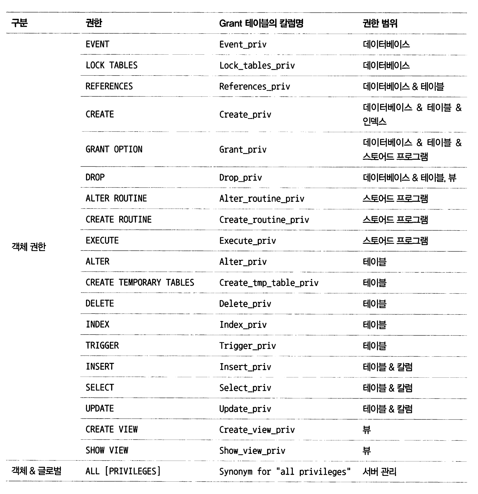

# 3장 사용자 및 권한


MySQL 8.0 버전 부터는 권한을 묶어서 관리하는 역할(Role) 개념이 도입되어, 각 사용자의 권한 세트를 부여하는것이 가능하다.

MySQL에서 사용자 계정은 사용자의 아이디뿐 아니라 해당 사용자가 어느 IP 주소에서 접속하고 있는지를 확인할 수 있는데,

 MySQL은 사용자가 특정 IP 주소로부터의 접속을 허용하거나 차단할 수 있다.

예를 들어, 다음과 같이 사용자 계정을 생성하면 해당 사용자는 특정 IP 주소로부터의 접속만 허용

```mysql
CREATE USER '사용자명'@'192.168.0.100' IDENTIFIED BY '비밀번호';
```

* 이렇게 생성된 사용자 계정은 IP 주소가 '192.168.0.100'인 클라이언트로부터의 접속만 허용하고, 다른 IP 주소로부터의 접속은 거부된다. 

또는 '%'를 사용하여 모든 IP 주소로부터의 접속을 허용할 수도 있다.

```mysql
CREATE USER '사용자명'@'%' IDENTIFIED BY '비밀번호';
```


# 3.1 사용자 식별

MySQL에서는 사용자의 계정뿐 아니라 사용자의 접속 지점(호스트명 or 도메인 or IP 주소)도 계정의 일부가 된다.

따라서 MySQL에서 계쩡을 언급할 때는 항상 아이디와 호스트를 함께 명시해야 한다.

```sql
'ys'@'%'
```

* ys는 id명
* %는 IP주소 대신 모든 IP주소로부터의 접속을 허용한다는 뜻

다음의 사용자 계쩡은 항상 MySQL 서버가 기동중인 로컬 호스트(127.0.0.1)에서 svc_id라는 아이디로 접속할 때만 사용될 수 있는 계쩡이다

```sql
'svc_id'@'127.0.0.1'
```

* 사용자 계정에 IP주소가 127.0.0.1로 되어있으므로, 로컬호스트가 아닌 다른 컴퓨터에서는 접속할 수 없다.

만약 모든 외부 컴퓨터에서 접속이 가능한 계정을 만들고 싶다면 `%` 를 사용하면 된다.

* `%` 문자는 모든 IP 또는 모든 호스트명을 의미한다.

```sql
'svc_id'@'%'
```

주의해야 할 점은, 만약 동일한 아이디가 존재한다면 MySQL 서버가 해당 사용자의 인증을 어떻게 선택하느냐이다.

ex) 아이디는 같고 IP주소가 다른 2개의 사용자 계정

```sql
'svc_id'@'192.168.0.10' (이 계정의 비밀번호는 123)
'svc_id'@'%' (이 계정의 비밀번호는 abc)
```

* MySQL 서버는 svc_id로 로그인 한다면 어떤걸 선택해야 할까?

MySQL은 권한이나 계정 정보에 대해 `범위가 가장 작은것을` <u>항상 먼저 선택</u>한다.

즉 위의 두 계정 중 범위가 좁은것은 `'svc_id'@'192.168.0.10'` 이다. 

* 192.168.0.10는 `%` 보다 범위가 좁다.

> 만약 같은 아이디에 `127.0.0.1`, `%`가 모두 존재한다면 더 좁은 범위인 전자를 우선적으로 선택한다.

# 3.2 사용자 계정 관리

MySQL 8.0부터 계정은 `SYSTEM_USER` 권한을 가지고 있느냐에 따라 

시스템 계정(System Account)와 일반 계정 (Regular Account)로 구분된다. 

시스템 계정은 DB 서버 관리자를 위한 계정이며 일반 계정은 개발자나 프로그램을 위한 계정이다.

시스템 계정은 일반 계정과 달리 아래와 같은 권한을 가진다.

- 계정 관리(계정 생성과 삭제, 그리고 권한 부여 및 제거)
- 다른 세션(Connection) 또는 그 세션에서 실행 중인 쿼리를 강제 종료
- 스토어드 프로그램 생성시 DEFINER를 타 사용자로 지정


> 이렇게 시스템 계쩡과 일반 계쩡의 개념이 도입된 것은 
> DBA(데이터베이스 관리자) 계정에는 SYSTEM_USER 권한을 할당하고 
> 일반 사용자를 위한 계정에는 SYSTEM_USER 권한을 부여하지 않게 하기 위해서다. 


**MySQL 내장 사용자 계정**

```sql
SELECT user, host, account_locked FROM mysq1.user WHERE user LIKE 'mysql.%';
```

* `'mysql.sys'@' localhost' `: MySQL 8.0부터 기본으로 내장된 sys 스키마의 객체(뷰나 함수, 그리고 프로시저들 의 DEFINER로 사용되는 계정
* `'mysql.session'@'localhost'`: MySaL 플러그인이 서버로 접근할 때 사용되는 계정 
* `'mysql.infoschema'@'localhost'`: information_schema에 정의된 뷰의 DEFINER로 사용되는 계정

위에 언급한 3개의 계정은 처음부터 잠겨(account_1ocked 칼럼) 있는 상태이므로 의도적으로 잠긴 계정 을 풀지 않는 한 악의적인 용도로 사용할 수 없으므로 보안을 걱정하지는 않아도 된다.

## 3.2.2 계정 생성

MySQL 5.7 버전 까지는 GRANT 명령을 사용하며 권한의 부여와 동시에 계정 생성이 가능했다.

MySQL 8.0 버전부터는 생성은 `CREATE USER` 권한 부여는 `GRANT ` 로 구분해서 따로 실행되도록 바뀌었다.

계정을 생성할 때는 아래와 같은 옵션을 설정할 수 있다.

- 계정의 인증 방식과 비밀번호
- 비밀번호 관련 옵션(비밀번호 유효기간, 이력 개수, 재사용 불가 기간)
- 기본 역할(role)
- SSL 옵션
- 계정 잠금 여부

일반적으로 많이 사용되는 옵션을 가진 CREATE USER 명령은 다음과 같다.

```mysql
CREATE USER 'user'@'g
	IDENTIFIED WITH 'mysql_native_password' BY 'password'	
	REOUIRE NONE
	PASSWORD EXPIRE INTERVAL 30 DAY
	ACCOUNT UNLOCK
	PASSWORD HISTORY DEFAULT
	PASSWORD REUSE INTERVAL DEFAULT
	PASSWORD REQUIRE CURRENT DEFAULT;
```

- 계정의 인증 방식
  - `IDENTIFIED WITH` : 인증 방식 설정
  - `REQUIRE` : SSL/TLS 채널 사용 여부 (MySQL 8.0 기본 인증 방식인 `Caching SHA-2 Authentication`은 기본적으로 암호화 채널 사용)
- 비밀번호 관련
  - `PASSWORD EXPIRE` : 유효 기간 설정 (`NEVER`, `INTERVAL n DAY` 등)
  - `PASSWORD HISTORY` : 한 번 사용했던 비밀번호 재사용 불가
  - `PASSWORD REUSE INTERVAL` : 재사용 금지 기간 설정
  - `PASSWORD REQUIRE` : 비밀번호 만료 시 변경에 만료된 비밀번호 필요 여부
- 기본 역할
- 잠금 설정 (account_locked 컬럼)
  - `ACCOUNT LOCK / UNLOCK` : 계정 잠금, 해제

### IDENTIFIED WITH

```mysql
IDENTIFED WITH
```

사용자의 인증방식과 비밀번호를 설정한다.

IDENTIFED WITH 뒤에는 인증 방식(인증 플러그인)의 이름을 명시해야 한다.

기본 인증방식은 `IDENTIFED WITH 'password'` 이 방식이다.

다음 4가지 방식이 가장 대표적인 인증 방식 플러그인 이다

- Native Pluggable Authentication: **MySQL 5.7** 까지 기본으로 사용되었던 방식으로 비밀번호 해싱 (SHA-1) 값을 디비에 저장 해놓고 클라이언트가 보낸 값과 해시 값이 일치하는지 비교하는 방식이다.
- **Caching** SHA-2 Pluggable Authentication: **MySQL 5.6**에 도입되고 **MySQL 8.0**에 조금더 보완된 인증 방식으로 암호화 해시값 생성을 위해 `SHA-2(256비트) 알고리즘을 사용`한다. 위 방식과는 알고리즘에 있어 차이가 있다. 위 방식의 경우 동일한 인풋에 대해 동일한 아웃풋이 나오지만 이 방식의 경우 해싱에 **솔트 키**를 활용하므로 동일한 인풋에 대해 다른 결과가 나온다. 이 과정에서 성능적으로 보완하기 위해 **캐싱**을 사용하므로 암호화 방식에 캐싱이란 키워드가 포함되어있다. 이 방식을 사용하기 위해서는 `SSL/TLS 옵션을 활성화 해야한다.`
- PAM Puggable Authentication: 유닉스나 리눅스 패스워드 또는 LDAP(Lightweight Directory Access Protocol) 같은 외부 인증을 사용할 수 있게 해주는 인증 방식으로, MySQL 엔터프라이즈 에디션에서만 사용 가능
- LDAP Pluggable Authentication: LDAP을 이용한 외부 인증을 사용할 수 있게 해주는 인증 방식으로, MySQL 엔터프라이즈 에디션에서만 사용 가능


MySQL 8.0 부터는 Caching SHA-2 Authentication이 기본 인증이다.

만약 MySQL 8.0 에서도 Native Authentication을 기본 인증으로 사용하고자 한다면?

```sql
mysql> SET GLOBAL default_authentication_plugin="mysql_native_password"
```

* 또는 my.cnf 설정 파일에 추가하면 된다.

### REQUIRE

SSL/TLS 채널 사용 여부 설정

별도로 설정하지 않으면 비암호화 채널로 연결한다. 

### PASSWORD EXPIRE

비밀번호 유효기간 설정.

별도로 명시하지 않으면 `default_password_lifetime` 시스템 변수에 저장된 기간으로 유효기간 설정

```sql
mysql> SHOW VARIABLES LIKE 'default_password_lifetime';
```

* 응용프로그램 접속용 계정에 유효기간을 설정하면 장애를 조심해야 한다.

PASSWORD EXPIRE 절에 설정가능한 옵션들

- PASSWORD EXPIRE: 계정 생성과 동시에 비밀번호의 만료 처리
- PASSWORD EXPIRE NEVER: 계정 비밀번호의 만료 기간 없음
- PASSWORD EXPIRE DEFAULT: default_password_lifetime 시스템 변수에 저장된 기간으로 비밀번호의 유효 기간을 설정
- PASSWORD EXPIRE INTERVAL n DAY: 비밀번호의 유효 기간을 오늘부터 n일자로 설정


### PASSWORD HISTORY

비밀번호 설정 이력의 관리 여부 및 갯수 설정

한 번 사용했던 비밀번호를 재사용하지 못하게 설정하는 옵션인데, PASSWORD HISTORY 절에 설정 가능한 옵션은 다음과 같다.

- PASSWORD HISTORY DEFAULT: password_history 시스템 변수에 저장된 개수만큼 비밀번호의 이력을 저장하며, 저장된 이력에 남아있는 비밀번호는 재사용할 수 없다.
- PASSWORD HISTORY n: 비밀번호의 이력을 최근 n개까지만 저장하며, 저장된 이력에 남아있는 비밀번호는 재사용할 수 없다.

한 번 사용했던 비밀번호를 사용하지 못하게 하려면 이전에 사용했던 비밀번호를 MySOL 서버가 기억 하고 있어야 하는데, 

이를 위해 MysQL 서버는 mysqL DB의 `password_history 테이블을 사용`한다.

### PASSWORD REUSE INTERVAL

한번 사용했던 비밀번호의 재사용 금지 기간 설정

별도로 명시하지 않으면 password_reuse_interval 시스템 변수에 저장된 기간으로 설정된다.

- PASSWORD REUSE INTERVAL DEFAULT: password_reuse_interval 변수에 저장된 기간으로 설정
- PASSWORD REUSE INTERVAL n DAY: n일자 이후에 비밀번호를 재사용할 수 있게 설정

### PASSWORD REQUIRE

비밀번호 변경시 기존의 비밀번호 입력 여부 결정 설정

별도로 명시되지 않흐면 password_require_current 시스템 변수의 값으로 사용

- PASSWORD REQUIRE CURRENT: 비밀번호를 변경할 때 현재 비밀번호를 먼저 입력하도록 설정
- PASSWORD REQUIRE OPTIONAL: 비밀번호를 변경할 때 현재 비밀번호를 입력하지 않아도 되도록 설정
- PASSWORD REOUIRE DEFAULT: pasSword require current 시스템 변수의 값으로 설정

### ACCOUNT LOCK/UNLOCK

계정의 잠금/비잠금 여부 설정

계정 생성 시 또는 ALTER USER 명령을 사용해 계정 정보를 변경할 때 계정을 사용하지 못하게 잠글지 여부를 결정한다.

- ACCOUNT LOCK: 계정을 사용하지 못하게 잠금
- ACCOUNT UNLOCK: 잠긴 계정을 다시 사용 가능 상태로 잠금 해제


# 3.3 비밀번호 관리

## 3.3.1 고수준 비밀번호

MySQL 서버에서 비밀번호 유효성 체크 규칙을 적용하려면 validate_password 컴포넌트를 이용할 수 있다.

1. 먼저 validate_password 컴포넌트 설치

```mysql
##validate_password 컴포넌트 설치
mysql> INSTALL COMPONENT 'file://component_validate_password';
```

2. 설치된 컴포넌트 확인

```mysql
##설치된 컴포넌트 확인
mysql> SELECT * FROM mysql.component;
```

> mysql 컴포넌트는 MySQL 서버 프로그램에 내장돼있기 때문에 file:// 부분에 별도의 경로를 지정하지 않아도 된다. 


비밀번호 정책은 다음 3가지 중에 선택할 수 있으며 기본값은 **MEDIUM**이다

```mysql
mysql> SHOW VARIABLES LIKE '%validate_password.policy%';
```

- LOW: 비밀번호의 길이만 검증
- MEDIUN: 비밀번호의 길이를 검증하며, 숫자와 대소문자, 그리고 특수문자의 배합을 검증
- STRONG: MEDIUM 레벨의 검증을 모두 수행하며, 금칙어가 포함됐는지 여부까지 검증

만약, 특정 단어 등에 있어 패스워드로 사용하지 못하게 하려면

validate_password.dictionary_file 시스템 변수에 금칙어들이 저장된 사전 파일을 등록하면 된다.

* 한줄에 하나씩 기록해서 텍스트 파일로 작성하면 된다.

```
https://github.com/danielmiessler/SecLists/blob/master/Passwords/Common-Credentials/10k-most-common.txt
```

MySQL서버에 금칙처 파일 등록

* 금칙어는 `validate_password.policy` 시스템 변수가 'STRONG' 으로 설정된 경우에만 작동한다.

```mysql
mysql> SET GLOBAL validate_password.dictionary_file='prohibitive_word.data';
mysql> SET GLOBAL validate_password.policy='STRONG';
```

### 3.3.2 이중 비밀번호

MySQL 8.0부터 2개의 비밀번호를 사용할 수 있는 이중 비밀번호(Dual Password)를 지원한다.

> 이미 특정 계정으로 서비스 중일 경우 비밀번호의 변경이 제한 될 수 있다. 
>
> 예를들면 스프링 데이터소스의 비밀번호가 런타임중에 갑자기 바뀌어버리면 장애가 발생할 수 있기 때문이다.
>
> 이때 비밀번호를 이중으로 함으로써 기존 서비스에 영향을 주지 않고 비밀번호를 변경하는 것이 가능하다.

두개의 비밀번호는 프라이머리와 세컨더리로 구분되며 

최근에 설정한 비밀번호가 프라이머리, 이전 비밀번호가 세컨더리가 된다.

이중 비밀번호를 사용하려면, 기존 비밀번호 변경 구문에 `RETAIN CURRENT PASSWORD` 옵션만 추가하면 된다.

```mysql
-- // 비밀번호를 "ytrewg"로 설정
mysql> ALTER USER 'root'@'localhost' IDENTIFIED BY 'old password';
-- // 비밀번호를 "gwerty”로 변경하면서 기존 비밀번호를 세컨더리 비밀번호로 설정
mysql> ALTER USER 'root'@'localhost' IDENTIFIED BY 'new password' RETAIN CURRENT PASSWORD;
```

* 첫 번째 ALTER USER 명령이 실행되면 root 계정의 프라이머리 비밀번호는 'old_password'로 설정되고 세컨더리는 empty가 된다
* 두 번째  ALTER USER 명령이 실행되면 'old_password'는 세컨더리가 되고 'new_password'는 프라이머리가 된다.

이렇게 설정된 상태에서 응용프로그램의 소스코드나 설정파일의 비밀번호를 새로운 비밀번호로 변경하고 배포 및 재시작을 순차적으로 실행하면 된다.

다음 명령어로 세컨더리 비밀번호를 삭제하고, 기존 비밀번호로 로그인 불가능하게 할 수 있다.

```mysql
mysql> ALTER USER 'root'@'localhost' DISCARD OLD PASSWORD;
```

# 3.4 권한 (Privilege)

MySQL 5.7 버전까지 권한은 글로벌(Global) 권한과 객체 단위의 권한으로 구분되었다.

* 글로벌 권한**은 **데이터베이스나 테이블 외에** 적용되는 권한
* **객체 권한**은 **데이터베이스나 테이블**을 제어하는데 필요한 권한

**객체 권한**은 GRANT 명령으로 **특정 객체를 명확히 명시**해야 하지만,  **글로벌 권한**은 **특정 객체를 명시하지 말아야 한다.**

> MySQL 객체의 종류
>
> 테이블, 뷰, 인덱스, 프로시저, 함수, 이벤트, 유저 등

표 - MySQL 5.7까지의 정적 권한




MySQL 8.0 부터는 5.7 권한에 동적 권한이 더 추가됐다.

정적 권한은 소스코드에 고정적으로 명시돼있는 권한이며, 동적 권한은 서버가 시작되면서 동적으로 생성하는 권한을 의미한다.

표 - 동적 권한


사용자에게 권한을 부여할 때는 `GRANT 명령`을 사용한다.

```mysql
mysql> GRANT privilege_list ON db.table TO 'user'@'host';
```

각 권한의 특성(범위)에 따라 ON절에 명시되는 오브젝트(DB나 테이블 등)의 내용이 바뀌어야 한다.


* GRANT OPTION 권한은 다른 권한과 달리 GRANT 명령의 마지막에 WITH GRANT OPTION을 명시해서 부여한다.

* priviliege_list에는 구분자(,) 를 써서 권한 여러개를 동시에 명시할 수 있다.
* TO 키워드 뒤에는 권한을 부여할 사용자를 명시한다
* ON 뒤에는 어떤 DB의 어떤 오브젝트에 권한을 부여할지 결정하는데, 권한의 범위에 따라 사용하는 법이 달라진다.


만약 글로벌 권한을 부여한다면 ON 절에 `*.*`만 사용해야 한다.

```mysql
mysql> GRANT SUPER ON *.* TO 'user'@'localhost';
```

* 특정 DB나 오브젝트에 부여될 수 없기 때문이다.

여러가지 레벨이나 범위로 권한을 설정하는 것이 가능하지만, 테이블이나 칼럼 단위의 권한을 잘 사용하지 않는다.

칼럼 단위의 권한이 하나라도 설정되면 나머지 모든 테이블에 칼럼에 대해서도 권한 체크를 하기 때문에 전체적인 `성능에 영향을 미칠 수 있다.`

때문에 칼럼 단위의 접근 권한이 필요하다면 GRANT 명령 보다는 별도의 VIEW를 만들어 사용하는 것이 좋다.


각 계정이나 권한에 부여된 권한이나 역할을 확인하려면 SHOW GRANTS 보다는

mysql.DB 권한 테이블을 참조하면 된다.


# 3.5 역할 (ROLE)

권한을 묶어서 역할이란 이름으로 포장할 수 있다. 

동일한 권한을 가지는 아이디가 여러 개 있을 때 각각 권한을 일일히 부여해주는게 아니라 

역할(그룹)을 만들고 거기에 권한을 부여한 후 해당 권한을 아이디 들에게 부여해주면 된다.

> 특정 권한그룹을 미리 만들어 계정 생성할 때마다 사용할 수 있다고 생각하면 된다.

역할과 사용자의 차이는 `계정의 잠금 여부`이며 역할이 기본적으로 계정이 잠겨 있는 반면, 사용자는 잠겨 있지 않다. 


역할(ROLE) 만들기

```mysql
mysql> CREATE ROLE
			 role_emp_read, 
			 role_emp_write;
```

* 빈 껍데기만 있는 역할이며, 아직 권한을 부여하진 않았다.

권한 부여하기

```mysql
mysql> GRANT SELECT ON employees.* TO role_emp_read;
mysql> GRANT INSERT, UPDATE, DELETE ON employees.* TO role_emp_write;
```

* 해당 역할(ROLE)에 권한을 부여했다.

유저(계정) 생성하기

```mysql
mysql> CREATE USER reader@'127.0.0.1' IDENTIFIED BY 'qwerty' 
mysql> CREATE USER writer@'127.0.0.1' IDENTIFIED BY 'qwerty'
```

GRANT 명령으로 역할(Role) 부여하기

```mysql
mysql> GRANT role emp read TO reader@'127.0.0.1';
mysql> GRANT role_emp_read, role_emp_write TO writer@'127.0.0.1';
```


다음 권한 목록 확인하기

```mysql
mysql> SHOW GRANTS;
```

로그인 후 다음 명령어로 로그인한 계정의 역할(Role)을 확인할 수 있다.

```mysql
mysql> SELECT current_role();
```

실제 역할은 부여돼 있지만 계정의 활성화된 역할을 조회해 보면 role_emp_read 역할이 없다면 활성화 되지 않은것이다. 

이때, 부여받은 역할을 활성화 하려면 SET ROLE 명령을 실행해 해당 역할을 활성화 해야 한다.

```mysql
mysql> SET ROLE 'role_emp_read' // role_emp_read는 역할(Role) 이름
```

꼭 이렇게 하지 않고도, `자동으로 활성화 할 수` 있다.

```mysql
mysql> SET GLOBAL activate_all_roles_on_login=ON;
```

activate_all_roles_on_login 시스템 변수를 ON dㅡ로 설정하면 매번 SET ROLE 명령으로 역할을 활성화 하지 않아도 로그인 과 동시에 부여된 역할이 자동으로 활성화 된다.

### 계정과 역할(Role)의 차이

MySQL 서버 내부적으로는 계정과 역할은 아무런 차이가 없다.

때문에 검색해서 볼 때도 역할인지 계정인지 구분하기 어려우므로 role_ 이라는 프리픽스를 붙여 역할의 이름을 구분하는 것이 좋다.


역할을 생성할 때, 호스트 부분을 명시하지 않으면 `자동으로 모든 호스트(%)가 추가`된다

사실 아래의 역할 생성이

```mysql
mysql> CREATE ROLE
			 role_emp_read, 
			 role_emp_write;
```

다음과 같단 것이다.

```mysql
mysql> CREATE ROLE
			 role_emp_read@'%', 
			 role_emp_write@'%';
```


### 계정과 역할 테이블 조회

계정과 역할 또는 역할에 부여된 역할 관계는 SHOW GRANTS 명령을 사용할 수도 있지만, 

표 형태로 mysql DB의 권한 관련 테이블을 볼 수도 있따.

* mysql.default_roles : 계정별 기본 역할 테이블
* mysql>role_edges : 역할에 부여된 역할 관계 그래프 테이블

