# 4장 아키텍처

# 4.1 MySQL 엔진 아키텍처


머리 : MySQL 엔진 

손발 : 스토리지 엔진

MySQL은 접속 클라이언트, 엔진, 스토리지 엔진으로 구분할 수 있다.

엔진에서는 SQL문장을 분석하고 검증하고 최적화한 뒤 스토리지 엔진을 통해 데이터를 읽고 쓴다.

스토리지 엔진은 실제 디스크에 접근해 데이터를 읽고 쓰는 역할을 수행한다. InnoDB, MyISAM 등을 선택할 수 있다.

InnoDB는 기본으로 선택되는 스토리지 엔진이며, 버퍼풀, 언두 로그 등을 통해 MVCC 를 제공한다.

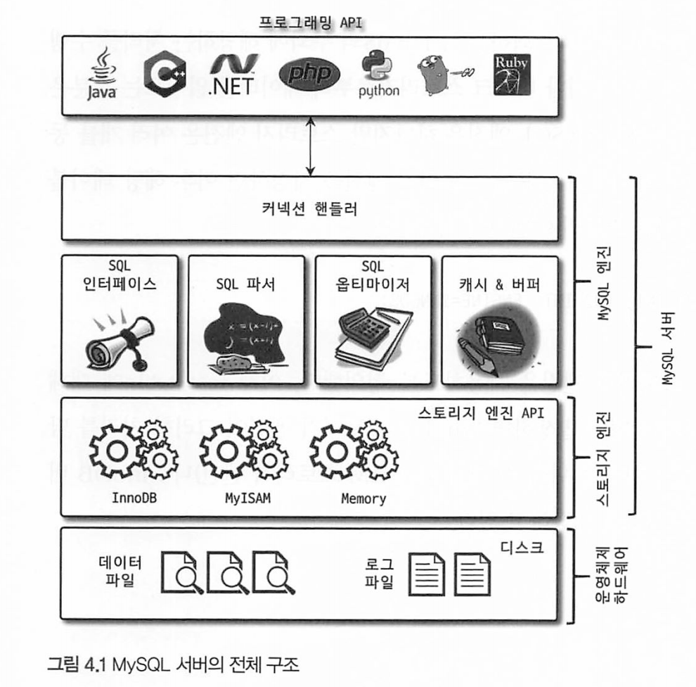

### MySQL 엔진

요청된 SQL 문장을 분석하거나 최적화하는 등 DBMS의 두뇌에 해당하는 처리를 수행한다.

· 중심 구성 요소

\- **커넥션 핸들러, SQL 파서, 전처리기**: 클라이언트로부터 접속 및 쿼리 요청

\- **옵티마이저**: 쿼리를 최적화하여 실행

· MySQL은 **표준 SQL**(ANSI SQL) 문법을 지원하여, 표준 문법에 따라 작성된 쿼리는 타 DBMS와 호환되어 실행될 수 있다.

### 스토리지 엔진 (InnoDB, MyISAM)

실제 데이터를 DISK 스토리지에 저장하거나, 읽어오는 처리를 담당한다.

* 스토리지 엔진은 여러 개를 동시에 사용할 수 있다. (각 테이블 마다 다른 스토리지 엔진 사용 가능)

* 성능 향상을 위해 키 캐시(MyISAM), 버퍼 풀(InnoDB) 등의 기능을 내장한다.

ex) 테이블이 사용할 스토리지 엔진 지정

```mysql
mysql> CREATE TABLE test_table (fd1 INT, fd2 INT) ENGINE=INNODB;
```

ex) 현재 테이블의 스토리지 확인하기

```mysql
mysql> SHOW TABLE STATUS FROM DB명
```

```mysql
mysql> SHOW TABLE STATUS FROM dadok_local;
+--------------------------+--------+---------+------------+------+----------------+-------------+-----------------+--------------+-----------+----------------+---------------------+-------------+------------+--------------------+----------+----------------+---------+
| Name                     | Engine | Version | Row_format | Rows | Avg_row_length | Data_length | Max_data_length | Index_length | Data_free | Auto_increment | Create_time         | Update_time | Check_time | Collation          | Checksum | Create_options | Comment |
+--------------------------+--------+---------+------------+------+----------------+-------------+-----------------+--------------+-----------+----------------+---------------------+-------------+------------+--------------------+----------+----------------+---------+
| book_groups              | InnoDB |      10 | Dynamic    |    0 |              0 |       16384 |               0 |        49152 |         0 |           NULL | 2023-03-09 18:42:14 | NULL        | NULL       | utf8mb4_0900_ai_ci |     NULL |                |         |
| books                    | InnoDB |      10 | Dynamic    |    0 |              0 |       16384 |               0 |        16384 |         0 |              2 | 2023-03-09 18:42:14 | NULL        | NULL       | utf8mb4_0900_ai_ci |     NULL |                |         
| jobs                     | InnoDB |      10 | Dynamic    |    0 |              0 |       16384 |               0 |            0 |         0 |           NULL | 2023-03-09 18:42:14 | NULL        | NULL       | utf8mb4_0900_ai_ci |     NULL |                |         |
| oauth2_authorized_client | InnoDB |      10 | Dynamic    |    0 |              0 |       16384 |               0 |            0 |         0 |           NULL | 2023-03-09 18:41:55 | NULL        | NULL       | utf8mb4_0900_ai_ci |     NULL |                |         |
| user_authorities         | InnoDB |      10 | Dynamic    |    1 |          16384 |       16384 |               0 |        32768 |         0 |              2 | 2023-03-09 18:42:14 | NULL        | NULL       | utf8mb4_0900_ai_ci |     NULL |                |         |
| users                    | InnoDB |      10 | Dynamic    |    1 |          16384 |       16384 |               0 |        32768 |         0 |              2 | 2023-03-09 18:42:14 | NULL        | NULL       | utf8mb4_0900_ai_ci |     NULL |                |         |
+--------------------------+--------+---------+------------+------+----------------+-------------+-----------------+--------------+-----------+----------------+---------------------+-------------+------------+--------------------+----------+----------------+---------+
```

**MyISAM 스토리지 엔진**

- MySQL 5.5 버전 이전에 테이블 생성시 디폴트로 지정되던 스토리지 엔진
- 키 캐시 기능을 지원한다.

**InnoDB 스토리지 엔진**

- MysOL 5.5 버전 이후에 테이블 생성시 디폴트로 지정된 스토리지 엔진
- 키 캐시 대신 버퍼풀을 지원한다.
- 그리고 무엇보다도 트랜잭션이 지원 되기 때문에 현재는 MySQL 사용한다고 하면 InnoDB 스토리지 엔진을 사용한다고 보아 도 무방할 정도로 많은 곳에서 사용하고있다.

주요 차이점

1. 트랜잭션 지원:
   - InnoDB: InnoDB는 트랜잭션을 지원
   - MyISAM: MyISAM은 트랜잭션을 지원하지 않는다. 따라서 트랜잭션에 대한 롤백이나 복구 기능이 없으며, 개별 쿼리마다 자동 커밋이 발생
2. 락 및 동시성:
   - InnoDB: InnoDB는 행 단위의 락을 사용한다. 다중 사용자 환경에서 동시에 여러 트랜잭션을 처리할 수 있다. 
   - MyISAM: MyISAM은 테이블 단위의 락을 사용. 따라서 동시에 여러 쓰기 작업이 발생할 경우 성능 저하가 발생할 수 있다. 읽기 작업이 많은 경우에는 성능이 좋을 수 있다
3. 외래 키 지원:
   - InnoDB는 외래 키 제약 조건을 지원하지만 MyISAM은 외래 키 제약 조건을 지원하지 않는다.외래 키 관계를 직접 처리해야 한다


> **`InnoDB` 엔진**은 **트랜잭션 처리가 필요**하고 **대용량의 데이터를 다루는 부분에서** 효율적이고,
> **`MyISAM` 엔진**은 **트랜잭션 처리가 필요 없고**, **Read only 기능이 많은 서비스일수록 효율적**이다.


### 핸들러 API

핸들러 요청 : MySQL 엔진의 **쿼리 실행기**에서 데이터를 쓰거나 읽어야 할 때, 각 **스토리지 엔진**에 쓰기 또는 읽기 요청

핸들러 API : 핸들러 요청에 사용되는 API

```mysql
SHOW GLOBAL STATUS LIKE 'Handler%'; 
```

위 명령으로 핸들러 API 통해 얼마나 많은 데이터(레코드) 작업이 있었는지 확인할 수 있다.

ex) commit, delete, update, write, read_key, rollback

## MySQL 스레딩 구조 

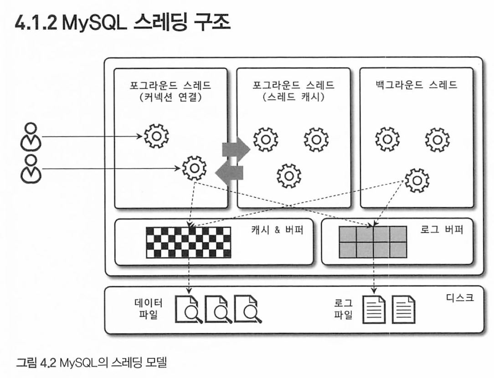

MySQL 서버는 프로세스 기반이 아닌 스레드 기반(멀티스레드)으로 작동하며, 크게 Foreground Thread와 Background Thread로 구분할 수 있다.

실행중인 스레드의 목록은 performance_schema DB의 threads 테이블을 통해 확인할 수 있다.

```mysql
mysql> select thread_id, name, type from performance_schema.threads ORDER BY type, thread_id;
+-----------+---------------------------------------------+------------+
| thread_id | name                                        | type       |
+-----------+---------------------------------------------+------------+
|         1 | thread/sql/main                             | BACKGROUND |
|         3 | thread/innodb/io_ibuf_thread                | BACKGROUND |
|         4 | thread/innodb/io_read_thread                | BACKGROUND |
|         5 | thread/innodb/io_read_thread                | BACKGROUND |
|         6 | thread/innodb/io_read_thread                | BACKGROUND |
|         7 | thread/innodb/io_read_thread                | BACKGROUND |
|         8 | thread/innodb/io_write_thread               | BACKGROUND |
|         9 | thread/innodb/io_write_thread               | BACKGROUND |
|        10 | thread/innodb/io_write_thread               | BACKGROUND |
|        11 | thread/innodb/io_write_thread               | BACKGROUND |
|        12 | thread/innodb/page_flush_coordinator_thread | BACKGROUND |
|        13 | thread/innodb/log_checkpointer_thread       | BACKGROUND |
|        14 | thread/innodb/log_flush_notifier_thread     | BACKGROUND |
|        15 | thread/innodb/log_flusher_thread            | BACKGROUND |
|        16 | thread/innodb/log_write_notifier_thread     | BACKGROUND |
|        17 | thread/innodb/log_writer_thread             | BACKGROUND |
|        18 | thread/innodb/log_files_governor_thread     | BACKGROUND |
|        23 | thread/innodb/srv_lock_timeout_thread       | BACKGROUND |
|        24 | thread/innodb/srv_error_monitor_thread      | BACKGROUND |
|        25 | thread/innodb/srv_monitor_thread            | BACKGROUND |
|        26 | thread/innodb/buf_resize_thread             | BACKGROUND |
|        27 | thread/innodb/srv_master_thread             | BACKGROUND |
|        28 | thread/innodb/dict_stats_thread             | BACKGROUND |
|        29 | thread/innodb/fts_optimize_thread           | BACKGROUND |
|        30 | thread/mysqlx/worker                        | BACKGROUND |
|        31 | thread/mysqlx/acceptor_network              | BACKGROUND |
|        32 | thread/mysqlx/worker                        | BACKGROUND |
|        36 | thread/innodb/buf_dump_thread               | BACKGROUND |
|        37 | thread/innodb/clone_gtid_thread             | BACKGROUND |
|        38 | thread/innodb/srv_purge_thread              | BACKGROUND |
|        39 | thread/innodb/srv_worker_thread             | BACKGROUND |
|        40 | thread/innodb/srv_worker_thread             | BACKGROUND |
|        41 | thread/innodb/srv_worker_thread             | BACKGROUND |
|        43 | thread/sql/signal_handler                   | BACKGROUND |
|        44 | thread/mysqlx/acceptor_network              | BACKGROUND |
|        42 | thread/sql/event_scheduler                  | FOREGROUND |
|        45 | thread/sql/compress_gtid_table              | FOREGROUND |
|       192 | thread/sql/one_connection                   | FOREGROUND |
+-----------+---------------------------------------------+------------+
38 rows in set (0.00 sec)
```

이 중에서 마지막 'thread/sql/one_conection' 스레드만 실 제 사용자의 요청을 처리하는 포그라운드 스레드다

> 이 스레드 모델은 MySQL 커뮤니티 에디션 모델에서 사용되는 모델이며,
>
> MySQL 엔터프라이즈 에디션 등에서는 다른 모델을 사용할 수도 있다.


### MySQL의 포그라운드 스레드(=클라이언트 스레드, 사용자 스레드)

사용자의 요청을 처리하는 스레드

데이터를 읽는 작업을 처리한다. 

* 디스크에 직접 데이터를 쓰는 작업은 백그라운드 스레드에서 일어남.

포그라운드 스레드의 수는 MySQL 서버에 접속된 **클라이언트의 숫자** 만큼 존재하며, 사용자가 작업을 마치고 커넥션을 종료하면 스레드 캐시로 돌아간다. 

이때, 이미 스레드 캐시에 일정 개수 이상의 대기중인 스레드가 있으면 캐시에 넣지 않고 스레드를 종료 시켜 일정 개수의 스레드만 캐시에 유지한다.

* 스레드 캐시에 유지할 수 있는 최대 스레드 수는 thread_cache_size 시스템 변수로 설정한다. 


이 스레드는 데이터 캐시나 버퍼에서 데이터를 읽어오며, 만약 캐시나 버퍼에 데이터가 없으면 디스크나 인덱스파일에 데이터를 직접 읽어와 처리하기도 한다.

InnoDB는 데이터 버퍼나 캐시까지만 포그라운드 스레드가 처리하고 나머지 버퍼로부터 디스크까지 기록하는 작업은 백그라운드 스레드가 처리한다.

MyISAM은 디스크 까지 기록하는 작업을 포그라운드 스레드가 처리한다. 

**포그라운드 스레드가 하는일**

* 클라이언트 통신
* 쿼리 분석 실행 및 처리. SQL 파서로 구문 분석 후 옵티마이저를 통해 실행 계획 결정
* 데이터 액세스 후 결과 반환 

### MySQL의 백그라운드 스레드(=클라이언트 스레드)

디스크에 데이터를 직접 기록하는 작업은 백그라운드 스레드에서 일어난다.

현재 로그나, 버퍼풀에 있는 데이터를 디스크에 기록 기록이외에 데이터를 버퍼로 읽어오거나, 락, 데드락을 모니터하는 백그라운드 쓰레드도 존재한다.

InnoDB의 백그라운드 작업들

* insert buffer 병합하는 스레드
* 로그를 디스크로 기록하는 스레드
* InnoDB버퍼 풀의 데이터를 디스크에 기록
* 데이터를 버퍼로 읽어옴
* 잠금이나 데드락을 모니터링 

사용자의 데이터 쓰기 작업은 지연(버퍼링)되어 처리할 수 있지만, 읽기 작업은 절대 지연될 수 없으므로 일반적인 상용 DBMS는 대부분 쓰기 작업을 버퍼링해서 일괄 처리하는 기능이 탑재 되있고, InnoDB도 이렇게 처리한다.

* MyISAM은 사용자 쓰레드가 쓰기작업까지 한번에 처리한다.

이러한 이유 때문에 InnoDB에서는 INSERT, UPDATE, DELETE 쿼리로 데이터가 변경되는 경우 데이터가 디스크에 완전히 저장될 때까지 기다리지 않아도 된다 


MySQL(InnoDB)이 스레드를 포그라운드, 백그라운드로 나뉜 이유?

읽기 요청의 처리와 쓰기 요청의 처리를 분리하기 위함

읽기 요청의 경우 바로 처리되어야 하지만, 쓰기 작업 같은 경우는 여러 요청을 모아서 한번에 처리해도 사용상의 문제가 되지 않기 때문이다.

## 메모리 할당 및 사용 구조

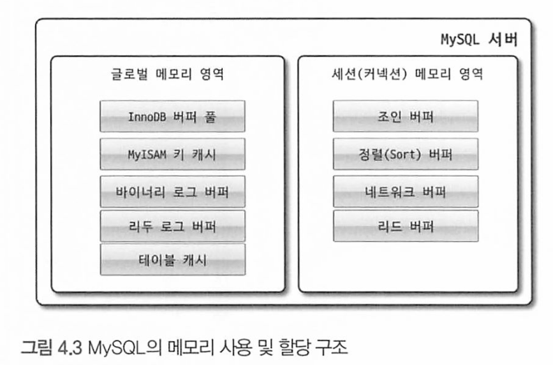

MySQL의 메모리 공간은 글로벌 메모리 영역과 로컬 메모리 영역으로 구분할 수 있다.

글로벌 메모리 영역은 운영체제로부터 할당된다.

글로벌 메모리 영역과 로컬 메모리 영역은 MySQL 스레드들이 공유해서 사용하는 공간인지 여부에 따라 구분된다. 

### 글로벌 메모리 영역

클라이언트 스레드 수와 무관하게 하나의 메모리 공간만 할당된다.

버퍼 캐시를 위해 사용되며  모든 스레드에 의해 공유된다.

대표적인 글로벌 메모리 영역

- 테이블 캐시
- InnoDB 버퍼 풀
- InnoDB 어댑티브 해시 인덱스
- InnoDB 리두 로그 버퍼

### 로컬 메모리 영역 (=세션 메모리 영역, 클라이언트 메모리 영역)

포워드 스레드(=클라이언트 스레드)가 사용자의 쿼리를 처리하기 위해 사용하는 독자적인 메모리 공간. 

* 클라이언트 - 서버 커넥션을 세션이라고도 한다. 

 스레드간 공유되는 글로벌 메모리영역과 달리, 로컬 메모리 영역은 스레드간 공유되지 않는다.

대표적으로 커넥션 버퍼나 정렬(sort)이나, 조인할때 사용하는 버퍼 등이 있다.

커넥션 버퍼는 커넥션이 열려있는 동안 계속 메모리 공간에 남아있으며, 조인이나 정렬할때 사용되는 버퍼는 쿼리를 실행하는 순 간에만 메모리공간에 할당 되었다가 해제된다.

* 커넥션 버퍼나 결과 버퍼는 커넥션이 유지되는 동안 계속 할당된 상태로 남아있다.
* 소트 버퍼나 조인 버퍼는 쿼리가 실행되는 순간에만 할당했다가 해제된다.

대표적인 로컬 메모리 영역은 다음과 같다.

- 정렬 버퍼(Sort buffer)
- 조인 버퍼
- 바이너리 로그 캐시
- 네트워크 버퍼

## 플러그인 스토리지 엔진 모델

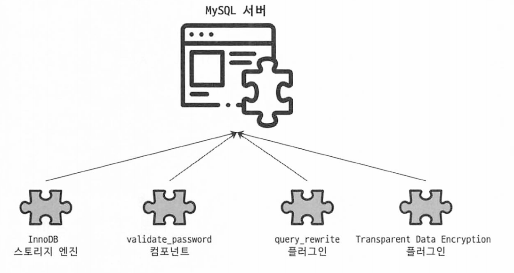

**플러그인**

MySQL에서 기본적으로 제공되는 기능 이외에 부가적인 기능을 더 제공하기 위한 방법으로 플러그인 모델을 사용한다.

InnoDB 또한 플러그인 형태로 제공되는 하나의 스토리지 엔진에 해당한다.

스토리지엔진 뿐만아니라 3장에서 살펴보았던, 사용자 인증을위한 Native Authentication, Caching SHA-2 Authentication과 같은 인증 모듈들도 전부 플러그인이다.

플러그인 확인 하기 - SHOW PLUGINS

```mysql
mysql> SHOW PLUGINS
```

MySQL 쿼리 실행과정을 보면 다음과 같다. 

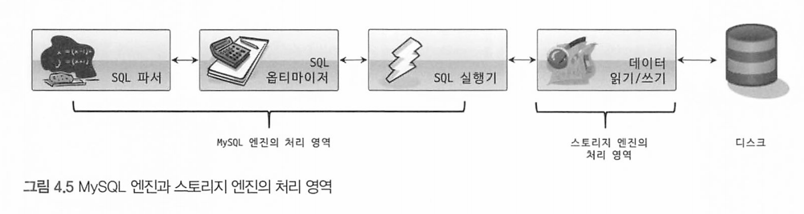

대부분의 작업이 MySQL 엔진에서 처리되고, 스토리지 엔진에서는 읽기/쓰기 작업만 처리한다. 

>  중요한 점은 MySQL 엔진이 각 스토리지 엔진(InnoDB, MyISAM)에게 데이터를 읽거나 저장하도록 명령하려면 핸들러를 통해야만 한다. 

GROUP BY, ORDER BY 등의 복잡한 처리는 MySQL 엔진 영역의 SQL 실행기가 처리한다. 


하나의 쿼리 작업은 여러 하위 작업으로 나뉘는데, 각 하위 작업이 MySQL 엔진 영역에서 처리되는지, 스토리지 엔진 영역에서 처리되는지 구분할 줄 알아야 한다.

* 성능 최적화: 각 하위 작업이 MySQL 엔진 영역에서 처리되는지, 스토리지 엔진 영역에서 처리되는지 알면, 어떤 작업이 성능에 영향을 주는지 파악할 수 있습니다. 예를 들어, 데이터베이스가 많은 I/O 작업을 수행한다면 스토리지 엔진에서 병목 현상이 발생할 수 있으므로 디스크 I/O를 최소화하기 위한 조치가 필요합니다. 이러한 성능 이슈를 파악하고 최적화하는 데에는 각 영역의 역할과 작업 흐름을 이해하는 것이 중요합니다.
* 버그 또는 이슈 식별: 각 영역에서 발생하는 문제를 파악하려면 어떤 작업이 어느 영역에서 처리되는지를 알아야 합니다. 예를 들어, 특정 쿼리 작업에서 예기치 않은 결과가 발생한다면 해당 작업이 MySQL 엔진 영역에서 오류가 발생한 것인지, 스토리지 엔진 영역에서 문제가 발생한 것인지 확인할 수 있습니다. 이를 통해 문제를 식별하고 수정할 수 있습니다.
* 기능 활용 및 호환성: 각 엔진의 역할을 이해하면 MySQL 서버에서 지원하는 기능과 스토리지 엔진이 제공하는 기능을 파악할 수 있습니다. MySQL 엔진은 트랜잭션 관리, 외래 키 지원 등과 같은 고급 기능을 제공하는 반면, 스토리지 엔진은 특정 데이터 형식이나 인덱스 유형을 지원하는 경우가 있습니다. 이러한 기능을 활용하기 위해서는 각 영역의 역할을 구분하고 해당 기능을 지원하는 엔진을 선택하는 것이 중요합니다.


플러그인 구조의 장점: 새로운 용도를 위해 개발할 때, 전체 데이터베이스가 아닌 필요한 부분의 플러그인만 개발해서 교체하면 된다.

## 컴포넌트

플러그인과 비슷한 역할을 하나, 플러그인의 단점을 극복하기 위한 아키텍처.

**MySQL 서버 플러그인의 단점**

* 오직 MySQL 서버와 인터페이스할 수 있고, 플러그인끼리 통신할 수 없다.

*  MySQL 서버의 변수나 함수를 직접 호출하기 때문에 안전하지 않다. (캡슐화가 안됨)

* 플러그인은 상호 의존 관계를 설정할 수 없어서 초기화가 어렵다.

컴포넌트는 위 단점들을 극복했다.

## 쿼리 실행 구조

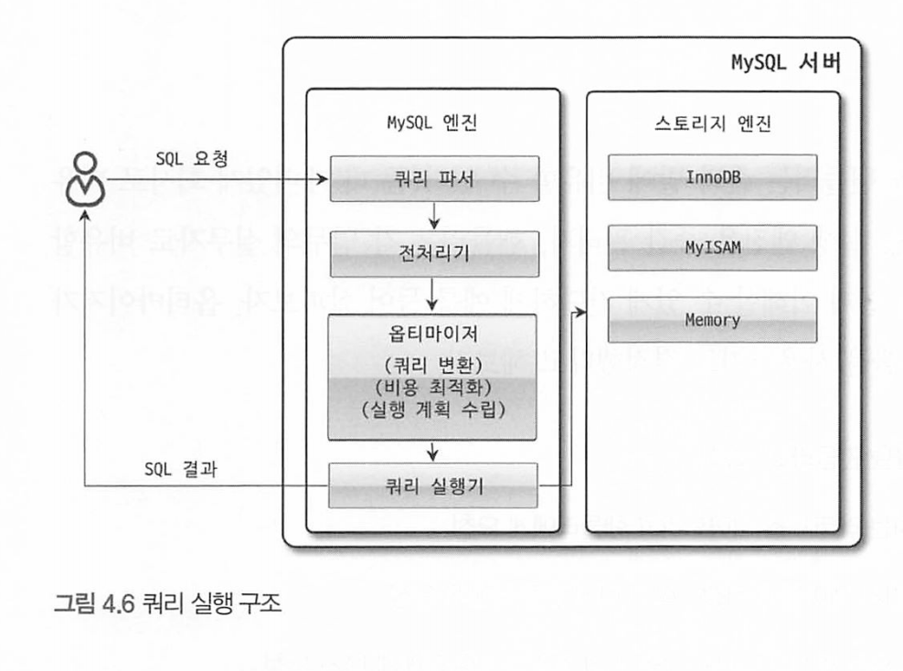

MySQL 쿼리 실행 순서 

1. 사용자 요청
2. 쿼리 파서에서 트리형태로 쿼리 재구성 -> 문법오류 걸러짐
3. 전처리기 - 쿼리 구조적 오류, 테이블, 컬럼이름 검증, 권한 검증
4. 옵티마이저 -> 쿼리를 어떻게 빠르게 처리할지 결정
5. 쿼리실행기 - 옵티마이저에서 만든 계획대로 핸들러에게 실제 요청을 주고받음
6. 스토리지엔진 = 실제 데이터를 디스크로부터 읽고 쓰는 작업을 수행

조금 더 자세히 보자

**쿼리 파서**

사용자 요청으로 들어온 쿼리 문장을 **토큰**으로 분해해 **트리** 형태의 구조로 만드는 작업을 한다.

* 토큰: MySQL이 인식할 수 있는 최소 단위의 어휘나 기호
* **쿼리 문장**의 **기본 문법 오류가** 걸러져, 문법 오류 발생시 사용자에게 오류 메시지를 전달한다.

 

**전처리기** - 검증

파서 과정에서 만들어진 파서 트리를 기반으로 쿼리 문장에 구조적인 문제가 있는지 확인한다.

각 토큰을 테이블 이름, 칼럼 이름, 내장 함수 같은 개체에 매핑해 해당 객체의 존재 여부와 객체 접근 권한 등을 확인한다. 

존재하지 않거나 권한상 사용할 수 없는 개체의 토큰이 걸러지는 단계다.

 

**옵티마이저**

사용자 요청으로 들어온 쿼리 문장을 저렴한 비용으로 가장 빠르게 처리할지 결정하는 역할을 담당한다. 

*  DBMS의 두뇌에 해당한다.

 옵티마이저가 더 나은 선택을 할 수 있게 유도하는가가 쿼리 튜닝의 시작이다. 


**실행 엔진**

만들어진 계획대로 각 핸들러에게 요청해서 받은 결과를 또 다른 핸들러 요청의 입력으로 **연결하는 역할**을 수행한다.

* 옵티마이저는 회사의 경영진, 실행 엔진은 중간 관리자, 핸들러는 업무의 실무자나 팀으로 비교 가능

ex) 옵티마이저가 group by를 처리하기 위해 임시테이블을 사용한다 하였을때의 계획

1. 실행 엔진이 핸들러에게 임시 테이블을 만들라고 요청
2. 다시 실행 엔진은 WHERE 절에 일치하는 레코드를 읽어오라고 핸들러에게 요청
3. 읽어온 레코드들을 1번에서 준비한 임시 테이블로 저장하라고 다시 핸들러에게 요청
4. 데이터가 준비된 임시 테이블에서 필요한 방식으로 데이터를 읽어 오라고 핸들러에게 다시 요청
5. 최종적으로 실행 엔진은 결과를 사용자나 다른 모듈로 넘김

즉, 실행 엔진은 요청을 다른 요청으로 전달하여 요청들을 이어주는 역할이다. 

 

**핸들러(스토리지 엔진)**

 MySQL 서버 가장 밑단에서 MySQL 실행 엔진의 요청에 따라 데이터를 **디스크로 저장**하고 디스크로부터 읽어 오는 역할을 담당한다.

* 핸들러는 결국 스토리지 엔진을 의미한다.

핸들러가 InnoDB 테이블을 조작하면 핸들러는 InnoDB 엔진이고 MyISAM 을 조작하면 핸들러는 MyISAM이다.


## 쿼리 캐시 - 지금은 제거됨 

SQL 실행 결과를 메모리에 캐시하고, 동일한 SQL 쿼리가 실행되면 테이블을 읽지 않고 즉시 결과를 반환하는 기능이다.  데이터 변경은 거의 없고 읽기만 하는 서비스에서는 매우 훌륭한 기능이지만, 그런 서비스는 거의 없다 

 

* 문제점: 빠른 응답을 필요로 하는 웹 기반 응용 프로그램에서 매우 중요한 역할을 담당했지만, 테이블 데이터가 변경되면 캐시에 저장된 결과 중 관련된 것은 모두 삭제하는 문제가 있었다. 이는 심각한 동시 처리 성능 저하를 유발했다. - 버그의 원인 

`MySQL 8.0 부터 완전히 제거되었다.`


## 스레드 풀 (Thread Pool)

스레드 풀은 작업처리에 사용되는 스레드를 제한된 개수만큼 정해놓고 작업큐에 들어오는 작업들을 하나씩 스레드가 맡아 처리한다. 

 MySQL 서버 엔터프라이즈 에디션은 스레드 풀 기능을 제공하고, **커뮤니티 버전은 제공하지 않는다**. 하지만 커뮤니티 버전도 플러그인 형태로 **Percona Server의 스레드 풀을 사용할 수 있다.**

* 엔터프라이즈 버전 스레드 풀은 MySQL 서버 프로그램에 내장되어 있고, Percona Server는 플러그인 형태로 제공한다.

**스레드 풀의 목적**: 내부적으로 사용자의 요청을 처리하는 스레드 개수를 줄여서 동시 처리되는 요청이 많아도,

CPU가, 한정된 스레드의 처리에만 집중할 수 있게 해서 서버의 자원 소모를 줄이는 것이다.

* 즉 스레드 풀은 다수의 클라이언트 요청을 효율적으로 처리하기 위해 사용되며, 서버의 자원 소모를 줄여 성능을 향상시키려는 것

주의할점은, 스케줄링 과정에서 CPU 시간을 제대로 확보하지 못하는 경우, 쿼리 처리가 더 느려질 수도 있다.


**커뮤니티 에디션에서 스레드 풀을 사용하는법**

* Percona Server에서 스레드 풀 플러그인 라이브러리(thread_pool.so)를 INSTALL PLUGIN으로 설치하면 된다 
* https://dev.mysql.com/doc/refman/8.0/en/thread-pool-installation.html


### Percona Server 스레드 풀

Percona Server의 스레드 풀은 CPU 코어 수 만큼 스레드 그룹을 생성한다. 

* **thread_pool_size** 시스템 변수로 스레드 그룹의 개수를 조정할 수 있다. 기본 값: CPU 코어 개수

* 일반적으로 CPU 코어의 개수와 맞추는 것이 CPU 프로세서 친화도를 높이는 데 좋다.

만약 이미 스레드 풀이 처리중인 작업이 있는 경우, thread_pool_oversubscribe 시스템 변수에 설정된 개수만큼 추가로 받아들여서 처리하는데, 이 값이 너무 크면 스케줄링할 스레드가 많아져서 비효율적이 될 수도 있다. 

 

스레드 그룹의 모든 스레드가 일을 처리하고 있다면,

스레드 풀은 해당 스레드 그룹에 새로운 작업 스레드를 추가하거나, 기존 작업 스레드가 처리를 완료할 때까지 기다릴지 여부를 판단해야한다.

*  **thread_pool_stall_limit** 시스템 변수에 정의된 밀리초만큼 작업 스레드가 지금 처리 중인 작업을 끝내지 못하면 새로운 스레드를 생성해서 스레드 그룹에 추가한다. (스레드 풀의 타이머 스레드가 주기적으로 스레드 그룹의 상태를 체크)

응답 시간에 민감한 서비스는 **thread_pool_stall_limit** 시스템 변수를 적절히 낮춰서 설정해야 한다.

* thread_pool_stall_limit는 작업을 대기하는 시간이므로, 낮아야 응답을 빠르게 유지할 수 있기 때문 

전체 스레드 풀의 스레드 개수는 **thread_pool_max_thread** 시스템 변수에 설정된 개수를 넘을 수 없다.


Percona Server의 스레드 풀 플러그인은 우선순위 큐와 후순위 를 이용해 특정 트랜잭션이나 쿼리를 우선적으로 처리할 수 있다.

*  먼저 시작된 트랜잭션 내에 속한 SQL을 빨리 처리해주면 해당 트랜잭션이 가지고 있는 잠금이 빨리 해제되고 잠금 경합을 낮춰 전체적인 처리 성능을 향상시킬 수 있다.


## 트랜잭션 지원 메타데이터 

데이터 딕셔너리 or 메타데이터: 테이블 구조 정보와 스토어드 프로그램 등의 정보


MySQL 5.7 이전에는 테이블 구조를 FRM 파일에 저장하고 일부 스토어드 프로그램 또한 **파일(*.TRN, *.TGF, *.PAR 등) 기반으로** 관리했다

* 문제점: **파일 기반의 메타데이터**는 생성 및 변경 작업이 **트랙잭션**을 지원하지 않는다. 
* 때문에 테이블의 생성 또는 병경 도중 MySQL 서버가 비정상적으로 종료되면 일관되지 않은 상태로 남는 문제가 있었다. -> 테이블 깨짐 현상


이 문제를

MySQL 8.0 이후에 테이블 구조 정보 또는 스토어드 프로그램 코드 관련 정보를 모두 **InnoDB 테이블에** 저장하여 해결했다.

시스템 테이블과 데이터 딕셔너리 정보를 모두 mysql DB에 저장한다.

* 시스템 테이블: MySQL 서버가 작동하는 데 기본적으로 필요한 테이블 ex) 사용자 인증과 권한에 관련된 테이블

* mysql DB는 통째로 mysql.ibd라는 이름의 테이블스페이스에 저장된다.

트랜잭션에 기반의 InnoDB 에 저장하므로, 때문에 스키마 변경 작업 중 MySQL 서버가 비정상 종료되어도, 스키마 변경이 완전한 성공 또는 완전한 실패로 정리된다.

*  InnoDB 스토리지 엔진 이외의 스토리지 엔진을 사용하는 테이블은 SDI(Serialized Dictionary Information) 형식의 *.sdi 파일에 저장된다
* 이 파일은 기존의 FRM 파일과 동일한 역할을 한다.


데이터 딕셔너리 테이블 조회 방법(뷰로 이루어져 있다): Real MySQL p96

```mysql
mysql> SHOW CREATE TABLEE INFORMATION_SCHIMA.TABLES; 
```

mysqlDB에서 tables 라는 이름에 접근해도 권한이 없어 실행할 수 없으므로 위 방식으로 조회해야 한다. 


> 즉, 스키마 정보가 파일로 저장되었을 경우에는 중간에 파일 쓰다가 에러나면 생길 수 있는 문제를 
> 테이블에 저장함으로써 스키마 변경 작업중에 MySOL 서버가 비정상적으로 종료되더라도 스키마 변경이 완전한 성공 또는 완전한 실패로 처리할 수 있도록 변경되었다.


# 4.2 InnoDB 스토리지 엔진 아키텍처

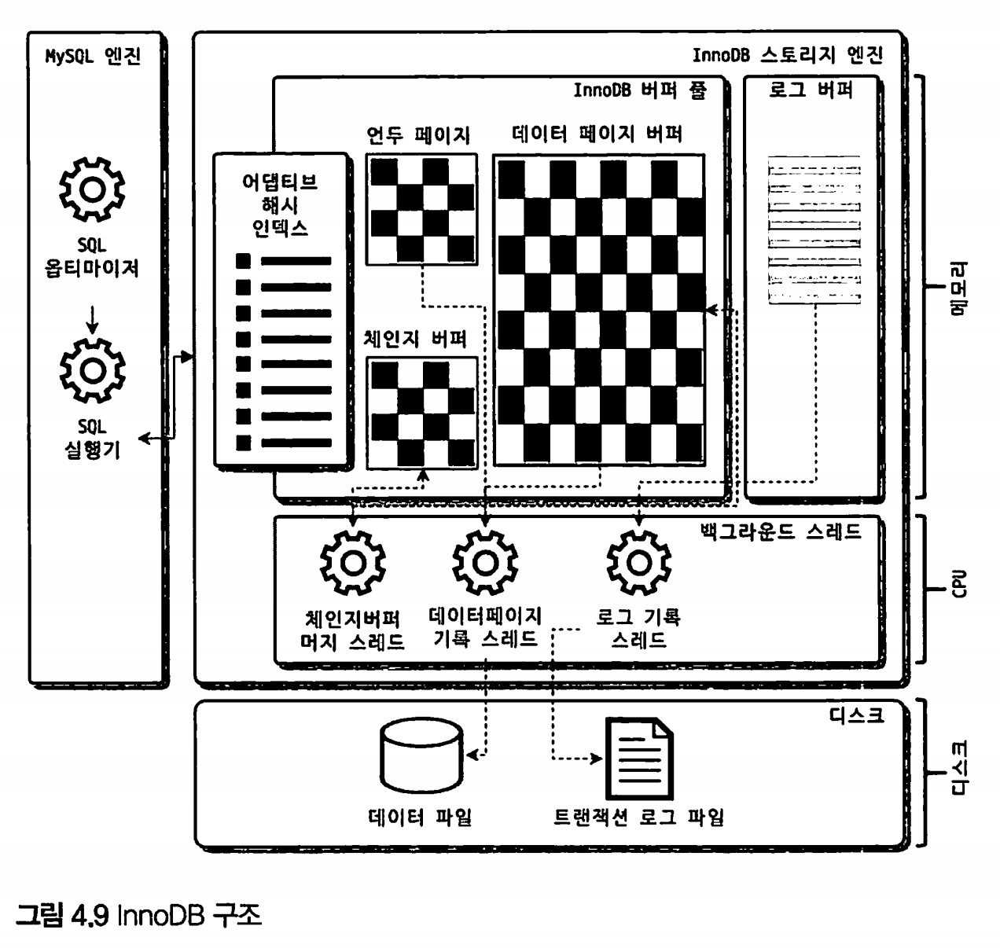

InnoDB는 스토리지 엔진 중 거의 유일하게 레코드 기반의 잠금을 제공하며, 그 때문에 높은 동시성 처리가 가능하고 안정적이며 성능이 뛰어나다.

* 레코드 기반의 잠금을 사용하면 데이터베이스는 특정 레코드에 대한 작업이 실행되는 동안 그 레코드만 잠그는데, 이는 다른 트랜잭션들이 그 **잠긴 레코드를 제외한 테이블의 다른 레코드에 접근하고 작업을 계속 수행할 수 있다**
* MyISAM 같은 경우 테이블 레벨 잠금을 사용하므로, 잠금이 걸리면 성능 저하를 일으킬 수 있다.


## 프라이머리 키에 의한 클러스터링

InnoDB의 모든 테이블은 기본적으로 프라이머리 키를 기준으로 클러스터링되어 저장된다. 

즉, 프라이머리 키 값의 순서대로 디스크에 저장된다는 뜻이며, 모든 세컨더리 인덱스는 레코드의 주소 대신 프라이머리 키의 값을 논리적인 주소로 사용한다. 프라이머리 키가 클러스터링 인덱스이기 때문에 프라이머리 키를 이용한 레인지 스캔은 상당히 빨리 처리될 수 있다

* 프라이머리키 = 클러스터링 인덱스
* 엄밀히 말하면 프라이머리 키는 데이터의 유일성을 보장하는 제약 조건이고, 클러스터링 인덱스는 데이터가 물리적으로 저장되는 방식

> 클러스터링(군집) 인덱스 vs 시퀀스 
>
> 인덱스의 순서와 레코드가 디스크에 저장된 순서가 일치하는 인덱스.
>
> 때문에 키 값의 범위에 따른 검색이 빠르다. 
>
> 클러스터링 인덱스는 데이터베이스 성능에 큰 영향을 미친다. 
>
> 시퀀스는 단지 일련의 숫자 값을 제공하고 데이터의 고유성을 보장하는데 사용된다. 

오라클의 IOD(Index organized table)가 InnoDB에서는 일반적인 테이블 구조이다. 

*  IOT는 데이터와 인덱스를 함께 저장하는 특별한 종류의 테이블

MyISAM에서는 클러스터링 키를 지원하지 않으며, 프라이머리 키랑 세컨더리 인덱스가 구조적으로 아무런 차이가 없다

* MyISAM의 프라이머리 키 : 유니크 제약을 가진 세컨더리 인덱스 

MyISAM 테이블의 프라이머 리 키를 포함한 모든 인덱스는 물리적인 레코드의 주소 값(ROWID)을 가지는데, 인덱스가 레코드의 물리적 위치, 즉 ROWID를 가리키므로 키 값을 통해 바로 레코드의 물리적 위치를 찾아 데이터를 조회할 수 있다.


## 외래 키 지원

외래키 지원은 MyISAM에서는 지원하지 않는다.

외래 키는 데이터베이스 서버 운영의 불편함 때문에 서비스용 데이터베이스에서는 생성하지 않는 경우도 자주 있는데, 

그렇지만 개발 환경의 데이터베이스에서는 좋은 가이드 역할을 할 수 있다. 

* 외래 키가 있는 테이블에서는 데이터를 추가, 수정, 삭제할 때 제약 조건을 검사해야 하므로 추가적인 성능 비용이 발생하기 때문이다.

InnoDB에서 외래 키는 부모 테이블과 자식 테이블 모두 해당 칼럼에 인덱스 생성이 필요하고, 변경 시에는 반드시 부모 테이블이나 자식 테이블에 데이터가 있는지 체크하는 작업이 필요하므로 잠금이 여러 테이블로 전파되고, 그로 인해 데드락이 발생할 때가 많다.

 개발할 때도 외래 키의 존재에 주의하는 것이 좋다.

외래키 관계에 대한 체크작업을 일시적으로 멈추고 작업할 수 있는 변수

```mysql
foreign_key_checks
```

이 작업을 일시적으로 멈추면, 레코드 적재나 삭제 등의 일부 작업도 부가적인 체크를 하지 않는다

```mysql
mysql> SET foreign_key_checks=OFF; // 외래키 체크 해제


~~~ 작업을 실행한다
mysql> SET foreign_key_checks=ON;
```

주의점

* 작업을 완료한 후에는 checks를  ON으로 바꿔서 원래상태로 돌려 외래키 관계 체크 작업을 하게 해야 한다.
* 또한 외래 키 체크를 일시적으로 중지한 상태에서 외래 키 관계를 가진 부모 테이블의 레코드를 삭제했다면 반드시 자식 테이블의 레코드도 삭제해서 일관성을 맞춰준 후 다시 외래 키 체크 기능을 활성화해야 한다

foreign_key_checks 시스템 변수는 적용 범위가  GLOBAL, SESSION 모두 설정 가능한데, 일반적으로 현재 작업을 실행하는 세션에서만 외래키 체크기능을 멈추게 해야 한다.  전체 시스템으로 적용되면 어떤 문제가 생길지 모르기 때문이다.

때문에 다음과 같이 SESSION을 명시하는것이 좋다.

```mysql
mysql> SET SESSION foreign_key_checks=OFF; // 현재 세션에 적용
mysql> SET foreign_key_checks=OFF;// 주의! 명시하지 않으면  GLOBAL에 적용 된다.
```

* 명시하지 않으면  GLOBAL에 적용 된다.

# MVCC(Multi Version Concurrency Control)

일반적으로, 레코드(row, 행)레벨의 트랜잭션을 지원하는 DBMS가 제공하는 기능이다. 

MVCC의 목적 : 잠금을 사용하지 않는 일관된 읽기를 제공함에 있다.

> MySQL MVCC(Multi-Version Concurrency Control)는 MySQL에서 동시성 제어를 위해 사용되는 기술. 
>
> MVCC는 동시에 여러 트랜잭션이 데이터베이스를 읽고 쓸 수 있는 환경에서 일관성과 격리성을 유지하기 위해 사용된다.

MVCC는 트랜잭션의 동시성을 향상시키기 위해 락(잠금) 기반의 동시성 제어 방식을 사용하는 대신 버전을 사용하여 데이터를 관리한다. 

* 락(Lock을 사용 못하는것은 아니다. 

MySQL은  **언두 로그(undo log**)를 이용해 이 기능을 구현한다.

####  **언두 로그(undo log**)

언두 로그란 MySQL이 트랜잭션과 격리 수준을 보장하기 위해 백업해둔 변경 전의 데이터이다.

- 트랜잭션 보장: 트랜잭션이 롤백되면 변경된 데이터를 백업된 이전 버전으로 복구시킨다.
- 격리 수준 보장: 특정 커넥션에서 데이터를 변경하는 도중에 다른 커넥션에서 데이터를 조회하면 격리 수준에 맞는 데이터를 반환한다.

> 트랜잭션의 롤백(rollback) 기능을 지원하기 위해 사용되는 로그

트랜잭션은 여러 개의 연속된 데이터 조작 작업(INSERT, UPDATE, DELETE)으로 구성될 수 있는데, 

언두로그에는 각각의 데이터 조작 작업의 역추적 정보가 저장되어 있어, 롤백이 발생할 경우 해당 트랜잭션이 수행한 작업들을 취소하고 이전 상태로 복원할 수 있다.

**언두로그 메커니즘**

데이터 조작 작업(INSERT, UPDATE, DELETE)이 실행되면, 데이터베이스는 커밋 여부와 무관하게 실제 데이터와 버퍼풀(메모리)의 내용을 변경하여 적용한다.

그리고 언두 로그 영역에는 변경 전의 값을 로그로 백업해두다가 커밋되면 현재 상태를 유지하고, 롤백되면 언두 로그의 백업 데이터로 복구한다.

때문의 아래의 상황은 좋지 않다.

- 대량의 데이터를 변경 또는 삭제하는 경우
- 트랜잭션을 오래 유지하는 경우
- 네트워크 요청과 관련된 부분은 가능하다면 반드시 트랜잭션 범위에서 제외시켜야 한다.

언두로그의 크기를 증가시킬 수 있으며, 이는 데이터베이스 성능에 영향을 줄 수 있다. 

> 예를들어, 10GB의 테이블을 DELETE 하면 모든 레코드가 삭제되지만 동시에 언두로그에 삭제된 데이터가 저장되며 10GB 공간을 차지한다. MySQL 5.5부터 InnoDB 엔진에서 언두로그를 자동으로 관리하고 크기를 줄여주지만, 여전히 이 상황은 좋지 않다.
>
> 또한, 트랜잭션을 오래 유지하는 경우 해당 트랜잭션이 커밋될지 롤백될지 알 수 없기 때문에 언두로그를 계속해서 쌓게 된다. 
>
> 쌓인 언두로그는 쿼리 실행 시 변경 전의 데이터를 찾기 위해 검색되어 쿼리 성능에 영향을 줄 수 있다


**버퍼풀(Buffer Pool)이란?**

버퍼풀은 스토리지 엔진의 핵심 부분으로, 디스크에 저장된 테이블과 인덱스 정보(엄밀히는 페이지)를 캐시해두는 공간이다. 

* 메모리 상에 데이터 페이지를 캐시하는 공간

이러한 버퍼 풀은 크게 2가지 역할을 갖는다.

- 캐싱을 통한 읽기 성능 향상
- 쓰기 지연을 통한 쓰기 성능 향상

버퍼풀은 데이터를 임시 저장하기 위한 메모리 공간이므로, 읽기 작업 시에 디스크 읽기 횟수를 줄여 성능을 높일 수 있다. 또한 쓰기 작업을 지연시켜 여러 건의 디스크 쓰기를 한 번에 처리할 수 있는 버퍼 역할도 같이 한다. 쓰기 작업을 매번 따로 수행하면 데이터를 처리할 위치를 찾아야 하는 랜덤 I/O가 발생하지만 버퍼풀을 사용하면 일괄 처리하므로 디스크 I/O를 줄여 성능을 높일 수 있다.

* 버퍼풀은 변경된 데이터를 메모리에 유지하고 일정 시간 동안 캐시된 데이터를 디스크에 쓰는 지연 기법인 "지연 쓰기(Lazy Write)"를 사용할 수 있다. 디스크에 대한 쓰기 작업을 최적화하여 디스크 I/O의 부담을 줄이고 데이터 일관성을 유지하는 데 도움을 준다.

그러므로 버퍼풀은 성능에 상당한 영향을 준다. 그래서 쿼리 요청이 빈번한 서버를 재시작하면 캐싱된 내역이 없어 쿼리 성능이 1/10도 안되게 떨어지곤 한다. 그래서 MySQL은 5.6부터 서버가 셧다운 되기 직전에 버퍼풀을 백업하고, 자동으로 복구할 수 있는 기능을 제공해준다. 이렇게 디스크의 데이터가 버퍼풀에 적재된 상태를 워밍업(warming up)이라고 한다.

 ### MVCC 예제

Member 테이블에 data를 insert하면 다음과 같이 상태가 바뀐다.

```mysql
INSERT INTO member(m_id, m_name, m_area) VALUEs (12, '홍길동', '서울');
```

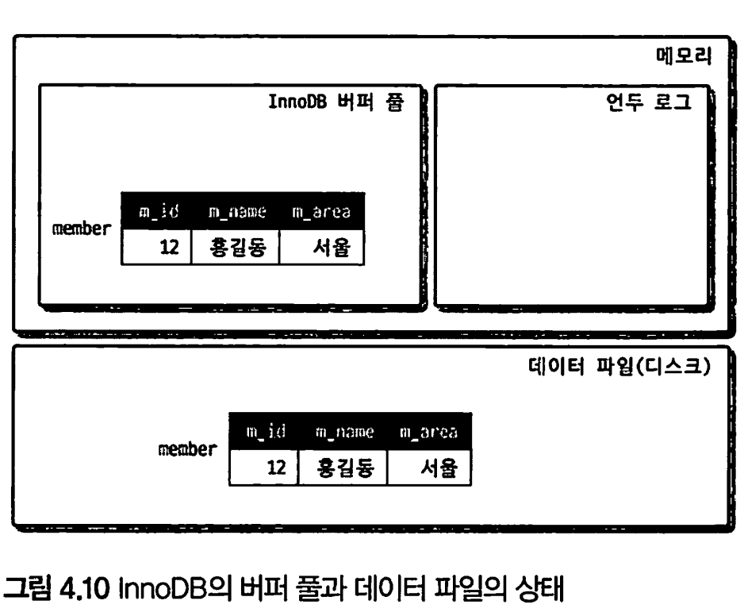

여기에 update를 하면 다음과 같이 상태가 바뀐다. 

```mysql
mysql> UPDATE member SET m_area='경기' WHERE m_id=12;
```

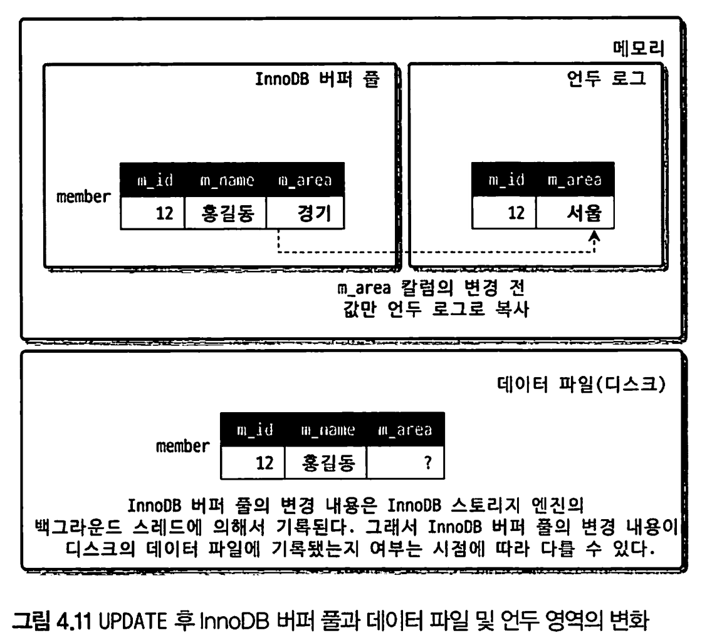

버퍼 풀이랑 데이터 파일(디스크)에 즉시 업데이트 되며, 언두 로그에 이전 버전의 데이터가 남게 된다. 

이때 아직 COMMIT이나 ROLLBACK 되지 않은 상태에서, 다른 사용자가 해당 멤버(id 12)를 조회하면, 현재 MySQL 서버의 시스템 변수(transaction_isolation)에 설정된 격리 수준에 따라 다르다.

격리 수준이 READ_UNCOMMITED인 경우, InooDB 버퍼 풀에 있는 데이터를 반환하며 (아직 커밋 전이다.)

격리 수준이 READ_COMMITTED, REPEATABLE_READ, SERIALIZABLE인 경우 아직 커밋되지 않았기 때문에 InnoDB 버퍼 풀이나 디스크 대신 **언두 로그에 있는 데이터를 반환한다.** 

> 이러한 과정을 MVCC라고 한다.
>
> 변경된 데이터에 대해 여러개의 버전이 유지되고, 필요에 따라 어느 데이터가 보여지는지 여러 상황에 따라 달라지는 구조다

COMMIT을 실행하면 현재 상태를 반영하며, 격리수준이 READ_COMMITED 이상인 트랜잭션들은 이제부터 버퍼 풀이나 디스크에서 데이터를 읽으며, 

ROLLBACK을 실행하면, 언두 영역에 있는 데이터를 버퍼 풀로 다시 복구하고 언두 영역의 내용을 삭제한다.

그러나 커밋된다고 언두 영역의 백업 데이터가 항상 바로 삭제되는 것은 아니며

`해당 언두영역을 필요로 하는 트랜잭션이 더는 없을 때 비로소 삭제된다.`


## 잠금 없는 일관된 읽기 (Non-Locking Consistent Read)

데이터베이스에서 특정 데이터를 읽을 때, 다른 트랜잭션에 의한 잠금을 피하면서 일관된(read-consistent) 데이터를 읽는 방법. 

이는 일관성과 동시성을 조합하여 데이터베이스 성능을 향상시키는 기법 중 하나

격리 수준이 SERIALIZABLE이 아닌 READ_COMMITEED나 REPEATABLE_READ 수준인 경우 

**INSERT와 연결되지 않은 순수한 SELECT 작업**은 다른 트랜잭션의 변경 작업과 관계 없이 바로 실행된다.

* SERIALIZABLE은 락이 걸린다.

특정 사용자가 레코드를 변경하고 아직 커밋하지 않았더라도, `변경 트랜잭션`이 다른 사용자의 SELECT 작업을 방해하지 않는다

*  데이터를 변경하는 트랜잭션이 다른 트랜잭션의 읽기 작업을 방해하지 않는다.

이를 **Non-Locking Consistent Read** 라고 하며 **언두 로그를 사용**한다. 

* 목적 : 일관성을 유지하고 동시성을 높이고 읽기 작업의 지연을 줄이기 위해 

## 자동 데드락 감지

InnoDB 엔진은 내부적으로 Lock이 교착 상태에 빠지지 않았는지 체크하기 위해 잠금 대기 목록(Lock)을 그래프(Wait-for List) 형태로 관리한다. 

* Wait-for List : 트랜잭션들 사이에 발생하는 대기 관계(wait-for relationship)를 추적하기 위해 사용되는 자료구조
* 대기 관계는 한 트랜잭션이 다른 트랜잭션이 소유한 잠금을 기다리는 상황

데드락 감지 스레드가 주기적으로 잠금 대기 그래프를 검사해 교착상태에 빠진 트랜잭션들을 찾아서 그중 하나를 강제 종료한다.

강제 종료할것인가를 결정하는 기준은 트랜잭션의 **언두 로그 양** 이며, **언두 로그 레코드를 더 적게 가진 트랜잭션**이 일반적으로 롤백의 대상이 된다.

* 언두 로그 레코드를 더 적게 가졌다는건 롤백 해도 언두 처리할 내용이 적고 롤백으로 인한 서버의 부하도 덜 유발하기 때문

InnoDB는 MySQL 엔진에서 관리되는 테이블 잠금(Lock TABLES 명령으로 잠긴 테이블)은 볼 수 없는데,

innodb_table_locks 시스템 변수를 활성화하면 레코드잠금 뿐만 아니라 테이블 레벨의 잠금까지 감지할 수 있다.

* 특별한 이유가 없다면 innodb_table_locks 시스템 변수를 활성화하자.


데드락 감지 스레드가 느려지면 서비스 쿼리 처리중인 스레드가 더 작업을 진행하지 못하고 대기하는데, 이는 서비스에 악영향을 미친다.

동시 처리 스레드가 매우 많은 경우 데드락 감지 스레드는 더 많은 CPU 자원을 소모하며 악영향을 미친다.

이 문제를 해결하려면 innodb_deadlock_dtect 시스템 변수를 OFF로 설정하면 데드락 감지 스레드는 더는 작동하지 않는다

하지만, 중재하는 스레드가 없기 때문에 무한정 대기하게 된다.

하지만, innodb_lock_wate_timeout 시스템 변수를 활성화 하면 데드락 상황에서 일정 시간이 지나면 자동으로 요청이 실패하고 에러메시지를 반환한다. 

데드락 감지 스레드가 부담되어 innodb_deadlock_detect를 OFF하는 경우라면, innodb_deadlock_wait_timeout을 기본 값인 50초보다 훨씬 낮은 시간으로 변경하여 사용하는 것이 좋다. 

>  구글(google.com)에서는 프라이머리 키 기반의 조회 및 변경이 아주 높은 빈도로 실행되는 서비스가 많았는데, 이런 서비스는 매우 많은 트랜잭션을 동시에 실행하기 때문에 데드락 감지 스레드가 상당히 성능을 저하시킨다는 것 을 알아냈다. 그리고 MySQL 서버의 소스코드를 변경해 데드락 감지 스레드를 활성화 또는 비활성화할 수 있게 변경 해서 사용했다. 
>
> 이 기능의 필요성을 인지하고 오라클에 이 기능을 요청해서 MySQL 서버에 추가된 것이다. 
>
> 만약 PK 또는 세컨더리 인덱스를 기반으로 매우 높은 동시성 처리를 요구하는 서비스가 있다면
>
>  innodb_deadlock_detect를 비활성화해서 성능 비교를 해보는 것도 새로운 기회가 될 것이다.


## InnoDB 버퍼 풀

버퍼풀은 스토리지 엔진의 핵심 부분으로, 디스크에 저장된 테이블과 인덱스 정보(엄밀히는 페이지)를 캐시해두는 공간이다. 

* 메모리 상에 데이터 페이지를 캐시하는 공간

이러한 버퍼 풀은 크게 2가지 역할을 갖는다.

- 캐싱을 통한 읽기 성능 향상
- 쓰기 지연을 통한 쓰기 성능 향상

INSERT, UPDATE, DELETE처럼 데이터를 변경하는 쿼리는 데이터 파일의 이곳저곳에 위치한 레코드를 변경하기 때문에 랜덤 IO를 발생시킨다. 버퍼풀에 모아서 처리하면 랜덤 IO를 줄일 수 있따.

> 버퍼풀은 데이터를 임시 저장하기 위한 메모리 공간이므로, 읽기 작업 시에 디스크 읽기 횟수를 줄여 성능을 높일 수 있다. 또한 쓰기 작업을 지연시켜 여러 건의 디스크 쓰기를 한 번에 처리할 수 있는 버퍼 역할도 같이 한다. 쓰기 작업을 매번 따로 수행하면 데이터를 처리할 위치를 찾아야 하는 랜덤 I/O가 발생하지만 버퍼풀을 사용하면 일괄 처리하므로 디스크 I/O를 줄여 성능을 높일 수 있다.
>
> * 버퍼풀은 변경된 데이터를 메모리에 유지하고 일정 시간 동안 캐시된 데이터를 디스크에 쓰는 지연 기법인 "지연 쓰기(Lazy Write)"를 사용할 수 있다. 디스크에 대한 쓰기 작업을 최적화하여 디스크 I/O의 부담을 줄이고 데이터 일관성을 유지하는 데 도움을 준다.

### 버퍼 풀의 메모리 크기 설정

MySQL 5.7버전 부터 InnoDB 버퍼 풀의 크기를 동적으로 조절할 수 있어서, 가능하면 버퍼 풀의 크기를 적절히 작은값으로 설정해서 상황을 봐가면서 조금씩 증가시키는 방법이 최적이다.

처음으로 MySQL 서버를 준비한다면 

* 운영체제 전체 메모리가 8기가 미만이라면, 50%정도만 버퍼 풀로 설정하고 나머지 공간은 서버와 OS 프로그램들이 사용할 수 있는 공간으로 확보하자
* 8기가 이상이라면, 전체 메모리의 50%에서 시작해서 조금씩 올려가면서 최적점을 찾자
* 전체 메모리 공간이 50GB 이상이라면, 대략 15GB에서 30GB를 서버, OS를 위해 두고 나머지를 버퍼 풀로 할당하자


**innodb_buffer_pool_size 시스템 변수**로 크기를 설정할 수 있다.

더 크게 변경하는 작업은 영향도가 크지 않지만, 크기를 줄이는 작업은 가능하면 하지 않는것이 좋다.

InnoDB 버퍼 풀은 내부적으로 128MB 청크 단위로 쪼개어 관리되는데, 이는 버퍼 풀의 크기를 줄이거나 늘리기 위한 단위 크기이다.

* 버퍼 풀의 크기를 동적으로 변경하고 싶다면?

* https://dev.mysql.com/doc/refman/8.0/en/innodb-buffer-pool-resize.html

버퍼 풀은 여러개로 쪼개어 관리될 수 있는데 각각 버퍼 풀을 버퍼 풀 인스턴스라고 표현한다.

innodb_buffer_pool_instances 시스템 변수를 이용해 여러개로 분리해서 관리할 수 있다.

* 기본적으로 버퍼 풀 인스턴스의 개수는 8개로 초기화된다.
* 전체 버퍼 풀을 위한 메모리 크기가 1GB 미만이면 인스턴스는 1개만 생성된다.
* 버퍼 풀 메모리 공간 크기가 40GB 이하면 기본 값인 8을 유지하자
* 메모리가 크다면 인스턴스당 5GB정도 되게 인스턴스 개수를 설정하는 것이 좋다. 

> 버퍼 풀을 여러 인스턴스로 분리하여 나누는 이유는, 병렬 처리, 캐시 히트율, 성능 및 확장성 향상을 위해 사용된다

### 버퍼 풀의 구조

InnoDB는 버퍼 풀이라는 거대한 메모리 공간을 페이지 크기(innodb_page_size 시스템 변수)의 조각으로 쪼개어 각 조각에 저장한다.

버퍼 풀의 페이지 크기 조각을 관리하기 위해 InnoDB는 LRU 리스트와 Flush 리스트, Free 리스트라는 3개의 자료구조를 관리한다

**Free List** 

: InnoDB 버퍼 풀에서 실제 사용자 데이터로 채워지지 않는 페이지들의 목록. 

* 사용자의 쿼리가 새롭게 디스크의 데이터 페이지를 읽어와야 할때 사용

**LRU List** : 

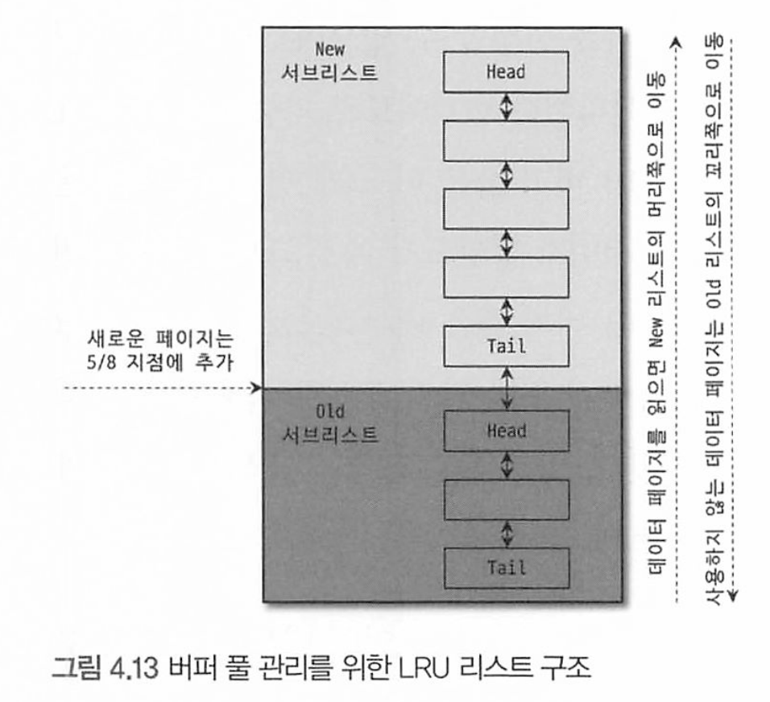

* Old 서브리스트 : LRU 영역
* New 서브리스트 : MRU(Most Recently Used) 영역 

LRU List를 관리하는 목적 : 디스크로부터 읽어온 페이지를 최대한 버퍼 풀의 메모리에 유지해서 디스크 읽기를 최소화 하는것.

InnoDB 에서 데이터를 찾는 과정

1. 필요한 레코드가 저장된 데이터 페이지가 버퍼 풀에 있는지 검사

   * InnoDB 어댑티브 해시 인덱스를 이용해 페이지를 검색
     * 어댑티브 해시 인덱스는 메모리 기반의 해시 테이블로 데이터를 저장하고 검색. 해시 값을 계산하고 해시 인덱스를 사용

   * 해당 테이블의 인덱스(B-Tree)를 이용해 버퍼 풀에서 페이지를 검색

   * 버퍼 풀에 이미 데이터 페이지가 있었다면 해당 페이지의 포인터를 MRU 방향으로 승급

2. 디스크에서 필요한 데이터 페이지를 버퍼 풀에 적재하고, 적재된 페이지에 대한 포인트러를 LRU(Old서브리스트) 헤더 부분에 추가 
3. 버퍼 풀의 LRU 헤더 부분에 적재된 데이터가 읽히면 MRU 헤더 부분으로 이동 (대량 읽기의 경우 데이터가 버퍼 풀로 적재는 되지만 실제 쿼리에서는 사용되지 않을수도 있으므로 이런 경우에는 MRU로 이동 안됌)
4. 버퍼 풀에 상주하는 데이터 페이지에 나이를 부여(사용자 쿼리의 최근 접근 빈도에 따라)하며 버퍼 풀에서 오랫동안 사용되지 않으면 오래된 나이(Aging)를 가진 페이지는 버퍼 풀에서 제거된다. 버퍼 풀에 데이터 페이지가 사용되면 나이가 초기화 되어 젊어지고 MRU의 헤더 부분으로 옮겨진다 
   * 버퍼 풀에서 데이터 페이지를 제거하고 추가 공간을 확보하는 작업을 Eviction 이라고 함
   * 최근 접근 여부와 빈도에 따라 데이터 페이지들끼리 서로 경쟁하면서 MRU 또는 LRU로 이동. LRU 끝(tail)로 밀려나면 버퍼 풀에서 제거한다
5. 필요한 데이터가 자주 접근됐다면 해당 페이지의 인덱스 키를 어댑티브 해시 인덱스에 추가

**Flush List**

디스크로 동기화되지 않은 데이터를 가진 페이지(더티 페이지)의 변경 시점 기준의 페이지 목록을 관리한다.

디스크에서 읽은 상태 그대로 전혀 변경이 없다면 플러시 리스트에 관리되지 않지만, 일단 한번이라도 변경이 가해진다면 플러시 리스트에 의해 관리고 특정 시점에 디스크로 기록돼야 한다.

데이터가 변경되면 InnoDB는 변경 내용을 리두 로그에 기록하고, 버퍼 풀의 데이터 페이지에도 변경 내용을 반영한다. 

* 하지만 리두 로그가 디스크로 기록됐다고 해서 데이터 페이지가 디스크로 기록됐다는 것을 항상 보장하지는 않음

* 체크포인트를 이용하여 InnoDB 가 리두로그를 이용하여 동기화되지 않은 데이터를 복구한다

MySQL은 언두 로그와 마찬가지로 데이터 변경 내용을 리두 로그로 기록하고, 이를 통해 MySQL 서버가 비정상적으로 종료됐을 때 일관된 데이터를 갖도록 도와준다. MySQL 서버가 비정상 종료되면 다음과 같은 문제가 생길 수 있는데, 이때 리두 로그를 활용하면 문제를 해결할 수 있다.

- 커밋됐지만 데이터 파일에 기록되지 않은 데이터
- 롤백됐지만 데이터 파일에 이미 기록된 데이터

### 버퍼 풀과 리두 로그(redo log)

리두 로그는 트랜잭션의 4가지 요소(ACID) 중에서 D(Durable)에 가장 밀접하게 연관돼있다. MySQL은 언두 로그와 마찬가지로 데이터 변경 내용을 리두 로그로 기록하고, 이를 통해 MySQL 서버가 비정상적으로 종료됐을 때 일관된 데이터를 갖도록 도와준다

> 리두 로그는 데이터베이스의 내구성(Durability)을 보장하고, 장애 발생 시 데이터를 복구하는 데 사용된다. 

리두 로그도 버퍼(메모리) 공간이 존재한다.

InnoDB는 DB의 성능을 향상시키기 위해 데이터 캐시와 쓰기 버퍼링이라는 두가지 용도를 제공한다.

그러나 버퍼 풀의 메모리 공간만 단순히 늘리는 것은 데이터 캐시 기능만 향상시키는 것이다.

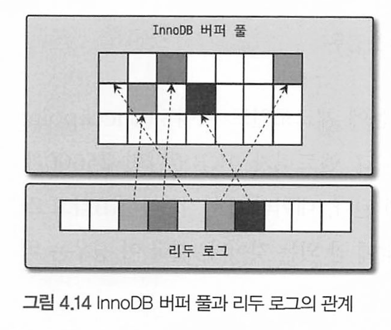

버퍼링 기능을 향상시키려면 어떻게 해야 할까?.


InnoDB 버퍼 풀은 2가지 종류의 페이지를 가지고 있다.

* Clean Page : 디스크에서 읽은 상태로 전혀 변경되지 않은 페이지
* Dirty Page: 한번이라도 변경이 가해진 데이터 페이지

더티 페이지는 디스크와 메모리(버퍼 풀)의 상태가 다르므로 언젠가는 디스크로 기록되어야 하는데 무한정 머무를 수는 없다.

InnoDB에서 리두 로그는 데이터 변경이 발생하면 리두 로그 파일에 기록됐던 로그 엔트리는 어느 순간 새로운 로그 엔트리로 덮어 쓰인다

* 로그 엔트리는 데이터 수정 내용, 로그 시퀀스번호(일련번호, LSN), 작성 시간 트랜잭션 ID 등의 메타 데이터로 구성되어 있다
* 재생시 로그 시퀀스 번호를 기반으로 정확한 순서대로 로그를 적용한다 

그래서 InnoDB는 전체 리두 로그 파일에서 재사용 가능한 공간과 당장 재사용 불가능한 공간을 구분해서 관리하기 위해

재사용 불가능한 공간을 활성 리두 로그(Active Redo Log)로 관리한다.

* 그림에서 화살표를 가진 엔트리들이 활성 리두 공간 

리두 로그파일의 공간은 순환되어 재사용되지만 기록될때마다 시퀀스(LSN) 값은 증가된 값을 갖는다.

InnoDB가 체크포인트 이벤트를 발생시켜 더티 페이지를 디스크로 동기화 하는데 가장 최근 체크포인트 지점의 LSN(시퀀스)이 활성 리두공간의 시작점이다. 

가장 최근 체크포인트의 LSN과  마지막 리두 로그 엔트리의 LSN의 차이를 checkpoint age(활성 리두공간의 크기) 라고 한다 


버퍼 풀의 더티 페이지 비율과 전체 리두 로그 파일의 크기를 예제를 보며 생각해보자

1. InnoDB 버퍼 풀은 100GB이며 리두 로그 파일의 전체 크기는 100MB인 경우
   * 리두 로그 파일의 크기가 100MB 이므로 체크포인트 에이지는 최대 100MB. 
   * 평균 리두 로그 엔트리가 4KB였다면 25600개(100MB/4KB)의 더티페이지만 버퍼 풀에 보관 가능. 
   * 데이터페이지가 16KB라면, 허용 가능한 전체 더티 페이지의 크기는 400MB 수준.. 
   * 버퍼 풀의 크기는 매우 크지만, 버퍼링 효과는 내지 못한다. 
2. InnoDB 버퍼 풀은 100MB이며 리두 로그 파일의 전체 크기는 100GB인 경우
   * 평균 리두 로그 엔트리가 4KB이고, 데이터 페이지 크기가 16KB라면, 400GB 정도의 더티 페이지를 가질 수 있다. (100GB / 4KB)
   * 하지만 버퍼 풀의 크기가 100MB 이기 때문에 최대 허용 가능한 더티 페이지는 100MB

리두 로그 파일의 크기를 키우면 `쓰기 지연` 기능을 최대화할 수 있지만, 그에 따라 성능 저하도 야기된다. 

너무 많은 더티 페이지를 디스크에 동기화하려면 굉장히 많은 시간이 소모될 수 있기 때문이다. 

### 버퍼 풀 플러시

더티페이지를 디스크에 동기화하는 부분을 **더티 페이지 플러시** 라고 한다.

InnoDB 스토리지 엔진은 버퍼 풀에서 아직 디스크로 기록되지 않은 더티 페이지들을 성능상의 악영향 없이 디스크에 동기화하기 위해 다음과 같이 2개의 플러시 기능을 백그라운드로 실행한다.

- `플러시 리스트 플러시`
- `LRU 리스트 플러시`

**플러시 리스트 플러시** (Flush List Flush)

nnoDB 스토리지 엔진은 리두 로그 공간의 재활용을 위해 주기적으로 오래된 리두 로그 엔트리가 사용하는 공간을 비워줘야하는데,

오래된 리두 공간이 지워지려면 버퍼 풀의 더티 페이지가  디스크로 동기화 돼야 한다.

이를 위해 InnoDB 스토리지 엔진은 주기적으로 Flush_list Flush 함수를 호출해서 

플러시 리스트에서 오래전에 변경된 데이터 페이지순서대로 디스크에 동기화하는 작업을 수행한다. 

더티 페이지를 디스크로 동기화하는 스레드를 `클리너 스레드(Cleaner Thread)`라고 하는데, `innodb_page_cleaners` 시스템 변수로 클리너 스레드의 개수를 조정할 수 있다. 

- `innodb_page_cleaners` 값이 버퍼 풀 인스턴스 개수보다 많으면, 버퍼 풀 인스턴스 개수(`innodb_buffer_pool_instances`) 값으로 자동 변경된다.
- `innodb_page_cleaners` 값이 버퍼 풀 인스턴스 개수보다 적으면, 하나의 클리너 스레드가 여러 개의 버퍼 풀 인스턴스를 처리한다. 

InnoDB의 버퍼 풀은 한계가 있기 때문에 무한정 더티 페이지를 그대로 유지할 수 없다.

더티 페이지를 많이 가지고 있을수록 디스크 쓰기 작업을 버퍼링함으로써 여러 번의 디스크 쓰기를 한 번으로 줄이는 효과(`쓰기 지연`)를 극대화할 수 있다.

하지만, InnoDB의 버퍼 풀에 더티 페이지가 많아질수록 `디스크 쓰기 폭발 현상(Disk IO Burst)`이 발생할 가능성이 높아진다는 문제점이 있다.

* InnoDB는 버퍼 풀의 더티 페이지 비율이 90%를 넘기면, 더티 페이지를 디스크로 기록해야 한다고 판단하고, 급작스럽게 디스크 쓰기가 폭증하는 현상(`디스크 쓰기 폭발 현상(Disk IO Burst)`)이 발생.

그렇기에 `innodb_max_dirty_pages_pct_lwm` 이라는 시스템 설정 변수를 이용해 일정 수준 이상의 더티 페이지가 발생하면 조금씩 더티 페이지를 디스크로 기록하게 된다.

- 디폴트값은 10%.
- 단, 디스크 쓰기가 너무 많이 발생한다면 `innodb_max_dirty_pages_pct_lwm` 값을 높이면 디스크 쓰기 횟수를 줄이는 효과를 얻을 수 있다.


관리해야 할 서버가 많다면, 일일히 설정할 수 없으므로 InnoDB는 어댑티브 플러시(Adaptive Flush) 기능을 제공한다.

* innodb_adaptive_flushing로 설정 가능. 기본값은 활성화

`어댑티브 플러시` 기능이 활성화되면 InnoDB는 앞선 시스템 변수(`innodb_io_capacity` 와 `innodb_io_capacity_max`)에 의존하지 않고 새로운 알고리즘을 사용한다.

이 알고리즘으로 **`리두 로그`의 증가속도를 분석해서 적절한 수준의 더티 페이지가 버퍼 풀에 유지될 수 있도록 디스크 쓰기를 실행**한다.

**LRU 리스트 플러시**

InnoDB는 LRU 리스트에서 사용 빈도가 낮은 데이터 페이지들을 제거해서 새로운 페이지들을 읽어올 공간을 만들어야 해서 이를 위해 `LRU 리스트(LRU_list) 플러시 함수`를 사용한다. 

### 버퍼 풀 상태 백업 빛 목구

서버를 셧다운 했다가 서비스를 다시 시작하면 쿼리 처리 성능이 평상시보다 1/10도 안되는 경우가 발생하는데,

이는 버퍼 풀에서 사용되던 디스크 데이터가 없기 때문이다.

디스크의 데이터가 버퍼 풀에 적재돼어있는 상태를 워밍업(Warming Up) 이라고 표현하는데,

버퍼 풀이 잘 워밍된 상태에서는 그렇지 않은 상태보다 몇십 배의 쿼리 처리 속도를 보이는 것이 일반적이다.

MySQL 5.6부터 버퍼 풀 덤프 및 적재 기능이 도입되어서 서버 점검이나 기타 작업을 위해 MySQL 서버를 재시작 해야 하는 경우 백업할 수 있다.

```mysql
--// MySOL 서버 셧다운 전에 버퍼 풀의 상태 백업

mysql> SET GLOBAL innodb_buffer_pool_dump_now=ON;

-// MySOL 서버 재시작 후, 백업된 버퍼 풀의 상태 복구
mysql> SET GLOBAL innodb_buffer_pool_load_now=ON;
```

* MySQL 서버를 셧다운하기 전에 다음과 같이 innodb_buffer_pool_dump_now 시스템 변수를 이용해 현재 InnoDB 버퍼 풀의 상태를 백업할 수 있다. 
* MySQL 서버를 다시 시작하면 innodb_buffer_pool_load_now 시스템 변수를 이용해 백업된 버퍼 풀의 상태를 다 시 복구할 수 있다.

버퍼 풀의 백업은 데이터 디렉토리에 ib_buffer_pool 이라는 이름의 파일로 생성되며, 크기가 몇십 MB 이다.

* InnoDB가 버퍼 풀의 LRU 리스트에서 적재된 데이터 페이지의 메타 정보만 가져와서 저장하기 때문

InnoDB는 버퍼 풀을 복구하는 과정이 어느정도 진행됐는지 확인할 수 있게 상태 값을 제공한다.

```mysql
mysql> SHOW STATUS LIKE 'Innodb_buffer_pool_dump_status' \G
******************** 1 row ***************
Variable name: Innodb_buffer_pool_dump_status
		Value: Buffer pool(s) dump completed at 200712 23:38:58
```

버퍼 풀 적재 작업이 너무 오래걸려 멈추고자 한다면 innodb_buffer_pool_load_abort 시스템 변수를 이용할 수 있다.

복구하는 작업중 서비스를 재개하는 것은 많은 디스크 읽기 때문에 좋지 않은 선택일 수 있다. 

그러나 복구 도중 급히 서비스를 시작해야 한다면 다음과 같이 버퍼 풀 복구를 멈출 것을 권장한다. 

```mysql
mysql> SET GLOBAL innodb_buffer_pool_load_abort=ON;
```


버퍼 풀의 백업과 복구를 자동화 하려면 innodb_buffer_pool_dump_at_shutdown과 

innodb_buffer_pool_load_at_startup 설정을 MySQL 서버의 설정 파일에 넣어두면 된다.

> 참고
>
> InnoDB 버퍼 풀의 백업은 ib_buffer_pool 파일에 기록되는데, 그렇다고 해서 반드시 셧다운하기 직전의 파 일일필요는 없다. InnoDB 스토리지 엔진은 ib_buffer_pool 파일에서 데이터 페이지의 목록을 가져와서 실제 존재 하는 데이터 페이지이면 IhnoDB 버퍼 풀로 적재하지만 그렇지 않은 경우에는 그냥 조용히 무시해버린다. 그래서 실제 존재하지 않는 데이터 페이지 정보가 ib_buffer_pooㅣ 파일에 명시돼 있다고 해서 MySQL 서버가 비정상적으로 종료되거나 하지는 않는다.

### 버퍼 풀의 적재 내용 확인

MySQL 8.0 버전 부터 

information_schema DB의 innodb_cached_indexses 테이블을 이용해 테이블의 인덱스 별로 데이터 페이지가 얼마나 버퍼 풀에 적재돼 있는지 확인할 수 있다.

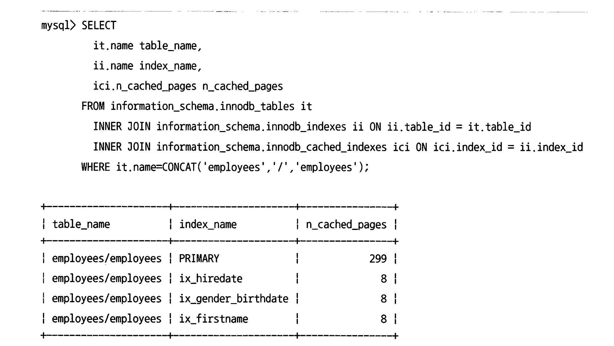

## Double Write Buffer

리두 로그는 리두 로그 공간의 낭비를 막기 위해 페이지의 변경된 내용만 기록한다.

 이로 인해 InnoDB에서는 더티 페이지를 디스크 파일로 플러시할 때, 일부만 기록되는 문제가 발생하면 그 페이지의 내용은 복구하지 못할 수도 있는데 이렇게 페이지의 일부만 기록되는 현상을

*  `파셜 페이지(Partial-Page)` 
* 또는 `톤 페이지(Torn-Page)` 라고 한다.

 이런 현상은 하드웨어의 오작동이나 비정상 종료 등으로 발생할 수 있습니다.

이러한 문제를 막기 위해 Double-Write 기법을 사용한다. 

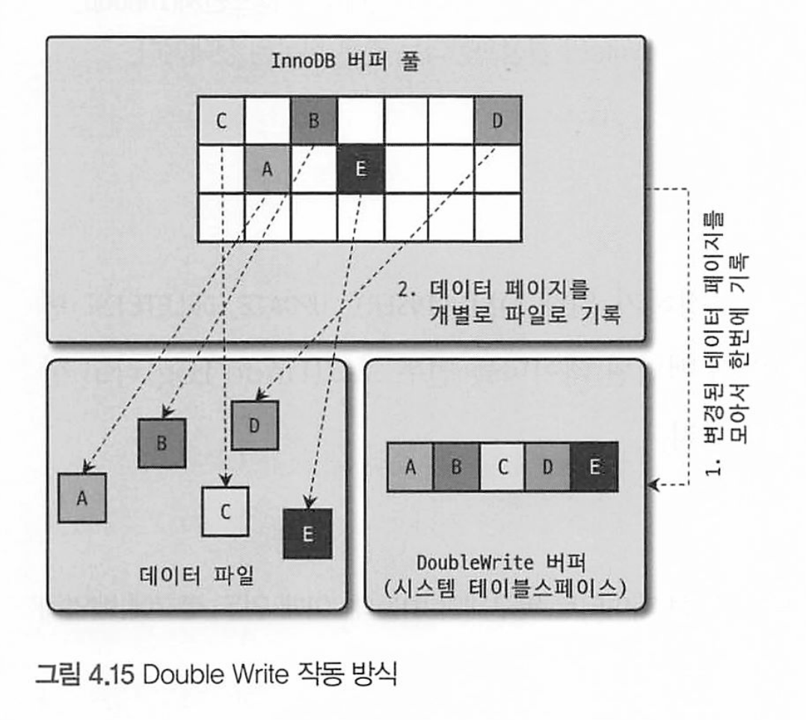

이미지에서 A ~ E 까지의 더티 페이지를 디스크로 플러시한다고 가정해보자


InnoDB는 실제 데이터 파일에 변경 내용을 기록하기 전에 A ~ E 까지의 더티 페이지를 묶어 한번의 디스크 쓰기로 

시스템 테이블 스페이스의 **DoubleWrite 버퍼에 기록한다.**

그리고 각 더티 페이지를 파일의 적당한 위치에 하나씩 랜덤으로 쓰기를 실행한다. 

1. 우선 실제 데이터 파일에 변경 내용을 기록하기 전에 A~E 까지의 더티 페이지를 묶어서 한 번의 디스크 쓰기로 시스템 테이블스페이스의 `Double Write Buffer`에 기록.
2. 그리고 InnoDB 스토리지 엔진은 각 더티 페이지를 디스크의 적당한 위치에 하나씩 랜덤으로 쓰기를 실행.

시스템 테이블스페이스의 `Double Write Buffer` 공간에 기록된 변경 내용은 실제 데이터 파일에 A~E 더티 페이지가 정상적으로 기록되면 더이상 필요가 없어진다.

즉, `Double Write Buffer` 의 목적은 실제 데이터 파일의 쓰기가 중간에 실패할 때의 문제를 대비하기 위한 목적으로 사용한다.

> DoubleWrite 기능을 사용할지 여부는 innodb_doublewrite 시스템 변수로 제어할 수 있다.

## 언두 로그

언두 로그란 MySQL이 트랜잭션과 격리 수준을 보장하기 위해 백업해둔 변경 전(DML로 변경되기 전의 데이터이다.

- 트랜잭션 보장: 트랜잭션이 롤백되면 변경된 데이터를 백업된 이전 버전으로 복구시킨다.
- 격리 수준 보장: 특정 커넥션에서 데이터를 변경하는 도중에 다른 커넥션에서 데이터를 조회하면 격리 수준에 맞는 데이터를 반환한다.


다음 명령어로 언두 로그 레코드 건수를 확인할 수 있따.

```mysql
-- //MySOL 서버의 모든 버전에서 사용 가능한 명령
mysq1> SHOW ENGINE INNODB STATUS \G
```

8.0에서는 다음과 같이 사용할 수 있다.

```mysql
mysql> SELECT count
			 FROM information_schema.innodb_metrics
		   WHERE SUBSYSTEM='transaction' AND NAME='trx_rseg_history_len';
```

언두 로그 레코드 건수를 확인해 모니터링하여 문제되는 트랜잭션을 모니터링 해보자. 

### 언두 테이블 스페이스 관리

언두 로그가 저장되는 공간을 언두 테이블 스페이스 라고 한다.

MySQL 8.0.14 부터 언두 로그는 항상 시스템 테이블 스페이스 외부의 별도 로그 파일에 기록되도록 개선됐다.

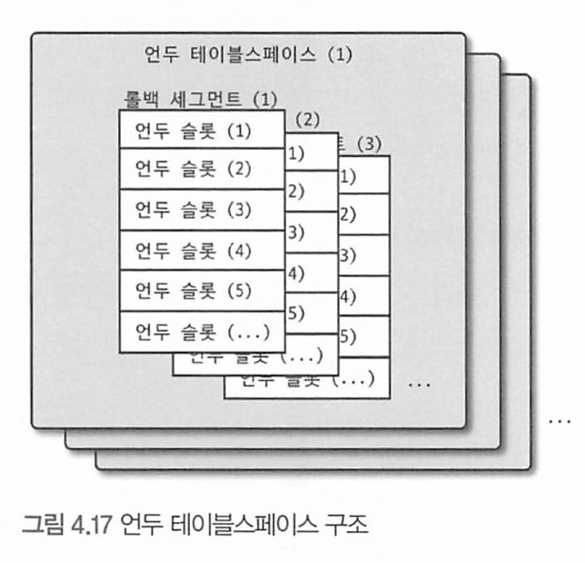

하나의 언두 테이블스페이 스는 1개 이상 128개 이하의 롤백 세그먼트를 가지며, 롤백 세그먼트는 1개 이상의 언두 슬롯(Undo Slot)을 가진다.

하나의 롤백 세그먼트는 InnoDB의 페이지 크기를 16바이트로 나눈 값의 개수만큼의 언두 슬롯을 가진다. 

예를 들어, InnoDB의 페이지 크기가 16K 라면 하나의 롤백 세그먼트는 1024개의 언두 슬롯을 갖게 된다. 

하나의 트랜잭션이 필요로 하는 언두 슬롯의 개수는 트랜잭션이 실행하는 INSERT, UPDATE, DELETE 문장의 특성에 따라 최대 4개까지 언두 슬롯을 사용하게 된다.


하나의 트랜잭션이 대략 2개 정도의 언두 슬롯을 필요로 한다고 가정하면, 최대 동시 처리가능한 트랜잭션의 개수는 다음 수식으로 예측 해볼 수 있다.

> 최대 동시 트랜잭션 수 = (InnoDB 페이지 크기) / 16 * (롤백 세그먼트 개수) * (언두 테이블스페이스 개수)

가장 일반적인 설정인 **16KB** InooDB에서 기본설정 (innodb_undo_tablespaces = **2**, innodb_rollback_segments = **128**)

을 사용한다고 가정한다면 ?

> 16 * 1024(kb) / 16 * 128 * 2 / 2(하나의 트랜잭션이 사용하는 슬롯 ㅛㅜ)= 131072개의 동시 처리 가능 트랜잭션 

### 체인지 버퍼

인덱스를 업데이트 하는 작업은 랜덤 IO 작업이 필요하므로 인덱스가 많다면 많은 자원을 소모하게 된다.

> `랜덤 디스크 액세스`는 디스크에 접근할 때 순차적이지 않은 방식으로 블록에 접근하는 것을 의미한다. 
>
> 디스크는 블록 단위로 데이터를 저장하고, 블록은 디스크 상에 랜덤한 위치에 저장됩니다.
> 예를 들어, 데이터 베이스에서 특정 인덱스를 검색할 때, 해당 인덱스 블록의 물리적인 위치를 알아도 디스크의 헤드를 자주 이동시켜서 I/O 성능이 저하되는 문제를 야기한다 .
> 즉, 인덱스를 통해 원하는 노드의 위치를 알게 되는 과정까지 거치는 노드들도 모두 순차적으로 저장된 것이 아니라, 랜덤하게 저장되어 있어서 디스크의 헤드가 많이 움직이게 된다. 
>
> 그래서 `랜덤 디스크 액세스` 작업이 많이 일어나게 되면 최악의 디스크 I/O 작업이 발생한다.
> **단, PK는 예외다. PK는 클러스터링 인덱스로 데이터 파일과 물리적으로 동일한 순서로 정렬되어 있어  `클러스터링 인덱스(PK) 업데이트 작업`은 `순차적으로 디스크에 액세스`할 수 있다.**

InnoDB는 변경해야 할 인덱스 페이지가 버퍼 풀에 있으면 바로 업데이트를 수행한다.

디스크로부터 읽어와서 업데이트 해야 한다면, 이를 즉시 실행하지 않고 임시 공간에 저장해 두고 바로 사용자에게 결과를 반환하는 형태로 성능을 향상시킨다

이때 사용하는 임시 메모리 공간을 Change Buffer 라고 한다.

* 사용자에게 결과를 전달하기 전에 중복 여부를 체크하는 유니크 인덱스는 체인지 버퍼를 사용할 수 없다.

체인지 버퍼에 임시로 저장된 인덱스 레코드 조각은 체인지 버퍼 Merge Thread(백그라운드로 동작)에 의해 병합된다

`innodb_change_buffering` 이라는 시스템 변수가 새로 도입되어 작업의 종류별로 체인지 버퍼를 활성화할 수 있으며, 체인지 버퍼가 비효율적일 때는 체인지 버퍼를 사용하지 않게 설정할 수 있게 개선되었다 .

`innodb_change_buffering` 시스템 변수에 설정할 수 있는 값은 다음과 같다. 

- all : 모든 인덱스 관련 작업 버퍼링
- none : 버퍼링X
- inserts : 인덱스에 새로운 아이템 추가하는 작업만 버퍼링
- deletes : 인덱스에서 기존 아이템을 삭제하는 작업만 버퍼링
- changes : 인덱스에 추가하고 삭제하는 작업(inserts + deletes)만 버퍼링
- purges : 인덱스 아이템을 영구적으로 삭제하는 작업만 버퍼링

`체인지 버퍼`는 InnoDB `버퍼 풀`로 설정된 메모리 공간을 사용한다. 기본적으로 InnoDB 버퍼 풀의 25% 까지 사용할 수 있게 설정되어 있다. 


### 리두 로그 아카이빙

MySQL 8.0 버전부터 InnoDB 스토리지 엔진의 리두 로그를 아키이빙할 수 있는 기능이 추가 되었다. 

MySQL 엔터프라이즈 백업이나 Xtrabackup 툴은 데이터 파일을 복사하는 동안 InnoDB 스토리지 엔진의 리두 로그에 쌓인 내용을 계속 추적하면서 새로 추가된 리두 로그 엔트리를 복사한다.

그런데, MySQL ySQL 서버에 유입되는 데이터 변경이 너무 많으면, 리두 로그가 매우 빠르게 증가하고, 백업 툴이 새로 추가되는 리두 로그 내용을 복사하기도 전에 덮어쓰일 수도 있다.

* 리드 로그는 새로운 리두 로그 엔트리로 덮어 쓰이기 때문이다.


이 문제를 리두 로그 아카이빙 기능으로 해결한다. 데이터 변경이 많아서 리두 로그가 덮어 쓰인다고 하더라도 백업이 실패하지 않게 해준다.

* `리두 로그 파일`이 로테이션될 때 복사되는 것이 아니라, `리두 로그 파일`에 로그 엔트리가 추가될 때 함께 기록되는 방식을 사용하고 있어서 **데이터 변경이 발생하면 즉시 아카이빙된 로그 파일의 크기가 조금씩 늘어**난다.


**리두 로그 저장 위치 설정**

* innodb_redo_log_archive_dirs 시스템 변수를 이용한다.
* 이 디렉터리는 MySQL을 실행하는 유저(mysql 유저)만 접근이 가능해야 한다.

```
linux> mkdir /var/log/mysql_redo_archive 
linux> cd /var/log/mysql_redo_archive 
linux> mkdir 20200722
linux> chmod 700 20200722

mysql> SET GLOBAL innodb_redo_log_archive_dirs='backup:/var/log/mysql_redo_archive';
```

디렉터리가 준비되면 다음과 같이 리두 로그 아카이빙을 시작하도록 사용자 정의 함수를 실행하면 된다

* innodb_redo_log_archive_start 

innodb_redo_log_archive_start는 1개 또는 2개의 파라미터를 입력할 수 있다.

* 첫 파라미터 : 디렉터리에 대한 레이블
* 두 번째 파라미터 : 서브 디렉터리의 이름 (입력하지 않아도 된다. innodb_redo_log_archive_dirs 시스템 변수의 레이블에 해당하는 디렉터리에 별도 서브디렉토리 없이 복사한다)

```mysql
mysql> DO innodb_redo_log_archive_start('backup', '20200722');
```

INSERT를 실행하고 리두 로그 아카이빙 디렉토리를 확인해보면 아카이빙 파일로 복사된 것을 확인 할 수 있다.

* 리두 로그 아카이빙은 로그 파일이 로테이션 될때 복사되는 것이 아니라 리두 로그파일에 로그 엔트리가 추가될 때 함께 기록된다.
* 즉 데이터 변경이 발생하면 즉시 아카이빙된 로그 파일의 크기가 늘어난다

```shell
linux> ls -alh 20200722/
```

주의할 점은, innodb_redo_log_archive_start() 함수를 실행한 세션이 연결이 끊어지지 않고 유지돼야 아카이빙이 실행된다.

만약, innodb_redo_log_archive_stop()을 실행하기 전에 연결이 끊어진다면 아카이빙도 멈추고 파일도 자동으로 삭제해버린다.

* 비정상 종료이면서 아카이빙 파일이 쓸모가 없어져버렸기 때문이다 
* 이때 주의할 점은, 반드시 innodb_redo_log_archive_stop()를 호출해서 아키이빙을 종료해야 한다. 

  


리두 로그 아카이빙을 종료할 때는 innodb_redo_log_archive_stop UDF(유저 디파인 함수)를 실행하면 된다.

* 실행하면 아카이빙이 멈추며, 파일을 삭제하진 않으므로 사용자가 수동으로 삭제해야 한다.

```mysql
mysql> DO innodb_redo_log_archive_stop();
```

* 이때 주의할 점은, 


### 리두 로그 활성화 및 비활성화

MySQL 서버에서 트랜잭션이 커밋돼도 데이터 파일은 즉시 디스크로 동기화되지 않는 반면, `리두 로그(트랜잭션 로그)`는 항상 디스크로 동기화된다

- 물론 `innodb_flush_log_at_trx_commit` 값이 0 또는 2라면 커밋돼도 리두 로그가 즉시 동기화되지 않을 수 있다
- 일반 적으로 중요한 데이터인 경우 `innodb_flush_log_at_trx_commit` 시스템 변수는 1로 설정해서 비정상적으로 MySQL 서버가 종료돼도 데이터가 손실되지 않게 하는 것이 좋다.

* 데이터 파일은 테이블 데이터 파일, 인덱스 파일, 언두 로그 등을 포함한다.

그래서 MySQL 8.0 버전부터는 데이터를 복구하거나 대용량 데이터를 한번에 적재하는 경우 아래 명령어와 같이 `리두 로그`를 비활성화해서 데이터의 적재 시간을 단축시킬 수 있다.

```mysql
-- // 리두 로그 비활성화
mysql> ALTER INSTANCE DISABLE INNODB REDO_LOG;

-- // 리두 로그를 비활성화 한 후 대량 데이터 적재를 실행 
mysql> LOAD DATA ...

-- // .. (대량의 데이터 적재 작업 중) ..

-- // 리두 로그 활성화
mysql> ALTER INSTANCE ENABLE INNODB REDO_LOG;
```

`ALTER INSTANCE [ENABLE | DISABLE] INNODB REDO_LOG` 명령을 실행한 후,

 Innodb_redo_log_enabled 상태 변수를 살펴보면 리두 로그가 활성화되거나 비활성화됐는지 확인할 수 있다.

```mysql
mysql> SHOW GLOBAL STATUS LIKE 'Innodb_redo_log_enabled';

mysql> ALTER INSTANCE DISABLE INNODB REDO_LOG;

mysql> SHOW GLOBAL STATUS LIKE "Innodb_redo_log_enabled';
```

리두 로그를 비활성화하고 데이터 적재 작업을 실행했다면 데이터 적재 완료 후 리두 로그를 다시 활성화 해야한다.

### 어댑티브 해시 인덱스

`어댑티브 해시 인덱스(Adaptive Hash Index)`는 개발자가 수동으로 생성하는 인덱스가 아니라, InnoDB 스토리지 엔진에서 개발자가 자주 요청하는 데이터에 대해 자동으로 생성하는 인덱스이다.

- `innodb_adaptive_hash_index` 시스템 변수로 활성화/비활성화 선택 가능하다. (디폴트 : 활성화)


B-TREE 인덱스에서 특정 값을 찾기 위해선 루트 노드를 거쳐 브랜치, 리프 노드까지 찾아야 원하는 레코드를 읽을 수 있다.

* 인덱스(B-Tree, B+Tree) 에서 특정 값을 찾는 과정은 매우 빠르게 처리된다고 알고 있지만 아니다.

- 예시로, B-Tree 인덱스에서 특정 값을 찾으려면, 루트 노드 > 브랜치 노드 > 리프 노드까지 찾아가야 원하는 레코드를 읽을 수 있다.

하지만, 데이터베이스 서버가 얼마나 많은 일을 하냐에 따라 찾는 과정은 느려질 수도 빨라질 수도 있다.

낮은 사양의 컴퓨터에서 동시에 몇 천개의 스레드가 인덱스를 이용해 검색한다면 CPU는 엄청난 스케줄링을 하게 되고 자연히 쿼리의 성능은 떨어진다.


어댑티브 해시 인덱스는 이러한 b-tree 검색 시간을 줄여주기 위해 도입된 기능이다.

자주 읽히는 데이터 페이지의 키 값을 이용해 해시 인덱스를 만들고, 필요할 때마다 `어댑티브 해시 인덱스`를 검색해서 레코드가 저장된 데이터 페이지를 즉시 찾아갈 수 있다.

`어댑티브 해시 인덱스`의 구조는 `인덱스 키 값`과 해당 인덱스 키 값이 저장된 `데이터 페이지 주소`의 쌍으로 관리된다.

- 즉, 어댑티브 해시 인덱스 = 인덱스 키 값 : 데이터 페이지 주소 의 쌍
  - `인덱스 키 값`은 B-Tree 인덱스의 고유번호(Id)와 B-Tree 인덱스의 실제 키 값 조합.
  - 즉, `인덱스 키 값 = 인덱스 고유번호 + 실제 B-Tree 인덱스의 실제 키 값`

왜 해시 인덱스의 키 값에 "B-Tree 인덱스의 고유번호"가 주어질까? 

그 이유는 InnoDB 스토리지 엔진에서 어댑티브 해시 인덱스는 하나만 존재하기 때문이다.

즉, 모든 B-Tree 인덱스에 대한 어댑티브 해시 인덱스가 `하나의 해시 인덱스`에 저장되며, 특정 키 값이 어느 인덱스에 속한 것인지도 구분해야 하기 때문이다.

그리고 `데이터 페이지 주소`는 실제 키 값이 저장된 데이터 페이지의 메모리 주소를 가지는데, 이는 `InnoDB 버퍼 풀에 로딩된 페이지의 주소`를 의미한다.

MySQL 8.0 부터는 내부 잠금(세마포어) 경합을 줄이기 위해 파티션 기능을 제공하여 논리적 또는 물리적으로 파티션하여 분할할 수 있다.

innodb_adaptive_hash_index_parts 시스템 변수를 이용해 파티션 개수를 변경할 수 있는데, 기본 값은 8개이며 만약 어댑티브 해시 인덱스가 성능에 많은 도움이 됟나면 파티션 개수를 더 많이 설정하는것도 잠금 경합을 줄이는데 도움이 된다.

> `어댑티브 해시 인덱스`는 버퍼 풀에 올려진 데이터 페이지에 대해서만 관리되고, 버퍼 풀에서 해당 데이터 페이지가 없으면 `어댑티브 해시 인덱스`에서도 해당 페이지의 정보는 사라진다

그러나 실제 어댑티브 해시 인덱스를 의도적으로 비활성화 하는 경우가 있는데 성능 향상에 도움이 되지 않는 경우가 있다.

* 디스크 읽기가 많은경우
* 특정 패턴의 쿼리가 많은 경우 (Join, LIKE 패턴 검색)
* 매우 큰 데이터를 가진 테이블의 레코드를 폭넓게 읽는 경우

다음 경우에는 성능 향상에 많은 도움이 된다.

* 디스크의 데이터가 InnoDB 버퍼 풀 크기와 비슷한 경우 (디스크 읽기가 많지 않은 경우)
  * 인메모리 액세스이기 때문
* 동등 검색 조건(동등 비교와 IN 연산자) 이 많은 경우
  * 키 값을 인덱스로 바꿔 해시 인덱스로 만들어 사용하기 때문
* 쿼리가 데이터중에 일부 데이터에만 집중되는 경우 

> `어댑티브 해시 인덱스`는 데이터 페이지를 `버퍼 풀(메모리)` 내에서 접근하는 것을 빠르게 만드는 기능이기 때문에,
>
>  데이터 페이지를 `디스크`에서 읽어오는 경우가 빈번한 데이터베이스 서버에서는 아무런 도움이 되지 않는다. 


어댑티브 해시 인덱스가 도움이 될지 판단하기란 쉽지 않다. 

 `어댑티브 해시 인덱스` 또한 일반 인덱스처럼 **별도의 저장공간인 메모리를 사용**하고 때로는 상당히 큰 메모리를 사용한다.

때문에, 불필요한 경우 제거되야 하며, 어댑티브 해시 인덱스가 활성화되면 InnoDB는 그 키 값이 해시 인덱스에 있든 없든 먼저 검색해봐야 한다. 

그리고 `어댑티브 해시 인덱스`의 도움을 많은 테이블은 `테이블의 삭제, 변경 작업(DDL)`은 치명적이다. 

InnoDB는 이 테이블이 가진 모든 데이터 페이지의 내용을 어댑티브 해시 인덱스에서 제거해야 하기 때문이다.


# 4.3 MyISAM 스토리지 엔진 아키텍처


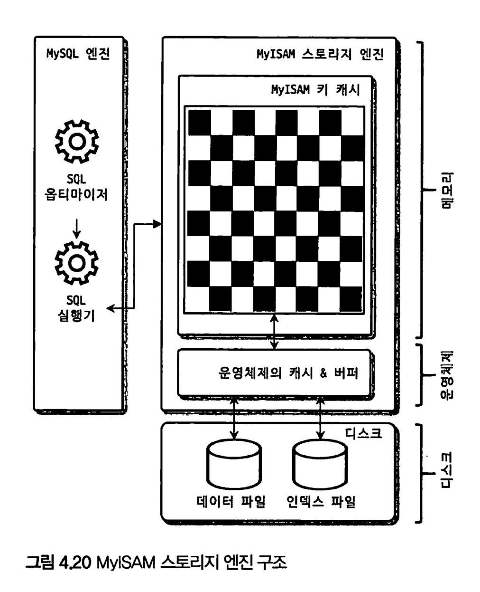

## 키 캐시

InnoDB의 버퍼 풀과 비슷한 역할을 하는것이 MyISAM의 키 캐시(또는 키 버퍼)다.

키 캐시는 인덱스 만을 대상으로 작동하며, 인덱스의 디스크 쓰기 작업에 대해서만 부분적으로 버퍼링 역할을 한다.

메뉴얼에서는 일반적으로 키 캐시의 히트율 (키 캐시 이용 쿼리)를 99% 이상으로 유지하라고 권장한다.

히트율이 99% 미만이라면 키 캐시를 더 크게 설정하는것이 좋다. 

제한 값 이상의 키 캐시를 할당하고 싶다면 기본(Default) 키 캐시 이외에 별도의 명명된 키 캐시 공간을 설정해야 한다

기본 키 캐시 공간을 설정하는 파라미터는 key_buffer_size다

```
key_buffer_size = 4GB
kbuf_board.key_buffer_size = 2GB
kbuf_comment.key_buffer_size = 2GB
```

* 기본 키 캐시 4GB
* kbuf_board, kbuf_comment 키 캐시 2GB

기본 키 캐시 이외의 명명된 키 캐시 영역 (위 예에서는 kbuf_board.key_buffer_size, kbuf_comment.key_buffer_size )에서 어떤 인덱스를 캐시할지 MyISAM한테 알려주지 않으면 사용하지 않으므로 주의하자

```mysql
// board 테이블에 kbuf_board 키 캐시 사용 지정
mysql> CACHE INDEX db1.board, db2.board IN kbuf_board;
// board 테이블에 kbuf_comment 키 캐시 사용 지정
mysql> CACHE INDEX db1.comment, db2.comment IN kbuf_comment;
```

* 키 캐시에 대한 더 자세한 설명은 https://dev.mysql.com/doc/refman/8.0/en/multiple-key-caches.html

## 운영체제의 캐시 및 버퍼

MyISAM 테이블 데이터 (즉, row)에 대해서는 캐시/버퍼링 기능이 존재하지 않는다

때문에 데이터 읽기/쓰기 작업은 항상 OS 디스크 읽기/쓰기 작업으로 요청이 된다.

대부분의 OS에는 자체 캐시/버퍼링 기능이 존재하여 MyISAM 성능은 OS 기능에 의존성이 높다

OS 캐시는 애플리케이션들이 사용하고 남은 메모리 공간을 캐시로 사용하므로 MyISAM을 사용할때는 항상 OS 메모리 공간을 예의주시해야한다

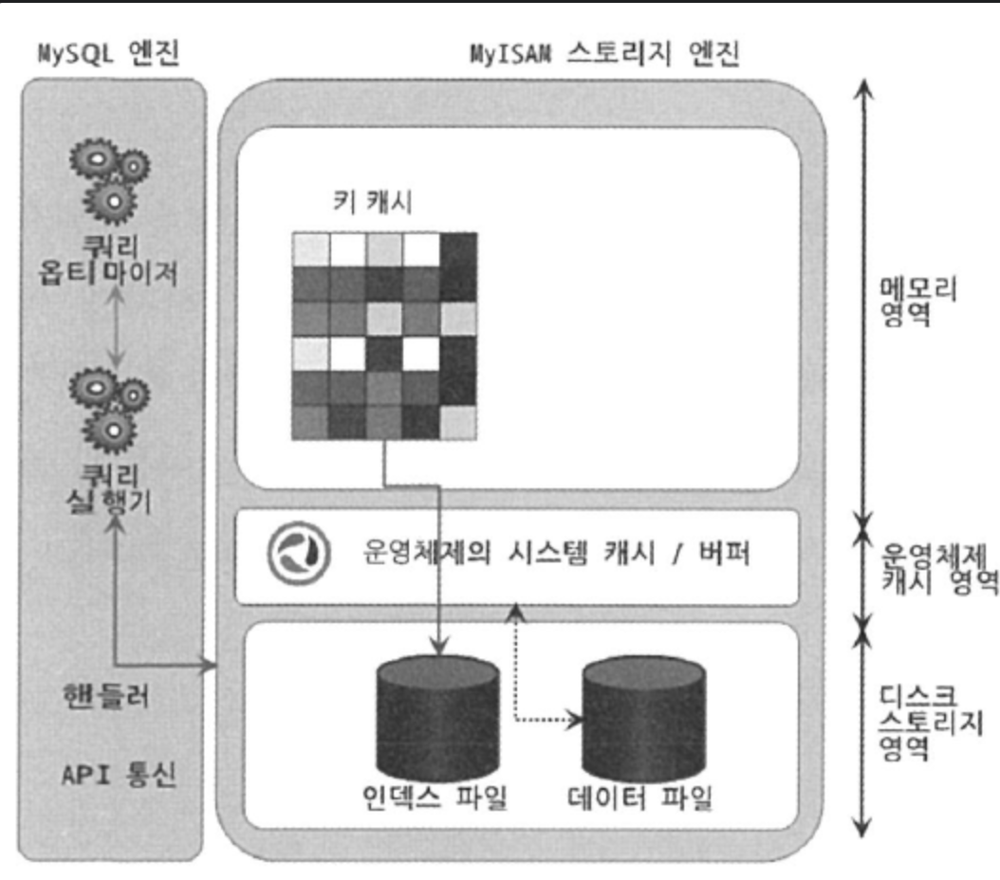

일반적으로 키 캐시는 최대 물리 메모리의 40% 이상을 넘지 않게 설정하는것이 좋다.


## 데이터 파일과 프라이머리 키(인덱스) 구조

InnoDB는 프라이머리키에 의한 클러스터링 되어 저장되는 반면

MyISAM은 프라이머리 키에 대한 클러스터링 없이 데이터 파일이 힙 공간처럼 활용되어 INSERT 되는 순서대로 데이터 파일에 저장된다.

MyISAM 테이블에 저장되는 **레코드는** 모두 ROWID라는 물리적인 주솟값을 가지는데, 프라이머리키와 세컨더리 인덱스는 모두 데이터 파일에 저장된 레코드의 ROWID 값을 포인터로 가진다.

MyISAM의 테이블에서 ROWID는 가변길이 / 고정길이 방식으로 저장 가능하다 

 

# MySQL 로그 파일

MySQL 서버에 문제가 생겼을 때는 다음에 설명하는 로그 파일들을 자세히 확인하는 습관을 들일 필요가 있다.


## 에러 로그 파일

MySQL이 실행되는 도중 발생하는 에러나 경고 메시지가 출력되는 로그 파일이다

* 위치 : MySQL 설정 파일(my.cnf) 에서 log_error라는 이름의 파라미터로 정의된 경로에 생성된다.

설정 파일에 별도로 정의되지 않은 경우에는 데이터 디렉터리(datadir 파라미터에 설정된 디렉터리 )에 .err 라는 확장자로 붙은 파일로 생성된다. 

```mysql
--// 다음의 명령어로 확인 가능

SHOW VARIABLES LIKE 'datadir';

--// my.cnf 파일을 열어 다음과 같은 항목을 확인해봐도 된다
datadir=/var/lib/mysql
```


### MySQL 시작하는 과정과 관련된 정보성 및 에러 메시지

mysql 서버가 정상적으로 기동하면 'mysqld: ready for connections' 메시지를 확인할 수 있다 

변수명을 인식하지 못하거나 파라미터 값 설정을 못한 경우 에러메시지를 출력하고 시작하지 못했다는 메시지를 보여준다. 

ex)

```
ERROR 1193 (HY000): Unknown system variable 'invalid_variable'
```


### 마지막으로 종료할 때 비정상적으로 종료된 경우 나타나는 InnoDB 트랜잭션 복구 메시지

4.2.6절 자동화된 복구 참조하거나 MySQL 메뉴얼 참조 

* https://dev.mysql.com/doc/refman/8.0/en/innodb-recovery.html

### 쿼리 처리 도중에 발생하는 문제에 대한 에러 메시지

쿼리 실행 도중 발생한 에러나 복제에서 문제가 될만한 쿼리에 대한 경고 메시지는 에러 로그에 기록된다.

ex)

````
/var/log/mysql/error.log
````

* 또는 위에서 설정된 에러로그 위치

### 비정상적으로 종료된 커넥션 메시지 (Aborted Connection)

클라이언트 애플리케이션에서 정상적으로 접속 종료를 하지 못하고 프로그램이 종료된 경우 에러 로그 파일에 이런 내용이 기록된다.

```
2023-07-01T10:30:15.123456Z 145 [Note] Aborted connection 1234567 to db_name_user: 'user_name'@'host_name' (Got an error reading communication packets)
```


max_connect_errors 시스템 변숫값이 너무 낮게 설정된 경우 클라이언트 프로그램이 "Host 'host_name' is blocked" 라는 에러가 발생할 수도 있다.

이경우 max_connect_errors 시스템 변수 값을 증가시키면 된다


### InnoDB 모니터링 또는 상태 조회 명령(SHOW ENGINE INNODB SATUS) 

테이블 모니터링이나 락 모니터링, 또는 InnoDB 엔진 상태를 조회하는 명령이다. 

```mysql
mysql> SHOW ENGINE INNODB SATUS
```

InnoDB 모니터링을 활성화 상태로 만들어 두고, 그대로 유지하는 경우에는 에러 로그 파일이 매우 커지므로,

모니터링을 사용한 이후에는 다시 비활성화 해서 에러 로그 파일이 커지지 않게 만들어야 한다. 

어떻게 비활성화?

```mysql
mysql> SET GLOBAL innodb_status_output=OFF
```

또는 my.cnf 파일을 열어서 

```
[mysqld]
innodb_status_output=OFF
```

구성 파일을 저장하고 닫는다.


모니터링을 다시 활성화 해야 하는 경우 이와 반대로 `innodb_status_output` 값을 `ON`으로 설정하고 MySQL 서버를 재시작하면 된다.

### MySQL의 종료 메시지

아무도 모르게 종료돼거나 재시작 되는 경우, 에러 로그파일에서 확인할 수 있다.


* 누군가가 종료 시킨 경우 : Received SHUTDOWN from user ...

* 아무런 종료 메시지가 없거나 스택 트레이스 출력인 경우 세그먼테이션 폴트로 비정상 종료이다. 
  * 일반적으로 세그먼테이션 폴트는 메모리 관련 오류로 인해 프로그램이 예기치 않게 종료되는 상황

https://dev.mysql.com/doc/refman/8.0/en/error-log.html


### 제너럴 쿼리 로그 파일(제너럴 로그 파일, General log)

MySQL 서버에서 실행되는 쿼리들의 전체 목록을 뽑을 필요가 있따면, 쿼리 로그를 활성화 해서 쿼리를 로그 파일로 기록하면 된다.

* my.cnf 파일 접속 

```mysql
[mysql]
log_output=FILE
general_log=1
general_log_file=/path/to/query.log
```

* `/path/to/query.log`는 실제 로그 파일이 생성될 경로를 나타내는데, 사용자가 원하는 경로로 변경해야 한다. 

* 쿼리 로그를 사용한 후에는 필요한 정보를 얻었다면 로그 기록을 중지하고 로그 파일을 정리하는 것이 좋다. 
*  MySQL 설정 파일에서 `general_log` 값을 `0`으로 변경하고, MySQL 서버를 재시작하면 쿼리 로그가 비활성화된다.

슬로우 쿼리랑은 조금 다르게 제너럴 쿼리 로그는 MySQL이 쿼리 요청을 받으면 바로 기록한다. 


쿼리 로그파일의 경로는 general_log_file이라는 이름의 파라미터에 설정돼 있다.

```mysql
mysql> SHOW GLOBAL VARIABLES LIKE 'general_log_file';
```

쿼리 로그를 파일로 저장할지 테이블로 저장할지는 log_output 파라미터로 결정된다.

* https://dev.mysql.com/doc/refman/8.0/en/log-destinations.html


### 슬로우 쿼리 로그

쿼리 튜닝은 서비스가 적용되기 전 전체적 튜닝하는 경우와 서비스 운영중 튜닝으로 나눌 수 있다.

* 서비스가 적용되기 전에는 모두 튜닝하면 된다

서비스 운영중인 경우에는 슬로우 쿼리 로그 파일을 이용할 수 있다.


슬로우 쿼리 로그 파일에는 long_query_time 시스템 변수에 설정한 시간(기본적으로는 초단위, 소수점 값으로 설정하면 마이크로 초 단위로 설정 가능함) 이상의 시간이 소요된 쿼리가 모두 기록된다.

* my.cnf

```sh
[mysqld]
long_query_time=0.5 // 0.5초로 설정
```

* 설정파일을 저장하고 닫은 후 MySQL 서버를 재시작 한다

* 0을 설정하면 모든 쿼리가 슬로우 쿼리가 된다


슬로우 쿼리 로그 파일에 기록되는 쿼리는 정상적으로 실행이 완료되었지만 걸린 시간이 long_query_time에 정의된 시간보다 많이 걸린 쿼리이다.


log_output 옵션을 이용해 슬로우 쿼리 로그를 파일로 기록할지 테이블로 기록할지 선택할 수 있다.

* Table 옵션시 : general_log, slow_log 테이블

```
[mysqld]
log_output=TABLE
long_query_time=0.5
```

**슬로우 쿼리 로그 분석**

```
# Time: 2020-07-19715:44:22.178484+09:00
# User@Host: root[root] @ localhost [] Id: 14
# Query_time: 1.180245 Lock_time: 0.002658 Rows_sent: 1 Rows_examined: 2844047
use employees;
SET timestamp=1595141060;
select emp_no, max(salary) from salaries;
```

* Time 항목은 쿼리가 종료된 시점. 시작 시간을 알려면 Time - Query_time
* User@Host는 쿼리를 실행한 사용자의 계정
* Query_time은 쿼리가 실행되는 데 걸린 전체 시간 
  * Lock_time은 테이블 잠금에 대한 대기시간만 표시함
* Rows_examined는 이 쿼리가 처리되기 위해 몇 건의 레코드에 접근했는지를 의미
* Rows_sent는 클라이언트로 보냈는지를 의미 
* Rows_examined의 레코드 건수는 높지만, Rows_sent에 표시된 레코드 건수가 적다면 더 작은 레코드로 접근하도록 튜닝해볼 가치가 있다.
  * 집합 함수가 아닌 경우! - 집합 함수는 다 접근해야 한다

Lock_time이 MyISAm이나 MEMORY 스토리지 엔진에서는 1초이상 소요될 가능성이 있다.

InnoDB에서 1초이상 걸릴 경우에 MySQL 엔진 레벨에서 설정한 테이블 잠금 때문일 가능성이 높으므로 튜닝이나 분석에 도움이 되지 않는다.


**Percona Toolkit**

슬로우 쿼리 또는 제너럴 로그 파일의 많아, 직접 쿼리를 검토하기 어려운 경우 Percona Toolkit의 pt-query-digest 스크립트를 이용하면 쉽게 살펴볼 수 있다.

* https://docs.percona.com/percona-toolkit/index.html

```shell
##General Log 파일 분석
linux> pt-query-digest --type='genlog' general.log > parsed_general.log

##SlOW Log 파일 분석
linux> pt-query-digest --type='slowlog' mysql-slow.log > parsed_mysql-slog.log
```

로그파일 분석이 완료되면 3개의 그룹으로 나뉘어 저장된다

#### 슬로우 쿼리 통계

분석 결과의 최상단에 표시되며, 모든 쿼리를 대상으로 슬로우 쿼리 로그의 실행 시간(Exec time), 그리  잠금 대기 시간(Lock time) 등에 대해 평균 및 최소/최대 값을 표시한다.

```
# 119s users time, 450ms system time, 94.90M rss, 308.31M vsz
# Current date: Sun Jul 19 07:10:33 2020
# Hostname: shop-db-001
# Files: mysql-slow.log
# Overall:
- Total queries: 434.11k
- Unique queries: 916
- Average queries per second: 0.03
- Concurrency: 0.30

# Time Range: 2020-02-23T19:35:20 to 2020-07-19 07:03:48

# Attribute       | Total      | Min     | Max      | Average   | 95%       | Stddev   | Median
----------------------------------------------------------------------------------------------
# Exec time       | 3,845,025s | 1s      | 29,119s  | 9s        | 45s       | 695      | 25
# Lock time       | 805        | 0       | 51ms     | 184us     | 384us     | 269us    | 125us
# Rows sent       | 15.23G     | 0       | 23.09M   | 36.79k    | 97.04k    | 381.15k  | 0.99
# Rows examined   | 544.53G    | 13      | 388.61k  | 497.42    | 964.41    | 5.40M    | 0.99
# Query size      | 205.97M    | 0       | 267.39M  | 1.28M     | 9.30M     | 1.53k    | 223.14
```


#### 실행 빈도 및 누적 실행 시간순 랭킹

각 쿼리별로 응답 시간과 실행 횟수를 보여주는데, pt-query-digest 명령 실행 시 -order-by 옵션으로 정렬 순서를 변경할 수 있다. 

Query ID는 실행된 쿼리 문장을 정규화(쿼리에 사용된 리터럴을 제거)해 서 만들어진 해시 값을 의미하는데, 일반적으로 같은 모양의 쿼리라면 동일한 query ID를 가지게 된다.

```
# Profile
# Rank   Query ID               Response time     Calls   R/Call       V/M
-----------------------------------------------------------------------
1       0x47525E2A043E8AF899FD   2311636.7007     60.1%   35353    65.3873 
2       0xB77F2FFEBF2338FD3B6C   173684.6297      4.5%    73740    2.3554
3       0x00EFC721F6C35CC935AD   152724.7593      4.0%    2153     70.9358
4       0xE97971F13DB2D3E78175   117188.5615      3.0%    36451    3.2150

# Response time     Calls    R/Call    Query
---------------------------------------------
2311636.7007       60.1%    35353     SELECT orders order_details
173684.6297        4.5%     73740     SELECT users_details
152724.7593        4.0%     2153      SELECT orders order_details
117188.5615        3.0%     36451     SELECT users
```

### 쿼리별 실행 횟수 및 누적 실행 시간 상세 정보

query I0별 쿼리를 쿼리 랭킹에 표시된 순서대로 자세한 내용을 보여준다. 

랭킹별 쿼리에서는 대상 테 이블에 대해 어떤 쿼리인지만을 표시하는데, 실제 상세한 쿼리 내용은 개별 쿼리의 정보를 확인해보면 된다. 

여기서는 쿼리가 얼마나 실행됐는지, 쿼리의 응답 시간에 대한 히스토그램 같은 상세한 내용을 보여준다.


