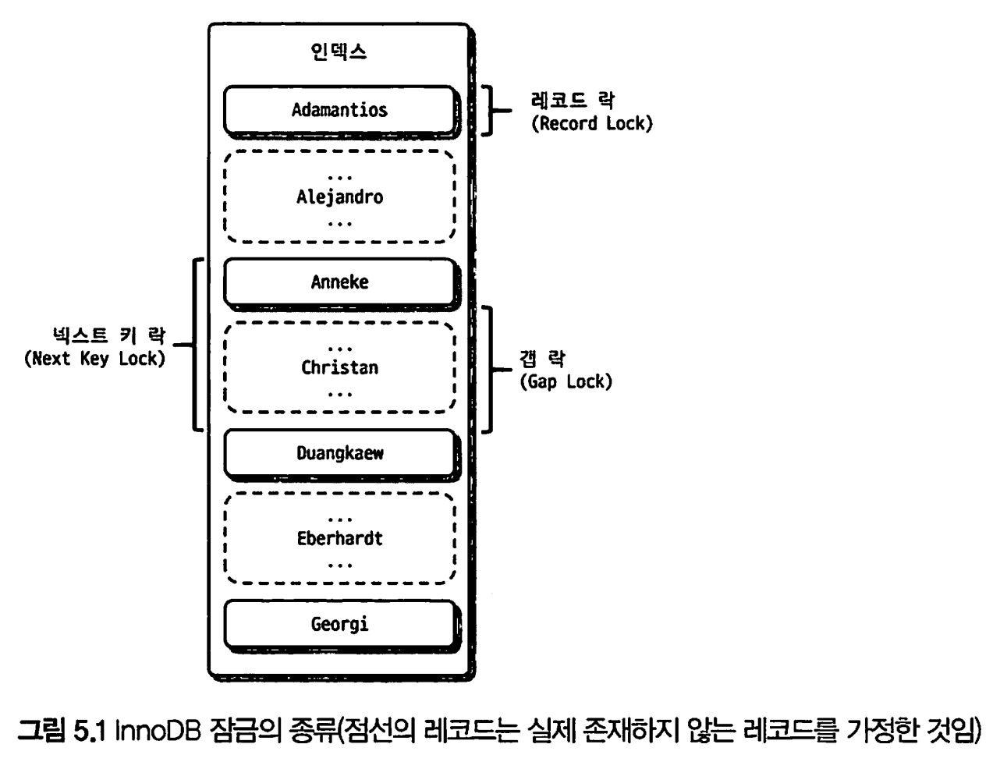
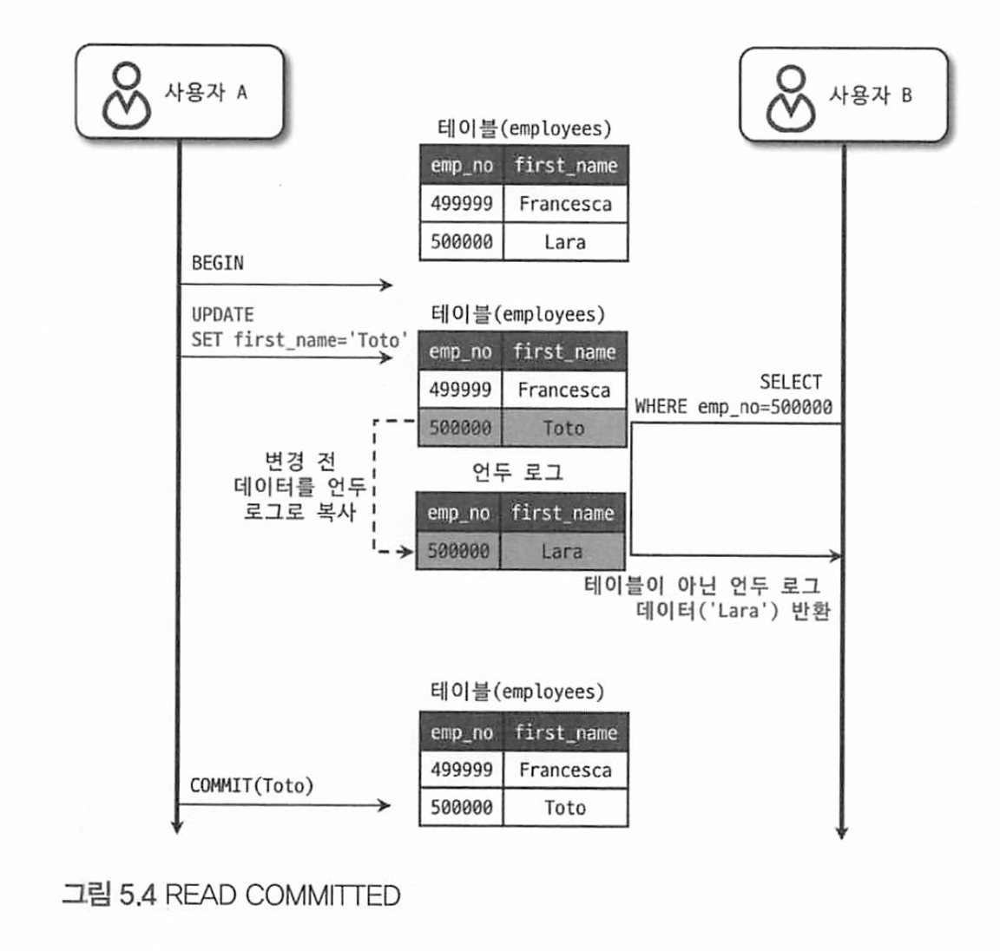

# 5 트랜잭션과 잠금

5.1 트랜잭션

5.2 MySQL 엔진의 잠금

5.3 InnoDB 스토리지 엔진 잠금

5.4 MySQL의 격리 수준


트랜잭션 : 작업의 완전성을 보장해주는것

* 논리적인 작업 Set을 모두 완벽하게 처리하거나, 처리하지 못할경우 원 상태로 복구해서 작업의 일부만 적용되는 현상(Partial update)이 발생하지 않게 만들어주는 기능


잠금(Lock)과 트랜잭션은 다르다.

**잠금** :  동시성을 제어하기 위한 기능

* 여러 사용자가 동시에 데이터를 수정하려고 할 때, 잠금은 다른 사용자가 해당 데이터를 읽거나 수정하지 못하도록 제한하는 역할

**트랜잭션** :  데이터의 정합성을 보장하기 위한 기능

* 작업의 단위로 원자성, 일관성, 격리성, 지속성을 보장하는 데 사용

**격리수준** : 하나의 트랜잭션 내에서 또는 여러 트랜잭션 간의 작업 내용을 어떻게 공유하고 차단할 것인지를 결정하는 레벨을 의미한다. 


# 5.1 트랜잭션

InnoDB는 트랜잭션을 지원하고 MyISAM은 트랜잭션을 지원하지않는다. 

## 5.1.1 MySQL에서의 트랜잭션

트랜잭션은 하나의 논리적인 작업 셋에 하나의 쿼리가 있든, 두개 이상의 쿼리가 있든 관계 없이 논리적인 작업 셋 자체가 100%되거나(Commit), 아무것도 적용되지 않아야 (Roolback)) 함을 보장해주는것이다.


다음 쿼리 예제를 InnoDB 테이블과 MyISAM 테이블에서 각각 실행해보자.

```mysql
#-- MyISAM
mysql> CREATE TABLE tab_myisam(fdpk INT NOT NULL, PRIMARY KEY(fdpk)) ENGINE=MyISAM;
mysql> INSERT INTO tab_myisam(fdpk) VALUES (3);

#-- InnoDB
mysql> CREATE TABLE tab_innodb(fdpk INT NOT NULL, PRIMARY KEY(fdpk)) ENGINE=INNODB:
mysql> INSERT INTO tab_innodb(fdpk) VALUES (3);
```

다음 쿼리를 각각 실행해보자

```mysql
-- // AUTO-COMMIT 활성화
mysql> SET autocommit=ON;

-- MyISAM Insert
mysql> INSERT INTO tab_myisam (fdpk) VALUES (1), (2), (3); 

-- InnoDB Insert
mysql> INSERT INTO tab_innodb (fdpk) VALUES (1), (2), (3);
```

결과

```
mysql> INSERT INTO tab_myisam (fdpk) VALUES (1), (2), (3);
ERROR 1062 (23000): Duplicate entry '3' for key 'tab_myisam.PRIMARY' //

mysql> INSERT INTO tab_innodb (fdpk) VALUES (1), (2), (3);
ERROR 1062 (23000): Duplicate entry '3' for key 'tab_innodb.PRIMARY' //
```

테이블 내용 조회

```
mysql> select * from tab_myisam;
+------+
| fdpk |
+------+
|    1 |
|    2 |
|    3 |
+------+
3 rows in set (0.00 sec)

mysql> select * from tab_innodb;
+------+
| fdpk |
+------+
|    3 |
+------+
1 row in set (0.00 sec)
```


두 테이블 INSERT 문장 모두 프라이머리 키 중복 오류로 쿼리가 실패했다.

```
ERROR 1062 (23000): Duplicate entry '3' for key 'tab_myisam.PRIMARY' //
ERROR 1062 (23000): Duplicate entry '3' for key 'tab_innodb.PRIMARY' //
```

그런데, MyISAM 테이블에는 오류가 발생했음에도 1, 2는 INSERT 되어있다.

AutoCommit이 true이기 때문에 InnoDB는 롤백이 하여 복구했지만, MyISAM은 Insert된 1,2를 그대로 두고 롤백하지 않고 실행을 종료해버린다.

MyISAM 테이블에서 발생하는 이러한 현상을 부분 업데이트(Partial Update)라고 표현한다.

 

## 5.1.2 주의사항

트랜잭션의 범위를 최소화 하는것이 좋다.

아래 특정 로직의 처리 절차를 보고 트랜잭션 처리에 좋지 않은 영향을미치는 부분을 나눠서 보자

```
1) 처리 시작
=> 데이터베이스 커넥션 생성
=> 트랜잭션 시작

2) 사용자의 로그인 여부 확인
3) 사용자의 글쓰기 내용의 오류 여부 확인
4) 첨부로 업로드된 파일 확인 및 저장
5) 사용자의 입력 내용을 DBMS에 저장
6) 첨부 파일 정보를 DBMS에 저장
7) 저장된 내용 또는 기타 정보를 DBMS에서 조회
8) 게시물 등록에 대한 알림 메일 발송
9) 알림 메일 발송 이력을 DBMS에 저장

<= 트랜잭션 종료(COMMIT)
<= 데이터베이스 커넥션 반납

10) 처리 완료
```

* 1번과 2번 사이 처럼 처리 시작하자마자 커넥션을 열고 트랜잭션을 시작할 필요가 없다. 트랜잭션이 길어지기만 할뿐이다. 별도의 트랜잭션으로 처리해도 무방하다 
* 메일 전송이나 FTP 파일 전송 작업 또는 네트워크를 통해 통신하는 등과 같은 작업은 트랜잭션 내에서 제거하는 것이 좋다. 메일 서버 등과 통신할 수 없는 상황이 발생한다면, 웹 서버 뿐만 아니고 DBMS 서버까지 위험해진다
* 사용자가 입력한 정보를 저장하는 5번, 6 번 작업은 반드시 필요하지만, 7번 작업은 단순 확인 및 조회이므로 트랜잭션에 포함할 필요가 없다.
* 또한 9번은 조금 성격이 다르기 때문에 트랜잭션에 묶을 필요가 없다. 별도의 트랜잭션으로 분리해도 무방하다.

문제가 될만한 부분을 보완해서 처리 절차를 다시 설계해보자 

```
1) 처리 시작
2) 사용자의 로그인 여부 확인
3) 사용자의 글쓰기 내용의 오류 발생 여부 확인
4) 첨부로 업로드된 파일 확인 및 저장

=> 데이터베이스 커넥션 생성(또는 커넥션 풀에서 가져오기)
=) 트랜잭션 시작
5) 사용자의 입력 내용을 DBMIS에 저장
6) 첨부 파일 정보를 DBMS에 저장
<= 트랜잭션 종료(COMMIT)

7) 저장된 내용 또는 기타 정보를 DBMS에서 조회
8) 게시물 등록에 대한 알림 메일 발송

=> 트랜잭션 시작
9) 알림 메일 박송 이력을 DBuS에 저장
〈= 트랜잭션 종료(COMMIT)
<= 데이터베이스 커넥션 종료(또는 커넥션 풀에 반납)
10) 처리 완료
```


# 5.2 MySQL 엔진의 잠금

MySQL에서 사용되는 잠근은 크게 `스토리지 엔진 레벨`과 `MySQL 엔진 레벨`로 나눌 수 있다.

MySQL 엔진 레벨의 잠금은 모든 스토리지 엔진에 영향을 미치지만(MyISAM, InnoDB),

스토리지 엔진의 레벨의 잠금은 스토리지 엔진간에 상호 영향을 미치지 않는다.

* MySQL 엔진에서는 테이블 데이터 동기화를 위한 테이블 락
* 테이블의 구조를 잠그는 메타데이터 락
* 사용자의 필요에 맞게 사용하여 잠금하는 네임드 락

을 제공한다.


## 5.2.1 글로벌 락

Global  lock은 FLUSH TABLES WITH READ LOCK" 명령으로만 획득할 수 있으며, MySQL에서 제공하는 잠금 가운데 가장 범위가 크다. MySQL 서버 전체에 영향을 미친다 

```mysql
-- 글로벌락 사용 
mysql> FLUSH TABLES WITH READ LOCK;

-- 글로벌락 해제
mysql> UNLOCK TABLES;
```

한 세션에서 글로벌 락을 획득하면 다른 세션에서 SELECT를 제외한 대부분의 DDL문장이나 DML 문장이 실행되지 못하고 글로벌 락이 해제될때까지 대기하게 된다. 

주로 MyISAM이나 MEMORY 스토리지 엔진을 사용하는 테이블에 대해 mysqldump로 일관된 백업을 받을때 사용하거나 스키마 변경과 같은 작업에 사용된다. 

* FLUSH TABLES WITH READ LOCK 명령이 실행되기 전에 테이블이나 레코드에 쓰기 잠금을 거는 SQL이 실행됐다면, 이 명령은 해당 테이블이 읽기 잠금을 걸기 위해 먼저 실행된 SQL이나 트랜잭션을 기다려야 한다. 모든 테이블을 FLUSH 해야하기 때문이다.
* mysqldump 같은 백업 프로그램은 우리가 알지 못하는 사이에 이 명령을 내부적으로 실행하고 백업할때도 있다.

InnoDB 엔진은 트랜잭션을 지원하기 때문에 일관된 데이터 상태를 위해 모든 데이터 변경 작업을 멈출 필요는 없다.

또한 InnoDB가 기본 엔진으로 채택되면서 조금더 가벼운 글로벌 락이 생겼는데, MySQL 8.0부터는 Xtrabackup이나 Enterprise Backupr과 같은 백업 툴들의 안정적인 실행을 위해 `백업 락`이 도입됐다

```mysql
mysql> LOCK INSTANCE FOR BACKUP;

-- // 백업 실행 후

mysql> UNLOCK INSTANCE;
```

특정 세션에서 백업 락을 획득하면, 모든 세션에서 다음과 같이 테이블의 스키마나 사용자 인증 관련 정보를 변경할 수 없다.

* DB 및 테이블 등 모든 객체 생성 및 변경, 삭제 불가
* REPAIR TABLE과 OPTIMIZE TABLE 명령
* 사용자 관리 및 비밀번호 변경

백업 락은 일반적인 테이블 데이터 변경은 허용이다.

일반적으로 MySQL 서버의 구성은 Source 서버(마스터 서버)와 Replica 서버로 구성되는데, 백업은 주로 레플리카 서버에서 실행된다.

때문에 마스터 서버의 데이터 변경은 허용된다.

* XtraBackup이나 Enterprise Backup 툴이 실행되는 도중 스키마 변경이 실행되면 백업은 실패하게 되므로 주의하자


## 5.2.2 테이블 락

테이블 락은 개별 테이블 단위로 설정되는 잠금이며, 명시적 또는 묵시적으로 특정 테이블의 락을 획득할 수 있다.

```mysql
-- // 명시적 테이블 락 획득

mysql> LOCK TABLES table_name [READ | WRITE] // READ 또는 WRITE

-- // 테이블 락 반납
mysql> UNLOCK TABLE table_name
```

명시적으로 테이블을 잠그는 작업은 글로벌 락과 동일하게 성능 저하나 데드락, 지연 같은 상당한 영향을 미치기 때문에 주의하고 거의 사용하지 말자.


묵시적인 테이블 락은 MyISAM이나 MEMORY 테이블에 데이터를 변경하는 쿼리를 실행하면 발생한다.

MySQL 서버가 변경되는 테이블에 잠금을 설정하고 데이터를 변경한 후, 즉시 잠금을 해제하는 형태로 사용된다.

* 쿼리가 실행되는 동안 자동으로 획득됐다가 쿼리가 완료된 후 자동 해제된다

그러나 `InnoDB`의 경우 레코드 레벨의 레코드 락을 지원하기 때문에 **데이터 변경 쿼리로 묵시적 테이블 락이 설정되지는 않는다**

* 더 정확히는 InnoDB 테이블도 테이블 락이 설정되지만, DML 쿼리에서는 무시하고 DDL(스키마 변경) 의 경우에만 영향을 미친다


## 5.2.3 네임드 락

네임드 락은 GET_LOCK() 함수를 이용해 임의의 문자열에 대해 잠금을 설정할 수 있다.

이 잠금의 특징은 대상이 테이블이나 레코드 같은 객체가 아니다.

단순히 사용자가 지정한 문자열(String)에 대해 획득하고 반납(해제) 하는 잠금이다. 


예를들어, 데이터베이스 서버 1대의 5대의 웹 서버가 접속해서 서비스하는 상황에 5대의 웹 서버가 어떤 정보를 동기화 해야 하는 것처럼

여러 클라이언트가 상호 동기화를 처리해야할 때 네임드 락을 이용하면 쉽게 해결할 수 있다.

```mysql
-// "mylock"이라는 문자열에 대해 잠금을 획득한다.
-// 이미 잠금을 사용 중이면 2초 동안만 대기한다. (2초 이후 자동 잠금 해제됨)
mysq1> SELECT GET_LOCK('mylock', 2);

--// "mylock"이라는 문자열에 대해 잠금이 설정돼 있는지 확인한다.
mysq1> SELECT IS_FREE_LOCK('mylock');

--// "mylock"이라는 문자열에 대해 획득했던 잠금을 반납(해제) 한다.
mysql> SELECT RELEASE_LOCK('mylock');

--// 3개 함수 모두 정상적으로 락을 획득하거나 해제한 경우에는 1을,
--// 아니면 NULL이나 0을 반환한다. 
```

네임드 락은 많은 레코드에 대해 복잡한 요건으로 레코드를 변경하는 트랜잭션에 유용하다

* 배치 프로그램 등 많은 데이터를 변경하는 쿼리는 자주 데드락의 원인이 된다.

이런 경우 동일 데이터를 변경하거나 참조하는 프로그램끼리 분류해서 네임드 락을 걸고 쿼리를 실행하면 해결할 수 있다. 

  


MySQL 8.0 버전 부터는 네임드 락을 중첩해서 사용할 수 있으며, 현재 세션에서 획득한 네임드 락을 한 번에 모두 해제할 수도 있다.

```mysql
mysq1> SELECT GET_LOCK('mylock_1',10);
--// mylock_1에 대한 작업 실행

mysql> SELECT GET_LOCK('mylock_2',10);

--// mylock_1과 mylock_2에 대한 작업 실행

mysql> SELECT RELEASE LOCK('mylock_2');
mysgl> SELECT RELEASE LOCK('mylock_1');

--// mylock_1과 mylock_2를 동시에 모두 해제하고자 한다면 RELEASE_ALL_LOCKS() 함수 사용
mysg]> SELECT RELEASE_ALL_LOCKS();
```


## 5.2.4 메타데이터 락

메타데이터락은 테이블이나 뷰 등의 객체에 대해 이름이나 구조를 변경하는 경우 획득하는 잠금이다.

명시적으로 획득할 수 있는 잠금이 아니고 RENAME ABLE tab_a TO tab_b 과 같이 이름을 변경하는 경우 자동으로 획득하는 잠금이다

```mysql
mysql> RENAME ABLE tab_a TO tab_b
```

* RENAME TABLE의 경우 원본 이름과 변경될 이름 모두 한꺼번에 잠금을 설정한다.

실시간으로 테이블을 바꿔야 하는 배치 프로그램 예제

```mysql
--//배치 프로그램에서 별도의 임시 테이블(rank_new)에 서비스용 랭킹 데이터를 생성

--// 랭킹 배치가 완료되면 현재 서비스용 랭킹 테이블(rank)을 rank backup으로 백업하고
--// 새로 만들어진 랭킹 테이블(rank_new)을 서비스용으로 대체하고자 하는 경우

mysql> RENAME TABLE rank TO rank_backup, rank_new TO rank;
```

* 위와 같이 하나의 RENAME TABLE 명령문에 두 개의 RENAME 작업을 한꺼번에 실행하면 실제 애플리케이션은 `"Table not found 'rank'"` 같은 상황을 발생시키지 않고 적용하는 것이 가능하다. 
* 하지만 2개로 나눠서 실행하면 아주 짧은 시간이지만 rank 테이블이 존재하지 않는 순간에 Table not found rank 오류를 발생시킨다

```mysql
mysq1> RENAME TABLE rank TO rank_backup; 
mysql> RENAME TABLE rank_new TO rank;
```

  

때로는 메타데이터 잠금과 InnoDB 트랜잭션을 동시에 사용해야 하는 경우도 있다.

예를들어 액세스 로깅 테이블이 있다면, 이 테이블의 구조를 변경해야 하는 요건이 생겼다.

온라인 DDL(DB 시스템을 중단하지 않고 데이터구조를 변경하는것)을 이용해서 변경할 수도 있지만, 다음과 같은 것을 고려해야 한다.

* 시간이 너무 올래거는 경우라면 언두 로그의 증가와 누적된 Online DDL 버퍼의 크기 를 고려해야 한다.
  * Undo 로그는  트랜잭션의 일관성을 유지하고, 원래 상태로 롤백하기 위해 사용되는데,  DDL 작업이 오랜 시간동안 진행되면 이 Undo 로그가 계속 쌓일 수 있으며, 이는 디스크 공간에 부담을 주게 된다
  * 또한, Online DDL 작업은 내부적으로 버퍼를 사용하여 작업을 수행하는데, 이 버퍼는 변경 작업을 위해 일시적으로 레코드를 저장하는 공간이다. 
* MySQL 서버의 **DDL은 단일 스레드로 작동**하기 때문에 상당히 많은 시간이 소모된다. 

이럴때에는, 새 구조의 테이블을 생성하고 최근(1시간 직전 또는 하루전)의 데이터까지는 프라이머리 키 값인 id를 범위별로 나눠 여러개의 쓰레드로 빠르게 복사하자.

```mysql
--// 테이블의 압축을 적용하기 위해 KEY_BLOCK_SIZE=4 옵션을 추가해 신규 테이블을 생성

mysql> CREATE TABLE access_log_new (
  id BIGINT NOT NULL AUTO INCREMENT
	client_ip INT UNSIGNED, access_dttm TIMESTAMP,
	...
	PRIMARY KEY(id)
) KEY BLOCK SIZE = 4;

--// 4개의 스레드를 이용해 id 범위별로 레코드를 신규 테이블로 복사
mysql_thread1> INSERT INTO access log_new SELECT * FROM access log WHERE id = 0 AND id < 10000; 
mysal_thread2> INSERT INTO access log_new SELECT * FROM access_log WHERE id = 10000 AND id < 20000;
mysql_thread3> INSERT INTO access_log_new SELECT * FROM access_log WHERE id = 20000 AND id < 30000;

mysql_thread4> INSERT INTO access_log_new SELECT * FROM access_log WHERE id >= 30000 AND id < 40000;
```

그리고 나머지 데이터는 다음과 같이 트랜잭션과 테이블 잠금, RENAME TABLE 명령으로 응용 프로그램의 중단 없이 실행할 수 있다.

이때 '남은 데이터를 복사'하는 시간 동안은 테이블의 잠금으로 인해 INSERT를 할수 없게 되므로, 가능한 미리 최근 데이터까지 복사해둬야 잠금 시간을 최소화해서 서비스에 미치는 영향을 줄일 수 있다.

```mysql
--// 트랜잭션을 autocommit으로 실행(BEGIN이나 START TRANSACTION으로 실행하면 안 됨)
mysql> SET autocommit=0;

--// 작업 대상 테이블 2개에 대해 테이블 쓰기 락을 획득
mysql> LOCK TABLES access_log WRITE, access_log_new WRITE;

--// 남은 데이터를 복사
mysql> SELECT MAX(id) as @MAX_ID FROM access_log_new;
mysql> INSERT INTO access_log_new SELECT * FROM access_log WHERE pk›@MAX_ID;
mysq1> COMMIT;

--// 새로운 테이블로 데이터 복사가 완료되면 RENAME 명령으로 새로운 테이블을 서비스로 투입
mysql> RENAME TABLE access_log TO access_log_old, access_log_new TO access_log;
mysql> UNLOCK TABLES;

--// 북필요한 테이블 삭제
mysql> DROP TALBE access_log_old;
```


# 5.3 InnoDB 스토리지 엔진 잠금

InnoDB는 MySQL엔진에서 제공하는 잠금과는 별개로 스토리지 엔진 내부에서 **레코드 기반의 잠금 방식**을 제공한다.

최근 버전부터 InnoDB의 트랜잭션과 잠금, 잠금 대기중인 트랜잭션의 목록을 조회할 수 있다.

*  InnoDB 트랜잭션 사용 및 잠금 정보

* InnoDB 잠금(Lock) 그리고 잠금대기(Lock-wait) 정보

*  InnoDB 트랜잭션 및 잠금 정보의 지속성 및 일관성

MySQL 서버의 information_schema db에 존재하는 INNODB_TRX, INNODB_LOCKS_ INNODB_LOCK_WAITS 라는 테이블을 조인해서 조회하면 어떤 트랜잭션이 잠금 대기하고 있고, 어떤 트랜잭션이 잠금을 가지고 있는지 확인할 수 있다.

* 장시간 잠금을 가지고 있는 클라이언트를 찾아 종료시킬 수도 있다. 

```mysql
SELECT 
    r.trx_id AS '요청중인 트랜잭션 ID', 
    r.trx_mysql_thread_id AS '요청중인 트랜잭션의 스레드 ID',
    r.trx_query AS '요청중인 트랜잭션의 쿼리',
    b.trx_id AS '차단중인 트랜잭션 ID', 
    b.trx_mysql_thread_id AS '차단중인 트랜잭션의 스레드 ID', 
    b.trx_query AS '차단중인 트랜잭션의 쿼리'
FROM 
    performance_schema.data_lock_waits AS w
    JOIN information_schema.innodb_trx AS b ON  
        b.trx_id = w.BLOCKING_ENGINE_TRANSACTION_ID  -- 차단 중인 트랜잭션 ID
    JOIN information_schema.innodb_trx AS r ON 
        r.trx_id = w.REQUESTING_ENGINE_TRANSACTION_ID; -- 요청 중인 트랜잭션 ID
```

* https://myinfrabox.tistory.com/188
* https://sarc.io/index.php/mariadb/1697-mysql-8-0-lock-session


### 장시간 잠금을 가지고 있는 클라이언트를 찾아 종료 시키는법


1. **문제의 원인을 찾는다:** 먼저, 잠금 문제가 발생하는 트랜잭션을  `INNODB_TRX`, `INNODB_LOCKS`, `INNODB_LOCK_WAITS` 테이블을 조인하여 어떤 트랜잭션이 잠금 대기 상태이고 어떤 트랜잭션이 잠금을 가지고 있는지 확인하여 찾는다

   ```mysql
   SELECT
       r.trx_id AS '대기중인 트랜잭션 ID', 
       r.trx_state AS '대기중인 트랜잭션 상태', 
       r.trx_started AS '대기중인 트랜잭션 시작 시간', 
       r.trx_requested_lock_id AS '대기중인 트랜잭션의 요청 잠금 ID', 
       r.trx_wait_started AS '대기중인 트랜잭션의 대기 시작 시간', 
       r.trx_mysql_thread_id AS '대기중인 트랜잭션의 스레드 ID', 
       r.trx_query AS '대기중인 트랜잭션의 쿼리', 
       b.trx_id AS '잠금을 가지고 있는 트랜잭션 ID', 
       b.trx_mysql_thread_id AS '잠금을 가지고 있는 트랜잭션의 스레드 ID', 
       b.trx_query AS '잠금을 가지고 있는 트랜잭션의 쿼리'
   FROM 
       information_schema.innodb_lock_waits AS w
       INNER JOIN information_schema.innodb_trx AS b ON 
           b.trx_id = w.blocking_trx_id  -- 잠금을 가지고 있는 트랜잭션 ID
       INNER JOIN information_schema.innodb_trx AS r ON 
           r.trx_id = w.requesting_trx_id;  -- 대기중인 트랜잭션 ID
   ```

2. **문제의 원인을 해결한다:** 위의 쿼리를 실행하여 현재 대기 중인 트랜잭션과 잠금을 가지고 있는 트랜잭션을 찾아 `KILL` 명령을 사용하여 죽인다. 차단 중인 트랜잭션의 thread id를 확인한 후, 다음과 같이 해당 thread를 종료할 수 있다

   ```mysql
   KILL '잠금을 가지고 있는 트랜잭션의 스레드 ID';
   ```

   이 명령을 실행하면 차단 중인 트랜잭션은 종료되고 대기 중인 트랜잭션이 실행될 수 있습니다.

단, 위의 작업은 데이터베이스의 정상적인 운영을 방해할 수 있으므로, 가능한 한 주의 깊게 수행해야한다다. 가능하다면, 우선 테스트 환경에서 문제의 원인을 찾아 해결하는 방법을 확인한 후, 실제 환경에 적용하는 것이 좋다.


## 5.3.1 InnoDB 스토리지 엔진의 잠금

InnoDB의 레코드 락은 잠금 정보가 상당히 작은 공간으로 관리되기 때문에 레코드 락이 페이지 락으로, 또는 테이블 락으로 레벨업 되는 경우 (락 에스컬레이션)은 없다.

InnoDB엔진에서는 레코드 락뿐 아니라 레코드와 레코드 사이의 간격을 잠그는 GAP 락이라는 것이 존재한다.



### 레코드락

레코드 자체만을 잠그는 락이다. 다른 DBMS의 레코드락 과 비교해서 InnoDB는 레코드 자체가 아닌, **인덱스의 레코드를 잠근다.**

* 인덱스가 하나도 없는 테이블이라도 내부적으로 자동 생성된 클러스터 인덱스를 이용해 잠근다.
* InnoDB가 여러 인덱스를 가질 수 있기 때문에 다른 트랜잭션에서 동일한 레코드를 참조하는 다른 인덱스를 통한 액세스를 차단하는데 유용하다. 

InnoDB에서 대부분 보조(세컨더리) 인덱스를 이용한 변경 작업은 Next Key Lock 또는 Gap Lock을 사용하지만,

프라이머리 키 또는 유니크 인덱스에 의한 변경 작업에서는 Gap에서는 잠그지 않고 레코드 자체에 대해서만 락을 건다

### 갭 락 (Gap Lock)

레코드와 레코드 사이의 간격에 새로운 레코드가 INSERT(생성) 되는것을 제어하는 락이다. Next Key Lock의 일부로 주로 사용된다.

* '두 레코드 사이의 간격에 락을 건다'는 말은, 아직 존재하지 않는 새로운 레코드가 해당 간격에 삽입되는 것을 막기 위해 해당 간격에 잠금을 설정하는 것을 의미

SELECT ... FOR UPDATE, SELECT ... LOCK IN SHARE MODE, UPDATE, DELETE 등의 SQL 문이 Gap Lock을 사용할 수 있다.


* innodb Gap Lock 억제 방법 - https://dev.mysql.com/doc/refman/8.0/en/innodb-locking.html
  *  명시적으로 비활성화할 수 있다. 트랜잭션 격리 수준을 [`READ COMMITTED`](https://dev.mysql.com/doc/refman/8.0/en/innodb-transaction-isolation-levels.html#isolevel_read-committed). 이 경우 갭 잠금은 검색 및 인덱스 스캔에 대해 비활성화되며 외래 키 제약 조건 확인 및 중복 키 확인에만 사용된다
  * REPEATABLE READ 수준(MySQL의 기본 트랜잭션 격리 수준)에서는 Gap Lock이 설정되지만, READ COMMITTED 수준에서는 대체로 Gap Lock이 설정되지 않는다.
  * innodb_locks_unsafe_for_binlog 설정을 1로 설정하여 Gap Lock을 회피할 수 있지만, 일관성 문제가 발생할 수 있다.
  * https://medium.com/daangn/mysql-gap-lock-%EB%8B%A4%EC%8B%9C%EB%B3%B4%EA%B8%B0-7f47ea3f68bc

### 넥스트 키 락 (Next Key Lock)

레코드 락과 갭 락을 합쳐놓은 형태의 잠금.

innodb_locks_unsafe_for_binlog 시스템 변수가 비활성화(0으로 설정)되면 변경을 위해 검색하는 레코드에서는 Next Key Lock 방식으로 잠금이 걸린다.


InnoDB의 갭 락이나 넥스트 키 락은 바이너리 로그에 기록되는 **쿼리**가 `레플리카 서버에서 실행될 때 소스 서버에서 만들어 낸 결과 와 동일한 결과를 만들어내도록 보장하는 것이 주목적`이다. 그런데 의외로 넥스트 키 락과 갭 락으로 인해 데드락이 발생하거나 다른 트랜잭션을 기다리게 만드는 일이 자주 발생한다. 가능하다면 바이너리 로그 포맷을 ROW 형태로 바꿔서 넥스트 키 락이나 갭 락을 줄이는 것이 좋다.

**MySQL에서 바이너리 로그 포맷을 ROW로 변경하는 방법**

1. MySQL 서버를 정지

   ```shell
   sudo service mysql stop
   ```

2. MySQL 설정 파일을 편집한다 일반적으로 `/etc/my.cnf` 또는 `/etc/mysql/my.cnf`에 위치

   ```shell
   sudo nano /etc/mysql/my.cnf
   ```

3. `[mysqld]` 섹션 아래에 다음의 설정을 추가

   ```mysql
   binlog_format = ROW
   ```

4. 설정 파일을 저장하고 종료

5. MySQL 서버를 다시 시작

   ```
   sudo service mysql start
   ```

> STATEMENT 포맷의 바이너리 로그가 가지는 단점을 많이 해결해줄 수 있기 때문에 
>
> MySQL 8.0에서는 ROW 포맷의 바이너리 로그가 기본 설정으로 변경됐다.


### 자동 증가 락 (auto increment lock)

AUTO_INCREMENT라는 컬럼 속성을 위해 저장되는 각 레코드는 중복되지 않고 저장된 순서대로 증가하도록 내부적으로 `AUTO_INCRMENT 락`이라고 하는 `테이블 수준의 잠금`을 사용한다.

INSERT나 REPLACE 문장에서 AUTO_INCREMENT 값을 가져오는 순간만 락이 걸렸다 해제된다

* 트랜잭션과 관계 없다.

AUTO_INCREMENT 락은 테이블에 단 하나만 존재하기 때문에, 여러 INSERT 쿼리가 동시에 실행되는 경우 나머지 쿼리는 락을 기다리게 된다. 

  


MySQL 5.1 부터는 innodb_autoinc_lock_mode라는 시스템 변수를 통해 자동 증가 락의 작동 방식을 변경할 수 있다.

```mysql
mysql> innodb autoinc lock mode = 0
```

MySQL 5.0과 동일한 잠금 방식으로 모든 INSERT 문장은 자동 증가 락을 사용한다.

```mysql
mysql> innodb_autoinc_lock_mode=1
```

여러 건의 레코드를 INSERT 하는 중 MySQL 서버가 INSERT 되는 레코드의 건수를 정확히 예측할 수 있을 때는 자동 증가 락(Auto increment lock)을 사용하지 않고. 훨씬 가볍고 빠른 래치(뮤텍스)를 이용해 처리한다. 

개선된 래치는 자동 증가 락과 달리 아주 짧은 시간 동안만 잠금을 걸고 필요한 자동 증가 값을 가져오면 즉시 잠금이 해제된다.

하지만 INSERT ... SELECT와 같이 MySQL 서버가 건수를 (쿼리를 실행하기 전에) 예 할 수 없을 때는 MySQL 5.0에서와같이 자동 증가 락을 사용한다. 

* 이때는 INSERT 문장이 완료되기 전까지는 자동 증가 락은 해제되지 않기 때문에 다른 커넥션에서는 INSERT를 실행하지 못하고 대기하게 된다.   

이렇게 대량 INSERT 가 수행될 여러 개의 자동 증가 값을 한 번에 할당받아서 INSERT 되는 레코드에 사용한다. 값이 누락되지 않고 연속되게 INSERT 된다. 할당 받은 자동 증가 값이 남아서 사용되지 못하면 폐기하므로 이후에 INSERT 되는 레코드의 자동 증가 값은 연속되지 않고 누락된 값이 발생할 수 있다.   

이 설정에서는 최소한 하나의 INSERT 문장으로 INSERT 되는 레코드는 연속된 자동 증가 값을 가지게 된다. 

그래서 이 설정 모드를 `연속 모드(Consecutive mode)`라고도 한다

```mysql
mysql> innodb_autoinc_lock_mode=2
```

innodb_autoinc_lock_mode가 2로 설정되면 절대 자동 증가 락을 걸지 않고 경량화된 래치(뮤텍스)를 사용한다. 하지만 이 설정에서는 하나의 INSERT 문장으로 INSERT되는 레코드라고 하더라도 **연속된 자동 증가 값을 보장하지는 않는다.** 

그래서 이 설정 모드를 `인터리빙 모드(Interleaved mode)`라고도 한다. 

이 설정 모드에서는 INSERT ... SELECT와 같은 대량 INSERT 문장이 실행되는 중에도 다른 커넥션에서 INSERT를 수행할수 있으므로 동시 처리 성능이 높아진다. 

하지만 이 설정에서 작동하는 자동 증가 기능은 유니크한 값이 생성된다는 것만 보장한다. 

`STATEMENT 포맷의 바이너리 로그를 사용하는 복제에서는 소스 서버와 레플리카 서버의 자동 증 가 값이 달라질 수도 있기 때문에 주의해야 한다.`

* MySQL 8.0부터는 기본적으로 ROW 포맷이다.


## 5.3.2 인덱스와 잠금

InnoDB의 잠금은 레코드를 잠그는 것이 아니라 인덱스를 잠그는 방식으로 처리된다.

변경해야 할 레코드를 찾기위해 검색한 인덱스의 레코드를 모두 락을 건다.


UPDATE 시 1건의 레코드가 업데이트 되지만, 1건의 업데이트를 위해 어떻게 될까?

```mysql
mysql> UPDATE employees SET hire_date=NOW() WHERE first_name='Georgi' AND last_name='Klassen';
```

인덱스는 firstname 컬럼 1개만 걸려있다.

UPDATE 문장의 인덱스 이용 조건은 first_name = 'Georgi'이며, lastname 칼럼은 인덱스가 없기 때문에, first_name이 'Georgi'인 레코드 25개가 모두 잠긴다. `전체 잠겨버리는것이다.`

> UPDATE 문장을 위해 적절히 인덱스가 준비돼있지 않다면 큰일이 생긴다 


* `UPDATE`와 같은 쓰기 작업을 수행하면 해당 레코드에 Exclusive Lock (X-Lock)이 설정되어, 다른 트랜잭션이 해당 레코드를 변경하거나 X-Lock을 얻는 것을 막는다
* 그런데 이 쿼리에서는 `first_name`에만 인덱스가 걸려있고, `last_name`에는 인덱스가 없습니다. 따라서 MySQL은 `first_name`이 'Georgi'인 모든 레코드를 찾아 X-Lock을 설정하게 되는것이다. 

이 테이블에 인덱스가 하나도 없다면.. 모든 테이블을 풀스캔하면서 UPDATE 작업하는데 테이블에 있는 모든 레코드를 잠그게 된다.

> 때문에 MySQL의 InnoDB에서 인덱스 설계가 중요한 이유 또한 이것이다.

## 5.3.3 레코드 수준의 잠금 확인 및 예제

MySQL 5.1부터는 레코드 잠금과 잠금 대기를 바로 확인할수있다.

강제로 잠금을 해제하려면 KILL 명령을 이용해 MySQL 서버의 프로세스를 강제로 종료하면 된다

* 차단 중인 트랜잭션의 thread id를 확인한 후, 다음과 같이 해당 thread를 종료할 수 있다

```mysql
KILL '잠금을 가지고 있는 트랜잭션의 스레드 ID';
```

MySQL 8.0부터 performance_schema의 data_locks와 data_lock_waites 테이블로 대체해서 볼 수 있다.

ex) 17번 스레드는 트랜잭션을 실행하고 update 문을 실행하고 commit을 안하고, 18번 스레드랑 19번 스레드가 update 쿼리를 날렸을 때

```mysql 
mysql> SHOW PROCESSLIST;
```


performance_schema의 data_locks와 data_lock_waites 테이블을 조인해서 잠금 대기순서를 볼 수 있따. 

```mysql
SELECT
	r.trx_id waiting_trx_id,             		// 대기 중인 트랜잭션의 ID
	r.trx_mysq1_thread_id waiting_thread, 		// 대기 중인 트랜잭션의 스레드 ID
	r.trx_query waiting_query,            		// 대기 중인 트랜잭션의 쿼리
	b.trx_id blocking_trx_id,             		// 락을 걸고 있는 트랜잭션의 ID
	b.trx_mysq1_thread_id blocking_thread,		// 락을 걸고 있는 트랜잭션의 스레드 ID
	b.trx_query blocking_query            		// 락을 걸고 있는 트랜잭션의 쿼리
FROM performance_schema.data_lock_waits w 	// 데이터 락 대기 상황을 저장하는 테이블
INNER JOIN information_schema.innodb_trx b // InnoDB 트랜잭션 정보를 저장하는 테이블
	ON b.trx_id = w.blocking_engine_transaction_id // 락을 걸고 있는 트랜잭션을 찾는 조건
INNER JOIN information_schema.innodb_trx r // InnoDB 트랜잭션 정보를 저장하는 테이블
	ON r.trx_id = w.requesting_engine_transaction_id; // 락 대기 중인 트랜잭션을 찾는 조건
```


여기서 17번 스레드가 어떤 잠금을 가지고 있는지 확인하고 싶다면 performance_schema의 data_locks 테이블을 보면된다

```mysql
SELECT * FROM performance_schema.data_locks\G
```

17번 스레드가 계속 잠금을 점유한다면 장애가 생길것이다.

```mysql
mysql> KILL 17;
```


# 5.4 MySQL의 격리 수준

| 격리 레벨           | READ UNCOMMITTED | READ COMMITTED | REPEATABLE READ | SERIALIZABLE |
| ------------------- | ---------------- | -------------- | --------------- | ------------ |
| DIRTY READ          | 발생             | 없음           | 없음            | 없음         |
| NON-REPEATABLE READ | 발생             | 발생           | 없음            | 없음         |
| PHANTOM READ        | 발생             | 발생           | (InnoDB는 없음) | 없음         |

* 오라클 postgresql 기본 격리 수준 : READ COMMITED
* MySQL : REPEATABLE READ

## 5.4.1 READ UNCOMMITTED

READ UNCOMMITTED는 커밋되지 않은 내용도 조회할 수 있다.  -> 더티 리드

더티 리드(Dirty read)는 어떤 다른 트랜잭션에서 처리한 작업이 완료되지 않았는데도 다른 트랜잭션에서 읽을 수 있는 현상 

더티 리드 현상은 READ COMMITED(커밋된 읽기) 이상의 격리 수준을 사용하면 보이지 않는다.

## 5.4.2 READ COMMITTED

가장 많이 선택되는 격리수준 이며, 커밋된 읽기 단계에서는 더티 리드 현상은 발생하지 않는다.

데이터를 변경했떠라도 COMMIT이 완료된 데이터만 조회할 수 있기 때문이다. 



* 사용자 A가 Lala에서 Toto로 변경했는데, 새 값인 Toto는 테이블에 즉시 기록되고, Lala는 언두(undo)영역으로 백업된다.
* 사용자 B가 A의 트랜잭션이 커밋하기 전에 조회하면 언두 영역의 Lala를 조회한다.
* 최종적으로 A가 커밋하면 그 이후부터는 수정한 Toto를 볼 수 있다.

READ COMMITTED 격리 수준에서도 NON_REPEATABLE READ라는 부정합의 문제가 있다.


* 사용자 B가 **트랜잭션을 시작**하고 Toto인 사용자를 검색했는데 결과가 없었다
* 사용자 A가 Toto로 update하고 커밋을 실행했다
* 이번엔 커밋이 되었으니 사용자 B가 **아직 커밋되지 않은 트랜잭션**에서 똑같은 SELECT 쿼리로 조회하면 결과 조회된다

사실 하나의 트랜잭션 내에서 똑같은 SELECT 쿼리를 실행했을 때에는 항상 같은 결과를 가져와야 한다는 REPEATABLE READ(반복된 읽기) 정합성에 어긋난것이다.

`REPEATABLE READ가 보장되지 않으면, 한 트랜잭션 내에서 SELECT 쿼리는 실행될때마다 다른 결과를 가져오는 문제가 생긴다`

> 하지만 REPEATABLE READ 격리 수준도 문제가 있따.
>
> 트랜잭션을 시작한 상태에서 온종일 동일한 쿼리를 반복해서 실행해봐도 동일한 결과만 보게 된다. 
>
> 다른 트랜잭션에서 데이터를 변경하고 COMMIT을 실행한다고 하더라도 말이다.


## 5.4.3 REPEATABLE READ

InnoDB 엔진에서 기본으로 사용되는 격리 수준.

* 바이너리 로그를 가진 MySQL 서버에서는 최소 REPEATABLE READ 격리 수준 이상을 사용해야 한다.
  * MySQL 8.0에서는 ROW 포맷의 바이너리 로그가 기본 설정으로 변경됐으며, DML, DDL에 대한 정보를 기록하는 로그 파일
  * 리플리케이션 기능의 슬레이브 복제 기능등에 쓰인다

REPEATABLE READ는 MVCC를 위해 언두 영역에 백업된 이전 데이터를 이용해 동일 트랜잭션 내에서는 동일한 결과를 보여줄 수 있게 보장한다.

READ COMMITTED도 MVCC를 이용해 COMMIT되기 전의 데이터를 보여주지만, REPETABLE READ와의 차이는, 언두 영역에 백업된 레코드의 여러 버전 가운데 몇 번째 이전 버전까지 찾아 들어가야 하느냐에 있따.

* REPEATABLE READ는 트랜잭션이 시작된 시점의 스냅샷을 계속 보기 때문에, MVCC에서 관리하는 여러 버전 중 트랜잭션 시작 시점의 버전을 보게 된다

* 반면에 READ COMMITTED는 쿼리마다 새로운 스냅샷을 보기 때문에, 최근에 커밋된 버전을 볼 수 있다

* 트랜잭션 시작시점 vs 최근 커밋된 버전


모든 Innodb의 트랜잭션은 순차적으로 증가하는 고유한 트랜잭션 번호가 있다.

* 언두영역에 백업된 모든 레코드에는 변경을 발생시킨 트랜잭션의 번호가 포함돼 있으며, InnoDB가 불필요하다고 판단하는 시점에 주기적으로 삭제한다.

사용자 A의 트랜잭션 번호는 12, B는 10이다.

사용자 B가 BEGIN 명령으로 트랜잭션을 시작하면서 10번이라는 트랜잭션 번호를 부여 받았는데, 그때부터는 10번 트랜잭션 안에서 실행되는 모든 SELECT 쿼리는 자신의 트랜잭션 번호인 10보다 작은 트랜잭션 번호에서 변경한것만 보게 된다.


`SELECT ... FOR UPDATE` 같은 Lock을 거는 쿼리는 언두 영역의 변경 전 데이터를 가져오지 않고 현재 레코드의 값만 가져온다 

* FOR UPDATE는 언두 레코드에는 잠금을 걸 수 없고 레코드에 쓰기 잠금을 걸기 때문이다.

## 5.4.4 SERIALIZABLE

SERIALIZABLE로 설정되면 Shared Lock이 획득되며 다른 트랜잭션은 레코드를 읽기만하고 변경하지 못한다.

InnoDB 스토리지 엔진에서는 Gap Lock과 Next Key Lock 덕분에 REPEATABLE READ 격리수준에서도 Phantom read가 발생하지 않기 때문에 굳이 SERIALIZABLE을 사용할 필요성은 없다.

* 갭락 : 레코드와 레코드 사이의 간격에 새로운 레코드가 INSERT(생성) 되는것을 제어하는 락
* 넥스트 키 락 : 특정 행에 대한 락과 그 이전 행과의 간격에 대한 락을 동시에 설정하여 해당 행의 업데이트 및 삭제뿐만 아니라 새로운 행의 삽입을 모두 방지

